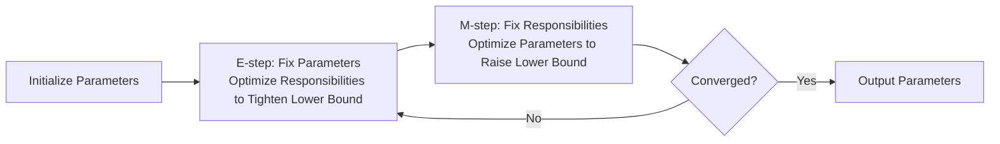

# EM Algorithm

Through the previous two chapters, we learned how to make predictions about new data based on prior probabilities by aggregating known samples, and how to infer the posterior probabilities of unknown variables given observed evidence. However, all of this is predicated on "having sufficient evidence (sample data)." In reality, not all data can be observed. Scenarios involving latent variables are everywhere. Imagine walking into a restaurant with three kitchens, all cooking at the same time, but you can only see the dishes that come out — you cannot tell which kitchen each dish came from. The dish itself is an observed variable, but "which kitchen this dish came from" is a latent variable: you cannot observe it directly, yet it does influence the data you see. Similar scenarios are common in machine learning. Beyond cases where variable values are simply missing in statistical analysis, in clustering problems the features of data points are observed, but "which cluster does this point belong to" is a latent variable. In mixture models, sample values are observed, but "which component distribution did this sample come from" is also a latent variable.

The obstacle posed by latent variables is that the likelihood function in [Maximum Likelihood Estimation](../../maths/probability/statistical-inference.md#maximum-likelihood-estimation) involves summation or integration over latent variables, and the missing data makes direct optimization difficult. The **EM Algorithm** (Expectation-Maximization Algorithm) is the classic method for tackling this dilemma. It alternates iteratively between an "Expectation" step and a "Maximization" step, gradually approaching the maximum likelihood solution.

## Expectation-Maximization Process

The name of the EM algorithm comes directly from the **Expectation-Maximization** process, which consists of two steps: the Expectation step (E-step) and the Maximization step (M-step).

Consider a concrete example. Suppose we collected exam scores from 100 students and observed that the score distribution has a "bimodal" shape — one group of students has scores clustered around 60, while another group is clustered around 85. Intuitively, these students may come from two different groups (for instance, two classes at different levels: an advanced class and a regular class). However, we do not know which class each student belongs to. In this scenario, the class a student belongs to is a latent variable. Through initial estimation (initial values guessed from experience), the advanced class has proportion $\pi_1=0.4$ and scores follow a normal distribution $\mathcal{N}(\mu_1=85, \sigma_1^2=25)$; the regular class has proportion $\pi_2=0.6$ and scores follow a normal distribution $\mathcal{N}(\mu_2=60, \sigma_2^2=36)$. Given a student with a score of $x=70$, what are the probabilities that this student belongs to the advanced class and the regular class, respectively?

This problem asks for the posterior probability that the student comes from the advanced or regular class given the observed score $x=70$. In the expectation-maximization process, this posterior is called the **Responsibility**. According to [Bayes' Theorem](../../maths/probability/probability-basics.md#bayes-theorem), the formula is:

$$\gamma_k = P(z_i=k | x = 70) = \frac{P(x_i | z_i = k) \cdot P(z_i = k)}{P(x_i)} = \frac{\pi_k \mathcal{N}(x | \mu_k, \sigma_k^2)}{\sum_{j=1}^{2} \pi_j \mathcal{N}(x | \mu_j, \sigma_j^2)}$$

Since the denominator is the same for both, comparing the probabilities simply requires computing the weighted probability of each class at $x=70$. According to the [Normal Distribution formula](../../maths/probability/probability-basics.md#normal-distribution), for the advanced class $\pi_1(0.4) \times \mathcal{N}(70|85, 25) \approx 0.000355$, for the regular class $\pi_2(0.6) \times \mathcal{N}(70|60, 36) \approx 0.00995$, and the total probability $P(x=70) = 0.01030$. Therefore, the probability that this student belongs to the advanced class is about 3.44%, and the probability of belonging to the regular class is about 96.56%. This calculation is the **E-step** of expectation-maximization: estimating the posterior probability of each sample belonging to each latent variable class given known model parameters.

After completing the E-step for all 100 exam scores, we have the responsibilities for each of the 100 students belonging to the advanced and regular classes. For example, Xiao Ming (score 70) has a 3.44% probability of belonging to the advanced class, while Xiao Hong (score 88) has about a 99.9% probability of belonging to the advanced class. The task of the **M-step** is to re-estimate the class proportions and the parameters of the two score distributions (proportions, means, and variances) based on these "soft assignment" values.

- **Updating the mean of the advanced class**: Suppose we list the responsibilities of all students. High-scoring students generally have high responsibilities (they "look like" they belong to the advanced class), while low-scoring students have low responsibilities. Now we need to recalculate the average score of the advanced class. In the traditional approach, computing the class average would mean picking out the students "definitely in the advanced class" and averaging their scores. But the essence of the EM algorithm is to avoid hard assignments (because every student has some probability of belonging to the advanced class) and instead let each student's contribution to the mean update be weighted by their probability of belonging to the advanced class. Think of this update as a tug-of-war: a student scoring 95 (excellent) with a responsibility of 0.97 pulls the mean toward higher scores with nearly full force; a student scoring 70 (average) with a responsibility of only 0.0344 applies only a small fraction of the effort, having a much smaller effect on the mean. Ultimately, the mean moves toward the high-scoring students with high responsibilities, without completely abandoning the medium-scoring students who might belong to the advanced class — after all, students like Xiao Ming still have a 3.44% chance of belonging to the advanced class and cannot be entirely ignored as if they were in the regular class. The mathematical expression for updating the mean is:

$$\mu_1^{new} = \frac{\sum_{i=1}^{n} \gamma_{i1} \cdot x_i}{\sum_{i=1}^{n} \gamma_{i1}}$$

- **Updating the variance of the advanced class**: Similarly, computing the variance does not simply look at how spread out the "advanced class students" are, but is instead weighted by responsibilities. A student with responsibility 0.9 who is far from the new mean will significantly increase the variance estimate; a student with responsibility 0.1, even if very far, contributes little to the variance of the advanced class. This ensures that the "shape" of the advanced class is determined mainly by students who "truly look like they belong to the advanced class," without being excessively disturbed by borderline suspicious samples. The mathematical expression for updating the variance is:

$$\sigma_1^{2,new} = \frac{\sum_{i=1}^{n} \gamma_{i1} \cdot (x_i - \mu_1^{new})^2}{\sum_{i=1}^{n} \gamma_{i1}}$$

- **Updating the mixing coefficient (class proportion)**: Finally, we need to determine the proportion of the advanced class in the overall statistical sample. Instead of counting how many students are "definitively" assigned to the advanced class, we sum the probabilities of all students belonging to the advanced class and divide by the total number of students. If the sum of responsibilities across 100 students is 38.5, then the mixing coefficient for the advanced class is 38.5%. This intuitively reflects the "effective number of students" in the advanced class.

After one round of the M-step, we obtain updated parameters for the advanced class: the mean may have shifted from 85 to 87 (because high-scoring students with high responsibilities pulled the average up), the variance may have narrowed slightly (by excluding some interference from medium scores), and the mixing coefficient has also adjusted from the initial 40% to a proportion that better fits the data. Next, we use this new set of parameters to recompute the responsibilities (back to the E-step), alternating iterations until the parameters stabilize and converge — that is, they stop changing. This is the complete meaning of expectation-maximization: maximizing the likelihood function to update parameters under the expected distribution of the latent variables. The complete expectation-maximization process is shown in the figure below.


*Figure: The expectation-maximization process*

Due to the subject matter, this section does not provide a rigorous derivation that the expectation-maximization process converges stably. A rigorous mathematical proof was first given in the 1977 paper "[Maximum Likelihood from Incomplete Data via the EM Algorithm](https://doi.org/10.1111/j.2517-6161.1977.tb01600.x)." Originally proposed as a technical method for handling missing data, it was later found to apply to a broader range of latent variable problems and has been adopted by clustering analysis, mixture models, hidden Markov models, and more. To this day, the paper has been cited over fifty thousand times, making it one of the most influential works in the fields of statistics and machine learning.

## Gaussian Mixture Model

The **Gaussian Mixture Model (GMM)** is a classic application of the EM algorithm, well-suited for characterizing "multimodal" data distributions using a mixture of multiple Gaussian distributions. Imagine you are a data analyst for a restaurant chain, collecting data on the distribution of customer dining times. You find that dining times exhibit a clear "trimodal" pattern: one group of customers (office workers) tends to dine in about 20 minutes, another group (family gatherings) in about 60 minutes, and yet another (business banquets) in about 120 minutes. This suggests that customers come from three different groups, but for privacy reasons you cannot directly ask each customer about their identity. This is a scenario well-suited for GMM-based data analysis.

GMM assumes that the data comes from a mixture of $K$ Gaussian distributions: $P(x) = \sum_{k=1}^{K} \pi_k \mathcal{N}(x | \mu_k, \Sigma_k)$. The meaning of this formula is:
- $\pi_k$: the mixing coefficient of the $k$-th component, representing "the proportion of data coming from the $k$-th Gaussian distribution," satisfying $\sum_k \pi_k = 1$
- $\mu_k$: the mean of the $k$-th Gaussian component, representing the "center position" of that component
- $\Sigma_k$: the covariance matrix of the $k$-th Gaussian component, representing the "shape and orientation" of that component
- $\mathcal{N}(x | \mu_k, \Sigma_k)$: the normal distribution density function with center $\mu_k$ and covariance $\Sigma_k$

The latent variable $z_i$ indicates which component the sample $x_i$ comes from (taking values $1, 2, \ldots, K$). By analogy: $z_i$ is like a customer's group label — we cannot see the label itself, but we can observe the dining time $x_i$, and the distribution of dining times is influenced by the group label. The following code implements a GMM and demonstrates clustering of data with 3 components using this model:

```python runnable extract-class="GaussianMixtureModel"
import numpy as np

class GaussianMixtureModel:
    """
    Gaussian Mixture Model implementation
    Solved using the EM algorithm
    """
    def __init__(self, n_components=3, max_iter=100, tol=1e-4):
        self.n_components = n_components
        self.max_iter = max_iter
        self.tol = tol  # convergence threshold
        
        self.weights_ = None   # mixing coefficients (K,)
        self.means_ = None     # means (K, n_features)
        self.covariances_ = None  # covariance matrices (K, n_features, n_features)
        self.log_likelihood_history_ = []
    
    def _initialize(self, X):
        """Initialize parameters"""
        n_samples, n_features = X.shape
        K = self.n_components
        
        # Randomly initialize means (select K points from the data)
        indices = np.random.choice(n_samples, K, replace=False)
        self.means_ = X[indices].copy()
        
        # Initialize covariances as the diagonal of the data covariance
        data_cov = np.cov(X.T)
        self.covariances_ = np.array([np.diag(np.diag(data_cov)) + 1e-6 * np.eye(n_features) 
                                       for _ in range(K)])
        
        # Initialize mixing coefficients to uniform distribution
        self.weights_ = np.ones(K) / K
    
    def _gaussian_pdf(self, X, mean, cov):
        """Compute multivariate Gaussian probability density"""
        n_features = X.shape[1]
        diff = X - mean
        
        # Add small value for numerical stability
        cov_reg = cov + 1e-6 * np.eye(n_features)
        
        # Use Cholesky decomposition to compute determinant and inverse
        try:
            L = np.linalg.cholesky(cov_reg)
            log_det = 2 * np.sum(np.log(np.diag(L)))
            diff_L = np.linalg.solve(L, diff.T).T
            mahalanobis = np.sum(diff_L ** 2, axis=1)
        except np.linalg.LinAlgError:
            # Fall back to standard method if Cholesky fails
            sign, log_det = np.linalg.slogdet(cov_reg)
            cov_inv = np.linalg.inv(cov_reg)
            mahalanobis = np.sum(diff @ cov_inv * diff, axis=1)
        
        log_prob = -0.5 * (n_features * np.log(2 * np.pi) + log_det + mahalanobis)
        return log_prob
    
    def _e_step(self, X):
        """E-step: compute responsibilities"""
        n_samples = X.shape[0]
        K = self.n_components
        
        # Compute log probability for each component
        log_probs = np.zeros((n_samples, K))
        for k in range(K):
            log_probs[:, k] = (np.log(self.weights_[k] + 1e-10) + 
                               self._gaussian_pdf(X, self.means_[k], self.covariances_[k]))
        
        # Compute log-likelihood
        log_likelihood = np.sum(np.log(np.sum(np.exp(log_probs), axis=1)))
        
        # Compute responsibilities (using log-sum-exp trick to avoid numerical underflow)
        log_max = log_probs.max(axis=1, keepdims=True)
        log_sum = np.log(np.sum(np.exp(log_probs - log_max), axis=1, keepdims=True)) + log_max
        responsibilities = np.exp(log_probs - log_sum)
        
        return responsibilities, log_likelihood
    
    def _m_step(self, X, responsibilities):
        """M-step: update parameters"""
        n_samples, n_features = X.shape
        K = self.n_components
        
        # Compute effective number of samples for each component
        N_k = responsibilities.sum(axis=0) + 1e-10
        
        # Update mixing coefficients
        self.weights_ = N_k / n_samples
        
        # Update means
        self.means_ = (responsibilities.T @ X) / N_k[:, np.newaxis]
        
        # Update covariances
        for k in range(K):
            diff = X - self.means_[k]
            weighted_diff = responsibilities[:, k:k+1] * diff
            self.covariances_[k] = (weighted_diff.T @ diff) / N_k[k]
            # Add regularization
            self.covariances_[k] += 1e-6 * np.eye(n_features)
    
    def fit(self, X):
        """Train the model"""
        self._initialize(X)
        self.log_likelihood_history_ = []
        
        prev_log_likelihood = -np.inf
        
        for iteration in range(self.max_iter):
            # E-step
            responsibilities, log_likelihood = self._e_step(X)
            self.log_likelihood_history_.append(log_likelihood)
            
            # Check convergence
            if abs(log_likelihood - prev_log_likelihood) < self.tol:
                print(f"EM converged at iteration {iteration}")
                break
            
            # M-step
            self._m_step(X, responsibilities)
            
            prev_log_likelihood = log_likelihood
        
        return self
    
    def predict(self, X):
        """Predict cluster labels"""
        responsibilities, _ = self._e_step(X)
        return np.argmax(responsibilities, axis=1)
    
    def predict_proba(self, X):
        """Predict probabilities of belonging to each component"""
        responsibilities, _ = self._e_step(X)
        return responsibilities
    
    def score(self, X):
        """Compute log-likelihood"""
        _, log_likelihood = self._e_step(X)
        return log_likelihood


# Generate data from 3 Gaussian distributions
n_samples = 300
true_means = np.array([[0, 0], [3, 3], [0, 4]])
true_covs = np.array([
    [[1, 0.3], [0.3, 1]],
    [[0.5, 0], [0, 0.5]],
    [[1, -0.5], [-0.5, 1]]
])

X = []
for i in range(3):
    samples = np.random.multivariate_normal(true_means[i], true_covs[i], 100)
    X.append(samples)
X = np.vstack(X)

# Shuffle data
np.random.shuffle(X)

# Train GMM
gmm = GaussianMixtureModel(n_components=3, max_iter=100)
gmm.fit(X)

import matplotlib.pyplot as plt

# Predict
labels = gmm.predict(X)

# Create visualization
fig, axes = plt.subplots(1, 2, figsize=(14, 5))

# Left: GMM clustering results
ax1 = axes[0]
colors = ['#FF6B6B', '#4ECDC4', '#45B7D1']
for k in range(3):
    cluster_points = X[labels == k]
    ax1.scatter(cluster_points[:, 0], cluster_points[:, 1],
                c=colors[k], label=f'Component {k}', alpha=0.6, s=50)

# Mark estimated means
ax1.scatter(gmm.means_[:, 0], gmm.means_[:, 1],
            c='black', marker='x', s=200, linewidths=3,
            label='Estimated Means', zorder=5)

ax1.set_xlabel('X1', fontsize=12)
ax1.set_ylabel('X2', fontsize=12)
ax1.set_title(f'GMM Clustering Results (n_components=3)', fontsize=13)
ax1.legend(loc='upper left', fontsize=9)
ax1.grid(True, alpha=0.3)
ax1.set_aspect('equal', adjustable='box')

# Right: log-likelihood convergence curve
ax2 = axes[1]
iterations = range(len(gmm.log_likelihood_history_))
ax2.plot(iterations, gmm.log_likelihood_history_,
         'b-', linewidth=2, marker='o', markersize=4)
ax2.set_xlabel('Iteration', fontsize=12)
ax2.set_ylabel('Log-Likelihood', fontsize=12)
ax2.set_title('EM Algorithm Convergence', fontsize=13)
ax2.grid(True, alpha=0.3)

# Add convergence info text
converge_text = f'Final log-likelihood: {gmm.log_likelihood_history_[-1]:.2f}\n'
converge_text += f'Iterations: {len(gmm.log_likelihood_history_)}'
ax2.text(0.98, 0.05, converge_text, transform=ax2.transAxes,
         fontsize=10, verticalalignment='bottom', horizontalalignment='right',
         bbox=dict(boxstyle='round', facecolor='wheat', alpha=0.5))

plt.tight_layout()
plt.savefig('gmm_clustering.png', dpi=150, bbox_inches='tight')
plt.show()

# Print clustering results
print("=== GMM Clustering Results ===")
print(f"Converged log-likelihood: {gmm.log_likelihood_history_[-1]:.2f}")
print("Estimated means:")
for k, mean in enumerate(gmm.means_):
    print(f"  Component {k}: {mean}")
print(f"\nEstimated mixing coefficients: {gmm.weights_}")
print(f"\nSample counts per component: {[np.sum(labels == k) for k in range(3)]}")
```

## Summary

The EM algorithm demonstrates an elegant process of probabilistic modeling. When faced with unobservable variables, it gradually approaches the truth through alternating iterations of the E-step and M-step, maintaining respect for uncertainty at every step. This philosophy of characterizing the unknown with probability distributions rather than deterministic values is an important concept in modern machine learning. From Bayesian methods to variational inference to deep generative models, the influence of the EM idea can be seen everywhere. For instance, the [Variational Autoencoder](../../deep-learning/generative-models/vae.md) (VAE) in the field of video generation is a typical example. VAE introduces variational inference into neural network architectures: the encoder network parameterizes the posterior distribution of the latent variables (similar to the E-step), and the decoder network parameterizes the generative distribution of the observed variables (similar to the M-step). Understanding the EM algorithm makes it easy to understand why VAE requires a "reconstruction loss" and "KL divergence."

## Exercises

1. For a one-dimensional Gaussian mixture model with two components, the parameters are $\pi_1=0.3, \mu_1=0, \sigma_1^2=1$ and $\pi_2=0.7, \mu_2=5, \sigma_2^2=2$. Given an observation $x=2$, compute the responsibilities $\gamma_1$ and $\gamma_2$ of the sample belonging to the two components.
    <details>
    <summary>Reference Answer</summary>

    The formula for responsibility is:

    $$\gamma_k = \frac{\pi_k \mathcal{N}(x | \mu_k, \sigma_k^2)}{\sum_{j=1}^{2} \pi_j \mathcal{N}(x | \mu_j, \sigma_j^2)}$$

    First, compute the Gaussian densities for the two components:

    $$\mathcal{N}(x=2 | \mu_1=0, \sigma_1^2=1) = \frac{1}{\sqrt{2\pi}} \exp\left(-\frac{(2-0)^2}{2}\right) = \frac{1}{\sqrt{2\pi}} e^{-2} \approx 0.0540$$

    $$\mathcal{N}(x=2 | \mu_2=5, \sigma_2^2=2) = \frac{1}{\sqrt{4\pi}} \exp\left(-\frac{(2-5)^2}{4}\right) = \frac{1}{\sqrt{4\pi}} e^{-2.25} \approx 0.0297$$

    Weighted values:
    - Component 1: $\pi_1 \times \mathcal{N}_1 = 0.3 \times 0.0540 = 0.01620$
    - Component 2: $\pi_2 \times \mathcal{N}_2 = 0.7 \times 0.0297 = 0.02082$

    Total probability: $P(x) \approx 0.01620 + 0.02082 = 0.03702$

    Responsibilities:
    - $\gamma_1 = 0.01620 / 0.03702 \approx 0.4376$
    - $\gamma_2 = 0.02082 / 0.03702 \approx 0.5624$

    **Conclusion**: The observation $x=2$ has approximately a 43.76% probability of coming from component 1 (near mean 0) and approximately a 56.24% probability of coming from component 2 (near mean 5). This result is intuitive: although $x=2$ is closer to $\mu_1=0$ (distance 2 vs. distance 3), component 2 has a larger mixing coefficient (0.7 vs. 0.3).
    </details>
