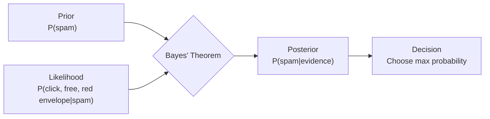
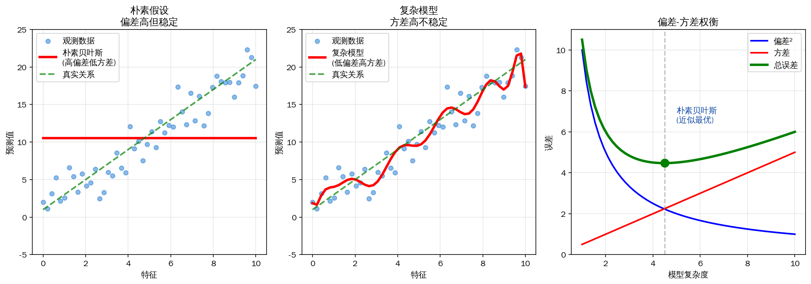

# Naive Bayes

In the 18th century, the English clergyman Thomas Bayes, while studying the philosophical question of "how to infer unknown causes from observed results," wrote down a seemingly simple formula: $P(A|B) = \frac{P(B|A) \cdot P(A)}{P(B)}$. This formula encapsulates a philosophical idea: when we obtain new evidence, how should we update our understanding of the world? More than two hundred years later, this formula has become an important tool in modern statistics, machine learning, and even artificial intelligence, with such profound influence that people named an entire school of thought after him — the Bayesian school.

In the probability and statistics series, we have already studied the mathematical form of [Bayes' Theorem](../../maths/probability/probability-basics.md#bayes-theorem). But how do we transform this philosophical idea into a practical computer tool? **Naive Bayes** provides the simplest answer. It uses a "naive" assumption (that features are mutually independent) to bring Bayes' Theorem from the halls of theory into engineering practice, becoming one of the oldest yet most practical classification algorithms in machine learning.

## Bayesian Classification

From a Bayesian perspective, the classification task is to calculate the probability of belonging to each class given a set of features, and select the class with the highest probability. This definition is not as obvious as it might seem; it suggests that classification is no longer about finding a hard decision boundary, but about calculating probabilities, comparing probabilities, and making decisions. This way of thinking is strikingly similar to human decision-making processes — when we judge whether an email is spam, we do not rely on a fixed threshold criterion; rather, our brains continuously weigh evidence, calculate possibilities, and make judgments.

Let's start with a concrete example. Suppose we receive an email with the content "Click the link to claim your free red envelope." How do we determine whether it is spam? Intuitively, we focus on several keywords: "click the link," "free," "red envelope" — these words appear frequently in spam and rarely in normal emails. Bayes' Theorem tells us how to quantify these intuitions:

$$P(\text{spam}|\text{click}, \text{free}, \text{red envelope}) = \frac{P(\text{click}, \text{free}, \text{red envelope}|\text{spam}) \cdot P(\text{spam})}{P(\text{click}, \text{free}, \text{red envelope})}$$

This formula transforms the human empirical judgment of whether an email is spam into a quantitative calculation that can be performed through sample statistics: knowing the probability $P(\text{click}, \text{free}, \text{red envelope}|\text{spam})$ of "click, free, red envelope" appearing in spam, and the prior probability $P(\text{spam})$ that an email is indeed spam.

Generalizing to the general case, given a feature vector $X = (x_1, x_2, \ldots, x_d)$, we want to predict the class $y$. According to Bayes' Theorem $P(y|X) = \frac{P(X|y) \cdot P(y)}{P(X)}$, we only need to compute the likelihood and prior probability for each class (since the denominator $P(X)$ does not contain $y$ and is the same for all classes, it can be ignored).



*Figure: Decision process of Bayesian classification: updating beliefs with evidence*

However, computing the joint probability $P(\text{click}, \text{free}, \text{red envelope}|\text{spam})$ is extremely difficult. Words in language are not independent — "free" often appears with "claim," "click" often appears with "link" — so the joint probability cannot simply be multiplied together; the combination "click + free + red envelope" must be directly counted from samples. This requires counting the number of times these three words appear together in spam. The vocabulary may contain tens of thousands of words, and the probability table for three-word combinations would contain trillions of possibilities. The sample size needed to directly estimate the joint probability of three words from data would be astronomical.

### The Naive Assumption

As the example shows, if each feature has $v$ possible values, we would need to estimate $v^d$ probability values, which becomes infeasible as the feature dimension increases. Faced with this dilemma, Naive Bayes makes an assumption that seems contrary to reality yet is extremely practical: it assumes that given the class $y$, each feature is conditionally independent, so the joint probability can be taken as the product of individual probabilities:

$$P(X|y=c) = \prod_{j=1}^{d} P(x_j | y=c)$$

This assumption reduces the complexity of estimating the joint probability from $v^d$ to $d \times v$, making probability estimation in high-dimensional problems feasible. Returning to the spam classification example, we no longer need to count how many times "click," "free," and "red envelope" appear together; we only need to separately count how many times "click" appears in spam, how many times "free" appears in spam, and how many times "red envelope" appears in spam, then multiply them together.

This assumption is called **Naive** precisely because it deviates significantly from reality — correlations between features are ubiquitous in the real world. Yet Naive Bayes stubbornly assumes they are independent, which is like assuming a person's height and weight are unrelated — it sounds absurd. Nevertheless, this "absurd" assumption has repeatedly succeeded, and the reasons lie in the nature of classification tasks:

1. **Classification only cares about relative magnitudes**: The probability estimates of Naive Bayes may be inaccurate, but as long as the relative ordering of classes is correct, the classification result is correct. Suppose the posterior probability of spam is underestimated as 0.4 and that of normal email as 0.35 — both are imprecise, but the ordering $0.4 > 0.35$ is correct, and the classification result is "spam," which happens to be the correct answer.

2. **Simplified decision boundary**: After taking the logarithm, the decision rule of Naive Bayes becomes a linear form, revealing that Naive Bayes is essentially a **linear classifier**. The decision boundary is determined by a linear combination of log-probability ratios. Although linear classifiers are limited in expressive power, they are sufficient for many practical problems.

3. **Bias-variance trade-off**: The naive assumption introduces bias: probability estimates become inaccurate; but it also greatly reduces variance: probability estimates become more stable. In small-sample scenarios, the estimates of high-variance models fluctuate wildly, and the "biased but stable" nature of Naive Bayes becomes an advantage instead. This is like measuring with a rough ruler — while each measurement has errors, the errors are consistent in direction, making the results relatively reliable after repeated measurements.



*Figure: Bias-variance trade-off: the cost of stability from the naive assumption*

These three properties together point to an insight: a model's assumptions do not need to be absolutely accurate — they only need to be good enough. Naive Bayes trades the simplest assumptions for the most practical results, and this is the essence of engineering thinking: not the pursuit of perfection, but the pursuit of effectiveness.

## Naive Bayes Classifier

Starting from Bayes' Theorem and substituting the naive assumption, we obtain the decision rule formula of the Naive Bayes classifier:

$$\hat{y} = \arg\max_c \left[ P(y=c) \prod_{j=1}^{d} P(x_j | y=c) \right]$$

In practice, multiplying many small probabilities can lead to numerical underflow. When the vocabulary is large, multiplying several 0.001 values can yield extremely small values like $10^{-60}$, which computers cannot store precisely. Taking logarithms converts multiplication into addition, avoiding numerical issues, resulting in:

$$\hat{y} = \arg\max_c \left[ \log P(y=c) + \sum_{j=1}^{d} \log P(x_j | y=c) \right]$$

This formula illustrates the computational process of Naive Bayes, which includes the following three steps:

1. **Prior probability $\log P(y=c)$**: The proportion of class $c$ in the training set. If the training set has 1000 emails, 300 of which are spam, then $P(\text{spam}) = 0.3$.
2. **Conditional probability $\log P(x_j | y=c)$**: The probability of feature $x_j$ appearing in class $c$. If 200 out of 300 spam emails contain "free," then $P(\text{free}|\text{spam}) = 200/300 \approx 0.67$.
3. **Summation**: Add the log probabilities of each feature to obtain a score for each class, and select the class with the highest score.

Looking at the decision formula of Naive Bayes, it is easy to spot a critical problem caused by probability multiplication: if a feature value has never appeared in the training samples of class $c$, then $P(x_j|y=c)=0$, causing the entire probability product to become zero. For example, if none of the normal emails in the training set contain the word "loan," and a new email contains "loan," then $P(\text{loan}|\text{normal}) = 0$. Even if all other words in the email point to normal email (such as "meeting," "report"), the entire probability product is zero, and Naive Bayes would incorrectly classify it as spam.

The solution to this problem is to add a small constant $\alpha$ to each count, ensuring all probability values are greater than zero. This is like giving each candidate one default vote in an election system — even if a candidate has never received any votes from voters, there will not be an extreme case of zero votes. This operation is called **Laplace Smoothing**, mathematically expressed as $P(x_j | y=c) = \frac{N_{jc} + \alpha}{N_c + \alpha \cdot V}$, where $N_{jc}$ is the total frequency (sum of counts) of feature $j$ in class $c$, $N_c$ is the total count of all features in class $c$, $\alpha$ is the smoothing parameter (usually 1), and $V$ is the total number of features.

## Discrete Naive Bayes in Practice

Discrete Naive Bayes is suitable for scenarios where features are discrete values (such as word frequencies, class labels). The most typical application is text classification, such as spam filtering, news categorization, sentiment analysis, and so on. The following code implements a Multinomial Naive Bayes classifier, demonstrating the complete process of learning the relationship between word frequency features and classes from training data, computing prior probabilities and conditional probabilities, and finally classifying and predicting new documents. The example uses 5 word features to train on 6 documents and predict 3 test documents, and visualizes the conditional probability distribution of words under each class and the classification scores of test documents.

From the visualization charts after execution, it is clear that in the positive class, words like "good" and "like" have high conditional probabilities, while in the negative class, words like "bad" and "dislike" have high conditional probabilities. This is the pattern that Naive Bayes "learns": through simple counting statistics, it grasps the key words that distinguish positive from negative.

```python runnable extract-class="MultinomialNaiveBayes"
import numpy as np

class MultinomialNaiveBayes:
    """
    Multinomial Naive Bayes implementation
    Suitable for discrete features (e.g., text word frequencies)
    """
    
    def __init__(self, alpha=1.0):
        """
        Parameters:
        alpha : float, Laplace smoothing parameter
        """
        self.alpha = alpha  # Laplace smoothing
        self.class_prior_ = None  # P(y)
        self.feature_prob_ = None  # P(x|y)
        self.classes_ = None
    
    def fit(self, X, y):
        """
        Train the model
        
        Parameters:
        X : ndarray, shape (n_samples, n_features)
            Feature matrix (word frequency/count)
        y : ndarray, shape (n_samples,)
            Class labels
        """
        n_samples, n_features = X.shape
        self.classes_ = np.unique(y)
        n_classes = len(self.classes_)
        
        # Compute prior probability P(y)
        class_counts = np.array([np.sum(y == c) for c in self.classes_])
        self.class_prior_ = class_counts / n_samples
        
        # Compute conditional probability P(x|y)
        # For each class, compute the total count of each feature in documents of that class
        self.feature_prob_ = np.zeros((n_classes, n_features))
        
        for i, c in enumerate(self.classes_):
            # Get all samples of class c
            X_c = X[y == c]
            # Total count of each feature in this class + smoothing
            feature_counts = X_c.sum(axis=0) + self.alpha
            # Normalize to get conditional probabilities
            total_count = feature_counts.sum()
            self.feature_prob_[i] = feature_counts / total_count
        
        return self
    
    def predict_log_proba(self, X):
        """
        Compute log probabilities
        """
        # log P(y) + sum(log P(x|y))
        log_prior = np.log(self.class_prior_)
        log_likelihood = X @ np.log(self.feature_prob_.T)  # (n_samples, n_classes)
        return log_prior + log_likelihood
    
    def predict(self, X):
        """
        Predict class labels
        """
        log_proba = self.predict_log_proba(X)
        return self.classes_[np.argmax(log_proba, axis=1)]
    
    def score(self, X, y):
        """Compute accuracy"""
        y_pred = self.predict(X)
        return np.mean(y_pred == y)


# Simulate word frequency data (5 words, 6 documents)
# Features: ["good", "bad", "like", "dislike", "average"]
X_train = np.array([
    [3, 0, 2, 0, 1],  # Document 1: more positive words -> positive
    [2, 1, 1, 0, 1],  # Document 2: slightly positive
    [4, 0, 3, 0, 0],  # Document 3: clearly positive
    [0, 3, 0, 2, 1],  # Document 4: more negative words -> negative
    [1, 2, 0, 1, 2],  # Document 5: slightly negative
    [0, 4, 0, 3, 0],  # Document 6: clearly negative
])
y_train = np.array(['positive', 'positive', 'positive', 'negative', 'negative', 'negative'])

# Train the model
model = MultinomialNaiveBayes(alpha=1.0)
model.fit(X_train, y_train)

print("=== Naive Bayes Text Classification ===")
print(f"Classes: {model.classes_}")
print(f"Prior probabilities: {dict(zip(model.classes_, model.class_prior_))}")
print(f"\nConditional probabilities of each feature per class:")
vocab = ["good", "bad", "like", "dislike", "average"]
for i, c in enumerate(model.classes_):
    print(f"  {c} class: {dict(zip(vocab, model.feature_prob_[i].round(3)))}")

# Predict new documents
X_test = np.array([
    [2, 0, 1, 0, 0],  # Clearly positive
    [0, 2, 0, 2, 0],  # Clearly negative
    [1, 1, 1, 1, 1],  # Neutral
])
y_pred = model.predict(X_test)
print(f"\nTest document predictions: {y_pred}")

# Output log probabilities
log_proba = model.predict_log_proba(X_test)
print(f"Log probabilities:")
for i, pred in enumerate(y_pred):
    print(f"  Document {i+1}: positive={log_proba[i,0]:.2f}, negative={log_proba[i,1]:.2f} -> {pred}")

# Visualization: comparison of feature probabilities across classes
import matplotlib.pyplot as plt

fig, axes = plt.subplots(1, 2, figsize=(12, 5))

# Left: conditional probability of each word per class
x_pos = np.arange(len(vocab))
width = 0.35

probs_positive = model.feature_prob_[0]  # Positive class
probs_negative = model.feature_prob_[1]  # Negative class

axes[0].bar(x_pos - width/2, probs_positive, width, label='Positive', color='green', alpha=0.7)
axes[0].bar(x_pos + width/2, probs_negative, width, label='Negative', color='red', alpha=0.7)
axes[0].set_xlabel('Words')
axes[0].set_ylabel('Conditional Probability P(word|class)')
axes[0].set_title('Conditional Probability Distribution of Words per Class')
axes[0].set_xticks(x_pos)
axes[0].set_xticklabels(vocab)
axes[0].legend()
axes[0].grid(True, alpha=0.3)

# Right: log probability scores of test documents
test_labels = ['Clearly Positive', 'Clearly Negative', 'Neutral']
x_pos_test = np.arange(len(test_labels))  # x positions for test documents (3)
axes[1].bar(x_pos_test - width/2, log_proba[:, 0], width, label='Positive Score', color='green', alpha=0.7)
axes[1].bar(x_pos_test + width/2, log_proba[:, 1], width, label='Negative Score', color='red', alpha=0.7)
axes[1].set_xlabel('Test Documents')
axes[1].set_ylabel('Log Probability Score')
axes[1].set_title('Comparison of Test Document Classification Scores')
axes[1].set_xticks(x_pos_test)
axes[1].set_xticklabels(test_labels)
axes[1].legend()
axes[1].grid(True, alpha=0.3)

# Annotate prediction results
for i, pred in enumerate(y_pred):
    axes[1].annotate(f'Prediction: {pred}', 
                     xy=(i, log_proba[i, 0 if pred == 'positive' else 1]),
                     xytext=(0, 10), textcoords='offset points',
                     ha='center', fontsize=10, color='black')

plt.tight_layout()
plt.show()
plt.close()
```

## Summary

The value of Naive Bayes is not limited to what problems it can directly solve; rather, it demonstrates a paradigm of probabilistic machine learning: first assume the probability distribution structure of the data, then estimate the distribution parameters from the data, and finally use probability rules to make decisions. This paradigm runs throughout the field of Bayesian machine learning, including [Bayesian Networks](bayesian-network.md), Hidden Markov Models, Probabilistic Graphical Models, and more. Understanding Naive Bayes is understanding the starting point of probabilistic machine learning.

## Exercises

1. Given training data: 60 spam emails and 40 normal emails. The word "free" appears 30 times in spam and 5 times in normal emails. Compute: (a) The prior probability of spam; (b) The conditional probability of "free" in spam and normal emails; (c) If an email contains "free," use Naive Bayes to determine whether it is spam.
    <details>
    <summary>Answer</summary>
    
    **(a) Prior probability**:
    $$P(\text{spam}) = \frac{60}{60+40} = 0.6$$
    $$P(\text{normal}) = \frac{40}{60+40} = 0.4$$
    
    **(b) Conditional probability** (assuming vocabulary size is 100, using Laplace smoothing $\alpha=1$):
    
    The total word count of spam is unknown. Assuming an average of 50 words per email, the total word count of spam is approximately $60 \times 50 = 3000$.
    
    $$P(\text{free}|\text{spam}) = \frac{30 + 1}{3000 + 100} \approx 0.01$$
    $$P(\text{free}|\text{normal}) = \frac{5 + 1}{2000 + 100} \approx 0.0029$$
    
    (In actual computation, the total word count should be obtained from data statistics; these are assumed values for illustration)
    
    **(c) Classification judgment**:
    
    Compute the posterior probability of "free" appearing in spam and normal emails (ignoring the denominator):
    
    $$\text{Spam score} = \log P(\text{spam}) + \log P(\text{free}|\text{spam}) = \log 0.6 + \log 0.0103 \approx -0.51 - 4.57 = -5.08$$
    
    $$\text{Normal score} = \log P(\text{normal}) + \log P(\text{free}|\text{normal}) = \log 0.4 + \log 0.0029 \approx -0.92 - 5.84 = -6.76$$
    
    The spam score $(-5.08) >$ normal score $(-6.76)$, therefore it is classified as **spam**.
    
    This aligns with intuition: although "free" also appears in normal emails, it appears more frequently in spam, so upon seeing "free," the email is more likely to be spam.
    </details>

2. Implement a spam classifier in code with the following training data:
    - Spam (3 emails): ["免费中奖 点击领取", "限时优惠 买一送一", "贷款审批 即刻放款"]
    - Normal (3 emails): ["明天开会 请准时", "项目报告 请查收", "周末聚餐 时间确认"]
    
    Predict the class of the following email: "免费开会 贷款审批". Analyze why this prediction might be inaccurate.
    <details>
    <summary>Answer</summary>
    
    ```python runnable
    import numpy as np
    
    # Use the previously defined MultinomialNaiveBayes class
    from shared.linear.naive_bayes import MultinomialNaiveBayes
    
    # Build vocabulary
    spam_emails = ["免费中奖 点击领取", "限时优惠 买一送一", "贷款审批 即刻放款"]
    normal_emails = ["明天开会 请准时", "项目报告 请查收", "周末聚餐 时间确认"]
    
    all_emails = spam_emails + normal_emails
    vocab = set()
    for email in all_emails:
        vocab.update(email.split())
    vocab = sorted(vocab)
    word_to_idx = {w: i for i, w in enumerate(vocab)}
    
    print(f"Vocabulary: {vocab}")
    
    # Build word frequency matrix
    def email_to_vector(email):
        vec = np.zeros(len(vocab))
        for word in email.split():
            if word in word_to_idx:
                vec[word_to_idx[word]] += 1
        return vec
    
    X_train = np.array([email_to_vector(email) for email in all_emails])
    y_train = np.array(['spam'] * 3 + ['normal'] * 3)
    
    # Train the model
    model = MultinomialNaiveBayes(alpha=1.0)
    model.fit(X_train, y_train)
    
    print(f"\nPrior probabilities: {dict(zip(model.classes_, model.class_prior_))}")
    
    # Prediction
    test_email = "免费开会 贷款审批"
    X_test = email_to_vector(test_email).reshape(1, -1)
    prediction = model.predict(X_test)[0]
    
    print(f"\nTest email: '{test_email}'")
    print(f"Predicted class: {prediction}")
    
    # Analyze prediction
    log_proba = model.predict_log_proba(X_test)[0]
    print(f"Spam score: {log_proba[0]:.2f}")
    print(f"Normal score: {log_proba[1]:.2f}")
    
    # View conditional probabilities of each word
    print("\nConditional probabilities of each word in both classes:")
    test_words = test_email.split()
    for word in test_words:
        if word in word_to_idx:
            idx = word_to_idx[word]
            print(f"  '{word}': P(spam)={model.feature_prob_[0, idx]:.3f}, P(normal)={model.feature_prob_[1, idx]:.3f}")
    ```
    
    **Prediction Analysis**:
    
    "免费" and "贷款审批" appear in spam, leaning toward spam classification; "开会" appears in normal emails, leaning toward normal classification. Naive Bayes will combine these tendencies and select the class with the highest score.
    
    **Possible reasons for inaccuracy**:
    
    1. **Lexical ambiguity**: "开会" appears in normal emails, but "免费开会" could be a coincidental combination of "免费" from spam and "开会" from normal emails. Naive Bayes assumes independence and cannot capture the special meaning of the combination "免费开会" (which might be a legitimate meeting invitation rather than spam).
    
    2. **Feature correlation ignored**: "免费" and "贷款" often appear together in spam, indicating some form of promotional behavior; however, Naive Bayes treats them as independent and cannot leverage this synergistic information.
    
    3. **Insufficient training data**: The training set of only 6 emails is too small, making estimates of conditional probabilities for words unstable and easily influenced by individual samples.
    
    This illustrates the limitations of Naive Bayes: simple assumptions bring computational efficiency but also sacrifice the ability to understand complex contextual semantics.
    </details>
