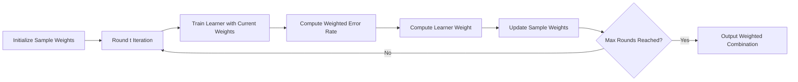

# Boosting

If the [Random Forest](random-forest.md) algorithm represents the idea that "collective wisdom outperforms individual judgment" in ensemble learning, then Boosting is the classic example of "accumulating weakness into strength, gathering sand into a tower." This learning algorithm, proposed in 1995 by Israeli computer scientist Yoav Freund and American computer scientist Robert Schapire, advocates breaking a difficult problem into several simple problems, each requiring only a weak learner that is "slightly better than random guessing," then combining multiple "weak learners" into a "strong learner" to progressively solve the difficult problem.

## The Boosting Idea

Before the emergence of boosting algorithms, the mainstream approach in ensemble learning was the [Bagging Idea](random-forest.md#bagging), which adopted a parallel approach where each decision tree was trained independently in parallel. The Boosting idea offered a completely different path, adopting a sequential approach where each new tree focuses on correcting the cumulative errors of all previous trees, gradually improving performance, and ultimately achieving a substantial performance boost through a carefully designed weighted combination. This relay-style error correction allows each learner to focus on what it does best, eventually turning small wins into major victories.

For Boosting to enable each subsequent learner to improve upon the cumulative effect of all previous learners, each weak learner must first have a way to know on which samples the combination of previous learners made mistakes. Boosting introduces two mechanisms — weighted training and sequential learning — to achieve this.

- **Weighted Training**: Adjusts sample weights to focus on difficult samples. For samples misclassified by the previous learner, their weights are increased so subsequent learners pay more attention to them; for correctly classified samples, their weights are decreased to reduce attention.
- **Sequential Learning**: Learners are trained in order, with each new learner optimizing based on the performance of the previous one. Learner weights are calculated to determine their say in the final combination — learners that perform well receive higher voting weights.

The Boosting algorithm consists of two phases: training and prediction. The training phase starts with uniform initial weights. It first trains a weak learner using the current sample weights, then computes the weighted error rate of that learner. Based on the error rate, the learner's weight is reassigned (the lower the error rate, the higher the weight), and sample weights are updated (weights of misclassified samples increase, while those of correctly classified samples decrease). In the prediction phase, for a new sample, all weak learners make individual predictions, and the results are combined via weighted voting to produce the final output. The entire training process is illustrated below:


*Figure: Flow of the Boosting algorithm*

Bagging reduces variance through parallel ensembles, while the effectiveness of Boosting stems from **bias reduction**. Suppose a single weak learner has bias $b$; after $T$ rounds of iterations, where each weak learner corrects a portion of the error, the bias of the final model is gradually reduced. Mathematically, if each weak learner has an error rate $\epsilon < 0.5$ (just better than random guessing), Boosting can reduce the final error rate exponentially close to zero. Of course, in practice, this comes with a significant risk of overfitting.

## AdaBoost Algorithm

The Boosting idea is only qualitative — for practical applications, a concrete operational framework is needed to quantify and execute it. For instance, how should sample weights be adjusted? How should learner weights be calculated? How should each learner's contribution be allocated in the final combination? **AdaBoost** (Adaptive Boosting) was the first algorithm to provide a complete mathematical framework for Boosting.

Consider a concrete binary classification scenario: suppose we have 5 training samples with labels $y \in \{-1, +1\}$ (-1 for negative class, +1 for positive class). Initially, all sample weights are equal, with each sample having weight $w_i = 1/5 = 0.2$.

| Sample | Feature $x$ | Label $y$ | Initial Weight $w$ |
|:------:|:-----------:|:---------:|:------------------:|
| 1 | 0.1 | +1 | 0.2 |
| 2 | 0.3 | +1 | 0.2 |
| 3 | 0.5 | -1 | 0.2 |
| 4 | 0.7 | -1 | 0.2 |
| 5 | 0.9 | +1 | 0.2 |

Starting from the initial weights, each iteration (denoted as round $t$) consists of the following four steps:

- Step 1 **Train a Weak Learner**: Train learner $h_t$ with the current weights $w^{(t)}$. The learner can be very weak, only required to be slightly better than random guessing, such as a **Decision Stump** — a decision tree with only one level, which splits based on a single threshold of a single feature.
- Step 2 **Compute Weighted Error Rate**: Error rate $\epsilon_t = \frac{\sum_{i=1}^{n} w_i^{(t)} \cdot \mathbb{I}[h_t(x_i) \neq y_i]}{\sum_{i=1}^{n} w_i^{(t)}}$. Here $w_i^{(t)}$ is the weight of sample $i$ in round $t$ — the higher the weight, the more say that sample has in the error rate computation; $\mathbb{I}[h_t(x_i) \neq y_i]$ is an indicator function that takes the value 1 when the prediction is wrong and 0 when it is correct. The numerator sums the weights of all misclassified samples, giving the weighted total error, while the denominator sums all sample weights for normalization. This formula essentially computes the weight proportion of misclassified samples — if the misclassified samples all have high weights, the error rate is high; if they have low weights, the error rate is low.

    Using the 5-sample example from earlier, suppose in the first round the learner misclassifies samples 3 and 5: $\epsilon_1 = \frac{0.2 + 0.2}{0.2 + 0.2 + 0.2 + 0.2 + 0.2} = \frac{0.4}{1.0} = 0.4$. This means the current learner's weighted error rate is 40%.

- Step 3 **Compute Learner Weight**: Learner weight $\alpha_t = \frac{1}{2} \ln \frac{1 - \epsilon_t}{\epsilon_t}$. This formula determines the current learner's say in the final combination. Here $\epsilon_t$ is the learner's error rate — the lower the error rate, the smaller the denominator and the larger $\alpha_t$; $\frac{1 - \epsilon_t}{\epsilon_t}$ is the ratio of correct to incorrect classifications — the larger this ratio, the more reliable the learner; $\ln$ is the natural logarithm, which converts the ratio into a weight, ensuring that the weight increases as the error rate decreases, with more significant growth when the error rate is very low; $\frac{1}{2}$ is a scaling factor that controls the range of weights. The overall formula can be understood as giving better-performing learners more voting power — the lower the error rate, the greater the weight.

    Plugging $\epsilon_1 = 0.4$ into the example, we get $\alpha_1 = \frac{1}{2} \ln \frac{0.6}{0.4} = \frac{1}{2} \ln 1.5 \approx 0.2027$. This learner weight is about 0.2, meaning it contributes approximately 0.2 votes in the final voting. If the error rate were 0.5 (random guessing level), $\alpha_t$ would be exactly 0, and such a learner would not participate in voting since it provides no useful information.

- Step 4 **Update Sample Weights**: Weight $w_i^{(t+1)} = w_i^{(t)} \cdot \exp(-\alpha_t y_i h_t(x_i))$. This formula acts as a "magnifying glass," using weight adjustments to focus subsequent learners on misclassified samples. $y_i h_t(x_i)$ is an indicator of prediction correctness — when the prediction is correct, $y_i$ and $h_t(x_i)$ have the same sign and the product is +1; when incorrect, the product is -1. $\exp(-\alpha_t \cdot \text{product})$ is the weight adjustment factor, leveraging the exponential function's growth properties: if the prediction is correct (product = +1), the weight is multiplied by $\exp(-\alpha_t) < 1$, decreasing the weight; if the prediction is incorrect (product = -1), the weight is multiplied by $\exp(\alpha_t) > 1$, increasing the weight. The overall formula brings misclassified samples to the surface while letting correctly classified ones sink.

    Plugging $\alpha_1 = 0.2027$ into the example, samples 3 and 5 are misclassified ($y_i h_t(x_i) = -1$), while the other samples are correctly classified:

    - Samples 1, 2, 4 (correct): $w_i^{(2)} = 0.2 \times \exp(-0.2027) = 0.2 \times 0.817 \approx 0.163$, after normalization (ensuring weights sum to 1), the weights of samples 1, 2, 4 are approximately $0.167$
    - Samples 3, 5 (incorrect): $w_i^{(2)} = 0.2 \times \exp(0.2027) = 0.2 \times 1.225 \approx 0.245$, after normalization, the weights of samples 3, 5 are approximately $0.250$

    As can be seen, the weights of misclassified samples increased from 0.2 to approximately 0.250, while the weights of correctly classified samples decreased from 0.2 to approximately 0.167. In the next round of training, samples 3 and 5 will receive more attention.

After $T$ rounds of iteration, AdaBoost's final prediction uses weighted voting to produce the result, ensuring that better-performing learners have greater influence and higher voting weights.

## AdaBoost in Practice

The previous section provided a detailed derivation of AdaBoost's mathematical principles. In this section, we will implement an AdaBoost classifier from scratch and observe how sample weights and learner weights change across iterations, as well as how the final decision boundary is formed.

The following code implements the complete AdaBoost algorithm: first, a decision stump is defined as the weak learner; then, in each iteration, the decision stump is trained, the weighted error rate is computed, the learner weight is calculated, and the sample weights are updated. Finally, all weak learners are combined through weighted voting. The code also tracks weight changes, showing how learner weights gradually stabilize as the number of iterations increases.

```python runnable extract-class="AdaBoost"
import numpy as np

class DecisionStump:
    """
    Decision Stump: a one-level decision tree, commonly used as a weak learner in AdaBoost
    
    Core idea: classify based solely on a single threshold of a single feature
    """
    
    def __init__(self):
        self.feature = None    # Selected feature index
        self.threshold = None  # Split threshold
        self.polarity = 1      # Split direction: 1 means <= threshold predict -1, -1 means > threshold predict -1
    
    def fit(self, X, y, sample_weights):
        """
        Train a decision stump
        
        Key steps:
        1. Iterate over all features and all possible thresholds
        2. Try both split directions (polarity)
        3. Select the split that minimizes the weighted error rate (corresponding to minimizing ε_t in theory)
        """
        n_samples, n_features = X.shape
        min_error = float('inf')
        
        for feature in range(n_features):
            thresholds = np.unique(X[:, feature])
            
            for threshold in thresholds:
                for polarity in [1, -1]:
                    # Generate predictions based on threshold and direction
                    predictions = np.ones(n_samples)
                    if polarity == 1:
                        predictions[X[:, feature] <= threshold] = -1
                    else:
                        predictions[X[:, feature] > threshold] = -1
                    
                    # Compute weighted error rate (corresponding to ε_t in theory)
                    error = np.sum(sample_weights[predictions != y])
                    
                    if error < min_error:
                        min_error = error
                        self.feature = feature
                        self.threshold = threshold
                        self.polarity = polarity
                        self.error = error
        
        return self
    
    def predict(self, X):
        """Predict based on the trained threshold and direction"""
        predictions = np.ones(X.shape[0])
        if self.polarity == 1:
            predictions[X[:, self.feature] <= self.threshold] = -1
        else:
            predictions[X[:, self.feature] > self.threshold] = -1
        return predictions


class AdaBoost:
    """
    AdaBoost Classifier
    
    Core idea: sequentially train multiple weak learners and combine them into a strong learner via weighted voting
    """
    
    def __init__(self, n_estimators=50):
        self.n_estimators = n_estimators
        self.stumps = []   # Store all weak learners
        self.alphas = []   # Store all learner weights
    
    def fit(self, X, y):
        """
        Train AdaBoost
        
        Key steps (corresponding to the iterative process in theory):
        1. Initialize sample weights
        2. Each iteration: train weak learner → compute error rate → compute learner weight → update sample weights
        3. Save all weak learners and their weights
        """
        n_samples = X.shape[0]
        
        # Initialize weights: all samples have equal weight (corresponding to w_i^(1) = 1/n in theory)
        weights = np.ones(n_samples) / n_samples
        
        self.stumps = []
        self.alphas = []
        
        for t in range(self.n_estimators):
            # Step 1: Train a weak learner (decision stump)
            stump = DecisionStump()
            stump.fit(X, y, weights)
            
            # Step 2: Compute weighted error rate ε_t
            predictions = stump.predict(X)
            error = np.sum(weights[predictions != y])
            
            # Prevent edge cases (error rate of 0 or 1)
            error = max(error, 1e-10)
            error = min(error, 1 - 1e-10)
            
            # Step 3: Compute learner weight α_t (corresponding to the formula in theory)
            alpha = 0.5 * np.log((1 - error) / error)
            
            # Step 4: Update sample weights (corresponding to the weight update formula in theory)
            # Weights of correctly classified samples decrease; weights of misclassified samples increase
            weights = weights * np.exp(-alpha * y * predictions)
            weights = weights / np.sum(weights)  # Normalize
            
            self.stumps.append(stump)
            self.alphas.append(alpha)
        
        return self
    
    def predict(self, X):
        """
        Weighted voting prediction
        
        Corresponds to H(x) = sign(Σ α_t * h_t(x)) in theory
        """
        n_samples = X.shape[0]
        scores = np.zeros(n_samples)
        
        for stump, alpha in zip(self.stumps, self.alphas):
            scores += alpha * stump.predict(X)
        
        return np.sign(scores).astype(int)
    
    def score(self, X, y):
        """Compute accuracy"""
        return np.mean(self.predict(X) == y)


# Fix random seed so outputs match the description below
np.random.seed(42)

# Generate data: linearly separable with added noise
n_samples = 200
X = np.random.randn(n_samples, 2)
y = np.where(X[:, 0] + X[:, 1] > 0, 1, -1)

# Add 5% noise to simulate noisy samples in real data
noise_idx = np.random.choice(n_samples, int(n_samples * 0.05), replace=False)
y[noise_idx] = -y[noise_idx]

# Train AdaBoost
adaboost = AdaBoost(n_estimators=50)
adaboost.fit(X, y)

print("=== AdaBoost Classification Results ===")
print(f"Number of weak learners: {adaboost.n_estimators}")
print(f"Training accuracy: {adaboost.score(X, y):.3f}")

# Observe weak learner weight changes
print("\nWeights (alpha) of the first 10 weak learners:")
for i in range(min(10, len(adaboost.alphas))):
    print(f"  Learner {i+1}: α = {adaboost.alphas[i]:.4f}")

# Compare with a single decision stump (verify "weak to strong" improvement)
single_stump = DecisionStump()
single_stump.fit(X, y, np.ones(n_samples) / n_samples)
stump_acc = np.mean(single_stump.predict(X) == y)
print(f"\nSingle decision stump accuracy: {stump_acc:.3f}")
print(f"AdaBoost ensemble accuracy: {adaboost.score(X, y):.3f}")
print(f"Accuracy improvement: +{(adaboost.score(X, y) - stump_acc)*100:.1f}%")
```

From the output (the random seed is fixed, so we will all see the same result), a single decision stump achieves approximately 76.5% accuracy, whereas AdaBoost with 50 weak learners reaches 94% accuracy — an improvement of nearly 17.5 percentage points. This is the power of Boosting: combining weak learners that are only slightly better than random guessing into a high-performance strong learner.

It can also be observed that early learners have higher alpha weights (e.g., the first one at approximately 0.59). This is because sample weights are relatively uniform in the early iterations, making it easier for the learner to find good split points. As iterations progress, sample weights become increasingly concentrated on difficult samples, presenting greater challenges to the learner, and the weights fluctuate with a general downward trend.

## Summary

This chapter introduced the Boosting idea and its classic implementation, the AdaBoost algorithm. Ensemble learning reveals an important lesson in machine learning: do not pursue perfection in a single model; instead, learn to combine multiple imperfect models. Bagging's parallel voting and Boosting's sequential error correction validate this principle from two different angles — collective wisdom often surpasses individual limits.

In practical engineering applications, even in the era of deep learning, Boosting methods remain irreplaceable in many scenarios. Many boosting methods not covered in this chapter, such as XGBoost, LightGBM, and CatBoost, remain the go-to choices in the industry due to high training efficiency, no GPU requirement, feature engineering friendliness, and strong interpretability.

## Exercises

1. Compare Bagging (using Random Forest as an example) and Boosting (using AdaBoost as an example) across the following dimensions: (a) learner training approach (parallel/sequential); (b) sample handling; (c) ensemble strategy; (d) type of error primarily reduced (bias/variance). Also explain why Boosting is more prone to overfitting.
    <details>
    <summary>Answer Key</summary>

    | Dimension | Bagging (Random Forest) | Boosting (AdaBoost) |
    |:---------:|:----------------------:|:-------------------:|
    | **Training** | Parallel, trees are independent | Sequential, each tree depends on previous ones |
    | **Sample Handling** | Bootstrap sampling with replacement | Weighted training, misclassified samples get higher weights |
    | **Ensemble Strategy** | Simple voting/averaging, equal weights for all trees | Weighted voting, better-performing trees get higher weights |
    | **Error Reduction** | Primarily reduces variance | Primarily reduces bias |

    **Why Boosting is more prone to overfitting**:

    1. **Sensitivity to noise**: Boosting repeatedly increases weights on misclassified samples. If errors are caused by noise rather than true patterns, Boosting will attempt to "correct" these noisy samples, causing the model to learn spurious patterns.
    2. **Deepening iterations**: As iterations proceed, the model becomes increasingly complex and fits the training data more closely. If too many iterations are used, the model is prone to overfitting the training data.
    3. **Bias-variance tradeoff**: Boosting primarily reduces bias, but the cost of reducing bias is typically an increase in variance. When bias is reduced to a very low level, variance may become large, leading to overfitting.

    In contrast, Bagging reduces variance by averaging predictions from multiple independent models, which has a certain inhibitory effect on individual model overfitting, making it less prone to overfitting.
    </details>

1. Implement a simple Decision Stump in code, train and verify its classification performance on the following data: $X = [[1], [2], [3], [4], [5]]$, $y = [1, 1, -1, -1, -1]$. Then analyze: (a) What is the classification accuracy of this decision stump? (b) Why can't a single decision stump achieve 100% accuracy on this dataset?
    <details>
    <summary>Answer Key</summary>

    ```python runnable
    import numpy as np

    class DecisionStump:
        def __init__(self):
            self.threshold = None
            self.polarity = 1

        def fit(self, X, y):
            n_samples = len(X)
            min_error = float('inf')

            # Iterate over all possible thresholds
            for threshold in np.unique(X):
                for polarity in [1, -1]:
                    predictions = np.ones(n_samples)
                    if polarity == 1:
                        predictions[X.flatten() <= threshold] = -1
                    else:
                        predictions[X.flatten() > threshold] = -1

                    error = np.mean(predictions != y)
                    if error < min_error:
                        min_error = error
                        self.threshold = threshold
                        self.polarity = polarity

            return self

        def predict(self, X):
            predictions = np.ones(len(X))
            if self.polarity == 1:
                predictions[X.flatten() <= self.threshold] = -1
            else:
                predictions[X.flatten() > self.threshold] = -1
            return predictions

    # Prepare data
    X = np.array([[1], [2], [3], [4], [5]])
    y = np.array([1, 1, -1, -1, -1])

    # Train decision stump
    stump = DecisionStump()
    stump.fit(X, y)
    predictions = stump.predict(X)

    print(f"Decision stump threshold: {stump.threshold}")
    print(f"Split direction: {'<= threshold predict -1' if stump.polarity == 1 else '> threshold predict -1'}")
    print(f"Predictions: {predictions}")
    print(f"True labels: {y}")
    print(f"Classification accuracy: {np.mean(predictions == y) * 100:.1f}%")
    ```

    **Output Analysis**:

    This decision stump will choose threshold 2 with polarity=-1, classifying samples 1 and 2 as positive (predict +1) and samples 3, 4, and 5 as negative (predict -1).

    **(a) Accuracy**: 100% (all 5 samples are correctly classified).

    **(b) Explanation**: This dataset is linearly separable, and a single decision stump can easily achieve 100% accuracy. This also demonstrates that even a weak learner can achieve high accuracy on certain simple datasets. The value of Boosting lies in handling more complex, non-linearly separable data by combining multiple weak learners to progressively improve performance.
    </details>

1. In a certain iteration of AdaBoost, there are 6 samples with the current weights and learner predictions shown in the table below. Compute the weighted error rate $\epsilon_t$ and determine whether it satisfies the weak learner requirement (better than random guessing, i.e., $\epsilon_t < 0.5$).

    | Sample | Weight $w_i$ | True Label $y_i$ | Prediction $h_t(x_i)$ | Correct? |
    |:------:|:------------:|:----------------:|:---------------------:|:--------:|
    | 1 | 0.10 | +1 | +1 | Y |
    | 2 | 0.15 | -1 | +1 | N |
    | 3 | 0.20 | +1 | -1 | N |
    | 4 | 0.25 | -1 | -1 | Y |
    | 5 | 0.15 | +1 | +1 | Y |
    | 6 | 0.15 | -1 | -1 | Y |

    <details>
    <summary>Answer Key</summary>

    **Step 1: Identify misclassified samples**

    From the table, the misclassified samples are: Sample 2 and Sample 3.

    **Step 2: Compute weighted error rate**

    Using the formula: $\epsilon_t = \frac{\sum_{i=1}^{n} w_i^{(t)} \cdot \mathbb{I}[h_t(x_i) \neq y_i]}{\sum_{i=1}^{n} w_i^{(t)}}$

    Numerator (sum of misclassified sample weights):
    $$\sum_{\text{incorrect}} w_i = w_2 + w_3 = 0.15 + 0.20 = 0.35$$

    Denominator (sum of all sample weights):
    $$\sum_{i=1}^{6} w_i = 0.10 + 0.15 + 0.20 + 0.25 + 0.15 + 0.15 = 1.00$$

    Weighted error rate:
    $$\epsilon_t = \frac{0.35}{1.00} = 0.35$$

    **Step 3: Check weak learner requirement**

    Since $\epsilon_t = 0.35 < 0.5$, this learner satisfies the weak learner requirement (better than random guessing).

    **Additional Analysis**:
    - Although the learner makes 2 errors out of 6 samples, yielding a nominal error rate of $2/6 \approx 33.3\%$
    - However, after accounting for weights, the weighted error rate is 35%, slightly higher than the simple error rate
    - This is because the misclassified sample 3 has a higher weight (0.20) than correctly classified samples like 1, 5, and 6
    - This illustrates the essence of AdaBoost's weighted error rate: **errors on high-weight samples contribute more to the error rate**
    </details>
