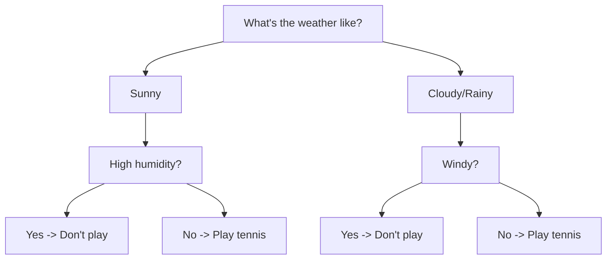
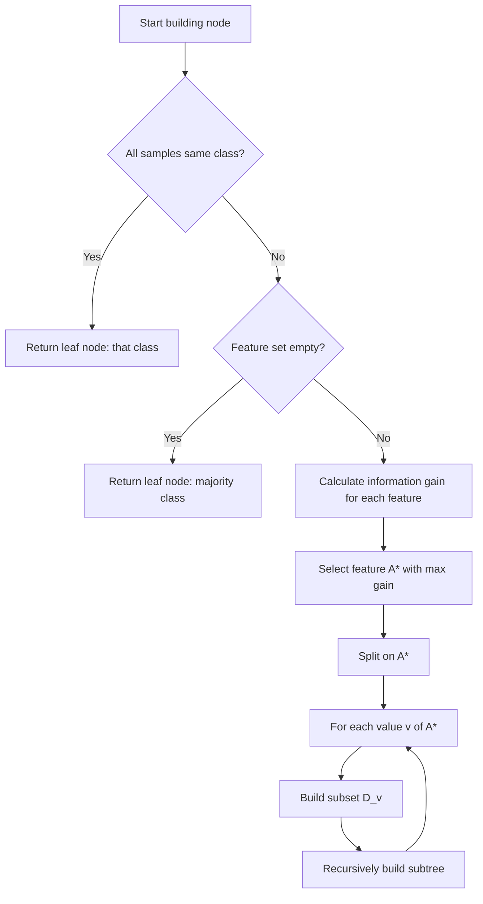

# Decision Trees

There's a long-standing saying in the industry that statistical learning models are "mathematicians' methods," but decision trees are uniquely "programmers' methods." The decision tree originated from the ID3 algorithm proposed by Australian computer scientist Ross Quinlan in 1986. The algorithm is surprisingly straightforward — it uses a series of "yes/no" questions to classify data, much like a doctor diagnosing a patient: first ask if they have a fever, then ask if they're coughing, and finally reach a diagnosis. At the time, probably no one could have imagined that over the following decades, classic methods like C4.5 (1993) and CART (1984) would emerge, making decision trees one of the most widely applied machine learning algorithms.

Consider a daily scenario: deciding whether to play tennis today. How would you think about it? A normal person wouldn't calculate any probability formulas; instead, they'd ask themselves a few sequential questions:

*Figure: Example of a decision tree for playing tennis*

This is a decision tree. Starting from the root node, each node poses a question, and based on the answer, you choose a branch until you reach a leaf node and get a conclusion. This approach of automatically learning rules from data has several unique advantages. Of course, decision trees also have clear limitations, such as a single tree being prone to overfitting and sensitivity to data perturbations. These issues will be addressed in the following discussions on [Pruning Strategies](#pruning-strategies) and [Random Forest](random-forest.md):

- First, **strong interpretability**. Each branch of a decision tree can be described in natural language, for example, "If the weather is sunny and humidity is low, it's suitable to play tennis." This transparency is especially important in fields like medical diagnosis and credit assessment. Doctors need to understand why a model judges a patient as high-risk, and banks need to explain why a customer's loan application was rejected.
- Second, **no feature scaling required**. Linear models are sensitive to the numerical range of features and require standardization or normalization. Decision trees, on the other hand, only care about "greater than or less than a certain threshold," and numerical ranges do not affect the split result at all. This significantly reduces the amount of data preprocessing work.
- Third, **handles mixed-type features**. Both numerical features (e.g., temperature, income) and categorical features (e.g., weather, occupation) can be processed directly, without the need for one-hot encoding as required by linear models.
- Finally, **automatic feature selection**. The splitting process itself is a feature selection process. Features with the highest information gain or Gini index are selected first, effectively automatically identifying the most important features.

## Best Split Criteria

However, decision trees are not as simple and straightforward as they appear on the surface. For a small number of features (two or three), humans can quickly construct a decision tree. But when faced with thousands of data samples and anywhere from dozens to thousands of features, a rigorous theory is needed to determine which feature to split on at each node. Let's take tennis again as an example. This time, we've collected tennis-playing records from the past two weeks, including four features — outlook, temperature, humidity, and wind — along with the result of whether tennis was played, as shown in the table below. Based on this data, consider which feature should be used to split the tree first, and why?

| Outlook | Temperature | Humidity | Wind | Play Tennis? |
|:----:|:----:|:----:|:----:|:--------:|
| Sunny | Hot | High | Weak | No |
| Sunny | Hot | High | Strong | No |
| Overcast | Hot | High | Weak | Yes |
| Rainy | Mild | High | Weak | Yes |
| Rainy | Cool | Normal | Weak | Yes |
| Rainy | Cool | Normal | Strong | No |
| Overcast | Cool | Normal | Strong | Yes |
| Sunny | Mild | High | Weak | No |
| Sunny | Cool | Normal | Weak | Yes |
| Rainy | Mild | Normal | Weak | Yes |
| Sunny | Mild | Normal | Strong | Yes |
| Overcast | Mild | High | Strong | Yes |
| Overcast | Hot | Normal | Weak | Yes |
| Rainy | Mild | High | Strong | No |

One reasonable construction strategy is to select the splitting feature based on **Information Gain**. This introduces the concept of **Entropy** from thermodynamics and information theory. Entropy is a measure of disorder in thermodynamics, and in information theory, it is used to measure the uncertainty of data. Suppose you have a fair coin with a 50% probability for each side. No matter how much statistical data you've collected about previous coin flips, you cannot be certain of the next flip's outcome. This is the state of maximum information disorder, where information entropy is at its maximum. If the coin is a trick magic prop with heads on both sides, you are 100% certain of the result before flipping — this is the purest state of information, where information entropy is zero. Mathematically, information entropy is defined as:

$$H(D) = -\sum_{k=1}^{K} p_k \log_2 p_k$$

In this formula, $p_k$ is the proportion of class $k$ in dataset $D$. For example, if heads appear in half of all coin flip records, then $p_k = 0.5$. $-\log_2 p_k$ represents the degree of surprise of the information — the lower the probability of an event, the more surprising it is when it occurs, and the greater the amount of information it carries. For instance, the statement "the sun will rise tomorrow" carries almost no surprise. If we could compile sunrise data over the entire lifespan of the Earth, the proportion of days with sunrise would be nearly 100% (except perhaps the last day). That is, $p_k \approx 1$, $\log_2 p_k \approx 0$. The negative sign is there because $\log_2 p_k$ itself is negative (since probability is less than 1), so adding the negative sign makes it positive. Therefore, the entire definition of information entropy can be summarized in one sentence:

> "Only surprising events carry information."

Now, plugging in the data of whether we played tennis over the past two weeks, we calculate the information entropy $H(D) = -\left(\frac{9}{14} \log_2 \frac{9}{14} + \frac{5}{14} \log_2 \frac{5}{14}\right) \approx 0.940$. This value means the current 14 data points are still quite mixed, with a roughly 2:1 ratio of playing to not playing — far from a pure state. Let's first try splitting by the outlook feature. Outlook has three values: Sunny, Overcast, and Rainy, corresponding to 5, 4, and 5 records, respectively:

- **Sunny (5 records)**: Play 2, Don't play 3 → $H(D_{Sunny}) \approx 0.971$
- **Overcast (4 records)**: Play 4, Don't play 0 → $H(D_{Overcast}) = 0$ (completely pure!)
- **Rainy (5 records)**: Play 3, Don't play 2 → $H(D_{Rainy}) \approx 0.971$

The total information entropy after splitting is the weighted average of each subset's entropy: $H(D, Outlook) = \frac{5}{14} \times 0.971 + \frac{4}{14} \times 0 + \frac{5}{14} \times 0.971 \approx 0.693$, a decrease of $0.247$ from before splitting. This reduction is the information gain achieved by using outlook as the splitting condition. Computing the information gain for the other features using the same method:

| Feature | Information Gain |
|:----:|:--------:|
| Outlook | 0.247 |
| Temperature | 0.029 |
| Humidity | 0.152 |
| Wind | 0.048 |

From the results, we can see that outlook has the highest information gain, so the decision tree should be split by outlook first. This result is consistent with human intuition — weather is indeed the most important factor affecting the decision to play tennis.

However, information gain is just one of many splitting strategies, and it's not suitable in every case. Information gain is naturally biased toward features with many distinct values. The more values a feature has, the more likely its subsets are to be pure. As an extreme example, if you want to classify people and use the "ID number" feature to split, each branch will certainly have exactly one sample — perfectly pure, but completely meaningless. In such cases, you can use the **Gain Ratio** instead, which addresses this issue by introducing a penalty term. The gain ratio is defined as:

$$GainRatio(D, A) = \frac{Gain(D, A)}{SplitInfo(A)}$$

The denominator $SplitInfo(A)$ measures how dispersed the feature values are:

$$SplitInfo(A) = -\sum_{v} \frac{|D_v|}{|D|} \log_2 \frac{|D_v|}{|D|}$$

The form of this formula is identical to entropy, except that it is applied to the distribution of feature values rather than class labels. The more values a feature has and the more evenly they are distributed, the larger $SplitInfo$ becomes, and the smaller the gain ratio — this is how the penalty term works. Besides information gain and gain ratio, there is another method completely independent of information entropy: the **Gini Index**. It originates from the Gini coefficient in economics (which measures income inequality). The smaller the Gini index, the purer the data. In decision trees, the Gini index is defined as:

$$Gini(D) = 1 - \sum_{k=1}^{K} p_k^2$$

This formula directly computes the sum of squared probabilities, which is much simpler than information entropy. It describes the following picture: if the data is completely pure (only one class), then $p_k = 1$ and the Gini index is zero; if the classes are uniformly distributed, $p_k = \frac{1}{K}$, the Gini index reaches its maximum of $1 - \frac{1}{K}$. We choose the feature that minimizes the Gini index to split the decision tree. Using the 14-day tennis data again, first compute the Gini index before splitting: $Gini(D) = 1 - \left(\left(\frac{9}{14}\right)^2 + \left(\frac{5}{14}\right)^2\right) \approx 0.459$. Then take the outlook feature as an example and compute the Gini index for the three subsets after splitting:

- **Sunny (5 records)**: Play 2, Don't play 3 → $Gini(D_{Sunny}) = 1 - \left(\left(\frac{2}{5}\right)^2 + \left(\frac{3}{5}\right)^2\right) = 0.480$
- **Overcast (4 records)**: Play 4, Don't play 0 → $Gini(D_{Overcast}) = 1 - (1^2 + 0^2) = 0$ (completely pure!)
- **Rainy (5 records)**: Play 3, Don't play 2 → $Gini(D_{Rainy}) = 1 - \left(\left(\frac{3}{5}\right)^2 + \left(\frac{2}{5}\right)^2\right) = 0.480$

The weighted Gini index after splitting is $Gini(D, Outlook) = \frac{5}{14} \times 0.480 + \frac{4}{14} \times 0 + \frac{5}{14} \times 0.480 \approx 0.343$, and the reduction in the Gini index is $0.459 - 0.343 = 0.117$. Computing the Gini reduction for the other features using the same method:

| Feature | Gini After Split | Gini Reduction |
|:----:|:--------------:|:----------:|
| Outlook | 0.343 | 0.117 |
| Temperature | 0.439 | 0.021 |
| Humidity | 0.367 | 0.093 |
| Wind | 0.429 | 0.031 |

From the results, splitting by outlook produces the largest decrease in the Gini index. Therefore, the Gini index criterion also selects outlook as the optimal splitting feature, consistent with the conclusion from information gain. In practice, the Gini index is the most commonly used criterion due to its computational efficiency. For example, Scikit-learn's decision tree implementation uses the Gini index by default. The advantages and disadvantages of these three criteria are summarized in the table below:

| Criterion | Algorithm | Computational Complexity | Advantage | Disadvantage |
|:----:|:----:|:----------:|:----:|:----:|
| Information Gain | ID3 | Medium (requires $\log$) | Solid information theory foundation | Biased toward features with many values |
| Gain Ratio | C4.5 | High (extra penalty term) | Corrects bias, fairer | May bias toward features with few values |
| Gini Index | CART | Low (only squares) | Fast computation, no logarithms | No information theory interpretation |

## Decision Tree Algorithms

The three splitting criteria above correspond to three classic decision tree algorithms: ID3 uses information gain, C4.5 uses the gain ratio, and CART uses the Gini index. Below, we introduce the ideas and implementation details of each algorithm.

### ID3 Algorithm

**ID3** (Iterative Dichotomiser 3) was the first decision tree algorithm, proposed by Ross Quinlan in 1986, and is the predecessor of modern decision trees. Although the term "Dichotomiser" in the name suggests binary splitting, ID3 can actually produce multi-way trees, where each node splits into multiple branches according to feature values. The core logic of ID3 is a recursive process that can be summarized in four steps:

- Step 1: **Check termination conditions.** If all samples in the current dataset belong to the same class, it is already "pure," so simply return a leaf node. If the feature set is empty (all features have been used for splitting), return a leaf node with the majority class.
- Step 2: **Select the best splitting feature.** Compute the information gain for each feature and select the feature with the highest gain as the splitting feature for the current node.
- Step 3: **Create branches.** For each value of the selected feature, create a branch. Each branch corresponds to a subset of data containing samples where that feature takes that particular value.
- Step 4: **Recursively build subtrees.** Remove the current splitting feature from the feature set, and recursively apply the above process to each branch's subset until the termination conditions are met.


*Figure: Steps of the ID3 algorithm*

Although ID3 pioneered the field of decision trees, it is not perfect and has three notable limitations. These limitations led to the development of its improved successor, the C4.5 algorithm.

1. **Can only handle discrete features.** Computing information gain requires features to have well-defined value categories. For continuous features (e.g., numerical temperature or humidity), ID3 cannot process them directly. They must be discretized first, for example, by dividing temperature into "Hot, Mild, Cool" levels. This pre-discretization may lose information, and the discretization criteria are difficult to determine.
2. **Biased toward features with many values.** As mentioned earlier, information gain is naturally biased toward features with many distinct values. In the tennis data, if we added a "date" feature (with 14 different values), ID3 would preferentially split by date, producing 14 pure leaf nodes — but this has no predictive value.
3. **Prone to overfitting.** ID3 continues splitting until all leaf nodes are pure, which is especially dangerous when the training data contains noise. The model may learn spurious patterns from the noise, performing poorly on test data.

### C4.5 Algorithm

**C4.5** is an improved algorithm proposed by Quinlan in 1993. It inherits the core ideas of ID3 while systematically addressing its three limitations, with the following improvements:

- The first improvement is using the gain ratio instead of information gain as the splitting criterion. As explained earlier, the gain ratio corrects the bias toward features with many values through its penalty term. However, the gain ratio has its own problem: unlike information gain, it may be biased toward features with few values. When a feature has very few values (e.g., only two), $SplitInfo$ is very small, and the gain ratio can be abnormally high. C4.5 uses a heuristic strategy to address this: it first calculates information gain, considers only features whose information gain exceeds the average, and then selects the one with the highest gain ratio from among them.

- The second improvement is allowing direct handling of continuous features without pre-discretization. Suppose a continuous feature $A$ has $n$ distinct values $a_1, a_2, ..., a_n$ (sorted). C4.5 considers $n-1$ candidate split points $\frac{a_1 + a_2}{2}, \frac{a_2 + a_3}{2}, ...$. For each split point $t$, the data is divided into two subsets: $A \leq t$ and $A > t$. The gain ratio is computed, and the optimal split point is selected. As a concrete example: suppose a continuous numerical feature (e.g., humidity percentage) takes values $65$, $70$, $72$, $75$, $80$ in five data points. The sorted candidate split points are $\frac{65+70}{2}=67.5, \frac{70+72}{2}=71, ...$ (4 split points in total). C4.5 evaluates the gain ratio for each candidate split point and selects the optimal one to split the data into two subsets: "humidity ≤ optimal threshold" and "humidity > optimal threshold." The theoretical basis for this approach is that the optimal split point for a continuous feature must lie between adjacent values. This is because if the split point moves outside the range between two adjacent values, the split result does not change; only when it crosses a value does the split result change.

- The third improvement is handling missing values. Real-world data often has missing values. For instance, if a day's humidity data is missing, C4.5 uses a probability-based strategy, distributing the missing samples proportionally to each branch. Suppose feature $A$ has values $v_1, v_2, v_3$, with corresponding sample counts $n_1=3, n_2=5, n_3=2$ (10 samples total), and the number of missing samples is $m=2$. Then the missing samples are distributed to each branch with probabilities 3/10, 5/10, and 2/10, respectively. The idea behind this method is: since we don't know which branch the missing samples belong to, we estimate by probability — multiple branches may contain them, and this uncertainty must be accounted for when computing information gain.

- The fourth improvement is introducing pruning to prevent overfitting. C4.5 uses pessimistic pruning. After the tree is fully grown, it examines each internal node from the leaves upward. If replacing an internal node with a leaf node reduces the estimated error rate, it performs the pruning. The error rate estimate is based on the error count on the training data plus a statistical correction (similar to a confidence interval). The intuition behind this method is that the error rate on the training data may underestimate the true error rate (because training data contains noise). Adding a correction makes it more conservative, which aids pruning. The specific principles of pruning will be discussed in detail in the next section.

### CART Algorithm

**CART** (Classification and Regression Trees) is an algorithm proposed by statistician Leo Breiman and others in 1984. It emerged around the same time as C4.5 but takes a completely different approach. CART is the most commonly used algorithm for modern decision trees. Scikit-learn's `DecisionTreeClassifier` and `DecisionTreeRegressor` are both implemented based on the CART algorithm. Unlike ID3/C4.5's multi-way trees, CART consistently uses binary trees. The advantage of binary trees lies in their simple structure and ease of understanding. Additionally, binary splits offer more flexible conditions, allowing combinations of multiple values rather than forcing each value into its own branch as in multi-way trees. Suppose feature $A$ has values $\{a_1, a_2, a_3\}$. CART considers all possible binary splits:

- $A = a_1$ vs $A \neq a_1$ (one branch contains samples with value $a_1$, the other contains the rest)
- $A = a_2$ vs $A \neq a_2$
- $A = a_3$ vs $A \neq a_3$
- $A \in \{a_1, a_2\}$ vs $A \notin \{a_1, a_2\}$ (values can be combined)
- ...

Then, among the possible options above, it selects the binary split with the smallest Gini index. For continuous features, CART works similarly to C4.5, iterating through all candidate split points and selecting the optimal binary split.

One advantage of CART over ID3/C4.5 is that it supports both classification and regression tasks. When the target variable is continuous (e.g., house price prediction), a classification tree cannot be directly applied because it cannot provide a predicted value at the leaf node. The splitting criterion for CART regression trees is **variance minimization**: $\text{Var}(D) = \frac{1}{|D|} \sum_{i \in D} (y_i - \bar{y})^2$, where $\bar{y}$ is the mean of the target variable in dataset $D$. The weighted average variance after splitting is:

$$\text{Var}(D, A, t) = \frac{|D_{left}|}{|D|} \text{Var}(D_{left}) + \frac{|D_{right}|}{|D|} \text{Var}(D_{right})$$

At each split, the scheme that minimizes the variance is selected. The predicted value at a leaf node is the mean of the target variable for all samples in that leaf node. This approach is quite intuitive: if you've collected 10 samples in a leaf node with an average house price of 5 million, the predicted price for a new sample should also be 5 million.

## Pruning Strategies

Decision trees are inherently prone to overfitting because they can keep splitting until each leaf node is completely pure or other stopping conditions are met. In extreme cases, each leaf node contains only one sample, achieving 100% training accuracy. However, such a tree is extremely sensitive to noise; even a small change in the training data can lead to a completely different tree structure. Therefore, decision trees must not greedily pursue full growth; a pruning process is necessary to limit model complexity. Pruning mainly includes two types:

- **Pre-pruning** sets constraints during the tree growth process to prevent excessive splitting. Common constraints include:

    - **Maximum depth limit**: Specifies the maximum number of levels in the tree. For example, limiting the depth to 5 means the tree can have at most 5 levels of nodes. The intuition behind this constraint is that greater depth leads to more complex models, which are more likely to overfit. Depth limitation is the most commonly used pre-pruning strategy. Scikit-learn has no depth limit by default (`max_depth=None`), but in practice, a reasonable depth value is usually set.
    - **Minimum samples per leaf node**: Specifies the minimum number of samples each leaf node must contain. If a split would cause a branch to have too few samples (e.g., just 1 sample), the split is not performed. This constraint prevents the model from learning isolated instances.
    - **Minimum gain threshold for splitting**: Specifies that a split must produce at least a minimum information gain or Gini index decrease. If the improvement from a split is negligible, the split is not performed. This prevents meaningless splits.

    The advantage of pre-pruning is computational efficiency — the tree does not grow too large, and training time is short. The disadvantage is that it may stop too early, missing some truly useful splits. For example, a split might not yield much gain at the current step, but it could create favorable conditions for subsequent splits.

- **Post-pruning** first lets the tree grow fully, then prunes it from the leaf nodes upward. Common post-pruning methods include:

    - **Pessimistic pruning** (C4.5): Calculates the estimated error rate for each internal node if it were replaced by a leaf node, and compares it with the estimated error rate of the current subtree. If the replacement results in a lower (or comparable) error rate, the subtree is pruned. The error rate estimate is based on the training error plus a statistical correction (similar to a confidence interval), reflecting a pessimistic attitude that acknowledges the training error rate underestimates the true error rate.
    - **Cost-complexity pruning** (CART): Introduces a parameter $\alpha$ to balance tree complexity and error rate. Defines the cost-complexity $R_\alpha(T) = R(T) + \alpha |T|$, where $R(T)$ is the error rate of tree $T$ on the training set (typically computed as the proportion of misclassified samples), $|T|$ is the number of leaf nodes (a measure of complexity), and $\alpha$ is a tuning parameter. Larger $\alpha$ imposes a heavier complexity penalty, resulting in a simpler tree. When $\alpha=0$, only the error rate matters, and complexity is not penalized; when $\alpha$ is very large, adding each leaf node incurs a high cost. CART generates a sequence of subtrees by gradually increasing $\alpha$, then selects the optimal $\alpha$ through cross-validation.
    - **Minimum error pruning**: Directly computes whether the error rate decreases after pruning. This is more straightforward than pessimistic pruning but does not include a statistical correction.

    The advantage of post-pruning is that it is more cautious — the tree grows fully before being pruned, so no potentially useful splits are missed. The disadvantage is higher computational cost: a large tree must be fully grown, then gradually pruned and validated.

## CART Decision Tree in Practice

CART decision trees are suitable for classification scenarios where features can be continuous or discrete. The following code implements a CART decision tree classifier, demonstrating the complete process of selecting optimal splitting features and split points using the Gini index, recursively building a binary tree, predicting samples, and visualizing decision boundaries. The example uses two features (sepal length and sepal width) from the classic [Iris flower dataset](https://en.wikipedia.org/wiki/Iris_flower_data_set) to classify three types of irises, and shows how the decision tree partitions the feature space into multiple regions, each corresponding to a class prediction.

From the visualized charts after running, it is clear that the decision boundary consists of line segments parallel to the coordinate axes, dividing the feature space into several rectangular regions. This is the essence of CART decision trees: breaking down a complex problem into a chain of simple judgments through a series of if-then rules, focusing on only one feature at each step, ultimately forming a decision logic that humans can understand.

```python runnable extract-class="DecisionTreeClassifier"
import numpy as np
from sklearn.datasets import load_iris

class DecisionTreeClassifier:
    """
    CART Decision Tree Classifier
    
    Uses the Gini index as the splitting criterion to build a binary decision tree.
    Supports pre-pruning strategies: maximum depth limit and minimum samples per leaf node.
    
    Parameters:
        max_depth : int, default 10
            Maximum depth of the tree, prevents overfitting
        min_samples_split : int, default 2
            Minimum number of samples required to split, prevents learning isolated instances
    """
    
    def __init__(self, max_depth=10, min_samples_split=2, min_gain_threshold=0.0):
        self.max_depth = max_depth
        self.min_samples_split = min_samples_split
        self.min_gain_threshold = min_gain_threshold
        self.tree = None
    
    def _gini(self, y):
        """
        Compute the Gini index of a dataset
        
        The Gini index measures the impurity of data; smaller values indicate purer data.
        
        Parameters:
            y : ndarray
                Target variable array
        
        Returns:
            float : Gini index value
        """
        if len(y) == 0:
            return 0
        _, counts = np.unique(y, return_counts=True)
        probs = counts / len(y)
        return 1 - np.sum(probs ** 2)
    
    def _gini_split(self, y_left, y_right):
        """
        Compute the weighted Gini index after a split
        
        Weighted average of the Gini indices of two subsets, with weights proportional to sample counts.
        
        Parameters:
            y_left : ndarray
                Target variable of the left branch
            y_right : ndarray
                Target variable of the right branch
        
        Returns:
            float : Weighted Gini index after the split
        """
        n = len(y_left) + len(y_right)
        return (len(y_left) / n) * self._gini(y_left) + \
               (len(y_right) / n) * self._gini(y_right)
    
    def _best_split(self, X, y):
        """
        Find the best splitting feature and split point
        
        Iterates through all candidate split points for all features and selects the split
        that minimizes the Gini index. Candidate split points are midpoints between unique
        feature values (standard CART strategy).
        
        Parameters:
            X : ndarray, shape (n_samples, n_features)
                Feature matrix
            y : ndarray, shape (n_samples,)
                Target variable
        
        Returns:
            tuple : (best feature index, best split threshold, corresponding Gini index)
        """
        best_gini = float('inf')
        best_feature = None
        best_threshold = None
        
        n_features = X.shape[1]
        
        for feature in range(n_features):
            # Get all unique values of this feature as candidate split points
            # Use midpoints between adjacent unique values as candidate thresholds (standard CART strategy)
            thresholds = np.unique(X[:, feature])
            thresholds = (thresholds[:-1] + thresholds[1:]) / 2
            
            for threshold in thresholds:
                # Split data by threshold
                left_mask = X[:, feature] <= threshold
                right_mask = ~left_mask
                
                y_left = y[left_mask]
                y_right = y[right_mask]
                
                # Skip invalid splits (empty branch)
                if len(y_left) == 0 or len(y_right) == 0:
                    continue
                
                gini = self._gini_split(y_left, y_right)
                
                # Update best split
                if gini < best_gini:
                    best_gini = gini
                    best_feature = feature
                    best_threshold = threshold
        
        return best_feature, best_threshold, best_gini
    
    def _build_tree(self, X, y, depth):
        """
        Recursively build the decision tree
        
        Core steps:
        1. Check termination conditions (depth limit, sample count limit, purity)
        2. If termination conditions are met, return a leaf node (majority class)
        3. Otherwise, find the optimal split and create an internal node
        4. Recursively build left and right subtrees
        
        Parameters:
            X : ndarray
                Feature matrix
            y : ndarray
                Target variable
            depth : int
                Current depth
        
        Returns:
            dict : Tree node (represented as a dictionary)
        """
        n_samples = len(y)
        
        # Check pre-pruning termination conditions
        if (depth >= self.max_depth or 
            n_samples < self.min_samples_split or 
            len(np.unique(y)) == 1):
            # Return leaf node, predicted as the majority class
            values, counts = np.unique(y, return_counts=True)
            return {'leaf': True, 'class': values[np.argmax(counts)]}
        
        # Find the optimal split
        feature, threshold, gini = self._best_split(X, y)
        
        # If no split is found or gain is insufficient, return a leaf node
        if feature is None or gini > self._gini(y) - self.min_gain_threshold:
            values, counts = np.unique(y, return_counts=True)
            return {'leaf': True, 'class': values[np.argmax(counts)]}
        
        # Split the data
        left_mask = X[:, feature] <= threshold
        right_mask = ~left_mask
        
        # Recursively build subtrees
        left_tree = self._build_tree(X[left_mask], y[left_mask], depth + 1)
        right_tree = self._build_tree(X[right_mask], y[right_mask], depth + 1)
        
        return {
            'leaf': False,
            'feature': feature,
            'threshold': threshold,
            'left': left_tree,
            'right': right_tree
        }
    
    def fit(self, X, y):
        """
        Train the decision tree
        
        Parameters:
            X : ndarray, shape (n_samples, n_features)
                Feature matrix
            y : ndarray, shape (n_samples,)
                Target variable
        
        Returns:
            self : Trained model instance
        """
        self.tree = self._build_tree(X, y, depth=0)
        return self
    
    def _predict_one(self, x, node):
        """
        Predict a single sample
        
        Starting from the root node, select branches according to split conditions
        until reaching a leaf node.
        
        Parameters:
            x : ndarray
                Feature vector of a single sample
            node : dict
                Current tree node
        
        Returns:
            int : Predicted class
        """
        if node['leaf']:
            return node['class']
        
        if x[node['feature']] <= node['threshold']:
            return self._predict_one(x, node['left'])
        else:
            return self._predict_one(x, node['right'])
    
    def predict(self, X):
        """
        Batch prediction
        
        Parameters:
            X : ndarray, shape (n_samples, n_features)
                Feature matrix
        
        Returns:
            ndarray : Array of predicted classes
        """
        return np.array([self._predict_one(x, self.tree) for x in X])
    
    def score(self, X, y):
        """
        Compute accuracy
        
        Parameters:
            X : ndarray
                Feature matrix
            y : ndarray
                True labels
        
        Returns:
            float : Accuracy
        """
        y_pred = self.predict(X)
        return np.mean(y_pred == y)

# Load the Iris dataset
iris = load_iris()
X, y = iris.data, iris.target

# Split into training and test sets (80% train, 20% test)
indices = np.random.permutation(len(X))
split = int(0.8 * len(X))
X_train, X_test = X[indices[:split]], X[indices[split:]]
y_train, y_test = y[indices[:split]], y[indices[split:]]

# Train the decision tree (set max depth to 5 to prevent overfitting)
tree = DecisionTreeClassifier(max_depth=5)
tree.fit(X_train, y_train)

import matplotlib.pyplot as plt

# Evaluate model performance
print("=== CART Decision Tree Classification (Iris Dataset) ===")
print(f"Training accuracy: {tree.score(X_train, y_train):.3f}")
print(f"Test accuracy: {tree.score(X_test, y_test):.3f}")

# Compare the effect of different depths and visualize
depths = [2, 3, 5, 10, 20]
labels = ['Depth=2', 'Depth=3', 'Depth=5', 'Depth=10', 'Depth=20']
train_accs = []
test_accs = []

for depth in depths:
    model = DecisionTreeClassifier(max_depth=depth)
    model.fit(X_train, y_train)
    train_accs.append(model.score(X_train, y_train))
    test_accs.append(model.score(X_test, y_test))

# Create visualization
fig, axes = plt.subplots(1, 2, figsize=(14, 5))

# Left plot: Pre-pruning effect comparison
ax1 = axes[0]
x_pos = np.arange(len(labels))
width = 0.35
bars1 = ax1.bar(x_pos - width/2, train_accs, width, label='Training Accuracy', color='#3498db', edgecolor='black', linewidth=0.5)
bars2 = ax1.bar(x_pos + width/2, test_accs, width, label='Test Accuracy', color='#e74c3c', edgecolor='black', linewidth=0.5)
ax1.set_xlabel('Max Depth', fontsize=11)
ax1.set_ylabel('Accuracy', fontsize=11)
ax1.set_title('Pre-pruning Effect: Train/Test Accuracy at Different Depths', fontsize=12)
ax1.set_xticks(x_pos)
ax1.set_xticklabels(labels)
ax1.legend(loc='lower right')
ax1.set_ylim([0, 1.05])
ax1.grid(axis='y', alpha=0.3)

# Add value labels on bars
for bar in bars1:
    height = bar.get_height()
    ax1.annotate(f'{height:.3f}', xy=(bar.get_x() + bar.get_width()/2, height), xytext=(0, 3), textcoords="offset points", ha='center', va='bottom', fontsize=8)
for bar in bars2:
    height = bar.get_height()
    ax1.annotate(f'{height:.3f}', xy=(bar.get_x() + bar.get_width()/2, height), xytext=(0, 3), textcoords="offset points", ha='center', va='bottom', fontsize=8)

# Right plot: Decision boundary visualization (using first two features: sepal length and sepal width)
ax2 = axes[1]

# Use only the first two features for training and visualization
X_vis = X_train[:, :2]
y_vis = y_train
X_test_vis = X_test[:, :2]
y_test_vis = y_test

# Train a decision tree for visualization (moderate depth)
tree_vis = DecisionTreeClassifier(max_depth=3)
tree_vis.fit(X_vis, y_vis)

# Create a mesh grid for decision boundary plotting
x_min, x_max = X_vis[:, 0].min() - 0.5, X_vis[:, 0].max() + 0.5
y_min, y_max = X_vis[:, 1].min() - 0.5, X_vis[:, 1].max() + 0.5
xx, yy = np.meshgrid(np.linspace(x_min, x_max, 300), np.linspace(y_min, y_max, 300))

# Predict each point on the mesh grid
Z = tree_vis.predict(np.c_[xx.ravel(), yy.ravel()])
Z = Z.reshape(xx.shape)

# Plot decision regions
cmap_light = plt.cm.colors.ListedColormap(['#FFCCCC', '#CCFFCC', '#CCCCFF'])
cmap_bold = plt.cm.colors.ListedColormap(['#FF0000', '#00FF00', '#0000FF'])
ax2.contourf(xx, yy, Z, cmap=cmap_light, alpha=0.8)

# Plot decision boundaries (contour lines)
ax2.contour(xx, yy, Z, colors='black', linewidths=1, linestyles='-')

# Plot training sample points
class_names = ['Setosa', 'Versicolor', 'Virginica']
colors = ['#e74c3c', '#2ecc71', '#3498db']
markers = ['o', 's', '^']

for i, (color, marker, name) in enumerate(zip(colors, markers, class_names)):
    mask = y_vis == i
    ax2.scatter(X_vis[mask, 0], X_vis[mask, 1], c=color, marker=marker, s=60, label=f'{name} (Train)', edgecolors='black', linewidths=0.5, alpha=0.8)

# Plot test sample points (hollow)
for i, (color, marker, name) in enumerate(zip(colors, markers, class_names)):
    mask = y_test_vis == i
    ax2.scatter(X_test_vis[mask, 0], X_test_vis[mask, 1], facecolors='none', edgecolors=color, marker=marker, s=100, linewidths=2, label=f'{name} (Test)')

ax2.set_xlabel('Sepal Length (cm)', fontsize=11)
ax2.set_ylabel('Sepal Width (cm)', fontsize=11)
ax2.set_title(f'Decision Boundary Visualization (Depth=3, Test Accuracy: {tree_vis.score(X_test_vis, y_test_vis):.3f})', fontsize=12)
ax2.legend(loc='upper right', fontsize=8)
ax2.set_xlim([x_min, x_max])
ax2.set_ylim([y_min, y_max])

plt.tight_layout()
plt.savefig('decision_tree_visualization.png', dpi=150, bbox_inches='tight', facecolor='white')
plt.show()

# Print comparison results
print("\n=== Pre-pruning Effect Comparison ===")
for label, train_acc, test_acc in zip(labels, train_accs, test_accs):
    print(f"{label}: Train {train_acc:.3f}, Test {test_acc:.3f}")
```

## Application: Loan Approval Case

Due to their intuitiveness and interpretability, decision trees are widely used in many fields. Below, we demonstrate the practical application of decision trees through a loan approval case. Banks need to decide whether to approve a loan based on factors such as the applicant's income, debt, and credit score. The advantage of decision trees lies in their clear and interpretable rules: the bank can explain to a customer that "your application was rejected because your credit score is below the threshold and your debt-to-income ratio is high."

```python runnable
import numpy as np
from shared.tree.decision_tree_classifier import DecisionTreeClassifier

# Simulate loan approval data
n_samples = 200

# Features: Income (High/Medium/Low), Debt (High/Low), Credit (Good/Poor)
income = np.random.choice([0, 1, 2], n_samples)  # 0=Low, 1=Medium, 2=High
debt = np.random.choice([0, 1], n_samples)       # 0=Low, 1=High
credit = np.random.choice([0, 1], n_samples)     # 0=Poor, 1=Good

X = np.column_stack([income, debt, credit])

# Decision rules: High income + Good credit = Approved, Medium income + Low debt + Good credit = Approved
y = np.zeros(n_samples, dtype=int)
y[(income == 2) & (credit == 1)] = 1
y[(income == 1) & (debt == 0) & (credit == 1)] = 1

# Add some noise (simulate real-world uncertainty)
noise_idx = np.random.choice(n_samples, 10, replace=False)
y[noise_idx] = 1 - y[noise_idx]

# Train the decision tree
tree = DecisionTreeClassifier(max_depth=4)
tree.fit(X, y)

print("=== Loan Approval Decision Tree ===")
print(f"Training accuracy: {tree.score(X, y):.3f}")

# Predict new applications
new_applicants = np.array([
    [2, 0, 1],  # High income, Low debt, Good credit
    [1, 1, 0],  # Medium income, High debt, Poor credit
    [0, 0, 1],  # Low income, Low debt, Good credit
])
predictions = tree.predict(new_applicants)
print("\nNew Application Predictions:")
for i, (applicant, pred) in enumerate(zip(new_applicants, predictions)):
    income_label = ['Low', 'Medium', 'High'][applicant[0]]
    debt_label = ['Low', 'High'][applicant[1]]
    credit_label = ['Poor', 'Good'][applicant[2]]
    result = 'Approved' if pred == 1 else 'Rejected'
    print(f"Applicant {i+1}: Income={income_label}, Debt={debt_label}, Credit={credit_label} -> {result}")
```

## Summary

Decision trees learn rules from data rather than fitting functions. This learning approach is highly intuitive, and its decision-making process closely resembles human logical thinking, making decision trees the most easily understood machine learning algorithm for programmers.

Although decision trees are intuitive and easy to understand, a single tree has poor stability. Small perturbations in the data can lead to drastic changes in the tree structure. This issue will be addressed in the [next chapter](random-forest.md) through ensemble learning. Random forests and the voting mechanism of multiple decision trees can maintain the interpretability of decision trees while significantly improving prediction stability and accuracy.

## Exercises

1. Both information entropy and the Gini index measure data impurity. What are their fundamental differences? Why is the Gini index preferred in engineering practice?
    <details>
    <summary>Answer Reference</summary>

    **Fundamental Differences**:

    Entropy originates from information theory and its formula includes logarithmic operations: $H(D) = -\sum p_k \log_2 p_k$. It measures "information content" or "surprise" — the smaller the probability of an event, the greater the information when it occurs.

    The Gini index originates from economics (the Gini coefficient) and its formula is simpler: $Gini(D) = 1 - \sum p_k^2$. It measures "the probability that two randomly selected samples belong to different classes."

    **Why Engineering Practice Favors the Gini Index**:

    1. **Computational Efficiency**: The Gini index only requires squaring operations, while entropy requires computing logarithms, which is significantly slower. Decision trees need to compute impurity frequently during splitting, so the Gini index has a clear efficiency advantage.
    2. **Numerical Stability**: When $p_k$ is close to 0, $\log_2 p_k$ tends toward negative infinity, potentially causing numerical overflow. The squaring operation in the Gini index is numerically stable.
    3. **Similar Effectiveness**: Research shows that the two criteria typically produce similar decision tree structures, but the Gini index is faster to compute, making it the default choice in Scikit-learn.

    </details>

2. Extend the `DecisionTreeClassifier` from this chapter by adding an `_entropy` method to calculate entropy and an `_information_gain` method to calculate information gain. Then compare the two splitting criteria (information gain vs. Gini index) on the Iris dataset.

    <details>
    <summary>Answer Reference</summary>

    ```python runnable
    import numpy as np

    def entropy(y):
        """Calculate entropy"""
        if len(y) == 0:
            return 0
        _, counts = np.unique(y, return_counts=True)
        probs = counts / len(y)
        # Note: log2(0) will raise an error, only compute for non-zero probabilities
        return -np.sum(probs[probs > 0] * np.log2(probs[probs > 0]))

    def information_gain(y, y_left, y_right):
        """Calculate information gain"""
        n = len(y)
        n_left = len(y_left)
        n_right = len(y_right)
        
        H_before = entropy(y)
        H_after = (n_left / n) * entropy(y_left) + (n_right / n) * entropy(y_right)
        
        return H_before - H_after

    # Test: Iris dataset
    from sklearn.datasets import load_iris

    iris = load_iris()
    X, y = iris.data, iris.target

    # Calculate information gain for each feature
    print("=== Information Gain by Feature ===")
    for feature_idx in range(X.shape[1]):
        feature_values = np.unique(X[:, feature_idx])
        best_gain = 0
        best_threshold = None
        
        for threshold in feature_values:
            left_mask = X[:, feature_idx] <= threshold
            right_mask = ~left_mask
            
            y_left = y[left_mask]
            y_right = y[right_mask]
            
            if len(y_left) > 0 and len(y_right) > 0:
                gain = information_gain(y, y_left, y_right)
                if gain > best_gain:
                    best_gain = gain
                    best_threshold = threshold
        
        feature_name = iris.feature_names[feature_idx]
        print(f"{feature_name}: Max Information Gain={best_gain:.4f}, Best Threshold={best_threshold:.2f}")

    # Compare with Gini index
    def gini(y):
        """Calculate Gini index"""
        if len(y) == 0:
            return 0
        _, counts = np.unique(y, return_counts=True)
        probs = counts / len(y)
        return 1 - np.sum(probs ** 2)

    def gini_gain(y, y_left, y_right):
        """Calculate Gini gain (Gini before split - Gini after split)"""
        n = len(y)
        n_left = len(y_left)
        n_right = len(y_right)
        
        G_before = gini(y)
        G_after = (n_left / n) * gini(y_left) + (n_right / n) * gini(y_right)
        
        return G_before - G_after

    print("\n=== Gini Gain by Feature ===")
    for feature_idx in range(X.shape[1]):
        feature_values = np.unique(X[:, feature_idx])
        best_gain = 0
        best_threshold = None
        
        for threshold in feature_values:
            left_mask = X[:, feature_idx] <= threshold
            right_mask = ~left_mask
            
            y_left = y[left_mask]
            y_right = y[right_mask]
            
            if len(y_left) > 0 and len(y_right) > 0:
                gain = gini_gain(y, y_left, y_right)
                if gain > best_gain:
                    best_gain = gain
                    best_threshold = threshold
        
        feature_name = iris.feature_names[feature_idx]
        print(f"{feature_name}: Max Gini Gain={best_gain:.4f}, Best Threshold={best_threshold:.2f}")
    ```
    </details>
