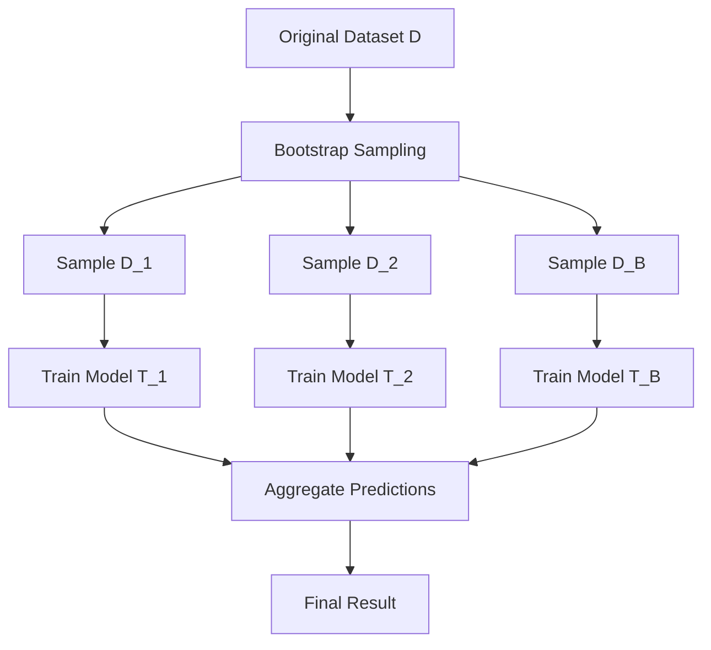

# Random Forest

[Decision Tree](decision-tree.md) has the advantages of being interpretable and intuitive, but it also suffers from a serious tendency to overfit. Decision trees are very sensitive to training data -- a slight change in the data can lead to a completely different tree structure. Although pruning can help control model size and mitigate this issue, this inherent flaw has been difficult to eradicate. It was not until 2001 that Leo Breiman (the same statistician who invented the [CART Algorithm](decision-tree.md#cart-algorithm)) published the groundbreaking paper _[Random Forests](https://link.springer.com/article/10.1023/A:1010933404324)_ in _Machine Learning_, proposing the random forest algorithm, that this problem was finally resolved.

**Random Forest** is a classic representative of ensemble learning. It constructs multiple decision trees that collectively vote on the final result. Each tree sees different data samples (Bootstrap sampling) and focuses on different features (feature randomness), so they learn different patterns. When combined, they preserve the intuitiveness of decision trees while significantly improving prediction stability and accuracy. Random forest demonstrates the advantage of ensemble learning: it is a classic case of using collective wisdom to enhance individual judgment.

## Bagging

The core technique of random forest is **Bagging**, a portmanteau of "**B**ootstrap **Agg**regat**ing**". The idea behind Bagging is to use bootstrap sampling to construct multiple new training sets of the same size as the original training set, so that each model sees different data and learns different patterns. **Bootstrap** is a resampling technique that randomly draws samples **with replacement** from the original dataset to construct new training sets. Mathematically, the probability of any given sample being selected in a single draw is $\frac{1}{n}$, and the probability of it not being selected is $1-\frac{1}{n}$. After $n$ draws, the probability that a particular sample has never been selected approaches $e^{-1}$ (approximately 0.368):

$$P(\text{not selected}) = \left(1-\frac{1}{n}\right)^n \approx e^{-1} \approx 0.368$$

This means that each Bootstrap sample contains approximately 63.2% of the original samples selected at least once ($1-0.368=0.632$). The samples that are never selected are called **OOB samples** (Out-of-Bag) and can be used to validate model performance. The Bagging algorithm proceeds in two phases:

- **Training phase**: Generate $B$ Bootstrap samples from the original dataset, and train a base learner (e.g., a decision tree) on each Bootstrap sample.
- **Prediction phase**: For a new sample, let all models predict individually and then aggregate the results:

    - **Classification task**: Majority voting -- each model predicts a class, and the class with the most votes is selected.
    - **Regression task**: Average -- each model predicts a numeric value, and the arithmetic mean is taken.


*Figure: Flow of the Bagging idea*

The effectiveness of Bagging stems from **variance reduction**. Imagine you are shooting at a target. A single shot may miss the bullseye due to hand tremors. If you shoot 100 times and take the average position, random jitters cancel each other out, and the average position is closer to the bullseye. Mathematically, if $B$ models each have variance $\sigma^2$ and the pairwise correlation coefficient is $\rho \in [0, 1]$ (0 means completely independent, 1 means identical), then the ensemble variance is $\text{Var} = \rho \sigma^2 + \frac{1-\rho}{B} \sigma^2$, where:
- $\rho \sigma^2$ is the variance due to correlation between models, which cannot be eliminated through ensembling because correlated models make the same mistakes.
- $\frac{1-\rho}{B} \sigma^2$ is the variance due to differences between models, which can be reduced by increasing the number of models. The $B$ in the denominator means that more models lead to smaller variance from this component.

The overall formula can be understood as the ensemble variance consisting of two parts: one that cannot be eliminated (correlation) and one that can be reduced (diversity). As $B \to \infty$ (the number of models approaches infinity), the ensemble variance approaches $\rho \sigma^2$. As long as the models are not perfectly correlated, this is always less than the single-model variance $\sigma^2$.

## Feature Randomness

The ensemble variance formula reveals that in Bagging, the less correlated the models are, the better the ensemble performs. If all models are identical ($\rho=1$), ensembling has no effect. If the models are completely independent ($\rho=0$), the ensemble variance approaches zero. Therefore, the key question becomes how to reduce the correlation between ensemble models. To this end, random forest, building on Bagging, further introduces **feature randomness**. Specifically, at each node split, instead of selecting the optimal split from all $d$ features, it first randomly selects $m$ features (typically $m = \sqrt{d}$ or $m = d/3$) and then chooses the best split from these $m$ features.

This is like a class voting for a class president. If all students only look at the "grades" criterion, the vote might favor candidates with good grades. But if each student can only see partial information -- some look at grades, some at character, some at sports -- the voting results from different perspectives will be more comprehensive and not overly reliant on a single criterion. The mathematical explanation is more rigorous: suppose one feature is very strong (has the highest information gain). Without feature randomness, all trees would choose it at the root node, making the tree structures highly similar and the pairwise correlation coefficient $\rho$ very large, so the $\rho \sigma^2$ term in the variance formula cannot be effectively reduced. Feature randomness forces each tree to look at different perspectives, increasing diversity. When the correlation $\rho$ between trees decreases, the $\rho \sigma^2$ component (which cannot be eliminated by increasing the number of trees) in the ensemble variance formula also decreases.

## Aggregating Predictions

Once multiple decision trees have been trained, the next step is how to have them vote on the final result. For classification tasks, there are generally two voting mechanisms:

- **Hard Voting** is the most straightforward aggregation method. Each model predicts a class, and the class with the most votes wins -- majority rule.
- **Soft Voting** is an aggregation method that considers prediction confidence. Each model outputs probability predictions for each class, the probabilities for each class are averaged, and the class with the highest average probability is selected. This voting method is used in real-world expert committee votes.

Consider a concrete example: suppose 3 trees predict a sample as follows:

| Tree | P(A) | P(B) | P(C) | Hard Vote Prediction |
|:--:|:----:|:----:|:----:|:----------:|
| 1 | 0.8 | 0.1 | 0.1 | A |
| 2 | 0.5 | 0.4 | 0.1 | A |
| 3 | 0.3 | 0.6 | 0.1 | B |

- Hard voting: A gets 2 votes, B gets 1 vote -> predicts A
- Soft voting: Average probabilities $[P(A)=0.53, P(B)=0.37, P(C)=0.10]$ -> predicts A

But notice that tree 3 has high confidence in B (0.6), while tree 2 has relatively low confidence in A (0.5). If tree 2's confidence in A drops from 0.5 to 0.4 (and P(B) rises to 0.5), hard voting would flip to predict B, while soft voting would still predict A. This is the advantage of soft voting: predictions with higher confidence have greater influence. Therefore, although soft voting is more complex, it is still generally preferred in practice for aggregating predictions.

## Random Forest in Practice

After understanding the theory, let us implement a random forest classifier from scratch, with full support for Bootstrap sampling, random feature selection, multi-tree training, and majority voting prediction. The code demonstrates the performance of random forest on a handwritten digit classification task and compares it with a single decision tree to showcase the advantages of ensemble learning.

The core implementation of random forest consists of two parts: a decision tree class `DecisionTreeForRF` that supports random feature selection, and a `RandomForestClassifier` that manages multiple trees and aggregates their predictions. The former only considers a randomly selected feature subset at each split, while the latter trains multiple trees via Bootstrap sampling and uses majority voting for the final result.

From the output, the test accuracy of random forest is significantly higher than that of a single decision tree (approximately 96.5% vs. approximately 84.6%). This demonstrates that ensembling multiple trees indeed effectively reduces the risk of overfitting and improves prediction stability. This is a manifestation of "collective wisdom": the voting result of multiple trees is more reliable than the judgment of a single tree.

```python runnable extract-class="RandomForestClassifier"
import numpy as np

class DecisionTreeForRF:
    """
    Decision tree for random forest
    
    Difference from a regular decision tree: at each split, only considers
    a randomly selected subset of features.
    
    Parameters:
        max_depth : int, default 10
            Maximum depth of the tree
        min_samples_split : int, default 2
            Minimum number of samples required to split
        max_features : int or None
            Number of features to consider at each split
    """
    
    def __init__(self, max_depth=10, min_samples_split=2, max_features=None):
        self.max_depth = max_depth
        self.min_samples_split = min_samples_split
        self.max_features = max_features
        self.tree = None
    
    def _gini(self, y):
        """Compute the Gini index"""
        if len(y) == 0:
            return 0
        _, counts = np.unique(y, return_counts=True)
        probs = counts / len(y)
        return 1 - np.sum(probs ** 2)
    
    def _best_split(self, X, y, feature_indices):
        """
        Find the best split (only considers the specified subset of features)
        
        Corresponds to the theory: feature randomness -- each node selects the
        optimal split from only m randomly chosen features
        """
        best_gini = float('inf')
        best_feature = None
        best_threshold = None
        
        for feature in feature_indices:
            thresholds = np.unique(X[:, feature])
            for threshold in thresholds:
                left_mask = X[:, feature] <= threshold
                right_mask = ~left_mask
                
                if np.sum(left_mask) == 0 or np.sum(right_mask) == 0:
                    continue
                
                n = len(y)
                gini = (np.sum(left_mask) / n) * self._gini(y[left_mask]) + \
                       (np.sum(right_mask) / n) * self._gini(y[right_mask])
                
                if gini < best_gini:
                    best_gini = gini
                    best_feature = feature
                    best_threshold = threshold
        
        return best_feature, best_threshold
    
    def _build_tree(self, X, y, depth):
        """Recursively build the decision tree"""
        n_samples, n_features = X.shape
        
        # Check termination conditions
        if (depth >= self.max_depth or 
            n_samples < self.min_samples_split or 
            len(np.unique(y)) == 1):
            values, counts = np.unique(y, return_counts=True)
            return {'leaf': True, 'class': values[np.argmax(counts)]}
        
        # Randomly select a feature subset (corresponds to the theory: feature randomness)
        if self.max_features is not None:
            feature_indices = np.random.choice(n_features, self.max_features, replace=False)
        else:
            feature_indices = np.arange(n_features)
        
        feature, threshold = self._best_split(X, y, feature_indices)
        
        if feature is None:
            values, counts = np.unique(y, return_counts=True)
            return {'leaf': True, 'class': values[np.argmax(counts)]}
        
        left_mask = X[:, feature] <= threshold
        right_mask = ~left_mask
        
        return {
            'leaf': False,
            'feature': feature,
            'threshold': threshold,
            'left': self._build_tree(X[left_mask], y[left_mask], depth + 1),
            'right': self._build_tree(X[right_mask], y[right_mask], depth + 1)
        }
    
    def fit(self, X, y):
        """Train the decision tree"""
        self.tree = self._build_tree(X, y, 0)
        return self
    
    def _predict_one(self, x, node):
        """Predict a single sample"""
        if node['leaf']:
            return node['class']
        if x[node['feature']] <= node['threshold']:
            return self._predict_one(x, node['left'])
        return self._predict_one(x, node['right'])
    
    def predict(self, X):
        """Batch prediction"""
        return np.array([self._predict_one(x, self.tree) for x in X])


class RandomForestClassifier:
    """
    Random Forest Classifier
    
    Implements:
    1. Bootstrap sampling (corresponds to the theory: sample randomness)
    2. Training multiple decision trees (each tree uses a different Bootstrap sample and feature subset)
    3. Majority voting prediction (corresponds to the theory: voting mechanism)
    
    Parameters:
        n_estimators : int, default 100
            Number of trees (corresponds to B in the theory)
        max_depth : int, default 10
            Maximum depth of each tree
        max_features : str or int, default 'sqrt'
            Number of features to consider at each split (corresponds to m in the theory)
    """
    
    def __init__(self, n_estimators=100, max_depth=10, max_features='sqrt'):
        self.n_estimators = n_estimators
        self.max_depth = max_depth
        self.max_features = max_features
        self.trees = []
    
    def _bootstrap_sample(self, X, y):
        """
        Bootstrap sampling (corresponds to the theory: resampling with replacement)
        
        Randomly draw n samples from the original dataset with replacement
        """
        n_samples = X.shape[0]
        indices = np.random.choice(n_samples, n_samples, replace=True)
        return X[indices], y[indices]
    
    def fit(self, X, y):
        """
        Train the random forest
        
        Core steps:
        1. Determine the feature subset size m
        2. For each tree: Bootstrap sampling -> train decision tree
        """
        n_features = X.shape[1]
        
        # Determine the feature subset size m (corresponds to the theory: sqrt(d) for classification, d/3 for regression)
        if self.max_features == 'sqrt':
            max_features = int(np.sqrt(n_features))
        elif self.max_features == 'log2':
            max_features = int(np.log2(n_features))
        else:
            max_features = n_features
        
        self.trees = []
        for _ in range(self.n_estimators):
            # Bootstrap sampling
            X_sample, y_sample = self._bootstrap_sample(X, y)
            
            # Train decision tree (with feature randomness)
            tree = DecisionTreeForRF(
                max_depth=self.max_depth,
                max_features=max_features
            )
            tree.fit(X_sample, y_sample)
            self.trees.append(tree)
        
        return self
    
    def predict(self, X):
        """
        Majority voting prediction (corresponds to the theory: hard voting)
        
        Each tree predicts a class, select the class with the most votes
        """
        predictions = np.array([tree.predict(X) for tree in self.trees])
        result = []
        for i in range(X.shape[0]):
            values, counts = np.unique(predictions[:, i], return_counts=True)
            result.append(values[np.argmax(counts)])
        return np.array(result)
    
    def score(self, X, y):
        """Compute accuracy"""
        return np.mean(self.predict(X) == y)


# Test: Handwritten digit classification
from sklearn.datasets import load_digits
from sklearn.model_selection import train_test_split

digits = load_digits()
X, y = digits.data, digits.target

X_train, X_test, y_train, y_test = train_test_split(X, y, test_size=0.3, random_state=42)

# Train random forest
rf = RandomForestClassifier(n_estimators=50, max_depth=15)
rf.fit(X_train, y_train)

print("=== Random Forest Classification (Handwritten Digits Dataset) ===")
print(f"Number of trees: {rf.n_estimators}")
print(f"Training accuracy: {rf.score(X_train, y_train):.3f}")
print(f"Test accuracy: {rf.score(X_test, y_test):.3f}")

# Compare with a single decision tree (demonstrate the advantage of ensemble learning)
single_tree = DecisionTreeForRF(max_depth=15, max_features=None)  # No feature restriction, equivalent to a regular decision tree
single_tree.fit(X_train, y_train)
print(f"\nSingle decision tree test accuracy: {np.mean(single_tree.predict(X_test) == y_test):.3f}")
```

## Application: Customer Purchase Prediction

Random forest, due to its intuitiveness and interpretability, is widely used in many fields. Below, we demonstrate the practical application of random forest through customer purchase prediction. A company needs to determine whether a customer will purchase a high-end product based on factors such as age, income, education level, and years of work experience. The advantage of random forest lies in its natural ability to evaluate feature importance, allowing the company to know which factors most influence the purchase decision and thereby optimize their marketing strategy.

From the output, the random forest successfully learned the customer purchase rules. Customer 1 (high income, high education) is predicted to purchase, customer 2 (young, low income) is predicted not to purchase, and customer 3 (moderate conditions) is judged based on the specific combination of features. This demonstrates the value of random forest in real business scenarios: it can learn complex decision rules from historical data and make reasonable predictions for new customers.

```python runnable
import numpy as np
from shared.tree.random_forest_classifier import RandomForestClassifier

# Simulate customer data
np.random.seed(42)
n_samples = 500

# Features: age, income, years of education, years of work experience
age = np.random.randint(22, 60, n_samples)
income = np.random.randint(20, 200, n_samples)  # in thousands
education = np.random.randint(8, 20, n_samples)  # years
experience = np.random.randint(0, 30, n_samples)

X = np.column_stack([age, income, education, experience])

# Decision rules: high income + high education OR moderate age + some experience
y = ((income > 100) & (education > 14)) | ((age > 30) & (age < 50) & (experience > 5))
y = y.astype(int)

# Add noise (simulate real-world uncertainty)
noise_idx = np.random.choice(n_samples, 20, replace=False)
y[noise_idx] = 1 - y[noise_idx]

# Train random forest
rf = RandomForestClassifier(n_estimators=100, max_depth=8)
rf.fit(X, y)

print("=== Customer Purchase Prediction ===")
print(f"Model accuracy: {rf.score(X, y):.3f}")

# Predict new customers
new_customers = np.array([
    [35, 150, 16, 8],   # High income, high education
    [25, 50, 12, 2],    # Young, low income
    [40, 80, 14, 10],   # Moderate conditions
])

predictions = rf.predict(new_customers)
print("\nNew Customer Predictions:")
for i, (customer, pred) in enumerate(zip(new_customers, predictions)):
    print(f"Customer {i+1}: Age {customer[0]}, Income {customer[1]}k, Education {customer[2]} yrs, Experience {customer[3]} yrs -> {'Purchase' if pred == 1 else 'No Purchase'}")
```

## Summary

The random forest algorithm is a typical example of the ensemble learning principle that "collective wisdom outperforms individual judgment." By combining multiple parallel decision trees, it preserves the interpretability of decision trees while significantly improving prediction stability and accuracy. Another representative of ensemble learning -- [Boosting](boosting.md) -- takes a different path, allowing multiple trees to be trained sequentially, gradually turning weak learners into strong ones. This is the topic of our next chapter.

## Exercises

1. A random forest has 5 decision trees. The predicted probabilities for a sample are shown in the table below. Compute the final prediction using both hard voting and soft voting, and explain under what circumstances the two methods would produce different results.

    | Tree | P(A) | P(B) | P(C) |
    |:--:|:----:|:----:|:----:|
    | 1 | 0.9 | 0.05 | 0.05 |
    | 2 | 0.4 | 0.55 | 0.05 |
    | 3 | 0.4 | 0.55 | 0.05 |
    | 4 | 0.2 | 0.7 | 0.1 |
    | 5 | 0.2 | 0.7 | 0.1 |

    <details>
    <summary>Reference Answer</summary>

    **Hard Voting**:

    Each tree selects the class with the highest probability as its vote:
    - Tree 1 predicts A (1 vote)
    - Trees 2 and 3 predict B (2 votes)
    - Trees 4 and 5 predict B (2 votes)

    Final: A gets 1 vote, B gets 4 votes, C gets 0 votes -> **Predict B**

    **Soft Voting**:

    Compute the average probability for each class:
    $$P_{avg}(A) = \frac{0.9 + 0.4 + 0.4 + 0.2 + 0.2}{5} = 0.42$$
    $$P_{avg}(B) = \frac{0.05 + 0.55 + 0.55 + 0.7 + 0.7}{5} = 0.51$$
    $$P_{avg}(C) = \frac{0.05 + 0.05 + 0.05 + 0.1 + 0.1}{5} = 0.07$$

    Final: **Predict B** (highest average probability)

    **When the Two Methods Differ**:

    In this example, hard voting and soft voting produce the same result (both predict B), but there are cases where they may differ:

    - **Key insight**: Tree 1 has very high confidence in A (0.9), while the other trees' confidence in B is relatively moderate (0.55~0.7). If tree 1's confidence were even higher, or if more trees supported A but with low confidence, hard voting might select A while soft voting would still select B.

    - **Condition for divergence**: When a few models have **very high confidence** while the majority have only **moderate confidence**, soft voting may favor the high-confidence minority opinion. This demonstrates the advantage of soft voting: predictions with higher confidence have greater influence, and strong expert opinions are not simply drowned out by majority rule.

    For example, if tree 1's $P(A) = 0.99$ and the other trees remain unchanged:
    - Hard voting still predicts B (4 votes vs 1 vote)
    - Soft voting: $P_{avg}(A) = (0.99 + 0.4 + 0.4 + 0.2 + 0.2)/5 = 0.438$, still lower than B's 0.51, still predicts B


    </details>

2. Suppose a dataset has 20 features and is used for a classification task. How many features ($m$) should be selected at each split according to the random forest rule of thumb? If used for a regression task, how should $m$ be chosen? Explain the reasoning behind these choices.
    <details>
    <summary>Reference Answer</summary>

    **Rule of Thumb**:

    - **Classification**: $m = \sqrt{d} = \sqrt{20} \approx 4$ features
    - **Regression**: $m = d/3 = 20/3 \approx 7$ features

    **Rationale**:

    Randomly selecting $m$ features is key to reducing the correlation $\rho$ between models in random forest. The principle for choosing $m$ is:

    - **Balancing diversity (reducing $\rho$) with individual model quality**: If $m$ is too small, individual model quality suffers; if $m$ is too large, models become highly similar. A moderate value is needed.
    - **Choosing $\sqrt{d}$ for classification**: In classification, feature importance tends to be concentrated in a few features. A smaller $m$ helps break this concentration and increase diversity.
    - **Choosing $d/3$ for regression**: In regression, feature importance tends to be more evenly distributed, requiring more features to maintain predictive power.

    **Edge Cases**:

    - When $d$ is very small (e.g., $d < 5$), it may be appropriate to use $m = d$ directly.
    - When features are highly correlated, $m$ can be increased appropriately (since randomly selected features may be highly similar, reducing actual diversity).

    These rules of thumb come from extensive practical validation. In real applications, cross-validation can be used to tune the optimal $m$.
    </details>

3. Implement the Bootstrap sampling process in code and verify the theoretical result that "approximately 36.8% of samples are not selected." Compute the proportion of OOB samples across 10 Bootstrap samples and observe the stability of the results.
    <details>
    <summary>Reference Answer</summary>

    ```python runnable
    import numpy as np

    def bootstrap_sample(n_samples):
        """
        Bootstrap sampling: draw n samples with replacement
        Returns the set of selected sample indices and the set of unselected sample indices
        """
        # Randomly draw n indices with replacement
        selected_indices = np.random.choice(n_samples, n_samples, replace=True)
        # Compute unique indices of selected samples
        unique_selected = np.unique(selected_indices)
        # Compute OOB samples (samples not selected)
        oob_indices = np.setdiff1d(np.arange(n_samples), unique_selected)
        
        return unique_selected, oob_indices

    # Set number of samples
    n_samples = 100

    print("=== Bootstrap Sampling Verification ===")
    print(f"Original number of samples: {n_samples}")
    oob_prob_theory = (1 - 1/n_samples) ** n_samples
    print(f"Theoretical OOB proportion: {oob_prob_theory:.3f} ≈ {np.exp(-1):.3f}")
    print()

    # Perform 10 Bootstrap samples
    oob_ratios = []
    for i in range(10):
        selected, oob = bootstrap_sample(n_samples)
        oob_ratio = len(oob) / n_samples
        oob_ratios.append(oob_ratio)
        print(f"Sample {i+1}: Selected {len(selected)} samples, OOB {len(oob)} samples, OOB ratio {oob_ratio:.3f}")

    print()
    print(f"Average OOB ratio across 10 samples: {np.mean(oob_ratios):.3f}")
    print(f"Standard deviation: {np.std(oob_ratios):.3f}")
    print(f"Min: {np.min(oob_ratios):.3f}, Max: {np.max(oob_ratios):.3f}")

    # Verify the proportion of selected samples
    print()
    print("=== Further Verification ===")
    print(f"Theoretical selected proportion: {1 - np.exp(-1):.3f} ≈ 0.632")
    print(f"Actual average selected proportion: {1 - np.mean(oob_ratios):.3f}")
    ```

    **Verification Conclusion**:

    From the output, the OOB proportion across 10 Bootstrap samples is stable in the 0.36~0.38 range, with the average close to the theoretical value $e^{-1} \approx 0.368$. This verifies the classic Bootstrap sampling conclusions:

    1. Approximately 36.8% of samples are not selected (become OOB samples)
    2. Approximately 63.2% of samples are selected at least once
    3. Results are stable across multiple samples, with a very small standard deviation

    This stability stems from the law of large numbers: when $n$ is sufficiently large, $(1-\frac{1}{n})^n$ stably approaches $e^{-1}$.
    </details>
