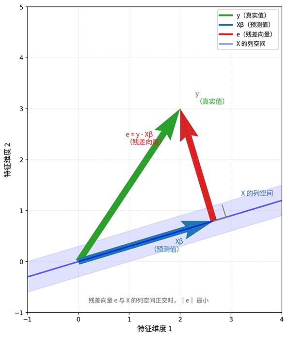

# Linear Regression

"Regression" originates from the research of 19th-century British statistician Francis Galton. While analyzing father-son height data, he observed an interesting phenomenon: the sons of taller fathers tended to be slightly shorter than their fathers, and the sons of shorter fathers tended to be slightly taller — children's heights seemed to "regress" toward the population average. Galton called this tendency toward the mean the "regression phenomenon." Later, the term "regression" was adopted by more and more literature, and its meaning gradually expanded, no longer referring only to mean reversion, but broadly to methods that use mathematical models to describe dependency relationships between variables. When we speak of **Linear Regression**, we mean using a linear function to characterize the quantitative relationship between input variables and output variables.

If probability and statistics teach us how to make decisions under uncertainty, then linear regression is the most fundamental and direct practice of this decision-making mindset. It greatly simplifies the complex world, assuming that the messy reality can be described by a straight line (or [hyperplane](https://en.wikipedia.org/wiki/Hyperplane)), attempting to capture relationships between variables with the simplest mathematical structure. Today, linear models are the "first lesson" in many statistical learning textbooks, not because they are "powerful," but quite the opposite — because they are "limited." Limited capability brings limited complexity and limited risk; limited parameters yield robust estimates, and limited assumptions yield interpretable results. These characteristics constitute the value and application scenarios of linear models:

1. **Interpretability**: Each coefficient in a linear model directly corresponds to the influence of a feature. The absolute value of a coefficient tells us "what to focus on," and its sign tells us the "direction of influence." This intuitiveness is crucial in scenarios that require explaining decision reasons, such as medical diagnosis and financial risk control.
2. **Robustness with Small Samples**: When data is limited, complex models tend to "overlearn" noise, while the simple structure of linear models becomes a form of protection. Twenty samples are meaningless for training a neural network, but training a linear regression model on them can yield valuable preliminary conclusions.
3. **Computational Efficiency**: Linear regression has a [closed-form solution](#closed-form-solution-of-linear-regression), obtaining the optimal solution in a single computation without iterative optimization. This efficiency makes it a default option for large-scale data processing and real-time prediction.

Of course, we should view things rationally from both sides. Linear regression does have significant limitations:

1. **Nonlinear Relationships**: Many relationships in the real world are not linear. House prices and area may exhibit diminishing marginal utility; user activity and income may follow an S-shaped curve. Linear models cannot directly capture these nonlinear patterns.
2. **Missing Feature Interactions**: Linear models assume that reality can be described by a straight line, which implicitly assumes that each feature independently affects the outcome. Therefore, they cannot automatically learn interaction effects between features. For example, the combined effect of "high income + high education" may be far greater than the sum of their individual effects. Linear models require manually constructed interaction features to capture such relationships.
3. **Limited Expressive Power**: For high-dimensional complex data such as images and speech, the simple structure of linear models struggles to extract effective features. This is the fundamental reason deep learning later emerged.

Understanding these limitations is not to negate the value of linear regression. Although simple in appearance, linear regression contains profound power. It is often the first step in exploring data and the foundation for understanding other, more complex models. Many hidden layers in today's deep neural networks are essentially linear transformations; linear models serve as building blocks for these complex models. Understanding linear regression is also the starting point for understanding deep learning.

## Linear Assumption

Let's start with a concrete example. Suppose we collected data on 10 houses in a city and plotted area versus price on a 2D coordinate system with $x$-axis as area and $y$-axis as price, as shown below. Based on life experience and the data in the figure, we can intuitively see that the larger the area, the higher the price. The ten data points roughly follow a straight line from low area and low price to high area and high price (this statistical data is simplified and does not account for real marginal effects). When faced with scattered data points in a coordinate system, our intuition is to naturally "draw a line through them." But how does a computer accurately draw this line? How is this line precisely quantified mathematically?


*Figure: House price vs area scatter plot*

The equation of a straight line in planar analytic geometry is $y = \beta_0 + \beta_1 x$. In this example, $\beta_0$ is the intercept (base price) and $\beta_1$ is the slope (price per square meter). If $\beta_0 = 30$ and $\beta_1 = 2$, then the line equation is $Price = 30 + 2 \times Area$, meaning: base price is 300,000, plus 20,000 per square meter.

We need to find a line by determining the specific values of $\beta_0$ and $\beta_1$ such that it fits all data points as closely as possible. "Closely" refers to the difference between the actual price and the predicted price — minimizing the error between predicted and actual values. For example, if the actual price of a 50 m² house is 1.2 million, and the line predicts $30 + 2 \times 50 = 130$ (10,000 CNY), then the error is $120 - 130 = -10$ (10,000 CNY). Note that when the prediction is too low the error is positive, and when it's too high the error is negative. Directly adding them would cause cancellation and fail to reflect the overall fit. Therefore, we use the **Sum of Squared Errors (SSE)** as a measure — squaring the errors and summing them turns all errors into positive values, better measuring the overall deviation.

In reality, house prices are not determined by area alone. Factors such as floor level, number of bedrooms, and distance to school all influence the final price. Extending the above reasoning to more general cases: suppose we have a dataset $\{(x_i, y_i)\}_{i=1}^{n}$, where $x_i \in \mathbb{R}^d$ is the input feature vector and $y_i \in \mathbb{R}$ is the output target value. The assumption of linear regression states: suppose there is a linear relationship between the target and the features, i.e., $y_i = \beta_0 + \beta_1 x_{i1} + \beta_2 x_{i2} + \cdots + \beta_d x_{id} + \epsilon_i$, where $\epsilon_i$ is the random error term.

For convenience in writing and computation, the linear assumption is usually expressed in [matrix-vector product](../../maths/linear/matrices.md#matrix-vector-product) form. Let $X$ be the design matrix (containing the features of all samples), $\beta$ be the parameter vector, and $\epsilon$ be the error vector: $y = X\beta + \epsilon$, where: $X = \begin{bmatrix} 1 & x_{11} & \cdots & x_{1 d} \\ 1 & x_{21} & \cdots & x_{2 d} \\ \vdots & \vdots & \ddots & \vdots \\ 1 & x_{n1} & \cdots & x_{nd} \end{bmatrix} \in \mathbb{R}^{n \times (d+1)}$ (the first column is all 1s, corresponding to the intercept term, such as the base price of 300,000 in the example), $\beta = \begin{bmatrix} \beta_0 \\ \beta_1 \\ \vdots \\ \beta_d \end{bmatrix} \in \mathbb{R}^{d+1}$, $\epsilon_i \sim N(0, \sigma^2)$.

## Ordinary Least Squares Criterion

In the house price prediction example, we sought a line through the data points that minimizes the overall error. To prevent positive and negative prediction errors from canceling each other out, we directly chose the sum of squared errors as our definition of overall error. You might have wondered: there are many ways to handle the sign cancellation problem — for instance, taking the sum of absolute values, $\sum|y_i - \hat{y}_i|$, which also avoids cancellation. So why squared errors specifically?

Part of the answer is that the absolute value function is not differentiable at zero, requiring special handling during optimization, which is mathematically inelegant. But the main reason for using squared errors is the classic statistical choice: the **Ordinary Least Squares (OLS)** criterion. "Least squares" literally means "the smallest sum of squares." This method was born in the field of astronomy. In the early 19th century, French mathematician Adrien-Marie Legendre, facing the challenge of noisy astronomical observation data, proposed this criterion: since we don't know which measurement is more accurate, let all measurements compete fairly, minimizing the sum of squared errors so that no measurement is favored and none is neglected — a simple intuition that became a classic of modern statistics. Mathematician Carl Friedrich Gauss also claimed to have proposed the criterion earlier but, having failed to publish in time, priority was given to Legendre. The fact that both arrived at the same discovery independently shows that least squares is a naturally emerging idea — when faced with the question "how to extract patterns from noisy data," this path is almost the simplest and most powerful choice.

Precisely stated in mathematical language, OLS solves the following problem: find a set of parameters $\beta$ that minimizes the following loss function:

$$L(\beta) = \sum_{i=1}^{n} (y_i - \hat{y}_i)^2 = \sum_{i=1}^{n} (y_i - x_i^T \beta)^2$$

This formula is called the **Sum of Squared Errors (SSE)**. It may seem complex, but broken down, the meaning is quite intuitive:
* $y_i$ is the actual value of the $i$-th sample (e.g., the actual price of a particular house)
* $\hat{y}_i = x_i^T \beta$ is the model's predicted value for that sample, i.e., the linear combination of the feature vector $x_i$ and the parameter vector $\beta$ (refer back to [Linear Assumption](#linear-assumption) $y = X\beta$)
* $(y_i - \hat{y}_i)^2$ is the squared error for that sample, measuring "how far the prediction deviated"
* $\sum_{i=1}^{n}$ accumulates the errors across all samples to obtain the overall degree of deviation

So $L(\beta)$ means: "the total deviation of the model across all samples." Our goal is to find the $\beta$ that minimizes this total deviation. For computational convenience, the loss function can be written in matrix form. Let the residual vector (i.e., the vector of differences between actual and predicted values for each sample) be $e = y - X\beta$, then the loss function can be rewritten as:

$$L(\beta) = e^T e = (y - X\beta)^T(y - X\beta) = \|y - X\beta\|^2$$

This formula shows the layered progression of the matrix form:
* $e = y - X\beta$ is the residual vector, i.e., the vector of errors for $n$ samples: $e = [e_1, e_2, \ldots, e_n]$, defaulting to a column vector of shape $n \times 1$. In the next multiplication step, the left multiplicand must be transposed into a $1 \times n$ row vector to produce a $1 \times 1$ result.
* The sum of squared residuals $e_1^2 + e_2^2 + \cdots + e_n^2$ is exactly the squared [L2 norm](../../maths/linear/vectors.md#norms) of $e$, i.e., $e^T e$ — the dot product of the vector with itself. Substituting the residual vector $e = y - X\beta$ yields $(y - X\beta)^T(y - X\beta)$.
* Since $\|y - X\beta\|^2$ is the squared L2 norm, and the L2 norm represents Euclidean distance, the geometric meaning of the loss function formula is "the squared length of the residual vector."

This matrix form is not only concise and elegant but, more importantly, reveals the geometric essence of OLS: minimizing the length of the residual vector. Placing this problem in geometric space also makes it intuitive. Suppose $X$ has $2$ columns and $n$ rows (1 feature, $n$ samples), then all column vectors of $X$ form a 2D plane — this is the "column space." $y$ is also a vector (1 column, $n$ rows — $n$ actual outcomes, one per sample), which generally does not lie exactly on this plane (otherwise it would mean perfect prediction). Our goal is: find a vector $X\beta$ within the column space that is as close to $y$ as possible. The shortest distance from a point outside a plane to the plane is along the perpendicular direction. In other words, the "projection" of $y$ onto the column space is the closest point. This projected point is $\hat{y} = X\beta$, and the line from $y$ to the projected point is the residual vector $e = y - X\beta$.



*Figure: Geometric intuition of OLS — projection of y onto the column space of X*

The figure above clearly shows the relationship among the three vectors. The green vector $y$ is the actual value, representing the outcome we observed. The blue vector $X\beta$ is the predicted value, lying in the column space of $X$. The red vector $e$ is the residual, pointing from the predicted value to the actual value, representing "the part the model could not explain." The key insight is that the minimized residual vector $e$ is **orthogonal** (perpendicular) to the column space — only when the residual is perpendicular to the column space does its length reach a minimum, just as the shortest distance from a point to a plane is always the perpendicular segment.

The [Projection Theorem](https://en.wikipedia.org/wiki/Hilbert_projection_theorem) gives a more precise statement: when the residual vector $y - X\beta$ is orthogonal to all column vectors of $X$, $\beta$ is the optimal solution. The mathematical expression for orthogonality is that the [dot product is zero](../../maths/linear/vectors.md#inner-product-and-projection), i.e., $X^T(y - X\beta) = 0$. This is precisely the starting point for deriving the closed-form solution in the next section.

## Closed-Form Solution of Linear Regression

The projection theorem tells us that the condition for achieving the optimal solution in linear regression is $X^T(y - X\beta) = 0$. Solving this equation gives: $\hat{\beta} = (X^TX)^{-1}X^Ty$. This is the famous **OLS closed-form solution formula**. Breaking it down:

* $X^TX$ is the [Gram matrix](https://en.wikipedia.org/wiki/Gram_matrix) (also called the information matrix) of the design matrix, with shape $(d+1) \times (d+1)$, containing the correlation information between features. $(X^TX)^{-1}$ is the inverse of this autocorrelation matrix, used to decouple the mutual influences among features.
* $X^Ty$: the cross-correlation vector between features and the target, with shape $(d+1) \times 1$, reflecting the direction of each feature's influence on the target.
* The overall formula: after "correcting" the cross-correlation vector with the inverse of the autocorrelation matrix, we obtain the weight coefficients for each feature.

The value of the closed-form solution lies in obtaining the optimal solution directly through a single matrix computation, without iterative optimization. This stands in stark contrast to methods like neural networks, which require repeated iterative parameter tuning. The simple structure of linear regression endows it with a concise form and high computational efficiency. The following code implements OLS linear regression, directly transforming the formula into code.

```python runnable
import numpy as np

class LinearRegression:
    """
    Manual OLS linear regression implementation,
    using closed-form solution: β = (X^T X)^(-1) X^T y
    """   
    def __init__(self):
        self.coef_ = None  # parameter vector (without intercept)
        self.intercept_ = None  # intercept
        self.beta_ = None  # full parameter vector
    
    def fit(self, X, y):
        """
        Train the model
        Parameters:
        X : ndarray, shape (n_samples, n_features)
            Feature matrix
        y : ndarray, shape (n_samples,)
            Target value vector
        """
        # Add intercept column (all ones)
        n_samples = X.shape[0]
        X_augmented = np.column_stack([np.ones(n_samples), X])
        
        # OLS closed-form solution: β = (X^T X)^(-1) X^T y
        # Use np.linalg.solve instead of direct inversion, more stable
        XtX = X_augmented.T @ X_augmented
        Xty = X_augmented.T @ y
        
        # Solve linear system XtX * β = Xty
        self.beta_ = np.linalg.solve(XtX, Xty)
        
        # Separate intercept and coefficients
        self.intercept_ = self.beta_[0]
        self.coef_ = self.beta_[1:]
        
        return self
    
    def predict(self, X):
        """
        Predict
        Parameters:
        X : ndarray, shape (n_samples, n_features)
            Feature matrix
        
        Returns:
        y_pred : ndarray, shape (n_samples,)
            Predicted values
        """
        return X @ self.coef_ + self.intercept_
    
    def score(self, X, y):
        """
        Calculate R² score
        R² = 1 - SS_res / SS_tot
        """
        y_pred = self.predict(X)
        ss_res = np.sum((y - y_pred) ** 2)  # Residual sum of squares
        ss_tot = np.sum((y - np.mean(y)) ** 2)  # Total sum of squares
        r2 = 1 - ss_res / ss_tot
        return r2

# Generate test data
n_samples = 100
n_features = 2

# True parameters: β_0 = 3, β_1 = 2, β_2 = -1
true_beta = np.array([3, 2, -1])
X = np.random.randn(n_samples, n_features)
noise = np.random.randn(n_samples) * 0.5  # Add noise
y = X[:, 0] * 2 + X[:, 1] * (-1) + 3 + noise

# Train model
model = LinearRegression()
model.fit(X, y)

# Output results
print("True parameters:", true_beta)
print("Estimated parameters:", model.beta_)

# Visualization: predicted vs actual values
import matplotlib.pyplot as plt
y_pred = model.predict(X)

fig, axes = plt.subplots(1, 2, figsize=(12, 5))

# Left: scatter plot of actual vs predicted values
axes[0].scatter(y, y_pred, alpha=0.6, edgecolors='k', linewidth=0.5)
axes[0].plot([y.min(), y.max()], [y.min(), y.max()], 'r--', lw=2, label='Ideal fit line')
axes[0].set_xlabel('Actual values')
axes[0].set_ylabel('Predicted values')
axes[0].set_title('Actual vs Predicted')
axes[0].legend()
axes[0].grid(True, alpha=0.3)

# Right: histogram of residuals
residuals = y - y_pred
axes[1].hist(residuals, bins=20, edgecolor='black', alpha=0.7)
axes[1].axvline(x=0, color='r', linestyle='--', lw=2, label='Zero residual line')
axes[1].set_xlabel('Residual (actual - predicted)')
axes[1].set_ylabel('Frequency')
axes[1].set_title('Residual distribution')
axes[1].legend()
axes[1].grid(True, alpha=0.3)

plt.tight_layout()
plt.show()
plt.close()
```

## Chapter Summary

This chapter starts from the application scenarios of linear regression and establishes a complete knowledge chain: **Assumption → Criterion → Solution**. The linear assumption $y = X\beta + \epsilon$ simplifies the world, compressing complex relationships into a straight line (or hyperplane). The ordinary least squares criterion $\arg\min_{\beta} \|y - X\beta\|^2$ establishes the standard for "optimality" of this line, i.e., minimizing the length of the residual vector. The projection theorem reveals the geometric essence of the OLS criterion: the residual is orthogonal to the column space, from which the closed-form solution $\hat{\beta} = (X^TX)^{-1}X^Ty$ is derived.

The true value of linear regression is not in the specific problems it can directly solve, but rather that many more complex models share with it the same thinking paradigm of **learning patterns from data**: first assume a model structure (some relational hypothesis), then define an optimization criterion (what kind of solution is "good"), and finally find the optimal parameters (how to solve). This paradigm runs throughout the entire field of statistical learning — logistic regression, support vector machines, neural networks — all are different variants of this paradigm. Understanding linear regression means understanding the starting point of this paradigm.

## Practice Problems

1. Given the design matrix $X = \begin{bmatrix} 1 & 2 \\ 1 & 4 \\ 1 & 6 \end{bmatrix}$ and target vector $y = \begin{bmatrix} 3 \\ 5 \\ 7 \end{bmatrix}$, use the closed-form solution formula $\hat{\beta} = (X^TX)^{-1}X^Ty$ to compute the regression coefficients and write the final regression equation.
    <details>
    <summary>Reference Answer</summary>
    Step 1: Compute $X^TX$
    $$X^TX = \begin{bmatrix} 1 & 1 & 1 \\ 2 & 4 & 6 \end{bmatrix} \begin{bmatrix} 1 & 2 \\ 1 & 4 \\ 1 & 6 \end{bmatrix} = \begin{bmatrix} 3 & 12 \\ 12 & 56 \end{bmatrix}$$

    Step 2: Compute $(X^TX)^{-1}$
    $$|X^TX| = 3 \times 56 - 12 \times 12 = 168 - 144 = 24$$
    $$\begin{bmatrix} 3 & 12 \\ 12 & 56 \end{bmatrix}^{-1} = \frac{1}{24}\begin{bmatrix} 56 & -12 \\ -12 & 3 \end{bmatrix} = \begin{bmatrix} 7/3 & -1/2 \\ -1/2 & 1/8 \end{bmatrix}$$

    Step 3: Compute $X^Ty$
    $$X^Ty = \begin{bmatrix} 1 & 1 & 1 \\ 2 & 4 & 6 \end{bmatrix} \begin{bmatrix} 3 \\ 5 \\ 7 \end{bmatrix} = \begin{bmatrix} 15 \\ 68 \end{bmatrix}$$

    Step 4: Compute $\hat{\beta}$
    $$\hat{\beta} = \begin{bmatrix} 7/3 & -1/2 \\ -1/2 & 1/8 \end{bmatrix} \begin{bmatrix} 15 \\ 68 \end{bmatrix} = \begin{bmatrix} 35 - 34 \\ -7.5 + 8.5 \end{bmatrix} = \begin{bmatrix} 1 \\ 1 \end{bmatrix}$$

    Therefore the regression equation is: $\hat{y} = 1 + 1 \cdot x = 1 + x$

    Verification: when $x=2$, $\hat{y}=3$; when $x=4$, $\hat{y}=5$; when $x=6$, $\hat{y}=7$. The predicted values exactly match the actual values, indicating that the data points happen to lie on a straight line, and the model fits perfectly.
    </details>

1. Explain why the ordinary least squares criterion uses the "sum of squared errors" rather than the "sum of absolute errors" as the loss function. Provide explanations from both mathematical optimization and statistical inference perspectives.
    <details>
    <summary>Reference Answer</summary>

    **Mathematical optimization perspective**:

    The squared function $f(x) = x^2$ is differentiable at all points (including zero), allowing us to use derivative-based optimization algorithms such as gradient descent and Newton's method. In contrast, the absolute value function $|x|$ is not differentiable at zero, requiring special handling during optimization (such as subgradient methods), which is mathematically less elegant and computationally more complex. Additionally, the squared loss function is convex with a unique global optimum; although the absolute loss is also convex, it may have a "flat region" near the optimum, making the solution less precise than with squared loss.

    **Statistical inference perspective**:

    Assuming the errors $\epsilon_i \sim N(0, \sigma^2)$ (following a normal distribution), maximizing the likelihood function is equivalent to minimizing the sum of squared errors. In other words, the ordinary least squares criterion is consistent with maximum likelihood estimation under the normal distribution assumption.

    The normal distribution is the most common distribution in nature; many random phenomena (such as measurement errors, biological characteristics) approximately follow a normal distribution. Therefore, the ordinary least squares criterion is not only a mathematically convenient choice but also has statistical theory support.
    </details>

1. Show the derivation process of solving for $\beta$ from the equation $X^T(y - X\beta) = 0$.
    <details>
    <summary>Reference Answer</summary>
    Using the distributive property of matrix multiplication, from $X^T(y - X\beta) = 0$ we obtain $X^Ty - X^TX\beta = 0$, rearranging gives $X^TX\beta = X^Ty$.

    Note that $X^TX$ is a $(d+1) \times (d+1)$ square matrix. When it is invertible (i.e., $X$ has full column rank, meaning the features are linearly independent), multiplying both sides by the inverse matrix:

    $$\hat{\beta} = (X^TX)^{-1}X^Ty$$
    </details>

1. In the house price prediction scenario, suppose we collected data on 5 houses: area (m²) and price (10,000 CNY) are $(60, 120)$, $(80, 160)$, $(100, 200)$, $(120, 230)$, $(150, 280)$. Implement linear regression in code to compute the price per square meter and the base price, and predict the price of a 90 m² house.
    <details>
    <summary>Reference Answer</summary>

    ```python runnable
    import numpy as np

    # Data preparation
    X = np.array([60, 80, 100, 120, 150])  # Area
    y = np.array([120, 160, 200, 230, 280])  # Price

    # Construct design matrix (add intercept column)
    n = len(X)
    X_augmented = np.column_stack([np.ones(n), X])

    # OLS closed-form solution
    XtX = X_augmented.T @ X_augmented
    Xty = X_augmented.T @ y
    beta = np.linalg.solve(XtX, Xty)

    print(f"Base price (intercept): {beta[0]:.2f} (10K CNY)")
    print(f"Price per sqm (slope): {beta[1]:.2f} (10K CNY/sqm)")

    # Predict price for 90 sqm house
    price_90 = beta[0] + beta[1] * 90
    print(f"Predicted price for 90 sqm: {price_90:.2f} (10K CNY)")
    ```

    **Note**: Since the data points do not perfectly lie on a straight line (the price of the 120 m² house at 230 (10K CNY) deviates from the linear trend), the model fit has some error. This illustrates that linear regression "approximates" by finding a line that best fits all points, rather than forcing the line through every point.
    </details>

1. Explain the meaning of the "linear assumption" and discuss whether the following scenarios are suitable for linear regression: (a) stock price prediction; (b) relationship between temperature and ice cream sales; (c) relationship between user age and social media usage time. For unsuitable cases, suggest improvement approaches.
    <details>
    <summary>Reference Answer</summary>

    **Meaning of the linear assumption**:

    The linear assumption $y = X\beta + \epsilon$ has two key points:
    1. **Linearity of relationship**: The output is determined by the weighted combination of input features (plus intercept), with no nonlinear interactions
    2. **Independent and identically distributed errors**: $\epsilon_i \sim N(0, \sigma^2)$, the errors follow a normal distribution and are independent of each other

    **Scenario analysis**:

    (a) **Stock price prediction**: Not suitable. Stock prices are influenced by multiple complex factors and exhibit significant nonlinear characteristics (such as marginal effects, market sentiment fluctuations). Additionally, stock sequences have temporal correlation, so errors are not independent. Improvement approach: use time series models (such as ARIMA, LSTM) or introduce nonlinear features.

    (b) **Temperature and ice cream sales**: Generally suitable. As temperature rises, sales roughly increase linearly. However, note that extremely high temperatures may cause sales to decline (people are less willing to go out), creating a nonlinear inflection point. Improvement approach: use piecewise linear regression, or introduce a quadratic term for temperature to capture nonlinearity.

    (c) **User age and social media usage time**: Not suitable. Young people use it for long periods, middle-aged people moderately, and elderly people less — exhibiting an inverted U-shape or step-like pattern rather than a linear relationship. Improvement approach: introduce a quadratic term for age ($y = \beta_0 + \beta_1 \cdot age + \beta_2 \cdot age^2$), or analyze by age group.

    **Summary**: The prerequisite for applying linear regression is that "the relationship is approximately linear and errors are independently normal." When these assumptions are violated, improvements can be made through feature transformation, introducing interaction terms, or using other models. Understanding the boundaries of assumptions is a prerequisite for correctly applying models.
    </details>
