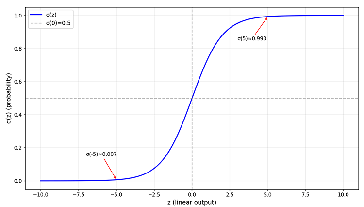

# Logistic Regression

In the 19th century, statisticians discovered that the logistic function in population statistics naturally possesses the property of mapping any real number to the interval $(0,1)$, making it suitable as a mathematical expression of probability. Hence, people used this function to describe classification problems through regression of probability values, and it was named **Logistic Regression**. Although this naming convention — calling something "regression" while solving classification problems — has long been criticized, after a century of use, it has become widely established as a classic misnomer in supervised learning. Generally speaking, in supervised learning, tasks can be divided into two categories based on the type of output:

- **Regression**: Predicts continuous numerical output. The goal is to estimate a specific numeric value, such as house price prediction (outputting a specific amount) or temperature prediction (outputting a specific temperature value). The output space of regression tasks is the continuous real number domain, and the model aims for "predicted values as close to the true values as possible."
- **Classification**: Predicts discrete class labels. The goal is to determine which category a sample belongs to, such as email classification (spam or normal) or disease diagnosis (sick or healthy). The output space of classification tasks is a finite discrete set, and the model aims for "whether the judgment is correct or not."

Logistic regression builds a decision foundation using a linear function, then transforms the linear output into probabilities through the logistic function, and finally makes classification judgments using probability thresholds. This design of "solving classification problems with regression thinking" demonstrates how probabilistic thinking bridges the gap between numerical prediction and category judgment, and also laid the foundation for subsequent neural networks (whose output layer is essentially logistic regression).

Logistic regression inherits the advantages of linear models, also possessing interpretability: each coefficient corresponds to the influence of a feature, the sign indicates "whether it promotes or inhibits," and the magnitude indicates "strength of influence." For example, in customer churn prediction, a positive coefficient for "number of complaints" means more complaints indicate higher churn risk; a negative coefficient for "activity level" means higher activity indicates lower churn risk. This intuitiveness makes it highly favored in scenarios requiring explanation of decision reasons, such as medical diagnosis and financial risk control. At the same time, logistic regression also has good robustness with small sample data — when data is limited, complex models tend to overlearn noise, whereas the simple structure of logistic regression becomes a form of protection. Of course, as a linear model, logistic regression also has clear limitations:

1. **Linear decision boundary**: Logistic regression is essentially a linear model transformed through the logistic function, and its decision boundary is still a straight line (or hyperplane). When the two classes of data exhibit nonlinear distributions (e.g., circular or crescent shapes), logistic regression cannot classify effectively, requiring the introduction of feature transformations or [kernel methods](../support-vector-machines/kernel-methods.md).

2. **Missing feature interactions**: Like linear regression, logistic regression assumes that each feature independently affects the outcome, and cannot automatically learn interaction effects between features. For example, the combined effect of "high income + high education" may be far greater than the sum of their individual effects, and logistic regression requires manually constructed interaction features to capture such relationships.

3. **Sensitivity to imbalanced data**: When one class accounts for an extremely high proportion of samples (e.g., 99% of emails are normal and only 1% are spam), logistic regression tends to predict all samples as the majority class, resulting in extremely poor recognition of the minority class. Mitigation requires adjusting thresholds, weighting the loss function, or employing sampling strategies.

## The Boundary Between Regression and Classification

Let us use a concrete example, combined with the [linear regression](linear-regression.md) we encountered earlier, to understand the boundary between regression and classification tasks, and to answer why linear regression cannot directly solve classification problems. Consider a simplified email classification scenario: predicting whether an email is spam (label 1 for spam, label 0 for normal). Suppose the feature $x$ represents "the number of suspicious keywords," and we have collected the following data:

| Email ID | Suspicious Keyword Count ($x$) | Label ($y$) |
|:--------:|:-----------------------------:|:----------:|
| 1 | 2 | 0 |
| 2 | 5 | 0 |
| 3 | 8 | 1 |
| 4 | 12 | 1 |

First, let's try fitting the data with linear regression, obtaining the equation $\hat{y} \approx 0.12x - 0.30$ via the [OLS closed-form solution](linear-regression.md#closed-form-solution-of-linear-regression). Assume that if $\hat{y}$ exceeds a threshold of 0.5, it is spam, otherwise normal. Now use this equation to predict the following three new emails:

- Email A: suspicious keywords appear 3 times, predicted value $\hat{y} = 0.1 \times 3 - 0.3 = 0$, classified as normal ✓
- Email B: suspicious keywords appear 7 times, predicted value $\hat{y} = 0.1 \times 7 - 0.3 = 0.4$, classified as normal ($0.4 < 0.5$)?
- Email C: suspicious keywords appear 20 times, predicted value $\hat{y} = 0.1 \times 20 - 0.3 = 1.7$, classified as spam ($1.7 > 0.5$)?

Problems immediately become apparent: the predicted value of 0.4 for email B falls in a "gray area" — neither close to 0 nor close to 1. Can we confidently determine this is a normal email? The problem with email C is even worse: the predicted value 1.7 exceeds the label range $\{0, 1\}$. What does this "1.7" mean? Can the probability of spam exceed 100%? It is thus clear that the linear regression model output $\hat{y} = X\beta$ can be any real number. Using a threshold to segment real numbers and directly applying linear regression to binary classification introduces many confusing problems:

1. **Unbounded output**. Linear regression output can be any value, such as $y = -10$ or $y = 100$. When the true label is 1 and the model output is 100, although the threshold judgment is correct ($100 \geq 0.5$), this output cannot be interpreted as "probability." The mathematical definition of probability requires its range to be within $[0,1]$, and the number 100 is meaningless in a probabilistic context.

2. **Unreasonable loss function**. Linear regression uses the squared loss $L(y, \hat{y}) = (y - \hat{y})^2$. When the true label is 1 and the model output is 100, the squared loss computes $(1 - 100)^2 = 9801$, which is an extremely large penalty. But in fact, the model has already made the correct judgment (predicting class 1) and should not be penalized so severely. The mathematical properties of squared loss are inherently incompatible with the semantic logic of classification tasks.

3. **Sensitivity to outliers**. Suppose there are a few extreme samples in the dataset whose true label is 1 but whose feature values are abnormally large (e.g., a sample with suspicious keyword count as high as 100). To "get closer" to these extreme values, linear regression will significantly adjust its parameters, potentially causing the entire decision boundary to shift and affecting classification accuracy on normal samples.

The root of these problems is that linear regression assumes the output is a continuous numerical value, pursuing "predicted values close to true values," whereas classification tasks require "correct or incorrect judgment." The objective functions of the two do not match, and this cannot be resolved simply by applying a threshold. Logistic regression, by introducing the Sigmoid function, fundamentally solves this mismatch.

## Sigmoid Function

The Sigmoid function (which is the logistic function mentioned earlier) is defined as: $\sigma(z) = \frac{1}{1 + e^{-z}} = \frac{e^z}{1 + e^z}$. Its graph is an S-shaped curve, which is precisely why it is called the "Sigmoid" function (in Greek, Sigmoid means "shaped like the letter Sigma," resembling the curve of $\sigma$), as shown in the figure below:



*Figure: S-shaped curve of the Sigmoid function*

This curve was first used to model population growth: when the population is small, growth is slow (the left end of the function tends to 0); when the population is moderate, growth accelerates (the middle segment has the largest slope); when the population approaches the environmental carrying capacity, growth saturates (the right end of the function tends to 1). Later, statisticians discovered that the Sigmoid function has the following properties, making it an ideal choice for probabilistic modeling:

1. **Range $(0,1)$**: The output is strictly limited to between 0 and 1, asymptotically approaching but never reaching the boundaries, making it perfectly interpretable as a probability interval.
2. **Monotonically increasing**: The larger the input, the closer the output is to 1, consistent with the intuition that "the more conditions are satisfied, the higher the probability."
3. **Center point $\sigma(0) = 0.5$**: When the input is 0, the output is 0.5, representing "complete uncertainty."
4. **Concise derivative**: $\sigma'(z) = \sigma(z)(1-\sigma(z))$, a property that greatly facilitates subsequent gradient computation.

These four points can all be easily observed from the Sigmoid function graph: the steepest part of the Sigmoid curve is at $z=0$, where $\sigma(0) = 0.5$ and the derivative $\sigma'(0) = 0.5 \times 0.5 = 0.25$ reaches its maximum. As $z$ approaches either end, the curve flattens and the derivative approaches 0. This property means: when the prediction is "uncertain" (probability near 0.5), the model is most sensitive to parameter changes; when the prediction is "certain" (probability near 0 or 1), the model is insensitive to parameter changes — "having made a judgment, no longer easily swayed."

However, there is one prerequisite that cannot be simply answered from the Sigmoid function graph alone: why should $\sigma(z)$ represent the probability of an event occurring, rather than some arbitrary numerical mapping? The answer to this question becomes clearer when examining the inverse function of Sigmoid (the function obtained by swapping the independent and dependent variables). Let the Sigmoid output be $p = \sigma(z)$; its inverse is $z = \log\frac{p}{1-p}$ (called the Logit function — note that Logit is the inverse of Logistic, not an abbreviation). The expression $\log\frac{p}{1-p}$ has a specialized name in statistics: the **log odds**. To explain what log odds are, we must first start with the concept of **odds**.

Let the probability of an event occurring be $p$; odds is defined as the ratio of the probability of occurrence to non-occurrence: $odds = \frac{p}{1-p}$. The concept of odds is very common in daily life. For example, if the predicted probability of rain is $p = 0.8$, then $odds = 0.8/0.2 = 4$, and we often say "it is 4 times more likely to rain than not." If the predicted probability of winning a game is $p = 0.25$, then $odds = 0.25/0.75 = 1/3$, and we say "the odds of winning are only one in three." Odds transform probability into a "multiples relationship," more intuitively expressing the relative strength of an event occurring.

The range of odds is $(0, +\infty)$: when $p$ is close to 1, odds tends to infinity; when $p$ is close to 0, odds tends to 0. This asymmetric range is inconvenient for mathematical processing. Taking the logarithm yields the log odds ($\log odds = \log\frac{p}{1-p}$). This transformation maps the range of odds from $(0, +\infty)$ to the real number domain $(-\infty, +\infty)$, and the relationship is monotonically increasing: the larger $p$ is, the larger the log odds are; when $p = 0.5$, $\log odds = \log 1 = 0$; when $p > 0.5$, $\log odds > 0$; when $p < 0.5$, $\log odds < 0$.

Now, returning to the inverse of Sigmoid, $z = \log\frac{p}{1-p}$, it becomes clear that the input $z$ of the Sigmoid function is precisely the log odds of the probability $p$. In other words:

$$p = \sigma(z) = \sigma(\log\frac{p}{1-p})$$

This means that if we let the output of the linear model $X\beta$ represent the "log odds," then through the Sigmoid transformation, $\sigma(X\beta)$ naturally becomes the probability of the event occurring. This insight reveals the design philosophy of logistic regression: logistic regression consists of two parts — decision and output. The decision part is still the linear $X\beta$, representing the log odds learned from the samples (an unbounded real value suitable for linear model processing). The output part, through the Sigmoid transformation $\sigma$, "translates" the log odds back into a probability (a bounded $(0,1)$ value satisfying the mathematical constraints of probability). This design skillfully bridges the gap between linear regression and classification tasks: linear regression excels at predicting unbounded real numbers, classification tasks require bounded probabilities, and the bridge between them is the log odds. The linear model predicts log odds, and the Sigmoid function completes the final "translation" work.

## Logistic Regression Optimization Criterion

Now that we have solved the "probability output" problem — the Sigmoid function maps the linear model's output to the $(0,1)$ interval, and the prediction can be interpreted as "the probability of an event occurring" — this is only half the work done. With predicted probabilities $\hat{p}$, we still need a criterion to measure how accurate the predictions are. This is precisely the problem that the loss function solves.

After the previous derivation of the [ordinary least squares criterion](linear-regression.md#ordinary-least-squares-criterion), we already know the definition of a loss function: given the true label $y$ and the predicted value $\hat{y}$, the loss function $L(y, \hat{y})$ quantifies "how far the prediction deviates from the truth." The smaller the loss, the more accurate the prediction. In linear regression, we use the squared loss $(y - \hat{y})^2$. Can squared loss still be used in logistic regression?

Intuitively, squared loss seems applicable to classification tasks: true label is $1$, predicted probability is $0.8$, loss is $(1-0.8)^2 = 0.04$; true label is $0$, predicted probability is $0.3$, loss is $(0-0.3)^2 = 0.09$. It appears to satisfy the requirement that the closer the prediction is to the true label, the smaller the loss. However, in practice, squared loss encounters a major obstacle during the minimization of the logistic regression loss function. Recall how we minimized the loss function in linear regression — we directly solved for the optimal parameters from the OLS closed-form solution formula $\hat{\beta} = (X^TX)^{-1}X^Ty$, without needing iterative optimization. The reason a closed-form solution exists is that the loss function $L(\beta) = (y - X\beta)^2$ is quadratic in $\beta$; after differentiation, setting the gradient to zero yields the linear system $X^TX\beta = X^Ty$, which can be directly solved for $\beta$.

Logistic regression, however, cannot enjoy this convenience of a one-step solution. Although the predicted value $\hat{y} = X\beta$ is linear, the Sigmoid function in the predicted probability $\hat{p} = \sigma(X\beta)$ is nonlinear, making the loss function $L(\beta) = (y - \sigma(X\beta))^2$ no longer a simple quadratic function in $\beta$. After differentiation, no solvable linear system exists, and there is no closed-form solution. Therefore, logistic regression can only employ iterative optimization methods to find a numerical solution.

The essence of the [gradient](../../maths/calculus/gradient.md#gradients) is the direction of the steepest increase of a function, so the negative gradient direction can serve as a guide for minimizing the model's loss function. Starting from some initial parameter and iteratively optimizing along the negative gradient direction until the gradient reaches zero, the loss function converges to a minimum. This method is called **Gradient Descent**.

Now, the problem with squared loss begins to surface. Iterative optimization requires computing the gradient of the loss function with respect to the parameters $\beta$ using the [chain rule](../../maths/calculus/gradient.md#composite-functions-and-the-chain-rule). However, there is a nonlinear "middleman" — the predicted probability $\hat{p}$ — between the parameters $\beta$ and the loss function $L$. The path of gradient propagation is:

$$L \xrightarrow{\frac{\partial L}{\partial \hat{p}}} \hat{p} \xrightarrow{\frac{\partial \hat{p}}{\partial z}} z \xrightarrow{\frac{\partial z}{\partial \beta}} \beta$$

In other words, the loss function does not directly depend on the parameters $\beta$, but is indirectly influenced through $z = X\beta$ and $\hat{p} = \sigma(z)$. According to the chain rule, the gradient must be propagated layer by layer:

$$\frac{\partial L}{\partial \beta} = \frac{\partial L}{\partial \hat{p}} \cdot \frac{\partial \hat{p}}{\partial z} \cdot \frac{\partial z}{\partial \beta}$$

Computing these three derivatives term by term:

1. **Derivative of loss with respect to probability**: Squared loss $L = (y - \hat{p})^2$, differentiating with respect to $\hat{p}$, yields $\frac{\partial L}{\partial \hat{p}} = 2(\hat{p} - y)$

2. **Derivative of probability with respect to intermediate value**: Predicted probability $\hat{p} = \sigma(z)$, differentiating with respect to $z$, using the Sigmoid derivative property $\sigma'(z) = \sigma(z)(1-\sigma(z))$, yields $\frac{\partial \hat{p}}{\partial z} = \hat{p}(1-\hat{p})$

3. **Derivative of intermediate value with respect to parameters**: Linear part $z = X\beta$, differentiating with respect to $\beta$, yields $\frac{\partial z}{\partial \beta} = X$

Multiplying these three terms together, the gradient of squared loss with respect to parameters $\beta$ is:

$$\nabla_\beta L = 2(\hat{p} - y) \cdot \hat{p}(1-\hat{p}) \cdot X$$

This formula reveals the paradox of squared loss: when the model's prediction is close to the correct boundary ($\hat{p}$ close to 0 or 1), the factor $\hat{p}(1-\hat{p})$ approaches 0, and the gradient tends to vanish. In other words, the more "confidently correct" the model's judgment, the weaker the learning motivation. Consider an extreme scenario: the true label is 1, but the current predicted probability is $\hat{p} = 0.01$ (an extremely large error). The gradient would then be $2(0.01-1) \times 0.01(1-0.01) \approx -0.02$, an extremely weak learning signal. The model has made a serious error, yet due to the "squeezing effect" of Sigmoid, it can barely learn from its mistake. This contradicts the learning logic of classification tasks: the more wrong the prediction, the stronger the learning motivation should be, not weaker.


*Figure: Convex vs non-convex function graph*

Furthermore, after introducing Sigmoid, squared loss becomes a **non-convex function**. As shown in the figure above, the squared loss of linear regression is a convex function with a unique global optimum; the optimization process is guaranteed to converge to the optimal parameters. However, the nonlinear transformation of Sigmoid causes the surface of $(y - \sigma(X\beta))^2$ to potentially have multiple "peaks" and "valleys," and gradient descent may become trapped in local optima, unable to find the best parameters. This is fundamentally different from linear regression's "straight downhill to the valley floor." The two serious problems of vanishing gradients and non-convex optimization make squared loss fundamentally incompatible with the inherent logic of classification tasks. We need to find a loss function suitable for classification tasks.

## Cross-Entropy Loss

Let us start from a fundamental statistical perspective to find a loss function suitable for classification tasks. Classification problems can all be modeled as a [Bernoulli distribution](../../maths/probability/probability-basics.md#bernoulli-distribution): each sample label $y_i$ is viewed as the outcome of a Bernoulli trial, either occurring ($y_i=1$) or not occurring ($y_i=0$), with the probability of occurrence denoted as $p_i$. The probability formula for a Bernoulli distribution is:

$$P(y_i) = p_i^{y_i}(1-p_i)^{1-y_i}$$

The elegance of this formula lies in the fact that when $y_i=1$, the probability is $p_i$; when $y_i=0$, the probability is $1-p_i$. A single formula covers both cases without the need for branching. Assuming samples are independent, the joint likelihood of all samples (i.e., the probability of simultaneously observing this set of labels) is the product of the individual probabilities:

$$L(\beta) = \prod_{i=1}^{n} p_i^{y_i}(1-p_i)^{1-y_i}$$

When discussing statistical inference, we learned about the core idea of [maximum likelihood estimation](../../maths/probability/statistical-inference.md#maximum-likelihood-estimation): finding the parameters $\beta$ that maximize the probability of observing the current dataset. We want the model's output probabilities $p_i$ to closely match the true labels $y_i$ — for samples with label 1, $p_i$ should be large; for samples with label 0, $p_i$ should be small — which is entirely consistent with the intuition of classification tasks. Following the standard procedure of maximum likelihood estimation, we first take the logarithm to convert multiplication into addition, obtaining the log-likelihood function:

$$\log L(\beta) = \sum_{i=1}^{n} [y_i \log p_i + (1-y_i)\log(1-p_i)]$$

Next, we apply two mathematical adjustments. Following the convention in machine learning, optimization of the loss function typically means "minimizing the loss," so we add a negative sign to make maximizing the log-likelihood equivalent to minimizing the **negative** log-likelihood. Additionally, dividing by the number of samples $n$ for averaging ensures the loss value does not fluctuate with data scale, providing the intuitive meaning of "average loss per sample." Adding the constant factor $1/n$ does not change the location of the optimal solution but makes the gradient more stable:

$$J(\beta) = -\frac{1}{n}\sum_{i=1}^{n} [y_i \log p_i + (1-y_i)\log(1-p_i)]$$

The result after these two transformations is called **Cross-Entropy Loss**, which is the loss function used in logistic regression. The name "cross-entropy" originates from information theory, measuring the difference between two probability distributions. However, the derivation here comes entirely from the statistical principle of maximum likelihood, where mathematics and intuition achieve perfect unity.

## Gradient Descent Optimization in Practice

Now, let us replace the squared error loss with cross-entropy loss and go through the optimization process again following the [logistic regression optimization criterion](#logistic-regression-optimization-criterion). The gradient propagation path remains:

$$J \xrightarrow{\frac{\partial J}{\partial p}} p \xrightarrow{\frac{\partial p}{\partial z}} z \xrightarrow{\frac{\partial z}{\partial \beta}} \beta$$

Computing these three derivatives term by term:

1. **Derivative of loss with respect to probability**: The cross-entropy loss for a single sample is $J_i = -[y_i \log p_i + (1-y_i)\log(1-p_i)]$. When differentiating with respect to $p_i$, the data $y_i$ has two possible values. When $y_i = 1$, the second half of the cross-entropy loss is zero, simplifying to $-y_i \log p_i$, with derivative $-\frac{1}{p_i}$. When $y_i = 0$, the first half of the cross-entropy loss is zero, simplifying to $-\log(1-p_i)$, with derivative $\frac{1}{1-p_i}$. Combining both cases, the derivative is: $\frac{\partial J_i}{\partial p_i} = -\frac{y_i}{p_i} + \frac{1-y_i}{1-p_i}$

2. **Derivative of probability with respect to intermediate value**: Identical to the previous derivation, using the Sigmoid derivative property $\sigma'(z) = \sigma(z)(1-\sigma(z))$, yields $\frac{\partial p_i}{\partial z_i} = p_i(1-p_i)$.

3. **Derivative of intermediate value with respect to parameters**: Identical to the previous derivation, the linear part $z_i = X_i\beta$, differentiating with respect to $\beta$, yields $\frac{\partial z_i}{\partial \beta} = X_i$.

Multiplying the three terms together, the gradient of cross-entropy loss with respect to parameters $\beta$ is:

$$\frac{\partial J_i}{\partial \beta} = \left(-\frac{y_i}{p_i} + \frac{1-y_i}{1-p_i}\right) \cdot p_i(1-p_i) \cdot X_i$$

At first glance, this formula looks quite complex. However, by expanding the expression inside the parentheses:

$$\frac{\partial J_i}{\partial \beta} = \left(-\frac{y_i}{p_i} + \frac{1-y_i}{1-p_i}\right) \cdot p_i(1-p_i) = -y_i \cdot \frac{1}{p_i} \cdot p_i(1-p_i) + (1-y_i) \cdot \frac{1}{1-p_i} \cdot p_i(1-p_i)$$

Observe each term: $p_i$ and $\frac{1}{p_i}$ multiply to give $1$, and $(1-p_i)$ and $\frac{1}{1-p_i}$ also multiply to give $1$. The numerator and denominator cancel out perfectly — this is the exquisite design of cross-entropy loss. Simplification yields a remarkably elegant result:

$$\frac{\partial J_i}{\partial \beta} = (p_i - y_i) X_i$$

Finally, averaging over all samples gives the complete gradient vector:

$$\nabla_\beta J = \frac{1}{n}\sum_{i=1}^{n} (p_i - y_i) X_i = \frac{1}{n}X^T(p - y)$$

In the gradient, $(p_i - y_i)$ represents the deviation between the predicted probability and the true label. When the prediction is accurate ($p_i \approx y_i$), the gradient is close to 0, and the parameters stop adjusting. When the prediction is wrong (e.g., $y_i=1$ but $p_i=0.3$), the gradient is positive, guiding the parameters to increase the output of $X_i\beta$, thereby raising $p_i$. In contrast to the vanishing gradient problem of squared loss, the gradient of cross-entropy loss $(p_i - y_i)$ always has a significant value when the prediction is wrong, and the learning speed is not affected by the position of $\hat{p}$. This is precisely the property needed for classification tasks: the more wrong the prediction, the stronger the learning motivation; the more correct the prediction, the weaker the learning motivation.

With the gradient formula in hand, we follow the standard steps of the gradient descent algorithm, iteratively updating the parameters until the loss converges (gradient near zero) or the maximum number of iterations is reached:

1. **Forward propagation**: Compute predicted probabilities $p = \sigma(X\beta)$ using the current parameters $\beta$.
2. **Compute gradient**: Calculate the gradient value using the formula $\nabla_\beta J = \frac{1}{n}X^T(p - y)$.
3. **Parameter update**: Adjust parameters along the negative gradient direction $\beta' = \beta - \alpha \nabla_\beta J$, where $\alpha$ is the learning rate.

Here, the learning rate $\alpha$ controls the step size of each parameter update. If too large, it may overshoot the optimal solution, causing oscillation; if too small, convergence will be slow. In practice, the appropriate learning rate is typically determined through experimental tuning.

The following code implements a complete logistic regression model from scratch using NumPy. It transforms the mathematical formulas derived earlier into a runnable program: the `sigmoid` function implements the Sigmoid transformation, `cross_entropy_loss` computes the cross-entropy loss, and the `fit` method performs iterative gradient descent optimization. The entire implementation demonstrates the mapping between theoretical derivation and engineering practice.

```python runnable extract-class="LogisticRegression"
import numpy as np

class LogisticRegression:
    """
    Manual logistic regression implementation
    Uses gradient descent to optimize cross-entropy loss
    """   
    def __init__(self, learning_rate=0.1, n_iterations=1000):
        self.lr = learning_rate           # Learning rate, controls the step size of gradient descent
        self.n_iterations = n_iterations  # Number of iterations, maximum gradient descent rounds
        self.coef_ = None                 # Feature coefficients (weights), saved after training
        self.intercept_ = None            # Intercept term, saved after training
        self.loss_history = []            # Loss history, used for visualizing the convergence process
    
    def sigmoid(self, z):
        """Sigmoid function"""
        z = np.clip(z, -500, 500)
        return 1 / (1 + np.exp(-z))
    
    def cross_entropy_loss(self, y, p):
        """Cross-entropy loss"""
        # Avoid log(0)
        eps = 1e-15
        p = np.clip(p, eps, 1 - eps)
        return -np.mean(y * np.log(p) + (1 - y) * np.log(1 - p))
    
    def fit(self, X, y):
        """
        Train the model (gradient descent)
        
        Parameters:
        X : ndarray, shape (n_samples, n_features)
            Feature matrix
        y : ndarray, shape (n_samples,)
            Label vector (0 or 1)
        """
        n_samples, n_features = X.shape
        
        # Initialize parameters
        self.coef_ = np.zeros(n_features)
        self.intercept_ = 0
        
        # Gradient descent iterations
        for i in range(self.n_iterations):
            # Compute predicted probabilities
            z = X @ self.coef_ + self.intercept_
            p = self.sigmoid(z)
            
            # Record loss
            self.loss_history.append(self.cross_entropy_loss(y, p))
            
            # Compute gradient (concise gradient of cross-entropy loss)
            gradient_coef = (1 / n_samples) * (X.T @ (p - y))
            gradient_intercept = (1 / n_samples) * np.sum(p - y)
            
            # Update parameters
            self.coef_ -= self.lr * gradient_coef
            self.intercept_ -= self.lr * gradient_intercept
        
        return self
    
    def predict_proba(self, X):
        """Predict probabilities"""
        z = X @ self.coef_ + self.intercept_
        return self.sigmoid(z)
    
    def predict(self, X, threshold=0.5):
        """Predict class labels"""
        proba = self.predict_proba(X)
        return (proba >= threshold).astype(int)
    
    def score(self, X, y):
        """Compute accuracy"""
        y_pred = self.predict(X)
        return np.mean(y_pred == y)

# Test: generate binary classification data
n_samples = 200

# Two features
X = np.random.randn(n_samples, 2)

# True decision boundary: x1 + x2 > 0 is class 1
y = (X[:, 0] + X[:, 1] > 0).astype(int)

# Train the model
model = LogisticRegression(learning_rate=0.1, n_iterations=1000)
model.fit(X, y)

print("=== Logistic Regression Results ===")
print(f"Coefficients: {model.coef_}")
print(f"Intercept: {model.intercept_:.4f}")
print(f"Training accuracy: {model.score(X, y):.3f}")
print(f"Final loss: {model.loss_history[-1]:.4f}")

# Prediction examples
print("\nPrediction examples:")
test_samples = np.array([[1, 1], [-1, -1], [0.5, -0.3]])
proba = model.predict_proba(test_samples)
pred = model.predict(test_samples)
for i, (sample, p, label) in enumerate(zip(test_samples, proba, pred)):
    print(f"Sample {i+1}: {sample}, predicted probability = {p:.4f}, predicted class = {label}")

# Visualization: loss convergence
import matplotlib.pyplot as plt

plt.figure(figsize=(10, 5))
plt.plot(model.loss_history)
plt.xlabel('Iteration')
plt.ylabel('Cross-Entropy Loss')
plt.title('Logistic Regression Training: Loss Convergence')
plt.grid(True, alpha=0.3)
plt.show()
plt.close()
```

## Multinomial Logistic Regression

The theoretical foundation of logistic regression is the Bernoulli distribution, which can only solve binary classification problems. When there are more than two classes (e.g., classifying emails into "normal, spam, suspicious"), we need to output multiple probabilities simultaneously, and these probabilities must sum to 1 (the normalization constraint of probability distributions). A naive idea might be to train a separate Sigmoid model for each class, but this would result in probabilities that do not sum to 1, and the multiple models would lack coordination. Therefore, we need a unified extension framework that outputs the probability distribution over all classes at once. This extension is called **Multinomial Logistic Regression** (or Softmax Regression).

Let the model output $K$ values $z_1, z_2, \ldots, z_K$ (corresponding to $K$ classes). These values can be arbitrary real numbers with no constraints. The task of the Softmax function is to transform these $K$ unbounded real numbers into a valid probability distribution. Its definition is:

$$P(y=k) = \frac{e^{z_k}}{\sum_{j=1}^{K} e^{z_j}}$$

This formula is simple yet effective. First, the exponential function $e^{z_k}$ maps real numbers to positive values (a basic requirement for probabilities) while maintaining monotonicity: the larger $z_k$, the larger $e^{z_k}$, and the larger the corresponding probability. Second, the denominator is the sum of all exponentiated values, serving to normalize and ensure that all probabilities sum to 1.

Consider a concrete example: suppose the output values for three classes are $z = [2, 1, 0.5]$. Compute $e^z = [e^2, e^1, e^{0.5}] \approx [7.39, 2.72, 1.65]$, with a total of approximately 11.76. The probability of the first class is $P(y=1) = 7.39/11.76 \approx 0.63$, the second class is $P(y=2) = 2.72/11.76 \approx 0.23$, and the third class is $P(y=3) = 1.65/11.76 \approx 0.14$. The three probabilities sum to exactly 1, and the class with the larger output value has the higher probability.

Based on the above discussion, the Softmax function has the following properties:

1. **Normalization**: $\sum_{k=1}^{K} P(y=k) = 1$, which is a natural consequence of the denominator design.
2. **Monotonicity**: The larger $z_k$, the larger the corresponding probability, a direct extension of the monotonicity of the exponential function.
3. **Relative relationship**: The probability depends on relative scores, not absolute scores. Adding (or subtracting) 10 to all $z_k$ simultaneously multiplies (or divides) each $e^{z_k}$ by $e^{10}$, and the numerator and denominator change together, leaving the probability distribution completely unchanged. This property has an important application in numerical computation: when a particular $z_k$ is very large, causing $e^{z_k}$ to overflow, we can subtract the maximum value from all $z_k$, avoiding overflow while preserving the probability result.

Finally, the relationship between Softmax and Sigmoid reveals the mathematical consistency between the two. When the number of classes is $K=2$, let $z_1 = z$, $z_2 = 0$ (using the second class as the reference point with a relative score of 0), and substitute into the Softmax formula:

$$P(y=1) = \frac{e^{z}}{e^{z} + e^{0}} = \frac{e^{z}}{1 + e^{z}} = \sigma(z)$$

This is precisely the expression for the Sigmoid function, demonstrating that Softmax is a natural generalization of Sigmoid. In the binary case, the two are equivalent. In the multiclass case, Softmax extends "one probability" into "a set of probability distributions," with the mathematical core unchanged — only the output dimension increases from 1 to $K$. This combination of "linear output + Softmax transformation" later became the standard architecture for neural networks. The output layer of almost all neural network models is Softmax regression: the preceding hidden layers perform feature transformation, and the final layer transforms the features into probabilistic decisions. Understanding the principles of logistic regression and Softmax regression also prepares us for studying deep neural networks and large language models.

## Logistic Regression Application

The following code demonstrates a typical application of logistic regression in a business scenario. An enterprise analyzes customer characteristics such as activity level, number of complaints, and usage duration to predict churn probability, enabling proactive retention measures. This is a typical binary classification problem: churn ($y=1$) or not churn ($y=0$). The advantage of logistic regression is that it outputs churn probability rather than a simple class label, allowing decision-makers to formulate differentiated customer care strategies based on probability levels — for instance, proactively intervening with high-risk customers while maintaining routine service for stable customers. This example also demonstrates the value of logistic regression's interpretability: the three coefficients quantify the direction and strength of each feature's influence on churn risk, enabling business personnel to directly formulate intervention strategies.


```python runnable
import numpy as np
import matplotlib.pyplot as plt
from shared.linear.logistic_regression import LogisticRegression

# Simulate customer data
n_customers = 500

# Features: months of use, activity score, number of complaints
months = np.random.randint(1, 60, n_customers)
activity_score = np.random.uniform(0, 100, n_customers)
complaints = np.random.randint(0, 5, n_customers)

X = np.column_stack([months, activity_score, complaints])

# Churn logic: low activity + many complaints = high churn probability
z_true = -activity_score/50 + complaints*0.5 - months/100
churn_prob_true = 1/(1 + np.exp(-z_true))
y = (churn_prob_true > np.random.uniform(0, 1, n_customers)).astype(int)

# Train model
model = LogisticRegression(learning_rate=0.01, n_iterations=2000)
model.fit(X, y)

# Create visualization
fig, axes = plt.subplots(1, 3, figsize=(14, 4))

# Chart 1: Feature coefficient bar chart
features = ['Months of Use', 'Activity Score', 'Complaints']
colors = ['#2ecc71' if c < 0 else '#e74c3c' for c in model.coef_]
axes[0].barh(features, model.coef_, color=colors)
axes[0].axvline(x=0, color='black', linewidth=0.5)
axes[0].set_xlabel('Coefficient Value')
axes[0].set_title('Feature Influence on Churn\n(Green = Reduces Risk, Red = Increases Risk)')
for i, v in enumerate(model.coef_):
    axes[0].text(v + 0.02 if v > 0 else v - 0.08, i, f'{v:.3f}', va='center', fontsize=10)

# Chart 2: Model performance and customer distribution
accuracy = model.score(X, y)
churn_rate = y.sum() / len(y)
axes[1].bar(['Model Accuracy', 'Actual Churn Rate'], [accuracy, churn_rate], color=['#3498db', '#9b59b6'])
axes[1].set_ylim(0, 1)
axes[1].set_ylabel('Proportion')
axes[1].set_title('Model Prediction Performance')
for i, v in enumerate([accuracy, churn_rate]):
    axes[1].text(i, v + 0.05, f'{v:.1%}', ha='center', fontsize=12)

# Chart 3: New customer churn probability prediction
new_customer = np.array([[12, 30, 3]])  # 12 months, activity 30, 3 complaints
churn_prob = model.predict_proba(new_customer)[0]
stay_prob = 1 - churn_prob

# Pie chart showing probabilities
probs = [stay_prob, churn_prob]
labels = ['Retention Probability', 'Churn Probability']
colors_pie = ['#2ecc71', '#e74c3c']
wedges, texts, autotexts = axes[2].pie(probs, labels=labels, colors=colors_pie,
                                        autopct='%1.1f%%', startangle=90,
                                        explode=(0, 0.1 if churn_prob > 0.5 else 0))
axes[2].set_title('New Customer Prediction\n(12 months, activity 30, 3 complaints)')

# Add recommendation text below chart 3
risk_level = "High-Risk Customer" if churn_prob > 0.5 else "Stable Customer ✓"
fig.text(0.72, 0.02, f'Recommendation: {risk_level}', ha='center', fontsize=11,
         color='#e74c3c' if churn_prob > 0.5 else '#2ecc71')

plt.tight_layout()
plt.subplots_adjust(bottom=0.12)
plt.show()

print(f"Intercept: {model.intercept_:.4f}")
```


## Summary

Logistic regression uses regression thinking to solve classification problems. Its core design is "linear decision + Sigmoid translation." It remains categorized as a linear model, inheriting the advantages of linear models — strong interpretability, robustness with small samples — but also has limitations such as a linear decision boundary, missing feature interactions, and sensitivity to imbalanced data. In the next chapter, we will discuss how to address the "overlearning" problem of linear models — regularization and generalized linear models — exploring how to improve expressive power and robustness while maintaining model simplicity.

## Exercises

1. Given a dataset: features $X = \begin{bmatrix} 1 & 2 \\ 2 & 3 \\ 3 & 4 \\ 4 & 5 \end{bmatrix}$, labels $y = \begin{bmatrix} 0 \\ 0 \\ 1 \\ 1 \end{bmatrix}$. Implement logistic regression using gradient descent, find the decision boundary equation, and compute the training accuracy.
    <details>
    <summary>Reference Answer</summary>
    
    ```python runnable
    import numpy as np
    
    # Data preparation
    X = np.array([[1, 2], [2, 3], [3, 4], [4, 5]])
    y = np.array([0, 0, 1, 1])
    
    # Manual gradient descent
    n_samples, n_features = X.shape
    coef = np.zeros(n_features)
    intercept = 0
    lr = 0.1
    
    for i in range(1000):
        z = X @ coef + intercept
        p = 1 / (1 + np.exp(-z))
        
        grad_coef = (1/n_samples) * X.T @ (p - y)
        grad_intercept = (1/n_samples) * np.sum(p - y)
        
        coef -= lr * grad_coef
        intercept -= lr * grad_intercept
    
    print(f"Coefficients: {coef}")
    print(f"Intercept: {intercept:.4f}")
    print(f"Decision boundary equation: {coef[0]:.2f}*x1 + {coef[1]:.2f}*x2 + {intercept:.2f} = 0")
    
    # Prediction
    y_pred = (p >= 0.5).astype(int)
    accuracy = np.mean(y_pred == y)
    print(f"Training accuracy: {accuracy:.2f}")
    ```
    </details>

2. In the Sigmoid function, why is it necessary to clip the input $z$ (e.g., `np.clip(z, -500, 500)`)? What problem would occur without clipping?
    <details>
    <summary>Reference Answer</summary>
    
    **Numerical overflow problem**:
    
    Sigmoid computes $1/(1+e^{-z})$. When $z$ is a very large negative number (e.g., $z=-1000$), $e^{-z} = e^{1000}$ is astronomically large, far exceeding the representable range of floating-point numbers, causing an `inf` overflow. In this case, $1/(1+\inf) = 0$, which is mathematically correct, but the computation is unstable.
    
    More critically, when $z$ is a very large positive number (e.g., $z=1000$), $e^{-z} = e^{-1000}$ is close to 0, and the computation is normal. However, if the code first computes $e^{-z}$ and then adds, precision loss may occur in some extreme cases.
    
    **Purpose of clipping**:
    
    `np.clip(z, -500, 500)` limits $z$ to a reasonable range. When $z=-500$, $\sigma(z) \approx 7 \times 10^{-218}$, which is already sufficiently close to 0; when $z=500$, $\sigma(z) \approx 1 - 7 \times 10^{-218}$, which is sufficiently close to 1. Clipping values beyond this range does not change the mathematical meaning (still representing "extremely unlikely" or "extremely likely") but avoids overflow risk.
    
    **More elegant alternative**:
    
    Use `np.where(z >= 0, 1/(1+np.exp(-z)), np.exp(z)/(1+np.exp(z)))`, selecting a different computation formula based on whether $z$ is positive or negative, which completely avoids overflow. This is a standard technique for numerical stability.
    </details>

3. Explain the numerical stability principle of "subtracting the maximum value" (`z_shifted = z - np.max(z)`) in the Softmax function, and explain why this does not affect the probability result.
    <details>
    <summary>Reference Answer</summary>
    
    **Overflow problem**:
    
    Softmax computes $e^{z_k} / \sum_j e^{z_j}$. When some $z_k$ is very large (e.g., $z_k = 1000$), $e^{1000}$ far exceeds the floating-point range, causing an `inf` overflow and the entire computation fails.
    
    **Principle of subtracting the maximum**:
    
    Let $z_{max} = \max_j z_j$, subtract $z_{max}$ from all $z_k$:
    
    $$P(y=k) = \frac{e^{z_k - z_{max}}}{\sum_j e^{z_j - z_{max}}} = \frac{e^{z_k}/e^{z_{max}}}{\sum_j e^{z_j}/e^{z_{max}}} = \frac{e^{z_k}}{\sum_j e^{z_j}}$$
    
    The numerator and denominator are both divided by $e^{z_{max}}$, leaving the result unchanged. But now the largest $z_k - z_{max} = 0$, corresponding to $e^0 = 1$; all other values are less than or equal to 0, so $e^{\text{negative}}$ falls within $(0,1]$, avoiding overflow.
    
    **Mathematical demonstration**:
    
    Suppose $z = [1000, 1001, 999]$. Direct computation would overflow. After subtracting the maximum, $z' = [-1, 0, -2]$, compute:
    
    $$P = [e^{-1}, e^0, e^{-2}] / (e^{-1}+e^0+e^{-2}) = [0.368, 1, 0.135] / 1.503 \approx [0.245, 0.665, 0.090]$$
    
    This is consistent with the theoretical result without clipping but avoids overflow.
    
    **Key insight**:
    
    The Softmax result depends only on the relative magnitudes of $z$, not their absolute magnitudes. Adding or subtracting a constant to all values leaves the probability distribution unchanged. Subtracting the maximum is a "zero-cost" numerical trick that ensures stability without altering the mathematical result.
    </details>

4. In a customer churn prediction scenario, suppose the dataset has 1000 customers, of which 950 have not churned (label 0) and 50 have churned (label 1). After training, the logistic regression model may predict all customers as "not churned." Explain why this occurs and propose three solutions.
    <details>
    <summary>Reference Answer</summary>
    
    **Root cause**:
    
    When data is severely imbalanced, the model tends to predict the majority class. The reason is: if the model predicts all samples as $p=0$ (not churned), the loss for 950 correct samples is $-\log(1) = 0$, and the loss for 50 incorrect samples is $-\log(0) \to \infty$. However, in practice, predicting $p=0$ means $\log(0)$ is undefined, so the model tends to predict small probability values close to 0, and the gradient is dominated by the gradient direction of the majority class. Conversely, if the model predicts all samples as $p \approx 0.05$ (matching the churn proportion in the data), the total loss may be lower. The mathematical properties of the cross-entropy loss make "biased toward the majority class" a "suboptimal but viable" compromise.
    
    **Solutions**:
    
    1. **Adjust classification threshold**: The default threshold of 0.5 is unsuitable for imbalanced data. Based on business needs, the threshold can be lowered to 0.1 or even lower, predicting churn whenever $p > 0.1$. This improves the recall of churning customers but increases false positives (misclassifying stable customers as churning).
    
    2. **Weighted loss function**: Assign larger weights to minority class samples. Modify the loss as:
       $$J = -\frac{1}{n}\sum_i [w_1 \cdot y_i \log p_i + w_0 \cdot (1-y_i)\log(1-p_i)]$$
       where $w_1 > w_0$ (e.g., $w_1 = 19, w_0 = 1$, inversely proportional to the sample ratio). This amplifies errors on the minority class, forcing the model to pay attention to churn samples.
    
    3. **Sampling strategies**:
       - Oversampling: Duplicate minority class samples to make the two classes roughly equal in size.
       - Undersampling: Randomly sample from the majority class to reduce its size.
       - SMOTE: Synthesize new minority class samples (via interpolation) rather than simple duplication.
    
    **Recommendation**:
    
    Adjusting the threshold is the simplest but may sacrifice overall accuracy. Weighted loss retains all data but requires parameter tuning. Sampling strategies are effective but may introduce bias. In practice, multiple methods are often combined, and the strategy is adjusted based on business objectives (e.g., "better to have false positives than miss a churner").
    </details>
