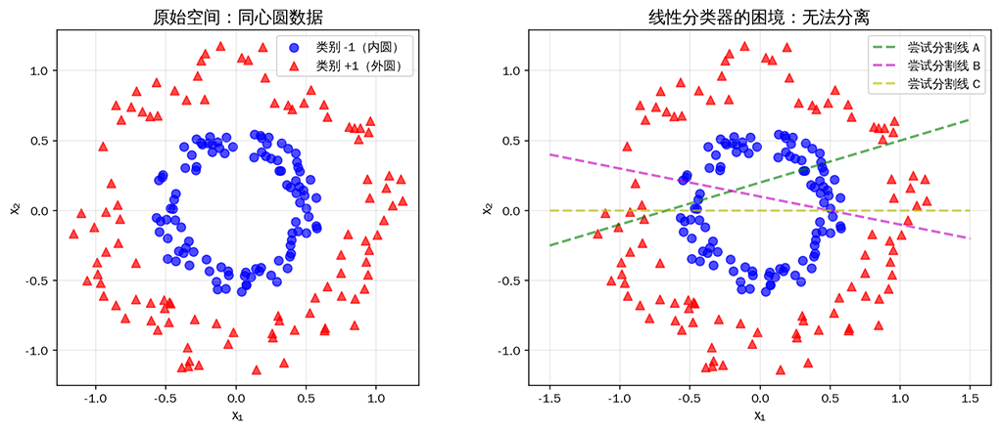
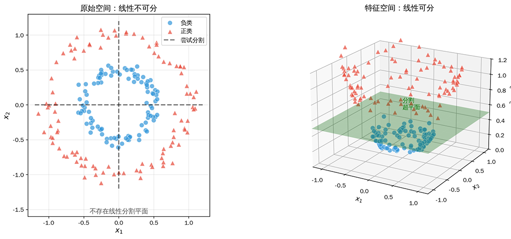
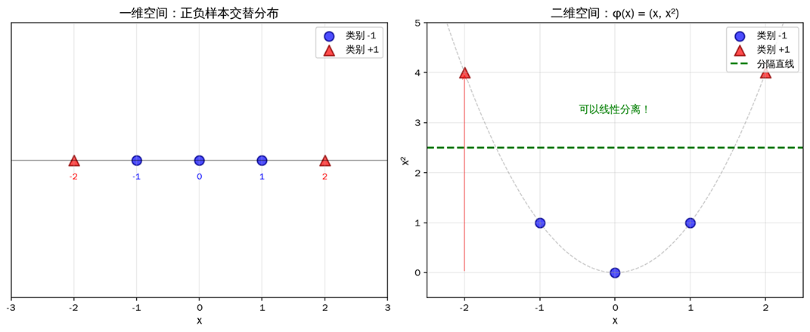
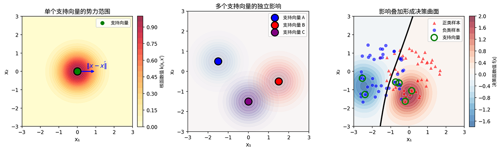

# Kernel Trick

For a long time, linear models have been favored for their rigorous theoretical foundations and fast solution methods, while their application scenarios have been limited by the practical difficulty that many problems are nonlinear. People naturally hoped to enable linear classifiers to handle nonlinear data without altering the core logic of the algorithm. In 1964, three Soviet mathematicians proposed using an "implicit mapping" to bypass high-dimensional space computation. Although this idea did not attract widespread attention at the time, it planted the seeds of the kernel trick.

The person who truly brought the kernel trick to maturity was Vladimir Vapnik. In 1992, Vapnik and his colleagues published the paper "[A Training Algorithm for Optimal Margin Classifiers](https://dl.acm.org/doi/10.1145/130385.130401)", systematically introducing the kernel trick into support vector machines for the first time. SVMs, which could originally only handle linear problems, suddenly gained the ability to process complex nonlinear patterns while maintaining the elegance and efficiency of the algorithm. Later, Vapnik further elaborated on the deeper significance of this idea in his book "[The Nature of Statistical Learning Theory](https://link.springer.com/book/10.1007/978-1-4757-3264-1)", and the kernel trick thus became a classic paradigm in the field of machine learning.

## Feature Space Dimensionality Expansion

Looking back at the [Maximum Margin Hyperplane](svm-max-margin.md#maximum-margin-hyperplane) we learned in the previous chapter, it is easy to identify an implicit assumption: the data must be linearly separable or approximately linearly separable. When data distribution exhibits complex nonlinear patterns, the assumption of "separating positive and negative classes with a single hyperplane" breaks down. As shown in the figure below, no hyperplane can distinguish between the two classes of data.



*Figure: Concentric circles data distribution (left) and the dilemma of linear classifiers (right). No matter how many dividing lines are tried, the inner and outer circles cannot be completely separated*

Faced with such linearly inseparable data, the traditional approach is to design a nonlinear decision boundary, but this means abandoning SVM's elegant mathematical framework. The **Kernel Trick** provides a smarter solution: **map the data to a high-dimensional space, where it can be linearly separated**. More ingeniously, we can perform this mapping implicitly without explicitly computing the high-dimensional feature coordinates, thereby cleverly bypassing the computational trap of dimensional explosion. In high-dimensional space, originally linearly inseparable data may become linearly separable. The mathematical principle behind this can be traced back to **Cover's Theorem** proposed in 1965.

::: info Cover's Theorem
Suppose there is a mapping function $\phi: \mathbb{R}^d \rightarrow \mathbb{R}^D$ that maps original features to a higher-dimensional space $x \mapsto \phi(x)$. After data is randomly mapped to a sufficiently high-dimensional space, the probability of the data becoming linearly separable increases significantly.
:::

Using a real-life analogy, imagine you scatter a mix of black and white sesame seeds and rice grains on a table. On the tabletop, the sesame seeds and rice grains are intertwined, making it difficult to completely separate them with a stick. But if you put the sesame seeds and rice grains into a bucket of water, the sesame seeds float on the surface while the rice grains sink to the bottom (in this example, the different densities of rice and sesame represent implicit high-dimensional features). Then a piece of paper can easily separate them, as shown in the figure below:



*Figure: Nonlinearly separable data in low-dimensional space (left) becomes linearly separable after mapping to high-dimensional space (right). Blue dots represent the negative class, red triangles represent the positive class, and the green plane is the separating hyperplane in high-dimensional space*

Let us consider another concrete numerical example to demonstrate the effect of applying Cover's Theorem for dimensionality expansion. Consider one-dimensional data $x \in \mathbb{R}$, where the negative samples are $x \in \{-2, 2\}$ and the positive samples are $x \in \{-1, 0, 1\}$, as shown in the figure below. In one-dimensional space, no matter which splitting point is chosen, some samples will be misclassified because the positive and negative samples are interleaved, and no "one-size-fits-all" solution exists. However, if we map the data to two-dimensional space using $\phi(x) = (x, x^2)$, the situation changes completely. Observe the right figure: all positive samples (red triangles) fall in the bottom region of the parabola, while negative samples (blue dots) are distributed on both higher sides. A horizontal dividing line $x^2 = 2$ can perfectly separate the two classes. This again demonstrates that seemingly complex nonlinear patterns in the original space may simply be linear patterns in a higher-dimensional space, once we change to a more "spacious" coordinate system for observation.



*Figure: Positive and negative samples alternating in one-dimensional space (left), separable by a straight line after mapping to two-dimensional space (right)*

Although the dimensionality expansion strategy is effective, it is not without cost. In SVM practice, it faces two serious challenges:

- **Storage cost**: For polynomial mappings, the feature dimension grows dramatically. With $d$ original features, mapping to all polynomial combinations of degree up to $p$ increases the feature dimension to $\binom{d+p}{p}$. For example, when $d=100$ and $p=3$, the new dimension is $\binom{103}{3} = 176,851$. For the [RBF kernel](#rbf-kernel), the corresponding feature space is even infinite-dimensional, making storage theoretically impossible.

- **Computational cost**: Even if the storage cost of the dimensions is acceptable, in the SVM dual problem objective function, samples appear in pairwise inner products (in the form $x^T x'$, as derived in SVM's [Lagrangian Dual Transformation](svm-max-margin.md#lagrangian-dual-transformation)). After dimensionality expansion mapping, this becomes $\phi(x)^T \phi(x')$, requiring first the mapping operation and then computing the inner product in the expanded dimensions, resulting in an unacceptable time complexity.

This is precisely the moment for the kernel trick to shine. The innovation of the kernel trick lies not in the dimensionality expansion itself, but in cleverly solving the two problems above — it does not need to explicitly compute $\phi(x)$, only the inner product $\phi(x)^T \phi(x')$, which can be directly completed through the kernel function, bypassing the mapping step entirely.

## Implicit Inner Product Computation

Having understood the value and cost of dimensionality expansion, the **Kernel Trick** can be summarized in one sentence: instead of explicitly constructing the high-dimensional mapping $\phi(x)$, it directly computes the equivalent result of the inner product $\phi(x)^T \phi(x')$ of samples in the high-dimensional space. This means that whether the mapped space is of thousands, millions, or infinite dimensions, since the concrete form of $\phi(x)$ is never constructed, there is no need to store high-dimensional vectors. Furthermore, the computational cost is greatly reduced because there is no longer a two-step process of mapping first and then computing the inner product; instead, the kernel function directly yields the equivalent result of the inner product computation.

The key to all this is the introduction of the **Kernel Function**, whose value equals the inner product of two samples mapped in the feature space. Think of the kernel function as a translator: it can directly tell you how similar two samples are in the high-dimensional space without you having to actually go to that high-dimensional space to measure it. It is like being able to tell whether two people come from the same region by their accents, without needing to precisely look up their specific addresses in a household registration system. The theoretical foundation of kernel functions comes from **Mercer's Theorem** proposed in 1909.

::: info Mercer's Theorem
A function $k$ can serve as a valid kernel function if and only if for any dataset $\{x_1, \ldots, x_n\}$, the kernel matrix $K$ defined by $K_{ij} = k(x_i, x_j)$ is positive semi-definite.
:::

To understand this statement, we first need to explain two related concepts. One is the **Kernel Matrix**, also called the Gram matrix, which we have already used as a cache for inner product computation in [SVM Practice](svm-max-margin.md#soft-margin-svm-in-practice). The kernel matrix is formed by applying the kernel function to all pairs of samples in the dataset. Suppose there are $n$ samples $\{x_1, x_2, \ldots, x_n\}$, the kernel matrix $K$ is an $n \times n$ symmetric matrix whose entry in row $i$ and column $j$ is defined as $K_{ij} = k(x_i, x_j) = \phi(x_i)^T \phi(x_j)$. According to the geometric meaning of [vector inner products](../../maths/linear/vectors.md#inner-product-and-projection), the kernel matrix stores the pairwise similarities of all samples in the feature space, with each element $K_{ij}$ telling us how similar samples $x_i$ and $x_j$ are in the high-dimensional space.

The other concept is the **Positive Semi-Definite Matrix**, which is mathematically defined as: for any vector $v$, a positive semi-definite matrix $K$ satisfies $v^T K v \geq 0$. The meaning of a positive semi-definite matrix can be understood as guaranteeing that the kernel function corresponds to a valid inner product operation in some feature space. If a kernel matrix is positive semi-definite, then for any coefficient vector, the quadratic form of the kernel matrix is always non-negative, ensuring that the kernel function indeed corresponds to the inner product operation in some feature space. Geometrically, this means the space will not be distorted into strange shapes.

Now, returning to the [SVM dual problem](svm-max-margin.md#lagrangian-dual-transformation), note that in the dual problem, whether in the optimization objective function or the decision function, the sample feature $x$ never appears alone — it always appears in pairs as the inner product $x_i^T x_j$. This means we do not need to know what the mapped sample features look like; we only need to know the similarity between two samples after mapping.

$$\arg \max_\alpha \sum_{i=1}^{n} \alpha_i - \frac{1}{2} \sum_{i=1}^{n} \sum_{j=1}^{n} \alpha_i \alpha_j y_i y_j \underbrace{x_i^T x_j}_{\text{replace with kernel function}}$$

Therefore, the kernel trick simply replaces $x_i^T x_j$ with $k(x_i, x_j)$, and SVM gains the ability to handle nonlinear problems. This replacement may seem simple, but it fully preserves the core logic of the SVM algorithm (maximizing the margin), simply swapping "similarity in the original space" for "similarity in the high-dimensional space."

## Common Kernel Functions

Choosing an appropriate kernel function is essentially about finding a balance between **model complexity** and **computational efficiency**. The three most commonly used kernel functions — linear kernel, polynomial kernel, and RBF kernel — represent a continuous spectrum from simple to complex. Understanding their differences helps in making appropriate choices for practical problems.

### Linear Kernel

The **linear kernel** is the simplest member of the kernel function family, directly computing the inner product in the original feature space: $k(x, x') = x^T x'$. Strictly speaking, the linear kernel does not even involve dimensionality expansion; it fully preserves the structure of the original feature space. This property of not performing any transformation is precisely its greatest advantage: the lowest computational cost and the strongest theoretical interpretability.

The linear kernel may seem like it changes nothing, so what purpose does it serve? First, the linear kernel unifies the scenario of linearly separable data under the framework of the kernel trick. If one expands dimensions just for the sake of expansion, forcibly using a complex kernel function would only increase the burden of parameter tuning and the risk of overfitting. Another scenario is when the feature dimension is extremely high while the number of samples is relatively small — in such cases, the linear kernel is often the better choice. Text classification is a typical example: documents represented using a [bag-of-words model](../../deep-learning/sequence-models/word-embedding.md#one-hot-encoding-and-bag-of-words-model) easily reach tens or even hundreds of thousands of dimensions (corresponding to the vocabulary size) while having only a few thousand samples. The high-dimensional space itself provides ample freedom for separation, making the benefits of nonlinear kernels very limited while slowing down training.

### Polynomial Kernel

If the linear kernel represents zero dimensionality expansion, the **polynomial kernel** goes to the other extreme, explicitly constructing a finite-dimensional higher-order feature space: $k(x, x') = (x^T x' + c)^p$, where $p$ is the polynomial degree and $c$ is a constant offset term (usually set to 0 or 1). When expanded, the corresponding feature space includes all combinations of the original features up to degree $d$. For instance, for two-dimensional features $x = (x_1, x_2)$, the explicit mapping corresponding to the quadratic polynomial kernel $(x^T x' + 1)^2$ is:

$$\phi(x) = (1, \sqrt{2}x_1, \sqrt{2}x_2, x_1^2, \sqrt{2}x_1 x_2, x_2^2)$$

Note the coefficient design here: the cross term $x_1 x_2$ carries a coefficient of $\sqrt{2}$, which ensures consistent weighting of terms after expansion. When the original feature dimension is $d$ and the polynomial degree is $p$, the number of features after expansion is $\binom{d+p}{p}$. When $d=100$ and $p=3$, the dimension expands from 100 to 176,851, representing a considerable storage cost.

The value of the polynomial kernel lies in explicitly modeling the interaction relationships between features. If domain prior knowledge suggests that certain feature combinations are crucial for the prediction target (e.g., the product of "age" and "income" for predicting spending power), the polynomial kernel provides a mechanism for directly introducing such interaction terms. Unlike the black-box nonlinearity of the RBF kernel, the mapping of the polynomial kernel is transparent and interpretable — we know which orders of feature combinations the model is looking at.

However, the polynomial kernel has a relatively low usage rate in practice because it requires manually selecting two hyperparameters — the degree $p$ and the constant term $c$ — leading to a heavier tuning burden. Moreover, for most nonlinear problems, the RBF kernel often performs as well as or better than the polynomial kernel.

### RBF Kernel

The **RBF kernel** (Radial Basis Function), also known as the Gaussian kernel, is the most popular choice for kernel SVMs. Its kernel function is expressed as:

$$k(x, x') = \exp\left(-\frac{\|x - x'\|^2}{2\sigma^2}\right) = \exp(-\gamma \|x - x'\|^2)$$

Here $\gamma = \frac{1}{2\sigma^2}$ is the parameter controlling the width of the [Gaussian distribution](../../maths/probability/probability-basics.md#normal-distribution). Unlike the finite-dimensional feature space of the polynomial kernel, the feature space corresponding to the RBF kernel is **infinite-dimensional**. Theoretically, it can represent arbitrarily complex nonlinear patterns in the original space, making it a "universal" nonlinear tool.

An intuitive way to understand the RBF kernel is to observe its distance-decay characteristic. When the Euclidean distance $\|x - x'\|$ between two samples in the original space is large, the kernel function value decays exponentially toward 0, meaning they are nearly orthogonal (dissimilar) in the high-dimensional feature space; when the distance is 0 (i.e., the two samples coincide), the kernel function value is 1 (maximum similarity). This locally sensitive property allows the RBF kernel SVM's decision boundary to flexibly conform to the local distribution of data. Each support vector acts like an influence source, forming a Gaussian-shaped "sphere of influence" around itself, and the superposition of all influence sources constitutes the final decision surface.

The parameter $\gamma$ controls the radius of influence of each support vector. When $\gamma$ is large, the Gaussian distribution becomes narrow, the influence range of each support vector is limited to nearby regions, and the model tends to tailor the decision boundary to each local data cluster, potentially leading to overfitting. When $\gamma$ is small, the Gaussian distribution becomes wide, the influence range of individual support vectors expands, the decision boundary becomes smoother, model complexity decreases, and underfitting may occur. This "radius-complexity" correspondence is the intuition for tuning the RBF kernel parameter.



*Figure: Conceptual illustration of the "sphere of influence" of RBF kernel support vectors*

The figure above illustrates the essence of the RBF kernel SVM decision mechanism.
- The left panel shows the distribution of kernel function values around a single support vector. This is a Gaussian surface centered on the support vector, where the function value decays faster with increasing distance — the mathematical expression of the "sphere of influence."
- The middle panel shows the distribution of independently generated Gaussian influence fields in space when multiple support vectors coexist.
- The right panel reveals the formation mechanism of the final decision surface: the influence of each support vector is weighted by its class label (positive weight for the positive class, negative weight for the negative class) and then superimposed in space. When the superposition result is zero, a decision boundary (black curve) is formed. This locally sensitive property allows the RBF kernel to flexibly conform to arbitrarily complex local distributions. Each support vector exerts influence only in its neighboring region, while the overall decision surface is the weighted sum of all support vector influences.

The characteristics and applicable scenarios of the three kernel functions are summarized in the table below:

| Kernel Function | Parameters | Feature Space Dimension | Applicable Scenarios |
|----------------|-----------|------------------------|---------------------|
| Linear Kernel | None | Original dimension | Linearly separable, high-dimensional sparse data |
| Polynomial Kernel | $p, c$ | $\binom{d+p}{p}$ (finite) | Scenarios with clear feature interactions |
| RBF Kernel | $\gamma$ | Infinite | General nonlinear problems |

The selection of kernel functions can follow a progressive decision path. When facing a new problem, first observe the data characteristics. If the feature dimension is comparable to or higher than the number of samples (e.g., text, gene data), prioritize the linear kernel. High-dimensional sparse data already provides ample separation freedom, so the benefits of nonlinear kernel dimensionality expansion are limited. If the data is clearly nonlinearly separable and the feature dimension is not high, the RBF kernel is a safer default choice. With its infinite-dimensional feature space expressiveness, it can adapt to various complex boundary shapes. The polynomial kernel is suitable for scenarios with clear modeling requirements for feature interactions, or as a fallback when the RBF kernel performs poorly.

It is worth emphasizing that more complex kernel functions are not always better. Although the linear kernel is simple, it performs well on many real-world datasets and offers irreplaceable interpretability advantages. While the RBF kernel can theoretically fit any pattern, it is also more prone to overfitting and requires careful parameter tuning with cross-validation. A common mistake in practice is to eagerly switch to the RBF kernel upon seeing only 70% accuracy with the linear kernel, while overlooking the possibility that the 30% error may stem from data noise or labeling errors rather than insufficient model expressiveness. In the world of machine learning, "just right" complexity often outperforms "overly powerful" models.

## Kernel SVM in Practice

We have discussed the theoretical foundations of the kernel trick. Now it is time to translate this theory into runnable code. The following code supports three common kernel functions — linear, polynomial, and RBF — using a gradient ascent approach to solve the dual problem. It is helpful to compare this with the [Soft-Margin SVM in Practice](svm-max-margin.md#soft-margin-svm-in-practice) from the previous chapter. The implementation of kernel SVM mainly consists of four steps:

**Step 1: Kernel matrix computation**: Unlike the linear kernel of the soft-margin SVM, kernel SVM needs to compute the kernel matrix $K[i,j] = k(x_i, x_j)$ according to different kernel functions. For the linear kernel, $k(x, x') = x^T x'$, computed directly using matrix multiplication. For the polynomial kernel, $k(x, x') = (x^T x' + c)^p$, where the inner product is first computed and then transformed polynomially. For the RBF kernel, $k(x, x') = \exp(-\gamma \|x - x'\|^2)$, using the distance formula $\|x - x'\|^2 = \|x\|^2 + \|x'\|^2 - 2x^T x'$ for vectorized computation, avoiding explicit loops. The kernel matrix is a symmetric matrix that stores the similarities of all sample pairs in the feature space.

**Step 2: Iterative update of Lagrange multipliers $\alpha$**: The dual problem formulation of kernel SVM is the same as that of soft-margin SVM, with the objective function $\arg \max_{\alpha} \sum_{i=1}^{n} \alpha_i - \frac{1}{2} \sum_{i=1}^{n} \sum_{j=1}^{n} \alpha_i \alpha_j y_i y_j k(x_i, x_j)$. The only difference is replacing the inner product $x_i^T x_j$ with the kernel function $k(x_i, x_j)$. Gradient ascent is used for optimization, where for each $\alpha_i$, the gradient is $\frac{\partial L}{\partial \alpha_i} = 1 - y_i \sum_{j=1}^{n} \alpha_j y_j K[j,i]$. After each iteration, $\alpha_i$ is projected into the constraint interval $[0, C]$, and mean correction is applied to all $\alpha$ values to satisfy the equality constraint $\sum \alpha_i y_i = 0$.

**Step 3: Identifying support vectors and computing the offset $b$**: After training, support vectors are selected (samples satisfying $\alpha_i > \text{threshold}$), among which free support vectors satisfy $0 < \alpha_i < C$. Unlike linear SVM, kernel SVM does not explicitly compute the normal vector $w$; instead, it directly uses the support vectors along with their labels and Lagrange multipliers to represent the model. The offset $b$ is computed using the average deviation of support vectors: $b = \frac{1}{|SV|} \sum_{i \in SV} (y_i - \sum_{j \in SV} \alpha_j y_j k(x_j, x_i))$.

**Step 4: Constructing the decision function**: The decision function of kernel SVM is $f(x) = \sum_{i \in SV} \alpha_i y_i k(x, x_i) + b$. When making predictions, the kernel function is computed between the new sample and all support vectors, the weighted sum is taken, and the offset is added to obtain the decision value. The class is determined by the sign of the decision value: $\hat{y} = \text{sign}(f(x))$. This form completely bypasses the explicit computation of the high-dimensional feature space — predictions are made simply by computing the kernel function in the original space.

```python runnable extract-class="KernelSVM"
import numpy as np

class KernelSVM:
    """
    Kernel SVM implementation
    Supports linear, polynomial, and RBF kernels
    """
    def __init__(self, kernel='rbf', C=1.0, gamma=1.0, degree=3, coef0=1):
        self.kernel = kernel
        self.C = C
        self.gamma = gamma
        self.degree = degree
        self.coef0 = coef0  # constant term of the polynomial kernel
        
        self.alpha = None
        self.b = None
        self.X_train = None
        self.y_train = None
        self.support_vectors_ = None
        self.support_vector_labels_ = None
        self.alpha_sv = None
    
    def _kernel(self, X1, X2):
        """Compute the kernel matrix"""
        if self.kernel == 'linear':
            return X1 @ X2.T
        
        elif self.kernel == 'poly':
            return (X1 @ X2.T + self.coef0) ** self.degree
        
        elif self.kernel == 'rbf':
            # ||x - x'||^2 = ||x||^2 + ||x'||^2 - 2*x^T*x'
            X1_norm = np.sum(X1 ** 2, axis=1).reshape(-1, 1)
            X2_norm = np.sum(X2 ** 2, axis=1).reshape(1, -1)
            distances = X1_norm + X2_norm - 2 * X1 @ X2.T
            return np.exp(-self.gamma * distances)
        
        else:
            raise ValueError(f"Unknown kernel function: {self.kernel}")
    
    def fit(self, X, y, lr=0.01, n_iterations=500):
        """Train the model (simplified SMO approach)"""
        n_samples = X.shape[0]
        self.X_train = X
        self.y_train = y
        
        # Compute the kernel matrix
        K = self._kernel(X, X)
        
        # Initialization
        self.alpha = np.zeros(n_samples)
        
        # Gradient ascent optimization
        for _ in range(n_iterations):
            for i in range(n_samples):
                # Gradient
                gradient = 1 - y[i] * np.sum(self.alpha * y * K[:, i])
                self.alpha[i] += lr * gradient
                self.alpha[i] = np.clip(self.alpha[i], 0, self.C)
            
            # Constraint correction: satisfy equality constraint sum(alpha * y) = 0
            # After subtracting mean bias, project back to boundary constraints [0, C]
            self.alpha = self.alpha - np.mean(self.alpha * y) * y
            self.alpha = np.clip(self.alpha, 0, self.C)
            # Note: after projection, the equality constraint may not be exactly satisfied,
            # but errors will accumulate and cancel out during iterations
        
        # Support vectors
        sv_mask = self.alpha > 1e-5
        self.support_vectors_ = X[sv_mask]
        self.support_vector_labels_ = y[sv_mask]
        self.alpha_sv = self.alpha[sv_mask]
        
        # Compute b
        if len(self.support_vectors_) > 0:
            K_sv = self._kernel(self.support_vectors_, self.support_vectors_)
            margins = np.sum(self.alpha_sv * self.support_vector_labels_ * K_sv, axis=1)
            self.b = np.mean(self.support_vector_labels_ - margins)
        else:
            self.b = 0
        
        return self
    
    def decision_function(self, X):
        """Decision function"""
        K = self._kernel(X, self.support_vectors_)
        return K @ (self.alpha_sv * self.support_vector_labels_) + self.b
    
    def predict(self, X):
        """Predict class labels"""
        return np.sign(self.decision_function(X)).astype(int)
    
    def score(self, X, y):
        """Compute accuracy"""
        y_pred = self.predict(X)
        return np.mean(y_pred == y)

def make_circles(n_samples=200, noise=0.1, factor=0.5):
    """Generate concentric circles data"""
    n = n_samples // 2
    
    # Inner circle
    theta_inner = np.random.uniform(0, 2*np.pi, n)
    r_inner = factor * np.random.uniform(0.8, 1.2, n)
    X_inner = np.column_stack([r_inner * np.cos(theta_inner), r_inner * np.sin(theta_inner)])
    
    # Outer circle
    theta_outer = np.random.uniform(0, 2*np.pi, n)
    r_outer = np.random.uniform(0.8, 1.2, n)
    X_outer = np.column_stack([r_outer * np.cos(theta_outer), r_outer * np.sin(theta_outer)])
    
    X = np.vstack([X_inner, X_outer])
    y = np.hstack([-np.ones(n), np.ones(n)])
    
    # Add noise
    X += np.random.randn(*X.shape) * noise
    
    return X, y

X, y = make_circles(n_samples=200, noise=0.1)

# Compare different kernel functions
print("=== Kernel Function Comparison (Concentric Circles Data) ===\n")

kernels = [
    ('linear', {}),
    ('poly', {'degree': 2}),
    ('rbf', {'gamma': 1.0})
]

for kernel_name, params in kernels:
    svm = KernelSVM(kernel=kernel_name, C=1.0, **params)
    svm.fit(X, y, lr=0.01, n_iterations=300)
    acc = svm.score(X, y)
    print(f"{kernel_name:8} kernel: Accuracy = {acc:.3f}, Number of support vectors = {len(svm.support_vectors_)}")
```

## Application: Credit Risk Prediction

SVM has a wide range of applications in fintech, especially in credit risk assessment. Below, we use the German Credit Data to demonstrate how an RBF kernel SVM predicts customer credit default risk. This problem exhibits significant nonlinear characteristics: a customer's repayment ability involves complex interactions among multiple factors such as income, age, and debt ratio, making it difficult to separate high-risk and low-risk customers with simple linear rules.

This dataset contains 1000 credit application records, each with 20 features (after preprocessing, 7 key numerical features are selected), such as loan amount, loan duration, installment rate as a percentage of disposable income, current residence years, age, number of existing credit cards, and number of existing credits. This is a typical nonlinear binary classification problem: there is no simple linear boundary between a customer's default risk and their multi-dimensional financial characteristics.

```python runnable
import matplotlib.pyplot as plt
import numpy as np
from shared.svm.kernel_svm import KernelSVM
from sklearn.preprocessing import StandardScaler
from sklearn.decomposition import PCA

# Simulate key features of the German Credit Dataset
n_samples = 400

# Generate feature data
# Feature 1: Installment rate as percentage of disposable income (0-100)
installment_ratio = np.random.uniform(0, 100, n_samples)
# Feature 2: Loan amount (normalized to 0-100)
loan_amount = np.random.uniform(0, 100, n_samples)
# Feature 3: Current residence years (0-30)
residence_years = np.random.uniform(0, 30, n_samples)
# Feature 4: Age (18-75)
age = np.random.uniform(18, 75, n_samples)
# Feature 5: Number of existing credit cards
credit_cards = np.random.poisson(2, n_samples)
# Feature 6: Number of existing credits
existing_credits = np.random.poisson(1, n_samples)
# Feature 7: Loan duration (months)
duration = np.random.uniform(6, 72, n_samples)

# Build feature matrix
X_full = np.column_stack([installment_ratio, loan_amount, residence_years, age, credit_cards, existing_credits, duration])

# Generate labels: nonlinear decision boundary
# High-risk customers: high installment ratio, large loan amount, short residence years,
# young age, many credit cards, many existing credits, long loan duration
risk_score = (0.5 * installment_ratio + 0.3 * loan_amount - 0.2 * residence_years - 0.15 * age + 5 * credit_cards + 3 * existing_credits + 0.1 * duration)
# Add nonlinear interaction terms and noise
risk_score += 0.01 * installment_ratio * loan_amount / 10  # interaction term
risk_score += np.random.randn(n_samples) * 5  # noise

y = np.where(risk_score > np.median(risk_score), -1, 1)  # -1=high risk, 1=low risk

# Standardize features
scaler = StandardScaler()
X_scaled = scaler.fit_transform(X_full)

# Use PCA to reduce to 2 dimensions for visualization
pca = PCA(n_components=2)
X = pca.fit_transform(X_scaled)

# Train SVMs with different kernel functions
kernels = [
    ('linear', {}),
    ('poly', {'degree': 2}),
    ('rbf', {'gamma': 0.5})
]

fig, axes = plt.subplots(1, 3, figsize=(18, 5))

for idx, (kernel_name, params) in enumerate(kernels):
    svm = KernelSVM(kernel=kernel_name, C=1.0, **params)
    svm.fit(X, y, lr=0.01, n_iterations=300)
    acc = svm.score(X, y)
    
    print(f"{kernel_name:8} kernel: Accuracy = {acc:.3f}, Number of support vectors = {len(svm.support_vectors_)}")
    
    ax = axes[idx]
    
    # Create mesh grid for decision boundary
    x_min, x_max = X[:, 0].min() - 0.5, X[:, 0].max() + 0.5
    y_min, y_max = X[:, 1].min() - 0.5, X[:, 1].max() + 0.5
    xx, yy = np.meshgrid(np.linspace(x_min, x_max, 100), np.linspace(y_min, y_max, 100))
    grid = np.c_[xx.ravel(), yy.ravel()]
    Z = svm.decision_function(grid).reshape(xx.shape)
    
    # Plot decision regions
    ax.contourf(xx, yy, Z, levels=np.linspace(Z.min(), 0, 7), cmap='Blues', alpha=0.5)
    ax.contourf(xx, yy, Z, levels=np.linspace(0, Z.max(), 7), cmap='Reds', alpha=0.5)
    ax.contour(xx, yy, Z, levels=[0], linewidths=2, colors='black')
    
    # Plot data points
    ax.scatter(X[y == -1, 0], X[y == -1, 1], c='blue', marker='o', s=50, label='High-risk customers', alpha=0.7, edgecolors='k', linewidths=0.3)
    ax.scatter(X[y == 1, 0], X[y == 1, 1], c='red', marker='^', s=50, label='Low-risk customers', alpha=0.7, edgecolors='k', linewidths=0.3)
    
    # Plot support vectors
    ax.scatter(svm.support_vectors_[:, 0], svm.support_vectors_[:, 1], s=120, facecolors='none', edgecolors='green', linewidths=2, label=f'Support vectors ({len(svm.support_vectors_)})')
    
    ax.set_xlabel('Principal Component 1', fontsize=11)
    ax.set_ylabel('Principal Component 2', fontsize=11)
    ax.set_title(f'{kernel_name.upper()} Kernel (Accuracy: {acc:.3f})', fontsize=12)
    ax.legend(loc='upper right', fontsize=9)
    ax.grid(True, alpha=0.3)

plt.suptitle('Credit Risk Prediction: Decision Boundary Comparison of Different Kernels', fontsize=14, y=1.02)
plt.tight_layout()
plt.show()
plt.close()
```

The figure above shows the practical application of the kernel trick in financial risk control:

- Left panel **Linear kernel**: Assumes a linear boundary between high-risk and low-risk customers. This often does not hold in reality, as a customer's repayment ability is influenced by interactions among multiple factors. The linear kernel typically has lower accuracy and cannot capture complex behavioral patterns.
- Middle panel **Polynomial kernel**: Captures interaction relationships between features through quadratic mapping (e.g., the combined risk of "high debt ratio + young age"). This aligns better with real-world logic: financial risk is often determined not by a single factor but by a combination of multiple factors. The polynomial kernel shows significant improvement over the linear kernel.
- Right panel **RBF kernel**: Demonstrates the true power of the kernel trick. The decision boundary takes the form of a complex nonlinear surface that flexibly adapts to the local distribution of data. Through its infinite-dimensional feature space mapping, the RBF kernel captures complex patterns in credit risk that are difficult to model explicitly, typically achieving the highest classification accuracy.

The distribution of support vectors (green hollow circles) reveals the model's focus. They are mainly located near the decision boundary, representing those "borderline" customers with ambiguous financial characteristics. In a complex feature space, a few key samples suffice to define a clear decision boundary, helping banks identify high-risk applications in lending decisions.

## Chapter Summary

Under the kernel trick, all the elegant mathematical properties of SVM — the maximum margin principle, convex optimization properties, and guaranteed global optimum — are fully preserved. Simply by replacing the inner product operation, a linear method gains the ability to handle arbitrary nonlinear patterns. Kernel SVM demonstrates that the "appearance" of a machine learning method can remain unchanged; only the internal "metric" needs to be swapped to acquire new capabilities. This is true both for the kernel SVM introduced in this chapter and for the [GLM framework](../linear-models/regularization-glm.md#generalized-linear-models) we encountered in linear models.

## Practice Problems

1. Why does the kernel trick not require explicitly computing the high-dimensional mapping $\phi(x)$? Analyze from the perspective of computational complexity and explain how the kernel function "implicitly" accomplishes this process.
    <details>
    <summary>Reference Answer</summary>

    The insight of the kernel trick is that in the dual problem and decision function of SVM, we only need to compute the inner product $\phi(x_i)^T \phi(x_j)$ between samples, not the specific coordinates $\phi(x)$ of samples in the high-dimensional space.

    From a computational complexity perspective:
    - **Explicit mapping**: First compute $\phi(x)$ (which may have hundreds of thousands or even infinite dimensions), then compute the inner product, with complexity $O(D)$, where $D$ is the dimensionality of the high-dimensional feature space.
    - **Kernel function**: Directly compute $k(x_i, x_j)$, with complexity $O(d)$, where $d$ is the original feature dimension.

    For example, for the RBF kernel $k(x, x') = \exp(-\gamma ||x - x'||^2)$, the corresponding feature space is infinite-dimensional, making it theoretically impossible to explicitly compute $\phi(x)$. Yet the kernel function only needs to compute the Euclidean distance in the original space (complexity $O(d)$) to obtain the inner product result in the infinite-dimensional space. This is the essence of the kernel trick's "implicit dimensionality expansion": **only the result matters, not the process**.

    </details>

2. Let $x = (x_1, x_2) \in \mathbb{R}^2$, and the polynomial kernel function be $k(x, x') = (x^T x')^2$. Derive the explicit mapping $\phi(x)$ corresponding to this kernel function and verify that $k(x, x') = \phi(x)^T \phi(x')$.

    <details>
    <summary>Reference Answer</summary>

    First, expand the kernel function:

    $$
    k(x, x') = (x^T x')^2 = (x_1 x'_1 + x_2 x'_2)^2 = {x'_1}^2 x_1^2 + 2x_1 x'_1 x_2 x'_2 + {x'_2}^2 x_2^2
    $$

    Observe this expression; it can be written as the inner product of two vectors:

    $$
    \phi(x) = (x_1^2, \sqrt{2}x_1 x_2, x_2^2)
    $$

    Verification:

    $$
    \phi(x)^T \phi(x') = x_1^2 {x'_1}^2 + \sqrt{2}x_1 x_2 \cdot \sqrt{2}x'_1 x'_2 + x_2^2 {x'_2}^2 = x_1^2 {x'_1}^2 + 2x_1 x'_1 x_2 x'_2 + x_2^2 {x'_2}^2
    $$

    This exactly matches the expansion of the kernel function, confirming the verification.

    This example illustrates that the polynomial kernel $(x^T x')^2$ maps two-dimensional features to a three-dimensional feature space, containing all second-order feature combinations ($x_1^2$, $x_2^2$, and the cross term $x_1 x_2$). The coefficient $\sqrt{2}$ is introduced to ensure consistent weighting across terms, preventing the cross term from being underestimated.

    </details>

3. Using the `KernelSVM` class implemented in this chapter, compare the performance of different kernel functions on the following dataset:

    1. Generate two moons data (`make_moons`)
    2. Train SVM with linear kernel, polynomial kernel ($p=3$), and RBF kernel ($\gamma=0.5$)
    3. Plot the decision boundaries of the three kernel functions and analyze which kernel is most suitable for this dataset

<details>
<summary>Reference Answer</summary>

```python runnable
import numpy as np
import matplotlib.pyplot as plt
from shared.svm.kernel_svm import KernelSVM

def make_moons(n_samples=200, noise=0.15):
    """Generate two moons data"""
    n = n_samples // 2
    
    # Upper moon
    theta_upper = np.random.uniform(0, np.pi, n)
    X_upper = np.column_stack([np.cos(theta_upper), np.sin(theta_upper)])
    
    # Lower moon (shifted)
    theta_lower = np.random.uniform(0, np.pi, n)
    X_lower = np.column_stack([1 - np.cos(theta_lower), -np.sin(theta_lower) - 0.5])
    
    X = np.vstack([X_upper, X_lower])
    y = np.hstack([np.ones(n), -np.ones(n)])
    
    # Add noise
    X += np.random.randn(*X.shape) * noise
    
    return X, y

# Generate data
X, y = make_moons(n_samples=200, noise=0.15)

# Train three kernel functions
kernels = [
    ('linear', {}),
    ('poly', {'degree': 3}),
    ('rbf', {'gamma': 0.5})
]

fig, axes = plt.subplots(1, 3, figsize=(15, 5))

for idx, (kernel_name, params) in enumerate(kernels):
    svm = KernelSVM(kernel=kernel_name, C=1.0, **params)
    svm.fit(X, y, lr=0.01, n_iterations=500)
    acc = svm.score(X, y)
    
    ax = axes[idx]
    
    # Plot decision boundary
    xx, yy = np.meshgrid(np.linspace(-1.5, 2.5, 100), np.linspace(-1.5, 1.5, 100))
    grid = np.c_[xx.ravel(), yy.ravel()]
    Z = svm.decision_function(grid).reshape(xx.shape)
    
    ax.contourf(xx, yy, Z, levels=np.linspace(Z.min(), 0, 7), cmap='Blues', alpha=0.5)
    ax.contourf(xx, yy, Z, levels=np.linspace(0, Z.max(), 7), cmap='Reds', alpha=0.5)
    ax.contour(xx, yy, Z, levels=[0], linewidths=2, colors='black')
    
    ax.scatter(X[y == -1, 0], X[y == -1, 1], c='blue', marker='o', alpha=0.7)
    ax.scatter(X[y == 1, 0], X[y == 1, 1], c='red', marker='^', alpha=0.7)
    
    ax.set_xlabel('x₁')
    ax.set_ylabel('x₂')
    ax.set_title(f'{kernel_name} kernel (Accuracy: {acc:.3f})')
    ax.set_aspect('equal')

plt.tight_layout()
plt.show()
plt.close()
```
</details>
