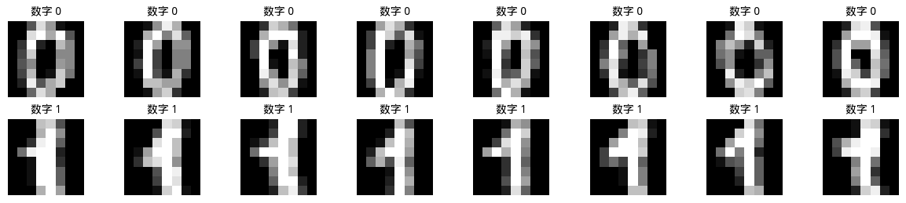

# Support Vector Machine

In 1963, Soviet mathematician Vladimir Vapnik proposed the support vector method while solving pattern recognition problems. In 1995, Vapnik published the paper "[Support-Vector Networks](https://link.springer.com/article/10.1007/BF00994018)" which formally introduced the soft-margin **Support Vector Machine** (SVM), solving the noise and overlap problems prevalent in real-world data. Since then, SVMs rapidly became a mainstream method in machine learning, achieving great success in text classification, image recognition, bioinformatics, and other fields, until the rise of deep learning changed the landscape.

## Maximum Margin Hyperplane

Recall what we learned in the [Logistic Regression](../linear-models/logistic-regression.md) chapter: linear classification models separate data of different categories by finding a straight line (a hyperplane). However, for the same classification problem, there may be infinitely many hyperplanes that correctly divide the training data. Taking two-dimensional space as an example, suppose we have collected customer data from a bank, using two features — income level and spending frequency — to distinguish good customers (positive class) from risky customers (negative class). Plotting these two types of data on a coordinate plane, we can intuitively see that positive samples cluster in the upper-right region and negative samples cluster in the lower-left region. At this point, any straight line passing through the middle blank area can correctly separate the training data, but which one is best?

The left panel in the figure below illustrates this dilemma: each dashed line can separate the two classes, but they differ in position. The right panel shows SVM's answer: we should choose the line that is farthest from both classes. On each side of this line, a parallel line passes through the nearest data points, and the region between them is called the **margin**. The core idea of SVM is precisely to maximize this margin, finding a maximum-margin line (hyperplane) that keeps the decision boundary as far as possible from both classes, thereby gaining stronger predictive power for unseen data.


*Figure: Left panel shows multiple feasible separating lines, right panel shows the maximum margin separating line chosen by SVM*

SVM's answer perfectly matches human intuition. If you need to build a guardrail on a narrow mountain road to separate two-way traffic, the best approach is certainly to place the guardrail in the center of the road, parallel to the mountain walls on both sides, giving vehicles on both sides the maximum room to maneuver. The maximum margin hyperplane keeps both classes as far from the decision boundary as possible, so that even with slight data perturbations or noise, classification results are not easily compromised. Vapnik also provided the statistical learning theory underpinning this intuition, rigorously proving that the generalization error upper bound of a classifier is inversely proportional to the margin: the larger the margin, the lower the model's classification error rate on unseen samples.

## Hyperplane, Distance, and Margin

The first step in understanding SVM is to establish a mathematical definition of "distance." In everyday life, we use a ruler to measure the distance from a point to a line; in statistical learning, we need a measurement formula applicable to spaces of arbitrary dimensions. Analytic geometry tells us that in $d$-dimensional space, the hyperplane separating two classes of data can be described by a linear equation:

$$w^T x + b = 0$$

where $w \in \mathbb{R}^d$ is a $d$-dimensional vector called the **normal vector**, which is perpendicular to the hyperplane and determines its orientation. $b \in \mathbb{R}$ is a real number called the **intercept**, which determines the distance from the hyperplane to the origin. When $b = 0$, the hyperplane passes through the origin; when $b > 0$, the hyperplane shifts in the direction opposite to the normal vector. In two-dimensional space, the equation $w_1 x_1 + w_2 x_2 + b = 0$ represents a straight line. Suppose $w = (1, -1)$ and $b = 0$, then the equation is $x_1 - x_2 = 0$, which is a line passing through the origin with slope 1. The normal vector $(1, -1)$ is perpendicular to this line, pointing toward the lower-right direction.

The distance from any point $x$ in space to the hyperplane $w^T x + b = 0$ is the absolute value of its signed projection in the direction of the normal vector. As shown in the figure below, the solid purple line connects a test point (golden star) with its projection onto the hyperplane (purple cross mark). According to the definition of [vector projection](../../maths/linear/vectors.md#inner-product-and-projection) and the distance formula, the distance between these two points is:

$$\text{distance}(x) = \frac{|w^T x + b|}{\|w\|}$$

The reason for taking the absolute value is that $w^T x + b$ is the value obtained by substituting point $x$ into the hyperplane equation, reflecting the point's position relative to the hyperplane. When the value is positive, the point lies on the side pointed to by the normal vector; when negative, it lies on the opposite side. The absolute value $|w^T x + b|$ ensures the distance is always positive, because we care about "how far" rather than "on which side."


*Figure: Left panel shows the distance calculation from a point to the hyperplane, right panel shows the relationship between functional margin and geometric margin*

For binary classification problems, unlike the conventional linear classifier's habit of using $y \in \{0, 1\}$ labels, SVM uses class labels $y \in \{-1, +1\}$. The elegance of this convention lies in the fact that the sign of $y_i(w^T x_i + b)$ directly reflects whether the classification is correct. When the classification is correct, $y_i$ and $w^T x_i + b$ have the same sign, and their product is positive; when the classification is wrong, they have opposite signs, and the product is negative. Based on this observation, we define the concept of **functional margin**:

$$\hat{\gamma}_i = y_i (w^T x_i + b)$$

The functional margin measures how correct the classification is. $\hat{\gamma}_i > 0$ means the classification is correct, with larger values indicating that the point is farther from the hyperplane; $\hat{\gamma}_i < 0$ means the classification is incorrect, with the point having crossed the hyperplane. However, the functional margin has a problem: it is sensitive to the scaling of parameters $w$ and $b$. If we simultaneously double $w$ and $b$, the hyperplane itself does not change (because the equation $2w^T x + 2b = 0$ defines the same hyperplane as $w^T x + b = 0$), but the functional margin $\hat{\gamma}_i$ doubles. To address this issue, we further define the **geometric margin**, which is the functional margin divided by the norm of the normal vector:

$$\gamma_i = \frac{y_i (w^T x_i + b)}{\|w\|} = \frac{\hat{\gamma}_i}{\|w\|}$$

The geometric margin is the actual geometric distance from a point to the hyperplane and is independent of parameter scaling. The right panel of the figure above illustrates this concept: the distance $\gamma$ marked by the green arrow is precisely the geometric margin. For a positive-class point, the geometric margin represents the distance from the point to the hyperplane; for a negative-class point, the geometric margin is likewise the distance, and it is always positive for correctly classified samples. When all samples are correctly classified, the minimum geometric margin is the margin of the entire dataset — the larger this margin, the safer the decision boundary.

## Support Vectors

The meaning of support vectors is actually very intuitive: certain data points support the classification boundary like pillars. If we imagine the classification boundary as a wall, support vectors are the two rows of pillars hugging this wall. The position of the wall is entirely determined by these pillars, while other data points far from the wall have no influence on its position.

SVM's optimization goal is to find the hyperplane that **maximizes the minimum geometric margin** of the entire dataset. In other words, we want the points closest to the hyperplane (i.e., the most "dangerous" points) to also maintain a sufficient distance. Expressing the SVM optimization objective mathematically:

$$\arg \max_{w, b} \min_i \gamma_i = \arg \max_{w, b} \min_i \frac{y_i (w^T x_i + b)}{\|w\|}$$

The meaning of this objective function is: first find the sample point with the smallest geometric margin (i.e., the point closest to the hyperplane), then adjust the hyperplane parameters $w$ and $b$ to make this minimum distance as large as possible. This is a "maximize the worst case" strategy, ensuring that even the most dangerous samples are correctly classified, providing a safety guarantee for the overall classification.

Directly optimizing this objective function is tricky because it is a non-convex function. However, support vector machines employ an ingenious normalization technique to transform it into an equivalent convex optimization problem. The specific approach is to stipulate that the **minimum functional margin equals 1**, i.e., requiring all functional margins to be at least 1:

$$y_i (w^T x_i + b) \geq 1, \quad \forall i$$

Under this constraint, for those points that exactly satisfy $y_i (w^T x_i + b) = 1$, these are the points closest to the hyperplane, and their geometric margin is $\frac{1}{\|w\|}$. Since the numerator is fixed at 1, maximizing the geometric margin is equivalent to minimizing the denominator $\|w\|$, so the objective function becomes:

$$\arg \min_{w, b} \frac{1}{2} \|w\|^2 \quad \text{s.t.} \quad y_i (w^T x_i + b) \geq 1, \quad i = 1, \ldots, n$$

Here another mathematical trick is used: replacing the original $\|w\|$ with $\frac{1}{2}\|w\|^2$. Minimizing either is equivalent, but the squaring operation preserves monotonicity and facilitates differentiation, while the coefficient $\frac{1}{2}$ makes the derivative form more concise. Now this optimization problem is a standard convex optimization problem with a unique global optimum, free from local optima.

After the optimal separating hyperplane is determined, those sample points that exactly satisfy the constraint with equality (i.e., points where $y_i (w^T x_i + b) = 1$) are called **support vectors**. From a geometric perspective, support vectors are the points closest to the hyperplane, all lying on the margin boundary, as shown in the figure below.


*Figure: Left panel shows how support vectors (highlighted) determine the decision boundary, right panel shows that non-support vectors can move freely without affecting the boundary*

The highlighted star-shaped and circular points in the figure are support vectors, hugging the margin boundary. The arrows indicate the distances from these points to the hyperplane. Only support vectors determine the final decision boundary; other points (indicated by gray arrows showing they can move) can move arbitrarily as long as they do not cross the margin boundary, without affecting the hyperplane's position.

This property reveals that SVM is sparse, and it is also a key reason for SVM's efficiency in handling large-scale data. Suppose the training data has 1000 samples, but ultimately only 10 support vectors. These 10 points then encapsulate the entire classification information of the dataset. When storing the model, we only need to save these 10 points rather than all 1000 samples, significantly reducing storage and computational costs.

## Lagrangian Dual Transformation

Now let us complete the optimization of the SVM objective function. The objective function $\frac{1}{2} \|w\|^2 = \frac{1}{2}(w_1^2 + \cdots + w_d^2)$ is a convex function whose graph is a bowl-shaped surface. Starting from any initial point, descending downhill will eventually reach the bottom of the bowl, yielding a unique minimum. The constraint $y_i (w^T x_i + b) \geq 1$ is a linear inequality constraint, defining a convex region (called the feasible region). A convex objective function combined with a convex feasible region constitutes a convex optimization problem, for which efficient algorithms typically exist. In contrast, the objective functions in neural network training are usually non-convex, with many local extrema, making optimization more difficult.

The solution algorithm used here is called the **Lagrangian dual method**, a classical technique for converting constrained optimization into unconstrained optimization. Since directly solving the primal problem requires handling inequality constraints, which undoubtedly increases computational complexity, we introduce a set of auxiliary variables (called Lagrange multipliers) to embed the constraints into the objective function, thereby transforming constrained optimization into unconstrained optimization. The specific approach is to introduce a Lagrange multiplier $\alpha_i \geq 0$ for each constraint $y_i (w^T x_i + b) \geq 1$, constructing the Lagrangian function:

$$\mathcal{L}(w, b, \alpha) = \frac{1}{2} \|w\|^2 - \sum_{i=1}^{n} \alpha_i [y_i (w^T x_i + b) - 1]$$

Examine the composition of this function carefully. The first term $\frac{1}{2} \|w\|^2$ is the original objective function; the second term $\sum_{i=1}^{n} \alpha_i [y_i (w^T x_i + b) - 1]$ is a weighted combination of the constraints, where each constraint $y_i (w^T x_i + b) - 1 \geq 0$ is multiplied by the corresponding $\alpha_i$ and summed. When the constraint $y_i (w^T x_i + b) - 1 \geq 0$ is satisfied, $y_i (w^T x_i + b) - 1$ is non-negative, $\alpha_i \geq 0$, so subtracting $\alpha_i [y_i (w^T x_i + b) - 1]$ decreases the function value; when the constraint is violated, $y_i (w^T x_i + b) - 1 < 0$, $\alpha_i \geq 0$, the product is negative, and subtracting a negative value is equivalent to adding a positive value, which increases the function value. The Lagrange multiplier $\alpha_i$ acts like a penalty coefficient — the more severely the constraint is violated, the greater the penalty.

Next, we need to find the minimum of the Lagrangian function with respect to $w$ and $b$. With respect to $w$ and $b$, this has now become an unconstrained optimization problem. According to the calculus knowledge of [partial derivatives](../../maths/calculus/gradient.md#partial-derivatives) and [gradients](../../maths/calculus/gradient.md#gradients), at the extremum point, the partial derivatives of the function with respect to each variable must be zero. Thus, taking partial derivatives with respect to $w$ and $b$ respectively and setting them to zero yields two equations, as follows:

- **Partial derivative with respect to $w$**

1. Handle the first term of the Lagrangian function. The earlier mathematical treatment plays a very elegant role here. Substituting the [L2 norm](../../maths/linear/vectors.md#norms) formula gives:

    $$\frac{\partial}{\partial w}\left(\frac{1}{2}\|w\|^2\right) = \frac{\partial}{\partial w}\left[\frac{1}{2}(w_1^2 + w_2^2 + \cdots + w_d^2)\right]        = \frac{1}{2} \cdot 2w = w$$

2. Handle the second term of the Lagrangian function $\sum_{i=1}^{n} \alpha_i [y_i (w^T x_i + b) - 1]$. Note that $w^T x_i = w \cdot x_i = \sum_{j=1}^{d} w_j x_{ij}$ (where $x_{ij}$ denotes the $j$-th feature of the $i$-th sample). When taking the partial derivative with respect to $w$, only the $w^T x_i$ part contains $w$, while $b$ and the constant term $-1$ are constants with respect to $w$. According to vector differentiation rules $\frac{\partial}{\partial w}(w^T x_i) = x_i$, therefore, the partial derivative of the second term with respect to $w$ is:

    $$\frac{\partial}{\partial w}\left[-\sum_{i=1}^{n} \alpha_i y_i (w^T x_i + b)\right] = -\sum_{i=1}^{n} \alpha_i y_i x_i$$

3. Combining the two parts, we obtain the partial derivative of the Lagrangian function with respect to $w$, and at the extremum point, the partial derivative must be zero, yielding the first equation:

    $$\frac{\partial \mathcal{L}}{\partial w} = w - \sum_{i=1}^{n} \alpha_i y_i x_i = 0 \text{ , i.e.: } w = \sum_{i=1}^{n} \alpha_i y_i x_i$$

- **Partial derivative with respect to $b$**
1. Handle the first term of the Lagrangian function. Since $b$ appears only in the second term, this term is directly zero.

2. Handle the second term of the Lagrangian function, expanding it gives:

    $$-\sum_{i=1}^{n} \alpha_i [y_i (w^T x_i + b) - 1] = -\sum_{i=1}^{n} \alpha_i y_i (w^T x_i) - \sum_{i=1}^{n} \alpha_i y_i b + \sum_{i=1}^{n} \alpha_i$$

    After expansion, only the second term contains $b$, so taking the partial derivative with respect to $b$ yields:

    $$\frac{\partial \mathcal{L}}{\partial b} = -\sum_{i=1}^{n} \alpha_i y_i$$

3. At the extremum point, the partial derivative must be zero, yielding the second equation:

    $$\frac{\partial \mathcal{L}}{\partial b} = -\sum_{i=1}^{n} \alpha_i y_i = 0 \text{ , i.e.: } \sum_{i=1}^{n} \alpha_i y_i = 0$$

The first equation $w = \sum_{i=1}^{n} \alpha_i y_i x_i$ reveals the relationship between $w$ and the Lagrange multipliers $\alpha$: the normal vector $w$ of the optimal hyperplane is a weighted combination of all training samples, where each sample's contribution weight is $\alpha_i y_i$. If a sample has $\alpha_i = 0$, it makes no contribution to $w$; only samples with $\alpha_i > 0$ participate in constructing the decision boundary.

The second equation $\sum_{i=1}^{n} \alpha_i y_i = 0$ is a constraint that the Lagrange multipliers must satisfy, called the **linear constraint**: the sum of the products of all $\alpha_i$ and their corresponding labels $y_i$ is zero. This constraint will play a role in the subsequent solution of the dual problem.

Substituting the above two equations into the Lagrangian function, eliminating $w$ and $b$, we obtain the **dual problem** (transforming the original optimization problem into an equivalent optimization problem over the Lagrange multipliers $\alpha$):

$$\arg \max_\alpha \sum_{i=1}^{n} \alpha_i - \frac{1}{2} \sum_{i=1}^{n} \sum_{j=1}^{n} \alpha_i \alpha_j y_i y_j x_i^T x_j \quad \text{s.t.} \quad \alpha_i \geq 0, \quad \sum_{i=1}^{n} \alpha_i y_i = 0$$

The objective function of the dual problem is a quadratic function of $\alpha$, and the constraints are linear, so it is also a convex quadratic programming problem. For SVM, solving the dual problem has several advantages over solving the primal problem: the dimensionality of variables in the dual problem is the number of samples $n$, while in the primal problem it is the feature dimension $d$. When the feature dimension is much higher than the number of samples (e.g., in text classification where the vocabulary is huge but the number of documents is limited), optimizing the dual problem is far more efficient. More importantly, the objective function of the dual problem contains $x_i^T x_j$, the inner products between samples, which lays the foundation for introducing **kernel functions**. The kernel trick leverages replacing inner products to handle nonlinear classification problems, which we will discuss in detail in the [next chapter](kernel-methods.md).

Finally, after solving the dual problem by setting partial derivatives to zero, what we truly need is not the dual problem's solution — the Lagrange multipliers $\alpha$ — but the primal problem's solution $w$ and $b$. After obtaining the optimal $\alpha$ from the dual problem, we need to recover $w$ via $w = \sum_{i=1}^{n} \alpha_i y_i x_i$, and then further determine $b$. This process involves constraint relaxation and tightening: the Lagrangian function converts the original constraints into unconstrained optimization, but the obtained solution does not automatically satisfy the original problem's constraints $y_i(w^T x_i + b) \geq 1$. Therefore, we also need a criterion to judge whether the found solution satisfies the original problem's constraints. This is precisely the role of the [KKT conditions](https://en.wikipedia.org/wiki/Karush%E2%80%93Kuhn%E2%80%93Tucker_conditions) (Karush-Kuhn-Tucker Conditions). KKT conditions are necessary and sufficient conditions that the optimal solution of a convex optimization problem must satisfy, establishing the connection between the dual problem's solution and the optimality of the primal problem:

1. **Stationarity condition**: $\nabla_w \mathcal{L} = 0$, $\nabla_b \mathcal{L} = 0$, i.e., the gradient of the Lagrangian function with respect to the primal variables is zero (already used in the partial derivative derivations above).
2. **Primal feasibility condition**: $y_i (w^T x_i + b) - 1 \geq 0$, i.e., the constraints of the primal problem must be satisfied.
3. **Dual feasibility condition**: $\alpha_i \geq 0$, i.e., the Lagrange multipliers must be non-negative (we explicitly impose this constraint in the dual problem).
4. **Complementary slackness condition**: $\alpha_i [y_i (w^T x_i + b) - 1] = 0$, this is the most critical condition, revealing the essential characteristics of support vectors.

The complementary slackness condition means that the product of the Lagrange multiplier $\alpha_i$ and the constraint slack $y_i (w^T x_i + b) - 1$ must be zero. This leads to two cases:

1. If $\alpha_i > 0$, then we must have $y_i (w^T x_i + b) - 1 = 0$, meaning the sample lies exactly on the margin boundary and is a support vector.
2. If $y_i (w^T x_i + b) - 1 > 0$ (the sample is far from the margin boundary), then we must have $\alpha_i = 0$, meaning the sample is not a support vector.

This once again confirms the sparsity of SVM: only support vectors have $\alpha_i > 0$, while other samples have $\alpha_i = 0$. From a computational perspective, this means we only need to focus on a few critical samples without computing weights for all samples, greatly simplifying the solution process.

## Soft Margin and Slack Variables

So far, we have discussed the hard-margin SVM, which strictly requires all sample points to be correctly classified and lie outside the margin boundary. However, real-world data is often not so ideal. Noise, measurement errors, and outliers can cause some sample points to cross boundaries — for instance, positive-class samples mixing into negative-class regions, or two classes overlapping near the boundary. In such cases, the hard-margin SVM may have no solution, or it may find a very complex hyperplane to satisfy the hard constraints, leading to overfitting. Because hard-margin SVM is overly sensitive to anomalous samples, it did not produce particularly noteworthy results for over 30 years after its initial proposal in 1963.

This situation changed in 1995 when Vapnik proposed the **soft-margin** SVM. The key difference from hard-margin SVM is the relaxation of constraints, allowing some sample points to violate the margin constraint. The specific approach is to introduce a set of **slack variables** $\xi_i \geq 0$, one for each sample, measuring the degree to which the sample violates the constraint. The modified optimization problem becomes:

$$\arg \min_{w, b, \xi} \frac{1}{2} \|w\|^2 + C \sum_{i=1}^{n} \xi_i \quad \text{s.t.} \quad y_i (w^T x_i + b) \geq 1 - \xi_i, \quad \xi_i \geq 0$$

The meaning of the slack variable $\xi_i$ can be understood as follows: the original constraint requires $y_i (w^T x_i + b) \geq 1$, meaning the sample must be at least 1 unit (in functional margin) from the hyperplane. After introducing slack, the constraint is relaxed to $y_i (w^T x_i + b) \geq 1 - \xi_i$. If a sample has $\xi_i = 0.5$, its functional margin can be relaxed to $1 - 0.5 = 0.5$, i.e., it is allowed to be 0.5 units "closer" to the hyperplane than the hard-margin requirement. If $\xi_i = 1$, the sample can lie exactly on the hyperplane (functional margin of zero); if $\xi_i > 1$, the sample can even cross the hyperplane into the other class's region (being misclassified).

The additional term $C \sum_{i=1}^{n} \xi_i$ in the objective function is the penalty for slack variables. The parameter $C$ is the **regularization parameter**, controlling the model's tolerance for misclassification:

- **Large $C$**: The penalty weight for slack variables is high, and the model tends to strictly obey constraints, preferring to sacrifice margin size to correctly classify all samples. This may lead to an overly complex model that is sensitive to noise, causing overfitting.
- **Small $C$**: The penalty weight for slack variables is low, and the model tends to choose a larger margin, even at the cost of some classification accuracy. This makes the model more robust and resistant to noise, but may lead to underfitting.

The choice of $C$ requires a trade-off between "classification accuracy" and "model complexity," similar to the bias-variance trade-off discussed in the [Regularization](../linear-models/regularization-glm.md) chapter. In practice, $C$ is typically determined through cross-validation.

After introducing slack variables, the Lagrangian dual method remains applicable. The new Lagrangian function requires introducing two sets of multipliers: $\alpha_i \geq 0$ corresponding to the margin constraints, and $\mu_i \geq 0$ corresponding to the non-negativity constraints on slack variables. After derivation, the dual problem of soft-margin SVM takes a very concise form:

$$\arg \max_\alpha \sum_{i=1}^{n} \alpha_i - \frac{1}{2} \sum_{i=1}^{n} \sum_{j=1}^{n} \alpha_i \alpha_j y_i y_j x_i^T x_j \quad \text{s.t.} \quad 0 \leq \alpha_i \leq C, \quad \sum_{i=1}^{n} \alpha_i y_i = 0$$

The only difference from the hard-margin case is that $\alpha_i$ changes from having no upper bound to having an upper bound of $C$. This change means that the Lagrange multiplier $\alpha_i$ cannot grow without limit, with the maximum value being the penalty coefficient $C$. Analyzing through the KKT conditions, samples in soft-margin SVM can be divided into three categories:

1. **Correctly classified and far from the boundary**: $\alpha_i = 0$, $\xi_i = 0$, the sample lies outside the margin boundary and contributes nothing to the model.
2. **Support vectors**: $0 < \alpha_i < C$, $\xi_i = 0$, the sample lies exactly on the margin boundary, similar to the hard-margin case.
3. **Constraint-violating samples**: $\alpha_i = C$, $\xi_i > 0$, the sample has crossed the margin boundary. These samples may be misclassified ($\xi_i > 1$) or lie within the margin region ($0 < \xi_i < 1$).

This classification of the three types shows that soft-margin SVM no longer relies solely on support vectors on the boundary but also considers constraint-violating samples. These violating samples correspond to $\alpha_i = C$, and they also play a role in constructing the hyperplane, though their contribution weights are limited to $C$.

## Soft-Margin SVM in Practice

In the previous sections, we established the complete theoretical framework of SVM. Now let us translate this theory into runnable code. The implementation below uses a gradient ascent approach to solve the dual problem, structured in four main steps:

- **Step 1: Precompute the kernel matrix**: This is an engineering optimization similar to caching. Before training begins, first compute the inner product matrix $K[i,j] = x_i^T x_j$ between all samples, also called the kernel matrix or Gram matrix. This is an $n \times n$ symmetric matrix, where $n$ is the number of samples. The purpose of precomputing the kernel matrix is to avoid repeatedly computing sample inner products during subsequent iterations, thereby significantly improving training efficiency. For a linear kernel, the kernel matrix can be computed in one shot via matrix multiplication `K = X @ X.T`.

- **Step 2: Iteratively update the Lagrange multipliers $\alpha$**: This part is the practice of the margin optimization from this chapter. The objective function of the dual problem is $\arg \max_{\alpha} \sum_{i=1}^{n} \alpha_i - \frac{1}{2} \sum_{i=1}^{n} \sum_{j=1}^{n} \alpha_i \alpha_j y_i y_j x_i^T x_j$. Optimization is performed using gradient ascent. For each $\alpha_i$, its gradient is: $\frac{\partial L}{\partial \alpha_i} = 1 - y_i \sum_{j=1}^{n} \alpha_j y_j K[j,i]$. In each iteration, update each $\alpha_i$ sequentially, then project it into the constraint interval $[0, C]$ (soft-margin constraint). Additionally, to satisfy the equality constraint $\sum \alpha_i y_i = 0$, mean correction is applied to all $\alpha$ after each iteration.

- **Step 3: Identify support vectors**: After training, identify support vectors based on the values of $\alpha$. According to the KKT conditions, only samples with $\alpha_i > 0$ are support vectors. In practice, set a small threshold (e.g., $10^{-5}$), filter out sample indices satisfying `alpha > threshold`, and extract the corresponding support vector set along with their labels and multiplier values.

- **Step 4: Compute hyperplane parameters $w$ and $b$**: After obtaining the support vectors, compute the normal vector $w$ and intercept $b$ of the hyperplane:

    - The normal vector $w$ is obtained by weighted summation of support vectors: $w = \sum_{i \in SV} \alpha_i y_i x_i$
    - The intercept $b$ is computed using the average deviation of support vectors: $b = \frac{1}{|SV|} \sum_{i \in SV} (y_i - w^T x_i)$

At this point, the model training is complete, yielding the decision function $f(x) = w^T x + b$, which can be used for predicting new samples. Note that the code implementation uses a simplified gradient ascent algorithm rather than the standard Sequential Minimal Optimization (SMO) algorithm. SMO is the widely adopted efficient solution method in industry, but its implementation complexity is higher. The simplified version here is sufficient for understanding SVM's core mechanism and suitable for teaching purposes.

```python runnable extract-class="SimpleSVM"
import numpy as np

class SimpleSVM:
    """
    Simplified soft-margin SVM implementation

    Uses gradient ascent to optimize the dual problem, supports soft margin (controlled by parameter C)

    Core steps:
    1. Precompute the kernel matrix K = X @ X.T (linear kernel)
    2. Iteratively update the Lagrange multipliers alpha
    3. Identify support vectors from alpha
    4. Compute hyperplane parameters w and b
    """

    def __init__(self, learning_rate=0.01, n_iterations=1000, C=1.0):
        self.lr = learning_rate       # learning rate for gradient ascent
        self.n_iterations = n_iterations  # number of iterations
        self.C = C                    # soft margin penalty coefficient
        self.alpha = None             # Lagrange multipliers (obtained after training)
        self.w = None                 # hyperplane normal vector
        self.b = None                 # hyperplane intercept
        self.support_vectors_ = None  # set of support vectors

    def fit(self, X, y):
        """
        Train the SVM model

        Objective function of the dual problem:
        max sum(alpha_i) - 0.5 * sum(alpha_i * alpha_j * y_i * y_j * x_i^T x_j)
        Constraints: 0 <= alpha_i <= C, sum(alpha_i * y_i) = 0

        Iterative optimization using gradient ascent, updating one alpha_i at a time
        """
        n_samples, n_features = X.shape

        # Initialize Lagrange multipliers (all zeros)
        self.alpha = np.zeros(n_samples)

        # Precompute the kernel matrix (linear kernel: inner product of samples)
        # K[i,j] = x_i^T x_j, used to accelerate objective function computation
        K = X @ X.T

        # Gradient ascent optimization of the dual problem
        for iteration in range(self.n_iterations):
            for i in range(n_samples):
                # Compute the gradient for alpha_i
                # Partial derivative of the objective function w.r.t. alpha_i: 1 - y_i * sum_j(alpha_j * y_j * K[j,i])
                gradient = 1 - y[i] * np.sum(self.alpha * y * K[:, i])

                # Gradient ascent update
                self.alpha[i] += self.lr * gradient

                # Project into the constraint interval [0, C]
                # Corresponds to the soft margin constraint: 0 <= alpha_i <= C
                self.alpha[i] = np.clip(self.alpha[i], 0, self.C)

            # Constraint correction: ensure sum(alpha * y) = 0
            # Approximately satisfies the linear constraint by subtracting the mean bias
            bias = np.mean(self.alpha * y)
            self.alpha = self.alpha - bias * y
            self.alpha = np.clip(self.alpha, 0, self.C)

        # Identify support vectors (samples with alpha > threshold)
        sv_threshold = 1e-5
        sv_indices = self.alpha > sv_threshold
        self.support_vectors_ = X[sv_indices]
        sv_labels = y[sv_indices]
        sv_alpha = self.alpha[sv_indices]

        # Compute hyperplane parameter w = sum(alpha_i * y_i * x_i)
        # Only support vectors participate in the computation (other samples have alpha=0)
        self.w = np.zeros(n_features)
        for i, (sv, label, a) in enumerate(zip(self.support_vectors_, sv_labels, sv_alpha)):
            self.w += a * label * sv

        # Compute the intercept b
        # Using support vectors: for support vectors, y_i(w^T x_i + b) = 1 (hard margin)
        # or y_i(w^T x_i + b) = 1 - xi_i (soft margin)
        # Here we take the average over all support vectors
        if len(self.support_vectors_) > 0:
            self.b = np.mean(sv_labels - self.support_vectors_ @ self.w)
        else:
            self.b = 0

        return self

    def decision_function(self, X):
        """
        Decision function value: w^T x + b

        Positive values indicate prediction of positive class, negative values indicate negative class
        The absolute value reflects the distance from the sample to the hyperplane
        """
        return X @ self.w + self.b

    def predict(self, X):
        """
        Predict class labels

        sign(w^T x + b): +1 for positive class, -1 for negative class
        """
        return np.sign(self.decision_function(X)).astype(int)

    def score(self, X, y):
        """Compute classification accuracy"""
        predictions = self.predict(X)
        return np.mean(predictions == y)

# Generate two classes of data: positive class near (2,2), negative class near (-2,-2)
n_samples = 100
X_pos = np.random.randn(n_samples // 2, 2) + np.array([2, 2])
X_neg = np.random.randn(n_samples // 2, 2) + np.array([-2, -2])
X = np.vstack([X_pos, X_neg])
y = np.hstack([np.ones(n_samples // 2), -np.ones(n_samples // 2)])

# Train the soft-margin SVM
svm = SimpleSVM(learning_rate=0.01, n_iterations=500, C=10.0)
svm.fit(X, y)

print("=== SVM Training Results ===")
print(f"Hyperplane normal vector w: [{svm.w[0]:.3f}, {svm.w[1]:.3f}]")
print(f"Hyperplane intercept b: {svm.b:.4f}")
print(f"Number of support vectors: {len(svm.support_vectors_)} / {n_samples}")
print(f"Training accuracy: {svm.score(X, y):.3f}")

# Predict new samples
new_samples = np.array([[1, 1], [-1, -1], [0, 0]])
predictions = svm.predict(new_samples)
print("\n=== New Sample Predictions ===")
for sample, pred in zip(new_samples, predictions):
    print(f"  Point ({sample[0]}, {sample[1]}) -> Class {pred:+d}")
```

## Application: Handwritten Digit Recognition

SVM has classic applications in the field of image recognition. Below, we use the handwritten digits dataset provided by SciKit-Learn to demonstrate how SVM distinguishes between the digits $0$ and $1$. This is a typical binary classification problem: images of digit $0$ typically exhibit ring-like features, while images of digit $1$ show elongated vertical strip features. The two classes have distinctly different distribution patterns in pixel space.



*Figure: SciKit-Learn handwritten digits dataset*

Each sample in this dataset is an 8x8 grayscale image, with a total of 64 pixels as features. Although the feature dimension is not extremely high, the data volume is limited (hundreds of samples). Small-sample learning is precisely the scenario where SVM excels.

```python runnable
from sklearn.datasets import load_digits
from sklearn.model_selection import train_test_split
from shared.svm.simple_svm import SimpleSVM
import matplotlib.pyplot as plt
import numpy as np

# Load the handwritten digits dataset
digits = load_digits()
X, y = digits.data, digits.target

# Filter digits 0 and 1 to construct a binary classification problem
mask = (y == 0) | (y == 1)
X_binary = X[mask]
y_binary = y[mask]
y_binary = np.where(y_binary == 0, -1, 1)

# Split into training and testing sets
X_train, X_test, y_train, y_test = train_test_split(
    X_binary, y_binary, test_size=0.3, random_state=42
)

# Train the soft-margin SVM
svm = SimpleSVM(learning_rate=0.001, n_iterations=300, C=1.0)
svm.fit(X_train, y_train)

# Visualization: support vectors and classification results
# Use PCA to reduce 64-dimensional data to 2 dimensions for visualization
from sklearn.decomposition import PCA

pca = PCA(n_components=2)
X_train_2d = pca.fit_transform(X_train)
X_test_2d = pca.transform(X_test)
sv_2d = pca.transform(svm.support_vectors_)

# Create decision boundary mesh grid
x_min, x_max = X_train_2d[:, 0].min() - 1, X_train_2d[:, 0].max() + 1
y_min, y_max = X_train_2d[:, 1].min() - 1, X_train_2d[:, 1].max() + 1
xx, yy = np.meshgrid(np.linspace(x_min, x_max, 200), np.linspace(y_min, y_max, 200))

# Compute decision function in the original high-dimensional space, then map back to 2D
grid_points = np.c_[xx.ravel(), yy.ravel()]
grid_points_64d = pca.inverse_transform(grid_points)
Z = svm.decision_function(grid_points_64d)
Z = Z.reshape(xx.shape)

fig, axes = plt.subplots(1, 2, figsize=(14, 5))

# Left: training set visualization
ax1 = axes[0]
contour = ax1.contourf(xx, yy, Z, levels=50, cmap='RdBu_r', alpha=0.6)
ax1.contour(xx, yy, Z, levels=[-1, 0, 1], colors=['blue', 'black', 'red'], linestyles=['--', '-', '--'], linewidths=1.5)

pos_mask = y_train == 1
neg_mask = y_train == -1
ax1.scatter(X_train_2d[pos_mask, 0], X_train_2d[pos_mask, 1], c='red', marker='o', s=50, label='Digit 1 (+1)', edgecolors='k', linewidths=0.5)
ax1.scatter(X_train_2d[neg_mask, 0], X_train_2d[neg_mask, 1], c='blue', marker='s', s=50, label='Digit 0 (-1)', edgecolors='k', linewidths=0.5)

ax1.scatter(sv_2d[:, 0], sv_2d[:, 1], facecolors='none', edgecolors='green', s=150, linewidths=2, label=f'Support Vectors ({len(svm.support_vectors_)})')

ax1.set_xlabel('First Principal Component', fontsize=11)
ax1.set_ylabel('Second Principal Component', fontsize=11)
ax1.set_title('Training Set Classification (PCA Visualization)', fontsize=12)
ax1.legend(loc='upper right', fontsize=9)
plt.colorbar(contour, ax=ax1, label='Decision Function Value')

# Right: test set visualization
ax2 = axes[1]
ax2.contourf(xx, yy, Z, levels=50, cmap='RdBu_r', alpha=0.6)
ax2.contour(xx, yy, Z, levels=[0], colors='black', linestyles='-', linewidths=2)

y_pred = svm.predict(X_test)
correct = y_pred == y_test

pos_correct = (y_test == 1) & correct
pos_wrong = (y_test == 1) & ~correct
neg_correct = (y_test == -1) & correct
neg_wrong = (y_test == -1) & ~correct

ax2.scatter(X_test_2d[pos_correct, 0], X_test_2d[pos_correct, 1], c='red', marker='o', s=80, label='Digit 1 (Correct)', edgecolors='k', linewidths=0.5)
ax2.scatter(X_test_2d[neg_correct, 0], X_test_2d[neg_correct, 1], c='blue', marker='s', s=80, label='Digit 0 (Correct)', edgecolors='k', linewidths=0.5)

if np.any(pos_wrong) or np.any(neg_wrong):
    ax2.scatter(X_test_2d[pos_wrong, 0], X_test_2d[pos_wrong, 1], facecolors='none', edgecolors='red', marker='o', s=120, linewidths=2, label='Digit 1 (Wrong)')
    ax2.scatter(X_test_2d[neg_wrong, 0], X_test_2d[neg_wrong, 1], facecolors='none', edgecolors='blue', marker='s', s=120, linewidths=2, label='Digit 0 (Wrong)')

ax2.set_xlabel('First Principal Component', fontsize=11)
ax2.set_ylabel('Second Principal Component', fontsize=11)
ax2.set_title(f'Test Set Predictions (Accuracy: {svm.score(X_test, y_test):.3f})', fontsize=12)
ax2.legend(loc='upper right', fontsize=9)

plt.tight_layout()
plt.savefig('svm_classification.png', dpi=150, bbox_inches='tight', facecolor='white')
plt.show()

# Display original images corresponding to some support vectors
fig, axes = plt.subplots(2, 6, figsize=(10, 3.5))

sv_indices = []
for sv in svm.support_vectors_:
    for i, x in enumerate(X_train):
        if np.allclose(x, sv, atol=1e-5):
            sv_indices.append(i)
            break

sv_labels = y_train[sv_indices]
n_show = min(12, len(svm.support_vectors_))

for idx in range(n_show):
    ax = axes[idx // 6, idx % 6]
    ax.imshow(svm.support_vectors_[idx].reshape(8, 8), cmap='gray')
    label = 'Digit 1' if sv_labels[idx] == 1 else 'Digit 0'
    ax.set_title(f'{label}\n(SV {idx+1})', fontsize=9)
    ax.axis('off')

for idx in range(n_show, 12):
    axes[idx // 6, idx % 6].axis('off')

plt.suptitle('Original Images of Support Vectors (Key Samples Determining the Decision Boundary)', fontsize=11)
plt.tight_layout()
plt.savefig('support_vectors.png', dpi=150, bbox_inches='tight', facecolor='white')
plt.show()
```

The running results demonstrate several key characteristics of SVM. First, the test accuracy approaches or exceeds 90%, indicating good generalization ability without overfitting. Second, the number of support vectors is relatively low compared to the training samples, confirming SVM's sparsity: a few key samples determine the decision boundary. Finally, the model operates efficiently in the 64-dimensional feature space, showcasing the advantage of the dual problem formulation.

## Summary

SVM presents a new paradigm that differs from other machine learning methods: rather than starting from heuristic rules, it begins from theoretical derivation, transforming the classification problem into an optimization problem with mathematical guarantees. This "theory-driven" design philosophy runs throughout SVM's entire architecture: the idea of margin maximization originates from statistical learning theory's analysis of generalization error, the convex optimization solution methods come from accumulated research in operations research, and the introduction of the dual problem draws from the classical technique of Lagrange multipliers.

SVM also demonstrates a way of thinking consistent with other machine learning methods: to solve "how to measure classification quality," it defines functional margin and geometric margin; to solve "how to find the best hyperplane," it derives the maximum margin optimization problem; to solve "how to efficiently solve this optimization problem," it introduces the Lagrangian dual method; to solve "how to handle imperfections in real data," it proposes the soft margin and slack variables. Like many classical machine learning methods, SVM begins with an intuitive geometric idea, progressively builds a mathematical framework, and ultimately forms a solvable, applicable, and theoretically guaranteed algorithm.

## Exercises

1. Given the hyperplane equation $w^T x + b = 0$, where $w = (2, -1)$, $b = 3$, and the point is a positive-class sample $y=+1$. Compute the functional margin and geometric margin of the point $x = (1, 4)$ to this hyperplane, and determine which side of the hyperplane the point lies on.
    <details>
    <summary>Reference Answer</summary>

    **Step 1: Compute the functional margin**

    The functional margin is defined as $\hat{\gamma} = y(w^T x + b)$. Assuming this is a positive-class sample ($y = +1$):

    $$w^T x + b = 2 \times 1 + (-1) \times 4 + 3 = 2 - 4 + 3 = 1$$

    Therefore, the functional margin $\hat{\gamma} = 1 \times 1 = 1$.

    **Step 2: Compute the geometric margin**

    The geometric margin is the functional margin divided by the norm of the normal vector:

    $$\|w\| = \sqrt{w_1^2 + w_2^2} = \sqrt{2^2 + (-1)^2} = \sqrt{5}$$

    $$\gamma = \frac{\hat{\gamma}}{\|w\|} = \frac{1}{\sqrt{5}} \approx 0.447$$

    **Step 3: Determine the position**

    $w^T x + b = 1 > 0$, indicating the point lies on the side pointed to by the normal vector $w$ (the positive side). Geometrically, the normal vector $w = (2, -1)$ points toward the lower-right, and the point $(1, 4)$ is in the upper-right region of the hyperplane.

    **Summary**: Point $(1, 4)$ has a functional margin of 1 and a geometric margin of approximately 0.447 to the hyperplane, and lies on the positive side (the side pointed to by the normal vector).
    </details>

2. Explain why SVM uses class labels $y \in \{-1, +1\}$ instead of the conventional $y \in \{0, 1\}$ used by traditional linear classifiers. Describe the advantages from both a mathematical form perspective and an optimization derivation perspective.
    <details>
    <summary>Reference Answer</summary>

    **Mathematical form perspective**:

    The key advantage of using $y \in \{-1, +1\}$ lies in the simplicity of sign operations. Whether a classification is correct can be directly determined by the sign of the product $y_i(w^T x_i + b)$:
    - When classification is correct, $y_i$ and $w^T x_i + b$ have the same sign, and the product is positive
    - When classification is incorrect, they have opposite signs, and the product is negative

    This design allows the functional margin $\hat{\gamma}_i = y_i(w^T x_i + b)$ to express both correctness (sign) and confidence (magnitude). Using $y \in \{0, 1\}$ would require additional conditional checks to uniformly express both types of information.

    **Optimization derivation perspective**:

    When constructing the optimization problem, $\{-1, +1\}$ labels allow the classification constraint to be uniformly written as $y_i(w^T x_i + b) \geq 1$. This constraint holds uniformly for all samples without distinguishing between positive and negative classes. Specifically:

    - Positive-class samples ($y_i = +1$): the constraint requires $w^T x_i + b \geq 1$
    - Negative-class samples ($y_i = -1$): the constraint requires $-w^T x_i - b \geq 1$, i.e., $w^T x_i + b \leq -1$

    Both cases are elegantly unified through a single formula, greatly simplifying the construction of the Lagrangian function and the derivation of the dual problem. Using $\{0, 1\}$ labels would require handling constraints for the two classes separately, making the derivation cumbersome.
    </details>

3. In the handwritten digit recognition application, use the provided `SimpleSVM` class to train a model. Adjust the penalty coefficient $C$ (try $C = 0.1, 1.0, 10.0$), observe the changes in the number of support vectors and classification accuracy, and explain the effect of parameter $C$ on the model.
    <details>
    <summary>Reference Answer</summary>

    ```python runnable
    from sklearn.datasets import load_digits
    from sklearn.model_selection import train_test_split
    from shared.svm.simple_svm import SimpleSVM
    import numpy as np

    # Load the handwritten digits dataset
    digits = load_digits()
    X, y = digits.data, digits.target

    # Filter digits 0 and 1
    mask = (y == 0) | (y == 1)
    X_binary = X[mask]
    y_binary = y[mask]
    y_binary = np.where(y_binary == 0, -1, 1)

    # Split into training and testing sets
    X_train, X_test, y_train, y_test = train_test_split(
        X_binary, y_binary, test_size=0.3, random_state=42
    )

    # Test different C values
    C_values = [0.1, 1.0, 10.0]
    print("=== Comparison Experiment for Different Penalty Coefficients C ===\n")

    for C in C_values:
        svm = SimpleSVM(learning_rate=0.001, n_iterations=300, C=C)
        svm.fit(X_train, y_train)

        train_acc = svm.score(X_train, y_train)
        test_acc = svm.score(X_test, y_test)
        sv_ratio = len(svm.support_vectors_) / len(X_train)

        print(f"C = {C}:")
        print(f"  Number of support vectors: {len(svm.support_vectors_)} ({sv_ratio:.1%})")
        print(f"  Training accuracy: {train_acc:.3f}")
        print(f"  Test accuracy: {test_acc:.3f}")
        print()
    ```

    **Observation and Analysis**:

    1. **When $C$ is small (e.g., $C = 0.1$)**:
       - The number of support vectors is larger, as the model tolerates more constraint violations
       - Training accuracy may be lower (allowing some samples to cross boundaries)
       - Test accuracy is relatively stable or better (model is more robust, less prone to overfitting)
       - The model tends to choose a larger margin, sacrificing some training accuracy for generalization ability

    2. **When $C$ is moderate (e.g., $C = 1.0$)**:
       - The number of support vectors is moderate
       - Training and test accuracy tend to be balanced
       - This is typically the recommended default value, requiring tuning via cross-validation

    3. **When $C$ is large (e.g., $C = 10.0$)**:
       - The number of support vectors decreases, as the model strictly constrains every sample
       - Training accuracy approaches 100% (almost no misclassification allowed)
       - Test accuracy may decrease (risk of overfitting)
       - The model tends to strictly obey constraints, potentially finding a complex hyperplane

    **Summary**: The parameter $C$ controls the model's tolerance for misclassification. A large $C$ emphasizes classification accuracy (risk of overfitting), while a small $C$ emphasizes margin maximization (risk of underfitting). In practice, the appropriate $C$ value should be chosen through cross-validation based on the characteristics of the data.
    </details>

4. Discuss whether the following scenarios are suitable for hard-margin SVM or soft-margin SVM: (a) Quality inspection of parts in high-precision manufacturing, where data comes from precision instrument measurements; (b) Sentiment classification of social media text, where data contains a large amount of subjective user expression; (c) Medical imaging diagnosis, with limited sample size and high reliability requirements. For each scenario, explain the reasoning and provide parameter tuning suggestions.
    <details>
    <summary>Reference Answer</summary>

    **(a) Quality Inspection of Parts in High-Precision Manufacturing**

    **Recommendation: Hard-margin SVM or soft-margin SVM with a large $C$ value**

    **Reasoning**:
    - Data comes from precision instrument measurements with less noise and fewer outliers
    - The two classes (qualified/unqualified) have clear boundaries in feature space with little overlap
    - Industrial scenarios require high precision, and misclassification costs are high (failing to detect defective parts could lead to safety accidents)

    **Parameter suggestions**:
    - Use a large $C$ value (e.g., $C = 10$ or higher) to strictly enforce the classification boundary
    - Consider kernel function selection: if the qualified/unqualified boundary is nonlinear, try the RBF kernel
    - Set strict validation metrics: prioritize recall to ensure no defective products are missed

    **(b) Sentiment Classification of Social Media Text**

    **Recommendation: Soft-margin SVM with a moderate or small $C$ value**

    **Reasoning**:
    - Text data is noisy: user expressions are subjective, contain ambiguity, and may include sarcasm or irony
    - Boundaries are blurred: there is a large gray area between positive and negative sentiments
    - Data volume is typically larger but of varying quality

    **Parameter suggestions**:
    - Use a moderate $C$ value (e.g., $C = 0.5 \sim 1$), allowing a certain degree of misclassification
    - Feature engineering is important: TF-IDF, word embeddings, etc., can improve performance
    - Try a linear kernel (text is high-dimensional and sparse, so a linear kernel is often sufficient)
    - Determine the optimal $C$ value through cross-validation, focusing on F1 score rather than accuracy alone

    **(c) Medical Imaging Diagnosis**

    **Recommendation: Soft-margin SVM with careful parameter tuning**

    **Reasoning**:
    - Limited sample size: medical image annotation is costly, and datasets are typically small (this is precisely where SVM excels)
    - Diverse noise sources: varying image quality, subjective annotator judgments, transition zones in lesion severity
    - High reliability requirements: misdiagnosis can have serious consequences, requiring a balance between recall and precision

    **Parameter suggestions**:
    - Use a moderate $C$ value, finely tuned through cross-validation
    - Kernel function selection: the RBF kernel can capture nonlinear characteristics of lesion regions
    - **Recommendation**: due to the small sample size, prioritize generalization ability to avoid overfitting. Consider leave-one-out validation or small-sample-specific evaluation methods
    - Confidence output: use the decision function value $w^T x + b$ as a confidence indicator; low-confidence samples can be referred for manual review

    **Summary**: Hard-margin SVM is suitable for scenarios with clean data and clear boundaries; soft-margin SVM is more appropriate for real-world data full of noise and uncertainty. The choice of parameter $C$ requires a trade-off between "classification accuracy" and "generalization ability," and should be tuned based on data characteristics and business requirements.
    </details>
