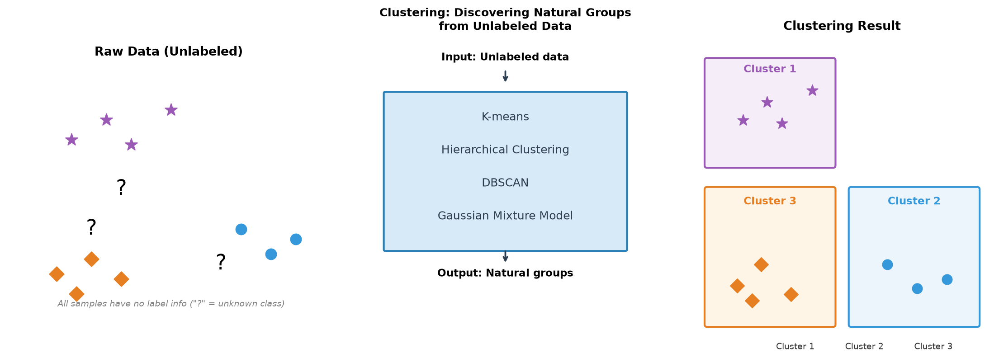
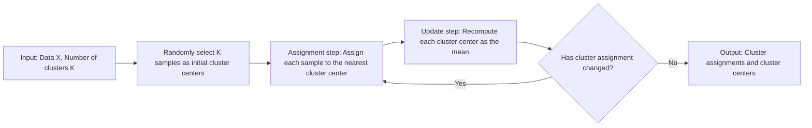
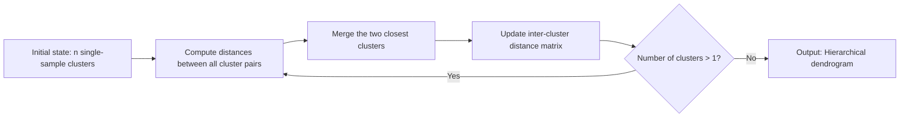

# Clustering

All the statistical learning methods covered earlier have clear objectives, such as predicting house prices, identifying categories, classifying emails, and so on. These methods are collectively referred to as **Supervised Learning**, because they all rely on labels — every training sample has a correct answer, and the model learns the mapping from input to output from the samples. It's like a student learning under the supervision of a teacher, where every question has a standard answer to refer to.

However, in the real world, a vast amount of data comes without labels. We may have purchase records of thousands of customers without knowing which groups they belong to; massive gene expression data without knowing which genes work together; complex social network relationships without knowing the hidden community structures. These problems are like asking students to discover patterns on their own from an exam with no answer key. This is precisely what **Unsupervised Learning** aims to solve.



*Figure: Clustering process diagram: discovering natural groupings from unlabeled data*

**Clustering** is the most fundamental unsupervised learning task, grouping similar samples together (called "clusters") so that samples in different groups are as dissimilar as possible. In 1967, American statistician James MacQueen proposed the K-Means clustering algorithm at the Fifth Berkeley Symposium on Mathematical Statistics and Probability. At the time, the problem he faced was how to automatically group large numbers of observations without predefined categories, as shown in the figure above. K-means is one of the most influential algorithms in unsupervised learning, later giving rise to a series of important methods such as hierarchical clustering and density-based clustering.

## K-means Mathematical Principle

Imagine you are a teacher with 50 students scattered around the classroom, and you want to divide them into 5 discussion groups, but you know nothing about these students — not their names, personalities, or relationships. Your only clue is each person's seat coordinates $(x, y)$. How would you group them? Intuition tells you to group students who sit close together, so they have the shortest walking distance during group discussion. Perhaps you would first randomly pick 5 spots as group centers, have each student walk to the nearest center, and determine the grouping based on who ends up where. Then you notice that some group center positions don't seem reasonable — for instance, all students in one group are concentrated at the back of the classroom, but the center was placed at the front. So you move each group's center to the average position of all students in that group. This might require adjusting the grouping again, as some students are now closer to new centers.

This process is like a game of chase: first set the centers, then assign groups; as the assignment changes, the centers follow; as the centers change, the assignments readjust. Until at some point, both the centers and the assignments stabilize together. That is the basic logic of the K-means algorithm. The process above is quite intuitive, but to turn it into an algorithm a computer can execute, we need to answer two questions:

1. **How do we measure a "good" grouping?** Ideally, students in the same group sit close together (compact within groups), and groups are far apart (separated between groups). This is K-means's objective function.
2. **How do we find the "best" grouping?** Given the coordinates of 50 students and the requirement of 5 groups, this is K-means's iterative algorithm.

Based on the intuitive analogy above, we can give a mathematical definition of K-means. Given $n$ samples $\{x_1, x_2, \ldots, x_n\}$, each sample is a $d$-dimensional vector (e.g., a student's seat coordinates $(x, y)$ is 2-dimensional). Partition these $n$ samples into $K$ **clusters** $C_1, C_2, \ldots, C_K$, each with a **cluster center** $\mu_k$. K-means aims to find a grouping that minimizes $J$, the sum of squared distances from each sample to its cluster center:

$$J = \sum_{k=1}^{K} \sum_{x_i \in C_k} \|x_i - \mu_k\|^2$$

Here, $x_i$ is the position of the $i$-th sample; $\mu_k$ is the center position of the $k$-th cluster; $\|x_i - \mu_k\|^2$ is the squared [Euclidean distance](../../maths/linear/vectors.md#norms) from sample $x_i$ to cluster center $\mu_k$. The two summation symbols in the formula — the outer $\sum_{k=1}^{K}$ sums over all $K$ clusters, and the inner $\sum_{x_i \in C_k}$ sums over all samples belonging to cluster $C_k$. So the entire formula measures the total dispersion of all samples from their respective cluster centers.

When $J$ is minimized, all samples are as close as possible to their own cluster centers, achieving maximum intra-cluster compactness. The formula for calculating the cluster center $\mu_k$ is also natural: it is the **mean** of all samples within the cluster (this is precisely where the "means" in "K-means" comes from). Adding up all sample positions belonging to cluster $C_k$ and dividing by the number of samples $|C_k|$ gives the center position of the cluster:

$$\mu_k = \frac{1}{|C_k|} \sum_{x_i \in C_k} x_i$$

From a statistical perspective, the dispersion of samples within a cluster $C_k$ can be measured by [variance](../../maths/probability/probability-basics.md#bias-and-variance). Larger variance means the samples within the cluster are more spread out; smaller variance means the samples within the cluster are more compact. And K-means's objective function $J$ is precisely the sum of variances of all clusters (ignoring constant factors):

$$J = \sum_{k=1}^{K} |C_k| \cdot \text{Var}(C_k)$$

Therefore, minimizing $J$ is equivalent to minimizing the weighted sum of variances of all clusters. Geometrically, this means making the samples within each cluster gather together as much as possible, like gathering scattered sand into a few compact piles. Each cluster center $\mu_k$ is the geometric centroid of the samples in that cluster. When the cluster center is at the centroid, the sum of squared distances from samples to the center is minimized. This is analogous to a physical system in the real world, where potential energy is minimized when the center of mass is at its equilibrium position.

## K-means Iterative Algorithm Details

In the previous section, we introduced the mathematical principle of K-means: minimizing the sum of squared intra-cluster distances. Now we need to actually find the optimal grouping. Enumerating all possible groupings would be astronomically expensive (the number of ways to partition $n$ samples into $K$ clusters is approximately $K^n/K!$). K-means employs a clever alternating optimization strategy: first fix the cluster centers to find the optimal assignment, then fix the assignment to find the optimal centers, alternating iteratively until convergence. The flowchart below illustrates this process:


*Figure: K-means algorithm flowchart*

The specific steps of the K-means algorithm are as follows:

- **Step 1 Initialize cluster centers**: Randomly select $K$ samples as initial cluster centers $\mu_1, \mu_2, \ldots, \mu_K$. This step may seem random, but the quality of this selection directly affects the final result. We will discuss how to improve this step later.

- **Step 2 Assignment step**: For each sample $x_i$, compute its distance to all $K$ cluster centers, and assign it to the nearest cluster $c_i = \arg\min_k \|x_i - \mu_k\|^2$. Here $c_i$ denotes the cluster ID assigned to sample $x_i$. This step finds the optimal sample assignment given fixed cluster centers. Clearly, assigning each sample to its nearest center is locally optimal.

- **Step 3 Update step**: Based on the new assignment, recompute each cluster center $\mu_k = \frac{1}{|C_k|} \sum_{x_i \in C_k} x_i$. This step finds the optimal cluster centers given a fixed assignment. From the derivation in the previous section, when the cluster center is the mean of the samples in the cluster, the sum of squared distances is minimized.

- **Step 4 Check convergence**: Repeat steps 2 and 3 until the cluster assignments no longer change (all samples are stable in their clusters), or the change in the objective function is below a certain threshold, or the preset maximum number of iterations is reached.

The steps above are guaranteed to converge because at each iteration, the objective function $J$ does not increase. The reasoning is as follows:

- In the assignment step, each sample is assigned to the nearest cluster center. If a sample's original cluster center is not the closest, moving it to a closer center necessarily reduces its squared distance to the center. Therefore, after the assignment step, $J$ only decreases or stays the same.

- In the update step, the cluster center is recomputed as the mean of the samples in the cluster. Mathematical derivation shows that the mean is the position that minimizes the sum of squared intra-cluster distances (provable by differentiation). Therefore, after the update step, the sum of squared distances within each cluster decreases or stays the same, and consequently the overall $J$ decreases or stays the same.

Since $J$ never increases in any iteration and $J$ has a lower bound (minimum 0, when all samples coincide), $J$ must converge to some value. Moreover, the number of samples is finite and the number of possible assignments is also finite, so the cluster assignments will eventually stabilize on some scheme. However, convergence does not mean finding the global optimum. K-means only guarantees convergence to a **local optimum**, like finding a low point in a valley while a deeper valley may still exist undiscovered. We will discuss how to mitigate this issue later.

## K-means Algorithm Practice

Now that we understand the algorithm's principles, let's implement a complete K-means clusterer in code. The following code demonstrates the full process from initialization, iteration to convergence, and validates the algorithm's effectiveness on simulated data. The code uses 300 samples and 3 preset clusters, employing multiple random initializations (`n_init=10`) to reduce the risk of getting stuck in local optima.

```python runnable extract-class="KMeans"
import numpy as np
import matplotlib.pyplot as plt

class KMeans:
    """
    K-means clustering algorithm implementation
    
    Parameters:
        n_clusters : int, number of clusters K
        max_iter : int, maximum number of iterations
        tol : float, convergence threshold (stop when center change is less than this value)
        n_init : int, number of random initializations (keep the best result)
    """
    
    def __init__(self, n_clusters=3, max_iter=300, tol=1e-4, n_init=10):
        self.n_clusters = n_clusters
        self.max_iter = max_iter
        self.tol = tol
        self.n_init = n_init
        
        self.cluster_centers_ = None  # Cluster centers
        self.labels_ = None           # Cluster assignment for each sample
        self.inertia_ = None          # Objective function value (sum of squared distances)
    
    def _init_centers(self, X):
        """
        Randomly initialize cluster centers
        
        Randomly select K samples from the data as initial centers
        """
        indices = np.random.choice(len(X), self.n_clusters, replace=False)
        return X[indices].copy()
    
    def _assign_clusters(self, X, centers):
        """
        Assignment step: assign each sample to the nearest cluster center
        
        Compute the squared distance from each sample to all centers, return the nearest cluster ID
        """
        distances = np.zeros((len(X), self.n_clusters))
        for k in range(self.n_clusters):
            # Compute squared distance from samples to the k-th center (corresponds to ||x - μ||² in the objective function)
            distances[:, k] = np.sum((X - centers[k]) ** 2, axis=1)
        return np.argmin(distances, axis=1)
    
    def _update_centers(self, X, labels):
        """
        Update step: recompute each cluster center
        
        Cluster center = mean of samples within the cluster (this is what "means" means)
        """
        centers = np.zeros((self.n_clusters, X.shape[1]))
        for k in range(self.n_clusters):
            mask = labels == k
            if np.sum(mask) > 0:
                # Use the mean of samples in the cluster as the new center
                centers[k] = X[mask].mean(axis=0)
            else:
                # Rare case of an empty cluster: randomly reinitialize
                centers[k] = X[np.random.randint(len(X))]
        return centers
    
    def _compute_inertia(self, X, labels, centers):
        """
        Compute the objective function value J
        
        J = sum of squared distances from all samples to their cluster centers
        """
        inertia = 0
        for k in range(self.n_clusters):
            mask = labels == k
            inertia += np.sum((X[mask] - centers[k]) ** 2)
        return inertia
    
    def fit(self, X):
        """
        Train the K-means model
        
        Run multiple random initializations and keep the result with the smallest objective function value
        """
        best_inertia = float('inf')
        best_centers = None
        best_labels = None
        
        for init in range(self.n_init):
            # Initialize cluster centers
            centers = self._init_centers(X)
            
            # Iterate until convergence
            for i in range(self.max_iter):
                # Step 2: assign samples to the nearest cluster
                labels = self._assign_clusters(X, centers)
                
                # Step 3: update cluster centers
                new_centers = self._update_centers(X, labels)
                
                # Check convergence: is the change in centers below the threshold?
                if np.max(np.abs(new_centers - centers)) < self.tol:
                    centers = new_centers
                    break
                
                centers = new_centers
            
            # Compute the objective function value for this initialization
            inertia = self._compute_inertia(X, labels, centers)
            
            # Keep the best result
            if inertia < best_inertia:
                best_inertia = inertia
                best_centers = centers.copy()
                best_labels = labels.copy()
        
        # Store the best result
        self.cluster_centers_ = best_centers
        self.labels_ = best_labels
        self.inertia_ = best_inertia
        
        return self
    
    def predict(self, X):
        """
        Predict the cluster for new samples
        
        Based on the trained cluster centers, assign new samples to the nearest cluster
        """
        return self._assign_clusters(X, self.cluster_centers_)

# Generate simulated data: 3 true clusters, 100 samples each
n_samples = 300
centers_true = np.array([[0, 0], [5, 5], [0, 5]])

X = np.vstack([
    np.random.randn(100, 2) + centers_true[0],  # Cluster 1: center (0,0)
    np.random.randn(100, 2) + centers_true[1],  # Cluster 2: center (5,5)
    np.random.randn(100, 2) + centers_true[2]   # Cluster 3: center (0,5)
])

# Run K-means
kmeans = KMeans(n_clusters=3, n_init=10)
kmeans.fit(X)

# Visualize clustering results and center comparison
fig, axes = plt.subplots(1, 2, figsize=(14, 6))

# Left plot: clustering scatter plot
colors = ['#e74c3c', '#3498db', '#2ecc71', '#f39c12', '#9b59b6']
for i in range(kmeans.n_clusters):
    mask = kmeans.labels_ == i
    axes[0].scatter(X[mask, 0], X[mask, 1], c=colors[i], alpha=0.6, s=50, label=f'Cluster {i+1}')

# Plot true centers and estimated centers
axes[0].scatter(centers_true[:, 0], centers_true[:, 1], c='black', marker='x', s=200, linewidths=3, label='True centers')
axes[0].scatter(kmeans.cluster_centers_[:, 0], kmeans.cluster_centers_[:, 1], c='red', marker='*', s=300, edgecolors='white', linewidths=2, label='Estimated centers')

axes[0].set_xlabel('Feature 1', fontsize=12)
axes[0].set_ylabel('Feature 2', fontsize=12)
axes[0].set_title('K-means Clustering Results', fontsize=14)
axes[0].legend(loc='upper right', fontsize=10)
axes[0].grid(True, alpha=0.3)

# Right plot: center coordinate comparison table
axes[1].axis('off')
axes[1].set_xlim(0, 1)
axes[1].set_ylim(0, 1)

# Title
axes[1].text(0.5, 0.9, 'K-means Clustering Statistics', fontsize=16, ha='center', va='top')

# Statistics
unique, counts = np.unique(kmeans.labels_, return_counts=True)
y_pos = 0.75

# True centers vs estimated centers
axes[1].text(0.1, y_pos, 'True centers vs estimated centers:', fontsize=12)
y_pos -= 0.08
for i in range(len(centers_true)):
    true_c = centers_true[i]
    est_c = kmeans.cluster_centers_[i]
    axes[1].text(0.15, y_pos, f'Cluster {i+1}: true({true_c[0]:.2f}, {true_c[1]:.2f}) | estimated({est_c[0]:.2f}, {est_c[1]:.2f})', 
                 fontsize=10, family='monospace')
    y_pos -= 0.06

y_pos -= 0.05
axes[1].text(0.1, y_pos, f'Objective function (Inertia): {kmeans.inertia_:.2f}', fontsize=11)
y_pos -= 0.08

axes[1].text(0.1, y_pos, 'Sample counts per cluster:', fontsize=11)
y_pos -= 0.06
for u, c in zip(unique, counts):
    axes[1].text(0.15, y_pos, f'  Cluster {u+1}: {c} samples', fontsize=10)
    y_pos -= 0.05

plt.tight_layout()
plt.show()
```

### Limitations and Improvements

The [algorithm details section](clustering.md#k-means-iterative-algorithm-details) mentioned that K-means can only converge to a local optimum, meaning different initial cluster centers can lead to different final results, just like starting from different points when descending a mountain may lead to different valleys. An extreme example: suppose the data has 3 clear natural clusters (i.e., groups of data that are inherently compact and well-separated), but if the random initialization happens to pick 3 samples from the same true cluster as initial centers, then these 3 centers will compete for the same set of samples, potentially causing two clusters that should have been separated to merge, while the true third cluster is ignored.

The root cause of this problem is that K-means's objective function $J$ is [non-convex](../linear-models/logistic-regression.md#logistic-regression-optimization-criterion), with multiple local minima, and random initialization may cause the algorithm to fall into a shallower valley. Although running the algorithm multiple times (`n_init=10`) reduces the risk, this only treats the symptom, not the root cause. With bad luck, even 10 initializations may all land in the same local optimum.

In 2007, David Arthur proposed the K-means++ algorithm, which uses a probabilistic initialization strategy to significantly reduce the probability of getting stuck in local optima. The core idea is to spread out the initial centers as much as possible, rather than clustering them randomly. During K-means++ initialization, the first center $\mu_1$ is randomly selected. Then, for each subsequent center $\mu_k$ ($k=2, 3, \ldots, K$), the shortest distance $D(x_i)$ from each sample $x_i$ to the already selected centers is computed, and the next center is chosen with probability $P(x_i) = D(x_i)^2 / \sum_j D(x_j)^2$. Finally, the standard K-means algorithm is run using the selected $K$ centers.

The design of this probability formula is quite clever: the farther a sample is from already selected centers, the higher its probability of being chosen as the next center. The code below demonstrates the implementation of K-means++ initialization and compares its effectiveness with random initialization.

```python runnable
import numpy as np
import matplotlib.pyplot as plt

def kmeans_plusplus_init(X, K):
    """
    K-means++ initialization strategy
    
    Spread out the initial centers as much as possible to reduce the probability of local optima
    
    Parameters:
        X : data matrix (n_samples, n_features)
        K : number of clusters
    
    Returns:
        centers : initial cluster centers (K, n_features)
    """
    n_samples = len(X)
    centers = []
    
    # Step 1: randomly select the first center
    first_idx = np.random.randint(n_samples)
    centers.append(X[first_idx].copy())
    
    # Step 2: sequentially select the remaining K-1 centers
    for k in range(1, K):
        # Compute the squared shortest distance from each sample to the already selected centers
        distances_sq = np.zeros(n_samples)
        for i in range(n_samples):
            # Shortest distance to all already selected centers
            min_dist = float('inf')
            for c in centers:
                dist = np.sum((X[i] - c) ** 2)
                if dist < min_dist:
                    min_dist = dist
            distances_sq[i] = min_dist
        
        # Select the next center based on the probability distribution of squared distances
        # Samples farther away have a higher probability of being selected
        probs = distances_sq / distances_sq.sum()
        next_idx = np.random.choice(n_samples, p=probs)
        centers.append(X[next_idx].copy())
    
    return np.array(centers)

def run_kmeans(X, K, init_centers, max_iter=50):
    """Run K-means iterations and return the final result"""
    centers = init_centers.copy()
    
    for _ in range(max_iter):
        # Assignment
        distances = np.zeros((len(X), K))
        for k in range(K):
            distances[:, k] = np.sum((X - centers[k]) ** 2, axis=1)
        labels = np.argmin(distances, axis=1)
        
        # Update
        new_centers = np.zeros((K, X.shape[1]))
        for k in range(K):
            mask = labels == k
            if np.sum(mask) > 0:
                new_centers[k] = X[mask].mean(axis=0)
            else:
                new_centers[k] = X[np.random.randint(len(X))]
        
        if np.max(np.abs(new_centers - centers)) < 1e-4:
            break
        centers = new_centers
    
    # Compute the objective function value
    inertia = 0
    for k in range(K):
        mask = labels == k
        inertia += np.sum((X[mask] - centers[k]) ** 2)
    
    return labels, centers, inertia

# Generate data: 3 clusters, relatively close together (more prone to local optima)
np.random.seed(42)
centers_true = np.array([[0, 0], [3, 3], [6, 0]])
X = np.vstack([
    np.random.randn(80, 2) * 0.5 + centers_true[0],
    np.random.randn(80, 2) * 0.5 + centers_true[1],
    np.random.randn(80, 2) * 0.5 + centers_true[2]
])

# Create visualization
fig = plt.figure(figsize=(16, 12))

# Define color scheme
colors = ['#e74c3c', '#3498db', '#2ecc71']
init_colors = ['#c0392b', '#2980b9', '#27ae60']

# Top-left: random initialization - initial centers
ax1 = plt.subplot(2, 3, 1)
np.random.seed(123)  # Fixed seed for reproducibility
random_init = X[np.random.choice(len(X), 3, replace=False)]
ax1.scatter(X[:, 0], X[:, 1], c='lightgray', alpha=0.5, s=30, label='Data points')
ax1.scatter(random_init[:, 0], random_init[:, 1], c=init_colors, marker='X', s=300, 
            edgecolors='black', linewidths=2, label='Initial centers', zorder=5)
ax1.scatter(centers_true[:, 0], centers_true[:, 1], c='black', marker='x', s=200, 
            linewidths=3, label='True centers', zorder=5)
ax1.set_title('Random Initialization: Initial Center Positions', fontsize=13)
ax1.set_xlabel('Feature 1', fontsize=11)
ax1.set_ylabel('Feature 2', fontsize=11)
ax1.legend(loc='upper left', fontsize=9)
ax1.grid(True, alpha=0.3)

# Top-middle: random initialization - final results
ax2 = plt.subplot(2, 3, 2)
np.random.seed(123)
random_init = X[np.random.choice(len(X), 3, replace=False)]
labels_r, centers_r, inertia_r = run_kmeans(X, 3, random_init)
for i in range(3):
    mask = labels_r == i
    ax2.scatter(X[mask, 0], X[mask, 1], c=colors[i], alpha=0.6, s=50, label=f'Cluster {i+1}')
ax2.scatter(centers_true[:, 0], centers_true[:, 1], c='black', marker='x', s=200, 
            linewidths=3, label='True centers')
ax2.scatter(centers_r[:, 0], centers_r[:, 1], c='red', marker='*', s=300, 
            edgecolors='white', linewidths=2, label='Estimated centers')
ax2.set_title(f'Random Initialization: Clustering Results\nObjective Function: {inertia_r:.2f}', fontsize=13)
ax2.set_xlabel('Feature 1', fontsize=11)
ax2.set_ylabel('Feature 2', fontsize=11)
ax2.legend(loc='upper left', fontsize=9)
ax2.grid(True, alpha=0.3)

# Top-right: random initialization - characteristics explanation
ax3 = plt.subplot(2, 3, 3)
ax3.axis('off')
ax3.set_xlim(0, 1)
ax3.set_ylim(0, 1)
ax3.text(0.5, 0.9, 'Random Initialization Characteristics', fontsize=14, ha='center', va='top')
features = [
    '• Completely random selection of initial centers',
    '• Centers may cluster together',
    '• Easy to get stuck in local optima',
    '• Requires multiple runs (n_init)',
    '',
    f'Objective function value for this run:',
    f'{inertia_r:.2f}'
]
y_pos = 0.75
for feat in features:
    weight = 'normal'
    ax3.text(0.1, y_pos, feat, fontsize=11, fontweight=weight)
    y_pos -= 0.12

# Bottom-left: K-means++ initialization - initial centers
ax4 = plt.subplot(2, 3, 4)
np.random.seed(123)
plusplus_init = kmeans_plusplus_init(X, 3)
ax4.scatter(X[:, 0], X[:, 1], c='lightgray', alpha=0.5, s=30, label='Data points')
ax4.scatter(plusplus_init[:, 0], plusplus_init[:, 1], c=init_colors, marker='X', s=300, 
            edgecolors='black', linewidths=2, label='Initial centers', zorder=5)
ax4.scatter(centers_true[:, 0], centers_true[:, 1], c='black', marker='x', s=200, 
            linewidths=3, label='True centers', zorder=5)
# Add arrows showing selection order
for i in range(3):
    ax4.annotate(f'{i+1}', xy=(plusplus_init[i, 0], plusplus_init[i, 1]), 
                xytext=(10, 10), textcoords='offset points', fontsize=12, 
                color='white',
                bbox=dict(boxstyle='circle', facecolor='black', alpha=0.7))
ax4.set_title('K-means++: Initial Center Positions', fontsize=13)
ax4.set_xlabel('Feature 1', fontsize=11)
ax4.set_ylabel('Feature 2', fontsize=11)
ax4.legend(loc='upper left', fontsize=9)
ax4.grid(True, alpha=0.3)

# Bottom-middle: K-means++ initialization - final results
ax5 = plt.subplot(2, 3, 5)
np.random.seed(123)
plusplus_init = kmeans_plusplus_init(X, 3)
labels_pp, centers_pp, inertia_pp = run_kmeans(X, 3, plusplus_init)
for i in range(3):
    mask = labels_pp == i
    ax5.scatter(X[mask, 0], X[mask, 1], c=colors[i], alpha=0.6, s=50, label=f'Cluster {i+1}')
ax5.scatter(centers_true[:, 0], centers_true[:, 1], c='black', marker='x', s=200, 
            linewidths=3, label='True centers')
ax5.scatter(centers_pp[:, 0], centers_pp[:, 1], c='red', marker='*', s=300, 
            edgecolors='white', linewidths=2, label='Estimated centers')
ax5.set_title(f'K-means++: Clustering Results\nObjective Function: {inertia_pp:.2f}', fontsize=13)
ax5.set_xlabel('Feature 1', fontsize=11)
ax5.set_ylabel('Feature 2', fontsize=11)
ax5.legend(loc='upper left', fontsize=9)
ax5.grid(True, alpha=0.3)

# Bottom-right: K-means++ characteristics description
ax6 = plt.subplot(2, 3, 6)
ax6.axis('off')
ax6.set_xlim(0, 1)
ax6.set_ylim(0, 1)
ax6.text(0.5, 0.9, 'K-means++ Characteristics', fontsize=14, ha='center', va='top')
features = [
    '• 1st center: completely random',
    '• Subsequent centers: selected by distance-weighted probability',
    '• Initial centers are more spread out',
    '• More likely to reach global optimum',
    '• Typically requires only 1 run',
    '',
    f'Objective function value for this run:',
    f'{inertia_pp:.2f}'
]
y_pos = 0.75
for feat in features:
    weight = 'normal'
    ax6.text(0.1, y_pos, feat, fontsize=11, fontweight=weight)
    y_pos -= 0.12

plt.suptitle('K-means Initialization Strategy Comparison: Random vs K-means++', 
             fontsize=16, y=0.98)
plt.tight_layout(rect=[0, 0, 1, 0.96])
plt.show()

# Statistical comparison across multiple runs
print("=== Statistical comparison across multiple runs (20 each) ===")
random_inertias = []
plusplus_inertias = []

for seed in range(20):
    np.random.seed(seed)
    random_init = X[np.random.choice(len(X), 3, replace=False)]
    _, _, inertia_r = run_kmeans(X, 3, random_init)
    random_inertias.append(inertia_r)
    
    np.random.seed(seed)
    plusplus_init = kmeans_plusplus_init(X, 3)
    _, _, inertia_pp = run_kmeans(X, 3, plusplus_init)
    plusplus_inertias.append(inertia_pp)

print(f"Random initialization average objective function: {np.mean(random_inertias):.2f} ± {np.std(random_inertias):.2f}")
print(f"K-means++ average objective function: {np.mean(plusplus_inertias):.2f} ± {np.std(plusplus_inertias):.2f}")
print(f"K-means++ improvement ratio: {(np.mean(random_inertias) - np.mean(plusplus_inertias)) / np.mean(random_inertias) * 100:.1f}%")
```

The results show that K-means++ has a significantly lower average objective function value and smaller variance compared to random initialization. This indicates that it more consistently finds better clustering results. In practical applications, Scikit-learn's KMeans uses K-means++ initialization by default.

### Elbow Method and Silhouette Coefficient

Beyond initialization, K-means also faces the question of how many clusters are appropriate. In reality, there is often no clear answer. Choosing K is a practical problem: try different K values and then perform post-hoc evaluation. Two commonly used evaluation methods are the **Elbow Method** and the **Silhouette Coefficient**.

- **Elbow Method**: As K increases, the objective function $J$ decreases — more clusters mean smaller, tighter clusters. However, beyond a certain point, the rate of decrease in $J$ slows down. Plotting $J$ against K produces a curve with an "elbow" shape. The K value at the elbow is a reasonable choice — increasing K further yields little improvement in compactness while increasing the number of clusters (potentially over-segmenting).

- **Silhouette Coefficient**: The silhouette coefficient evaluates clustering quality from a different perspective, considering both intra-cluster compactness and inter-cluster separation. For each sample $x_i$, two measures are defined:

    - $a_i$: the average distance from sample $x_i$ to other samples in the same cluster (intra-cluster compactness, smaller is better)
    - $b_i$: the average distance from sample $x_i$ to all samples in the nearest other cluster (inter-cluster separation, larger is better)

    The silhouette coefficient for sample $x_i$ is defined as:

    $$s_i = \frac{b_i - a_i}{\max(a_i, b_i)}$$

    Here, $b_i - a_i$ measures the gap between inter-cluster distance and intra-cluster distance — a larger gap indicates better clustering; $\max(a_i, b_i)$ is a normalization factor that constrains the silhouette coefficient to the range $[-1, 1]$. Therefore, when $s_i$ is close to 1, the sample is very close to its own cluster and far from others (good clustering); when $s_i$ is close to 0, the sample is near a cluster boundary (ambiguous clustering); when $s_i$ is close to -1, the sample may have been assigned to the wrong cluster. The overall silhouette coefficient for the clustering result is the average of all samples' silhouette coefficients. The larger the value, the better the clustering quality.

Beyond these, there are other clustering evaluation metrics. The following table summarizes commonly used metrics:

| Metric | Formula | Range | Advantage | Disadvantage |
|:------:|:-------:|:-----:|:---------:|:------------:|
| Objective function $J$ | Sum of squared intra-cluster distances | $[0, +\infty)$ | Intuitive, directly optimized by K-means | Does not consider inter-cluster separation, requires elbow method |
| Silhouette coefficient | $(b-a)/\max(a,b)$ | $[-1, 1]$ | Considers both intra- and inter-cluster measures, independent of K | Computationally expensive ($O(n^2)$) |
| Calinski-Harabasz | $\frac{\text{between-cluster variance}}{\text{within-cluster variance}} \cdot \frac{n-K}{K-1}$ | $[0, +\infty)$ | Fast to compute, larger is better | Prefers spherical clusters |
| Davies-Bouldin | Average ratio of intra-cluster dispersion to inter-cluster distance | $[0, +\infty)$ | Smaller is better, intuitive interpretation | Unsuitable for non-spherical clusters |

Each of these metrics has its appropriate use cases. In practice, the silhouette coefficient (comprehensive evaluation) and the elbow method (determining the K value range) are the most commonly used.

## Hierarchical Clustering

When running the K-means algorithm, the number of clusters $K$ must be known in advance. Even if uncertain, a value must still be supplied, and at most we can use the elbow method and silhouette coefficient to evaluate which K value is more appropriate. In practical applications, it can sometimes be very difficult to determine how many groups the data should be divided into. For example, when analyzing customer data, whether there are 3 or 5 customer types can be determined through trial and error. But when analyzing genetic data, it is difficult to know how many groups of functionally similar genes exist — from a few to thousands of groups is possible, making trial and post-hoc evaluation impractical.

Hierarchical Clustering offers a different approach. **It does not presuppose the number of clusters but instead builds a hierarchical structure.** This is analogous to biological classification systems: from "species" to "genus" to "family" to "order," where each level represents a reasonable grouping at a different granularity. By cutting the hierarchy at different levels, different numbers of clusters can be obtained, offering far greater flexibility than the K-means algorithm. Hierarchical clustering has two strategies:

| Strategy | Direction | Process | Characteristics |
|:--------:|:---------:|:-------:|:--------------:|
| **Agglomerative** | Bottom-up | Each sample starts as its own cluster, then progressively merge the most similar clusters | More computationally efficient, commonly used |
| **Divisive** | Top-down | All samples start as one cluster, then progressively split | More intuitive but computationally complex |

Agglomerative hierarchical clustering is more commonly used, so we will focus on this approach. The agglomerative algorithm starts with "each sample as its own cluster," computes distances between all pairs of clusters (we will define distance shortly), finds the two clusters with the smallest distance, merges them into a new cluster, updates the distance matrix, computes distances between the new cluster and other clusters, and repeats this process — progressively merging the most similar clusters until only one large cluster remains. The execution flow is illustrated in the figure below:


*Figure: Agglomerative hierarchical clustering flow*

When merging, the distance between two clusters needs to be computed. Since a cluster may contain multiple samples, there are four common methods for defining the distance between clusters:

| Method | Definition | Formula | Characteristics |
|:------:|:----------:|:-------:|:--------------:|
| **Single Linkage** | Distance between nearest points | $d(C_a, C_b) = \min_{i \in C_a, j \in C_b} d(i,j)$ | Tends to form "chain-like" clusters, sensitive to noise |
| **Complete Linkage** | Distance between farthest points | $d(C_a, C_b) = \max_{i \in C_a, j \in C_b} d(i,j)$ | Tends to form compact spherical clusters, sensitive to outliers |
| **Average Linkage** | Average distance over all pairs | $d(C_a, C_b) = \frac{1}{\|C_a\|\|C_b\|} \sum_{i,j} d(i,j)$ | Balanced choice, most commonly used |
| **Ward's Method** | Minimizes variance increase after merging | Choose the merge that minimizes $\Delta J$ | Similar to K-means objective, produces compact clusters |

Single linkage tends to form "chain-like" structures, like a group of people standing in a row being progressively merged into a long chain. This is useful in certain scenarios (e.g., path analysis) but is sensitive to noise. Complete linkage tends to form compact, similarly-sized clusters because it considers the farthest distance — any outlier will pull the entire cluster's distance further apart. It is suitable for scenarios requiring strict cluster boundaries. Average linkage is a compromise between single and complete linkage, reducing the impact of extreme values, and is the most common practical choice. Ward's method shares the same objective as K-means (minimizing intra-cluster variance), so it produces results similar to K-means without requiring a preset K value. The code below compares the effects of the four methods:

```python runnable
import numpy as np
import matplotlib.pyplot as plt

def agglomerative_clustering(X, n_clusters, linkage='average'):
    """
    Agglomerative hierarchical clustering implementation
    
    Parameters:
        X : data matrix (n_samples, n_features)
        n_clusters : final number of clusters
        linkage : inter-cluster distance definition ('single', 'complete', 'average', 'ward')
    
    Returns:
        labels : cluster assignment labels
    """
    n = len(X)
    
    # Initialization: each sample is its own cluster
    clusters = [{i} for i in range(n)]
    labels = np.arange(n)  # current cluster label for each sample
    
    # Compute initial distance matrix
    distances = np.zeros((n, n))
    for i in range(n):
        for j in range(i+1, n):
            distances[i, j] = np.linalg.norm(X[i] - X[j])
            distances[j, i] = distances[i, j]
    
    # Progressively merge until reaching the target number of clusters
    while len(clusters) > n_clusters:
        # Find the two clusters with the smallest distance
        min_dist = float('inf')
        merge_pair = (0, 1)
        
        for i in range(len(clusters)):
            for j in range(i+1, len(clusters)):
                # Compute inter-cluster distance
                d = compute_cluster_distance(
                    X, clusters[i], clusters[j], linkage, distances
                )
                if d < min_dist:
                    min_dist = d
                    merge_pair = (i, j)
        
        # Merge the two clusters
        i, j = merge_pair
        new_cluster = clusters[i] | clusters[j]
        
        # Update the cluster list
        clusters = [c for k, c in enumerate(clusters) if k not in (i, j)]
        clusters.append(new_cluster)
        
        # Update labels
        new_label = min(i, j)
        for idx in new_cluster:
            labels[idx] = new_label
    
    # Renumber labels (from 0 to n_clusters-1)
    unique_labels = np.unique(labels)
    label_mapping = {old: new for new, old in enumerate(unique_labels)}
    final_labels = np.array([label_mapping[l] for l in labels])
    
    return final_labels


def compute_cluster_distance(X, cluster_a, cluster_b, linkage, pairwise_distances):
    """
    Compute distance between two clusters
    
    Uses different linkage methods for calculation
    """
    if linkage == 'single':
        # Distance between nearest points
        min_dist = float('inf')
        for i in cluster_a:
            for j in cluster_b:
                if pairwise_distances[i, j] < min_dist:
                    min_dist = pairwise_distances[i, j]
        return min_dist
    
    elif linkage == 'complete':
        # Distance between farthest points
        max_dist = 0
        for i in cluster_a:
            for j in cluster_b:
                if pairwise_distances[i, j] > max_dist:
                    max_dist = pairwise_distances[i, j]
        return max_dist
    
    elif linkage == 'average':
        # Average distance
        total = 0
        count = 0
        for i in cluster_a:
            for j in cluster_b:
                total += pairwise_distances[i, j]
                count += 1
        return total / count
    
    elif linkage == 'ward':
        # Ward's method: compute variance increase after merging
        # ΔJ = |C_a|·|C_b|/(|C_a|+|C_b|) · ||μ_a - μ_b||²
        center_a = X[list(cluster_a)].mean(axis=0)
        center_b = X[list(cluster_b)].mean(axis=0)
        n_a = len(cluster_a)
        n_b = len(cluster_b)
        return (n_a * n_b / (n_a + n_b)) * np.sum((center_a - center_b) ** 2)
    
    return 0

# Generate data: 4 clusters, one containing an outlier
centers_true = np.array([[0, 0], [3, 0], [0, 3], [3, 3]])
X = np.vstack([
    np.random.randn(25, 2) * 0.4 + centers_true[0],
    np.random.randn(25, 2) * 0.4 + centers_true[1],
    np.random.randn(25, 2) * 0.4 + centers_true[2],
    np.random.randn(25, 2) * 0.4 + centers_true[3]
])

# Add an outlier
X = np.vstack([X, np.array([[6, 6]])])

# Compute silhouette coefficient
def compute_silhouette(X, labels):
    from numpy.linalg import norm
    n = len(X)
    unique = np.unique(labels)
    s_vals = []
    for i in range(n):
        own = labels[i]
        same_cluster = [j for j in range(n) if labels[j] == own and j != i]
        a_i = np.mean([norm(X[i] - X[j]) for j in same_cluster]) if len(same_cluster) > 0 else 0
        b_i = float('inf')
        for c in unique:
            if c == own:
                continue
            other_cluster = [j for j in range(n) if labels[j] == c]
            dist = np.mean([norm(X[i] - X[j]) for j in other_cluster])
            if dist < b_i:
                b_i = dist
        s_vals.append((b_i - a_i) / max(a_i, b_i) if max(a_i, b_i) > 0 else 0)
    return np.mean(s_vals)

# Create visualization
fig, axes = plt.subplots(2, 2, figsize=(14, 12))
fig.suptitle('Comparison of Four Linkage Methods', fontsize=16)

linkages = ['single', 'complete', 'average', 'ward']
colors = ['#e74c3c', '#3498db', '#2ecc71', '#f39c12', '#9b59b6']
positions = [(0, 0), (0, 1), (1, 0), (1, 1)]
silhouette_scores = []

for linkage, (row, col) in zip(linkages, positions):
    labels = agglomerative_clustering(X, 4, linkage=linkage)
    silhouette = compute_silhouette(X, labels)
    silhouette_scores.append(silhouette)

    ax = axes[row, col]

    # Plot samples for each cluster
    for k in range(4):
        mask = labels == k
        ax.scatter(X[mask, 0], X[mask, 1], c=colors[k], alpha=0.7, s=60, edgecolors='white', linewidth=0.5, label=f'Cluster {k+1}')

    # Highlight the outlier
    ax.scatter(X[-1, 0], X[-1, 1], c='black', marker='X', s=200, edgecolors='white', linewidth=2, label='Outlier', zorder=5)

    ax.set_xlabel('Feature 1', fontsize=11)
    ax.set_ylabel('Feature 2', fontsize=11)
    ax.set_title(f'{linkage.upper()} Linkage (Silhouette: {silhouette:.4f})', fontsize=12)
    ax.legend(loc='upper left', fontsize=9)
    ax.grid(True, alpha=0.3)
    ax.set_xlim(-1.5, 7)
    ax.set_ylim(-1.5, 7)

plt.tight_layout(rect=[0, 0, 1, 0.96])
plt.show()

print("=== Silhouette Coefficient Comparison of Four Linkage Methods ===")
for linkage, score in zip(linkages, silhouette_scores):
    print(f"{linkage.upper()} Linkage: {score:.4f}")
```

The results show that the four linkage methods produce different clustering outcomes. Ward's method achieves the highest silhouette coefficient because its objective aligns with K-means (minimizing intra-cluster variance), making it suitable for scenarios where the data indeed contains spherical clusters. Single linkage may produce "chain-like" merging when dealing with outliers, connecting otherwise separate clusters through the outlier.

## Application Scenario: Precision Marketing

Suppose an e-commerce platform has data on 200 customers, including two metrics: monthly spending amount and monthly purchase frequency. The marketing team wants to divide customers into several groups and develop differentiated marketing strategies for each group — for example, offering membership benefits to high-spending customers and sending re-engagement campaigns to low-frequency customers. The code below demonstrates the complete customer segmentation workflow: from data generation, clustering analysis, to result interpretation.

```python runnable
import numpy as np

# Simulate customer data: monthly spending amount, monthly purchase frequency
np.random.seed(42)
n_customers = 200

# Generate three types of customers (simulating real market structure)
# High-value customers: high spending, high frequency (VIP segment)
high_value = np.random.multivariate_normal(
    [1000, 20],  # Average spending 1000 yuan, 20 purchases per month
    [[50000, 500], [500, 20]],  # Covariance matrix (positive correlation between spending and frequency)
    50
)

# Medium-value customers: moderate spending, moderate frequency (main segment)
medium_value = np.random.multivariate_normal(
    [500, 10],  # Average spending 500 yuan, 10 purchases per month
    [[20000, 200], [200, 10]],
    100
)

# Low-value customers: low spending, low frequency (potential churn segment)
low_value = np.random.multivariate_normal(
    [100, 3],  # Average spending 100 yuan, 3 purchases per month
    [[5000, 50], [50, 2]],
    50
)

X_customers = np.vstack([high_value, medium_value, low_value])

# Ensure data is non-negative (spending and frequency cannot be negative)
X_customers = np.maximum(X_customers, 0)

print("=== Customer Data Overview ===")
print(f"Total customers: {len(X_customers)}")
print(f"Average spending: {X_customers[:, 0].mean():.0f} yuan")
print(f"Average frequency: {X_customers[:, 1].mean():.1f} times/month")
print(f"Spending range: [{X_customers[:, 0].min():.0f}, {X_customers[:, 0].max():.0f}] yuan")
print(f"Frequency range: [{X_customers[:, 1].min():.1f}, {X_customers[:, 1].max():.1f}] times")

# Segment customers using K-means (assuming true grouping is unknown, use elbow method to determine K)
print("\n=== Determining Optimal Number of Clusters ===")

# Elbow method: test K=2 to 5
inertias = []
for K in range(2, 6):
    # Simplified K-means implementation
    indices = np.random.choice(len(X_customers), K, replace=False)
    centers = X_customers[indices].copy()
    
    for _ in range(100):
        distances = np.zeros((len(X_customers), K))
        for k in range(K):
            distances[:, k] = np.sum((X_customers - centers[k]) ** 2, axis=1)
        labels = np.argmin(distances, axis=1)
        
        new_centers = np.zeros((K, 2))
        for k in range(K):
            mask = labels == k
            if np.sum(mask) > 0:
                new_centers[k] = X_customers[mask].mean(axis=0)
        
        if np.max(np.abs(new_centers - centers)) < 1e-4:
            break
        centers = new_centers
    
    inertia = sum(np.sum((X_customers[labels == k] - centers[k]) ** 2) for k in range(K))
    inertias.append(inertia)
    print(f"K={K}: Objective function = {inertia:.0f}")

# Elbow analysis
print("\nElbow method analysis:")
print("- K from 2 to 3 shows a significant decrease (refined grouping)")
print("- K from 3 to 4 shows a slower decrease (reasonable grouping found)")
print("- Recommended K=3")

# Final segmentation using K=3
print("\n=== Customer Segmentation Results ===")
K = 3
indices = np.random.choice(len(X_customers), K, replace=False)
centers = X_customers[indices].copy()

for _ in range(100):
    distances = np.zeros((len(X_customers), K))
    for k in range(K):
        distances[:, k] = np.sum((X_customers - centers[k]) ** 2, axis=1)
    labels = np.argmin(distances, axis=1)
    
    new_centers = np.zeros((K, 2))
    for k in range(K):
        mask = labels == k
        if np.sum(mask) > 0:
            new_centers[k] = X_customers[mask].mean(axis=0)
    
    if np.max(np.abs(new_centers - centers)) < 1e-4:
        break
    centers = new_centers

# Analyze cluster characteristics
for k in range(K):
    mask = labels == k
    cluster_customers = X_customers[mask]
    
    avg_spend = cluster_customers[:, 0].mean()
    avg_freq = cluster_customers[:, 1].mean()
    count = np.sum(mask)
    
    # Name the cluster (based on characteristics)
    if avg_spend > 800:
        name = "High-value (VIP)"
        strategy = "Exclusive membership benefits, early access to new products"
    elif avg_spend > 300:
        name = "Medium-value (Main)"
        strategy = "Points incentives, bundled product recommendations"
    else:
        name = "Low-value (Potential)"
        strategy = "Re-engagement campaigns, low-price traffic-driving products"

    print(f"\nCluster {k+1} - {name}:")
    print(f"  Customer count: {count} ({count/len(X_customers)*100:.1f}%)")
    print(f"  Average spending: {avg_spend:.0f} yuan/month")
    print(f"  Average frequency: {avg_freq:.1f} times/month")
    print(f"  Recommended strategy: {strategy}")

print("\n=== Segmentation Results Interpretation ===")
print("Clustering successfully identified three customer segments:")
print("1. VIP segment (~25%): High spending, high frequency — prioritize retention")
print("2. Main segment (~50%): Medium spending — key marketing target")
print("3. Potential segment (~25%): Low spending, low frequency — need re-engagement strategies")
print("\nThese segments provide data-driven support for differentiated marketing.")
```

Clustering has broad applications across many fields. The following table summarizes typical scenarios:

| Application Domain | Specific Scenario | Clustering Objective | Common Method |
|:-----------------:|:-----------------:|:--------------------:|:-------------:|
| **Image Processing** | Image segmentation | Group similar pixels, compress or recognize | K-means (pixel color clustering) |
| **Text Analysis** | Document clustering | Group documents by topic, information retrieval | K-means (TF-IDF features) |
| **Bioinformatics** | Gene expression analysis | Discover co-expressed gene modules | Hierarchical clustering (dendrogram visualization) |
| **Social Networks** | Community detection | Identify tightly connected user groups | Hierarchical or graph clustering |
| **Anomaly Detection** | Outlier identification | Find points that don't belong to any cluster | Any method + distance threshold |
| **Recommendation Systems** | User segmentation | Discover groups with similar interests | K-means or spectral clustering |

## Summary

Clustering is the introductory chapter of unsupervised learning, addressing how to discover the intrinsic structure of data without labels. In this chapter, we started from intuitive analogies and established both the mathematical foundations and practical applications of K-means and hierarchical clustering.

Clustering contrasts with [classification in supervised learning](../linear-models/logistic-regression.md#the-boundary-between-regression-and-classification). Classification requires label guidance, learning "which class a sample belongs to"; clustering autonomously discovers structure, answering "what natural groupings exist in the data." This unsupervised capability is particularly important in the data exploration phase — when we know nothing about the data, clustering is the first sniffing tool. However, clustering also has limitations: it assumes similarity can be measured by distance, but in high-dimensional data, distances may become meaningless (the curse of dimensionality); it struggles with non-spherical clusters (e.g., ring-shaped data), requiring methods like density-based clustering; and it is sensitive to feature scales, requiring standardized preprocessing. These issues will be discussed in subsequent chapters.

More importantly, when data has very high dimensions (e.g., images, text), direct clustering is often ineffective. Samples in high-dimensional space are sparse, making distance computation unstable. In such cases, [dimensionality reduction](dimensionality-reduction.md) should be applied first, projecting high-dimensional data into a lower-dimensional space to preserve key information while reducing computational complexity. In the next chapter, we will learn about dimensionality reduction methods, which work hand in hand with clustering — first reduce dimensions to compress data, then cluster to discover structure.

## Exercises

1. Why does K-means use the squared distance $\|x_i - \mu_k\|^2$ rather than the distance $\|x_i - \mu_k\|$ as its objective function? Please explain from both computational convenience and statistical significance perspectives.
    <details>
    <summary>Reference Answer</summary>

    **From computational convenience:**
    - Squared distance avoids the square root operation, making computation faster
    - Squared distance is a convex function, making optimization more stable (no local minima issues)
    - Differentiation of squared distance directly yields a linear expression, facilitating derivation of the cluster center formula

    **From statistical significance:**
    - The sum of squared distances is equivalent to the total intra-cluster variance (ignoring constant factors)
    - Variance is a standard measure of dispersion in statistics, with a well-established framework for interpretation
    - This aligns with the least squares method in regression analysis, establishing a unified theoretical foundation

    In summary: squared distance makes computation efficient while connecting to the concept of variance, revealing the statistical essence of K-means.

    </details>

2. What are the advantages and disadvantages of K-means and hierarchical clustering? In what scenarios should hierarchical clustering be chosen over K-means?
    <details>
    <summary>Reference Answer</summary>

    **K-means advantages**: Computationally efficient, easy to implement, suitable for large-scale data; **disadvantages**: requires presetting K, sensitive to initialization, can only handle spherical clusters.

    **Hierarchical clustering advantages**: No need to preset K, stable results, dendrogram provides process visualization, can adapt to arbitrarily shaped clusters; **disadvantages**: high computational complexity, unsuitable for large-scale data.

    Scenarios for choosing hierarchical clustering:
    1. **Uncertain number of clusters**: when exploring grouping possibilities at different granularities
    2. **Small datasets**: hundreds to thousands of samples, where computational cost is acceptable
    3. **Process traceability needed**: e.g., biological classification, where the merge path has explanatory value
    4. **Non-spherical clusters**: when the natural grouping is irregular in shape (using single linkage)

    </details>
