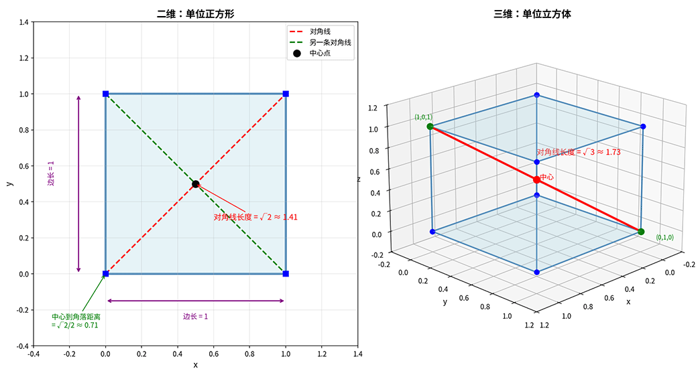

# Dimensionality Reduction

Modern data often has very high dimensionality. A $100 \times 100$ grayscale image is a $10000$-dimensional vector; a document's [bag-of-words representation](../../deep-learning/sequence-models/word-embedding.md#one-hot-encoding-and-bag-of-words-model) may have thousands of word features; gene expression data can even contain tens of thousands of gene dimensions. This data explosion brings two thorny problems. First, computational costs skyrocket. More features mean slower model training and greater memory usage. For linear regression, the computational complexity is proportional to the cube of the feature dimension; increasing features from $10$ to $100$ multiplies the computation by $1000$ times. Second is a more subtle but fatal problem: the **Curse of Dimensionality**, a term coined by American mathematician Richard Bellman in 1961, describing a series of counterintuitive phenomena in high-dimensional spaces. Imagine a unit cube. In 3D space, its volume is $1$. But if we extend to $100$ dimensions, the volume of the unit hypercube is still $1$, yet its diagonal length reaches $\sqrt{100} = 10$. This means that in high-dimensional space, most points concentrate near the corners of the cube, leaving the central region nearly empty. Worse still, distance metrics gradually fail in high-dimensional spaces; distances between any two points tend to become equal, blurring the distinction between "near neighbors" and "far neighbors."

The figure below provides an intuitive comparison of the geometric differences between a 2D unit square and a 3D unit cube. Although both have a "volume" of $1$, the spatial diagonal length increases from $\sqrt{2} \approx 1.41$ in 2D to $\sqrt{3} \approx 1.73$ in 3D. As dimensionality continues to grow, the diagonal length far exceeds the side length, causing data points to concentrate more and more in the corners of the hypercube while fewer data points remain in the central region. This is the geometric essence of the curse of dimensionality.



*Figure: Intuitive understanding of the curse of dimensionality: geometric changes from 2D to 3D*

Dimensionality reduction is precisely the means to address both of these problems. Its basic idea is to project high-dimensional data into a low-dimensional space while preserving as much of the original data's main information (measured by variance) as possible, removing noise and redundancy. Dimensionality reduction has two typical application scenarios:

- **Data visualization**: Reducing high-dimensional data to 2 or 3 dimensions for scatter plots, allowing humans to intuitively observe clustering structures and outlier distributions.
- **Feature compression**: Before classification or regression tasks, use **Principal Component Analysis** (PCA) to compress features from thousands of dimensions down to tens of dimensions, significantly improving the training efficiency of subsequent models.

This chapter will delve into the fundamental principles of PCA, starting from geometric intuition, deriving the objective function and solution method, and verifying its effectiveness through code practice. Finally, we will compare another dimensionality reduction method: **Linear Discriminant Analysis** (LDA), to understand the essential differences between unsupervised and supervised dimensionality reduction.

## PCA Mathematical Principles

Before diving into the mathematical derivation, let's first understand the idea of PCA through an intuitive example. Suppose we collect data on the area and total price of 100 houses in a city and plot these 100 points in a 2D coordinate system. The data shows a clear positive correlation trend: the larger the area, the higher the price. But careful observation reveals that these points are not perfectly aligned along a straight line; they are scattered with some width above and below the line — some houses have higher unit prices, some lower. Consider this question: if you were asked to use just one dimension to describe the features of these 100 houses (e.g., for subsequent clustering or classification), which dimension would you choose?

- Option one is to choose one of the dimensions, such as area, and discard the price dimension. But this is equivalent to looking only at the horizontal axis projection, resulting in severe information loss — houses with the same area but vastly different prices are forcibly grouped together.
- Option two is to find an optimal projection line, projecting each point on the 2D plane onto this line to obtain a 1D coordinate. What makes a projection line optimal? Intuitively, the projected points should be as distinguishable as possible, not crowded together. In other words, the variance of the projected data should be maximized. This is the design goal of PCA.

Next, we translate this geometric intuition into mathematical expressions and provide a derivation. Given $n$ samples $\{x_1, x_2, \ldots, x_n\}$, each sample $x_i$ is a $d$-dimensional vector $x_i = (x_{i1}, x_{i2}, \ldots, x_{id})^T \in \mathbb{R}^d$. The goal of PCA is to find a projection direction $w$ (subject to the unit length constraint $||w||=1$) that maximizes the [variance](../../maths/probability/probability-basics.md#bias-and-variance) of the sample vectors [projected](../../maths/linear/vectors.md#inner-product-and-projection) onto this direction. Variance measures the dispersion of data; larger variance means the projected data points are more spread out, retaining more information.

With this goal in mind, we formulate the PCA objective function. First, define the mean of the data and the mean after projection. The mean vector of the original data is $\bar{x} = \frac{1}{n}\sum_{i=1}^{n} x_i$. The projected coordinates are $w^T x_i$ (a scalar, representing the position along direction $w$), and the mean after projection is $w^T \bar{x}$ (the "center point" after projection). The variance after projection is defined as:

$$\text{Var} = \frac{1}{n}\sum_{i=1}^{n}(w^T x_i - w^T \bar{x})^2$$

This variance formula can be further simplified. Using properties of vector operations, expand the variance expression:

$$\text{Var} = \frac{1}{n-1}\sum_{i=1}^{n}(w^T x_i - w^T \bar{x})^2 = \frac{1}{n-1}\sum_{i=1}^{n}w^T(x_i - \bar{x})(x_i - \bar{x})^T w$$

This uses a mathematical trick: since $w^T(x_i - \bar{x})$ is a scalar, equal to its transpose $(x_i - \bar{x})^T w$, it can be factored into a product of two parts, moving $w$ outside the summation:

$$\text{Var} = w^T \left[\frac{1}{n-1}\sum_{i=1}^{n}(x_i - \bar{x})(x_i - \bar{x})^T\right] w = w^T S w$$

where $S = \frac{1}{n-1}\sum_{i=1}^{n}(x_i - \bar{x})(x_i - \bar{x})^T$ is the **Covariance Matrix** of the data. The term $(x_i - \bar{x})(x_i - \bar{x})^T$ is a $d \times d$ matrix (the [outer product](../../maths/linear/matrices.md#matrix-operations) of the centered sample vector with itself), representing the direction and magnitude of a single sample's deviation from the mean. Summing over all samples and dividing by $n-1$ gives the average of the overall deviation. The diagonal elements $S_{jj}$ of the covariance matrix are the variances of the $j$-th feature, and the off-diagonal elements $S_{jk}$ are the covariances between the $j$-th and $k$-th features (measuring their correlation). At this point, the PCA objective function is clear: find a unit vector $w$ that maximizes $w^T S w$. The solution to this optimization problem reveals the connection between PCA and the covariance matrix: the optimal projection direction is precisely the [eigenvector](../../maths/linear/matrices.md#eigenvectors-and-eigenvalues) of the covariance matrix.

In unconstrained optimization, we can directly take the derivative and set it to zero to find the extremum. But when constraints are present, the extremum is often not at the unconstrained optimal point but on the constraint boundary. The [regularization principle](../linear-models/regularization-glm.md#regularization-principle) section previously discussed a similar scenario in depth. The **Lagrange Multiplier Method** is a classic tool for handling such constrained optimization problems. For the PCA optimization problem, the constraint $w^T w = 1$ defines a unit sphere, and the extremum of the objective function $w^T S w$ on this sphere is the optimal projection direction we seek.

The approach of the Lagrange multiplier method was already applied in the [Lagrangian dual transformation](../support-vector-machines/svm-max-margin.md#lagrangian-dual-transformation) of support vector machines: construct a Lagrangian function that incorporates the constraint into the objective function, yielding $L(w, \lambda) = w^T S w - \lambda(w^T w - 1)$, where $w^T S w$ is the original objective function (the variance after projection) and $\lambda(w^T w - 1)$ is the penalty term for the constraint. Here $\lambda$ is the Lagrange multiplier (a parameter to be determined). When $w^T w = 1$, the penalty term is zero; when $w^T w \neq 1$, the penalty term is non-zero, forcing the optimization process back to the constraint boundary.

Taking the partial derivative with respect to $w$ and setting it to zero gives $\frac{\partial L}{\partial w} = 2Sw - 2\lambda w = 0$, which simplifies to $Sw = \lambda w$. This is precisely the eigenvalue equation, confirming from another angle that the optimal projection direction $w$ is an eigenvector of the covariance matrix $S$. Substituting $Sw = \lambda w$ and the constraint $w^T w = 1$ into the objective function, we compute the variance after projection:

$$w^T S w = w^T (\lambda w) = \lambda w^T w = \lambda$$

At this point, the conclusion is very clear: the projection variance equals the eigenvalue $\lambda$ (which is also the Lagrange multiplier). This means that after sorting the eigenvalues of the covariance matrix, the eigenvector corresponding to the largest eigenvalue is the projection direction with maximum variance (the first principal component), the eigenvector corresponding to the second largest eigenvalue is the second principal component, and so on. The magnitude of the eigenvalues directly quantifies the amount of information retained by each principal component.

## PCA Projection and Reconstruction

PCA provides a bidirectional information transformation tool: on one hand, it can compress high-dimensional data into a low-dimensional space (projection); on the other hand, it can recover the original data from the low-dimensional representation (reconstruction). This is somewhat like file compression, but lossy. Understanding this bidirectional transformation helps to gain a deeper insight into PCA's information processing mechanism.

- **High-dimensional to low-dimensional projection**: Given the centered data matrix $\tilde{X}$ ($n \times d$, each row is a sample), project it onto the first $k$ principal components: $Z = \tilde{X} V_k$, where $V_k$ is the principal component matrix ($d \times k$), each column is a principal component (eigenvector). The result $Z$ is the projected data ($n \times k$), with each sample compressed from $d$ dimensions to $k$ dimensions. Each column of $V_k$ defines a projection direction, and $\tilde{X} V_k$ is equivalent to projecting each sample onto these $k$ directions, yielding $k$ projection coordinates — these are the new low-dimensional features.

- **Low-dimensional to high-dimensional reconstruction**: The essence of dimensionality reduction is information compression, which inevitably causes information loss. PCA's reconstruction process attempts to recover the original data from the low-dimensional representation, but since the last $d-k$ principal components are discarded, there is bound to be some error between the reconstruction and the original data. The formula for reconstructing high-dimensional data is $\hat{X} = Z V_k^T + \bar{x}$, where $Z$ is the low-dimensional representation ($n \times k$), $V_k^T$ is the transpose of the principal component matrix ($k \times d$), and multiplying them is equivalent to expanding the low-dimensional data back to the high-dimensional space ($n \times d$), but only recovering the information from the first $k$ principal components. Finally, $\bar{x}$ is the mean of the original data, added back because PCA subtracted the mean during centering. The information loss caused by dimensionality reduction can be measured using the **Reconstruction Error**, defined as the mean squared error between the original data and the reconstructed data:

    $$\text{Error} = \frac{1}{n}\sum_{i=1}^{n}||x_i - \hat{x}_i||^2 = \sum_{j=k+1}^{d} \lambda_j$$

    From this formula, the reconstruction error equals the sum of the eigenvalues of the discarded principal components. This is entirely intuitive: eigenvalues represent information (variance), and the larger the discarded eigenvalues, the more severe the information loss. Another commonly used evaluation metric is the **Explained Variance Ratio**, which indicates the proportion of total information retained by the first $k$ principal components:

    $$\text{Explained Ratio} = \frac{\sum_{j=1}^{k} \lambda_j}{\sum_{j=1}^{d} \lambda_j}$$

    Suppose the covariance matrix of a 3D dataset has eigenvalues $\lambda_1 = 10$, $\lambda_2 = 2$, $\lambda_3 = 0.5$. The total variance is $10 + 2 + 0.5 = 12.5$. If you choose the first principal component: explained variance ratio = $10/12.5 = 80\%$. If you choose the first two principal components: explained variance ratio = $(10+2)/12.5 = 96\%$. This shows that the first principal component carries most of the information (80%), the second contributes an additional 16%, and the third is almost negligible (only 4%). In this case, reducing the 3D data to 2 dimensions is a very reasonable decision.

## Linear Discriminant Analysis

So far, we have discussed unsupervised dimensionality reduction methods that only focus on the overall variance structure of the data, without considering sample class labels. However, in classification tasks, the goal of dimensionality reduction may not be to retain the most information, but to separate different classes of data as much as possible. This is precisely the design motivation of **Linear Discriminant Analysis** (LDA).

Let's use an example to understand the difference between PCA and LDA. Suppose we have two types of data: one from healthy individuals' medical examination results and another from patients' examination results. Each sample has 10 features (blood pressure, blood sugar, cholesterol, etc.). The goal is to reduce to 1 dimension so that a simple threshold can distinguish the two classes. If we use PCA for dimensionality reduction, it will find the direction of maximum variance. But the problem is that the direction of maximum variance may not be the best direction for distinguishing "healthy" from "diseased" — the two classes might heavily overlap in this direction. If we use LDA for dimensionality reduction, it will find a direction that maximizes the inter-class distance and minimizes the intra-class dispersion after projection. Even if the overall variance in this direction is smaller than what PCA would find, it is the most valuable direction for classification.

LDA aims to find a projection direction $w$ that **maximizes inter-class distance and minimizes intra-class dispersion after projection**. Suppose there are $C$ classes, the $c$-th class has $n_c$ samples, and its mean vector is $\mu_c$. The global mean vector is $\bar{\mu}$. LDA's objective function is:

$$\arg \max_w \frac{w^T S_B w}{w^T S_W w}$$

- $S_B$ is the **Between-class Scatter Matrix**, defined as $S_B = \sum_{c=1}^{C} n_c (\mu_c - \bar{\mu})(\mu_c - \bar{\mu})^T$. The deviation of each class center from the global center, weighted by the number of samples in that class, summed together, measures the distance between different class centers. $w^T S_B w$ is a measure of inter-class distance after projection (larger is better).
- $S_W$ is the **Within-class Scatter Matrix**, defined as $S_W = \sum_{c=1}^{C} \sum_{x \in \text{class}_c} (x - \mu_c)(x - \mu_c)^T$. The deviation of all samples within each class from their class center, summed up, measures the dispersion of data within the same class. $w^T S_W w$ is a measure of intra-class dispersion after projection (smaller is better).

The result of the entire formula is the ratio of inter-class distance to intra-class dispersion. Maximizing this ratio means that different classes are as separated as possible while each class is as compact as possible. Clearly, the difference and application scenarios between PCA and LDA lie in whether class label information is used:

| Characteristic | PCA | LDA |
|:----:|:---:|:---:|
| Learning Paradigm | Unsupervised | Supervised |
| Objective Function | Maximize projection variance | Maximize between/within-class distance ratio |
| Application | Unlabeled data, visualization, feature compression | Labeled data, classification preprocessing |
| Linear Assumption | No special assumptions | Assumes each class follows a normal distribution with equal covariance |
| Maximum Dimensions | Can reduce to any $k$ dimensions | Maximum of $C-1$ dimensions (number of classes minus one) |

## PCA Algorithm Practice

With the theoretical derivation complete, let's verify our understanding through code practice. The following code implements the complete PCA algorithm pipeline: from centering, covariance matrix computation, eigendecomposition, to projection and reconstruction. We'll test it using the classic [Iris flower dataset](https://en.wikipedia.org/wiki/Iris_flower_data_set), reducing the 4D features to 2D, and verify the reconstruction error and explained variance ratio.

The Iris dataset contains 150 samples, each with 4 features (sepal length, sepal width, petal length, petal width), divided into 3 classes (Setosa, Versicolor, Virginica). This dataset is ideal for demonstrating PCA: 4D data is difficult to visualize directly (visualization will be shown in the [application scenarios](#application-scenarios-data-visualization-and-cluster-discovery) code), but after reducing to 2D, the class distribution can be clearly observed.

```python runnable extract-class="PCA"
import numpy as np

class PCA:
    """
    Principal Component Analysis (PCA) implementation
    
    Core steps (corresponding to the theoretical derivation):
    1. Center the data (subtract the mean)
    2. Compute the covariance matrix S = X̃^T X̃ / (n-1)
    3. Eigendecomposition S = V Λ V^T
    4. Select the top k eigenvectors as principal components
    5. Project onto the principal component space
    
    Parameters
    ----------
    n_components : int, optional
        Number of principal components to retain. If None, all components are retained.
    """
    
    def __init__(self, n_components=None):
        self.n_components = n_components
        
        # Store PCA results
        self.components_ = None              # Principal components (eigenvector matrix)
        self.explained_variance_ = None      # Eigenvalues (variance of each principal component)
        self.explained_variance_ratio_ = None  # Explained variance ratio
        self.mean_ = None                    # Data mean vector
    
    def fit(self, X):
        """
        Fit the PCA model
        
        Parameters
        ----------
        X : ndarray, shape (n_samples, n_features)
            Input data matrix
        
        Returns
        -------
        self : PCA instance
        """
        n_samples, n_features = X.shape
        
        # Step 1: Center the data (corresponds to x_i - x̄ in the theory)
        self.mean_ = X.mean(axis=0)
        X_centered = X - self.mean_
        
        # Step 2: Compute the covariance matrix (corresponds to S = 1/n Σ(x_i - x̄)(x_i - x̄)^T in the theory)
        # Use n-1 instead of n for unbiased estimation (consistent with sklearn)
        cov_matrix = X_centered.T @ X_centered / (n_samples - 1)
        
        # Step 3: Eigendecomposition (corresponds to S = VΛV^T in the theory)
        # np.linalg.eigh is specialized for symmetric matrices, returning real eigenvalues
        eigenvalues, eigenvectors = np.linalg.eigh(cov_matrix)
        
        # Sort eigenvalues and eigenvectors in descending order (PCA selects the direction of maximum variance)
        indices = np.argsort(eigenvalues)[::-1]
        eigenvalues = eigenvalues[indices]
        eigenvectors = eigenvectors[:, indices]
        
        # Store eigenvalues (corresponds to λ_j in the theory)
        self.explained_variance_ = eigenvalues
        
        # Step 4: Compute explained variance ratio (corresponds to Σλ_j / Σλ_total in the theory)
        total_variance = eigenvalues.sum()
        self.explained_variance_ratio_ = eigenvalues / total_variance
        
        # Determine the number of principal components
        if self.n_components is None:
            self.n_components = n_features
        
        # Step 5: Select the top k principal components (corresponds to V_k in the theory)
        self.components_ = eigenvectors[:, :self.n_components].T
        
        return self
    
    def transform(self, X):
        """
        Project data onto the principal component space
        
        Parameters
        ----------
        X : ndarray, shape (n_samples, n_features)
            Input data
        
        Returns
        -------
        Z : ndarray, shape (n_samples, n_components)
            Low-dimensional projected data
        """
        # Center then project (corresponds to Z = X̃ V_k in the theory)
        X_centered = X - self.mean_
        return X_centered @ self.components_.T
    
    def fit_transform(self, X):
        """Fit and transform in one step"""
        self.fit(X)
        return self.transform(X)
    
    def inverse_transform(self, Z):
        """
        Reconstruct original data from low-dimensional space
        
        Parameters
        ----------
        Z : ndarray, shape (n_samples, n_components)
            Low-dimensional representation
        
        Returns
        -------
        X_reconstructed : ndarray, shape (n_samples, n_features)
            Reconstructed high-dimensional data (mean added back)
        """
        # Reconstruction formula (corresponds to X̂ = Z V_k^T + x̄ in the theory)
        return Z @ self.components_ + self.mean_


# Test: Dimensionality reduction on Iris data
from sklearn.datasets import load_iris

iris = load_iris()
X = iris.data    # 150 samples, 4 features
y = iris.target  # 3 class labels

# PCA reduction to 2 dimensions
pca = PCA(n_components=2)
X_pca = pca.fit_transform(X)

print("=== PCA Dimensionality Reduction Results ===")
print(f"Original dimensions: {X.shape[1]}")
print(f"Dimensions after reduction: {X_pca.shape[1]}")
print(f"\nExplained variance ratio of each component: {pca.explained_variance_ratio_}")
print(f"Cumulative explained variance ratio: {pca.explained_variance_ratio_.sum():.3f}")

# Verify reconstruction error
X_reconstructed = pca.inverse_transform(X_pca)
reconstruction_error = np.mean((X - X_reconstructed) ** 2)
print(f"\nMean reconstruction error: {reconstruction_error:.6f}")
```

The results show that the first two principal components of the Iris data cumulatively explain approximately $92.4\% + 5.3\% \approx 97.7\%$ of the variance. This means that using just 2 dimensions, we can retain most of the information from the original 4D data. The first principal component contributes about 92.4% of the variance, indicating that the "primary direction of variation" in the data is concentrated in the first dimension. This is consistent with the characteristics of the Iris data: petal size is the most important feature for distinguishing species.

The reconstruction error is approximately 0.025, a very small value, indicating high accuracy when reconstructing from 2D back to 4D. This is the value of PCA: achieving significant dimensionality compression with minimal information loss.

## Application Scenarios: Data Visualization and Cluster Discovery

The most intuitive application of PCA is data visualization. While it is difficult to directly observe the structure of high-dimensional data, after reducing to 2D and plotting a scatter plot, the clustering structure, outlier distribution, and relationships between classes become clearly visible.

The following code demonstrates a typical scenario: generating 4D data containing 3 clusters, reducing it to 2D using PCA, and visualizing the result. From the scatter plot, we can observe that the 3 clusters are clearly separated, demonstrating PCA's value in revealing data structure in unsupervised learning.

```python runnable
import numpy as np
from shared.unsupervised.pca import PCA
import matplotlib.pyplot as plt

# Generate multi-cluster data (3 clusters, 50 samples each, 4-dimensional features)
X = np.vstack([
    np.random.multivariate_normal([0, 0, 0, 0], np.eye(4) * 0.5, 50),
    np.random.multivariate_normal([3, 3, 1, 1], np.eye(4) * 0.5, 50),
    np.random.multivariate_normal([-2, 2, -1, 2], np.eye(4) * 0.5, 50)
])

# Add color labels for visualization
colors = ['red'] * 50 + ['blue'] * 50 + ['green'] * 50

# PCA reduction to 2 dimensions (using the previously implemented PCA class)
pca = PCA(n_components=2)
X_2d = pca.fit_transform(X)

print("=== Data Visualization with Dimensionality Reduction ===")
print(f"Original dimensions: {X.shape[1]}")
print(f"Dimensions after reduction: 2")
print(f"Cumulative explained variance ratio: {pca.explained_variance_ratio_.sum():.3f}")

# Draw scatter plot
plt.figure(figsize=(10, 6))
for color in ['red', 'blue', 'green']:
    mask = [c == color for c in colors]
    plt.scatter(X_2d[mask, 0], X_2d[mask, 1], c=color, alpha=0.6, s=50)

plt.xlabel('First Principal Component (PC1)', fontsize=12)
plt.ylabel('Second Principal Component (PC2)', fontsize=12)
plt.title('Data Distribution After PCA Dimensionality Reduction', fontsize=14)
plt.grid(True, alpha=0.3)
plt.tight_layout()
plt.show()
plt.close()
```

From the scatter plot, we can observe that the three clusters are clearly separated in 2D space: the red cluster is in the lower-left region, the blue cluster in the upper-right region, and the green cluster in the middle-left region. This indicates that the "main structure" of the original 4D data (the distribution of the 3 clusters) is fully preserved in the 2D projection. The cumulative explained variance ratio is approximately 90%, further confirming that PCA has successfully captured the main information of the data. This visualization technique is widely used in practical scenarios:

- **Customer segmentation analysis**: Reduce dozens of user features (purchase behavior, browsing preferences, etc.) to 2 dimensions to observe natural divisions among customer groups.
- **Anomaly detection**: Isolated points far from the main body after dimensionality reduction may be anomalous samples (e.g., fraudulent transactions, equipment faults).
- **Feature effectiveness evaluation**: If the data shows clear class separation after dimensionality reduction, it indicates that the original features are effective for distinguishing the target.

## Singular Value Decomposition

We have discussed the mathematical principles of PCA in detail, with its core being the eigendecomposition of the covariance matrix to find the optimal projection direction. But what if the data matrix itself is not square? Is there a more general mathematical tool? The answer is **Singular Value Decomposition** (SVD). Any linear transformation can be decomposed into three steps: "rotation—scaling—rotation." $V^T$ rotates the data into the principal component coordinate system, $\Sigma$ scales along each principal component direction (singular values are the scaling factors), and $U$ rotates into the final sample space. This decomposition is entirely consistent with PCA's projection concept, differing only in perspective: PCA focuses on the projection directions ($V$), while SVD focuses on the complete transformation structure ($U$, $\Sigma$, $V$). There is a deep inherent connection between SVD and PCA. Revisiting the PCA derivation: given the centered data matrix $\tilde{X}$ ($n \times d$), the covariance matrix is $S = \frac{1}{n-1}\tilde{X}^T \tilde{X}$. PCA obtains the principal components by eigendecomposing $S$. Now consider performing SVD directly on $\tilde{X}$:

$$\tilde{X} = U \Sigma V^T$$

where $U$ is an $n \times n$ orthogonal matrix (left singular vectors), $\Sigma$ is an $n \times d$ diagonal matrix (singular values), and $V$ is a $d \times d$ orthogonal matrix (right singular vectors). Substituting this decomposition into the definition of the covariance matrix:

$$S = \frac{1}{n-1}\tilde{X}^T \tilde{X} = \frac{1}{n-1}(U \Sigma V^T)^T(U \Sigma V^T) = \frac{1}{n-1}V \Sigma^T \Sigma V^T = V \left(\frac{\Sigma^T \Sigma}{n-1}\right) V^T$$

This result reveals the connection between the two: the eigenvectors of the covariance matrix are precisely the right singular vectors $V$ of the SVD, and the relationship between eigenvalues and singular values is $\lambda_j = \frac{\sigma_j^2}{n-1}$. In other words, PCA is essentially performing SVD on the data matrix and taking the right singular vectors as the principal component directions. This equivalence is no coincidence but rather an equivalent description of the same geometric structure through different decomposition methods in linear algebra. Although the two are mathematically equivalent, SVD still has its significance, specifically in the following three points:
- First, SVD operates directly on the data matrix $\tilde{X}$ without explicitly computing the covariance matrix, saving significant computation and storage when $d$ is large (e.g., image data).
- Second, SVD has no restrictions on the matrix shape; it works whether $n > d$ or $n < d$, whereas eigendecomposition of the covariance matrix suffers from rank deficiency when the number of samples is less than the number of features.
- Finally, SVD provides richer information. The left singular vectors $U$ describe the positions of samples in the principal component space, which is valuable in applications such as recommender systems and latent semantic analysis.

Singular values are non-negative real numbers produced by matrix decomposition that reveal the "energy distribution" of a matrix. Specifically, for any matrix $\mathbf{A}$ (not necessarily square), its singular values $\sigma_1, \sigma_2, \ldots, \sigma_r$ are defined as the square roots of the eigenvalues of $\mathbf{A}^T\mathbf{A}$ (or $\mathbf{A}\mathbf{A}^T$): $\sigma_i = \sqrt{\lambda_i(\mathbf{A}^T\mathbf{A})}$, where $\lambda_i$ are the eigenvalues of $\mathbf{A}^T\mathbf{A}$. Singular values are always non-negative and are conventionally arranged in descending order: $\sigma_1 \geq \sigma_2 \geq \ldots \geq \sigma_r > 0$.

The larger the singular value, the greater the amount of information or "energy" contained in that direction of the matrix. The smaller the singular value, the weaker the information in that direction, often corresponding to noise or minor details. This property makes singular values a key indicator for data compression, dimensionality reduction, and noise filtering; by retaining only the larger singular values, the data storage size can be significantly reduced while keeping loss under control. Below is a simple example demonstrating the use of singular values:

```python runnable
import numpy as np
from PIL import Image
import requests
from io import BytesIO
import matplotlib.pyplot as plt

# Read an image from a website and convert it to a grayscale matrix
url = "https://ai.icyfenix.cn/logo_min_size.png"
img = Image.open(BytesIO(requests.get(url, timeout=10).content)).convert("L")
A = np.array(img, dtype=float)
m, n = A.shape

print(f"Original image size: {m} x {n}")
print(f"Original data size: {A.size} pixels")

# Perform SVD decomposition on the image matrix
U, S, Vt = np.linalg.svd(A, full_matrices=False)
print(f"Total number of singular values: {len(S)}")

# Reconstruct the image with different numbers of singular values and compare compression effects
k_values = [5, 20, 50, len(S)]
fig, axes = plt.subplots(1, 4, figsize=(14, 4))

for ax, k in zip(axes, k_values):
    # Retain only the top k singular values to reconstruct the image
    A_k = U[:, :k] @ np.diag(S[:k]) @ Vt[:k, :]
    # Compressed storage: U is m×k + S has k elements + Vt is k×n, originally m×n
    compressed_size = m * k + k + k * n
    ratio = compressed_size / A.size
    energy = (S[:k]**2).sum() / (S**2).sum()
    label = f"k = {k} | Energy {energy:.1%} | Storage {ratio:.0%}"

    ax.imshow(A_k, cmap="gray")
    ax.set_xlabel(label, fontsize=9)
    ax.set_xticks([])
    ax.set_yticks([])

plt.suptitle("SVD Image Compression: Reconstruction with Different Numbers of Singular Values", fontsize=12)
plt.tight_layout()
plt.show()
```

SVD is the foundation of image compression. Although an image matrix contains a large amount of data, its information is often concentrated in a few major directions: large singular values correspond to main features, while small singular values correspond to detail noise. By retaining the $k$ largest singular values and discarding the smaller ones, we can reconstruct an approximate image using far less storage than the original data. The compression ratio depends on the number of retained singular values $k$: more retained singular values bring the image quality closer to the original; fewer retained singular values yield a higher compression ratio but more detail loss. This approach of preserving principal energy while discarding minor components naturally aligns with the human visual system's way of perceiving images. The human eye is sensitive to the overall structure and main contours of an image but relatively tolerant of subtle texture variations.

From the results of the code above, we can intuitively see the effect of SVD compression: with only 5 singular values retained, the image is just a blurry outline, but the general shape is already recognizable; with 20 retained, details are significantly restored; with 50 retained, the image is almost indistinguishable from the original, yet the storage size is only about 78% of the original data. Notably, when k equals the matrix rank (128), the storage size actually exceeds 100%. This is because the full SVD decomposition requires storing all three matrices $U$, $S$, and $V^T$, which together contain more elements than the original matrix. The advantage of SVD compression is precisely evident when k is far smaller than the rank: a small number of singular values can approximate the original image quality. This is the power of low-rank approximation.

## Chapter Summary

The value of dimensionality reduction lies in its role as a bridge connecting high-dimensional data with human cognition. In data science practice, we often face a fundamental contradiction: the dimensionality of real-world data continues to expand, yet human understanding, computational resources, and visualization capabilities remain limited. The curse of dimensionality is not just an abstract mathematical concept; it tangibly affects the performance of every machine learning model.

On a deeper level, the ideas of dimensionality reduction have transcended the scope of pure data compression and permeated every aspect of modern machine learning. [Autoencoders](../../deep-learning/generative-models/vae.md) in deep learning are essentially nonlinear extensions of PCA; [word embedding](../../deep-learning/sequence-models/word-embedding.md#word-embedding) compresses high-dimensional one-hot encodings into low-dimensional dense vector spaces; low-rank approximation in image processing directly applies the principles of singular value decomposition. Understanding dimensionality reduction means understanding how to extract core structure from massive information, how to find the balance between information loss and computational efficiency — this is a fundamental skill that every data practitioner must master.

## Practice Problems

1. Why does PCA choose to maximize projection variance rather than minimize projection error? What is the relationship between the two?
   <details>
   <summary>Answer</summary>

   PCA maximizing projection variance is equivalent to minimizing reconstruction error. This is because:

   - $\text{Projection Variance} = \sum_{j=1}^{k} \lambda_j$
   - $\text{Reconstruction Error} = \sum_{j=k+1}^{d} \lambda_j$
   - $\text{Total Variance} = \sum_{j=1}^{d} \lambda_j = \text{Projection Variance} + \text{Reconstruction Error}$

   Since the total variance is constant, maximizing projection variance necessarily minimizes reconstruction error. The reason for choosing variance maximization as the objective function is that the mathematical derivation is more direct and can be transformed into an eigendecomposition problem of the covariance matrix.

   </details>

2. What is the maximum number of dimensions LDA can reduce to? Why is there this limit?
   <details>
   <summary>Answer</summary>

   LDA can reduce data to at most $C-1$ dimensions (number of classes minus one). This is because:

   The rank of the between-class scatter matrix $S_B$ is at most $C-1$ (each class center's deviation from the global center has only $C-1$ independent directions). Therefore, $S_B$ has at most $C-1$ non-zero eigenvalues, and LDA can only select these $C-1$ meaningful projection directions.

   For instance, a three-class problem can be reduced to at most 2 dimensions, and a binary classification problem to at most 1 dimension.

   </details>

3. Suppose the eigenvalues of a dataset's covariance matrix are $\lambda = [100, 50, 20, 5, 1]$. If the cumulative explained variance ratio needs to reach 95%, how many principal components should be selected?

   <details>
   <summary>Answer</summary>

   Total variance = $100 + 50 + 20 + 5 + 1 = 176$

   Cumulative explained variance ratio calculation:
   - First 1: $100/176 = 56.8\%$
   - First 2: $(100+50)/176 = 85.2\%$
   - First 3: $(100+50+20)/176 = 96.6\%$

   The cumulative explained variance ratio of the first 3 principal components is 96.6%, exceeding the 95% threshold. Therefore, 3 principal components should be selected.

   </details>

4. Implement a function that automatically determines the number of principal components based on a target explained variance ratio.
   <details>
   <summary>Answer</summary>

   ```python runnable
   import numpy as np
   from shared.unsupervised.pca import PCA
   def select_n_components(pca, target_ratio=0.95):
       # Automatically determine the number of principal components based on target explained variance ratio
       cumulative = np.cumsum(pca.explained_variance_ratio_)
       n_components = np.argmax(cumulative >= target_ratio) + 1
       return n_components
   
   # Test
   from sklearn.datasets import load_iris
   iris = load_iris()
   X = iris.data
   
   # First train with all principal components
   pca_full = PCA()
   pca_full.fit(X)
   
   # Automatically select the number of principal components to reach 95% explained variance ratio
   n = select_n_components(pca_full, 0.95)
   print(f"Number of principal components needed to reach 95% explained variance ratio: {n}")
   print(f"Actual explained variance ratio: {pca_full.explained_variance_ratio_[:n].sum():.3f}")
   ```
   </details>
