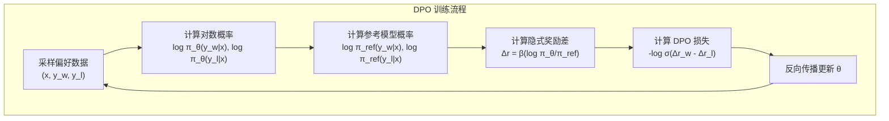
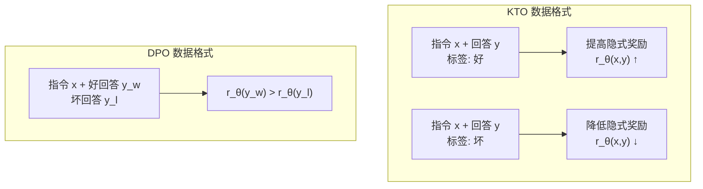
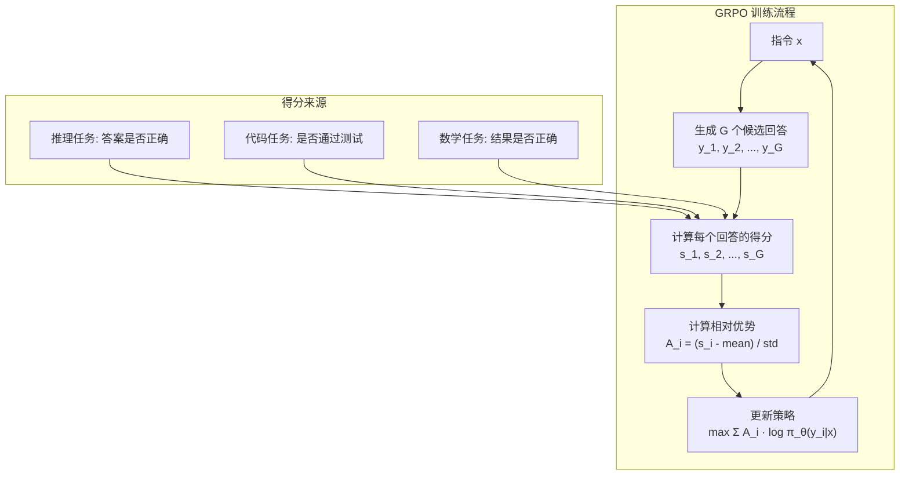

# 对齐新范式——DPO、KTO 与 GRPO

在上一章中，我们系统探讨了 RLHF——人类反馈强化学习。RLHF 通过奖励模型和 PPO 算法，让模型从人类偏好中学习，显著提升了模型的有用性、真实性和无害性。ChatGPT 的成功证明了 RLHF 的有效性。

但 RLHF 并非完美。它需要训练和协调三个模型（策略模型、奖励模型、参考模型），训练过程复杂且不稳定，存在奖励黑客风险，计算成本高昂。这些局限性促使研究者探索更简洁的对齐方法。

2023 年，**DPO**（Direct Preference Optimization）的提出开启了对齐新范式的序幕。DPO 绕过奖励模型，直接从偏好数据优化策略模型，将复杂的强化学习问题转化为简单的分类问题。随后，**KTO** 进一步简化了数据需求，只需"好/坏"标签而非成对对比数据。2025 年，DeepSeek-R1 提出的 **GRPO**（Group Relative Policy Optimization）更是将这一范式推向新高度 —— 无需单独奖励模型，通过组内相对评分实现自进化。

本文将从 RLHF 的局限性出发，系统介绍 DPO、KTO、GRPO 等对齐新范式的核心原理、数学推导和实践方法，并全面对比各方法的优劣与适用场景。

## DPO：直接偏好优化

**DPO**（Direct Preference Optimization，直接偏好优化）由 Rafailov 等人在 2023 年提出，核心洞见是：**RLHF 中的奖励模型可以被重新参数化，从而绕过显式的奖励模型训练，直接从偏好数据优化策略模型**。

### RLHF 的复杂性回顾

在深入 DPO 之前，先回顾 RLHF 的复杂性。RLHF 包含三个阶段：

**阶段一：奖励模型训练**

从偏好对比数据 $(x, y_w, y_l)$ 中学习奖励模型 $r_\phi$：

$$\mathcal{L}_{RM} = -\mathbb{E}_{(x, y_w, y_l)} \left[ \log \sigma(r_\phi(x, y_w) - r_\phi(x, y_l)) \right]$$

**阶段二：PPO 优化**

用强化学习优化策略模型 $\pi_\theta$：

$$\max_\theta \mathbb{E}_{x \sim \mathcal{D}, y \sim \pi_\theta(\cdot|x)} \left[ r_\phi(x, y) - \beta D_{KL}(\pi_\theta(\cdot|x) \| \pi_{ref}(\cdot|x)) \right]$$

**复杂性来源**：

- 需要训练奖励模型（额外的计算和数据）
- PPO 训练不稳定，需要精细调参
- 三模型架构（策略、奖励、参考）显存需求大
- 奖励黑客风险：模型可能找到奖励模型的漏洞

```nn-arch width=720
name: RLHF vs DPO 架构对比
layout: horizontal

sections:
  - name: RLHF（复杂）
    layers: [rlhf_policy, rlhf_reward, rlhf_ref, rlhf_ppo]
  - name: DPO（简洁）
    layers: [dpo_policy, dpo_ref, dpo_optimize]

layers:
  - {id: rlhf_policy, name: "策略模型 π_θ<br/>（待优化）", type: transformer, size: "生成回答"}
  - {id: rlhf_reward, name: "奖励模型 r_φ<br/>（需训练）", type: transformer, size: "评分"}
  - {id: rlhf_ref, name: "参考模型 π_ref<br/>（冻结）", type: transformer, size: "KL 约束"}
  - {id: rlhf_ppo, name: "PPO 优化<br/>（不稳定）", type: operation, size: "强化学习"}
  - {id: dpo_policy, name: "策略模型 π_θ<br/>（待优化）", type: transformer, size: "生成回答"}
  - {id: dpo_ref, name: "参考模型 π_ref<br/>（冻结）", type: transformer, size: "对比基准"}
  - {id: dpo_optimize, name: "DPO 损失<br/>（稳定）", type: operation, size: "分类损失"}
```

### DPO 的核心洞见

DPO 的核心洞见来自一个关键问题：**奖励模型和最优策略之间存在什么关系？**

考虑 RLHF 的优化目标：

$$\max_\pi \mathbb{E}_{x \sim \mathcal{D}, y \sim \pi(\cdot|x)} \left[ r(x, y) - \beta D_{KL}(\pi(\cdot|x) \| \pi_{ref}(\cdot|x)) \right]$$

这个优化问题有闭式解！最优策略 $\pi^*$ 可以表示为：

$$\pi^*(y|x) = \frac{1}{Z(x)} \pi_{ref}(y|x) \exp\left(\frac{1}{\beta} r^*(x, y)\right)$$

其中 $Z(x) = \sum_y \pi_{ref}(y|x) \exp\left(\frac{1}{\beta} r^*(x, y)\right)$ 是配分函数。

**关键推导**：从上述等式可以反解出奖励函数：

$$r^*(x, y) = \beta \log \frac{\pi^*(y|x)}{\pi_{ref}(y|x)} + \beta \log Z(x)$$

注意到 $Z(x)$ 只依赖于 $x$，不依赖于 $y$。在偏好对比中，我们只关心奖励的**相对值**（$r(x, y_w) - r(x, y_l)$），因此 $Z(x)$ 会被消去：

$$r^*(x, y_w) - r^*(x, y_l) = \beta \log \frac{\pi^*(y_w|x)}{\pi_{ref}(y_w|x)} - \beta \log \frac{\pi^*(y_l|x)}{\pi_{ref}(y_l|x)}$$

这就是 DPO 的核心洞见：**奖励差值可以直接用策略模型和参考模型的对数概率表示，无需显式训练奖励模型！**

### DPO 损失函数推导

将上述奖励重参数化代入 Bradley-Terry 模型。人类选择 $y_w$ 优于 $y_l$ 的概率为：

$$P(y_w \succ y_l | x) = \sigma(r^*(x, y_w) - r^*(x, y_l))$$

代入奖励的表达式：

$$P(y_w \succ y_l | x) = \sigma\left(\beta \log \frac{\pi^*(y_w|x)}{\pi_{ref}(y_w|x)} - \beta \log \frac{\pi^*(y_l|x)}{\pi_{ref}(y_l|x)}\right)$$

定义**隐式奖励**：

$$r_\theta(x, y) = \beta \log \frac{\pi_\theta(y|x)}{\pi_{ref}(y|x)}$$

则 DPO 的损失函数为：

$$\mathcal{L}_{DPO} = -\mathbb{E}_{(x, y_w, y_l) \sim \mathcal{D}} \left[ \log \sigma\left(\beta \log \frac{\pi_\theta(y_w|x)}{\pi_{ref}(y_w|x)} - \beta \log \frac{\pi_\theta(y_l|x)}{\pi_{ref}(y_l|x)}\right) \right]$$

这个损失函数的含义是：最大化策略模型给"好回答"更高隐式奖励、"坏回答"更低隐式奖励的概率。



### DPO 与 RLHF 的理论等价性

DPO 不是 RLHF 的近似，而是**理论等价**的另一种表述。两者优化的是同一个目标，只是参数化方式不同。

**RLHF 的参数化**：显式学习奖励函数 $r_\phi$，然后用 PPO 优化策略。

**DPO 的参数化**：将奖励函数隐式编码在策略模型中，直接优化策略。

这种等价性意味着：DPO 找到的最优解，与 RLHF 找到的最优解是相同的。但 DPO 的优化路径更直接，避免了强化学习的不稳定性。

```python runnable
import torch
import torch.nn as nn
import torch.nn.functional as F
import numpy as np
import matplotlib.pyplot as plt

plt.rcParams['font.sans-serif'] = ['SimHei', 'DejaVu Sans']
plt.rcParams['axes.unicode_minus'] = False

def dpo_loss(policy_logprobs, ref_logprobs, beta=0.1):
    """
    DPO 损失函数

    参数:
        policy_logprobs: (batch, 2) - [log π_θ(y_w|x), log π_θ(y_l|x)]
        ref_logprobs: (batch, 2) - [log π_ref(y_w|x), log π_ref(y_l|x)]
        beta: KL 惩罚系数

    返回:
        loss: 标量损失值
    """
    # 计算隐式奖励
    rewards = beta * (policy_logprobs - ref_logprobs)  # (batch, 2)

    # 奖励差值
    reward_diff = rewards[:, 0] - rewards[:, 1]  # r_w - r_l

    # DPO 损失: -log(sigmoid(reward_diff))
    loss = -F.logsigmoid(reward_diff).mean()

    return loss, reward_diff

# 演示 DPO 损失计算
torch.manual_seed(42)

batch_size = 4
policy_logprobs = torch.randn(batch_size, 2)  # 模拟策略模型对数概率
ref_logprobs = torch.randn(batch_size, 2)     # 模拟参考模型对数概率

# 不同 beta 值的影响
betas = [0.01, 0.1, 0.5, 1.0]

print("DPO 损失计算演示")
print("=" * 50)

for beta in betas:
    loss, reward_diff = dpo_loss(policy_logprobs, ref_logprobs, beta)
    print(f"β = {beta:.2f}: Loss = {loss.item():.4f}, Mean reward diff = {reward_diff.mean().item():.4f}")

# 可视化 DPO 损失函数
fig, axes = plt.subplots(1, 2, figsize=(14, 5))

# 左图：DPO 损失 vs 奖励差值
reward_diffs = np.linspace(-5, 5, 100)
dpo_losses = -np.log(1 / (1 + np.exp(-reward_diffs)))

axes[0].plot(reward_diffs, dpo_losses, 'b-', linewidth=2)
axes[0].axhline(y=0, color='gray', linestyle='--', alpha=0.5)
axes[0].axvline(x=0, color='gray', linestyle='--', alpha=0.5)
axes[0].scatter([0], [-np.log(0.5)], color='red', s=100, zorder=5)
axes[0].annotate('奖励差=0\nLoss=-log(0.5)', xy=(0, -np.log(0.5)), xytext=(1, 1),
                fontsize=10, arrowprops=dict(arrowstyle='->', color='red'))
axes[0].set_xlabel('奖励差值 (r_w - r_l)', fontsize=12)
axes[0].set_ylabel('DPO 损失', fontsize=12)
axes[0].set_title('DPO 损失函数', fontsize=14)
axes[0].grid(True, alpha=0.3)

# 右图：不同 beta 对隐式奖励的影响
policy_logprob = 0.5
ref_logprob_range = np.linspace(-2, 2, 100)

for beta in betas:
    implicit_reward = beta * (policy_logprob - ref_logprob_range)
    axes[1].plot(ref_logprob_range, implicit_reward, linewidth=2, label=f'β={beta}')

axes[1].axhline(y=0, color='gray', linestyle='--', alpha=0.5)
axes[1].set_xlabel('参考模型对数概率 log π_ref', fontsize=12)
axes[1].set_ylabel('隐式奖励 r_θ', fontsize=12)
axes[1].set_title('β 对隐式奖励的影响', fontsize=14)
axes[1].legend()
axes[1].grid(True, alpha=0.3)

plt.tight_layout()
plt.savefig('/workspace/dpo_loss.png', dpi=150, bbox_inches='tight')
plt.show()

print("\nDPO 关键参数解读:")
print("- β 控制对参考模型的偏离程度")
print("- β 太小: 模型可能过度偏离参考模型，失去预训练知识")
print("- β 太大: 模型难以学习偏好，优化缓慢")
print("- 典型值: β = 0.1 ~ 0.5")
```

### DPO 的实现细节

DPO 的实现比 RLHF 简单得多，核心步骤如下：

**数据准备**：偏好对比数据 $(x, y_w, y_l)$，其中 $y_w$ 是被选中的回答，$y_l$ 是被拒绝的回答。

**前向传播**：
1. 用策略模型 $\pi_\theta$ 计算 $y_w$ 和 $y_l$ 的对数概率
2. 用参考模型 $\pi_{ref}$ 计算 $y_w$ 和 $y_l$ 的对数概率（参考模型冻结）

**损失计算**：
$$\mathcal{L}_{DPO} = -\mathbb{E} \left[ \log \sigma\left(\beta \log \frac{\pi_\theta(y_w|x)}{\pi_{ref}(y_w|x)} - \beta \log \frac{\pi_\theta(y_l|x)}{\pi_{ref}(y_l|x)}\right) \right]$$

**反向传播**：只更新策略模型参数 $\theta$。

```python runnable
import torch
import torch.nn as nn
import torch.nn.functional as F

class SimpleLM(nn.Module):
    """简化的语言模型"""
    def __init__(self, vocab_size=1000, d_model=128):
        super().__init__()
        self.embedding = nn.Embedding(vocab_size, d_model)
        self.transformer = nn.TransformerEncoder(
            nn.TransformerEncoderLayer(d_model, 4, d_model * 4, batch_first=True),
            num_layers=2
        )
        self.output = nn.Linear(d_model, vocab_size)

    def forward(self, x):
        x = self.embedding(x)
        x = self.transformer(x)
        return self.output(x)

    def get_logprobs(self, input_ids, target_ids):
        """计算目标 token 的对数概率"""
        logits = self.forward(input_ids)
        log_probs = F.log_softmax(logits, dim=-1)
        # 取目标 token 位置的对数概率
        target_logprobs = log_probs.gather(2, target_ids.unsqueeze(-1)).squeeze(-1)
        return target_logprobs.sum(dim=1)  # 序列对数概率之和

def dpo_train_step(policy_model, ref_model, batch, beta=0.1, lr=1e-5):
    """
    单步 DPO 训练

    参数:
        policy_model: 策略模型（待优化）
        ref_model: 参考模型（冻结）
        batch: {
            'prompts': (batch, prompt_len),
            'chosen': (batch, response_len),
            'rejected': (batch, response_len)
        }
        beta: KL 惩罚系数
        lr: 学习率
    """
    prompts = batch['prompts']
    chosen = batch['chosen']
    rejected = batch['rejected']

    # 拼接 prompt 和 response
    chosen_input = torch.cat([prompts, chosen], dim=1)
    rejected_input = torch.cat([prompts, rejected], dim=1)

    # 计算策略模型的对数概率
    policy_chosen_logprobs = policy_model.get_logprobs(chosen_input, chosen)
    policy_rejected_logprobs = policy_model.get_logprobs(rejected_input, rejected)

    # 计算参考模型的对数概率（冻结）
    with torch.no_grad():
        ref_chosen_logprobs = ref_model.get_logprobs(chosen_input, chosen)
        ref_rejected_logprobs = ref_model.get_logprobs(rejected_input, rejected)

    # 计算隐式奖励
    chosen_rewards = beta * (policy_chosen_logprobs - ref_chosen_logprobs)
    rejected_rewards = beta * (policy_rejected_logprobs - ref_rejected_logprobs)

    # DPO 损失
    loss = -F.logsigmoid(chosen_rewards - rejected_rewards).mean()

    # 反向传播
    optimizer = torch.optim.Adam(policy_model.parameters(), lr=lr)
    optimizer.zero_grad()
    loss.backward()
    optimizer.step()

    # 计算指标
    with torch.no_grad():
        accuracy = (chosen_rewards > rejected_rewards).float().mean()
        kl_chosen = (policy_chosen_logprobs - ref_chosen_logprobs).mean()
        kl_rejected = (policy_rejected_logprobs - ref_rejected_logprobs).mean()

    return {
        'loss': loss.item(),
        'accuracy': accuracy.item(),
        'kl_chosen': kl_chosen.item(),
        'kl_rejected': kl_rejected.item()
    }

# 演示 DPO 训练
torch.manual_seed(42)

vocab_size = 100
policy_model = SimpleLM(vocab_size)
ref_model = SimpleLM(vocab_size)
ref_model.load_state_dict(policy_model.state_dict())  # 参考模型初始化为相同参数

print("DPO 训练演示")
print("=" * 50)

for step in range(5):
    # 模拟批次数据
    batch = {
        'prompts': torch.randint(0, vocab_size, (4, 5)),
        'chosen': torch.randint(0, vocab_size, (4, 10)),
        'rejected': torch.randint(0, vocab_size, (4, 10))
    }

    metrics = dpo_train_step(policy_model, ref_model, batch, beta=0.1)

    print(f"Step {step + 1}:")
    print(f"  Loss: {metrics['loss']:.4f}")
    print(f"  Accuracy: {metrics['accuracy']:.2%}")
    print(f"  KL (chosen): {metrics['kl_chosen']:.4f}")
    print(f"  KL (rejected): {metrics['kl_rejected']:.4f}")
    print()
```

### DPO 的优势与局限

**优势**：

**简洁性**：无需训练奖励模型，无需 PPO 的复杂调参，训练流程大大简化。

**稳定性**：DPO 是分类损失，优化稳定，不存在 PPO 的策略崩溃问题。

**计算效率**：只需两个模型（策略和参考），而非三个，显存需求降低。

**理论等价**：与 RLHF 优化相同的目标，不损失性能。

**局限**：

**数据需求**：仍需要成对的偏好对比数据 $(x, y_w, y_l)$，标注成本较高。

**KL 约束隐式**：β 参数控制 KL 约束，但不如 RLHF 的显式 KL 惩罚灵活。

**长序列问题**：对长序列的回答，对数概率计算可能不稳定。

## KTO：Kahneman-Tucker 优化

**KTO**（Kahneman-Tucker Optimization）由 Ethayarajh 等人在 2024 年提出，核心创新是：**只需要"好/坏"标签，而非成对对比数据**。这大大降低了数据标注的成本和门槛。

### 从成对对比到单点标签

DPO 需要成对对比数据 $(x, y_w, y_l)$：给定一个指令 $x$，生成两个回答，人类标注者判断哪个更好。这种数据收集成本高：

- 需要为每个指令生成多个候选回答
- 需要人类标注者进行两两比较
- 标注一致性难以保证

KTO 的洞见是：**人类对回答的判断往往是绝对的，而非相对的**。我们可以直接标注一个回答是"好"还是"坏"，无需成对比较。

**数据格式对比**：

| 方法 | 数据格式 | 标注难度 |
|:-----|:---------|:---------|
| DPO | $(x, y_w, y_l)$ 成对对比 | 高（需要比较） |
| KTO | $(x, y, \text{label})$ 单点标签 | 低（只需判断好/坏） |

### KTO 的理论基础

KTO 基于一个关键观察：DPO 的损失函数可以重新表述为**最大化好回答的隐式奖励，最小化坏回答的隐式奖励**。

定义隐式奖励：

$$r_\theta(x, y) = \beta \log \frac{\pi_\theta(y|x)}{\pi_{ref}(y|x)}$$

KTO 的损失函数：

$$\mathcal{L}_{KTO} = \mathbb{E}_{(x, y) \sim \mathcal{D}} \left[ \lambda_y \cdot \ell(r_\theta(x, y) - z) \right]$$

其中：
- $\lambda_y$ 是标签权重：好回答 $\lambda_y = \lambda_+$，坏回答 $\lambda_y = \lambda_-$
- $z$ 是参考点（通常是 0 或可学习参数）
- $\ell(\cdot)$ 是损失函数（如 hinge loss 或 logistic loss）

**直观理解**：

- 对于好回答：最大化 $r_\theta(x, y)$（提高隐式奖励）
- 对于坏回答：最小化 $r_\theta(x, y)$（降低隐式奖励）



### KTO 损失函数

KTO 的具体损失函数有多种变体，最常用的是基于 logistic 损失的版本：

**对于好回答**（label = desirable）：

$$\mathcal{L}_{+} = -\log \sigma(r_\theta(x, y) - z)$$

**对于坏回答**（label = undesirable）：

$$\mathcal{L}_{-} = -\log \sigma(z - r_\theta(x, y))$$

**总损失**：

$$\mathcal{L}_{KTO} = \mathbb{E}_{(x, y) \sim \mathcal{D}_+} [\mathcal{L}_{+}] + \mathbb{E}_{(x, y) \sim \mathcal{D}_-} [\mathcal{L}_{-}]$$

其中 $\mathcal{D}_+$ 是好回答数据集，$\mathcal{D}_-$ 是坏回答数据集。

```python runnable
import torch
import torch.nn.functional as F
import numpy as np
import matplotlib.pyplot as plt

plt.rcParams['font.sans-serif'] = ['SimHei', 'DejaVu Sans']
plt.rcParams['axes.unicode_minus'] = False

def kto_loss(policy_logprobs, ref_logprobs, labels, beta=0.1, desirable_weight=1.0, undesirable_weight=0.5):
    """
    KTO 损失函数

    参数:
        policy_logprobs: (batch,) - log π_θ(y|x)
        ref_logprobs: (batch,) - log π_ref(y|x)
        labels: (batch,) - 1 表示好回答，0 表示坏回答
        beta: KL 惩罚系数
        desirable_weight: 好回答的权重
        undesirable_weight: 坏回答的权重

    返回:
        loss: 标量损失值
    """
    # 计算隐式奖励
    rewards = beta * (policy_logprobs - ref_logprobs)

    # 分离好回答和坏回答
    desirable_mask = labels == 1
    undesirable_mask = labels == 0

    # 好回答损失：最大化奖励
    if desirable_mask.any():
        loss_desirable = -F.logsigmoid(rewards[desirable_mask]).mean()
        loss_desirable = desirable_weight * loss_desirable
    else:
        loss_desirable = 0.0

    # 坏回答损失：最小化奖励
    if undesirable_mask.any():
        loss_undesirable = -F.logsigmoid(-rewards[undesirable_mask]).mean()
        loss_undesirable = undesirable_weight * loss_undesirable
    else:
        loss_undesirable = 0.0

    loss = loss_desirable + loss_undesirable

    return loss, rewards

# 可视化 KTO 损失
fig, axes = plt.subplots(1, 2, figsize=(14, 5))

# 左图：好回答和坏回答的损失函数
rewards = np.linspace(-3, 3, 100)

# 好回答损失: -log(sigmoid(r))
loss_desirable = -np.log(1 / (1 + np.exp(-rewards)))

# 坏回答损失: -log(sigmoid(-r))
loss_undesirable = -np.log(1 / (1 + np.exp(rewards)))

axes[0].plot(rewards, loss_desirable, 'g-', linewidth=2, label='好回答损失')
axes[0].plot(rewards, loss_undesirable, 'r-', linewidth=2, label='坏回答损失')
axes[0].axvline(x=0, color='gray', linestyle='--', alpha=0.5)
axes[0].set_xlabel('隐式奖励 r_θ', fontsize=12)
axes[0].set_ylabel('损失', fontsize=12)
axes[0].set_title('KTO 损失函数', fontsize=14)
axes[0].legend()
axes[0].grid(True, alpha=0.3)

# 右图：DPO vs KTO 数据效率对比
data_sizes = np.array([1000, 5000, 10000, 50000, 100000])

# 模拟性能曲线
dpo_performance = 70 + 20 * (1 - np.exp(-data_sizes / 30000))
kto_performance = 70 + 22 * (1 - np.exp(-data_sizes / 20000))  # KTO 数据效率更高

axes[1].plot(data_sizes, dpo_performance, 'b-o', linewidth=2, label='DPO（成对数据）')
axes[1].plot(data_sizes, kto_performance, 'g-s', linewidth=2, label='KTO（单点标签）')
axes[1].set_xlabel('数据量（条）', fontsize=12)
axes[1].set_ylabel('模型性能', fontsize=12)
axes[1].set_title('DPO vs KTO 数据效率', fontsize=14)
axes[1].legend()
axes[1].grid(True, alpha=0.3)
axes[1].set_xscale('log')

plt.tight_layout()
plt.savefig('/workspace/kto_loss.png', dpi=150, bbox_inches='tight')
plt.show()

print("KTO 优势:")
print("1. 数据标注简单：只需判断好/坏，无需成对比较")
print("2. 数据效率高：可以利用更多单点标签数据")
print("3. 灵活性强：可以调整好/坏回答的权重")
print()
print("KTO 适用场景:")
print("- 大规模数据收集（如用户反馈）")
print("- 无法进行成对比较的场景")
print("- 需要快速迭代的场景")
```

### KTO 的优势

**数据门槛降低**：只需"好/坏"标签，无需成对对比，数据收集成本大幅降低。

**数据量扩展**：可以轻松收集大量单点标签数据（如用户点赞/点踩），数据规模不再受限于成对标注。

**灵活性**：可以调整好/坏回答的权重，适应不同的优化目标。

**与 DPO 兼容**：KTO 可以与 DPO 结合使用，成对数据用 DPO 损失，单点数据用 KTO 损失。

## ORPO 与 IPO：其他直接优化方案

除了 DPO 和 KTO，研究者还提出了多种直接优化方案。本节简要介绍 **ORPO** 和 **IPO**。

### ORPO：几率比偏好优化

**ORPO**（Odds Ratio Preference Optimization）由 Hong 等人在 2024 年提出，核心思想是将偏好学习**融入 SFT 阶段**，无需单独的对齐训练。

**关键洞见**：SFT 训练时，模型不仅学习如何生成好回答，也会学习坏回答的模式。ORPO 通过**几率比惩罚**，在强化好回答的同时抑制坏回答。

**几率比定义**：

$$\text{OR}(y|x) = \frac{\pi_\theta(y|x) / (1 - \pi_\theta(y|x))}{\pi_{ref}(y|x) / (1 - \pi_{ref}(y|x))}$$

**ORPO 损失**：

$$\mathcal{L}_{ORPO} = \mathcal{L}_{SFT} + \lambda \cdot \mathcal{L}_{OR}$$

其中：
- $\mathcal{L}_{SFT}$ 是标准的 SFT 损失（最大化好回答的概率）
- $\mathcal{L}_{OR}$ 是几率比损失（惩罚坏回答）

**优势**：将 SFT 和对齐合并为一个阶段，简化训练流程。

### IPO：身份偏好优化

**IPO**（Identity Preference Optimization）由 Azar 等人在 2024 年提出，核心思想是**移除 DPO 中的 sigmoid 函数**，使用更简单的损失形式。

**IPO 损失**：

$$\mathcal{L}_{IPO} = \mathbb{E}_{(x, y_w, y_l)} \left[ \left( r_\theta(x, y_w) - r_\theta(x, y_l) - \frac{1}{2\beta} \right)^2 \right]$$

**优势**：
- 损失函数更简单，优化更稳定
- 对超参数 β 更鲁棒
- 理论分析更清晰

### 方法对比

| 方法 | 核心思想 | 数据需求 | 主要优势 |
|:-----|:---------|:---------|:---------|
| DPO | 奖励重参数化 | 成对对比 | 理论等价 RLHF |
| KTO | 单点标签优化 | 好/坏标签 | 数据门槛低 |
| ORPO | SFT + 几率比惩罚 | 成对对比 | 训练阶段合并 |
| IPO | 移除 sigmoid | 成对对比 | 优化更稳定 |

## GRPO：组相对策略优化

2025 年，DeepSeek-R1 提出了 **GRPO**（Group Relative Policy Optimization，组相对策略优化），将对齐新范式推向新高度。GRPO 的核心创新是：**无需单独的奖励模型，通过组内相对评分实现自进化**。

### GRPO 的动机

DPO 和 KTO 虽然简化了 RLHF，但仍依赖人类标注的偏好数据。DeepSeek-R1 的核心问题是：**能否让模型自主进化，无需人类偏好数据？**

答案来自一个关键观察：对于推理任务，**正确答案本身就是奖励信号**。模型可以生成多个候选回答，通过比较它们的正确性来学习。

### GRPO 的核心机制

**组生成**：对于给定指令 $x$，模型生成 $G$ 个候选回答 $\{y_1, y_2, ..., y_G\}$。

**组内评分**：对每个回答计算得分 $s_i$（如是否正确、代码是否通过测试）。

**相对优势**：计算每个回答相对于组内平均的优势：

$$A_i = \frac{s_i - \text{mean}(\{s_1, ..., s_G\})}{\text{std}(\{s_1, ..., s_G\})}$$

**策略优化**：用相对优势更新策略：

$$\mathcal{L}_{GRPO} = -\mathbb{E} \left[ \frac{1}{G} \sum_{i=1}^{G} A_i \cdot \log \pi_\theta(y_i|x) \right]$$



### GRPO 与 DPO 的对比

| 特性 | DPO | GRPO |
|:-----|:----|:-----|
| 奖励来源 | 人类偏好数据 | 任务本身（正确性） |
| 数据需求 | 成对对比数据 | 无需人类标注 |
| 适用任务 | 通用对话 | 推理、代码、数学 |
| 自进化能力 | 无 | 有 |

### DeepSeek-R1 的突破

DeepSeek-R1 使用 GRPO 实现了推理能力的**自进化**：

**DeepSeek-R1-Zero**：直接从基础模型开始，仅用 GRPO 训练，无需 SFT 预热。模型自主涌现出推理能力，包括：
- 自我验证（Self-Verification）
- 回溯纠错（Backtracking）
- 多路径探索（Multi-path Exploration）

**DeepSeek-R1**：在 R1-Zero 基础上，加入少量 SFT 数据（约 8000 条），进一步提升性能。

```python runnable
import torch
import torch.nn as nn
import torch.nn.functional as F
import numpy as np
import matplotlib.pyplot as plt

plt.rcParams['font.sans-serif'] = ['SimHei', 'DejaVu Sans']
plt.rcParams['axes.unicode_minus'] = False

def grpo_loss(policy_logprobs, scores, epsilon=0.2):
    """
    GRPO 损失函数

    参数:
        policy_logprobs: (G,) - G 个候选回答的对数概率
        scores: (G,) - G 个候选回答的得分（如正确性）
        epsilon: 裁剪参数

    返回:
        loss: 标量损失值
    """
    # 计算相对优势
    mean_score = scores.mean()
    std_score = scores.std() + 1e-8
    advantages = (scores - mean_score) / std_score

    # 归一化优势（可选）
    advantages = (advantages - advantages.mean()) / (advantages.std() + 1e-8)

    # GRPO 目标：最大化高优势回答的概率
    # 简化版：直接用优势加权
    loss = -(advantages * policy_logprobs).mean()

    return loss, advantages

# 演示 GRPO
torch.manual_seed(42)

G = 4  # 组大小
policy_logprobs = torch.randn(G)
scores = torch.tensor([1.0, 0.0, 1.0, 0.0])  # 1=正确, 0=错误

loss, advantages = grpo_loss(policy_logprobs, scores)

print("GRPO 演示")
print("=" * 50)
print(f"候选回答数: {G}")
print(f"对数概率: {policy_logprobs.tolist()}")
print(f"得分: {scores.tolist()}")
print(f"相对优势: {advantages.tolist()}")
print(f"GRPO 损失: {loss.item():.4f}")

# 可视化 GRPO 流程
fig, axes = plt.subplots(1, 3, figsize=(15, 5))

# 左图：组生成
responses = ['回答1', '回答2', '回答3', '回答4']
log_probs = policy_logprobs.detach().numpy()
colors = ['green' if s == 1 else 'red' for s in scores]

axes[0].bar(responses, np.exp(log_probs), color=colors, alpha=0.7)
axes[0].set_xlabel('候选回答', fontsize=12)
axes[0].set_ylabel('概率', fontsize=12)
axes[0].set_title('组生成：4 个候选回答', fontsize=14)
for i, (lp, c) in enumerate(zip(log_probs, colors)):
    axes[0].annotate(f'正确' if scores[i] == 1 else '错误',
                    xy=(i, np.exp(lp)), xytext=(0, 5),
                    textcoords='offset points', ha='center', fontsize=9)

# 中图：相对优势
advantages_np = advantages.detach().numpy()
colors_adv = ['green' if a > 0 else 'red' for a in advantages_np]

axes[1].bar(responses, advantages_np, color=colors_adv, alpha=0.7)
axes[1].axhline(y=0, color='gray', linestyle='--')
axes[1].set_xlabel('候选回答', fontsize=12)
axes[1].set_ylabel('相对优势', fontsize=12)
axes[1].set_title('相对优势计算', fontsize=14)
axes[1].grid(True, alpha=0.3, axis='y')

# 右图：策略更新方向
update_direction = advantages_np * log_probs
colors_update = ['green' if u > 0 else 'red' for u in update_direction]

axes[2].bar(responses, update_direction, color=colors_update, alpha=0.7)
axes[2].axhline(y=0, color='gray', linestyle='--')
axes[2].set_xlabel('候选回答', fontsize=12)
axes[2].set_ylabel('更新方向', fontsize=12)
axes[2].set_title('策略更新：强化正确回答', fontsize=14)
axes[2].grid(True, alpha=0.3, axis='y')

plt.tight_layout()
plt.savefig('/workspace/grpo_flow.png', dpi=150, bbox_inches='tight')
plt.show()

print("\nGRPO 核心机制:")
print("1. 组生成: 对每个指令生成多个候选回答")
print("2. 组内评分: 根据任务正确性评分")
print("3. 相对优势: 计算每个回答相对于组平均的优势")
print("4. 策略更新: 强化高优势回答，抑制低优势回答")
```

### GRPO 的意义

GRPO 的意义远超一种新的优化方法：

**自进化能力**：模型可以自主提升推理能力，无需人类标注。

**任务驱动**：奖励信号来自任务本身（正确性），而非人类偏好。

**涌现能力**：DeepSeek-R1 展示了推理能力的涌现，包括自我验证、回溯纠错等。

**范式转变**：从"人类教模型"到"模型自主学习"，开启了对齐的新范式。

## 各方法全面对比

本节从多个维度全面对比 RLHF、DPO、KTO、ORPO、IPO、GRPO 等方法。

### 数据需求对比

| 方法 | 数据格式 | 标注成本 | 数据规模要求 |
|:-----|:---------|:---------|:-------------|
| RLHF | 偏好对比 + SFT 数据 | 高 | 中等（万级） |
| DPO | 成对对比 $(x, y_w, y_l)$ | 中高 | 中等（万级） |
| KTO | 单点标签 $(x, y, \text{label})$ | 低 | 可大规模 |
| ORPO | 成对对比 + SFT 合并 | 中 | 中等 |
| IPO | 成对对比 | 中 | 中等 |
| GRPO | 无需人类标注 | 极低 | 可自生成 |

### 训练稳定性对比

| 方法 | 训练复杂度 | 稳定性 | 调参难度 |
|:-----|:-----------|:-------|:---------|
| RLHF | 高（三模型 + PPO） | 低 | 高 |
| DPO | 中（两模型） | 高 | 低 |
| KTO | 中（两模型） | 高 | 低 |
| ORPO | 低（单阶段） | 高 | 低 |
| IPO | 中（两模型） | 很高 | 很低 |
| GRPO | 中（单模型） | 高 | 中 |

### 计算成本对比

| 方法 | 模型数量 | 显存需求 | 训练时间 |
|:-----|:---------|:---------|:---------|
| RLHF | 3（策略 + 奖励 + 参考） | 高 | 长 |
| DPO | 2（策略 + 参考） | 中 | 中 |
| KTO | 2（策略 + 参考） | 中 | 中 |
| ORPO | 1（策略） | 低 | 短 |
| IPO | 2（策略 + 参考） | 中 | 中 |
| GRPO | 1（策略） | 中 | 中 |

### 适用场景对比

| 方法 | 最适用场景 | 代表模型 |
|:-----|:-----------|:---------|
| RLHF | 通用对话、复杂偏好 | InstructGPT、ChatGPT |
| DPO | 通用对话、有偏好数据 | Zephyr |
| KTO | 大规模数据收集、用户反馈 | - |
| ORPO | SFT + 对齐合并训练 | - |
| IPO | 需要稳定优化的场景 | - |
| GRPO | 推理、代码、数学任务 | DeepSeek-R1 |

### 性能对比（基准测试）

```python runnable
import matplotlib.pyplot as plt
import numpy as np

plt.rcParams['font.sans-serif'] = ['SimHei', 'DejaVu Sans']
plt.rcParams['axes.unicode_minus'] = False

# 模拟各方法在不同任务上的性能（相对分数）
methods = ['RLHF', 'DPO', 'KTO', 'GRPO']
tasks = ['通用对话', '推理任务', '代码生成', '数学问题']

# 性能数据（模拟）
performance = {
    'RLHF': [90, 75, 80, 70],
    'DPO': [88, 76, 82, 72],
    'KTO': [85, 74, 78, 70],
    'GRPO': [80, 92, 90, 88],  # GRPO 在推理任务上更强
}

fig, ax = plt.subplots(figsize=(12, 6))

x = np.arange(len(tasks))
width = 0.2

for i, method in enumerate(methods):
    offset = (i - 1.5) * width
    bars = ax.bar(x + offset, performance[method], width, label=method)

    # 添加数值标注
    for bar, val in zip(bars, performance[method]):
        ax.annotate(f'{val}', xy=(bar.get_x() + bar.get_width()/2, bar.get_height()),
                   xytext=(0, 3), textcoords='offset points', ha='center', fontsize=9)

ax.set_xlabel('任务类型', fontsize=12)
ax.set_ylabel('性能分数（相对）', fontsize=12)
ax.set_title('不同对齐方法在各任务上的性能对比', fontsize=14)
ax.set_xticks(x)
ax.set_xticklabels(tasks)
ax.legend(loc='upper right')
ax.set_ylim(0, 100)
ax.grid(True, alpha=0.3, axis='y')

plt.tight_layout()
plt.savefig('/workspace/method_comparison.png', dpi=150, bbox_inches='tight')
plt.show()

print("方法选择建议:")
print()
print("1. 通用对话助手: DPO 或 RLHF")
print("   - 有偏好数据: DPO（更简洁）")
print("   - 需要精细控制: RLHF")
print()
print("2. 推理/代码/数学: GRPO")
print("   - 任务有明确正确答案")
print("   - 可自主生成训练数据")
print()
print("3. 大规模用户反馈: KTO")
print("   - 数据是点赞/点踩形式")
print("   - 需要快速迭代")
print()
print("4. 资源受限: ORPO 或 DPO")
print("   - 显存有限")
print("   - 需要快速训练")
```

## 小结

本文系统介绍了对齐新范式——DPO、KTO 与 GRPO：

**DPO（直接偏好优化）**：
- 核心洞见：奖励模型可重参数化为策略模型的对数概率比
- 优势：绕过奖励模型，简化训练，理论等价 RLHF
- 局限：仍需成对对比数据

**KTO**（Kahneman-Tucker 优化）：
- 核心洞见：只需"好/坏"标签，无需成对对比
- 优势：数据门槛低，可利用大规模单点标签数据
- 适用：用户反馈、快速迭代场景

**ORPO / IPO**：
- ORPO：将 SFT 和对齐合并为单阶段训练
- IPO：移除 sigmoid，优化更稳定

**GRPO（组相对策略优化）**：
- 核心洞见：无需人类偏好数据，通过组内相对评分自进化
- 突破：DeepSeek-R1 展示了推理能力的涌现
- 意义：从"人类教模型"到"模型自主学习"的范式转变

**方法选择指南**：
- 通用对话：DPO（简洁）或 RLHF（精细控制）
- 推理任务：GRPO（自进化）
- 用户反馈：KTO（低数据门槛）
- 资源受限：ORPO（单阶段）

对齐新范式的发展趋势是：**更简洁、更自主、更高效**。从 RLHF 的三模型架构，到 DPO 的两模型，再到 GRPO 的单模型自进化，对齐训练正在变得越来越简单而强大。下一章将探讨思维链与推理模型 —— 如何让模型学会"先想后答"。

---

## 练习题

**1. 理论推导**

从 RLHF 的最优策略表达式：
$$\pi^*(y|x) = \frac{1}{Z(x)} \pi_{ref}(y|x) \exp\left(\frac{1}{\beta} r^*(x, y)\right)$$

推导出 DPO 的隐式奖励表达式：
$$r^*(x, y) = \beta \log \frac{\pi^*(y|x)}{\pi_{ref}(y|x)} + \beta \log Z(x)$$

并解释为什么配分函数 $Z(x)$ 在偏好对比中可以被忽略。

**2. 算法对比**

分析 DPO 和 KTO 的核心差异：
- 数据格式有何不同？
- 损失函数有何本质区别？
- 各自适用于什么场景？

**3. 实践设计**

设计一个 7B 模型的对齐方案：
- 场景：通用对话助手
- 可用数据：10 万条用户对话，含点赞/点踩反馈
- 硬件：4 张 A100 80GB
- 给出方法选择、数据处理、训练配置

**4. 编程实现**

实现完整的 DPO 训练流程：
- 加载预训练模型和参考模型
- 准备偏好对比数据
- 计算 DPO 损失并优化
- 评估对齐效果

**5. 问题分析**

分析以下场景应选择哪种对齐方法：
- 数学竞赛题目解答（有标准答案）
- 客服对话系统（有用户满意度反馈）
- 代码助手（可通过单元测试验证）
- 创意写作（偏好主观）

---

## 参考资料

1. **DPO 论文**: "Direct Preference Optimization: Your Language Model is Secretly a Reward Model" (Rafailov et al., 2023)
2. **KTO 论文**: "KTO: Model Alignment as Prospect Theoretic Optimization" (Ethayarajh et al., 2024)
3. **ORPO 论文**: "ORPO: Monolithic Preference Optimization without Reference Model" (Hong et al., 2024)
4. **IPO 论文**: "A General Theoretical Paradigm to Understand Learning from Human Preferences" (Azar et al., 2024)
5. **DeepSeek-R1 论文**: "DeepSeek-R1: Incentivizing Reasoning Capability in LLMs via Reinforcement Learning" (DeepSeek-AI, 2025)
6. **Zephyr 模型**: "Zephyr: Direct Distillation of LM Alignment" (Tunstall et al., 2023)
7. **RLHF 综述**: "Toward Human-Aligned Language Models: A Survey" (Liu et al., 2024)
8. **偏好学习**: "Preference Learning: An Overview" (Fürnkranz & Hüllermeier, 2010)
