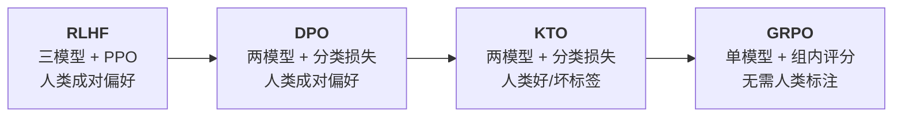
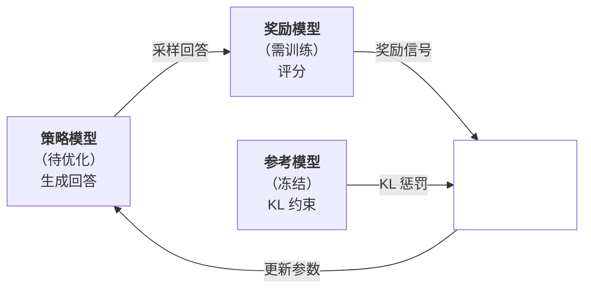
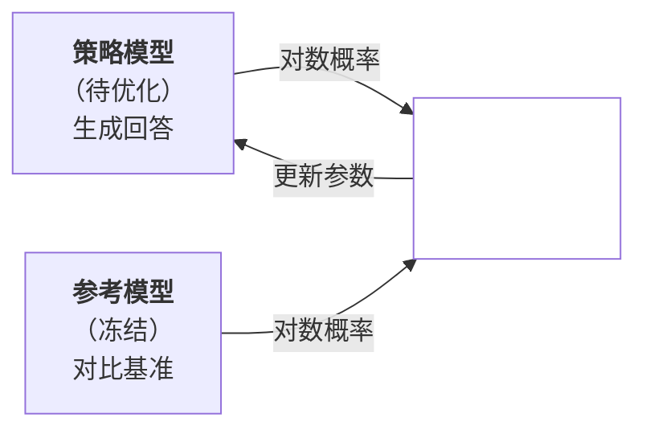
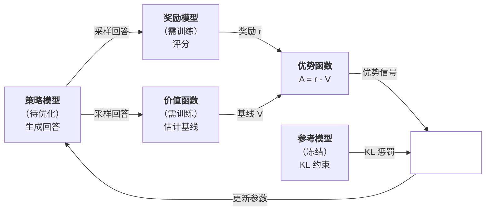
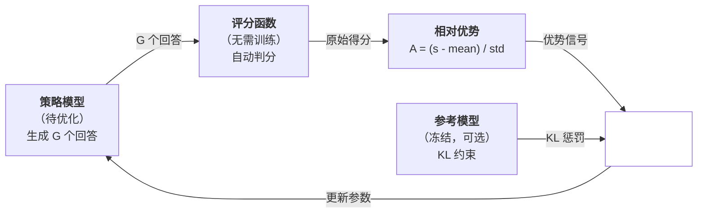

# 对齐方法的演进

[RLHF](rlhf.md) 通过奖励模型和 PPO 算法，让模型从人类偏好中学习，显著提升了模型的有用性、真实性和无害性，GPT 模型的成功向世界展示了 RLHF 的价值。另一方面，RLHF 的工程代价同样不可忽视。训练需要同时部署与协调三个模型（策略模型、奖励模型、参考模型）、PPO 的超参数调优如同走钢丝、始终难以摆脱奖励黑客（Reward Hacking）的阴影，等等。这些痛点并非细枝末节，它们直接决定了 RLHF 能否在工程实践中大规模落地。

2023 年 5 月，斯坦福大学的拉斐尔·拉法伊洛夫（Rafael Rafailov）等人发表论文《[Direct Preference Optimization: Your Language Model is Secretly a Reward Model](https://arxiv.org/abs/2305.18290)》，揭示了 RLHF 三模型架构中，奖励模型的信息已经隐含在策略模型的对数概率之中。基于这一发现，提出了**直接偏好优化**（Direct Preference Optimization，DPO）方法。DPO 绕过显式的奖励模型训练，直接用偏好数据优化策略模型，将复杂的强化学习问题转化为简单的分类问题，开启了对齐新范式的序幕。

2024 年 2 月，Contextual AI 的卡温·埃塔亚拉杰（Kawin Ethayarajh）等人从诺贝尔经济学奖得主丹尼尔·卡尼曼（Daniel Kahneman）和阿莫斯·特沃斯基（Amos Tversky）的前景理论（Prospect Theory）中获得灵感，提出了 **KTO**（Kahneman-Tversky Optimization）方法。KTO 优化只需要对答案给出简单的"好/坏"标签，无需成对比较的偏好数据。这意味着模型训练可以直接利用用户点赞、点踩这类天然存在的互联网反馈机制，而不必依赖专门的标注团队。

2025 年 1 月，DeepSeek 发布了 DeepSeek-R1，其中提出的**组相对策略优化**（Group Relative Policy Optimization，GRPO）将对齐方法推向了更本质的新方向。GRPO 面向推理、数学、代码等有明确正确答案的任务。模型可以自己生成多个候选回答，通过比较它们的正确性来学习，完全不需要人类提供偏好数据。DeepSeek-R1-Zero 仅用 GRPO 从基础模型开始训练，就自主涌现出了自我验证、回溯纠错等推理能力，展示了模型自主学习的可能性。

*图：对齐方法的演进*

从 RLHF 到 DPO、KTO、GRPO，对齐方法经历了一条从模糊到清晰、从繁琐到简化的路径。这条演进路径的每一步都在回答如何用更少的模型、更简单的数据、更稳定的训练来实现对齐。 

## 直接偏好优化

RLHF 的策略模型是间接训练出来的。先从偏好对比数据 $(x, y_w, y_l)$ 中训练一个奖励模型 $r_\phi$，再通过 PPO 算法，在 KL 散度约束下去尽量提升奖励模型给出的分数，得到策略模型 $\pi_\theta$，如下图所示。我们希望策略模型学会如何区分好回答和差回答，所以先造了一把度量好坏的尺子（奖励模型），再让策略模型反复度量自己的回答够不够准确。这里的问题在于尺子可能本身存在误差，模型可能学会了对准尺子的刻度，而非真正变的准确。

*图：PPO 优化过程*

反思一下，奖励模型（就是那把尺子）真的是必要的吗？既然我们手头已经有"回答 A 比回答 B 好"的偏好数据，为什么不能直接从这些对比数据中学习，而非要先造一把尺子再绕回来呢？2023 年，拉斐尔·拉法伊洛夫证明了 RLHF 的数学框架中，KL 散度约束下最大化奖励存在解析解，最优策略可以表示为参考模型按奖励值重新加权的形式。对这个闭式解取对数，又能反解出奖励函数。奖励函数和最优策略之间有了这种一一对应关系，便不需要单独训练一个奖励模型来翻译偏好信号。

*图：DPO 优化过程*

DPO 的实现比 PPO 简化很多，但要理解 DPO 算法每一步背后的数学动机，依然需较复杂的公式推导。接下来我们会从隐式奖励的推导出发，逐步推导出 DPO 的损失函数，然后落地到 DPO 的训练流程。本节内容可以与 PPO 算法互相对照着理解。DPO 不是 PPO 的近似关系，在偏好数据满足 [Bradley-Terry 模型](./rlhf.md#bradley-terry-模型)的假设，策略模型有足够的容量表达最优策略的前提下，DPO 就是与 PPO 理论等价的另一种表述形式。两者优化的是同一个目标，只是参数化方式不同。PPO 是显式学习奖励函数 $r_\phi$，然后用强化学习优化策略模型 $\pi_\theta$，DPO 是将奖励函数隐式编码在策略模型中，直接优化模型 $\pi_\theta$。DPO 的优化路径更直接，把强化学习问题转化为分类问题，避免了强化学习的不稳定性，三模型架构变为两模型架构也大幅降低了 RLHF 的工程成本。

### 隐式奖励

DPO 的出发点与 PPO 完全相同，都是在 KL 散度约束下最大化期望奖励，其优化目标可以形式化表示为：

$$\max_{\pi_\theta} \mathbb{E}_{x \sim \mathcal{D}, y \sim \pi_\theta(\cdot|x)} \left[ r(x, y) \right] - \beta \cdot \mathbb{D}_{KL} \left[ \pi_\theta(\cdot|x) \| \pi_{ref}(\cdot|x) \right]$$

这个公式与上一章讲解的 [PPO 目标函数](rlhf.md#近端策略优化)实质上是一致的。其中，$r(x, y)$ 是奖励函数，$\pi_{ref}$ 是参考模型，$\beta$ 控制 KL 约束的强度。第一项鼓励策略模型生成高奖励的回答，第二项惩罚策略模型偏离参考模型太远。$\beta$ 越大，约束越强，策略模型越保守。$\beta$ 越小，策略模型越自由，但也越可能偏离人类意图。将 [KL 散度惩罚项](rlhf.md#kl-散度惩罚项)展开后代入，目标函数变为：

$$\max_{\pi_\theta} \mathbb{E}_{x, y} \left[ r(x, y) - \beta \log \frac{\pi_\theta(y|x)}{\pi_{ref}(y|x)} \right]$$

这个优化问题已被证明存在解析解，最优策略可由公式直接计算，无需迭代搜索。推导过程利用了变分法：对每个指令 $x$，将目标函数关于 $\pi_\theta(\cdot|x)$ 求变分极值，在概率归一化约束 $\sum_y \pi_\theta(y|x) = 1$ 下应用拉格朗日乘子法，得到最优策略的闭式解：

$$\pi^*(y|x) = \frac{1}{Z(x)} \pi_{ref}(y|x) \exp\left(\frac{1}{\beta} r^*(x, y)\right)$$

其中 $Z(x) = \sum_y \pi_{ref}(y|x) \exp\left(\frac{1}{\beta} r^*(x, y)\right)$ 被称为配分函数，作用是保证概率归一化。闭式解表明最优策略是参考模型按奖励值的指数重新加权，奖励越高的回答被放大的倍数越大，$\beta$ 控制放大的程度。当 $\beta \to \infty$ 时，$\exp(r/\beta) \to 1$，最优策略退化为参考模型。当 $\beta \to 0$ 时，最优策略退化为把所有概率集中在奖励最高的回答上。

从这一步开始，PPO 和 DPO 出现了分歧。PPO 的做法是通过策略梯度方法逐步改进策略，用实际采样的奖励信号和梯度更新来逼近最优解。DPO 的做法是直接从闭式解出发，进行反向推导：既然最优策略可以用奖励函数来表达，那么反过来，奖励函数也能用策略来表达。对闭式解两边取对数并移项，可以反解出奖励函数：

$$r^*(x, y) = \beta \log \frac{\pi^*(y|x)}{\pi_{ref}(y|x)} + \beta \log Z(x)$$

这个反解结果揭示了奖励函数 $r^*$ 可以用策略模型和参考模型的对数概率比来描述。而配分函数 $Z(x)$ 只依赖于指令 $x$，不依赖于回答 $y$。在偏好对比中，我们只关心奖励的相对差值 $r(x, y_w) - r(x, y_l)$，$Z(x)$ 在做差时被消去，得到隐式奖励公式：

$$[dpo_eq] r(x, y_w) - r(x, y_l) = \beta \log \frac{\pi^*(y_w|x)}{\pi_{ref}(y_w|x)} - \beta \log \frac{\pi^*(y_l|x)}{\pi_{ref}(y_l|x)}$$

### 损失函数

推导隐式奖励的表达式是为接下来将它代入 [Bradley-Terry 模型](./rlhf.md#bradley-terry-模型)。在 RLHF 场景下，Bradley-Terry 模型的假设是每条回答 $(x, y)$ 都有一个标量奖励值 $r(x, y)$，人类在好回答 $y_w$ 和坏回答 $y_l$ 之间选择好回答的概率，取决于两者奖励值的差距有多大。奖励差距越大，选对的可能性越高，奖励接近时，选择就变得不确定。用形式化语言来表达，就是将奖励差值通过 Sigmoid 函数映射为概率：

$$P(y_w \succ y_l | x) = \sigma\left(r(x, y_w) - r(x, y_l)\right)$$

将隐式奖励公式 {{dpo_eq}} 代入，偏好概率变为：

$$P(y_w \succ y_l | x) = \sigma\left(\beta \log \frac{\pi_\theta(y_w|x)}{\pi_{ref}(y_w|x)} - \beta \log \frac{\pi_\theta(y_l|x)}{\pi_{ref}(y_l|x)}\right)$$

将隐式奖励代入 Bradley-Terry 模型后，偏好概率完全由策略模型和参考模型的对数概率比来表达，不再依赖任何外部奖励模型。接下来的优化只需让模型预测的偏好概率匹配人类实际偏好。对偏好数据做最大似然估计，即最大化 $\log P(y_w \succ y_l | x)$，等价于最小化其负值，就得到 DPO 的损失函数：

$$\mathcal{L}_{DPO} = -\mathbb{E}_{(x, y_w, y_l)} \left[ \log \sigma\left(\beta \log \frac{\pi_\theta(y_w|x)}{\pi_{ref}(y_w|x)} - \beta \log \frac{\pi_\theta(y_l|x)}{\pi_{ref}(y_l|x)}\right) \right]$$

为了书写简洁，定义隐式奖励 $r_\theta(x, y) = \beta \log \frac{\pi_\theta(y|x)}{\pi_{ref}(y|x)}$，损失函数可以简写为：

$$\mathcal{L}_{DPO} = -\mathbb{E}_{(x, y_w, y_l)} \left[ \log \sigma\left(r_\theta(x, y_w) - r_\theta(x, y_l)\right) \right]$$

看到这个损失函数，细心的读者可能已经察觉到它和[训练奖励模型的损失函数](./rlhf.md#bradley-terry-模型)长得一模一样。奖励模型的损失是 $-\log \sigma(r_\phi(x, y_w) - r_\phi(x, y_l))$，DPO 的损失是 $-\log \sigma(r_\theta(x, y_w) - r_\theta(x, y_l))$，两者形式完全相同，区别只在于奖励的来源不同。PPO 的奖励模型是用一个单独训练的 $r_\phi$ 来评分，DPO 是用策略模型与参考模型的对数概率比 $r_\theta$ 来评分。DPO 直接通过这个损失更新策略模型参数，一步到位。下面对 DPO 损失函数中的各项进行简要解释：

- **隐式奖励差值**（$r_\theta(x, y_w) - r_\theta(x, y_l)$）：衡量模型对好回答胜过坏回答的偏好程度。差值为正说明好回答的隐式奖励更高，差值越大说明偏好越强。与 PPO 中的优势函数 $A(x, y)$ 类似，都是为策略更新提供方向。好回答应该获得正向信号，坏回答应该获得负向信号。区别在于 PPO 的优势函数来自奖励模型评分减去值函数基线，DPO 的隐式奖励差值直接来自两个模型的对数概率比。

- **Sigmoid 函数**（$\sigma(\cdot)$）：将差值映射到 $(0, 1)$ 区间，表示偏好概率。差值为 0 时偏好概率为 0.5（随机选择），差值为正且越大时偏好概率越接近 1（几乎必然选好回答），差值为负时偏好概率低于 0.5（更可能选坏回答，说明模型还没学好）。

- **负对数似然**（$-\log \sigma(\cdot)$）：标准的二分类交叉熵损失。当差值为正且越大时，$\sigma$ 输出接近 1，$-\log \sigma$ 接近 0，损失很低。当差值为负时，$\sigma$ 输出低于 0.5，$-\log \sigma$ 急剧上升，损失陡增。这个惩罚的不对称性很重要，模型给坏回答更高的隐式奖励比给好回答略高的隐式奖励要严重得多，就像医生误诊的后果远比过度谨慎严重。

- **KL 约束系数**（$\beta$）：控制隐式奖励的尺度，$\beta$ 越大，KL 约束越强，策略模型越不容易偏离参考模型。在 PPO 中，KL 约束是通过显式的惩罚项 $\beta \cdot KL[\pi_\theta \| \pi_{ref}]$ 来实现的，并且可以动态调整。DPO 中，KL 约束被隐式地编码在 $\beta$ 参数中，训练过程中是固定的，灵活性不如 PPO，但实现更简单。

从优化角度看，DPO 损失驱动模型参数同时朝两个方向更新：提高好回答的隐式奖励（让 $\pi_\theta$ 更倾向生成好回答），降低坏回答的隐式奖励（让 $\pi_\theta$ 更不倾向生成坏回答）。但这两个方向并非对称。隐式奖励的定义是 $r_\theta(x,y) = \beta(\log \pi_\theta(y|x) - \log \pi_{ref}(y|x))$，其中参考模型 $\pi_{ref}$ 是冻结的，不参与梯度计算。因此，虽然公式中同时出现 $\log \pi_\theta$ 和 $\log \pi_{ref}$ 两项，但梯度只会通过 $\log \pi_\theta$ 这一条路径传导，提高好回答的隐式奖励只能靠增大 $\log \pi_\theta(y_w|x)$ 来实现，降低坏回答的隐式奖励只能靠减小 $\log \pi_\theta(y_l|x)$ 来实现。$\log \pi_{ref}$ 在反向传播时被视作常数，不接收任何梯度信号。

### 训练流程

DPO 的训练数据是偏好对比三元组 $(x, y_w, y_l)$，其中 $x$ 是指令，$y_w$ 是被选中的好回答，$y_l$ 是被拒绝的坏回答。训练流程可以拆解为以下四个步骤：

- 第一步 **初始化**：策略模型 $\pi_\theta$ 从 SFT 微调后的模型初始化，参考模型 $\pi_{ref}$ 复制相同的参数后冻结。两者起点一致，训练过程中只有 $\pi_\theta$ 的参数会更新。这一步与 PPO 的初始化完全相同。

- 第二步 **计算对数概率**：对于每个训练样本 $(x, y_w, y_l)$，策略模型分别计算好回答和坏回答的对数概率 $\log \pi_\theta(y_w|x)$ 和 $\log \pi_\theta(y_l|x)$。参考模型在 `no_grad` 模式下计算 $\log \pi_{ref}(y_w|x)$ 和 $\log \pi_{ref}(y_l|x)$。这一步与 PPO 的区别在于 PPO 中策略模型需要自回归生成回答再计算概率，只能串行进行。DPO 直接用标注数据中的回答计算概率，不需要生成步骤，可以充分并行。

- 第三步 **计算隐式奖励**：好回答的隐式奖励为 $r_\theta(x, y_w) = \beta(\log \pi_\theta(y_w|x) - \log \pi_{ref}(y_w|x))$，坏回答的隐式奖励为 $r_\theta(x, y_l) = \beta(\log \pi_\theta(y_l|x) - \log \pi_{ref}(y_l|x))$。在 PPO 中，奖励来自一个单独训练的奖励模型 $r_\phi(x, y)$；在 DPO 中，奖励来自策略模型与参考模型的对数概率比，不需要奖励模型。这是两者最本质的区别。

- 第四步 **计算损失并反向传播**：将隐式奖励代入 DPO 损失 $\mathcal{L}_{DPO} = -\log \sigma(r_\theta(x, y_w) - r_\theta(x, y_l))$，计算梯度并更新策略模型参数。参考模型在整个训练过程中保持冻结，充当基准线。PPO 的更新需要裁剪机制来约束更新幅度、需要值函数来估计优势、需要 KL 散度惩罚来防止累积偏移。DPO 则完全不需要这些，分类损失本身就是良态的，优化过程天然稳定，基本不会出现 PPO 中的策略崩溃问题。

训练初期，由于策略模型和参考模型参数相同（$\log \pi_\theta = \log \pi_{ref}$），隐式奖励差值为 0，初始损失约为 $-\log \sigma(0) = -\log 0.5 \approx 0.693$。这个初始值可以作为一个诊断信号，如果训练开始时损失远低于 0.693，说明策略模型和参考模型的参数可能不一致，初始化阶段出了问题。随着训练进行，策略模型逐渐学会给好回答更高的隐式奖励、给坏回答更低的隐式奖励，损失逐渐下降。

### 优势与局限

理论上，DPO 与 RLHF 优化相同的目标，在理想条件下可以找到相同的最优解，但 DPO 本质上是二分类交叉熵损失，不是强化学习，天然规避了 PPO 优化过程不稳定易崩溃的问题。在工程实践中，DPO 无需训练奖励模型，调参与训练流程大为简化，又省去了奖励模型的成本，显存需求显著降低，在简单与成本方面都有显著优势。

相对 PPO，DPO 也有两点不足。首先，DPO 失去了显式 KL 约束，仅用 $\beta$ 参数控制 KL 惩罚，不如 PPO 的显式 KL 惩罚项灵活。在 PPO 中可以动态调整 KL 惩罚系数，而 DPO 的 $\beta$ 在训练过程中是固定的。其次，DPO 对长序列的回答对数概率的计算可能不稳定。由于序列的对数概率是各 token 对数概率之和（$\log \pi(y|x) = \sum_t \log \pi(y_t | x, y_{<t})$），序列越长，累加的项越多，对数概率的绝对值就越大，导致隐式奖励 $r_\theta = \beta(\log \pi_\theta - \log \pi_{ref})$ 的数值范围随之扩大，容易引发梯度爆炸或数值溢出。

## Kahneman-Tversky 优化

DPO 的训练数据是成对偏好对比三元组 $(x, y_w, y_l)$，其中 $x$ 是指令，$y_w$ 是被选中的好回答，$y_l$ 是被拒绝的坏回答。这种数据格式的收集成本并不低，对于同一个指令，需要先生成两个候选回答，再让人类标注者比较哪个更好。而且不同标注者的判断标准可能不一致，"好多少"的相对信息难以量化。

2024 年 2 月，Contextual AI 从诺贝尔经济学奖得主丹尼尔·卡尼曼（Daniel Kahneman）和阿莫斯·特沃斯基（Amos Tversky）的前景理论（Prospect Theory）中获得灵感，提出了 KTO（Kahneman-Tversky Optimization）方法。前景理论是行为经济学的奠基性成果，描述了人类在面对风险时的决策行为。前景理论的核心发现之一是损失厌恶（Loss Aversion），它是指人们对损失的敏感程度远高于对等量收益的敏感程度。丢掉 100 元的痛苦，大约是捡到 100 元的快乐的两倍。这种不对称性深刻影响了人类的价值判断。

KTO 从前景理论中汲取了两方面的启发。一方面，损失厌恶的思想被引入损失函数的设计。在对齐场景中，"好回答"和"坏回答"对模型优化的贡献应该是不对称的，生成一个坏回答的"损失"应该比生成一个好回答的"收益"受到更大的惩罚。这与 DPO 中好/坏回答对称处理的方式不同，更符合人类对质量的感知方式，"做错事"的后果比"做对事"的收益更值得关注。另一方面，前景理论对人类决策行为的描述还揭示了人类对回答的判断往往是绝对的，而非相对的。当你给一条网购评价点了"赞"或"踩"时，并不需要先看另一个备选回答再作比较。类似的反馈机制在当今互联网上比比皆是，KTO 正是利用这种绝对判断来简化训练数据的需求，让模型训练可以直接利用互联网上已有的反馈数据。

### 损失函数

KTO 沿用了 DPO 中隐式奖励的定义 $r_\theta(x, y) = \beta \log \frac{\pi_\theta(y|x)}{\pi_{ref}(y|x)}$，但将损失函数从"成对对比"改为"单点评价"。对于好回答（`label = desirable`），损失函数鼓励提高隐式奖励 $\mathcal{L}_{+} = 1 - \sigma(r_\theta(x, y) - z)$，对于坏回答（`label = undesirable`），损失函数鼓励降低隐式奖励 $\mathcal{L}_{-} = 1 - \sigma(z - r_\theta(x, y))$。KTO 的总损失是好/坏两部分加权求和：

$$\mathcal{L}_{KTO} = \lambda_+ \cdot \mathbb{E}_{(x, y) \sim \mathcal{D}_+} [\mathcal{L}_{+}] + \lambda_- \cdot \mathbb{E}_{(x, y) \sim \mathcal{D}_-} [\mathcal{L}_{-}]$$

我们照例拆开这个公式的每一项，来了解它们的设计意图：

- **隐式奖励**（$r_\theta(x, y)$）：与 DPO 中的定义完全相同，是策略模型与参考模型的对数概率比。这个值衡量了策略模型相对于参考模型"多想生成"这个回答的程度。

- **参考点**（$z$）：对应前景理论中的"现状参照点"，模型以此为基准判断回答的好坏。通常设为 0，意味着与参考模型持平。隐式奖励高于参考点的是好回答，低于参考点的是坏回答。

- **好回答损失**（$\mathcal{L}_{+}$）：$1 - \sigma(r_\theta - z)$ 鼓励隐式奖励高于参考点。当 $r_\theta \gg z$ 时，$\sigma(r_\theta - z) \approx 1$，损失接近 0；当 $r_\theta < z$ 时，损失接近 1。这推动模型给好回答更高的生成概率。

- **坏回答损失**（$\mathcal{L}_{-}$）：$1 - \sigma(z - r_\theta)$ 鼓励隐式奖励低于参考点。注意这里 $z$ 和 $r_\theta$ 的位置互换了。当 $r_\theta \ll z$ 时，$\sigma(z - r_\theta) \approx 1$，损失接近 0；当 $r_\theta > z$ 时，损失接近 1。这推动模型给坏回答更低的生成概率。

- **不对称权重**（$\lambda_+$ 和 $\lambda_-$）：对应前景理论中损失厌恶的思想。通常设置 $\lambda_- > \lambda_+$，意味着坏回答受到的惩罚比好回答获得的奖励更重。这与人类决策行为一致，避免错误的优先级高于追求正确。

从优化角度看，KTO 损失与 DPO 一样，也是同时驱动模型参数朝两个方向更新：提高好回答的隐式奖励（让 $\pi_\theta$ 更倾向生成好回答），降低坏回答的隐式奖励（让 $\pi_\theta$ 更不倾向生成坏回答）。与 DPO 的区别在于这两个方向是独立优化的，好回答和坏回答不需要来自同一个指令，甚至不需要在同一个 Batch 中配对出现。这带来了数据收集的极大灵活性。

### 训练流程

KTO 的训练数据是单点标签二元组 $(x, y, \text{label})$，其中 $x$ 是指令，$y$ 是回答，$\text{label} \in \{$ `desirable` $, $`undesirable` $\}$ 代表"好/坏"的标签。训练流程可以拆解为以下四个步骤：

- 第一步 **初始化**：策略模型 $\pi_\theta$ 从 SFT 微调后的模型初始化，参考模型 $\pi_{ref}$ 复制相同的参数后冻结。这一步与 PPO、DPO 完全相同。

- 第二步 **计算对数概率**：对于每个训练样本 $(x, y, \text{label})$，策略模型计算回答的对数概率 $\log \pi_\theta(y|x)$，参考模型在 `no_grad` 模式下计算 $\log \pi_{ref}(y|x)$。与 DPO 的区别在于 DPO 需要同时计算好回答和坏回答的对数概率，KTO 只需计算一个回答的对数概率。

- 第三步 **计算隐式奖励**：$r_\theta(x, y) = \beta(\log \pi_\theta(y|x) - \log \pi_{ref}(y|x))$。这一步与 DPO 完全相同。

- 第四步 **计算损失并反向传播**：根据标签选择损失函数。如果是好回答，计算 $\mathcal{L}_{+} = -\log \sigma(r_\theta - z)$；如果是坏回答，计算 $\mathcal{L}_{-} = -\log \sigma(z - r_\theta)$。加权求和后计算梯度，更新策略模型参数。与 DPO 的区别在于 DPO 的损失依赖同一指令的好/坏回答配对，KTO 的损失独立计算每个样本，不需要配对。

训练初期，由于策略模型和参考模型参数相同（$\log \pi_\theta = \log \pi_{ref}$），隐式奖励为 0。对于好回答和坏回答，损失都约为 $-\log \sigma(0) \approx 0.693$。随着训练进行，策略模型逐渐学会给好回答更高的隐式奖励、给坏回答更低的隐式奖励，两部分损失同时下降。

### 优势与局限

KTO 的最大优势是数据门槛大幅降低。只需"好/坏"标签，无需成对对比，这意味着我们可以直接利用用户点赞/点踩这类天然存在的大规模反馈数据，而不必专门组织标注团队进行两两比较，可以轻松扩展到百万级别。此外，$\lambda_+$ 和 $\lambda_-$ 两个权重参数提供了更高的灵活性，可以根据实际场景调整对好/坏回答的侧重程度。KTO 还可以与 DPO 结合使用，成对数据用 DPO 损失，单点数据用 KTO 损失，最大化利用不同格式的数据。

KTO 的局限同样值得关注。首先是信息量方面，"好/坏"标签相比成对对比丢失了相对信息。DPO 中"好回答比坏回答好多少"的信号，在 KTO 中无法表达。其次是实践中面临数据不平衡问题，现实中的用户反馈数据往往严重倾斜（譬如 90% 的回答都是"好"），需要仔细调整权重和采样策略来应对。

在理论上，DPO 是有 Bradley-Terry 模型提供理论保证的，KTO 则是基于前景理论的启发式设计，属于一种经验法则。尽管生产实践中证明它是符合人类实际偏好认知的，但必须承认理论严谨性方面 KTO 不如 DPO。

## 组相对策略优化

DPO 绕过了奖励模型，KTO 简化了数据格式，两者从不同角度降低了 RLHF 的门槛。但它们始终没有摆脱需要人类标注的偏好数据，无论是成对对比还是好/坏标签，总得有人告诉模型什么是对的。这不单纯是数据收集的成本考量，还隐含着模型是否能脱离人类，独立进化的可能性。

2025 年 1 月，DeepSeek 发布了 DeepSeek-R1 模型，其中使用的**组相对策略优化**（Group Relative Policy Optimization，GRPO）突破了依赖人类提供偏好数据的限制。GRPO 对于推理、数学、代码等有明确正确答案的任务，模型可以自己生成多个候选回答，通过比较它们的正确性来学习，完全不需要人类偏好数据。

### 从 PPO 到 GRPO

回顾 PPO 的训练过程，它同时维护策略模型、奖励模型和参考模型三个模型。其中，策略模型负责生成回答，奖励模型负责评分，参考模型负责 KL 约束。PPO 通过优势函数 $A(x, y) = r(x, y) - V_\phi(x)$ 来判断某个回答比平均水平好多少，然后用裁剪的概率比约束更新幅度。其中，价值函数 $V_\phi$ 本身也是一个需要单独训练的模型，它的作用是估计给定指令 $x$，回答的平均质量大约是多少，以此为基准线来衡量某个具体回答的优劣。因此在部分资料中，也将 PPO 的三模型架构改为四模型架构来介绍。

*图：四模型架构下的 PPO 优化过程*

PPO 用价值函数（就是那个估计平均水平的基线）来计算优势，本质上是想知道这个回答比平均水平好多少。我们可以换个方式来获得这个信息，让模型对同一个问题生成多个回答，然后直接在这些回答之间做比较，如果这些比较是有明确的判断标准的，那就不需要价值函数来估计平均水平了。组内其他回答的得分本身就是天然的基线。GRPO 正是利用了组内评分的相对排名来替代价值函数，**组相对**（Group Relative）的含义正在于优势不是相对于价值函数的估计，而是相对于同一组内其他回答的实际表现。

*图：GRPO 优化过程（核心为策略模型，参考模型可选）*

GRPO 与 PPO 的另一个区别在于奖励信号的来源。PPO 的奖励信号来自一个需要单独训练的奖励模型 $r_\phi$，它学习人类偏好来给回答打分。GRPO 的奖励信号来自任务本身，对于可以客观评判正确性的任务，如数学题的答案对不对，代码能不能通过测试，这些判断是可自动化的，不需要人类参与。这意味着 GRPO 不需要人类标注数据，也不需要奖励模型。注意，GRPO 消除奖励模型的方式与 DPO 是不同的。DPO 是将奖励函数隐式编码在策略模型中，用策略模型与参考模型的对数概率比来替代奖励模型。GRPO 则是从根本上取消了奖励模型，它不需要任何模型来给回答打分。

最后，虽然 GRPO 的算法框架中包含可选的参考模型 $\pi_{\text{ref}}$ 用于 KL 约束，但在 DeepSeek-R1 的实践中选择不启用 KL 惩罚，此时连参考模型也不需要加载，策略模型就是唯一需要训练的模型。

### 相对优势

GRPO 的训练从组生成开始。对于给定指令 $x$，策略模型生成 $G$ 个候选回答 $\{y_1, y_2, \ldots, y_G\}$，然后对每个回答用规则函数计算得分 $s_i$。规则函数的定义要取决于任务类型，譬如推理任务中是判断最终答案是否正确，代码任务中是判断是否通过测试用例，数学任务中是判断结果是否匹配标准答案。每个回答的优势评分并不是其绝对得分，而是相对于组内平均的表现：

$$A_i = \frac{s_i - mean(\{s_1, \ldots, s_G\})}{std(\{s_1, \ldots, s_G\})}$$

这个标准化过程与 PPO 中优势函数的计算在逻辑上是一致的。将得分减去均值消除绝对水平的影响，除以标准差将优势归一化为无量纲的相对值。两者的区别在于基线的来源不同。PPO 的基线是价值函数 $V_\phi(x)$ 的估计，它是一个需要单独训练的模型，提供对平均质量的预测。GRPO 的基线是 $mean(\{s_1, \ldots, s_G\})$，即组内实际得分的平均值，这是一个无需训练的统计量。分母 $std$ 使得不同指令、不同难度的问题之间的优势具有可比性。正优势意味着该回答比组内平均水平好，负优势意味着比平均水平差。

一个值得注意的细节是当组内所有回答的得分相同时 $std = 0$，标准化公式的分母为零。这意味着所有优势都没有定义。这种情形在训练初期很常见。如果基础模型还很弱，它可能对同一个问题生成同样错误的回答，导致组内得分完全相同，就像一群小学生去考大学试卷，全部得了零分。这被称为 GRPO 的冷启动问题，指模型太弱时无法从组内比较中获得有效的学习信号。DeepSeek 在实践中通过提高采样温度来增加组内多样性，部分缓解了冷启动问题。

### 损失函数

有了相对优势，GRPO 可以使用策略梯度方法来更新策略模型。损失函数的推导从基本[策略梯度方法](./rlhf.md#策略梯度方法)出发，策略梯度的目标是最大化期望奖励，等价于最小化负的策略梯度损失：

$$[pg_loss]\mathcal{L} = -\mathbb{E}_{x, y \sim \pi_\theta} \left[ A \cdot \log \pi_\theta(y|x) \right]$$

其中 $A$ 是优势函数。在 PPO 中，$A$ 由价值函数估计，并且使用重要性采样比 $\frac{\pi_\theta(y|x)}{\pi_{old}(y|x)}$ 来修正分布偏移。这里 GRPO 做了两处替换：一是用相对优势 $A_i$ 替代价值函数估计的优势。$A_i = (s_i - \hat{\mu}) / \hat{\sigma}$ 是从同一组采样中直接计算的，不需要训练价值函数。二是用参考模型的对数概率比替代重要性采样比。GRPO 将 $\log \pi_\theta(y|x)$ 替换为 $\log \frac{\pi_\theta(y|x)}{\pi_{\text{ref}}(y|x)}$。这个替换的含义是策略更新的方向不再由提高/降低某个回答的绝对概率决定，而是由相比参考模型，提高/降低某个回答的相对概率决定。从数学上看，$\log \frac{\pi_\theta}{\pi_{\text{ref}}} = \log \pi_\theta - \log \pi_{\text{ref}}$，相当于在原始策略梯度上减去了一个与策略参数无关的常数项 $\log \pi_{\text{ref}}$，它不改变梯度方向，但为策略漂移提供了一个锚点。当 $\pi_{\text{ref}}$ 是训练初始时的策略模型时，这个对数概率比度量的是策略相对于起点的偏移程度。将这两处替换代入策略梯度损失公式 {{pg_loss}}，并对组内 $G$ 个回答取平均，再加入与 PPO 形式一致的裁剪机制，就得到 GRPO 的策略梯度损失：

$$[grpo_loss]\mathcal{L}_{GRPO} = -\mathbb{E} \left[ \frac{1}{G} \sum_{i=1}^{G} \min\left(A_i \cdot \frac{\pi_\theta(y_i|x)}{\pi_{\text{old}}(y_i|x)}, clip\left(\frac{\pi_\theta(y_i|x)}{\pi_{\text{old}}(y_i|x)}, 1-\epsilon, 1+\epsilon\right) \cdot A_i\right) \right] + \beta \cdot \mathbb{D}_{\text{KL}}[\pi_\theta \| \pi_{\text{ref}}]$$

损失函数中的 KL 约束惩罚项使用了约翰·舒尔曼（John Schulman）的近似估计方法：

$$\mathbb{D}_{\text{KL}}[\pi_\theta \| \pi_{\text{ref}}] \approx \frac{\pi_{\text{ref}}(o)}{\pi_\theta(o)} - \log \frac{\pi_{\text{ref}}(o)}{\pi_\theta(o)} - 1$$

精确的 KL 散度需要对所有 token 求和计算期望 $\mathbb{E}_{x \sim \pi_\theta}[\log \frac{\pi_\theta(x)}{\pi_{\text{ref}}(x)}]$，计算开销很大。舒尔曼的近似方法用单样本估计来替代，直接取当前采样到的 token，计算其对数概率比 $\log \frac{\pi_{\text{ref}}(o)}{\pi_\theta(o)}$，再通过上述公式得到一个非负的近似值。这个近似实际上是 $\mathbb{D}_{KL}[\pi_\theta \| \pi_{\text{ref}}]$ 的单样本无偏估计，且由于 $f(x) = x - \log x - 1$ 在 $x > 0$ 时恒非负，近似值不会出现负数，比直接用 $\log \frac{\pi_\theta}{\pi_{\text{ref}}}$ 作为 KL 估计更稳定。该方法出自舒尔曼在 OpenAI 2020 年的内部技术报告《[Approximating KL Divergence](http://joschu.net/blog/kl-approx.html)》，虽未正式发表论文，但在 InstructGPT、ChatGPT 等产品的 RLHF 实践中被广泛采用。

GRPO 的损失函数与 PPO 的策略梯度目标在形式上相似，不过对 KL 约束的依赖有所降低。PPO 必须依赖 KL 惩罚来防止策略偏离参考模型太远，因为奖励模型给出的绝对分数容易让模型找到钻空子的策略，生成奖励模型评分高但实际无意义的回答。GRPO 的奖励来自任务本身的规则函数（如答案是否正确），这些规则很难被钻空子，因此对 KL 约束的需求比 PPO 弱。在 DeepSeek-R1 和 [DAPO](https://arxiv.org/abs/2503.14476) 的实践中，设置 $\beta = 0$，即完全不使用 KL 惩罚，参考模型也不需要加载。但在其他场景下（如开放性较强的任务），$\beta > 0$ 的 KL 约束仍然是稳定训练的重要保障。

从优化角度看，GRPO 损失的策略梯度项驱动策略模型朝两个方向更新：提高正优势回答的生成概率（因为 $A_i > 0$ 时，减小损失等价于增大 $\log \frac{\pi_\theta(y_i|x)}{\pi_{\text{ref}}(y_i|x)}$，即让策略更偏向这些回答），降低负优势回答的生成概率（因为 $A_i < 0$ 时，减小损失等价于减小该比值，即让策略远离这些回答）。这两个方向的强度由 $|A_i|$ 的大小决定。优势的绝对值越大，该回答对策略更新的影响越强。KL 惩罚项则作为一个锚点，无论策略梯度项如何驱动更新，KL 项都会将策略拉回参考模型附近，防止过度偏移。

### 训练流程

GRPO 的训练数据是指令集合 $\{x\}$，无需人类标注的偏好数据或好/坏标签。训练流程可以拆解为以下步骤：

- 第一步 **初始化**：策略模型 $\pi_\theta$ 从预训练或 SFT 后的模型初始化。如果启用 KL 约束（$\beta > 0$），则创建策略模型的冻结副本作为参考模型 $\pi_{\text{ref}}$。如果 $\beta = 0$，则不需要参考模型，也不需要额外训练奖励模型或价值函数。

- 第二步 **组生成**：对于每个训练指令 $x$，策略模型通过多次采样生成 $G$ 个候选回答 $\{y_1, y_2, \ldots, y_G\}$。采样时使用较高的温度来保证组内多样性，避免所有候选回答都相同或过于相似，组内评分的区分度就很低，相对优势信号变得微弱。这步与 PPO 的区别在于 PPO 每次只生成一个回答用于更新，GRPO 一次生成多个回答用于组内比较。

- 第三步 **组内评分**：对每个回答用规则函数计算得分 $s_i$。规则函数根据任务类型定义，如数学任务中判断最终答案是否正确（正确得 1 分，错误得 0 分）。这步与 PPO 的区别在于 PPO 的评分来自需要单独训练的奖励模型 $r_\phi$，GRPO 的评分来自任务自带的规则函数，不需要训练任何评分模型。

- 第四步 **计算相对优势**：将得分标准化为相对优势 $A_i = (s_i - mean) / std$。这步与 PPO 的区别在于 PPO 的优势函数 $A = r - V_\phi$ 依赖于价值函数的估计，GRPO 的相对优势只依赖于组内统计量，不需要价值函数。

- 第五步 **策略更新**：将相对优势代入 GRPO 损失函数 {{grpo_loss}}，计算梯度并更新策略模型参数。这步与 PPO 的区别在于 PPO 需要裁剪机制约束更新幅度、需要价值函数来估计优势、必须使用 KL 散度惩罚来防止策略漂移。GRPO 用相对优势的标准化替代了裁剪机制和基线估计，用规则奖励降低了对 KL 约束的依赖（$\beta$ 可以为 0）。

训练初期，如果基础模型能力较弱，组内候选回答可能全部错误，得分全部相同，此时 $std = 0$，相对优势未定义，模型无法从该指令中学到任何东西。随着训练进行，模型逐渐学会生成正确回答，GRPO 训练的冷启动问题得到缓解，组内开始出现得分差异，相对优势信号变得有效，训练进入正轨。

### 推理能力的涌现

DeepSeek-R1 使用 GRPO 实现了推理能力的自进化，其中最引人注目的发现是推理能力的**涌现**（Emergence）。DeepSeek-R1-Zero 直接从基础模型开始，仅用 GRPO 训练，未使用任何 SFT 数据训练。在训练过程中，模型从最初只能生成简短、直接的回答，逐渐发展出三种高级推理行为：
- **自我验证**（Self-Verification）：模型在给出答案后，会自动回过头来检查推理过程是否有误。
- **回溯纠错**（Self-Reflection）：当模型发现某条推理路径走不通时，会主动放弃并尝试其他路径。
- **多路径探索**（Multi-path Exploration）：模型对同一个问题尝试多种不同的解题策略，然后选择最优的那个。

这些行为没有被显式地编程或训练过，它们纯粹是从 GRPO 的奖励信号中自发涌现的。涌现的发生机制可以从 GRPO 的训练过程中理解。GRPO 对每个问题生成多个候选回答，正确回答获得正优势，错误回答获得负优势。这意味着模型不仅学会了哪条推理路径能得到正确答案，还学会了哪些推理模式会导致错误。当模型积累足够的经验后，它开始发展出元认知能力，在推理过程中主动检查当前路径是否可靠，发现走不通时及时转向，对同一问题尝试多种解法以寻找最优方案。这些能力没有出现在训练目标中，但它们是高效探索和利用正确推理路径的自然结果。

DeepSeek-R1 的训练分为两个版本。DeepSeek-R1-Zero 版本展示了推理能力的涌现，但输出的格式和可读性不够好。DeepSeek-R1 在 R1-Zero 的基础上加入了少量 SFT 数据（约 8000 条），用于规范输出格式和提升可读性，同时完整保持了推理能力。

### 优势与局限

GRPO 的首要优势是自进化能力，模型可以自主提升推理能力，无需人类偏好数据。奖励信号来自任务本身的正确性，而非人类的主观判断，这使得训练数据可以无限生成。DeepSeek-R1 展示的推理能力涌现进一步证明，GRPO 不仅能优化已有能力，还能催生新的推理行为。在模型架构上，GRPO 彻底消除了奖励模型和价值函数，参考模型也变为了可选项，实际训练往往只需一个策略模型。

但 GRPO 也有明显的局限。它并不是普适的对齐方法，相比起 PPO、DPO、KTO 等方法，GRPO 的适用范围受限，它的奖励信号依赖任务有明确的正确答案，对于开放性对话、创意写作等没有客观标准的任务，GRPO 无法提供有效的奖励信号。GRPO 的另一个缺陷是采样开销很大。GRPO 需要对每个指令生成多个候选回答（通常 $G = 4 \sim 16$），推理成本是普通训练的 $G$ 倍。

## 本章小结

本文从 RLHF 的局限性出发，系统介绍了 DPO、KTO、GRPO 三种对齐方法。对齐方法的发展趋势可以概括为更简洁、更自主、更高效。从 RLHF 的三模型架构（策略模型、奖励模型、参考模型），到 DPO 的两模型，再到 GRPO 的单模型自进化，对齐训练的门槛在不断降低。但每种方法都有其局限。DPO 仍依赖成对数据，KTO 的理论保证较弱，GRPO 只适用于有客观标准的任务。如何在保持简洁性的同时覆盖更广泛的任务类型，是下一阶段对齐方法研究的主要方向。

## 练习题

1. 从 RLHF 的最优策略表达式 $\pi^*(y|x) = \frac{1}{Z(x)} \pi_{ref}(y|x) \exp\left(\frac{1}{\beta} r^*(x, y)\right)$ 推导出 DPO 的隐式奖励表达式 $r^*(x, y) = \beta \log \frac{\pi^*(y|x)}{\pi_{ref}(y|x)} + \beta \log Z(x)$，并解释为什么配分函数 $Z(x)$ 在偏好对比中可以被忽略。

   

   
参考答案

   对闭式解两边取对数：

   $$\log \pi^*(y|x) = \log \pi_{ref}(y|x) + \frac{1}{\beta} r^*(x, y) - \log Z(x)$$

   移项得到：

   $$\frac{1}{\beta} r^*(x, y) = \log \pi^*(y|x) - \log \pi_{ref}(y|x) + \log Z(x)$$

   两边乘以 $\beta$：

   $$r^*(x, y) = \beta \log \frac{\pi^*(y|x)}{\pi_{ref}(y|x)} + \beta \log Z(x)$$

   $Z(x)$ 可以忽略是因为它只依赖于指令 $x$，不依赖于回答 $y$。在偏好对比中，我们只关心奖励的相对值 $r(x, y_w) - r(x, y_l)$：

   $$r(x, y_w) - r(x, y_l) = \beta \log \frac{\pi^*(y_w|x)}{\pi_{ref}(y_w|x)} + \beta \log Z(x) - \beta \log \frac{\pi^*(y_l|x)}{\pi_{ref}(y_l|x)} - \beta \log Z(x)$$

   $\beta \log Z(x)$ 在做差时被消去，因此无需知道 $Z(x)$ 的具体值。

   

2. 分析 DPO 和 KTO 的主要差异：数据格式有何不同？损失函数有何本质区别？各自适用于什么场景？

   

   
参考答案

   **数据格式差异**：DPO 需要成对偏好对比数据 $(x, y_w, y_l)$，即同一指令下好回答和坏回答的配对；KTO 只需单点标签数据 $(x, y, \text{label})$，即一条指令 - 回答对加"好/坏"标签。KTO 的数据更易获取（如用户点赞/点踩），但丢失了 DPO 中"好回答比坏回答好多少"的相对信息。

   **损失函数本质区别**：DPO 的损失函数 $-\log \sigma(r_\theta(y_w) - r_\theta(y_l))$ 关注好/坏回答的隐式奖励**差值**，是一个二分类交叉熵损失；KTO 的损失函数 $\lambda_+ \cdot (-\log \sigma(r_\theta)) + \lambda_- \cdot (-\log \sigma(-r_\theta))$ 分别对好/坏回答独立计算损失，好/坏权重可以不对称（$\lambda_- > \lambda_+$），体现了前景理论的损失厌恶。

   **适用场景**：DPO 适用于有专门标注团队、可以组织成对比较的场景；KTO 适用于已有大规模用户反馈数据（如点赞/点踩）、数据收集成本敏感的场景。

   

3. 分析以下场景应选择哪种对齐方法，并说明理由。

   

   
参考答案

   - **数学竞赛题目解答（有标准答案）**：GRPO。数学题有明确的正确答案，GRPO 可以通过组内评分自动获得奖励信号，无需人类偏好数据，且推理能力的涌现有助于模型发展多步推理策略。

   - **客服对话系统（有用户满意度反馈）**：KTO。用户满意度反馈天然是"好/坏"标签形式（满意/不满意），直接适用于 KTO 的单点标签模式。数据量大且收集成本低，KTO 可以充分利用这些反馈。

   - **代码助手（可通过单元测试验证）**：GRPO 或 DPO 的组合。代码可以通过单元测试自动验证正确性，GRPO 可以利用测试结果作为奖励信号；同时，代码风格的偏好（如可读性、注释质量）需要人类判断，这部分可以用 DPO 处理。

   - **创意写作（偏好主观）**：DPO 或 RLHF。创意写作没有客观正确标准，GRPO 无法提供有效的奖励信号。DPO 适合有专门标注团队进行成对比较的场景；如果需要更精细的控制和动态调整，RLHF 更合适。

   
