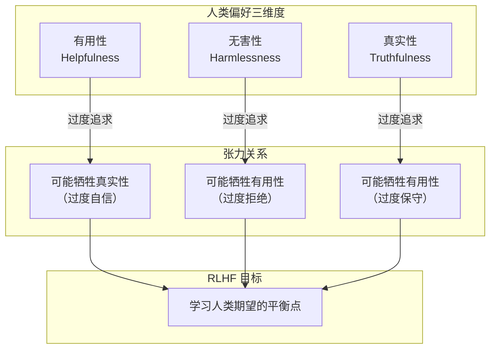
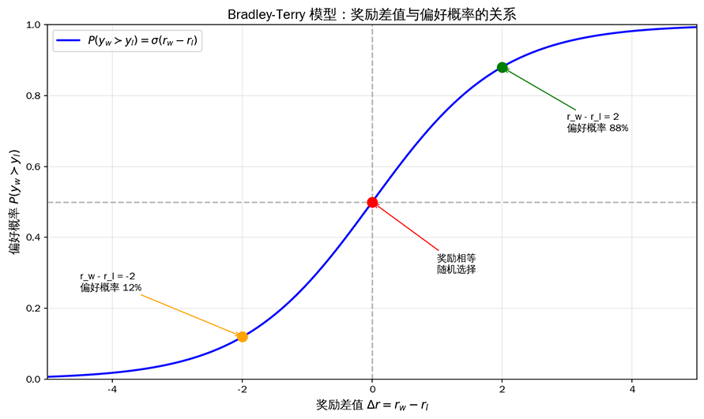
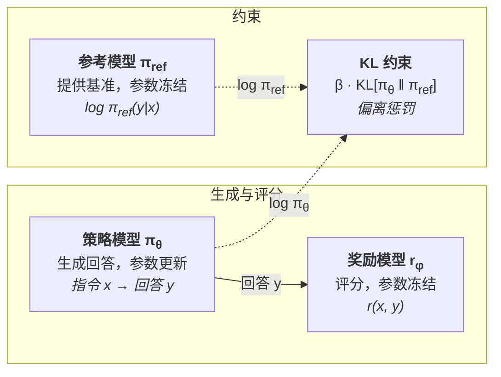
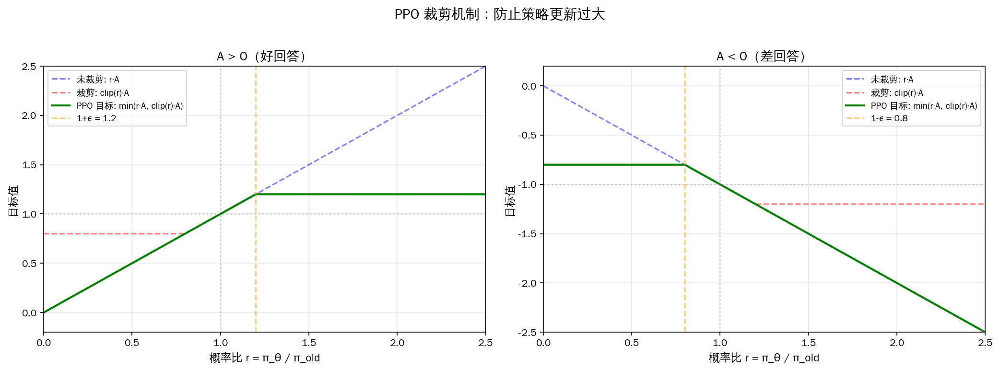

# 人类反馈强化学习

在[监督微调](../pretraining/supervised-finetuning.md)中，我们探讨了如何通过监督学习将预训练模型转化为可用的 AI 助手。SFT 让模型学会了回答问题，但模型真的理解它回答了什么吗？答案是否定的。一个模型可以学会生成语法正确、信息准确的回答，却可能在风格、安全性、有用性等方面与人类期望存在很大偏差。人类偏好是复杂且多维的，仅凭有限的 SFT 数据难以充分捕捉。

**人类反馈强化学习**（Reinforcement Learning from Human Feedback，RLHF）正是为解决这一问题而生。它让模型从人类的偏好反馈中学习，而非仅仅模仿人类的回答。2022 年，OpenAI 的论文《Training Language Models to Follow Instructions with Human Feedback》系统阐述了 RLHF 中模型与人类需求对齐的监督微调、奖励模型、近端策略优化三阶段框架，后续成为几乎所有指令遵循模型的标准训练范式。

## SFT 的能力边界

要理解 RLHF 的价值，首先要解释清楚 SFT 的局限性。想象一位刚入职的客服新人，主管给了他一本标准话术手册，上面写着"遇到退款问题，回复……"、"遇到配送延迟，回复……"。新人把手册背得滚瓜烂熟，常见问题都能应对自如。但某天来了一位情绪激动的客户，对他破口大骂，他按照手册上的标准回答反而让客人愈发愤怒。这个故事中新人只会模仿手册上的回答，并不理解客户真正在意什么。

SFT 实际是一种行为克隆（Behavior Cloning），让模型学习人类专家的行为模式，这种方法很难捕捉到隐性偏好。人类偏好中有很多"只可意会不可言传"的因素，什么样的回答更有帮助，什么样的语气更友好，这些偏好难以通过有限的示例来传达。SFT 也不能赋予模型探索能力，它是监督学习，模型只能学习训练数据中已有的回答模式，不能自主探索训练数据中未出现过、但更优的回答策略。

人类对模型的需求肯定不只正确模仿标准答案这一项。InstructGPT 论文将人类需求归纳为**有用性**（Helpfulness）、**真实性**（Truthfulness）和**无害性**（Harmlessness）三个核心维度。有用性要求回答直接回应用户的问题，提供有价值的信息，避免冗余；真实性要求回答事实准确，避免编造不存在的信息（幻觉）；无害性要求回答避免有害内容，拒绝不当请求，避免偏见和歧视。

这三个维度之间存在内在张力。一个过于谨慎的模型可能在无害性上得分很高，但有用性较低。对任何稍有风险的问题都拒绝回答，用户自然不满意。一个过于自信的模型可能在有用性上得分较高，但真实性可能受损。为了显得自己"知识渊博"而编造不确定的信息，这样的模型也不受用户青睐。RLHF 要让模型学会在这些维度之间找到人类偏好的平衡点，避免在任何一个维度上走极端。

*图：RLHF 目标是平衡三个维度间的张力*

## 奖励模型

现在我们明确了 RLHF 的动机是从模仿转向偏好学习。但"偏好"是一个抽象概念，计算机无法直接理解人类觉得哪一个回答更好。我们需要把人类的偏好判断转化为一个可计算的信号，这就是奖励模型的职责。奖励模型扮演着裁判的角色，它接收一个指令和一个回答，输出一个分数，分数越高意味着人类越可能偏好这个回答，该分数将作为后续强化学习的奖励信号。

### 偏好对比数据

训练奖励模型的第一步是收集偏好对比数据。不同于 SFT 数据的指令回答对形式，偏好对比数据是给定同一个指令，模型生成几个不同的回答，人类标注者指出哪个更好，并不需要人类亲自编写回答。这种数据收集方式有几个设计决策值得关注：

 - **采样多样性**：虽然每次比较都是在两个回答间选择，但应该让模型为每个指令生成多个候选回答（如 4-9 个），然后让标注者对它们进行排序或两两比较。如果只生成两个候选，偏好数据的信息量就很有限。
 - **标注一致性**：不同标注者对同一对比可能给出不同判断，实践中通常让多个标注者独立标注，取多数意见或计算一致性分数。
 - **指令多样性**：需要覆盖问答、创意写作、代码、推理等多种任务类型，确保奖励模型不会只擅长评价某一类回答。

InstructGPT 使用了约 33K 条偏好对比数据来训练奖励模型。这个数量远小于预训练的万亿级 token，但已经足够模型学习人类偏好了。原因在于偏好对比数据的信息密度非常高，每一条对比不仅告诉模型"哪个更好"，还隐含地告诉模型"好在哪方面"和"差距有多大"。

### Bradley-Terry 模型

有了"回答 A 比回答 B 好"这种偏好对比数据，我们就可以从中推导出一个连续的函数，用来预测新数据的偏好概率。1952 年，统计学家布拉德利（Ralph A. Bradley）和特里（Milton E. Terry）在论文《Rank Analysis of Incomplete Block Designs: I. The Method of Paired Comparisons》中提出了一个优雅的解决方案 —— **Bradley-Terry 模型**。这个模型最初是为了分析体育比赛中的胜负概率而设计的。只要给出两支队伍的历史战绩，模型就能预测它们未来对决的胜负概率。七十年后，这个模型在 RLHF 中找到了新的应用场景：给定两个回答的偏好对比，预测人类选择其中一个的概率。Bradley-Terry 模型假设每个回答 $y$ 都有一个潜在的真实奖励值 $r^*(x, y)$，人类选择 $y_w$ 优于 $y_l$ 的概率随两者奖励差的增大而增大。数学上，这个概率可以表示为：

$$P(y_w \succ y_l | x) = \frac{\exp(r^*(x, y_w))}{\exp(r^*(x, y_w)) + \exp(r^*(x, y_l))}$$

公式中分子 $\exp(r^*(x, y_w))$ 是回答 $y_w$ 的奖励值的指数化（目的是保证值为正数，且奖励越高值越大），分母是两个回答的指数化奖励之和，整体公式可解读为 $y_w$ 被选中的概率等于它"被偏好的程度"占"总偏好程度"的比例，就像投票中候选人 A 的得票率等于 A 的票数占总票数的比例。将分子分母同时除以 $\exp(r^*(x, y_l))$，这个公式可以简化为更紧凑的 Sigmoid 形式：

$$P(y_w \succ y_l | x) = \sigma(r^*(x, y_w) - r^*(x, y_l))$$

其中 $\sigma(\cdot)$ 是 [Sigmoid 函数](../../statistical-learning/linear-models/logistic-regression.md#sigmoid-函数)，作用是把奖励差值转换为概率。如果 $y_w$ 的奖励比 $y_l$ 高很多，差值为正且大，Sigmoid 输出接近 1，表示人类几乎必然选择 $y_w$；如果两者奖励相近，差值接近 0，Sigmoid 输出接近 0.5，表示随机选择；如果 $y_w$ 的奖励反而低于 $y_l$，差值为负，Sigmoid 输出低于 0.5，表示人类更可能选择 $y_l$。下图展示了 Bradley-Terry 模型奖励差值与偏好概率的关系，当两个回答的奖励相等（差值为 0）时，偏好概率为 0.5（随机选择）；当选中回答的奖励高出 2 个单位时，偏好概率升至 88%；当选中回答的奖励低 2 个单位时，偏好概率降至 12%。

*图：Bradley-Terry 模型中奖励差值与偏好概率的关系*

有了偏好概率的计算方法，奖励模型训练目标自然就出来了。我们希望训练一个模型 $r_\theta(x, y)$，使其预测的偏好概率与人类标注尽可能一致。在统计推断中曾经讲解过，对于以概率最大化为目标的寻找参数问题，可以使用[最大似然估计](../../maths/probability/statistical-inference.md#最大似然估计)来处理，对应的损失函数为：

$$\mathcal{L}_{RM} = -\mathbb{E}_{(x, y_w, y_l) \sim \mathcal{D}} \left[ \log \sigma(r_\theta(x, y_w) - r_\theta(x, y_l)) \right]$$

其中 $r_\theta(x, y_w)$ 是奖励模型对选中回答的评分，$r_\theta(x, y_l)$ 是对落选回答的评分，两者的差值 $r_\theta(x, y_w) - r_\theta(x, y_l)$ 表示选中回答比落选回答好多少。$\sigma(\cdot)$ 将差值转换为偏好概率，再取对数似然，将多个数据点的联合概率从连乘转化为连加，便于计算和优化。这个损失驱使奖励模型给选中回答的评分尽可能高于拒绝回答的评分，且差距越大越好。

### 设计与训练

奖励模型的设计过程、训练过程与前面几节讨论的语言模型设计、预训练和微调差别并不大。

- 设计时，奖励模型通常不是从零开始的，而是以预训练的语言模型为基础，只是在最末端替换了输出层，输出一个标量奖励值。奖励模型不是生成模型，不需要生成文本，只需要评价文本，因此它保留预训练 LLM 的全部 Transformer 层作为理解引擎，只在最后将语言模型的输出层替换为一个线性层，将原本输出词概率分布改为输出标量分数。

- 训练时，奖励模型将指令 $x$ 和回答 $y$ 的拼接字符串作为输入，经过 Transformer 层提取语义特征后，把最后一个 token 的隐藏状态通过线性层映射为奖励值。这个线性层可以使用预训练模型的全部参数进行微调来学习，也可以只训练最后几层（因为前面理解语义的过程实际没有改变）以节省计算资源。

## 强化学习

本节开篇曾提到 SFT 只能让模型学习训练数据中已有的回答模式，无法探索训练数据中从未出现过的更优回答。奖励模型的出现为解决这个问题提供了基础，如果模型能根据奖励分数来调整自己的生成策略，它就有可能发现比 SFT 数据中更好的回答方式。强化学习与监督微调的最大区别在于学习信号：监督学习的学习信号是正确答案，目标是尽可能模拟这个答案；强化学习的学习信号是奖励分数，目标是尽可能获得更高的奖励。前者是模仿，后者是探索与优化。

### 三模型架构

有了奖励模型，我们便拥有了评判偏好的裁判。但裁判自己不能上场踢球，还需要一种机制让语言模型根据裁判的评分来调整自己的行为。这就是强化学习。RLHF 的训练过程涉及策略模型、参考模型、奖励模型三个独立的模型。在深入细节前，先从宏观上观察三个模型的作用，这能帮助我们理解后面每一项技术设计背后的动机：

- **策略模型**（Actor / Policy Model）：是我们最终要优化的语言模型，记为 $\pi_\theta$。它接收指令 $x$，生成回答 $y$，是训练中主要更新参数的模型（值函数模型也会更新参数，详见优势函数部分）。语言模型应该朝着奖励更高的方向优化，不过要附加上一定的约束。语言模型是自回归生成的，每个回答包含数百个 token 的序列决策。如果没有任何约束，模型为了追求高分而大幅调整生成策略，它可能会在一次更新中彻底改变自己的行为模式，从生成流畅、连贯的回答变成生成混乱的文本。这是由于奖励模型只是一个近似，不可能完美地反映人类对语言的理解与偏好，大幅偏离后的模型可能正好撞上奖励模型的盲区，获得虚高的分数却输出人类无法理解的内容。因此，需要有一个参考模型去约束它，让策略模型既能获得高奖励、又不偏离参考模型太远的回答。

- **参考模型**（Reference Model）：是策略模型在 RLHF 训练开始前的快照（通常就是 SFT 训练产生的那个模型），记为 $\pi_{ref}$。RLHF 期间参考模型参数冻结不变，为策略模型提供一个行为基准，通过度量当前策略与参考策略之间的 KL 散度 $\text{KL}[\pi_\theta \| \pi_{ref}]$ 来约束策略不跑偏。参考模型的作用犹如一根弹性绳，一端固定在参考模型上，另一端连着策略模型。策略模型可以自由移动，但弹性绳会把它往回拉，移动越远拉力越大。

- **奖励模型**（Reward Model）：是在上一节训练好的裁判，记为 $r_\phi$，参数同样冻结不变。它对策略模型生成的回答给出奖励分数 $r(x, y)$，为策略模型的参数更新提供方向指引。

*图：PPO 三模型架构*

三个模型在训练中相互协作：策略模型接收指令并生成回答，奖励模型对回答评分，提供"往哪走"的方向信号，参考模型提供策略偏离程度的度量，给予"不能走太远"的约束。方向信号和约束信号共同构成了 RLHF 的训练目标。RLHF 先用策略梯度方法解决"如何从奖励信号更新策略"的问题，再引入值函数作为基线来降低梯度估计的方差，最后用裁剪机制和 KL 散度惩罚解决"如何约束更新幅度"的问题。

### 策略梯度方法

策略模型的优化目标是使它生成回答的期望奖励评分最大化。目标很清晰，但是实践中却无法直接进行优化。原因是回答 $y$ 是从 $\pi_\theta$ 的[分布中采样](../../appendixes/numpy/probability-numpy.md#分布采样)得到的，采样是一种离散操作，不可微分，梯度无法直接通过采样过程回传到模型参数。需要设计一种对策略（概率分布）求梯度的方法来解决这个问题。

既然不能直接对采样操作求梯度，那就尝试绕过它，不直接优化"生成哪个回答"，而是优化"生成好回答的概率"，这便是**策略梯度**（Policy Gradient）方法。具体来说，对于每个采样到的回答 $y$，如果它的奖励 $r(x, y)$ 为正，就沿着增大 $\pi_\theta(y|x)$ 的方向更新参数，让模型更倾向于生成这个回答；如果它的奖励为负，就沿着减小 $\pi_\theta(y|x)$ 的方向更新参数，让模型更倾向于避免这个回答。梯度的大小由奖励分数决定，奖励越高，更新幅度越大。

以数学形式化表述上面的思想，原始目标是最大化期望奖励 $\mathbb{E}_{y \sim \pi_\theta}[r(x, y)]$，其梯度为 $\nabla_\theta \mathbb{E}_{y \sim \pi_\theta}[r(x, y)]$。策略梯度方法将这个梯度改写为等价形式（改写过程略，感兴趣的可见[练习题](#练习题)部分），将"期望的梯度"转化为"梯度的期望"，让梯度可以通过采样来估计，这种技巧在数学上被称为对数似然（Log-likelihood Trick，也常被称为 REINFORCE Trick）：

$$\nabla_\theta \mathbb{E}_{y \sim \pi_\theta}[r(x, y)] = \mathbb{E}_{y \sim \pi_\theta} \left[ r(x, y) \cdot \nabla_\theta \log \pi_\theta(y|x) \right]$$

策略梯度方法虽然理论上很优雅，但在实践中仍有问题，受到方差过高的困扰。策略梯度方法允许任意幅度的参数更新，由于回答是从策略中随机采样的，不同样本的奖励差异可能很大，导致梯度估计的方差很高。如果某次更新步子迈得太大，策略就会发生剧变。譬如上一步模型还倾向于生成礼貌、简洁的回答，一次大更新后可能就变成冗长、跑题的回答。新的策略下奖励分布与旧策略截然不同，之前的经验积累变得不再适用，训练也容易崩溃。因此，我们还需要一种机制来限制每次更新的幅度，确保新策略不会偏离旧策略太远。

### 近端策略优化

**近端策略优化**（Proximal Policy Optimization，PPO）由约翰·舒尔曼（John Schulman）在 2017 年的论文《Proximal Policy Optimization Algorithms》中提出。PPO 名称中的**近端**（Proximal）就是"附近、邻近"的意思，指每次参数更新只能让策略在旧策略的附近移动，不能一步跳到离旧策略很远的地方。在 PPO 之前，舒尔曼曾提出过信任域策略优化（Trust Region Policy Optimization，TRPO），通过约束新旧策略的 KL 散度来限制更新幅度。TRPO 的思路是正确的，实现上却很麻烦，需要求解一个带约束的优化问题，涉及二阶导数计算，复杂且计算代价高昂。PPO 的贡献在于用一种相对简洁的裁剪机制替代了 TRPO 的复杂约束，效果相当但实现简单得多。PPO 的训练目标函数为：

$$\max_\theta \mathbb{E}_{x \sim \mathcal{D}, y \sim \pi_{old}} \left[ \min\left( \frac{\pi_\theta(y|x)}{\pi_{old}(y|x)} \cdot A(x,y), \; clip\left(\frac{\pi_\theta(y|x)}{\pi_{old}(y|x)}, 1-\epsilon, 1+\epsilon\right) \cdot A(x,y) \right) - \beta \cdot KL[\pi_\theta \| \pi_{ref}] \right]$$

看到这个目标函数，可能你已经在腹诽前面给予 PPO "相对简洁"的评价了。PPO 目标函数的设计逻辑其实非常清晰，可以把它分成四项来独立解读，先看懂公式中每一项在做什么，然后再理解为什么要这样组合它们：

- **概率比**（$\frac{\pi_\theta(y|x)}{\pi_{old}(y|x)}$）：这是整个公式的变化度量，表示新策略生成该回答的概率相对旧策略的变化倍数。比值为 1 表示策略没变，大于 1 表示新策略更倾向生成该回答，小于 1 则相反。举个例子，如果旧策略生成某个回答的概率是 0.3，更新后的新策略生成同一回答的概率变成了 0.45，那概率比就是 $0.45 / 0.3 = 1.5$，说明新策略把这个回答的生成概率提高了 50%。

- **裁剪函数**（$clip(r, 1-\epsilon, 1+\epsilon)$）：将概率比限制在 $[1-\epsilon, 1+\epsilon]$ 范围内，通常 $\epsilon = 0.2$，即概率比最多变化 20%。裁剪函数的作用是给策略更新设置一道天花板。$\min(\cdot, \cdot)$ 比较"未裁剪的目标"和"裁剪后的目标"，取其较小值，这意味着裁剪只在它真正需要发挥作用时（当概率比偏离 1 太远时）才介入，截断梯度防止策略剧变。

- **优势函数**（$A(x,y)$）：衡量当前回答比平均水平要好上多少。正值表示优于平均水平（好回答），负值表示不如平均水平（差回答）。优势函数为策略更新提供了方向，好回答应该增加概率，差回答应该降低概率。

- **KL 散度惩罚项**（$\beta \cdot KL[\pi_\theta \| \pi_{ref}]$）：$\pi_{ref}$ 是参考模型，$\beta$ 是惩罚系数，它们防止策略偏离参考模型太远。裁剪机制只能防止单步更新走得太远，但如果每步都朝同一方向偏移一点，多步累积下来策略仍可能偏离很远。KL 散度惩罚正是为了防止这种累积偏移。它度量当前策略与参考模型的分布差异，差异越大惩罚越重，迫使策略始终在参考模型的附近活动。

#### 概率比

PPO 引入概率比、裁剪函数、KL 散度惩罚项等结构的原因在于策略梯度是基于"当前策略下的采样"来估计梯度，可是一旦参数更新，策略也就变了，之前采样的数据就不再准确反映新策略的行为。这种数据与策略不匹配的问题在强化学习中被称为**分布偏移**（Distribution Shift）。旧的采样数据在新策略下不再准确，就必须有所修正，引入概率比的作用就是完成这个修正。它告诉我们，对于旧策略采样到的回答，新策略对它的"重视程度"变化了多少。如果概率比是 1.5，说明新策略比旧策略更重视这个回答，应该给更大的权重。如果概率比是 0.7，说明新策略不那么重视这个回答了，应该给更小的权重。这就是公式中"概率比 × 优势函数"的设计动机，即用概率比来修正旧数据的权重，使其在新策略下仍然有效。

但概率比修正又带来了新问题。如果某次参数更新让概率比变得极大（譬如 10，意味着新策略生成该回答的概率是旧策略的 10 倍），那么这个回答就会在训练目标中占据压倒性的权重，导致模型朝着这个方向过度更新，下次的概率比可能更极端，形成恶性循环。裁剪机制和 $\min$ 运算就是为了防止这种情况。即使概率比变得很大，裁剪后的目标也不会超过一个固定上界，梯度被截断，更新幅度被限制。换言之，概率比负责"修正旧数据的权重"，裁剪负责"不要修正过头"，两者配合实现了"用旧数据安全地更新策略"这一目标。

#### 裁剪函数

概率比之后是**裁剪函数**（Clipping Function），它将变量限制在指定范围内，超出边界的部分被截断为边界值 $clip(x, a, b) = \min(\max(x, a), b)$。裁剪函数与优势函数的组合会产生四种不同的情况，逐一分析能更直观地理解它的工作方式。为了叙述简洁，我们记概率比为 $r$，裁剪范围为 $[1-\epsilon, 1+\epsilon]$。

- 情况 1 **好回答，概率比在裁剪范围内**（$A > 0$，$1-\epsilon \leq r \leq 1+\epsilon$）：此时裁剪不起作用，$\min(r \cdot A, \text{clip}(r) \cdot A) = r \cdot A$，训练目标正常鼓励增加该回答的概率。这是最普通的情况，策略在安全范围内进行调整。

- 情况 2 **好回答，概率比超出上界**（$A > 0$，$r > 1+\epsilon$）：此时策略已经大幅增加了该好回答的概率，但幅度过大。裁剪将 $r$ 截断为 $1+\epsilon$，$\min(r \cdot A, (1+\epsilon) \cdot A) = (1+\epsilon) \cdot A$。训练目标的上限被固定，梯度为零，策略不会继续增加该回答的概率。这就像告诉模型："这个回答确实好，但你已经足够重视它了，不必再加码了。"

- 情况 3 **差回答，概率比在裁剪范围内**（$A < 0$，$1-\epsilon \leq r \leq 1+\epsilon$）：与情况 1 对称，裁剪不起作用，训练目标正常鼓励降低该回答的概率。

- 情况 4 **差回答，概率比低于下界**（$A < 0$，$r < 1-\epsilon$）：此时策略已经大幅降低了该差回答的概率，但降低幅度过大。裁剪将 $r$ 截断为 $1-\epsilon$，$\min(r \cdot A, (1-\epsilon) \cdot A) = r \cdot A$（注意 $A < 0$ 时 $r \cdot A$ 更小）。此时减小 $r$ 会使目标值更小，与优化方向相反，模型没有动力继续降低该回答的概率。这就像告诉模型："这个回答确实差，但你已经足够嫌弃它了，不必再继续压制了。"

如下图所示，当 A > 0（好回答）时，绿色实线在 r > 1+ε 处变平，表示策略不会无限增加好回答的概率；当 A < 0（差回答）时，绿色实线在 r < 1-ε 处变平，表示策略不会无限降低差回答的概率。裁剪机制有效限制了单步更新的幅度。四种情况可以总结为一条原则：只要概率比在安全范围内，策略可以自由调整。一旦概率比越界，无论调整方向是否正确，梯度都会被截断。这种限制更新幅度的保守调整策略，正是 PPO 名称中"近端"的具体体现。

*图：PPO 裁剪机制的可视化*

#### 优势函数

接下来是**优势函数**（Advantage Function），$A(x,y)$ 衡量的是当前回答比平均水平好多少。直接用奖励分数 $r(x,y)$ 作为"好不好"的信号也是可行的：奖励高就是好回答，奖励低就是差回答。但这并不是最优设计，假设奖励模型给某条指令的所有候选回答打分都在 8-10 分之间，那么一个得 9 分的回答算好还是差？绝对分数 9 分看起来不错，可相对其他回答也只是中等水平。反过来，如果所有回答得分在 1-3 分之间，一个 2.5 分的回答虽然绝对分数不高，但相对而言已经优于大多数回答了。这说明判断一个回答的好坏，不能只看奖励的绝对值，而应该看它相对于某个**基线**（Baseline）高出了多少。优势函数的定义正是这个差值：

$$A(x,y) = r(x,y) - V(x)$$

其中 $V(x)$ 是**值函数**（Critic / Value Function），表示在指令 $x$ 下，策略模型生成回答的平均期望奖励。值函数就是基线，代表平均水平。有基线后，$A > 0$ 意味着当前回答优于平均，应该增加其生成概率；$A < 0$ 意味着不如平均，应该降低其生成概率。引入基线还起到了数值中心化的作用，显著降低梯度估计的方差。如果直接用 $r(x,y)$ 作为策略梯度的权重，不同样本的奖励差异会导致梯度波动很大。减去基线 $V(x)$ 后，优势函数的取值围绕零波动，正负表示方向，大小表示幅度，梯度估计更加稳定。

在具体实现里，优势函数的估计要适应语言模型的工作方式。语言模型的回答是逐 token 生成的，奖励模型通常只在回答结束时给出一个整体评分。这意味着整个回答序列数百个 token 共享同一个奖励信号，但不同位置的 token 对最终评分的贡献显然不同。如果简单地给每个 token 都分配相同的优势值，那么即使某个 token 的选择其实无关紧要，它也会获得与关键 token 相同的更新信号。舒尔曼于 2016 年提出的**广义优势估计**（Generalized Advantage Estimation，GAE）正是为了解决这个问题。GAE 利用值函数对每一步的预期奖励做出局部预测，再将多步预测组合起来估计每个 token 位置的优势值。具体而言，GAE 定义每一步的时序差分误差 $\delta_t = r_t + \gamma V(s_{t+1}) - V(s_t)$，它衡量的是"这一步实际获得的奖励比预期多了多少"，然后通过指数加权将多步误差聚合为当前优势：

$$A_t^{GAE} = \sum_{l=0}^{T-t} (\gamma \lambda)^l \delta_{t+l}$$

其中 $\gamma$ 是折扣因子（越远的未来奖励权重越低），$\lambda$ 控制偏差与方差的权衡：$\lambda = 0$ 时只看单步误差（低方差但高偏差），$\lambda = 1$ 时退化为蒙特卡洛回报（低偏差但高方差）。GAE 的价值不在于这个公式本身，在于它让每个 token 位置都能获得一个相对合理的优势估计，而不是粗暴地将整个回答的奖励均摊到每一个 token 上。

从值函数的实现并不是靠公式计算，它本身也是一个独立的神经网络模型，通常记为 $V_\phi$，在训练中同样会更新参数。PPO 的三模型架构是按角色分工，划分成三个独立模型，值函数是服务于策略模型更新的辅助结构，不直接参与"生成-评分-约束"的循环。但值函数一样需要做前向传播和反向传播，同样占用显存和算力，因此也有部分文献会将 PPO 训练描述为四个模型同时运作。下一章将介绍的 GRPO 等方法通过用组内奖励归一化替代值函数来估计优势，从而省去了这个额外的网络，降低了训练成本。

#### KL 散度惩罚项

最后是 KL 散度惩罚项，[裁剪函数](#裁剪函数)限制了模型单步更新的幅度，可以防止模型一步走得太远，却无法阻止模型持续小步偏移导致的累积效应。[KL 散度](../../deep-learning/generative-models/vae.md#kl-散度)约束是 PPO 中处理长期偏移的机制，它度量策略模型与参考模型之间的整体偏离程度，确保优化过程中模型不会走得太偏。

如果没有 KL 约束，RLHF 训练中会出现一种被称为**奖励黑客**（Reward Hacking）的现象，指策略模型"破解"了奖励模型，获得了高分评价，但其实并没有提升回答质量。奖励模型只是一个与现实近似的数学模型，它不可能完美地反映人类偏好。策略模型可能找到奖励模型的漏洞盲区，生成在奖励模型看来分数极高、但人类实际认为毫无意义甚至有害的回答。想象一场作文考试，好的文章通常语言优美、字迹工整、内容详尽。如果学生只根据这个规则去写作，可能写出长篇大论、堆砌辞藻内容却空泛无物的八股文章来博取高分。

奖励黑客的典型表现包括回答过长且重复，在开头或结尾堆砌看似相关但无意义的关键词，格式化倾向严重（过度使用列表、标题等），回避回答而使用模棱两可的措辞。这些策略在奖励模型中可能获得更高分数，人类读一两篇还好，读多了会明显感到不对劲。用通俗的语言来说就是人类感觉到模型创作的内容带有一股 "AI 味道"。由此可知，设计 KL 散度惩罚项的目的是促使策略模型与人类标准保持一致。在三模型架构下，标准是由参考模型来体现的，所以在 RLHF 语境中的 KL 散度是控制策略模型 $\pi_\theta$ 相对于参考模型 $\pi_{ref}$ 的偏离程度，它的数学表达为：

$$KL[\pi_\theta \| \pi_{ref}] = \mathbb{E}_{y \sim \pi_\theta} \left[ \log \frac{\pi_\theta(y|x)}{\pi_{ref}(y|x)} \right]$$

其中，$\frac{\pi_\theta(y|x)}{\pi_{ref}(y|x)}$ 表示对于某个具体回答 $y$，策略模型生成的概率相比参考模型的变化倍数。比值大于 1 时对数为正，说明策略模型比参考模型更倾向生成这个回答；比值小于 1 时对数为负，说明策略模型比参考模型更倾向回避这个回答。然后对策略模型的分布求期望，按照策略模型实际生成的回答来加权平均，这代表了策略模型相对于参考模型的平均惊讶程度，如果两者完全一致，KL 散度为 0，偏离越大，KL 散度就越大。

KL 惩罚系数 $\beta$ 控制着"追求高奖励"与"保持一致性"之间的权衡。$\beta$ 越大，策略模型越不容易偏离参考模型，训练越稳定，但奖励提升就越有限；$\beta$ 越小，策略模型有更大自由度追求高奖励，但可能出现奖励黑客和训练不稳定的问题。实践中，$\beta$ 通常不是固定值，而是动态调整的。InstructGPT 采用了自适应策略，设定一个目标 KL 散度值 $d_{target}$，当实际 KL 散度超过目标值时增大 $\beta$（收紧约束），低于目标值时减小 $\beta$（放松约束）。这种策略确保训练过程中 KL 散度始终维持在合理范围内。

## PPO 工程挑战

行文至此，我们已经完整介绍 PPO 的理论框架，下面讨论几个理论转化为实践过程中，很容易遇到的工程问题，以及相应的解决方案。

### 训练不稳定

PPO 训练面临的首要挑战是训练不稳定。语言模型的策略空间极其庞大，每次生成都涉及数百个 token 的序列决策，比传统强化学习中的连续控制问题要复杂得多。不稳定的根源在于奖励信号稀疏且高方差。奖励模型只在完整回答生成后才给出一个标量评分，这个评分需要分摊到数百个 token 的决策上，导致每个 token 的优势估计噪声巨大。举个例子，这就像一位老师只能给整份试卷打个总分，却不标注出哪题做对了，哪题做错了，学生很难从总分中推断出自己具体该改进什么。

工程上可以采取一些措施来缓解 PPO 训练不稳定的情况，如降低学习率，让每步更新更保守。增大批大小，用更多样本的平均梯度来降低方差，等等。但要真正解决这个问题，还需要更底层的理论创新，如后续的 DPO/KTO 以分类损失替代了策略优化，GRPO 仍做策略优化，但对同一提示生成组内多个回答，用组内奖励的归一化结果替代 PPO 中的值函数来估计优势值，从而省去了独立的值函数网络。

### 奖励模型过拟合

奖励模型的训练数据通常只有数万条偏好对比，相比模型可能高达数十亿的参数，这种数据与参数量的悬殊比例容易导致奖励模型过拟合。过拟合的奖励模型会给出不可靠的奖励信号，进而误导 PPO 的优化方向。

工程上采用了三个层面的措施来缓解过拟合。在数据层面，确保偏好数据覆盖尽可能多的任务类型和回答风格，避免奖励模型只在狭窄的领域内准确。在模型层面，只微调预训练模型的最后几层而非全部参数，保留预训练阶段习得的语义理解能力作为常识底座，只在顶层学习偏好判断的评分规则。在训练层面，使用早停策略，在验证集上监控偏好预测准确率，一旦准确率开始下降就停止训练，防止模型过度拟合训练数据的噪声。

### 三模型联合优化的成本

RLHF 需要同时加载策略模型、参考模型和奖励模型。如果每个模型都有 7B 参数，那么总参数量至少是 21B（奖励模型不需要与策略模型同等规模，如 InstructGPT 就用 6B 的奖励模型指导 175B 的策略模型训练，但在生产实践中，很多情况下它们基于同一个基础模型）。这不仅对 GPU 显存提出了极高要求，还使得训练速度受限于策略模型的自回归生成，因为每一步生成都需要逐 token 串行计算，不能像矩阵乘法那样充分并行。

工程实践中的优化手段可以分为显存优化和速度优化两类。显存方面，在[分布式训练基础设施](../pretraining/distributed-training.md)中介绍的量化、模型并行依然是主要手段。速度方面，可以将策略模型生成的回答缓存起来，在后续多个训练步中复用，避免每步都重新生成，这个操作被称为回答缓存（Response Caching）。

## 本章小结

SFT 让模型学会了怎样回答，但无法教会模型怎样回答得更好。RLHF 通过偏好对比数据训练奖励模型，将人类觉得哪个更好的判断转化为可计算的奖励分数，再由 PPO 框架引导策略模型沿着奖励方向探索，同时用裁剪机制和 KL 散度约束防止探索偏离太远。这条从模仿到偏好学习的技术路径，使模型不再局限于复现人类已写出的回答，而能发现人类偏好空间中更优但从未被示例覆盖的回答策略，这是大语言模型从"能说话"到"说人话"的关键跃迁。

RLHF 在打开偏好学习大门的同时也引入了新的问题，催生了一系列新的研究方向，其中最引人注目的是 DPO（Direct Preference Optimization），它绕过奖励模型和 PPO，直接从偏好数据优化策略。我们将在[下一章](alignment-new-paradigms.md)中探讨 DPO 及其他对齐新范式。

## 练习题

1. 给定两个回答的奖励值 $r_w = 3.2$ 和 $r_l = 1.5$，请计算 Bradley-Terry 模型下人类选择 $y_w$ 的偏好概率。

   

   
参考答案

   根据 Bradley-Terry 模型的 Sigmoid 形式：

   $$P(y_w \succ y_l) = \sigma(r_w - r_l) = \sigma(3.2 - 1.5) = \sigma(1.7) = \frac{1}{1 + e^{-1.7}} \approx 0.846$$

   当选中回答的奖励比拒绝回答高 1.7 个单位时，人类选择选中回答的概率约为 84.6%。

   

2. 推导策略梯度中的对数似然技巧：证明

   $$\nabla_\theta \mathbb{E}_{y \sim \pi_\theta}[r(x, y)] = \mathbb{E}_{y \sim \pi_\theta} \left[ r(x, y) \cdot \nabla_\theta \log \pi_\theta(y|x) \right]$$

   提示：先将期望展开为求和（或积分）形式，再对参数 $\theta$ 求梯度，利用 $\nabla_\theta \log f(\theta) = \frac{\nabla_\theta f(\theta)}{f(\theta)}$ 将梯度移入期望内部。

   

   
参考答案

   将期望按定义展开：

   $$\mathbb{E}_{y \sim \pi_\theta}[r(x, y)] = \sum_y \pi_\theta(y|x) \cdot r(x, y)$$

   对 $\theta$ 求梯度，注意 $r(x, y)$ 不依赖于 $\theta$：

   $$\nabla_\theta \mathbb{E}_{y \sim \pi_\theta}[r(x, y)] = \sum_y r(x, y) \cdot \nabla_\theta \pi_\theta(y|x)$$

   利用恒等式 $\nabla_\theta \pi_\theta(y|x) = \pi_\theta(y|x) \cdot \nabla_\theta \log \pi_\theta(y|x)$（对两边取对数后对 $\theta$ 求导即得），代入上式：

   $$= \sum_y r(x, y) \cdot \pi_\theta(y|x) \cdot \nabla_\theta \log \pi_\theta(y|x)$$

   将 $\pi_\theta(y|x)$ 放回期望符号内，即得：

   $$= \mathbb{E}_{y \sim \pi_\theta} \left[ r(x, y) \cdot \nabla_\theta \log \pi_\theta(y|x) \right]$$

   这个等式的意义在于：左边的 $\nabla_\theta \mathbb{E}[\cdot]$ 包含对求和的梯度，无法直接采样估计；右边的 $\mathbb{E}[\nabla_\theta \log \pi_\theta \cdot r]$ 将梯度移到了期望内部，可以通过从 $\pi_\theta$ 中采样 $y$ 来估计梯度。

   
