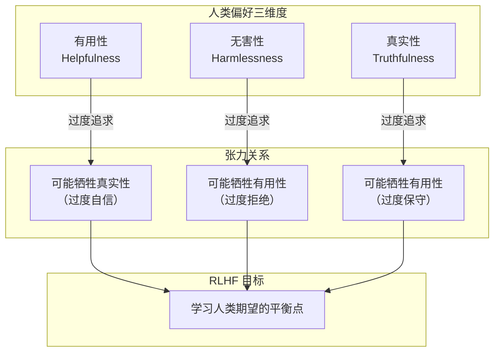
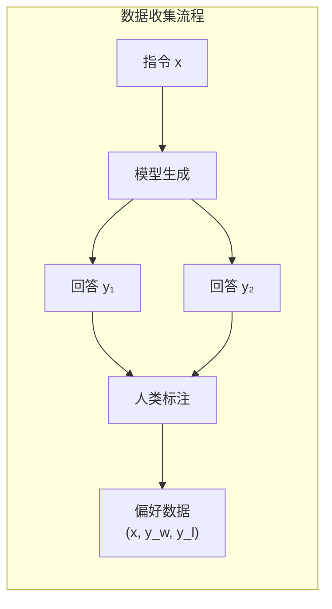
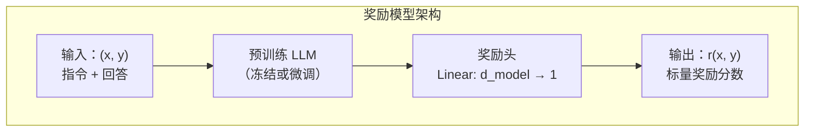
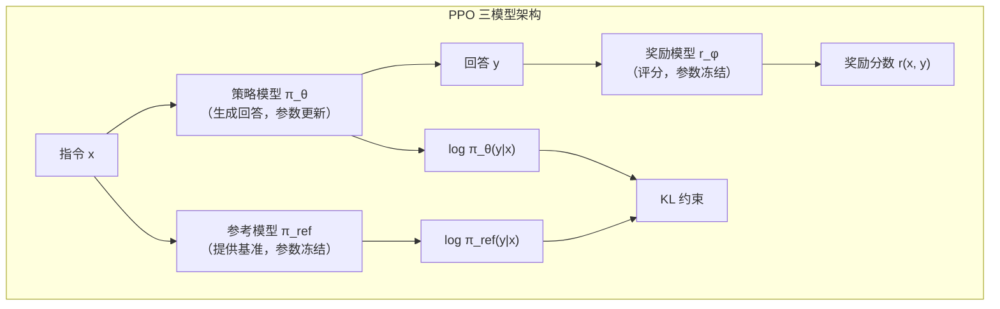

# 人类反馈强化学习

在[上一章](../pretraining/supervised-finetuning.md)中，我们探讨了监督微调（SFT）——如何通过指令回答对的监督学习，将预训练模型转化为可用的助手。SFT 让模型学会了"回答"而非"续写"，但一个关键问题悬而未决：SFT 能让模型充分理解人类偏好吗？

答案是否定的。SFT 本质上是让模型模仿人类编写的回答，但模仿不等于理解。一个模型可以学会生成语法正确、信息准确的回答，却可能在风格、安全性、有用性等方面与人类期望存在偏差。更深层的问题是：人类偏好是复杂且多维的，仅凭有限的 SFT 数据难以充分捕捉。

**RLHF**（Reinforcement Learning from Human Feedback，人类反馈强化学习）正是为解决这一问题而生。它让模型从人类的偏好反馈中学习，而非仅仅模仿人类的回答。2022 年，OpenAI 的朗龙（Long Ouyang）等人在论文《Training Language Models to Follow Instructions with Human Feedback》中系统阐述了 RLHF 的三阶段框架，这篇论文提出的 InstructGPT 仅用 1.3B 参数就在人类偏好评估中超越了 175B 的 GPT-3，证明了对齐比规模更具决定性。随后 ChatGPT 的成功更是将 RLHF 推向了聚光灯下，Pre-Training + SFT + RLHF 也成为后续几乎所有指令遵循模型的标准训练范式。本文将从 SFT 的局限性出发，逐步构建 RLHF 的理论框架和实践方法。

## RLHF 的动机

理解 RLHF 的价值，首先要理解 SFT 的局限性。SFT 虽然有效，但存在根本性的约束。

### SFT 的局限性：模仿但不理解

想象一位刚入职的客服新人，主管给了他一本标准话术手册，上面写着"遇到退款问题，回复……""遇到配送延迟，回复……"。新人把手册背得滚瓜烂熟，常见问题都能应对自如。但某天来了一位情绪激动的客户，问题手册上没有，新人就手足无措了 —— 他只会模仿手册上的回答，并不理解客户真正在意什么。

SFT 面临的正是同样的困境。SFT 的核心是**行为克隆**（Behavior Cloning）：让模型学习人类专家的行为模式。这种方法有三个固有缺陷。第一是**数据覆盖不足**：人类编写的 SFT 数据量有限，通常只有数万条，而用户可能提出的问题几乎是无穷的。模型学会了处理常见情况，但在边缘案例上往往表现不佳，就像客服新人面对手册之外的问题一样。第二是**无法捕捉隐性偏好**：人类偏好中有很多"只可意会不可言传"的因素，什么样的回答更"有帮助"，什么样的语气更"友好"，这些偏好难以通过有限的示例完全传达。第三是**缺乏探索能力**：SFT 是监督学习，模型只能学习训练数据中已有的回答模式，无法探索可能更优但训练数据中未出现的回答策略。

用这个类比来说明：SFT 就像让客服新人背诵话术手册，而 RLHF 则是让新人理解客户满意度评分标准后自主探索最优服务方式。前者在已知问题上表现良好，但面对新问题时可能束手无策；后者则培养了更深层的理解能力，能够举一反三。

下面的代码通过模拟数据，直观对比了仅使用 SFT 和使用 SFT + RLHF 两种方案在不同能力维度上的表现差异。

```python runnable
import matplotlib.pyplot as plt
import numpy as np

plt.rcParams['font.sans-serif'] = ['SimHei', 'DejaVu Sans']
plt.rcParams['axes.unicode_minus'] = False

fig, ax = plt.subplots(figsize=(10, 6))

categories = ['常见问题', '边缘案例', '风格适配', '安全性', '有用性']
sft_scores = [90, 60, 65, 70, 75]
rlhf_scores = [92, 85, 88, 95, 90]

x = np.arange(len(categories))
width = 0.35

bars1 = ax.bar(x - width/2, sft_scores, width, label='仅 SFT', color='steelblue')
bars2 = ax.bar(x + width/2, rlhf_scores, width, label='SFT + RLHF', color='green')

ax.set_ylabel('性能分数', fontsize=12)
ax.set_title('SFT vs SFT+RLHF 能力对比', fontsize=14)
ax.set_xticks(x)
ax.set_xticklabels(categories)
ax.legend()
ax.set_ylim(0, 100)
ax.grid(True, alpha=0.3, axis='y')

for bar, score in zip(bars1, sft_scores):
    ax.annotate(f'{score}', xy=(bar.get_x() + bar.get_width()/2, bar.get_height()),
                xytext=(0, 3), textcoords='offset points', ha='center', fontsize=9)
for bar, score in zip(bars2, rlhf_scores):
    ax.annotate(f'{score}', xy=(bar.get_x() + bar.get_width()/2, bar.get_height()),
                xytext=(0, 3), textcoords='offset points', ha='center', fontsize=9)

plt.tight_layout()
plt.savefig('/workspace/sft_vs_rlhf.png', dpi=150, bbox_inches='tight')
plt.show()
```

*图：SFT 与 SFT+RLHF 在五个能力维度上的对比。常见问题上两者差距不大，但在边缘案例、风格适配、安全性和有用性上，RLHF 带来了显著提升。*

从图中可以清晰看到，在常见问题上 SFT 已经做得不错，RLHF 的提升有限。但在边缘案例、风格适配、安全性和有用性这些需要理解人类隐性偏好的维度上，RLHF 带来了显著提升。这正是 RLHF 的价值所在：它让模型从"模仿标准答案"进化到"理解评分标准"。

### 人类偏好的本质

人类对模型输出的偏好是多维度的，远不止"正确性"这一项。InstructGPT 论文将人类偏好归纳为三个核心维度：**有用性**（Helpfulness）、**真实性**（Truthfulness）和**无害性**（Harmlessness）。有用性要求回答直接回应用户的问题，提供有价值的信息，避免冗余；真实性要求回答事实准确，避免幻觉（编造不存在的信息）；无害性要求回答避免有害内容，拒绝不当请求，避免偏见和歧视。

这三个维度之间存在张力。一个过于谨慎的模型可能在无害性上得分很高，但有用性较低 —— 面对任何稍有风险的问题都拒绝回答，用户自然不满意。一个过于自信的模型可能在有用性上得分较高，但真实性可能受损 —— 为了显得"有帮助"而编造不确定的信息。RLHF 的核心价值在于：**让模型学会在这些维度之间找到人类期望的平衡点**，而不是在任何一个维度上走极端。



### 从模仿到偏好学习

SFT 和 RLHF 的根本区别在于学习范式。SFT 的目标是最小化模型输出与人类回答的差异，训练数据是指令回答对 $(x, y)$，损失函数为：

$$\mathcal{L}_{SFT} = -\log P(y|x)$$

这个损失函数看着简单，拆开来看含义很直观：$P(y|x)$ 是模型在给定指令 $x$ 时生成回答 $y$ 的概率，$-\log P(y|x)$ 是该概率的负对数，概率越高损失越低，模型被推向生成与训练数据一致的回答，$\sum$ 对回答中的每个 token 求和，整体公式可以理解为：让模型尽可能复现人类给出的标准回答。

RLHF 的目标则完全不同：最大化人类偏好得分。训练数据不再是单一的指令回答对，而是**偏好对比** $(x, y_w, y_l)$，其中 $y_w$ 是人类认为更好的回答，$y_l$ 是较差的回答。损失函数基于偏好模型，我们将在下一节详细推导。

关键转变是从"学习人类说了什么"到"学习人类喜欢什么"。这个转变让模型能够超越训练数据的范围，通过偏好模型泛化到未见过的回答；从对比中学习人类难以明确表达的隐性偏好；通过强化学习探索可能优于人类示例的回答策略。

## 奖励模型训练

上一节我们明确了 RLHF 的动机：从模仿转向偏好学习。但"偏好"是一个抽象概念，计算机无法直接理解"这个回答更好"。我们需要把人类的偏好判断转化为一个可计算的信号 —— 这正是奖励模型的职责。奖励模型扮演着"裁判"的角色，它接收一个指令和一个回答，输出一个分数，分数越高意味着人类越可能偏好这个回答。这个分数将作为后续强化学习的奖励信号。

### 偏好对比数据

训练奖励模型的第一步是收集**偏好对比**数据。这不像 SFT 数据那样给出"标准答案"，而是呈现一种更自然的人类判断方式：给定同一个指令，模型生成两个不同的回答，人类标注者只需指出哪个更好，而不需要亲自编写回答。

这种数据收集方式有几个值得注意的设计决策。首先是**采样多样性**：让模型为每个指令生成多个候选回答（如 4-9 个），然后让标注者对它们进行排序或两两比较。如果只生成两个候选，偏好数据的信息量就很有限。其次是**标注一致性**：不同标注者对同一对比可能给出不同判断，实践中通常让多个标注者独立标注，取多数意见或计算一致性分数。最后是**指令多样性**：需要覆盖问答、创意写作、代码、推理等多种任务类型，确保奖励模型不会只擅长评价某一类回答。



InstructGPT 使用了约 33K 条偏好对比数据来训练奖励模型。这个数量远小于预训练的万亿级 token，但足以学习人类偏好的核心模式。原因在于偏好对比数据的信息密度很高：每一条对比不仅告诉模型"哪个更好"，还隐含地告诉模型"好在哪方面"和"差距有多大"。

### Bradley-Terry 模型

有了偏好对比数据，接下来需要回答一个数学问题：如何从"回答 A 比回答 B 好"这种二元判断中，学习出一个连续的奖励函数？

1952 年，统计学家布拉德利（Ralph A. Bradley）和特里（Milton E. Terry）在论文《Rank Analysis of Incomplete Block Designs: I. The Method of Paired Comparisons》中提出了一个优雅的解决方案 —— **Bradley-Terry 模型**。这个模型最初是为了分析体育比赛中的胜负概率而设计的：给定两支队伍的历史战绩，预测它们未来对决的胜负概率。七十年后，这个模型在 RLHF 中找到了新的应用场景：给定两个回答的偏好对比，预测人类选择其中一个的概率。

Bradley-Terry 模型做了一个简单而合理的假设：每个回答 $y$ 都有一个潜在的真实奖励值 $r^*(x, y)$，人类选择 $y_w$ 优于 $y_l$ 的概率与两者的奖励差成正比。数学上，这个概率可以表示为：

$$P(y_w \succ y_l | x) = \frac{\exp(r^*(x, y_w))}{\exp(r^*(x, y_w)) + \exp(r^*(x, y_l))}$$

这个公式看着抽象，拆开来看含义很直观：$\exp(r^*(x, y_w))$ 是回答 $y_w$ 的奖励值的指数化，指数化的目的是保证值为正数，且奖励越高值越大；分子是 $y_w$ 的指数化奖励，分母是两个回答的指数化奖励之和，整体公式可以理解为：$y_w$ 被选中的概率等于它"被偏好的程度"占"总偏好程度"的比例，就像投票中候选人 A 的得票率等于 A 的票数占总票数的比例。

将分子分母同时除以 $\exp(r^*(x, y_l))$，这个公式可以简化为更紧凑的 sigmoid 形式：

$$P(y_w \succ y_l | x) = \sigma(r^*(x, y_w) - r^*(x, y_l))$$

其中 $\sigma(\cdot)$ 是 sigmoid 函数，$\sigma(z) = \frac{1}{1 + e^{-z}}$，它将任意实数映射到 $(0, 1)$ 区间。sigmoid 的作用是把奖励差值转换为概率：如果 $y_w$ 的奖励比 $y_l$ 高很多，差值为正且大，sigmoid 输出接近 1，人类几乎必然选择 $y_w$；如果两者奖励相近，差值接近 0，sigmoid 输出接近 0.5，表示随机选择；如果 $y_w$ 的奖励反而低于 $y_l$，差值为负，sigmoid 输出低于 0.5，人类更可能选择 $y_l$。

有了偏好概率的模型，训练目标就很自然了：学习一个奖励模型 $r_\theta(x, y)$，使其预测的偏好概率与人类标注尽可能一致。这可以通过最大似然估计实现，对应的损失函数为：

$$\mathcal{L}_{RM} = -\mathbb{E}_{(x, y_w, y_l) \sim \mathcal{D}} \left[ \log \sigma(r_\theta(x, y_w) - r_\theta(x, y_l)) \right]$$

这个公式看着复杂，拆开来看含义很直观：$r_\theta(x, y_w)$ 是奖励模型对选中回答的评分，$r_\theta(x, y_l)$ 是奖励模型对拒绝回答的评分，两者的差值 $r_\theta(x, y_w) - r_\theta(x, y_l)$ 表示选中回答比拒绝回答好多少；$\sigma(\cdot)$ 将差值转换为偏好概率；$\log \sigma(\cdot)$ 是对数概率，取对数是为了将乘法变为加法，方便优化；负号 $-$ 将最大化对数似然转化为最小化损失函数，这是机器学习中的惯例；$\mathbb{E}$ 表示对所有偏好对比数据求平均，整体公式可以理解为：让奖励模型给选中回答的评分尽量高于拒绝回答的评分，且差距越大越好。

下面的代码可视化 Bradley-Terry 模型的核心特性 —— 奖励差值与偏好概率的关系，帮助直观理解 sigmoid 函数如何将"好坏差距"转换为"选择概率"。

```python runnable
import numpy as np
import matplotlib.pyplot as plt

plt.rcParams['font.sans-serif'] = ['SimHei', 'DejaVu Sans']
plt.rcParams['axes.unicode_minus'] = False

delta_r = np.linspace(-5, 5, 100)
prob = 1 / (1 + np.exp(-delta_r))

fig, ax = plt.subplots(figsize=(10, 6))
ax.plot(delta_r, prob, 'b-', linewidth=2, label=r'$P(y_w \succ y_l) = \sigma(r_w - r_l)$')

ax.axhline(y=0.5, color='gray', linestyle='--', alpha=0.5)
ax.axvline(x=0, color='gray', linestyle='--', alpha=0.5)
ax.scatter([0], [0.5], color='red', s=100, zorder=5)
ax.annotate('奖励相等\n随机选择', xy=(0, 0.5), xytext=(1, 0.3),
            fontsize=10, arrowprops=dict(arrowstyle='->', color='red'))

ax.scatter([2], [0.88], color='green', s=100, zorder=5)
ax.annotate('r_w - r_l = 2\n偏好概率 88%', xy=(2, 0.88), xytext=(3, 0.7),
            fontsize=10, arrowprops=dict(arrowstyle='->', color='green'))

ax.scatter([-2], [0.12], color='orange', s=100, zorder=5)
ax.annotate('r_w - r_l = -2\n偏好概率 12%', xy=(-2, 0.12), xytext=(-4.5, 0.25),
            fontsize=10, arrowprops=dict(arrowstyle='->', color='orange'))

ax.set_xlabel(r'奖励差值 $\Delta r = r_w - r_l$', fontsize=12)
ax.set_ylabel(r'偏好概率 $P(y_w \succ y_l)$', fontsize=12)
ax.set_title('Bradley-Terry 模型：奖励差值与偏好概率的关系', fontsize=14)
ax.legend(fontsize=11)
ax.grid(True, alpha=0.3)
ax.set_xlim(-5, 5)
ax.set_ylim(0, 1)

plt.tight_layout()
plt.savefig('/workspace/bradley_terry.png', dpi=150, bbox_inches='tight')
plt.show()
```

*图：Bradley-Terry 模型中奖励差值与偏好概率的关系。当两个回答的奖励相等（差值为 0）时，偏好概率为 0.5（随机选择）；当选中回答的奖励高出 2 个单位时，偏好概率升至 88%；当选中回答的奖励低 2 个单位时，偏好概率降至 12%。*

### 奖励模型架构

奖励模型通常基于预训练的语言模型，在最后一层添加一个线性头，输出一个标量奖励值。架构设计的关键在于：奖励模型不需要生成文本，只需要评价文本，因此它保留预训练 LLM 的全部 Transformer 层作为"理解引擎"，只在最顶层替换语言模型头（输出词概率分布）为一个线性层（输出标量分数）。



训练时，将指令 $x$ 和回答 $y$ 拼接作为输入，奖励模型经过 Transformer 层提取语义特征后，取最后一个 token 的隐藏状态通过线性层映射为奖励值。参数更新方面，可以使用预训练模型的全部参数进行微调，或只训练最后几层以节省计算资源。

下面的代码实现了一个简化的奖励模型，并演示 Bradley-Terry 损失的计算过程。代码中 `RewardModel` 类展示了奖励模型的核心结构：Transformer 编码器提取语义特征，奖励头将特征映射为标量评分。`compute_reward_loss` 函数计算 Bradley-Terry 损失，即选中回答的评分应尽量高于拒绝回答的评分。

```python runnable extract-class="RewardModel"
import torch
import torch.nn as nn
import torch.nn.functional as F

class RewardModel(nn.Module):
    """
    简化的奖励模型实现

    核心结构：Transformer 编码器提取语义特征 → 奖励头映射为标量评分

    参数:
        vocab_size : 词汇表大小
        d_model : 嵌入维度
        nhead : 注意力头数
        num_layers : Transformer 层数
    """
    def __init__(self, vocab_size=1000, d_model=128, nhead=4, num_layers=2):
        super().__init__()
        self.embedding = nn.Embedding(vocab_size, d_model)
        self.pos_encoding = nn.Parameter(torch.randn(1, 512, d_model) * 0.01)

        encoder_layer = nn.TransformerEncoderLayer(d_model, nhead, d_model * 4, batch_first=True)
        self.transformer = nn.TransformerEncoder(encoder_layer, num_layers)

        # 奖励头：将语义特征映射为标量奖励值
        self.reward_head = nn.Linear(d_model, 1)

    def forward(self, input_ids):
        """
        输入: input_ids (batch, seq_len) — 指令+回答的 token 序列
        输出: reward (batch,) — 标量奖励分数

        核心步骤：
        1. 嵌入 + 位置编码（对应理论中的输入表示）
        2. Transformer 编码（对应理论中的语义特征提取）
        3. 取最后 token 隐藏状态 → 线性层映射（对应理论中的奖励评分）
        """
        seq_len = input_ids.size(1)
        x = self.embedding(input_ids) + self.pos_encoding[:, :seq_len, :]
        x = self.transformer(x)

        # 取最后一个 token 的隐藏状态
        last_hidden = x[:, -1, :]  # (batch, d_model)
        reward = self.reward_head(last_hidden).squeeze(-1)  # (batch,)
        return reward

def compute_reward_loss(reward_model, batch):
    """
    计算 Bradley-Terry 损失（对应理论中的 L_RM）

    核心步骤：
    1. 分别计算选中回答和拒绝回答的奖励分数
    2. 计算奖励差值的 sigmoid 对数损失
    """
    r_chosen = reward_model(batch['chosen_ids'])
    r_rejected = reward_model(batch['rejected_ids'])
    loss = -F.logsigmoid(r_chosen - r_rejected).mean()
    return loss

# 演示
torch.manual_seed(42)
model = RewardModel(vocab_size=100, d_model=64, nhead=2, num_layers=2)

batch = {
    'chosen_ids': torch.randint(0, 100, (4, 20)),
    'rejected_ids': torch.randint(0, 100, (4, 20))
}

loss = compute_reward_loss(model, batch)
print(f"奖励模型 Bradley-Terry 损失: {loss.item():.4f}")

r_chosen = model(batch['chosen_ids'])
r_rejected = model(batch['rejected_ids'])
print(f"选中回答奖励: {r_chosen.detach().numpy()}")
print(f"拒绝回答奖励: {r_rejected.detach().numpy()}")
print(f"奖励差值: {(r_chosen - r_rejected).detach().numpy()}")
```

### 奖励模型的局限性

奖励模型虽然强大，但存在几个关键局限。第一个是**分布偏移**：奖励模型在人类标注的数据分布上训练，但强化学习阶段模型会探索新的回答分布，这些新回答可能落在奖励模型训练数据的"舒适区"之外，导致评分不可靠。第二个是**偏好不一致**：不同标注者的偏好可能相互矛盾，奖励模型学到的是一种"平均偏好"，这种平均偏好可能无法满足任何特定用户的需求。第三个是**奖励黑客风险**：模型可能找到奖励模型的"漏洞"，生成在奖励模型眼中分数很高但人类实际并不喜欢的回答，就像学生找到了考试题的漏洞而非真正掌握了知识。下一节将详细讨论这个问题及其解决方案。

## PPO 优化

奖励模型训练完成后，我们拥有了"裁判"，但裁判自己不会上场踢球 —— 我们还需要一种机制，让正在训练的语言模型（"选手"）根据裁判的评分来调整自己的策略。这个机制就是强化学习。但选择哪种强化学习算法？在 RLHF 中，答案是由 OpenAI 于 2017 年提出的**PPO**（Proximal Policy Optimization，近端策略优化）算法。

PPO 由舒尔曼（John Schulman）等人在论文《Proximal Policy Optimization Algorithms》中提出，它的设计动机非常直接：在策略梯度方法中，如果单步更新幅度过大，策略可能发生剧变，导致训练不稳定甚至崩溃。早期的 TRPO（Trust Region Policy Optimization）通过约束 KL 散度来限制更新幅度，但其二阶优化求解计算代价高昂。PPO 用一种简单高效的裁剪机制替代了 TRPO 的复杂约束，在保持训练稳定性的同时大幅降低了计算成本。这个设计让 PPO 成为 RLHF 中最主流的策略优化算法。

### 三模型架构

RLHF 的 PPO 训练涉及三个模型的协同工作，理解它们各自的职责是掌握整个训练流程的基础。

第一个是**策略模型**（Actor / Policy Model），也就是我们最终要优化的语言模型。它接收指令 $x$，生成回答 $y$，是训练中唯一更新参数的模型。第二个是**参考模型**（Reference Model），它是策略模型在 RLHF 训练开始前的快照，参数冻结不变。它的作用是提供一条"基准线"，防止策略模型偏离原始行为太远。第三个是**奖励模型**（Reward Model），即上一节训练好的裁判，它对策略模型生成的回答给出奖励分数。



三模型的协作流程如下：策略模型接收指令并生成回答，奖励模型对回答评分，参考模型提供策略偏离程度的度量。这三个信号共同构成了 PPO 的训练目标：在获得高奖励的同时，不让策略偏离太远。

### PPO 算法流程

PPO 的核心思想可以用一句话概括：**在信赖域内贪心优化**。所谓"贪心优化"，是指尽可能提高奖励分数；所谓"信赖域"，是指不能偏离当前策略太远。这两者之间的张力，正是 PPO 需要精心平衡的。

PPO 的完整训练目标为：

$$\max_\theta \mathbb{E}_{x \sim \mathcal{D}, y \sim \pi_\theta} \left[ \min\left( \frac{\pi_\theta(y|x)}{\pi_{\text{old}}(y|x)} \cdot A(x,y), \; \text{clip}\left(\frac{\pi_\theta(y|x)}{\pi_{\text{old}}(y|x)}, 1-\epsilon, 1+\epsilon\right) \cdot A(x,y) \right) - \beta \cdot \text{KL}[\pi_\theta \| \pi_{\text{ref}}] \right]$$

这个公式看着相当复杂，拆开来看含义其实很直观：

- $\frac{\pi_\theta(y|x)}{\pi_{\text{old}}(y|x)}$ 是**概率比**（Probability Ratio），表示新策略生成该回答的概率相对旧策略的变化倍数。比值为 1 表示策略没变，大于 1 表示新策略更倾向生成该回答，小于 1 则相反
- $A(x,y)$ 是**优势函数**（Advantage），衡量当前回答比"平均水平"好多少，正值表示优于平均水平，负值表示不如平均水平
- $\text{clip}(r, 1-\epsilon, 1+\epsilon)$ 是**裁剪函数**，将概率比限制在 $[1-\epsilon, 1+\epsilon]$ 范围内，通常 $\epsilon = 0.2$，即概率比最多变化 20%
- $\min(\cdot, \cdot)$ 取两者的较小值，确保当概率比偏离 1 太远时，梯度被截断，防止策略剧变
- $\beta \cdot \text{KL}[\pi_\theta \| \pi_{\text{ref}}]$ 是 KL 散度惩罚项，$\beta$ 是惩罚系数，防止策略偏离参考模型太远
- 整体公式可以理解为：在"不大胆迈步"的约束下，朝着更高奖励的方向前进

裁剪机制的工作方式值得深入理解。当优势 $A > 0$（好回答）时，策略会倾向于增加该回答的概率，但裁剪将概率比限制在 $1+\epsilon$ 以内，防止过度增加。当优势 $A < 0$（差回答）时，策略会倾向于降低该回答的概率，但裁剪将概率比限制在 $1-\epsilon$ 以上，防止过度降低。这种"只迈小步"的保守策略，正是 PPO 名称中"近端"（Proximal）的含义。

```python runnable
import numpy as np
import matplotlib.pyplot as plt

plt.rcParams['font.sans-serif'] = ['SimHei', 'DejaVu Sans']
plt.rcParams['axes.unicode_minus'] = False

epsilon = 0.2
ratio = np.linspace(0, 2.5, 500)

fig, (ax1, ax2) = plt.subplots(1, 2, figsize=(14, 5))

# A > 0 的情况
A_pos = 1.0
unclipped_pos = ratio * A_pos
clipped_pos = np.clip(ratio, 1 - epsilon, 1 + epsilon) * A_pos
objective_pos = np.minimum(unclipped_pos, clipped_pos)

ax1.plot(ratio, unclipped_pos, 'b--', alpha=0.5, label='未裁剪: r·A')
ax1.plot(ratio, clipped_pos, 'r--', alpha=0.5, label='裁剪: clip(r)·A')
ax1.plot(ratio, objective_pos, 'g-', linewidth=2, label='PPO 目标: min(r·A, clip(r)·A)')
ax1.axhline(y=A_pos, color='gray', linestyle=':', alpha=0.3)
ax1.axvline(x=1, color='gray', linestyle=':', alpha=0.3)
ax1.axvline(x=1+epsilon, color='orange', linestyle='--', alpha=0.5, label=f'1+ε = {1+epsilon}')
ax1.set_title('A > 0（好回答）', fontsize=13)
ax1.set_xlabel('概率比 r = π_θ / π_old', fontsize=11)
ax1.set_ylabel('目标值', fontsize=11)
ax1.legend(fontsize=9)
ax1.grid(True, alpha=0.3)
ax1.set_xlim(0, 2.5)
ax1.set_ylim(-0.2, 2.5)

# A < 0 的情况
A_neg = -1.0
unclipped_neg = ratio * A_neg
clipped_neg = np.clip(ratio, 1 - epsilon, 1 + epsilon) * A_neg
objective_neg = np.minimum(unclipped_neg, clipped_neg)

ax2.plot(ratio, unclipped_neg, 'b--', alpha=0.5, label='未裁剪: r·A')
ax2.plot(ratio, clipped_neg, 'r--', alpha=0.5, label='裁剪: clip(r)·A')
ax2.plot(ratio, objective_neg, 'g-', linewidth=2, label='PPO 目标: min(r·A, clip(r)·A)')
ax2.axhline(y=A_neg, color='gray', linestyle=':', alpha=0.3)
ax2.axvline(x=1, color='gray', linestyle=':', alpha=0.3)
ax2.axvline(x=1-epsilon, color='orange', linestyle='--', alpha=0.5, label=f'1-ε = {1-epsilon}')
ax2.set_title('A < 0（差回答）', fontsize=13)
ax2.set_xlabel('概率比 r = π_θ / π_old', fontsize=11)
ax2.set_ylabel('目标值', fontsize=11)
ax2.legend(fontsize=9)
ax2.grid(True, alpha=0.3)
ax2.set_xlim(0, 2.5)
ax2.set_ylim(-2.5, 0.2)

plt.suptitle('PPO 裁剪机制：防止策略更新过大', fontsize=14, y=1.02)
plt.tight_layout()
plt.savefig('/workspace/ppo_clip.png', dpi=150, bbox_inches='tight')
plt.show()
```

*图：PPO 裁剪机制的可视化。当 A > 0（好回答）时，绿色实线在 r > 1+ε 处变平，表示策略不会无限增加好回答的概率；当 A < 0（差回答）时，绿色实线在 r < 1-ε 处变平，表示策略不会无限降低差回答的概率。裁剪机制有效限制了单步更新的幅度。*

### 优势函数估计

优势函数 $A(x,y)$ 衡量的是"当前回答比平均水平好多少"。在 RLHF 中，计算优势函数需要两个要素：奖励模型的评分和一条基准线（Baseline）。

最简单的基准线是零，此时优势等于奖励分数。但更好的做法是使用**广义优势估计**（Generalized Advantage Estimation, GAE），同样由舒尔曼于 2016 年提出。GAE 通过多步回报的指数加权平均来估计优势，在偏差和方差之间取得平衡。

对于 RLHF 中的语言模型，生成过程是逐 token 进行的，每个 token 可以视为一个时间步。在每个时间步 $t$，策略模型生成 token $y_t$，获得奖励 $r_t$（通常只在最后一个 token 处获得奖励模型的评分，其余为 0）。GAE 的计算方式为：

$$A_t^{GAE} = \sum_{l=0}^{T-t} (\gamma \lambda)^l \delta_{t+l}$$

其中 $\delta_t = r_t + \gamma V(s_{t+1}) - V(s_t)$ 是时序差分误差（TD Error），$\gamma$ 是折扣因子，$\lambda$ 是 GAE 参数。这个公式看着复杂，拆开来看含义很直观：$\delta_t$ 是单步预测误差，衡量"实际获得的奖励比预期多多少"；$(\gamma \lambda)^l$ 是指数衰减权重，越远的未来步对当前优势的贡献越小；$\lambda$ 控制偏差与方差的权衡，$\lambda = 0$ 时 GAE 退化为单步 TD 误差（低方差高偏差），$\lambda = 1$ 时 GAE 退化为蒙特卡洛回报（低偏差高方差）；整体公式可以理解为：用多步预测误差的加权平均来估计优势，近期的误差权重大，远期的误差权重小。

### PPO 训练实现

下面的代码实现了一个精简的 PPO 训练循环，演示 RLHF 中策略优化的核心流程。代码中 `PPOTrainer` 类封装了 PPO 的关键步骤：生成回答、计算奖励、估计优势、裁剪策略梯度更新。为简化演示，使用随机初始化的小型 Transformer 替代真实 LLM。

```python runnable
import torch
import torch.nn as nn
import torch.nn.functional as F
from copy import deepcopy

class SimpleTransformer(nn.Module):
    """简化版 Transformer，用于演示"""
    def __init__(self, vocab_size=100, d_model=64, nhead=2, num_layers=1):
        super().__init__()
        self.embedding = nn.Embedding(vocab_size, d_model)
        self.transformer = nn.TransformerEncoder(
            nn.TransformerEncoderLayer(d_model, nhead, d_model * 2, batch_first=True),
            num_layers
        )
        self.lm_head = nn.Linear(d_model, vocab_size)

    def forward(self, x):
        h = self.transformer(self.embedding(x))
        return self.lm_head(h)

    def get_log_probs(self, input_ids):
        """计算输入序列的 log 概率和（用于 PPO 概率比）"""
        logits = self.forward(input_ids[:, :-1])
        log_probs = F.log_softmax(logits, dim=-1)
        token_log_probs = log_probs.gather(2, input_ids[:, 1:].unsqueeze(-1)).squeeze(-1)
        return token_log_probs.sum(dim=1)

class PPOTrainer:
    """
    PPO 训练器（精简版）

    核心步骤：
    1. 生成回答并计算奖励（对应理论中的奖励模型评分）
    2. 计算概率比和优势函数（对应理论中的 PPO 核心公式）
    3. 裁剪策略梯度更新（对应理论中的 clip 机制）
    4. KL 散度惩罚（对应理论中的约束项）
    """
    def __init__(self, policy, ref_policy, reward_fn, epsilon=0.2, beta=0.1, lr=1e-4):
        self.policy = policy
        self.ref_policy = ref_policy
        self.reward_fn = reward_fn
        self.epsilon = epsilon
        self.beta = beta
        self.optimizer = torch.optim.Adam(policy.parameters(), lr=lr)

    def train_step(self, prompts):
        """执行一步 PPO 训练"""
        self.optimizer.zero_grad()

        # 步骤 1：策略模型生成回答，计算 log 概率
        old_log_probs = self.policy.get_log_probs(prompts).detach()

        # 步骤 2：计算奖励（模拟奖励模型评分）
        with torch.no_grad():
            rewards = self.reward_fn(prompts)

        # 步骤 3：计算优势函数（简化版：奖励减均值）
        advantages = rewards - rewards.mean()
        advantages = advantages / (advantages.std() + 1e-8)

        # 步骤 4：PPO 裁剪目标
        new_log_probs = self.policy.get_log_probs(prompts)
        ratio = torch.exp(new_log_probs - old_log_probs)  # π_θ / π_old

        surr1 = ratio * advantages
        surr2 = torch.clamp(ratio, 1 - self.epsilon, 1 + self.epsilon) * advantages
        ppo_loss = -torch.min(surr1, surr2).mean()

        # 步骤 5：KL 散度惩罚
        ref_log_probs = self.ref_policy.get_log_probs(prompts)
        kl_penalty = self.beta * (new_log_probs - ref_log_probs).mean().abs()

        loss = ppo_loss + kl_penalty
        loss.backward()
        self.optimizer.step()

        return {
            'ppo_loss': ppo_loss.item(),
            'kl_penalty': kl_penalty.item(),
            'mean_reward': rewards.mean().item(),
            'mean_ratio': ratio.mean().item()
        }

# 演示 PPO 训练
torch.manual_seed(42)
policy = SimpleTransformer(vocab_size=50, d_model=32, nhead=2, num_layers=1)
ref_policy = deepcopy(policy)
ref_policy.eval()

# 模拟奖励函数（实际中由奖励模型提供）
def dummy_reward_fn(prompts):
    return torch.randn(prompts.size(0)) * 0.5 + 1.0

trainer = PPOTrainer(policy, ref_policy, dummy_reward_fn, epsilon=0.2, beta=0.1)

print("PPO 训练过程演示:")
print("-" * 65)
for step in range(10):
    prompts = torch.randint(0, 50, (8, 16))
    metrics = trainer.train_step(prompts)
    if step % 3 == 0 or step == 9:
        print(f"步骤 {step:2d} | PPO损失: {metrics['ppo_loss']:+.4f} | "
              f"KL惩罚: {metrics['kl_penalty']:.4f} | "
              f"平均奖励: {metrics['mean_reward']:.4f} | "
              f"概率比: {metrics['mean_ratio']:.4f}")
```

从训练过程的输出中可以看到，PPO 损失在波动中逐渐下降，KL 惩罚项控制着策略偏离参考模型的程度，概率比（ratio）在 1.0 附近波动，说明裁剪机制有效地限制了策略更新的幅度。

## KL 约束的意义

上一节介绍了 PPO 的裁剪机制，它限制单步更新的幅度。但裁剪机制只能防止"一步走太远"，无法防止"持续小步偏移"导致的累积效应。这就像一辆车，刹车片可以防止急加速（裁剪），但如果没有方向盘约束方向（KL 约束），车仍然可能偏离目的地越来越远。KL 散度约束就是这把"方向盘"，它度量策略模型与参考模型之间的整体偏离程度，确保优化过程中模型不会走得太偏。

### 奖励黑客问题

没有 KL 约束时，RLHF 训练中会出现一种危险现象 —— **奖励黑客**（Reward Hacking）。模型的优化目标是最大化奖励分数，但奖励模型只是一个近似，它不可能完美地反映人类偏好。当模型足够强大时，它会找到奖励模型的"盲区"：生成在奖励模型看来分数极高、但人类实际认为毫无意义甚至有害的回答。

想象一场考试，评分标准是"字数越多分越高"。如果学生发现了这个规则，就会写一篇又长又空的文章来获取高分，而不是真正回答问题。奖励黑客的本质完全相同：模型"破解"了奖励函数，获得了高分但丧失了回答质量。

奖励黑客的典型表现包括：回答过长且重复，在开头或结尾堆砌看似相关但无意义的关键词，格式化倾向严重（过度使用列表、标题等），回避回答而使用模棱两可的措辞。这些策略在奖励模型中可能获得高分，但人类标注者会明显感到"不对劲"。

下面的代码模拟了奖励黑客现象。当不施加 KL 约束时，模型会持续向高奖励方向优化，但回答质量反而下降；施加 KL 约束后，奖励增长放缓，但回答质量维持在可接受水平。

```python runnable
import matplotlib.pyplot as plt
import numpy as np

plt.rcParams['font.sans-serif'] = ['SimHei', 'DejaVu Sans']
plt.rcParams['axes.unicode_minus'] = False

steps = np.arange(0, 50)

# 无 KL 约束：奖励持续上升，但人类评分先升后降
reward_no_kl = 1.0 + 2.5 * (1 - np.exp(-0.08 * steps))
human_no_kl = np.where(steps < 15, 1.0 + 1.2 * (1 - np.exp(-0.1 * steps)),
                        1.0 + 1.2 * (1 - np.exp(-0.1 * 15)) - 0.05 * (steps - 15))

# 有 KL 约束：奖励上升较慢，但人类评分持续提升
reward_with_kl = 1.0 + 1.5 * (1 - np.exp(-0.06 * steps))
human_with_kl = 1.0 + 1.0 * (1 - np.exp(-0.05 * steps))

fig, (ax1, ax2) = plt.subplots(1, 2, figsize=(14, 5))

ax1.plot(steps, reward_no_kl, 'r-', linewidth=2, label='无 KL 约束')
ax1.plot(steps, reward_with_kl, 'b-', linewidth=2, label='有 KL 约束')
ax1.set_xlabel('训练步数', fontsize=12)
ax1.set_ylabel('奖励模型评分', fontsize=12)
ax1.set_title('奖励模型评分变化', fontsize=13)
ax1.legend()
ax1.grid(True, alpha=0.3)

ax2.plot(steps, human_no_kl, 'r-', linewidth=2, label='无 KL 约束')
ax2.plot(steps, human_with_kl, 'b-', linewidth=2, label='有 KL 约束')
ax2.axvline(x=15, color='gray', linestyle='--', alpha=0.5)
ax2.annotate('奖励黑客开始', xy=(15, 1.9), fontsize=9, color='red')
ax2.set_xlabel('训练步数', fontsize=12)
ax2.set_ylabel('人类评分', fontsize=12)
ax2.set_title('人类评分变化', fontsize=13)
ax2.legend()
ax2.grid(True, alpha=0.3)

plt.suptitle('KL 约束防止奖励黑客', fontsize=14, y=1.02)
plt.tight_layout()
plt.savefig('/workspace/kl_constraint.png', dpi=150, bbox_inches='tight')
plt.show()
```

*图：KL 约束对训练效果的影响。左图显示无 KL 约束时奖励模型评分增长更快，右图显示无 KL 约束时人类评分在训练后期反而下降（奖励黑客），而有 KL 约束时人类评分持续提升。*

### KL 散度的数学意义

**KL 散度**（Kullback-Leibler Divergence）是衡量两个概率分布差异的标准度量，由库尔巴克（Solomon Kullback）和莱布勒（Richard Leibler）于 1951 年提出。在 RLHF 中，KL 散度用于度量策略模型 $\pi_\theta$ 相对于参考模型 $\pi_{ref}$ 的偏离程度：

$$\text{KL}[\pi_\theta \| \pi_{ref}] = \mathbb{E}_{y \sim \pi_\theta} \left[ \log \frac{\pi_\theta(y|x)}{\pi_{ref}(y|x)} \right]$$

这个公式看着抽象，拆开来看含义很直观：$\frac{\pi_\theta(y|x)}{\pi_{ref}(y|x)}$ 是两个概率的比值，表示策略模型生成某个回答的概率相比参考模型的变化倍数；$\log$ 取对数后，比值大于 1 时为正（策略更倾向生成），小于 1 时为负（策略更不倾向生成）；$\mathbb{E}_{y \sim \pi_\theta}$ 表示在策略模型的分布下求期望，即按照策略模型实际生成的回答来加权平均；整体公式可以理解为：策略模型相对于参考模型的"平均惊讶程度"，如果两者完全一致，KL 散度为 0，偏离越大，KL 散度越大。

KL 散度有两个重要性质：它始终非负（$\text{KL} \geq 0$），当且仅当两个分布完全相同时等于 0；它不对称（$\text{KL}[P \| Q] \neq \text{KL}[Q \| P]$），RLHF 中使用的方向是 $\text{KL}[\pi_\theta \| \pi_{ref}]$，即在策略模型的分布下度量偏离。

### KL 惩罚系数的选择

KL 惩罚系数 $\beta$ 控制着"追求高奖励"与"保持一致性"之间的权衡。$\beta$ 越大，策略模型越不容易偏离参考模型，训练越稳定，但奖励提升有限；$\beta$ 越小，策略模型有更大自由度追求高奖励，但可能出现奖励黑客和训练不稳定。

实践中，$\beta$ 通常不是固定值，而是动态调整的。InstructGPT 采用了一种自适应策略：设定一个目标 KL 散度值 $d_{target}$，当实际 KL 散度超过目标值时增大 $\beta$（收紧约束），低于目标值时减小 $\beta$（放松约束）。这种策略确保训练过程中 KL 散度始终维持在合理范围内。

| $\beta$ 值 | 策略行为 | 奖励提升 | 训练稳定性 | 奖励黑客风险 |
|:----------:|:--------:|:--------:|:----------:|:------------:|
| 过大 | 接近参考模型 | 有限 | 非常稳定 | 很低 |
| 适中 | 适度偏离 | 显著 | 稳定 | 低 |
| 过小 | 大幅偏离 | 可能很高 | 不稳定 | 高 |

## RLHF 的工程挑战

前面几节建立了 RLHF 的理论框架，但将理论转化为工程实践时，会面临一系列棘手的挑战。这些挑战大多源于一个根本矛盾：RLHF 需要三个大型模型协同工作，而每个模型都有自己的"脾气"。

### 训练不稳定

PPO 训练的语言模型策略空间极其庞大，每次生成都涉及数百个 token 的序列决策，比传统强化学习中的连续控制问题复杂得多。训练不稳定的根本原因是**奖励信号稀疏且高方差**。在 RLHF 中，奖励模型只在完整回答生成后才给出一个标量评分，这个评分需要"分摊"到数百个 token 的决策上，导致每个 token 的优势估计噪声很大。

缓解训练不稳定的常见策略包括：使用较小的学习率（通常比 SFT 低一个数量级），增加批大小以降低梯度方差，对奖励进行归一化（减均值除以标准差），使用梯度裁剪防止梯度爆炸，以及多轮 PPO 更新（对同一批数据进行多次小步更新而非一次大步更新）。

### 奖励模型过拟合

奖励模型的训练数据通常只有数万条偏好对比，而模型参数可能高达数十亿。这种数据与参数量的悬殊比例容易导致奖励模型过拟合：它能在训练数据上做出准确的偏好预测，但对未见过的回答类型评分失准。过拟合的奖励模型会给出不可靠的奖励信号，进而误导 PPO 的优化方向。

InstructGPT 采用了几个关键措施来缓解过拟合。在数据层面，确保偏好数据覆盖尽可能多的任务类型和回答风格。在模型层面，只微调预训练模型的最后几层而非全部参数，利用预训练阶段习得的语义理解能力。在训练层面，使用早停策略，在验证集上监控偏好预测准确率，一旦开始下降就停止训练。

### 三模型联合训练的代价

RLHF 需要同时加载三个大型模型：策略模型、参考模型和奖励模型。如果策略模型是 7B 参数，那么总参数量至少是 21B（假设三个模型同等规模）。这不仅对 GPU 显存提出了极高要求，还使得训练速度受限于最慢的环节 —— 通常是策略模型的自回归生成。

工程实践中通常采用以下优化手段：使用模型并行将大模型分散到多块 GPU 上；对参考模型和奖励模型使用半精度（FP16/BF16）推理以节省显存；使用体验回放（Experience Replay）避免每个训练步都重新生成回答；使用 vLLM 或 TensorRT 等推理加速框架来加速生成过程。

### InstructGPT 的实践经验

InstructGPT 是第一个大规模验证 RLHF 有效性的工作，它的实践为后续工作提供了重要参考。InstructGPT 的三阶段流程如下：首先用约 13K 条指令数据做 SFT，然后收集约 33K 条偏好对比数据训练奖励模型，最后用 PPO 对策略模型进行强化学习优化。

几个值得关注的实践细节：SFT 数据的质量比数量更重要，少量高质量数据比大量低质量数据更有效；奖励模型的大小不需要与策略模型相同，6B 的奖励模型就可以有效地指导 175B 策略模型的训练；PPO 训练中的 KL 惩罚系数需要仔细调整，InstructGPT 使用目标 KL 散度为 6.2 nats 的自适应策略；人类偏好评估是最可靠的评估方式，自动指标（如 BLEU、ROUGE）与人类偏好相关性很弱。

InstructGPT 最令人惊讶的发现是：仅 1.3B 参数的 InstructGPT 在人类偏好评估中超越了 175B 的 GPT-3。这意味着对齐比规模更关键 —— 一个理解人类偏好的小模型，远比一个不理解人类偏好的大模型更有用。

## 小结

本章从 SFT 的局限性出发，系统介绍了 RLHF 的理论框架和实践方法。RLHF 的核心洞察是：人类偏好是多维且复杂的，单纯模仿人类回答（SFT）无法充分捕捉这些偏好，而通过偏好对比数据训练奖励模型，再用强化学习优化策略，可以让模型从"模仿"进化到"理解"。

具体而言，本章覆盖了以下内容。奖励模型阶段通过 Bradley-Terry 模型将人类的二元偏好判断转化为连续的奖励函数，用 sigmoid 函数优雅地将奖励差值映射为偏好概率。PPO 优化阶段使用裁剪机制限制策略更新的幅度，通过三模型架构（策略模型、参考模型、奖励模型）的协同工作，在追求高奖励与保持稳定性之间取得平衡。KL 约束阶段通过 KL 散度惩罚防止奖励黑客，确保策略模型不会为了获取高奖励而生成人类实际不喜欢的回答。

RLHF 仍然面临重要的未解问题。奖励模型的训练数据覆盖有限，难以泛化到所有场景；偏好标注存在主观性，不同人群的偏好可能相互矛盾；三模型联合训练的计算代价高昂，限制了 RLHF 的普及；PPO 的训练稳定性仍需精心调参，缺乏理论上的收敛保证。

这些问题催生了一系列新的研究方向，其中最引人注目的是**DPO**（Direct Preference Optimization），它绕过奖励模型和 PPO，直接从偏好数据优化策略。我们将在[下一章](alignment-new-paradigms.md)中探讨 DPO 及其他对齐新范式。

## 练习题

1. 请用自己的话解释 SFT 的"行为克隆"与 RLHF 的"偏好学习"之间的本质区别，并举一个生活中的类比来说明。

   <details>
   <summary>参考答案</summary>

   SFT 的行为克隆是让模型模仿人类的回答，目标是"输出和人类一样的东西"；RLHF 的偏好学习是让模型理解人类的偏好标准，目标是"输出人类喜欢的东西"。类比：SFT 就像厨师照着菜谱一步步做菜，菜谱上写什么就做什么；RLHF 就像厨师理解了食客的口味偏好后，根据食材灵活调整做法，做出让食客满意的菜。前者只能在已知菜谱范围内做菜，后者能创新出菜谱上没有但食客喜欢的新菜。

   </details>

2. 给定两个回答的奖励值 $r_w = 3.2$ 和 $r_l = 1.5$，请计算 Bradley-Terry 模型下人类选择 $y_w$ 的偏好概率。

   <details>
   <summary>参考答案</summary>

   根据 Bradley-Terry 模型的 sigmoid 形式：

   $$P(y_w \succ y_l) = \sigma(r_w - r_l) = \sigma(3.2 - 1.5) = \sigma(1.7) = \frac{1}{1 + e^{-1.7}} \approx 0.846$$

   当选中回答的奖励比拒绝回答高 1.7 个单位时，人类选择选中回答的概率约为 84.6%。

   </details>

3. 在 PPO 中，假设某一步的概率比 $r = 1.5$，优势 $A = 0.8$，裁剪参数 $\epsilon = 0.2$，请分别计算未裁剪目标和裁剪目标的值，并判断最终使用哪个值。

   <details>
   <summary>参考答案</summary>

   未裁剪目标：$r \cdot A = 1.5 \times 0.8 = 1.2$

   裁剪目标：$\text{clip}(r, 0.8, 1.2) \cdot A = 1.2 \times 0.8 = 0.96$

   由于 $A > 0$（好回答），概率比 $r = 1.5$ 超过了上界 $1 + \epsilon = 1.2$，裁剪将概率比限制为 1.2。

   PPO 取两者较小值：$\min(1.2, 0.96) = 0.96$

   最终使用裁剪后的值 0.96，梯度被截断，防止策略过度增加该回答的概率。

   </details>

4. 请解释为什么 KL 散度的方向必须是 $\text{KL}[\pi_\theta \| \pi_{ref}]$ 而非 $\text{KL}[\pi_{ref} \| \pi_\theta]$，两者在 RLHF 中的实际效果有什么区别？

   <details>
   <summary>参考答案</summary>

   $\text{KL}[\pi_\theta \| \pi_{ref}]$ 是在策略模型 $\pi_\theta$ 的分布下求期望，即度量"策略模型实际生成的回答与参考模型的偏离"。而 $\text{KL}[\pi_{ref} \| \pi_\theta]$ 是在参考模型 $\pi_{ref}$ 的分布下求期望。

   在 RLHF 中，我们关心的是策略模型实际生成的回答是否偏离太远，因此需要按策略模型的分布来度量。如果使用反向 KL $\text{KL}[\pi_{ref} \| \pi_\theta]$，它会惩罚参考模型认为可能但策略模型已不再生成的回答，这不是我们想要的 —— 我们不需要策略模型保持生成参考模型的所有回答模式。

   直觉上，$\text{KL}[\pi_\theta \| \pi_{ref}]$ 是"模式覆盖"（mode-covering）型的，它倾向于让策略模型的分布更"宽"以覆盖参考模型的高概率区域；$\text{KL}[\pi_{ref} \| \pi_\theta]$ 是"模式寻求"（mode-seeking）型的，它倾向于让策略模型集中在参考模型的某个高概率区域。RLHF 中使用前者，确保策略模型不会偏离到参考模型认为不太可能的区域。

   </details>

5. 使用下面的代码框架，实现一个简化版的 RLHF 训练流程，包含奖励模型训练和 PPO 优化两个阶段。

   <details>
   <summary>参考答案</summary>

   ```python runnable
   import torch
   import torch.nn as nn
   import torch.nn.functional as F
   from copy import deepcopy

   class SimplePolicy(nn.Module):
       """简化版策略模型"""
       def __init__(self, vocab_size=50, d_model=32):
           super().__init__()
           self.embedding = nn.Embedding(vocab_size, d_model)
           self.transformer = nn.TransformerEncoder(
               nn.TransformerEncoderLayer(d_model, 2, d_model * 2, batch_first=True),
               1
           )
           self.lm_head = nn.Linear(d_model, vocab_size)

       def forward(self, x):
           return self.lm_head(self.transformer(self.embedding(x)))

       def get_log_probs(self, ids):
           logits = self.forward(ids[:, :-1])
           log_probs = F.log_softmax(logits, dim=-1)
           return log_probs.gather(2, ids[:, 1:].unsqueeze(-1)).squeeze(-1).sum(dim=1)

   # 阶段一：奖励模型训练（Bradley-Terry 损失）
   reward_model = SimplePolicy(vocab_size=50, d_model=32)
   reward_model.lm_head = nn.Linear(32, 1)  # 奖励头
   rm_optimizer = torch.optim.Adam(reward_model.parameters(), lr=1e-3)

   torch.manual_seed(42)
   print("阶段一：奖励模型训练")
   print("-" * 50)
   for step in range(10):
       chosen = torch.randint(0, 50, (8, 16))
       rejected = torch.randint(0, 50, (8, 16))
       r_chosen = reward_model(chosen).mean(dim=1)
       r_rejected = reward_model(rejected).mean(dim=1)
       loss = -F.logsigmoid(r_chosen - r_rejected).mean()
       rm_optimizer.zero_grad()
       loss.backward()
       rm_optimizer.step()
       if step % 3 == 0:
           acc = (r_chosen > r_rejected).float().mean().item()
           print(f"  步骤 {step} | 损失: {loss.item():.4f} | 偏好准确率: {acc:.2f}")

   # 阶段二：PPO 优化
   policy = SimplePolicy(vocab_size=50, d_model=32)
   ref_policy = deepcopy(policy)
   ref_policy.eval()
   ppo_optimizer = torch.optim.Adam(policy.parameters(), lr=1e-4)

   print("\n阶段二：PPO 优化")
   print("-" * 50)
   for step in range(10):
       prompts = torch.randint(0, 50, (8, 16))

       # 计算奖励
       with torch.no_grad():
           rewards = reward_model(prompts).mean(dim=1)
           old_log_probs = policy.get_log_probs(prompts)

       # 优势函数
       advantages = rewards - rewards.mean()
       advantages = advantages / (advantages.std() + 1e-8)

       # PPO 裁剪
       new_log_probs = policy.get_log_probs(prompts)
       ratio = torch.exp(new_log_probs - old_log_probs)
       surr1 = ratio * advantages
       surr2 = torch.clamp(ratio, 0.8, 1.2) * advantages
       ppo_loss = -torch.min(surr1, surr2).mean()

       # KL 惩罚
       ref_log_probs = ref_policy.get_log_probs(prompts)
       kl_penalty = 0.1 * (new_log_probs - ref_log_probs).mean().abs()

       loss = ppo_loss + kl_penalty
       ppo_optimizer.zero_grad()
       loss.backward()
       ppo_optimizer.step()

       if step % 3 == 0:
           print(f"  步骤 {step} | PPO损失: {ppo_loss.item():.4f} | KL惩罚: {kl_penalty.item():.4f}")
   ```

   </details>
