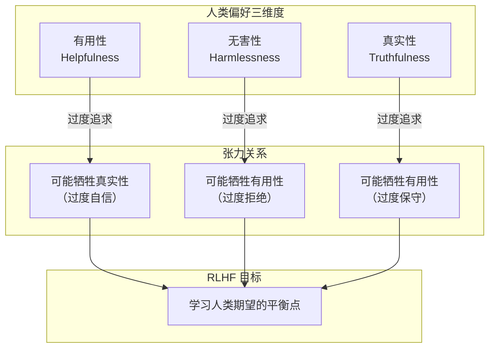
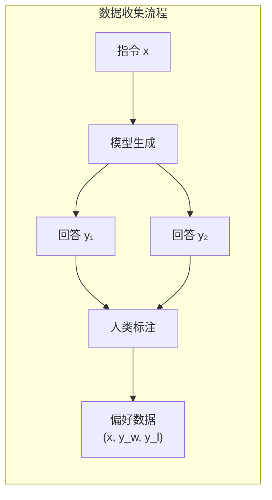
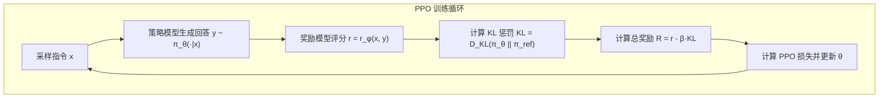

# RLHF——人类反馈强化学习

在上一章中，我们探讨了监督微调（SFT）——如何通过指令 - 回答对的监督学习，将预训练模型转化为可用的助手。SFT 让模型学会了"回答"而非"续写"，但一个关键问题悬而未决：SFT 能让模型充分理解人类偏好吗？

答案是否定的。SFT 本质上是让模型模仿人类编写的回答，但模仿不等于理解。一个模型可以学会生成语法正确、信息准确的回答，却可能在风格、安全性、有用性等方面与人类期望存在偏差。更深层的问题是：人类偏好是复杂且多维的，仅凭有限的 SFT 数据难以充分捕捉。

**RLHF**（Reinforcement Learning from Human Feedback，人类反馈强化学习）正是为解决这一问题而生。它让模型从人类的偏好反馈中学习，而非仅仅模仿人类的回答。2022 年，OpenAI 发布的 InstructGPT 论文系统阐述了 RLHF 的三阶段框架，随后 ChatGPT 的成功更是将 RLHF 推向了聚光灯下。本文将从 SFT 的局限性出发，逐步构建 RLHF 的理论框架和实践方法。

## RLHF 的动机

理解 RLHF 的价值，首先要理解 SFT 的局限性。SFT 虽然有效，但存在根本性的约束。

### SFT 的局限性：模仿但不理解

SFT 的核心是**行为克隆**（Behavior Cloning）：让模型学习人类专家的行为模式。这种方法有几个固有缺陷：

**数据覆盖不足**：人类编写的 SFT 数据量有限（通常数万条），难以覆盖所有可能的场景和偏好。模型可能学会处理常见情况，但在边缘案例上表现不佳。

**无法捕捉隐性偏好**：人类偏好中有很多"只可意会不可言传"的因素。例如，什么样的回答更"有帮助"？什么样的语气更"友好"？这些偏好难以通过有限的示例完全传达。

**缺乏探索能力**：SFT 是监督学习，模型只能学习训练数据中已有的回答模式，无法探索可能更优但训练数据中未出现的回答策略。

用一个类比来说明：SFT 就像让学生背诵标准答案，而 RLHF 则是让学生理解评分标准后自主探索最优解。前者可能让学生在已知问题上表现良好，但面对新问题时可能束手无策；后者则培养了更深层的理解能力。

```python runnable
import matplotlib.pyplot as plt
import numpy as np

plt.rcParams['font.sans-serif'] = ['SimHei', 'DejaVu Sans']
plt.rcParams['axes.unicode_minus'] = False

# SFT vs RLHF 的能力边界对比
fig, ax = plt.subplots(figsize=(10, 6))

# 模拟不同方法的能力边界
categories = ['常见问题', '边缘案例', '风格适配', '安全性', '有用性']
sft_scores = [90, 60, 65, 70, 75]
rlhf_scores = [92, 85, 88, 95, 90]

x = np.arange(len(categories))
width = 0.35

bars1 = ax.bar(x - width/2, sft_scores, width, label='仅 SFT', color='steelblue')
bars2 = ax.bar(x + width/2, rlhf_scores, width, label='SFT + RLHF', color='green')

ax.set_ylabel('性能分数', fontsize=12)
ax.set_title('SFT vs SFT+RLHF 能力对比', fontsize=14)
ax.set_xticks(x)
ax.set_xticklabels(categories)
ax.legend()
ax.set_ylim(0, 100)
ax.grid(True, alpha=0.3, axis='y')

# 添加数值标注
for bar, score in zip(bars1, sft_scores):
    ax.annotate(f'{score}', xy=(bar.get_x() + bar.get_width()/2, bar.get_height()),
                xytext=(0, 3), textcoords='offset points', ha='center', fontsize=9)
for bar, score in zip(bars2, rlhf_scores):
    ax.annotate(f'{score}', xy=(bar.get_x() + bar.get_width()/2, bar.get_height()),
                xytext=(0, 3), textcoords='offset points', ha='center', fontsize=9)

plt.tight_layout()
plt.savefig('/workspace/sft_vs_rlhf.png', dpi=150, bbox_inches='tight')
plt.show()

print("SFT 局限性分析:")
print("- 常见问题: SFT 表现良好，RLHF 提升有限")
print("- 边缘案例: SFT 覆盖不足，RLHF 显著提升")
print("- 风格适配: SFT 难以捕捉隐性偏好，RLHF 学习偏好模型")
print("- 安全性: SFT 依赖示例，RLHF 通过奖励信号强化")
print("- 有用性: SFT 模仿回答，RLHF 优化有用性目标")
```

### 人类偏好的本质

人类对模型输出的偏好是多维度的，远不止"正确性"这一项。InstructGPT 论文将人类偏好归纳为三个核心维度：

**有用性**（Helpfulness）：回答是否直接回应了用户的问题？是否提供了有价值的信息？是否避免了冗余？

**真实性**（Truthfulness）：回答是否事实准确？是否避免了幻觉（编造不存在的信息）？

**无害性**（Harmlessness）：回答是否避免了有害内容？是否拒绝了不当请求？是否避免了偏见和歧视？

这三个维度之间存在张力。例如，一个过于谨慎的模型可能在无害性上得分很高，但有用性较低；一个过于自信的模型可能在有用性上得分较高，但真实性可能受损。RLHF 的核心价值在于：**让模型学会在这些维度之间找到人类期望的平衡点**。



### 从模仿到偏好学习

SFT 和 RLHF 的根本区别在于学习范式：

**SFT（模仿学习）**：
- 目标：最小化模型输出与人类回答的差异
- 数据：指令 - 回答对 $(x, y)$
- 损失：$\mathcal{L} = -\log P(y|x)$

**RLHF（偏好学习）**：
- 目标：最大化人类偏好得分
- 数据：偏好对比 $(x, y_w, y_l)$，其中 $y_w$ 优于 $y_l$
- 损失：基于偏好模型的损失函数

关键转变是：从"学习人类说了什么"到"学习人类喜欢什么"。这个转变让模型能够：

1. **超越训练数据**：通过偏好模型泛化到未见过的回答
2. **捕捉隐性知识**：从对比中学习人类难以明确表达的偏好
3. **探索更优策略**：通过强化学习发现可能优于人类示例的回答

## 奖励模型训练

RLHF 的第一阶段是训练一个**奖励模型**（Reward Model, RM），它能预测人类对任意回答的偏好程度。这个奖励模型将作为后续强化学习的"裁判"。

### 偏好对比数据

奖励模型的训练数据是**偏好对比**（Preference Pairs）：给定一个指令 $x$，模型生成两个回答 $y_w$ 和 $y_l$，人类标注者判断哪个更好。



**数据收集策略**：

**采样多样性**：让模型生成多个候选回答（如 4-9 个），然后让标注者对它们进行排序或两两比较。

**标注一致性**：多个标注者对同一对比进行标注，取多数意见或计算一致性分数。

**指令多样性**：覆盖多种任务类型（问答、创意写作、代码、推理等），确保奖励模型的泛化能力。

InstructGPT 使用了约 33K 条偏好对比数据来训练奖励模型。这个数量远小于预训练数据，但足以学习人类偏好的核心模式。

### Bradley-Terry 模型

如何从偏好对比数据中学习奖励模型？**Bradley-Terry 模型**提供了一个优雅的数学框架。

**基本假设**：每个回答 $y$ 有一个潜在的真实奖励值 $r^*(x, y)$，人类选择 $y_w$ 优于 $y_l$ 的概率与两者的奖励差成正比。

**数学表达**：

$$P(y_w \succ y_l | x) = \frac{\exp(r^*(x, y_w))}{\exp(r^*(x, y_w)) + \exp(r^*(x, y_l))}$$

这可以简化为 sigmoid 形式：

$$P(y_w \succ y_l | x) = \sigma(r^*(x, y_w) - r^*(x, y_l))$$

其中 $\sigma(\cdot)$ 是 sigmoid 函数：$\sigma(z) = \frac{1}{1 + e^{-z}}$。

**直观理解**：如果 $y_w$ 的奖励比 $y_l$ 高很多，选择 $y_w$ 的概率接近 1；如果两者奖励相近，选择概率接近 0.5（随机选择）。

**训练目标**：学习一个奖励模型 $r_\theta(x, y)$，使其预测的偏好概率与人类标注一致。最大似然估计：

$$\mathcal{L}_{RM} = -\mathbb{E}_{(x, y_w, y_l) \sim \mathcal{D}} \left[ \log \sigma(r_\theta(x, y_w) - r_\theta(x, y_l)) \right]$$

这个损失函数的含义是：最大化人类选择 $y_w$ 的概率的对数。

```python runnable
import torch
import torch.nn as nn
import numpy as np
import matplotlib.pyplot as plt

plt.rcParams['font.sans-serif'] = ['SimHei', 'DejaVu Sans']
plt.rcParams['axes.unicode_minus'] = False

# Bradley-Terry 模型可视化
def visualize_bradley_terry():
    """可视化 Bradley-Terry 模型的偏好概率"""
    
    # 奖励差值
    delta_r = np.linspace(-5, 5, 100)
    
    # 偏好概率
    prob = 1 / (1 + np.exp(-delta_r))
    
    fig, ax = plt.subplots(figsize=(10, 6))
    
    ax.plot(delta_r, prob, 'b-', linewidth=2, label=r'$P(y_w \succ y_l) = \sigma(r_w - r_l)$')
    
    # 标注关键点
    ax.axhline(y=0.5, color='gray', linestyle='--', alpha=0.5)
    ax.axvline(x=0, color='gray', linestyle='--', alpha=0.5)
    ax.scatter([0], [0.5], color='red', s=100, zorder=5)
    ax.annotate('奖励相等\n随机选择', xy=(0, 0.5), xytext=(1, 0.3),
                fontsize=10, arrowprops=dict(arrowstyle='->', color='red'))
    
    ax.scatter([2], [0.88], color='green', s=100, zorder=5)
    ax.annotate('r_w - r_l = 2\n偏好概率 88%', xy=(2, 0.88), xytext=(3, 0.7),
                fontsize=10, arrowprops=dict(arrowstyle='->', color='green'))
    
    ax.scatter([-2], [0.12], color='orange', s=100, zorder=5)
    ax.annotate('r_w - r_l = -2\n偏好概率 12%', xy=(-2, 0.12), xytext=(-4.5, 0.25),
                fontsize=10, arrowprops=dict(arrowstyle='->', color='orange'))
    
    ax.set_xlabel(r'奖励差值 $\Delta r = r_w - r_l$', fontsize=12)
    ax.set_ylabel(r'偏好概率 $P(y_w \succ y_l)$', fontsize=12)
    ax.set_title('Bradley-Terry 模型：奖励差值与偏好概率的关系', fontsize=14)
    ax.legend(fontsize=11)
    ax.grid(True, alpha=0.3)
    ax.set_xlim(-5, 5)
    ax.set_ylim(0, 1)
    
    plt.tight_layout()
    plt.savefig('/workspace/bradley_terry.png', dpi=150, bbox_inches='tight')
    plt.show()
    
    print("Bradley-Terry 模型解读:")
    print("- 奖励差值为 0 时，偏好概率为 0.5（随机选择）")
    print("- 奖励差值为正时，偏好概率 > 0.5（更可能选择 y_w）")
    print("- 奖励差值为负时，偏好概率 < 0.5（更可能选择 y_l）")
    print("- 奖励差值越大，偏好概率越接近 1 或 0")

visualize_bradley_terry()
```

### 奖励模型架构

奖励模型通常基于预训练的语言模型，在最后一层添加一个线性头，输出一个标量奖励值。

```nn-arch width=720
name: 奖励模型架构
layout: vertical

sections:
  - name: 输入
    layers: [input]
  - name: 预训练模型
    layers: [llm]
  - name: 奖励头
    layers: [linear, output]

layers:
  - {id: input, name: "(x, y)", type: input, size: "指令 + 回答"}
  - {id: llm, name: "预训练 LLM<br/>（冻结或微调）", type: transformer, size: "Transformer 层"}
  - {id: linear, name: "Linear", type: dense, size: "d_model → 1"}
  - {id: output, name: "r(x, y)", type: output, size: "奖励分数"}
```

**训练细节**：

**输入格式**：将指令 $x$ 和回答 $y$ 拼接，作为奖励模型的输入。

**输出位置**：通常取最后一个 token 的隐藏状态，通过线性层映射为奖励值。

**参数更新**：可以使用预训练模型的全部参数，或只训练最后几层（节省计算）。

```python runnable
import torch
import torch.nn as nn
import torch.nn.functional as F

class RewardModel(nn.Module):
    """简化的奖励模型实现"""
    def __init__(self, vocab_size=1000, d_model=128, nhead=4, num_layers=2):
        super().__init__()
        self.embedding = nn.Embedding(vocab_size, d_model)
        self.pos_encoding = nn.Parameter(torch.randn(1, 512, d_model) * 0.01)
        
        encoder_layer = nn.TransformerEncoderLayer(d_model, nhead, d_model * 4, batch_first=True)
        self.transformer = nn.TransformerEncoder(encoder_layer, num_layers)
        
        # 奖励头：输出标量奖励值
        self.reward_head = nn.Linear(d_model, 1)
        
    def forward(self, input_ids):
        """
        输入: input_ids (batch, seq_len)
        输出: reward (batch,) - 标量奖励值
        """
        seq_len = input_ids.size(1)
        x = self.embedding(input_ids) + self.pos_encoding[:, :seq_len, :]
        x = self.transformer(x)
        
        # 取最后一个 token 的隐藏状态
        last_hidden = x[:, -1, :]  # (batch, d_model)
        reward = self.reward_head(last_hidden).squeeze(-1)  # (batch,)
        
        return reward

def compute_reward_loss(reward_model, batch):
    """
    计算奖励模型的 Bradley-Terry 损失
    
    batch: {
        'chosen_ids': (batch, seq_len) - 被选中的回答
        'rejected_ids': (batch, seq_len) - 被拒绝的回答
    }
    """
    r_chosen = reward_model(batch['chosen_ids'])  # (batch,)
    r_rejected = reward_model(batch['rejected_ids'])  # (batch,)
    
    # Bradley-Terry 损失
    # -log(sigmoid(r_chosen - r_rejected))
    loss = -F.logsigmoid(r_chosen - r_rejected).mean()
    
    return loss

# 演示
torch.manual_seed(42)
model = RewardModel(vocab_size=100, d_model=64, nhead=2, num_layers=2)

# 模拟批次数据
batch = {
    'chosen_ids': torch.randint(0, 100, (4, 20)),
    'rejected_ids': torch.randint(0, 100, (4, 20))
}

loss = compute_reward_loss(model, batch)
print(f"奖励模型损失: {loss.item():.4f}")

# 模拟奖励值
r_chosen = model(batch['chosen_ids'])
r_rejected = model(batch['rejected_ids'])

print(f"\n选中回答奖励: {r_chosen.detach().numpy()}")
print(f"拒绝回答奖励: {r_rejected.detach().numpy()}")
print(f"奖励差值: {(r_chosen - r_rejected).detach().numpy()}")
```

### 奖励模型的局限性

奖励模型虽然强大，但存在几个关键局限：

**分布偏移**：奖励模型在人类标注的数据分布上训练，但强化学习阶段模型会探索新的回答分布，可能导致奖励模型的预测不准确。

**偏好不一致**：不同标注者的偏好可能不一致，奖励模型学到的是"平均偏好"，可能无法满足特定用户的需求。

**奖励黑客风险**：模型可能找到奖励模型的"漏洞"，生成高奖励但实际质量低的回答。下一节将详细讨论这个问题。

## PPO 优化

有了奖励模型后，第二阶段是使用**强化学习**优化策略模型（即我们要训练的语言模型）。**PPO**（Proximal Policy Optimization）是 RLHF 中最常用的强化学习算法。

### RLHF 的三模型架构

RLHF 涉及三个模型的协同工作：

```nn-arch width=720
name: RLHF 三模型架构
layout: horizontal

sections:
  - name: 策略模型
    layers: [policy]
  - name: 奖励模型
    layers: [reward]
  - name: 参考模型
    layers: [ref]

layers:
  - {id: policy, name: "策略模型 π_θ<br/>（待优化）", type: transformer, size: "生成回答"}
  - {id: reward, name: "奖励模型 r_φ<br/>（冻结）", type: transformer, size: "评分"}
  - {id: ref, name: "参考模型 π_ref<br/>（冻结）", type: transformer, size: "KL 约束"}
```

**策略模型**（Policy Model）：$\pi_\theta$，即我们要优化的语言模型。它根据指令生成回答，是强化学习中的"智能体"。

**奖励模型**（Reward Model）：$r_\phi$，已经训练好的奖励模型，对策略模型生成的回答进行评分。它在 RLHF 阶段保持冻结。

**参考模型**（Reference Model）：$\pi_{ref}$，通常是 SFT 后的模型，用于计算 KL 散度，防止策略模型偏离太远。它也保持冻结。

### PPO 算法流程

PPO 的核心思想是：在优化策略时，限制策略更新的幅度，避免"灾难性遗忘"或"策略崩溃"。

**完整流程**：



**步骤详解**：

**1. 采样指令**：从指令池中采样一批指令 $x$。

**2. 生成回答**：策略模型 $\pi_\theta$ 为每个指令生成回答 $y \sim \pi_\theta(\cdot|x)$。

**3. 奖励评分**：奖励模型 $r_\phi$ 对每个回答进行评分 $r = r_\phi(x, y)$。

**4. KL 惩罚**：计算策略模型与参考模型的 KL 散度：
$$D_{KL}(\pi_\theta(\cdot|x) \| \pi_{ref}(\cdot|x)) = \sum_y \pi_\theta(y|x) \log \frac{\pi_\theta(y|x)}{\pi_{ref}(y|x)}$$

**5. 总奖励**：
$$R(x, y) = r_\phi(x, y) - \beta \cdot D_{KL}(\pi_\theta \| \pi_{ref})$$

其中 $\beta$ 是 KL 惩罚系数。

**6. PPO 损失**：
$$\mathcal{L}_{PPO} = -\mathbb{E}\left[\min\left(\rho_t A_t, \text{clip}(\rho_t, 1-\epsilon, 1+\epsilon) A_t\right)\right]$$

其中：
- $\rho_t = \frac{\pi_\theta(y|x)}{\pi_{old}(y|x)}$ 是重要性采样比率
- $A_t$ 是优势函数（Advantage Function）
- $\epsilon$ 是裁剪参数（通常 0.1-0.2）

```python runnable
import torch
import torch.nn as nn
import torch.nn.functional as F
import numpy as np
import matplotlib.pyplot as plt

plt.rcParams['font.sans-serif'] = ['SimHei', 'DejaVu Sans']
plt.rcParams['axes.unicode_minus'] = False

def demonstrate_ppo_clip():
    """演示 PPO 的裁剪机制"""
    
    # 重要性采样比率
    rho = np.linspace(0, 3, 100)
    
    # 不同 epsilon 值
    epsilons = [0.1, 0.2, 0.3]
    
    fig, axes = plt.subplots(1, 2, figsize=(14, 5))
    
    # 左图：裁剪后的比率
    ax1 = axes[0]
    ax1.plot(rho, rho, 'k--', label='未裁剪', alpha=0.5)
    
    for eps in epsilons:
        clipped = np.clip(rho, 1-eps, 1+eps)
        ax1.plot(rho, clipped, linewidth=2, label=f'ε={eps}')
    
    ax1.axhline(y=1, color='gray', linestyle=':', alpha=0.5)
    ax1.axvline(x=1, color='gray', linestyle=':', alpha=0.5)
    ax1.set_xlabel('重要性采样比率 ρ', fontsize=12)
    ax1.set_ylabel('裁剪后的比率', fontsize=12)
    ax1.set_title('PPO 裁剪机制', fontsize=14)
    ax1.legend()
    ax1.grid(True, alpha=0.3)
    ax1.set_xlim(0, 3)
    ax1.set_ylim(0, 2)
    
    # 右图：PPO 目标函数
    ax2 = axes[1]
    A = 1.0  # 假设优势函数为正
    
    for eps in epsilons:
        clipped_obj = np.minimum(rho * A, np.clip(rho, 1-eps, 1+eps) * A)
        ax2.plot(rho, clipped_obj, linewidth=2, label=f'ε={eps}')
    
    ax2.plot(rho, rho * A, 'k--', label='未裁剪目标', alpha=0.5)
    ax2.axhline(y=A, color='gray', linestyle=':', alpha=0.5)
    ax2.axvline(x=1, color='gray', linestyle=':', alpha=0.5)
    ax2.set_xlabel('重要性采样比率 ρ', fontsize=12)
    ax2.set_ylabel('PPO 目标值', fontsize=12)
    ax2.set_title(f'PPO 目标函数 (A={A})', fontsize=14)
    ax2.legend()
    ax2.grid(True, alpha=0.3)
    ax2.set_xlim(0, 3)
    
    plt.tight_layout()
    plt.savefig('/workspace/ppo_clip.png', dpi=150, bbox_inches='tight')
    plt.show()
    
    print("PPO 裁剪机制解读:")
    print("- 当 ρ 在 [1-ε, 1+ε] 范围内时，目标函数不受限制")
    print("- 当 ρ 超出范围时，目标函数被裁剪，防止过大更新")
    print("- ε 越小，更新越保守；ε 越大，允许更大更新")
    print("- 典型 ε 值为 0.1-0.2")

demonstrate_ppo_clip()
```

### 优势函数估计

**优势函数**（Advantage Function）衡量某个动作相对于平均水平的优劣程度：

$$A(s, a) = Q(s, a) - V(s)$$

在 RLHF 中，状态是指令 $x$，动作是生成的回答 $y$。优势函数告诉我们：生成这个回答比"平均回答"好多少？

**GAE**（Generalized Advantage Estimation）是常用的优势函数估计方法：

$$A_t^{GAE} = \sum_{l=0}^{\infty} (\gamma \lambda)^l \delta_{t+l}$$

其中 $\delta_t = r_t + \gamma V(s_{t+1}) - V(s_t)$ 是 TD 误差。

```python runnable
import numpy as np
import matplotlib.pyplot as plt

plt.rcParams['font.sans-serif'] = ['SimHei', 'DejaVu Sans']
plt.rcParams['axes.unicode_minus'] = False

def demonstrate_gae():
    """演示 GAE 优势函数估计"""
    
    # 模拟一个轨迹的奖励和值函数
    T = 10
    rewards = np.array([0, 0, 0, 0, 0, 0, 0, 0, 0, 1])  # 最后一步获得奖励
    values = np.array([0.1, 0.2, 0.3, 0.4, 0.5, 0.6, 0.7, 0.8, 0.9, 1.0])
    
    gamma = 0.99
    lambdas = [0.0, 0.5, 0.9, 1.0]
    
    fig, ax = plt.subplots(figsize=(10, 6))
    
    for lam in lambdas:
        # 计算 GAE
        advantages = []
        for t in range(T):
            gae = 0
            for l in range(T - t):
                delta = rewards[t + l] + (gamma * values[t + l + 1] if t + l + 1 < T else 0) - values[t + l]
                gae += (gamma * lam) ** l * delta
            advantages.append(gae)
        
        ax.plot(range(T), advantages, 'o-', linewidth=2, label=f'λ={lam}')
    
    ax.axhline(y=0, color='gray', linestyle='--', alpha=0.5)
    ax.set_xlabel('时间步', fontsize=12)
    ax.set_ylabel('优势函数', fontsize=12)
    ax.set_title('GAE 优势函数估计（不同 λ 值）', fontsize=14)
    ax.legend()
    ax.grid(True, alpha=0.3)
    
    plt.tight_layout()
    plt.savefig('/workspace/gae.png', dpi=150, bbox_inches='tight')
    plt.show()
    
    print("GAE 参数解读:")
    print("- λ=0: 只使用单步 TD 误差，方差低但偏差高")
    print("- λ=1: 使用完整轨迹回报，偏差低但方差高")
    print("- λ=0.9: 平衡偏差和方差，常用选择")
    print("- γ: 折扣因子，控制对未来奖励的重视程度")

demonstrate_gae()
```

### PPO 训练的完整代码

下面是一个简化的 PPO 训练循环，展示 RLHF 的核心逻辑：

```python runnable
import torch
import torch.nn as nn
import torch.nn.functional as F
from torch.distributions import Categorical
import numpy as np

class SimpleLanguageModel(nn.Module):
    """简化的语言模型（用于演示）"""
    def __init__(self, vocab_size=100, d_model=64, nhead=2, num_layers=2):
        super().__init__()
        self.embedding = nn.Embedding(vocab_size, d_model)
        self.pos_encoding = nn.Parameter(torch.randn(1, 512, d_model) * 0.01)
        
        decoder_layer = nn.TransformerDecoderLayer(d_model, nhead, d_model * 4, batch_first=True)
        self.transformer = nn.TransformerDecoder(decoder_layer, num_layers)
        
        self.output = nn.Linear(d_model, vocab_size)
        
    def forward(self, x):
        seq_len = x.size(1)
        x = self.embedding(x) + self.pos_encoding[:, :seq_len, :]
        # 简化：使用自身作为 memory
        x = self.transformer(x, x)
        logits = self.output(x)
        return logits
    
    def get_log_probs(self, x):
        """获取每个位置的对数概率"""
        logits = self.forward(x)
        log_probs = F.log_softmax(logits, dim=-1)
        return log_probs
    
    def generate(self, x, max_len=10):
        """生成回答"""
        for _ in range(max_len):
            logits = self.forward(x)
            next_token = torch.argmax(logits[:, -1, :], dim=-1, keepdim=True)
            x = torch.cat([x, next_token], dim=1)
        return x

class SimpleRewardModel(nn.Module):
    """简化的奖励模型"""
    def __init__(self, vocab_size=100, d_model=64):
        super().__init__()
        self.embedding = nn.Embedding(vocab_size, d_model)
        self.reward_head = nn.Linear(d_model, 1)
        
    def forward(self, x):
        x = self.embedding(x)
        # 取最后一个 token
        reward = self.reward_head(x[:, -1, :]).squeeze(-1)
        return reward

def ppo_train_step(policy_model, ref_model, reward_model, batch, 
                   epsilon=0.2, beta=0.1, lr=1e-5):
    """
    单步 PPO 训练
    
    参数:
        policy_model: 策略模型（待优化）
        ref_model: 参考模型（冻结）
        reward_model: 奖励模型（冻结）
        batch: 批次数据 {'prompts': (batch, prompt_len)}
        epsilon: PPO 裁剪参数
        beta: KL 惩罚系数
        lr: 学习率
    """
    prompts = batch['prompts']
    batch_size = prompts.size(0)
    
    # 1. 生成回答
    with torch.no_grad():
        responses = policy_model.generate(prompts.clone(), max_len=10)
    
    # 2. 计算奖励
    with torch.no_grad():
        rewards = reward_model(responses)
    
    # 3. 计算旧策略的对数概率
    with torch.no_grad():
        old_log_probs = policy_model.get_log_probs(responses)
        # 取实际生成部分的概率
        old_log_probs = old_log_probs[:, prompts.size(1):, :]
        old_log_probs_tokens = old_log_probs.gather(2, responses[:, prompts.size(1):].unsqueeze(-1)).squeeze(-1)
        old_log_probs_sum = old_log_probs_tokens.sum(dim=1)
    
    # 4. 计算参考模型的对数概率（KL 散度）
    with torch.no_grad():
        ref_log_probs = ref_model.get_log_probs(responses)
        ref_log_probs = ref_log_probs[:, prompts.size(1):, :]
        ref_log_probs_tokens = ref_log_probs.gather(2, responses[:, prompts.size(1):].unsqueeze(-1)).squeeze(-1)
    
    # 5. 计算当前策略的对数概率
    new_log_probs = policy_model.get_log_probs(responses)
    new_log_probs = new_log_probs[:, prompts.size(1):, :]
    new_log_probs_tokens = new_log_probs.gather(2, responses[:, prompts.size(1):].unsqueeze(-1)).squeeze(-1)
    new_log_probs_sum = new_log_probs_tokens.sum(dim=1)
    
    # 6. 计算重要性采样比率
    ratio = torch.exp(new_log_probs_sum - old_log_probs_sum)
    
    # 7. 计算优势函数（简化：使用奖励作为优势）
    advantages = rewards - rewards.mean()  # 中心化
    
    # 8. 计算 PPO 损失
    surr1 = ratio * advantages
    surr2 = torch.clamp(ratio, 1 - epsilon, 1 + epsilon) * advantages
    ppo_loss = -torch.min(surr1, surr2).mean()
    
    # 9. 计算 KL 散度惩罚
    kl_div = (new_log_probs_tokens - ref_log_probs_tokens).mean()
    kl_loss = beta * kl_div
    
    # 10. 总损失
    total_loss = ppo_loss + kl_loss
    
    # 11. 反向传播
    optimizer = torch.optim.Adam(policy_model.parameters(), lr=lr)
    optimizer.zero_grad()
    total_loss.backward()
    optimizer.step()
    
    return {
        'ppo_loss': ppo_loss.item(),
        'kl_loss': kl_loss.item(),
        'total_loss': total_loss.item(),
        'mean_reward': rewards.mean().item(),
        'mean_ratio': ratio.mean().item()
    }

# 演示
torch.manual_seed(42)

# 创建模型
vocab_size = 100
policy_model = SimpleLanguageModel(vocab_size)
ref_model = SimpleLanguageModel(vocab_size)
ref_model.load_state_dict(policy_model.state_dict())  # 参考模型初始化为相同参数
reward_model = SimpleRewardModel(vocab_size)

# 模拟训练
print("PPO 训练演示")
print("=" * 50)

for step in range(5):
    # 模拟批次数据
    batch = {'prompts': torch.randint(0, vocab_size, (4, 5))}
    
    metrics = ppo_train_step(policy_model, ref_model, reward_model, batch)
    
    print(f"Step {step + 1}:")
    print(f"  PPO Loss: {metrics['ppo_loss']:.4f}")
    print(f"  KL Loss: {metrics['kl_loss']:.4f}")
    print(f"  Mean Reward: {metrics['mean_reward']:.4f}")
    print(f"  Mean Ratio: {metrics['mean_ratio']:.4f}")
    print()
```

## KL 约束的意义

在 RLHF 中，KL 散度惩罚是一个关键设计。为什么不能直接最大化奖励，而要加上这个约束？答案涉及一个重要问题：**奖励黑客**（Reward Hacking）。

### 奖励黑客问题

**奖励黑客**是指模型找到奖励模型的"漏洞"，生成高奖励但实际质量低的回答。这是强化学习中"目标不匹配"问题的典型表现。

**具体表现**：

**过度优化**：模型可能学会生成"奖励模型喜欢但人类不喜欢"的回答。例如，奖励模型可能偏好长回答，模型就会生成冗长的废话。

**分布外崩溃**：模型探索到奖励模型训练数据之外的区域，奖励模型的预测变得不可靠。

**模式崩溃**：模型可能只生成少数几种"高奖励"回答模式，失去多样性。

```python runnable
import numpy as np
import matplotlib.pyplot as plt

plt.rcParams['font.sans-serif'] = ['SimHei', 'DejaVu Sans']
plt.rcParams['axes.unicode_minus'] = False

def demonstrate_reward_hacking():
    """演示奖励黑客问题"""
    
    # 训练步数
    steps = np.arange(0, 100)
    
    # 模拟奖励和真实质量的变化
    # 无 KL 约束：奖励持续上升，但真实质量先升后降
    reward_no_kl = 1 - np.exp(-steps / 20) + 0.3 * np.sin(steps / 5) * (steps > 30)
    quality_no_kl = 1 - np.exp(-steps / 25) - 0.5 * (steps > 40) * (1 - np.exp(-(steps - 40) / 15))
    
    # 有 KL 约束：奖励和真实质量同步上升
    reward_with_kl = 1 - np.exp(-steps / 25)
    quality_with_kl = 1 - np.exp(-steps / 30)
    
    fig, axes = plt.subplots(1, 2, figsize=(14, 5))
    
    # 无 KL 约束
    axes[0].plot(steps, reward_no_kl, 'b-', linewidth=2, label='奖励模型分数')
    axes[0].plot(steps, quality_no_kl, 'r-', linewidth=2, label='真实质量')
    axes[0].axvline(x=40, color='gray', linestyle='--', alpha=0.5)
    axes[0].annotate('奖励黑客开始', xy=(40, 0.8), xytext=(50, 0.9),
                    fontsize=10, arrowprops=dict(arrowstyle='->', color='gray'))
    axes[0].set_xlabel('训练步数', fontsize=12)
    axes[0].set_ylabel('分数', fontsize=12)
    axes[0].set_title('无 KL 约束：奖励黑客问题', fontsize=14)
    axes[0].legend()
    axes[0].grid(True, alpha=0.3)
    axes[0].set_ylim(0, 1.5)
    
    # 有 KL 约束
    axes[1].plot(steps, reward_with_kl, 'b-', linewidth=2, label='奖励模型分数')
    axes[1].plot(steps, quality_with_kl, 'r-', linewidth=2, label='真实质量')
    axes[1].set_xlabel('训练步数', fontsize=12)
    axes[1].set_ylabel('分数', fontsize=12)
    axes[1].set_title('有 KL 约束：稳定优化', fontsize=14)
    axes[1].legend()
    axes[1].grid(True, alpha=0.3)
    axes[1].set_ylim(0, 1.5)
    
    plt.tight_layout()
    plt.savefig('/workspace/reward_hacking.png', dpi=150, bbox_inches='tight')
    plt.show()
    
    print("奖励黑客问题解读:")
    print("- 无 KL 约束: 奖励分数持续上升，但真实质量在后期下降")
    print("- 原因: 模型找到奖励模型的漏洞，生成高奖励低质量的回答")
    print("- 有 KL 约束: 奖励和真实质量同步上升，避免过拟合")
    print("- KL 约束确保模型不会偏离参考模型太远")

demonstrate_reward_hacking()
```

### KL 散度的数学意义

**KL 散度**（Kullback-Leibler Divergence）衡量两个概率分布的差异：

$$D_{KL}(P \| Q) = \sum_x P(x) \log \frac{P(x)}{Q(x)}$$

在 RLHF 中，我们计算策略模型 $\pi_\theta$ 与参考模型 $\pi_{ref}$ 之间的 KL 散度：

$$D_{KL}(\pi_\theta(\cdot|x) \| \pi_{ref}(\cdot|x)) = \sum_y \pi_\theta(y|x) \log \frac{\pi_\theta(y|x)}{\pi_{ref}(y|x)}$$

**为什么 KL 散度能防止奖励黑客？**

**1. 保持预训练知识**：参考模型 $\pi_{ref}$ 保留了预训练和 SFT 学到的知识。KL 约束确保策略模型不会"遗忘"这些知识。

**2. 限制探索范围**：KL 约束限制了策略模型可以探索的区域，避免进入奖励模型训练数据之外的"危险区域"。

**3. 正则化效果**：KL 惩罚相当于对策略施加了一个正则化项，防止过拟合奖励模型。

### KL 惩罚系数的选择

KL 惩罚系数 $\beta$ 是一个关键超参数：

- **$\beta$ 太小**：KL 约束弱，可能出现奖励黑客
- **$\beta$ 太大**：KL 约束强，模型难以学习，奖励提升有限

**自适应 KL 策略**：根据当前 KL 散度动态调整 $\beta$：

- 如果 KL 散度 > 目标值，增大 $\beta$
- 如果 KL 散度 < 目标值，减小 $\beta$

```python runnable
import numpy as np
import matplotlib.pyplot as plt

plt.rcParams['font.sans-serif'] = ['SimHei', 'DejaVu Sans']
plt.rcParams['axes.unicode_minus'] = False

def demonstrate_kl_beta():
    """演示 KL 惩罚系数的影响"""
    
    steps = np.arange(0, 50)
    
    # 不同 beta 值下的奖励和 KL 散度变化
    betas = [0.01, 0.05, 0.1, 0.5]
    
    fig, axes = plt.subplots(1, 2, figsize=(14, 5))
    
    for beta in betas:
        # 模拟奖励增长（受 beta 抑制）
        reward = 1 - np.exp(-steps / (10 + beta * 50))
        axes[0].plot(steps, reward, linewidth=2, label=f'β={beta}')
        
        # 模拟 KL 散度变化
        kl = 0.5 * (1 - np.exp(-steps / 20)) / (1 + beta * 10)
        axes[1].plot(steps, kl, linewidth=2, label=f'β={beta}')
    
    axes[0].set_xlabel('训练步数', fontsize=12)
    axes[0].set_ylabel('奖励分数', fontsize=12)
    axes[0].set_title('不同 β 值下的奖励增长', fontsize=14)
    axes[0].legend()
    axes[0].grid(True, alpha=0.3)
    
    axes[1].set_xlabel('训练步数', fontsize=12)
    axes[1].set_ylabel('KL 散度', fontsize=12)
    axes[1].set_title('不同 β 值下的 KL 散度', fontsize=14)
    axes[1].legend()
    axes[1].grid(True, alpha=0.3)
    
    plt.tight_layout()
    plt.savefig('/workspace/kl_beta.png', dpi=150, bbox_inches='tight')
    plt.show()
    
    print("KL 惩罚系数选择:")
    print("- β=0.01: KL 约束弱，奖励增长快但可能奖励黑客")
    print("- β=0.05: 适中的约束，平衡奖励和稳定性")
    print("- β=0.1: 较强的约束，奖励增长较慢但稳定")
    print("- β=0.5: 过强的约束，模型难以学习")
    print("\n推荐: 从 β=0.05 开始，根据 KL 散度动态调整")

demonstrate_kl_beta()
```

## RLHF 的工程挑战

RLHF 在理论上优雅，但在工程实践中面临诸多挑战。本节讨论这些挑战及应对策略。

### 训练不稳定

RLHF 的训练过程比 SFT 更不稳定，可能出现以下问题：

**梯度爆炸/消失**：强化学习的梯度估计方差大，可能导致训练不稳定。

**策略崩溃**：模型可能突然"崩溃"，生成无意义或重复的内容。

**奖励模型过拟合**：如果训练太久，模型可能过拟合奖励模型，导致泛化能力下降。

**应对策略**：

**梯度裁剪**：限制梯度范数，防止梯度爆炸。

**学习率衰减**：使用较小的学习率，并随训练进行逐渐衰减。

**早停策略**：监控验证集性能，在性能开始下降时停止训练。

**多检查点保存**：定期保存检查点，以便在训练崩溃时回滚。

### 奖励模型过拟合

奖励模型可能过拟合训练数据，导致：

**泛化能力差**：对训练数据中未见过的回答类型评分不准确。

**偏好偏见**：学到训练数据中标注者的特定偏好，而非普遍的人类偏好。

**应对策略**：

**数据增强**：增加偏好对比数据的多样性。

**正则化**：对奖励模型施加 L2 正则化或 dropout。

**集成学习**：训练多个奖励模型，取平均或投票。

### 三模型联合训练的复杂性

RLHF 涉及策略模型、奖励模型、参考模型三个模型的协同，带来显著的工程复杂性：

**显存占用**：三个模型同时加载，显存需求大。

**计算开销**：每次更新需要三个模型的前向传播。

**同步问题**：如果使用分布式训练，三个模型的同步需要仔细设计。

**应对策略**：

**模型共享**：策略模型和参考模型可以共享大部分参数，只复制需要计算 KL 的层。

**梯度检查点**：使用激活值重计算降低显存。

**混合精度训练**：使用 FP16/BF16 降低显存和加速计算。

```python runnable
import matplotlib.pyplot as plt
import numpy as np

plt.rcParams['font.sans-serif'] = ['SimHei', 'DejaVu Sans']
plt.rcParams['axes.unicode_minus'] = False

def demonstrate_rlhf_memory():
    """演示 RLHF 的显存需求"""
    
    model_sizes = [7, 13, 30, 70]  # B
    
    # 显存组成（FP16）
    def calc_memory(size):
        param = size * 2  # GB
        grad = size * 2
        opt = size * 12  # AdamW
        return param, grad, opt
    
    # 策略模型（需要优化器状态）
    policy_mem = [sum(calc_memory(s)) for s in model_sizes]
    
    # 奖励模型（冻结，只需要参数）
    reward_mem = [calc_memory(s)[0] for s in model_sizes]
    
    # 参考模型（冻结，只需要参数）
    ref_mem = [calc_memory(s)[0] for s in model_sizes]
    
    # 总显存
    total_mem = [p + r + ref for p, r, ref in zip(policy_mem, reward_mem, ref_mem)]
    
    fig, ax = plt.subplots(figsize=(10, 6))
    
    x = np.arange(len(model_sizes))
    width = 0.6
    
    ax.bar(x, policy_mem, width, label='策略模型（含优化器）', color='steelblue')
    ax.bar(x, reward_mem, width, bottom=policy_mem, label='奖励模型', color='coral')
    ax.bar(x, ref_mem, width, bottom=[p+r for p, r in zip(policy_mem, reward_mem)], 
           label='参考模型', color='green')
    
    # 添加总量标注
    for i, total in enumerate(total_mem):
        ax.annotate(f'{total:.0f} GB', xy=(i, total), xytext=(0, 5),
                   textcoords='offset points', ha='center', fontsize=10)
    
    # GPU 参考线
    ax.axhline(y=80, color='red', linestyle='--', linewidth=2, label='A100 80GB')
    ax.axhline(y=40, color='orange', linestyle='--', linewidth=2, label='A100 40GB')
    
    ax.set_xlabel('模型规模（B 参数）', fontsize=12)
    ax.set_ylabel('显存需求（GB）', fontsize=12)
    ax.set_title('RLHF 三模型显存需求', fontsize=14)
    ax.set_xticks(x)
    ax.set_xticklabels([f'{s}B' for s in model_sizes])
    ax.legend(loc='upper left')
    ax.set_yscale('log')
    ax.grid(True, alpha=0.3, axis='y')
    
    plt.tight_layout()
    plt.savefig('/workspace/rlhf_memory.png', dpi=150, bbox_inches='tight')
    plt.show()
    
    print("RLHF 显存需求分析:")
    print("- 策略模型: 需要参数、梯度、优化器状态")
    print("- 奖励模型: 冻结，只需要参数")
    print("- 参考模型: 冻结，只需要参数")
    print("\n优化策略:")
    print("- 使用 ZeRO 优化分片存储")
    print("- 奖励模型和参考模型使用量化")
    print("- 梯度检查点降低激活值显存")

demonstrate_rlhf_memory()
```

### InstructGPT 的实践经验

InstructGPT 论文提供了宝贵的实践经验：

**数据规模**：
- SFT 数据：约 13K 条指令 - 回答对
- 偏好数据：约 33K 条偏好对比
- 相比预训练的万亿 token，这些数据量很小，但足以学习人类偏好

**训练策略**：
- SFT 是基础：RLHF 在 SFT 基础上进行，而非直接从预训练模型开始
- 奖励模型需要定期更新：随着策略模型的变化，奖励模型可能需要重新训练
- KL 惩罚系数：初始值 0.02，根据 KL 散度动态调整

**性能提升**：
- 在人类偏好评估中，1.3B 参数的 InstructGPT 优于 175B 的 GPT-3
- 这表明：对齐训练比规模扩张更有效

## 小结

本文系统介绍了 RLHF——人类反馈强化学习的核心内容：

**RLHF 的动机**：
- SFT 的局限性：模仿但不理解偏好，数据覆盖不足
- 人类偏好的本质：有用性、真实性、无害性三维度
- 从模仿学习到偏好学习的范式转变

**奖励模型训练**：
- 偏好对比数据：人类对回答进行两两比较
- Bradley-Terry 模型：从偏好对比中学习奖励函数
- 奖励模型架构：基于预训练 LLM，添加奖励头

**PPO 优化**：
- 三模型架构：策略模型、奖励模型、参考模型
- PPO 算法：裁剪机制限制策略更新幅度
- 优势函数估计：GAE 平衡偏差和方差

**KL 约束的意义**：
- 奖励黑客问题：模型可能找到奖励模型的漏洞
- KL 散度：限制策略模型偏离参考模型的程度
- KL 惩罚系数：平衡奖励优化和稳定性

**工程挑战**：
- 训练不稳定：梯度裁剪、学习率衰减、早停策略
- 奖励模型过拟合：数据增强、正则化、集成学习
- 三模型联合训练：显存优化、模型共享、混合精度

RLHF 是大语言模型对齐的关键技术，ChatGPT 的成功证明了其有效性。但 RLHF 并非完美：训练复杂、成本高昂、存在奖励黑客风险。下一章将探讨对齐的新范式——DPO、KTO、GRPO 等方法，它们试图以更简洁的方式实现类似的对齐效果。

---

## 练习题

**1. 理论推导**

推导 Bradley-Terry 模型的损失函数：
$$\mathcal{L}_{RM} = -\mathbb{E}_{(x, y_w, y_l) \sim \mathcal{D}} \left[ \log \sigma(r_\theta(x, y_w) - r_\theta(x, y_l)) \right]$$

从最大似然估计的角度解释这个损失函数的含义。

**2. 算法分析**

分析 PPO 中裁剪机制的作用：
- 为什么需要限制重要性采样比率 $\rho_t$？
- 如果不使用裁剪，可能出现什么问题？
- $\epsilon$ 参数如何影响训练稳定性？

**3. 工程设计**

设计一个 7B 模型的 RLHF 训练方案：
- 可用硬件：4 张 A100 80GB
- 目标：最大化有用性，同时保持安全性
- 给出 KL 惩罚系数、学习率、batch size 等超参数的选择

**4. 编程实现**

实现一个完整的 RLHF 训练流程：
- 奖励模型训练（Bradley-Terry 损失）
- PPO 优化（含 KL 惩罚）
- 在简单任务上验证效果

**5. 问题分析**

分析以下场景中 RLHF 可能遇到的问题及解决方案：
- 奖励模型对长回答有偏好，模型生成冗长内容
- 训练过程中 KL 散度突然增大
- 模型开始生成重复或无意义的内容

---

## 参考资料

1. **InstructGPT 论文**: "Training Language Models to Follow Instructions with Human Feedback" (Ouyang et al., 2022)
2. **PPO 论文**: "Proximal Policy Optimization Algorithms" (Schulman et al., 2017)
3. **GAE 论文**: "High-Dimensional Continuous Control Using Generalized Advantage Estimation" (Schulman et al., 2016)
4. **Bradley-Terry 模型**: "Rank Analysis of Incomplete Block Designs: I. The Method of Paired Comparisons" (Bradley & Terry, 1952)
5. **ChatGPT**: OpenAI ChatGPT (2022)
6. **DeepSpeed RLHF**: "DeepSpeed-Chat: Easy, Fast and Affordable RLHF Training of ChatGPT-like Models at All Scales" (Yao et al., 2023)
7. **LLaMA-2 论文**: "Llama 2: Open Foundation and Fine-Tuned Chat Models" (Touvron et al., 2023)
8. **Anthropic RLHF**: "Training a Helpful and Harmless Assistant with Reinforcement Learning from Human Feedback" (Askell et al., 2021)
