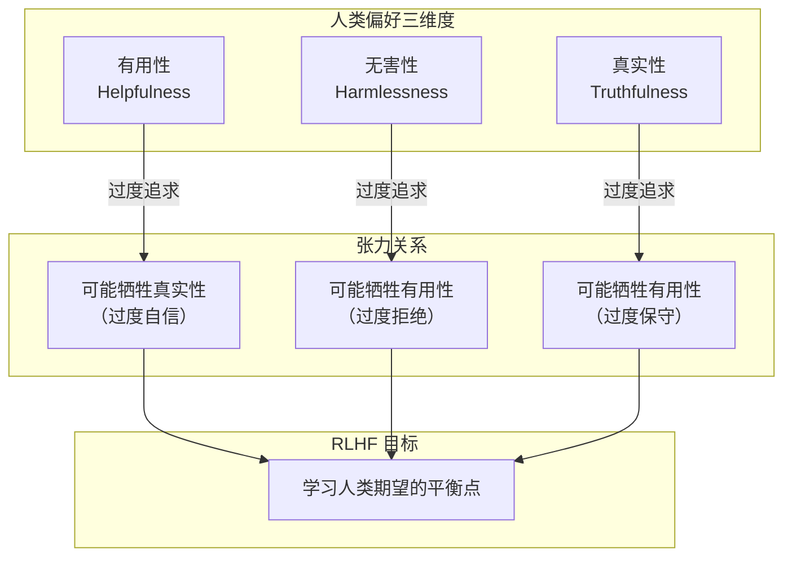
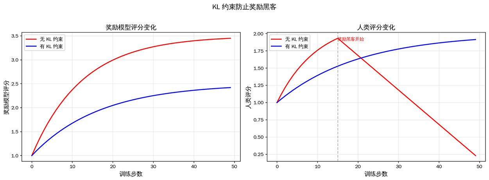

# 人类反馈强化学习

在[监督微调](../pretraining/supervised-finetuning.md)中，我们探讨了如何通过监督学习将预训练模型转化为可用的 AI 助手。SFT 让模型学会了回答问题，但模型真的理解它回答了什么吗？答案是否定的。一个模型可以学会生成语法正确、信息准确的回答，却可能在风格、安全性、有用性等方面与人类期望存在很大偏差。人类偏好是复杂且多维的，仅凭有限的 SFT 数据难以充分捕捉。

**人类反馈强化学习**（Reinforcement Learning from Human Feedback，RLHF）正是为解决这一问题而生。它让模型从人类的偏好反馈中学习，而非仅仅模仿人类的回答。2022 年，OpenAI 的论文《Training Language Models to Follow Instructions with Human Feedback》中系统阐述了 RLHF 的 SFT、RM、PPO 三阶段框架，后续几乎所有指令遵循模型的标准训练范式。

## SFT 的局限性

要理解 RLHF 的价值，首先要解释清楚 SFT 的局限性。想象一位刚入职的客服新人，主管给了他一本标准话术手册，上面写着"遇到退款问题，回复……"、"遇到配送延迟，回复……"。新人把手册背得滚瓜烂熟，常见问题都能应对自如。但某天来了一位情绪激动的客户，对客服破口大骂，客服按照手册上的标准回答反而让客人越来越愤怒，这令新人手足无措。这个故事中新人只会模仿手册上的回答，并不理解客户真正在意什么。

SFT 实际是一种行为克隆（Behavior Cloning），让模型学习人类专家的行为模式，这种方法很难捕捉到隐性偏好。人类偏好中有很多"只可意会不可言传"的因素，什么样的回答是更有帮助的，什么样的语气更友好的，这些偏好难以通过有限的示例来传达。SFT 也不能赋予模型探索能力，它是监督学习，模型只能学习训练数据中已有的回答模式，不能自主探索更优但训练数据中未出现的回答策略。

人类对模型输出的偏好也远不止正确模仿标准答案这一项。InstructGPT 论文将人类偏好归纳为**有用性**（Helpfulness）、**真实性**（Truthfulness）和**无害性**（Harmlessness）三个核心维度。有用性要求回答直接回应用户的问题，提供有价值的信息，避免冗余；真实性要求回答事实准确，避免编造不存在的信息（幻觉）；无害性要求回答避免有害内容，拒绝不当请求，避免偏见和歧视。

这三个维度之间存在内在张力。一个过于谨慎的模型可能在无害性上得分很高，但有用性较低。对任何稍有风险的问题都拒绝回答，用户自然不满意。一个过于自信的模型可能在有用性上得分较高，但真实性可能受损。为了显得自己"知识渊博"而编造不确定的信息，这样的模型也不受用户青睐。RLHF 的价值在于让模型学会在这些维度之间找到人类期望的平衡点，而不是在任何一个维度上走极端。


*图：RLHF 目标是平衡三个维度间的张力*

## 奖励模型

现在我们明确了 RLHF 的动机是从模仿转向偏好学习。但"偏好"是一个抽象概念，计算机无法直接理解人类觉得哪一个回答更好。我们需要把人类的偏好判断转化为一个可计算的信号，这就是奖励模型的职责。奖励模型扮演着裁判的角色，它接收一个指令和一个回答，输出一个分数，分数越高意味着人类越可能偏好这个回答，该分数将作为后续强化学习的奖励信号。

### 偏好对比数据

训练奖励模型的第一步是收集偏好对比数据。不同于 SFT 数据的指令回答对形式，偏好对比数据是给定同一个指令，模型生成几个不同的回答，人类标注者指出哪个更好，并不需要人类亲自编写回答。这种数据收集方式有几个设计决策值得关注：

 - **采样多样性**：虽然每次比较都是在两个回答间选择，但应该让模型为每个指令生成多个候选回答（如 4-9 个），然后让标注者对它们进行排序或两两比较。如果只生成两个候选，偏好数据的信息量就很有限。
 - **标注一致性**：不同标注者对同一对比可能给出不同判断，实践中通常让多个标注者独立标注，取多数意见或计算一致性分数。
 - **指令多样性**：需要覆盖问答、创意写作、代码、推理等多种任务类型，确保奖励模型不会只擅长评价某一类回答。

InstructGPT 使用了约 33K 条偏好对比数据来训练奖励模型。这个数量远小于预训练的万亿级 token，但已经足够模型学习人类偏好了。原因在于偏好对比数据的信息密度非常高，每一条对比不仅告诉模型"哪个更好"，还隐含地告诉模型"好在哪方面"和"差距有多大"。

### Bradley-Terry 模型

有了"回答 A 比回答 B 好"这种二元判断偏好对比数据，我们就可以从中推导出一个连续的函数，用来预测新数据的偏好概率。1952 年，统计学家布拉德利（Ralph A. Bradley）在论文《Rank Analysis of Incomplete Block Designs: I. The Method of Paired Comparisons》中提出了一个优雅的解决方案 —— **Bradley-Terry 模型**。这个模型最初是为了分析体育比赛中的胜负概率而设计的。只要给出两支队伍的历史战绩，模型就能预测它们未来对决的胜负概率。七十年后，这个模型在 RLHF 中找到了新的应用场景：给定两个回答的偏好对比，预测人类选择其中一个的概率。Bradley-Terry 模型假设每个回答 $y$ 都有一个潜在的真实奖励值 $r^*(x, y)$，人类选择 $y_w$ 优于 $y_l$ 的概率与两者的奖励差成正比。数学上，这个概率可以表示为：

$$P(y_w \succ y_l | x) = \frac{\exp(r^*(x, y_w))}{\exp(r^*(x, y_w)) + \exp(r^*(x, y_l))}$$

公式中分子 $\exp(r^*(x, y_w))$ 是回答 $y_w$ 的奖励值的指数化（目的是保证值为正数，且奖励越高值越大），分母是两个回答的指数化奖励之和，整体公式可解读为 $y_w$ 被选中的概率等于它"被偏好的程度"占"总偏好程度"的比例，就像投票中候选人 A 的得票率等于 A 的票数占总票数的比例。将分子分母同时除以 $\exp(r^*(x, y_l))$，这个公式可以简化为更紧凑的 Sigmoid 形式：

$$P(y_w \succ y_l | x) = \sigma(r^*(x, y_w) - r^*(x, y_l))$$

其中 $\sigma(\cdot)$ 是 [Sigmoid 函数](../../statistical-learning/linear-models/logistic-regression.md#sigmoid-函数)，作用是把奖励差值转换为概率。如果 $y_w$ 的奖励比 $y_l$ 高很多，差值为正且大，Sigmoid 输出接近 1，人类几乎必然选择 $y_w$；如果两者奖励相近，差值接近 0，Sigmoid 输出接近 0.5，表示随机选择；如果 $y_w$ 的奖励反而低于 $y_l$，差值为负，Sigmoid 输出低于 0.5，人类更可能选择 $y_l$。下图展示了 Bradley-Terry 模型奖励差值与偏好概率的关系，当两个回答的奖励相等（差值为 0）时，偏好概率为 0.5（随机选择）；当选中回答的奖励高出 2 个单位时，偏好概率升至 88%；当选中回答的奖励低 2 个单位时，偏好概率降至 12%。


*图：Bradley-Terry 模型中奖励差值与偏好概率的关系*

有了偏好概率的计算方法，奖励模型训练目标就自然就出来了。我们希望训练一个模型 $r_\theta(x, y)$，使其预测的偏好概率与人类标注尽可能一致。在统计推断中曾经讲解过，对于以概率最大化为目标的寻找参数问题，可以使用[最大似然估计](../../maths/probability/statistical-inference.md#最大似然估计-mle)来处理，对应的损失函数为：

$$\mathcal{L}_{RM} = -\mathbb{E}_{(x, y_w, y_l) \sim \mathcal{D}} \left[ \log \sigma(r_\theta(x, y_w) - r_\theta(x, y_l)) \right]$$

其中 $r_\theta(x, y_w)$ 是奖励模型对选中回答的评分，$r_\theta(x, y_l)$ 是对落选回答的评分，两者的差值 $r_\theta(x, y_w) - r_\theta(x, y_l)$ 表示选中回答比落选回答好多少。$\sigma(\cdot)$ 将差值转换为偏好概率，再取对数概率将乘法变为加法，方便优化。这个损失驱使奖励模型给选中回答的评分尽可能高于拒绝回答的评分，且差距越大越好。

### 模型设计与训练

奖励模型的设计过程、训练过程与前面几节讨论的语言模型设计、预训练和微调差别并不大。

设计时，奖励模型通常不是从零开始的，而是以预训练的语言模型为基础，只是在最末端替换了输出层，输出一个标量奖励值。奖励模型不是生成模型，不需要生成文本，只需要评价文本，因此它保留预训练 LLM 的全部 Transformer 层作为理解引擎，只在最后将语言模型的输出层替换为一个线性层，将原本输出词概率分布改为输出标量分数。

训练时，奖励模型将指令 $x$ 和回答 $y$ 的拼接字符串作为输入，经过 Transformer 层提取语义特征后，把最后一个 token 的隐藏状态通过线性层映射为奖励值。这个线形层可以使用预训练模型的全部参数进行微调来学习，也可以只训练最后几层（因为前面理解语义的过程实际没有改变）以节省计算资源。

## PPO 优化

奖励模型完成训练后，我们拥有了评判偏好的裁判。但裁判自己不能上场踢球，还需要一种机制让语言模型根据裁判的评分来调整自己的行为。本节开篇就提到了 SFT 的局限性，SFT 只能让模型学习训练数据中已有的回答模式，不能探索更优但训练数据中从未出现的回答。奖励模型的出现为解决该问题打开了一条新道路，如果模型能根据奖励分数来调整自己的生成策略，它就有可能发现比 SFT 数据中更好的回答方式，这正是强化学习的价值所在。

强化学习与监督学习的区别在于学习信号的性质。监督学习中，学习信号是正确答案，模型的目标是尽可能接近正确答案。强化学习中，学习信号是奖励分数，模型的目标是尽可能获得更高的奖励。前者是模仿，后者是探索与优化。强化学习包含智能体、环境、策略、奖励四个要素，在 RLHF 的语境下，它们可以这样映射：

- **智能体**（Agent）：语言模型，负责根据指令生成回答。
- **环境**（Environment）：由指令和奖励模型构成，接收回答后返回奖励分数。
- **策略**（Policy）：语言模型本身，$\pi_\theta(y|x)$ 表示在给定指令 $x$ 时生成回答 $y$ 的概率分布。
- **奖励**（Reward）：奖励模型给出的评分 $r(x, y)$，衡量回答符合人类偏好的程度。

强化训练目标是找到最优策略 $\pi^*$，使得期望奖励最大化：

$$\max_\theta \mathbb{E}_{x \sim \mathcal{D}, y \sim \pi_\theta(\cdot|x)} [r(x, y)]$$

这个目标看似简单，实际优化却面临一个根本困难：回答 $y$ 是从策略 $\pi_\theta$ 中采样得到的，而采样操作不可微分，梯度无法直接通过采样过程回传到模型参数。这正是策略梯度方法要解决的问题。

### 策略梯度方法

既然无法直接对采样操作求梯度，策略梯度方法采用了一个巧妙的思路：不直接优化"生成哪个回答"，而是优化"生成好回答的概率"。具体来说，策略梯度定理给出了期望奖励对策略参数的梯度：

$$\nabla_\theta \mathbb{E}_{y \sim \pi_\theta}[r(x, y)] = \mathbb{E}_{y \sim \pi_\theta} \left[ r(x, y) \cdot \nabla_\theta \log \pi_\theta(y|x) \right]$$

这个公式的直觉含义是：对于每个采样到的回答 $y$，如果它的奖励 $r(x, y)$ 为正，就沿着增大 $\log \pi_\theta(y|x)$ 的方向更新参数（让模型更倾向于生成这个回答）；如果奖励为负，就沿着减小 $\log \pi_\theta(y|x)$ 的方向更新参数（让模型更倾向于避免这个回答）。梯度的大小由奖励分数决定，奖励越高，更新幅度越大。

策略梯度方法虽然理论上优雅，但在实践中有一个严重问题：方差极高。由于回答是从策略中随机采样的，不同样本的奖励差异可能很大，导致梯度估计的方差很高，训练过程剧烈震荡。更危险的是，如果某次更新幅度过大，策略可能发生剧变，生成完全不同风格的回答，而新策略下的奖励分布可能与旧策略截然不同，导致后续训练崩溃。这种"一步走太远"的问题，正是 PPO 要解决的核心问题。

### 近端策略优化

PPO 由舒尔曼（John Schulman）在 2017 年的论文《Proximal Policy Optimization Algorithms》中提出。它的设计动机非常直接：策略梯度方法允许任意幅度的参数更新，但大步更新可能导致策略剧变，使训练不稳定。PPO 的核心思想是**限制每次更新的幅度**，确保新策略不会偏离旧策略太远，这就是"近端"（Proximal）的含义。

在 PPO 之前，舒尔曼提出的 TRPO（Trust Region Policy Optimization）通过约束新旧策略的 KL 散度来限制更新幅度，但 TRPO 需要求解带约束的优化问题，涉及二阶导数计算，计算代价高昂。PPO 用一种简单高效的裁剪机制替代了 TRPO 的复杂约束，在保持训练稳定性的同时大幅降低了计算成本。

PPO 的训练目标为：

$$\max_\theta \mathbb{E}_{x \sim \mathcal{D}, y \sim \pi_\theta} \left[ \min\left( \frac{\pi_\theta(y|x)}{\pi_{\text{old}}(y|x)} \cdot A(x,y), \; \text{clip}\left(\frac{\pi_\theta(y|x)}{\pi_{\text{old}}(y|x)}, 1-\epsilon, 1+\epsilon\right) \cdot A(x,y) \right) - \beta \cdot \text{KL}[\pi_\theta \| \pi_{\text{ref}}] \right]$$

这个公式看着相当复杂，拆开来看含义其实很直观：

- $\frac{\pi_\theta(y|x)}{\pi_{\text{old}}(y|x)}$ 是**概率比**（Probability Ratio），表示新策略生成该回答的概率相对旧策略的变化倍数。比值为 1 表示策略没变，大于 1 表示新策略更倾向生成该回答，小于 1 则相反
- $A(x,y)$ 是**优势函数**（Advantage），衡量当前回答比"平均水平"好多少，正值表示优于平均水平，负值表示不如平均水平
- $\text{clip}(r, 1-\epsilon, 1+\epsilon)$ 是**裁剪函数**，将概率比限制在 $[1-\epsilon, 1+\epsilon]$ 范围内，通常 $\epsilon = 0.2$，即概率比最多变化 20%
- $\min(\cdot, \cdot)$ 取两者的较小值，确保当概率比偏离 1 太远时，梯度被截断，防止策略剧变
- $\beta \cdot \text{KL}[\pi_\theta \| \pi_{\text{ref}}]$ 是 KL 散度惩罚项，$\beta$ 是惩罚系数，防止策略偏离参考模型太远
- 整体公式可以理解为：在"不大胆迈步"的约束下，朝着更高奖励的方向前进

裁剪机制的工作方式值得深入理解。当优势 $A > 0$（好回答）时，策略会倾向于增加该回答的概率，但裁剪将概率比限制在 $1+\epsilon$ 以内，防止过度增加。当优势 $A < 0$（差回答）时，策略会倾向于降低该回答的概率，但裁剪将概率比限制在 $1-\epsilon$ 以上，防止过度降低。这种"只迈小步"的保守策略，正是 PPO 名称中"近端"（Proximal）的含义。


*图：PPO 裁剪机制的可视化。当 A > 0（好回答）时，绿色实线在 r > 1+ε 处变平，表示策略不会无限增加好回答的概率；当 A < 0（差回答）时，绿色实线在 r < 1-ε 处变平，表示策略不会无限降低差回答的概率。裁剪机制有效限制了单步更新的幅度。*

### 三模型架构

理解了 PPO 的裁剪机制和 KL 约束，就不难理解为什么 RLHF 的 PPO 训练需要三个模型协同工作。

第一个是**策略模型**（Actor / Policy Model），也就是我们最终要优化的语言模型。它接收指令 $x$，生成回答 $y$，是训练中唯一更新参数的模型。第二个是**参考模型**（Reference Model），它是策略模型在 RLHF 训练开始前的快照，参数冻结不变。上一节公式中的 KL 散度惩罚项 $\text{KL}[\pi_\theta \| \pi_{\text{ref}}]$ 正是度量策略模型与参考模型之间的偏离程度，参考模型就是这把约束策略不跑偏的"标尺"。第三个是**奖励模型**（Reward Model），即上一节训练好的裁判，它对策略模型生成的回答给出奖励分数。

```nn-arch width=720
name: PPO 三模型架构
layout: horizontal

sections:
  - name: 生成与评分
    layers: [policy, reward]
  - name: 约束
    layers: [ref, kl]

layers:
  - {id: policy, name: "策略模型 π_θ<br/>（生成回答，参数更新）", type: transformer, size: "指令 x → 回答 y"}
  - {id: reward, name: "奖励模型 r_φ<br/>（评分，参数冻结）", type: operation, size: "r(x, y)"}
  - {id: ref, name: "参考模型 π_ref<br/>（提供基准，参数冻结）", type: transformer, size: "log π_ref(y|x)"}
  - {id: kl, name: "KL 约束<br/>β · KL[π_θ ‖ π_ref]", type: operation, size: "偏离惩罚"}
```

三模型的协作流程如下：策略模型接收指令并生成回答，奖励模型对回答评分，参考模型提供策略偏离程度的度量。这三个信号共同构成了 PPO 的训练目标：在获得高奖励的同时，不让策略偏离太远。

### 优势函数估计

优势函数 $A(x,y)$ 衡量的是"当前回答比平均水平好多少"。在 RLHF 中，计算优势函数需要两个要素：奖励模型的评分和一条基准线（Baseline）。

最简单的基准线是零，此时优势等于奖励分数。但更好的做法是使用**广义优势估计**（Generalized Advantage Estimation, GAE），同样由舒尔曼于 2016 年提出。GAE 通过多步回报的指数加权平均来估计优势，在偏差和方差之间取得平衡。

对于 RLHF 中的语言模型，生成过程是逐 token 进行的，每个 token 可以视为一个时间步。在每个时间步 $t$，策略模型生成 token $y_t$，获得奖励 $r_t$（通常只在最后一个 token 处获得奖励模型的评分，其余为 0）。GAE 的计算方式为：

$$A_t^{GAE} = \sum_{l=0}^{T-t} (\gamma \lambda)^l \delta_{t+l}$$

其中 $\delta_t = r_t + \gamma V(s_{t+1}) - V(s_t)$ 是时序差分误差（TD Error），$\gamma$ 是折扣因子，$\lambda$ 是 GAE 参数。这个公式看着复杂，拆开来看含义很直观：$\delta_t$ 是单步预测误差，衡量"实际获得的奖励比预期多多少"；$(\gamma \lambda)^l$ 是指数衰减权重，越远的未来步对当前优势的贡献越小；$\lambda$ 控制偏差与方差的权衡，$\lambda = 0$ 时 GAE 退化为单步 TD 误差（低方差高偏差），$\lambda = 1$ 时 GAE 退化为蒙特卡洛回报（低偏差高方差）；整体公式可以理解为：用多步预测误差的加权平均来估计优势，近期的误差权重大，远期的误差权重小。

### PPO 训练实现

下面的代码实现了一个精简的 PPO 训练循环，演示 RLHF 中策略优化的核心流程。代码中 `PPOTrainer` 类封装了 PPO 的关键步骤：生成回答、计算奖励、估计优势、裁剪策略梯度更新。为简化演示，使用随机初始化的小型 Transformer 替代真实 LLM。

```python runnable
import torch
import torch.nn as nn
import torch.nn.functional as F
from copy import deepcopy

class SimpleTransformer(nn.Module):
    """简化版 Transformer，用于演示"""
    def __init__(self, vocab_size=100, d_model=64, nhead=2, num_layers=1):
        super().__init__()
        self.embedding = nn.Embedding(vocab_size, d_model)
        self.transformer = nn.TransformerEncoder(
            nn.TransformerEncoderLayer(d_model, nhead, d_model * 2, batch_first=True),
            num_layers
        )
        self.lm_head = nn.Linear(d_model, vocab_size)

    def forward(self, x):
        h = self.transformer(self.embedding(x))
        return self.lm_head(h)

    def get_log_probs(self, input_ids):
        """计算输入序列的 log 概率和（用于 PPO 概率比）"""
        logits = self.forward(input_ids[:, :-1])
        log_probs = F.log_softmax(logits, dim=-1)
        token_log_probs = log_probs.gather(2, input_ids[:, 1:].unsqueeze(-1)).squeeze(-1)
        return token_log_probs.sum(dim=1)

class PPOTrainer:
    """
    PPO 训练器（精简版）

    核心步骤：
    1. 生成回答并计算奖励（对应理论中的奖励模型评分）
    2. 计算概率比和优势函数（对应理论中的 PPO 核心公式）
    3. 裁剪策略梯度更新（对应理论中的 clip 机制）
    4. KL 散度惩罚（对应理论中的约束项）
    """
    def __init__(self, policy, ref_policy, reward_fn, epsilon=0.2, beta=0.1, lr=1e-4):
        self.policy = policy
        self.ref_policy = ref_policy
        self.reward_fn = reward_fn
        self.epsilon = epsilon
        self.beta = beta
        self.optimizer = torch.optim.Adam(policy.parameters(), lr=lr)

    def train_step(self, prompts):
        """执行一步 PPO 训练"""
        self.optimizer.zero_grad()

        # 步骤 1：策略模型生成回答，计算 log 概率
        old_log_probs = self.policy.get_log_probs(prompts).detach()

        # 步骤 2：计算奖励（模拟奖励模型评分）
        with torch.no_grad():
            rewards = self.reward_fn(prompts)

        # 步骤 3：计算优势函数（简化版：奖励减均值）
        advantages = rewards - rewards.mean()
        advantages = advantages / (advantages.std() + 1e-8)

        # 步骤 4：PPO 裁剪目标
        new_log_probs = self.policy.get_log_probs(prompts)
        ratio = torch.exp(new_log_probs - old_log_probs)  # π_θ / π_old

        surr1 = ratio * advantages
        surr2 = torch.clamp(ratio, 1 - self.epsilon, 1 + self.epsilon) * advantages
        ppo_loss = -torch.min(surr1, surr2).mean()

        # 步骤 5：KL 散度惩罚
        ref_log_probs = self.ref_policy.get_log_probs(prompts)
        kl_penalty = self.beta * (new_log_probs - ref_log_probs).mean().abs()

        loss = ppo_loss + kl_penalty
        loss.backward()
        self.optimizer.step()

        return {
            'ppo_loss': ppo_loss.item(),
            'kl_penalty': kl_penalty.item(),
            'mean_reward': rewards.mean().item(),
            'mean_ratio': ratio.mean().item()
        }

# 演示 PPO 训练
torch.manual_seed(42)
policy = SimpleTransformer(vocab_size=50, d_model=32, nhead=2, num_layers=1)
ref_policy = deepcopy(policy)
ref_policy.eval()

# 模拟奖励函数（实际中由奖励模型提供）
def dummy_reward_fn(prompts):
    return torch.randn(prompts.size(0)) * 0.5 + 1.0

trainer = PPOTrainer(policy, ref_policy, dummy_reward_fn, epsilon=0.2, beta=0.1)

print("PPO 训练过程演示:")
print("-" * 65)
for step in range(10):
    prompts = torch.randint(0, 50, (8, 16))
    metrics = trainer.train_step(prompts)
    if step % 3 == 0 or step == 9:
        print(f"步骤 {step:2d} | PPO损失: {metrics['ppo_loss']:+.4f} | "
              f"KL惩罚: {metrics['kl_penalty']:.4f} | "
              f"平均奖励: {metrics['mean_reward']:.4f} | "
              f"概率比: {metrics['mean_ratio']:.4f}")
```

从训练过程的输出中可以看到，PPO 损失在波动中逐渐下降，KL 惩罚项控制着策略偏离参考模型的程度，概率比（ratio）在 1.0 附近波动，说明裁剪机制有效地限制了策略更新的幅度。

## KL 约束的意义

上一节介绍了 PPO 的裁剪机制，它限制单步更新的幅度。但裁剪机制只能防止"一步走太远"，无法防止"持续小步偏移"导致的累积效应。这就像一辆车，刹车片可以防止急加速（裁剪），但如果没有方向盘约束方向（KL 约束），车仍然可能偏离目的地越来越远。KL 散度约束就是这把"方向盘"，它度量策略模型与参考模型之间的整体偏离程度，确保优化过程中模型不会走得太偏。

### 奖励黑客问题

没有 KL 约束时，RLHF 训练中会出现一种危险现象 —— **奖励黑客**（Reward Hacking）。模型的优化目标是最大化奖励分数，但奖励模型只是一个近似，它不可能完美地反映人类偏好。当模型足够强大时，它会找到奖励模型的"盲区"：生成在奖励模型看来分数极高、但人类实际认为毫无意义甚至有害的回答。

想象一场考试，评分标准是"字数越多分越高"。如果学生发现了这个规则，就会写一篇又长又空的文章来获取高分，而不是真正回答问题。奖励黑客的本质完全相同：模型"破解"了奖励函数，获得了高分但丧失了回答质量。

奖励黑客的典型表现包括：回答过长且重复，在开头或结尾堆砌看似相关但无意义的关键词，格式化倾向严重（过度使用列表、标题等），回避回答而使用模棱两可的措辞。这些策略在奖励模型中可能获得高分，但人类标注者会明显感到"不对劲"。

下面的代码模拟了奖励黑客现象。当不施加 KL 约束时，模型会持续向高奖励方向优化，但回答质量反而下降；施加 KL 约束后，奖励增长放缓，但回答质量维持在可接受水平。



*图：KL 约束对训练效果的影响。左图显示无 KL 约束时奖励模型评分增长更快，右图显示无 KL 约束时人类评分在训练后期反而下降（奖励黑客），而有 KL 约束时人类评分持续提升。*

### KL 散度的数学意义

**KL 散度**（Kullback-Leibler Divergence）是衡量两个概率分布差异的标准度量，由库尔巴克（Solomon Kullback）和莱布勒（Richard Leibler）于 1951 年提出。在 RLHF 中，KL 散度用于度量策略模型 $\pi_\theta$ 相对于参考模型 $\pi_{ref}$ 的偏离程度：

$$\text{KL}[\pi_\theta \| \pi_{ref}] = \mathbb{E}_{y \sim \pi_\theta} \left[ \log \frac{\pi_\theta(y|x)}{\pi_{ref}(y|x)} \right]$$

这个公式看着抽象，拆开来看含义很直观：$\frac{\pi_\theta(y|x)}{\pi_{ref}(y|x)}$ 是两个概率的比值，表示策略模型生成某个回答的概率相比参考模型的变化倍数；$\log$ 取对数后，比值大于 1 时为正（策略更倾向生成），小于 1 时为负（策略更不倾向生成）；$\mathbb{E}_{y \sim \pi_\theta}$ 表示在策略模型的分布下求期望，即按照策略模型实际生成的回答来加权平均；整体公式可以理解为：策略模型相对于参考模型的"平均惊讶程度"，如果两者完全一致，KL 散度为 0，偏离越大，KL 散度越大。

KL 散度有两个重要性质：它始终非负（$\text{KL} \geq 0$），当且仅当两个分布完全相同时等于 0；它不对称（$\text{KL}[P \| Q] \neq \text{KL}[Q \| P]$），RLHF 中使用的方向是 $\text{KL}[\pi_\theta \| \pi_{ref}]$，即在策略模型的分布下度量偏离。

### KL 惩罚系数的选择

KL 惩罚系数 $\beta$ 控制着"追求高奖励"与"保持一致性"之间的权衡。$\beta$ 越大，策略模型越不容易偏离参考模型，训练越稳定，但奖励提升有限；$\beta$ 越小，策略模型有更大自由度追求高奖励，但可能出现奖励黑客和训练不稳定。

实践中，$\beta$ 通常不是固定值，而是动态调整的。InstructGPT 采用了一种自适应策略：设定一个目标 KL 散度值 $d_{target}$，当实际 KL 散度超过目标值时增大 $\beta$（收紧约束），低于目标值时减小 $\beta$（放松约束）。这种策略确保训练过程中 KL 散度始终维持在合理范围内。

| $\beta$ 值 | 策略行为 | 奖励提升 | 训练稳定性 | 奖励黑客风险 |
|:----------:|:--------:|:--------:|:----------:|:------------:|
| 过大 | 接近参考模型 | 有限 | 非常稳定 | 很低 |
| 适中 | 适度偏离 | 显著 | 稳定 | 低 |
| 过小 | 大幅偏离 | 可能很高 | 不稳定 | 高 |

## RLHF 的工程挑战

前面几节建立了 RLHF 的理论框架，但将理论转化为工程实践时，会面临一系列棘手的挑战。这些挑战大多源于一个根本矛盾：RLHF 需要三个大型模型协同工作，而每个模型都有自己的"脾气"。

### 训练不稳定

PPO 训练的语言模型策略空间极其庞大，每次生成都涉及数百个 token 的序列决策，比传统强化学习中的连续控制问题复杂得多。训练不稳定的根本原因是**奖励信号稀疏且高方差**。在 RLHF 中，奖励模型只在完整回答生成后才给出一个标量评分，这个评分需要"分摊"到数百个 token 的决策上，导致每个 token 的优势估计噪声很大。

缓解训练不稳定的常见策略包括：使用较小的学习率（通常比 SFT 低一个数量级），增加批大小以降低梯度方差，对奖励进行归一化（减均值除以标准差），使用梯度裁剪防止梯度爆炸，以及多轮 PPO 更新（对同一批数据进行多次小步更新而非一次大步更新）。

### 奖励模型过拟合

奖励模型的训练数据通常只有数万条偏好对比，而模型参数可能高达数十亿。这种数据与参数量的悬殊比例容易导致奖励模型过拟合：它能在训练数据上做出准确的偏好预测，但对未见过的回答类型评分失准。过拟合的奖励模型会给出不可靠的奖励信号，进而误导 PPO 的优化方向。

InstructGPT 采用了几个关键措施来缓解过拟合。在数据层面，确保偏好数据覆盖尽可能多的任务类型和回答风格。在模型层面，只微调预训练模型的最后几层而非全部参数，利用预训练阶段习得的语义理解能力。在训练层面，使用早停策略，在验证集上监控偏好预测准确率，一旦开始下降就停止训练。

### 三模型联合训练的代价

RLHF 需要同时加载三个大型模型：策略模型、参考模型和奖励模型。如果策略模型是 7B 参数，那么总参数量至少是 21B（假设三个模型同等规模）。这不仅对 GPU 显存提出了极高要求，还使得训练速度受限于最慢的环节 —— 通常是策略模型的自回归生成。

工程实践中通常采用以下优化手段：使用模型并行将大模型分散到多块 GPU 上；对参考模型和奖励模型使用半精度（FP16/BF16）推理以节省显存；使用体验回放（Experience Replay）避免每个训练步都重新生成回答；使用 vLLM 或 TensorRT 等推理加速框架来加速生成过程。

### InstructGPT 的实践经验

InstructGPT 是第一个大规模验证 RLHF 有效性的工作，它的实践为后续工作提供了重要参考。InstructGPT 的三阶段流程如下：首先用约 13K 条指令数据做 SFT，然后收集约 33K 条偏好对比数据训练奖励模型，最后用 PPO 对策略模型进行强化学习优化。

几个值得关注的实践细节：SFT 数据的质量比数量更重要，少量高质量数据比大量低质量数据更有效；奖励模型的大小不需要与策略模型相同，6B 的奖励模型就可以有效地指导 175B 策略模型的训练；PPO 训练中的 KL 惩罚系数需要仔细调整，InstructGPT 使用目标 KL 散度为 6.2 nats 的自适应策略；人类偏好评估是最可靠的评估方式，自动指标（如 BLEU、ROUGE）与人类偏好相关性很弱。

InstructGPT 最令人惊讶的发现是：仅 1.3B 参数的 InstructGPT 在人类偏好评估中超越了 175B 的 GPT-3。这意味着对齐比规模更关键 —— 一个理解人类偏好的小模型，远比一个不理解人类偏好的大模型更有用。

## 小结

本章从 SFT 的局限性出发，系统介绍了 RLHF 的理论框架和实践方法。RLHF 的核心洞察是：人类偏好是多维且复杂的，单纯模仿人类回答（SFT）无法充分捕捉这些偏好，而通过偏好对比数据训练奖励模型，再用强化学习优化策略，可以让模型从"模仿"进化到"理解"。

具体而言，本章覆盖了以下内容。奖励模型阶段通过 Bradley-Terry 模型将人类的二元偏好判断转化为连续的奖励函数，用 Sigmoid 函数优雅地将奖励差值映射为偏好概率。PPO 优化阶段使用裁剪机制限制策略更新的幅度，通过三模型架构（策略模型、参考模型、奖励模型）的协同工作，在追求高奖励与保持稳定性之间取得平衡。KL 约束阶段通过 KL 散度惩罚防止奖励黑客，确保策略模型不会为了获取高奖励而生成人类实际不喜欢的回答。

RLHF 仍然面临重要的未解问题。奖励模型的训练数据覆盖有限，难以泛化到所有场景；偏好标注存在主观性，不同人群的偏好可能相互矛盾；三模型联合训练的计算代价高昂，限制了 RLHF 的普及；PPO 的训练稳定性仍需精心调参，缺乏理论上的收敛保证。

这些问题催生了一系列新的研究方向，其中最引人注目的是**DPO**（Direct Preference Optimization），它绕过奖励模型和 PPO，直接从偏好数据优化策略。我们将在[下一章](alignment-new-paradigms.md)中探讨 DPO 及其他对齐新范式。

## 练习题

1. 请用自己的话解释 SFT 的"行为克隆"与 RLHF 的"偏好学习"之间的本质区别，并举一个生活中的类比来说明。

   <details>
   <summary>参考答案</summary>

   SFT 的行为克隆是让模型模仿人类的回答，目标是"输出和人类一样的东西"；RLHF 的偏好学习是让模型理解人类的偏好标准，目标是"输出人类喜欢的东西"。类比：SFT 就像厨师照着菜谱一步步做菜，菜谱上写什么就做什么；RLHF 就像厨师理解了食客的口味偏好后，根据食材灵活调整做法，做出让食客满意的菜。前者只能在已知菜谱范围内做菜，后者能创新出菜谱上没有但食客喜欢的新菜。

   </details>

2. 给定两个回答的奖励值 $r_w = 3.2$ 和 $r_l = 1.5$，请计算 Bradley-Terry 模型下人类选择 $y_w$ 的偏好概率。

   <details>
   <summary>参考答案</summary>

   根据 Bradley-Terry 模型的 Sigmoid 形式：

   $$P(y_w \succ y_l) = \sigma(r_w - r_l) = \sigma(3.2 - 1.5) = \sigma(1.7) = \frac{1}{1 + e^{-1.7}} \approx 0.846$$

   当选中回答的奖励比拒绝回答高 1.7 个单位时，人类选择选中回答的概率约为 84.6%。

   </details>

3. 在 PPO 中，假设某一步的概率比 $r = 1.5$，优势 $A = 0.8$，裁剪参数 $\epsilon = 0.2$，请分别计算未裁剪目标和裁剪目标的值，并判断最终使用哪个值。

   <details>
   <summary>参考答案</summary>

   未裁剪目标：$r \cdot A = 1.5 \times 0.8 = 1.2$

   裁剪目标：$\text{clip}(r, 0.8, 1.2) \cdot A = 1.2 \times 0.8 = 0.96$

   由于 $A > 0$（好回答），概率比 $r = 1.5$ 超过了上界 $1 + \epsilon = 1.2$，裁剪将概率比限制为 1.2。

   PPO 取两者较小值：$\min(1.2, 0.96) = 0.96$

   最终使用裁剪后的值 0.96，梯度被截断，防止策略过度增加该回答的概率。

   </details>

4. 请解释为什么 KL 散度的方向必须是 $\text{KL}[\pi_\theta \| \pi_{ref}]$ 而非 $\text{KL}[\pi_{ref} \| \pi_\theta]$，两者在 RLHF 中的实际效果有什么区别？

   <details>
   <summary>参考答案</summary>

   $\text{KL}[\pi_\theta \| \pi_{ref}]$ 是在策略模型 $\pi_\theta$ 的分布下求期望，即度量"策略模型实际生成的回答与参考模型的偏离"。而 $\text{KL}[\pi_{ref} \| \pi_\theta]$ 是在参考模型 $\pi_{ref}$ 的分布下求期望。

   在 RLHF 中，我们关心的是策略模型实际生成的回答是否偏离太远，因此需要按策略模型的分布来度量。如果使用反向 KL $\text{KL}[\pi_{ref} \| \pi_\theta]$，它会惩罚参考模型认为可能但策略模型已不再生成的回答，这不是我们想要的 —— 我们不需要策略模型保持生成参考模型的所有回答模式。

   直觉上，$\text{KL}[\pi_\theta \| \pi_{ref}]$ 是"模式覆盖"（mode-covering）型的，它倾向于让策略模型的分布更"宽"以覆盖参考模型的高概率区域；$\text{KL}[\pi_{ref} \| \pi_\theta]$ 是"模式寻求"（mode-seeking）型的，它倾向于让策略模型集中在参考模型的某个高概率区域。RLHF 中使用前者，确保策略模型不会偏离到参考模型认为不太可能的区域。

   </details>

5. 使用下面的代码框架，实现一个简化版的 RLHF 训练流程，包含奖励模型训练和 PPO 优化两个阶段。

   <details>
   <summary>参考答案</summary>

   ```python runnable
   import torch
   import torch.nn as nn
   import torch.nn.functional as F
   from copy import deepcopy

   class SimplePolicy(nn.Module):
       """简化版策略模型"""
       def __init__(self, vocab_size=50, d_model=32):
           super().__init__()
           self.embedding = nn.Embedding(vocab_size, d_model)
           self.transformer = nn.TransformerEncoder(
               nn.TransformerEncoderLayer(d_model, 2, d_model * 2, batch_first=True),
               1
           )
           self.lm_head = nn.Linear(d_model, vocab_size)

       def forward(self, x):
           return self.lm_head(self.transformer(self.embedding(x)))

       def get_log_probs(self, ids):
           logits = self.forward(ids[:, :-1])
           log_probs = F.log_softmax(logits, dim=-1)
           return log_probs.gather(2, ids[:, 1:].unsqueeze(-1)).squeeze(-1).sum(dim=1)

   # 阶段一：奖励模型训练（Bradley-Terry 损失）
   reward_model = SimplePolicy(vocab_size=50, d_model=32)
   reward_model.lm_head = nn.Linear(32, 1)  # 奖励头
   rm_optimizer = torch.optim.Adam(reward_model.parameters(), lr=1e-3)

   torch.manual_seed(42)
   print("阶段一：奖励模型训练")
   print("-" * 50)
   for step in range(10):
       chosen = torch.randint(0, 50, (8, 16))
       rejected = torch.randint(0, 50, (8, 16))
       r_chosen = reward_model(chosen).mean(dim=1)
       r_rejected = reward_model(rejected).mean(dim=1)
       loss = -F.logsigmoid(r_chosen - r_rejected).mean()
       rm_optimizer.zero_grad()
       loss.backward()
       rm_optimizer.step()
       if step % 3 == 0:
           acc = (r_chosen > r_rejected).float().mean().item()
           print(f"  步骤 {step} | 损失: {loss.item():.4f} | 偏好准确率: {acc:.2f}")

   # 阶段二：PPO 优化
   policy = SimplePolicy(vocab_size=50, d_model=32)
   ref_policy = deepcopy(policy)
   ref_policy.eval()
   ppo_optimizer = torch.optim.Adam(policy.parameters(), lr=1e-4)

   print("\n阶段二：PPO 优化")
   print("-" * 50)
   for step in range(10):
       prompts = torch.randint(0, 50, (8, 16))

       # 计算奖励
       with torch.no_grad():
           rewards = reward_model(prompts).mean(dim=1)
           old_log_probs = policy.get_log_probs(prompts)

       # 优势函数
       advantages = rewards - rewards.mean()
       advantages = advantages / (advantages.std() + 1e-8)

       # PPO 裁剪
       new_log_probs = policy.get_log_probs(prompts)
       ratio = torch.exp(new_log_probs - old_log_probs)
       surr1 = ratio * advantages
       surr2 = torch.clamp(ratio, 0.8, 1.2) * advantages
       ppo_loss = -torch.min(surr1, surr2).mean()

       # KL 惩罚
       ref_log_probs = ref_policy.get_log_probs(prompts)
       kl_penalty = 0.1 * (new_log_probs - ref_log_probs).mean().abs()

       loss = ppo_loss + kl_penalty
       ppo_optimizer.zero_grad()
       loss.backward()
       ppo_optimizer.step()

       if step % 3 == 0:
           print(f"  步骤 {step} | PPO损失: {ppo_loss.item():.4f} | KL惩罚: {kl_penalty.item():.4f}")
   ```

   </details>
