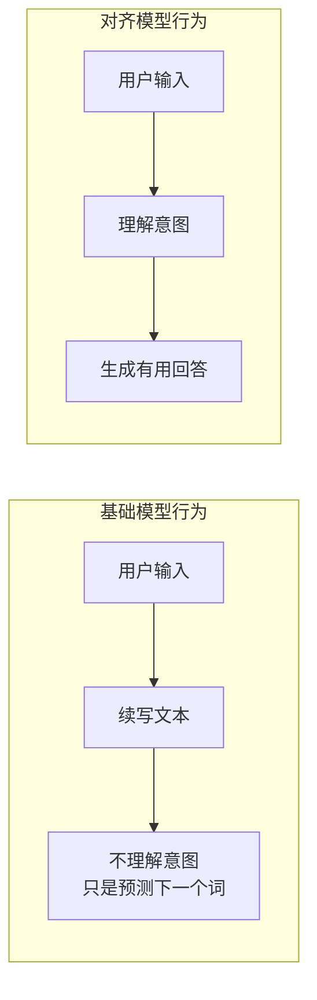
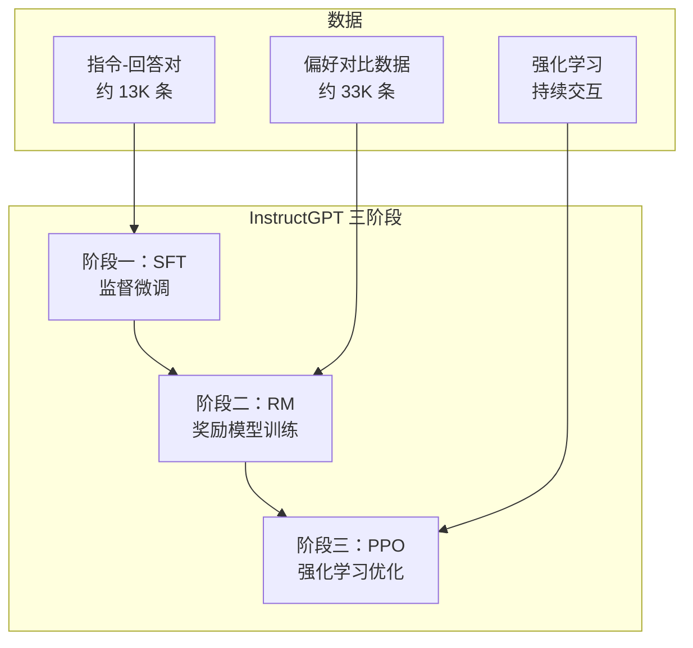
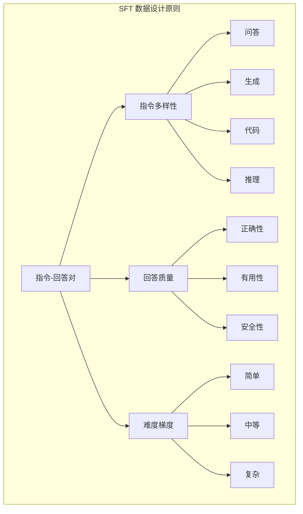
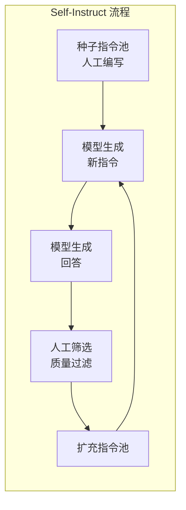
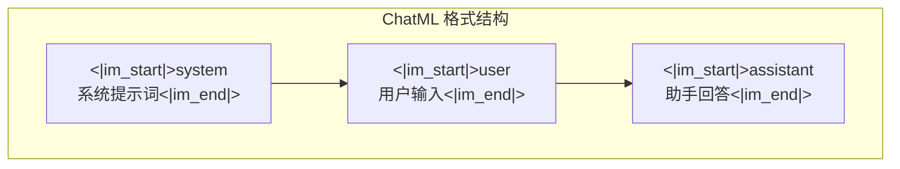
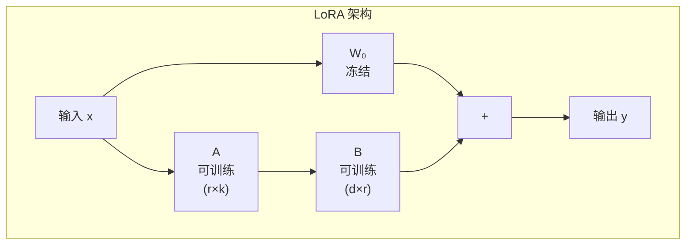

# 监督微调（SFT）——从基础模型到可用模型

在上一章中，我们探讨了分布式训练基础设施 —— 如何让数千张 GPU 协同工作，完成大语言模型的预训练。预训练赋予了模型强大的语言理解和生成能力，但一个关键问题悬而未决：预训练模型能直接使用吗？

答案是否定的。预训练模型学习的是"续写" —— 给定一段文本，预测下一个词。但用户期望的是"回答" —— 提出问题，获得有用的回复。这两种行为模式之间存在根本差异。将预训练模型转化为可用的助手，需要**监督微调**（Supervised Fine-Tuning, SFT）这一关键步骤。

本文将从基础模型与对齐模型的行为差异出发，系统介绍 SFT 的核心内容：数据构造原则、训练细节、对话格式设计，以及参数高效微调技术（LoRA/QLoRA）。这些技术共同构成了从预训练模型到可用模型的桥梁。

## 基础模型 vs 对齐模型

预训练完成后，我们得到的是一个**基础模型**（Base Model）。它具有强大的语言能力，但行为模式与用户期望的"助手"存在显著差异。

### "续写" vs "回答"的行为差异

用一个具体例子来说明这种差异。假设用户输入：

```
用户：法国的首都是哪里？
```

**基础模型的"续写"行为**：

```
用户：法国的首都是哪里？
助手：这是一个关于地理知识的问题。法国是欧洲西部的一个国家...
```

基础模型会继续"编造"对话，因为它在预训练中学到的是：对话数据通常是这样的格式。它不理解"用户"和"助手"的角色区分，只是在续写文本。

**对齐模型的"回答"行为**：

```
用户：法国的首都是哪里？
助手：法国的首都是巴黎。
```

对齐模型理解了对话的意图，知道应该提供直接、有用的回答。

这种差异的本质是：**基础模型学习的是文本的概率分布，对齐模型学习的是遵循指令的行为模式**。



### InstructGPT 的三阶段对齐框架

2022 年，OpenAI 发表的 **InstructGPT** 论文系统阐述了对齐训练的三阶段框架，成为后续所有对齐工作的基石。



**阶段一：SFT（监督微调）**

收集人类编写的指令 - 回答对，用监督学习的方式训练模型。这是最直接的"教模型如何回答"的方法。

**阶段二：RM（奖励模型训练）**

收集人类对模型输出的偏好对比（回答 A 比回答 B 更好），训练一个奖励模型来预测人类偏好。这为后续的强化学习提供了"好坏"的判断标准。

**阶段三：PPO（强化学习优化）**

用奖励模型的反馈，通过强化学习（PPO 算法）进一步优化模型。这使模型能够探索更优的回答策略，而不仅仅是模仿人类回答。

本文聚焦于**阶段一：SFT**。阶段二和三将在下一章"RLHF"中详细探讨。

### SFT 的核心作用

SFT 在对齐训练中扮演着"奠基"的角色：

**建立行为模式**：让模型理解"用户提问 → 助手回答"的交互模式，从"续写"转向"回答"。

**注入领域知识**：通过精心设计的指令数据，可以引导模型学习特定领域的知识和技能。

**提供良好初始化**：SFT 模型为后续的 RLHF 提供了一个合理的起点，使强化学习能够更快收敛。

```python runnable
import matplotlib.pyplot as plt
import numpy as np

plt.rcParams['font.sans-serif'] = ['SimHei', 'DejaVu Sans']
plt.rcParams['axes.unicode_minus'] = False

# 模拟 SFT 前后的行为差异
def simulate_base_model_response(prompt):
    """基础模型：续写行为"""
    return f"{prompt}\n助手：这是一个关于{prompt.split('？')[0][-2:]}的问题。让我来详细解释..."

def simulate_sft_model_response(prompt):
    """SFT 模型：回答行为"""
    responses = {
        "法国的首都是哪里？": "法国的首都是巴黎。",
        "Python 如何定义函数？": "在 Python 中，使用 `def` 关键字定义函数。例如：\n```python\ndef my_function(param):\n    return param * 2\n```",
        "什么是机器学习？": "机器学习是人工智能的一个分支，它使计算机能够从数据中学习规律，而无需显式编程。"
    }
    return responses.get(prompt, "我理解您的问题，让我为您解答...")

# 可视化行为差异
fig, axes = plt.subplots(1, 2, figsize=(14, 5))

# 基础模型
axes[0].text(0.5, 0.7, '基础模型（续写行为）', fontsize=14, ha='center', fontweight='bold')
axes[0].text(0.5, 0.5, '输入：法国的首都是哪里？', fontsize=11, ha='center')
axes[0].text(0.5, 0.3, '输出：法国的首都是哪里？\n助手：这是一个关于首都的问题...', 
             fontsize=10, ha='center', style='italic',
             bbox=dict(boxstyle='round', facecolor='lightcoral', alpha=0.5))
axes[0].text(0.5, 0.1, '问题：不理解对话意图，只是续写文本', fontsize=10, ha='center', color='red')
axes[0].set_xlim(0, 1)
axes[0].set_ylim(0, 1)
axes[0].axis('off')

# SFT 模型
axes[1].text(0.5, 0.7, 'SFT 模型（回答行为）', fontsize=14, ha='center', fontweight='bold')
axes[1].text(0.5, 0.5, '输入：法国的首都是哪里？', fontsize=11, ha='center')
axes[1].text(0.5, 0.3, '输出：法国的首都是巴黎。', 
             fontsize=10, ha='center', style='italic',
             bbox=dict(boxstyle='round', facecolor='lightgreen', alpha=0.5))
axes[1].text(0.5, 0.1, '优势：理解意图，提供直接有用的回答', fontsize=10, ha='center', color='green')
axes[1].set_xlim(0, 1)
axes[1].set_ylim(0, 1)
axes[1].axis('off')

plt.suptitle('SFT 前后的行为差异', fontsize=16)
plt.tight_layout()
plt.savefig('/workspace/sft_behavior_diff.png', dpi=150, bbox_inches='tight')
plt.show()

print("SFT 的核心作用：")
print("1. 建立对话行为模式：从'续写'转向'回答'")
print("2. 注入领域知识：通过指令数据引导学习")
print("3. 提供良好初始化：为 RLHF 打下基础")
```

## SFT 数据构造

SFT 的效果很大程度上取决于训练数据的质量。本节介绍指令 - 回答对的设计原则、Self-Instruct 方法，以及"数据质量优先于数量"的实践经验。

### 指令 - 回答对的设计原则

一条 SFT 数据包含两部分：**指令**（Instruction）和**回答**（Response）。设计高质量的数据需要遵循以下原则：

**原则一：指令多样性**

指令应覆盖多种任务类型，包括：
- 问答（QA）
- 文本生成
- 代码编写
- 推理任务
- 创意写作
- 信息提取

多样性确保模型具备泛化能力，而非过度拟合特定任务。

**原则二：回答质量**

回答应具备：
- **正确性**：事实准确，逻辑清晰
- **有用性**：直接回应指令，提供有价值信息
- **安全性**：避免有害、偏见内容
- **格式规范**：结构清晰，易于理解

**原则三：难度梯度**

数据应包含不同难度级别：
- 简单任务：确保基础能力
- 中等任务：覆盖常见场景
- 复杂任务：提升推理和创作能力



### Self-Instruct：自动化数据生成

高质量人工标注数据成本高昂。**Self-Instruct** 方法提出了一种自动化数据生成策略：用现有模型生成指令 - 回答对，再人工筛选。



**Self-Instruct 的关键步骤**：

1. **种子指令池**：人工编写约 175 条高质量指令作为种子
2. **指令生成**：用模型基于种子生成新指令
3. **回答生成**：用模型为新指令生成回答
4. **质量过滤**：人工筛选或自动过滤低质量数据
5. **迭代扩充**：将高质量数据加入指令池，重复上述过程

**Alpaca**（2023）是 Self-Instruct 的典型应用。斯坦福团队用 GPT-4 生成了 52K 条指令 - 回答对，仅花费约 600 美元，训练出的 Alpaca 模型在多项任务上接近 GPT-3.5 的性能。

```python runnable
import matplotlib.pyplot as plt
import numpy as np

plt.rcParams['font.sans-serif'] = ['SimHei', 'DejaVu Sans']
plt.rcParams['axes.unicode_minus'] = False

# Self-Instruct 数据生成示意
fig, ax = plt.subplots(figsize=(12, 6))

# 模拟数据量增长
iterations = range(1, 6)
seed_data = 175
growth_rate = 10  # 每轮约 10 倍增长（过滤后）

data_generated = []
data_filtered = []
current_pool = seed_data

for i in iterations:
    generated = current_pool * growth_rate
    filtered = int(generated * 0.3)  # 约 30% 通过过滤
    data_generated.append(generated)
    data_filtered.append(filtered)
    current_pool += filtered

x = np.arange(len(iterations))
width = 0.35

bars1 = ax.bar(x - width/2, data_generated, width, label='生成数据', color='steelblue', alpha=0.7)
bars2 = ax.bar(x + width/2, data_filtered, width, label='过滤后数据', color='green')

ax.set_xlabel('迭代轮次', fontsize=12)
ax.set_ylabel('数据量（条）', fontsize=12)
ax.set_title('Self-Instruct 数据生成过程', fontsize=14)
ax.set_xticks(x)
ax.set_xticklabels([f'第 {i} 轮' for i in iterations])
ax.legend()
ax.set_yscale('log')
ax.grid(True, alpha=0.3, axis='y')

# 添加数值标注
for bar, val in zip(bars2, data_filtered):
    ax.annotate(f'{val:,}', xy=(bar.get_x() + bar.get_width()/2, bar.get_height()),
                xytext=(0, 5), textcoords='offset points', ha='center', fontsize=9)

plt.tight_layout()
plt.savefig('/workspace/self_instruct.png', dpi=150, bbox_inches='tight')
plt.show()

print("Self-Instruct 关键数据：")
print(f"种子指令：{seed_data} 条")
print(f"最终数据量：{data_filtered[-1]:,} 条")
print(f"Alpaca 实际使用：52,000 条（成本约 $600）")
```

### 数据质量优先于数量

早期研究认为 SFT 数据"越多越好"。但 LLaMA-2 的实践揭示了一个关键发现：**数据质量比数量更重要**。

**LLaMA-2 的数据策略**：
- SFT 数据量：约 27,540 条（远少于早期模型的数十万条）
- 数据来源：人工编写 + 严格质量筛选
- 质量标准：正确性、有用性、安全性三重检验

**质量优先的证据**：

| 模型 | SFT 数据量 | 数据来源 | 性能 |
|:-----|:-----------|:---------|:-----|
| 早期开源模型 | 100K-1M | 自动生成 | 一般 |
| Alpaca | 52K | GPT-4 生成 | 较好 |
| LLaMA-2 Chat | 27K | 人工编写 + 筛选 | 优秀 |

```python runnable
import matplotlib.pyplot as plt
import numpy as np

plt.rcParams['font.sans-serif'] = ['SimHei', 'DejaVu Sans']
plt.rcParams['axes.unicode_minus'] = False

# 数据量 vs 质量的影响
fig, ax = plt.subplots(figsize=(10, 6))

# 模拟实验数据
data_sizes = [10, 50, 100, 500, 1000, 5000, 10000, 50000, 100000]

# 不同质量数据的学习曲线
def learning_curve(size, quality):
    """模拟不同质量数据的学习曲线"""
    if quality == 'high':
        return 90 * (1 - np.exp(-size / 5000)) + 5
    elif quality == 'medium':
        return 75 * (1 - np.exp(-size / 20000)) + 5
    else:  # low quality
        return 60 * (1 - np.exp(-size / 50000)) + 5

high_quality = [learning_curve(s, 'high') for s in data_sizes]
medium_quality = [learning_curve(s, 'medium') for s in data_sizes]
low_quality = [learning_curve(s, 'low') for s in data_sizes]

ax.semilogx(data_sizes, high_quality, 'g-', linewidth=2, marker='o', label='高质量数据（人工编写）')
ax.semilogx(data_sizes, medium_quality, 'b-', linewidth=2, marker='s', label='中等质量（模型生成+筛选）')
ax.semilogx(data_sizes, low_quality, 'r-', linewidth=2, marker='^', label='低质量数据（自动生成）')

# 标注关键点
ax.axvline(x=27540, color='green', linestyle='--', alpha=0.5)
ax.annotate('LLaMA-2 SFT\n(27K 高质量)', xy=(27540, 85), 
            xytext=(50000, 88), fontsize=10, color='green',
            arrowprops=dict(arrowstyle='->', color='green'))

ax.axvline(x=52000, color='blue', linestyle='--', alpha=0.5)
ax.annotate('Alpaca\n(52K 中等质量)', xy=(52000, 70), 
            xytext=(80000, 65), fontsize=10, color='blue',
            arrowprops=dict(arrowstyle='->', color='blue'))

ax.set_xlabel('SFT 数据量（条）', fontsize=12)
ax.set_ylabel('模型性能（相对分数）', fontsize=12)
ax.set_title('数据质量 vs 数量：高质量小数据优于低质量大数据', fontsize=14)
ax.legend()
ax.grid(True, alpha=0.3)
ax.set_ylim(0, 100)

plt.tight_layout()
plt.savefig('/workspace/quality_vs_quantity.png', dpi=150, bbox_inches='tight')
plt.show()

print("数据质量优先原则：")
print("1. 高质量数据：人工编写，严格筛选，少量即可达到高性能")
print("2. 中等质量数据：模型生成 + 人工筛选，需要更多数据量")
print("3. 低质量数据：自动生成，数据量再多也难以达到高性能")
print()
print("实践建议：优先保证数据质量，而非盲目追求数据量")
```

## SFT 训练细节

理解了数据构造之后，本节介绍 SFT 训练的具体细节：学习率选择、训练 epoch 数、数据格式与特殊标记。

### 学习率选择

SFT 的学习率通常远小于预训练。原因在于：

**预训练**：从随机初始化开始，需要大学习率快速学习语言知识。

**SFT**：基于预训练模型，已有良好的语言能力，只需微调行为模式，大学习率可能导致"遗忘"预训练知识。

**典型学习率范围**：
- 预训练：$10^{-4}$ 到 $10^{-3}$
- SFT：$10^{-5}$ 到 $10^{-4}$（通常为预训练的 1/10 到 1/100）

**学习率调度**：
- 线性预热（Warmup）：前 5-10% 步数逐渐增加学习率
- 余弦衰减：训练后期逐渐降低学习率

```python runnable
import numpy as np
import matplotlib.pyplot as plt

plt.rcParams['font.sans-serif'] = ['SimHei', 'DejaVu Sans']
plt.rcParams['axes.unicode_minus'] = False

def cosine_schedule(step, total_steps, warmup_steps, max_lr, min_lr):
    """余弦学习率调度"""
    if step < warmup_steps:
        return max_lr * step / warmup_steps
    else:
        progress = (step - warmup_steps) / (total_steps - warmup_steps)
        return min_lr + 0.5 * (max_lr - min_lr) * (1 + np.cos(np.pi * progress))

# 预训练 vs SFT 学习率对比
total_steps = 1000
warmup_steps = 50

# 预训练学习率
pretrain_lr = [cosine_schedule(s, total_steps, warmup_steps, 1e-3, 1e-5) for s in range(total_steps)]

# SFT 学习率（1/10）
sft_lr = [cosine_schedule(s, total_steps, warmup_steps, 1e-4, 1e-6) for s in range(total_steps)]

fig, ax = plt.subplots(figsize=(10, 6))

ax.plot(range(total_steps), pretrain_lr, 'b-', linewidth=2, label='预训练 (max=1e-3)')
ax.plot(range(total_steps), sft_lr, 'g-', linewidth=2, label='SFT (max=1e-4)')

ax.axvline(x=warmup_steps, color='red', linestyle='--', alpha=0.5, label='Warmup 结束')

ax.set_xlabel('训练步数', fontsize=12)
ax.set_ylabel('学习率', fontsize=12)
ax.set_title('预训练 vs SFT 学习率对比', fontsize=14)
ax.legend()
ax.set_yscale('log')
ax.grid(True, alpha=0.3)

plt.tight_layout()
plt.savefig('/workspace/sft_learning_rate.png', dpi=150, bbox_inches='tight')
plt.show()

print("学习率选择原则：")
print("1. SFT 学习率通常为预训练的 1/10 到 1/100")
print("2. 避免过大学习率导致'灾难性遗忘'")
print("3. 使用预热和衰减策略稳定训练")
```

### 训练 Epoch 数

SFT 的训练 epoch 数通常很少，一般为 1-3 个 epoch。

**为什么不能训练太久？**

**过拟合风险**：SFT 数据量相对较小（万级 vs 预训练的万亿级），训练太久容易过拟合，模型会"背诵"训练数据而非学习通用能力。

**遗忘风险**：长时间训练可能导致模型遗忘预训练学到的知识，性能反而下降。

**实践经验**：
- 1 epoch：适合数据质量极高的情况
- 2-3 epoch：常见选择，平衡学习与遗忘
- > 5 epoch：通常不推荐，过拟合风险高

```python runnable
import numpy as np
import matplotlib.pyplot as plt

plt.rcParams['font.sans-serif'] = ['SimHei', 'DejaVu Sans']
plt.rcParams['axes.unicode_minus'] = False

# 模拟训练 epoch 数与性能的关系
epochs = np.arange(1, 11)

def performance_vs_epoch(epoch, data_quality='high'):
    """模拟性能随 epoch 变化"""
    if data_quality == 'high':
        # 高质量数据：快速收敛，后期轻微下降
        train_perf = 95 * (1 - np.exp(-epoch / 1.5))
        val_perf = 90 * (1 - np.exp(-epoch / 2)) - 2 * max(0, epoch - 3)
    else:
        # 低质量数据：收敛慢，后期明显过拟合
        train_perf = 85 * (1 - np.exp(-epoch / 3))
        val_perf = 75 * (1 - np.exp(-epoch / 4)) - 5 * max(0, epoch - 2)
    return train_perf, val_perf

train_high, val_high = zip(*[performance_vs_epoch(e, 'high') for e in epochs])
train_low, val_low = zip(*[performance_vs_epoch(e, 'low') for e in epochs])

fig, axes = plt.subplots(1, 2, figsize=(14, 5))

# 高质量数据
axes[0].plot(epochs, train_high, 'b-o', linewidth=2, label='训练集')
axes[0].plot(epochs, val_high, 'g-s', linewidth=2, label='验证集')
axes[0].axvline(x=3, color='red', linestyle='--', alpha=0.5)
axes[0].annotate('最优停止点', xy=(3, 85), xytext=(5, 88), fontsize=10,
                arrowprops=dict(arrowstyle='->', color='red'))
axes[0].set_xlabel('训练 Epoch 数', fontsize=12)
axes[0].set_ylabel('性能分数', fontsize=12)
axes[0].set_title('高质量数据：2-3 epoch 最优', fontsize=12)
axes[0].legend()
axes[0].grid(True, alpha=0.3)

# 低质量数据
axes[1].plot(epochs, train_low, 'b-o', linewidth=2, label='训练集')
axes[1].plot(epochs, val_low, 'g-s', linewidth=2, label='验证集')
axes[1].axvline(x=2, color='red', linestyle='--', alpha=0.5)
axes[1].annotate('最优停止点', xy=(2, 65), xytext=(4, 70), fontsize=10,
                arrowprops=dict(arrowstyle='->', color='red'))
axes[1].set_xlabel('训练 Epoch 数', fontsize=12)
axes[1].set_ylabel('性能分数', fontsize=12)
axes[1].set_title('低质量数据：更早停止', fontsize=12)
axes[1].legend()
axes[1].grid(True, alpha=0.3)

plt.suptitle('SFT 训练 Epoch 数选择', fontsize=14)
plt.tight_layout()
plt.savefig('/workspace/sft_epochs.png', dpi=150, bbox_inches='tight')
plt.show()

print("Epoch 数选择原则：")
print("1. 高质量数据：2-3 epoch 通常足够")
print("2. 低质量数据：更早停止，避免过拟合")
print("3. 监控验证集性能，及时停止训练")
```

### 数据格式与特殊标记

SFT 数据需要格式化为模型可理解的形式。现代 LLM 普遍采用**对话格式**，使用特殊标记区分不同角色。

**典型格式**：

```
<|im_start|>system
你是一个有帮助的AI助手。
<|im_end|>
<|im_start|>user
法国的首都是哪里？
<|im_end|>
<|im_start|>assistant
法国的首都是巴黎。
<|im_end|>
```

**关键元素**：
- **系统提示词**（System Prompt）：定义模型的角色和行为准则
- **用户输入**（User Input）：用户的问题或指令
- **助手回答**（Assistant Response）：模型应生成的回答
- **特殊标记**：区分不同部分，如 `<|im_start|>` 和 `<|im_end|>`

下一节将详细介绍对话格式设计。

## 对话格式设计

对话格式是 SFT 数据的核心结构。良好的格式设计能让模型清晰理解对话上下文，生成连贯的回复。

### ChatML 格式

**ChatML**（Chat Markup Language）是 OpenAI 提出的对话格式标准，被广泛采用。



**格式规范**：
- 每条消息以 `<|im_start|>{role}` 开始
- 消息内容紧随其后
- 以 `<|im_end|>` 结束
- 角色包括：`system`、`user`、`assistant`

**多轮对话示例**：

```
<|im_start|>system
你是一个有帮助的AI助手，专注于回答编程问题。
<|im_end|>
<|im_start|>user
Python 如何读取文件？
<|im_end|>
<|im_start|>assistant
在 Python 中，可以使用 `open()` 函数读取文件。推荐使用 `with` 语句确保文件正确关闭：

```python
with open('file.txt', 'r') as f:
    content = f.read()
```
<|im_end|>
<|im_start|>user
如何逐行读取？
<|im_end|>
<|im_start|>assistant
逐行读取可以使用 `for` 循环：

```python
with open('file.txt', 'r') as f:
    for line in f:
        print(line.strip())
```
<|im_end|>
```

### 特殊标记的作用

特殊标记（如 `<|im_start|>` 和 `<|im_end|>`）在对话格式中扮演关键角色：

**分隔消息**：明确区分不同角色的消息，避免混淆。

**标记边界**：帮助模型识别消息的开始和结束，生成更规范的输出。

**支持多轮**：在多轮对话中，特殊标记帮助模型理解对话历史。

**不同模型的特殊标记**：

| 模型 | 开始标记 | 结束标记 |
|:-----|:---------|:---------|
| ChatML (OpenAI) | `<|im_start|>` | `<|im_end|>` |
| LLaMA | `<|begin_of_text|>` | `<|end_of_text|>` |
| Claude | `\n\nHuman:` | `\n\nAssistant:` |

```python runnable
def format_chatml(system_prompt, messages):
    """格式化对话为 ChatML 格式"""
    formatted = f"<|im_start|>system\n{system_prompt}<|im_end|>\n"
    
    for role, content in messages:
        formatted += f"<|im_start|>{role}\n{content}<|im_end|>\n"
    
    return formatted

# 示例
system_prompt = "你是一个有帮助的AI助手。"
messages = [
    ("user", "什么是机器学习？"),
    ("assistant", "机器学习是人工智能的一个分支，使计算机能够从数据中学习。"),
    ("user", "它有哪些应用？"),
]

formatted = format_chatml(system_prompt, messages)
print("ChatML 格式示例：")
print("-" * 50)
print(formatted)
print("-" * 50)

# 计算 token 数（简化估计）
def estimate_tokens(text):
    """简化 token 估计（英文约 4 字符/token，中文约 1.5 字符/token）"""
    chinese_chars = sum(1 for c in text if '一' <= c <= '鿿')
    other_chars = len(text) - chinese_chars
    return int(chinese_chars / 1.5 + other_chars / 4)

print(f"\n估计 token 数：{estimate_tokens(formatted)}")
```

### 系统提示词设计

**系统提示词**（System Prompt）定义了模型的角色、行为准则和能力边界。精心设计的系统提示词能显著提升模型表现。

**设计原则**：

**明确角色**：定义模型是什么（如"AI 助手"、"编程专家"、"翻译助手"）

**设定边界**：明确模型应该做什么、不应该做什么

**提供指导**：给出回答风格、格式要求等

**示例系统提示词**：

```
你是一个专业的编程助手。你的任务是：
1. 回答编程相关问题，提供清晰、准确的代码示例
2. 解释代码的工作原理
3. 指出潜在的 bug 和改进建议
4. 保持回答简洁，避免冗余

如果问题超出编程范围，请礼貌地说明你的专长领域。
```

```python runnable
import matplotlib.pyplot as plt
import numpy as np

plt.rcParams['font.sans-serif'] = ['SimHei', 'DejaVu Sans']
plt.rcParams['axes.unicode_minus'] = False

# 系统提示词对性能的影响（模拟数据）
categories = ['回答准确性', '格式规范性', '安全性', '角色一致性']

without_system = [70, 60, 65, 55]
with_basic_system = [80, 75, 80, 70]
with_detailed_system = [90, 88, 92, 85]

x = np.arange(len(categories))
width = 0.25

fig, ax = plt.subplots(figsize=(12, 6))

bars1 = ax.bar(x - width, without_system, width, label='无系统提示词', color='coral')
bars2 = ax.bar(x, with_basic_system, width, label='基础系统提示词', color='steelblue')
bars3 = ax.bar(x + width, with_detailed_system, width, label='详细系统提示词', color='green')

ax.set_ylabel('性能分数', fontsize=12)
ax.set_title('系统提示词对模型性能的影响', fontsize=14)
ax.set_xticks(x)
ax.set_xticklabels(categories)
ax.legend()
ax.set_ylim(0, 100)
ax.grid(True, alpha=0.3, axis='y')

plt.tight_layout()
plt.savefig('/workspace/system_prompt_impact.png', dpi=150, bbox_inches='tight')
plt.show()

print("系统提示词设计要点：")
print("1. 明确角色：定义模型是什么")
print("2. 设定边界：应该做什么、不应该做什么")
print("3. 提供指导：回答风格、格式要求")
print("4. 详细提示词能显著提升模型表现")
```

## 参数高效微调：LoRA 与 QLoRA

全参数微调（Full Fine-Tuning）需要更新模型的所有参数，对于大模型（如 70B）来说，计算和存储成本极高。**参数高效微调**（Parameter-Efficient Fine-Tuning, PEFT）技术通过只更新少量参数，大幅降低了微调成本。

### LoRA：低秩适配

**LoRA**（Low-Rank Adaptation）是 PEFT 中最流行的技术。其核心思想是：模型微调时，参数变化量是"低秩"的，可以用两个小矩阵近似。

**数学原理**：

假设预训练权重矩阵为 $W_0 \in \mathbb{R}^{d \times k}$，微调后的权重为 $W = W_0 + \Delta W$。

LoRA 假设 $\Delta W$ 可以分解为两个低秩矩阵的乘积：

$$\Delta W = B A$$

其中 $B \in \mathbb{R}^{d \times r}$，$A \in \mathbb{R}^{r \times k}$，$r \ll \min(d, k)$ 是秩。

**参数量对比**：
- 全参数微调：$d \times k$ 个参数
- LoRA：$d \times r + r \times k$ 个参数

当 $r \ll d, k$ 时，LoRA 的参数量远小于全参数微调。



**前向传播**：

$$h = W_0 x + \Delta W x = W_0 x + B A x$$

训练时，$W_0$ 保持冻结，只更新 $A$ 和 $B$。

**初始化策略**：
- $A$ 使用随机高斯初始化
- $B$ 初始化为零，确保训练初期 $\Delta W = 0$，模型行为与预训练模型一致

```python runnable
import torch
import torch.nn as nn
import torch.nn.functional as F

class LoRALinear(nn.Module):
    """LoRA 线性层实现"""
    def __init__(self, in_features, out_features, rank=8, alpha=16):
        super().__init__()
        # 原始权重（冻结）
        self.weight = nn.Parameter(torch.randn(out_features, in_features), requires_grad=False)
        self.bias = nn.Parameter(torch.zeros(out_features), requires_grad=False)
        
        # LoRA 参数（可训练）
        self.lora_A = nn.Parameter(torch.randn(rank, in_features) * 0.01)
        self.lora_B = nn.Parameter(torch.zeros(out_features, rank))
        
        # 缩放因子
        self.scaling = alpha / rank
        
    def forward(self, x):
        # 原始线性变换
        result = F.linear(x, self.weight, self.bias)
        
        # LoRA 增量
        lora_output = (x @ self.lora_A.T) @ self.lora_B.T
        result = result + lora_output * self.scaling
        
        return result

# 参数量对比
d, k, r = 4096, 4096, 8  # 典型 LLM 参数

full_params = d * k
lora_params = d * r + r * k

print("LoRA 参数量对比：")
print(f"原始权重维度：{d} × {k}")
print(f"LoRA 秩：{r}")
print(f"全参数微调：{full_params:,} 参数")
print(f"LoRA：{lora_params:,} 参数")
print(f"参数量减少：{(1 - lora_params/full_params)*100:.2f}%")

# 演示 LoRA 效果
torch.manual_seed(42)
lora_layer = LoRALinear(64, 128, rank=4)
x = torch.randn(2, 10, 64)  # batch=2, seq=10, dim=64

output = lora_layer(x)
print(f"\n输入形状：{x.shape}")
print(f"输出形状：{output.shape}")

# 可训练参数
trainable = sum(p.numel() for p in lora_layer.parameters() if p.requires_grad)
total = sum(p.numel() for p in lora_layer.parameters())
print(f"可训练参数：{trainable:,} / {total:,} ({trainable/total*100:.1f}%)")
```

### QLoRA：量化 + LoRA

**QLoRA**（Quantized LoRA）进一步降低了微调的显存需求。其核心创新是：将预训练模型量化为 4-bit，然后应用 LoRA 微调。

**关键技术**：

**4-bit NormalFloat **(NF4)：专门为正态分布权重设计的量化格式，比标准 4-bit 量化更精确。

**双重量化**：对量化常数再次量化，进一步减少显存。

**分页优化器**：使用 CPU 内存作为 GPU 显存的溢出缓冲区。

**显存对比**：

| 方法 | 7B 模型显存 | 65B 模型显存 |
|:-----|:------------|:-------------|
| 全参数微调 (FP16) | ~120 GB | ~800 GB |
| LoRA (FP16) | ~16 GB | ~120 GB |
| QLoRA (4-bit) | ~6 GB | ~48 GB |

QLoRA 使得在单张消费级 GPU（如 RTX 3090 24GB）上微调 7B 模型成为可能。

```python runnable
import matplotlib.pyplot as plt
import numpy as np

plt.rcParams['font.sans-serif'] = ['SimHei', 'DejaVu Sans']
plt.rcParams['axes.unicode_minus'] = False

# 不同微调方法的显存需求对比
model_sizes = [7, 13, 30, 65]  # B

def memory_full_ft(size):
    """全参数微调显存（FP16）"""
    # 参数 + 梯度 + 优化器状态
    return size * 16  # 约 16 bytes/参数

def memory_lora(size, rank_ratio=0.001):
    """LoRA 显存（FP16）"""
    # 只需存储 LoRA 参数的梯度和优化器状态
    # 加上模型参数（FP16）
    base = size * 2  # 模型参数
    lora = size * rank_ratio * 16  # LoRA 参数 + 梯度 + 优化器
    return base + lora

def memory_qlora(size):
    """QLoRA 显存（4-bit）"""
    # 模型参数 4-bit + LoRA 参数 FP16
    base = size * 0.5  # 4-bit 模型参数
    lora = size * 0.001 * 16  # LoRA 参数
    return base + lora

fig, ax = plt.subplots(figsize=(10, 6))

x = np.arange(len(model_sizes))
width = 0.25

full_ft = [memory_full_ft(s) for s in model_sizes]
lora = [memory_lora(s) for s in model_sizes]
qlora = [memory_qlora(s) for s in model_sizes]

bars1 = ax.bar(x - width, full_ft, width, label='全参数微调 (FP16)', color='coral')
bars2 = ax.bar(x, lora, width, label='LoRA (FP16)', color='steelblue')
bars3 = ax.bar(x + width, qlora, width, label='QLoRA (4-bit)', color='green')

# 添加 GPU 参考线
ax.axhline(y=24, color='orange', linestyle='--', linewidth=2, label='RTX 3090 (24GB)')
ax.axhline(y=80, color='red', linestyle='--', linewidth=2, label='A100 (80GB)')

ax.set_xlabel('模型规模（B 参数）', fontsize=12)
ax.set_ylabel('显存需求（GB）', fontsize=12)
ax.set_title('不同微调方法的显存需求对比', fontsize=14)
ax.set_xticks(x)
ax.set_xticklabels([f'{s}B' for s in model_sizes])
ax.legend()
ax.set_yscale('log')
ax.grid(True, alpha=0.3, axis='y')

plt.tight_layout()
plt.savefig('/workspace/finetuning_memory.png', dpi=150, bbox_inches='tight')
plt.show()

print("微调方法选择建议：")
print("1. 全参数微调：性能最优，但需要大量显存")
print("2. LoRA：性能接近全参数微调，显存需求大幅降低")
print("3. QLoRA：显存需求最低，可在消费级 GPU 上运行")
print()
print("QLoRA 使单卡 RTX 3090 微调 7B 模型成为可能！")
```

### 全参数微调 vs PEFT 的适用场景

| 场景 | 推荐方法 | 理由 |
|:-----|:---------|:-----|
| 大规模领域适配 | 全参数微调 | 需要最大程度改变模型行为 |
| 通用指令微调 | LoRA | 性能接近全参数，成本更低 |
| 资源受限环境 | QLoRA | 显存需求最低 |
| 多任务适配 | LoRA | 可为每个任务训练独立的 LoRA 模块 |
| 快速实验迭代 | LoRA/QLoRA | 训练快，易于切换不同配置 |

## 实验：LoRA 微调演示

本节通过一个简化的实验，演示 LoRA 微调的效果。我们使用一个小型 Transformer 模型，对比全参数微调和 LoRA 微调的性能与效率。

```python runnable
import torch
import torch.nn as nn
import torch.nn.functional as F
from torch.utils.data import Dataset, DataLoader
import matplotlib.pyplot as plt
import numpy as np
import time

plt.rcParams['font.sans-serif'] = ['SimHei', 'DejaVu Sans']
plt.rcParams['axes.unicode_minus'] = False

# 设置随机种子
torch.manual_seed(42)
np.random.seed(42)

# ==================== 模型定义 ====================

class SimpleTransformer(nn.Module):
    """简化的 Transformer 模型"""
    def __init__(self, vocab_size=1000, d_model=128, nhead=4, num_layers=2):
        super().__init__()
        self.embedding = nn.Embedding(vocab_size, d_model)
        self.pos_encoding = nn.Parameter(torch.randn(1, 512, d_model) * 0.01)
        
        encoder_layer = nn.TransformerEncoderLayer(d_model, nhead, d_model * 4, batch_first=True)
        self.transformer = nn.TransformerEncoder(encoder_layer, num_layers)
        
        self.output = nn.Linear(d_model, vocab_size)
        
    def forward(self, x):
        seq_len = x.size(1)
        x = self.embedding(x) + self.pos_encoding[:, :seq_len, :]
        x = self.transformer(x)
        return self.output(x)

class LoRALinear(nn.Module):
    """LoRA 线性层"""
    def __init__(self, original_linear, rank=8, alpha=16):
        super().__init__()
        self.weight = original_linear.weight
        self.bias = original_linear.bias
        
        in_features = original_linear.in_features
        out_features = original_linear.out_features
        
        self.lora_A = nn.Parameter(torch.randn(rank, in_features) * 0.01)
        self.lora_B = nn.Parameter(torch.zeros(out_features, rank))
        self.scaling = alpha / rank
        
    def forward(self, x):
        result = F.linear(x, self.weight, self.bias)
        result = result + (x @ self.lora_A.T @ self.lora_B.T) * self.scaling
        return result

def apply_lora_to_model(model, rank=8, target_modules=['output']):
    """将 LoRA 应用到模型的指定模块"""
    for name, module in model.named_modules():
        if any(target in name for target in target_modules):
            if isinstance(module, nn.Linear):
                # 替换为 LoRA 层
                parent_name = '.'.join(name.split('.')[:-1])
                child_name = name.split('.')[-1]
                parent = model.get_submodule(parent_name) if parent_name else model
                setattr(parent, child_name, LoRALinear(module, rank=rank))
    return model

# ==================== 数据生成 ====================

class SimpleDataset(Dataset):
    """简单的指令-回答数据集"""
    def __init__(self, num_samples=1000, seq_len=32, vocab_size=1000):
        self.data = []
        for _ in range(num_samples):
            # 模拟指令（前半部分）和回答（后半部分）
            instruction = torch.randint(1, vocab_size//2, (seq_len//2,))
            response = torch.randint(vocab_size//2, vocab_size, (seq_len//2,))
            self.data.append(torch.cat([instruction, response]))
        
    def __len__(self):
        return len(self.data)
    
    def __getitem__(self, idx):
        x = self.data[idx][:-1]
        y = self.data[idx][1:]
        return x, y

# ==================== 训练函数 ====================

def train_model(model, dataloader, epochs=3, lr=1e-4, freeze_base=False):
    """训练模型"""
    if freeze_base:
        # 冻结基础模型参数
        for name, param in model.named_parameters():
            if 'lora' not in name:
                param.requires_grad = False
    
    optimizer = torch.optim.AdamW(filter(lambda p: p.requires_grad, model.parameters()), lr=lr)
    criterion = nn.CrossEntropyLoss()
    
    losses = []
    start_time = time.time()
    
    for epoch in range(epochs):
        epoch_loss = 0
        for batch_x, batch_y in dataloader:
            optimizer.zero_grad()
            output = model(batch_x)
            loss = criterion(output.view(-1, output.size(-1)), batch_y.view(-1))
            loss.backward()
            optimizer.step()
            epoch_loss += loss.item()
        
        avg_loss = epoch_loss / len(dataloader)
        losses.append(avg_loss)
        print(f"Epoch {epoch+1}/{epochs}, Loss: {avg_loss:.4f}")
    
    training_time = time.time() - start_time
    
    # 计算可训练参数量
    trainable_params = sum(p.numel() for p in model.parameters() if p.requires_grad)
    total_params = sum(p.numel() for p in model.parameters())
    
    return losses, training_time, trainable_params, total_params

# ==================== 主实验 ====================

print("=" * 60)
print("LoRA 微调实验")
print("=" * 60)

# 创建数据集
vocab_size = 1000
dataset = SimpleDataset(num_samples=500, seq_len=32, vocab_size=vocab_size)
dataloader = DataLoader(dataset, batch_size=32, shuffle=True)

# 实验 1：全参数微调
print("\n【实验 1：全参数微调】")
model_full = SimpleTransformer(vocab_size=vocab_size)
losses_full, time_full, params_full, total_full = train_model(
    model_full, dataloader, epochs=5, lr=1e-4, freeze_base=False
)

# 实验 2：LoRA 微调
print("\n【实验 2：LoRA 微调 (rank=8)】")
model_lora = SimpleTransformer(vocab_size=vocab_size)
model_lora = apply_lora_to_model(model_lora, rank=8, target_modules=['output'])
losses_lora, time_lora, params_lora, total_lora = train_model(
    model_lora, dataloader, epochs=5, lr=1e-4, freeze_base=True
)

# ==================== 结果可视化 ====================

fig, axes = plt.subplots(1, 3, figsize=(15, 5))

# 训练损失对比
axes[0].plot(range(1, 6), losses_full, 'b-o', linewidth=2, label='全参数微调')
axes[0].plot(range(1, 6), losses_lora, 'g-s', linewidth=2, label='LoRA 微调')
axes[0].set_xlabel('Epoch', fontsize=12)
axes[0].set_ylabel('训练损失', fontsize=12)
axes[0].set_title('训练损失对比', fontsize=14)
axes[0].legend()
axes[0].grid(True, alpha=0.3)

# 参数量对比
methods = ['全参数微调', 'LoRA 微调']
params = [params_full, params_lora]
colors = ['steelblue', 'green']

bars = axes[1].bar(methods, params, color=colors)
axes[1].set_ylabel('可训练参数量', fontsize=12)
axes[1].set_title('可训练参数量对比', fontsize=14)
for bar, p in zip(bars, params):
    axes[1].annotate(f'{p:,}', xy=(bar.get_x() + bar.get_width()/2, bar.get_height()),
                     xytext=(0, 5), textcoords='offset points', ha='center', fontsize=11)
axes[1].set_yscale('log')
axes[1].grid(True, alpha=0.3, axis='y')

# 训练时间对比
times = [time_full, time_lora]
bars = axes[2].bar(methods, times, color=colors)
axes[2].set_ylabel('训练时间（秒）', fontsize=12)
axes[2].set_title('训练时间对比', fontsize=14)
for bar, t in zip(bars, times):
    axes[2].annotate(f'{t:.2f}s', xy=(bar.get_x() + bar.get_width()/2, bar.get_height()),
                     xytext=(0, 5), textcoords='offset points', ha='center', fontsize=11)
axes[2].grid(True, alpha=0.3, axis='y')

plt.suptitle('LoRA 微调 vs 全参数微调', fontsize=16)
plt.tight_layout()
plt.savefig('/workspace/lora_experiment.png', dpi=150, bbox_inches='tight')
plt.show()

# 打印总结
print("\n" + "=" * 60)
print("实验总结")
print("=" * 60)
print(f"\n全参数微调：")
print(f"  - 可训练参数：{params_full:,}")
print(f"  - 训练时间：{time_full:.2f}s")
print(f"  - 最终损失：{losses_full[-1]:.4f}")

print(f"\nLoRA 微调：")
print(f"  - 可训练参数：{params_lora:,} ({params_lora/params_full*100:.1f}%)")
print(f"  - 训练时间：{time_lora:.2f}s ({time_lora/time_full*100:.1f}%)")
print(f"  - 最终损失：{losses_lora[-1]:.4f}")

print(f"\n结论：")
print(f"  - LoRA 参数量仅为全参数微调的 {params_lora/params_full*100:.1f}%")
print(f"  - 训练时间减少 {(1-time_lora/time_full)*100:.1f}%")
print(f"  - 性能损失：{(losses_lora[-1]-losses_full[-1])/losses_full[-1]*100:.1f}%")
print(f"  - LoRA 在大幅降低成本的同时，保持了接近全参数微调的性能")
```

## 小结

本文系统介绍了监督微调（SFT）的核心内容：

**基础模型 vs 对齐模型**：
- 基础模型学习"续写"，对齐模型学习"回答"
- InstructGPT 三阶段框架：SFT → RM → PPO
- SFT 是对齐训练的基石

**SFT 数据构造**：
- 指令多样性、回答质量、难度梯度三大原则
- Self-Instruct 自动化数据生成
- 数据质量优先于数量

**SFT 训练细节**：
- 学习率：预训练的 1/10 到 1/100
- Epoch 数：1-3 个，避免过拟合
- 数据格式：ChatML 格式，特殊标记区分角色

**对话格式设计**：
- ChatML 格式：`<|im_start|>{role}\n{content}<|im_end|>`
- 系统提示词定义模型角色和行为准则

**参数高效微调**：
- LoRA：低秩适配，参数量减少 99%+
- QLoRA：量化 + LoRA，显存需求进一步降低
- 适用场景：资源受限环境、多任务适配、快速迭代

SFT 将预训练模型转化为可用的助手，是对齐训练的第一步。下一章将探讨 RLHF——如何通过人类反馈强化学习，进一步提升模型的对齐程度。

---

## 练习题

**1. 理论推导**

推导 LoRA 的参数量：给定权重矩阵 $W \in \mathbb{R}^{d \times k}$，秩为 $r$，计算 LoRA 的参数量，并与全参数微调对比。

**2. 数据设计**

设计一个 SFT 数据集，包含 5 种不同类型的指令（问答、生成、代码、推理、创意写作），每类给出 2 条示例数据。

**3. 训练策略分析**

分析以下场景应选择全参数微调还是 LoRA：
- 在特定领域（如医疗）深度适配模型
- 在消费级 GPU 上微调 7B 模型
- 为多个不同任务训练适配器

**4. 编程实现**

实现一个完整的 SFT 训练流程：
- 加载预训练模型
- 准备 ChatML 格式的对话数据
- 应用 LoRA 微调
- 评估模型性能

**5. 格式设计**

为以下对话设计 ChatML 格式的训练数据：
- 系统提示词：你是一个编程助手
- 用户：如何实现快速排序？
- 助手：[你的回答]

---

## 参考资料

1. **InstructGPT 论文**: "Training Language Models to Follow Instructions with Human Feedback" (Ouyang et al., 2022)
2. **Self-Instruct 论文**: "Self-Instruct: Aligning Language Models with Self-Generated Instructions" (Wang et al., 2023)
3. **Alpaca 项目**: Stanford Alpaca (2023)
4. **LLaMA-2 论文**: "Llama 2: Open Foundation and Fine-Tuned Chat Models" (Touvron et al., 2023)
5. **LoRA 论文**: "LoRA: Low-Rank Adaptation of Large Language Models" (Hu et al., 2021)
6. **QLoRA 论文**: "QLoRA: Efficient Finetuning of Quantized LLMs" (Dettmers et al., 2023)
7. **ChatML 格式**: OpenAI Chat Markup Language Documentation
8. **PEFT 库**: Hugging Face PEFT (Parameter-Efficient Fine-Tuning) Library
