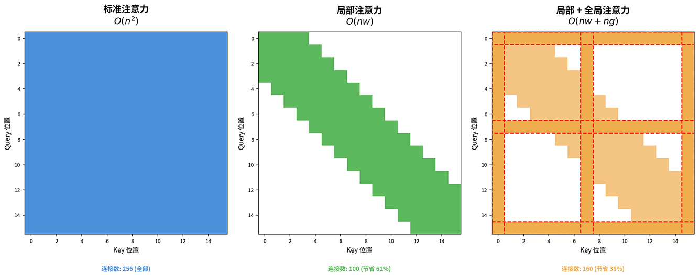
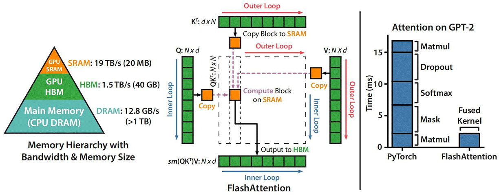
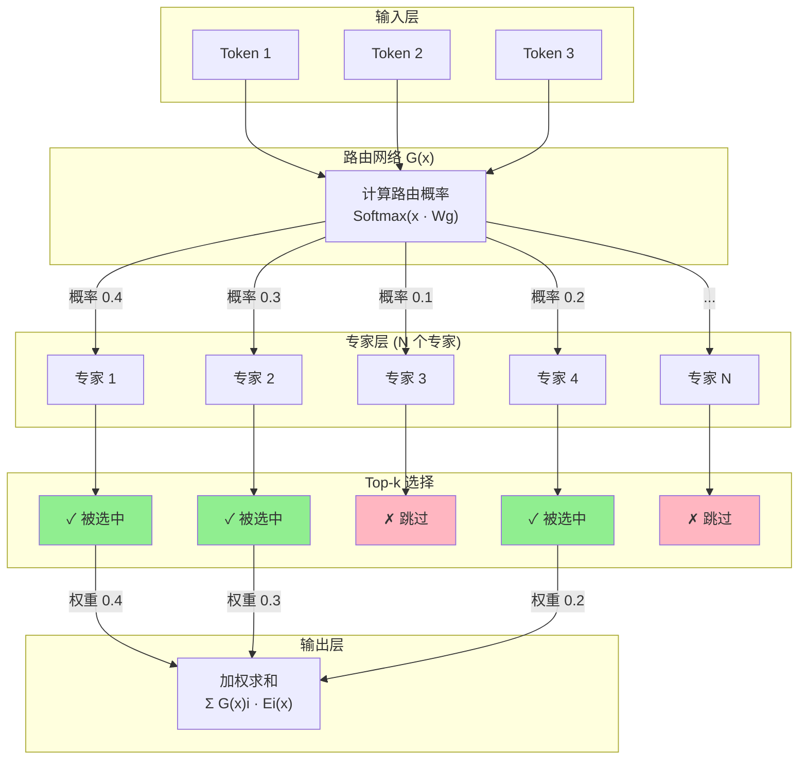

# Transformer 演进与变体

上一章介绍了 Transformer 架构的诞生，自注意力机制取代了 RNN 的序列依赖，实现了真正的并行计算。即便如此，论文原版的 Transformer 远未达到完美的程度，如 $O(n^2)$ 的注意力复杂度在长序列上代价高昂，模型参数效率偏低造成千亿规模下的巨大浪费，固定的上下文窗口限制了模型处理长文本的能力，等等，都有很大的提升空间。

Transformer 诞生后的将近十年里，学术界与工业界从多个方向对原始架构进行了改进。本章将梳理这些改进所产生的主要技术变体，涵盖混合注意力架构、Flash Attention 的 I/O 优化、MoE 的稀疏激活、MQA/GQA/TPA 的 KV 缓存优化、 RoPE 的位置编码扩展与 RMSNorm/SwiGLU 的组件替换等方面。这些改进共同奠定了现代 LLM 架构的技术底座。

## 注意力效率

自注意力机制是 Transformer 的引以为傲的创新，但其计算与空间复杂度在长序列上也是制约 Transformer 应用的瓶颈。不夸张地说，针对 Transformer 的后续技术优化，有一半都是在提高注意力的计算与存储效率。

我们先来分析自注意力的计算复杂度，设 $n$ 是序列的长度，$d$ 是模型的维度，则点积注意力 $QK^T$ 的矩阵乘法里，$Q$ 是 $n \times d$ 的矩阵，$K^T$ 是 $d \times n$ 的矩阵，两者相乘得到 $n \times n$ 的注意力得分矩阵 $S$。要求得这个矩阵，需要进行 $n^2$ 次运算。自注意力机制的本质是计算序列中每一对位置之间的相关性。对于序列中的每个位置 $i$，都需要与序列中的所有 $n$ 个位置计算注意力得分，总共 $n$ 个位置，因此注意力机制的计算复杂度是 $O(n^2)$。自注意力像是一个社交网络，如果每个人都需要认识所有人，关系的总数就是人数的平方。

空间复杂度方面，注意力得分矩阵 $S$ 和注意力权重矩阵 $A$ 都是 $n \times n$ 的矩阵，都需要在内存中存储。假设序列长度 $n = 8192$（约 8K tokens，相当于一篇文章的长度），模型维度 $d = 4096$，则注意力得分矩阵 $S$ 与注意力权重矩阵 $A$ 各有 $8192 \times 8192 = 67,108,864$ 个元素，空间复杂度也是 $O(n^2)$。如果是以 FP16 精度存储，每个元素占 2 字节空间，单个注意力层需要 $2 \times 67,108,864 \times 2 = 268$ MB，原始 Transformer 的 6 层注意力层需要 $268 \times 6 \times 2 = 3.2$ GB（Encoder - Decoder 结构），如果按 96 层的 GPT-3 来计算，需要 $268 \times 96 = 25.1$ GB（Decoder Only 结构）。这只计算了注意力矩阵，就需要近 25 GB 内存，还不包括模型参数、梯度信息这些不随输入长度变化的固定空间消耗。

计算和内存的双重压力下，如果不进行针对性优化，不论是局促的序列长度的限制，还是推理时计算效率的瓶颈，都将令 Transformer 的实用价值大打折扣。

### 稀疏注意力

减少参与计算的序列长度是最容易想到、最直接的缩减计算量手段。不妨先思考一下，自注意力机制真的有必要让每个位置都关注所有其他位置吗？也以社交网络为例，你并不需要认识所有人才能获取信息，只需要认识几个朋友，朋友再认识朋友，信息就能通过社交网络传递到整个社区。同样地，在语言模型中，一个词可能只需要关注附近的几个词（捕捉局部语法结构），以及少数几个关键词（捕捉全局语义关联），就可能获得足够的信息来理解上下文。这个例子的观点是注意力矩阵很可能是高度稀疏的，大部分位置对之间的相关性接近于零，真正有意义的连接只占其中一小部分。

基于上述假设，研究者提出了多种稀疏注意力方案，最直接的是局部注意力。**滑动窗口注意力**（Sliding Window Attention，SWA）是使用最广泛的局部注意力实现方案，令每个位置只关注固定窗口大小 $w$ 内的相邻位置。譬如窗口大小 $w=3$，位置 5 只能关注位置 2 至 8 的信息，形成一个宽度为 $2w+1$ 的滑动窗口。这样每个位置最多与 $2w+1$ 个位置计算注意力，复杂度便从 $O(n^2)$ 降到 $O(nw)$。假设 $n=8192, w=512$ 时，计算量减少约 16 倍，存储空间减少约 8 倍。局部注意力很擅长捕捉局部依赖，譬如"红色的苹果"中"红色"修饰"苹果"，"他打开了门"中"打开"与"门"的动宾关系，这些语法关联通常发生在相邻词之间。

2023 年，由 Mistral AI 发布 Mistral 7B 模型就使用滑动窗口注意力，将滑动窗口大小设为 4096，配合 32 层的 Transformer 结构，第 32 层的有效感受野达到 $32 \times 4096 = 131072$ tokens（这是理论值，实际上，实际与理论值差距非常大），足以覆盖绝大多数长文档，在多项基准测试中超越了 LLaMA-2 13B，证明了滑动窗口注意力配合多层堆叠是一种可实用的方案。

不过，仅有局部注意力的话，是不能直接捕捉长距离依赖的。观察句子"**小明**，那个总是迟到、经常忘记带作业、偶尔还会在课堂上打瞌睡的调皮学生，今天竟然**第一个**来到了教室"。假设窗口大小 $w=8$，"小明"（句首）与"第一个"（句尾）相隔二十多个词，局部注意力无法建立它们之间的直接连接。要弄明白"第一个"指的是谁，模型需要找到"小明"这个主语，信息必须逐层传递。第一层"第一个"关注"学生"，第二层"学生"关注"瞌睡"，然后到"忘带作业"、再到"迟到"，最后到"小明"。经过层层堆叠，"小明"的信息才能间接传递到"第一个"。这种信息间接传递的方式会使注意力的信息效率降低，且容易在传递过程中丢失细节，譬如"小明"的"调皮"属性可能在传递中被遗忘，导致模型无法理解"第一个来到教室"这个反常行为的戏剧性。

为此，研究者在局部注意力基础上又增加了**全局注意力**，选定少数全局 token（如段落标题、关键词），允许它们关注所有位置，同时所有位置也都可以关注它们。全局 token 就像社交网络中的意见领袖或信息枢纽，汇集全局信息，再广播给其他节点。这样，普通 token 之间的长距离信息传递往往只需要两步，先传递给全局 token，再由全局 token 传递给目标位置，大大缩短了信息传递的次数。下图是三种注意力模式的矩阵结构的可视化对比。标准注意力（左）所有位置全连接，复杂度 $O(n^2)$。仅局部注意力（中）每个位置只关注窗口内的邻居，复杂度 $O(nw)$。局部 + 全局注意力（右）普通 token 使用局部窗口，全局 token （红色虚线标记）可以与所有位置连接，复杂度 $O(nw+ng)$。

*图：稀疏注意力模式对比*

2020 年提出的 Longformer 是结合了局部注意力和全局注意力的代表性方案。对于普通 token ，它使用滑动窗口注意力（默认窗口大小为 512），捕捉局部语法结构。对于全局 token ，它使用全局注意力，汇总全局语义信息。假设处理一篇 8192 tokens 的技术文档，窗口大小 $w=512$，全局 token 包括文档标题（位置 0）和三个章节标题（位置 1000、3000、6000）。对于位置 5000 是一个普通 token "优化"，它通过局部注意力关注位置 4488 至 5512 内的词，捕捉"优化"与附近词的语法关系（如"优化算法"、"性能优化"）。与此同时，它通过全局注意力关注四个标题，获取文档和当前章节的主题信息。反过来，章节标题（位置 3000）通过全局注意力关注所有位置，汇总该章节的全部内容。这样，"优化"这个词既理解了局部语境（它是什么类型的优化），又把握了全局语境（这篇文档讨论什么主题），信息获取效率比纯局部注意力有了很大提升。

实验表明，Longformer 在长文档任务上表现良好，能够处理长达 16K tokens 的序列，相比原始论文 Transformer 的 512-1024 tokens 限制，上下文容量提升了 10-30 倍。在文档分类、问答、摘要等任务上，Longformer 的性能与标准 Transformer 相当甚至更好（考虑到许多读者是开发者出生，特别说明一下，模型语境中的性能不是只运行速度，而是指预测精确度），计算成本也大幅降低。

稀疏注意力也并非完美解决方案，它仍有两个局限，一是需要精心设计稀疏模式，譬如哪些 token 使用全局注意力、窗口大小如何选择等，这增加了模型设计的复杂度。二是可能丢失某些重要的长距离依赖，如果两个关键词都不是全局 token 且相隔很远，它们之间无法建立直接连接，信息传递仍依赖多层堆叠的间接路径。这些局限推动了后续其他的注意力效率优化方案。

### Flash Attention

稀疏注意力通过减少计算量来降低复杂度，这种方法需要精心设计稀疏模式，且可能丢失某些重要的长距离依赖。在前文中提到过，注意力的瓶颈同时存在于计算与存储中，除了减少计算量外，对存储和 I/O 效率的优化也在并行发展。2022 年，斯坦福大学的论文《[Flash Attention: Fast and Memory-Efficient Exact Attention with IO-Awareness](https://arxiv.org/abs/2205.14135)》提出了提升注意力效率的另一种新的视角，认为注意力计算的瓶颈主要不是在计算本身，而在内存访问。

要理解注意力内存访问的 I/O 瓶颈，我们需要先了解一下 GPU 的内存层次结构。GPU 有 **HBM**（High Bandwidth Memory，高带宽内存）和 **SRAM**（Static Random Access Memory，静态随机存取内存）两种主要内存。HBM 的特点是容量大但访问慢，譬如 A100 GPU 的 HBM 容量为 40 GB 或 80 GB，带宽约 1.5 TB/s。SRAM 的特点是容量小但访问极快，A100 每个流多处理器（Streaming Multiprocessor，SM）的 SRAM 只有 192 KB，108 个 SM 共计 20.25 MB，但带宽可达数十 TB/s，延迟也比 HBM 要低一个数量级。注意力计算过程的内存访问分为如下三步：
- 第一步，从 HBM 读取 $Q$ 和 $K$，计算得分矩阵 $S = QK^T$，再将这个 $n \times n$ 的矩阵写回 HBM；
- 第二步，从 HBM 读取 $S$，计算 Softmax 得到权重矩阵 $P$，再将这个 $n \times n$ 的矩阵写回 HBM；
- 第三步，从 HBM 读取 $P$ 和 $V$，计算输出 $O = PV$，再将这个 $n \times d_v$ 的矩阵写回 HBM；

以上三步操作如下图中间部分所示，整个过程中需要多次读写 $n \times n$ 规模的矩阵，最终输出结果是一个 $n \times d_v$ 的矩阵。当序列长度 $n = 8192$ 时，每个的注意力得分矩阵和注意力权重矩阵就要读写 67M 个元素，以 FP16 精度计算每个矩阵约 134 MB。对于 96 层的 GPT-3，光是注意力矩阵的读写就要消耗约 26 GB 的 HBM 带宽。虽然 HBM 的带宽高达 1.5 TB/s，但读写总有固定延迟，频繁的 I/O 交互会严重拖慢计算。

*图：Q、K、V、O的矩阵内存读写（图片来自 Flash Attention 论文）*

面对这个问题，Flash Attention 的解决方案就是尽可能减少 HBM 内存访问次数，如果能访问次数能降下来，即使总计算量不变，整体效率也会得到提升。围绕这个目的，Flash Attention 进行了以下三项改进：

- **分块计算**（Tiling）：将 $Q, K, V$ 矩阵沿序列维度切分为小块（Tile），每块大小设计为恰好能放入 SRAM。以 A100 为例，单个 SM 的 SRAM 容量为 192 KB，足以容纳数个 $128 \times 64$ 的分块（约 16 KB，考虑 Q、K、V 各需一个分块，这样每个 SM 仍能并行运行 6-8 个线程）。

    计算时，采用嵌套循环的策略。外层循环遍历 $Q$ 的各个分块，内层循环遍历 $K, V$ 的各个分块。对于每个 $Q$ 分块，逐个读取 $K, V$ 分块到 SRAM，完成该 $Q$ 分块与当前 $K, V$ 分块的注意力计算，结果进行累加。这样，SRAM 中同时只需存放一个 $Q$ 分块和当前计算涉及到的一个 $K$、$V$ 分块，内存占用从 $O(n^2)$ 降到 $O(n)$。
    
    以 $n=4096, d=64$ 为例，传统方法需要读写 $n \times n = 16.8M$ 个元素的注意力矩阵。Flash Attention 只读写 $Q, K, V$ 输入和输出 $O$，总计约 $4 \times n \times d = 1M$ 个元素，I/O 量减少约 16 倍。

- **在线 Softmax**（Online Softmax）：传统 Softmax 计算法方法 $Softmax(x_i) = \frac{e^{x_i}}{\sum_j e^{x_j}}$ 需要先遍历所有元素计算分母求和，这意味着必须存储完整的 $n \times n$ 得分矩阵。在线 Softmax 计算方法引入增量更新机制，对每个分块只保留当前最大值 $m$（用于数值稳定性，避免溢出，见 [Softmax 的相对关系](../../statistical-learning/linear-models/logistic-regression.md#多项逻辑回归)）和指数和 $l = \sum e^{x_i - m}$ 两个标量。

    当处理新分块时，用新分块的统计量更新全局统计量 $m_{new} = \max(m_{old}, m_{block})$，$l_{new} = l_{old} \cdot e^{m_{old} - m_{new}} + l_{block} \cdot e^{m_{block} - m_{new}}$。所有分块都更新完成后，最后的指数和统计量 $l$ 即为 Softmax 的分母，这样无需存储完整矩阵，只要循环处理所有分块也能完成归一化，内存占用从 $O(n^2)$ 降到 $O(1)$。

- **融合内核**（Kernel Fusion）：是指将注意力计算的多个步骤合并到单个 CUDA 内核中执行。传统实现将计算拆分为多个独立的 CUDA 内核中进行，如矩阵乘法内核（$QK^T$）→ HBM 写入 → Softmax 内核 → HBM 写入 → 矩阵乘法内核（$PV$）。每次内核切换都需要通过 HBM 传递数据，产生大量 I/O 开销。融合内核的目的是让数据全程在 SRAM 中流转。$Q, K$ 读入 SRAM 后，依次完成 $QK^T$ 计算、Softmax 归一化、$PV$ 计算，最后只将输出 $O$ 写回 HBM。这消除了中间结果的 HBM 读写过程，将 HBM 访问次数从 $O(n^2)$ 降到 $O(n)$。

在 A100 GPU 上，Flash Attention 实现了约 72% 的理论峰值 FLOPS，远高于传统实现的 30-40%。训练 4K 上下文的模型，Flash Attention 比标准实现快 2-4 倍，内存占用减少 5-20 倍。最重要的是，Flash Attention 是精确注意力，没有任何近似或损失，与标准注意力的数学结果完全一致，只是换了一种更先进的计算方式。这使得 Flash Attention 可以无缝替换标准注意力，无需修改模型架构或训练流程，目前已成为现代 LLM 训练的标准组件。

2024 年 7 月，Flash Attention-3 针对新一代 H100 GPU 的硬件特性进行了优化，新提供了异步计算和低精度支持两项改进，将注意力计算效率推向新高度。H100 GPU 相比 A100 的两项重要的硬件优势是异步执行和 FP8 低精度格式支持。

- 异步执行令使用 SM 不同硬件单元的计算可以并行，矩阵乘法主要在 Tensor Core 中完成，Softmax 计算在 CUDA Core 中完成，让不同注意力层的这两个计算异步在两个 Core 中并行执行，使得 GPU 的两类计算单元几乎始终处于工作状态。

- 支持 FP8 低精度格式不仅降低内存占用，也提升了计算效率。H100 的 FP8 格式（E4M3 或 E5M2）理论峰值算力达 2.0 PFLOPS/s，是 BF16 的两倍。Flash Attention-3 针对 FP8 进行了专门的分情况优化，如矩阵运算用 FP8 保证速度，Softmax 和累加使用 BF16/FP32，保证数值稳定性。

Flash Attention-3 展示了软硬件感知联合优化的威力，即使不是改变算法本身，针对硬件特性重新组织计算流程，也能大幅度提升效率。这种思路对后续 GPU 架构的优化具有重要参考价值。

### 线性注意力

稀疏注意力通过减少参与计算的序列长度降低计算量，Flash Attention 系列通过 I/O 优化提升注意力效率，但这两种优化算法的复杂度仍是 $O(n^2)$。还有另一条研究路线，试图根本性解决自注意力机制的效率瓶颈，从数学层面将复杂度降到 $O(n)$，这就是**线性注意力**（Linear Attention）。

观察标准自注意力的计算公式 $Attention(Q, K, V) = Softmax\left(\frac{QK^T}{\sqrt{d_k}}\right) V$，效率瓶颈来源于 $QK^T$ 矩阵乘法和 Softmax 归一化两方面，它们都要依赖 $n \times n$ 规模的注意力矩阵，因此计算和空间复杂度是 $O(n^2)$。线性注意力就是直接针对这两点而设计的，首先利用[核函数替换技巧](../../statistical-learning/support-vector-machines/kernel-methods.md#隐式内积计算)来代替 Softmax 的非负性和归一化作用，再利用矩阵乘法的结合律改变计算顺序，绕过 $n \times n$ 的注意力得分矩阵。

标准注意力先计算 $QK^T$ 得到 $n \times n$ 大小的注意力得分矩阵，再与 $V$ 相乘。线性注意力改为先计算 $K^T V$，再与 $Q$ 相乘。这样结合的好处是 $K^TV$ 是一个 $d \times d$ 大小的矩阵，与输入序列的长度 $n$ 无关，复杂度从 $O(n^2)$（$n \times n \times d$）下降到 $O(n)$ ($d \times d \times n$)。当 $d \ll n$ 时，可以认为接近线性复杂度，线性注意力的名字也是由此而来，它的计算公式为：

$$LinearAttention(Q, K, V) = \phi(Q) \cdot \left(\phi(K)^T V\right)$$

相比起原来的自注意力公式，数学上的变化除了改变了矩阵乘法结合顺序外，最明显的就是 Softmax 函数的消失及新的函数 $\phi$ 的引入（除以 $\sqrt{d_k}$ 的缩放操作不影响数学结果，算是工程上的优化技巧）。Softmax 在标准注意力中承担以下两项职责：
- **非负性**：$e^{x_i} > 0$ 确保所有注意力权重为正，权重才有概率意义。
- **归一化**：$\sum_j \frac{e^{x_j}}{\sum_k e^{x_k}} = 1$ 确保权重总和为 1，形成有效的加权平均。

线性注意力需要替换成其他不依赖 $n \times n$ 规模矩阵的方法来近似模拟这两个性质，这就是核技巧的作用。公式中引入的核函数 $\phi$ 是替换 Softmax 的非线性激活函数，下面我们用具体的激活函数和数值来说明线性注意力的具体工作过程。首先设定如下几个假设：

 - 假设以 $\phi(x) = ReLU(x) = \max(0, x)$ 作为核函数，ReLU 将负值截断为 0，正值保持不变，天然满足非负性要求。对比 Softmax 的指数运算，ReLU 计算简单且无需存储中间结果。
 - 假设 Query 为 $q = [1, 2, 1]$。
 - 假设 Key 为 $k_1 = [2, 1, 0]$，$k_2 = [1, 1, 2]$，$k_3 = [0, 1, 1]$。
 - 假设缩放系数 $\sqrt{d_k} = 1$。

首先参照标准的 Softmax 归一化，$q$ 对 $k_1$、$k_2$、$k_3$ 的注意力得分约为 $0.090$、$0.665$、$0.245$，排序结果为 $k_2 > k_3 > k_1$，$k_2$ 获得最高权重。进行核技巧后（未进行归一化）的得分为 $4$、$5$、$3$。排序结果与标准注意力一致，$k_2$ 获得最高权重。

这个例子中，由于所有向量都是非负的，ReLU 核函数不改变任何值，两种注意力的排序结果是一样的。但需要说明线性注意力并非总能与标准注意力的结果保持一致。当向量包含负值时，ReLU 会截断负值，可能导致排序改变。若 $q = [2, -1, 3]$，$k_1 = [1, 2, -1]$，$k_2 = [-2, 1, 3]$，$k_3 = [0, -1, 2]$，标准注意力的排序为 $k_3 > k_2 > k_1$，而线性注意力核化后的排序变为 $k_2 > k_3 > k_1$。牺牲了注意力的精确性是线性注意力为换取 $O(n)$ 复杂度所付出的代价之一。

对于归一化项的处理，也可以参照标准注意力的 Softmax 归一化方式来进行，Softmax 的分母是对所有注意力得分的求和 $\sum_j e^{q \cdot k_j}$。同理，线性注意力用核函数 $\phi$ 替换指数函数 $e^x$，对应的归一化形式即为 $\frac{\phi(q) \cdot \phi(k_i)}{\sum_j \phi(q) \cdot \phi(k_j)}$。将这个归一化权重应用于 Value 的加权求和可得：

$$Attention(q, k, v) = \frac{\phi(q) \cdot \sum_i \phi(k_i) v_i}{\phi(q) \cdot \sum_i \phi(k_i)}$$

这就是带显式归一化的线性注意力公式。注意到 $\sum_i \phi(k_i) v_i$ 是外积的累加，结果是一个 $d \times d_v$ 的矩阵，而 $\sum_i \phi(k_i)$ 是一个 $d$ 维向量。两者都可以逐位置累加，无需存储中间矩阵。接着将上述过程推广到矩阵形式。设 $Q, K, V$ 分别为 $n \times d$ 矩阵：

$$Attention(Q, K, V) = \frac{\phi(Q) \cdot (\phi(K)^T V)}{\phi(Q) \cdot \phi(K)^T \cdot \mathbf{1}}$$

其中 $\phi(K)^T V$ 是 $d \times d$ 矩阵，与序列长度 $n$ 无关。$\phi(K)^T \cdot \mathbf{1}$ 是 $d$ 维向量。整个线性注意力的计算过程分为三步：
- 计算 $K^T V$，复杂度是 $O(nd^2)$。
- 计算 $Q \cdot (K^T V)$，复杂度是 $O(nd^2)$。
- 计算归一化分母，复杂度是 $O(nd)$。

上面三步的总复杂度 $O(nd^2)$，由于 $d$ 在模型设计好时维度就已固定，因此线性注意力的总复杂度约为 $O(n)$。对比标准注意力的 $O(n^2)$，当 $n \gg d$ 时，计算与存储效率都会有显著提升。

线性注意力成功降低了复杂度，但付出的代价也很大，除了前面提到的注意力精确性问题外，还长期因低秩困境（Low-Rank Dilemma）限制了它的实践应用。低秩困境根源在于 $K^T V$ 矩阵是一个 $d \times d$ 的矩阵，其秩最多为 $\min(d, n)$。当序列长度 $n$ 远大于 $d$ 时，这个矩阵没有足够的容量去捕捉全部语义信息。具体来说，Softmax 注意力的 $n \times n$ 得分矩阵可以表达任意的位置间关系，每个位置对其他位置的注意力权重是独立学习的。而线性注意力的 $K^T V$ 矩阵将所有位置的信息压缩到 $d$ 维空间，不可避免地丢失了部分位置间的差异信息。这就像把一部 4K 高清电影压缩成为可以在线播放的 1080P 版本，虽然保留了主要内容，但细节不可避免的有所损失，就看你要在画面质量和播放速度之间如何取舍了。

### 混合注意力架构

到笔者撰文的 2026 年中期，就实践应用中的平均表现而言，线性注意力模型仍显著落后于全注意力模型。以 2024 年的 Mamba-2 模型为例，使用线性注意力的 Mamba-2 在语言建模任务上比同等规模的 LLaMA 低 3-5 个百分点，在长上下文理解任务上差距更大。这种效率换性能的代价让研究者和工程师陷入两难。选择全注意力，则受限于计算成本和内存占用，选择线性注意力，则要接受模型性能下降。为了平衡线性注意力的优势与缺陷，一种折中方案是**混合注意力**（Hybrid Attention）架构，对关键层使用标准的 Softmax 注意力，对其它层使用效率更高的线性注意力。

Moonshot AI 公司在 2025 年公开的 Kimi Linear 模型（这是一款与 Kimi 2.5 平行开发的技术储备模型）是业界首个在公平对比下追赶上主流全注意力模型表现的混合线性注意力模型。Kimi Linear 的创新是使用了一种基于 Gated DeltaNet 改进的线性注意力模块 Kimi Delta Attention（KDA）。解释 KDA 需先简要介绍一下 DeltaNet 的基本原理。

2021 年，苏黎世联邦理工学院的伊马诺尔·施拉格（Imanol Schlag）与 LSTM 之父尤尔根·施密德胡伯（Jürgen Schmidhuber）在论文《[Linear Transformers Are Secretly Fast Weight Programmers](https://arxiv.org/abs/2102.11174)》中提出 DeltaNet 的概念，将注意力机制重新解释为一种在线学习过程，每个位置的记忆状态 $S_t$ 可以看作一个知识库，当新信息 $(k_t, v_t)$ 到来时，通过类似梯度下降的方式更新记忆。这个视角下，注意力的本质是增量学习，而非简单对 Value 向量的加权平均。

2025 年，麻省理工学院的杨松林（Songlin Yang）提出了 Gated DeltaNet，在 DeltaNet 基础上加入了门控增量规则（Gated Delta Rule）和遗忘门控 $\alpha_t$，控制历史信息的保留程度。除了 Kimi Linear 外，2026 年的 Qwen 3.5 也同样采用了 Gated DeltaNet，不过原版 Gated DeltaNet 也有它的局限，每个注意力头只有一个标量遗忘率 $\alpha_t$，这意味着同一头内的所有通道维度共享相同的遗忘策略。好比你在整理电脑文件夹中的内容，如果只能选择全部保留或全部丢弃，显然不够灵活。同理，注意力头的不同通道可能承载不同类型的信息，某些通道编码语法结构，需要长期保留，另一些通道编码临时上下文，可以快速遗忘，统一的遗忘率无法适应这种差异化需求。

KDA 对 Gated DeltaNet 的改进是引入细粒度门控机制（Fine-Grained Gating），每个通道维度都拥有独立的遗忘率 $\alpha_t[i]$。使得模型可以精确控制哪些信息保留，哪些丢弃。语法相关的通道可以设置较高的保留率，临时信息的通道可以设置较低的保留率。这种精细化的记忆管理显著提升了线性注意力的表达能力，使其首次能够与标准的全注意力相媲美。

Kimi Linear 选择了混合注意力架构，采用 3:1 的层间交替模式，每三层 KDA 线性注意力搭配一层全注意力。通过定期插入的全注意力层充当信息枢纽，让所有位置可以直接交互，确保全局信息流通。改善了纯线性注意力每个位置只能通过压缩的记忆状态、间接访问历史信息导致的信息传播能力局限性。同时也平衡了模型的性能与效率，3:1 的比例意味着 75% 的注意力层享受到 $O(n)$ 复杂度的优势，剩余 25% 的全注意力层承担信息整合的角色。这种分配在效率和性能之间找到了最佳平衡点。

Kimi Linear 的成功标志着线性注意力从理论上高效走向实践中可用。它证明了混合线性注意力架构不仅可以匹敌全注意力，甚至有可能超越全注意力，在保持线性复杂度的同时，实现更高的性能和更低的资源消耗。这一突破为长上下文大模型的实用化开辟了新路径。混合注意力架构的发展说明单纯降低复杂度是不够的，必须在效率与表达能力之间找到平衡。现在的秩增强、零和约束等技术研究，都再朝着这个方向的努力。

值得说明的是混合注意力架构并不一定只能是指线性注意力与全注意力的混合。如 2026 年发布的 DeepSeek V4 模型就是压缩稀疏注意力（Compressed Sparse Attention，CSA）和重度压缩注意力（Heavily Compressed Attention，HCA）的混合，DeepSeek 给出了长上下文处理又一种新思路。CSA 的策略是温和压缩加精准筛选，HCA 的策略是重度压缩加高效操作。模型对相对新鲜的、需要精确提取的细节信息（如当前正在写的代码变量名、刚读过的一段具体逻辑）使用 CSA，对跨越极远的距离的信息（如书籍的第一章大纲）使用 HCA。在 CSA + HCA 混合注意力架构下，DeepSeek V4 将 V3 的 128K 上下文扩展至 1M，同时保持了良好的推理效率。

## KV 缓存优化

自回归生成是 Transformer 架构语言模型的一般推理模式，每生成一个新的 token，模型都需要计算它与之前所有 token 的注意力。根据注意力计算公式，当前位置的 Query 需要与所有历史位置的 Key 计算相似度，再与对应的 Value 加权求和。这意味着每当生成一个新 token，之前所有 token 的 Key 和 Value 都会被重新使用。为了避免重复计算，模型会缓存之前所有位置的 Key 和 Value，这个机制现在被称为 KV 缓存（KV Cache）。随着上下文增长，KV 缓存的内存占用成为提升推理效率的主要瓶颈之一。

下面定量分析 KV 缓存的内存占用的来源与规模来直观感受这个瓶颈有多严重。以 LLaMA-2 70B 模型为例，它每个注意力子层有 $h = 64$ 个注意力头，每个头的维度为 $d_k = 128$，支持的序列长度为 $n = 4096$，数据使用 FP16 精度存储（每个元素 2 字节）。单个 token 的 KV 缓存大小为 $2 \times h \times d_k \times 2$ bytes（第一个 2 代表 Key 和 Value 各一份，第二个 2 代表 FP16 每元素占 2 字节），对于整个长度为 $n$ 的序列，KV 缓存的大小为：

$$\text{KV Cache} = \underbrace{2}_{\text{K+V}} \times n \times h \times d_k \times \underbrace{2}_{\text{FP16}} \text{ bytes} = 2 \times 4096 \times 64 \times 128 \times 2 = 128 \text{ MB}$$

LLaMA-2 70B 有 80 个注意力子层，单个对话总计需要 $128 \times 80 \approx 10$ GB 的 KV 缓存。而且这仅是 KV 缓存，不包括模型参数本身（约 140 GB 的 FP16 权重）。一个模型光是记住之前说过的话，就需要消耗 10 GB 内存，这给推理部署带来的压力可想而知。如果上下文扩展到 32K，KV 缓存将膨胀到 80 GB；如果是 128K 上下文，更是需要 320 GB 的内存专门用于缓存。

KV 缓存的内存压力不仅影响部署成本，还直接限制了并发能力。一台 2 张 A100 80 GB GPU 的服务器，如果运行 LLaMA-2 70B，模型权重占用 140 GB，剩余内存就只能支撑约 4K 上下文两个并发的 KV 缓存需求。可见，如果不进行针对性优化处理，在现有硬件水平下，Transformer 模型的实用性将受到极大限制。

面对 KV 缓存的内存压力，学术界和工业界优化思路经历了一个清晰的演进路径。从完全独立的标准多头注意力（MHA）到完全共享的多查询注意力（MQA），再到灵活折中的分组查询注意力（GQA），再到低秩压缩的多头潜在注意力（MLA），再到张量分解（TPA），最终形成统一注意力框架（T6）。这个演进过程从减少组数（MQA/GQA）到压缩表示（MLA/TPA），核心矛盾始终是内存效率与表达能力之间的取舍。

### MHA：多头注意力

**多头注意力**（Multi-Head Attention，MHA） 是 2017 年原版 Transformer 论文中提出的注意力机制，奠定了 Transformer 架构的基础。在此之前，注意力机制主要以单头形式存在，如 [Bahdanau 注意力](transformer-architecture.md#bahdanau-注意力)（2014）和 Luong 注意力（2015），主要用于机器翻译中的编码器-解码器对齐。MHA 的提出标志着注意力机制从辅助组件升级为模型的核心架构。

MHA 的设计我们在 [Transformer 架构基础](./transformer-architecture.md#多头注意力)中已详细介绍过，它的特点一句话总结是将注意力计算分解为多个并行的头（Head），每个头独立学习不同的表示子空间，每个头都有完整的、独立的 Query、Key、Value 表示。实验和可视化研究表明，不同头确实展现出特化倾向。某些头专注于捕捉语法关系（如主谓一致、时态匹配），某些头专注于捕捉语义关系（如"苹果"与"水果"的上下位关系），还有些头专注于捕捉位置关系（如相邻词的依赖）。这种特化能力使模型能够同时从多个角度理解输入序列。虽然多头看起来增加了计算量，但实际上所有头的计算是完全独立的，可以并行执行。在现代 GPU 上，$h$ 个头的计算与单个大头的计算耗时几乎相同。这种设计巧妙地用空间换时间，增加参数量但不增加计算时间。此外，多头结构还为梯度提供了多条传播路径，即使某个头的梯度受阻（如 Softmax 的饱和区域），其他头仍能正常学习，从而增加了训练的鲁棒性。

然而，MHA 的代价同样显著。推理时需要存储 $h$ 组完整的 Key 和 Value，前文中我们以 LLaMA-2 70B 为例（$h=64, d_k=128, n=4096$，FP16 精度）计算了 MHA 的内存消耗，巨大的内存压力严重限制了长上下文应用和并发推理能力。

MHA 在 Transformer 原始论文及早期模型中被广泛使用。原始 Transformer（2017）的编码器和解码器默认配置各有 8 个注意力头，$d_{model}=512, d_k=64$。BERT（2018）采用 12 层编码器，每层 12 个头。GPT-1/2（2018-2019）使用 Decoder-only 结构，GPT-2 Small 有 12 层 12 头，GPT-2 Large 有 24 层 16 头。GPT-3（2020）更是扩展到 96 层，每层 96 个头，$d_{model}=12288, d_k=128$。

随着模型规模扩大和长上下文需求增加，MHA 的 KV 缓存瓶颈日益突出。2023 年后的主流大语言模型（如 LLaMA-2、Mistral、Qwen、DeepSeek 等）普遍转向了 GQA 或 MLA 等优化方案，仅在训练阶段或短序列场景保留 MHA。MHA 作为标准多头注意力，其设计思想（让不同头学习不同表示）仍是现代注意力架构的理论基础，后续的 MQA、GQA、TPA 都是在 MHA 框架下对 KV 共享程度的调节优化。

### MQA：多查询注意力

**多查询注意力**（Multi-Query Attention，MQA） 由 Google 研究员、Transformer 原始论文作者之一的诺姆·沙泽尔（Noam Shazeer）在 2019 年的《[Fast Transformer Decoding: One Write-Head is All You Need](https://arxiv.org/abs/1911.02150)》中提出，是针对 KV 缓存瓶颈的第一个激进优化方案。沙泽尔观察到一个有趣的现象，在多头注意力中，虽然不同头学习不同的表示，但它们对 Key 和 Value 的内容可能存在大量冗余。基于信息冗余假设，MQA 选择采用极端的共享策略，所有头共享同一组 Key 和 Value，$K$ 和 $V$ 矩阵的存储空间不随头数量 $h$ 而增加（$K, V \in \mathbb{R}^{1 \times n \times d_k}$)，只有 Query 才保持每个头独立（$Q \in \mathbb{R}^{h \times n \times d_k}$）。

MQA 的设计思路可以用一个团队会议来类比。MHA 就像每个人都在做会议记录，虽然每个人关注的内容不同，但记录的内容有大量重复。MQA 则是所有人共享一份会议记录，每个人只在上面标记自己所关注的部分内容。共享会议记录的好处是节省了纸张，但代价是每个人无法保留自己独特的视角。

MQA 的内存优势是显而易见的。继续以 LLaMA-2 70B 为例，64 个注意力头 MHA 需要存储 64 组 KV 缓存，而 MQA 只需要 1 组。KV 缓存从 10 GB 断崖式下降至约 160 MB，缩减为原来的 1/64。原本一台双卡的 A100 80 GB GPU 服务器只能支持两个并发请求，现在可以同时处理数十、上百个请求。对于需要高吞吐量的在线服务，这种内存效率直接转化为成本降低和服务能力提升。

然而，MQA 的代价同样明显。共享 KV 缓存意味着所有头必须使用相同的 Key/Value 表示，极大限制了模型的表达能力。在 MHA 中，不同头可以学习不同的表示子空间，某些头专注于语法关系，某些头专注于语义关联。但在 MQA 中，所有头被迫使用同一组 Key/Value，这种一刀切的策略不可避免地会损失信息。实验表明，MQA 在某些任务上会有 1-3% 不等的性能下降（不要认为 1-3% 的损失换取数十倍的缓存效率总是划算的，现在每一款、每一代模型都是在按百分点在抠性能），尤其是在需要精细区分不同语义的场景中。

MQA 在实践中被一些追求极致推理效率的模型所采用。2022 年 Google 发布的 PaLM 使用了 MQA，在 540B 参数的规模下实现了高效的推理。MQA 的性能损失也让不少模型设计者望而却步，他们需要在内存效率和模型性能之间做出艰难选择。这种困境推动了后续 GQA 的出现，试图在 MHA 和 MQA 之间找到更好的平衡点。

### GQA：分组查询注意力

**分组查询注意力**（Grouped Query Attention，GQA）在 2023 年的论文《[GQA: Training-Generalized Multi-Query Transformer Models from Checkpoints](https://arxiv.org/abs/2305.13245)》中提出，是 MHA 和 MQA 之间的折中方案。研究者观察到 MQA 虽然内存效率极高，但性能损失在某些任务上难以接受。MHA 虽然表达能力最强，但又有内存压力过大的问题。GQA 的思想是让多个头共享同一组 KV 缓存，但不是所有头都共享，而是将头进行分组，组内共享、组间独立。

GQA 的设计可以用图书馆的管理来类比。MHA 就像每个读者都有自己的一套书，虽然可以个性化标注，但书籍占用大量空间。MQA 则是所有读者共享一套书，节省空间但无法个性化。GQA 则是将读者按兴趣分组，同组（如文学组共享文学类书籍，科技组共享科技类书籍）的读者共享一套书，不同组之间的书籍独立。这样既节省了空间，又一定程度上保留了组间的差异性。

GQA 将矩阵 $K$ 和 $V$ 的数量从注意力头数 $h$ 降为组数 $g$（$K, V \in \mathbb{R}^{g \times n \times d_k}$）。当 $g=1$ 时，所有头共享一组 KV，退化为 MQA；当 $g=h$ 时，每个头都有独立的 KV，退化为标准 MHA。GQA 通过调节 $g$ 的值，可以在内存效率和表达能力之间灵活权衡。

继续以 LLaMA-2 70B 为例，模型有 $h=64$ 个注意力头，GQA 选择 $g=8$ 的配置，即 64 个头分成 8 组，每组 8 个头共享一组 KV。KV 缓存从 MHA 的 10 GB 降到 1.25 GB，减少了 8 倍。相比 MQA 的 64 倍压缩，GQA 的 8 倍压缩看起来不够激进，但带来的性能损失下降至约 0.5%，远低于 MQA 的 1-3%。这种配置在内存效率和表达能力之间找到了最佳平衡点，成为当前主流 LLM 的标准选择。

GQA 在 2023 年后被广泛采用。LLaMA-2 是首个大规模应用 GQA 的模型，其 70B 版本的 $g=8$ 配置成为行业参考标准。Qwen-3 系列模型也采用 GQA，在不同规模（7B、14B、72B）上保持一致的分组配置。DeepSeek 模型则进一步探索了更灵活的分组策略。GQA 的成功证明了折中不等于平庸，在 MHA 和 MQA 两个极端之间，存在着更优的设计空间。

### MLA：多头潜在注意力

MQA 和 GQA 通过减少 KV 的组数来降低内存占用，但组数只能是离散的整数，减少组数就意味着共享程度增加，表达能力随之下降。设计思路本质上都是在头、组等有限几个离散选项之间做取舍。2024 年，DeepSeek 团队在论文《[DeepSeek-V2: A Strong, Economical, and Efficient Mixture-of-Experts Language Model](https://arxiv.org/abs/2405.04434)》中提出了**多头潜在注意力**（Multi-Head Latent Attention，MLA），走出了一条完全不同的路径，不再是减少 KV 的组数，而是压缩每组 KV 的表示维度。

MLA 的设计思想可以用文件压缩来类比。MHA 中每个注意力头的 KV 向量就像一个完整的原始文件，细节丰富但占用空间巨大。MQA/GQA 是减少文件数量，所有人只保留一个或几个共享文件。MLA 的做法则不同，它将完整的文件压缩为一个精简的压缩包（潜在向量），平时只存储压缩包，需要查看完整内容时再解压还原。压缩包的体积远小于原始文件，但每个注意力头仍然拥有各自的还原方式（不同的上投影路径），确保表达能力不因压缩而丧失。

MLA 的压缩机制称为低秩键值联合压缩（Low-Rank Key-Value Joint Compression）。在标准 MHA 中，每个 token 在每个注意力层产生 $h$ 组独立的 Key 和 Value 向量，每组的维度为 $d_k$，总计 $2 \times h \times d_k$ 个值。MLA 不直接生成这些完整的 KV 向量，而是通过一个下投影矩阵 $W_{DKV}$ 将输入投影到一个低维的潜在向量 $c_{KV} = W_{DKV} \cdot h_t$，其中 $h_t$ 是当前层的隐藏状态向量，$W_{DKV} \in \mathbb{R}^{d_c \times d_{model}}$ 是下投影矩阵，$d_c$ 是压缩维度，远小于 $h \times d_k$。推理时只需缓存这个压缩后的潜在向量 $c_{KV}$。当注意力计算需要 Key 和 Value 时，通过上投影矩阵 $W_{UK}$ 和 $W_{UV}$ 从潜在向量还原：

$$k_t = W_{UK} \cdot c_{KV}, \quad v_t = W_{UV} \cdot c_{KV}$$

以 DeepSeek-V2 为例，它配置了 128 个注意力头，每头维度 $d_k = 128$。标准 MHA 每个需要存储的 KV 为 $2 \times 128 \times 128 = 32,768$ 个值，以 FP16 精度存储约需 64 KB。MLA 的压缩维度 $d_c = 512$，仅存储潜在向量 $c_{KV}$（512 个值，约 1 KB），KV 缓存压缩比达到 64 倍。

但推理时如果每次都要从潜在向量还原出完整的 Key 和 Value，解压缩的计算开销将抵消掉相当一部分压缩带来的存储效率优势。MLA 巧妙地利用权重吸收（Weight Absorption）技巧避免了这个问题。观察注意力的计算 $q_t^T \cdot k_t$，代入上投影公式：

$$q_t^T \cdot k_t = (W_{UQ} \cdot c_Q)^T \cdot (W_{UK} \cdot c_{KV}) = c_Q^T \cdot (W_{UQ}^T \cdot W_{UK}) \cdot c_{KV}$$

矩阵 $W_{UQ}^T \cdot W_{UK}$ 可以预先计算并合并，注意力得分就可以直接在潜在空间中计算，无需还原完整的 Key 和 Value。类似地，Value 的加权求和也可以在潜在空间完成。权重吸收使得 MLA 在推理时既节省了 KV 缓存的内存，又避免了还原操作的计算开销。

MLA 还面临 [RoPE 旋转位置编码](transformer-architecture.md#rope-旋转位置编码)与低秩压缩的兼容性问题。RoPE 通过旋转矩阵对 Key 和 Query 施加位置信息，旋转操作依赖于每个位置的绝对位置编号。如果先压缩再应用 RoPE，压缩后的潜在向量维度 $d_c$ 远小于 Key 的原始维度，旋转操作无法在低维空间正确执行。如果先还原再应用 RoPE，推理时必须还原出完整的 Key，又违背了以压缩提升效率的初衷。MLA 是通过解耦 RoPE（Decoupled RoPE）策略规避这个矛盾的。具体做法是将 Key 和 Query 的信息分离为内容部分和位置部分，内容部分通过低秩压缩存储在潜在向量中，缓存时只存潜在向量。位置部分通过一个额外的小维度向量独立携带 RoPE 信息。在进行注意力计算时，主体部分使用压缩后的潜在向量（负责语义内容），而位置信息则由这小部分解耦的 RoPE 向量提供。二者拼接在一起，既完美保留了长文本的 Position Encoding 特性，又没有增加额外的推理负担。

MLA 的优势不仅体现在内存节省上，模型性能上也保持了与 MHA 相当的表达能力。MQA/GQA 通过减少组数来压缩 KV 缓存，不可避免地损失了不同头之间的差异性。MLA 的潜在向量虽然是共享的，但上投影矩阵 $W_{UK}$ 和 $W_{UV}$ 为不同头提供了不同的还原路径，还原后的 Key 和 Value 仍然是多头独立的。MLA 的效果在 DeepSeek 系列模型中得到了充分验证。2024 年 5 月发布 DeepSeek-V2 首次采用 MLA，在 236B 总参数（21B 激活参数）的配置下实现了远超同规模模型的推理效率。2024 年 12 月发布的 DeepSeek-V3 及 2025 年 1 月发布的 DeepSeek-R1 继续沿用 MLA，在 671B 总参数（37B 激活参数）的更大规模下，KV 缓存压缩同样有效。对比同等参数规模的 MHA 模型，DeepSeek-V3 的 KV 缓存占用仅为约 1/57，使得 128K 长上下文推理变得实际可行。

MLA 证明了压缩 KV 的表示维度而非减少组数是一条可行且高效的优化路径，但它仍有局限。MLA 的压缩依赖于低秩假设，即 KV 向量存在有效的低维近似。如果某些层的 KV 向量接近满秩，压缩会损失较多信息。此外，解耦 RoPE 增加了额外的计算路径，虽然权重吸收减少了大部分还原开销，但位置注意力的额外计算仍然存在。这些局限推动了后续方案的发展，TPA 通过张量分解实现更灵活的压缩，将 MLA 的低秩思想进一步推广。

### TPA：张量积注意力

MLA 证明了极致压缩的可行性，但它依赖低秩假设且需处理 RoPE 解耦，与 DeepSeek 特定的模型宽度、头数以及工程实现深度绑定，其他模型架构很难直接借鉴。2025 年，姚期智团队提出的 **张量积注意力**（Tensor Product Attention，TPA）在前人的基础上，试图用更干净的数学语言解决同样的问题，希望做到不加修改地直接替换掉主流开源模型中的标准 MHA 模块。TPA 通过张量分解压缩每个 KV 的表示，传统方法中，$Q$、$K$、$V$ 是完整的 $h \times n \times d_k$ 张量，需要存储所有元素。TPA 将这些张量分解为低秩因子的张量积：

$$Q_t = \sum_{r=1}^{R} a_r^{Q}(t) \otimes b_r^{Q}(t)$$

其中 $\otimes$ 是张量积，$R$ 是分解秩，原本需要存储完整矩阵的 Q、K、V，现在只需存储分解后的低秩因子。此处不再做数学推导，你可以将张量分解的过程理解为我们在降维中学习过图像压缩的 [SVD 分解](../../statistical-learning/unsupervised-learning/dimensionality-reduction.md#奇异值分解)。一张 $1000 \times 1000$ 的图片需要存储 100 万个独立的像素值，但如果它能被分解为两个 $1000 \times 10$ 的矩阵相乘，就只需要存储 2 万个数值，压缩了 50 倍，却依然能够保留图像的绝大部分信息。

TPA 的关键创新还在于分解是上下文相关的（Contextual Factorization），而不是固定的，每个位置的分解系数由输入动态决定。这意味着同一个词在不同上下文中会有不同的分解方式，充分保留了模型的表达灵活性。TPA 可以理解为一种动态 LoRA，每个位置的 Q、K、V 都有自己的低秩分解，既压缩了存储，又保持了适应性。

TPA 的另一个优势是与 [RoPE](transformer-architecture.md#rope-旋转位置编码) 的兼容性。RoPE 通过旋转矩阵编码位置信息，而 TPA 的张量分解可以无缝集成旋转操作，不会破坏位置信息。这使得 TPA 可以直接替换现有模型中的注意力层，无需重新设计位置编码方案。

实验表明，TPA 可以实现约 90% 的内存节省，同时保持与 MHA 相当的表达能力。在语言建模任务上，TPA 的性能优于或匹配传统 MHA 和 GQA，又显著降低推理内存占用。这代表了 KV 缓存优化的最新方向，从减少头数/组数到压缩表示，从离散选择到连续调节。

姚期智团队基于 TPA 构建的 T6 框架（**T**ensor Produc**T** A**TT**en**T**ion **T**ransformer）是一个统一注意力框架，将上述演进路线整合为一个完整体系，提供了一种大统一的视角，令 MHA、MQA、GQA 都可以看作 TPA 的特例或近似。通过调节分解秩 $R$，TPA 可以在内存效率和表达能力之间连续调节，而不是离散的几个选项。当 $R$ 很大时，TPA 接近 MHA 的表达能力。当 $R$ 很小时，TPA 接近 MQA 的内存效率。这种连续调节的能力，让模型设计者可以根据具体应用场景（如短对话 vs 长文档）灵活配置，而不是被锁定在某个固定的架构选择中。

KV 缓存优化的演进路线展示了深度学习架构设计的一个普遍规律，先从简单直接的方案开始（MHA），到激进的优化（MQA），再到平衡的折中（GQA），最后到根本性的重新思考（TPA）。每一步的突破都源自对前一步局限的直面回应。

## 前馈网络效率

在[组装 Transformer 模型](transformer-architecture.md#组装-transformer-模型)中，我们详细解析过 Transformer 的构成部件，每个层由注意力子层和前馈网络子层组成。前文我们聚焦于注意力子层的效率瓶颈及优化方案，本节将目光转向 FFN 子层。FFN 在 Transformer 中的角色是特征变换，将注意力子层输出的表示投影到更高维空间，经过非线性激活后再投影回原维度，实现特征的提取与变换。

从结构上看，原始 Transformer 的 FFN 结构为 $ReLU(xW_1 + b_1)W_2 + b_2$，其中 $W_1 \in \mathbb{R}^{d_{model} \times d_{ff}}$，$W_2 \in \mathbb{R}^{d_{ff} \times d_{model}}$。从参数占比角度看，FFN 占了模型参数的大部分，往往是注意力子层的两倍以上，以 GPT-3 175B 为例，$d_{model} = 12288$，$d_{ff} = 49152$（$d_{ff} = 4 \times d_{model}$），单个 FFN 层参数量为 $2 \times 12288 \times 49152 \approx 1.2B$。GPT-3 有 96 层，FFN 总参数约 $96 \times 1.2B \approx 115B$，占模型总参数的约 66%。注意力子层参数仅占约 34%。这意味着，如果想要压缩模型参数，压缩 FFN 能获得最大收益。

再来看 FFN 的计算复杂度。FFN 的两次矩阵乘法计算量分别为 $n \times d_{model} \times d_{ff}$ 和 $n \times d_{ff} \times d_{model}$，总计约 $2 \times n \times d_{model} \times d_{ff}$ 次乘加运算。以 GPT-3 处理 2048 tokens 序列为例，单层 FFN 计算量为 $2 \times 2048 \times 12288 \times 49152 \approx 2.5 \times 10^{12}$ FLOPs，96 层 FFN 总计约 $2.4 \times 10^{14}$ FLOPs。相比之下，注意力子层的计算量由四部分组成：QKV 投影（$3 \times n \times d_{model}^2$）、注意力得分计算（$n^2 \times d_{model}$）、注意力输出（$n^2 \times d_{model}$）、输出投影（$n \times d_{model}^2$），总计 $4 \times n \times d_{model}^2 + 2 \times n^2 \times d_{model}$。假设序列长度 $n=2048$，单层注意力计算量约 $1.2 \times 10^{12}$ FLOPs，96 层约 $1.2 \times 10^{14}$ FLOPs。FFN 计算量约占模型总计算量的 67%，与参数占比一致。

参数和计算的双重压力下，FFN 的效率优化成为现代 LLM 架构设计的重点方向。针对上述瓶颈，业界提出了量化与压缩针对参数冗余，参数压缩与共享针对结构冗余，稀疏架构针对计算冗余等优化方案。

### 模型量化

不仅是前文讨论过的 KV 缓存优化，模型参数本身的存储和计算效率同样面临严峻挑战。以 LLaMA-2 70B 为例，FP16 精度下模型权重约 140 GB，即使不考虑 KV 缓存这些推理时开销，仅部署就需要大量内存，有非常高的硬件门槛。**量化**（Quantization）技术是通过降低参数的数值精度，减少参数存储空间来达到压缩模型的目的，是当前硬件，尤其是消费级显卡上部署大语言模型的常用技术。FFN 层通常是量化的主要目标对象，因为 FFN 参数占比高，量化 FFN 能获得最大收益。也因为 FFN 结构规整，主要是矩阵乘法，量化误差传播相对可控。相比之下，注意力层涉及 Softmax、LayerNorm 等非线性操作，Softmax 的指数运算对数值范围敏感，LayerNorm 需要精确的均值和方差计算，量化这些操作容易引入较大误差。

量化是一种精度与效率的权衡。神经网络的参数通常是 FP32 或 FP16 浮点数，每个参数占用 4 或 2 字节。量化将这些高精度数值映射到低精度表示，如 BF8 和 INT8（1 字节）、INT4（半字节），甚至二值化（1 比特）。以 LLaMA-2 70B 为例，从 FP16 量化到 INT4，模型权重从 140 GB 降到约 35 GB，压缩 4 倍，已经可在 AMD AI Max+ 395、Apple Mac M5 Max 这些拥有统一内存的消费级平台上部署运行。

模型量化的挑战是如何在降低精度的同时尽可能保持模型性能。浮点数能表示连续的数值范围，而整数只能表示离散的值。量化过程需要确定如何将浮点数映射到整数（量化映射），以及如何补偿精度损失带来的性能下降（量化补偿）的问题。量化映射是找到浮点数范围与整数范围的对应关系，将浮点数映射到整数范围，用离散的整数刻度来近似连续的浮点值，设原始浮点数范围为 $[x_{min}, x_{max}]$，目标整数范围为 $[0, 2^b-1]$（$b$ 为量化位数，如 INT4 即为 4 位），量化公式为：

$$x_q = round\left(\frac{x - x_{min}}{x_{max} - x_{min}} \cdot (2^b - 1)\right)$$

将整数还原为浮点数的反量化公式为：

$$x_{deq} = x_{min} + \frac{x_q}{2^b - 1} \cdot (x_{max} - x_{min})$$

量化映射的关键是确定 $x_{min}$ 和 $x_{max}$。对称量化假设参数分布以零为中心，$x_{max} = -x_{min} = \max(|x|)$，简化了计算，但可能浪费量化范围。非对称量化独立计算最小值和最大值，更精确但需要额外存储偏移量。范围的确定通常是通过数据集进行校准，将样本数据输入模型，统计每层激活值或权重的实际分布，取分布的极端值或某个分位数（如 99.9%）作为边界，避免异常值过度拉伸量化范围。

量化不可避免地会引入误差，因为浮点数的连续值被挤压到有限的整数刻度上，误差的大小取决于量化精度和参数分布。精度损失会导致模型性能下降，这就需要量化补偿策略来缓解。最简单的补偿策略是训练后量化（Post-Training Quantization，PTQ），直接对预训练模型进行量化，无需重新训练。PTQ 的成本极低，几分钟即可完成，但代价是精度损失较大，尤其是低比特量化（如 INT4）时，某些层可能损失超过 10% 的精度。在 PTQ 的精度损失无法接受时，可采用量化感知训练（Quantization-Aware Training，QAT），在训练过程中模拟量化误差，让模型适应低精度表示。QAT 是在前向传播时使用量化后的参数计算，反向传播时仍使用原始浮点参数更新梯度，这样模型在训练时就学会了如何应对量化误差。QAT 能够将精度损失控制在很小的范围内，但需要重新训练整个模型，成本高昂。LLaMA-QAT 是代表性方法，在微调阶段引入量化模拟，仅需少量训练数据即可完成适配。

更精细的策略是混合精度量化，对不同层采用不同的量化精度。不同层对量化误差的敏感程度是不一样的，关键层（如注意力层的 Softmax、LayerNorm）通常要保持高精度（FP16 或 INT8），其他层（如 FFN）可以使用低精度（INT4）。以 PTQ 为例，典型的配置是 QKV 投影使用 INT8，Softmax 保持 FP16，FFN 使用 INT4，LayerNorm 保持 FP16。这种配置在 LLaMA-2 70B 上实现了约 4 倍压缩，性能损失控制在仅约 1-2%。

2022 年，奥地利格拉茨技术大学的研究员弗兰塔·伊莱亚斯（Elias Frantar）等人在论文《[GPTQ: Accurate Post-Training Quantization for Generative Pre-trained Transformers](https://arxiv.org/abs/2210.17323)》中提出了 GPTQ 方法。GPTQ 基于近似二阶信息，逐层量化权重矩阵，通过 Hessian 矩阵补偿量化误差。当某个权重量化后产生误差时，GPTQ 利用 Hessian 矩阵的信息调整相邻权重的值，使得整体误差最小化。这种方法在 INT4 量化下仍能保留原始模型 99% 的性能，但缺点是量化过程较慢，因为需要逐行计算 Hessian 矩阵，一个 70B 模型的量化可能需要数小时。

2023 年，麻省理工学院（MIT）的林智杰（Ji Lin）等人在论文《[AWQ: Activation-aware Weight Quantization for LLM Compression and Acceleration](https://arxiv.org/abs/2306.00978)》中提出了 AWQ 方法，从另一个角度解决了权重量化问题。AWQ 发现权重中只有约 1% 的通道对激活值敏感，这些重要通道的量化误差对模型性能影响极大，而其余 99% 的通道即使激进量化也不会显著影响性能。AWQ 对重要通道保持较高精度（通过缩放因子放大后再量化），其余通道激进量化。这种方法比 GPTQ 更快（无需逐行计算 Hessian），且精度相当，已成为生产环境中常用的权重量化方案之一。

近年来，量化技术除了关注量化算法追求更低的精度损失以外，存储格式优化模型的实际部署，数值精度探索新的量化位宽两个方向也有不少进展，三个方向呈现出齐头并进的势头，不断降低模型的部署成本与门槛。

- 量化算法方面，QuIP#（Quantization with Improved Projections）突破了均匀量化的局限。传统量化将浮点数均匀映射到整数网格，但权重分布往往集中在某些区域，均匀网格无法充分利用这种分布特性。QuIP# 引入基于 E8 格的非均匀量化码书（Codebook），利用格理论（Lattice Theory）中最优的 8 维球体填充结构，将权重向量映射到码书中的最优码点。这种非均匀映射使 INT4 量化的性能损失降到约 0.1%，已经接近了无损的水平。

- 存储格式方面，GGUF（GGML Unified Format）成为开源社区量化的主流载体。GGUF 本身不是量化算法，而是 llama.cpp 推出的模型存储格式，定义了量化后的模型如何组织存储、如何加载推理。GGUF 内部使用块状均匀量化方法，将权重分成小块（如 32 个参数一块），每块独立存储缩放因子和偏移量。GGUF 支持多种量化配置，如 Q4_0（4 比特对称量化）、Q4_K_S（4 比特 K-Quant 分块量化，S-激进压缩）、Q8_0（8 比特对称量化）等，用户可根据硬件条件和精度需求灵活选择。GGUF 的流行源于其对 CPU 推理的优化设计，使普通消费者能在没有大容量 GPU 的个人电脑上体验到大语言模型。

- 数值精度方面，FP8（8 比特浮点）开辟了介于 INT8 和 FP16 之间的新选择。与整数量化不同，FP8 仍保留浮点数的结构（符号位、指数位、尾数位），但用更少的比特表示。H100 GPU 硬件支持 E4M3 和 E5M2 两种 FP8 格式，E4M3（4 位指数 + 3 位尾数）侧重数值精度，适合前向传播，E5M2（5 位指数 + 2 位尾数）侧重动态范围，适合梯度计算。FP8 的优势在于硬件加速，H100 的 FP8 Tensor Core 能在单次操作中完成更多计算，相比 INT8 量化无需反量化步骤，推理效率显著提高。

量化与压缩不仅是部署技术，也影响模型设计。现代 LLM 在设计时就考虑量化友好性，如使用量化鲁棒的激活函数、避免极端参数分布等。这体现了软硬件协同设计的思想，模型架构与部署技术相互适应，共同优化。

### 参数压缩与共享

量化通过降低数值精度来压缩模型，参数的结构本身也存在压缩空间。参数压缩与共享技术从参数的组织方式入手，通过减少冗余参数、共享参数表示来提升效率。这些技术包括权重共享、低秩分解、结构剪枝等，与量化形成互补的压缩体系。

- **权重共享**是最直接的参数压缩方法，让多个层或多个位置共享同一组参数。Transformer 的层间权重共享是一种典型应用。ALBERT（A Lite BERT）在 2019 年提出跨层参数共享，所有 Transformer 层共享相同的参数，参数量减少约 70%，性能损失约 2-3%。这种设计源于对实验数据的观察，不同 Transformer 层学习到的表示有大量冗余，共享参数可以减少这种冗余。

    权重共享的代价是模型表达能力受限。每层被迫使用相同的变换，无法学习层特有的特征。实验表明，ALBERT 在深层网络上性能下降明显，因为深层网络需要不同层学习不同层次的抽象。权重共享更适合浅层网络或参数效率优先的场景。

- **低秩分解**利用矩阵的秩结构来压缩参数，思路与前面注意力层的 [TPA 张量分解](#tpa-张量分解) 类似，FFN 的权重矩阵往往具有低秩结构，大部分参数是冗余的，可以用少量基础向量组合表示。将 FFN 的权重矩阵 $W \in \mathbb{R}^{m \times n}$ 分解为两个低秩矩阵 $W \approx UV$，其中 $U \in \mathbb{R}^{m \times r}$，$V \in \mathbb{R}^{r \times n}$，$r \ll \min(m, n)$。参数量从 $mn$ 降到 $r(m+n)$，压缩比约为 $\frac{mn}{r(m+n)}$。

    低秩分解的代价也是表达能力受限。秩 $r$ 越小，压缩比越高，同时表达能力也越弱。实验表明，当 $r < 8$ 时，LLM 的性能下降明显。此外，低秩分解假设权重矩阵具有低秩结构，但某些层（如注意力层的 QKV 投影）的权重矩阵可能接近满秩，低秩分解的效果就十分有限。

- **结构剪枝**通过删除不重要的参数来压缩模型。剪枝分为非结构剪枝和结构剪枝两类。非结构剪枝删除任意位置的参数，产生稀疏矩阵，压缩率高但需要专用硬件支持。结构剪枝删除完整的神经元、注意力头或层，产生规整的压缩结构，无需专用硬件。

    结构剪枝的关键是定义参数的重要性。神经元的重要性可以通过其输出对模型性能的贡献来衡量，注意力头的重要性可以通过其对注意力得分的影响来衡量。剪枝流程首先训练完整模型，然后评估各组件的重要性并删除低重要性组件，最后微调剩余模型以恢复性能。

    注意力头剪枝是 Transformer 压缩的典型应用。研究发现，Transformer 的注意力头存在大量冗余，某些头对模型性能的贡献很小。2019 年的论文《[Are Sixteen Heads Really Better than One?](https://arxiv.org/abs/1905.10650)》表明，删除 30-40% 的注意力头后，模型性能几乎不变。LLaMA-2 70B 有 64 个注意力头，剪枝到 40 个头后，性能损失约 1%，推理速度提升约 30%。

参数压缩与共享技术形成了一个完整的压缩体系。量化降低数值精度，权重共享减少层间冗余，低秩分解利用矩阵结构，结构剪枝删除不重要组件。这些技术可以组合使用，如量化 + 低秩分解、剪枝 + 量化等。现代 LLM 的部署往往采用多级压缩，先剪枝删除冗余组件，再低秩分解压缩权重矩阵，最后量化降低数值精度。这种组合策略在 LLaMA-2 70B 上实现了约 10 倍压缩，性能损失约 2-3%，使大模型能在消费级硬件上运行。

### 稀疏架构

量化通过降低参数精度来降低存储需求，参数共享通过减少冗余参数来提升效率，这些方法都默认模型在推理时所有参数都会被激活使用。现代大语言模型都是采用通用语言为基础去训练的，参数中包含的大量知识在处理不相干任务过程中并没有价值，**混合专家**（Mixture of Experts, MoE）就是针对这种场景改进模型推理效率的解决方案。

MoE 是一种条件计算范式，对每个输入 token，只激活网络的一部分参数。就像一个综合医院，病人根据自己的症状被分诊到不同科室，每个科室只处理自己擅长的病例，而不是所有医生都看所有病人。这种专职化设计允许模型在大幅增加总参数量的同时，保持推理成本可控，实现大模型的知识储备，小模型的推理成本。

2021 年，论文《[Switch Transformers: Scaling to Trillion Parameter Models with Simple and Efficient Sparsity](https://arxiv.org/abs/2101.03961)》中提出 Switch Transformer 架构，首次将 MoE 引入 Transformer。其设计思想是把 Transformer 的 FFN 层替换为多个专家 FFN，每个 token 只路由到一个专家（Top-1 路由），通过路由网络学习 token 到专家的映射。Switch Transformer 展现了从 7B 到 1.6T 参数的扩展能力，但 Top-1 路由只能选择一个专家 FFN 的极端策略也引发了负载均衡和专家利用率的问题。

2023 年末，Mistral AI 发布的 Mixtral 8x7B 模型真正体现了 MoE 在 LLM 中的实用价值。Mixtral 有 8 个专家，每个专家 7B 参数，token 会被路由到 Top-2 专家进行处理。模型总参数约 46.7B，但 MoE 只替换了 FFN 层，注意力层和嵌入层是所有专家共享的（约 2B），每个专家只有独立的 FFN 参数（约 5B），Top-2 路由只激活 2 个专家 FFN，因此每个 token 实际激活约 13B 参数（2B 共享 + 2×5B 专家 FFN）。在多项基准测试中，Mixtral 8x7B 的性能媲美 LLaMA-2 70B，而推理成本接近 7B 模型。这一成功标志着 MoE 从研究探索走向工程落地。

一年之后，来自中国的深度求索（DeepSeek）发布了 DeepSeek V3/R1 模型，总参数量达到了惊人的 671B，分布在 257 个专家（256 个路由专家和 1 个共享专家）上，每个专家约 2.55B 参数，每个 token 激活其中 9 个专家（8 个路由专家和 1 个共享专家），再加上嵌入层和注意力层，共激活约 37B 参数。DeepSeek V3/R1 不仅在多项基准测试中取得了媲美当时最先进闭源模型（GPT-4o 和 Claude-3.5-Sonnet）的性能，更是凭借极致的性价比和效率，在 2025 年初引爆了全球对中国大模型的技术关注。

MoE 的核心机制是路由函数 $G(x)$，决定每个 token 应该由哪些专家处理。设 $x$ 是输入 token 的词嵌入向量，$W_g$ 是路由权重矩阵，形状为 $(d_{model}, N)$，其中 $N$ 是专家数量。路由过程先计算输入向量与每个专家的匹配得分（$x \cdot W_g$），得分越高表示该专家更适合处理这个 token，然后进行归一化得出每个专家处理的概率。路由函数的计算公式为：

$$G(x) = Softmax(x \cdot W_g)$$

有了路由概率后，实际的专家输出采用 Top-k 路由策略。只有被选中的 $k$ 个专家参与计算，其他专家被跳过。被选中专家的输出按路由权重加权求和，形成最终结果，如下图所示。

*图：MoE 路由选择过程*

MoE 架构并非没有代价，相对于稠密模型，MoE 模型训练要额外解决负载均衡的问题。路由网络可能倾向选择某些热门专家，导致热门专家过载而冷门专家闲置，冷门专家很少参与计算，得不到足够的训练数据。推理时，热门专家成为计算瓶颈，其他专家的资源被浪费。针对 MoE 负载均衡问题，需要加入额外的辅助损失函数、噪声路由等措施，增加冷门专家的被探索的可能性。除此以外，模型部署也需要支持稀疏激活的推理框架，专家间的协调与通信也可能引入额外开销。但这些代价在长上下文、大规模模型场景中已被证明是值得付出的。

## 位置编码外推

限制 Transformer 上下文长度的因素除了前文已详细分析的 $O(n^2)$ 复杂度和 KV 缓存约束外，排名第三位的因素就是位置编码的外推能力。原始 Transformer 的位置编码设计天然存在外推局限性，训练时见过的序列长度决定了推理时能稳定处理的最大长度。当模型需要在更长的上下文中工作时，模型推理精度就很难保持稳定，因此位置编码的外推能力也是模型性能的重要考量项之一，尤其是对需要处理长文档、长对话、长代码的应用场景。

上一章介绍的 [Sinusoidal](transformer-architecture.md#sinusoidal-位置编码) 和 [RoPE](transformer-architecture.md#rope-旋转位置编码) 两种位置编码都具备一定的外推能力，但不论是 Sinusoidal 连续值推算还是 RoPE 的插值处理，当推理时上下文长度超过训练长度时，模型的困惑度（Perplexity）都很容易快速上升，生成质量明显下降。

- 对于 Sinusoidal 编码，编码中的频率 $10000^{2i/d_{model}}$ 是预先设定的常数。训练时，模型只见过特定范围内的位置值，对应的正弦/余弦值分布也是固定的。当推理时遇到超出训练范围的位置，正弦/余弦函数会进入模型从未见过的数值区间。由于三角函数的周期性，这些新位置的编码可能与训练时见过的编码产生混淆或冲突。

- 对于 RoPE 编码，其旋转角度为 $\theta_i = 10000^{-2i/d}$，位置 $m$ 的旋转角度为 $m\theta_i$。当模型在训练时只见过最大长度 $L_{train}$，推理时遇到位置 $m > L_{train}$，旋转角度 $m\theta_i$ 就超出了模型学习过的范围，虽然可以通过插值等方法扩展位置编码，但可能导致位置信息的失真。

### NTK-aware 位置编码

2023 年提出的 **NTK-aware** 扩展是一种无需重新训练就能扩展上下文长度的方法，设计思想是通过调整 RoPE 的基频（Base Frequency）来让旋转角度的变化更加平缓，从而增强外推能力。增大基频降低所有频率，使高频分量的旋转角度在扩展后的序列上仍保持在模型熟悉的范围内。这就像把一首快节奏的音乐放慢播放，原本超出范围的音符现在变得可以辨识了。原始 RoPE 的基频为 $\beta = 10000$，频率为 $\theta_i = \beta^{-2i/d}$。NTK-aware 扩展将基频调整为：

$$\beta' = \beta \cdot \alpha^{d/(d-2)}$$

公式中的 $\beta$ 是原始基频，$\alpha = L_{target} / L_{train}$ 是扩展比例，表示目标长度与训练长度的比值，$\alpha^{d/(d-2)}$ 是一个与维度相关的缩放因子，确保高频分量不会超出训练范围。当序列长度扩展 $\alpha$ 倍时，通过增大基频来降低所有频率，使得扩展后的旋转角度仍在模型熟悉的范围内。

NTK-aware 扩展的问题在于它是一种非常粗暴基频缩放方法，在极端扩展比例下效果有限。现在的 LLM 已经开始采用更精细的方法，如下面介绍的 YaRN 结合了 NTK-aware 和温度缩放，效果更好。

### YaRN 位置编码

NTK-aware 扩展虽然比朴素的线性插值更合理，但它对 RoPE 的所有频率分量做了一刀切的缩放，忽略了不同频率分量承载的位置信息有本质差异。2023 年由论文《[YaRN: Efficient Context Window Extension of Large Language Models](https://arxiv.org/abs/2309.00071)》中提出的 **YaRN**（Yet another RoPE extensioN method）改进了这一思路，其思想是根据频率分量的波长与上下文长度的关系，对不同维度采取不同的缩放策略，而非统一调整基频。

RoPE 的每个维度 $m$ 对应一个频率 $\theta_m$，其波长为 $\lambda_m = 2\pi / \theta_m$。波长越短的维度对应越高的频率，编码的是 token 之间的局部位置关系。波长越长的维度对应越低的频率，编码的是全局位置关系。YaRN 根据波长 $\lambda_m$ 与训练上下文长度 $L$ 的比值 $r(m) = L / \lambda_m$，将所有维度划分为三个区域，每个区域采用不同的缩放策略：

- **低频区**（$r(m) < \alpha$）：波长远大于上下文长度，这些维度编码的全局位置信息在扩展后仍然有效，直接保留原始频率 $\theta_m$，不需要缩放。
- **高频区**（$r(m) > \beta$）：波长远小于上下文长度，这些维度编码的局部位置关系对相对距离非常敏感，如果压缩会破坏模型对邻近 token 的区分能力，因此同样保留原始频率 $\theta_m$，不做插值。
- **过渡区**（$\alpha \leq r(m) \leq \beta$）：介于低频和高频之间，对这些维度做线性插值，在保留原始频率与按比例压缩之间平滑过渡。

其中 $\alpha$ 和 $\beta$ 是可调参数，YaRN 的作者在 LLaMA 系列模型上实验发现 $\alpha = 1$、$\beta = 32$ 效果较好。除了分段频率缩放之外，YaRN 还观察到上下文长度扩展后注意力分布会变得更尖锐（即注意力更集中），导致模型对远处 token 的关注不足。这是因为扩展后 token 之间的最小余弦相似度上升，注意力得分的区分度下降。YaRN 通过引入温度缩放来缓解这个问题，将注意力计算中的 Softmax 温度从 1 调整为：

$$t = \sqrt{\frac{1}{s} \cdot \alpha_t + 1}$$

其中 $\alpha_t$ 是一个经验系数，用于控制温度调整的幅度。温度升高使注意力分布更加平滑，模型能更好地关注远处的 token。YaRN 的实验结果表明，仅需约 400 步微调（不到原始预训练数据量的 0.1%），就能将 LLaMA 的上下文窗口从 4K 扩展到 64K 甚至 128K，且在困惑度和下游基准测试上均优于位置插值和 NTK-aware 等方法。此外，YaRN 还具备更强的外推能力，在 64K 上下文上微调的模型可以直接在 128K 上下文上推理，无需额外训练。YaRN 的实现只需替换 RoPE 的频率计算逻辑，与 Flash Attention 等推理优化完全兼容，已成为目前 RoPE 外推的主流方案之一。

### 线性偏置注意力

解决位置编码外推能力的另一种思路是从根本上去除掉位置编码。**线性偏置注意力**（Attention with Linear Biases，ALiBi）就不使用显式的位置编码，而是在注意力计算中直接加入位置相关的偏置，在标准注意力得分上加入一个距离惩罚，让模型天然更关注附近的 token，而非远处的 token。ALiBi 的计算公式为：

$$Attention(q, k) = Softmax(qk^T - m \cdot |i-j|)$$

公式中 $qk^T$ 是标准的注意力得分，依然表示 Query 和 Key 的相似度，$|i-j|$ 是位置 $i$ 和 $j$ 的距离，$m$ 是一个可学习的斜率参数，每个注意力头有不同的 $m$ 值，允许不同头学习到不同的位置敏感度。线性偏置指的就是 $-m \cdot |i-j|$，距离越远，偏置越大（负值），注意力得分就越低。

ALiBi 的优势是拥有几乎不受限制的外推能力，由于偏置只依赖于相对距离，而非绝对位置，模型可以自然地处理任意长度的序列，不需要直到每个 token 的具体位置，只需要知道近处的 token 更重要这个规则，就能处理任意长度的句子。

ALiBi 的局限性在于它在短序列上的性能略逊于 RoPE，且与现代 LLM 的其他优化（如 Flash Attention）的兼容性需要一些额外的处理。目前主流 LLM 仍以 RoPE 为主，但 ALiBi 在需要极长上下文的场景中有其价值。

## 层归一化与激活函数

Transformer 的进步不仅来自大刀阔斧的结构重组，也来自单个组件的精细打磨。层归一化和激活函数的演进就其中的典型代表，这些组件看似微小，却牵动着模型每一层的计算效率与训练稳定性。本节介绍层归一化的 LayerNorm 到 RMSNorm 以及激活函数从 RELU 到 GELU / Swish 的演进。

### 层归一化

归一化承担着 Transformer 每一层数据稳定和校准的职能。随着层数加深，激活值的分布会逐渐偏移（见[内部协变量偏移](../../deep-learning/neural-network-stability/batch-normalization.md#内部协变量偏移)），如果不进行管理，用不了多久就会出现梯度消失或爆炸。归一化层通过将每层的激活值重新拉回稳定的分布范围，使深层网络的训练成为可能。原始 Transformer 采用 LayerNorm 对每个位置的特征向量做均值中心化和方差归一化：

$$LayerNorm(x) = \frac{x - \mu}{\sigma} \cdot \gamma + \beta$$

公式中减去均值 $\mu$ 是在做中心化，除以标准差 $\sigma$ 是在做归一化，然后再用可学习参数 $\gamma$、$\beta$ 恢复表达能力。其中，均值中心化（$x - \mu$）是计算量最集中的环节，需要对每个位置的特征向量做一次求和与一次逐元素减法，且引入了恢复偏移参数 $\beta$。

在残差连接的支持下，每一层的输出是 $x + Sublayer(x)$，即使子层的输出有非零均值，残差路径也会将原始信号直接传递下去，这大幅缓解了均值偏移的累积效应。理论分析和实验均表明，均值中心化对 Transformer 最终性能的贡献十分有限，去掉它几乎不影响训练稳定性。另一方面，进行中心化的浮点减法 $x - \mu$ 在输入值很大或很小时反而容易引入精度损失。既然均值中心化既费计算资源又非必需，一个自然的改进思路就是只保留尺度归一化，去掉均值中心化，实现这个设计目标的就是**均方根归一化**（Root Mean Square Normalization，RMSNorm）：

$$RMSNorm(x) = \frac{x}{\sqrt{\frac{1}{d}\sum_{i=1}^d x_i^2 + \epsilon}} \cdot \gamma$$

分母 $\sqrt{\frac{1}{d}\sum_{i=1}^d x_i^2 + \epsilon}$ 是均方根（Root Mean Square，RMS），它衡量的是输入向量的整体能量大小，$\epsilon$ 是防止除零的小常数。将输入除以 RMS 后，无论原始输入的绝对值有多大，归一化后的均方根恒定为 1。$\gamma$ 则让模型保留恢复原始尺度的自由度。与 LayerNorm 相比，RMSNorm 省去了均值计算和偏移参数 $\beta$，公式更简洁，却仍能将不同层的激活值维持在相近的数值范围内。

去掉均值中心化的直接收益是归一化的计算量约减少 10-15%。更微妙的好处是根据实际数据评估，数值反而更加稳定了，这说明原来 LayerNorm 中浮点减法引入数值误差的负面影响已经大于进行中心化的稳定作用，RMSNorm 只涉及平方和与开方，正好避开了这类问题。当前 LLaMA、GPT-NeoX、PaLM 等现代 LLM 普遍都已采用 RMSNorm 替代 LayerNorm。

### 激活函数

2017 年 Transformer 原始论文使用的激活函数是 ReLU，但在 2018 年 BERT 和 GPT-2 中，谷歌和 OpenAI 不约而同地将 FFN 层的激活函数换成了 GELU，此后 GELU 便成为 Transformer 编码器模型的事实标准，GPT-3、T5、ViT 等后续模型均沿用了这一选择。GELU 在 Transformer 中优于 ReLU 的原因是多层次的：

从数值稳定上看，Transformer 不使用批归一化，这改变了激活函数的工作环境。在 CNN 中，批归一化将激活值稳定在合理范围，即使 ReLU 在 $z=0$ 处的导数突变也不会造成严重问题。但 Transformer 依赖层归一化，激活值的分布在不同层之间波动更大。ReLU 的硬截断在这种环境下更容易导致统计分布漂移，一些层的激活值可能系统性地偏向负数区域，造成大范围神经元死亡。GELU 的平滑设计缓冲了这个问题，即使是负激活值也有微小的输出和梯度，神经元不会永久死亡。

从激活作用上看，Transformer 中的残差连接对激活函数的身份保持能力提出了更高要求。残差连接的输出是 $\mathbf{x} + \text{FFN}(\mathbf{x})$，这意味着 FFN 子层的作用是对恒等映射进行修正。当某个特征不需要修正时，FFN 输出应尽可能接近 $0$（而非大负值），否则残差流会被破坏。GELU 对负输入的近零输出恰好匹配这一需求。想抑制某个特征时，输出接近零而非大负值，残差流 $\mathbf{x} + 0 \approx \mathbf{x}$ 保持稳定。

更深层的原因在于语言建模的本质。自然语言中的特征组合具有概率性和组合性。一个神经元编码的特征（如"动词的被动语态"）对最终预测（如"下一个词是形容词"）的贡献很少是简单的是或否，而是概率性的相关程度。GELU 的设计是用正态分布的累积概率来加权输入，恰好模拟了这种概率性关系。GELU 的公式与 Dropout 的随机正则化存在形式上的关联，Dropout 以一定概率（来自伯努利分布）将神经元输出乘以 $0$ 或 $1$，而 GELU 用正态分布将这个概率平滑化，相当于一种软 Dropout。当前语言模型正在逐步减少使用 Dropout 来防止过拟合，GELU 内置的这种正则化特性使其天然适合语言任务。

到了 2023 年前后，以 LLaMA 为代表的新一代大语言模型开始使用 SwiGLU（Swish-Gated Linear Unit）替代 GELU。SwiGLU 不是简单地将激活函数从 GELU 换成 Swish，而是在 FFN 中引入门控机制。输入被投影为两个向量，一个经过 Swish 激活作为门控信号，另一个保持线性作为值信号，两者逐元素相乘后再投影回原始维度。这种门控设计让网络能够选择性地抑制不相关的特征，实验表明在相同参数量下能降低约 0.5-1% 的困惑度。准确地说，SwiGLU 的成功不完全归功于 Swish 本身（GeGLU 即使用 GELU 门控的效果也类似），而是门控机制提供了额外的表达灵活性。

## 本章小节

经过近十年的演进，现代 LLM 架构已形成了一套相对稳定的标准组件体系，这些对 Transformer 的改进不是孤立的，各组件之间相互配合，共同构成了现代 LLM 高效、稳定、可扩展的架构基础。下表总结了相对于原始 Transformer 现代 LLM 的组件选择及改进原因。

| 组件 | 原始 Transformer | 现代 LLM | 改进理由 |
|:-----|:-----------------|:---------|:---------|
| 残差顺序 | Post-Norm | Pre-Norm | 训练更稳定，梯度传播更好 |
| 归一化 | LayerNorm | RMSNorm | 计算更快，性能相当 |
| 激活函数 | ReLU | SwiGLU | 门控机制增加表达能力 |
| 位置编码 | Sinusoidal | RoPE | 相对位置特性，外推更好 |
| 注意力 | MHA | GQA/TPA | KV 缓存减少，推理更快 |
| FFN | 标准 FFN | MoE | 参数效率，条件计算 |

## 练习题

1. 证明 RoPE 的相对位置性质：$(R_m q) \cdot (R_n k) = q \cdot R_{n-m} k$。

    

    
参考答案

    对于二维情况，旋转矩阵为：

    $R_m = \begin{bmatrix} \cos m\theta & -\sin m\theta \\ \sin m\theta & \cos m\theta \end{bmatrix}$

    $(R_m q) \cdot (R_n k) = (R_m q)^T (R_n k) = q^T R_m^T R_n k$

    由于旋转矩阵是正交矩阵，$R_m^T R_n = R_{n-m}$（旋转的复合性质）

    因此：$(R_m q) \cdot (R_n k) = q^T R_{n-m} k = q \cdot R_{n-m} k$

    证毕。

    

2. 对比 Flash Attention 和标准注意力的内存访问模式，解释为什么 Flash Attention 能减少 HBM 读写次数。
    

    
参考答案

    **标准注意力的内存访问模式**：

    1. 从 HBM 读取 $Q, K$，计算 $S = QK^T$，写入 HBM（$O(n^2)$ 数据）
    2. 从 HBM 读取 $S$，计算 $P = \text{softmax}(S)$，写入 HBM（$O(n^2)$ 数据）
    3. 从 HBM 读取 $P, V$，计算 $O = PV$，写入 HBM

    总共需要多次 $O(n^2)$ 规模的 HBM 读写。

    **Flash Attention 的优化**：

    - 将 $Q, K, V$ 分成小块，每块能放入 SRAM
    - 在 SRAM 中完成注意力计算的所有步骤
    - 只写回最终结果，避免中间结果的 HBM 读写

    关键在于：SRAM 虽然小但速度快（约 20 倍于 HBM），通过分块计算，将内存访问从 $O(n^2)$ 降到 $O(n)$。

    

3. 分析 Top-1 路由和 Top-2 路由的优劣：计算成本、专家利用率、模型性能。
    

    
参考答案

    **计算成本**：

    - Top-1：每个 token 只激活 1 个专家，计算成本最低
    - Top-2：每个 token 激活 2 个专家，计算成本约为 Top-1 的 2 倍

    **专家利用率**：

    - Top-1：负载均衡更难，容易出现某些专家过载
    - Top-2：负载更均衡，因为每个 token 有 2 次分配机会

    **模型性能**：

    - Top-1：性能略低，因为每个 token 只从一个专家获取信息
    - Top-2：性能更好，融合了两个专家的知识

    **实践选择**：Mixtral 8x7B 采用 Top-2 路由，在性能和效率之间取得良好平衡。Switch Transformer 采用 Top-1 路由，追求极致的参数效率。

    

4. 解释线性注意力如何将复杂度从 $O(n^2)$ 降到 $O(n)$，以及它面临的低秩困境是什么？
    

    
参考答案

    **复杂度降低原理**：

    标准注意力计算 $QK^T$ 产生 $n \times n$ 矩阵，复杂度 $O(n^2)$。

    线性注意力利用矩阵结合律改变计算顺序：
    $$\text{LinearAttention}(Q, K, V) = \phi(Q) \cdot (\phi(K)^T V)$$

    先计算 $K^T V$（$d \times d$ 矩阵），再与 $Q$ 相乘。当 $d \ll n$ 时，复杂度接近 $O(nd^2) \approx O(n)$。

    **低秩困境**：

    $K^T V$ 矩阵的秩最多为 $d$，无法捕捉足够的语义信息。相比 Softmax 注意力能生成丰富多样的特征通道，线性注意力更容易生成冗余特征，无法捕捉足够的语义差异。

    **解决方案**：

    - RALA：通过秩增强机制提升表达能力
    - ZeroS：引入零和约束解决数值稳定性
    - 混合架构：关键层用 Softmax，其他层用线性注意力

    

5. 对比 MHA、MQA、GQA、TPA 四种注意力机制在 KV 缓存效率和表达能力上的权衡。
    

    
参考答案

    | 机制 | KV 组数 | 内存效率 | 表达能力 | 适用场景 |
    |:-----|:--------|:---------|:---------|:---------|
    | MHA | $h$ 组 | 最低 | 最强 | 训练阶段、短序列 |
    | MQA | 1 组 | 最高 | 较弱 | 极致内存优化 |
    | GQA | $g$ 组 | 中等 | 中等 | 主流 LLM 推理 |
    | TPA | 张量分解 | 约 90% 节省 | 强 | 长上下文推理 |

    **演进逻辑**：

    1. MHA：每个头独立 KV，表达能力最强但内存最大
    2. MQA：所有头共享 KV，内存最小但表达能力受限
    3. GQA：折中方案，在内存和表达之间平衡
    4. TPA：通过张量压缩而非减少组数，实现内存效率与表达能力的双赢

    **TPA 的独特优势**：分解秩 $R$ 可连续调节，而非离散的几个选项。

    
