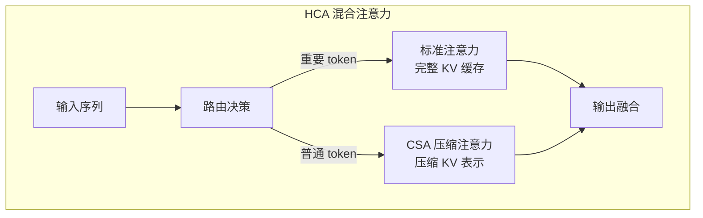
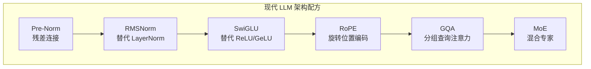

# 架构演进与变体 —— 从固定窗口到无限上下文

上一章介绍了 Transformer 的诞生——2017 年，Google 的八位研究员在论文《Attention is All You Need》中提出了这个革命性的架构，用 Self-Attention 取代了 RNN 的序列依赖，实现了真正的并行计算，成为现代大语言模型的基石。但原始 Transformer 并非完美：固定的上下文窗口限制了模型处理长文本的能力，$O(n^2)$ 的注意力复杂度在长序列上代价高昂，参数效率的提升空间巨大。

在 Transformer 诞生后的七年里，研究者们从多个方向对原始架构进行了改进。这些改进并非零散的尝试，而是形成了一套相对稳定的"标准配方"。本文将系统梳理这些关键演进：从 RoPE 的位置编码扩展到 DeepSeek-V4 的混合注意力架构，从 Flash Attention 的 IO 优化到 MoE 的稀疏激活，从 MQA/GQA 的 KV 缓存优化到 RMSNorm/SwiGLU 的组件替换。这些改进共同构成了现代 LLM 架构的技术基础。

## 长上下文挑战

原始 Transformer 的位置编码设计存在一个根本限制：训练时见过的序列长度决定了推理时能处理的最大长度。当模型需要在更长的上下文中工作时，位置编码的外推能力成为关键瓶颈。本节将探讨这一挑战的根源，以及研究者们提出的各种解决方案。

### 位置编码的外推困境

上一章介绍了两种位置编码：Sinusoidal 和 RoPE。它们都面临外推问题 —— 当推理时的序列长度超过训练时的最大长度时，模型的表现会急剧下降。

以 RoPE 为例，其旋转角度为 $\theta_i = 10000^{-2i/d}$，位置 $m$ 的旋转角度为 $m\theta_i$。当模型在训练时只见过最大长度 $L_{train}$，推理时遇到位置 $m > L_{train}$，旋转角度 $m\theta_i$ 超出了模型学习过的范围，导致位置信息的"失真"。

这个问题在实践中表现为：当上下文长度超过训练长度时，模型的困惑度（Perplexity）急剧上升，生成质量明显下降。对于需要处理长文档、长对话、长代码的应用场景，这是一个严重限制。

### NTK-aware 位置编码扩展

**NTK-aware** 扩展是一种无需重新训练就能扩展上下文长度的方法，由研究者们在 2023 年提出。其核心思想是：通过调整 RoPE 的基频（base frequency），让旋转角度的变化更加平缓。

原始 RoPE 的基频为 $\beta = 10000$，频率为 $\theta_i = \beta^{-2i/d}$。NTK-aware 扩展将基频调整为：

$$\beta' = \beta \cdot \alpha^{d/(d-2)}$$

这个公式看着抽象，拆开来看含义很直观：
- $\beta$ 是原始基频，默认值为 10000，决定了 RoPE 的频率范围
- $\alpha = L_{target} / L_{train}$ 是扩展比例，表示目标长度与训练长度的比值
- $\alpha^{d/(d-2)}$ 是一个与维度相关的缩放因子，确保高频分量不会超出训练范围
- 整体公式可以理解为：当序列长度扩展 $\alpha$ 倍时，通过增大基频来降低所有频率，使得扩展后的旋转角度仍在模型"熟悉"的范围内

直觉理解：当序列长度扩展 $\alpha$ 倍时，如果不调整基频，高频分量的旋转角度会超出训练范围。通过增大基频，降低所有频率，使得扩展后的旋转角度仍在模型"熟悉"的范围内。下面的代码演示了 NTK-aware 扩展如何调整基频，以及调整后旋转角度的变化。

```python runnable
import torch
import math

def get_rope_freqs(seq_len, dim, base=10000):
    """计算 RoPE 的频率"""
    freqs = 1.0 / (base ** (torch.arange(0, dim, 2).float() / dim))
    positions = torch.arange(seq_len)
    angles = torch.outer(positions, freqs)
    return angles

# 对比原始 RoPE 和 NTK-aware 扩展
dim = 64
L_train = 2048
L_target = 8192

# 原始 RoPE
angles_original = get_rope_freqs(L_target, dim, base=10000)

# NTK-aware 扩展
alpha = L_target / L_train
base_ntk = 10000 * (alpha ** (dim / (dim - 2)))
angles_ntk = get_rope_freqs(L_target, dim, base_ntk)

print(f"原始基频: 10000")
print(f"NTK-aware 基频: {base_ntk:.0f}")
print(f"\n位置 2048 处的最高频率角度:")
print(f"  原始 RoPE: {angles_original[2048, 0]:.4f} rad")
print(f"  NTK-aware: {angles_ntk[2048, 0]:.4f} rad")
print(f"\n位置 8191 处的最高频率角度:")
print(f"  原始 RoPE: {angles_original[8191, 0]:.4f} rad")
print(f"  NTK-aware: {angles_ntk[8191, 0]:.4f} rad")
```

NTK-aware 扩展的局限性：它是一种"暴力"方法，在极端扩展比例下效果有限。更精细的方法如 **YaRN**（Yet another RoPE extension）结合了 NTK-aware 和温度缩放，效果更好。

### ALiBi：线性偏置注意力

**ALiBi**（Attention with Linear Biases）由 Press 等人在 2021 年提出，采用完全不同的思路：不使用显式的位置编码，而是在注意力计算中直接加入位置相关的偏置。

$$\text{Attention}(q, k) = \text{softmax}(qk^T - m \cdot |i-j|)$$

这个公式看着抽象，拆开来看含义很直观：
- $qk^T$ 是标准的注意力得分，衡量 Query 和 Key 的相似度
- $|i-j|$ 是位置 $i$ 和 $j$ 的距离，表示两个 token 在序列中相隔多远
- $m$ 是一个可学习的斜率参数，每个注意力头有不同的 $m$ 值，允许不同头学习不同的位置敏感度
- $-m \cdot |i-j|$ 是线性偏置，距离越远，偏置越大（负值），注意力得分越低
- 整体公式可以理解为：在标准注意力得分上加入一个"距离惩罚"，让模型更关注附近的 token，而非远处的 token

ALiBi 的核心优势是**外推能力**：由于偏置只依赖于相对距离，而非绝对位置，模型可以自然地处理任意长度的序列。实验表明，在 1024 长度上训练的 ALiBi 模型，可以直接在 2048 甚至更长序列上推理，性能下降很小。

```nn-arch width=720
name: ALiBi vs RoPE
layout: horizontal

sections:
  - name: RoPE（绝对位置）
    layers: [rope_input, rope_rotate, rope_attn]
  - name: ALiBi（相对偏置）
    layers: [alibi_input, alibi_bias, alibi_attn]

layers:
  - {id: rope_input, name: "Q, K", type: input, size: "位置无关"}
  - {id: rope_rotate, name: "旋转编码", type: operation, size: "R_m·q, R_n·k"}
  - {id: rope_attn, name: "q·k", type: attention, size: "含位置信息"}
  - {id: alibi_input, name: "Q, K", type: input, size: "位置无关"}
  - {id: alibi_bias, name: "线性偏置", type: operation, size: "-m|i-j|"}
  - {id: alibi_attn, name: "q·k + bias", type: attention, size: "含位置信息"}
```

ALiBi 的局限性：它在短序列上的性能略逊于 RoPE，且与现代 LLM 的其他优化（如 Flash Attention）的兼容性需要额外处理。目前主流 LLM 仍以 RoPE 为主，但 ALiBi 在需要极长上下文的场景中有其价值。

### DeepSeek-V4：混合注意力架构

2026 年发布的 **DeepSeek-V4** 引入了 **CSA**（Compressed Sparse Attention）和 **HCA**（Hybrid Compressed Attention）混合架构，将长上下文处理推向新高度。这一架构的核心洞见是：不是所有 token 都需要完整的注意力计算。对于长序列，大部分 token 之间的关系是稀疏的，可以通过压缩表示来近似。

**CSA（压缩稀疏注意力）** 将 KV 缓存压缩为更紧凑的表示，对压缩后的表示进行稀疏注意力计算，显著降低内存占用和计算量。**HCA（混合压缩注意力）** 结合 CSA 和标准注意力，对重要 token 使用标准注意力以保留精度，对其他 token 使用 CSA 以降低成本，动态决定每个 token 的注意力类型。



DeepSeek-V4 的混合架构实现了 **128K token** 的有效上下文长度，同时保持了推理效率。这代表了长上下文技术的最新进展：从简单的位置编码扩展，到复杂的动态注意力机制。

## 高效注意力

Self-Attention 的计算复杂度是 $O(n^2 d)$，其中 $n$ 是序列长度，$d$ 是隐藏维度。当 $n$ 很大时，计算和内存成本都成为瓶颈。高效注意力技术从多个角度解决这个问题，本节将介绍最具代表性的几种方案：Flash Attention、稀疏注意力和滑动窗口注意力。

### Flash Attention：IO 感知的内存优化

**Flash Attention** 由 Dao 等人在 2022 年提出，其核心洞见是：注意力计算的瓶颈不在计算本身，而在内存访问（IO）。传统实现需要多次读写 HBM（高带宽内存），而 GPU 的 SRAM 虽然小但速度快得多。

**传统注意力实现的内存访问模式**：
1. 从 HBM 读取 $Q, K$，计算 $S = QK^T$，写入 HBM
2. 从 HBM 读取 $S$，计算 $P = \text{softmax}(S)$，写入 HBM
3. 从 HBM 读取 $P, V$，计算 $O = PV$，写入 HBM

总共需要 $O(n^2)$ 次 HBM 读写。

**Flash Attention 的优化**策略包括三个关键步骤：分块计算，将 $Q, K, V$ 分成小块，每块能放入 SRAM；在线 Softmax，逐块计算 softmax，避免存储完整的 $n \times n$ 矩阵；融合内核，在 SRAM 中完成所有计算，只写回最终结果。下面的代码演示了 Flash Attention 的分块计算和在线 Softmax 的基本原理。

```python runnable
import torch

def flash_attention_demo(Q, K, V, block_size=64):
    """Flash Attention 的简化演示（非实际实现）"""
    n, d = Q.shape
    output = torch.zeros_like(Q)
    
    # 分块计算
    for i in range(0, n, block_size):
        Q_block = Q[i:i+block_size]  # 当前 Query 块
        
        # 累积变量（在线 softmax）
        max_score = torch.full((min(block_size, n-i), 1), float('-inf'))
        sum_exp = torch.zeros(min(block_size, n-i), 1)
        block_output = torch.zeros_like(Q_block)
        
        for j in range(0, n, block_size):
            K_block = K[j:j+block_size]  # Key 块
            V_block = V[j:j+block_size]  # Value 块
            
            # 计算当前块的注意力得分
            scores = Q_block @ K_block.T / (d ** 0.5)
            
            # 在线 softmax 更新
            new_max = torch.maximum(max_score, scores.max(dim=1, keepdim=True)[0])
            exp_scores = torch.exp(scores - new_max)
            correction = torch.exp(max_score - new_max)
            
            block_output = correction * block_output + exp_scores @ V_block
            sum_exp = correction * sum_exp + exp_scores.sum(dim=1, keepdim=True)
            max_score = new_max
        
        output[i:i+block_size] = block_output / sum_exp
    
    return output

# 演示
torch.manual_seed(42)
n, d = 128, 64
Q = torch.randn(n, d)
K = torch.randn(n, d)
V = torch.randn(n, d)

# Flash Attention
output_flash = flash_attention_demo(Q, K, V, block_size=32)

# 标准注意力（对比）
scores = Q @ K.T / (d ** 0.5)
attn_weights = torch.softmax(scores, dim=1)
output_standard = attn_weights @ V

# 比较结果
diff = (output_flash - output_standard).abs().max()
print(f"Flash Attention 与标准注意力的最大差异: {diff:.6f}")
print("（差异来自数值精度，实际实现会更精确）")
```

Flash Attention 2 进一步优化了并行性和工作分区，在 A100 GPU 上实现了 **72% 的理论峰值 FLOPS**。这使长序列训练成为可能：训练 4K 上下文的模型，Flash Attention 比标准实现快 **2-4 倍**，内存占用减少 **5-20 倍**。

### 稀疏注意力：局部 + 全局模式

**稀疏注意力**的核心假设是：并非所有位置对之间的注意力都是必要的。通过只计算"重要"的注意力连接，可以大幅降低复杂度。

**局部注意力**让每个位置只关注附近的 $w$ 个位置，复杂度降为 $O(nw)$，适合捕捉局部依赖（如短语、相邻词关系）。**全局注意力**让选定的"全局 token"（如 [CLS]、句首词）可以关注所有位置，所有位置也可以关注它们，适合捕捉全局信息。

**Longformer** 由 Beltagy 等人在 2020 年提出，结合了两者：普通 token 使用局部滑动窗口注意力，特殊 token 使用全局注意力。

```nn-arch width=720
name: 稀疏注意力模式
layout: horizontal

sections:
  - name: 标准注意力
    layers: [dense_matrix]
  - name: 局部注意力
    layers: [local_bands]
  - name: 局部+全局
    layers: [local_global]

layers:
  - {id: dense_matrix, name: "全连接", type: attention, size: "O(n²)"}
  - {id: local_bands, name: "滑动窗口", type: attention, size: "O(nw)"}
  - {id: local_global, name: "局部+全局", type: attention, size: "O(nw+ng)"}
```

稀疏注意力的局限性：需要精心设计稀疏模式，且可能丢失某些重要的长距离依赖。

### 滑动窗口注意力：Mistral 的选择

**Mistral** 模型由 Mistral AI 在 2023 年发布，采用了**滑动窗口注意力**（Sliding Window Attention, SWA）：每个位置只关注固定窗口大小 $W$ 内的位置。

关键创新在于多层堆叠的信息传递机制：通过多层堆叠，信息可以"传递"到更远的位置。第 $L$ 层的有效感受野为 $L \times W$，即使每层只看局部，多层组合后仍能捕捉长距离依赖。下面的代码实现了滑动窗口注意力，演示了其计算量的节省效果。

```python runnable
import torch
import torch.nn.functional as F

def sliding_window_attention(Q, K, V, window_size):
    """滑动窗口注意力实现"""
    n, d = Q.shape
    output = torch.zeros_like(Q)
    
    for i in range(n):
        # 计算窗口范围
        start = max(0, i - window_size + 1)
        end = i + 1  # 因果注意力，只看左边
        
        # 提取窗口内的 K, V
        K_window = K[start:end]
        V_window = V[start:end]
        
        # 计算注意力
        q = Q[i:i+1]
        scores = q @ K_window.T / (d ** 0.5)
        weights = F.softmax(scores, dim=1)
        output[i] = weights @ V_window
    
    return output

# 演示
torch.manual_seed(42)
n, d = 16, 8
Q = torch.randn(n, d)
K = torch.randn(n, d)
V = torch.randn(n, d)

window_size = 4
output = sliding_window_attention(Q, K, V, window_size)

print(f"序列长度: {n}")
print(f"窗口大小: {window_size}")
print(f"标准注意力计算量: {n * n} 次点积")
print(f"滑动窗口注意力计算量: {n * window_size} 次点积")
print(f"计算量减少: {(1 - window_size/n) * 100:.1f}%")
```

Mistral 7B 使用窗口大小 $W = 4096$，在保持效率的同时实现了良好的长文本性能。

## MoE 稀疏架构

**混合专家**（Mixture of Experts, MoE）是一种"条件计算"范式：对于每个输入，只激活网络的一部分参数。这允许模型在保持推理成本可控的同时，大幅增加总参数量。本节将介绍 MoE 的核心机制、训练挑战以及代表性模型。

### 从 Switch Transformer 到 Mixtral

**Switch Transformer** 由 Fedus 等人在 2021 年提出，首次将 MoE 引入 Transformer 架构。其核心设计包括：将 FFN 层替换为多个"专家"FFN，每个 token 只路由到一个专家（Top-1 路由），通过路由网络学习 token 到专家的映射。

**Mixtral 8x7B** 由 Mistral AI 在 2024 年发布，证明了 MoE 在 LLM 中的有效性：8 个专家，每个专家 7B 参数，每个 token 路由到 Top-2 专家，总参数 47B 但每个 token 只激活 13B 参数，性能媲美 LLaMA-2 70B，推理成本接近 7B 模型。

### 专家路由机制

MoE 的核心是**路由函数** $G(x)$，决定每个 token 应该由哪些专家处理。

$$G(x) = \text{Softmax}(x \cdot W_g)$$

这个公式看着抽象，拆开来看含义很直观：
- $x$ 是输入 token 的表示向量
- $W_g$ 是路由权重矩阵，形状为 $(d_{model}, N)$，其中 $N$ 是专家数量
- $x \cdot W_g$ 计算输入与每个专家的"匹配得分"
- Softmax 将匹配得分转换为概率分布，表示路由到每个专家的概率
- 整体公式可以理解为：根据输入特征，计算它应该由哪些专家处理的概率

对于 Top-k 路由：

$$\text{Experts}(x) = \sum_{i \in \text{Top-k}(G(x))} G(x)_i \cdot E_i(x)$$

只有被选中的 $k$ 个专家参与计算，其他专家被"跳过"。

```nn-arch width=720
name: MoE 架构
layout: vertical

sections:
  - name: 输入
    layers: [input]
  - name: 路由决策
    layers: [router]
  - name: 专家网络
    layers: [e1, e2, e3, e4, e5, e6, e7, e8]
    row_label: "8个专家"
  - name: 加权组合
    layers: [combine]
  - name: 输出
    layers: [output]

layers:
  - {id: input, name: "Token x", type: input, size: "d_model"}
  - {id: router, name: "Router", type: operation, size: "Top-2 选择"}
  - {id: e1, name: "专家1", type: dense, size: "FFN"}
  - {id: e2, name: "专家2", type: dense, size: "FFN"}
  - {id: e3, name: "专家3", type: dense, size: "FFN"}
  - {id: e4, name: "专家4", type: dense, size: "FFN"}
  - {id: e5, name: "专家5", type: dense, size: "FFN"}
  - {id: e6, name: "专家6", type: dense, size: "FFN"}
  - {id: e7, name: "专家7", type: dense, size: "FFN"}
  - {id: e8, name: "专家8", type: dense, size: "FFN"}
  - {id: combine, name: "加权求和", type: operation, size: "g₁E₁ + g₂E₂"}
  - {id: output, name: "输出", type: output, size: "d_model"}
```

### 负载均衡问题

MoE 训练的一个关键挑战是**负载不均衡**：某些专家可能被频繁选中，而其他专家很少被使用。这导致训练不充分（冷门专家学习不足）和推理效率低（热门专家成为瓶颈）。

**解决方案**包括三种主要策略：

**辅助损失函数**：在训练目标中加入负载均衡损失

$$L_{aux} = \alpha \cdot \sum_{i=1}^N f_i \cdot P_i$$

这个公式看着抽象，拆开来看含义很直观：
- $f_i$ 是专家 $i$ 被选中的频率，反映实际使用情况
- $P_i$ 是路由到专家 $i$ 的平均概率，反映路由倾向
- $\alpha$ 是损失权重，控制负载均衡的重要性
- 整体公式可以理解为：鼓励专家被均匀使用，惩罚负载不均衡

**专家容量限制**：强制每个专家处理的 token 数量不超过上限，超出部分路由到其他专家。

**噪声路由**：在路由决策中加入噪声，增加探索性

$$G(x) = \text{Softmax}(x \cdot W_g + \epsilon), \quad \epsilon \sim \mathcal{N}(0, \sigma^2)$$

下面的代码实现了一个简化的 MoE 层，演示了路由机制和负载均衡的基本原理。

```python runnable
import torch
import torch.nn as nn
import torch.nn.functional as F

class MoELayer(nn.Module):
    """简化的 MoE 层实现"""
    def __init__(self, d_model, d_ff, num_experts, top_k=2):
        super().__init__()
        self.num_experts = num_experts
        self.top_k = top_k
        
        # 专家网络（每个专家是一个 FFN）
        self.experts = nn.ModuleList([
            nn.Sequential(
                nn.Linear(d_model, d_ff),
                nn.GELU(),
                nn.Linear(d_ff, d_model)
            ) for _ in range(num_experts)
        ])
        
        # 路由网络
        self.router = nn.Linear(d_model, num_experts, bias=False)
        
    def forward(self, x):
        batch_size, seq_len, d_model = x.shape
        
        # 计算路由权重
        router_logits = self.router(x)  # (batch, seq, num_experts)
        
        # Top-k 选择
        top_k_weights, top_k_indices = torch.topk(
            router_logits, self.top_k, dim=-1
        )
        top_k_weights = F.softmax(top_k_weights, dim=-1)
        
        # 初始化输出
        output = torch.zeros_like(x)
        
        # 对每个专家处理分配给它的 token
        for k in range(self.top_k):
            expert_indices = top_k_indices[:, :, k]  # (batch, seq)
            expert_weights = top_k_weights[:, :, k:k+1]  # (batch, seq, 1)
            
            for e in range(self.num_experts):
                # 找到路由到专家 e 的位置
                mask = (expert_indices == e)
                if mask.sum() == 0:
                    continue
                
                # 提取这些 token
                expert_input = x[mask]
                
                # 通过专家网络
                expert_output = self.experts[e](expert_input)
                
                # 加权累加到输出
                output[mask] += expert_weights[mask] * expert_output
        
        return output, router_logits

# 演示
torch.manual_seed(42)
d_model, d_ff = 64, 256
num_experts, top_k = 8, 2

moe = MoELayer(d_model, d_ff, num_experts, top_k)
x = torch.randn(2, 16, d_model)  # batch=2, seq=16

output, router_logits = moe(x)

print(f"输入形状: {x.shape}")
print(f"输出形状: {output.shape}")
print(f"专家数量: {num_experts}")
print(f"每个 token 激活的专家数: {top_k}")
print(f"总参数: {sum(p.numel() for p in moe.parameters()):,}")
print(f"每个 token 实际激活的参数比例: {top_k/num_experts * 100:.1f}%")
```

### DeepSeek-V2/V3 的 MoE 创新

**DeepSeek-V2** 由 DeepSeek-AI 在 2024 年发布，引入了 **MLA**（Multi-Head Latent Attention）和 **DeepSeekMoE** 架构。其核心创新包括三个方面：细粒度专家分割，将专家分成更小的单元，增加路由灵活性，传统 MoE 每个专家是一个完整 FFN，DeepSeekMoE 将 FFN 进一步分割；共享专家隔离，设置一部分"共享专家"处理所有 token，确保基础能力，其他"路由专家"按需激活，处理特定领域知识；MLA 注意力，通过低秩压缩减少 KV 缓存，使长上下文推理更加高效。

DeepSeek-V3 进一步优化了这些设计，实现了 **671B 总参数，37B 激活参数**的高效配置。

## 注意力优化：MQA 与 GQA

在自回归生成中，模型需要缓存之前所有位置的 Key 和 Value（KV 缓存）。随着上下文增长，KV 缓存的内存占用成为瓶颈。本节将介绍两种关键的注意力优化技术：多查询注意力（MQA）和分组查询注意力（GQA）。

### KV 缓存的内存压力

假设模型有 $h$ 个注意力头，每个头的维度为 $d_k$，序列长度为 $n$。KV 缓存的大小为：

$$\text{KV Cache} = 2 \times n \times h \times d_k \times \text{bytes per element}$$

对于 70B 模型（如 LLaMA-2 70B），在 4K 上下文、FP16 精度下：
- $h = 64$, $d_k = 128$
- KV 缓存大小 ≈ $2 \times 4096 \times 64 \times 128 \times 2 = 128$ MB（每层）
- 80 层总计 ≈ **10 GB**

这给推理部署带来了巨大压力。

### 多查询注意力（MQA）

**MQA**（Multi-Query Attention）由 Shazeer 在 2019 年提出，其核心思想：所有注意力头共享同一组 Key 和 Value，只有 Query 是每个头独立的。

$$\text{MQA}: Q \in \mathbb{R}^{h \times d_k}, \quad K, V \in \mathbb{R}^{1 \times d_k}$$

KV 缓存减少 $h$ 倍（从 $h$ 组 KV 变为 1 组）。代价是性能下降：共享 KV 限制了模型的表达能力，因为不同头无法学习不同的 Key/Value 表示。

### 分组查询注意力（GQA）

**GQA**（Grouped Query Attention）由 Ainslie 等人在 2023 年提出，是 MQA 和 MHA 的折中：将注意力头分成若干组，每组共享一组 KV。

$$\text{GQA}: Q \in \mathbb{R}^{h \times d_k}, \quad K, V \in \mathbb{R}^{g \times d_k}$$

这个公式看着抽象，拆开来看含义很直观：
- $h$ 是注意力头的总数
- $g$ 是组数，满足 $1 \leq g \leq h$
- $Q$ 有 $h$ 个独立的查询向量，每个头一个
- $K, V$ 只有 $g$ 组，每组被多个头共享
- 当 $g=1$ 时退化为 MQA，当 $g=h$ 时为标准 MHA
- 整体公式可以理解为：在内存效率和模型表达能力之间找到平衡点

**LLaMA-2 的选择**：$g = 8$，在 70B 模型中，KV 缓存减少 8 倍，性能损失很小。下面的代码实现了分组查询注意力，并对比了不同配置下的 KV 缓存大小。

```nn-arch width=720
name: MHA vs MQA vs GQA
layout: horizontal

sections:
  - name: MHA（标准）
    layers: [mha_q, mha_k, mha_v, mha_out]
    row_label: "h组KV"
  - name: MQA（激进）
    layers: [mqa_q, mqa_k, mqa_v, mqa_out]
    row_label: "1组KV"
  - name: GQA（折中）
    layers: [gqa_q, gqa_k, gqa_v, gqa_out]
    row_label: "g组KV"

layers:
  - {id: mha_q, name: "Q₁...Qₕ", type: projection, size: "h个头"}
  - {id: mha_k, name: "K₁...Kₕ", type: projection, size: "h个头"}
  - {id: mha_v, name: "V₁...Vₕ", type: projection, size: "h个头"}
  - {id: mha_out, name: "Output", type: output, size: "KV缓存大"}
  
  - {id: mqa_q, name: "Q₁...Qₕ", type: projection, size: "h个头"}
  - {id: mqa_k, name: "K", type: projection, size: "共享"}
  - {id: mqa_v, name: "V", type: projection, size: "共享"}
  - {id: mqa_out, name: "Output", type: output, size: "KV缓存小"}
  
  - {id: gqa_q, name: "Q₁...Qₕ", type: projection, size: "h个头"}
  - {id: gqa_k, name: "K₁...K₉", type: projection, size: "g组"}
  - {id: gqa_v, name: "V₁...V₉", type: projection, size: "g组"}
  - {id: gqa_out, name: "Output", type: output, size: "KV缓存中"}
```

```python runnable
import torch
import torch.nn as nn

class GroupedQueryAttention(nn.Module):
    """分组查询注意力实现"""
    def __init__(self, d_model, num_heads, num_groups):
        super().__init__()
        self.num_heads = num_heads
        self.num_groups = num_groups
        self.head_dim = d_model // num_heads
        self.heads_per_group = num_heads // num_groups
        
        # Query 投影（每个头独立）
        self.W_Q = nn.Linear(d_model, d_model, bias=False)
        
        # Key, Value 投影（每组共享）
        self.W_K = nn.Linear(d_model, num_groups * self.head_dim, bias=False)
        self.W_V = nn.Linear(d_model, num_groups * self.head_dim, bias=False)
        
        # 输出投影
        self.W_O = nn.Linear(d_model, d_model, bias=False)
    
    def forward(self, x):
        batch_size, seq_len, d_model = x.shape
        
        # 计算 Q, K, V
        Q = self.W_Q(x).view(batch_size, seq_len, self.num_heads, self.head_dim)
        K = self.W_K(x).view(batch_size, seq_len, self.num_groups, self.head_dim)
        V = self.W_V(x).view(batch_size, seq_len, self.num_groups, self.head_dim)
        
        # 扩展 K, V 以匹配 Q 的头数
        K = K.unsqueeze(2).expand(-1, -1, self.heads_per_group, -1, -1)
        K = K.reshape(batch_size, seq_len, self.num_heads, self.head_dim)
        V = V.unsqueeze(2).expand(-1, -1, self.heads_per_group, -1, -1)
        V = V.reshape(batch_size, seq_len, self.num_heads, self.head_dim)
        
        # 注意力计算（简化版，未包含因果掩码）
        Q = Q.transpose(1, 2)  # (batch, heads, seq, dim)
        K = K.transpose(1, 2)
        V = V.transpose(1, 2)
        
        scores = torch.matmul(Q, K.transpose(-2, -1)) / (self.head_dim ** 0.5)
        attn_weights = torch.softmax(scores, dim=-1)
        output = torch.matmul(attn_weights, V)
        
        output = output.transpose(1, 2).reshape(batch_size, seq_len, d_model)
        return self.W_O(output)

# 演示 KV 缓存大小对比
d_model, num_heads = 4096, 32
seq_len = 4096

print("KV 缓存大小对比（FP16，单层）:")
print(f"序列长度: {seq_len}")
print(f"注意力头数: {num_heads}")
print(f"头维度: {d_model // num_heads}")

# MHA
mha_kv = 2 * seq_len * num_heads * (d_model // num_heads) * 2
print(f"\nMHA: {mha_kv / 1024**2:.1f} MB")

# MQA
mqa_kv = 2 * seq_len * 1 * (d_model // num_heads) * 2
print(f"MQA: {mqa_kv / 1024**2:.1f} MB（节省 {(1-mqa_kv/mha_kv)*100:.0f}%）")

# GQA (g=8)
gqa_kv = 2 * seq_len * 8 * (d_model // num_heads) * 2
print(f"GQA (g=8): {gqa_kv / 1024**2:.1f} MB（节省 {(1-gqa_kv/mha_kv)*100:.0f}%）")
```

## 归一化与激活函数演进

除了架构层面的改进，Transformer 的组件也在持续优化。归一化层和激活函数的演进，体现了"简单往往更好"的设计哲学。本节将介绍两个关键组件的演进：LayerNorm 到 RMSNorm，以及 ReLU/GeLU 到 SwiGLU。

### LayerNorm → RMSNorm

原始 Transformer 使用 **LayerNorm**（层归一化）：

$$\text{LayerNorm}(x) = \frac{x - \mu}{\sigma} \cdot \gamma + \beta$$

**RMSNorm**（Root Mean Square Normalization）由 Zhang 和 Sennrich 在 2019 年提出，去掉了均值中心化：

$$\text{RMSNorm}(x) = \frac{x}{\sqrt{\frac{1}{d}\sum_{i=1}^d x_i^2 + \epsilon}} \cdot \gamma$$

这个公式看着抽象，拆开来看含义很直观：
- $x$ 是输入向量，包含一个位置的所有特征
- $\frac{1}{d}\sum_{i=1}^d x_i^2$ 是输入向量元素的平方均值
- $\sqrt{\cdot + \epsilon}$ 是均方根（RMS），$\epsilon$ 是防止除零的小常数
- $\frac{x}{\text{RMS}}$ 将输入归一化到单位均方根
- $\gamma$ 是可学习的缩放参数，允许模型恢复原始的尺度
- 整体公式可以理解为：只做尺度归一化，不做均值中心化，计算更简单但效果相当

**为什么去掉均值中心化？** 理论分析表明，LayerNorm 中的均值中心化对模型性能的贡献有限。均值中心化的目的是让输入分布以零为中心，但在 Transformer 的残差结构中，输入已经经过多层变换，均值偏移的影响被残差连接缓解。

RMSNorm 的优势体现在三个方面：计算更快，省去均值计算，减少约 10-15% 的计算量；性能相当，在 LLM 训练中，RMSNorm 与 LayerNorm 性能相近；实现简单，代码更简洁，数值更稳定。LLaMA、GPT-NeoX、PaLM 等现代 LLM 普遍采用 RMSNorm。

```python runnable
import torch
import torch.nn as nn

class LayerNorm(nn.Module):
    """标准层归一化"""
    def __init__(self, dim, eps=1e-6):
        super().__init__()
        self.gamma = nn.Parameter(torch.ones(dim))
        self.beta = nn.Parameter(torch.zeros(dim))
        self.eps = eps
    
    def forward(self, x):
        mean = x.mean(dim=-1, keepdim=True)
        var = x.var(dim=-1, keepdim=True, unbiased=False)
        return self.gamma * (x - mean) / (var + self.eps).sqrt() + self.beta

class RMSNorm(nn.Module):
    """RMS 归一化"""
    def __init__(self, dim, eps=1e-6):
        super().__init__()
        self.gamma = nn.Parameter(torch.ones(dim))
        self.eps = eps
    
    def forward(self, x):
        rms = torch.sqrt(torch.mean(x ** 2, dim=-1, keepdim=True) + self.eps)
        return self.gamma * x / rms

# 对比测试
torch.manual_seed(42)
dim = 64
x = torch.randn(2, 16, dim)

ln = LayerNorm(dim)
rn = RMSNorm(dim)

out_ln = ln(x)
out_rn = rn(x)

print("LayerNorm vs RMSNorm 对比:")
print(f"输入均值: {x.mean():.4f}, 标准差: {x.std():.4f}")
print(f"LayerNorm 输出均值: {out_ln.mean():.4f}, 标准差: {out_ln.std():.4f}")
print(f"RMSNorm 输出均值: {out_rn.mean():.4f}, 标准差: {out_rn.std():.4f}")

# 计算时间对比
import time

def benchmark(module, x, iterations=1000):
    start = time.time()
    for _ in range(iterations):
        _ = module(x)
    return time.time() - start

ln_time = benchmark(ln, x)
rn_time = benchmark(rn, x)

print(f"\n计算时间（1000次迭代）:")
print(f"LayerNorm: {ln_time*1000:.2f} ms")
print(f"RMSNorm: {rn_time*1000:.2f} ms")
print(f"加速比: {ln_time/rn_time:.2f}x")
```

### GeLU → SwiGLU

原始 Transformer 的 FFN 使用 **ReLU** 激活函数：

$$\text{FFN}(x) = \text{ReLU}(xW_1 + b_1)W_2 + b_2$$

BERT 引入了 **GeLU**（Gaussian Error Linear Unit），在 GPT 系列中广泛使用：

$$\text{GeLU}(x) = x \cdot \Phi(x)$$

其中 $\Phi(x)$ 是标准正态分布的累积分布函数。GeLU 可以理解为"平滑的 ReLU"，在零点附近有更平滑的过渡。

**SwiGLU** 由 Shazeer 在 2020 年提出，是 LLaMA 采用的激活函数，结合了 **Swish** 和 **GLU**（Gated Linear Unit）：

$$\text{SwiGLU}(x) = \text{Swish}(xW_1) \otimes (xW_2)$$

这个公式看着抽象，拆开来看含义很直观：
- $\text{Swish}(x) = x \cdot \sigma(x)$，其中 $\sigma$ 是 sigmoid 函数
- $W_1, W_2$ 是两个独立的投影矩阵，将输入投影到不同的空间
- $\otimes$ 是逐元素乘法，实现门控机制
- 整体公式可以理解为：用 Swish 激活的投影作为"信息"，用另一个投影作为"门"，两者相乘实现选择性信息传递

SwiGLU 的优势体现在三个方面：门控机制，通过 $xW_2$ 的门控，模型可以"选择"哪些信息通过；非单调性，Swish 在负值区域有轻微的下凹，增加了表达能力；平滑梯度，相比 ReLU，梯度更平滑，训练更稳定。代价是 SwiGLU 需要三个投影矩阵（$W_1, W_2, W_3$），参数量增加约 50%。LLaMA 通过调整隐藏层维度来平衡参数量。下面的代码可视化了不同激活函数的特性对比。

```python runnable
import torch
import torch.nn as nn
import torch.nn.functional as F
import matplotlib.pyplot as plt
import numpy as np

# 设置中文字体
plt.rcParams['font.sans-serif'] = ['SimHei', 'DejaVu Sans']
plt.rcParams['axes.unicode_minus'] = False

def relu(x):
    return torch.relu(x)

def gelu(x):
    return F.gelu(x)

def swish(x):
    return x * torch.sigmoid(x)

def swiglu(x, W1, W2, W3):
    """SwiGLU: Swish(xW1) ⊗ (xW2)，输出投影 W3"""
    return swish(x @ W1) * (x @ W2) @ W3

# 可视化激活函数
x = torch.linspace(-3, 3, 100)

fig, axes = plt.subplots(1, 3, figsize=(15, 4))

# ReLU vs GeLU vs Swish
axes[0].plot(x.numpy(), relu(x).numpy(), label='ReLU', linewidth=2)
axes[0].plot(x.numpy(), gelu(x).numpy(), label='GeLU', linewidth=2)
axes[0].plot(x.numpy(), swish(x).numpy(), label='Swish', linewidth=2)
axes[0].set_xlabel('x')
axes[0].set_ylabel('f(x)')
axes[0].set_title('激活函数对比')
axes[0].legend()
axes[0].grid(True, alpha=0.3)

# 梯度对比
x_grad = x.clone().requires_grad_(True)
relu_grad = torch.autograd.grad(relu(x_grad).sum(), x_grad)[0]

x_grad = x.clone().requires_grad_(True)
gelu_grad = torch.autograd.grad(gelu(x_grad).sum(), x_grad)[0]

x_grad = x.clone().requires_grad_(True)
swish_grad = torch.autograd.grad(swish(x_grad).sum(), x_grad)[0]

axes[1].plot(x.numpy(), relu_grad.numpy(), label='ReLU', linewidth=2)
axes[1].plot(x.numpy(), gelu_grad.numpy(), label='GeLU', linewidth=2)
axes[1].plot(x.numpy(), swish_grad.numpy(), label='Swish', linewidth=2)
axes[1].set_xlabel('x')
axes[1].set_ylabel('df/dx')
axes[1].set_title('梯度对比')
axes[1].legend()
axes[1].grid(True, alpha=0.3)

# SwiGLU 示意图
axes[2].text(0.5, 0.8, 'SwiGLU 结构', fontsize=14, ha='center', fontweight='bold')
axes[2].text(0.5, 0.6, r'$\text{SwiGLU}(x) = \text{Swish}(xW_1) \otimes (xW_2) \cdot W_3$', 
             fontsize=12, ha='center')
axes[2].text(0.5, 0.4, '门控机制：选择哪些信息通过', fontsize=11, ha='center')
axes[2].text(0.5, 0.2, '参数量：比标准 FFN 多约 50%', fontsize=11, ha='center')
axes[2].set_xlim(0, 1)
axes[2].set_ylim(0, 1)
axes[2].axis('off')

plt.tight_layout()
plt.savefig('/workspace/activation_functions.png', dpi=150, bbox_inches='tight')
plt.show()

print("激活函数特点:")
print("- ReLU: 简单高效，但有'死亡神经元'问题")
print("- GeLU: 平滑过渡，BERT/GPT 采用")
print("- Swish: 非单调，平滑梯度")
print("- SwiGLU: 门控 + Swish，LLaMA 采用")
```

## 总结：现代 LLM 架构的标准配方

经过七年的演进，现代 LLM 架构形成了一套相对稳定的"标准配方"。这些改进不是孤立的，而是相互配合的：Pre-Norm 使深层网络训练稳定，RMSNorm 加速计算，RoPE 支持长上下文外推，GQA 减少推理内存，MoE 提升参数效率。它们共同构成了现代 LLM 高效、稳定、可扩展的架构基础。



| 组件 | 原始 Transformer | 现代 LLM | 改进理由 |
|:-----|:-----------------|:---------|:---------|
| 残差顺序 | Post-Norm | Pre-Norm | 训练更稳定，梯度传播更好 |
| 归一化 | LayerNorm | RMSNorm | 计算更快，性能相当 |
| 激活函数 | ReLU | SwiGLU | 门控机制增加表达能力 |
| 位置编码 | Sinusoidal | RoPE | 相对位置特性，外推更好 |
| 注意力 | MHA | GQA | KV 缓存减少，推理更快 |
| FFN | 标准 FFN | MoE | 参数效率，条件计算 |

**代表模型演进**：2017 年的 Transformer 采用原始架构，Post-Norm + Sinusoidal + ReLU + MHA；2018 年的 GPT-1/BERT 分别采用解码器/编码器路线；2020 年的 GPT-3 进行规模验证，展示涌现能力；2021 年的 Switch Transformer 首次将 MoE 引入 Transformer；2022 年的 GPT-4 架构细节未公开，但推测采用现代配方；2023 年的 LLaMA 采用 Pre-Norm + RMSNorm + SwiGLU + RoPE + GQA，成为开源标杆；2024 年的 Mixtral 是 MoE 架构的成熟应用，8x7B 配置；2024 年的 DeepSeek-V3 采用 MLA + DeepSeekMoE，671B 总参数/37B 激活；2026 年的 DeepSeek-V4 采用 CSA/HCA 混合注意力，128K 有效上下文。

下一章将从架构转向训练，探讨语言模型的基础 —— 分词算法与词表设计。理解了模型架构之后，自然要问：文本如何转化为模型可以处理的数字序列？这涉及 BPE、WordPiece、SentencePiece 等分词算法，以及词表设计的权衡考量。

---

## 练习题

**1. 理论推导**

证明 RoPE 的相对位置性质：$(R_m q) \cdot (R_n k) = q \cdot R_{n-m} k$。

<details>
<summary>参考答案</summary>

对于二维情况，旋转矩阵为：

$R_m = \begin{pmatrix} \cos m\theta & -\sin m\theta \\ \sin m\theta & \cos m\theta \end{pmatrix}$

$(R_m q) \cdot (R_n k) = (R_m q)^T (R_n k) = q^T R_m^T R_n k$

由于旋转矩阵是正交矩阵，$R_m^T R_n = R_{n-m}$（旋转的复合性质）

因此：$(R_m q) \cdot (R_n k) = q^T R_{n-m} k = q \cdot R_{n-m} k$

证毕。

</details>

**2. 架构分析**

对比 Flash Attention 和标准注意力的内存访问模式，解释为什么 Flash Attention 能减少 HBM 读写次数。

<details>
<summary>参考答案</summary>

**标准注意力的内存访问模式**：
1. 从 HBM 读取 $Q, K$，计算 $S = QK^T$，写入 HBM（$O(n^2)$ 数据）
2. 从 HBM 读取 $S$，计算 $P = \text{softmax}(S)$，写入 HBM（$O(n^2)$ 数据）
3. 从 HBM 读取 $P, V$，计算 $O = PV$，写入 HBM

总共需要多次 $O(n^2)$ 规模的 HBM 读写。

**Flash Attention 的优化**：
- 将 $Q, K, V$ 分成小块，每块能放入 SRAM
- 在 SRAM 中完成注意力计算的所有步骤
- 只写回最终结果，避免中间结果的 HBM 读写

关键在于：SRAM 虽然小但速度快（约 20 倍于 HBM），通过分块计算，将内存访问从 $O(n^2)$ 降到 $O(n)$。

</details>

**3. MoE 设计**

分析 Top-1 路由和 Top-2 路由的优劣：计算成本、专家利用率、模型性能。

<details>
<summary>参考答案</summary>

**计算成本**：
- Top-1：每个 token 只激活 1 个专家，计算成本最低
- Top-2：每个 token 激活 2 个专家，计算成本约为 Top-1 的 2 倍

**专家利用率**：
- Top-1：负载均衡更难，容易出现某些专家过载
- Top-2：负载更均衡，因为每个 token 有 2 次分配机会

**模型性能**：
- Top-1：性能略低，因为每个 token 只从一个专家获取信息
- Top-2：性能更好，融合了两个专家的知识

**实践选择**：Mixtral 8x7B 采用 Top-2 路由，在性能和效率之间取得良好平衡。Switch Transformer 采用 Top-1 路由，追求极致的参数效率。

</details>

**4. 编程实现**

实现一个完整的 GQA 层，支持：可配置的组数 $g$、因果注意力掩码、KV 缓存更新。

<details>
<summary>参考答案</summary>

```python runnable
import torch
import torch.nn as nn
import torch.nn.functional as F

class GroupedQueryAttention(nn.Module):
    """
    分组查询注意力（GQA）实现
    
    支持：
    - 可配置的组数 g
    - 因果注意力掩码
    - KV 缓存更新
    """
    def __init__(self, d_model, num_heads, num_groups):
        super().__init__()
        self.num_heads = num_heads
        self.num_groups = num_groups
        self.head_dim = d_model // num_heads
        self.heads_per_group = num_heads // num_groups
        
        # Query 投影（每个头独立）
        self.W_Q = nn.Linear(d_model, d_model, bias=False)
        
        # Key, Value 投影（每组共享）
        self.W_K = nn.Linear(d_model, num_groups * self.head_dim, bias=False)
        self.W_V = nn.Linear(d_model, num_groups * self.head_dim, bias=False)
        
        # 输出投影
        self.W_O = nn.Linear(d_model, d_model, bias=False)
    
    def forward(self, x, kv_cache=None, use_causal_mask=True):
        batch_size, seq_len, d_model = x.shape
        
        # 计算 Q, K, V
        Q = self.W_Q(x).view(batch_size, seq_len, self.num_heads, self.head_dim)
        K = self.W_K(x).view(batch_size, seq_len, self.num_groups, self.head_dim)
        V = self.W_V(x).view(batch_size, seq_len, self.num_groups, self.head_dim)
        
        # KV 缓存处理
        if kv_cache is not None:
            past_K, past_V = kv_cache
            K = torch.cat([past_K, K], dim=1)
            V = torch.cat([past_V, V], dim=1)
        
        new_kv_cache = (K, V)
        
        # 扩展 K, V 以匹配 Q 的头数
        K = K.unsqueeze(2).expand(-1, -1, self.heads_per_group, -1, -1)
        K = K.reshape(batch_size, -1, self.num_heads, self.head_dim)
        V = V.unsqueeze(2).expand(-1, -1, self.heads_per_group, -1, -1)
        V = V.reshape(batch_size, -1, self.num_heads, self.head_dim)
        
        # 注意力计算
        Q = Q.transpose(1, 2)  # (batch, heads, seq, dim)
        K = K.transpose(1, 2)
        V = V.transpose(1, 2)
        
        scores = torch.matmul(Q, K.transpose(-2, -1)) / (self.head_dim ** 0.5)
        
        # 因果掩码
        if use_causal_mask:
            kv_len = K.shape[2]
            q_len = Q.shape[2]
            mask = torch.triu(torch.ones(q_len, kv_len), diagonal=kv_len - q_len + 1).bool()
            scores = scores.masked_fill(mask.to(scores.device), float('-inf'))
        
        attn_weights = F.softmax(scores, dim=-1)
        output = torch.matmul(attn_weights, V)
        
        output = output.transpose(1, 2).reshape(batch_size, seq_len, d_model)
        return self.W_O(output), new_kv_cache

# 测试
d_model, num_heads, num_groups = 64, 8, 2
gqa = GroupedQueryAttention(d_model, num_heads, num_groups)

# 第一次调用
x1 = torch.randn(1, 4, d_model)
out1, cache1 = gqa(x1, kv_cache=None)
print(f"第一次调用 - 输入: {x1.shape}, 输出: {out1.shape}")
print(f"KV 缓存: K={cache1[0].shape}, V={cache1[1].shape}")

# 第二次调用（使用缓存）
x2 = torch.randn(1, 2, d_model)
out2, cache2 = gqa(x2, kv_cache=cache1)
print(f"\n第二次调用 - 输入: {x2.shape}, 输出: {out2.shape}")
print(f"KV 缓存: K={cache2[0].shape}, V={cache2[1].shape}")
```

</details>

**5. 架构对比**

选择两个现代 LLM（如 LLaMA-2 和 DeepSeek-V3），对比它们的架构差异，分析这些差异对性能的影响。

<details>
<summary>参考答案</summary>

**LLaMA-2 架构特点**：
- Pre-Norm + RMSNorm + SwiGLU + RoPE + GQA
- 标准 FFN（非 MoE）
- 上下文长度：4K（LLaMA-2）或 32K（LLaMA-2-Chat）

**DeepSeek-V3 架构特点**：
- Pre-Norm + RMSNorm + SwiGLU + RoPE + GQA
- DeepSeekMoE（细粒度专家 + 共享专家）
- MLA（多头潜在注意力）
- 上下文长度：128K

**关键差异分析**：

| 特性 | LLaMA-2 | DeepSeek-V3 | 影响 |
|:-----|:--------|:------------|:-----|
| FFN | 标准 FFN | MoE（671B/37B） | DeepSeek 参数效率更高 |
| 注意力 | GQA | MLA | DeepSeek KV 缓存更小 |
| 上下文 | 4K-32K | 128K | DeepSeek 长文本能力更强 |

**性能影响**：
- DeepSeek-V3 的 MoE 架构使其在相同激活参数下有更强的表达能力
- MLA 显著减少了长上下文推理的内存占用
- 但 MoE 的训练更复杂，需要负载均衡等额外机制

</details>

---

## 参考资料

1. **RoPE 论文**: "RoFormer: Enhanced Transformer with Rotary Position Embedding" (Su et al., 2021)
2. **ALiBi 论文**: "Train Short, Test Long: Attention with Linear Biases" (Press et al., 2021)
3. **Flash Attention 论文**: "FlashAttention: Fast and Memory-Efficient Exact Attention with IO-Awareness" (Dao et al., 2022)
4. **Switch Transformer**: "Switch Transformers: Scaling to Trillion Parameter Models" (Fedus et al., 2021)
5. **Mixtral 论文**: "Mixtral of Experts" (Jiang et al., 2024)
6. **GQA 论文**: "GQA: Training Generalized Multi-Query Transformer Models from Multi-Head Checkpoints" (Ainslie et al., 2023)
7. **RMSNorm 论文**: "Root Mean Square Layer Normalization" (Zhang & Sennrich, 2019)
8. **SwiGLU 论文**: "GLU Variants Improve Transformer" (Shazeer, 2020)
9. **DeepSeek-V2 论文**: "DeepSeek-V2: A Strong, Economical, and Efficient Mixture-of-Experts Language Model" (DeepSeek-AI, 2024)
10. **DeepSeek-V3 论文**: "DeepSeek-V3 Technical Report" (DeepSeek-AI, 2024)
