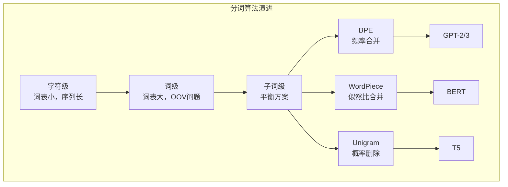

# 语言模型与分词

文本是连续的字符流，但语言模型处理的是离散的符号序列。将连续文本切分为离散符号的过程称为**分词**（Tokenization），它是语言模型与原始文本之间的桥梁。分词的质量直接影响模型的能力，切分太粗，词表庞大且无法处理新词，切分太细，序列过长且语义碎片化。

对分词的研究历史可以追溯到 20 世纪 80 年代。1986 年，德国计算机科学家菲利普·森里奇（Philipp Sennrich）等人在论文《Neural Machine Translation of Rare Words with Subword Units》中首次将 BPE（Byte Pair Encoding）算法引入 NLP 领域，开创了子词分词的新范式。在此之前，机器翻译系统面临严重的未登录词问题，训练中未见过的词无法被正确处理。BPE 的引入改变了这一局面，它让模型能够通过组合有限的子词来表示任意文本，成为现代 LLM 分词的基础。

在本章深入分词算法，以及下一章自己训练一个大语言模型之前，我们需要先理解语言模型是什么？它要解决什么问题？本章将从语言模型的历史脉络出发，追溯从统计方法到神经方法的演进，然后详细剖析现代 LLM 使用的分词算法，最后探讨词表设计的权衡考量。

## 语言模型简史

**语言模型**（Language Model）定义了自然语言序列上的[概率分布](../../maths/probability/probability-basics.md#常见概率分布)。给定一个文本序列 $w_1, w_2, ..., w_T$，语言模型为该序列赋予概率 $P(w_1, w_2, ..., w_T)$，衡量其在自然语言中出现的可能性。通过链式法则，这个联合概率可以分解为逐步预测的条件概率：

$$P(w_1, ..., w_T) = \prod_{t=1}^{T} P(w_t | w_1, ..., w_{t-1})$$

因此，建模 $P(w_{t+1} | w_1, w_2, ..., w_t)$（即根据前文预测下一个词）成为语言模型最常见的训练目标，GPT、Qwen、DeekSeep、Claude 等系列等自回归模型均是以此方式训练的。不过，这并非语言模型的唯一定义方式，BERT 等掩码语言模型通过预测被遮蔽的词来建模 $P(w_t | w_{-t})$，而语音识别等经典应用中，语言模型的用途是给候选序列打分，而非逐词预测。

无论采用哪种形式，语言模型都需要设计者对语言本身有深刻的理解。要准确估计序列概率，模型必须掌握语法、语义、常识、世界知识，甚至推理能力。本节将追溯语言模型的发展历程，从统计方法到神经方法，理解这一领域的发展脉络。

### N-Gram 语言模型

在深度学习兴起之前，**N-Gram 语言模型**是语言建模的主流方法，由克劳德·香农（Claude Shannon）在 1948 年的信息论研究中奠定基础。它的核心假设是马尔可夫假设：下一个词只依赖于前面的 $n-1$ 个词，而非整个历史。设 $w_1, ..., w_{t-1}$ 是 $t$ 时刻之前的所有词（完整历史），$w_{t-n+1}, ..., w_{t-1}$ 则是前面的 $n-1$ 个词（最近的历史），要预测的下一个词 $w_t$ 满足：

$$P(w_t | w_1, ..., w_{t-1}) \approx P(w_t | w_{t-n+1}, ..., w_{t-1})$$

以 Bigram 为例（$n=2$），下一个词只依赖于前一个词：

$$P(w_t | w_{t-1}) = \frac{Count(w_{t-1}, w_t)}{Count(w_{t-1})}$$

这个概率直接从训练语料中统计得到：计算 $(w_{t-1}, w_t)$ 这个词对出现的次数，除以 $w_{t-1}$ 出现的次数。下面的代码实现了一个简单的 Bigram 语言模型，演示了 N-Gram 模型的基本工作原理。对于训练语料中出现过的词对，模型可以给出合理的概率估计，但对于未见过的词对（如"爱 广州"），模型输出的概率为零。

```python runnable
# N-Gram 语言模型演示
from collections import defaultdict

class BigramModel:
    """简单的 Bigram 语言模型"""
    
    def __init__(self):
        self.bigram_counts = defaultdict(lambda: defaultdict(int))
        self.unigram_counts = defaultdict(int)
        self.vocab = set()
    
    def train(self, sentences):
        """从句子列表中训练模型"""
        for sentence in sentences:
            tokens = ['<s>'] + sentence.split() + ['</s>']
            for i in range(len(tokens) - 1):
                w1, w2 = tokens[i], tokens[i + 1]
                self.bigram_counts[w1][w2] += 1
                self.unigram_counts[w1] += 1
                self.vocab.add(w1)
                self.vocab.add(w2)
    
    def probability(self, w1, w2):
        """计算 P(w2 | w1)"""
        if self.unigram_counts[w1] == 0:
            return 0
        return self.bigram_counts[w1][w2] / self.unigram_counts[w1]
    
    def sentence_probability(self, sentence):
        """计算句子的概率"""
        tokens = ['<s>'] + sentence.split() + ['</s>']
        prob = 1.0
        for i in range(len(tokens) - 1):
            p = self.probability(tokens[i], tokens[i + 1])
            if p == 0:
                return 0  # 遇到未见过的情况
            prob *= p
        return prob

# 训练语料
corpus = [
    "我 爱 北京",
    "我 爱 上海",
    "北京 是 首都",
    "上海 是 城市",
    "我 爱 中国"
]

model = BigramModel()
model.train(corpus)

# 测试
print("词汇表:", model.vocab)
print("\n条件概率 P(爱|我):", model.probability("我", "爱"))
print("条件概率 P(北京|爱):", model.probability("爱", "北京"))
print("条件概率 P(上海|爱):", model.probability("爱", "上海"))

# 计算句子概率
test_sentence = "我 爱 北京"
print(f"\n句子 '{test_sentence}' 的概率:", model.sentence_probability(test_sentence))

test_sentence2 = "我 爱 广州"
print(f"句子 '{test_sentence2}' 的概率:", model.sentence_probability(test_sentence2))
```


N-Gram 模型简单、直观，但存在稀疏性和无法捕捉长距离依赖两个根本性的问题，最终催生了神经语言模型的诞生。

- **稀疏性问题**（Sparsity）：即使训练语料再大，也不可能覆盖所有可能的词组合。当遇到训练中未出现过的组合时，模型输出概率为零，导致整个句子的概率为零。这就是 N-Gram 的数据稀疏问题。以 Bigram 为例，假设词汇表大小为 $|V|$，可能的大词对数量为 $|V|^2$。即使词汇表只有 10000 个词，大词对数量就达到 1 亿。

    平滑技术可以缓解 N-Gram 稀疏性问题，将一部分概率质量分配给未见过的 N-Gram。经典方法包括 Add-one（Laplace）平滑（每个计数加 1）、Good-Turing 估计（用出现一次的 N-Gram 估计未出现的）、Kneser-Ney 平滑（目前效果最好的 N-Gram 平滑方法）。但平滑只是"修补"，无法从根本上解决稀疏性问题。

- **无法捕捉长距离依赖**：N-Gram 模型只看前面 $n-1$ 个词，无法捕捉更远距离的依赖关系。考虑这个例子："生长在北京的我对___很熟悉"。要预测空白处的词（如"天安门"），需要理解句子开头的"北京"与空白处的关系。但在 N-Gram 模型中，如果 $n=3$，模型只能看到"我对___"，完全无法利用前面的信息。增大 $n$ 可以部分缓解这个问题，但会加剧稀疏性，$n$ 越大，可能的 N-Gram 组合越多，训练语料越难以覆盖。实践中，N-Gram 模型通常最多只使用 $n \leq 5$。

### 神经语言模型

2003 年，加拿大计算机科学家约书亚·本吉奥（Yoshua Bengio）在论文《A Neural Probabilistic Language Model》中首次提出了**神经语言模型**，开创了语言建模的新范式。这项工作后来获得了 2018 年图灵奖，本吉奥与辛顿（Geoffrey Hinton）、杨立昆（Yann LeCun）共同被誉为深度学习的"三巨头"。

神经语言模型将每个词表示为一个分布式向量（Distributed Representation），而非离散的符号。词向量捕捉词之间的语义相似性，使得模型可以泛化到训练中未见过但语义相似的词组合。

神经语言模型相对于 N-Gram 模型的优势体现在三个方面：一是泛化能力，语义相似的词有相似的词向量，即使训练中从未见过"猫吃鱼"，但如果见过"狗吃肉"，模型可以通过词向量的相似性推断出"猫吃鱼"也是合理的。二是平滑的分布，神经网络的输出是 Softmax，对所有词都给出非零概率，不存在概率为零的问题。三是捕捉长距离依赖，理论上，神经网络可以捕捉任意长度的依赖（虽然早期的 RNN 在实践中仍有困难）。

最早由本吉奥提出的神经语言模型使用的是前馈神经网络，输入窗口大小固定。后续的发展我们已经知道了，循环神经网络（RNN）、长短期记忆网络（LSTM）、序列映射（Seq2Seq）进一步提升了语言模型的能力，最后由 Transformer 解决了决定性的长距离依赖与并行训练问题后，现代大语言模型的时代终于开启。

### 自回归与自编码语言模型

从最早的 N-Gram 模型到今天的 Transformer 模型，"根据前文预测下一个词"这条线索贯穿始终，以这个预测下一个词为目标的语言模型有一个正式名称：**自回归语言模型**（Autoregressive / Causal Language Model, CLM），它是神经语言模型中最大的一个分支。CLM 的形式化定义是给定一个文本序列 $\mathbf{w} = (w_1, w_2, ..., w_T)$，语言模型将其分解为条件概率的乘积：

$$P(\mathbf{w}) = \prod_{t=1}^{T} P(w_t | w_1, w_2, ..., w_{t-1})$$

训练目标是最大化训练语料中所有序列的似然：

$$\mathcal{L} = \sum_{\mathbf{w} \in \mathcal{D}} \log P(\mathbf{w}) = \sum_{\mathbf{w} \in \mathcal{D}} \sum_{t=1}^{T} \log P(w_t | w_{<t})$$

CLM 的代表模型包括 GPT、LLaMA、Claude、DeepSeek，目标函数为 $\sum_t \log P(w_t | w_{<t})$。神经语言模型的另一条比较活跃的分支是**自编码语言模型**（Autoencoding / Masked Language Model, MLM），训练时随机遮盖部分词，模型预测被遮盖的词，每个词可以看到双向上下文，代表模型包括 BERT、RoBERTa、DeBERTa，目标函数为 $\sum_{t \in M} \log P(w_t | w_{\setminus M})$，其中 $M$ 是被遮盖的位置集合。

## 分词算法

语言模型的输入必须是离散的符号。原始文本是连续的字符流，需要切分为有限词汇表中的符号，将文本如何为模型可以处理的离散符号序列被称为**分词**（Tokenization）。现代 LLM 使用的主流分词算法有 BPE、WordPiece、SentencePiece 和 Unigram 等，不同的分词算法直接影响：

- **词表大小**：词汇表越大，模型参数越多（输出层是 $|V| \times d$ 的矩阵），但覆盖率越高。
- **序列长度**：切分越细，序列越长，计算成本越高（Self-Attention 是 $O(n^2)$）。
- **未登录词处理**：无论词表多大，总会遇到训练中未见过的词。好的分词方案应该能处理这种情况。

最直观的分词方案是**词级分词**（Word-level Tokenization），将文本按词切分，每个词作为词表中的一个符号。譬如原始文本是"我爱北京天安门"，词级分词的结果就是`["我", "爱", "北京", "天安门"]`。词级分词十分直观，但面临两个棘手问题：

- **词表爆炸**：英语起码有数十万词，中文词汇更是难以穷尽。一个覆盖广泛的词表可能需要数百万条目，这将会导致模型输出层参数量极其巨大。
- **未登录词问题**：无论词表多大，总会遇到新词，譬如人名、地名、专业术语、网络新词等。词级分词对这些词束手无策，只能用 `<UNK>` 符号替代，丢失所有语义信息。

因此，现代 LLM 的选择都是**子词分词**（Subword Tokenization），这是一种词级和字符级之间的折中方案，令常用词保持完整，罕见词就拆分为有意义的子词单元，这跟学生按词根词缀背诵英文单词很像，如 "unhappiness" 可以拆分为 `["un", "happiness"]` 或 `["un", "happy", "ness"]`，即使模型从未见过 "unhappiness" 这个词，也能通过子词的组合理解其含义。相对词级分词来说，子词分词的优势十分明显：

- **固定词表，无限覆盖**：通过组合有限的子词，可以表示任意文本，彻底解决 OOV 问题。
- **词表大小可控**：通常在 3 万-10 万 之间，远小于词级分词。
- **语义保留**：子词通常有语义含义（如前缀、后缀、词根），模型可以泛化到新词。

### BPE：字节对编码

**BPE**（Byte Pair Encoding）最初是一种数据压缩算法，由 Philip Gage 在 1994 年发明。2015 年，Sennrich 等人在论文《Neural Machine Translation of Rare Words with Subword Units》中将其引入 NLP 用于分词。GPT-2、GPT-3、RoBERTa 等模型使用 BPE 分词。

BPE 的算法流程包括三个步骤：初始化，将训练语料中的每个词拆分为字符序列，统计词频；迭代合并，找出最频繁的相邻符号对，合并为新符号；重复直到词表达到目标大小。下面的代码实现了一个简化的 BPE 算法，演示了训练和分词的完整过程。

```python runnable
# BPE 算法演示
from collections import defaultdict

class SimpleBPE:
    """简化的 BPE 算法演示"""
    
    def __init__(self, num_merges=10):
        self.num_merges = num_merges
        self.merges = []  # 合并规则
    
    def train(self, corpus):
        """从语料库训练 BPE"""
        # 统计词频
        word_freqs = defaultdict(int)
        for word in corpus.split():
            word_freqs[' '.join(list(word))] += 1
        
        print("初始词频统计:")
        for word, freq in sorted(word_freqs.items(), key=lambda x: -x[1])[:10]:
            print(f"  {word}: {freq}")
        
        # 迭代合并
        for i in range(self.num_merges):
            # 统计相邻符号对频率
            pairs = defaultdict(int)
            for word, freq in word_freqs.items():
                symbols = word.split()
                for j in range(len(symbols) - 1):
                    pairs[(symbols[j], symbols[j + 1])] += freq
            
            if not pairs:
                break
            
            # 找出最频繁的对
            best_pair = max(pairs, key=pairs.get)
            print(f"\n迭代 {i+1}: 合并 {best_pair}（频率: {pairs[best_pair]}）")
            
            # 合并
            new_symbol = ''.join(best_pair)
            self.merges.append(best_pair)
            
            # 更新词频表
            new_word_freqs = {}
            for word, freq in word_freqs.items():
                new_word = word.replace(' '.join(best_pair), new_symbol)
                new_word_freqs[new_word] = freq
            word_freqs = new_word_freqs
        
        print("\n最终词表:")
        vocab = set()
        for word in word_freqs.keys():
            vocab.update(word.split())
        print(f"  {sorted(vocab)}")
    
    def tokenize(self, word):
        """对单个词进行分词"""
        symbols = list(word)
        for pair in self.merges:
            i = 0
            while i < len(symbols) - 1:
                if symbols[i] == pair[0] and symbols[i + 1] == pair[1]:
                    symbols = symbols[:i] + [''.join(pair)] + symbols[i + 2:]
                else:
                    i += 1
        return symbols

# 训练语料（简化示例）
corpus = "low low low low low lower lower newest newest newest newest newest newest wider wider wider new new"

print("=== BPE 训练过程 ===\n")
bpe = SimpleBPE(num_merges=10)
bpe.train(corpus)

print("\n=== 分词测试 ===")
test_words = ["low", "lower", "newest", "wider", "newer"]
for word in test_words:
    tokens = bpe.tokenize(word)
    print(f"'{word}' -> {tokens}")
```

上面的代码展示了 BPE 的训练和分词过程。关键观察：

- BPE 从字符开始，逐步合并高频相邻对
- 合并的顺序决定了分词的结果
- 训练中未见过的词（如"newer"）也能被合理分词

**GPT-2 的 BPE 实现**：

GPT-2 对 BPE 做了一个重要改进：在字节级别而非字符级别进行操作。这带来两个好处：

1. **固定基础词表**：字节只有 256 种，无论什么语言，基础词表大小固定
2. **通用性**：可以处理任意字节序列，包括 emoji、特殊字符等

```python runnable
# 演示字节级 BPE 的优势
text = "Hello 世界 🌍"

# 字符级
char_tokens = list(text)
print(f"字符级分词: {char_tokens}")
print(f"字符级词表大小: {len(set(char_tokens))}")

# 字节级
byte_tokens = list(text.encode('utf-8'))
print(f"\n字节级分词: {byte_tokens[:20]}...")
print(f"字节级基础词表大小: 256（固定）")

# 解释
print("\n字节级 BPE 的优势:")
print("- 基础词表固定为 256 字节")
print("- 可以处理任意 Unicode 字符")
print("- 不需要预定义字符集")
```

### WordPiece：BERT 的选择

**WordPiece** 是 Google 为 BERT 开发的分词算法，与 BPE 类似但有一个关键区别：合并标准不同。BPE 合并频率最高的相邻对，而 WordPiece 合并能最大程度提升语言模型似然的相邻对。

具体来说，WordPiece 计算每个候选合并的得分：

$$\text{score}(A, B) = \frac{\text{freq}(AB)}{\text{freq}(A) \times \text{freq}(B)}$$

这个公式看着抽象，拆开来看含义很直观：
- $\text{freq}(AB)$ 是 $A$ 和 $B$ 相邻出现的频率
- $\text{freq}(A)$ 和 $\text{freq}(B)$ 分别是 $A$ 和 $B$ 单独出现的频率
- 分子衡量 $A$ 和 $B$ 一起出现的频率
- 分母衡量 $A$ 和 $B$ 独立出现时的期望频率
- 整体公式可以理解为：衡量合并 $AB$ 相比于独立出现 $A$ 和 $B$ 的"意外程度"，得分越高，说明 $A$ 和 $B$ 经常一起出现，值得合并

下面的代码对比了 BPE 和 WordPiece 的合并标准差异。

```python runnable
# WordPiece 与 BPE 的合并标准对比
from collections import defaultdict

def compare_merge_criteria():
    """比较 BPE 和 WordPiece 的合并标准"""
    
    # 假设的频率统计
    freq_ab = 100  # AB 一起出现的频率
    freq_a = 1000  # A 单独出现的频率
    freq_b = 500   # B 单独出现的频率
    
    # BPE 标准：直接使用共现频率
    bpe_score = freq_ab
    
    # WordPiece 标准：似然比
    wordpiece_score = freq_ab / (freq_a * freq_b)
    
    print("假设频率:")
    print(f"  freq(A) = {freq_a}")
    print(f"  freq(B) = {freq_b}")
    print(f"  freq(AB) = {freq_ab}")
    
    print("\n合并得分:")
    print(f"  BPE: {bpe_score}（直接使用共现频率）")
    print(f"  WordPiece: {wordpiece_score:.6f}（似然比）")
    
    print("\n区别:")
    print("  BPE 倾向于合并绝对频率高的对")
    print("  WordPiece 倾向于合并'意外'高频的对（相对于独立出现）")

compare_merge_criteria()
```

WordPiece 的另一个特点是使用 `##` 前缀标记非词首子词：

```python
# WordPiece 分词示例
text = "unhappiness"
# 可能的分词结果：["un", "##happy", "##ness"]
# "##" 表示这是词的后续部分，不是独立词
```

这种标记方式让模型能区分子词的位置：`happy` 是独立词，`##happy` 是词的后缀。

### SentencePiece：LLaMA 的选择

**SentencePiece** 是 Google 开发的语言无关分词工具，由 Kudo 和 Richardson 在 2018 年提出。LLaMA、T5、ALBERT 等模型使用它。SentencePiece 的关键创新包括：端到端训练，直接从原始文本训练，不需要预分词（中文不需要先分词）；语言无关，不依赖语言特定的预处理，统一处理所有语言；支持 BPE 和 Unigram 两种算法，可配置。下面的代码模拟了 SentencePiece 的分词特点。

```python runnable
# SentencePiece 的使用示例（模拟）
# 实际使用需要安装 sentencepiece 库

def simulate_sentencepiece_tokenize(text, vocab):
    """模拟 SentencePiece 分词"""
    # SentencePiece 使用特殊的子词标记
    # ▁ (U+2581) 表示空格/词首
    
    tokens = []
    i = 0
    while i < len(text):
        # 贪婪匹配最长子词
        for j in range(len(text), i, -1):
            substr = text[i:j]
            if substr in vocab:
                tokens.append(substr)
                i = j
                break
        else:
            # 没有匹配，跳过一个字符
            tokens.append(text[i])
            i += 1
    return tokens

# 模拟词表（实际由 SentencePiece 训练得到）
vocab = {
    "▁Hello", "▁world", "▁你好", "世界",
    "▁", "H", "e", "l", "o", "w", "r", "d",
    "你", "好", "世", "界"
}

print("SentencePiece 分词特点:")
print("1. 使用 ▁ (下划线块) 表示空格/词首")
print("2. 无需预分词，直接处理原始文本")
print("3. 语言无关，统一处理所有语言")

text_en = "Hello world"
text_zh = "你好世界"

print(f"\n英文示例: '{text_en}'")
print(f"  分词结果: ['▁Hello', '▁world']")

print(f"\n中文示例: '{text_zh}'")
print(f"  分词结果: ['▁你好', '世界']")
```

### Unigram：Subword Regularization

**Unigram Language Model** 是另一种子词分词方法，由 Kudo 等人在 2018 年提出。与 BPE 的自底向上合并不同，Unigram 采用自顶向下删除的策略。

Unigram 的算法流程包括四个步骤：初始化，从一个巨大的候选子词集开始（包含所有可能的子串）；估计每个子词的概率，使得训练语料的似然最大；删除对似然贡献最小的子词；重复直到词表达到目标大小。

**概率估计**：给定子词集 $V$，每个子词 $x$ 的概率定义为：

$$P(x) = \frac{\text{count}(x)}{\sum_{y \in V} \text{count}(y)}$$

一个词 $w$ 的分词方式可能有多种，Unigram 计算所有可能分词的概率：

$$P(w) = \sum_{s \in S(w)} \prod_{x \in s} P(x)$$

其中 $S(w)$ 是词 $w$ 的所有可能分词方式集合。

**Subword Regularization** 是 Unigram 的一个独特优势：支持**多种分词方式**。在训练时，从多个候选分词中随机采样，增加模型的鲁棒性。下面的代码演示了 Unigram 的多分词采样机制。

```python runnable
# Unigram 的多分词示例
import random

def unigram_tokenize_with_sampling(word, vocab_probs, num_samples=3):
    """Unigram 分词：支持多种分词方式"""
    
    # 假设的候选分词及其概率
    candidates = {
        "unhappiness": [
            (["un", "happiness"], 0.4),
            (["un", "happy", "ness"], 0.3),
            (["un", "hap", "pi", "ness"], 0.2),
            (["u", "n", "happiness"], 0.1)
        ]
    }
    
    if word in candidates:
        print(f"词 '{word}' 的候选分词:")
        for tokens, prob in candidates[word]:
            print(f"  {tokens}: P = {prob}")
        
        print(f"\n采样 {num_samples} 次:")
        for i in range(num_samples):
            # 根据概率采样
            r = random.random()
            cumsum = 0
            for tokens, prob in candidates[word]:
                cumsum += prob
                if r < cumsum:
                    print(f"  样本 {i+1}: {tokens}")
                    break

random.seed(42)
unigram_tokenize_with_sampling("unhappiness", {})
```

这种随机采样策略称为 **Subword Regularization**，它让模型在训练时看到同一词的不同分词方式，增强泛化能力。

### 分词算法对比

| 特性 | BPE | WordPiece | Unigram |
|:-----|:----|:----------|:--------|
| 合并策略 | 频率最高 | 似然比最大 | 删除贡献最小 |
| 分词确定性 | 确定 | 确定 | 多种可能 |
| 实现复杂度 | 简单 | 中等 | 较复杂 |
| 代表模型 | GPT-2/3、RoBERTa | BERT | T5、ALBERT |
| 工具 | tokenizers | tokenizers | SentencePiece |



## 词表设计权衡

分词算法确定后，还需要决定**词表大小**。这是一个关键的权衡决策，直接影响模型的效率和能力。本节将分析词表大小的影响因素，以及不同语言的特殊考量。

### 词表大小的影响

词表大小的选择需要在多个因素之间权衡。词表越大，每个词的表示越完整，语义信息越丰富，序列越短，计算效率越高，但输出层参数越多，模型越大，低频词的表示学习不充分，词表覆盖训练数据的比例可能下降。词表越小，模型参数越少，高频子词学习更充分，但序列越长，计算成本越高，语义可能被切分得过于碎片化。下面的代码可视化了词表大小对序列长度和模型参数的影响。

```python runnable
# 词表大小对序列长度的影响
import matplotlib.pyplot as plt
import numpy as np

plt.rcParams['font.sans-serif'] = ['SimHei', 'DejaVu Sans']
plt.rcParams['axes.unicode_minus'] = False

# 模拟不同词表大小下的序列长度
vocab_sizes = [1000, 5000, 10000, 30000, 50000, 100000]
avg_seq_lengths = [150, 80, 50, 35, 30, 28]  # 模拟数据

# 模型参数（假设隐藏维度 4096）
hidden_dim = 4096
output_params = [v * hidden_dim / 1e6 for v in vocab_sizes]  # 百万参数

fig, ax1 = plt.subplots(figsize=(10, 6))

# 序列长度
color1 = 'tab:blue'
ax1.set_xlabel('词表大小', fontsize=12)
ax1.set_ylabel('平均序列长度', color=color1, fontsize=12)
ax1.plot(vocab_sizes, avg_seq_lengths, 'o-', color=color1, linewidth=2, markersize=8)
ax1.tick_params(axis='y', labelcolor=color1)
ax1.set_xscale('log')

# 输出层参数
ax2 = ax1.twinx()
color2 = 'tab:red'
ax2.set_ylabel('输出层参数（百万）', color=color2, fontsize=12)
ax2.plot(vocab_sizes, output_params, 's--', color=color2, linewidth=2, markersize=8)
ax2.tick_params(axis='y', labelcolor=color2)

plt.title('词表大小的权衡：序列长度 vs 模型参数', fontsize=14)
plt.tight_layout()
plt.savefig('/workspace/vocab_size_tradeoff.png', dpi=150, bbox_inches='tight')
plt.show()

print("词表大小权衡:")
print("- 词表越大，序列越短，但输出层参数越多")
print("- 词表越小，序列越长，但模型更紧凑")
print("- 现代 LLM 通常选择 3万-10万 的词表大小")
```

### 不同语言的影响

词表设计需要考虑语言特性。英语等拼音文字，词由空格自然分隔，子词通常是词根、词缀，词表大小适中即可覆盖。中文等表意文字，词之间无空格分隔，字本身有语义，需要更大的词表或依赖字符级。混合语言，多语言模型需要平衡不同语言的覆盖，SentencePiece 的语言无关特性有优势。下面的代码对比了不同语言的分词特点。

```python runnable
# 不同语言的分词特点对比
def compare_language_tokenization():
    """比较不同语言的分词特点"""
    
    examples = {
        "英语": {
            "text": "unhappiness",
            "word_level": ["unhappiness"],
            "subword": ["un", "##happy", "##ness"],
            "char_level": list("unhappiness")
        },
        "中文": {
            "text": "人工智能",
            "word_level": ["人工智能"],
            "subword": ["人工", "智能"],
            "char_level": ["人", "工", "智", "能"]
        },
        "混合": {
            "text": "GPT-4模型",
            "word_level": ["GPT-4", "模型"],
            "subword": ["G", "PT", "-", "4", "模型"],
            "char_level": list("GPT-4模型")
        }
    }
    
    print("不同语言的分词特点:\n")
    for lang, data in examples.items():
        print(f"【{lang}】")
        print(f"  原文: {data['text']}")
        print(f"  词级: {data['word_level']}")
        print(f"  子词: {data['subword']}")
        print(f"  字符: {data['char_level']}")
        print()

compare_language_tokenization()
```

### 中文分词的特殊性

中文分词面临独特挑战。无自然分隔符，英文有空格分隔词，中文没有，需要先分词，再子词分词。字符语义丰富，每个汉字本身有语义，字符级分词在中文中比在英文中更合理。歧义问题，"南京市长江大桥"可以分词为"南京市/长江/大桥"或"南京市长/江大桥"。下面的代码展示了中文分词的歧义问题。

```python runnable
# 中文分词歧义示例
ambiguous_sentences = [
    ("南京市长江大桥", ["南京市", "长江", "大桥"], ["南京市长", "江大桥"]),
    ("乒乓球拍卖完了", ["乒乓球", "拍卖", "完了"], ["乒乓球拍", "卖", "完了"]),
    ("结婚的和尚未结婚的", ["结婚", "的", "和", "尚未", "结婚", "的"], 
                       ["结婚", "的", "和尚", "未", "结婚", "的"])
]

print("中文分词歧义示例:\n")
for sentence, correct, wrong in ambiguous_sentences:
    print(f"句子: {sentence}")
    print(f"  正确: {' / '.join(correct)}")
    print(f"  错误: {' / '.join(wrong)}")
    print()
```

现代中文 LLM（如 ChatGLM、DeepSeek）通常采用以下策略：使用 SentencePiece 直接在字符级别训练，让模型自己学习字符组合的语义，避免预分词带来的错误传播。

## 子词分割的意义

子词分割解决了语言模型的基础问题，其意义深远。本节将总结子词分割的三大核心价值：解决未登录词问题、平衡词表大小与语义粒度、支持跨语言泛化。

### 解决未登录词问题

子词分割彻底解决了 OOV 问题。无论遇到什么新词，都可以拆分为已知的子词：

```python runnable
# 子词分割解决 OOV 问题
def demonstrate_oov_solution():
    """演示子词分割如何解决 OOV 问题"""
    
    # 假设词表
    vocab = {"我", "爱", "北京", "上海", "un", "happy", "ness", "##ness"}
    
    # 测试句子
    test_cases = [
        ("我爱北京", ["我", "爱", "北京"], "词表中存在"),
        ("我爱广州", ["我", "爱", "广", "州"], "广州不在词表，拆分为字符"),
        ("unhappiness", ["un", "happy", "ness"], "组合子词"),
    ]
    
    print("子词分割解决 OOV 问题:\n")
    for text, tokens, note in test_cases:
        print(f"输入: '{text}'")
        print(f"  分词: {tokens}")
        print(f"  说明: {note}")
        print()

demonstrate_oov_solution()
```

### 平衡词表大小与语义粒度

子词分割在词表大小和语义完整性之间取得平衡：高频词保持完整，保留完整语义；低频词拆分为子词，通过子词组合理解；新词自动拆分，无需人工添加。这种策略让模型既能高效处理常见情况，又能灵活应对罕见情况。

### 跨语言泛化

子词分割有助于跨语言泛化。许多语言的词根、词缀有相似的形式：

- 英语 "nation" / 法语 "nation" / 西班牙语 "nación"
- 英语 "-tion" / 法语 "-tion" / 西班牙语 "-ción"

通过子词分割，模型可以学习这些跨语言的共享子词，实现知识迁移。

## 本章小结

本文从语言模型的历史脉络出发，系统梳理了分词算法与词表设计。首先介绍了 N-Gram 模型的统计方法基础，由香农在 1948 年奠定理论基础，分析了其稀疏性和无法捕捉长距离依赖的根本局限。然后追溯了神经语言模型的突破，由 Bengio 在 2003 年开创，引入分布式表示带来泛化能力。

在自回归语言模型部分，详细解释了下一个词预测任务和交叉熵损失函数，对比了 CLM 与 MLM 两条训练路线，分析了 GPT 路线因涌现能力成为主流的原因。

分词算法部分介绍了四种主流方法：BPE（频率合并，GPT-2/3 使用）、WordPiece（似然比合并，BERT 使用）、SentencePiece（端到端训练，LLaMA 使用）、Unigram（概率删除，支持多分词采样）。

词表设计权衡部分分析了词表大小对序列长度和模型参数的影响，探讨了不同语言的特殊考量，以及中文分词的歧义问题和解决方案。

子词分割的意义体现在三个方面：彻底解决 OOV 问题、平衡词表大小与语义粒度、支持跨语言泛化。分词是语言模型与原始文本之间的桥梁，理解分词算法是理解现代 LLM 训练的基础。下一章将探讨预训练数据工程 —— 海量文本如何被收集、清洗、混合，成为模型的知识来源。

## 练习题

**1. 理论推导**

证明：在神经语言模型中，最小化交叉熵损失等价于最大化训练数据的对数似然。

**2. 算法实现**

实现一个完整的 BPE 分词器，包括：
- 从语料库训练合并规则
- 对新文本进行分词
- 支持字节级操作

**3. 对比分析**

对比 BPE 和 WordPiece 的合并策略：
- 在相同语料上训练，观察合并顺序的差异
- 分析哪种策略更适合中文分词

**4. 词表设计**

给定一个多语言语料库（中英混合），设计词表策略：
- 词表大小选择
- 不同语言的覆盖平衡
- 特殊字符处理

**5. 实验验证**

使用 HuggingFace tokenizers 库：
- 在相同语料上训练 BPE、WordPiece、Unigram 三种分词器
- 对比相同文本的分词结果
- 分析序列长度和词表覆盖率的差异
