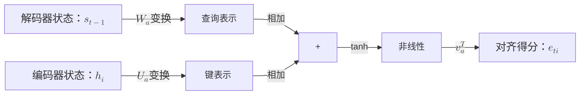
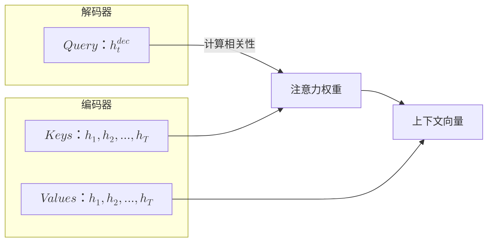
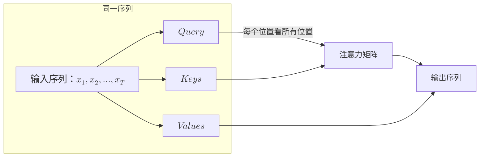
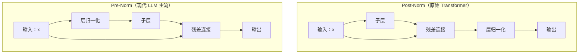
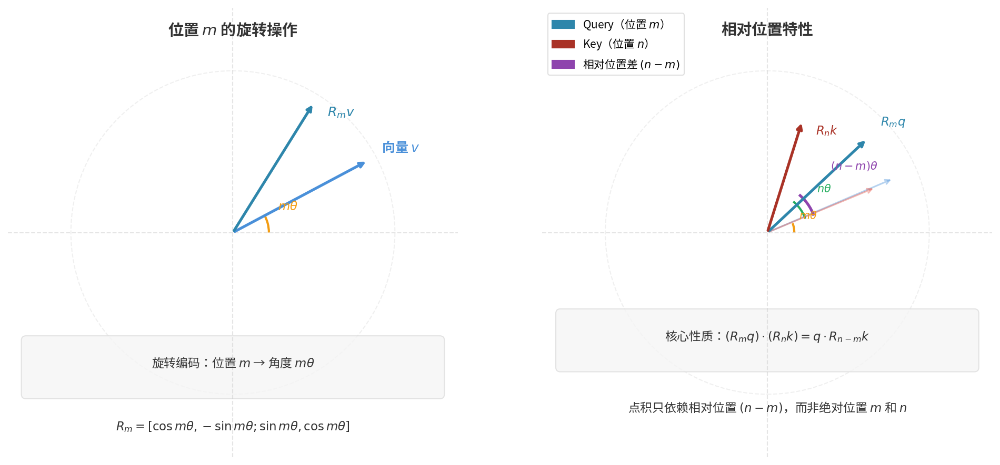
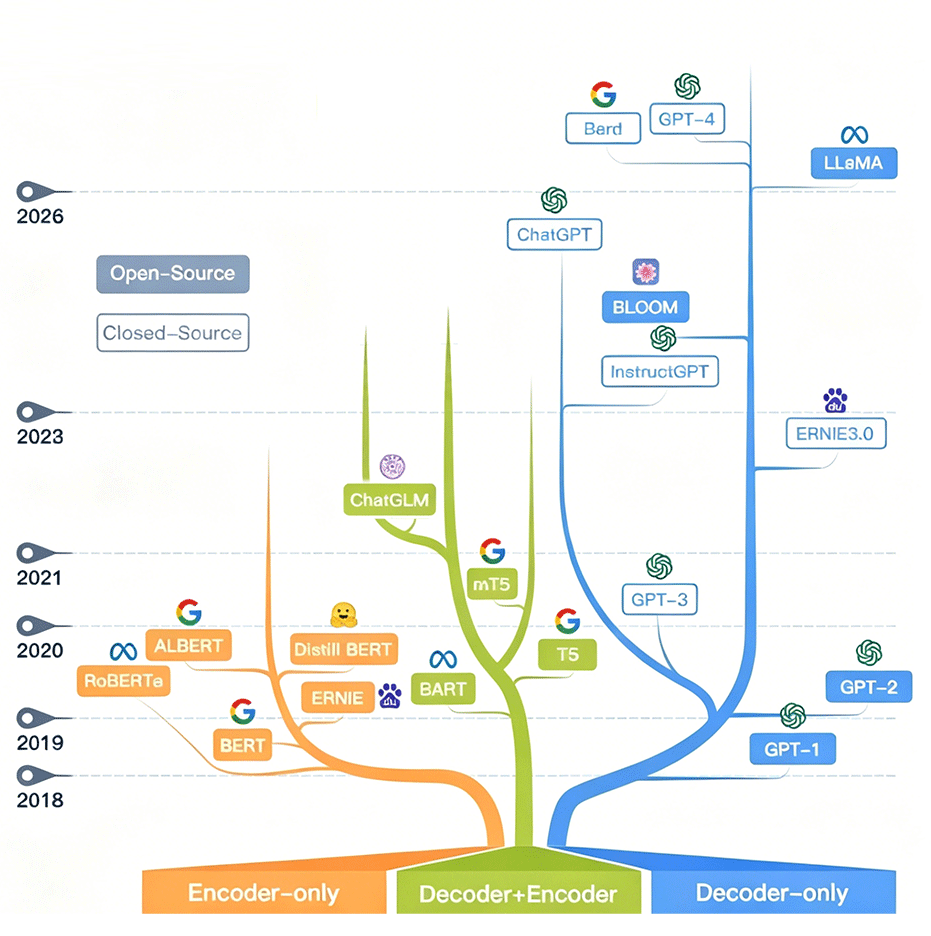

# Transformer 基础原理

在机器学习的历史上，2017 年是一个时代的分水岭。这一年，Google 公司发表了著名论文《Attention is All You Need》，提出了彻底抛弃循环神经网络，只使用注意力机制解决记忆与依赖问题的惊人设想。承载这个愿景的技术架构是 **Transformer**，它的历史使命是打断由 RNN 束缚在语言模型身上的并行锁链，囿于 RNN 每一个时刻的输出都必须以上一个时刻的隐藏状态作为输入，硬件的并行能力再强大也只能串行计算。"Attention is All You Need" 这个口号仿佛是向 RNN 征伐的檄文，传递了一个激进的信息：不需要 LSTM！不需要 GRU！不需要任何循环结构！只凭注意力机制就能构建出强大的序列模型。这个论断在当时引起了不小的争议，但随后的实践证明它是完全正确的。BERT、GPT、LLaMA、Claude、DeepSeek……这些闪亮名字都是以 Transformer 架构为基础取得的成果。

本文将从 RNN 的困境出发，逐步构建 Self-Attention 的直觉和数学表达，最终组装出完整的 Transformer 架构，并探讨它如何催生 BERT 和 GPT 两条截然不同的技术路线。

## 循环依赖到注意力机制

要理解 Transformer 架构，先要理解它要解决什么问题。2014 年的 [Seq2Seq](../../deep-learning/sequence-models/seq2seq.md) 虽然解决了信息瓶颈，但仍然是以 [LSTM/GRU](../../deep-learning/sequence-models/lstm-gru.md) 为基础的，循环神经网络局限性的根源是**序列的循环依赖**，时刻 $t$ 的计算必须等待时刻 $t-1$ 完成，因为当前时刻的输入要包含上一时刻的隐藏状态。这种接力棒式的信息传递，使得序列中的每个位置都无法独立处理。现代 GPU 拥有数千个计算核心，擅长大规模并行运算。但 RNN 的序列依赖设计天然地阻止了并行计算，迫使 GPU 串行执行，计算资源被严重浪费，这是 Transformer 要解决的问题。

序列依赖的另一个缺陷是长距离信息衰减。信息在 LSTM 的状态链中传递时，每经过一个时刻都会经历一次线性变换和非线性激活，即使是设计精良的门控机制，也只能缓解而无法完全阻止信息的逐渐丢失。假设序列长度为 100，时刻 1 的信息要传递到时刻 100，需要经过 99 次 LSTM 变换。每次变换都会对信息进行压缩和筛选，早期时刻的信息在传递过程中不断被稀释。这就像在玩传话游戏，第一个人说的"今天下午三点在图书馆开会"，传到第十个人可能变成"下午开会"，传到第一百个人可能只剩下"开会"两个字。

### Bahdanau 注意力

最初，人们尝试使用 Bahdanau 注意力机制来处理以上问题。Bahdanau 注意力（又称加性注意力）由巴赫达瑙（Dzmitry Bahdanau）在 2014 年提出，是一种对 Seq2Seq 架构的改进机制，与原版 Seq2Seq 的区别是解码器在生成每个词时，不再仅依赖一个固定的编码向量，而是动态地从编码器的所有隐藏状态中选择相关信息。具体来说，编码器不变，依然将输入序列编码为一系列隐藏状态 $(h_1, h_2, ..., h_T)$，解码器在时刻 $t$ 的隐藏状态 $s_t$ 会计算与此前每一个编码器隐藏状态的对齐得分，然后通过 Softmax 归一化得到注意力权重，再加权求和得到最终的上下文向量 $c_t$：

$$c_t = \sum_{i=1}^{T} \alpha_{ti} h_i$$

$\alpha_{ti}$ 被称为注意力权重，决定了解码器时刻 $t$ 对编码器隐藏状态 $h_i$ 的关注程度，好比人类语言中每个词语都有自己与前文的指代关系、语法关系。举个例子，"The cat, which already ate a fish, **was** hungry" 这句话中，"was" 应该关注的是 "cat" 而不是 "fish"。注意力权重是一盏对准此前所有时刻编码器隐藏状态的射灯，会把不同亮度的光线打向编码器的不同位置，权重越高，那个位置的信息就越清晰地被提取出来，而其他位置则相对暗淡。Bahdanau 注意力的权重值是通过一个前馈神经网络计算对齐得分，再经 Softmax 归一化得到的：

$$\alpha_{ti} = \frac{\exp(e_{ti})}{\sum_{j=1}^{T} \exp(e_{tj})}, \quad e_{ti} = v_a^T \tanh(W_a s_{t-1} + U_a h_i)$$

其中 $e_{ti}$（Softmax 的 logits）就是**对齐得分**（Alignment Score），它衡量解码器在时刻 $t$ 对编码器位置 $i$ 的关注程度，前面的例子中，处理 "was" 的时刻，"cat" 的对齐得分相对其他单词而言应是更高的。$e_{ti}$ 计算公式中的两个参数矩阵（$W_a$、$U_a$）和一个向量（$v_a$）都要从神经网络训练过程中学习得到的，它们的作用是：

- **$W_a$（查询变换矩阵）**：将解码器的隐藏状态 $s_{t-1}$ 映射到注意力空间。$s_{t-1}$ 代表解码器"当前想找什么"，$W_a$ 将这个意图转换成适合与编码器状态匹配的形式。形状通常是 $(d_{att}, d_{dec})$，其中 $d_{att}$ 是注意力隐藏层维度，$d_{dec}$ 是解码器隐藏状态维度。

- **$U_a$（键变换矩阵）**：将编码器的隐藏状态 $h_i$ 映射到注意力空间。$h_i$ 代表编码器位置 $i$ "有什么信息"，$U_a$ 将这个信息转换成适合与查询匹配的形式。形状通常是 $(d_{att}, d_{enc})$，其中 $d_{enc}$ 是编码器隐藏状态维度。

- **$v_a$（得分向量）**：将注意力隐藏层的输出投影为标量得分。$v_a$ 的作用是从混合后的表示中提取出一个数值，作为对齐得分。形状是 $(d_{att}, 1)$，可以理解为对注意力隐藏层的加权求和。

以上查询变换矩阵 $W_a$、值变换矩阵 $U_a$、得分向量 $v_a$ 启发了后续自注意力机制中 Query、Key、Value 的设计。Bahdanau 注意力权重的整个计算过程可以用下图来表示：


*图：Bahdanau 注意力计算过程*

相比改进前的 Seq2Seq 架构，Bahdanau 注意力机制带来了三个显著的优势。首先是维度灵活性，$W_a$ 和 $U_a$ 可以有不同的输入维度，允许编码器和解码器使用不同大小的隐藏状态。这在编码器和解码器的网络结构不同时特别有用。其次是非线性建模能力，tanh 激活函数允许模型学习到更复杂的对齐模式，而不仅仅是简单的相似度计算。最后是可学习的匹配机制，三个参数矩阵都是可学习的，模型可以通过训练自动发现最优的对齐策略，不需要人工设计对齐函数。

Bahdanau 注意力机制下，解码器可以直接看到编码器的所有时刻状态，不必依赖单一编码向量。但是，Bahdanau 注意力是一种**交叉注意力**（Cross-Attention），它连接的是编码器和解码器两个不同的序列。编码器和解码器内部用的仍然是 LSTM/GRU 在处理序列依赖，编码过程仍然是串行的，处理输入序列时，长距离依赖问题也依然存在。在 Bahdanau 注意力机制的设计里，注意力机制本来就只是辅助工具，LSTM/GRU 才是核心引擎，即使给一辆马车装上了卫星导航，虽然能看得更远，但动力系统仍然是马匹，这个设计决定了串行计算问题没有被根本性解决。

Transformer 架构提出了比 Bahdanau 注意力机制更加彻底的改进方案，将注意力从"辅助"升格为"核心"，放弃使用 LSTM 或 GRU，完全用注意力机制来处理序列中的依赖关系。这个改变终于打破了序列依赖的枷锁，令注意力机制可以在一次计算中同时处理序列中的所有位置，实现真正的并行化。

### 自注意力

从 Bahdanau 注意力到 Transformer 架构的**自注意力**（Self-Attention），不仅是技术细节的改变，更是设计哲学的转变。必须理解这个转变才可能真正掌握 Transformer。本节将详细对比交叉注意力与自注意力的区别，并解释自注意力如何打破序列锁链。

之所以说 Bahdanau 注意力是交叉注意力，是指它的查询（Query）来自解码器，而键（Key）和值（Value）却来自编码器。解码器在生成每个词时，要先询问编码器：我应该关注输入序列的哪个部分？


*图：交叉注意力*

上图展示了交叉注意力的信息流向：解码器提供查询，编码器提供键和值，注意力机制计算过程中，两者交叉相关，输出上下文向量是两个序列之间的对话协商的结果。自注意力（Self-Attention）则不同，查询、键、值都来自同一个输入序列，不依赖于编码器或解码器。序列中的每个位置都可以看到序列中的所有其他位置，能够直接建立任意两个位置之间的关联。


*图：自注意力*

上图展示了自注意力的信息流向：同一个输入序列生成查询、键、值三个表示，每个位置可以同时关注所有位置，每个词元都能够在序列内部自我审视。假设输入序列是"猫 坐 在 垫子 上"，包含五个词元。自注意力让每个词元都能同时看到其他所有词元，并计算与它们的关联程度。在"猫"这个词元被处理时，会同时关注序列中的所有词元：关注"猫"本身以理解主语是什么，关注"坐"以理解主语的动作，关注"垫子"以理解动作相关的对象，对"在"、"上"的关注度较低因为介词对理解主语贡献较小。同理，在"垫子"这个词元被处理时，同样会同时关注所有词元：关注"垫子"本身以理解对象是什么，关注"坐"以理解与动作的关系，关注"猫"以理解是谁在垫子上，对"在"、"上"的关注度较低。

这个设计里，词元不再有时刻顺序上的计算约束，每个位置得以独立计算自己的注意力权重，所有位置的处理是同时进行的，不存在时刻 1 处理"猫"、时刻 2 处理"坐"这样的串行依赖了。至此，Seq2Seq 架构的两大缺陷终于被彻底解决：

- **并行计算**：所有位置的计算可以同时进行，充分利用 GPU 的并行能力。序列长度为 $T$ 时，RNN 需要 $T$ 次串行计算，自注意力只需要 1 次（忽略内部矩阵运算的细节）并行计算就能完成，正是由于这个突破，才让"语言模型"发展成几百亿参数的"大语言模型"成为可能。
- **距离衰减**：每个位置都能直接看到所有其他位置，不存在信息传递的距离衰减。位置 1 和位置 100 之间的关联，与位置 1 和位置 2 之间的关联，计算方式完全相同，不存在"传话游戏"的信息丢失，正是由于这个突破，才让序列模型的上限从处理几个句子的短文发展成能够处理数万甚至数十万词元的大型文档成为可能。

## 自注意力的数学表达

理解了自注意力的发展背景之后，现在我们来严谨地构建出它的数学表达。自注意力的关键是查询（Query）、键（Key）、值（Value）三个向量，以及它们之间的计算方式。本节先通过一个直觉类比来建立直观理解，再逐步推导出完整的数学公式。

Query、Key、Value 这三个术语借鉴自信息检索领域。想象你在图书馆的书架上查找一本书，检索过程应该是这样的：

- **Query（查询）**：是你心中的需求，譬如"我想找一本关于机器学习的入门书"、"我想找作者是周志明的书籍"、"我想找《深入理解 Java 虚拟机》"。这是你用来询问系统的内容。
- **Key（键）**：是每本书固有的标签属性，譬如书名、作者、分类号。这是系统用来匹配你需求的内容。
- **Value（值）**：是书的内容本身。当你通过匹配找到书籍后，希望获得的自然是书的内容。

自注意力机制将你的 Query 与每本书的 Key 进行比较，计算出代表匹配程度的相关性得分。匹配程度高的书，其 Value 对你的贡献更大，匹配程度低的书，贡献较小。最终你获得的是所有书的 Value 的加权组合。以上是基于人类直觉对注意力机制的理解，下面用数学语言来表述注意力机制的完整计算过程：

设 $X = [x_1, x_2, ..., x_T]$ 是输入序列形成的输入矩阵，它的形状为 $(T, d_{model})$，表示 $T$ 个位置、每个位置都是一个 $d_{model}$ 维的嵌入向量。自注意力机制需要将输入向量投影到三个不同的语义空间中。Query 空间用于询问，Key 空间用于匹配，Value 空间用于输出信息。将序列中的每个位置 $i$ 的这三个向量堆叠成三个矩阵：

$$Q = [query_1, query_2, ..., query_T]^T, \quad K = [key_1, key_2, ..., key_T]^T, \quad V = [value_1, value_2, ..., value_T]^T$$

在[线性变换的几何直观](../../maths/linear/matrices.md#线性变换的几何直观)中曾讲解过矩阵的本质就是数据线性变换的转换器，Transformer 使用三个可学习的参数矩阵 $W^Q, W^K, W^V$ 来完成三种语义空间的转换：

$$Q = XW^Q, \quad K = XW^K, \quad V = XW^V$$

这三个参数矩阵让模型能够灵活地学习"如何提问"、"如何被匹配"、"如何提供信息"三种不同的能力。它们是自注意力层中唯一的可学习参数，在神经网络中的位置和作用方式可视同为自注意力层的"权重"，类似于全连接层的权重矩阵。区别只是它们不是独立的神经网络层，而是单个自注意力模块内部的参数而已。代码实现时，通常就直接将它们定义为三个不带偏置的独立 `nn.Linear` 层。初始阶段，这些矩阵是随机初始化的，经过大量数据的反向传播训练后，它们会学习到如何将输入向量投影到合适的语义空间。

### 缩放点积注意力

得到 $Q$、$K$、$V$ 以后，下一步是计算注意力权重和输出。Transformer 使用权重计算方式称为**缩放点积注意力**（Scaled Dot-Product Attention），计算公式为：

$$[att_eq]Attention(Q, K, V) = Softmax\left(\frac{QK^T}{\sqrt{d_k}}\right)V$$

这个公式现在已广为人知，无论受众是否能理解其内容，在许多宣传场合都已成为注意力计算的代名词。它包含了相关性得分计算、注意力缩放、归一化及加权求和四个步骤：

- 第一步 **计算相关性得分**：$QK^T$ 的结果表示序列中每对位置之间的相关性得分。具体来说，是通过位置 $i$ 的 Query 向量 $query_i$ 与位置 $j$ 的 Key 向量 $key_j$ 的[点积](../../maths/linear/vectors.md#内积与投影) $query_i \cdot key_j$，衡量位置 $i$ 对位置 $j$ 的关注程度。在[向量基础](../../maths/linear/vectors.md)中曾经讲解过，点积越大，两个向量就越相似，关注程度越高。

- 第二步 **缩放**：将相关性得分乘以缩放因子 $\frac{1}{\sqrt{d_k}}$ ，这是 Transformer 论文中的一个工程创新。

    缩放因子中的 $d_k$ 是 Key 向量的维度（同时也是 Query 向量的维度）。在 Transformer 的设计中，Query 和 Key 的投影维度相同，统一记为 $d_k$，Value 的投影维度记为 $d_v$。原始论文中设置 $d_k = d_v = d_{model} / h$，其中 $h$ 是注意力头的数量（关于多头注意力将在后文介绍）。

    Softmax 求的是各 logits 所占的比例，所以缩放操作在数学上不影响结果，但在工程上会影响训练效率。假设 $query_i$ 和 $key_j$ 的每个元素都是独立同分布的随机变量，均值为 0，方差为 1。那么点积 $query_i \cdot key_j = \sum_{l=1}^{d_k} query_{il} \cdot key_{jl}$ 的均值仍为 0，方差却变为 $d_k$（因为 $d_k$ 个独立随机变量的和）。当 $d_k$ 较大时，点积的值会变得很大，导致 Softmax 函数进入饱和区。在饱和区，Softmax 的梯度趋近于 0，训练变得困难。缩放因子 $\frac{1}{\sqrt{d_k}}$ 将点积的方差归一化为 1，保持 Softmax 在非饱和区，提升训练效率。

- 第三步 **Softmax 归一化**：对缩放后的得分矩阵应用 Softmax，把得分转换为概率分布，$\alpha_{ij}$ 表示位置 $i$ 对位置 $j$ 的注意力权重，满足 $\sum_{j=1}^{T} \alpha_{ij} = 1$。这意味着每个位置对所有位置的注意力权重之和为 1，形成一个有效的概率分布。

    $$\alpha_{ij} = \frac{\exp(q_i \cdot k_j / \sqrt{d_k})}{\sum_{l=1}^{T} \exp(q_i \cdot k_l / \sqrt{d_k})}$$   

- 第四步 **加权求和**：用注意力权重对 Value 进行加权求和：

    $$output_i = \sum_{j=1}^{T} \alpha_{ij} v_j$$

    位置 $i$ 的输出是所有位置 Value 的加权和，整体公式可以理解为每个位置根据自己与其他位置的相似度，动态决定从哪些位置提取信息，最终输出便是一个融合了全局信息的向量。

### 计算流程

下面用一个具体的例子演示自注意力机制的完整计算流程。假设输入序列是"猫 坐 在 垫子"，共 4 个词，每个词的嵌入维度 $d_{model} = 4$，投影维度 $d_k = d_v = 3$。下面的代码展示了线性变换生成 Q/K/V、缩放点积注意力计算、以及最终的加权求和输出的全过程。

```python runnable
import torch
import torch.nn.functional as F

# 输入序列：4 个词，每个词 4 维嵌入
# 假设已经过嵌入层处理
X = torch.tensor([
    [0.1, 0.2, 0.3, 0.4],  # 猫
    [0.5, 0.6, 0.7, 0.8],  # 坐
    [0.2, 0.1, 0.4, 0.3],  # 在
    [0.3, 0.4, 0.1, 0.2],  # 垫子
])

print(f"输入矩阵 X 形状: {X.shape} (序列长度 × 嵌入维度)")

# 可学习的投影矩阵（随机初始化）
d_model = 4
d_k = 3
torch.manual_seed(42)

W_Q = torch.randn(d_model, d_k)
W_K = torch.randn(d_model, d_k)
W_V = torch.randn(d_model, d_k)

# 线性变换生成 Q, K, V
Q = X @ W_Q  # (4, 3)
K = X @ W_K  # (4, 3)
V = X @ W_V  # (4, 3)

print(f"Q 形状: {Q.shape} (序列长度 × 投影维度)")
print(f"K 形状: {K.shape}")
print(f"V 形状: {V.shape}")

# 计算注意力得分
scores = Q @ K.T  # (4, 4)
print(f"\n注意力得分矩阵（缩放前）:\n{scores}")

# 缩放
scores_scaled = scores / (d_k ** 0.5)
print(f"\n注意力得分矩阵（缩放后）:\n{scores_scaled}")

# Softmax 归一化
attention_weights = F.softmax(scores_scaled, dim=-1)
print(f"\n注意力权重矩阵:\n{attention_weights}")
print(f"每行和为 1: {attention_weights.sum(dim=-1)}")

# 加权求和
output = attention_weights @ V
print(f"\n输出矩阵形状: {output.shape}")
print(f"输出矩阵:\n{output}")
```

## Transformer 组件

自注意力机制是 Transformer 架构的核心，但一个完整的 Transformer 架构还需要其他组件的配合。本节将为组装出完整的模型做准备，介绍多头注意力、前馈神经网络、残差连接与层归一化等关键组件。

### 多头注意力

在自然语言中，词与词之间的关系是多样的，如语法关系（主语与动词的一致性）、属性关系（形容词对名词的属性修饰）、指代关系（代词与其先行词的关联）……用单一的注意力模式难以同时捕捉这些不同类型的关系。以"那只猫坐在垫子上，它看起来很舒服"这句话为例，"它"这个词元需要与句子其他词元建立多种关联：
- 指代关系：指向前面的"猫"而不是"垫子"。
- 语法关系：与"看起来"形成主谓结构。
- 语义关系：与"舒服"形成语义搭配。
- ……

每个位置的单头注意力只生成一套注意力权重分布，我们能够通过注意力知道"它"与"垫子"、"看起来"、"舒服"都有关联，但并不能清楚描述每种关联之间的差异。所有位置共享着同一套投影参数矩阵 $W^Q, W^K, W^V$，这意味着模型必须把指代、属性、语法、语义、因果等各种关系模式抽象压缩成一种将抽象的 Query 与 Key 匹配的模式，单头注意力只输出一个注意力分布，这个分布就要同时兼顾所有关系，导致每种关系的信息都被稀释，各种关系之间也会相互干扰。

要解决信息被稀释的问题，一个最直接的想法是增加投影矩阵的维度，扩大信息容量。譬如将 $d_k$ 从 64 增加到 512，投影矩阵 $W^Q, W^K, W^V$ 的参数量增加 8 倍，模型的表达能力确实会增强。但这种方式还是存在两个问题：

1. **参数效率降低**：更大的投影矩阵意味着更多的参数，这些参数不容易被高效利用。实验表明，单头大维度注意力的参数效率低于稍后介绍的多头注意力。
2. **缺乏结构化表示**：无论维度多大，学习到的依然是一种混合的关系表示，难以显式地区分不同类型的关系。模型需要从数据中隐式地学习如何将不同的关系编码到同一个向量空间中，这增加了学习难度。

因此，**多头注意力**（Multi-Head Attention）的解决方案就自然被摆上台面，并行运行多个独立的单头注意力，每个**头**（Head）学习不同的关注模式，最后将所有头的输出拼接起来，让模型能从多个视角同时观察序列。举个具体例子，假设将原来维度为 $d_{model} = 512$ 的单头注意力，现在改为 8 个维度为 64 的多头注意力，这两种设计的总参数量是一样的，如下表所示：

| 设计 | 头数 | 每头维度 | 投影矩阵形状 | 参数量 |
|:-----|:-----|:---------|:-------------|:-------|
| 单头 | 1 | 512 | $W^Q, W^K, W^V \in \mathbb{R}^{512 \times 512}$ | $3 \times 512 \times 512 = 786,432$ |
| 多头 | 8 | 64 | $W_i^Q, W_i^K, W_i^V \in \mathbb{R}^{512 \times 64}$ | $8 \times 3 \times 512 \times 64 = 786,432$ |

多头注意力并没有增加额外的学习成本，在一样的参数量下满足了关系的多样性，不需要再让一个"大头"隐式地糅合所有关系模式，每个头可以各自学习不同的关注模式，头 1 可能专注于语法关系、头 2 可能专注于语义关系，等等。

多头注意力天然倾向于捕捉不一样的关系。只要让每个头分配不同的随机初始值，梯度下降算法会沿着不同的路径进行优化，各个头之间自然产生分化。即使罕见情况下，两个头被随机到很接近的初始值，有着接近的优化路径，学习到类似的关系时，也会由于目标是同一个损失函数（各个头优化时的梯度是独立的，但是优化目标是同一个损失函数），而被正则化惩罚机制（如 L2 正则化、Dropout）逼迫着分化学习不同的关系。这保证了模型可以高效捕捉到不同的关注模式。这种分而治之的策略，让每个头的学习目标更加明确，训练更加有效。

### 前馈神经网络

当读到"苹果发布了新手机"这句话时，注意力机制帮助我们发现"苹果"与"发布"、"手机"之间的关联。而理解"苹果"在这里指的是科技公司而非水果，理解"发布"意味着产品上市而非抛物动作，理解整句话描述的是一个商业事件，这些都需要语义加工来完成。注意力负责"看哪里"，语义加工负责"看懂是什么"。

Transformer 在每个注意力层之后添加一个**前馈神经网络**（Feed-Forward Network，FFN）来完成语义加工，对收集到的信息进行理解、提炼和转化。FFN 是一种与 RNN 相对的网络概念，强调信息向前流动无反馈链接。在通用的多层网络语境下，FFN 与 MLP 可以认为指代的就是同一种网络（一个强调信息流向，一个强调结构）。但在 Transformer 语境中，FFN 被限定为一种只有两层、中间隐藏层的维度通常是输入/输出层维度的 4 倍的全连接网络。它的数学表示为：

$$FFN(x) = ReLU(xW_1 + b_1)W_2 + b_2$$

FFN 的第一层将维度从 $d_{model}$ 扩展到 $d_{ff}$（通常是 $4 \times d_{model}$），应用 ReLU 激活函数引入非线性，第二层将维度从 $d_{ff}$ 压缩回 $d_{model}$。

语义加工任务本质上是一个[模式匹配](https://en.wikipedia.org/wiki/Pattern_matching)过程，输入向量中的某些特征组合对应某个概念，需要被识别并激活。两层的前馈网络恰好能完美适配这类任务。第一层将输入投影到高维空间，每个隐藏神经元可以学习识别一种特征组合（如"科技公司苹果"的语义特征），ReLU 激活那些匹配的模式；第二层将激活的模式组合回输出空间。

使用更深层的网络来完成语义加工也并无不可，但研究表明两层已足够，语义加工任务不同于复杂函数逼近，它是一种稀疏模式的激活过程。根据实验，语言模型中的 FFN 实际上在执行类似键值记忆检索的操作，第一层权重作为"键"匹配输入模式，第二层权重作为"值"输出对应知识。两层结构恰好对应这个"匹配 - 检索"的过程。

### 残差连接

当 Transformer 堆叠多层时，信息需要经过数十次甚至上百次的变换才能从输入层传递到输出层。以 GPT-3 为例，它有 96 层 Transformer 层，每层包含注意力子层和前馈网络子层，意味着信息要经过近 200 次变换。每次变换都会对信息进行加工，但同时也伴随着梯度消失梯度爆炸的风险，导致深层参数难以有效更新。

残差连接的解决方案非常直接，将子层的输入直接加到输出上，让网络学习残差关系而非完整的映射关系。显然这个设计直接来自 [ResNet](../../deep-learning/convolutional-neural-network/resnet.md) 的思想。假如某一层理想的变换是恒等映射（输出等于输入），那么让网络学习 $F(x) = 0$ 比学习 $F(x) = x$ 要容易得多。梯度可以通过残差路径直接传递，不需要经过子层的复杂变换。

残差连接的另一个好处是信息保留。每一层的输出都包含了原始输入的信息，即使经过多层变换，早期信息也不会完全丢失。这对于语言模型特别有用，句子的主语可能出现在开头，而谓语出现在结尾，模型当然需要在处理谓语时仍然记得主语是什么。

### 层归一化

Transformer 使用残差连接解决了梯度传递问题，数值稳定性问题则使用层归一化来解决，**层归一化**（Layer Normalization，LN）是[批归一化](../../deep-learning/neural-network-stability/batch-normalization.md)的一种变体，作用与批归一化相同，是将每个位置的特征归一化到相似的数值分布范围之中。对于深层网络，每一层的输出数值范围可能差异很大，有的层输出集中在 0 附近，有的层输出可能达到几百甚至几千。这种数值分布的不一致会导致训练不稳定，学习率难以调节。

层归一化与批归一化的区别在于归一化的维度。批归一化在批次维度上统计均值和方差，层归一化在特征维度上进行统计。这使得层归一化不依赖批次大小，统计量完全来自单个样本内部，与 Batch Size 完全无关。层归一化天然适用于 RNN 和 Transformer，每个时刻的隐藏状态可以独立标准化，训练和推理行为保持一致。


设 $\mu_L$ 和 $\sigma_L^2$ 是样本所有特征的均值和方差，$x$ 是输入向量，$d$ 是特征维度（即向量长度），则它们的计算公式为：

$$\sigma_L^2 = \frac{1}{d}\sum_{j=1}^{d} (x_j - \mu_L)^2, \quad \mu_L = \frac{1}{d}\sum_{j=1}^{d} x_j$$

然后配合 $\gamma$ 和 $\beta$ 两个可学习的缩放和偏移参数（作用与 BN 的两个修正因子相同），支撑模型恢复原始的分布特性：

$$LayerNorm(x) = \frac{x - \mu}{\sigma} \cdot \gamma + \beta$$

残差连接和层归一化的组合顺序有两种设计。原始 Transformer 使用 **Post-Norm**，先计算子层（注意力层或 FFN 层），再加残差，最后归一化。这种设计在训练深层网络时容易出现梯度消失，需要精心设计学习率预热策略。假设一个 12 层的 Post-Norm 模型，梯度从第 12 层传到第 1 层需要经过 12 次层归一化，每次归一化都会对梯度进行缩放，累积效应导致浅层梯度非常小。

现代 LLM（如 GPT、DeepSeek）普遍使用 **Pre-Norm**：先归一化，再计算子层，最后加残差。这种设计让梯度可以直接通过残差路径传递到任意深层，因为残差路径上没有层归一化。训练更加稳定，可以使用更大的学习率。实验表明，Pre-Norm 在深层网络（超过 12 层）上显著优于 Post-Norm，这也是现代大语言模型能够堆叠上百层的关键技术之一。


*图：Post-Norm vs Pre-Norm*

## 位置编码

自注意力机制解决了序列依赖和长距离信息衰减两大难题，但同时也引入了一个新的问题：它对序列中位置的顺序是不感知的。将输入序列"猫坐在垫子上"打乱成"上垫子在坐猫"，自注意力的计算过程与结果完全不变，只是注意力矩阵的行列顺序变了。对于自然语言，语义不仅包含在词元里，有相当一部分语义是掩藏在位置中的，如"狗咬人"和"人咬狗"含义就完全不同。Transformer 通过**位置编码**（Positional Encoding）来注入位置信息，让模型知道每个词在序列中的位置。位置编码的设计需要满足以下几个要求：

- **唯一性**：每个位置应该有唯一的编码，不同位置的编码应该能够区分。
- **确定性**：编码应该是确定性的，不需要从数据中学习。
- **外推能力**：应该能够处理训练时未见过的序列长度。
- **相对位置感知**：模型应该能够学习到相对位置关系，而非仅仅记住绝对位置。

### Sinusoidal 位置编码

原始 Transformer 论文使用 **Sinusoidal 位置编码**，这是一种固定（不可学习）的编码方式，用一组不同频率的正弦和余弦函数来编码位置信息，形成一个位置指纹。位置编码是一个形状为 $(\text{序列长度}, d_{model})$ 的矩阵，假设 $pos$ 是位置索引 $(0, 1, 2, ...)$，表示词在序列中的位置；$i$ 是维度索引 $(0, 1, 2, ..., d_{model}/2 - 1$)，偶数维度使用 sin，奇数维度使用 cos。则位置编码矩阵中每个元素的计算方式为：

$$PE_{pos, 2i} = \sin\left(\frac{pos}{10000^{2i/d_{model}}}\right)$$

$$PE_{pos, 2i+1} = \cos\left(\frac{pos}{10000^{2i/d_{model}}}\right)$$

Sinusoidal 位置编码的设计颇有巧妙之处，从以下三点可见一斑：

- **多频率表示**。位置编码使用了一组不同频率的正弦和余弦函数。公式中的 $10000^{2i/d_{model}}$ 决定了不同维度的周期，低维度使用高频信号（周期短），能够区分相邻位置；高维度使用低频信号（周期长），能够捕捉全局位置关系。这类似于音频处理中的多分辨率分析，不同频率捕捉不同尺度的信息。

- **相对位置编码能力**。这是 Sinusoidal 编码最关键的性质。对于固定的偏移 $k$，$PE_{pos+k}$ 可以表示为 $PE_{pos}$ 的线性函数。利用三角恒等式：

    $$\sin(a + b) = \sin a \cos b + \cos a \sin b$$
    $$\cos(a + b) = \cos a \cos b - \sin a \sin b$$

    可以推导出：

    $$PE_{pos+k, 2i} = PE_{pos, 2i} \cdot \cos\left(\frac{k}{10000^{2i/d}}\right) + PE_{pos, 2i+1} \cdot \sin\left(\frac{k}{10000^{2i/d}}\right)$$

    这意味着模型能够学习到相对位置的概念，如"位置 $i$ 和位置 $j$ 相差多少"比"位置 $i$ 是多少"更重要。在自然语言中，"猫"和"坐"的关系主要取决于它们相隔多远，而非它们分别在什么绝对位置。

- **基本的外推能力**。Sinusoidal 编码是一个连续函数，而非离散的查找表。这意味着它可以处理训练时未见过的位置长度。如果训练时最长序列是 512，推理时遇到位置 600，编码公式依然可以计算出合理的值。这种外推能力对于处理长文本非常重要。

在使用时，位置编码被加到直接输入的词嵌入向量上 $input = Embedding(x) + PE$，每个词的表示既包含语义信息（词嵌入向量），也包含位置信息（位置编码）。相加而非拼接的设计是为了保持模型维度的简洁，位置信息和语义信息在后续的变换中会自动分离和融合。

### RoPE 旋转位置编码

Sinusoidal 编码是一种绝对位置编码，"绝对"是指直接编码"这是第 $pos$ 个位置"。虽然它具有表达相对位置编码能力，但位置编码本身是绝对位置的形式。现代 LLM 普遍使用 **旋转位置编码**（Rotary Position Embedding，RoPE），由苏剑林在 2021 年提出。这就是一种相对位置编码，记录"位置 $i$ 和位置 $j$ 之间的相对距离"。RoPE 的思想是将位置信息编码为向量空间中的旋转操作。对于位置 $m$ 的二维向量 $x = [x_1, x_2]^T$，应用旋转矩阵 $R_m$：

$$R_m = \begin{bmatrix} \cos m\theta & -\sin m\theta \\ \sin m\theta & \cos m\theta \end{bmatrix}$$

旋转后的向量 $R_m x$ 既包含原始向量信息，也包含位置 $m$ 的信息。对于高维向量，可以将其分成若干个二维子空间，每个子空间独立应用旋转，使用不同的频率 $\theta_i$：

$$\theta_i = 10000^{-2i/d} = \frac{1}{10000^{2i/d}}$$

其中 $i$ 是维度索引，范围 $[0, d/2-1]$，$d$ 是嵌入维度。显然这个设计 RoPE 继承自 Sinusoidal 编码的频率设计，分母 $10000^{2i/d}$ 是控制不同维度周期的钥匙。RoPE 将频率概念从加法编码改造为旋转编码的形式，形成从高频到低频的多尺度位置表示：

| 维度 $i$ | $\theta_i$ 的值 | 波长 | 作用 |
|:---------|:----------------|:-----|:-----|
| $i=0$（低维） | $1.0$ | 短 | 捕捉局部/精细位置关系 |
| $i=d/2-1$（高维） | $\approx 0.0001$ | 长 | 捕捉全局/远距离位置关系 |

高频维度（小 $i$）对相邻词元的位置差异敏感，每一步旋转角度大，能够区分"第 1 个位置"和"第 2 个位置"这样的精细差异。低频维度（大 $i$）每一步旋转角度极小，在长距离上累积的相位变化才显著，适合捕捉"相隔 100 个位置"这样的全局关系。这种多尺度设计让模型同时具备精细的局部位置感知和稳定的全局位置感知。当处理"那只昨天在公园里被主人遗弃的猫看起来很伤心"这样的长句时，模型既需要知道"猫"和"遗弃"相邻（局部关系），也需要知道"猫"和"伤心"相隔较远（全局关系），多尺度频率恰好满足了这种需求。



*图：左图展示位置 $m$ 的旋转矩阵将向量旋转角度 $m\theta$；右图展示两个位置的 Query 和 Key 经过旋转后，其点积只依赖相对位置差 $(n-m)$*

处理相对关系时，RoPE 具有一个很好的性质，两个位置的 Query 和 Key 的点积，只依赖于它们的相对位置差（如上图右边）：

$$(R_m q) \cdot (R_n k) = q \cdot R_{n-m} k$$

该性质的证明利用了旋转矩阵的正交性。两个旋转矩阵的乘积 $R_m^T R_n = R_{n-m}$，因此：

$$(R_m q) \cdot (R_n k) = (R_m q)^T (R_n k) = q^T R_m^T R_n k = q^T R_{n-m} k$$

这意味着注意力得分只与相对位置 $(n-m)$ 有关，而非绝对位置 $m$ 和 $n$，更符合语言的直觉："猫坐在垫子上"中，"猫"和"坐"的关系取决于它们相隔多远，而非它们分别在什么位置。

RoPE 与 Sinusoidal 两种位置编码方式各有优势。Sinusoidal 的优势是编码简单直观，易于理解和实现；RoPE 稍微复杂一些，它的优势主要体现在以下三个方面：

- **较好的长距离外推能力**。RoPE 的相对位置特性使得模型更容易泛化到训练时未见过的序列长度。当序列长度超过训练时的最大长度时，RoPE 可以通过插值等方法扩展位置编码，而 Sinusoidal 编码的外推能力相对更有限。
- **与注意力机制天然融合**。RoPE 直接作用于 Query 和 Key 的点积计算，而非作为额外的输入加到嵌入上。这种设计让位置信息直接参与注意力权重的计算，更加自然和高效。
- **现代 LLM 的标准选择**。LLaMA、GPT-NeoX、PaLM、DeepSeek 等主流模型都使用 RoPE，这已经成为现代大语言模型的事实标准。社区的广泛采用也意味着更好的工具支持和实践经验。

## 组装 Transformer 模型

至此，Transformer 的多头注意力、前馈神经网络、残差连接与层归一化四个核心组件与位置编码都已介绍完毕。组装 Transformer 模型的所有前置条件已经具备。本节将给出完整的 Transformer 模型结构。

### 编码器层结构

Transformer 的四个组件并非简单堆砌，而是有着明确的分工和协作关系。要使它们形成了一个"收集 - 加工 - 传递 - 稳定"的信息循环，每个编码器层都将执行一次这样的循环。

- **多头自注意力**负责信息收集，从序列中提取全局依赖关系，决定"看哪里"。
- **前馈神经网络**负责信息加工，对收集到的信息进行语义理解和转化，决定"看懂是什么"。
- **残差连接**负责信息传递，保证梯度流畅，避免深层网络的训练困难，决定"能构建多深"。
- **层归一化**负责数值稳定，控制每层的输出分布，避免训练崩溃，决定"能否成功收敛"。

我们要将这些组件组合成一个完整的编码器架构，原始 Transformer 论文将以上四个组件组织为"自注意力子层"和"前馈网络子层"两个子层，下面用架构图展示一个完整的 Transformer 编码器层。

```nn-arch width=500
name: Transformer 编码器层
layout: horizontal
align: center

sections:
  - name: 输入
    layers: [input]
  - name: 自注意力子层
    layers: [mha, add1, ln1]
  - name: 前馈网络子层
    layers: [ffn, add2, ln2]
  - name: 输出
    layers: [output]

layers:
  - {id: input, name: "input", type: input, size: "(T, d_model)"}
  - {id: mha, name: "Attention", type: attention, size: "多头注意力"}
  - {id: add1, name: "+", type: residual, size: "残差连接"}
  - {id: ln1, name: "Post-Norm", type: norm, size: "层归一化"}
  - {id: ffn, name: "FFN", type: dense, size: "两层全连接"}
  - {id: add2, name: "+", type: residual, size: "残差连接"}
  - {id: ln2, name: "Post-Norm", type: norm, size: "层归一化"}
  - {id: output, name: "output", type: output, size: "(T, d_model)"}
```
*图：Transformer 编码器层*

输入向量 $(T, d_{model})$ 首先进入注意力子层，多头自注意力从序列中收集全局信息，然后进入前馈子层，前馈神经网络对信息进行语义加工，残差连接保留原有表示。最终输出与输入形状相同，保证了多个这样的编码器层可以重复堆叠。

这种"注意力 + 前馈"的双子层设计有其考量。注意力机制擅长建立序列内部的关联，但它的计算是线性的，输出是输入的加权求和，不具备非线性变换能力。如果连续堆叠多个注意力层，模型的表达能力将受到限制。前馈神经网络的加入打破了这种线性结构，引入了表达能力更强的非线性变换，让每一层都能对信息进行深度加工。

残差连接和层归一化的位置也有讲究。本节采用的依然是 Transformer 原始论文中的结构，即 Post-Norm 形式，在相对较深的网络中存在比较严重的梯度衰减问题。[层归一化](#层归一化)已说明过现代 LLM 中普遍采用的是 Pre-Norm 形式，优势是子层计算不会受到前一层输出数值波动的影响，残差连接直接将原始输入（未归一化）加到输出上，梯度无损传递。

Transformer 编码器部分由 $N$ 个这样的编码器层堆叠而成。原始论文使用 $N=6$，每层 $d_{model}=512$，8 个注意力头，前馈网络隐藏层维度 $d_{ff}=2048$。现代大语言模型的规模远超于此，如 GPT-3 有 96 层，LLaMA-65B 有 80 层。层数的增加意味着信息经过更多轮"收集 - 加工"的循环，每一层都在上一层的表示基础上进一步提炼和整合，最终形成高质量的语义表示。

也许读者在这里会产生疑问，理论上，单层的注意力已经能看到所有位置，应该能捕捉所有依赖关系，高质量的语义为何与堆叠层数相关？实际上，人类语言的复杂性远超单层模型的能力。以"那只昨天在公园里被主人遗弃的猫看起来很伤心"这句话为例，要理解"伤心"的主语是"猫"，需要经过多层推理：

- 第 1 层：建立基本的词间关联，"猫"与"遗弃"、"伤心"建立初步联系。
- 第 2-3 层：识别修饰结构，"昨天在公园里"修饰"遗弃"，"被主人遗弃"修饰"猫"。
- 第 4-5 层：整合语义信息，理解"遗弃"导致"伤心"的因果关系。
- 第 6 层及以上：形成完整的语义表示，"猫"是"伤心"的主语，原因是"被遗弃"。
- ……

每一层都在处理不同层次的语义信息，从词法关联到句法结构，再到语义推理。这种分层处理、逐层堆叠的模块化设计能力，正是 Transformer 编码器能够成为现代 NLP 基础架构的根本原因。

### 解码器层结构

编码器解决了理解输入序列的问题，但光有理解是不够的，许多任务还需要生成新的输出序列，如机器翻译、文本摘要、对话系统等，都需要一个能够逐词生成输出的组件，这就是解码器的职责。原始 Transformer 论文沿用 Seq2Seq 的[编码器 - 解码器架构](../../deep-learning/sequence-models/seq2seq.md#编码器-解码器架构)，解码器接收编码器的输出，逐个生成目标序列的词元。

解码器与编码器有相似的结构框架，它们都包含多头注意力和前馈神经网络，都使用残差连接和层归一化。但解码器也有两个设计差异，它的自注意力层被**因果自注意力**和**编码器 - 解码器交叉注意力**代替。

- **因果自注意力**（Causality Self-Attention）：设计意图是约束解码器能够只能去看过去时刻的序列。以前基于循环连接的网络架构天然就满足这样的约束，但演进到 Transformer 架构以后，自注意力机制允许每个位置都看到整个序列的所有位置，包括位于当前时刻之后的未来位置。这对理解任务是合理的，阅读理解时，我们当然可以反复阅读全文。但对于生成任务不合理，模型在生成第 $t$ 个词时，不应该看到第 $t+1$ 个词及之后的内容，否则就成了抄书而非预测了。

    这种只能看过去，不能看未来的约束，称为**因果性约束**（Causality Constraint）。实现这一约束的方法是**因果掩码**（Causal Mask），因果掩码的数学形式是一个形状与注意力得分矩阵相同的矩阵。设注意力得分矩阵为 $S = QK^T / \sqrt{d_k}$，形状为 $(T, T)$。因果掩码矩阵 $M$ 定义为：

    $$M_{ij} = \begin{cases} 0 & \text{if } j \leq i \\ -\infty & \text{if } j > i \end{cases}$$

    应用掩码后，注意力得分矩阵变为 $S' = S + M$ ，位置 $i$ 对位置 $j > i$（序列中未来时刻位置）的得分被调整为负无穷大，经过 Softmax 后权重变为 0：

    $$\alpha_{ij} = \frac{\exp(S'_{ij})}{\sum_{k=1}^{T} \exp(S'_{ik})} = \frac{\exp(-\infty)}{\sum_{k=1}^{T} \exp(S'_{ik})} = 0$$

    模型在训练阶段是以[教师强制](../../deep-learning/sequence-models/seq2seq.md#seq2seq-训练)（Teacher Forcing）方式启动的，由于掩码将注意力矩阵变成了下三角矩阵，每个位置只能关注自己及之前的位置。这种设计保证了解码器在训练阶段时不会"偷看"未来信息，训练和推理的行为保持一致。

- **编码器 - 解码器交叉注意力**（Encoder-Decoder Cross-Attention）：设计意图是解决解码器"如何看到编码器"的问题。譬如机器翻译中，生成目标语言的每个词时，都需要参考源语言句子的相关信息。这就像解码器在提问，编码器在回答。解码器说"我现在要生成一个动词，源句子哪里有相关信息？"（Query），编码器根据提问与标签进行对比（Key），找到最相关的信息（Value）告诉解码器。交叉注意力的结构与自注意力一致，只是 Query、Key、Value 的来源不同。Query 是来自解码器当前位置的表示，而 Key 和 Value 是来自编码器所有位置的输出，因此它属于交叉注意力（Cross-Attention），数学表达如下，可以与自注意力的公式 {{att_eq}} 对比：

    $$CrossAttention(Q, K, V) = Softmax\left(\frac{QK^T}{\sqrt{d_k}}\right)V$$

    其中 $Q \in \mathbb{R}^{T_{dec} \times d_k}$ 来自解码器，$K, V \in \mathbb{R}^{T_{enc} \times d_k}$ 来自编码器。结果为注意力权重矩阵，形状为 $(T_{dec}, T_{enc})$，表示解码器每个位置对编码器每个位置的关注程度。

    以英译中为例，设源句子是 "I love Beijing"，目标句子是 "我 爱 北京"。在生成 "北京" 时，解码器的 Query 会与编码器三个位置的 Key 计算相关性，发现与 "Beijing" 的相关性最高，于是从 "Beijing" 对应的 Value 中提取信息，帮助生成正确的翻译。信息流向如下图所示。

    ```mermaid compact
    graph LR
        subgraph 解码器
            Q["Query: 解码器状态"]
        end

        subgraph 编码器
            K["Keys: 编码器所有位置"]
            V["Values: 编码器所有位置"]
        end

        Q -->|"计算相关性"| ATT["注意力权重"]
        K --> ATT
        ATT --> CTX["上下文向量"]
        V --> CTX
        CTX --> OUT["融合编码器信息"]
    ```
    *图：交叉注意力的信息流向*


理解了因果自注意力和编码器 - 解码器交叉注意力的设计后，就可以搭建出解码器层的完整结构了。一个完整的 Transformer 解码器层包含三个子层，输入向量首先进入因果自注意力子层，经过层归一化后，因果自注意力从已生成的序列中收集信息，残差连接保留原始表示。然后进入交叉注意力子层，Query 来自解码器，Key 和 Value 来自编码器的输出，交叉注意力帮助解码器参考源序列的信息。最后进入前馈网络子层，对融合后的信息进行语义加工。如下图所示：

```nn-arch width=500
name: Transformer 解码器层
layout: horizontal
align: center

sections:
  - name: 输入
    layers: [input]
  - name: 因果自注意力子层
    layers: [self_attn, add1, ln1]
  - name: 交叉注意力子层
    layers: [cross_attn, add2, ln2]
  - name: 前馈网络子层
    layers: [ffn, add3, ln3]
  - name: 输出
    layers: [output]

layers:
  - {id: input, name: "input", type: input, size: "(T_dec, d_model)"}
  - {id: ln1, name: "Post-Norm", type: norm, size: "层归一化"}
  - {id: self_attn, name: "Self-Attn", type: attention, size: "因果自注意力"}
  - {id: add1, name: "+", type: residual, size: "残差连接"}
  - {id: ln2, name: "Post-Norm", type: norm, size: "层归一化"}
  - {id: cross_attn, name: "Cross-Attn", type: attention, size: "交叉注意力"}
  - {id: add2, name: "+", type: residual, size: "残差连接"}
  - {id: ln3, name: "Post-Norm", type: norm, size: "层归一化"}
  - {id: ffn, name: "FFN", type: dense, size: "两层全连接"}
  - {id: add3, name: "+", type: residual, size: "残差连接"}
  - {id: output, name: "output", type: output, size: "(T_dec, d_model)"}
```
*图：Transformer 解码器层*


Transformer 架构的解码器层与编码器层结构框架相同，注意力子层各有特点，对比总结如下表所示：

| 特性 | 编码器层 | 解码器层 |
|:-----|:---------|:---------|
| 自注意力类型 | 双向自注意力 | 因果自注意力 |
| 额外注意力 | 无 | 编码器 - 解码器交叉注意力 |
| 子层数量 | 2 个（自注意力 + FFN） | 3 个（因果自注意力 + 交叉注意力 + FFN） |
| 信息来源 | 仅输入序列 | 输入序列 + 编码器输出 |
| 典型任务 | 理解任务（BERT） | 生成任务（GPT） |
| 代表模型 | BERT | GPT |

### 编码器 - 解码器完整架构

将编码器和解码器组合起来，就得到了原始 Transformer 的完整架构。编码器负责理解输入序列，将源语言句子的语义信息编码为一系列上下文表示；解码器负责生成目标序列，在编码器输出的基础上逐词预测。两者通过交叉注意力连接，形成一个"理解 - 生成"的协作系统。推理时的前向计算流程可以分为编码和解码两个阶段：

- **编码阶段**：从源序列到上下文表示。

    编码阶段将输入序列转换为高质量的语义表示。编码器将输入拆分为词元序列，经过词嵌入层转换为向量表示。每个词元对应一个 $d_{model}$ 维的向量，形成输入矩阵 $X_{enc} \in \mathbb{R}^{T_{enc} \times d_{model}}$，其中 $T_{enc}$ 是输入序列长度。位置编码随后被加到词嵌入上，为模型注入位置信息。

    接下来是编码器层的堆叠处理。原始 Transformer 使用 $N=6$ 层编码器，每层都执行相同的"收集 - 加工"循环。在自注意力子层，多头注意力机制让每个位置都能看到整个序列。残差连接将原始输入直接传递到输出，确保早期信息不会在深层网络中丢失。层归一化则稳定数值分布，防止梯度爆炸或消失。在前馈网络子层，两层全连接网络对收集到的信息进行语义加工，识别特征组合、提炼语义概念。经过 6 层这样的处理后，编码器输出一系列上下文表示 $H_{enc} = [h_1, h_2, ..., h_{T_{enc}}]$，每个位置 $h_i$ 都融合了整个输入序列的信息。

- **解码阶段**：从上下文表示到目标序列。

    解码阶段在编码器输出的基础上，逐词生成目标序列。训练时使用教师强制方式，将真实目标序列作为解码器的输入。推理时则使用已生成的部分序列作为输入，自回归地预测下一个词。

    目标序列首先经过嵌入层和位置编码，形成输入矩阵 $X_{dec} \in \mathbb{R}^{T_{dec} \times d_{model}}$。然后进入解码器层的堆叠处理，每层包含三个子层。因果自注意力子层让解码器从已生成的序列中收集信息，因果掩码确保每个位置只能看到自己及之前的位置。交叉注意力子层是解码器与编码器的对话窗口，计算解码器每个位置对编码器每个位置的关注程度，帮助解码器找到源序列中的相关信息。前馈网络子层对融合后的信息进行语义加工，与编码器中的前馈网络作用相同。

    解码器最后一层的输出经过层归一化，然后进入线性层将维度从 $d_{model}$ 映射到词表大小 $|V|$，再经过 Softmax 得到下一个词的概率分布。模型选择概率最高的词（或按[温度采样](../../deep-learning/sequence-models/seq2seq.md#温度采样)）作为输出，将其拼接到已生成序列中，继续预测下一个词，直到生成结束符号或达到最大长度。

```nn-arch width=500
name: Transformer 完整架构图
layout: parallel-columns

columns:
  - name: Encoder
    layers:
      - {id: enc_input, name: 输入 Embedding, type: embedding, size: "+位置编码"}
    blocks:
      - name: Encoder Block
        type: stack
        repeat: 6
        expand: false
        show_title: false
        layers:
          - {id: enc_mha, name: Attention, type: attention, size: "多头注意力"}
          - {id: enc_add1, name: Add & Norm, type: norm, size: "残差连接及层归一化"}
          - {id: enc_ffn, name: FFN, type: dense, size: "前馈网络"}
          - {id: enc_add2, name: Add & Norm, type: norm, size: "残差连接及层归一化"}

  - name: Decoder
    layers:
      - {id: dec_input, name: 输出 Embedding, type: embedding, size: "+位置编码"}
    blocks:
      - name: Decoder Block
        type: stack
        repeat: 6
        expand: false
        show_title: false
        layers:
          - {id: dec_masked_mha, name: Attention, type: attention, size: "因果掩码注意力"}
          - {id: dec_add1, name: Add & Norm, type: norm, size: "残差连接及层归一化"}
          - {id: dec_cross_attn, name: Attention, type: attention, size: "交叉注意力"}
          - {id: dec_add2, name: Add & Norm, type: norm, size: "残差连接及层归一化"}
          - {id: dec_ffn, name: FFN, type: dense, size: "前馈网络"}
          - {id: dec_add3, name: Add & Norm, type: norm, size: "残差连接及层归一化"}
    layers_after_blocks:
      - {id: linear, name: Linear, type: dense, size: "线性词表映射"}
      - {id: softmax, name: Softmax, type: activation, size: "归一化"}

cross_connections:
  - {from: enc_add2, to: [dec_cross_attn, dec_cross_attn], labels: [K, V], label_position: "编码"}

fork_connections:
  - {from: enc_input, to: enc_mha, labels: [Q, K, V]}
  - {from: dec_input, to: dec_masked_mha, labels: [Q, K, V]}
```

*图：Transformer 完整架构图*

下面用一个具体例子讲解推理时的自回归生成目标序列的过程。以英译中为例，假设源句子是 "I love cats"，目标句子是 "我爱猫"，将源句子输入给编码器得到 $H_{enc}$，然后：

- 第一步，解码器输入开始符号 `<s>`，经过嵌入、位置编码、6 层解码器处理，输出词表上的概率分布 $P(w | <s>)$。交叉注意力帮助解码器关注编码器输出中与第一个词相关的信息，发现 "I" 与第一个词高度相关。模型选择概率最高的词 "我" 作为输出。

- 第二步，解码器输入变为 `<s> 我`，输出概率分布 $P(w | <s>, \text{我})$。交叉注意力可能发现 "love" 与当前要生成的词高度相关，帮助模型选择 "爱"。

- 第三步，解码器输入变为 `<s> 我 爱`，输出概率分布 $P(w | <s>, \text{我}, \text{爱})$。交叉注意力可能发现 "cats" 与当前要生成的词高度相关，帮助模型选择 "猫"。

如此循环，直到生成结束符号 `</s>` 或达到最大长度。每一步生成都需要完整执行一次解码器的 6 层处理，但编码器的输出 $H_{enc}$ 只需要计算一次，在每一步的交叉注意力中复用即可。

## 发展路线

Transformer 的影响力远不止于论文中所描述的一种用于机器翻译任务的编码器 - 解码器架构，它直接催生了如今语言模型的两条截然技术路线，分别以 BERT 和 GPT 为代表。本节将对比这两条路线的设计理念和应用场景，并探讨为何 GPT 路线成为大语言模型的主流。

### 纯编码器路线：BERT

**BERT**（Bidirectional Encoder Representations from Transformers）由 Google 在 2018 年提出，它只实现了 Transformer 架构的编码器部分。编码器中的自注意力机制允许每个位置看到所有其他位置，包括过去时刻的和未来时刻的上下文。就像一个阅读理解专家，能够同时看到文章的开头和结尾，建立全局的理解。这种双向注意力的设计让模型在理解每个词时都能参考完整的上下文信息。以 "bank" 这个英文单词为例，在 "He went to the bank to deposit money." 这句话中，模型可以同时看到 "deposit money" 这个关键信息，从而正确理解这里的 "He went to the bank" 是金融机构而非去了河岸。这种能力使 BERT 特别适合"理解"类任务，如阅读理解、文本分类、命名实体识别等。

BERT 的预训练目标是**掩码语言模型**（Masked Language Model，MLM）。譬如随机遮盖输入序列中 15% 的词，让模型预测被遮盖的词是什么。举个例子：

- 输入："我 [MASK] 北京"
- 目标：预测 [MASK] = "爱"

MLM 迫使模型利用双向上下文来理解每个词的含义。要正确预测"爱"，模型需要同时理解"我"（主语）和"北京"（宾语），推断出中间应该是一个表示关系的动词。这种训练方式让 BERT 学到了深层的语义理解能力。目前 BERT 路线的代表模型包括 BERT、RoBERTa、ALBERT、ELECTRA、DeBERTa 等。这些模型在各种理解类任务上长期保持着领先地位。

### 纯解码器路线：GPT

**GPT**（Generative Pre-trained Transformer）由 OpenAI 在 2018 年提出（与 BERT 同年），它只使用 Transformer 的解码器部分。这就像一个接龙游戏的高手，只能看到前面已经写好的内容，然后预测接下来该写什么。

解码器中的自注意力机制被修改为仅因果自注意力，移除了原来 Transformer 解码器的交叉注意力层，不再依赖编码器提供隐藏状态，只能看到当前位置及之前的位置，不能看到未来的词。这种设计符合文本生成的本质，在写下一个词时，我们只能参考已经写好的内容，不能偷看后面还没写的内容。这种约束使 GPT 特别适合生成类任务，如文本生成、对话、代码补全等。

GPT 的预训练目标是**因果语言模型**（Causal Language Model，CLM）。给定前面的词，预测下一个词。举个例子：

- 输入："我 爱"
- 目标：预测下一个词 = "北京"

CLM 迫使模型学习如何根据已有内容生成后续内容。要正确预测"北京"，模型需要理解"我 爱"这个语境，推断出后面可能是一个地点名词。这种训练方式让 GPT 学到了流畅的文本生成能力。GPT 路线的代表模型包括 GPT 系列、LLaMA、Claude、DeepSeek 等。这些模型在生成类任务上展现出强大的能力，尤其是当模型规模扩大后，涌现出了令人惊叹的新能力。

### 编码器-解码器路线：T5

**T5**（Text-to-Text Transfer Transformer）由 Google 在 2019 年提出，它完整实现了 Transformer 的编码器-解码器架构。这就像一个翻译专家，先通读理解原文，再逐词生成译文，理解与生成两个阶段各司其职。编码器负责理解输入序列，通过双向自注意力建立全局语义表示；解码器负责生成输出序列，通过因果自注意力和交叉注意力，在理解的基础上逐词生成。输入和输出可以是不同长度、不同语言甚至不同模态，模型通过编码器将输入编码为语义表示，再通过解码器解码为目标输出。

T5 的预训练目标是**跨度破坏**（Span Corruption），这是 MLM 的一种变体，但不同于 BERT 随机遮盖单个词，T5 遮盖连续的词片段（span），让解码器生成被遮盖的内容。举个例子：

- 编码器输入："我 <extra_id_0> 北京"
- 解码器输入："<extra_id_0>"
- 解码器目标："<extra_id_0> 爱 <extra_id_1>"

这种训练方式让模型同时学习理解和生成能力。编码器需要理解"我"和"北京"之间的语义关系，解码器需要生成符合语法和语义的填充内容。T5 路线的代表模型包括 T5、mT5、Flan-T5、BART、mBART 等。这些模型在翻译、摘要等序列到序列任务上表现出色，尤其是在需要同时理解输入和生成输出的场景中。

T5 的编码器-解码器架构的希望能够整合前面两种路线的优势，也符合 Transformer 论文的原教旨意图。但从结果来看，这个决策的成本大于收益。编码器和解码器需要各有持有一套独立的参数，模型总参数量是同规模纯编码器或纯解码器的近两倍。当模型规模扩大到千亿参数级别时，这种参数冗余带来的训练和部署成本难以承受。

### 路线对比

三条路线的差异，本质上是"理解"、"生成"与"转换"三种能力的取舍。下表对比了三条路线的核心特征：

| 特性 | BERT（编码器路线） | GPT（解码器路线） | T5（编码器-解码器路线） |
|:-----|:-------------------|:------------------|:------------------------|
| 注意力类型 | 双向（看左右） | 单向（只看左边） | 编码器双向 + 解码器单向 |
| 预训练目标 | MLM（填空） | CLM（续写） | Span Corruption（跨度破坏） |
| 核心能力 | 理解 | 生成 | 理解 + 生成 |
| 典型任务 | 分类、标注、问答 | 文本生成、对话 | 翻译、摘要、问答 |
| 代表模型 | BERT、RoBERTa | GPT、LLaMA、Claude | T5、mT5、BART |



*图：LLM 发展路线*

在 2018-2020 年间，BERT 路线曾在 NLP 各项任务上占据过一段时间的主导地位，GLUE、SQuAD 等榜单的前列被 BERT 及其变体包揽。但从 2020 年 GPT-3 开始，GPT 路线逐渐成为大语言模型的主流，从上图 LLM 发展路线可以看到，蓝色代表 "Decoder-Only" 的分支明显更加茁壮。这个转变并非偶然，是由三个深层原因共同驱动的：

- **生成能力的通用性**。生成是比理解更通用的能力。一个强大的生成模型可以通过提示（Prompt）完成理解任务，回答问题时生成答案，理解文章时生成摘要。但一个理解模型却难以完成生成任务，BERT 可以判断"猫"是动物还是品牌，却无法续写一个关于猫的故事。GPT-3 展示了"生成即理解"的可能性，通过生成答案来回答问题，通过生成摘要来理解文章，通过生成翻译来处理多语言任务。这种通用性让单一模型能够应对多种场景，降低了部署和维护成本。

- **规模效应**。GPT 路线的预训练目标（预测下一个词）是自然的、无监督的，可以从海量文本中学习。互联网上的每一篇文章、每一段对话、每一行代码都可以成为训练数据，无需人工标注。BERT 和 T5 的 MLM 目标需要构造遮盖样本，虽然也可以从海量文本中学习，但遮盖策略的设计、遮盖比例的选择都增加了训练的复杂性。当模型规模扩大时，GPT 路线的优势更加明显，更大的模型可以从更多的数据中学习，形成正向循环。

- **涌现能力**。当模型规模超过一定阈值（如 100 亿参数），GPT 路线的模型展现出惊人的涌现能力，如 Few-Shot Learning、Chain of Thought、代码生成等，这些能力在 BERT、T5 路线的模型中难以观察到。涌现能力的出现彻底改变了游戏规则，原本需要针对每个任务训练专门模型的范式，变成了用一个大模型通过提示解决所有任务的范式。这种范式转变让 GPT 路线成为大语言模型的第一选择。

当然，纯编码器路线并未消失。在需要深度理解的任务（如信息抽取、文本分类）中，BERT 及其变体仍然有强大竞争力。同样，编码器-解码器路线也并未完全退出舞台。在翻译、摘要等典型的序列到序列任务中，尤其是在输入和输出长度差异较大、需要对输入进行深度理解后再生成的场景中，T5 仍有一定优势。但在大语言模型领域，纯解码器路线已成为主流范式，引领着技术发展的方向。

## 本章小结

Transformer 的诞生是深度学习发展史上的一个关键转折点。在它之前，序列建模被循环神经网络的串行计算所束缚，模型的能力受限于信息传递的距离衰减。在它之后，注意力机制取代了循环结构，让序列中的每个位置都能直接对话，并行计算的大门由此打开。这个改变不仅解决了工程上的效率问题，更触及了语言理解的本质：语义不是沿着时间轴逐级传递的接力棒，而是词与词之间错综复杂的关联网络。

Transformer 的意义远不止于一项技术发明。它改变了我们思考序列建模的方式，从如何传递信息转向如何建立关联。它改变了我们构建模型的范式，从针对特定任务训练专用模型转向用一个大模型应对多种场景。它更改变了人工智能的发展轨迹，让语言模型从学术概念演变为影响数十亿人的实际产品。毫不夸张地说，Transformer 就是理解当前人工智能发展的驱动引擎。


## 练习题

1. 对比 Self-Attention 和 Bahdanau 注意力的异同，包括 Query、Key、Value 的来源、计算复杂度与并行性。
    <details>
    <summary>参考答案</summary>

    **Query、Key、Value 的来源**：
    - Self-Attention：Q、K、V 都来自同一个输入序列
    - Bahdanau：Q 来自解码器，K、V 来自编码器

    **计算复杂度**：
    - Self-Attention：$O(T^2 \cdot d)$，其中 $T$ 是序列长度，$d$ 是维度
    - Bahdanau：$O(T_{enc} \cdot T_{dec} \cdot d)$，编码器长度乘以解码器长度

    **并行性**：
    - Self-Attention：完全并行，所有位置可同时计算
    - Bahdanau：解码器部分串行（依赖上一时刻输出），编码器部分可并行

    </details>

2. 分析 Sinusoidal 位置编码的相对位置性质：证明 $PE_{pos+k}$ 可以表示为 $PE_{pos}$ 的线性函数。
    <details>
    <summary>参考答案</summary>

    利用三角恒等式：

    $\sin(a + b) = \sin a \cos b + \cos a \sin b$
    $\cos(a + b) = \cos a \cos b - \sin a \sin b$

    对于偶数维度 $2i$：

    $PE_{pos+k, 2i} = \sin\left(\frac{pos+k}{10000^{2i/d}}\right) = \sin\left(\frac{pos}{10000^{2i/d}}\right)\cos\left(\frac{k}{10000^{2i/d}}\right) + \cos\left(\frac{pos}{10000^{2i/d}}\right)\sin\left(\frac{k}{10000^{2i/d}}\right)$

    $= PE_{pos, 2i} \cdot \cos\left(\frac{k}{10000^{2i/d}}\right) + PE_{pos, 2i+1} \cdot \sin\left(\frac{k}{10000^{2i/d}}\right)$

    类似地，对于奇数维度 $2i+1$：

    $PE_{pos+k, 2i+1} = PE_{pos, 2i+1} \cdot \cos\left(\frac{k}{10000^{2i/d}}\right) - PE_{pos, 2i} \cdot \sin\left(\frac{k}{10000^{2i/d}}\right)$

    这表明 $PE_{pos+k}$ 可以通过 $PE_{pos}$ 的线性变换得到，变换矩阵只依赖于偏移量 $k$。

    </details>