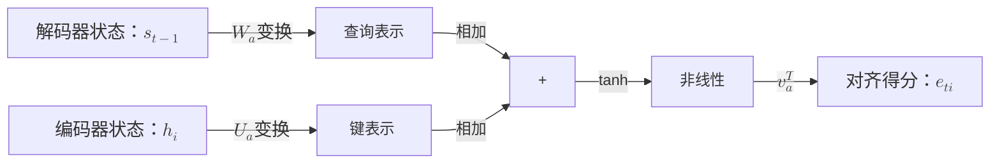
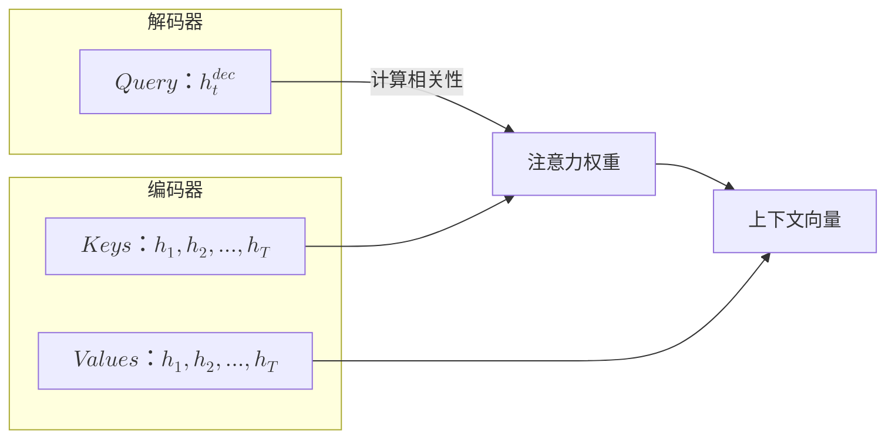
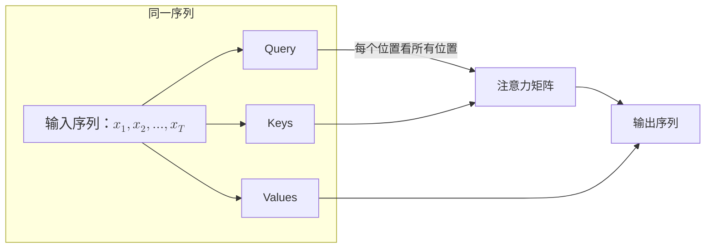

# Transformer 基础原理

在机器学习的历史上，2017 年是一个时代的分水岭。这一年，Google 公司发表了著名论文《Attention is All You Need》，提出了一个惊人的设想：彻底抛弃循环神经网络，只使用注意力机制解决记忆与依赖问题。承载这个愿景的技术架构是 **Transformer**，它的历史使命是打断由 RNN 束缚在语言模型身上的并行锁链，囿于 RNN 每一个时刻的输出都必须以上一个时刻的隐藏状态作为输入，硬件的并行能力再强大也只能串行计算。"Attention is All You Need" 这个口号仿佛是向 RNN 征伐的檄文，传递了一个激进的信息：不需要 LSTM、不需要 GRU、不需要任何循环结构，只凭注意力机制就能构建出强大的序列模型。这个论断在当时引起了不小的争议，但随后的实践证明它是完全正确的，BERT、GPT、LLaMA、Claude、DeepSeek……这些闪亮名字都是以 Transformer 架构为基础取得的成果。

本文将从 RNN 的困境出发，逐步构建 Self-Attention 的直觉和数学表达，最终组装出完整的 Transformer 架构，并探讨它如何催生 BERT 和 GPT 两条截然不同的技术路线。

## 循环的困境

在深入理解 Transformer 架构之前，需要先彻底理解它所面对的问题。2014 年的 [Seq2Seq](../../deep-learning/sequence-models/seq2seq.md) 虽然解决了信息瓶颈，但仍然是以 [LSTM/GRU](../../deep-learning/sequence-models/lstm-gru.md) 为基础的，循环神经网络局限性的源泉是**序列的循环依赖**，时刻 $t$ 的计算必须等待时刻 $t-1$ 完成，因为当前时刻的输入要包含上一时刻的隐藏状态。这种"接力棒"式的信息传递，使得序列中的每个位置都无法独立处理。现代 GPU 拥有数千个计算核心，擅长大规模并行运算。但 RNN 的序列依赖设计天然地阻止了并行计算，赖强迫 GPU 串行执行，计算资源被严重浪费，这是 Transformer 要解决的问题。

序列依赖的另一个后果是长距离信息衰减。信息在 LSTM 的状态链中传递时，每经过一个时刻都会经历一次线性变换和非线性激活，即使是设计精良的门控机制，也只能缓解而无法完全阻止信息的逐渐丢失。假设序列长度为 100，时刻 1 的信息要传递到时刻 100，需要经过 99 次 LSTM 变换。每次变换都会对信息进行压缩和筛选，早期时刻的信息在传递过程中不断被稀释。这就像在玩传话游戏，第一个人说的"今天下午三点在图书馆开会"，传到第十个人可能变成"下午开会"，传到第一百个人可能只剩下"开会"两个字。

### Bahdanau 注意力

最初，人们尝试使用 Bahdanau 注意力机制来处理以上问题。Bahdanau 注意力（又称加性注意力）由巴赫达瑙（Dzmitry Bahdanau）在 2014 年提出，是一种对 Seq2seq 架构的改进机制，与原版 Seq2seq 的区别是解码器在生成每个词时，不再仅依赖一个固定的编码向量，而是动态地从编码器的所有隐藏状态中选择相关信息。具体来说，编码器不变，依然将输入序列编码为一系列隐藏状态 $(h_1, h_2, ..., h_T)$，解码器在时刻 $t$ 的隐藏状态 $s_t$ 会计算与每个编码器隐藏状态的对齐得分，然后通过 Softmax 归一化得到注意力权重，再加权求和得到最终的上下文向量 $c_t$：

$$c_t = \sum_{i=1}^{T} \alpha_{ti} h_i$$

$\alpha_{ti}$ 被称为注意力权重，决定了解码器时刻 $t$ 对编码器隐藏状态 $h_i$ 的关注程度。好比人类语言中每个词语都有自己与前文的指代关系、语法关系 —— 譬如 "The cat, which already ate a fish, **was** hungry" 这句话中，"was" 应该关注的是 "cat" 而不是 "fish"。注意力权重是一盏对准此前所有时刻编码器隐藏状态的射灯，会把不同亮度的光线灯打向编码器的不同位置，权重越高，那个位置的信息就越清晰地被提取出来，而其他位置则相对暗淡。Bahdanau 注意力的权重值是通过一个前馈神经网络计算对齐得分，再经 Softmax 归一化得到的：

$$\alpha_{ti} = \frac{\exp(e_{ti})}{\sum_{j=1}^{T} \exp(e_{tj})}, \quad e_{ti} = v_a^T \tanh(W_a s_{t-1} + U_a h_i)$$

其中 $e_{ti}$（Softmax 的 logits）就是**对齐得分**（Alignment Score），它衡量解码器在时刻 $t$ 对编码器位置 $i$ 的关注程度，譬如前面的例子，在处理 "was" 的时刻，"cat" 的对齐得分相对其他单词而言应是更高的。$e_{ti}$ 计算公式中的两个参数矩阵（$W_a$、$U_a$）和一个向量（$v_a$）都要从神经网络训练过程中学习得到的，各其特定作用：

- **$W_a$（查询变换矩阵）**：将解码器的隐藏状态 $s_{t-1}$ 映射到注意力空间。$s_{t-1}$ 代表解码器"当前想找什么"，$W_a$ 将这个意图转换成适合与编码器状态匹配的形式。形状通常是 $(d_{att}, d_{dec})$，其中 $d_{att}$ 是注意力隐藏层维度，$d_{dec}$ 是解码器隐藏状态维度。

- **$U_a$（键变换矩阵）**：将编码器的隐藏状态 $h_i$ 映射到注意力空间。$h_i$ 代表编码器位置 $i$ "有什么信息"，$U_a$ 将这个信息转换成适合被查询的形式。形状通常是 $(d_{att}, d_{enc})$，其中 $d_{enc}$ 是编码器隐藏状态维度。

- **$v_a$（得分向量）**：将注意力隐藏层的输出投影为标量得分。$v_a$ 的作用是从混合后的表示中提取出一个数值，作为对齐得分。形状是 $(d_{att}, 1)$，可以理解为对注意力隐藏层的加权求和。

以上查询变化矩阵 $W_a$、值变换矩阵 $U_a$、得分向量 $v_a$ 催生了后续自注意力机制中 Query、Key、Value 的设计。Bahdanau 注意力权重的整个计算过程可以用下图来表示：


*图：Bahdanau 注意力计算过程*

相比改进前的 Seq2seq 架构，Bahdanau 注意力机制带来了三个显著的优势。首先是维度灵活性，$W_a$ 和 $U_a$ 可以有不同的输入维度，允许编码器和解码器使用不同大小的隐藏状态。这在编码器和解码器的网络结构不同时特别有用。其次是非线性建模能力，tanh 激活函数允许模型学习到更复杂的对齐模式，而不仅仅是简单的相似度计算。最后是可学习的匹配机制，三个参数矩阵都是可学习的，模型可以通过训练自动发现最优的对齐策略，而不需要人工设计对齐函数。

Bahdanau 注意力机制下，解码器可以直接看到编码器的所有时刻状态，不必依赖单一编码向量。但是，Bahdanau 注意力是一种**交叉注意力**（Cross-Attention），它连接的是编码器和解码器两个不同的序列。编码器和解码器内部用的仍然是 LSTM/GRU 在处理序列依赖，编码过程仍然是串行的，编码器处理输入序列时，长距离依赖问题也依然存在。在Bahdanau 注意力机制的设计里，注意力机制本来就是辅助工具，LSTM/GRU 才是核心引擎，好比给一辆马车装上了望远镜，虽然能看得更远，但动力系统仍然是马匹，这个设计决定了串行计算与长距离依赖两个问题没有被根本性解决。

Transformer 架构提出了比 Bahdanau 注意力机制更加彻底的改进方案，将注意力从"辅助"升格为"核心"，放弃使用 LSTM 或 GRU，完全用注意力机制来处理序列中的依赖关系。这个改变终于打破了序列依赖的枷锁，注意力机制可以在一次计算中同时处理序列中的所有位置，实现真正的并行化。

### 自注意力

从 Bahdanau 注意力到 Transformer 架构的**自注意力**（Self-Attention），不仅是技术细节的改变，更是设计哲学的转变。必须理解这个转变才可能真正掌握 Transformer。本节将详细对比交叉注意力与自注意力的区别，并解释自注意力如何取消序列锁链。

之所以说 Bahdanau 注意力是交叉注意力，是指它的查询（Query）来自解码器，而键（Key）和值（Value）却来自编码器。解码器在生成每个词时，要先询问编码器：我应该关注输入序列的哪个部分？


*图：交叉注意力*

上图展示了交叉注意力的信息流向，解码器提供查询，编码器提供键和值，注意力机制计算过程中，两者交叉相关，输出上下文向量是两个序列之间的对话协商的结果。自注意力（Self-Attention）则不同，查询、键、值都来自同一个序列。序列中的每个位置都可以看到序列中的所有其他位置，能够直接建立任意两个位置之间的关联。


*图：自注意力*

上图展示了自注意力的信息流向：同一个输入序列生成查询、键、值三个表示，每个位置可以同时关注所有位置，每个词元都能够在序列内部自我审视。用一个具体的例子来理解自注意力有什么优势。假设输入序列是"猫 坐 在 垫子 上"，包含五个词元。自注意力让每个词元都能同时看到其他所有词元，并计算与它们的关联程度。在"猫"这个词元被处理时，会同时关注序列中的所有词元：关注"猫"本身以理解主语是什么，关注"坐"以理解主语的动作，关注"垫子"以理解动作相关的对象，对"在"、"上"的关注度较低因为介词对理解主语贡献较小。同理，在"垫子"这个词元在处理时，同样会同时关注所有词元：关注"垫子"本身以理解对象是什么，关注"坐"以理解与动作的关系，关注"猫"以理解是谁在垫子上，对"在"、"上"的关注度较低。

这里的关键在于词元不再有时刻顺序上的任何约束，**所有位置的处理是同时进行的**，不存在时刻 1 处理"猫"、时刻 2 处理"坐"这样的串行依赖了。每个位置得以独立计算自己的注意力权重，意味着所有位置的计算可以并行执行，突破了序列锁链。这种设计带来了两个关键优势：

- **并行计算**：所有位置的计算可以同时进行，充分利用 GPU 的并行能力。序列长度为 $T$ 时，RNN 需要 $T$ 次串行计算，自注意力只需要 1 次（忽略内部矩阵运算的细节）并行计算就能完成，正是由于这个突破，才让"语言模型"发展成几百亿参数的"大语言模型"成为可能。
- **全局视野**：每个位置都能直接看到所有其他位置，不存在信息传递的距离衰减。位置 1 和位置 100 之间的关联，与位置 1 和位置 2 之间的关联，计算方式完全相同，不存在"传话游戏"的信息丢失，正是由于这个突破，才让序列模型的上限从处理几个句子的短文发展成能够处理几十兆的大型文档成为可能。

## 自注意力的数学表达

理解了自注意力的发展背景之后，现在我们来严谨地构建出它的数学表达。自注意力的核心是三个向量：查询（Query）、键（Key）、值（Value），以及它们之间的计算方式。本节将从直觉类比出发，逐步推导出完整的数学公式。

Query、Key、Value 这三个术语来自信息检索领域。用一个图书馆的类比来理解它们的含义。假设你在图书馆的书架上查找一本书，你的检索过程应该是这样的：

- **Query（查询）**：根据你心中的需求，譬如"我想找一本关于机器学习的入门书"、"我想找作者是周志明的书籍"、"我想找《深入理解 Java 虚拟机》"。这是你用来询问系统的内容。
- **Key（键）**：每本书固有的标签属性，譬如书名、作者、分类号。这是系统用来匹配你需求的内容。
- **Value（值）**：书的内容本身。当你查找匹配的书籍的目录自然是获得的是书的内容。

自注意力机制将你的 Query 与每本书的 Key 进行比较，计算出代表匹配程度的相关性得分。匹配程度高的书，其 Value 对你的贡献更大，匹配程度低的书，贡献较小。最终你获得的是**所有书**的 Value 的加权组合。

在自注意力机制中，序列中的每个位置都会生成自己的 Query、Key、Value 三个向量。位置 $i$ 的 Query 会与所有位置的 Key 进行匹配，计算注意力权重，然后用这些权重对所有位置的 Value 进行加权求和，得到属于位置 $i$ 的输出。

### 线性变换生成 Q/K/V

有了 Q/K/V 的直觉理解后，现在来看具体的数学实现。给定输入序列 $X = [x_1, x_2, ..., x_T]$，其中每个 $x_i$ 是一种 $d_{model}$ 维的向量。Self-Attention 通过三个线性变换将 $X$ 映射为 Query、Key、Value：

$$Q = XW^Q, \quad K = XW^K, \quad V = XW^V$$

这个公式看着抽象，拆开来看含义很直观：
- $X$ 是输入矩阵，形状为 $(T, d_{model})$，表示 $T$ 个位置、每个位置 $d_{model}$ 维的嵌入向量
- $W^Q, W^K, W^V$ 是可学习的参数矩阵，形状为 $(d_{model}, d_k)$ 或 $(d_{model}, d_v)$，将输入投影到不同的语义空间
- $Q, K, V$ 分别是 Query、Key、Value 矩阵，形状为 $(T, d_k)$ 或 $(T, d_v)$，每个位置都有对应的查询、键、值向量
- 整体公式可以理解为：将输入向量投影到三个不同的"语义空间"，Query 空间用于询问，Key 空间用于匹配，Value 空间用于输出信息

这三个线性变换是 Self-Attention 中唯一的可学习参数。它们的含义是：将输入向量投影到不同的"语义空间"，Query 空间用于询问，Key 空间用于匹配，Value 空间用于输出信息。

### 缩放点积注意力

有了 Q、K、V 之后，如何计算注意力权重和输出？Transformer 使用**缩放点积注意力**（Scaled Dot-Product Attention）：

$$\text{Attention}(Q, K, V) = \text{softmax}\left(\frac{QK^T}{\sqrt{d_k}}\right)V$$

这个公式看着抽象，拆开来看含义很直观：

**第一步：计算相关性得分** $QK^T$

Query 矩阵 $Q$ 的形状是 $(T, d_k)$，Key 矩阵 $K$ 的形状是 $(T, d_k)$。$QK^T$ 的结果是 $(T, T)$ 的矩阵，表示序列中每对位置之间的相关性得分。具体来说，位置 $i$ 的 Query 向量 $q_i$ 与位置 $j$ 的 Key 向量 $k_j$ 的点积 $q_i \cdot k_j$，衡量位置 $i$ 对位置 $j$ 的关注程度。点积越大，两个向量越相似，关注程度越高。

**第二步：缩放** $\frac{1}{\sqrt{d_k}}$

将相关性得分除以 $\sqrt{d_k}$，这是 Transformer 论文中的一个关键设计。为什么需要这个缩放？假设 $q_i$ 和 $k_j$ 的每个元素都是独立同分布的随机变量，均值为 0，方差为 1。那么点积 $q_i \cdot k_j = \sum_{l=1}^{d_k} q_{il} k_{jl}$ 的均值仍为 0，但方差变为 $d_k$（因为 $d_k$ 个独立随机变量的和）。当 $d_k$ 较大时，点积的值会变得很大，导致 softmax 函数进入饱和区。在饱和区，softmax 的梯度趋近于 0，训练变得困难。缩放因子 $\frac{1}{\sqrt{d_k}}$ 将点积的方差归一化为 1，保持 softmax 在非饱和区工作。

**第三步：Softmax 归一化**

对缩放后的得分矩阵应用 softmax，将得分转换为概率分布：

$$\alpha_{ij} = \frac{\exp(q_i \cdot k_j / \sqrt{d_k})}{\sum_{l=1}^{T} \exp(q_i \cdot k_l / \sqrt{d_k})}$$

$\alpha_{ij}$ 表示位置 $i$ 对位置 $j$ 的注意力权重，满足 $\sum_{j=1}^{T} \alpha_{ij} = 1$。这意味着每个位置对所有位置的注意力权重之和为 1，形成一个有效的概率分布。

**第四步：加权求和**

用注意力权重对 Value 进行加权求和：

$$\text{output}_i = \sum_{j=1}^{T} \alpha_{ij} v_j$$

位置 $i$ 的输出是所有位置 Value 的加权和，权重由注意力机制动态计算。整体公式可以理解为：每个位置根据自己与其他位置的相似度，动态决定从哪些位置提取信息，最终输出是一个融合了全局信息的向量。

### 完整计算流程

用一个具体的例子演示 Self-Attention 的完整计算流程。假设输入序列是"猫 坐 在 垫子"，共 4 个词，每个词的嵌入维度 $d_{model} = 4$，投影维度 $d_k = d_v = 3$。下面的代码展示了 Self-Attention 的完整计算过程，包括线性变换生成 Q/K/V、缩放点积注意力计算、以及最终的加权求和输出。

```python runnable
import torch
import torch.nn.functional as F

# 输入序列：4 个词，每个词 4 维嵌入
# 假设已经过嵌入层处理
X = torch.tensor([
    [0.1, 0.2, 0.3, 0.4],  # 猫
    [0.5, 0.6, 0.7, 0.8],  # 坐
    [0.2, 0.1, 0.4, 0.3],  # 在
    [0.3, 0.4, 0.1, 0.2],  # 垫子
])

print(f"输入矩阵 X 形状: {X.shape} (序列长度 × 嵌入维度)")

# 可学习的投影矩阵（随机初始化）
d_model = 4
d_k = 3
torch.manual_seed(42)

W_Q = torch.randn(d_model, d_k)
W_K = torch.randn(d_model, d_k)
W_V = torch.randn(d_model, d_k)

# 线性变换生成 Q, K, V
Q = X @ W_Q  # (4, 3)
K = X @ W_K  # (4, 3)
V = X @ W_V  # (4, 3)

print(f"Q 形状: {Q.shape} (序列长度 × 投影维度)")
print(f"K 形状: {K.shape}")
print(f"V 形状: {V.shape}")

# 计算注意力得分
scores = Q @ K.T  # (4, 4)
print(f"\n注意力得分矩阵（缩放前）:\n{scores}")

# 缩放
scores_scaled = scores / (d_k ** 0.5)
print(f"\n注意力得分矩阵（缩放后）:\n{scores_scaled}")

# Softmax 归一化
attention_weights = F.softmax(scores_scaled, dim=-1)
print(f"\n注意力权重矩阵:\n{attention_weights}")
print(f"每行和为 1: {attention_weights.sum(dim=-1)}")

# 加权求和
output = attention_weights @ V
print(f"\n输出矩阵形状: {output.shape}")
print(f"输出矩阵:\n{output}")
```

上面的代码展示了 Self-Attention 的完整计算过程。注意力权重矩阵的每一行表示一个位置对所有位置的关注程度。例如，第一行表示"猫"这个词对"猫"、"坐"、"在"、"垫子"的关注权重。

## 架构组装 —— 从机制到完整模型

Self-Attention 是 Transformer 的核心机制，但一个完整的 Transformer 还需要其他组件的配合。本节将逐步组装出完整的架构，包括多头注意力、前馈神经网络、残差连接与层归一化等关键组件。

### 多头注意力

单头 Self-Attention 只能学习一种"关注模式"。但在自然语言中，词与词之间的关系是多样的：语法关系、语义关系、指代关系……用单一的注意力模式难以同时捕捉这些不同类型的关系。

**多头注意力**（Multi-Head Attention）的解决方案是：并行运行多个独立的 Self-Attention，每个"头"学习不同的关注模式，最后将所有头的输出拼接起来。

$$\text{MultiHead}(Q, K, V) = \text{Concat}(\text{head}_1, ..., \text{head}_h)W^O$$

其中每个头的计算方式为：

$$\text{head}_i = \text{Attention}(QW_i^Q, KW_i^K, VW_i^V)$$

这个公式看着抽象，拆开来看含义很直观：
- $h$ 是头的数量，通常设置为 4、8 或 16
- $W_i^Q, W_i^K, W_i^V$ 是第 $i$ 个头的投影矩阵，每个头有独立的参数
- $\text{head}_i$ 是第 $i$ 个头的输出，形状为 $(T, d_k/h)$
- $W^O$ 是输出的线性变换矩阵，将拼接后的向量投影回原始维度
- Concat 表示将所有头的输出拼接，形成一个更丰富的表示
- 整体公式可以理解为：让多个"视角"同时观察序列，每个头专注于捕捉特定类型的关系，最终融合所有视角的信息

```nn-arch width=720
name: Multi-Head Attention
layout: horizontal

sections:
  - name: 输入
    layers: [input]
  - name: 多头投影
    layers: [h1_proj, h2_proj, h3_proj, h4_proj]
    row_label: "h=4"
  - name: 注意力计算
    layers: [h1_att, h2_att, h3_att, h4_att]
  - name: 拼接与输出
    layers: [concat, linear, output]

layers:
  - {id: input, name: "X", type: input, size: "(T, d_model)"}
  - {id: h1_proj, name: "Q₁,K₁,V₁", type: projection, size: "头1"}
  - {id: h2_proj, name: "Q₂,K₂,V₂", type: projection, size: "头2"}
  - {id: h3_proj, name: "Q₃,K₃,V₃", type: projection, size: "头3"}
  - {id: h4_proj, name: "Q₄,K₄,V₄", type: projection, size: "头4"}
  - {id: h1_att, name: "Attention", type: attention, size: "y₁"}
  - {id: h2_att, name: "Attention", type: attention, size: "y₂"}
  - {id: h3_att, name: "Attention", type: attention, size: "y₃"}
  - {id: h4_att, name: "Attention", type: attention, size: "y₄"}
  - {id: concat, name: "Concat", type: operation, size: "[y₁,y₂,y₃,y₄]"}
  - {id: linear, name: "Linear", type: dense, size: "W^O"}
  - {id: output, name: "Output", type: output, size: "(T, d_model)"}
```

多头注意力的设计思想是：每个头专注于捕捉特定类型的关系。例如，在处理"猫坐在垫子上"这句话时，头 1 可能专注于语法关系（主语"猫"与动词"坐"的关联），头 2 可能专注于语义关系（动词"坐"与对象"垫子"的关联），头 3 可能专注于位置关系（介词"在"与方位词的关联），头 4 可能捕捉其他模式。最终输出是所有头信息的融合，模型可以同时利用多种关注模式。

### 前馈神经网络（FFN）

Self-Attention 处理的是位置之间的关系，但每个位置内部的"语义加工"需要另一个组件来完成。Transformer 在每个注意力层之后添加一个**前馈神经网络**（Feed-Forward Network，FFN）：

$$\text{FFN}(x) = \text{ReLU}(xW_1 + b_1)W_2 + b_2$$

这是一个两层全连接网络：第一层将维度从 $d_{model}$ 扩展到 $d_{ff}$（通常是 $4 \times d_{model}$），应用 ReLU 激活函数引入非线性，第二层将维度从 $d_{ff}$ 压缩回 $d_{model}$。FFN 的作用可以理解为：Self-Attention 收集了"其他位置的信息"，FFN 对这些信息进行"语义加工"，提取有用的特征。这就像读书时，眼睛扫视页面收集信息（注意力），大脑对信息进行理解和整合（FFN）。

### 残差连接与层归一化

深层网络训练面临梯度消失和梯度爆炸问题。Transformer 使用两个技术来稳定训练：**残差连接**（Residual Connection）和**层归一化**（Layer Normalization）。

**残差连接**：将子层的输入直接加到输出上

$$\text{output} = x + \text{Sublayer}(x)$$

这个设计来自 ResNet 的思想：让网络学习"残差"（需要添加的修正量）而非完整的变换。如果某一层不需要做任何改变，残差连接可以让它学习恒等映射（输出 0），梯度可以直接通过残差路径传递。

**层归一化**：对每个样本的所有特征进行归一化

$$\text{LayerNorm}(x) = \frac{x - \mu}{\sigma} \cdot \gamma + \beta$$

这个公式看着抽象，拆开来看含义很直观：
- $x$ 是输入向量，包含一个位置的所有特征
- $\mu$ 和 $\sigma$ 是该位置所有特征的均值和标准差
- $\frac{x - \mu}{\sigma}$ 将特征归一化到均值 0、标准差 1
- $\gamma$ 和 $\beta$ 是可学习的缩放和偏移参数，允许模型恢复原始的分布特性
- 整体公式可以理解为：稳定每个位置的数值范围，防止数值过大或过小影响训练

**Post-Norm vs Pre-Norm**：残差连接和层归一化的组合顺序有两种设计：

```mermaid
graph TB
    subgraph Post-Norm（原始 Transformer）
        X1["x"] --> SUB1["Sublayer"]
        SUB1 --> ADD1["+"]
        X1 --> ADD1
        ADD1 --> LN1["LayerNorm"]
        LN1 --> OUT1["output"]
    end
    
    subgraph Pre-Norm（现代 LLM 主流）
        X2["x"] --> LN2["LayerNorm"]
        LN2 --> SUB2["Sublayer"]
        SUB2 --> ADD2["+"]
        X2 --> ADD2
        ADD2 --> OUT2["output"]
    end
```

原始 Transformer 使用 **Post-Norm**：先计算子层，再加残差，最后归一化。这种设计在训练深层网络时容易出现梯度消失，需要精心设计学习率预热策略。

现代 LLM（如 GPT、LLaMA）普遍使用 **Pre-Norm**：先归一化，再计算子层，最后加残差。这种设计让梯度可以直接通过残差路径传递到任意深层，训练更加稳定，可以使用更大的学习率。

### 完整的 Transformer 编码器层

将上述组件组合起来，得到一个完整的 Transformer 编码器层：

```nn-arch width=600
name: Transformer Encoder Layer
layout: vertical

sections:
  - name: 输入
    layers: [input]
  - name: 多头自注意力
    layers: [ln1, mha, add1]
  - name: 前馈网络
    layers: [ln2, ffn, add2]
  - name: 输出
    layers: [output]

layers:
  - {id: input, name: "x", type: input, size: "(T, d_model)"}
  - {id: ln1, name: "LayerNorm", type: norm, size: "Pre-Norm"}
  - {id: mha, name: "Multi-Head\nAttention", type: attention, size: "Self-Attention"}
  - {id: add1, name: "+", type: residual, size: "残差连接"}
  - {id: ln2, name: "LayerNorm", type: norm, size: "Pre-Norm"}
  - {id: ffn, name: "FFN", type: dense, size: "两层全连接"}
  - {id: add2, name: "+", type: residual, size: "残差连接"}
  - {id: output, name: "output", type: output, size: "(T, d_model)"}
```

每个编码器层包含两个子层：
1. 多头自注意力 + 残差连接 + 层归一化
2. 前馈网络 + 残差连接 + 层归一化

Transformer 编码器由 $N$ 个这样的层堆叠而成（原始论文 $N=6$），信息逐层传递，每一层都在上一层的表示基础上进一步提取和整合信息。

## 位置编码 —— 无序列时的秩序

Self-Attention 的一个"副作用"是：它对序列中位置的顺序是不敏感的。将输入序列打乱顺序，Self-Attention 的计算方式完全不变（只是矩阵的行列顺序变了）。但在自然语言中，顺序至关重要 —— "狗咬人"和"人咬狗"含义完全不同。Transformer 通过**位置编码**（Positional Encoding）来注入位置信息，让模型知道每个词在序列中的位置。本节将介绍两种主流的位置编码方式：Sinusoidal 编码和 RoPE 旋转位置编码。

### 为什么需要位置信息

Self-Attention 的计算是位置无关的。考虑两个输入序列：

- 序列 A："猫 坐 在 垫子 上"
- 序列 B："垫子 上 坐 在 猫"

对于 Self-Attention 来说，这两个序列的计算方式完全相同 —— 都是计算每对位置之间的注意力权重。模型无法区分"猫"在位置 1 还是位置 5。

这与 RNN 形成鲜明对比。RNN 按顺序处理输入，时刻 $t$ 的计算天然地包含了"这是第 $t$ 个词"的信息。Self-Attention 取消了序列锁链，但也丢失了位置信息，需要通过额外的机制来补充。

### Sinusoidal 位置编码

原始 Transformer 使用 **Sinusoidal 位置编码**，这是一种固定（不可学习）的编码方式。对于位置 $pos$ 和维度 $i$，位置编码定义为：

$$PE_{pos, 2i} = \sin\left(\frac{pos}{10000^{2i/d_{model}}}\right)$$

$$PE_{pos, 2i+1} = \cos\left(\frac{pos}{10000^{2i/d_{model}}}\right)$$

这个公式看着抽象，拆开来看含义很直观：
- $pos$ 是位置索引（0, 1, 2, ...），表示词在序列中的位置
- $i$ 是维度索引（0, 1, 2, ..., $d_{model}/2 - 1$），偶数维度使用 sin，奇数维度使用 cos
- $10000^{2i/d_{model}}$ 决定了不同维度的周期，低维度周期短，高维度周期长
- 整体公式可以理解为：用一组不同频率的正弦和余弦函数来编码位置信息，形成一个"位置指纹"

这个设计有几个精妙的特性：

**周期性**：三角函数是周期函数，不同维度有不同的周期。低维度周期短，捕捉局部位置关系；高维度周期长，捕捉全局位置关系。

**相对位置编码能力**：对于固定的偏移 $k$，$PE_{pos+k}$ 可以表示为 $PE_{pos}$ 的线性函数。这意味着模型可以学习"相对位置"的概念 —— "位置 $i$ 和位置 $j$ 相差多少"比"位置 $i$ 是多少"更重要。

**外推能力**：Sinusoidal 编码可以处理训练时未见过的位置长度，因为它是一个连续函数而非离散的查找表。

位置编码被加到输入嵌入上：

$$\text{input} = \text{Embedding}(x) + PE$$

这样，每个词的表示既包含语义信息（嵌入），也包含位置信息（位置编码）。

### RoPE 旋转位置编码

Sinusoidal 编码是绝对位置编码 —— 直接编码"这是第 $pos$ 个位置"。现代 LLM 普遍使用 **RoPE**（Rotary Position Embedding，旋转位置编码），由苏剑林等人在 2021 年提出。它是一种相对位置编码 —— 编码"位置 $i$ 和位置 $j$ 之间的相对距离"。

RoPE 的核心思想是：将位置信息编码为向量空间中的旋转操作。对于位置 $m$ 的向量 $x$，应用旋转矩阵 $R_m$：

$$R_m = \begin{pmatrix} \cos m\theta & -\sin m\theta \\ \sin m\theta & \cos m\theta \end{pmatrix}$$

旋转后的向量 $R_m x$ 既包含原始向量信息，也包含位置 $m$ 的信息。RoPE 的关键性质是：两个位置的 Query 和 Key 的点积，只依赖于它们的相对位置差：

$$(R_m q) \cdot (R_n k) = q \cdot R_{n-m} k$$

这意味着注意力得分只与相对位置 $(n-m)$ 有关，而非绝对位置 $m$ 和 $n$。这更符合语言的直觉："猫坐在垫子上"中，"猫"和"坐"的关系取决于它们相隔多远，而非它们分别在什么位置。

RoPE 相比 Sinusoidal 的优势体现在三个方面：更好的长距离外推能力，RoPE 的相对位置特性使得模型更容易泛化到训练时未见过的序列长度；与注意力机制天然融合，RoPE 直接作用于 Query 和 Key 的点积计算，而非作为额外的输入加到嵌入上；现代 LLM 的标准选择，LLaMA、GPT-NeoX、PaLM、DeepSeek 等主流模型都使用 RoPE。

## 奇点之后 —— 两条路线

Transformer 论文提出了完整的编码器 - 解码器架构，用于机器翻译任务。但 Transformer 的影响力远不止于此 —— 它催生了两条截然不同的技术路线，分别以 BERT 和 GPT 为代表。本节将对比这两条路线的设计理念和应用场景，并探讨为何 GPT 路线成为大语言模型的主流。

### 编码器路线：BERT

**BERT**（Bidirectional Encoder Representations from Transformers）由 Google 在 2018 年提出，它只使用 Transformer 的编码器部分。

**核心设计**：双向注意力。编码器中的 Self-Attention 允许每个位置看到所有其他位置，包括左侧和右侧的上下文。这适合"理解"任务 —— 阅读理解、文本分类、命名实体识别等。

**预训练目标**：掩码语言模型（Masked Language Model，MLM）。随机遮盖输入序列中 15% 的词，让模型预测被遮盖的词是什么。例如：

- 输入："我 [MASK] 北京"
- 目标：预测 [MASK] = "爱"

MLM 迫使模型利用双向上下文来理解每个词的含义。

**代表模型**：BERT、RoBERTa、ALBERT、ELECTRA、DeBERTa

### 解码器路线：GPT

**GPT**（Generative Pre-trained Transformer）由 OpenAI 在 2018 年提出（与 BERT 同年），它只使用 Transformer 的解码器部分。

**核心设计**：因果注意力（Causal Attention）。解码器中的 Self-Attention 被修改为只能看到当前位置及之前的位置，不能看到未来的词。这适合"生成"任务 —— 文本生成、对话、代码补全等。

**预训练目标**：因果语言模型（Causal Language Model，CLM）。给定前面的词，预测下一个词。例如：

- 输入："我 爱"
- 目标：预测下一个词 = "北京"

CLM 迫使模型学习如何根据已有内容生成后续内容。

**代表模型**：GPT 系列、LLaMA、Claude、DeepSeek

### 两条路线的对比

| 特性 | BERT（编码器路线） | GPT（解码器路线） |
|:-----|:-------------------|:------------------|
| 注意力类型 | 双向（看左右） | 单向（只看左边） |
| 预训练目标 | MLM（填空） | CLM（续写） |
| 核心能力 | 理解 | 生成 |
| 典型任务 | 分类、标注、问答 | 文本生成、对话 |
| 代表模型 | BERT、RoBERTa | GPT、LLaMA、Claude |

### 为何 GPT 路线成为主流

在 2018-2020 年间，BERT 路线在 NLP 各项任务上占据主导地位。但从 2020 年 GPT-3 开始，GPT 路线逐渐成为大语言模型的主流。原因有三：

**生成能力的通用性**：生成是更通用的能力。一个强大的生成模型可以通过提示（Prompt）完成理解任务，但一个理解模型难以完成生成任务。GPT-3 展示了"生成即理解"的可能性 —— 通过生成答案来回答问题，通过生成摘要来理解文章。

**规模效应**：GPT 路线的预训练目标（预测下一个词）是自然的、无监督的，可以从海量文本中学习。BERT 的 MLM 目标需要构造遮盖样本，在大规模预训练中效率较低。当模型规模扩大时，GPT 路线的优势更加明显。

**涌现能力**：当模型规模超过一定阈值（约 100 亿参数），GPT 路线的模型展现出"涌现能力"——Few-shot Learning、Chain of Thought、代码生成等。这些能力在 BERT 路线的模型中难以观察到。

当然，BERT 路线并未消失。在需要深度理解的任务（如信息抽取、文本分类）中，BERT 及其变体仍然是强有力的选择。但在大语言模型领域，GPT 路线已成为主流范式。

## 实验 —— 注意力权重可视化

理论理解之后，通过实验来直观感受 Self-Attention 的工作方式。下面的代码实现了一个简单的 Self-Attention 模块，并可视化注意力权重矩阵，帮助理解每个位置如何关注其他位置。

```python runnable
import torch
import torch.nn as nn
import matplotlib.pyplot as plt
import numpy as np

# 设置中文字体
plt.rcParams['font.sans-serif'] = ['SimHei', 'DejaVu Sans']
plt.rcParams['axes.unicode_minus'] = False

class SelfAttention(nn.Module):
    def __init__(self, d_model, d_k):
        super().__init__()
        self.W_Q = nn.Linear(d_model, d_k, bias=False)
        self.W_K = nn.Linear(d_model, d_k, bias=False)
        self.W_V = nn.Linear(d_model, d_k, bias=False)
        self.d_k = d_k
    
    def forward(self, X, mask=None):
        # X: (batch, seq_len, d_model)
        Q = self.W_Q(X)
        K = self.W_K(X)
        V = self.W_V(X)
        
        # 计算注意力得分
        scores = torch.matmul(Q, K.transpose(-2, -1)) / (self.d_k ** 0.5)
        
        # 应用 mask（解码器需要）
        if mask is not None:
            scores = scores.masked_fill(mask == 0, float('-inf'))
        
        # Softmax
        attention_weights = torch.softmax(scores, dim=-1)
        
        # 加权求和
        output = torch.matmul(attention_weights, V)
        
        return output, attention_weights

# 创建模型
d_model = 8
d_k = 4
model = SelfAttention(d_model, d_k)

# 模拟输入：简单的词嵌入
words = ["猫", "坐", "在", "垫子", "上"]
seq_len = len(words)

# 随机初始化嵌入（实际中会用预训练嵌入）
torch.manual_seed(42)
X = torch.randn(1, seq_len, d_model)

# 前向传播
output, attention_weights = model(X)

print(f"输入形状: {X.shape}")
print(f"输出形状: {output.shape}")
print(f"注意力权重形状: {attention_weights.shape}")

# 可视化注意力权重
att_matrix = attention_weights[0].detach().numpy()

fig, ax = plt.subplots(figsize=(8, 6))
im = ax.imshow(att_matrix, cmap='Blues')

# 设置坐标轴
ax.set_xticks(np.arange(seq_len))
ax.set_yticks(np.arange(seq_len))
ax.set_xticklabels(words)
ax.set_yticklabels(words)

# 在每个格子中显示数值
for i in range(seq_len):
    for j in range(seq_len):
        text = ax.text(j, i, f'{att_matrix[i, j]:.2f}',
                       ha="center", va="center", color="black", fontsize=10)

ax.set_title('Self-Attention 权重矩阵', fontsize=14)
ax.set_xlabel('Key 位置', fontsize=12)
ax.set_ylabel('Query 位置', fontsize=12)

plt.colorbar(im, ax=ax, label='注意力权重')
plt.tight_layout()
plt.savefig('/workspace/attention_weights.png', dpi=150, bbox_inches='tight')
plt.show()

print("\n注意力权重矩阵解读：")
print("每行表示一个 Query 位置对所有 Key 位置的关注程度")
print("颜色越深，关注度越高")
```

运行上面的代码，可以看到注意力权重矩阵的可视化。每行表示一个位置对所有位置的关注权重，颜色越深表示关注度越高。

### 单头 vs 多头对比

下面实现多头注意力，对比单头和多头的关注模式差异。多头注意力让每个头学习不同的关注模式，最终融合所有头的信息，形成更丰富的表示。

```python runnable
import torch
import torch.nn as nn
import matplotlib.pyplot as plt
import numpy as np

plt.rcParams['font.sans-serif'] = ['SimHei', 'DejaVu Sans']
plt.rcParams['axes.unicode_minus'] = False

class MultiHeadAttention(nn.Module):
    def __init__(self, d_model, num_heads):
        super().__init__()
        self.num_heads = num_heads
        self.d_k = d_model // num_heads
        
        self.W_Q = nn.Linear(d_model, d_model, bias=False)
        self.W_K = nn.Linear(d_model, d_model, bias=False)
        self.W_V = nn.Linear(d_model, d_model, bias=False)
        self.W_O = nn.Linear(d_model, d_model, bias=False)
    
    def forward(self, X):
        batch_size, seq_len, d_model = X.shape
        
        # 线性变换
        Q = self.W_Q(X).view(batch_size, seq_len, self.num_heads, self.d_k).transpose(1, 2)
        K = self.W_K(X).view(batch_size, seq_len, self.num_heads, self.d_k).transpose(1, 2)
        V = self.W_V(X).view(batch_size, seq_len, self.num_heads, self.d_k).transpose(1, 2)
        
        # 注意力计算
        scores = torch.matmul(Q, K.transpose(-2, -1)) / (self.d_k ** 0.5)
        attention_weights = torch.softmax(scores, dim=-1)
        
        # 加权求和
        context = torch.matmul(attention_weights, V)
        context = context.transpose(1, 2).contiguous().view(batch_size, seq_len, d_model)
        
        # 输出投影
        output = self.W_O(context)
        
        return output, attention_weights

# 创建模型
d_model = 8
num_heads = 4
model = MultiHeadAttention(d_model, num_heads)

# 输入
words = ["猫", "坐", "在", "垫子", "上"]
seq_len = len(words)
torch.manual_seed(42)
X = torch.randn(1, seq_len, d_model)

# 前向传播
output, attention_weights = model(X)

print(f"多头数量: {num_heads}")
print(f"每个头的维度: {d_model // num_heads}")
print(f"注意力权重形状: {attention_weights.shape} (batch, heads, seq, seq)")

# 可视化所有头的注意力模式
fig, axes = plt.subplots(1, num_heads, figsize=(16, 4))

for h in range(num_heads):
    att_matrix = attention_weights[0, h].detach().numpy()
    
    im = axes[h].imshow(att_matrix, cmap='Blues', vmin=0, vmax=1)
    axes[h].set_xticks(np.arange(seq_len))
    axes[h].set_yticks(np.arange(seq_len))
    axes[h].set_xticklabels(words, fontsize=9)
    axes[h].set_yticklabels(words, fontsize=9)
    axes[h].set_title(f'头 {h+1}', fontsize=12)

plt.suptitle('多头注意力：不同头学习不同的关注模式', fontsize=14)
plt.tight_layout()
plt.savefig('/workspace/multihead_attention.png', dpi=150, bbox_inches='tight')
plt.show()

print("\n多头注意力解读：")
print("每个头学习不同的关注模式")
print("头1可能关注语法关系，头2可能关注语义关系，等等")
print("最终输出是所有头信息的融合")
```

多头注意力的可视化展示了不同头学习到的不同关注模式。有些头可能关注相邻词的关系，有些头可能关注长距离依赖，这种多样性让模型能够同时捕捉多种类型的关系。

## 小结

本文从 RNN 的困境出发，逐步构建了 Transformer 架构的理解。首先分析了循环神经网络的三个核心问题：序列依赖阻断并行、长距离信息衰减、注意力机制的局限性。然后介绍了自注意力如何通过"取消序列锁链"来解决这些问题，实现了真正的并行计算和全局视野。

在数学表达部分，详细拆解了 Q/K/V 三元组的直觉类比和缩放点积注意力的计算过程。接着逐步组装了完整的 Transformer 架构，包括多头注意力、前馈神经网络、残差连接与层归一化等关键组件，并对比了 Post-Norm 和 Pre-Norm 两种设计。

位置编码部分介绍了 Sinusoidal 编码和 RoPE 旋转位置编码两种主流方案，解释了它们如何为位置无关的自注意力注入位置信息。最后对比了 BERT 和 GPT 两条技术路线，分析了 GPT 路线成为主流的原因：生成能力的通用性、规模效应和涌现能力。

Transformer 的出现是深度学习历史上的一个奇点 —— 它彻底改变了 NLP 的格局，催生了现代所有大语言模型。理解 Transformer，是理解 GPT、BERT、LLaMA、Claude、DeepSeek 等模型的基础。下一章将探讨 Transformer 架构的演进与变体，看看这个基础架构如何在长上下文、高效计算、参数效率等方向上持续进化。

---

## 练习题

**1. 理论推导**

证明缩放点积注意力中的缩放因子 $\frac{1}{\sqrt{d_k}}$ 可以将点积的方差归一化为 1（假设 $q$ 和 $k$ 的元素是独立同分布的，均值为 0，方差为 1）。

<details>
<summary>参考答案</summary>

设 $q = (q_1, q_2, ..., q_{d_k})$，$k = (k_1, k_2, ..., k_{d_k})$，其中每个元素 $q_i, k_i$ 独立同分布，$E[q_i] = E[k_i] = 0$，$Var[q_i] = Var[k_i] = 1$。

点积 $s = q \cdot k = \sum_{i=1}^{d_k} q_i k_i$

期望：$E[s] = \sum_{i=1}^{d_k} E[q_i k_i] = \sum_{i=1}^{d_k} E[q_i] E[k_i] = 0$（独立性）

方差：$Var[s] = E[s^2] - E[s]^2 = E[s^2]$

由于 $q_i k_i$ 之间相互独立：

$E[s^2] = E[(\sum_{i=1}^{d_k} q_i k_i)^2] = \sum_{i=1}^{d_k} E[(q_i k_i)^2] + \sum_{i \neq j} E[q_i k_i q_j k_j]$

交叉项 $E[q_i k_i q_j k_j] = E[q_i] E[k_i] E[q_j] E[k_j] = 0$

对角项 $E[(q_i k_i)^2] = E[q_i^2] E[k_i^2] = Var[q_i] \cdot Var[k_i] = 1 \times 1 = 1$

因此 $Var[s] = \sum_{i=1}^{d_k} 1 = d_k$

缩放后：$Var[\frac{s}{\sqrt{d_k}}] = \frac{1}{d_k} Var[s] = \frac{d_k}{d_k} = 1$

证毕。

</details>

**2. 架构对比**

对比 Self-Attention 和 Bahdanau 注意力的异同：
- Query、Key、Value 的来源
- 计算复杂度
- 并行性

<details>
<summary>参考答案</summary>

**Query、Key、Value 的来源**：
- Self-Attention：Q、K、V 都来自同一个输入序列
- Bahdanau：Q 来自解码器，K、V 来自编码器

**计算复杂度**：
- Self-Attention：$O(T^2 \cdot d)$，其中 $T$ 是序列长度，$d$ 是维度
- Bahdanau：$O(T_{enc} \cdot T_{dec} \cdot d)$，编码器长度乘以解码器长度

**并行性**：
- Self-Attention：完全并行，所有位置可同时计算
- Bahdanau：解码器部分串行（依赖上一时刻输出），编码器部分可并行

</details>

**3. 位置编码分析**

分析 Sinusoidal 位置编码的相对位置性质：证明 $PE_{pos+k}$ 可以表示为 $PE_{pos}$ 的线性函数。

<details>
<summary>参考答案</summary>

利用三角恒等式：

$\sin(a + b) = \sin a \cos b + \cos a \sin b$
$\cos(a + b) = \cos a \cos b - \sin a \sin b$

对于偶数维度 $2i$：

$PE_{pos+k, 2i} = \sin\left(\frac{pos+k}{10000^{2i/d}}\right) = \sin\left(\frac{pos}{10000^{2i/d}}\right)\cos\left(\frac{k}{10000^{2i/d}}\right) + \cos\left(\frac{pos}{10000^{2i/d}}\right)\sin\left(\frac{k}{10000^{2i/d}}\right)$

$= PE_{pos, 2i} \cdot \cos\left(\frac{k}{10000^{2i/d}}\right) + PE_{pos, 2i+1} \cdot \sin\left(\frac{k}{10000^{2i/d}}\right)$

类似地，对于奇数维度 $2i+1$：

$PE_{pos+k, 2i+1} = PE_{pos, 2i+1} \cdot \cos\left(\frac{k}{10000^{2i/d}}\right) - PE_{pos, 2i} \cdot \sin\left(\frac{k}{10000^{2i/d}}\right)$

这表明 $PE_{pos+k}$ 可以通过 $PE_{pos}$ 的线性变换得到，变换矩阵只依赖于偏移量 $k$。

</details>

**4. 编程实现**

实现一个完整的 Transformer 编码器层，包含：
- 多头自注意力
- 前馈神经网络
- 残差连接和层归一化
- 在简单序列分类任务上测试

<details>
<summary>参考答案</summary>

```python runnable
import torch
import torch.nn as nn
import torch.nn.functional as F

class TransformerEncoderLayer(nn.Module):
    """
    Transformer 编码器层
    
    包含：多头自注意力 + FFN + 残差连接 + 层归一化
    使用 Pre-Norm 结构（现代 LLM 主流）
    """
    def __init__(self, d_model, num_heads, d_ff, dropout=0.1):
        super().__init__()
        # 多头自注意力
        self.self_attn = nn.MultiheadAttention(d_model, num_heads, dropout=dropout, batch_first=True)
        
        # 前馈神经网络
        self.ffn = nn.Sequential(
            nn.Linear(d_model, d_ff),
            nn.ReLU(),
            nn.Dropout(dropout),
            nn.Linear(d_ff, d_model)
        )
        
        # 层归一化
        self.norm1 = nn.LayerNorm(d_model)
        self.norm2 = nn.LayerNorm(d_model)
        
        # Dropout
        self.dropout = nn.Dropout(dropout)
    
    def forward(self, x, mask=None):
        # Pre-Norm + Multi-Head Attention + Residual
        normed = self.norm1(x)
        attn_output, _ = self.self_attn(normed, normed, normed, attn_mask=mask)
        x = x + self.dropout(attn_output)
        
        # Pre-Norm + FFN + Residual
        normed = self.norm2(x)
        ffn_output = self.ffn(normed)
        x = x + self.dropout(ffn_output)
        
        return x

class SimpleClassifier(nn.Module):
    """简单的序列分类器"""
    def __init__(self, vocab_size, d_model, num_heads, d_ff, num_layers, num_classes):
        super().__init__()
        self.embedding = nn.Embedding(vocab_size, d_model)
        self.layers = nn.ModuleList([
            TransformerEncoderLayer(d_model, num_heads, d_ff)
            for _ in range(num_layers)
        ])
        self.fc = nn.Linear(d_model, num_classes)
    
    def forward(self, x):
        # 嵌入
        x = self.embedding(x)
        
        # Transformer 层
        for layer in self.layers:
            x = layer(x)
        
        # 取 [CLS] 位置（第一个位置）的输出进行分类
        x = self.fc(x[:, 0, :])
        return x

# 测试
vocab_size = 1000
d_model = 64
num_heads = 4
d_ff = 256
num_layers = 2
num_classes = 3

model = SimpleClassifier(vocab_size, d_model, num_heads, d_ff, num_layers, num_classes)

# 模拟输入：batch_size=2, seq_len=10
x = torch.randint(0, vocab_size, (2, 10))
output = model(x)

print(f"输入形状: {x.shape}")
print(f"输出形状: {output.shape}")
print(f"输出（分类 logits）:\n{output}")
```

</details>

---

## 参考资料

1. **Transformer 原始论文**: "Attention is All You Need" (Vaswani et al., 2017)
2. **BERT 论文**: "BERT: Pre-training of Deep Bidirectional Transformers for Language Understanding" (Devlin et al., 2018)
3. **GPT 论文**: "Improving Language Understanding by Generative Pre-Training" (Radford et al., 2018)
4. **RoPE 论文**: "RoFormer: Enhanced Transformer with Rotary Position Embedding" (Su et al., 2021)
5. **Layer Normalization**: "Layer Normalization" (Ba et al., 2016)
