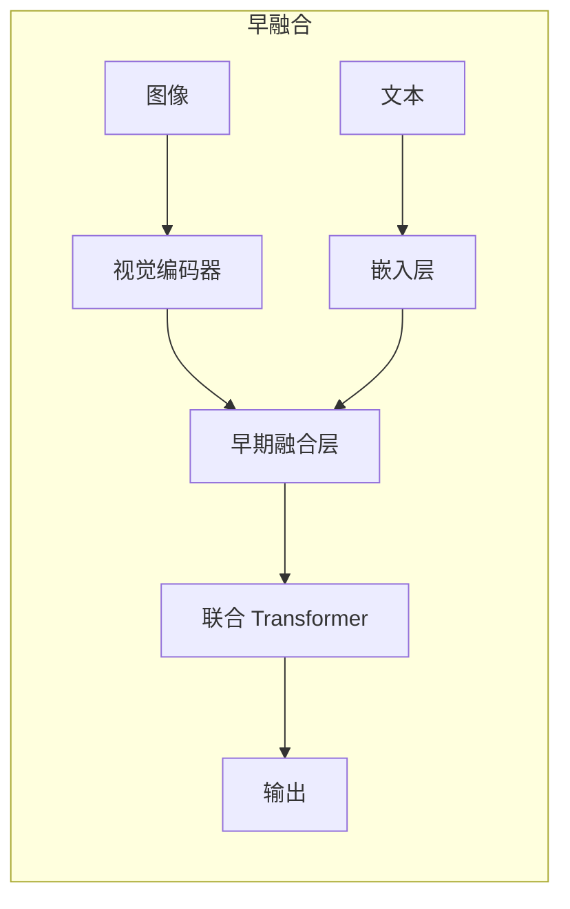
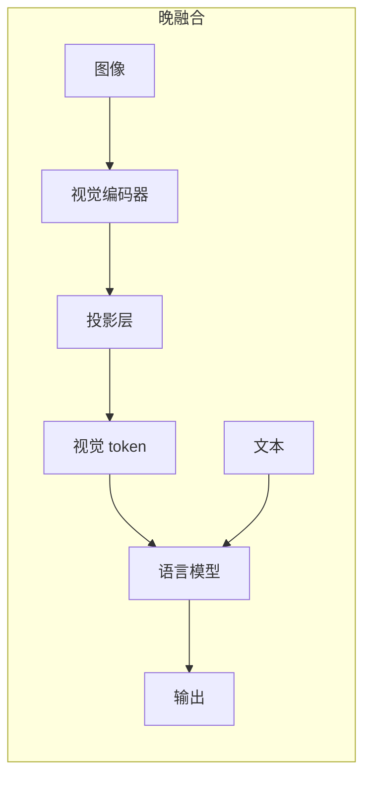
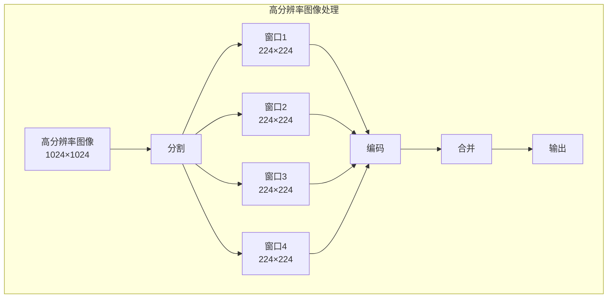

# 多模态大模型 —— 超越纯文本

在上一章中，我们探讨了 Test-Time Compute Scaling——如何通过更多推理算力获得更好的答案。这些讨论都围绕着一个共同的前提：模型处理的是**文本**。但人类感知世界的方式远不止语言 —— 我们用眼睛看图像，用耳朵听声音，用多种感官综合理解世界。

2023 年，GPT-4V 的发布标志着大语言模型正式迈入多模态时代。它不仅能理解文字，还能"看懂"图片、分析图表、解读截图。随后，Google 的 Gemini、Anthropic 的 Claude 多模态版本相继推出，多模态能力成为顶级 LLM 的标配。本文将探讨语言模型如何学会"看" —— 从视觉编码器到跨模态对齐，从图像理解到视频推理，系统解析多模态大模型的技术原理。

## 引言：语言模型如何学会"看"

### 从纯文本到多模态的跨越

纯文本语言模型的训练目标是预测下一个词。模型通过海量文本学习语言的统计规律、世界知识和推理能力。但文本只是人类知识表达的一种形式 —— 许多信息更适合用图像、图表、公式来表达。

考虑以下场景：

- **医学诊断**：医生需要看 X 光片、CT 图像才能做出诊断
- **工程设计**：工程师需要看图纸、3D 模型才能理解设计意图
- **科学研究**：研究者需要看实验数据图表、分子结构图才能分析结果

纯文本模型在这些场景下力不从心 —— 即使描述得再详细，文字也难以完整传达视觉信息的丰富性。多模态模型的出现，正是为了填补这一空白。

### 多模态能力的技术基础

让语言模型"学会看"需要解决两个核心问题：

**问题一：图像如何变成模型能理解的表示？**

语言模型的输入是词元（token）序列，每个词元对应词表中的一个索引。图像是连续的像素矩阵，如何将其转化为模型能处理的离散或连续表示？

**问题二：视觉信息如何与语言信息对齐？**

语言模型在文本上预训练，学习的是文本的语义空间。视觉信息有自己的语义空间（如颜色、形状、空间关系）。如何让模型理解"这张图片中的猫"和文本"猫"指向同一个概念？

这两个问题的解决方案，构成了多模态大模型的技术核心。

## 视觉 - 语言融合架构

多模态大模型的架构设计，核心在于如何融合视觉和语言两种模态的信息。主流方案可以分为**早融合**和**晚融合**两种范式。

### 图像编码器 + 语言解码器

现代多模态 LLM 普遍采用"图像编码器 + 语言解码器"的架构：

```nn-arch width=720
name: 多模态大模型架构
layout: horizontal

sections:
  - name: 输入
    layers: [image_input, text_input]
  - name: 编码
    layers: [vision_encoder, text_embed]
  - name: 对齐
    layers: [projector]
  - name: 语言模型
    layers: [llm_layers]
  - name: 输出
    layers: [output]

layers:
  - {id: image_input, name: "图像", type: input, size: "H×W×3"}
  - {id: text_input, name: "文本", type: input, size: "词元序列"}
  - {id: vision_encoder, name: "视觉编码器<br/>ViT/SigLIP", type: encoder, size: "图像嵌入"}
  - {id: text_embed, name: "文本嵌入", type: embedding, size: "词嵌入"}
  - {id: projector, name: "投影层<br/>MLP/Q-Former", type: projection, size: "视觉token"}
  - {id: llm_layers, name: "LLM 层<br/>Transformer", type: decoder, size: "自回归生成"}
  - {id: output, name: "输出", type: output, size: "文本/描述"}
```

**架构组成**：

1. **视觉编码器**（Vision Encoder）：将图像编码为向量序列
2. **投影层**（Projector）：将视觉向量映射到语言模型的嵌入空间
3. **语言模型**（LLM）：处理视觉 token 和文本 token，生成回答

这种设计的优势是**模块化**：视觉编码器和语言模型可以分别预训练，然后通过投影层连接。这大大降低了训练成本，也使得模型可以灵活组合不同的视觉编码器和语言模型。

### 早融合 vs 晚融合

**早融合**（Early Fusion）：在模型的早期层就融合视觉和语言信息。



早融合的典型代表是 **Flamingo**（2022）和 **BLIP-2**。它们在语言模型的每一层都插入交叉注意力，让文本 token 可以"查询"视觉信息。

**晚融合**（Late Fusion）：视觉信息在进入语言模型之前就完成处理，语言模型只看到"视觉 token"。



晚融合的典型代表是 **LLaVA**（2023）和 **GPT-4V**。视觉信息通过投影层转化为视觉 token，与文本 token 拼接后一起输入语言模型。

**两种范式的对比**：

| 特性 | 早融合 | 晚融合 |
|:-----|:-------|:-------|
| 架构复杂度 | 高（需要修改 LLM 结构） | 低（LLM 结构不变） |
| 训练效率 | 较低（需要联合训练） | 较高（可冻结 LLM） |
| 视觉 - 语言交互 | 深度交互（每层都有） | 浅层交互（只在输入层） |
| 代表模型 | Flamingo、BLIP-2 | LLaVA、GPT-4V、Gemini |

现代多模态 LLM 普遍采用**晚融合**方案，因为它更简单、更灵活，且性能表现优异。

### 代表性架构对比

**LLaVA**（Large Language and Vision Assistant）：最简洁的多模态架构

- 视觉编码器：CLIP ViT-L/14
- 投影层：简单的线性层（MLP）
- 语言模型：Vicuna（LLaMA 微调版）

LLaVA 证明了：即使是简单的线性投影，配合强大的视觉编码器和语言模型，也能获得出色的多模态能力。

**BLIP-2**：引入 Q-Former 的架构

- 视觉编码器：ViT-L/14 或 ViT-G/14
- 投影层：Q-Former（可学习的查询向量）
- 语言模型：OPT 或 FlanT5

Q-Former 是一组可学习的查询向量，通过交叉注意力从视觉编码器提取信息。它的优势是可以"压缩"视觉信息 —— 将任意数量的图像嵌入压缩为固定数量的视觉 token。

**GPT-4V**：架构细节未公开，但从行为推测

- 视觉编码器：可能是 SigLIP 或类似模型
- 投影层：可能是多层 MLP
- 语言模型：GPT-4

GPT-4V 展示了最强大的多模态能力，包括图表理解、截图分析、多图推理等。

## 视觉编码器：从 ViT 到 SigLIP

视觉编码器是多模态模型的"眼睛"，负责将图像转化为向量表示。现代多模态 LLM 普遍采用 **Vision Transformer**（ViT）架构的变体。

### ViT：图像变成向量序列

**Vision Transformer**（ViT）将 Transformer 架构应用于图像理解。核心思想是：将图像分割成小块（patch），每个 patch 视为一个"词元"。

**ViT 的处理流程**：

1. **图像分块**：将 $H \times W \times 3$ 的图像分割成 $N$ 个 $P \times P \times 3$ 的 patch，其中 $N = (H/P) \times (W/P)$

2. **Patch 嵌入**：将每个 patch 展平并通过线性投影，得到 $N$ 个 $d$ 维向量

3. **位置编码**：为每个 patch 添加可学习的位置编码

4. **Transformer 编码**：通过多层 Transformer 编码器处理

5. **[CLS] token**：添加一个特殊的 [CLS] token，其最终表示用于图像分类

```nn-arch width=600
name: ViT 架构
layout: vertical

sections:
  - name: 输入
    layers: [image]
  - name: 分块与嵌入
    layers: [patches, embed]
  - name: Transformer
    layers: [transformer]
  - name: 输出
    layers: [cls_output]

layers:
  - {id: image, name: "图像<br/>224×224×3", type: input, size: "H×W×3"}
  - {id: patches, name: "Patch 分割<br/>16×16", type: operation, size: "N 个 patch"}
  - {id: embed, name: "Patch 嵌入<br/>+ 位置编码", type: embedding, size: "N×d"}
  - {id: transformer, name: "Transformer<br/>编码器", type: encoder, size: "N×d"}
  - {id: cls_output, name: "[CLS] 输出<br/>图像表示", type: output, size: "d 维向量"}
```

**ViT 的关键参数**：

- **Patch 大小**：通常为 $16 \times 16$ 或 $14 \times 14$
- **序列长度**：$224 \times 224$ 图像，$16 \times 16$ patch，得到 $14 \times 14 = 196$ 个 patch
- **隐藏维度**：ViT-Base 为 768，ViT-Large 为 1024，ViT-Giant 为 1408

```python runnable
import torch
import torch.nn as nn

class PatchEmbedding(nn.Module):
    """ViT 的 Patch 嵌入层"""
    def __init__(self, img_size=224, patch_size=16, in_channels=3, embed_dim=768):
        super().__init__()
        self.img_size = img_size
        self.patch_size = patch_size
        self.num_patches = (img_size // patch_size) ** 2
        
        # 用卷积实现 patch 嵌入
        self.proj = nn.Conv2d(
            in_channels, embed_dim,
            kernel_size=patch_size, stride=patch_size
        )
        
        # 可学习的位置编码
        self.pos_embed = nn.Parameter(
            torch.randn(1, self.num_patches + 1, embed_dim) * 0.02
        )
        
        # [CLS] token
        self.cls_token = nn.Parameter(torch.randn(1, 1, embed_dim) * 0.02)
    
    def forward(self, x):
        B, C, H, W = x.shape
        
        # Patch 嵌入: (B, C, H, W) -> (B, embed_dim, H/P, W/P)
        x = self.proj(x)
        
        # 展平: (B, embed_dim, H/P, W/P) -> (B, embed_dim, num_patches)
        x = x.flatten(2)
        
        # 转置: (B, embed_dim, num_patches) -> (B, num_patches, embed_dim)
        x = x.transpose(1, 2)
        
        # 添加 [CLS] token
        cls_tokens = self.cls_token.expand(B, -1, -1)
        x = torch.cat([cls_tokens, x], dim=1)
        
        # 添加位置编码
        x = x + self.pos_embed
        
        return x

# 演示
torch.manual_seed(42)
patch_embed = PatchEmbedding(img_size=224, patch_size=16, embed_dim=768)

# 模拟图像输入
image = torch.randn(1, 3, 224, 224)
output = patch_embed(image)

print(f"输入图像形状: {image.shape}")
print(f"Patch 大小: 16×16")
print(f"Patch 数量: {patch_embed.num_patches}")
print(f"输出序列形状: {output.shape}")
print(f"  - [CLS] token: 1")
print(f"  - Patch tokens: {patch_embed.num_patches}")
print(f"  - 总长度: {output.shape[1]}")
```

### CLIP：视觉 - 语言对齐的里程碑

**CLIP**（Contrastive Language-Image Pre-training）是 OpenAI 在 2021 年发布的视觉 - 语言模型。它通过对比学习，将图像和文本映射到同一语义空间。

**CLIP 的训练目标**：

给定 $N$ 个（图像，文本）对，CLIP 学习让匹配的图文对相似度高，不匹配的相似度低。

$$\mathcal{L} = -\frac{1}{N} \sum_{i=1}^{N} \left( \log \frac{\exp(\text{sim}(v_i, t_i) / \tau)}{\sum_{j=1}^{N} \exp(\text{sim}(v_i, t_j) / \tau)} + \log \frac{\exp(\text{sim}(v_i, t_i) / \tau)}{\sum_{j=1}^{N} \exp(\text{sim}(v_j, t_i) / \tau)} \right)$$

其中 $v_i$ 是图像嵌入，$t_i$ 是文本嵌入，$\text{sim}$ 是余弦相似度，$\tau$ 是温度参数。

**CLIP 的架构**：

- **图像编码器**：ViT-L/14 或 ResNet
- **文本编码器**：Transformer

CLIP 的关键贡献是：**学习了一个对齐的视觉 - 语言嵌入空间**。在这个空间中，"猫的图片"和文本"a photo of a cat"的嵌入向量距离很近。这为多模态 LLM 提供了高质量的视觉表示。

### SigLIP：更好的视觉编码器

**SigLIP**（Sigmoid Loss for Language-Image Pre-training）是 CLIP 的改进版本，被 Gemini 和许多现代多模态模型采用。

**SigLIP vs CLIP**：

| 特性 | CLIP | SigLIP |
|:-----|:-----|:-------|
| 损失函数 | Softmax 对比损失 | Sigmoid 损失 |
| 训练效率 | 需要大批次 | 支持小批次 |
| 负样本处理 | 批内所有样本作为负样本 | 独立处理每个图文对 |
| 表示质量 | 优秀 | 更优（尤其在细粒度任务） |

**SigLIP 的损失函数**：

$$\mathcal{L} = -\frac{1}{N} \sum_{i=1}^{N} \sum_{j=1}^{N} \left[ y_{ij} \log \sigma(z_{ij}) + (1 - y_{ij}) \log (1 - \sigma(z_{ij})) \right]$$

其中 $y_{ij} = 1$ 如果第 $i$ 个图像和第 $j$ 个文本匹配，否则 $y_{ij} = 0$。$z_{ij}$ 是图像 $i$ 和文本 $j$ 的相似度得分。

SigLIP 的优势在于：**不需要全局归一化**，每个图文对的损失独立计算。这使得训练更稳定，且支持更小的批次大小。

```python runnable
import torch
import torch.nn.functional as F

def clip_loss(image_embeds, text_embeds, temperature=0.07):
    """CLIP 的对比损失"""
    # 归一化
    image_embeds = F.normalize(image_embeds, dim=-1)
    text_embeds = F.normalize(text_embeds, dim=-1)
    
    # 相似度矩阵
    logits = (image_embeds @ text_embeds.T) / temperature
    
    # 对称的交叉熵损失
    labels = torch.arange(len(image_embeds))
    loss_i2t = F.cross_entropy(logits, labels)
    loss_t2i = F.cross_entropy(logits.T, labels)
    
    return (loss_i2t + loss_t2i) / 2

def siglip_loss(image_embeds, text_embeds, temperature=0.07):
    """SigLIP 的 Sigmoid 损失"""
    # 归一化
    image_embeds = F.normalize(image_embeds, dim=-1)
    text_embeds = F.normalize(text_embeds, dim=-1)
    
    # 相似度矩阵
    logits = (image_embeds @ text_embeds.T) / temperature
    
    # 标签：对角线为正样本
    N = len(image_embeds)
    labels = torch.eye(N, device=image_embeds.device)
    
    # Sigmoid 损失
    loss = -labels * F.logsigmoid(logits) - (1 - labels) * F.logsigmoid(-logits)
    
    return loss.mean()

# 演示
torch.manual_seed(42)
batch_size = 4
embed_dim = 256

# 模拟嵌入（对角线为匹配的图文对）
image_embeds = torch.randn(batch_size, embed_dim)
text_embeds = image_embeds + torch.randn(batch_size, embed_dim) * 0.3  # 添加噪声

clip_l = clip_loss(image_embeds, text_embeds)
siglip_l = siglip_loss(image_embeds, text_embeds)

print(f"CLIP 损失: {clip_l.item():.4f}")
print(f"SigLIP 损失: {siglip_l.item():.4f}")
print("\nSigLIP 的优势:")
print("1. 不需要全局归一化，训练更稳定")
print("2. 支持小批次训练，更灵活")
print("3. 在细粒度任务上表现更好")
```

## 跨模态对齐

有了视觉编码器，图像可以转化为向量序列。但这些向量在视觉语义空间中，如何让语言模型理解？这就需要**跨模态对齐**。

### 如何将图像信息注入语言模型

跨模态对齐的核心是将视觉嵌入映射到语言模型的嵌入空间。映射后的"视觉 token"与文本 token 在同一空间中，语言模型可以统一处理。

**三种对齐方式**：

**方式一：线性投影**（LLaVA）

最简单的方法是用一个线性层将视觉嵌入投影到语言模型的嵌入维度。

$$\text{Visual Token} = W \cdot \text{Vision Embedding}$$

其中 $W$ 是可学习的投影矩阵。

LLaVA 证明了：简单的线性投影就足够强大。关键在于视觉编码器和语言模型本身的能力。

**方式二：多层 MLP**（LLaVA-1.5）

LLaVA-1.5 将线性投影升级为两层 MLP，增加了非线性变换能力。

$$\text{Visual Token} = W_2 \cdot \text{GELU}(W_1 \cdot \text{Vision Embedding})$$

这提供了更好的表示能力，尤其是对于复杂视觉场景。

**方式三：Q-Former**（BLIP-2）

Q-Former 是一组可学习的查询向量，通过交叉注意力从视觉编码器提取信息。

```nn-arch width=600
name: Q-Former 架构
layout: vertical

sections:
  - name: 视觉输入
    layers: [vision_embeds]
  - name: 查询层
    layers: [queries, cross_attn, self_attn]
  - name: 输出
    layers: [visual_tokens]

layers:
  - {id: vision_embeds, name: "视觉嵌入<br/>N×d", type: input, size: "图像 patch"}
  - {id: queries, name: "可学习查询<br/>M×d", type: embedding, size: "固定数量"}
  - {id: cross_attn, name: "交叉注意力<br/>Query × Vision", type: attention, size: "提取信息"}
  - {id: self_attn, name: "自注意力<br/>Query × Query", type: attention, size: "交互"}
  - {id: visual_tokens, name: "视觉 Token<br/>M×d", type: output, size: "固定长度"}
```

Q-Former 的优势是**压缩**：无论图像有多少 patch，输出的视觉 token 数量固定（如 32 或 64 个）。这降低了语言模型的计算负担。

### 投影层设计

投影层的设计直接影响多模态模型的性能。以下是几种常见设计的对比：

| 设计 | 参数量 | 优势 | 劣势 |
|:-----|:-------|:-----|:-----|
| 线性层 | $d_{vision} \times d_{llm}$ | 简单、高效 | 表达能力有限 |
| 两层 MLP | $2 \times d_{vision} \times d_{hidden}$ | 非线性变换 | 参数量增加 |
| Q-Former | 可学习查询 + 注意力 | 可压缩、灵活 | 训练复杂 |
| Cross-Attention | 每层都有交叉注意力 | 深度交互 | 架构修改大 |

**实践建议**：

- 对于资源受限场景，线性投影足够
- 对于追求性能的场景，两层 MLP 是好的平衡
- 对于需要压缩视觉信息的场景，Q-Former 更合适

### 交错的图文训练

多模态模型的训练通常采用**交错图文数据**（interleaved image-text data）：图像和文本交替出现，模型学习理解它们之间的关系。

**训练数据格式**：

```
<image> 这是一张猫的图片。猫正在睡觉。
<image> 这是一张狗的图片。狗正在奔跑。
问题：第一张图片中的动物在做什么？
回答：猫正在睡觉。
```

**训练目标**：

- **图像描述**：给定图像，生成描述文本
- **视觉问答**：给定图像和问题，生成答案
- **交错理解**：理解多张图像和文本的关系

```python runnable
import torch
import torch.nn as nn

class SimpleMultimodalModel(nn.Module):
    """简化的多模态模型演示"""
    def __init__(self, vision_dim=768, llm_dim=4096, vocab_size=32000):
        super().__init__()
        
        # 视觉编码器（假设已预训练）
        self.vision_encoder = nn.Identity()  # 实际中是 ViT
        
        # 投影层：两层 MLP
        self.projector = nn.Sequential(
            nn.Linear(vision_dim, llm_dim),
            nn.GELU(),
            nn.Linear(llm_dim, llm_dim)
        )
        
        # 文本嵌入
        self.text_embed = nn.Embedding(vocab_size, llm_dim)
        
        # 语言模型（简化）
        self.llm = nn.TransformerDecoderLayer(
            d_model=llm_dim, nhead=8, batch_first=True
        )
        
        # 输出层
        self.output = nn.Linear(llm_dim, vocab_size)
    
    def forward(self, image, text_tokens):
        """
        参数:
            image: (B, N, vision_dim) 视觉嵌入
            text_tokens: (B, L) 文本词元
        """
        # 投影视觉嵌入
        visual_tokens = self.projector(image)  # (B, N, llm_dim)
        
        # 文本嵌入
        text_embeds = self.text_embed(text_tokens)  # (B, L, llm_dim)
        
        # 拼接视觉和文本 token
        combined = torch.cat([visual_tokens, text_embeds], dim=1)  # (B, N+L, llm_dim)
        
        # 通过语言模型
        output = self.llm(combined, combined)
        
        # 预测下一个词
        logits = self.output(output)
        
        return logits

# 演示
torch.manual_seed(42)
model = SimpleMultimodalModel()

# 模拟输入
batch_size = 2
num_patches = 196  # 14×14
seq_len = 20

image_embeds = torch.randn(batch_size, num_patches, 768)
text_tokens = torch.randint(0, 32000, (batch_size, seq_len))

logits = model(image_embeds, text_tokens)

print(f"视觉嵌入形状: {image_embeds.shape}")
print(f"文本词元形状: {text_tokens.shape}")
print(f"输出 logits 形状: {logits.shape}")
print(f"  - 视觉 token 数量: {num_patches}")
print(f"  - 文本 token 数量: {seq_len}")
print(f"  - 总序列长度: {num_patches + seq_len}")
```

## 长上下文多模态

图像理解只是多模态能力的起点。更复杂的场景包括：视频理解（时序建模）、多图推理、高分辨率图像处理。这些场景对模型的长上下文能力提出了更高要求。

### 视频理解：时序建模

视频是一系列图像帧的序列。理解视频需要模型能够：

1. **理解单帧**：识别每帧中的物体、场景、动作
2. **建模时序**：理解帧与帧之间的关系，捕捉动态变化
3. **整合信息**：从整个视频中提取关键信息

**视频处理策略**：

**策略一：均匀采样**

从视频中均匀采样 $K$ 帧，每帧独立编码，然后拼接所有帧的视觉 token。

$$\text{Video Tokens} = \text{Concat}([\text{Frame}_1, \text{Frame}_2, ..., \text{Frame}_K])$$

这是最简单的方法，但可能丢失关键帧。

**策略二：关键帧提取**

用视觉模型识别视频中的关键帧（如场景变化、动作发生），只编码关键帧。

**策略三：时序编码**

为每帧添加时间位置编码，让模型理解帧的时间顺序。

```python runnable
import torch
import torch.nn as nn

class VideoEncoder(nn.Module):
    """简化的视频编码器"""
    def __init__(self, vision_dim=768, llm_dim=4096, max_frames=8):
        super().__init__()
        self.max_frames = max_frames
        
        # 帧编码器（共享）
        self.frame_encoder = nn.Identity()  # 实际中是 ViT
        
        # 投影层
        self.projector = nn.Linear(vision_dim, llm_dim)
        
        # 时间位置编码
        self.time_embed = nn.Parameter(
            torch.randn(1, max_frames, llm_dim) * 0.02
        )
    
    def forward(self, video_frames):
        """
        参数:
            video_frames: (B, T, N, vision_dim)
                T = 帧数, N = 每帧 patch 数
        """
        B, T, N, D = video_frames.shape
        
        # 编码每帧
        frame_embeds = self.projector(video_frames)  # (B, T, N, llm_dim)
        
        # 添加时间位置编码
        frame_embeds = frame_embeds + self.time_embed[:, :T, :].unsqueeze(2)
        
        # 展平为序列
        video_tokens = frame_embeds.reshape(B, T * N, -1)
        
        return video_tokens

# 演示
torch.manual_seed(42)
encoder = VideoEncoder()

# 模拟视频：8帧，每帧196个patch
video_frames = torch.randn(2, 8, 196, 768)
video_tokens = encoder(video_frames)

print(f"视频帧数: 8")
print(f"每帧 patch 数: 196")
print(f"视频 token 总数: {video_tokens.shape[1]}")
print(f"输出形状: {video_tokens.shape}")
```

### 多图推理

多图推理是指模型同时理解多张图像，并回答涉及它们关系的问题。例如：

> 图 1 是一张猫的图片，图 2 是一张狗的图片。两张图片中的动物有什么共同点？

**多图处理的挑战**：

1. **token 数量爆炸**：每张图像 196 个 token，4 张图就是 784 个 token
2. **图像间关系建模**：模型需要理解图像之间的关系
3. **注意力分配**：模型需要知道关注哪张图像

**解决方案**：

- **图像 token 压缩**：用 Q-Former 将每张图像压缩为更少的 token
- **图像位置编码**：为不同图像添加不同的位置编码
- **交错注意力**：让文本 token 可以选择性地关注不同图像

### 高分辨率图像处理

标准 ViT 将图像分割为 $16 \times 16$ 的 patch。对于 $224 \times 224$ 的图像，得到 $14 \times 14 = 196$ 个 patch。但对于高分辨率图像（如 $1024 \times 1024$），patch 数量会急剧增加：

- $1024 \times 1024$ 图像，$16 \times 16$ patch → $64 \times 64 = 4096$ 个 patch

这会导致 token 数量过多，计算成本高昂。

**高分辨率处理策略**：

**策略一：动态分辨率**

根据图像分辨率动态调整 patch 大小，保持 token 数量相对稳定。

**策略二：滑动窗口**

将大图像分割为多个小窗口，分别处理，然后合并结果。

**策略三：多尺度处理**

同时处理低分辨率全局视图和高分辨率局部视图。



**代表模型**：

- **LLaVA-Next**：支持动态分辨率，最高可处理 $672 \times 672$ 图像
- **InternVL**：多尺度处理，同时理解全局和局部
- **GPT-4V**：支持任意分辨率，具体技术未公开

## 代表模型对比

| 模型 | 发布时间 | 视觉编码器 | 投影层 | 语言模型 | 特色能力 |
|:-----|:---------|:-----------|:-------|:---------|:---------|
| GPT-4V | 2023.09 | 未公开 | 未公开 | GPT-4 | 最强多模态能力 |
| Gemini | 2023.12 | 未公开 | 未公开 | Gemini | 原生多模态，视频理解 |
| Claude 多模态 | 2024.03 | 未公开 | 未公开 | Claude 3 | 安全性，长文档 + 图像 |
| LLaVA-1.5 | 2023.10 | CLIP ViT-L | 两层 MLP | Vicuna | 开源标杆 |
| BLIP-2 | 2023.01 | ViT-L/G | Q-Former | OPT/FlanT5 | 高效训练 |
| InternVL | 2024.02 | InternViT | MLP | InternLM | 多尺度，高分辨率 |

## 小结

本文探讨了多模态大模型 —— 让语言模型学会"看"：

**视觉 - 语言融合架构**：
- 图像编码器 + 语言解码器的模块化设计
- 早融合 vs 晚融合：深度交互 vs 简单高效
- 晚融合成为主流：LLaVA、GPT-4V、Gemini

**视觉编码器**：
- ViT：将图像分割为 patch，转化为向量序列
- CLIP：通过对比学习对齐视觉 - 语言语义空间
- SigLIP：改进的损失函数，更好的表示质量

**跨模态对齐**：
- 线性投影、多层 MLP、Q-Former 三种方案
- 投影层设计影响模型性能
- 交错图文训练让模型理解图文关系

**长上下文多模态**：
- 视频理解：时序建模、关键帧提取
- 多图推理：token 压缩、图像位置编码
- 高分辨率处理：滑动窗口、多尺度

多模态能力标志着大语言模型发展的新阶段。从纯文本到图文并茂，模型的能力边界被不断拓展。未来，多模态模型将能够理解更丰富的信息形式 —— 音频、视频、3D 模型，真正实现"全能感知"。下一章将探讨模型评估与安全 —— 如何衡量大模型的能力，如何确保模型不作恶。

---

## 练习题

**1. 架构分析**

对比早融合和晚融合架构的优劣：
- 计算复杂度
- 训练效率
- 视觉 - 语言交互深度
- 适用场景

**2. 视觉编码器**

分析 ViT 处理图像的过程：
- 为什么选择 $16 \times 16$ 的 patch 大小？
- patch 大小对模型性能有什么影响？
- [CLS] token 的作用是什么？

**3. 跨模态对齐**

设计一个投影层，将 ViT-L/14（1024 维）的输出映射到 LLaMA-2（4096 维）的嵌入空间：
- 选择什么架构？
- 参数量是多少？
- 如何初始化？

**4. 视频理解**

分析视频理解与图像理解的区别：
- 时序建模为什么重要？
- 如何让模型理解"动作"？
- 关键帧提取有什么挑战？

**5. 实践设计**

设计一个多模态模型，要求：
- 支持 4K 分辨率图像
- 支持视频理解（最长 1 分钟）
- 支持多图推理（最多 10 张图）
- 给出架构设计和 token 预算分析

---

## 参考资料

1. **ViT 论文**: "An Image is Worth 16x16 Words: Transformers for Image Recognition at Scale" (Dosovitskiy et al., 2020)
2. **CLIP 论文**: "Learning Transferable Visual Models From Natural Language Supervision" (Radford et al., 2021)
3. **SigLIP 论文**: "Sigmoid Loss for Language Image Pre-Training" (Zhai et al., 2023)
4. **LLaVA 论文**: "Visual Instruction Tuning" (Liu et al., 2023)
5. **BLIP-2 论文**: "BLIP-2: Bootstrapping Language-Image Pre-training with Frozen Image Encoders and Large Language Models" (Li et al., 2023)
6. **Flamingo 论文**: "Flamingo: a Visual Language Model for Few-Shot Learning" (Alayrac et al., 2022)
7. **GPT-4V 技术报告**: "GPT-4V(ision) System Card" (OpenAI, 2023)
8. **Gemini 论文**: "Gemini: A Family of Highly Capable Multimodal Models" (Google, 2023)
9. **InternVL 论文**: "InternVL: Scaling up Vision Foundation Models and Aligning for Generic Visual-Linguistic Tasks" (Chen et al., 2024)
