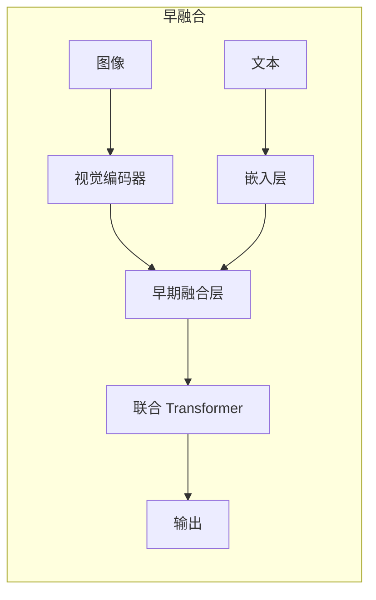
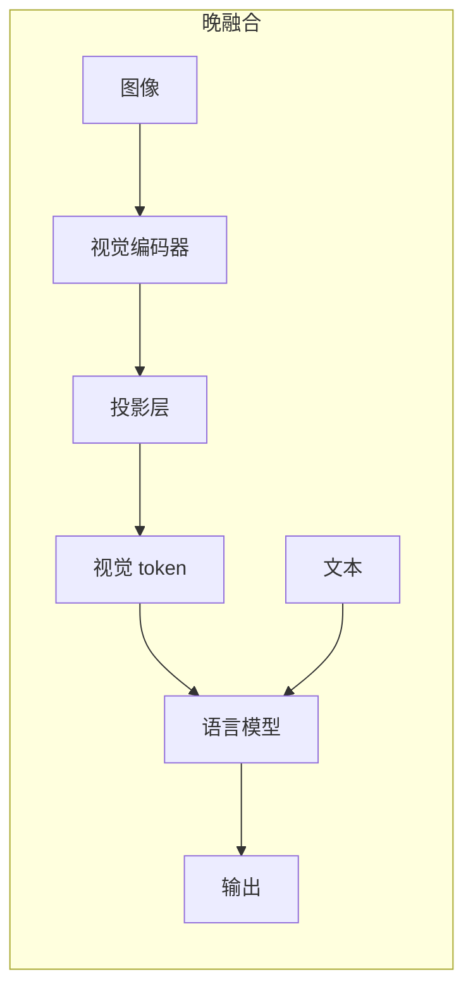
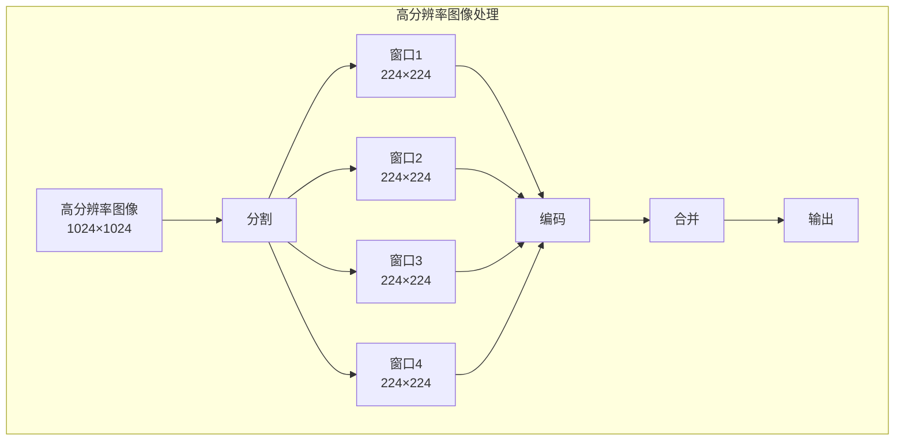

# 多模态大模型 —— 超越纯文本

在[上一章](../reasoning/test-time-compute.md)中，我们探讨了推理时算力缩放 —— 如何通过更多推理计算获得更好的答案。这些讨论围绕着一个共同的前提：模型处理的是**文本**。但人类感知世界的方式远不止语言，我们用眼睛看图像，用耳朵听声音，用多种感官综合理解世界。如果语言模型只能"读"而不能"看"，那它在许多现实场景中的能力终究是受限的。本章将探讨语言模型如何突破纯文本的边界，学会"看懂"图像和视频。

## 引言：从文本到视觉的跨越

### 多模态能力的学术渊源

让计算机同时理解图像和文字，这个想法由来已久。早在 2014 年，加拿大蒙特利尔大学的巴赫达瑙（Dzmitry Bahdanau）在 Seq2Seq 模型中引入注意力机制时，就已经展示了"让一个模态的表示去查询另一个模态的信息"的可行性（详见[注意力机制](../architecture-basics/transformer-architecture.md#Bahdanau-注意力)）。但真正让视觉 - 语言融合走向实用化的，是三项里程碑式的工作。

第一项是 **Vision Transformer**（ViT）。2020 年，Google Research 的多索维茨基（Alexey Dosovitskiy）发表了论文《An Image is Worth 16x16 Words: Transformers for Image Recognition at Scale》，提出了一个在当时看来相当反直觉的想法：抛弃卷积神经网络几十年来积累的局部特征提取范式，直接把图像切成小块，当作"词元"交给 Transformer 处理。这个听起来简陋的方案，在大规模数据上竟然超越了 ResNet 等经典 CNN 架构，从根本上统一了图像理解和文本理解的架构基础 —— 两者都是 Transformer 处理的序列。

第二项是 **CLIP**（Contrastive Language-Image Pre-training）。2021 年，OpenAI 的拉德福德（Alec Radford）等人发表了论文《Learning Transferable Visual Models From Natural Language Supervision》，用 4 亿对图文数据，通过对比学习训练了一个将图像和文本映射到同一语义空间的模型。CLIP 的贡献不仅是"猫的图片"和文本"a photo of a cat"在向量空间中距离相近，更重要的是它证明了一个深刻的观点：**自然语言本身就是最好的视觉监督信号** —— 不需要手工标注"这是猫""这是狗"，互联网上已有的图文配对就足够训练出强大的视觉表示。

第三项是 **GPT-4V**。2023 年 9 月，OpenAI 发布了 GPT-4 的视觉版本，这是第一个将多模态能力推向大众视野的商业模型。它不仅能描述图片内容，还能解读图表数据、分析截图中的代码错误、甚至对比多张图片的差异。GPT-4V 的发布标志着多模态从学术研究走向实用产品，随后 Google 的 Gemini、Anthropic 的 Claude 多模态版本相继推出，多模态能力迅速成为顶级 LLM 的标配。

这三项工作串起了一条清晰的技术脉络：ViT 解决了"图像如何变成序列"，CLIP 解决了"图像和文本如何在语义空间中对齐"，GPT-4V 则展示了"对齐后的视觉信息如何被语言模型理解和推理"。本章将沿着这条脉络，逐一解析每个环节的技术原理。

### 纯文本模型的局限

纯文本语言模型的训练目标是预测下一个词元。模型通过海量文本学习语言的统计规律、世界知识和推理能力。但文本只是人类知识表达的一种形式，许多信息更适合用图像、图表、公式来表达。考虑以下场景：医学诊断中，医生需要看 X 光片和 CT 图像才能判断病情；工程设计中，工程师需要看图纸和 3D 模型才能理解设计意图；科学研究中，研究者需要看实验数据图表和分子结构图才能分析结论。纯文本模型在这些场景下力不从心，即使描述得再详细，文字也难以完整传达视觉信息的丰富性。一张 X 光片中的阴影模式、一份财报图表中的趋势走向、一段视频中人物的微表情，这些信息的文本描述往往是冗长而不精确的。多模态模型的出现，正是为了填补这一空白。

### 两个核心技术问题

让语言模型"学会看"，需要解决两个核心问题。

**问题一：图像如何变成模型能理解的表示？** 语言模型的输入是词元（token）序列，每个词元对应词表中的一个索引（详见[词元化](../architecture-basics/language-model-tokenization.md)）。图像则是连续的像素矩阵，分辨率、颜色通道、空间结构都和文本截然不同。如何将这种连续的、二维的信号转化为模型能处理的离散或连续表示？ViT 给出了答案：把图像切成小块，每块当作一个"视觉词元"。

**问题二：视觉信息如何与语言信息对齐？** 语言模型在文本上预训练，学习的是文本的语义空间。视觉信息有自己的语义空间 —— 颜色、形状、空间关系这些概念在视觉空间中有自然的表示，但在文本空间中却是一串离散的词语。CLIP 解决了这个问题：通过对比学习，让"猫的图片"和"猫的文字"在同一个向量空间中靠近。对齐之后的视觉信息，才能被语言模型真正"理解"而非仅仅"看到"。

这两个问题的解决方案，构成了多模态大模型的技术核心。接下来的章节将依次展开：先看融合架构如何把视觉编码器和语言模型组合起来，再看视觉编码器如何工作，再看跨模态对齐如何实现，最后看这些技术如何应对视频理解、多图推理等更复杂的场景。

## 视觉 - 语言融合架构

上一节提出了两个核心问题：图像如何变成序列、视觉和语言如何对齐。本节先回答一个更宏观的问题：**视觉模块和语言模块该如何组合**？这就像搭积木 —— 我们有了视觉编码器和语言模型两块积木，但拼法不同，模型的能力和效率也大不相同。

### 图像编码器 + 语言解码器

现代多模态 LLM 普遍采用"图像编码器 + 语言解码器"的架构，其核心思路是：视觉编码器负责"看"（将图像编码为向量序列），语言模型负责"说"（处理视觉和文本信息，生成回答），中间用一个投影层将两者连接起来。

```nn-arch width=720
name: 多模态大模型架构
layout: horizontal

sections:
  - name: 输入
    layers: [image_input, text_input]
  - name: 编码
    layers: [vision_encoder, text_embed]
  - name: 对齐
    layers: [projector]
  - name: 语言模型
    layers: [llm_layers]
  - name: 输出
    layers: [output]

layers:
  - {id: image_input, name: "图像", type: input, size: "H×W×3"}
  - {id: text_input, name: "文本", type: input, size: "词元序列"}
  - {id: vision_encoder, name: "视觉编码器<br/>ViT/SigLIP", type: encoder, size: "图像嵌入"}
  - {id: text_embed, name: "文本嵌入", type: embedding, size: "词嵌入"}
  - {id: projector, name: "投影层<br/>MLP/Q-Former", type: projection, size: "视觉token"}
  - {id: llm_layers, name: "LLM 层<br/>Transformer", type: decoder, size: "自回归生成"}
  - {id: output, name: "输出", type: output, size: "文本/描述"}
```

这个架构由三个组件构成：**视觉编码器**（Vision Encoder）将图像编码为向量序列，**投影层**（Projector）将视觉向量映射到语言模型的嵌入空间，**语言模型**（LLM）处理视觉 token 和文本 token，生成回答。这种设计的优势在于**模块化**：视觉编码器和语言模型可以分别预训练，然后通过投影层连接。这大大降低了训练成本，也使得模型可以灵活组合不同的视觉编码器和语言模型。打个比方，视觉编码器就像一位翻译官，把图像"翻译"成语言模型能理解的语言；投影层则是翻译官的口音调整，确保翻译后的表达方式和语言模型的"母语"一致。

### 早融合 vs 晚融合

模块化架构确定后，下一个设计选择是：**视觉和语言信息在多早的层级进行融合**？这引出了两种范式。

**早融合**（Early Fusion）在模型的早期层就融合视觉和语言信息，让两种模态在 Transformer 的每一层都深度交互。



早融合的典型代表是 DeepMind 于 2022 年发布的 **Flamingo** 和 Salesforce 于 2023 年发布的 **BLIP-2**。它们在语言模型的每一层都插入交叉注意力（Cross-Attention），让文本 token 可以"查询"视觉信息。这种设计的直觉是：语言模型在生成每个词时，都应该能看到图像的全部信息，就像人类一边看图一边说话，每句话都可能参考图片中的不同区域。但代价是架构复杂度显著增加 —— 语言模型的每一层都需要额外的交叉注意力模块，训练时也需要同时更新更多参数。

**晚融合**（Late Fusion）则采取另一种策略：视觉信息在进入语言模型之前就完成处理，语言模型只看到投影后的"视觉 token"，和文本 token 没有本质区别。



晚融合的典型代表是威斯康星大学麦迪逊分校于 2023 年发布的 **LLaVA** 和 OpenAI 的 **GPT-4V**。视觉信息通过投影层转化为视觉 token，与文本 token 拼接后一起输入语言模型。从语言模型的视角看，视觉 token 和文本 token 没有区别，都是输入序列中的元素，都通过自注意力机制交互。这种设计的好处是语言模型的结构完全不变，可以复用已预训练的权重，训练效率高得多。

两种范式的对比：

| 特性 | 早融合 | 晚融合 |
|:-----|:-------|:-------|
| 架构复杂度 | 高（需要修改 LLM 结构） | 低（LLM 结构不变） |
| 训练效率 | 较低（需要联合训练） | 较高（可冻结 LLM） |
| 视觉 - 语言交互 | 深度交互（每层都有） | 浅层交互（只在输入层） |
| 代表模型 | Flamingo、BLIP-2 | LLaVA、GPT-4V、Gemini |

一个有趣的现象是：尽管早融合在理论上提供了更深的跨模态交互，现代多模态 LLM 却普遍采用**晚融合**方案。原因在于晚融合更简单、更灵活，且实际性能表现并不逊色。这说明，视觉和语言的深度交互并非必须通过架构层面的交叉注意力来实现 —— 一个足够强大的语言模型，仅靠自注意力机制，就能在视觉 token 和文本 token 之间建立充分的联系。

## 视觉编码器：从 ViT 到 SigLIP

架构确定后，接下来深入视觉编码器的内部。视觉编码器是多模态模型的"眼睛"，负责将图像转化为向量表示。现代多模态 LLM 普遍采用 Vision Transformer 架构的变体，本节将从 ViT 的原理出发，再介绍两个在实践中广泛使用的视觉编码器：CLIP 和 SigLIP。

### ViT：图像变成向量序列

在 ViT 出现之前，图像理解几乎被卷积神经网络（CNN）垄断。CNN 的核心假设是**局部性**：图像中相邻的像素往往高度相关，因此用小卷积核逐层提取局部特征是合理的。但 CNN 也有明显的局限：卷积核的感受野有限，深层特征才能覆盖全局信息，且卷积操作本身是位置不变的，无法直接编码"这个 patch 在图像的左上角"这类绝对位置信息。

2020 年，Google Research 的多索维茨基（Alexey Dosovitskiy）提出了一个大胆的替代方案：**把图像当作文本处理**。具体来说，将图像分割成固定大小的小块（patch），每个 patch 展平后通过线性投影变成一个向量，就像文本中的每个词被嵌入为一个向量一样。这样一来，图像就变成了一个向量序列，可以直接交给 Transformer 编码器处理。这个架构就是 Vision Transformer（ViT）。

ViT 的处理流程分为五步：

1. **图像分块**：将 $H \times W \times 3$ 的图像分割成 $N$ 个 $P \times P \times 3$ 的 patch，其中 $N = (H/P) \times (W/P)$。例如，一张 $224 \times 224$ 的图像，按 $16 \times 16$ 分块，得到 $14 \times 14 = 196$ 个 patch。

2. **Patch 嵌入**：将每个 patch 展平并通过线性投影，得到 $N$ 个 $d$ 维向量。这一步在实现上等价于一个步长等于卷积核大小的卷积层。

3. **位置编码**：为每个 patch 添加可学习的位置编码。由于 Transformer 本身是位置不变的，位置编码告诉模型"这个 patch 来自图像的哪个位置"，就像在文本中词的位置信息一样。

4. **Transformer 编码**：通过多层 Transformer 编码器处理整个 patch 序列，每层包含多头自注意力和前馈网络。

5. **[CLS] token**：在序列开头添加一个特殊的 [CLS] token，其最终表示汇聚了整张图像的信息，可用于图像分类等任务。

```nn-arch width=600
name: ViT 架构
layout: vertical

sections:
  - name: 输入
    layers: [image]
  - name: 分块与嵌入
    layers: [patches, embed]
  - name: Transformer
    layers: [transformer]
  - name: 输出
    layers: [cls_output]

layers:
  - {id: image, name: "图像<br/>224×224×3", type: input, size: "H×W×3"}
  - {id: patches, name: "Patch 分割<br/>16×16", type: operation, size: "N 个 patch"}
  - {id: embed, name: "Patch 嵌入<br/>+ 位置编码", type: embedding, size: "N×d"}
  - {id: transformer, name: "Transformer<br/>编码器", type: encoder, size: "N×d"}
  - {id: cls_output, name: "[CLS] 输出<br/>图像表示", type: output, size: "d 维向量"}
```

ViT 的几个关键参数决定了模型的规模和能力：Patch 大小通常为 $16 \times 16$ 或 $14 \times 14$，patch 越小，序列越长，模型能捕捉的细节越丰富，但计算成本也越高；序列长度由图像分辨率和 patch 大小共同决定，$224 \times 224$ 图像按 $16 \times 16$ 分块得到 196 个 patch；隐藏维度（即每个 patch 向量的维度）在不同规模的 ViT 中分别为 768（ViT-Base）、1024（ViT-Large）和 1408（ViT-Giant）。

下面的代码演示了 ViT 中 Patch 嵌入层的实现，展示了图像如何从像素矩阵转化为向量序列。

```python runnable
import torch
import torch.nn as nn

class PatchEmbedding(nn.Module):
    """ViT 的 Patch 嵌入层

    将图像分割为 patch 并嵌入为向量序列，对应 ViT 处理流程的第 1-3 步：
    图像分块 → Patch 嵌入 → 位置编码
    """
    def __init__(self, img_size=224, patch_size=16, in_channels=3, embed_dim=768):
        super().__init__()
        self.img_size = img_size
        self.patch_size = patch_size
        self.num_patches = (img_size // patch_size) ** 2

        # 用卷积实现 patch 嵌入：kernel_size=stride=patch_size
        # 等价于将每个 patch 展平后做线性投影
        self.proj = nn.Conv2d(
            in_channels, embed_dim,
            kernel_size=patch_size, stride=patch_size
        )

        # 可学习的位置编码，形状为 (1, num_patches + 1, embed_dim)
        # +1 是因为还有 [CLS] token
        self.pos_embed = nn.Parameter(
            torch.randn(1, self.num_patches + 1, embed_dim) * 0.02
        )

        # [CLS] token，用于汇聚整张图像的全局信息
        self.cls_token = nn.Parameter(torch.randn(1, 1, embed_dim) * 0.02)

    def forward(self, x):
        B, C, H, W = x.shape

        # Patch 嵌入: (B, C, H, W) -> (B, embed_dim, H/P, W/P)
        x = self.proj(x)

        # 展平空间维度: (B, embed_dim, H/P, W/P) -> (B, embed_dim, num_patches)
        x = x.flatten(2)

        # 转置: (B, embed_dim, num_patches) -> (B, num_patches, embed_dim)
        x = x.transpose(1, 2)

        # 在序列开头添加 [CLS] token
        cls_tokens = self.cls_token.expand(B, -1, -1)
        x = torch.cat([cls_tokens, x], dim=1)

        # 添加位置编码，让模型知道每个 patch 的空间位置
        x = x + self.pos_embed

        return x

# 演示：将 224×224 图像转化为向量序列
torch.manual_seed(42)
patch_embed = PatchEmbedding(img_size=224, patch_size=16, embed_dim=768)

image = torch.randn(1, 3, 224, 224)
output = patch_embed(image)

print(f"输入图像形状: {image.shape}")
print(f"Patch 大小: 16×16")
print(f"Patch 数量: {patch_embed.num_patches}")
print(f"输出序列形状: {output.shape}")
print(f"  - [CLS] token: 1")
print(f"  - Patch tokens: {patch_embed.num_patches}")
print(f"  - 总长度: {output.shape[1]}")
```

从运行结果可以看到，一张 $224 \times 224 \times 3$ 的图像被转化为 197 个 768 维向量（1 个 [CLS] token + 196 个 patch token），和文本处理中"一个句子变成一个词元序列"的过程完全对应。这就是 ViT 的精髓：**图像和文本在表示层面统一了**，都是 Transformer 处理的序列。

### CLIP：视觉 - 语言对齐的里程碑

ViT 解决了"图像如何变成序列"的问题，但序列中的向量仍然生活在视觉语义空间里 —— 它们编码的是颜色、纹理、形状等视觉特征，和语言模型所理解的"猫""奔跑""可爱"这些语义概念之间还有一道鸿沟。CLIP 正是为了跨越这道鸿沟而诞生的。

2021 年，OpenAI 的拉德福德（Alec Radford）等人发表了论文《Learning Transferable Visual Models From Natural Language Supervision》。他们收集了 4 亿对互联网上的图文配对数据，通过对比学习训练了一个双编码器模型：图像编码器（ViT）和文本编码器（Transformer）分别将图像和文本映射到同一语义空间。在这个空间中，匹配的图文对距离近，不匹配的图文对距离远。

CLIP 的训练目标可以用对比损失（Contrastive Loss）来形式化。给定一个批次中的 $N$ 个图文对 $(v_1, t_1), (v_2, t_2), \ldots, (v_N, t_N)$，CLIP 的损失函数为：

$$\mathcal{L} = -\frac{1}{N} \sum_{i=1}^{N} \left( \log \frac{\exp(\text{sim}(v_i, t_i) / \tau)}{\sum_{j=1}^{N} \exp(\text{sim}(v_i, t_j) / \tau)} + \log \frac{\exp(\text{sim}(v_i, t_i) / \tau)}{\sum_{j=1}^{N} \exp(\text{sim}(v_j, t_i) / \tau)} \right)$$

这个公式看着复杂，拆开来看含义很直观：

- $v_i$ 是第 $i$ 张图像经过视觉编码器后的嵌入向量，$t_i$ 是对应文本的嵌入向量
- $\text{sim}(v_i, t_j)$ 是余弦相似度，衡量两个向量的方向一致性
- $\tau$ 是温度参数，控制相似度得分的"尖锐程度"——$\tau$ 越小，模型越倾向于把区分集中在最相似的几个候选上
- 第一个求和项是"图像到文本"方向：对于图像 $v_i$，在所有 $N$ 个文本中，正确的文本 $t_i$ 应该获得最高的相似度得分
- 第二个求和项是"文本到图像"方向，逻辑对称
- 整体公式可以理解为：**在每个批次中，让匹配的图文对成为彼此的"最近邻"，推开所有不匹配的图文对**

CLIP 的关键贡献是学习了一个**对齐的视觉 - 语言嵌入空间**。在这个空间中，"猫的图片"和文本"a photo of a cat"的嵌入向量距离很近，而"猫的图片"和文本"a photo of a dog"距离较远。这意味着视觉特征和语言概念在同一个坐标系下有了对应关系，为后续的多模态 LLM 提供了高质量的视觉表示。几乎所有现代多模态模型（LLaVA、GPT-4V、Gemini）的视觉编码器都直接使用或借鉴了 CLIP 的预训练权重。

### SigLIP：更好的视觉编码器

CLIP 虽然成功，但它的对比损失有一个实践上的局限：Softmax 归一化需要在一个批次内对所有样本计算全局归一化常数，这意味着批次中每个图文对的损失都和其他所有样本耦合在一起。当批次较小时，负样本数量不足，对比学习的效果会打折扣；当批次很大时（CLIP 原论文使用 32768 的批次），全局归一化的计算又很昂贵。

2023 年，Google DeepMind 的翟晓舟（Xiaohua Zhai）等人在论文《Sigmoid Loss for Language Image Pre-Training》中提出了 **SigLIP**，用 Sigmoid 损失替代 Softmax 对比损失，被 Gemini 和许多现代多模态模型采用。

SigLIP 的损失函数为：

$$\mathcal{L} = -\frac{1}{N} \sum_{i=1}^{N} \sum_{j=1}^{N} \left[ y_{ij} \log \sigma(z_{ij}) + (1 - y_{ij}) \log (1 - \sigma(z_{ij})) \right]$$

这个公式看着复杂，拆开来看含义很直观：

- $y_{ij}$ 是标签：如果第 $i$ 张图像和第 $j$ 个文本是匹配对，则 $y_{ij} = 1$，否则 $y_{ij} = 0$
- $z_{ij}$ 是图像 $i$ 和文本 $j$ 的相似度得分（经过温度缩放后的余弦相似度）
- $\sigma$ 是 Sigmoid 函数，将得分映射到 $(0, 1)$ 区间
- 每个图文对 $(i, j)$ 的损失独立计算：匹配对希望 $\sigma(z_{ij})$ 接近 1，不匹配对希望 $\sigma(z_{ij})$ 接近 0
- 整体公式可以理解为：**对每个图文对独立地做二分类判断 —— "这对图文是否匹配"**，不需要和其他样本比较

SigLIP 和 CLIP 的核心区别在于归一化方式。CLIP 的 Softmax 损失要求"在所有候选中选出正确的那一个"，这是一个 $N$ 分类问题；SigLIP 的 Sigmoid 损失则把每个图文对当作独立的二分类问题："这对图文是否匹配？"。这种改变带来了两个实践优势：第一，训练更稳定，因为不需要计算全局归一化常数；第二，支持更小的批次大小，因为每个对的损失不依赖批次中其他样本提供负样本。

| 特性 | CLIP | SigLIP |
|:-----|:-----|:-------|
| 损失函数 | Softmax 对比损失 | Sigmoid 损失 |
| 归一化方式 | 全局归一化（批次内所有样本） | 独立二分类（每个图文对） |
| 训练效率 | 需要大批次（32768+） | 支持小批次 |
| 表示质量 | 优秀 | 更优（尤其在细粒度任务） |

下面的代码对比了 CLIP 和 SigLIP 两种损失函数的实现，帮助理解它们在计算方式上的差异。

```python runnable
import torch
import torch.nn.functional as F

def clip_loss(image_embeds, text_embeds, temperature=0.07):
    """CLIP 的对比损失

    核心步骤：
    1. 归一化嵌入向量（对应余弦相似度）
    2. 计算相似度矩阵（全局归一化前的 logits）
    3. 对称交叉熵：图像→文本 + 文本→图像
    """
    # 归一化到单位球面，使内积等于余弦相似度
    image_embeds = F.normalize(image_embeds, dim=-1)
    text_embeds = F.normalize(text_embeds, dim=-1)

    # 相似度矩阵: (N, N)，logits[i][j] = sim(image_i, text_j) / tau
    logits = (image_embeds @ text_embeds.T) / temperature

    # 对称的交叉熵损失：对角线是正样本
    labels = torch.arange(len(image_embeds))
    loss_i2t = F.cross_entropy(logits, labels)       # 图像→文本
    loss_t2i = F.cross_entropy(logits.T, labels)     # 文本→图像

    return (loss_i2t + loss_t2i) / 2

def siglip_loss(image_embeds, text_embeds, temperature=0.07):
    """SigLIP 的 Sigmoid 损失

    核心步骤：
    1. 归一化嵌入向量
    2. 计算相似度矩阵
    3. 对每个图文对独立做二分类（Sigmoid）
    """
    image_embeds = F.normalize(image_embeds, dim=-1)
    text_embeds = F.normalize(text_embeds, dim=-1)

    logits = (image_embeds @ text_embeds.T) / temperature

    # 标签矩阵：对角线为正样本（匹配对），其余为负样本
    N = len(image_embeds)
    labels = torch.eye(N, device=image_embeds.device)

    # Sigmoid 损失：每个图文对独立计算
    # 正样本希望 σ(logit) 接近 1，负样本希望 σ(logit) 接近 0
    loss = -labels * F.logsigmoid(logits) - (1 - labels) * F.logsigmoid(-logits)

    return loss.mean()

# 演示：对比两种损失
torch.manual_seed(42)
batch_size = 4
embed_dim = 256

# 模拟嵌入：对角线为匹配的图文对，加入少量噪声
image_embeds = torch.randn(batch_size, embed_dim)
text_embeds = image_embeds + torch.randn(batch_size, embed_dim) * 0.3

clip_l = clip_loss(image_embeds, text_embeds)
siglip_l = siglip_loss(image_embeds, text_embeds)

print(f"CLIP 损失: {clip_l.item():.4f}")
print(f"SigLIP 损失: {siglip_l.item():.4f}")
print()
print("SigLIP 的优势:")
print("1. 不需要全局归一化，训练更稳定")
print("2. 支持小批次训练，更灵活")
print("3. 在细粒度任务上表现更好")
```

## 跨模态对齐

有了视觉编码器，图像可以转化为向量序列。但这些向量仍然在视觉语义空间中 —— 它们编码的是"这个 patch 的颜色和纹理"，而非语言模型所理解的"这是一只猫"。如何让语言模型理解这些视觉向量？这就需要**跨模态对齐**：将视觉嵌入映射到语言模型的嵌入空间，使映射后的"视觉 token"与文本 token 处于同一语义空间。

### 如何将图像信息注入语言模型

跨模态对齐的核心问题可以类比为翻译：视觉编码器输出的是"视觉语言"，语言模型理解的是"文本语言"，投影层就是两者之间的翻译器。翻译的质量直接影响语言模型对视觉信息的理解程度。实践中演化出了三种主要的对齐方式。

**方式一：线性投影**（LLaVA）

最简单的方法是用一个线性层将视觉嵌入投影到语言模型的嵌入维度：

$$\text{Visual Token} = W \cdot \text{Vision Embedding}$$

其中 $W$ 是可学习的投影矩阵，形状为 $d_{\text{vision}} \times d_{\text{llm}}$。LLaVA 的实验证明，简单的线性投影就足够强大，关键在于视觉编码器和语言模型本身的能力。这有些出乎意料 —— 一个线性变换就能跨越两个语义空间的鸿沟？直觉上，CLIP 已经在预训练时完成了视觉 - 语言的对齐，投影层只需要做维度匹配和微调，不需要从头学习对齐关系。

**方式二：多层 MLP**（LLaVA-1.5）

LLaVA-1.5 将线性投影升级为两层 MLP，增加了非线性变换能力：

$$\text{Visual Token} = W_2 \cdot \text{GELU}(W_1 \cdot \text{Vision Embedding})$$

其中 GELU 是[Transformer](../architecture-basics/transformer-architecture.md)中常用的激活函数。两层 MLP 比线性投影多了非线性变换，能够更好地处理视觉信息中复杂的模式，尤其是当视觉编码器和语言模型的语义空间差异较大时（例如使用非 CLIP 的视觉编码器）。

**方式三：Q-Former**（BLIP-2）

Q-Former 是 Salesforce 在 2023 年提出的更精巧的投影方案，由一组可学习的查询向量通过交叉注意力从视觉编码器提取信息。

```nn-arch width=600
name: Q-Former 架构
layout: vertical

sections:
  - name: 视觉输入
    layers: [vision_embeds]
  - name: 查询层
    layers: [queries, cross_attn, self_attn]
  - name: 输出
    layers: [visual_tokens]

layers:
  - {id: vision_embeds, name: "视觉嵌入<br/>N×d", type: input, size: "图像 patch"}
  - {id: queries, name: "可学习查询<br/>M×d", type: embedding, size: "固定数量"}
  - {id: cross_attn, name: "交叉注意力<br/>Query × Vision", type: attention, size: "提取信息"}
  - {id: self_attn, name: "自注意力<br/>Query × Query", type: attention, size: "交互"}
  - {id: visual_tokens, name: "视觉 Token<br/>M×d", type: output, size: "固定长度"}
```

Q-Former 的工作方式可以类比为"信息提取员"：它手持 $M$ 个查询向量（相当于 $M$ 个问题），通过交叉注意力从视觉编码器的 $N$ 个 patch 嵌入中提取信息，再通过自注意力让查询之间交互，最终输出 $M$ 个视觉 token。Q-Former 的独特优势是**压缩**：无论图像有多少 patch（196 个或 4096 个），输出的视觉 token 数量固定为 $M$（通常为 32 或 64 个）。这大幅降低了语言模型的计算负担，尤其是在处理高分辨率图像时。

### 投影层设计

投影层的设计直接影响多模态模型的性能。以下是几种常见设计的对比：

| 设计 | 参数量 | 优势 | 劣势 |
|:-----|:-------|:-----|:-----|
| 线性层 | $d_{\text{vision}} \times d_{\text{llm}}$ | 简单、高效 | 表达能力有限 |
| 两层 MLP | $2 \times d_{\text{vision}} \times d_{\text{hidden}}$ | 非线性变换 | 参数量增加 |
| Q-Former | 可学习查询 + 注意力 | 可压缩、灵活 | 训练复杂 |
| Cross-Attention | 每层都有交叉注意力 | 深度交互 | 架构修改大 |

实践中，对于资源受限场景，线性投影已经足够；对于追求性能的场景，两层 MLP 是好的平衡点；对于需要压缩视觉信息的场景（如高分辨率图像），Q-Former 更合适。

### 多模态模型的训练流程

理解了架构和对齐方式后，一个自然的问题是：**多模态模型从头到尾是怎么训练的？** 现代多模态 LLM 的训练通常分为三个阶段，每个阶段有不同的训练目标和可训练参数。


**阶段一：视觉编码器预训练**。这一步通常不需要自己训练，而是直接使用已预训练的 CLIP 或 SigLIP 的视觉编码器。这些模型在海量图文对上训练过，已经学到了高质量的视觉表示。在后续训练中，视觉编码器的参数通常**冻结**（不更新），因为它的表示已经足够好，且解冻训练的成本极高。

**阶段二：投影层预训练**。这一步只训练投影层，目标是将冻结的视觉编码器输出对齐到语言模型的嵌入空间。训练数据通常是图像 - 描述对（image-caption pairs），训练目标是让模型学会根据图像生成描述文本。由于只训练投影层，参数量很小（通常几十 MB），这一步很快就能完成。LLaVA 的阶段二只训练了一个两层 MLP，参数量约 0.5B，在约 60 万图文对上训练几小时即可。

**阶段三：多模态指令微调**。这一步解冻投影层和语言模型（或仅解冻语言模型的部分层），在多模态指令数据上微调。指令数据的格式是"图像 + 指令 → 回答"，例如"<图像> 这张图中有几只猫？→ 3 只"。这一步让模型学会根据用户的指令对图像进行推理、描述、问答等任务，是从"能看"到"能理解和回答"的关键一步。

三阶段训练的设计体现了"冻结已有能力，逐步添加新能力"的思路：阶段一提供视觉感知能力，阶段二建立视觉 - 语言的桥梁，阶段三让模型学会按指令行动。这种渐进式训练既节省计算资源，又避免了灾难性遗忘。

### 交错的图文训练

在阶段三的指令微调中，训练数据通常采用**交错图文数据**（interleaved image-text data）的格式：图像和文本交替出现，模型学习理解它们之间的关系。

```
<image> 这是一张猫的图片。猫正在睡觉。
<image> 这是一张狗的图片。狗正在奔跑。
问题：第一张图片中的动物在做什么？
回答：猫正在睡觉。
```

训练目标涵盖三类任务：**图像描述**（给定图像，生成描述文本）、**视觉问答**（给定图像和问题，生成答案）和**交错理解**（理解多张图像和文本的关系）。这三类任务从简单到复杂，逐步提升模型的多模态理解能力。

下面的代码演示了一个简化的多模态模型，展示了视觉 token 和文本 token 如何拼接后一起输入语言模型。

```python runnable
import torch
import torch.nn as nn

class SimpleMultimodalModel(nn.Module):
    """简化的多模态模型演示

    展示晚融合架构的核心流程：
    1. 视觉嵌入通过投影层映射到语言模型空间
    2. 视觉 token 和文本 token 拼接
    3. 拼接后的序列输入语言模型处理
    """
    def __init__(self, vision_dim=768, llm_dim=4096, vocab_size=32000):
        super().__init__()

        # 视觉编码器（假设已预训练，此处用 Identity 代替）
        self.vision_encoder = nn.Identity()

        # 投影层：两层 MLP，对应 LLaVA-1.5 的设计
        self.projector = nn.Sequential(
            nn.Linear(vision_dim, llm_dim),
            nn.GELU(),
            nn.Linear(llm_dim, llm_dim)
        )

        # 文本嵌入层
        self.text_embed = nn.Embedding(vocab_size, llm_dim)

        # 语言模型（简化为单层 Transformer）
        self.llm = nn.TransformerDecoderLayer(
            d_model=llm_dim, nhead=8, batch_first=True
        )

        # 输出层：预测词表中的下一个词
        self.output = nn.Linear(llm_dim, vocab_size)

    def forward(self, image, text_tokens):
        """
        参数:
            image: (B, N, vision_dim) 视觉嵌入（已由视觉编码器提取）
            text_tokens: (B, L) 文本词元索引
        """
        # 投影视觉嵌入到语言模型空间
        visual_tokens = self.projector(image)  # (B, N, llm_dim)

        # 文本嵌入
        text_embeds = self.text_embed(text_tokens)  # (B, L, llm_dim)

        # 拼接视觉和文本 token（晚融合的核心操作）
        combined = torch.cat([visual_tokens, text_embeds], dim=1)  # (B, N+L, llm_dim)

        # 通过语言模型处理
        output = self.llm(combined, combined)

        # 预测下一个词
        logits = self.output(output)

        return logits

# 演示：展示多模态模型的输入输出维度
torch.manual_seed(42)
model = SimpleMultimodalModel()

batch_size = 2
num_patches = 196  # 14×14 个 patch
seq_len = 20       # 文本序列长度

image_embeds = torch.randn(batch_size, num_patches, 768)
text_tokens = torch.randint(0, 32000, (batch_size, seq_len))

logits = model(image_embeds, text_tokens)

print(f"视觉嵌入形状: {image_embeds.shape}")
print(f"文本词元形状: {text_tokens.shape}")
print(f"输出 logits 形状: {logits.shape}")
print(f"  - 视觉 token 数量: {num_patches}")
print(f"  - 文本 token 数量: {seq_len}")
print(f"  - 总序列长度: {num_patches + seq_len}")
```

从运行结果可以看到，视觉 token 和文本 token 拼接后形成长度为 216 的序列（196 个视觉 token + 20 个文本 token），语言模型对这个统一序列做自回归生成。从语言模型的视角看，视觉 token 和文本 token 没有任何区别，都是输入序列中的元素。

## 架构纵览：代表性多模态模型

前面几节分别讲解了融合架构、视觉编码器和跨模态对齐的原理。本节将这些知识综合起来，分析几个代表性多模态模型的设计选择，理解它们为什么这样设计、各自的优势和局限。

### LLaVA：简洁即力量

**LLaVA**（Large Language and Vision Assistant）由威斯康星大学麦迪逊分校的刘浩宇（Haotian Liu）等人在 2023 年发布，是最简洁也最具影响力的开源多模态架构。它的设计几乎是对晚融合范式的教科书式实现：

- 视觉编码器：CLIP ViT-L/14，输出 1024 维的 patch 嵌入
- 投影层：简单的两层 MLP（线性层 + GELU + 线性层）
- 语言模型：Vicuna-7B/13B（LLaMA 的指令微调版）

LLaVA 的贡献不在于架构创新，而在于**验证了一个关键假设**：即使是最简单的线性投影，配合强大的视觉编码器（CLIP）和语言模型（Vicuna），也能获得出色的多模态能力。LLaVA-1.5 在多个视觉问答基准上达到了接近 GPT-4V 的水平，而训练成本仅为几百美元。这个结果极大地降低了多模态研究的门槛，催生了大量后续工作。

### BLIP-2：高效的信息桥梁

**BLIP-2** 由 Salesforce 的李俊浩（Junnan Li）等人在 2023 年发布，其核心创新是 Q-Former 投影层。BLIP-2 的设计目标是：**在冻结视觉编码器和语言模型的前提下，仅训练轻量的 Q-Former 来桥接两者**。

- 视觉编码器：ViT-L/14 或 ViT-G/14（冻结）
- 投影层：Q-Former，32 个可学习查询向量（仅此部分可训练）
- 语言模型：OPT 或 FlanT5（冻结）

Q-Former 的 32 个查询向量通过交叉注意力从视觉编码器提取信息，无论输入图像有多大，输出始终是 32 个视觉 token。这种压缩能力使得 BLIP-2 可以使用参数量巨大的视觉编码器（ViT-G 有 1.8B 参数）而不给语言模型带来过重的计算负担。BLIP-2 的训练效率极高：在冻结两个大模型的情况下，只需要训练 Q-Former 的约 188M 参数，几小时即可完成。

### GPT-4V 与 Gemini：商业模型的推测

GPT-4V 的架构细节未公开，但从其行为特征和学术界的分析推测，它很可能也采用晚融合架构：视觉编码器可能是 SigLIP 或类似模型，投影层可能是多层 MLP，语言模型是 GPT-4。GPT-4V 展示了目前最强大的多模态能力，包括精确的图表理解、代码截图分析、多图对比推理等。

Google 的 Gemini 采用了略有不同的路线——Google 强调 Gemini 是**原生多模态**（natively multimodal）的，意味着视觉、音频和文本从训练一开始就在同一个模型中联合处理，而非先分别预训练再对齐。这种原生多模态方案在理论上能实现更深度的跨模态交互，但训练成本也更高。Gemini 在视频理解方面表现突出，能够理解长达数分钟的视频内容。

### 代表模型对比

| 模型 | 发布时间 | 视觉编码器 | 投影层 | 语言模型 | 训练特色 | 核心能力 |
|:-----|:---------|:-----------|:-------|:---------|:---------|:---------|
| GPT-4V | 2023.09 | SigLIP（推测） | MLP（推测） | GPT-4 | 未公开 | 图表理解、多图推理 |
| Gemini | 2023.12 | 原生多模态 | 原生多模态 | Gemini | 原生联合训练 | 视频理解、长上下文 |
| Claude | 2024.03 | 未公开 | 未公开 | Claude 3 | 未公开 | 安全性、文档 + 图像 |
| LLaVA-1.5 | 2023.10 | CLIP ViT-L | 两层 MLP | Vicuna | 三阶段训练 | 开源标杆、低成本 |
| BLIP-2 | 2023.01 | ViT-L/G | Q-Former | OPT/FlanT5 | 冻结 + 桥接 | 高效训练、信息压缩 |
| InternVL | 2024.02 | InternViT | MLP | InternLM | 多尺度训练 | 高分辨率、细粒度 |

从这张对比表中可以观察到几个趋势：晚融合架构已成为主流，投影层从简单的线性层向两层 MLP 演进，视觉编码器从 CLIP 向 SigLIP 和更大规模的 ViT 演进，训练策略从全参数微调向更高效的冻结 + 桥接方案演进。

## 长上下文多模态

前面的讨论都围绕单张标准分辨率图像的理解。但现实中的应用场景远比这复杂：视频理解需要处理时序信息，多图推理需要同时理解多张图像的关系，高分辨率图像处理需要在不丢失细节的前提下控制计算成本。这些场景对模型的长上下文能力提出了更高要求，本节逐一分析这些挑战和解决方案。

### 视频理解：从图像序列到时序建模

视频与图像的本质区别在于**时间维度**。一段视频是图像帧的时间序列，理解视频不仅需要识别每帧中的物体和场景，还需要捕捉帧与帧之间的动态变化 —— "猫从桌上跳下来"这个动作，只有通过连续帧的变化才能理解，任何单帧都无法完整表达。

视频理解需要模型具备三个层次的能力：**单帧理解**（识别每帧中的物体、场景、动作）、**时序建模**（理解帧与帧之间的关系，捕捉动态变化）和**信息整合**（从整个视频中提取关键信息，回答关于视频的问题）。

最直接的视频处理策略是**均匀采样**：从视频中均匀采样 $K$ 帧，每帧独立编码，然后拼接所有帧的视觉 token。

$$\text{Video Tokens} = \text{Concat}([\text{Frame}_1, \text{Frame}_2, \ldots, \text{Frame}_K])$$

这种方法简单易实现，但有一个明显的问题：均匀采样可能错过关键帧。想象一段 30 秒的视频，前 25 秒是一个人静坐，最后 5 秒突然站起来。如果采样 8 帧，很可能全部落在"静坐"阶段，完全错过"站起来"这个关键动作。

更精细的策略是**关键帧提取**：用视觉模型识别视频中的关键帧（如场景变化、动作发生），只编码关键帧。这比均匀采样更高效，但关键帧的检测本身也需要额外的计算，且"什么是关键帧"的定义并不总是明确的。

无论采用哪种采样策略，都需要为每帧添加**时间位置编码**，让模型理解帧的时间顺序。没有时间位置编码，模型无法区分"猫跳上桌"和"猫跳下桌" —— 两者的帧内容可能完全相同，只是顺序不同。

```python runnable
import torch
import torch.nn as nn

class VideoEncoder(nn.Module):
    """简化的视频编码器

    展示视频理解的核心流程：
    1. 每帧独立通过视觉编码器 + 投影层
    2. 添加时间位置编码，让模型理解帧的时间顺序
    3. 所有帧的 token 展平为一个长序列
    """
    def __init__(self, vision_dim=768, llm_dim=4096, max_frames=8):
        super().__init__()
        self.max_frames = max_frames

        # 帧编码器（共享权重，所有帧使用同一个编码器）
        self.frame_encoder = nn.Identity()  # 实际中是 ViT

        # 投影层：视觉嵌入 → 语言模型空间
        self.projector = nn.Linear(vision_dim, llm_dim)

        # 时间位置编码：让模型区分不同时间点的帧
        self.time_embed = nn.Parameter(
            torch.randn(1, max_frames, llm_dim) * 0.02
        )

    def forward(self, video_frames):
        """
        参数:
            video_frames: (B, T, N, vision_dim)
                B = 批次大小, T = 帧数, N = 每帧 patch 数
        """
        B, T, N, D = video_frames.shape

        # 投影每帧的视觉嵌入
        frame_embeds = self.projector(video_frames)  # (B, T, N, llm_dim)

        # 添加时间位置编码（广播到每帧的所有 patch）
        frame_embeds = frame_embeds + self.time_embed[:, :T, :].unsqueeze(2)

        # 展平为序列：(B, T, N, d) → (B, T*N, d)
        video_tokens = frame_embeds.reshape(B, T * N, -1)

        return video_tokens

# 演示：8 帧视频的编码过程
torch.manual_seed(42)
encoder = VideoEncoder()

# 模拟视频：2 个样本，每个 8 帧，每帧 196 个 patch
video_frames = torch.randn(2, 8, 196, 768)
video_tokens = encoder(video_frames)

print(f"视频帧数: 8")
print(f"每帧 patch 数: 196")
print(f"视频 token 总数: {video_tokens.shape[1]}")
print(f"输出形状: {video_tokens.shape}")
print(f"注意: 8 帧 × 196 patch/帧 = {8 * 196} 个 token")
```

从运行结果可以看到，8 帧视频产生了 1568 个视觉 token（8 × 196），这已经是一张图像的 8 倍。对于更长的视频（如 1 分钟、30fps 的视频有 1800 帧），token 数量会急剧膨胀，这就是视频理解对长上下文能力的根本需求。

### 多图推理

多图推理是指模型同时理解多张图像，并回答涉及它们关系的问题。例如："图 1 是产品的正面照，图 2 是侧面照，这两个角度的差异说明什么？"这类问题要求模型不仅理解每张图的内容，还要在图像之间建立联系。

多图处理面临三个挑战。第一是 **token 数量爆炸**：每张图像 196 个 token，4 张图就是 784 个 token，10 张图就是 1960 个 token，很快就会触及语言模型的上下文窗口限制。第二是**图像间关系建模**：模型需要理解图像之间的关系 —— 哪些图是同一场景的不同角度，哪些图是完全不同的内容。第三是**注意力分配**：面对多张图像，模型需要知道在回答不同问题时应该关注哪张图像。

针对这些挑战，实践中常用的解决方案包括：用 Q-Former 将每张图像压缩为更少的 token（如从 196 个压缩到 32 个），为不同图像添加不同的位置编码前缀以区分图像来源，以及让文本 token 通过自注意力机制选择性地关注不同图像。LLaVA-Next 和 GPT-4V 都支持多图输入，Gemini 甚至可以处理交错出现的图文序列。

### 高分辨率图像处理

标准 ViT 将图像分割为 $16 \times 16$ 的 patch。对于 $224 \times 224$ 的图像，得到 $14 \times 14 = 196$ 个 patch，这个数量在语言模型的处理能力之内。但许多实际应用需要处理高分辨率图像：医学影像通常是 $1024 \times 1024$ 甚至更高，卫星图像和工程图纸的分辨率更大。对于 $1024 \times 1024$ 的图像，按 $16 \times 16$ 分块会产生 $64 \times 64 = 4096$ 个 patch，token 数量是标准情况的 20 倍，计算成本急剧上升。

高分辨率处理有三种主要策略。**动态分辨率**根据图像分辨率动态调整 patch 大小，保持 token 数量相对稳定 —— 例如对低分辨率图像用 $14 \times 14$ 的 patch，对高分辨率图像用 $28 \times 28$ 的 patch。**滑动窗口**将大图像分割为多个小窗口（如 $224 \times 224$），分别编码后合并结果，类似于 CNN 中感受野逐步扩大的思路。**多尺度处理**同时处理低分辨率全局视图和高分辨率局部视图，让模型既能看到整体又能看到细节。



在代表性模型中，LLaVA-Next 支持动态分辨率，最高可处理 $672 \times 672$ 的图像；InternVL 采用多尺度处理，同时理解全局和局部信息；GPT-4V 支持任意分辨率，具体技术未公开。高分辨率处理和多图推理一样，核心挑战都是在保留足够视觉信息的前提下控制 token 数量，这本质上是信息压缩和计算效率之间的权衡。

## 小结

本章探讨了多模态大模型如何让语言模型学会"看"。

在架构层面，现代多模态 LLM 普遍采用"视觉编码器 + 投影层 + 语言模型"的模块化设计，晚融合方案因其简单高效而成为主流。在视觉编码器层面，ViT 将图像分割为 patch 并转化为向量序列，统一了图像和文本的表示方式；CLIP 通过对比学习对齐了视觉 - 语言语义空间，SigLIP 用 Sigmoid 损失改进了训练效率。在跨模态对齐层面，线性投影、多层 MLP 和 Q-Former 三种方案各有适用场景，三阶段训练流程（视觉编码器预训练 → 投影层对齐 → 指令微调）是当前的标准范式。在长上下文多模态层面，视频理解、多图推理和高分辨率处理都面临 token 数量膨胀的挑战，信息压缩和计算效率的权衡是核心问题。

多模态能力标志着大语言模型发展的新阶段。从纯文本到图文并茂，模型的能力边界被不断拓展。当前的多模态模型主要集中在视觉 - 语言融合，未来还将扩展到音频、3D 模型等更丰富的信息形式，真正实现"全能感知"。但多模态能力的提升也带来了新的问题：如何衡量一个多模态模型的好坏？如何确保它不会产生有害的视觉内容？这些问题将在[下一章](evaluation-safety.md)中探讨。

## 练习题

1. ViT 将 $224 \times 224$ 的图像按 $16 \times 16$ 分块后得到多少个 patch？如果将 patch 大小改为 $14 \times 14$，patch 数量变为多少？这对模型的计算成本有什么影响？

   <details>
   <summary>参考答案</summary>

   $16 \times 16$ 分块：$(224/16) \times (224/16) = 14 \times 14 = 196$ 个 patch。

   $14 \times 14$ 分块：$(224/14) \times (224/14) = 16 \times 16 = 256$ 个 patch。

   Patch 变小后，patch 数量从 196 增加到 256（增加约 30%），Transformer 自注意力的计算量与序列长度的平方成正比，因此计算成本增加约 $(256/196)^2 \approx 1.7$ 倍。但同时，更小的 patch 意味着每个 patch 覆盖的图像区域更小，模型能捕捉更细粒度的视觉细节。

   </details>

2. CLIP 的对比损失函数中，温度参数 $\tau$ 的作用是什么？$\tau$ 很大和 $\tau$ 很小时，模型的行为分别有什么特点？

   <details>
   <summary>参考答案</summary>

   温度参数 $\tau$ 控制相似度得分的"尖锐程度"。$\tau$ 很大时，$\text{sim}(v_i, t_j) / \tau$ 的值很小，Softmax 输出接近均匀分布，模型对正负样本的区分度低，训练信号弱，但训练更稳定。$\tau$ 很小时，相似度得分被放大，Softmax 输出接近 one-hot，模型高度集中于最相似的候选，训练信号强，但容易过拟合且训练不稳定。CLIP 原论文中 $\tau$ 作为可学习参数，最终学到的值约为 0.07，偏向"尖锐"一侧。

   </details>

3. LLaVA 使用两层 MLP 作为投影层，将 CLIP ViT-L/14（输出维度 1024）的视觉嵌入映射到 Vicuna-7B（嵌入维度 4096）。请计算这个投影层的参数量。

   <details>
   <summary>参考答案</summary>

   两层 MLP 的结构为：$\text{Linear}(1024, 4096) + \text{GELU} + \text{Linear}(4096, 4096)$。

   第一层参数量：$1024 \times 4096 + 4096 = 4,198,400 + 4096 = 4,202,496$（权重 + 偏置）

   第二层参数量：$4096 \times 4096 + 4096 = 16,777,216 + 4096 = 16,781,312$

   总参数量：$4,202,496 + 16,781,312 = 20,983,808 \approx 21\text{M}$

   相比语言模型的 7B 参数，投影层仅占 0.3%，这正是晚融合架构高效的原因。

   </details>

4. 在视频理解中，为什么时间位置编码是必要的？如果不添加时间位置编码，模型会遇到什么问题？

   <details>
   <summary>参考答案</summary>

   没有时间位置编码，模型无法区分帧的时间顺序。考虑两段视频：视频 A 是"猫跳上桌"，视频 B 是"猫跳下桌"。如果两段视频的帧内容相同（只是顺序相反），没有时间位置编码时，模型对所有帧的编码完全相同（因为帧编码器是共享的），拼接后的 token 序列只是排列不同。但 Transformer 的自注意力机制是排列不变的 —— 如果不对位置信息做特殊处理，模型对"帧 1 在前、帧 8 在后"和"帧 8 在前、帧 1 在后"会产生相同的输出，无法区分"跳上"和"跳下"。

   </details>

5. 设计一个多模态模型来处理 4K 分辨率（$3840 \times 2160$）的图像。如果直接用 $16 \times 16$ 的 patch 分块，会产生多少个 token？请提出一种合理的 token 压缩方案，并估算压缩后的 token 数量。

   <details>
   <summary>参考答案</summary>

   直接分块的 token 数量：$(3840/16) \times (2160/16) = 240 \times 135 = 32,400$ 个 patch。这远超大多数语言模型的上下文窗口（通常 4K-128K token），且自注意力计算量为 $O(32400^2) \approx 10^9$，几乎不可行。

   一种合理方案是**多尺度处理 + Q-Former 压缩**：

   1. 将 4K 图像缩放到 $448 \times 448$ 作为全局视图，产生 $(448/16)^2 = 784$ 个 token
   2. 将 4K 图像切成 $6 \times 4 = 24$ 个 $640 \times 640$ 的局部窗口，每个窗口产生 $(640/16)^2 = 1600$ 个 token
   3. 对每个窗口用 Q-Former（32 个查询）压缩为 32 个 token
   4. 总 token 数：$784 + 24 \times 32 = 784 + 768 = 1552$ 个

   压缩比：$32400 / 1552 \approx 21$ 倍，从 32K 压缩到约 1.5K token，在语言模型的处理能力之内，同时保留了全局视图和局部细节。

   </details>

## 参考资料

1. **ViT 论文**: "An Image is Worth 16x16 Words: Transformers for Image Recognition at Scale" (Dosovitskiy et al., 2020)
2. **CLIP 论文**: "Learning Transferable Visual Models From Natural Language Supervision" (Radford et al., 2021)
3. **SigLIP 论文**: "Sigmoid Loss for Language Image Pre-Training" (Zhai et al., 2023)
4. **LLaVA 论文**: "Visual Instruction Tuning" (Liu et al., 2023)
5. **BLIP-2 论文**: "BLIP-2: Bootstrapping Language-Image Pre-training with Frozen Image Encoders and Large Language Models" (Li et al., 2023)
6. **Flamingo 论文**: "Flamingo: a Visual Language Model for Few-Shot Learning" (Alayrac et al., 2022)
7. **GPT-4V 技术报告**: "GPT-4V(ision) System Card" (OpenAI, 2023)
8. **Gemini 论文**: "Gemini: A Family of Highly Capable Multimodal Models" (Google, 2023)
9. **InternVL 论文**: "InternVL: Scaling up Vision Foundation Models and Aligning for Generic Visual-Linguistic Tasks" (Chen et al., 2024)
