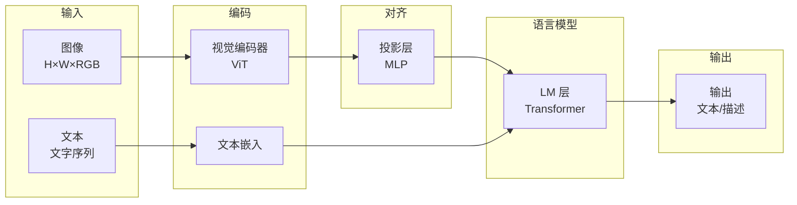
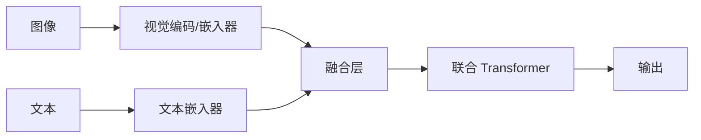
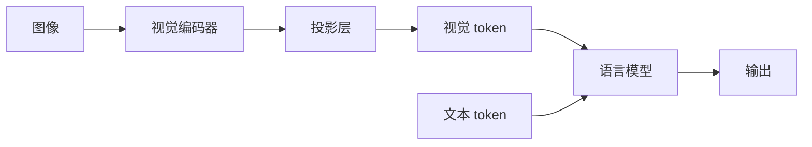
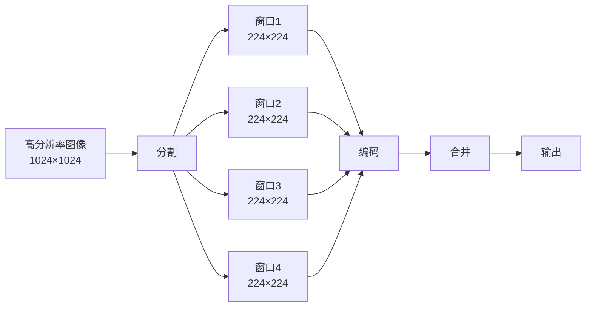

# 多模态大模型

语言模型处理的对象是文字序列，但人类感知世界的方式远不止文字，我们用眼睛看图像，用耳朵听声音，用多种感官综合理解世界。如果语言模型只能"读"而不能"看"，那它在许多现实场景中的能力终究是受限的。本章将探讨语言模型如何突破纯文本的边界，学会看懂图像和视频。

让计算机同时理解图像和文字，这个想法由来已久。2015 年，蒙特利尔大学约书亚·本吉奥实验室的论文《Show, Attend and Tell: Neural Image Caption Generation with Visual Attention》中引入注意力机制，模型在生成每个词时，会让文本解码器的隐状态去查询图像卷积特征图的不同区域，实现了跨模态信息检索。但真正让视觉/语言融合走向实用化的，是后来的**视觉 Transformer 编码器**（Vision Transformer，ViT）和**图文对比学习**（Contrastive Language-Image Pre-training，CLIP），ViT 解决了图像如何变成序列的问题，CLIP 解决了图像和文本如何在语义空间中对齐的问题。

## 视觉 - 语言融合架构

要让语言模型学会"看见"，面临着"图像如何变成模型能理解的表示"和"视觉信息如何与语言信息对齐"两大难题。语言模型的输入是 token 序列，每个 token 对应词表中的一个索引（详见[分词](../architecture-basics/language-model-tokenization.md)）。图像则是连续的像素矩阵，分辨率、颜色通道、空间结构都和文本截然不同。ViT 的解决方案是把图像切成小块，每块当作一个视觉 token，将图像连续的二维信号转化为语言模型能处理的离散表示。不过，即使视觉 token 和文本 token 形式相同，它们承载的语义仍然属于不同的空间。语言模型在文本上预训练，学习的是文本的语义空间。视觉信息如颜色、形状、空间关系这些概念在视觉中有自然的表示，也有自己独立的语义空间。CLIP 的解决方案是通过对比学习，让"猫的图片"和"猫的文字"在同一个向量空间中靠近。对齐之后的视觉信息，才能被语言模型真正理解。

现代多模态 LLM 普遍采用"图像编码器 + 语言解码器"的融合架构，由**视觉编码器**（Vision Encoder）、**投影层**（Projector）和**语言模型**（Language Model）三部分组成。视觉编码器将图像编码为向量序列，投影层将视觉向量映射到语言模型的嵌入空间，语言模型处理视觉 token 和文本 token，生成回答。视觉编码器就像一位翻译官，把图像翻译成语言模型能理解的语言。投影层则是翻译官的口音调整，确保翻译后的表达方式和语言模型的母语一致。视觉 - 语言融合架构的优势在于模块化，视觉编码器和语言模型可以分别预训练，然后通过投影层连接，大幅降低了训练成本，也使得模型可以灵活组合不同的视觉编码器和语言模型。

*图：图像编码器 + 语言解码器*

视觉编码器和语言模型选择在不同的时机进行融合会产生不同的架构决策。**早融合**（Early Fusion）在模型设计时就同时考虑视觉和语言两种信息，让两种模态在 Transformer 的每一层都深度交互，如下图所示。

*图：早融合方案*

早融合方案最初被用于 DeepMind 于 2022 年发布的 Flamingo。Flamingo 在语言模型的每一层都插入交叉注意力（Cross-Attention），让文本 token 可以查询视觉信息。这种设计的直觉是语言模型在生成每个词时，都应该能看到图像的全部信息，就像人类一边看图一边说话，每句话都可能参考图片中的不同区域。但代价是架构复杂度显著增加了，语言模型的每一层都需要额外的交叉注意力模块，训练时也需要同时更新更多参数。

2026 年的 Gemma 4 Unified 模型改进了早融合方案，Gemma 4 号称无编码器（Encoder-Free）架构，实际上是用一个规模很小的视觉嵌入器（Vision Embedder）来完成图片到 token 的转化，将原始 $48 \times 48$ 像素块通过单次矩阵乘法投影到 LLM 的隐藏维度，再通过分解坐标查找附加空间位置信息，文字和图片的输入都进到同一个 Decoder-Only 的 Transformer 模型中，靠自注意力完成跨模态融合。没有独立的视觉塔（Vision Tower，多模态 LLM 里专门处理图像的独立通道），没有交叉注意力，全程就一个模型、一个序列、一次前向传播完成输出。

**晚融合**（Late Fusion）则采取另一种策略，视觉信息在进入语言模型之前就由专门的视觉编码器模型完成处理，语言模型只看到投影后的视觉 token，它们和文本 token 没有本质区别，如下图所示。

*图：晚融合方案*

晚融合的典型代表是威斯康星大学麦迪逊分校于 2023 年发布的 LLaVA 和 OpenAI 的 GPT-4V。视觉信息通过投影层转化为视觉 token，与文本 token 拼接后一起输入语言模型。从语言模型的视角看，视觉 token 和文本 token 在输入形式上没有不同之处，都是输入序列中的元素，都通过自注意力机制交互。这种设计的好处是语言模型的结构完全不变，可以复用已预训练的权重，训练效率高得多。

尽管早融合在理论上提供了更深的跨模态交互能力，但现代多模态 LLM 采用晚融合方案的还是相对更多。原因在于晚融合更简单、更灵活，且实际性能表现并不逊色多少。这说明视觉和语言的深度交互并非必须通过架构层面的交叉注意力来实现，一个足够强大的语言模型，仅靠自注意力机制，就能在视觉 token 和文本 token 之间建立充分的联系。

## 视觉编码器与跨模态对齐

视觉编码器是多模态模型的"眼睛"，负责将图像转化为向量表示。2020 年以前，图像理解几乎被[卷积神经网络](../../deep-learning/convolutional-neural-network/cnn-basics.md)（CNN）所垄断。CNN 的前提假设是图像具有**局部性**，即图像中相邻的像素往往高度相关，因此用小卷积核逐层提取局部特征是合理的。但 CNN 也有明显的局限：卷积核的感受野始终是有限的，要深层特征才能覆盖全局信息，且卷积操作本身是平移等变的（Translation Equivariant），无法直接编码"这个区域在图像的左上角"这类绝对位置信息。

2020 年，谷歌研究院的多索维茨基（Alexey Dosovitskiy）提出了把图像当作文本处理的替代方案。具体来说，将图像分割成固定大小的小块（Patch），每个块展平后通过线性投影变成一个向量，就像文本中的每个词被嵌入为一个向量一样。这样图像就变成了向量序列，可以直接交给 Transformer 编码器处理。这个架构就是 Vision Transformer（ViT）。现代多模态 LLM 已普遍采用 ViT 架构或它的变体来实现视觉编码器，ViT 的处理流程分为以下四步：

1. **图像分块**：将 $H \times W \times 3$ 的图像分割成 $N$ 个 $P \times P \times 3$ 的块，其中 $N = (H/P) \times (W/P)$。譬如一张 $224 \times 224$ 的图像，按 $16 \times 16$ 分块，得到 $14 \times 14 = 196$ 个块。

2. **块嵌入**：将每个块展平并通过线性投影，得到 $N$ 个 $d$ 维向量。这一步在实现上等价于一个步长等于卷积核大小的卷积层。

3. **位置编码**：为每个块添加可学习的位置编码。由于 Transformer 本身对输入序列中 token 的顺序是不敏感的，由位置编码告诉模型"这个块来自图像的哪个位置"，就像在文本中词的位置信息一样。

4. **Transformer 编码**：通过多层 Transformer 编码器处理整个块序列，每层包含多头自注意力和前馈网络。并在序列开头添加一个特殊的 `[CLS]` token，其最终表示汇聚了整张图像的信息，可用于图像分类等任务。

*图：ViT 的处理流程*

块大小和隐藏维度是 ViT 平衡模型规模和能力的两个关键参数。块大小通常为 $16 \times 16$ 或 $14 \times 14$，块越小序列就越长，模型能捕捉的细节越丰富，但计算成本也越高。序列长度由图像分辨率和块大小共同决定，$224 \times 224$ 图像按 $16 \times 16$ 分块得到 196 个块。隐藏维度即每个块向量的维度，维度越大表达能力越强，计算成本也越高。在不同规模的 ViT 中分别为 768（ViT-Base）、1024（ViT-Large）和 1280（ViT-Huge）。后续工作中还出现了更大规模的 ViT-Giant（1408 维），被 DINOv2、BEiT-3 等模型采用。

ViT 解决了图像如何变成序列的问题，此时序列中的向量却仍然存在于视觉语义空间里，它们编码的是颜色、纹理、形状等视觉特征，和语言模型所理解的"猫"、"奔跑"、"可爱"这些语义概念之间还有一道鸿沟。CLIP 正是为了跨越这道鸿沟而诞生的。CLIP 同时训练一个视觉编码器和一个文本编码器，通过对比学习让两者的输出映射到同一个嵌入空间。在这个空间中，猫的图片和"猫"这个词语概念的嵌入向量距离很近，和"狗"距离较远一些，和"汽车"则相距更远。这意味着视觉特征和语言概念在同一个坐标系下有了对应关系，为后续的多模态 LLM 提供了高质量的视觉表示。几乎所有现代多模态模型（LLaVA、GPT-4V、Gemini）的视觉编码器都直接使用或借鉴了 CLIP 的预训练权重。

CLIP 实现了视觉编码器与文本编码器之间的语义对齐，但语言模型还有自己独立的嵌入空间，所以最后仍需要进行一次翻译。投影层就是这个翻译器，它将视觉编码器的输出映射到语言模型，使视觉 token 与文本 token 处于同一语义空间之内。实践中，最简单的翻译方法是用一个线性层将视觉嵌入投影到语言模型的文本嵌入维度，实验表明只要视觉编码器和语言模型本身的能力够强，简单的线性投影就已经足够了。这是因为 CLIP 已经在预训练时完成了视觉与语言的对齐，投影层只需要做维度匹配和微调，不需要从头学习对齐关系。面对更复杂的场景，尤其是视觉编码器和语言模型的语义空间差异较大的情况（如使用非 CLIP 的视觉编码器），也可以将线性投影升级为两层 MLP，增加非线性变换能力，更好地处理视觉信息中复杂的模式。

## 训练多模态模型

现代多模态 LLM 的训练通常分为三个阶段，每个阶段有不同的训练目标和可训练参数。阶段一提供视觉感知能力，阶段二建立视觉 - 语言的桥梁，阶段三让模型学会按指令行动。这种渐进式训练设计既适合模块化训练，节省了计算资源，又避免了灾难性遗忘：

- 阶段一 **视觉编码器预训练**：这一步通常不需要自己训练，而是直接使用预训练的 CLIP 视觉编码器。这些模型在海量图文对上训练过，已经学到了高质量的视觉表示。在后续训练中，视觉编码器的参数通常冻结不更新，因为它的表示已经足够好，且解冻训练的成本极高。

- 阶段二 **投影层预训练**：这一步只训练投影层，目标是将冻结的视觉编码器输出对齐到语言模型的嵌入空间。训练数据通常是**图像 - 描述对**（Image-Caption Pairs），训练目标是让模型学会根据图像生成描述文本。由于只训练投影层，通常只是单层线性变换或者一个两层 MLP，参数量很小（几十 MB），这阶段的训练很快就能完成。

- 阶段三 **多模态指令微调**：这一步解冻投影层和语言模型，或仅解冻语言模型的部分层，在多模态指令数据上进行 SFT 微调。指令数据的格式是"图像 + 指令 → 回答"，譬如"<图像> 这张图中有几只猫？→ 3 只"。这一步让模型学会根据用户的指令对图像进行推理、描述、问答等任务，是模型从能看见到能理解和回答的关键一步。阶段三的指令微调中，训练数据通常采用**交错图文数据**（Interleaved Image-Text Data）的格式，即图像和文本交替出现，模型学习理解它们之间的关系。如以下例子：

    >  
    > **问题**：第一张、第二张图片中的动物分别在做什么？
    > **回答**：猫正在睡觉。狗正在奔跑。

    训练目标通常涵盖**图像描述**（给定图像，生成描述文本）、**视觉问答**（给定图像和问题，生成答案）和**交错理解**（理解多张图像和文本的关系）三类任务。这三类任务从简单到复杂，逐步提升模型的多模态理解能力。

在[视觉语言模型训练实验](vlm-training-experiment.md)一节中，我们将会实践体验阶段二、阶段三的训练过程（阶段一不需要训练，可直接下载预训练好的编码器），与本章的理论描述相互印证。

## 长上下文多模态

目前为止，我们讨论的对象都是单张图像，现实中的场景肯定更为复杂：视频理解需要处理时序信息，多图推理需要同时理解多张图像的关系，高分辨率图像处理需要在不丢失细节的前提下控制计算成本，等等。这些场景对模型的长上下文能力提出了更高要求和挑战。

### 视频理解与多图推理

视频与图像的最大区别在于时间维度。一段视频是由图像帧构成的时间序列，理解视频不仅需要识别每帧中的物体和场景，还需要捕捉帧与帧之间的动态变化，"猫从桌上跳下来"这个动作，任何单帧都无法完整表达，只有通过连续帧的变化才能理解它。理解视频需要模型同时具备单帧理解（识别每帧中的物体、场景、动作）、时序建模（理解帧与帧之间的关系，捕捉动态变化）和信息整合（从整个视频中提取关键信息，回答关于视频的问题）三个层次的能力。最朴素直接的视频处理策略是均匀采样，从视频中均匀采样 $K$ 帧，每帧独立编码，然后拼接所有帧的视觉 token。

$$\text{Video Tokens} = Concat([\text{Frame}_1, \text{Frame}_2, \ldots, \text{Frame}_K])$$

这种方法简单易实现，却不够稳健。均匀采样可能错过关键帧，想象一段 30 秒的视频，前 27 秒是一个人静坐，最后 3 秒突然站起来。如果采样 8 帧，很可能全部落在静坐阶段，完全错过站起来这个关键动作。更精细的策略是关键帧提取，用视觉模型来识别视频中的关键帧（如场景大幅变化、动作发生），只编码关键帧。关键帧采样比均匀采样更高效，但关键帧的检测本身也需要额外的计算，而且关键帧的定义并不总是明确的。

无论采用哪种采样策略，都需要为每帧添加时间位置编码，让模型理解帧的时间顺序。没有时间位置编码，模型就无法区分"猫跳上桌"和"猫跳下桌"，两者的帧内容可能完全相同，只是时间顺序有差别。

视频理解还涉及多图推理问题，即模型需要同时理解多张图像，并回答涉及它们关系的问题。譬如图 1 是产品的正面照，图 2 是侧面照，问这两个角度的差异说明什么？这类问题要求模型不仅理解每张图的内容，还要在图像之间建立联系。

视频处理与多图处理涉及的 token 数量会随着图片数量线性增长，每张图像 196 个 token，10 张图就是 1960 个 token，很容易就会触及语言模型的上下文窗口限制。模型需要理解的关系也更多，既要理解图像之间的关系，又要知道在回答不同问题时应关注哪张图像，这涉及注意力如何分配。针对这些挑战，实践中常用的解决方案包括将每张图像压缩为更少的 token（如从 196 个压缩到 32 个），为不同图像添加不同的位置编码前缀以区分图像来源，以及让文本 token 通过自注意力机制选择性地关注不同图像。

### 高分辨率图像处理

标准 ViT 将图像分割为 $16 \times 16$ 的块。对于 $224 \times 224$ 的图像，得到 $14 \times 14 = 196$ 个块，这个数量通常在语言模型的处理能力之内。但许多实际应用需要处理高分辨率图像，如医学影像通常是 $1024 \times 1024$，1600 万像素的手机图像是 $4096 \times 4096$，卫星图像和工程图纸的分辨率就更大了。对于 $1024 \times 1024$ 的图像，按 $16 \times 16$ 分块会产生 $64 \times 64 = 4096$ 个块，token 数量是标准情况的 20 倍，手机图像更是扩大到 320 倍，计算量急剧上升。

高分辨率图像处理一般会启用动态分辨率，根据图像分辨率动态调整块大小，保持 token 数量相对稳定，譬如对低分辨率图像用 $14 \times 14$ 的块，对高分辨率图像用 $28 \times 28$ 的块。然后用滑动窗口将大图像分割为多个小窗口（如 $224 \times 224$），分别编码，最后合并结果，类似于 CNN 中滑动卷积核扫描整张图像的思路，如下图所示。

*图：高分辨率图像处理*

## 本章小结

多模态模型的意义在于，它让 AI 有了从文字以外的途径去认知世界，从而能够处理现实世界中大量以视觉形式存在的信息，从医学影像诊断到自动驾驶场景理解，这些任务的输入天然就是图像而非文字。

让语言模型看见图像，本质上是在回答图像怎样变成语言模型能处理的 token，以及这些视觉 token 怎样与语言 token 处在同一语义空间中。ViT 把图像切块为序列，解决了第一个问题；CLIP 通过对比学习将视觉与语言对齐到同一嵌入空间，解决了第二个问题。有了这两个基础，投影层只需完成一次维度映射，视觉 token 就能像文本 token 一样被语言模型理解。

## 练习题

1. ViT 将 $224 \times 224$ 的图像按 $16 \times 16$ 分块后得到多少个块？如果将块大小改为 $14 \times 14$，块数量变为多少？这对模型的计算成本有什么影响？
   

   
参考答案

   $16 \times 16$ 分块：$(224/16) \times (224/16) = 14 \times 14 = 196$ 个 patch。

   $14 \times 14$ 分块：$(224/14) \times (224/14) = 16 \times 16 = 256$ 个 patch。

   块变小后，块数量从 196 增加到 256（增加约 30%），Transformer 自注意力的计算量与序列长度的平方成正比，因此计算成本增加约 $(256/196)^2 \approx 1.7$ 倍。但同时，更小的块意味着每个块覆盖的图像区域更小，模型能捕捉更细粒度的视觉细节。

   

2. CLIP 的对比损失函数中，温度参数 $\tau$ 的作用是什么？$\tau$ 很大和 $\tau$ 很小时，模型的行为分别有什么特点？
   

   
参考答案

   温度参数 $\tau$ 控制相似度得分的"尖锐程度"。$\tau$ 很大时，$\text{sim}(v_i, t_j) / \tau$ 的值很小，Softmax 输出接近均匀分布，模型对正负样本的区分度低，训练信号弱，但训练更稳定。$\tau$ 很小时，相似度得分被放大，Softmax 输出接近 one-hot，模型高度集中于最相似的候选，训练信号强，但容易过拟合且训练不稳定。CLIP 原论文中 $\tau$ 作为可学习参数，最终学到的值约为 0.07，偏向"尖锐"一侧。

   

3. 在视频理解中，为什么时间位置编码是必要的？如果不添加时间位置编码，模型会遇到什么问题？
   

   
参考答案

   没有时间位置编码，模型无法区分帧的时间顺序。考虑两段视频：视频 A 是"猫跳上桌"，视频 B 是"猫跳下桌"。如果两段视频的帧内容相同（只是顺序相反），没有时间位置编码时，模型对所有帧的编码完全相同（因为帧编码器是共享的），拼接后的 token 序列只是排列不同。但 Transformer 的自注意力机制是排列不变的 —— 如果不对位置信息做特殊处理，模型对"帧 1 在前、帧 8 在后"和"帧 8 在前、帧 1 在后"会产生相同的输出，无法区分"跳上"和"跳下"。

   
