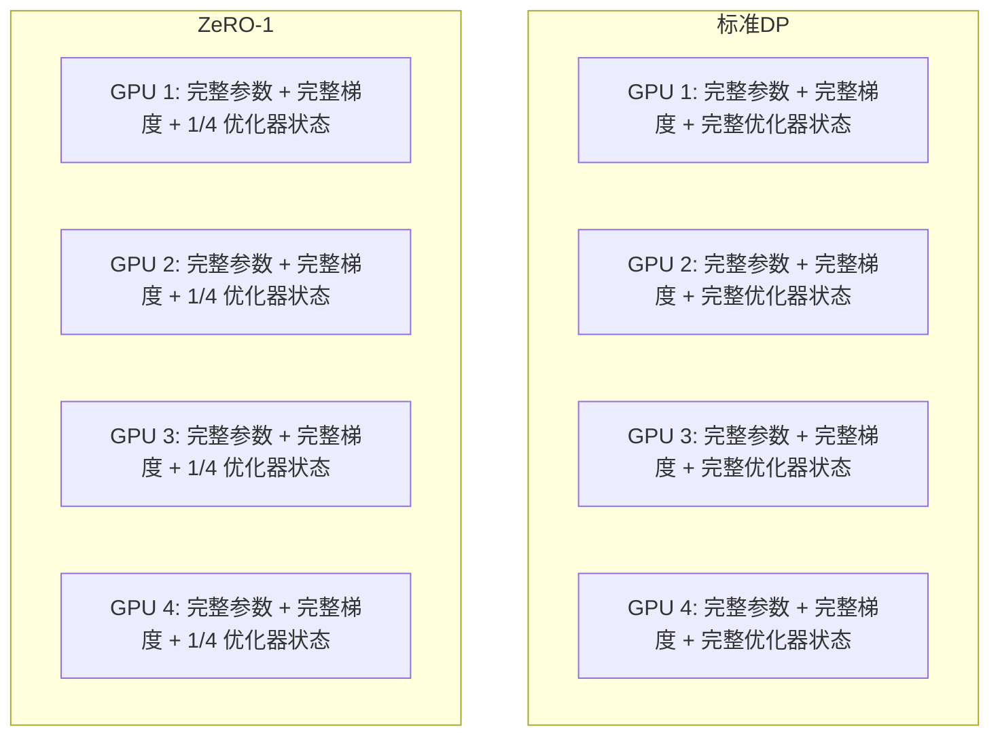
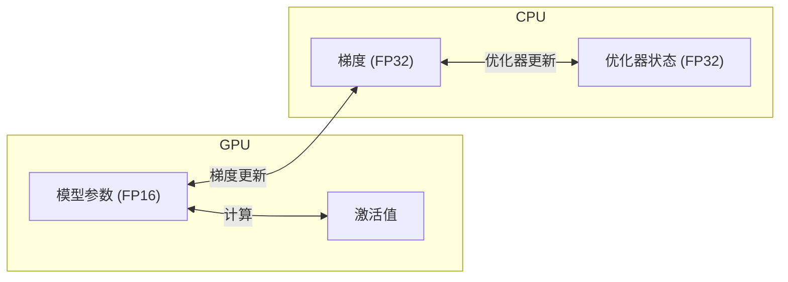
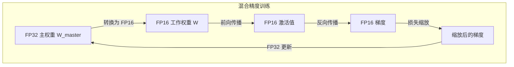
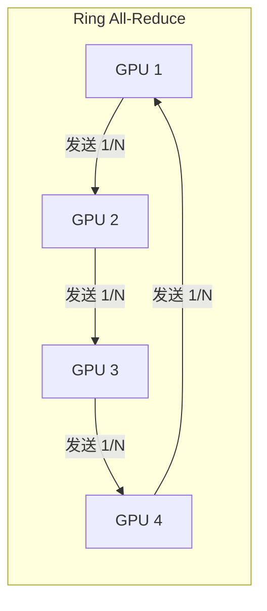

```mermaid
gantt
    title 流水线并行时序图（4 个 micro-batch）
    dateFormat X
    axisFormat %s
    
    section GPU 1
    F1-m1 :0,1
    F1-m2 :1,2
    F1-m3 :2,3
    F1-m4 :3,4
    
    section GPU 2
    F2-m1 :1,2
    F2-m2 :2,3
    F2-m3 :3,4
    F2-m4 :4,5
    
    section GPU 3
    F3-m1 :2,3
    F3-m2 :3,4
    F3-m3 :4,5
    F3-m4 :5,6
    
    section GPU 4
    F4-m1 :3,4
    F4-m2 :4,5
    F4-m3 :5,6
    F4-m4 :6,7
```

# 分布式训练基础设施

在[上一章](scaling-laws.md)里，我们看到了缩放定律揭示的规律，模型参数增加 10 倍，损失固定下降约 1.19 倍，这条幂律曲线给出了一个确定性的承诺，只要愿意投入更多算力，模型性能就会按可预测的比例持续提升。但乐观的曲线背后藏着一个工程难题：要训练一个参数量达到千亿甚至万亿规模的模型，单张 GPU 根本放不下它，更不可能在可接受的时间内完成训练。

这个难题不是理论上不可解，而是工程上极其复杂。2019 年，NVIDIA 的研究人员穆罕默德· Shoeybi 等人在论文《Megatron-LM: Training Multi-Billion Parameter Language Models Using Model Parallelism》中首次展示了如何将 83 亿参数的模型分布到多张 GPU 上高效训练。此后，微软 DeepSpeed 团队在 2020 年提出了 ZeRO 优化技术，DeepSeek 团队在 2024 年的 V3 技术报告中展示了万卡规模的三维并行训练方案。这些工作逐步将分布式训练从实验室探索推向了工业级实践。

以 GPT-4 为例，据推测其训练使用了约 25000 张 A100 GPU，持续数月。如何将一个模型切分到数千张 GPU 上、如何让它们高效通信、如何处理不可避免的硬件故障，这些工程问题构成了分布式训练的实质议题。本文将系统梳理这些技术：从并行策略到 ZeRO 优化的显存节省，从混合精度训练的数值技巧到梯度检查点的时空权衡，从通信优化的算法创新到工程框架的选择。

## 并行策略全景

在深入各种并行策略之前，先回答一个更基本的问题：为什么单张 GPU 不够用？答案很简单，但也容易被忽视：显存不够。训练一个模型需要的显存远不止模型参数本身，还包括梯度、优化器状态和激活值。当这些加在一起远超单张 GPU 的容量时，唯一的出路就是把它们拆开，放到多张 GPU 上。

### 单 GPU 的显存瓶颈

训练一个模型时，GPU 显存需要同时容纳四类数据。第一类是模型参数本身，以 FP16 格式存储时每个参数占 2 字节，70 亿参数的模型就需要约 14 GB。第二类是梯度，反向传播计算出的每个参数梯度同样以 FP16 存储，大小与参数相同。第三类是优化器状态，AdamW 优化器为每个参数维护三个 FP32 变量：主权重副本、动量和方差，加起来每个参数占 12 字节。第四类是激活值，前向传播过程中保存的中间结果，大小取决于 batch size 和序列长度。

把这些数字加在一起，训练一个 70B 参数的模型至少需要 $2N + 2N + 12N = 16N$ 字节的显存来存储参数、梯度和优化器状态，其中 $N = 70 \times 10^9$。代入计算：参数 140 GB，梯度 140 GB，优化器状态 840 GB，合计约 1120 GB，这还不包括激活值。而一张 A100 GPU 最大只有 80 GB 显存。这意味着光是把模型相关的数据存下来，就需要至少 14 张 A100，算上激活值后需求更高。


*图：不同规模模型在 FP16 训练下的显存需求分解，橙色和红色虚线分别为 A100 40GB 和 80GB 的显存上限*

### 数据并行（Data Parallelism, DP）

面对"显存不够"这个问题，最先想到的办法往往也是最直觉的：既然一张 GPU 放不下所有数据，那就让每张 GPU 各拿一份模型副本，各处理一批不同的训练数据，计算完再汇总结果。这就是数据并行（Data Parallelism）的基本思路，也是最早被广泛采用的并行策略。

```nn-arch width=720
name: 数据并行
layout: horizontal

sections:
  - name: 数据分发
    layers: [data]
  - name: 并行计算
    layers: [gpu1, gpu2, gpu3, gpu4]
    row_label: "4 张 GPU"
  - name: 梯度同步
    layers: [sync]
  - name: 参数更新
    layers: [update]

layers:
  - {id: data, name: "Batch", type: input, size: "切分为 4 份"}
  - {id: gpu1, name: "GPU 1\n完整模型", type: compute, size: "Forward+Backward"}
  - {id: gpu2, name: "GPU 2\n完整模型", type: compute, size: "Forward+Backward"}
  - {id: gpu3, name: "GPU 3\n完整模型", type: compute, size: "Forward+Backward"}
  - {id: gpu4, name: "GPU 4\n完整模型", type: compute, size: "Forward+Backward"}
  - {id: sync, name: "All-Reduce", type: operation, size: "梯度平均"}
  - {id: update, name: "参数更新", type: operation, size: "所有 GPU 同步"}
```

具体来说，数据并行的工作流程分为三步。首先，每张 GPU 各持有一份完整的模型参数副本。然后将一个大的 batch 拆分成多个子 batch，分配给不同的 GPU，每张 GPU 各自独立执行前向传播和反向传播。最后，各 GPU 将计算得到的梯度汇总（All-Reduce 操作），得到平均梯度后各自更新参数，确保所有副本保持同步。

数据并行的优势在于实现简单，几乎不需要修改模型代码，PyTorch 原生的 `DistributedDataParallel`（DDP）就能完成。但它的局限也很明显：每张 GPU 必须容纳完整的模型参数、梯度和优化器状态。前面算过，70B 模型仅参数和优化器状态就需要约 1120 GB，单张 A100 只有 80 GB，数据并行对此无能为力。它只能解决"算得慢"的问题，无法解决"放不下"的问题。

$$\text{每卡显存需求} = \underbrace{16N}_{\text{参数+梯度+优化器}} + \underbrace{A}_{\text{激活值}}$$

这个公式看着简单，拆开来看含义很直观：$16N$ 是参数、梯度和优化器状态的总和，其中 $N$ 是参数量，每个参数在 FP16 参数、FP16 梯度和 FP32 优化器状态中共占 16 字节。$A$ 是激活值占用，与 batch size 和序列长度成正比。在数据并行下，$16N$ 部分不会随 GPU 数量增加而减少，只有 $A$ 能通过减小子 batch 来降低。这意味着数据并行对大模型的显存瓶颈毫无帮助。

### 模型并行（Model Parallelism, MP）

既然数据并行无法突破单卡显存限制，那就换一种思路：不复制整个模型，而是把模型的不同部分放到不同的 GPU 上。这就是模型并行（Model Parallelism）的基本思想。打个比方，数据并行像是多个厨师各做一桌完整的宴席，只是食材不同；模型并行则是一条流水线，每个厨师只负责自己那道菜，做完了传给下一位。

```nn-arch width=720
name: 模型并行
layout: vertical

sections:
  - name: GPU 1
    layers: [layer1, layer2]
  - name: GPU 2
    layers: [layer3, layer4]
  - name: GPU 3
    layers: [layer5, layer6]
  - name: GPU 4
    layers: [layer7, layer8]

layers:
  - {id: layer1, name: "Layer 1-2", type: dense, size: "前 1/4 层"}
  - {id: layer2, name: "Layer 3-4", type: dense, size: "第 2 个 1/4 层"}
  - {id: layer3, name: "Layer 5-6", type: dense, size: "第 3 个 1/4 层"}
  - {id: layer4, name: "Layer 7-8", type: dense, size: "最后 1/4 层"}
```

模型并行有两种主要形式：流水线并行和张量并行，它们分别从"层间"和"层内"两个粒度来切分模型。

### 流水线并行（Pipeline Parallelism, PP）

流水线并行将模型按层切分，不同层放在不同 GPU 上，数据像流水线一样依次通过各 GPU。2019 年，Google 的颜水成团队在论文《GPipe: Efficient Training of Giant Neural Networks using Pipeline Parallelism》中提出了这一方法的系统实现，随后卡内基梅隆大学在 PipeDream 中引入了更高效的调度策略。

如果只是朴素地把层分到不同 GPU 上，GPU 会串行工作：GPU 1 算完前几层传给 GPU 2，GPU 2 等 GPU 1 算完才能开始，大量时间花在等待上，利用率极低。解决这个问题的办法是 micro-batch 流水线：将一个 batch 切分为多个 micro-batch，让不同 GPU 同时处理不同 micro-batch 的不同阶段。就像工厂流水线一样，虽然每个产品要依次经过所有工序，但不同产品可以同时在不同工序上加工。



GPipe 和 PipeDream 是两种主流的流水线调度策略，它们在同步方式和内存效率上有所不同：

| 策略 | GPipe | PipeDream |
|:-----|:------|:----------|
| 调度方式 | 同步（所有 micro-batch 完成后同步） | 异步（1F1B 调度） |
| 内存效率 | 需要存储所有 micro-batch 的激活值 | 只需存储部分激活值 |
| 实现复杂度 | 简单 | 复杂（需要处理版本一致性） |
| 适用场景 | 追求确定性 | 追求高吞吐 |

流水线并行的通信量较小，因为 GPU 之间只传递层间的激活值，不涉及模型参数的同步。但它仍然有两个局限：一是流水线气泡，即 GPU 在 micro-batch 切换的间隙仍有空闲时间；二是层间负载不均，如果各层计算量不同，某些 GPU 会成为瓶颈。

### 张量并行（Tensor Parallelism, TP）

流水线并行是按"层"切分模型，但如果某一层本身就很大，单个 GPU 仍然放不下，就需要在"层内"进一步切分。张量并行（Tensor Parallelism）正是将单层的计算切分到多张 GPU 上。2019 年 NVIDIA 的 Shoeybi 等人在 Megatron-LM 论文中给出了 Transformer 模型中 FFN 层和 Attention 层的高效切分方案。

FFN 层包含两个线性层：$Y = \text{ReLU}(XW_1)W_2$。可以将 $W_1$ 按列切分，$W_2$ 按行切分：

$$W_1 = [W_1^{(1)}, W_1^{(2)}], \quad W_2 = \begin{bmatrix} W_2^{(1)} \\ W_2^{(2)} \end{bmatrix}$$

这个公式看着抽象，拆开来看含义很直观：$W_1$ 按列切分意味着两个 GPU 各自持有权重矩阵的一半列，各自独立计算一部分中间结果。$W_2$ 按行切分则让两个 GPU 各自从自己的中间结果算出一部分输出，最后加起来就得到完整结果。具体来说，GPU 1 计算 $Y^{(1)} = \text{ReLU}(XW_1^{(1)})W_2^{(1)}$，GPU 2 计算 $Y^{(2)} = \text{ReLU}(XW_1^{(2)})W_2^{(2)}$，最后 $Y = Y^{(1)} + Y^{(2)}$。这就像两个人各算一半的加法，最后把结果合并。

Attention 层的切分更加自然：多头注意力中，每个注意力头本身就是独立的计算单元，只需将不同的头分配给不同的 GPU 即可。

```nn-arch width=720
name: 张量并行（Attention）
layout: horizontal

sections:
  - name: 输入
    layers: [input]
  - name: QKV 投影（列切分）
    layers: [qkv1, qkv2]
    row_label: "2 张 GPU"
  - name: 注意力计算
    layers: [att1, att2]
  - name: 输出投影（行切分）
    layers: [out1, out2]
  - name: 聚合
    layers: [sum]

layers:
  - {id: input, name: "X", type: input, size: "(batch, seq, d)"}
  - {id: qkv1, name: "Q₁,K₁,V₁", type: projection, size: "GPU 1"}
  - {id: qkv2, name: "Q₂,K₂,V₂", type: projection, size: "GPU 2"}
  - {id: att1, name: "Attn₁", type: attention, size: "头 1-4"}
  - {id: att2, name: "Attn₂", type: attention, size: "头 5-8"}
  - {id: out1, name: "W_O₁", type: projection, size: "GPU 1"}
  - {id: out2, name: "W_O₂", type: projection, size: "GPU 2"}
  - {id: sum, name: "All-Reduce", type: operation, size: "Y₁+Y₂"}
```

张量并行的优势在于切分粒度细，各 GPU 负载均衡，适合超大单层（如 175B 模型的 FFN）。但它的代价是通信频繁：每一层的前向和反向传播都需要 All-Reduce 操作来汇总结果，因此对 GPU 之间的通信带宽非常敏感，通常需要 NVLink 这种高带宽互联才能发挥优势。

### 三维并行

实际训练大模型时，单独使用一种并行策略往往不够，现代大模型训练通常组合使用数据并行（DP）、流水线并行（PP）和张量并行（TP），形成三维并行。

```nn-arch width=720
name: 三维并行
layout: vertical

sections:
  - name: 数据并行
    layers: [dp1, dp2]
    row_label: "DP=2"
  - name: 流水线并行
    layers: [pp1, pp2, pp3, pp4]
    row_label: "PP=4"
  - name: 张量并行
    layers: [tp1, tp2, tp3, tp4]
    row_label: "TP=4"

layers:
  - {id: dp1, name: "DP 组 1", type: group, size: "独立数据"}
  - {id: dp2, name: "DP 组 2", type: group, size: "独立数据"}
  - {id: pp1, name: "Stage 1", type: pipeline, size: "层 1-12"}
  - {id: pp2, name: "Stage 2", type: pipeline, size: "层 13-24"}
  - {id: pp3, name: "Stage 3", type: pipeline, size: "层 25-36"}
  - {id: pp4, name: "Stage 4", type: pipeline, size: "层 37-48"}
  - {id: tp1, name: "GPU 1", type: compute, size: "TP 切分"}
  - {id: tp2, name: "GPU 2", type: compute, size: "TP 切分"}
  - {id: tp3, name: "GPU 3", type: compute, size: "TP 切分"}
  - {id: tp4, name: "GPU 4", type: compute, size: "TP 切分"}
```

以 GPT-3 175B 为例，假设使用 1024 张 GPU，一种典型的配置是 TP = 8（每个张量并行组 8 张 GPU，利用 NVLink 高带宽通信）、PP = 4（4 个流水线阶段，每个阶段约 24 层）、DP = 32（32 个数据并行副本，处理不同数据）。总 GPU 数 = TP × PP × DP = 8 × 4 × 32 = 1024。

三维并行的配置不是随意选择的，需要考虑几个约束：张量并行度应与同一节点内的 GPU 数匹配（因为 TP 依赖 NVLink 高带宽），流水线并行度受模型层数限制，数据并行度则取决于可用总 GPU 数。根据模型规模，推荐的并行策略如下：

| 模型规模 | 推荐策略 | 理由 |
|:---------|:---------|:-----|
| < 1B | DP | 单 GPU 可容纳，DP 最简单 |
| 1B - 10B | DP + PP | 需要跨 GPU，但通信开销可控 |
| 10B - 100B | DP + PP + TP | 需要细粒度切分 |
| > 100B | DP + PP + TP + ZeRO | 需要极致显存优化 |

## ZeRO 优化

数据并行有一个明显的浪费：每张 GPU 都存储了完全相同的模型参数、梯度和优化器状态。既然每张 GPU 处理的是不同的数据，为什么要在每张卡上存一份相同的模型状态？2020 年，微软 DeepSpeed 团队的萨米拉·拉吉班达里（Samyam Rajbhandari）等人在论文《ZeRO: Memory Optimizations Toward Training Trillion Parameter Models》中提出了 ZeRO（Zero Redundancy Optimizer），通过消除数据并行中的冗余存储，大幅降低了显存占用。

### 数据并行的冗余问题

在标准数据并行中，每张 GPU 都存储完整的模型参数、完整的梯度和完整的优化器状态。这些数据在所有 GPU 上完全相同，存在大量冗余。以 4 张 GPU 训练 70B 模型为例，优化器状态总共 840 GB，但每张 GPU 都存了一份完整的 840 GB，其中 3/4 是冗余的。ZeRO 的出发点就是：把这些冗余的数据分摊到不同 GPU 上，每张卡只存自己那份。

### ZeRO-1：优化器状态分片

ZeRO-1 将优化器状态切分到不同 GPU 上，每个 GPU 只存储 $1/N$ 的优化器状态。这是收益最大的一步，因为优化器状态占显存的主要部分（约 75%）。



ZeRO-1 将单卡显存占用从 $2N + 2N + 12N = 16N$ 降低到 $2N + 2N + 12N/N_{gpu}$，其中 $N_{gpu}$ 是 GPU 数量。以 70B 模型、64 张 GPU 为例，优化器状态从 840 GB 降到约 13 GB，单卡显存从 1120 GB 降到约 293 GB。代价是参数更新时需要 All-Gather 操作来收集完整的优化器状态，通信量增加约 50%。

### ZeRO-2：梯度分片

ZeRO-2 在 ZeRO-1 基础上进一步将梯度切分，每个 GPU 只存储对应优化器状态部分的梯度。既然每个 GPU 只负责更新 $1/N$ 的参数，那它只需要对应部分的梯度就够了，其余梯度在反向传播完成后即可释放。这进一步将单卡显存降低到 $2N + 2N/N_{gpu} + 12N/N_{gpu}$。


*图：70B 模型在 64 张 GPU 下，标准 DP 与 ZeRO-1/2/3 的单 GPU 显存占用对比，红色虚线为 A100 80GB 上限*

### ZeRO-3：参数分片

ZeRO-3 将参数也切分，每个 GPU 只存储 $1/N$ 的参数。在前向和反向传播时，通过 All-Gather 操作临时获取需要的参数，计算完立即释放。工作流程是：前向传播时 All-Gather 当前层参数，计算后释放；反向传播时 All-Gather 当前层参数和梯度，计算后释放；参数更新时只更新本地分片。

ZeRO-3 将单卡显存占用降低到 $16N/N_{gpu}$，理论上 GPU 数量越多，每卡显存越小。以 70B 模型、64 张 GPU 为例，单卡显存仅需约 17.5 GB，可以放入单张 A100 80GB。代价是通信量增加约 3 倍，因为前向和反向传播的每一层都需要 All-Gather 参数。

### ZeRO-Offload：CPU 卸载

当 GPU 显存仍然不够时，ZeRO-Offload 将优化器状态和梯度卸载到 CPU 内存。GPU 只保留 FP16 的模型参数和激活值，FP32 的优化器状态和梯度放在 CPU 端，在需要时通过 PCIe 传输。



这种方案的代价是 CPU-GPU 数据传输成为瓶颈，训练速度会明显下降。它适用于显存极度受限但可以接受较慢训练速度的场景，比如在少量消费级 GPU 上训练大模型。

### ZeRO-Infinity：NVMe 卸载

ZeRO-Infinity 进一步将数据卸载到 NVMe SSD，利用高速存储扩展可用容量。当 CPU 内存也不够时，NVMe 卸载提供了最后一道防线，使得在有限硬件上训练超大规模模型成为可能。

## 混合精度训练

到目前为止，我们讨论的都是如何把模型拆分到多张 GPU 上。但还有另一个维度的节省：降低每个数值的存储精度。FP32 每个数占 4 字节，FP16 只占 2 字节，切换到 FP16 立刻节省一半的显存和带宽。2017 年，NVIDIA 的保罗乌斯·米奇凯维丘斯（Paulius Micikevicius）等人在论文《Mixed Precision Training》中系统提出了混合精度训练方法，此后成为大模型训练的标准做法。

### FP16 训练的数值挑战

FP16 的表示范围有限：最大正常值约 65504，最小正常值约 $6 \times 10^{-5}$，精度约 3 位十进制。这带来两个问题。第一个是梯度下溢：深度学习中的梯度通常很小，在 $10^{-5}$ 到 $10^{-8}$ 的量级，FP16 无法精确表示这些小数值，它们会被截断为零，导致梯度消失。第二个是权重更新误差：FP16 精度有限，当学习率乘以梯度得到的更新量 $\epsilon \cdot g$ 很小时，$W + \epsilon \cdot g$ 的结果可能和 $W$ 完全相同，参数实际上没有更新。

### FP32 主权重 + FP16 计算

混合精度训练的核心设计是同时维护两套权重：一份 FP32 的主权重 $W_{master}$ 用于参数更新，一份 FP16 的工作权重 $W$ 用于前向和反向传播。每次迭代开始时，将 $W_{master}$ 转换为 FP16 得到 $W$，用 $W$ 完成前向传播和反向传播，然后将梯度转回 FP32 更新 $W_{master}$。



这样做的好处是：前向和反向传播使用 FP16，速度快、显存省；参数更新使用 FP32，精度高、不会丢失微小更新。额外的显存开销只有一份 FP32 主权重，相比全 FP32 训练仍然节省了大量显存。

### 损失缩放（Loss Scaling）

混合精度训练还有一个必须解决的问题：梯度下溢。FP16 的最小正常值约 $6 \times 10^{-5}$，而很多梯度比这还小。损失缩放（Loss Scaling）的思路很巧妙：在反向传播前，将损失值乘以一个缩放因子 $S$，根据链式法则，所有梯度也会相应放大 $S$ 倍，从而进入 FP16 的表示范围。

$$\text{scaled\_loss} = \text{loss} \times S$$

$$\text{scaled\_grad} = \frac{\partial(\text{scaled\_loss})}{\partial W} = \text{grad} \times S$$

反向传播完成后，将梯度除以 $S$ 恢复原始值：

$$\text{grad} = \text{scaled\_grad} / S$$

这三个公式看着简单，拆开来看含义很直观：第一个公式将损失放大 $S$ 倍，第二个公式利用链式法则说明梯度也被放大了同样的倍数，第三个公式在更新参数前把梯度缩放回来。$S$ 需要足够大使梯度进入 FP16 的表示范围，但不能太大否则会导致梯度上溢（出现 inf）。实践中通常使用动态损失缩放：如果检测到梯度上溢，就将 $S$ 减半；如果连续若干步没有上溢，就将 $S$ 翻倍。


*图：原始梯度分布与缩放后（S=1024）梯度分布对比，红色虚线为 FP16 最小正常值，缩放使下溢比例大幅降低*

### BF16：无需缩放的混合精度

BF16（Brain Float 16）是 Google 为深度学习设计的浮点格式，2019 年在论文《A Study of BFLOAT16 for Deep Learning Training》中系统论证了其有效性。它的设计思路与 FP16 不同：FP16 用 5 位指数和 10 位尾数，牺牲了表示范围来换取精度；BF16 则用 8 位指数和 7 位尾数，牺牲了精度来换取与 FP32 相同的表示范围。

| 格式 | 符号位 | 指数位 | 尾数位 | 表示范围 |
|:-----|:-------|:-------|:-------|:---------|
| FP16 | 1 | 5 | 10 | ±65504 |
| BF16 | 1 | 8 | 7 | ±3.4e38 |
| FP32 | 1 | 8 | 23 | ±3.4e38 |

BF16 使用与 FP32 相同的 8 位指数，因此表示范围相同（最大约 $3.4 \times 10^{38}$），不会出现 FP16 的梯度下溢问题。这意味着使用 BF16 训练时不需要损失缩放，训练流程更简单，数值稳定性也更好。BF16 的代价是精度较低（只有 7 位尾数，而 FP16 有 10 位），可能影响某些对精度敏感的计算，同时需要 Ampere 架构及以后的 GPU 才有硬件支持。


*图：FP16、BF16、FP32 三种浮点格式的表示范围对比，BF16 与 FP32 拥有相同的指数位宽，因此表示范围一致*

## 梯度累积与检查点

即使使用了 ZeRO 优化和混合精度，显存仍然可能不足以支持大 batch size 的训练。这时有两种互补的技术：梯度累积用时间换空间，在不增大显存的前提下模拟大 batch 训练；梯度检查点则用计算换显存，通过重计算来减少激活值的存储。

### 梯度累积：模拟大 Batch

假设最优的 batch size 是 64，但显存只够放下 batch size 为 4 的数据。梯度累积的做法是：连续做 16 次前向和反向传播（每次 batch size = 4），把梯度累加起来，最后一次性更新参数。从数学上看，这和一次使用 batch size = 64 的更新是等价的。

下面的代码展示了梯度累积的基本实现：

```python
# 梯度累积示例
effective_batch_size = 64
micro_batch_size = 4
accumulation_steps = effective_batch_size // micro_batch_size  # 16

optimizer.zero_grad()

for step in range(accumulation_steps):
    # 获取小 batch
    batch = get_micro_batch(micro_batch_size)
    
    # 前向传播
    outputs = model(batch)
    loss = criterion(outputs, targets) / accumulation_steps  # 注意：损失要除以累积步数
    
    # 反向传播（梯度累积）
    loss.backward()

# 一次性更新参数
optimizer.step()
```

需要注意几个细节：损失要除以累积步数，保证梯度平均值正确；BatchNorm 等依赖 batch 统计的层可能受影响，因为每次只看到小 batch 的统计量；梯度累积延长了单步训练时间，但总体吞吐量与使用大 batch 相当。

### 梯度检查点：激活值重计算

梯度检查点（Gradient Checkpointing，又称 Activation Recomputation）是另一种时空权衡技术。标准训练中，前向传播会保存所有层的激活值，供反向传播使用。这些激活值占用大量显存，尤其是序列长度较长时。梯度检查点的做法是：前向传播时只保存部分层的激活值（检查点），其余层的激活值在反向传播时重新计算。

```nn-arch width=720
name: 梯度检查点
layout: vertical

sections:
  - name: 标准训练
    layers: [std_fwd, std_save, std_bwd]
  - name: 梯度检查点
    layers: [ckpt_fwd, ckpt_drop, ckpt_recompute, ckpt_bwd]

layers:
  - {id: std_fwd, name: "前向传播", type: compute, size: "计算所有激活值"}
  - {id: std_save, name: "保存激活值", type: memory, size: "显存占用大"}
  - {id: std_bwd, name: "反向传播", type: compute, size: "使用保存的激活值"}
  
  - {id: ckpt_fwd, name: "前向传播", type: compute, size: "计算所有激活值"}
  - {id: ckpt_drop, name: "丢弃部分激活值", type: operation, size: "只保存检查点"}
  - {id: ckpt_recompute, name: "重新计算", type: compute, size: "反向时重新计算"}
  - {id: ckpt_bwd, name: "反向传播", type: compute, size: "使用重计算的激活值"}
```

假设模型有 $L$ 层，每层激活值大小为 $A$。标准训练需要 $L \times A$ 的激活值显存。如果每 $k$ 层保存一个检查点，激活值显存降低到 $(L/k + k) \times A$，因为只需要保存 $L/k$ 个检查点的激活值，加上任意两个检查点之间最多 $k$ 层的临时激活值。代价是需要额外的前向传播计算，训练时间增加约 20-30%。


*图：24 层 Transformer 在不同检查点策略下的激活值显存与相对计算量，蓝色为显存，橙色为计算量*

### 选择性激活重计算

选择性激活重计算（Selective Activation Recomputation）是一种更精细的策略：只重计算那些"计算量小但显存占用大"的激活值。例如，Attention 计算的中间结果 $QK^T$ 显存占用为 $O(n^2)$（$n$ 是序列长度），但重计算成本仅为 $O(n^2 d)$（$d$ 是维度，通常远小于 $n$），属于"省算费存"的典型代表。选择丢弃这些中间结果，而保留计算成本高的激活值，可以在较少额外计算的情况下节省大量显存。

## 通信优化

分布式训练中，GPU 之间需要频繁通信来同步梯度、参数和激活值。当 GPU 数量达到数千张时，通信开销可能占据总训练时间的相当比例。本节介绍几种减少通信开销的技术。

### All-Reduce vs Ring All-Reduce

All-Reduce 是分布式训练中最常用的通信原语：每个节点贡献一份数据，最终所有节点都获得聚合结果（如梯度的求和或平均）。朴素的实现方式是选一个主节点，所有节点把数据发给它，它聚合后再广播给所有人。但主节点会成为通信瓶颈，它的带宽决定了整个操作的速度。

Ring All-Reduce 将节点组织成环形拓扑，数据沿环传递，分两个阶段完成：



在 Scatter-Reduce 阶段，每个节点只处理数据的 $1/N$，沿环传递并逐步累积。在 All-Gather 阶段，将聚合结果沿环广播给所有节点。Ring All-Reduce 的优势在于带宽利用率高：每个节点同时发送和接收数据，通信负载均匀分布，没有单点瓶颈。每个节点的通信量为 $2(N-1) \times \text{数据量} / N$，当 $N$ 较大时近似为 $2 \times \text{数据量}$，与节点数无关。

### 梯度压缩

当通信带宽成为瓶颈时，可以通过压缩梯度来减少传输数据量。2017 年，安德烈·吉比安斯基（Andrew Gibiansky）在博文《Bringing HPC Techniques to Deep Learning》中系统总结了这些方法。

量化压缩将 FP32 梯度量化为低精度格式（如 INT8），通信量减少 4 倍：

$$g_{quantized} = \text{round}(g / \Delta) \times \Delta$$

这个公式看着抽象，拆开来看含义很直观：$g$ 是原始梯度，$\Delta$ 是量化步长（由梯度范围和量化位数决定），$\text{round}(g / \Delta)$ 将梯度映射到最近的整数刻度，再乘以 $\Delta$ 恢复到原始量级。量化会引入误差，但 INT8 的误差通常可以接受。

稀疏化压缩则只发送绝对值较大的梯度，忽略小梯度。Top-K 稀疏化只保留梯度中绝对值最大的 K 个分量，通信量减少到 K/N（N 是梯度总维度）。为了弥补丢弃梯度带来的信息损失，误差补偿机制将未发送的梯度累积到下次发送，避免信息永久丢失。


*图：原始梯度、Top-K 稀疏化（保留 10%）和 INT8 量化三种方式的梯度分布对比，稀疏化减少 90% 通信量，量化减少 75%*

### 通信与计算重叠

通信与计算重叠（Computation-Communication Overlap）是提升效率的另一条途径。朴素的做法是先完成所有计算，再进行通信，GPU 在通信期间处于空闲状态。重叠的思路是：在反向传播过程中，一旦某层的梯度计算完成，立即开始同步该层梯度，同时继续计算下一层的梯度。计算和通信并行执行，通信时间被"藏"在计算时间里。

DeepSeek-V3 提出的 DualPipe 是一种更激进的重叠策略，它通过双流水线调度实现了前向传播、反向传播和通信的完全重叠，进一步减少了 GPU 的空闲时间。



```mermaid
gantt
    title 通信与计算重叠
    dateFormat X
    axisFormat %s
    
    section GPU 1
    Forward-1 :0,2
    Backward-1 :2,4
    Comm-1 :3,5
    
    section GPU 2
    Forward-2 :2,4
    Backward-2 :4,6
    Comm-2 :5,7
    
    section GPU 3
    Forward-3 :4,6
    Backward-3 :6,8
    Comm-3 :7,9
```

## 代表框架

上述技术虽然原理清晰，但工程实现非常复杂。好在几个开源框架已经将这些技术整合，提供了开箱即用的解决方案。

### Megatron-LM

Megatron-LM 是 NVIDIA 在 2019 年开发的大模型训练框架，也是 Shoeybi 等人发表同名论文的配套实现。它的长项在于张量并行的实现：针对 Transformer 的 FFN 层和 Attention 层，Megatron-LM 给出了通信量最小的切分方案。此外，它还支持序列并行（将序列维度也进行切分）和混合专家（MoE）架构。Megatron-LM 适合在 NVIDIA GPU 集群上追求极致性能的场景。

### DeepSpeed

DeepSpeed 是微软开发的深度学习优化库，与 ZeRO 论文配套实现。它的长项在于显存优化：ZeRO-1/2/3/Offload/Infinity 系列提供了从优化器分片到 NVMe 卸载的完整方案。此外，DeepSpeed 还支持混合精度训练和流水线并行。DeepSpeed 适合显存受限、追求最大模型规模的场景。

### PyTorch FSDP

FSDP（Fully Sharded Data Parallel）是 PyTorch 原生的分布式训练方案，功能上与 ZeRO-3 类似，将模型参数、梯度和优化器状态完全分片。FSDP 的优势在于原生集成，无需额外依赖，API 简洁，自动处理分片和通信逻辑。对于已经在使用 PyTorch 的团队，FSDP 是上手成本最低的方案。

下面的代码展示了 FSDP 的基本用法，可以看到，只需一行包装代码就能将普通模型转为分片训练：

```python
# FSDP 使用示例
import torch
import torch.nn as nn
from torch.distributed.fsdp import FullyShardedDataParallel as FSDP

# 初始化分布式环境
torch.distributed.init_process_group(backend='nccl')

# 创建模型
model = MyLargeModel()

# 包装为 FSDP
model = FSDP(model)

# 正常训练
optimizer = torch.optim.AdamW(model.parameters(), lr=1e-4)

for batch in dataloader:
    optimizer.zero_grad()
    output = model(batch)
    loss = criterion(output, targets)
    loss.backward()
    optimizer.step()
```

## 小结

本文从单 GPU 的显存瓶颈出发，逐步展开分布式训练的技术体系。并行策略方面，数据并行解决"算得慢"的问题，流水线并行和张量并行解决"放不下"的问题，三维并行将三者组合以适配不同规模的模型。显存优化方面，ZeRO 通过消除数据并行中的冗余存储，将单卡显存占用从 $16N$ 降低到 $16N/N_{gpu}$，使得在有限 GPU 上训练大模型成为可能。数值优化方面，混合精度训练用 FP16 加速计算、FP32 保证精度，BF16 进一步简化了训练流程。通信优化方面，Ring All-Reduce 消除了通信瓶颈，梯度压缩减少了传输数据量，通信与计算重叠则将通信时间隐藏在计算中。

这些技术不是孤立存在的，而是相互配合。一个典型的现代大模型训练配置会同时使用三维并行（DP + PP + TP）、ZeRO-3 优化、BF16 混合精度、梯度检查点和通信重叠。理解这些技术的原理和权衡，是理解 GPT-4、LLaMA、DeepSeek 等大模型如何被训练出来的前提。下一章将从预训练转向对齐，探讨[监督微调](supervised-finetuning.md)（SFT）：如何将预训练模型转化为可用的助手。

## 练习题

1. 计算 70B 模型在不同并行策略下的单 GPU 显存需求：仅数据并行（假设 8 GPU）、DP + PP（流水线 4 阶段）、DP + PP + TP（TP=8）、ZeRO-3（64 GPU）。

   <details>
   <summary>参考答案</summary>

   - 仅 DP：每卡 1120 GB（无法放入单 GPU）
   - DP + PP（4 阶段）：参数和梯度各分 1/4，优化器状态也分 1/4，约 $140/4 + 140/4 + 840/4 = 280$ GB
   - DP + PP + TP（TP=8）：参数和梯度各分 1/8，约 $140/8 + 140/8 + 840/8 = 140$ GB
   - ZeRO-3（64 GPU）：$1120/64 \approx 17.5$ GB，可以放入单张 A100 80GB

   </details>

2. 设计一个 175B 模型的分布式训练方案：可用 GPU 为 1024 张 A100 80GB，目标是最大化训练吞吐量，约束是每张 GPU 显存不超过 70GB。给出 DP、PP、TP 的配置并说明理由。

   <details>
   <summary>参考答案</summary>

   175B 模型的参数 + 梯度 + 优化器状态约 2800 GB。TP=8 可以利用节点内 8 张 GPU 的 NVLink 带宽，每卡参数降至 1/8。PP=4 将 96 层 Transformer 分为 4 个阶段，每个阶段 24 层。DP = 1024 / (8 × 4) = 32。单卡显存约 2800 / (8 × 4) ≈ 87.5 GB，仍超 70GB 限制，因此需要配合 ZeRO-3 进一步分片：2800 / 1024 ≈ 2.7 GB，远低于限制。

   </details>

3. 分析 FP16 和 BF16 的数值特性：计算两种格式下 $a + b$ 可能产生精度损失的条件，并分析为什么 BF16 不需要损失缩放。

   <details>
   <summary>参考答案</summary>

   FP16 中，当 $|a|$ 和 $|b|$ 相差超过 $2^{10} = 1024$ 倍时，较小的数会被截断（因为 FP16 只有 10 位尾数）。BF16 中这个阈值降低到 $2^7 = 128$ 倍，精度更差。但 BF16 不需要损失缩放的原因是它的指数位与 FP32 相同（8 位），表示范围达到 ±3.4e38，远大于 FP16 的 ±65504，因此不会出现梯度下溢问题。

   </details>

4. 实现一个支持梯度累积的训练循环，要求正确处理损失缩放和梯度裁剪。

   <details>
   <summary>参考答案</summary>

   ```python runnable
   import torch
   import torch.nn as nn

   def train_with_accumulation(model, dataloader, optimizer, criterion,
                               accumulation_steps=4, max_grad_norm=1.0):
       """支持梯度累积、损失缩放和梯度裁剪的训练循环"""
       model.train()
       optimizer.zero_grad()

       for step, (inputs, targets) in enumerate(dataloader):
           outputs = model(inputs)
           # 损失除以累积步数，保证梯度平均值正确
           loss = criterion(outputs, targets) / accumulation_steps
           loss.backward()

           # 每累积 accumulation_steps 步更新一次参数
           if (step + 1) % accumulation_steps == 0:
               # 梯度裁剪（在累积完成后、更新前执行）
               torch.nn.utils.clip_grad_norm_(model.parameters(), max_grad_norm)
               optimizer.step()
               optimizer.zero_grad()

   # 演示用法
   model = nn.Linear(10, 2)
   optimizer = torch.optim.AdamW(model.parameters(), lr=1e-4)
   criterion = nn.CrossEntropyLoss()
   # 假设有数据加载器
   # train_with_accumulation(model, dataloader, optimizer, criterion,
   #                         accumulation_steps=4, max_grad_norm=1.0)
   print("梯度累积训练循环实现完成")
   print("要点: 损失除以累积步数, 裁剪在累积后执行, 每N步更新一次参数")
   ```

   </details>

5. 分析 Ring All-Reduce 的通信复杂度：假设 $N$ 个节点，每个节点数据量 $M$，计算总通信量和每节点的通信量，并与朴素 All-Reduce 对比。

   <details>
   <summary>参考答案</summary>

   朴素 All-Reduce：所有节点将数据发送到主节点（$N \times M$ 通信量），主节点聚合后广播给所有节点（$N \times M$ 通信量），总通信量 $2NM$，主节点带宽是瓶颈。

   Ring All-Reduce：Scatter-Reduce 阶段，每个节点发送 $(N-1) \times M/N$ 数据；All-Gather 阶段，每个节点再发送 $(N-1) \times M/N$ 数据。每个节点的总通信量为 $2(N-1)M/N$，当 $N$ 较大时近似为 $2M$，与节点数无关。所有节点通信负载均衡，无单点瓶颈。

   </details>
