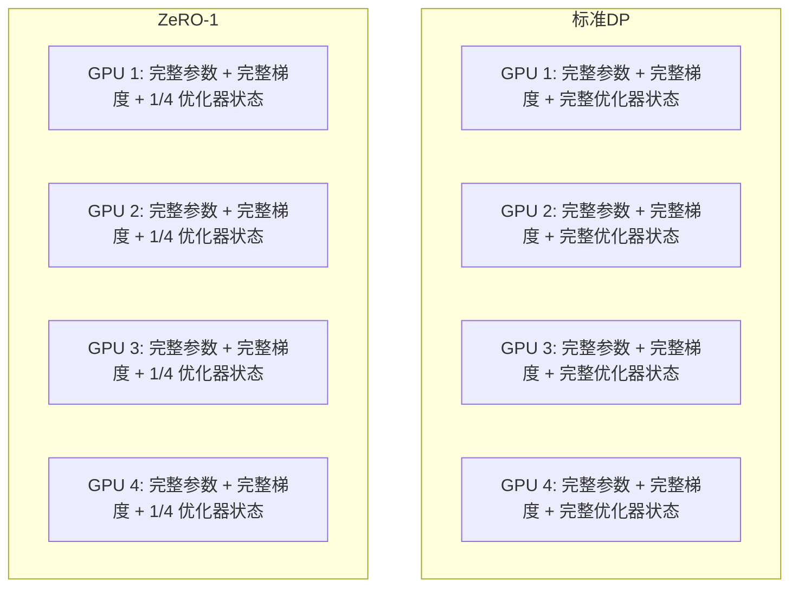
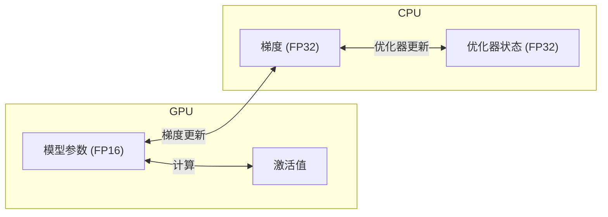
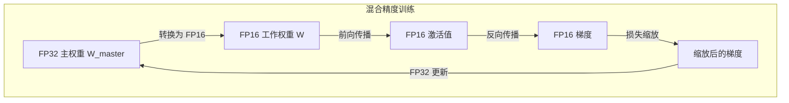
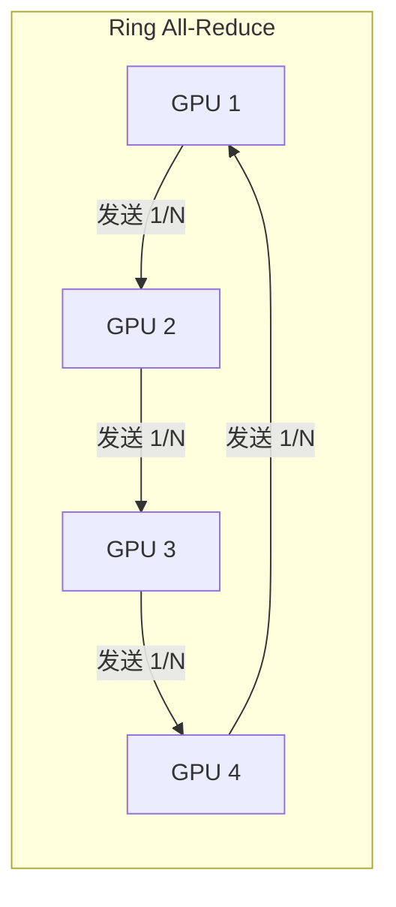

# 分布式训练基础设施 —— 万卡并行的工程挑战

在上一章中，我们探讨了缩放定律 —— 模型规模、数据规模与性能之间的幂律关系。这些定律告诉我们：要训练一个强大的大语言模型，需要数千亿参数、数万亿 token，以及相应的计算资源。但一个关键问题悬而未决：如何让数千张 GPU 协同工作，完成这一史诗级的计算任务？

以 GPT-4 为例，据推测其训练使用了约 25000 张 A100 GPU，持续数月。这是一个前所未有的工程挑战：如何将一个模型切分到数千张 GPU 上？如何让它们高效通信？如何处理不可避免的硬件故障？这些问题构成了分布式训练的核心议题。

本文将系统梳理分布式训练的关键技术：从并行策略的全景图到 ZeRO 优化的显存革命，从混合精度训练的数值技巧到梯度检查点的时空权衡，从通信优化的算法创新到工程实践的框架选择。这些技术共同构成了现代 LLM 训练的基础设施。

## 并行策略全景

当单张 GPU 无法容纳整个模型时，如何将模型分布到多张 GPU 上？这是分布式训练要解决的核心问题。不同的并行策略从不同角度解决这个问题，各有其适用场景。

### 单 GPU 的显存瓶颈

在深入并行策略之前，先理解单 GPU 的显存瓶颈。训练一个模型需要的显存包括：

**模型参数**：$2 \times N$ 字节（FP16），其中 $N$ 是参数量

**梯度**：$2 \times N$ 字节（FP16）

**优化器状态**：$12 \times N$ 字节（AdamW：FP32 主参数 + FP32 动量 + FP32 方差）

**激活值**：取决于 batch size 和序列长度

以 70B 模型为例：
- 参数：$70 \times 10^9 \times 2 = 140$ GB
- 梯度：140 GB
- 优化器状态：$70 \times 10^9 \times 12 = 840$ GB
- 总计：约 1120 GB（不含激活值）

这远超任何单张 GPU 的显存（A100 最大 80GB）。即使使用模型并行，单 GPU 也无法训练如此规模的模型。

```python runnable
import matplotlib.pyplot as plt
import numpy as np

plt.rcParams['font.sans-serif'] = ['SimHei', 'DejaVu Sans']
plt.rcParams['axes.unicode_minus'] = False

# 不同规模模型的显存需求
model_sizes = [7, 13, 30, 70, 175, 540]  # B
param_memory = [s * 2 for s in model_sizes]  # FP16 参数
grad_memory = [s * 2 for s in model_sizes]  # FP16 梯度
optimizer_memory = [s * 12 for s in model_sizes]  # AdamW 状态
total_memory = [p + g + o for p, g, o in zip(param_memory, grad_memory, optimizer_memory)]

fig, ax = plt.subplots(figsize=(12, 6))

x = np.arange(len(model_sizes))
width = 0.25

bars1 = ax.bar(x - width, param_memory, width, label='参数 (FP16)', color='steelblue')
bars2 = ax.bar(x, grad_memory, width, label='梯度 (FP16)', color='coral')
bars3 = ax.bar(x + width, optimizer_memory, width, label='优化器状态 (AdamW)', color='green')

# 添加总量标注
for i, total in enumerate(total_memory):
    ax.annotate(f'{total} GB', xy=(i, total + 50), ha='center', fontsize=9)

# GPU 显存参考线
ax.axhline(y=80, color='red', linestyle='--', linewidth=2, label='A100 80GB')
ax.axhline(y=40, color='orange', linestyle='--', linewidth=2, label='A100 40GB')

ax.set_xlabel('模型规模（B 参数）', fontsize=12)
ax.set_ylabel('显存需求（GB）', fontsize=12)
ax.set_title('不同规模模型的显存需求\n（不含激活值）', fontsize=14)
ax.set_xticks(x)
ax.set_xticklabels([f'{s}B' for s in model_sizes])
ax.legend()
ax.set_yscale('log')
ax.grid(True, alpha=0.3, axis='y')

plt.tight_layout()
plt.savefig('/workspace/memory_requirements.png', dpi=150, bbox_inches='tight')
plt.show()

print("显存需求分析:")
print("- 7B 模型需要约 112 GB，超过单张 A100 80GB")
print("- 70B 模型需要约 1120 GB，需要约 14 张 A100 80GB（仅存储）")
print("- 175B 模型需要约 2800 GB，需要约 35 张 A100 80GB（仅存储）")
print("- 这还不包括激活值，实际需求更高")
```

### 数据并行（Data Parallelism, DP）

**数据并行**是最直观的并行策略：每张 GPU 持有完整的模型副本，处理不同的数据批次。

```nn-arch width=720
name: 数据并行
layout: horizontal

sections:
  - name: 数据分发
    layers: [data]
  - name: 并行计算
    layers: [gpu1, gpu2, gpu3, gpu4]
    row_label: "4 张 GPU"
  - name: 梯度同步
    layers: [sync]
  - name: 参数更新
    layers: [update]

layers:
  - {id: data, name: "Batch", type: input, size: "切分为 4 份"}
  - {id: gpu1, name: "GPU 1\n完整模型", type: compute, size: "Forward+Backward"}
  - {id: gpu2, name: "GPU 2\n完整模型", type: compute, size: "Forward+Backward"}
  - {id: gpu3, name: "GPU 3\n完整模型", type: compute, size: "Forward+Backward"}
  - {id: gpu4, name: "GPU 4\n完整模型", type: compute, size: "Forward+Backward"}
  - {id: sync, name: "All-Reduce", type: operation, size: "梯度平均"}
  - {id: update, name: "参数更新", type: operation, size: "所有 GPU 同步"}
```

**工作流程**：
1. 将一个 batch 切分为 $N$ 份，分发给 $N$ 张 GPU
2. 每张 GPU 独立执行前向传播和反向传播
3. 通过 All-Reduce 操作同步梯度（取平均）
4. 所有 GPU 执行相同的参数更新

**优点**：
- 实现简单，无需修改模型代码
- 通信模式简单（只需梯度同步）
- 线性加速比（理想情况下）

**局限性**：
- **显存冗余**：每张 GPU 都存储完整模型，无法突破单 GPU 显存限制
- **通信开销**：随着 GPU 数量增加，梯度同步开销增大
- **batch size 限制**：有效 batch size = 单 GPU batch size × GPU 数量，可能超出最优范围

**适用场景**：模型能放入单 GPU，但需要加速训练或增大 batch size。

### 模型并行（Model Parallelism, MP）

当模型无法放入单 GPU 时，需要**模型并行**：将模型的不同部分放在不同 GPU 上。

```nn-arch width=720
name: 模型并行
layout: vertical

sections:
  - name: GPU 1
    layers: [layer1, layer2]
  - name: GPU 2
    layers: [layer3, layer4]
  - name: GPU 3
    layers: [layer5, layer6]
  - name: GPU 4
    layers: [layer7, layer8]

layers:
  - {id: layer1, name: "Layer 1-2", type: dense, size: "前 1/4 层"}
  - {id: layer2, name: "Layer 3-4", type: dense, size: "第 2 个 1/4 层"}
  - {id: layer3, name: "Layer 5-6", type: dense, size: "第 3 个 1/4 层"}
  - {id: layer4, name: "Layer 7-8", type: dense, size: "最后 1/4 层"}
```

模型并行有两种主要形式：**流水线并行**和**张量并行**。

### 流水线并行（Pipeline Parallelism, PP）

**流水线并行**将模型按层切分，不同层放在不同 GPU 上。数据像流水线一样依次通过各 GPU。

**朴素流水线的问题**：GPU 串行工作，大量时间在等待，利用率极低。

**Micro-batch 流水线**：将一个 batch 切分为多个 micro-batch，让不同 GPU 同时处理不同 micro-batch 的不同阶段。

```mermaid
gantt
    title 流水线并行时序图（4 个 micro-batch）
    dateFormat X
    axisFormat %s
    
    section GPU 1
    F1-m1 :0,1
    F1-m2 :1,2
    F1-m3 :2,3
    F1-m4 :3,4
    
    section GPU 2
    F2-m1 :1,2
    F2-m2 :2,3
    F2-m3 :3,4
    F2-m4 :4,5
    
    section GPU 3
    F3-m1 :2,3
    F3-m2 :3,4
    F3-m3 :4,5
    F3-m4 :5,6
    
    section GPU 4
    F4-m1 :3,4
    F4-m2 :4,5
    F4-m3 :5,6
    F4-m4 :6,7
```



**GPipe** 和 **PipeDream** 是两种主流的流水线调度策略：

| 策略 | GPipe | PipeDream |
|:-----|:------|:----------|
| 调度方式 | 同步（所有 micro-batch 完成后同步） | 异步（1F1B 调度） |
| 内存效率 | 需要存储所有 micro-batch 的激活值 | 只需存储部分激活值 |
| 实现复杂度 | 简单 | 复杂（需要处理版本一致性） |
| 适用场景 | 追求确定性 | 追求高吞吐 |

**优点**：
- 突破单 GPU 显存限制
- 通信量小（只传递层间激活值）

**局限性**：
- **流水线气泡**：GPU 仍有空闲时间
- **层间负载不均**：如果各层计算量不同，某些 GPU 成为瓶颈

### 张量并行（Tensor Parallelism, TP）

**张量并行**将单层的计算切分到多张 GPU 上。最常见的是切分 FFN 层和 Attention 层。

**FFN 层切分**：

FFN 包含两个线性层：$Y = \text{ReLU}(XW_1)W_2$。可以将 $W_1$ 按列切分，$W_2$ 按行切分：

$$W_1 = [W_1^{(1)}, W_1^{(2)}], \quad W_2 = \begin{bmatrix} W_2^{(1)} \\ W_2^{(2)} \end{bmatrix}$$

GPU 1 计算 $Y^{(1)} = \text{ReLU}(XW_1^{(1)})W_2^{(1)}$，GPU 2 计算 $Y^{(2)} = \text{ReLU}(XW_1^{(2)})W_2^{(2)}$，最后 $Y = Y^{(1)} + Y^{(2)}$。

**Attention 层切分**：

多头注意力天然适合张量并行：每个 GPU 处理一部分注意力头。

```nn-arch width=720
name: 张量并行（Attention）
layout: horizontal

sections:
  - name: 输入
    layers: [input]
  - name: QKV 投影（列切分）
    layers: [qkv1, qkv2]
    row_label: "2 张 GPU"
  - name: 注意力计算
    layers: [att1, att2]
  - name: 输出投影（行切分）
    layers: [out1, out2]
  - name: 聚合
    layers: [sum]

layers:
  - {id: input, name: "X", type: input, size: "(batch, seq, d)"}
  - {id: qkv1, name: "Q₁,K₁,V₁", type: projection, size: "GPU 1"}
  - {id: qkv2, name: "Q₂,K₂,V₂", type: projection, size: "GPU 2"}
  - {id: att1, name: "Attn₁", type: attention, size: "头 1-4"}
  - {id: att2, name: "Attn₂", type: attention, size: "头 5-8"}
  - {id: out1, name: "W_O₁", type: projection, size: "GPU 1"}
  - {id: out2, name: "W_O₂", type: projection, size: "GPU 2"}
  - {id: sum, name: "All-Reduce", type: operation, size: "Y₁+Y₂"}
```

**优点**：
- 细粒度切分，负载均衡
- 适合超大单层（如 175B 模型的 FFN）

**局限性**：
- **通信频繁**：每层都需要 All-Reduce
- **通信带宽敏感**：需要高带宽互联（如 NVLink）

### 三维并行

现代大模型训练通常组合使用 DP、PP、TP，形成**三维并行**：

```nn-arch width=720
name: 三维并行
layout: vertical

sections:
  - name: 数据并行
    layers: [dp1, dp2]
    row_label: "DP=2"
  - name: 流水线并行
    layers: [pp1, pp2, pp3, pp4]
    row_label: "PP=4"
  - name: 张量并行
    layers: [tp1, tp2, tp3, tp4]
    row_label: "TP=4"

layers:
  - {id: dp1, name: "DP 组 1", type: group, size: "独立数据"}
  - {id: dp2, name: "DP 组 2", type: group, size: "独立数据"}
  - {id: pp1, name: "Stage 1", type: pipeline, size: "层 1-12"}
  - {id: pp2, name: "Stage 2", type: pipeline, size: "层 13-24"}
  - {id: pp3, name: "Stage 3", type: pipeline, size: "层 25-36"}
  - {id: pp4, name: "Stage 4", type: pipeline, size: "层 37-48"}
  - {id: tp1, name: "GPU 1", type: compute, size: "TP 切分"}
  - {id: tp2, name: "GPU 2", type: compute, size: "TP 切分"}
  - {id: tp3, name: "GPU 3", type: compute, size: "TP 切分"}
  - {id: tp4, name: "GPU 4", type: compute, size: "TP 切分"}
```

以 GPT-3 175B 为例，假设使用 1024 张 GPU：
- TP = 8：每个张量并行组 8 张 GPU
- PP = 4：每个流水线阶段 8 层（共 96 层）
- DP = 32：32 个数据并行副本

总 GPU 数 = TP × PP × DP = 8 × 4 × 32 = 1024

**并行策略选择原则**：

| 模型规模 | 推荐策略 | 理由 |
|:---------|:---------|:-----|
| < 1B | DP | 单 GPU 可容纳，DP 最简单 |
| 1B - 10B | DP + PP | 需要跨 GPU，但通信开销可控 |
| 10B - 100B | DP + PP + TP | 需要细粒度切分 |
| > 100B | DP + PP + TP + ZeRO | 需要极致显存优化 |

## ZeRO 优化

**ZeRO**（Zero Redundancy Optimizer）是微软 DeepSpeed 团队提出的显存优化技术，通过消除数据并行中的冗余存储，大幅降低显存占用。

### 数据并行的冗余问题

在标准数据并行中，每张 GPU 都存储：
- 完整的模型参数
- 完整的梯度
- 完整的优化器状态

这些数据在所有 GPU 上完全相同，存在大量冗余。ZeRO 的核心思想是：**既然每张 GPU 处理不同数据，为什么存储相同的模型状态？**

### ZeRO-1：优化器状态分片

**ZeRO-1** 将优化器状态切分到不同 GPU 上。每个 GPU 只存储 $1/N$ 的优化器状态。



**显存节省**：优化器状态占显存的主要部分（约 75%）。ZeRO-1 将显存占用从 $2N + 2N + 12N = 16N$ 降低到 $2N + 2N + 12N/N = 4N + 12$（假设 $N$ 个 GPU）。

**通信开销**：参数更新时需要 All-Gather 操作，通信量增加约 50%。

### ZeRO-2：梯度分片

**ZeRO-2** 在 ZeRO-1 基础上，进一步将梯度切分。每个 GPU 只存储对应优化器状态部分的梯度。

```python runnable
import matplotlib.pyplot as plt
import numpy as np

plt.rcParams['font.sans-serif'] = ['SimHei', 'DejaVu Sans']
plt.rcParams['axes.unicode_minus'] = False

# ZeRO 各阶段的显存占用对比
# 假设 70B 模型，FP16 训练，AdamW 优化器
model_size = 70e9  # 70B 参数

# 显存组成（GB）
param_fp16 = model_size * 2 / 1e9  # FP16 参数
grad_fp16 = model_size * 2 / 1e9   # FP16 梯度
optimizer_fp32 = model_size * 12 / 1e9  # AdamW 状态（FP32 参数 + 动量 + 方差）

# 标准 DP
standard_memory = param_fp16 + grad_fp16 + optimizer_fp32

# ZeRO-1（优化器分片，假设 64 GPU）
n_gpus = 64
zero1_memory = param_fp16 + grad_fp16 + optimizer_fp32 / n_gpus

# ZeRO-2（优化器 + 梯度分片）
zero2_memory = param_fp16 + grad_fp16 / n_gpus + optimizer_fp32 / n_gpus

# ZeRO-3（全部分片）
zero3_memory = param_fp16 / n_gpus + grad_fp16 / n_gpus + optimizer_fp32 / n_gpus

# 可视化
methods = ['标准 DP', 'ZeRO-1', 'ZeRO-2', 'ZeRO-3']
memories = [standard_memory, zero1_memory, zero2_memory, zero3_memory]

fig, ax = plt.subplots(figsize=(10, 6))

bars = ax.bar(methods, memories, color=['steelblue', 'coral', 'green', 'purple'])

# 添加数值标注
for bar, mem in zip(bars, memories):
    ax.annotate(f'{mem:.1f} GB', xy=(bar.get_x() + bar.get_width()/2, bar.get_height()),
                xytext=(0, 5), textcoords='offset points', ha='center', fontsize=11)

ax.set_xlabel('优化方法', fontsize=12)
ax.set_ylabel('单 GPU 显存占用（GB）', fontsize=12)
ax.set_title(f'ZeRO 优化显存对比\n（70B 模型，{n_gpus} GPU）', fontsize=14)
ax.set_yscale('log')
ax.grid(True, alpha=0.3, axis='y')

# 添加参考线
ax.axhline(y=80, color='red', linestyle='--', linewidth=2, label='A100 80GB')
ax.legend()

plt.tight_layout()
plt.savefig('/workspace/zero_memory.png', dpi=150, bbox_inches='tight')
plt.show()

print(f"70B 模型显存分析（{n_gpus} GPU）:")
print(f"标准 DP: {standard_memory:.1f} GB（无法放入单 GPU）")
print(f"ZeRO-1: {zero1_memory:.1f} GB（优化器分片）")
print(f"ZeRO-2: {zero2_memory:.1f} GB（+ 梯度分片）")
print(f"ZeRO-3: {zero3_memory:.1f} GB（+ 参数分片）")
print(f"\nZeRO-3 使 70B 模型可以在单张 A100 80GB 上训练！")
```

### ZeRO-3：参数分片

**ZeRO-3** 将参数也切分，每个 GPU 只存储 $1/N$ 的参数。在前向和反向传播时，通过 All-Gather 操作临时获取需要的参数。

**工作流程**：
1. 前向传播时，All-Gather 当前层参数，计算后释放
2. 反向传播时，All-Gather 当前层参数和梯度，计算后释放
3. 参数更新时，只更新本地分片

**显存节省**：ZeRO-3 将显存占用降低到 $16N/N = 16$ 字节/参数（理论最小值）。

**通信开销**：通信量增加约 3 倍（需要 All-Gather 参数和梯度）。

### ZeRO-Offload：CPU 卸载

**ZeRO-Offload** 将优化器状态和梯度卸载到 CPU 内存，进一步降低 GPU 显存需求。



**代价**：CPU-GPU 数据传输成为瓶颈，训练速度下降。

**适用场景**：显存极度受限，但可以接受较慢的训练速度。

### ZeRO-Infinity：NVMe 卸载

**ZeRO-Infinity** 进一步将数据卸载到 NVMe SSD，利用高速存储扩展显存容量。

## 混合精度训练

**混合精度训练**使用低精度格式（FP16 或 BF16）进行计算，同时保留高精度（FP32）的主权重，以兼顾速度和数值稳定性。

### FP16 训练的数值挑战

FP16 的表示范围有限：
- 最大正常值：约 65504
- 最小正常值：约 $6 \times 10^{-5}$
- 精度：约 3 位十进制

这带来两个问题：

**梯度下溢**：深度学习中的梯度通常很小（如 $10^{-5}$ 到 $10^{-8}$），FP16 无法精确表示，导致梯度消失。

**权重更新误差**：FP16 精度有限，$W + \epsilon \cdot g$ 可能因为 $\epsilon \cdot g$ 太小而无法改变 $W$。

### FP32 主权重 + FP16 计算

混合精度训练的核心设计：



**工作流程**：
1. 维护 FP32 主权重 $W_{master}$（高精度，用于参数更新）
2. 前向和反向传播使用 FP16 工作权重 $W$（从 $W_{master}$ 转换）
3. 梯度计算后，使用损失缩放防止下溢
4. 参数更新时，将缩放后的梯度转回 FP32，更新 $W_{master}$

### 损失缩放（Loss Scaling）

**损失缩放**是解决梯度下溢的关键技术：

$$\text{scaled\_loss} = \text{loss} \times S$$

$$\text{scaled\_grad} = \frac{\partial(\text{scaled\_loss})}{\partial W} = \text{grad} \times S$$

反向传播完成后，将梯度除以 $S$ 恢复原始值：

$$\text{grad} = \text{scaled\_grad} / S$$

**缩放因子选择**：$S$ 需要足够大，使梯度进入 FP16 的表示范围；但不能太大，否则会导致梯度上溢。

**动态损失缩放**：自动调整 $S$。如果检测到梯度上溢（出现 inf 或 nan），减小 $S$；如果一段时间没有上溢，增大 $S$。

```python runnable
import torch
import torch.nn as nn
import matplotlib.pyplot as plt
import numpy as np

plt.rcParams['font.sans-serif'] = ['SimHei', 'DejaVu Sans']
plt.rcParams['axes.unicode_minus'] = False

# 演示损失缩放的效果
def demonstrate_loss_scaling():
    """演示损失缩放如何防止梯度下溢"""
    
    # 模拟梯度分布
    np.random.seed(42)
    gradients = np.random.lognormal(-8, 1, 10000)  # 典型的梯度分布
    
    # FP16 可表示的最小正常值
    fp16_min = 6e-5
    
    # 不使用损失缩放
    underflow_count = np.sum(gradients < fp16_min)
    underflow_ratio = underflow_count / len(gradients)
    
    # 使用损失缩放（S = 1024）
    S = 1024
    scaled_gradients = gradients * S
    scaled_underflow = np.sum(scaled_gradients < fp16_min)
    scaled_underflow_ratio = scaled_underflow / len(scaled_gradients)
    
    # 可视化
    fig, axes = plt.subplots(1, 2, figsize=(14, 5))
    
    # 原始梯度分布
    axes[0].hist(gradients, bins=100, alpha=0.7, color='steelblue')
    axes[0].axvline(x=fp16_min, color='red', linestyle='--', linewidth=2, label=f'FP16 最小值 ({fp16_min:.0e})')
    axes[0].set_xlabel('梯度值', fontsize=12)
    axes[0].set_ylabel('频次', fontsize=12)
    axes[0].set_title(f'原始梯度分布\n下溢比例: {underflow_ratio*100:.1f}%', fontsize=12)
    axes[0].set_xscale('log')
    axes[0].legend()
    
    # 缩放后梯度分布
    axes[1].hist(scaled_gradients, bins=100, alpha=0.7, color='green')
    axes[1].axvline(x=fp16_min, color='red', linestyle='--', linewidth=2, label=f'FP16 最小值 ({fp16_min:.0e})')
    axes[1].set_xlabel('梯度值（缩放后）', fontsize=12)
    axes[1].set_ylabel('频次', fontsize=12)
    axes[1].set_title(f'缩放后梯度分布 (S={S})\n下溢比例: {scaled_underflow_ratio*100:.1f}%', fontsize=12)
    axes[1].set_xscale('log')
    axes[1].legend()
    
    plt.tight_layout()
    plt.savefig('/workspace/loss_scaling.png', dpi=150, bbox_inches='tight')
    plt.show()
    
    print("损失缩放效果:")
    print(f"原始梯度下溢比例: {underflow_ratio*100:.1f}%")
    print(f"缩放后下溢比例: {scaled_underflow_ratio*100:.1f}%")
    print(f"损失缩放因子 S = {S} 使梯度进入 FP16 可表示范围")

demonstrate_loss_scaling()
```

### BF16：无需缩放的混合精度

**BF16**（Brain Float 16）是 Google 提出的浮点格式，专门为深度学习设计：

| 格式 | 符号位 | 指数位 | 尾数位 | 表示范围 |
|:-----|:-------|:-------|:-------|:---------|
| FP16 | 1 | 5 | 10 | ±65504 |
| BF16 | 1 | 8 | 7 | ±3.4e38 |
| FP32 | 1 | 8 | 23 | ±3.4e38 |

BF16 使用与 FP32 相同的指数位（8 位），因此表示范围相同，不会出现梯度下溢问题。

**BF16 的优势**：
- **无需损失缩放**：表示范围足够大
- **更简单的训练流程**：不需要动态缩放逻辑
- **更好的数值稳定性**：避免了 FP16 的精度问题

**BF16 的代价**：
- 精度较低（只有 7 位尾数），可能影响某些敏感计算
- 需要硬件支持（Ampere 架构及以后的 GPU）

```python runnable
import numpy as np
import matplotlib.pyplot as plt

plt.rcParams['font.sans-serif'] = ['SimHei', 'DejaVu Sans']
plt.rcParams['axes.unicode_minus'] = False

# FP16 vs BF16 表示范围对比
def compare_float_formats():
    """对比 FP16 和 BF16 的表示范围"""
    
    formats = {
        'FP16': {'exp_bits': 5, 'mantissa_bits': 10, 'bias': 15},
        'BF16': {'exp_bits': 8, 'mantissa_bits': 7, 'bias': 127},
        'FP32': {'exp_bits': 8, 'mantissa_bits': 23, 'bias': 127}
    }
    
    fig, axes = plt.subplots(1, 2, figsize=(14, 5))
    
    # 表示范围
    names = list(formats.keys())
    max_values = []
    min_normals = []
    
    for name, fmt in formats.items():
        exp_max = 2 ** fmt['exp_bits'] - 1 - fmt['bias']
        max_val = (2 - 2**(-fmt['mantissa_bits'])) * 2**exp_max
        min_normal = 2 ** (1 - fmt['bias'])
        max_values.append(max_val)
        min_normals.append(min_normal)
    
    x = np.arange(len(names))
    width = 0.35
    
    # 使用对数刻度
    axes[0].bar(x, [np.log10(v) for v in max_values], width, label='最大值（log10）', color='steelblue')
    axes[0].set_xlabel('浮点格式', fontsize=12)
    axes[0].set_ylabel('log10(最大值)', fontsize=12)
    axes[0].set_title('表示范围：最大值', fontsize=12)
    axes[0].set_xticks(x)
    axes[0].set_xticklabels(names)
    axes[0].grid(True, alpha=0.3, axis='y')
    
    # 添加数值标注
    for i, v in enumerate(max_values):
        axes[0].annotate(f'{v:.1e}', xy=(i, np.log10(v)), xytext=(0, 5),
                        textcoords='offset points', ha='center', fontsize=9)
    
    # 最小正常值
    axes[1].bar(x, [np.log10(v) for v in min_normals], width, label='最小正常值（log10）', color='coral')
    axes[1].set_xlabel('浮点格式', fontsize=12)
    axes[1].set_ylabel('log10(最小正常值)', fontsize=12)
    axes[1].set_title('表示范围：最小正常值', fontsize=12)
    axes[1].set_xticks(x)
    axes[1].set_xticklabels(names)
    axes[1].grid(True, alpha=0.3, axis='y')
    
    for i, v in enumerate(min_normals):
        axes[1].annotate(f'{v:.1e}', xy=(i, np.log10(v)), xytext=(0, 5),
                        textcoords='offset points', ha='center', fontsize=9)
    
    plt.tight_layout()
    plt.savefig('/workspace/float_formats.png', dpi=150, bbox_inches='tight')
    plt.show()
    
    print("浮点格式对比:")
    print("FP16: 范围有限，需要损失缩放")
    print("BF16: 范围与 FP32 相同，无需损失缩放")
    print("FP32: 全精度，但显存占用大")
    print("\n现代 LLM 训练推荐使用 BF16（如果硬件支持）")

compare_float_formats()
```

## 梯度累积与检查点

当显存不足以支持大 batch size 时，有两种关键技术：**梯度累积**模拟大 batch，**梯度检查点**降低激活值显存。

### 梯度累积：模拟大 Batch

**梯度累积**的核心思想：将大 batch 分成多个小 batch，分别计算梯度并累积，最后一次性更新参数。

```python
# 梯度累积示例
effective_batch_size = 64
micro_batch_size = 4
accumulation_steps = effective_batch_size // micro_batch_size  # 16

optimizer.zero_grad()

for step in range(accumulation_steps):
    # 获取小 batch
    batch = get_micro_batch(micro_batch_size)
    
    # 前向传播
    outputs = model(batch)
    loss = criterion(outputs, targets) / accumulation_steps  # 注意：损失要除以累积步数
    
    # 反向传播（梯度累积）
    loss.backward()

# 一次性更新参数
optimizer.step()
```

**注意事项**：
- 损失要除以累积步数，保证梯度平均值正确
- BatchNorm 等依赖 batch 统计的层可能受影响
- 延长了单步训练时间

### 梯度检查点：激活值重计算

**梯度检查点**（Gradient Checkpointing，又称 Activation Recomputation）是一种时空权衡技术：在前向传播时不保存所有激活值，而是在反向传播时重新计算。

```nn-arch width=720
name: 梯度检查点
layout: vertical

sections:
  - name: 标准训练
    layers: [std_fwd, std_save, std_bwd]
  - name: 梯度检查点
    layers: [ckpt_fwd, ckpt_drop, ckpt_recompute, ckpt_bwd]

layers:
  - {id: std_fwd, name: "前向传播", type: compute, size: "计算所有激活值"}
  - {id: std_save, name: "保存激活值", type: memory, size: "显存占用大"}
  - {id: std_bwd, name: "反向传播", type: compute, size: "使用保存的激活值"}
  
  - {id: ckpt_fwd, name: "前向传播", type: compute, size: "计算所有激活值"}
  - {id: ckpt_drop, name: "丢弃部分激活值", type: operation, size: "只保存检查点"}
  - {id: ckpt_recompute, name: "重新计算", type: compute, size: "反向时重新计算"}
  - {id: ckpt_bwd, name: "反向传播", type: compute, size: "使用重计算的激活值"}
```

**显存节省**：假设模型有 $L$ 层，每层激活值大小为 $A$。标准训练需要 $L \times A$ 的激活值显存。如果每 $k$ 层保存一个检查点，激活值显存降低到 $(L/k + k) \times A$。

**计算开销**：需要额外的前向传播计算，训练时间增加约 20-30%。

```python runnable
import matplotlib.pyplot as plt
import numpy as np

plt.rcParams['font.sans-serif'] = ['SimHei', 'DejaVu Sans']
plt.rcParams['axes.unicode_minus'] = False

# 梯度检查点的显存-计算权衡
def checkpoint_tradeoff():
    """分析梯度检查点的显存-计算权衡"""
    
    # 假设 24 层 Transformer，每层激活值 1GB
    L = 24
    activation_per_layer = 1  # GB
    
    # 不同检查点策略
    strategies = [
        ('无检查点', L, 1.0),  # (名称, 激活值显存单位, 相对计算量)
        ('每 4 层检查点', L/4 + 4, 1.25),
        ('每 2 层检查点', L/2 + 2, 1.33),
        ('每层检查点', 1 + L, 2.0),
    ]
    
    names = [s[0] for s in strategies]
    memories = [s[1] * activation_per_layer for s in strategies]
    compute = [s[2] for s in strategies]
    
    fig, ax1 = plt.subplots(figsize=(10, 6))
    
    x = np.arange(len(names))
    
    # 显存
    color1 = 'steelblue'
    ax1.bar(x - 0.2, memories, 0.4, label='激活值显存 (GB)', color=color1)
    ax1.set_xlabel('检查点策略', fontsize=12)
    ax1.set_ylabel('激活值显存 (GB)', color=color1, fontsize=12)
    ax1.tick_params(axis='y', labelcolor=color1)
    ax1.set_xticks(x)
    ax1.set_xticklabels(names)
    
    # 计算量
    ax2 = ax1.twinx()
    color2 = 'coral'
    ax2.bar(x + 0.2, compute, 0.4, label='相对计算量', color=color2)
    ax2.set_ylabel('相对计算量', color=color2, fontsize=12)
    ax2.tick_params(axis='y', labelcolor=color2)
    
    plt.title('梯度检查点：显存-计算权衡\n（24 层 Transformer）', fontsize=14)
    
    # 添加图例
    lines1, labels1 = ax1.get_legend_handles_labels()
    lines2, labels2 = ax2.get_legend_handles_labels()
    ax1.legend(lines1 + lines2, labels1 + labels2, loc='upper right')
    
    plt.tight_layout()
    plt.savefig('/workspace/checkpoint_tradeoff.png', dpi=150, bbox_inches='tight')
    plt.show()
    
    print("梯度检查点策略选择:")
    print("- 无检查点: 显存最大，计算最快")
    print("- 每 4 层检查点: 显存减少 75%，计算增加 25%（推荐）")
    print("- 每 2 层检查点: 显存减少 50%，计算增加 33%")
    print("- 每层检查点: 显存最小，计算翻倍（极端情况）")

checkpoint_tradeoff()
```

### 选择性激活重计算

**选择性激活重计算**（Selective Activation Recomputation）是一种更精细的策略：只重计算计算量小但显存占用大的激活值。

例如，Attention 计算的中间结果（$QK^T$）显存占用大（$O(n^2)$），但重计算成本低（$O(n^2 d)$）。选择丢弃这些中间结果，而保留计算成本高的激活值。

## 通信优化

分布式训练的效率很大程度上取决于通信开销。本节介绍几种关键的通信优化技术。

### All-Reduce vs Ring All-Reduce

**All-Reduce** 是分布式训练中最常用的通信原语：每个节点贡献数据，最终所有节点都获得聚合结果。

**朴素 All-Reduce**：
1. 所有节点将数据发送到一个主节点
2. 主节点聚合
3. 主节点将结果广播给所有节点

瓶颈：主节点成为通信瓶颈。

**Ring All-Reduce**：
将节点组织成环形，数据沿环传递，分两个阶段：



**Scatter-Reduce 阶段**：每个节点只处理数据的 $1/N$，沿环传递并累积。

**All-Gather 阶段**：将聚合结果沿环广播。

**优势**：
- 带宽利用率高：每个节点同时发送和接收
- 无单点瓶颈：通信负载均匀分布
- 通信量：$2(N-1) \times \text{数据量} / N$，与节点数无关

### 梯度压缩

**梯度压缩**通过降低通信数据量来减少通信时间。

**量化压缩**：将 FP32 梯度量化为低精度格式（如 INT8）。

$$g_{quantized} = \text{round}(g / \Delta) \times \Delta$$

其中 $\Delta$ 是量化步长。

**稀疏化压缩**：只发送绝对值较大的梯度，忽略小梯度。

**误差补偿**：将未发送的梯度累积到下次发送，避免信息丢失。

```python runnable
import numpy as np
import matplotlib.pyplot as plt

plt.rcParams['font.sans-serif'] = ['SimHei', 'DejaVu Sans']
plt.rcParams['axes.unicode_minus'] = False

# 梯度压缩演示
def demonstrate_gradient_compression():
    """演示梯度压缩的效果"""
    
    np.random.seed(42)
    
    # 模拟梯度
    gradients = np.random.randn(1000) * 0.1
    
    # Top-K 稀疏化（保留前 10%）
    k = int(len(gradients) * 0.1)
    top_k_indices = np.argsort(np.abs(gradients))[-k:]
    sparse_gradients = np.zeros_like(gradients)
    sparse_gradients[top_k_indices] = gradients[top_k_indices]
    
    # 量化（INT8）
    scale = np.max(np.abs(gradients)) / 127
    quantized = np.round(gradients / scale).astype(np.int8)
    dequantized = quantized * scale
    
    # 可视化
    fig, axes = plt.subplots(1, 3, figsize=(15, 4))
    
    # 原始梯度
    axes[0].hist(gradients, bins=50, alpha=0.7, color='steelblue')
    axes[0].set_title('原始梯度\n通信量: 100%', fontsize=12)
    axes[0].set_xlabel('梯度值')
    axes[0].set_ylabel('频次')
    
    # Top-K 稀疏化
    axes[1].hist(sparse_gradients[sparse_gradients != 0], bins=50, alpha=0.7, color='coral')
    axes[1].set_title(f'Top-{k} 稀疏化\n通信量: 10%', fontsize=12)
    axes[1].set_xlabel('梯度值')
    axes[1].set_ylabel('频次')
    
    # 量化
    axes[2].hist(dequantized, bins=50, alpha=0.7, color='green')
    axes[2].set_title('INT8 量化\n通信量: 25%', fontsize=12)
    axes[2].set_xlabel('梯度值')
    axes[2].set_ylabel('频次')
    
    plt.tight_layout()
    plt.savefig('/workspace/gradient_compression.png', dpi=150, bbox_inches='tight')
    plt.show()
    
    # 计算误差
    sparse_error = np.mean((gradients - sparse_gradients) ** 2)
    quant_error = np.mean((gradients - dequantized) ** 2)
    
    print("梯度压缩效果:")
    print(f"Top-K 稀疏化: 通信量减少 90%，MSE = {sparse_error:.6f}")
    print(f"INT8 量化: 通信量减少 75%，MSE = {quant_error:.6f}")
    print("\n误差补偿可以进一步降低压缩带来的精度损失")

demonstrate_gradient_compression()
```

### 通信与计算重叠

**通信与计算重叠**（Computation-Communication Overlap）是提升效率的关键技术。

**梯度同步重叠**：在反向传播过程中，一旦某层的梯度计算完成，立即开始同步，而不是等待所有梯度计算完成。

**DualPipe**：DeepSeek-V3 提出的双流水线调度，实现了前向传播、反向传播和通信的完全重叠。

```mermaid
gantt
    title 通信与计算重叠
    dateFormat X
    axisFormat %s
    
    section GPU 1
    Forward-1 :0,2
    Backward-1 :2,4
    Comm-1 :3,5
    
    section GPU 2
    Forward-2 :2,4
    Backward-2 :4,6
    Comm-2 :5,7
    
    section GPU 3
    Forward-3 :4,6
    Backward-3 :6,8
    Comm-3 :7,9
```



## 代表框架

现代分布式训练框架将这些技术整合，提供开箱即用的解决方案。

### Megatron-LM

**Megatron-LM** 是 NVIDIA 开发的大模型训练框架，核心贡献：

**张量并行**：高效的层内模型并行实现

**序列并行**：将序列维度也进行切分，进一步降低显存

**混合专家支持**：与 MoE 架构深度集成

**适用场景**：NVIDIA GPU 集群，追求极致性能

### DeepSpeed

**DeepSpeed** 是微软开发的深度学习优化库，核心贡献：

**ZeRO 优化**：ZeRO-1/2/3/Offload/Infinity 系列

**混合精度训练**：FP16/BF16 支持

**流水线并行**：高效的调度策略

**适用场景**：显存受限场景，追求最大模型规模

### PyTorch FSDP

**FSDP**（Fully Sharded Data Parallel）是 PyTorch 原生的分布式训练方案：

**与 ZeRO-3 类似**：完全分片数据并行

**原生集成**：无需额外依赖

**易用性**：简单的 API，自动处理分片逻辑

**适用场景**：PyTorch 用户，追求简单易用

```python
# FSDP 使用示例
import torch
import torch.nn as nn
from torch.distributed.fsdp import FullyShardedDataParallel as FSDP

# 初始化分布式环境
torch.distributed.init_process_group(backend='nccl')

# 创建模型
model = MyLargeModel()

# 包装为 FSDP
model = FSDP(model)

# 正常训练
optimizer = torch.optim.AdamW(model.parameters(), lr=1e-4)

for batch in dataloader:
    optimizer.zero_grad()
    output = model(batch)
    loss = criterion(output, targets)
    loss.backward()
    optimizer.step()
```

## 小结

本文系统梳理了分布式训练的关键技术：

**并行策略全景**：
- 数据并行（DP）：简单高效，但显存冗余
- 流水线并行（PP）：突破显存限制，但有流水线气泡
- 张量并行（TP）：细粒度切分，但通信频繁
- 三维并行：DP + PP + TP 组合，现代大模型标配

**ZeRO 优化**：
- ZeRO-1：优化器状态分片，显存降低约 4 倍
- ZeRO-2：+ 梯度分片，显存降低约 8 倍
- ZeRO-3：+ 参数分片，显存降低与 GPU 数成正比
- ZeRO-Offload/Infinity：CPU/NVMe 卸载，进一步扩展

**混合精度训练**：
- FP16 训练 + FP32 主权重：兼顾速度和精度
- 损失缩放：解决梯度下溢问题
- BF16：无需损失缩放，现代 GPU 推荐

**梯度累积与检查点**：
- 梯度累积：模拟大 batch，突破显存限制
- 梯度检查点：激活值重计算，显存 - 计算权衡
- 选择性重计算：精细控制重计算策略

**通信优化**：
- Ring All-Reduce：高效无瓶颈的通信模式
- 梯度压缩：量化、稀疏化降低通信量
- 通信与计算重叠：DualPipe 等策略最大化效率

**代表框架**：
- Megatron-LM：NVIDIA 的张量并行专家
- DeepSpeed：微软的 ZeRO 优化先驱
- PyTorch FSDP：原生易用的分片方案

分布式训练是现代 LLM 训练的基石。理解这些技术，是理解 GPT-4、LLaMA、DeepSeek 等大模型如何被训练出来的关键。下一章将从预训练转向对齐，探讨监督微调（SFT）——如何将预训练模型转化为可用的助手。

---

## 练习题

**1. 理论推导**

计算 70B 模型在不同并行策略下的单 GPU 显存需求：
- 仅数据并行（假设 8 GPU）
- DP + PP（流水线 4 阶段）
- DP + PP + TP（TP=8）
- ZeRO-3（64 GPU）

**2. 架构设计**

设计一个 175B 模型的分布式训练方案：
- 可用 GPU：1024 张 A100 80GB
- 目标：最大化训练吞吐量
- 约束：每张 GPU 显存不超过 70GB

给出 DP、PP、TP 的配置，并说明理由。

**3. 数值分析**

分析 FP16 和 BF16 的数值特性：
- 计算两种格式下 $a + b$ 可能产生精度损失的条件
- 分析为什么 BF16 不需要损失缩放

**4. 编程实现**

实现一个简单的梯度累积训练循环：
- 支持 micro-batch
- 正确处理损失缩放
- 支持梯度裁剪

**5. 通信分析**

分析 Ring All-Reduce 的通信复杂度：
- 假设 $N$ 个节点，每个节点数据量 $M$
- 计算总通信量和每节点的通信量
- 与朴素 All-Reduce 对比

---

## 参考资料

1. **Megatron-LM 论文**: "Megatron-LM: Training Multi-Billion Parameter Language Models Using Model Parallelism" (Shoeybi et al., 2019)
2. **DeepSpeed ZeRO 论文**: "ZeRO: Memory Optimizations Toward Training Trillion Parameter Models" (Rajbhandari et al., 2020)
3. **混合精度训练**: "Mixed Precision Training" (Micikevicius et al., 2017)
4. **梯度检查点**: "Training Deep Nets with Sublinear Memory Cost" (Chen et al., 2016)
5. **Ring All-Reduce**: "Bringing HPC Techniques to Deep Learning" (Gibiansky, 2017)
6. **GPipe 论文**: "GPipe: Efficient Training of Giant Neural Networks using Pipeline Parallelism" (Huang et al., 2019)
7. **PipeDream 论文**: "PipeDream: Generalized Pipeline Parallelism for DNN Training" (Harlap et al., 2019)
8. **PyTorch FSDP**: "PyTorch Fully Sharded Data Parallel" (PyTorch Documentation)
9. **DeepSeek-V3 论文**: "DeepSeek-V3 Technical Report" (DeepSeek-AI, 2024)
10. **BF16 格式**: "A Study of BFLOAT16 for Deep Learning Training" (Kalamkar et al., 2019)
