# 分布式训练基础设施

在[上一章](scaling-laws.md)里，我们看到了缩放定律揭示的规律，模型参数增加 10 倍，损失固定降低到原来的约 0.84 倍，这条幂律曲线给出了一个确定性的承诺，只要愿意投入更多算力，模型性能就会按可预测的比例持续提升。但乐观的曲线背后藏着一个工程难题：要训练一个参数量达到千亿甚至万亿规模的模型，单张 GPU 根本放不下它，更无法在可接受的时间内完成训练。

这个难题并非理论上无解，而是工程实现上极其复杂。2019 年，NVIDIA 研究人员穆罕默德·肖伊比（Mohammad Shoeybi）在论文《Megatron-LM: Training Multi-Billion Parameter Language Models Using Model Parallelism》中首次展示了如何将 83 亿参数的模型分布到多张 GPU 上高效训练。此后，微软 DeepSpeed 团队在 2020 年提出了 ZeRO 优化技术，DeepSeek 团队在 2024 年的 V3 技术报告中提出了万卡规模的三维并行训练方案。这些工作逐步将分布式训练从实验室探索推向了工业级实践。

以 GPT-4 为例，据推测其训练使用了约 25000 张 A100 GPU，持续数月，这相当于把一整座数据中心跑满大半年只为训练一个模型。如何将一个模型切分到数千张 GPU 上、如何让它们高效通信、如何处理不可避免的硬件故障，这些工程问题构成了分布式训练的实质议题。

## 并行策略

在讨论各种并行训练策略之前，我们先来明确并行的目的是什么：训练一个模型需要的显存远不止模型参数本身，还包括梯度、优化器状态和激活值。当这些加在一起远超单张 GPU 的容量时，唯一的出路就是把它们拆开，放到多张 GPU 上，这样才可能在有限的显存中以合理的时间完成训练。

训练一个模型时，GPU 显存需要同时容纳四类数据。第一类是模型参数本身，混合精度训练（Mixed Precision Training）下以 FP16 格式进行计算，每个参数占 2 字节，70 亿参数的模型就需要约 14 GB。第二类是梯度，反向传播计的每个参数梯度同样以 FP16 计算，大小与参数相同。第三类是优化器状态，[AdamW 优化器](../../deep-learning/neural-network-optimization/adaptive-optimizers.md#adamw)为每个参数维护主权重副本、动量和方差三个 FP32 变量，加起来每个参数占 12 字节。第四类是激活值，前向传播过程中保存的中间结果，大小取决于 Batch Size 和序列长度。

把这些数字加在一起，设模型参数量为 $N$，训练时至少需要 $2N + 2N + 12N = 16N$ 字节的显存来存储参数、梯度和优化器状态，以 70B 模型为例，将 $N = 70 \times 10^9$ 代入计算，得到参数 140 GB，梯度 140 GB，优化器状态 840 GB，合计约 1120 GB。一张 A100 GPU 最大只有 80 GB 显存，意味着光是把模型相关的数据存下来，就需要至少 14 张 A100。因为激活值、前向传播过程的中间结果、各种库和碎片化花销还要额外占用显存（可参考 [Transformer 模型训练实验](../architecture-basics/llm-pretrain-experiment.md#第三阶段-预训练)中的"训练显存占用预估"）。下图是不同规模模型在 FP16 训练下的显存需求分解，橙色和红色虚线分别为 A100 40GB 和 80GB 的显存上限。

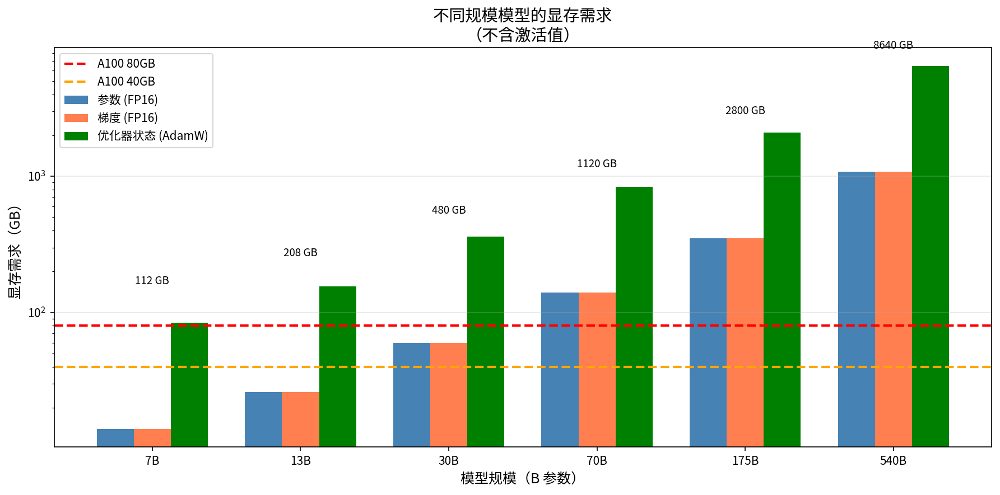

*图：不同规模模型的显存需求*

### 数据并行

既然一张 GPU 放不下所有数据，那能否使用多张 GPU 一起分担？最早出现的**数据并行**（Data Parallelism, DP）就支持多卡并行训练。数据并行要求每张 GPU 各持有一份完整的模型参数副本，然后将一个大的 Batch 拆分成多个子 Batch，分配给不同的 GPU，每张 GPU 各自独立执行前向传播和反向传播。最后各 GPU 将计算得到的梯度汇总，得到平均梯度后各自更新参数，确保所有副本保持同步。

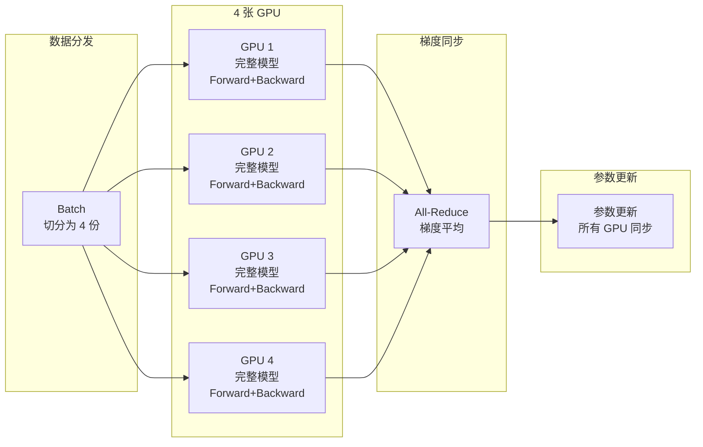
*图：数据并行工作流程*

数据并行实现起来十分简单，几乎不需要修改模型代码，使用 PyTorch 原生的 `DistributedDataParallel`（DDP）就能完成。但它的局限相信大家一眼就看出来了，数据并行对大模型的显存瓶颈毫无帮助，它只能解决"算得慢"的问题，无法解决"放不下"的问题。训练过程中每张 GPU 必须持有完整的模型，包括参数、梯度和优化器状态。如下面公式，$2N + 2N + 12N$ 部分不会随 GPU 数量增加而减少，只有 $A$ 能通过减小子 Batch 来降低。前面计算过，70B 模型仅参数和优化器状态就需要约 1120 GB，目前没有任何单卡能容纳这种规模的数据量。

$$\text{每卡显存需求} = \underbrace{2N + 2N + 12N}_{\text{参数+梯度+优化器}} + \underbrace{A}_{\text{激活值}}$$

### 模型并行

真正能够突破单卡显存限制的是**模型并行**（Model Parallelism, MP），它不复制整个模型，而是把模型的不同部分装载到不同的 GPU 上。模型并行有**流水线并行**和**张量并行**两种主要形式，它们分别从"层间"和"层内"两个粒度来切分模型。

#### 流水线并行

**流水线并行**（Pipeline Parallelism, PP）将模型按层切分，不同层放在不同 GPU 上，数据像流水线一样依次通过各 GPU。2019 年，Google 的论文《GPipe: Efficient Training of Giant Neural Networks using Pipeline Parallelism》中提出了这一方法的系统实现，随后卡内基梅隆大学在 PipeDream 中引入了更高效的调度策略。

以一个 48 层的 Transformer 模型为例。训练时，将模型第 1-12 层放在 GPU 1 上，第 13-24 层放在 GPU 2 上，依此类推。一次前向传播的过程是数据先经过 GPU 1 的 12 层计算，输出激活值传给 GPU 2，GPU 2 拿到激活值后经过自己的 12 层计算，再传给 GPU 3，依此类推，直到 GPU 4 输出最终结果。反向传播则反过来，梯度从 GPU 4 依次传回 GPU 1。

这种朴素的流水线设计会导致同一时刻只有一张 GPU 在工作，GPU 1 算前 12 层时，GPU 2、3、4 空闲，GPU 1 算完把激活值传给 GPU 2，GPU 2 开始计算，但 GPU 1、3、4 又空闲了。整条流水线的资源利用率只有大约 25%。下面的时序图展示了 4 张 GPU 处理一个 Batch 时的空闲情况，这些空闲时段被称为**流水线气泡**（Pipeline Bubble）。

```mermaid
gantt
    title 朴素流水线：同一时刻仅 1 张 GPU 工作
    dateFormat X
    axisFormat %s

    section GPU 1
    F1 :f1, 0, 1s
    空闲 :done, i1, after f1, 3s
    B1 :b1, after i1, 1s

    section GPU 2
    空闲 :done, w2, 0, 1s
    F2 :f2, after w2, 1s
    空闲 :done, i2, after f2, 2s
    B2 :b2, after i2, 1s

    section GPU 3
    空闲 :done, w3, 0, 2s
    F3 :f3, after w3, 1s
    空闲 :done, i3, after f3, 1s
    B3 :b3, after i3, 1s

    section GPU 4
    空闲 :done, w4, 0, 3s
    F4 :f4, after w4, 1s
    B4 :after f4, 1s
```
*图：朴素流水线工作时序*

Micro-batch 流水线是为了压缩这些气泡而提出的。既然一张 GPU 处理完一个 Batch 的前向传播后要等很久才能收到反向传播的梯度，那不如让它在这段等待时间里去处理下一个 Batch 的前向传播。具体做法是将一个大的训练 Batch 切分成若干个 Micro-batch，然后让这些 Micro-batch 依次进入流水线。以上面 4 张 GPU 的场景为例，将一个 Batch 切成 4 个 Micro-batch（$m_1, m_2, m_3, m_4$），它们的工作时序如下图所示。

```mermaid
gantt
    title Micro-batch 流水线时序图（4 个 Micro-batch）
    dateFormat X
    axisFormat %s

    section GPU 1
    F₁-m₁ :f1m1, 0, 1s
    F₁-m₂ :f1m2, after f1m1, 1s
    F₁-m₃ :f1m3, after f1m2, 1s
    F₁-m₄ :f1m4, after f1m3, 1s

    section GPU 2
    空闲 :done, w2, 0, 1s
    F₂-m₁ :f2m1, after w2, 1s
    F₂-m₂ :f2m2, after f2m1, 1s
    F₂-m₃ :f2m3, after f2m2, 1s
    F₂-m₄ :f2m4, after f2m3, 1s

    section GPU 3
    空闲 :done, w3, 0, 2s
    F₃-m₁ :f3m1, after w3, 1s
    F₃-m₂ :f3m2, after f3m1, 1s
    F₃-m₃ :f3m3, after f3m2, 1s
    F₃-m₄ :f3m4, after f3m3, 1s

    section GPU 4
    空闲 :done, w4, 0, 3s
    F₄-m₁ :f4m1, after w4, 1s
    F₄-m₂ :f4m2, after f4m1, 1s
    F₄-m₃ :f4m3, after f4m2, 1s
    F₄-m₄ :after f4m3, 1s
```
*图：Micro-batch 工作时序*

- **时刻 1**：只有 GPU 1 在处理 $m_1$ 的前向传播，其余 GPU 仍然空闲。
- **时刻 2**：GPU 1 开始处理 $m_2$ 的前向传播，同时 GPU 1 之前算出的 $m_1$ 的激活值已经传到 GPU 2，GPU 2 开始处理 $m_1$ 的前向传播。
- **时刻 3**：GPU 1 处理 $m_3$，GPU 2 处理 $m_2$，GPU 3 处理 $m_1$，此时三张 GPU 同时工作。
- **时刻 4**：4 张 GPU 全部被填满，各自处理不同 Micro-batch 的不同阶段，利用率接近 100%。这和工厂流水线的工作方式一致，每个产品都要依次经过所有工序，但不同产品可以同时在不同工序上加工，当流水线填满后，所有工位都在运转。

上面这张时序图只画了前向传播，隐去了反向传播的部分。完整的训练过程是前向传播和反向传播交替进行的，而前向传播和反向传播如何交替安排，就涉及 GPipe 和 PipeDream 两种不同的调度策略：

- GPipe 采用同步调度，所有 Micro-batch 先依次完成前向传播，然后再依次完成反向传播。以上面 4 个 Micro-batch 为例，$m_1$ 到 $m_4$ 依次通过 4 张 GPU 完成前向传播，然后 $m_4$ 到 $m_1$ 再依次完成反向传播。这种方式的优点是实现简单，梯度在所有 Micro-batch 完成后统一同步，数学上与使用完整 Batch 等价。缺点是显存占用高，因为要等所有 Micro-batch 的前向传播都做完才开始反向传播，GPU 必须同时保存所有 Micro-batch 的激活值。此外，前向传播和反向传播之间的过渡期会产生较大的流水线气泡。

- PipeDream 采用 1F1B（One Forward One Backward）调度，每做完一个 Micro-batch 的前向传播，紧接着就做它的反向传播。$m_1$ 完成前向传播后，不等其他 Micro-batch，直接开始 $m_1$ 的反向传播。这意味着 GPU 只需保存当前正在处理的那一个 Micro-batch 的激活值，反向传播完成后即可释放，显存占用大幅降低。但 1F1B 的实现更复杂，不同 Micro-batch 可能使用不同版本的模型参数（前一个 Micro-batch 的反向传播已经更新了参数，后一个 Micro-batch 的前向传播用的是更新后的参数），需要额外处理参数版本一致性。

| 策略 | GPipe | PipeDream |
|:-----|:------|:----------|
| 调度方式 | 同步（所有 Micro-batch 完成后同步） | 异步（1F1B 调度） |
| 内存效率 | 需要存储所有 Micro-batch 的激活值 | 只需存储部分激活值 |
| 实现复杂度 | 简单 | 复杂（需要处理版本一致性） |
| 适用场景 | 追求确定性 | 追求高吞吐 |

流水线并行的通信量远小于张量并行，因为 GPU 之间只传递层间的激活值，不涉及模型参数的同步。但它仍有局限：一是流水线气泡，即 GPU 在 Micro-batch 切换的间隙仍有空闲时间；二是层间负载不均，如果各层计算量不同，某些 GPU 会成为瓶颈。

#### 张量并行

流水线并行是按层切分模型，但如果某一层本身就很大，单个 GPU 仍然放不下，就需要在层内进一步切分。**张量并行**（Tensor Parallelism, TP）就是将单层的计算切分到多张 GPU 上。2019 年 NVIDIA 在 Megatron-LM 的论文中给出了 Transformer 模型中 FFN 层和 Attention 层的高效切分方案。FFN 层（$Y = ReLU(XW_1)W_2$）包含 $W_1$ 和 $W_2$ 两个线性层。可以将 $W_1$ 按列切分，$W_2$ 按行切分：

$$W_1 = [W_1^{(1)}, W_1^{(2)}], \quad W_2 = \begin{bmatrix} W_2^{(1)} \\ W_2^{(2)} \end{bmatrix}$$

$W_1$ 按列切分意味着两个 GPU 各自持有权重矩阵的一半列，各自独立计算一部分中间结果。$W_2$ 按行切分则让两个 GPU 各自从自己的中间结果算出一部分输出，最后加起来就得到完整结果。具体来说，GPU 1 计算 $Y^{(1)} = ReLU(XW_1^{(1)})W_2^{(1)}$，GPU 2 计算 $Y^{(2)} = ReLU(XW_1^{(2)})W_2^{(2)}$，最后 $Y = Y^{(1)} + Y^{(2)}$。这就像两个人各算一半的加法，最后把结果合并。

Attention 层的切分则更为自然。多头注意力中，每个注意力头本身就是独立的计算单元，只需将不同的头分配给不同的 GPU 即可。但与 FFN 层类似，QKV 投影矩阵需要按列切分，输出投影矩阵需要按行切分，这样各 GPU 才能独立计算各自的注意力头，最后只需一次 All-Reduce 合并输出。

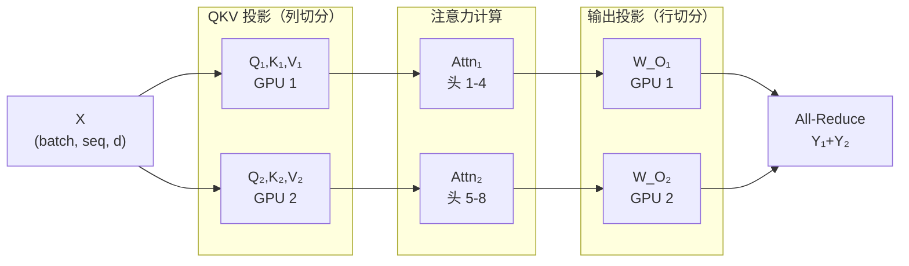
*图：Attention 层的切分*

张量并行的优势在于切分粒度细，各 GPU 负载均衡，适合超大单层（如 175B 模型的 FFN）。它的代价是 GPU 间通信十分频繁，每一层的前向和反向传播都需要 [All-Reduce](#all-reduce) 操作来汇总结果，因此对 GPU 之间的通信带宽非常敏感，通常需要有 NVIDIA NVLink、昇腾 HCCS 这样的高带宽互联才能发挥优势。

### 三维并行

实际训练大模型时，单独使用一种并行策略往往是不够的，现代大模型训练通常组合使用数据并行（DP）、流水线并行（PP）和张量并行（TP），即三维并行的训练策略。

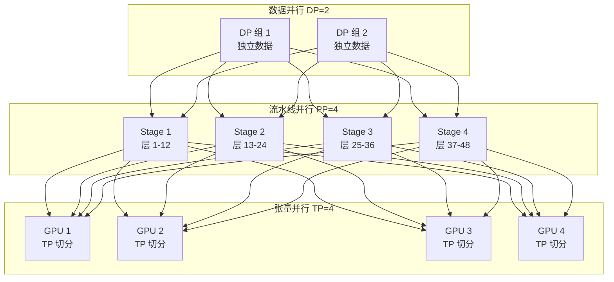
*图：三维并行训练策略*

以 GPT-3 175B 为例，假如使用 1024 张 GPU 进行训练，一种典型的配置是 TP = 8（每个张量并行组 8 张 GPU，利用 NVLink 高带宽通信）、PP = 4（4 个流水线阶段，每个阶段约 24 层）、DP = 32（32 个数据并行副本，处理不同数据）。总 GPU 数 = TP × PP × DP = $8 \times 4 \times 32$ = $1024$。

三维并行的配置不是随意选择的，需要考虑几个约束：张量并行度应与同一节点内的 GPU 数匹配（因为 TP 每一层都需要 All-Reduce，对通信带宽极其敏感，必须使用节点内高带宽互联，跨节点延迟难以接受），流水线并行度受模型层数限制（PP=4 至少需要 4 组可均分的层），数据并行度则取决于可用总 GPU 数（DP = 总 GPU 数 / (TP × PP)）。根据模型规模，推荐的并行策略如下：

| 模型规模 | 推荐策略 | 原因 |
|:---------|:---------|:-----|
| < 1B | DP | 单 GPU 可容纳，DP 最简单 |
| 1B - 10B | DP + PP | 需要跨 GPU，但通信开销可控 |
| 10B - 100B | DP + PP + TP | 需要细粒度切分 |
| > 100B | DP + PP + TP + ZeRO | 需要极致显存优化 |

## ZeRO 优化

在标准数据并行中，每张 GPU 都存储完整的模型参数、完整的梯度和完整的优化器状态。这些数据在所有 GPU 上完全相同，存在大量冗余。以 4 张 GPU 训练 70B 模型为例，优化器状态总共 840 GB，但每张 GPU 都存了一份完整的模型，其中 3/4 是冗余的。针对这个问题，2020 年微软 DeepSpeed 团队在论文《ZeRO: Memory Optimizations Toward Training Trillion Parameter Models》中提出了 ZeRO（Zero Redundancy Optimizer），把这些冗余的数据分摊到不同 GPU 上，通过消除数据并行中的冗余存储，大幅降低了显存占用。根据优化的分布式程度不同，ZeRO 一共分为以下几个阶段：

- ZeRO-1：**优化器状态分片**

    ZeRO-1 将优化器状态切分到不同 GPU 上，单卡显存占用从 $2N + 2N + 12N = 16N$ 降低到 $2N + 2N + 12N/N_{gpu}$，其中 $N_{gpu}$ 是 GPU 数量。以 70B 模型、64 张 GPU 为例，优化器状态从 840 GB 降到约 13 GB，单卡显存从 1120 GB 降到约 293.1 GB（140 GB + 140 GB + 13.1 GB）。代价是参数更新时需要 [All-Gather](#all-reduce) 操作来收集完整的优化器状态，通信量增加约 50%。

- ZeRO-2：**梯度分片**

    ZeRO-2 在 ZeRO-1 基础上进一步将梯度切分，每个 GPU 只存储对应优化器状态部分的梯度。既然每个 GPU 只负责更新 $1/N$ 的参数，那它只需要对应部分的梯度就够了，其余梯度在反向传播完成后即可释放。这进一步将单卡显存降低到 $2N + 2N/N_{gpu} + 12N/N_{gpu}$。70B 模型在 64 张 GPU 下，降到约 155.3 GB（140 GB + 2.2 GB + 13.1 GB）。代价是反向传播完成后需要 Reduce-Scatter 操作将梯度分片到各 GPU，通信量比 ZeRO-1 又有增加（约增加 50%-100%），但仍远小于 ZeRO-3 的开销。

- ZeRO-3：**参数分片**

    ZeRO-3 将参数也切分，每个 GPU 只存储 $1/N$ 的参数。在前向和反向传播时，通过 All-Gather 操作临时获取需要的参数，计算完立即释放。工作流程是前向传播时 All-Gather 当前层参数，计算后释放。反向传播时 All-Gather 当前层参数和梯度，计算后释放。参数更新时只更新本地分片。

    ZeRO-3 将单卡显存占用降低到 $16N/N_{gpu}$，理论上 GPU 数量越多，每卡显存越小。以 70B 模型、64 张 GPU 为例，单卡显存仅需约 17.5 GB（2.2 GB + 2.2 GB + 13.1 GB），可以放入单张 A100 80GB。代价是通信量增加约 3 倍，因为前向和反向传播的每一层都需要 All-Gather 参数。下图是标准 DP 与 ZeRO-1/2/3 的单 GPU 显存占用对比，红色虚线为 A100 80GB 上限。

    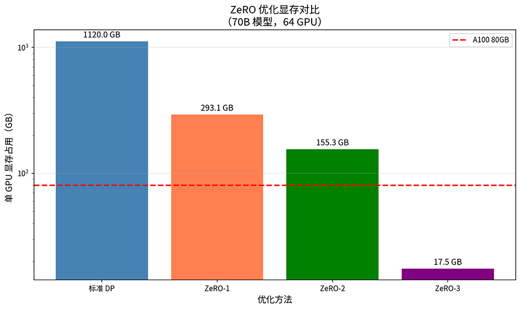

    *图：ZeRO 优化显存对比*

- ZeRO-Offload：**CPU 卸载**

当 GPU 显存仍然不够时，ZeRO-Offload 将优化器状态和梯度卸载到 CPU 内存。GPU 只保留 FP16 的模型参数和激活值，FP32 的优化器状态和梯度放在 CPU 端，在需要时通过 PCIe 传输。这种方案的代价是 CPU-GPU 数据传输成为瓶颈，训练速度会明显下降。它不属于工业级的模型训练方案，只适用于显存极度受限但可以接受较慢训练速度的场景，譬如在少量消费级 GPU 上训练大模型。

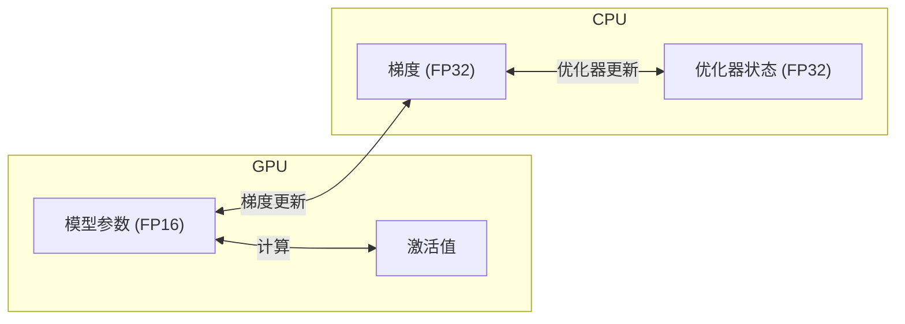
*图：ZeRO-Offload 方案*

- ZeRO-Infinity：**NVMe 卸载**

    ZeRO-Infinity 进一步将数据卸载到 NVMe SSD，利用高速存储扩展可用容量。当 CPU 内存也不够时，NVMe 卸载提供了最后一道防线，使得在有限硬件上训练超大规模模型成为可能。

## 混合精度训练

除了把模型拆分到多张 GPU 上，降低每个数值的存储精度也是节省显存开销的方法。FP32 每个数占 4 字节，FP16 只占 2 字节，切换到 FP16 立刻节省一半的显存和带宽。2017 年，NVIDIA 在论文《Mixed Precision Training》中系统提出了混合精度训练方法，此后迅速成为大模型训练的标准做法。

看到 FP16 节省内存的好处的同时，也要认识到 FP16 的表示范围相当有限，最大正常值约 65504，最小正常值约 $6 \times 10^{-5}$，精度约 3 位十进制数字。用 FP16 训练会带来两个直接后果。一是梯度下溢，深度学习中的梯度通常很小，在 $10^{-5}$ 到 $10^{-8}$ 的量级，FP16 无法精确表示这些小数值，它们会被截断为零，导致梯度消失。二是权重更新误差，FP16 精度有限，当学习率乘以梯度得到的更新量 $\epsilon \cdot g$ 很小时，$W + \epsilon \cdot g$ 的结果可能和 $W$ 完全相同，参数实际上没有更新。

对于权重更新误差问题，混合精度训练的解决方案是同时维护两套权重：一份 FP32 的主权重 $W_{master}$ 用于参数更新，一份 FP16 的工作权重 $W$ 用于前向和反向传播。每次迭代开始时，将 $W_{master}$ 转换为 FP16 得到 $W$，用 $W$ 完成前向传播和反向传播，然后将梯度转回 FP32 更新 $W_{master}$。

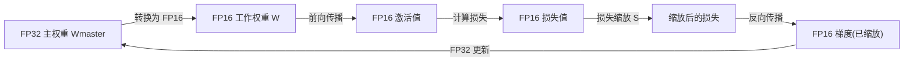
*图：混合精度训练*

这样做的好处是前向和反向传播使用 FP16，速度快又显存省。参数更新使用 FP32，精度高又不会丢失微小更新。相比纯 FP16 训练，混合精度训练仅多了一份 FP32 主权重的额外开销。相比全 FP32 训练，激活值和梯度都降为 FP16，还是节省了大量显存，总显存仍远低于全 FP32 训练。

对于梯度下溢问题，可以使用损失缩放（Loss Scaling）来解决。FP16 的最小正常值约 $6 \times 10^{-5}$，而很多梯度值比这还要小。损失缩放在反向传播前，将损失值乘以一个缩放因子 $S$，根据链式法则，所有梯度也会相应放大 $S$ 倍，从而进入 FP16 的表示范围：

$$scaled\_loss = loss \times S$$

$$scaled\_grad = \frac{\partial(scaled\_loss)}{\partial W} = grad \times S$$

反向传播完成后，将梯度除以 $S$ 恢复原始值：

$$grad = scaled\_grad / S$$

$S$ 需要足够大使梯度进入 FP16 的表示范围，但不能太大否则会导致梯度上溢（出现 inf）。实践中通常使用动态损失缩放。如果检测到梯度上溢，就将 $S$ 减半。如果连续若干步没有上溢，就将 $S$ 翻倍。如下图所示，原始梯度分布与缩放后（S=1024）梯度分布对比，红色虚线为 FP16 最小正常值，缩放使下溢比例大幅降低。

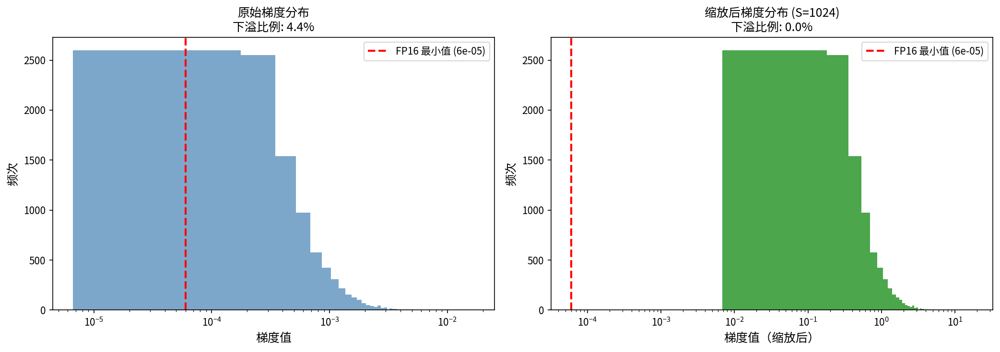

*图：损失缩放效果对比*

相比每次反向传播都要进行损失缩放，BF16 是另一种全新视角的解决方案。BF16（Brain Float 16）是 Google 为深度学习设计的浮点格式，在 2019 年的论文《A Study of BFLOAT16 for Deep Learning Training》中系统论证了其有效性。它的设计思路与 FP16 不同，FP16 用 5 位指数和 10 位尾数，牺牲了表示范围来换取精度。BF16 则用 8 位指数和 7 位尾数，牺牲了精度来换取与 FP32 相同的表示范围。

| 格式 | 符号位 | 指数位 | 尾数位 | 表示范围 |
|:-----|:-------|:-------|:-------|:---------|
| FP16 | 1 | 5 | 10 | ±65504 |
| BF16 | 1 | 8 | 7 | ±3.4e38 |
| FP32 | 1 | 8 | 23 | ±3.4e38 |

BF16 使用与 FP32 相同的 8 位指数，因此表示范围完全相同（最大约 $3.4 \times 10^{38}$），不会出现 FP16 的梯度下溢问题。这意味着使用 BF16 训练时不需要损失缩放，训练流程更简单，数值稳定性也更好，下图是 FP16、BF16、FP32 三种浮点格式的表示范围对比，BF16 与 FP32 的表示范围一致，代价是精度较低（只有 7 位尾数，而 FP16 有 10 位），可能影响某些对精度敏感的计算，同时需要 Ampere 架构及以后的 GPU 才有硬件支持。

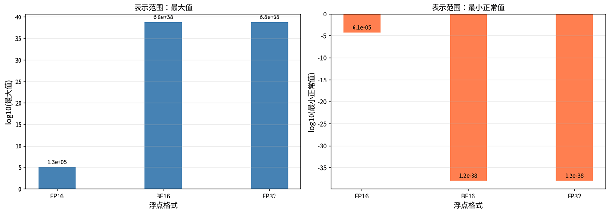

*图：浮点格式表示范围对比*

## 梯度累积与检查点

即使使用了 ZeRO 优化和混合精度，显存仍然可能不足以支持大 Batch Size 的训练。这时可以考虑引入梯度累积和梯度检查点两种互补的技术方案。梯度累积用时间换空间，在不增大显存的前提下模拟大 Batch 训练。梯度检查点则用计算换显存，通过重计算来减少激活值的存储。

- **梯度累积**（Gradient Accumulation）：假设最优的 Batch Size 是 64，但显存只够放下 Batch Size 为 4 的数据。梯度累积会连续做 16 次前向和反向传播（每次 Batch Size = 4），把梯度累加起来，最后一次性更新参数。从数学上看，这和一次使用 Batch Size = 64 的更新是等价的。从工程上看，计算量变为是原来的 16 倍。

- **梯度检查点**（Gradient Checkpointing，又称 Activation Recomputation）：标准训练中，前向传播会保存所有层的激活值，供反向传播使用。这些激活值占用大量显存，尤其是序列长度较长时。梯度检查点的做法是前向传播时只保存部分层的激活值（检查点），其余层的激活值在反向传播时重新计算。

    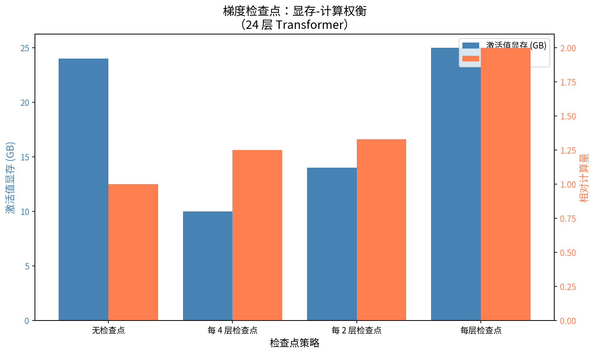

    *图：梯度检查点*

    假设模型有 $L$ 层，每层激活值大小为 $A$。标准训练需要 $L \times A$ 的激活值显存。如果每 $k$ 层保存一个检查点，激活值显存降低到 $(L/k + k) \times A$，因为只需要保存 $L/k$ 个检查点的激活值，加上任意两个检查点之间最多 $k$ 层的临时激活值。代价是需要额外的前向传播计算，训练时间增加约 20-30%。上图为 24 层 Transformer 在不同检查点策略下的激活值显存与相对计算量，蓝色为显存，橙色为计算量。

## 通信优化

分布式训练中，GPU 之间需要频繁通信来同步梯度、参数和激活值。当 GPU 数量达到数千张时，通信开销可能占据总训练时间相当大的比例。本节介绍几种减少通信开销的技术。

### All-Reduce

All-Reduce 是分布式训练中最常用的通信原语，它是指每个节点贡献一份数据，最终所有节点都获得聚合结果（如梯度的求和或平均）。最朴素的实现方案是选一个主节点，所有节点把数据发给它，它聚合后再广播给所有人。但主节点有可能会成为通信瓶颈，它的带宽决定了整个操作的速度，所以实践中更多采用 Ring All-Reduce 方案。

Ring All-Reduce 将节点组织成环形拓扑，数据沿环传递，分 Scatter-Reduce 和 All-Gather 两个阶段完成。在 Scatter-Reduce 阶段，每个节点只处理数据的 $1/N$，沿环传递并逐步累积。在 All-Gather 阶段，将聚合结果沿环广播给所有节点。Ring All-Reduce 的优势在于带宽利用率更高，每个节点同时发送和接收数据，通信负载均匀分布，没有单点瓶颈。每个节点的通信量为 $2(N-1) \times \text{数据量} / N$，当 $N$ 较大时可以近似看作 $2 \times \text{数据量}$，与节点数无关。

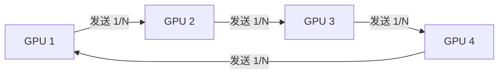
*图：Ring All-Reduce*

### 梯度压缩

当通信带宽成为瓶颈时，可以通过压缩梯度来减少传输数据量。譬如量化压缩将 FP32 梯度量化为低精度格式（如 INT8），通信量降为原来的 1/4。设 $g$ 是原始梯度，$\Delta$ 是量化步长（由梯度范围和量化位数决定），则可以通过以下公式将梯度映射到最近的整数刻度：

$$g_{quantized} = round(g / \Delta) \times \Delta$$

量化不可避免地会引入误差，但 INT8 以上的量化误差通常在可接受范围内。另一种思路是不改变数值精度，而是减少每次通信中传输的梯度数量，这种方式称为稀疏化压缩。做法是每次只发送绝对值较大的梯度，忽略小梯度。Top-K 稀疏化只保留梯度中绝对值最大的 K 个分量，通信量降为原来的 K/N（N 是梯度总维度）。为了弥补丢弃梯度带来的信息损失，会将未发送的梯度累积起来，直到进入最大的 K 个分量后被发送出去，避免信息永久丢失。下图对比了原始梯度、Top-10 稀疏化（保留 10%）和 INT8 量化三种方式的梯度分布，稀疏化减少了 90% 通信量，量化减少了 75%。

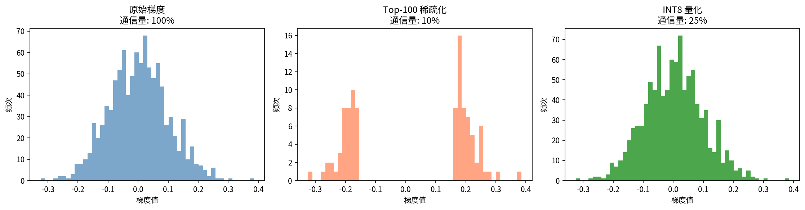

*图：梯度压缩效果对比*

### 通信与计算重叠

通信与计算重叠（Computation-Communication Overlap）是提升效率的另一条途径。一般的训练过程会先在 GPU 中完成所有计算，然后再进行通信，GPU 在通信期间处于空闲状态。重叠的思路是在反向传播过程中，一旦某层的梯度计算完成，立即开始同步该层梯度，同时继续计算下一层的梯度。这样计算和通信并行执行，通信时间被藏在计算时间里。

DeepSeek-V3 提出的 DualPipe 是一种更激进的重叠策略，它通过双流水线调度实现了前向传播、反向传播和通信的完全重叠，进一步减少了 GPU 的空闲时间，如下图所示。

```mermaid
gantt
    title 通信与计算重叠
    dateFormat X
    axisFormat %s

    section GPU 1
    Forward-1 :fw1, 0, 2s
    Backward-1 :bw1, after fw1, 2s

    section GPU 2
    Forward-2 :fw2, after fw1, 2s
    Backward-2 :bw2, after fw2, 2s

    section GPU 3
    Forward-3 :fw3, after fw2, 2s
    Backward-3 :bw3, after fw3, 2s

    section 通信
    Comm-1 :crit, c1, after fw1, 2s
    Comm-2 :crit, c2, after fw2, 2s
    Comm-3 :crit, c3, after fw3, 2s
```
*图：DualPipe*

## 本章小结

缩放定律承诺只要投入更多算力，模型性能就能持续提升，分布式训练基础设施便是兑现这一承诺的工程基础。模型从数十亿参数走向千亿、万亿，单张 GPU 的显存和算力早已力不从心，数据并行、流水线并行、张量并行与 ZeRO 优化从不同维度拆解了显存瓶颈，三维并行将它们组合成可扩展的训练方案，混合精度训练和梯度累积则在精度与效率之间找到了实用的平衡点。通信优化进一步确保了数千张 GPU 协同工作时，通信开销不会吞噬增加算力带来的收益。正是这套基础设施的存在，才使得缩放定律从纸面上的幂律曲线变成了可落地的工程实践。

## 练习题

1. 计算 70B 模型在不同并行策略下的单 GPU 显存需求：仅数据并行（假设 8 GPU）、DP + PP（流水线 4 阶段）、DP + PP + TP（PP=4, TP=8）、ZeRO-3（64 GPU）。

   

   
参考答案

   - 仅 DP：每卡 1120 GB（无法放入单 GPU）
   - DP + PP（4 阶段）：参数和梯度各分 1/4，优化器状态也分 1/4，约 $140/4 + 140/4 + 840/4 = 280$ GB
   - DP + PP + TP（TP=8）：参数和梯度各分 1/8，约 $140/8 + 140/8 + 840/8 = 140$ GB
   - ZeRO-3（64 GPU）：$1120/64 \approx 17.5$ GB，可以放入单张 A100 80GB

   

2. 分析 FP16 和 BF16 的数值特性：计算两种格式下 $a + b$ 可能产生精度损失的条件，并分析为什么 BF16 不需要损失缩放。

   

   
参考答案

   FP16 中，当 $|a|$ 和 $|b|$ 相差超过 $2^{10} = 1024$ 倍时，较小的数会被截断（因为 FP16 只有 10 位尾数）。BF16 中这个阈值降低到 $2^7 = 128$ 倍，精度更差。但 BF16 不需要损失缩放的原因是它的指数位与 FP32 相同（8 位），表示范围达到 ±3.4e38，远大于 FP16 的 ±65504，因此不会出现梯度下溢问题。

   
