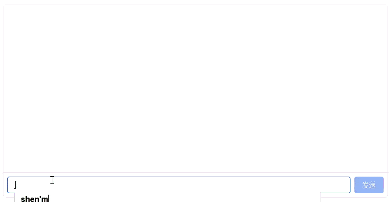

# SFT 模型对话实验

在 [Transformer 模型训练实验](../architecture-basics/llm-pretrain-experiment.md)中，我们训练了一个约 64M 参数的语言模型，能够续写出语法通顺、语义连贯的后续内容。本实验将使用监督微调，通过人工编写的指令回答对，教会模型理解"用户提问 → 模型回答"的交互格式，实现从续写到对话的转变。

## 实验准备

在开始实验之前，请确保已完成以下准备工作：

1. 已完成 [Transformer 模型训练实验](../architecture-basics/llm-pretrain-experiment.md)，模型权重文件 `pretrain_768.pth` 已在数据目录中正确生成。
2. 已[挂载数据目录](../../sandbox.md#数据管理)并下载好 SFT 训练语料。与预训练实验相同，语料数据集来自 [MiniMind](https://github.com/jingyaogong/minimind) 开源项目。

```bash
# 选择 "下载数据集" -> 选择 "MiniMind SFT (LLM监督微调语料)"
dmla data
```

MiniMind 项目的 SFT 语料文本（`sft_t2t_mini.jsonl`）包含了 90 余万条训练数据，除了对话外，还包括工具调用、思维链推理等信息，体积约 1.7 GB，与预训练数据集大小相当。如果只是要对齐模型的语言回答能力，SFT 样本数量完全可以比这个少 1-2 个数量级（数千至数万条即可）。因此，本实验从中随机抽取 5 万条样本（约 90 MB），生成了 `sft_t2t_tiny.jsonl` 用于训练。数据集下载完成后，以下代码可验证预训练模型和 SFT 语料是否完整：

```python runnable gpu
import os

# 检查预训练模型（由上一章实验生成）
pretrain_path = os.path.join(DATA_DIR, 'models', 'minimind', 'pretrain', 'pretrain_768.pth')
if os.path.exists(pretrain_path):
    size_mb = os.path.getsize(pretrain_path) / (1024 ** 2)
    print(f"预训练模型: 已存在 ({size_mb:.1f} MB)")
else:
    # 尝试 checkpoint
    for epoch in [2, 1]:
        ckp = os.path.join(DATA_DIR, 'models', 'minimind', 'pretrain', f'pretrain_epoch{epoch}.pth')
        if os.path.exists(ckp):
            size_mb = os.path.getsize(ckp) / (1024 ** 2)
            print(f"预训练模型: 使用 epoch {epoch} checkpoint ({size_mb:.1f} MB)")
            break
    else:
        print("预训练模型: 未找到！请先完成预训练实验")

# 检查 SFT 语料
sft_dir = os.path.join(DATA_DIR, 'datasets', 'minimind-sft')
if os.path.exists(sft_dir):
    print(f"SFT 语料目录: 已存在")
    for f in os.listdir(sft_dir):
        fpath = os.path.join(sft_dir, f)
        if os.path.isfile(fpath):
            size_mb = os.path.getsize(fpath) / (1024 ** 2)
            print(f"  {f}: {size_mb:.1f} MB")
else:
    print("SFT 语料: 未下载，请运行 'dmla data' 下载 MiniMind SFT 数据集")

# 检查 tokenizer（复用预训练的）
tokenizer_dir = os.path.join(DATA_DIR, 'datasets', 'minimind-pretrain')
tokenizer_json = os.path.join(tokenizer_dir, 'tokenizer.json')
tokenizer_config = os.path.join(tokenizer_dir, 'tokenizer_config.json')
print(f"Tokenizer: {'已存在' if os.path.exists(tokenizer_json) else '未找到'}")
```

## 第一阶段：监督微调数据集

下面代码实现了 SFTDataset，将对话数据转换为模型可训练的格式，主要逻辑是定位 AI 助手回答区间并生成对应的掩码。这段代码会在训练阶段被调用，无需手动运行。

```python runnable gpu extract-class="SFTDataset, pre_processing_chat"
import os
import torch
from torch.utils.data import Dataset
import json
import random
from datasets import load_dataset, Features, Value
from datasets import logging as datasets_logging

def pre_processing_chat(conversations, add_system_ratio=0.2):
    """预处理对话数据：概率性添加系统提示词"""
    # tool use 数据完整保留不做处理
    if any(conv.get('tools') for conv in conversations):
        return conversations

    SYSTEM_PROMPTS = [
        "你是一个知识丰富的AI，尽力为用户提供准确的信息。",
        "你是一个专业的AI助手，请提供有价值的回答。",
        "你是一个可靠的AI，请给出准确的回答。",
        "You are a helpful AI assistant.",
        "You are a friendly chatbot. Please answer the user's questions carefully.",
        "You are a knowledgeable AI. Try your best to provide accurate information.",
    ]
    # 概率性添加 system
    if conversations[0].get('role') != 'system':
        if random.random() < add_system_ratio:
            return [{'role': 'system', 'content': random.choice(SYSTEM_PROMPTS)}] + conversations
    return conversations


class SFTDataset(Dataset):
    """
    SFT 数据集：将对话数据 tokenize 为 ChatML 格式

    与 PretrainDataset 的主要差异：
    - 数据格式从 {"text": "..."} 变为 {"conversations": [...]}
    - 标签掩码：仅 assistant 回答部分参与 loss，其余标记为 -100（PyTorch CrossEntropyLoss 默认忽略 -100 对应的位置）
    - 使用 apply_chat_template 将对话转为 ChatML 格式
    - SFT 数据集仍然支持工具调用训练，只要将训练集从 sft_t2t_tiny.jsonl 换回带有工具调用样例的 sft_t2t_mini.jsonl 即可
    """
    # 使用 ChatML 格式：<|im_start|>role\ncontent<|im_end|>\n
    # tokenizer 本身未内置 chat_template，需手动设置
    CHATML_TEMPLATE = (
        "<|im_start|>{{ message.role }}\n"
        "{{ message.content }}<|im_end|>\n"
        ""
        "<|im_start|>assistant\n"
    )

    def __init__(self, jsonl_path, tokenizer, max_length=768):
        super().__init__()
        os.environ["TOKENIZERS_PARALLELISM"] = "false"
        self.tokenizer = tokenizer
        # Tokenizer 未内置 chat_template，需手动设置 ChatML 格式
        if not tokenizer.chat_template:
            tokenizer.chat_template = self.CHATML_TEMPLATE
        self.max_length = max_length
        features = Features({
            'conversations': [{'role': Value('string'), 'content': Value('string'),
                              'reasoning_content': Value('string'), 'tools': Value('string'),
                              'tool_calls': Value('string')}]
        })
        # 抑制 load_dataset 的 "Generating train split" 进度输出
        datasets_logging.set_verbosity_error()
        self.samples = load_dataset('json', data_files=jsonl_path, split='train', features=features)
        datasets_logging.set_verbosity_warning()
        # 预计算 assistant 回答的起止 token ID
        # 即 <|im_start|>assistant\n 对应的 token ID 序列，用于定位助手回答的起始位置
        self.bos_id = tokenizer(f'{tokenizer.bos_token}assistant\n', add_special_tokens=False).input_ids  
        # 即 <|im_end|>\n 对应的 token ID 序列，用于定位助手回答的结束位置
        self.eos_id = tokenizer(f'{tokenizer.eos_token}\n', add_special_tokens=False).input_ids  

    def __len__(self):
        return len(self.samples)

    def create_chat_prompt(self, conversations):
        """将对话列表应用 chat template 转为文本"""
        messages = []
        tools = None
        for message in conversations:
            message = dict(message)
            if message.get("role") == "system" and message.get("tools"):
                tools = json.loads(message["tools"]) if isinstance(message["tools"], str) else message["tools"]
            if message.get("tool_calls") and isinstance(message["tool_calls"], str):
                message["tool_calls"] = json.loads(message["tool_calls"])
            messages.append(message)
        return self.tokenizer.apply_chat_template(
            messages, tokenize=False, add_generation_prompt=False, tools=tools
        )

    def generate_labels(self, input_ids):
        """生成标签：assistant 回答部分保留原始 ID，其余设为 -100"""
        labels = [-100] * len(input_ids)
        i = 0
        while i < len(input_ids):
            # 检测 <|im_start|>assistant\n 的位置
            if input_ids[i:i + len(self.bos_id)] == self.bos_id:
                start = i + len(self.bos_id)
                end = start
                # 查找对应的 <|im_end|>\n
                while end < len(input_ids):
                    if input_ids[end:end + len(self.eos_id)] == self.eos_id:
                        break
                    end += 1
                # 标记回答区间（包含 eos）
                for j in range(start, min(end + len(self.eos_id), self.max_length)):
                    labels[j] = input_ids[j]
                i = end + len(self.eos_id) if end < len(input_ids) else len(input_ids)
            else:
                i += 1
        return labels

    def __getitem__(self, index):
        sample = self.samples[index]
        conversations = pre_processing_chat(sample['conversations'])
        prompt = self.create_chat_prompt(conversations)
        input_ids = self.tokenizer(prompt).input_ids[:self.max_length]
        # 填充到固定长度
        # 右侧填充至固定长度，填充部分的标签已由 generate_labels 设为 -100，不参与 loss
        input_ids += [self.tokenizer.pad_token_id] * (self.max_length - len(input_ids))  
        labels = self.generate_labels(input_ids)
        return torch.tensor(input_ids, dtype=torch.long), torch.tensor(labels, dtype=torch.long)
```

## 第二阶段：监督微调训练

本实验是监督微调训练，工程决策与[预训练实验](../architecture-basics/llm-pretrain-experiment.md)有所不同，主要差异是学习率和序列长度：

- **更小的学习率**（5e-5）：预训练用 5e-4 的学习率从随机初始化开始学习语言知识，SFT 则在预训练模型的基础上微调行为模式，过大的学习率会破坏已学到的语言能力，造成灾难性遗忘。
- **更少的训练步数**（约 3000/epoch）：SFT 数据量远小于预训练数据（万级 vs 百万级），训练太久容易过拟合，模型会记忆训练数据而非学习通用的回答能力。
- **更长的序列**（768）：对话数据通常比预训练文本更长，需要更大的序列长度来容纳多轮对话的上下文。

本实验的工程决策与原版 MiniMind 也有很大差异，原版 MiniMind 的 SFT 训练面向全量数据（约 90 余万条对话）在多 GPU 环境下运行，本实验面向教学场景，在单张消费级 GPU 上运行，因此对训练策略做了针对性调整。下表列出关键差异及调整原因：

| 训练决策 | MiniMind | 本实验 | 调整原因 |
|---------|-------------|-------|---------|
| 训练数据 | 全量 90 万条（`sft_t2t_mini.jsonl`） | 筛选后 5 万条纯对话（`sft_t2t_tiny.jsonl`） | MiniMind 数据包含大量 `tool_calls` 和推理链样本，本实验只做基础对话对齐。缩减数据量将训练时间从数小时降至约 15 分钟，适合教学演示 |
| 学习率 | 1e-5 | 5e-5 | MiniMind 在全量数据上训练约 11 万步，余弦调度有足够的步数缓慢衰减。本实验只有约 3000 步/epoch，1e-5 的学习率在几百步后就被余弦调度压到 1e-6 量级，模型几乎停止学习。提高 5 倍确保在有限的步数内仍有足够的更新幅度 |
| 学习率调度 | 纯余弦衰减 | 线性 Warmup（前 10%）+ 余弦衰减 | 纯余弦调度从第 1 步就开始衰减，步数少时学习率下降过快。加入 Warmup 阶段让模型在训练初期用逐步增大的学习率充分探索参数空间，避免学习率过早降到无效水平 |
| 梯度累积 | 1（`batch_size = 16`） | 2（`batch_size = 16`，等效 32） | MiniMind 直接用 `batch_size = 16` 每步更新一次。SFT 的序列长度 768 比预训练的 512 更长，显存占用更高，`batch_size = 32` 在 8 GB 显存下会 OOM。用 `batch_size = 16 + accumulation_steps = 2` 保持等效批大小 32，显存约 6.7 GB，8GB 显存即可运行 |
| 训练轮数 | 2 | 2 | 与 MiniMind 一致。SFT 数据量小，训练太久容易过拟合 |

这些调整是根据目的（实验、研究、生产等）、数据量、资源条件等因素做出的权衡。没有放之四海皆准的工程决策（否则就叫最佳实践了），不能抛开具体场景去谈谁的决策更好。

::: info 训练预估

`sft_t2t_tiny.jsonl` 包含约 5 万条对话样本，总数据量仅为 90 MB。按序列长度 768，批大小 16（梯度累积 × 2，等效批大小 32），2 个 epoch，约需 8 GB 显存可运行，用 RTX 5080 GPU 训练时间约为 15 分钟。

:::

```python runnable gpuonly timeout=unlimited
import os
import time
import math
import torch
import torch.nn as nn
import torch.optim as optim
from torch.utils.data import DataLoader
from contextlib import nullcontext
from transformers import AutoTokenizer

# 导入进度报告模块
from dmla_progress import ProgressReporter

# 导入共享模块
from shared.llm.mini_mind_config import MiniMindForCausalLM, MiniMindConfig
from shared.llm.sftdataset import SFTDataset

# ========== 路径配置 ==========
TOKENIZER_PATH = os.path.join(DATA_DIR, 'datasets', 'minimind-pretrain')
SFT_DATA_PATH = os.path.join(DATA_DIR, 'datasets', 'minimind-sft', 'sft_t2t_tiny.jsonl')
PRETRAIN_PATH = os.path.join(DATA_DIR, 'models', 'minimind', 'pretrain', 'pretrain_768.pth')
SAVE_DIR = os.path.join(DATA_DIR, 'models', 'minimind', 'sft')

# ========== 训练超参数 ==========
hidden_size = 768
num_hidden_layers = 8
max_seq_len = 768
batch_size = 16            # 8G 显存适配（降低 batch_size 避免显存溢出）
learning_rate = 5e-5       # SFT 学习率（比预训练的 5e-4 低一个数量级，但不至于过小）
num_epochs = 2
accumulation_steps = 2     # 梯度累积（等效 batch_size = 16 × 2 = 32）
grad_clip = 1.0
log_interval = 50
save_interval = 500

# ========== 1. 初始化环境 ==========
progress = ProgressReporter(total_steps=10, description="准备 SFT 训练环境")
progress.update(0, message="检测运行环境...")

device = torch.device('cuda' if torch.cuda.is_available() else 'cpu')
if device.type == 'cuda':
    print(f"GPU: {torch.cuda.get_device_name(0)}")
    print(f"显存: {torch.cuda.get_device_properties(0).total_memory / 1024**3:.1f} GB")
else:
    print("警告: 未检测到 GPU，训练将非常缓慢")

torch.manual_seed(42)
if device.type == 'cuda':
    torch.cuda.manual_seed(42)

# ========== 2. 加载 tokenizer 和数据 ==========
progress.update(2, message="加载 tokenizer 和 SFT 训练数据...")
tokenizer = AutoTokenizer.from_pretrained(TOKENIZER_PATH)
train_ds = SFTDataset(SFT_DATA_PATH, tokenizer, max_length=max_seq_len)
print(f"训练样本数: {len(train_ds):,}")

train_loader = DataLoader(
    train_ds, batch_size=batch_size, shuffle=True,
    num_workers=2, pin_memory=True, drop_last=True
)
total_steps_per_epoch = len(train_loader)
total_steps = num_epochs * total_steps_per_epoch
print(f"每 epoch 步数: {total_steps_per_epoch:,}")
print(f"总训练步数: {total_steps:,}")

# ========== 3. 创建模型并加载预训练权重 ==========
progress.update(4, message="创建模型并加载预训练权重...")
lm_config = MiniMindConfig(hidden_size=hidden_size, num_hidden_layers=num_hidden_layers)
model = MiniMindForCausalLM(lm_config)

# 加载预训练权重（SFT 的起点）
weight_path = None
if os.path.exists(PRETRAIN_PATH):
    weight_path = PRETRAIN_PATH
else:
    for epoch in [2, 1]:
        ckp = os.path.join(DATA_DIR, 'models', 'minimind', 'pretrain', f'pretrain_epoch{epoch}.pth')
        if os.path.exists(ckp):
            weight_path = ckp
            break

if weight_path:
    weights = torch.load(weight_path, map_location=device)
    model.load_state_dict(weights, strict=False)
    print(f"已加载预训练权重: {weight_path}")
else:
    print("未找到预训练权重，使用随机初始化")

model = model.to(device)
total_params = sum(p.numel() for p in model.parameters())
print(f"模型参数量: {total_params:,} ({total_params/1e6:.2f}M)")

# ========== 4. 配置训练组件 ==========
progress.update(6, message="配置优化器和学习率调度...")

device_type = "cuda" if device.type == "cuda" else "cpu"
autocast_ctx = nullcontext() if device_type == "cpu" else torch.amp.autocast(device_type, dtype=torch.bfloat16)

optimizer = optim.AdamW(model.parameters(), lr=learning_rate)

def get_lr(current_step, total_steps, lr):
    """线性 warmup + 余弦衰减：前 10% 步数线性升温，之后余弦衰减至初始 lr 的 10%"""
    warmup_steps = int(0.1 * total_steps)
    if current_step < warmup_steps:
        return lr * current_step / warmup_steps
    progress = (current_step - warmup_steps) / (total_steps - warmup_steps)
    return lr * (0.1 + 0.45 * (1 + math.cos(math.pi * progress)))

os.makedirs(SAVE_DIR, exist_ok=True)
progress.update(8, message="SFT 训练环境准备完成")

# ========== 5. 开始训练 ==========
progress.reset(total_steps=total_steps, description="SFT 监督微调")

global_step = 0
best_loss = float('inf')

for epoch in range(num_epochs):
    model.train()
    epoch_start = time.time()
    running_loss = 0.0
    running_logits_loss = 0.0
    log_step_count = 0

    for step, (input_ids, labels) in enumerate(train_loader):
        input_ids = input_ids.to(device)
        labels = labels.to(device)

        # 余弦学习率调度
        lr = get_lr(global_step, total_steps, learning_rate)
        for param_group in optimizer.param_groups:
            param_group['lr'] = lr

        # 前向传播（混合精度）
        with autocast_ctx:
            res = model(input_ids, labels=labels)
            # 除以累积步数，使梯度在累积多步后的均值与单步等价
            loss = res.loss / accumulation_steps  

        # 反向传播
        loss.backward()

        # 梯度累积 + 参数更新
        if (step + 1) % accumulation_steps == 0:
            torch.nn.utils.clip_grad_norm_(model.parameters(), grad_clip)
            optimizer.step()
            optimizer.zero_grad(set_to_none=True)

        # 记录损失（还原累积前的原始值）
        # 还原为单步原始 loss，用于日志记录和比较
        current_loss = loss.item() * accumulation_steps  
        current_aux = res.aux_loss.item() if res.aux_loss is not None else 0.0
        running_loss += current_loss
        running_logits_loss += (current_loss - current_aux)
        log_step_count += 1
        global_step += 1

        # 日志打印
        if global_step % log_interval == 0:
            avg_loss = running_loss / log_step_count
            avg_logits = running_logits_loss / log_step_count
            elapsed = time.time() - epoch_start
            eta_min = elapsed / max(global_step - epoch * total_steps_per_epoch, 1) * (total_steps - global_step) / 60
            print(f"Epoch[{epoch+1}/{num_epochs}] Step[{step+1}/{total_steps_per_epoch}], "
                  f"loss: {avg_loss:.4f}, logits_loss: {avg_logits:.4f}, "
                  f"lr: {lr:.8f}, eta: {eta_min:.1f}min")
            progress.update(
                global_step,
                message=f"Epoch {epoch+1}/{num_epochs}, Step {step+1}/{total_steps_per_epoch}, Loss={avg_loss:.4f}",
                extra_data={"loss": avg_loss, "lr": lr, "epoch": epoch + 1}
            )
            running_loss = 0.0
            running_logits_loss = 0.0
            log_step_count = 0

        # 周期性保存模型
        if global_step % save_interval == 0:
            model.eval()
            save_path = os.path.join(SAVE_DIR, f'sft_step{global_step}.pth')
            # 转为 FP16 并移至 CPU 保存，减少磁盘占用和显存占用
            state_dict = {k: v.half().cpu() for k, v in model.state_dict().items()}  
            torch.save(state_dict, save_path)
            print(f"  -> 保存模型: step={global_step}, loss={current_loss:.4f}")
            model.train()
            del state_dict

        del input_ids, labels, res, loss

    # 每 epoch 结束保存
    epoch_time = time.time() - epoch_start
    model.eval()
    epoch_save_path = os.path.join(SAVE_DIR, f'sft_epoch{epoch+1}.pth')
    state_dict = {k: v.half().cpu() for k, v in model.state_dict().items()}
    torch.save(state_dict, epoch_save_path)
    print(f"\nEpoch {epoch+1} 完成, 耗时 {epoch_time/60:.1f}min, 模型已保存")
    model.train()
    del state_dict

# 保存最终模型
final_path = os.path.join(SAVE_DIR, 'full_sft_768.pth')
state_dict = {k: v.half().cpu() for k, v in model.state_dict().items()}
torch.save(state_dict, final_path)
progress.complete(message=f"SFT 完成！模型已保存到 {final_path}")
print(f"\n最终模型已保存: {final_path}")
```

## 第三阶段：对话推理

SFT 训练完成后，模型学会了遵循对话格式，能够理解用户指令并给出有针对性的回答。与预训练模型只能续写文本不同，SFT 模型能够识别 `<|im_start|>user` 和 `<|im_start|>assistant` 标记，知道自己是 AI 助手，在用户提问后给出恰当的回答。

运行下方代码块后，模型将加载到沙箱中。加载完成后，可在下方的对话框中与微调后的模型进行对话。体验结束后，点击 Stop 按钮停止推理进程。

```python runnable gpuonly mode=chat
import torch
import os
from transformers import AutoTokenizer
from shared.llm.mini_mind_config import MiniMindForCausalLM, MiniMindConfig

# 加载 tokenizer
tokenizer_path = os.path.join(DATA_DIR, 'datasets', 'minimind-pretrain')
tokenizer = AutoTokenizer.from_pretrained(tokenizer_path)
# MiniMind tokenizer 未内置 chat_template，需手动设置 ChatML 格式
if not tokenizer.chat_template:
    tokenizer.chat_template = (
        "<|im_start|>{{ message.role }}\n"
        "{{ message.content }}<|im_end|>\n"
        ""
        "<|im_start|>assistant\n"
    )

# 加载 SFT 模型
device = torch.device('cuda' if torch.cuda.is_available() else 'cpu')
config = MiniMindConfig(hidden_size=768, num_hidden_layers=8)
model = MiniMindForCausalLM(config)

# 查找可用的 SFT 权重
sft_model_path = os.path.join(DATA_DIR, 'models', 'minimind', 'sft', 'full_sft_768.pth')
weight_path = None
if os.path.exists(sft_model_path):
    weight_path = sft_model_path
else:
    for epoch in [3, 2, 1]:
        ckp = os.path.join(DATA_DIR, 'models', 'minimind', 'sft', f'sft_epoch{epoch}.pth')
        if os.path.exists(ckp):
            weight_path = ckp
            break

if weight_path:
    weights = torch.load(weight_path, map_location=device)
    model.load_state_dict(weights, strict=False)
    print(f"已加载 SFT 权重: {weight_path}")
else:
    print("未找到 SFT 模型，将使用随机初始化权重")

model = model.half().to(device).eval()
print(f"模型参数量: {sum(p.numel() for p in model.parameters()) / 1e6:.2f}M")
print("对话服务已就绪")

# 定义对话函数
def chat(user_message, history=None):
    if history is None:
        history = []
    messages = [{"role": "system", "content": "你是一个有帮助的AI助手。"}]
    for h in history:
        messages.append(h)
    messages.append({"role": "user", "content": user_message})

    chat_input = tokenizer.apply_chat_template(
        messages, tokenize=False, add_generation_prompt=True
    )
    inputs = tokenizer(chat_input, return_tensors="pt", truncation=True).to(device)

    with torch.no_grad():
        generated_ids = model.generate(
            inputs=inputs["input_ids"],
            attention_mask=inputs["attention_mask"],
            max_new_tokens=512,
            temperature=0.85,
            top_p=0.85,
            top_k=50,
            do_sample=True,
            pad_token_id=tokenizer.pad_token_id,
            eos_token_id=tokenizer.eos_token_id,
            repetition_penalty=1.2
        )

    response = tokenizer.decode(
        generated_ids[0][len(inputs["input_ids"][0]):],
        skip_special_tokens=True
    )
    return response.strip()
```

::: details 运行上面代码后，点击这里进行对话
<ChatDemo />
:::

## 实验结论

本次实验在预训练模型的基础上完成了监督微调，训练完成后，以下文件将保存到数据目录：

- **模型文件**：
    - `<DATA_DIR>/models/minimind/sft/full_sft_768.pth` - 最终 SFT 权重（FP16 精度）
    - `<DATA_DIR>/models/minimind/sft/sft_epoch*.pth` - 每 epoch 结束时的 Checkpoint
    - `<DATA_DIR>/models/minimind/sft/sft_step*.pth` - 训练中间 Checkpoint

SFT 训练使模型的行为发生质变，赋予了模型对话能力，但并未显著增加知识量或推理能力。64M 参数的模型拥有的世界知识有限，回答可能存在事实错误或逻辑不严密。预训练和监督微调共同构成了语言模型训练的基础阶段。在 InstructGPT 的三阶段框架中，SFT 是第一阶段，为后续的奖励模型训练和 PPO 强化学习提供了起点，后续实验还将通过人类反馈的强化学习进一步提升模型的对齐程度。

## 运行结果

SFT 训练完成后，使用模型进行对话推理，实际运行样例如下：

