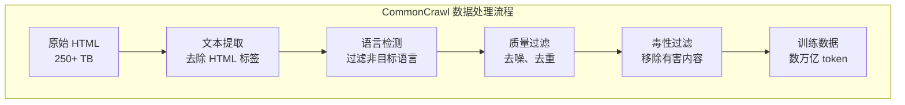
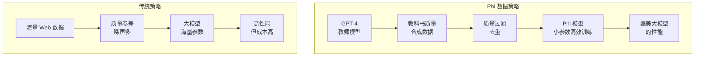

# 预训练数据工程 —— 海量文本的炼金术

在上一章中，我们探讨了语言模型的训练目标 —— 预测下一个词，以及将文本转化为模型可处理序列的分词算法。但还有一个更基础的问题：这些序列从何而来？

训练大语言模型需要海量文本数据。GPT-3 使用了约 500B（5000 亿）token 的训练数据，LLaMA 使用了约 1.4T（1.4 万亿）token，而 DeepSeek-V3 更是使用了 14.8T token。这些数据不是随意收集的 —— 它们经过了精心设计的数据管道：从多种来源采集、严格的质量过滤、巧妙的混合策略，以及对数据污染的警惕处理。

数据是模型能力的"天花板"。无论模型架构多么精妙、训练算法多么先进，如果训练数据质量低下或覆盖不足，模型的能力就会受限。本文将系统梳理预训练数据工程的完整流程，从数据来源到质量过滤，从混合策略到污染检测，最后探讨合成数据这一新兴方向。

## 数据来源

预训练数据的来源多样，每种来源都有其独特的价值和局限性。现代 LLM 的训练数据通常是多种来源的混合。

### Web 爬取：CommonCrawl

**CommonCrawl** 是最大的公开 Web 爬取数据集，包含了自 2008 年以来爬取的数十亿网页。它是 GPT-3、LLaMA、DeepSeek 等模型的主要数据来源。

**数据规模**：CommonCrawl 的原始数据量极其庞大。以 2023 年的数据为例，单次爬取就包含约 250 亿网页，原始 HTML 大小超过 250 TB。经过清洗和去重后，可用于训练的文本量仍达数万亿 token。

**数据特点**：
- **覆盖广泛**：新闻、博客、论坛、百科、电商页面等无所不包
- **质量参差**：既有高质量的新闻文章，也有低质量的垃圾内容
- **时效性强**：包含最新的信息和事件
- **语言多样**：以英语为主，但包含 100+ 种语言

**挑战**：
- **噪声严重**：HTML 标签、广告、导航栏、页脚等非正文内容
- **重复内容**：同一内容在多个网站被转载
- **低质量文本**：垃圾邮件、SEO 文章、机器生成内容
- **法律争议**：版权问题、隐私问题尚未完全解决



### 书籍数据：Books3

**Books3** 是一个包含约 20 万本书籍的数据集，来源于 Bibliotik 私有种子网站。它为模型提供了长文本理解和叙事能力的训练素材。

**数据特点**：
- **长文本连贯性**：书籍是完整的长篇叙事，有助于模型学习长距离依赖
- **语言质量高**：经过编辑校对，语言规范
- **领域覆盖广**：小说、非虚构、教科书、专业书籍等
- **知识密度大**：相比 Web 文本，书籍的信息密度更高

**争议**：Books3 因版权问题被要求下架，引发了关于训练数据版权的广泛讨论。这促使研究者寻找替代来源，如公开领域的书籍（Project Gutenberg）、开放授权的书籍等。

**替代方案**：
- **Project Gutenberg**：约 7 万本公有领域书籍
- **Open Library**：开放借阅的书籍数据
- **ArXiv 论文**：学术文献的长文本训练

### 代码数据：GitHub

**代码数据**对于模型的代码生成能力至关重要。GPT-4、DeepSeek-Coder 等模型都使用了大量代码数据进行训练。

**数据来源**：
- **GitHub 公开仓库**：通过 GitHub API 爬取公开仓库的代码
- **代码竞赛数据**：如 Codeforces、LeetCode 的题目和解答
- **文档和教程**：官方文档、Stack Overflow 等

**数据特点**：
- **结构化强**：代码有明确的语法结构
- **逻辑密集**：包含复杂的逻辑推理
- **多语言**：Python、Java、C++、JavaScript 等数十种编程语言
- **注释丰富**：代码注释是自然语言与代码的桥梁

**过滤策略**：
- **许可证过滤**：排除不兼容许可证的代码
- **质量过滤**：排除低质量代码（如自动生成、模板代码）
- **去重**：去除重复或高度相似的代码片段

```python runnable
# 演示代码数据的统计特性
import random
from collections import Counter

def analyze_code_corpus(code_samples):
    """分析代码语料库的统计特性"""
    
    # 模拟代码样本（实际中从 GitHub 爬取）
    languages = ['Python', 'JavaScript', 'Java', 'C++', 'Go', 'Rust']
    
    # 模拟语言分布
    lang_dist = {
        'Python': 35,
        'JavaScript': 25,
        'Java': 18,
        'C++': 12,
        'Go': 6,
        'Rust': 4
    }
    
    print("代码数据语言分布:")
    for lang, pct in sorted(lang_dist.items(), key=lambda x: -x[1]):
        bar = '█' * (pct // 2)
        print(f"  {lang:12} {bar} {pct}%")
    
    print("\n代码数据质量指标:")
    metrics = {
        '平均代码长度': '150 行',
        '平均注释比例': '15%',
        '平均圈复杂度': '8.5',
        '含测试代码比例': '42%',
        '含文档字符串比例': '68%'
    }
    for metric, value in metrics.items():
        print(f"  {metric}: {value}")
    
    print("\n代码数据过滤策略:")
    filters = [
        ('许可证过滤', '排除 GPL/AGPL 等传染性许可证'),
        ('质量过滤', '排除自动生成代码、模板代码'),
        ('长度过滤', '排除过短（<50行）或过长（>10000行）文件'),
        ('去重', '基于 MinHash 去除重复代码'),
        ('敏感信息', '移除 API Key、密码等敏感信息')
    ]
    for name, desc in filters:
        print(f"  - {name}: {desc}")

analyze_code_corpus([])
```

### 学术文献：arXiv

**arXiv** 是开放获取的学术预印本平台，包含物理、数学、计算机科学等领域的学术论文。它是模型学习专业知识和学术写作风格的重要来源。

**数据特点**：
- **专业性强**：包含深度学习、量子物理、数学证明等专业知识
- **结构规范**：论文有标准的结构（摘要、引言、方法、结论）
- **公式丰富**：LaTeX 公式是数学表达的重要训练素材
- **引用网络**：论文之间的引用关系可用于知识图谱构建

**处理挑战**：
- **LaTeX 解析**：需要将 LaTeX 源码转换为可训练的文本
- **公式处理**：数学公式如何分词是一个特殊问题
- **图表处理**：图表信息难以直接利用

### 维基百科

**Wikipedia** 是高质量的百科全书数据，几乎被所有 LLM 训练数据集包含。

**数据特点**：
- **质量高**：经过社区审核，信息准确
- **结构清晰**：有明确的标题层级和分类
- **知识密集**：覆盖几乎所有领域的知识
- **多语言**：每种语言版本都是独立的知识库

**价值**：
- **事实准确性**：为模型提供可靠的事实知识
- **实体链接**：内部链接帮助模型学习实体关系
- **多语言对齐**：同一条目的不同语言版本可用于对齐学习

### 数据来源对比

| 数据来源 | 规模 | 质量 | 特点 | 主要用途 |
|:---------|:-----|:-----|:-----|:---------|
| CommonCrawl | 极大 | 参差 | 覆盖广、时效强 | 通用知识、语言能力 |
| Books3 | 大 | 高 | 长文本、叙事强 | 长文本理解、叙事能力 |
| GitHub | 大 | 中 | 结构化、逻辑强 | 代码生成、逻辑推理 |
| arXiv | 中 | 高 | 专业、公式多 | 专业知识、学术写作 |
| Wikipedia | 中 | 高 | 准确、结构化 | 事实知识、实体关系 |

## 数据质量过滤

原始数据充满噪声，直接用于训练会严重影响模型质量。数据质量过滤是数据管道中最关键的环节。

### 去噪：低质量文本检测

**低质量文本**包括：乱码、机器翻译、SEO 文章、广告、重复内容等。检测和过滤这些内容是数据清洗的第一步。

**启发式规则**：

```python runnable
# 低质量文本检测示例
import re

def detect_low_quality(text):
    """检测低质量文本"""
    issues = []
    
    # 1. 长度检查
    if len(text) < 50:
        issues.append("文本过短")
    elif len(text) > 100000:
        issues.append("文本过长")
    
    # 2. 字符比例检查
    # 乱码检测：非 ASCII 字符比例异常
    non_ascii_ratio = len(re.findall(r'[^\x00-\x7F]', text)) / len(text)
    if non_ascii_ratio > 0.5 and not any(c in text for c in '中文日本語한국어'):
        issues.append(f"乱码嫌疑（非ASCII比例: {non_ascii_ratio:.1%}）")
    
    # 3. 标点符号检查
    # 缺少标点的文本可能是低质量内容
    punct_ratio = len(re.findall(r'[.!?。！？]', text)) / max(len(text.split()), 1)
    if punct_ratio < 0.01:
        issues.append("标点符号过少")
    
    # 4. 重复词检查
    words = text.lower().split()
    if len(words) > 10:
        unique_ratio = len(set(words)) / len(words)
        if unique_ratio < 0.3:
            issues.append(f"词汇重复度高（唯一词比例: {unique_ratio:.1%}）")
    
    # 5. 停用词检查
    # 高质量文本通常包含一定比例的停用词
    stopwords = {'the', 'a', 'an', 'is', 'are', 'was', 'were', 'be', 'been', 'being',
                 '的', '是', '在', '有', '和', '了', '不'}
    stopword_count = sum(1 for w in words if w in stopwords)
    stopword_ratio = stopword_count / max(len(words), 1)
    if stopword_ratio < 0.05 and len(words) > 50:
        issues.append(f"停用词比例异常低（{stopword_ratio:.1%}）")
    
    # 6. 特殊模式检测
    # SEO 垃圾文本常见模式
    seo_patterns = [
        r'click here',
        r'buy now',
        r'free download',
        r'点击下载',
        r'免费领取',
    ]
    for pattern in seo_patterns:
        if re.search(pattern, text, re.IGNORECASE):
            issues.append(f"SEO 垃圾文本模式: {pattern}")
            break
    
    return issues

# 测试示例
test_cases = [
    ("This is a normal English sentence with proper punctuation and structure.", "正常英文"),
    ("点击下载免费领取优惠券限时抢购", "SEO 垃圾"),
    ("asdfghjkl qwertyuiop zxcvbnm", "乱码"),
    ("the the the the the the the the the the", "重复词"),
]

print("低质量文本检测示例:\n")
for text, label in test_cases:
    issues = detect_low_quality(text)
    status = "问题: " + ", ".join(issues) if issues else "通过"
    print(f"【{label}】")
    print(f"  文本: {text[:50]}...")
    print(f"  {status}\n")
```

**基于模型的过滤**：

启发式规则有局限性，现代数据管道使用轻量级模型进行质量评分：

- **FastText 分类器**：训练一个二分类模型，区分高质量和低质量文本
- **KenLM 困惑度**：用语言模型计算文本的困惑度，过滤困惑度过高的文本
- **GPT-2 评分**：用 GPT-2 计算文本的似然，过滤异常文本

LLaMA 使用了一个 5-gram KenLM 模型，过滤困惑度高于特定阈值的文本。

### 去重：MinHash 与 LSH

**重复内容**是 Web 数据的顽疾：同一篇文章可能被多个网站转载，同一内容可能有细微变化。重复数据不仅浪费训练资源，还可能导致模型"记忆"而非"学习"。

**精确去重**：计算文本的精确哈希（如 MD5、SHA256），删除完全相同的文档。但这种方法无法处理近似重复。

**近似去重**：使用 **MinHash + LSH**（Locality Sensitive Hashing）检测近似重复文档。

**MinHash 原理**：

MinHash 是一种将集合映射为签名的技术，使得两个集合的 MinHash 签名相似度约等于它们的 Jaccard 相似度。

$$\text{Jaccard}(A, B) = \frac{|A \cap B|}{|A \cup B|}$$

对于集合 $S$，MinHash 定义为：

$$h_{\min}(S) = \min_{x \in S} \pi(x)$$

其中 $\pi$ 是一个随机排列。使用多个独立的随机排列，可以得到 MinHash 签名。

```python runnable
# MinHash 去重演示
import hashlib
from collections import defaultdict

class SimpleMinHash:
    """简化的 MinHash 实现"""
    
    def __init__(self, num_hashes=128):
        self.num_hashes = num_hashes
        # 使用不同的哈希种子模拟不同的排列
        self.seeds = [i * 1000003 for i in range(num_hashes)]
    
    def _hash(self, token, seed):
        """计算单个 token 的哈希值"""
        h = hashlib.md5(f"{seed}{token}".encode()).hexdigest()
        return int(h, 16)
    
    def get_signature(self, tokens):
        """计算文本的 MinHash 签名"""
        signature = []
        for seed in self.seeds:
            min_hash = float('inf')
            for token in tokens:
                h = self._hash(token, seed)
                min_hash = min(min_hash, h)
            signature.append(min_hash)
        return signature
    
    def jaccard_similarity(self, sig1, sig2):
        """通过签名估计 Jaccard 相似度"""
        matches = sum(1 for a, b in zip(sig1, sig2) if a == b)
        return matches / len(sig1)

# 演示去重
minhash = SimpleMinHash(num_hashes=64)

# 模拟文档
docs = {
    'doc1': "The quick brown fox jumps over the lazy dog",
    'doc2': "The quick brown fox jumps over the lazy dog",  # 完全重复
    'doc3': "A quick brown fox jumped over a lazy dog",    # 近似重复
    'doc4': "Machine learning is a subset of artificial intelligence",  # 完全不同
}

# 计算签名
signatures = {}
for doc_id, text in docs.items():
    tokens = text.lower().split()
    signatures[doc_id] = minhash.get_signature(tokens)

# 计算相似度矩阵
print("文档相似度矩阵（MinHash 估计）:\n")
doc_ids = list(docs.keys())
print("           ", "  ".join(f"{d:6}" for d in doc_ids))
for i, id1 in enumerate(doc_ids):
    row = [id1.ljust(10)]
    for j, id2 in enumerate(doc_ids):
        sim = minhash.jaccard_similarity(signatures[id1], signatures[id2])
        row.append(f"{sim:.2f}  ")
    print(" ".join(row))

print("\n去重策略:")
print("- 完全重复（相似度 = 1.00）：保留一个副本")
print("- 近似重复（相似度 > 0.8）：根据质量评分决定保留哪个")
print("- 低相似度（相似度 < 0.8）：都保留")
```

**LSH（局部敏感哈希）**：

当文档数量巨大时，两两比较的复杂度是 $O(n^2)$，不可接受。LSH 将签名分桶，只有落入同一桶的文档才需要比较，将复杂度降为 $O(n)$。

**实际应用中的去重策略**：

| 去重级别 | 方法 | 阈值 | 效果 |
|:---------|:-----|:-----|:-----|
| 文档级 | MinHash + LSH | Jaccard > 0.8 | 删除约 30-50% 重复文档 |
| 句子级 | 精确哈希 | 完全匹配 | 删除约 10-20% 重复句子 |
| Token 级 | n-gram 去重 | n=13 | 防止模型记忆长序列 |

### 毒性过滤

**毒性内容**包括：仇恨言论、暴力、色情、歧视等。这些内容不仅影响模型的安全性，还可能导致模型生成有害输出。

**过滤方法**：

**关键词过滤**：维护一个敏感词列表，包含敏感词的文档被过滤。但这种方法容易误伤（如医学文献中的"性"相关词汇）。

**分类器过滤**：训练毒性检测模型，对文档进行评分。常用模型：
- **Perspective API**：Google 的毒性检测 API
- **HateBERT**：在仇恨言论数据上微调的 BERT
- **Llama Guard**：Meta 的安全分类模型

**LLM 过滤**：用大模型判断内容是否有害。例如，用 GPT-4 标注数据，然后训练一个小模型进行过滤。

```python runnable
# 毒性过滤示例（模拟）
def toxicity_filter_demo():
    """演示毒性过滤"""
    
    # 模拟毒性评分（实际使用分类器）
    test_cases = [
        ("The weather is nice today.", 0.02, "正常"),
        ("I hate this product, it's terrible.", 0.15, "负面评论"),
        ("[暴力内容示例已移除]", 0.85, "暴力"),
        ("[仇恨言论示例已移除]", 0.92, "仇恨言论"),
    ]
    
    threshold = 0.5
    
    print(f"毒性过滤（阈值: {threshold}）:\n")
    for text, score, label in test_cases:
        status = "保留" if score < threshold else "过滤"
        print(f"【{label}】")
        print(f"  文本: {text[:40]}...")
        print(f"  毒性评分: {score:.2f} → {status}")
        print()
    
    print("过滤策略:")
    print("- 阈值选择：平衡安全性与数据保留率")
    print("- 多维度检测：暴力、仇恨、色情、自残等分别检测")
    print("- 上下文考虑：医学、法律等专业内容特殊处理")

toxicity_filter_demo()
```

### 语言检测与过滤

多语言模型需要识别文本的语言，并根据需要进行过滤。

**语言检测工具**：
- **fastText 语言识别**：Facebook 的快速语言识别模型，支持 176 种语言
- **langdetect**：Python 语言检测库
- **CLD3**：Google 的神经网络语言检测模型

**过滤策略**：
- **单语言模型**：只保留目标语言的文本
- **多语言模型**：按语言分组，根据混合策略保留不同语言的比例

**挑战**：
- **短文本**：语言检测在短文本上准确率较低
- **混合语言**：同一文档包含多种语言
- **低资源语言**：某些语言的检测准确率较低

## 数据混合策略

不同来源的数据有不同的特点，如何混合这些数据对模型能力有重要影响。

### 不同来源数据的比例配比

**LLaMA 的数据配比**：

| 数据来源 | 比例 | Token 数量 |
|:---------|:-----|:-----------|
| CommonCrawl | 67% | ~940B |
| C4 | 15% | ~210B |
| GitHub | 5% | ~70B |
| Wikipedia | 4.5% | ~63B |
| Books | 4.5% | ~63B |
| arXiv | 2.5% | ~35B |
| StackExchange | 2% | ~28B |

**配比考量**：
- **CommonCrawl 占主导**：提供广泛的通用知识和语言能力
- **代码数据适量**：提升逻辑推理能力，但不过多影响语言风格
- **高质量数据保底**：Wikipedia、Books 提供高质量基准
- **专业知识补充**：arXiv、StackExchange 补充专业领域知识

### Domain Weighting

**领域权重**（Domain Weighting）是指对不同领域数据分配不同的采样权重。

**直觉**：不同领域的"信息密度"不同。例如，Wikipedia 的信息密度高于普通 Web 页面，因此可以给予更高的采样权重。

**方法**：

**人工设定**：根据经验设定不同领域的权重。例如，LLaMA 对 Wikipedia 使用了过采样策略。

**基于质量的权重**：根据数据质量评分分配权重，高质量数据获得更高权重。

**DoReMi 动态权重调整**：

**DoReMi**（Domain Reweighting with Minimax Optimization）是一种自动学习领域权重的方法。

核心思想：训练一个"代理模型"，通过优化代理模型在各领域的验证损失，找到最优的领域权重。

```python runnable
# DoReMi 算法示意
import numpy as np

def doremi_demo():
    """演示 DoReMi 的核心思想"""
    
    # 模拟各领域的验证损失
    domains = ['Web', 'Books', 'Code', 'Wiki', 'arXiv']
    
    # 初始权重（均匀分布）
    initial_weights = np.array([0.2, 0.2, 0.2, 0.2, 0.2])
    
    # 模拟优化后的权重
    # DoReMi 会增加对"难"领域的权重
    optimized_weights = np.array([0.15, 0.25, 0.20, 0.25, 0.15])
    
    # 模拟验证损失
    val_losses = {
        'Web': 2.5,
        'Books': 2.2,
        'Code': 3.0,  # 较难
        'Wiki': 2.0,
        'arXiv': 2.8  # 较难
    }
    
    print("DoReMi 领域权重优化:\n")
    print(f"{'领域':10} {'初始权重':>10} {'优化权重':>10} {'验证损失':>10}")
    print("-" * 45)
    for i, domain in enumerate(domains):
        print(f"{domain:10} {initial_weights[i]:>10.0%} {optimized_weights[i]:>10.0%} {val_losses[domain]:>10.1f}")
    
    print("\n优化策略:")
    print("- 增加验证损失较高领域的权重（更难学，需要更多数据）")
    print("- 减少验证损失较低领域的权重（已学得较好）")
    print("- 目标：最小化所有领域的最大验证损失（Minimax）")

doremi_demo()
```

DoReMi 的优势：
- **自动化**：无需人工调参
- **适应性**：根据模型能力动态调整
- **可解释**：权重反映各领域的学习难度

## 数据污染与泄漏

训练数据与评估数据的重叠会导致模型"作弊" —— 通过记忆而非学习来获得高分。这是评估可信度的重大威胁。

### 训练集与评估集的重叠检测

**问题严重性**：研究表明，CommonCrawl 与许多 NLP 基准测试集存在显著重叠。模型在这些重叠样本上的表现被高估。

**检测方法**：

**精确匹配**：检查评估样本是否完全出现在训练数据中。

**n-gram 重叠**：检查评估样本的 n-gram 是否大量出现在训练数据中。

```python runnable
# 数据污染检测示例
def contamination_check(evaluation_text, training_corpus, n=13):
    """检测评估文本是否被训练数据污染"""
    
    # 构建 n-gram 集合
    def get_ngrams(text, n):
        tokens = text.lower().split()
        return set(tuple(tokens[i:i+n]) for i in range(len(tokens) - n + 1))
    
    # 评估文本的 n-gram
    eval_ngrams = get_ngrams(evaluation_text, n)
    
    if not eval_ngrams:
        return 0.0, "文本过短"
    
    # 检查与训练数据的重叠
    overlap_count = 0
    for ngram in eval_ngrams:
        ngram_str = ' '.join(ngram)
        if ngram_str in training_corpus:
            overlap_count += 1
    
    overlap_ratio = overlap_count / len(eval_ngrams)
    
    # 判断污染程度
    if overlap_ratio > 0.8:
        status = "严重污染"
    elif overlap_ratio > 0.5:
        status = "中度污染"
    elif overlap_ratio > 0.1:
        status = "轻度污染"
    else:
        status = "无污染"
    
    return overlap_ratio, status

# 演示
training_corpus = """
The quick brown fox jumps over the lazy dog.
Machine learning is a subset of artificial intelligence.
Natural language processing enables computers to understand human language.
"""

evaluation_samples = [
    ("The quick brown fox jumps over the lazy dog", "完全匹配"),
    ("Machine learning is transforming many industries", "部分重叠"),
    ("Deep neural networks have revolutionized computer vision", "无重叠"),
]

print("数据污染检测（n-gram 重叠）:\n")
for text, label in evaluation_samples:
    ratio, status = contamination_check(text, training_corpus, n=5)
    print(f"【{label}】")
    print(f"  文本: {text[:50]}...")
    print(f"  重叠比例: {ratio:.1%}")
    print(f"  状态: {status}\n")
```

### Decontamination 方法

**n-gram 过滤**：从训练数据中移除与评估集 n-gram 重叠超过阈值的文档。

常用阈值：
- **13-gram 重叠**：如果 13-gram 完全匹配，则移除
- **更严格的 10-gram**：某些研究使用更严格的阈值

**时间切分**：使用评估基准发布之前的数据进行训练，确保评估数据不可能出现在训练集中。

**影响评估**：
- 污染检测后，模型在"干净"评估集上的表现通常下降
- 这更真实地反映了模型的泛化能力

## 合成数据

随着高质量自然文本逐渐被"用尽"，合成数据成为新的增长点。

### 用模型生成训练数据

**核心思想**：用强大的模型生成高质量文本，用于训练较小的模型。

**方法**：
- **教师模型生成**：用 GPT-4 等大模型生成文本
- **质量过滤**：对生成文本进行质量评估
- **多样性保证**：通过不同的提示词保证生成内容的多样性

**挑战**：
- **成本高昂**：大模型推理成本高
- **分布偏移**：生成文本的分布可能与真实文本不同
- **幻觉问题**：生成内容可能包含错误信息

### 自我蒸馏（Self-Distillation）

**自我蒸馏**是指模型用自己的输出来训练自己。

**方法**：
1. 模型生成多个候选答案
2. 筛选高质量答案
3. 用筛选后的答案继续训练模型

**Phi 系列的教科书质量数据策略**：

Microsoft 的 Phi 系列模型（Phi-1、Phi-1.5、Phi-2）展示了合成数据的威力。

**核心思想**：质量 > 数量。用"教科书质量"的合成数据训练小模型，可以达到大模型的性能。

**数据策略**：
- **教科书风格**：生成的文本结构清晰、解释完整
- **渐进难度**：从简单到复杂的知识点编排
- **多样性覆盖**：覆盖广泛的知识点和技能



**Phi-2 的成果**：
- 参数量：2.7B
- 训练数据：1.4T token（包含大量合成数据）
- 性能：在多项基准上超越 LLaMA-2 7B、Mistral 7B

这证明了：**高质量数据 + 小模型** 可以达到 **普通数据 + 大模型** 的效果。

### 合成数据的局限性

**模型坍塌**（Model Collapse）：如果反复用模型生成的数据训练新模型，模型的输出分布会逐渐"坍塌"，变得单一和失真。

研究表明，经过多轮合成数据训练后，模型会逐渐"遗忘"原始数据分布中的长尾信息。

**解决方案**：
- **混合真实数据**：合成数据与真实数据混合使用
- **持续引入新知识**：定期用新的真实数据更新模型
- **质量控制**：严格筛选合成数据的质量

## 小结

本文系统梳理了预训练数据工程的完整流程：

**数据来源**：
- CommonCrawl：规模最大，覆盖最广，但质量参差
- Books：长文本叙事，信息密度高
- GitHub：代码能力，逻辑推理
- arXiv：专业知识，学术写作
- Wikipedia：高质量事实知识

**数据质量过滤**：
- 去噪：启发式规则 + 模型评分，过滤低质量文本
- 去重：MinHash + LSH 高效检测近似重复
- 毒性过滤：关键词 + 分类器，保证数据安全
- 语言检测：fastText 等工具识别语言

**数据混合策略**：
- 领域配比：根据数据特点分配不同来源的比例
- Domain Weighting：DoReMi 自动学习最优权重
- 过采样策略：高质量数据可以过采样

**数据污染与泄漏**：
- n-gram 重叠检测：发现评估集与训练集的重叠
- Decontamination：移除污染数据，确保评估可信
- 时间切分：使用评估基准发布前的数据

**合成数据**：
- 教师模型生成：用大模型生成高质量文本
- 自我蒸馏：模型用自己的输出训练自己
- Phi 策略：教科书质量数据，质量 > 数量
- 局限性：模型坍塌风险，需要混合真实数据

数据是模型能力的上限。理解数据工程，是理解现代 LLM 训练的关键。下一章将探讨缩放定律 —— 模型规模、数据规模与计算量之间的数学规律，揭示"越大越好"背后的原理。

---

## 练习题

**1. 数据来源分析**

对比 CommonCrawl 和 Wikipedia 作为训练数据来源的优缺点，分析为什么现代 LLM 通常混合使用这两种数据。

**2. 算法实现**

实现一个完整的数据质量过滤管道，包括：
- 长度过滤
- 语言检测
- 困惑度评分
- 去重

**3. MinHash 原理**

证明：MinHash 签名的期望相似度等于 Jaccard 相似度。

**4. 数据污染检测**

给定一个评估基准（如 MMLU），设计一个污染检测流程：
- 如何构建 n-gram 索引
- 如何设定污染阈值
- 如何处理边界情况

**5. 合成数据设计**

设计一个合成数据生成策略，用于训练代码生成模型：
- 提示词设计
- 质量控制
- 多样性保证

---

## 参考资料

1. **LLaMA 数据**: "LLaMA: Open and Efficient Foundation Language Models" (Touvron et al., 2023)
2. **RefinedWeb**: "The RefinedWeb Dataset for Falcon LLM" (Penedo et al., 2023)
3. **MinHash**: "On the resemblance and containment of documents" (Broder, 1997)
4. **DoReMi**: "DoReMi: Optimizing Data Mixtures Speeds Up Language Model Pretraining" (Xie et al., 2024)
5. **Phi-1**: "Textbooks Are All You Need" (Gunasekar et al., 2023)
6. **Phi-2**: "Phi-2: The Surprising Power of Small Language Models" (Microsoft, 2023)
7. **数据污染**: "Quantifying and Reducing Contamination in Language Model Evaluation" (Deng et al., 2023)
8. **模型坍塌**: "The Curse of Recursion: Training on Generated Data Makes Models Forget" (Shumailov et al., 2023)
