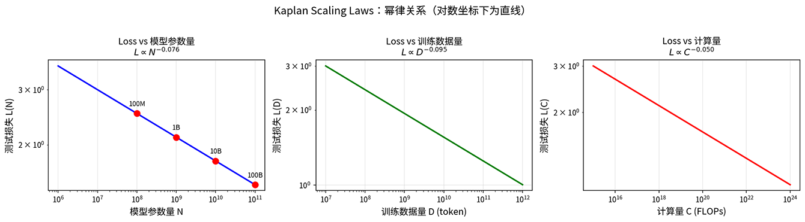
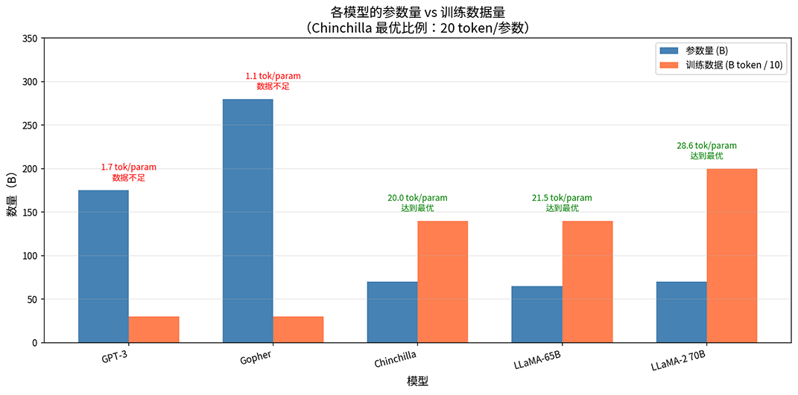
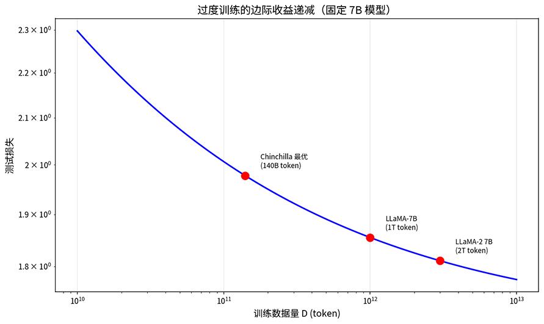
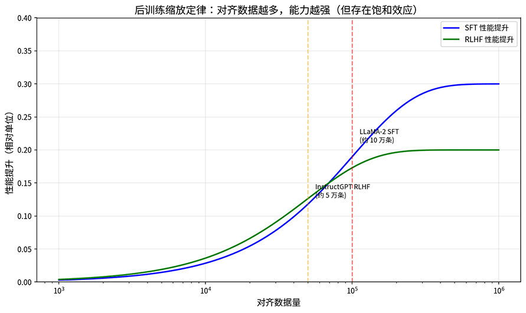
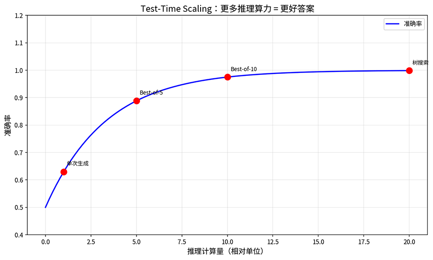

# 缩放定律

如果你手上有一笔定量的算力预算，是把算力花在堆参数上，还是喂更多数据能获得最大收益？这个问题听起来像是一条依靠经验的投资决策，实际上背后藏着精确的数学规律。

2020 年 1 月，物理学家贾里德·卡普兰（Jared Kaplan）在 OpenAI 期间与达里奥·阿莫代伊（Dario Amodei，后来创立 Anthropic）等人合作发表了论文《[Scaling Laws for Neural Language Models](https://arxiv.org/abs/2001.08361)》。他们发现语言模型的测试损失与模型参数量、训练数据量、计算量之间存在幂律关系，把规模翻 10 倍，损失就降低一个固定倍数。这就是后来被称为 Kaplan Scaling Laws 的发现，它让大语言模型的训练从"多投钱总会好一点"的经验判断，变成了可预测的工程问题。

两年后，DeepMind 的乔丹·霍夫曼（Jordan Hoffmann）等人在论文《[Training Compute-Optimal Large Language Models](https://arxiv.org/abs/2203.15556)》中推翻了卡普兰的结论。他们训练了超过 400 个模型后发现，模型参数和训练数据应该同步增长，而不是像卡普兰所说的参数比数据更重要。为验证这一点，他们训练了一个叫 Chinchilla 的 70 亿参数模型，用 1.4 万亿 token 数据训练，在相同计算预算下击败了参数量四倍于自己的 Gopher。这个发现解释了 GPT-3 等早期模型为何训练不充分，也揭示了 LLaMA 小模型配大数据策略背后的数学原理。

## Kaplan 缩放定律

卡普兰的论文之所以引起关注，是因为它回答了一个困扰整个行业的问题：模型性能的提升到底有没有规律可循？在此之前，人们知道模型越大效果越好，但"好多少"完全是黑箱。卡普兰的发现把这个黑箱打开了一半，阐明了性能的提升不是随机的，而是遵循一条精确的曲线。

数学上，幂律是指两个量之间的关系满足 $y = a \cdot x^b$，其中 $a$ 是基准系数，$b$ 是幂律指数。当 $b < 0$ 时，$x$ 越大 $y$ 越小。幂律有一个数学性质，只要两边取对数（$\log y = \log a + b \cdot \log x$）图像会变成一条斜率为 $b$ 的直线。因此只要在对数坐标系中画出散点，看图像是否直线，幂律关系就能一眼判断出来。

卡普兰发现的正是这样一组直线。设模型参数量为 $N$，参数越多模型的记忆力和表达能力越强；训练数据量为 $D$（tokens 数），数据越多模型见过的语言模式越丰富；计算量为 $C$ （FLOPs）代表投入的总算力，语言模型的测试损失与上述三者之间都存在幂律关系：

$$L(N) \propto N^{-\alpha_N}$$

$$L(D) \propto D^{-\alpha_D}$$

$$L(C) \propto C^{-\alpha_C}$$

公式中的 $\alpha$ 是幂律指数，每个维度的指数不同。幂律指数反映了各维度对损失的压缩力度，具体数值是 $\alpha_N \approx 0.076$、$\alpha_D \approx 0.095$、$\alpha_C \approx 0.050$。以参数量为例，代入公式可得模型参数增加 10 倍，损失降低到原来的 $10^{-0.076} \approx 0.84$ 倍（缩小约 $1.19$ 倍），这个比例是固定的。无论从 1M 参数增长到 10M，还是从 10B 增长到 100B，损失下降的倍数都一样。其余两个指标也具备相同规律，如下图所示。

*图：Kaplan Scaling Laws 的三条幂律关系曲线*

幂律关系揭示了参数规模增大时模型性能变化的规律，现在再来看开篇提出的问题，如果你手里有一笔定量的算力预算，应该把它花在哪里？是把预算砸在模型参数上，还是花在训练数据上？卡普兰的实验给出了一个十分明确，但后来被推翻的答案。在固定计算预算 $C$ 下，最优的模型参数量 $N_{opt}$ 和训练数据量 $D_{opt}$ 满足：

$$N_{opt} \propto C^{0.73}$$

$$D_{opt} \propto C^{0.27}$$

这个公式代入具体数字就很直观了：计算预算增加 10 倍，模型参数应该增加约 5.4 倍，而训练数据只需增加约 1.9 倍。换句话说，卡普兰认为算力应该优先花在堆参数上，训练一个更大的模型，在相对较少的数据上训练到收敛。

卡普兰的另外两个发现也为实践提供了指导。模型形状（宽度、深度、注意力头数的具体配置）对性能的影响远小于总参数量，一个 10B 参数的模型，无论是宽而浅还是窄而深，性能差异并不大。这让模型架构设计的重要性降低，只要关注总参数量就够了。另一个发现是训练曲线的可预测性，幂律关系意味着训练早期的损失曲线可以外推预测最终性能，如果曲线走势不符合预期，可以提前终止训练节省资源，而不必等到训练结束才发现效果不佳。

卡普兰的缩放定律将模型训练从经验判断推进到了定量预测，但这个结论的实验是在较小的模型上做的。卡普兰团队最大只训练了约 15 亿参数的模型，然后通过幂律外推到更大规模。这种外推隐含了幂律指数 $\alpha$ 在所有规模下都不变的假设。当模型规模跨过某个拐点，幂律指数是否还会保持恒定，当时没人能确认。

更大的争议是卡普兰的"参数比数据更重要"论断，这直接影响了 GPT-3 的训练策略。OpenAI 为 GPT-3 设计了 175B 参数，只喂了 300B tokens 的训练数据。后来 DeepMind 发现，这个工程决策是错误的，同等算力下，用更少的参数配更多的数据反而更好。

## Chinchilla 缩放定律

卡普兰的"大模型小数据"策略影响了 GPT-3 等早期模型的设计方向，到了 2022 年，这个结论被证伪了。推翻它的是 DeepMind 的乔丹·霍夫曼（Jordan Hoffmann），他在论文《[Training Compute-Optimal Large Language Models](https://arxiv.org/abs/2203.15556)》中提出了截然不同的答案。这篇论文重新讨论了在给定固定的计算预算下，模型大小和训练数据量该怎么分配才能达到最优性能。

DeepMind 内部给这篇论文起的代号 Chinchilla（毛丝鼠）。Chinchilla 的做法更彻底，训练了超过 400 个模型，规模从 7000 万到 160 亿参数，覆盖了比卡普兰更广的参数区间。在更全面的实验基础上，他们发现模型参数量 $N$ 和训练数据量 $D$ 应该同步增长：

$$N_{opt} \propto C^{0.50}$$

$$D_{opt} \propto C^{0.50}$$

这和卡普兰的结论 $N_{opt} \propto C^{0.73}, D_{opt} \propto C^{0.27}$ 形成鲜明对比。卡普兰认为算力应该优先花在参数上，Chinchilla 则认为参数和数据应该对半分。下面图片对比了多个知名模型的参数量与训练数据量比例。GPT-3 的比例仅为 1.7 tokens/参数，远低于 Chinchilla 建议的 20 tokens/参数，LLaMA 系列则接近甚至超过了这个最优比例。

*图：五个知名模型的参数量与训练数据量对比*

为了验证计算最优比例，DeepMind 专门训练了两个分别名为 Gopher 和 Chinchilla 的模型来做对比。它们拥有完全相同的计算量预算配额，只是分配方式不同。Gopher 用 280B 参数训练了 300B tokens，Chinchilla 用 70B 参数训练了 1.4T tokens。参数量只有前者的四分之一，训练数据却多了将近五倍。

结果 Chinchilla 在所有基准测试上都全面超越了 Gopher。这个实验直接证明了在相同计算预算下，"小模型配大数据"比"大模型配小数据"更有效。GPT-3 和 Gopher 的问题是参数太多而数据太少，以至于模型有足够的记忆容量，但没见过足够的知识来填满它。

相比起卡普兰的经验法则，Chinchilla 的结论"模型和数据同步增长"的理论基础要坚实许多，它不是凭直觉得出，而是从损失函数的数学形式推导的。Chinchilla 论文假设损失函数可以分解为三项之和：
$$L(N, D) = L_{irr} + \frac{A}{N^\alpha} + \frac{B}{D^\beta}$$

- $L_{irr}$ 是不可约损失（Irreducible Loss），代表数据本身的熵，无论模型多大、数据多多都无法消除这部分损失，就好比再厉害的学生也无法完全预测一篇从未见过的文章。
- $A/N^\alpha$ 是模型容量不足导致的损失，参数越多这部分越小，表示模型有更大的容量来拟合语言规律。
- $B/D^\beta$ 是数据不足导致的损失，训练数据越多这部分越小，表示模型见过了更丰富的语言现象。

三项加在一起就是模型的总损失，一部分是无法消除的，一部分靠加参数解决，一部分靠加数据解决。有了这个损失函数，就可以在固定计算预算下做最优化。语言模型的计算量大约是 $C \approx 6ND$（每个参数在每个 token 上消耗的计算量约 6 FLOPs），这个关系把 $N$ 和 $D$ 绑在一起，参数多数据少和参数少数据多可以花同样的算力。问题就变成了在 $ND = C/6$ 的约束下，怎样选 $N$ 和 $D$ 使得 $L(N, D)$ 最小。

这类带约束条件的优化问题，我们在[降维](../../statistical-learning/unsupervised-learning/dimensionality-reduction.md#pca-数学原理)和 [SVM 的对偶变换](../../statistical-learning/support-vector-machines/svm-max-margin.md#拉格朗日对偶变换)推导中都曾遇到过，解法是通过拉格朗日乘数法进行优化（推导过程略过，感兴趣的可以参考[练习题](#练习题)部分），得到最优解的比例关系：

$$N_{opt} \propto C^{\frac{\alpha}{\alpha+\beta}}, \quad D_{opt} \propto C^{\frac{\beta}{\alpha+\beta}}$$

$\alpha$ 和 $\beta$ 具有对称关系，它们应该相等，这与 Chinchilla 的实验估计出 $\alpha \approx \beta$，两个指数就各占一半的结果相吻合，也是最终结论 $N_{opt} \propto C^{0.5}, D_{opt} \propto C^{0.5}$ 的理论依据。

## 过度训练现象

Chinchilla 定律给出了计算预算理论最优的分配模型，但在实践中，许多模型选择用远超 Chinchilla 最优比例的训练数据来训练一个较小的模型，这种策略被称为**过度训练**（Over-training，中文语境下"过度"往往带有贬义，这里是技术术语，不含贬义）。过度训练听起来违反了 Chinchilla 的结论，但仔细想想其实很合理，Chinchilla 优化的是给定训练预算下达到最低损失，而实践中，需要关注的不仅是训练成本，还有推理成本。

LLaMA 是采用过度训练策略的典型代表。以 LLaMA-7B 为例，它用 7B 参数训练了 1T tokens，比例高达 143 tokens/参数，是 Chinchilla 最优比例的 7 倍。LLaMA 这样决策的理由藏在成本结构里。模型训练只发生一次，但推理会发生无数次。一个被广泛部署的模型，每天要响应数亿次请求，推理成本远超训练成本。过度训练的小模型在每次推理时都是在节省计算量，因为参数少意味着每次前向传播的计算量小。虽然训练时花费了更多的算力，但这些额外开销在推理阶段被成千上万次地赚回来。

除了推理成本，过度训练策略还带来了泛用性上的好处。小模型更容易部署在资源受限的环境里，如消费级 GPU，甚至边缘设备和移动端，在这些场景下过度训练的小模型能提供接近大模型的性能。同时小模型的推理延迟更低，适合对实时性有要求的应用。

但过度训练并非是越多越好。当训练数据远超 Chinchilla 最优比例时，性能提升的边际收益会递减。损失函数的下降速度变慢，每多喂 100B token 带来的损失降幅越来越小。这意味着过度训练存在一个甜蜜区间，考虑推理成本，训练时超过 Chinchilla 最优比例是值得的，但超太多就浪费了。下图标注点分别对应 Chinchilla 最优比例（140B tokens）、LLaMA-7B（1T tokens）和 LLaMA-2 7B（2T tokens），从 Chinchilla 最优到 LLaMA-7B 损失下降显著，而从 1T 到 2T 降幅明显减缓，体现边际收益递减规律。

*图：固定 7B 模型下损失随训练数据量的变化*

## 后训练缩放定律

预训练缩放定律揭示了模型规模与预训练性能的关系，现代 LLM 的训练并不止于预训练。预训练之后的[监督微调](supervised-finetuning.md)（SFT）和[人类反馈强化学习](../alignment/rlhf.md)（RLHF）同样需要数据投入。

后训练的目标是把一个具有知识、但除了续写外什么技能都不会（包括对话）的预训练模型，调教成一个能听懂指令、提供有用回答的助手。这个过程需要两类数据，SFT 数据是"指令 - 回答"对，教模型学会按指令行动。RLHF 数据是人类偏好对比，教模型学会生成更符合人类期望的回答。

研究发现后训练也存在缩放规律，但和预训练的幂律不同，后训练更早触及饱和。LLaMA-2 的实践表明，约 10 万条高质量 SFT 数据就足以显著提升能力。InstructGPT 的论文也显示，约 5 到 10 万条人类偏好数据就能训练出有效的奖励模型，再多投入数据，边际收益迅速递减。这意味着后训练的缩放规律更接近对数增长，初期投入少量高质量数据就能大幅提升，但很快就需要投入指数级的数据才能获得线性提升。

*图：SFT 和 RLHF 的性能提升随对齐数据量的变化*

缩放定律的讨论中经常伴随着涌现能力（Emergent Abilities）。当模型规模超过某个阈值时，某些能力似乎突然出现。譬如 Few-shot 能力在约 10B 参数时显著增强，Chain of Thought 推理在约 100B 参数时涌现，代码生成能力也在 10B 附近有质的提升。因此考量模型参数量时，要将这些涌现的跳跃点考虑进去。

但 2023 年的论文《[Are Emergent Abilities of Large Language Models a Mirage?](https://arxiv.org/abs/2304.15004)》对涌现这种说法提出了质疑。作者指出，涌现能力可能是评估指标造成的幻觉。如果用精确匹配（Exact Match）这种非连续的指标来衡量，能力的提升看起来像是从 0 跳到 1 的突变；但如果换成词元编辑距离（Token Edit Distance，指把一个序列变换成另一个序列所需的最少编辑操作次数）这种平滑指标，同样的能力提升就变成了一条平滑曲线。这个争议提醒我们，缩放定律的观察结果取决于评估方式，不同的指标可能揭示出不同的规律。

## 推理时缩放定律

前面讨论的缩放定律都发生在训练阶段，投入更多参数、更多数据、更多算力，换来模型更低的损失。但 2024 到 2025 年的研究发现，推理阶段也存在缩放定律，在推理时投入更多计算，可以获得更好的输出。这条规律被称为**推理时缩放**（Test-Time Scaling），以前的预训练和后训练阶段的缩放就被统称为**训练时缩放**（Training-Time Scaling）。

推理时缩放是指如果模型一次答不好，就让它多试几次，再从中选出最好的答案。具体的实现方式有几种。最直接的是 Best-of-N 采样策略，生成 N 个候选答案，用奖励模型或验证器选出最好的一个。更精细的方法是自一致性策略（Self-Consistency），让模型生成多条推理路径，看哪条路径的结论被多数路径支持。最复杂的是树搜索策略，用[束搜索](../../deep-learning/sequence-models/seq2seq.md#束搜索)或[蒙特卡洛树搜索](../../appendixes/numpy/probability-numpy.md#蒙特卡洛方法)（MCTS）在推理空间里做规划，每一步评估多个候选方向。自我验证策略则让模型检查自己的推理过程，发现矛盾就回头修正。这些方法的共同点是在推理时多花算力、多探索几种可能性，从而提高正确答案的概率。下图显示了单次生成、Best-of-5、Best-of-10 和树搜索四种策略的准确率增长曲线，投入更多推理算力可以获得更准确的答案，但提升幅度会逐渐趋于饱和。

*图：推理时准确率随推理计算量的增长曲线*

推理时缩放和预训练缩放不是替代关系，而是互补关系。预训练缩放在训练阶段投入算力，换来模型的通用能力，这是一次性的固定成本。推理缩放在每次推理时投入额外算力，换来特定问题的更优答案，这是可变的边际成本。模型在推理时思考更长时间，探索更多推理路径，从而获得更好的答案。这相当于在预训练缩放的基础上，又增加了一条提升性能的途径。在后面讲到推理的部分，我们还会花一章的篇幅详细介绍[推理时缩放](../reasoning/test-time-compute.md)的各种细节。

## 本章小结

缩放定律的发现历程，本质上是一个修正认知的过程。卡普兰在 2020 年发现了幂律关系，让模型训练从经验判断变成定量预测，但他认为参数比数据更重要，这个结论后来被证明是错误的。Chinchilla 在 2022 年纠正了这个错误，指出参数和数据应该同步增长，并通过 Chinchilla vs Gopher 的实验给出了直接证据。之后 LLaMA 把 Chinchilla 的结论推向了实践层面，用过度训练策略证明"理论最优"和"实际最优"不是同一件事。

这些发现共同构成了一个越来越完整的图景：语言模型的性能提升不是线性的，而是遵循幂律规律。每个阶段（预训练、后训练、推理）都有自己的缩放特点，最优的定义取决于目标。如果目标是最低训练成本，Chinchilla 已经给出了答案。如果目标是最低推理成本，过度训练给出了答案。如果目标是最好的单次推理效果，推理时缩放给出了答案。

## 练习题

1. 从 Chinchilla 损失函数 $L(N, D) = L_{irr} + A/N^\alpha + B/D^\beta$ 出发，推导计算最优比例 $N_{opt} \propto C^{\alpha/(\alpha+\beta)}$ 和 $D_{opt} \propto C^{\beta/(\alpha+\beta)}$。
   

   
参考答案

   
   固定计算预算 $C$，约束条件为 $C \approx 6ND$。用拉格朗日乘数法：
   
   设拉格朗日函数 $\Lambda = L(N, D) + \lambda(6ND - C)$。对 $N$ 和 $D$ 求偏导并令其为零，得到 $\alpha A / N^{\alpha+1} = 6\lambda D$ 和 $\beta B / D^{\beta+1} = 6\lambda N$。两式相除得到 $N^{\alpha+1}/D^{\beta+1} = \alpha A / (\beta B) \cdot D/N$，整理后可得最优比例关系。
   
   

2. 给定计算预算 $C = 10^{21}$ FLOPs，使用 Chinchilla 损失函数参数（$A=406.4, B=410.7, \alpha=0.336, \beta=0.283$），计算最优的模型参数量和训练数据量。
   

   
参考答案

   
   由 $C/6 = 1.67 \times 10^{20}$ 和最优比例 $D/N \approx 20$，可得 $N \approx 2.9 \times 10^{9}$（约 3B 参数），$D \approx 5.8 \times 10^{10}$（约 58B tokens）。
   
   
