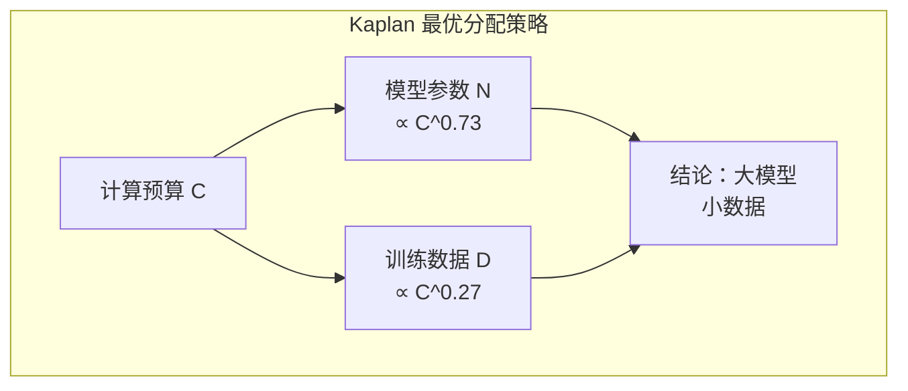
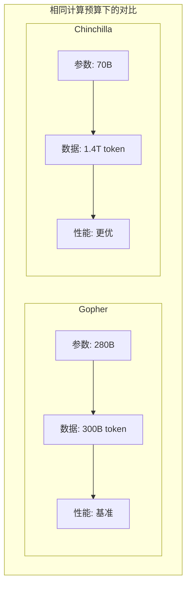
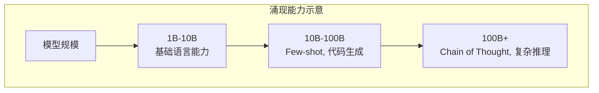

# 缩放定律 —— 越大越好的数学原理

在上一章中，我们探讨了预训练数据工程 —— 海量文本如何被收集、清洗、混合，成为模型的知识来源。但还有一个更深层的问题悬而未决：模型应该多大？训练数据应该多少？计算预算如何分配？

这些问题并非凭直觉就能回答。2020 年，OpenAI 在论文《Scaling Laws for Neural Language Models》中发现了一个惊人的规律：语言模型的性能与模型规模、数据规模、计算量之间存在**幂律关系**（Power Law）。这个发现被称为 **Kaplan Scaling Laws**，它为大语言模型的训练提供了可预测的数学框架。

两年后，DeepMind 在论文《Training Compute-Optimal Large Language Models》中提出了 **Chinchilla Scaling Laws**，修正了 Kaplan 的结论，揭示了"计算最优"的数据 - 模型比例。这个发现解释了为什么许多早期模型"过度参数化"，以及 LLaMA 如何通过"小模型配大数据"策略实现性价比突破。

本文将系统梳理缩放定律的发现历程、数学原理和实践意义，从 Kaplan 到 Chinchilla，从过度训练到推理缩放，揭示"越大越好"背后的数学规律。

## Kaplan Scaling Laws（2020）

2020 年，OpenAI 的 Jared Kaplan 等人发表了一篇具有里程碑意义的论文。他们系统研究了语言模型性能与规模的关系，发现了一个简洁而深刻的规律：**性能随规模呈幂律增长**。

### 幂律关系的发现

**幂律**（Power Law）是指两个量之间的关系可以表示为：

$$y = a \cdot x^b$$

其中 $a$ 是系数，$b$ 是指数。在对数坐标系中，幂律表现为一条直线。

Kaplan 等人的核心发现是：语言模型的测试损失（Test Loss）与模型参数量 $N$、训练数据量 $D$、计算量 $C$ 之间都存在幂律关系：

$$L(N) \propto N^{-\alpha_N}$$

$$L(D) \propto D^{-\alpha_D}$$

$$L(C) \propto C^{-\alpha_C}$$

其中 $L$ 是测试损失，$\alpha$ 是幂律指数。这意味着：模型参数增加 10 倍，损失降低一个固定的比例；训练数据增加 10 倍，损失也降低一个固定的比例。

```python runnable
import numpy as np
import matplotlib.pyplot as plt

plt.rcParams['font.sans-serif'] = ['SimHei', 'DejaVu Sans']
plt.rcParams['axes.unicode_minus'] = False

# Kaplan Scaling Laws 的幂律关系演示
# L(N) = L_0 * (N / N_0)^(-alpha)

def kaplan_loss_N(N, L0=3.0, N0=1e7, alpha=0.076):
    """Kaplan: Loss vs 模型参数量"""
    return L0 * (N / N0) ** (-alpha)

def kaplan_loss_D(D, L0=3.0, D0=1e7, alpha=0.095):
    """Kaplan: Loss vs 训练数据量"""
    return L0 * (D / D0) ** (-alpha)

def kaplan_loss_C(C, L0=3.0, C0=1e15, alpha=0.050):
    """Kaplan: Loss vs 计算量"""
    return L0 * (C / C0) ** (-alpha)

# 参数范围
N_range = np.logspace(6, 11, 100)  # 1M 到 100B 参数
D_range = np.logspace(7, 12, 100)  # 10M 到 1T token
C_range = np.logspace(15, 24, 100)  # 1 PF-day 到 1 ZF-day

fig, axes = plt.subplots(1, 3, figsize=(15, 4))

# Loss vs 模型参数量
axes[0].loglog(N_range, kaplan_loss_N(N_range), 'b-', linewidth=2)
axes[0].set_xlabel('模型参数量 N', fontsize=12)
axes[0].set_ylabel('测试损失 L(N)', fontsize=12)
axes[0].set_title('Loss vs 模型参数量\n$L \\propto N^{-0.076}$', fontsize=12)
axes[0].grid(True, alpha=0.3)

# 标注关键点
key_points = [(1e8, '100M'), (1e9, '1B'), (1e10, '10B'), (1e11, '100B')]
for N, label in key_points:
    L = kaplan_loss_N(N)
    axes[0].plot(N, L, 'ro', markersize=8)
    axes[0].annotate(label, (N, L), textcoords="offset points", xytext=(0,10), ha='center', fontsize=9)

# Loss vs 训练数据量
axes[1].loglog(D_range, kaplan_loss_D(D_range), 'g-', linewidth=2)
axes[1].set_xlabel('训练数据量 D (token)', fontsize=12)
axes[1].set_ylabel('测试损失 L(D)', fontsize=12)
axes[1].set_title('Loss vs 训练数据量\n$L \\propto D^{-0.095}$', fontsize=12)
axes[1].grid(True, alpha=0.3)

# Loss vs 计算量
axes[2].loglog(C_range, kaplan_loss_C(C_range), 'r-', linewidth=2)
axes[2].set_xlabel('计算量 C (FLOPs)', fontsize=12)
axes[2].set_ylabel('测试损失 L(C)', fontsize=12)
axes[2].set_title('Loss vs 计算量\n$L \\propto C^{-0.050}$', fontsize=12)
axes[2].grid(True, alpha=0.3)

plt.suptitle('Kaplan Scaling Laws：幂律关系', fontsize=14, y=1.02)
plt.tight_layout()
plt.savefig('/workspace/kaplan_scaling_laws.png', dpi=150, bbox_inches='tight')
plt.show()

print("Kaplan Scaling Laws 关键发现:")
print("1. Loss 与 N、D、C 都呈幂律关系（对数坐标下为直线）")
print("2. 幂律指数: alpha_N=0.076, alpha_D=0.095, alpha_C=0.050")
print("3. 这意味着：规模增加 10 倍，Loss 降低固定比例")
```

### 关键实验结论

Kaplan 等人通过大量实验，得出了一系列关键结论：

**结论一：模型大小比数据量更重要**

在固定计算预算下，增加模型参数比增加训练数据更能降低损失。Kaplan 的实验表明，最优策略是：**训练一个较大的模型，但在较少的数据上训练**。

具体来说，当计算预算固定为 $C$ 时，最优的模型参数量 $N_{opt}$ 和训练数据量 $D_{opt}$ 满足：

$$N_{opt} \propto C^{0.73}$$

$$D_{opt} \propto C^{0.27}$$

这意味着：计算预算增加 10 倍，模型参数应该增加约 5.4 倍，而训练数据只需增加约 1.9 倍。



**结论二：模型形状影响较小**

模型"形状"（宽度、深度、注意力头数）对性能的影响远小于总参数量。这意味着：一个 10B 参数的模型，无论是"宽而浅"还是"窄而深"，性能差异不大。

这个结论简化了模型设计：**关注总参数量，而非具体的架构细节**。

**结论三：训练曲线可预测**

幂律关系使得训练过程可以预测。在训练早期观察到的损失下降曲线，可以外推预测最终性能。这为训练决策提供了科学依据：**如果早期曲线不符合预期，可以提前终止训练，节省资源**。

```python runnable
import numpy as np
import matplotlib.pyplot as plt

plt.rcParams['font.sans-serif'] = ['SimHei', 'DejaVu Sans']
plt.rcParams['axes.unicode_minus'] = False

def training_curve(steps, final_loss, initial_loss=10.0, decay_rate=0.1):
    """模拟训练曲线：Loss 随训练步数下降"""
    return final_loss + (initial_loss - final_loss) * np.exp(-decay_rate * steps)

# 不同规模模型的训练曲线
steps = np.linspace(0, 50, 100)

fig, ax = plt.subplots(figsize=(10, 6))

models = [
    ('1B 参数', 2.8, 0.08),
    ('3B 参数', 2.5, 0.10),
    ('10B 参数', 2.2, 0.12),
    ('30B 参数', 2.0, 0.15),
]

for name, final_loss, decay_rate in models:
    loss = training_curve(steps, final_loss, decay_rate=decay_rate)
    ax.plot(steps, loss, linewidth=2, label=name)

ax.set_xlabel('训练步数（相对单位）', fontsize=12)
ax.set_ylabel('测试损失', fontsize=12)
ax.set_title('训练曲线可预测性：早期曲线可外推最终性能', fontsize=14)
ax.legend()
ax.grid(True, alpha=0.3)
ax.set_ylim(1.5, 10)

plt.tight_layout()
plt.savefig('/workspace/training_curve_prediction.png', dpi=150, bbox_inches='tight')
plt.show()

print("训练曲线预测的价值:")
print("1. 早期终止：如果曲线不符合预期，提前终止节省资源")
print("2. 资源规划：根据早期曲线预测最终性能，规划计算资源")
print("3. 模型选择：比较不同规模模型的训练曲线，选择最优配置")
```

### Kaplan 定律的局限性

Kaplan Scaling Laws 是一个里程碑式的发现，但它存在一个关键局限：**实验条件受限**。

Kaplan 的实验主要在较小的模型上进行（最大约 15 亿参数），然后外推到更大规模。这种外推假设幂律关系在所有规模下都成立，但实际上，当模型规模增大时，可能存在**拐点**或**饱和效应**。

更重要的是，Kaplan 的结论"模型大小比数据量更重要"在实践中被证明是**次优的**。这正是 Chinchilla 论文要修正的问题。

## Chinchilla Scaling Laws（2022）

2022 年，DeepMind 的 Hoffmann 等人发表了论文《Training Compute-Optimal Large Language Models》，提出了 **Chinchilla Scaling Laws**。这篇论文的核心问题是：**给定固定的计算预算，如何分配模型大小和训练数据量，才能达到最优性能？**

### 计算最优的数据 - 模型比例

Chinchilla 论文的关键创新是：**在更大范围的模型规模上进行实验**。Kaplan 的实验最大约 15 亿参数，而 Chinchilla 训练了超过 400 个模型，规模从 7000 万到 160 亿参数。

通过更全面的实验，Chinchilla 得出了与 Kaplan 不同的结论：

**计算最优比例**：模型参数量 $N$ 和训练数据量 $D$ 应该**同步增长**：

$$N_{opt} \propto C^{0.50}$$

$$D_{opt} \propto C^{0.50}$$

这与 Kaplan 的结论 $N_{opt} \propto C^{0.73}, D_{opt} \propto C^{0.27}$ 形成鲜明对比。Chinchilla 表明：**模型和数据同等重要**，计算预算增加时，应该同步增加模型大小和训练数据。

```nn-arch width=720
name: Kaplan vs Chinchilla 最优分配
layout: horizontal

sections:
  - name: Kaplan（2020）
    layers: [kaplan_c, kaplan_n, kaplan_d]
    row_label: "N:D = 3:1"
  - name: Chinchilla（2022）
    layers: [chin_c, chin_n, chin_d]
    row_label: "N:D = 1:1"

layers:
  - {id: kaplan_c, name: "计算预算 C", type: input, size: "固定"}
  - {id: kaplan_n, name: "模型参数 N", type: operation, size: "∝ C^0.73"}
  - {id: kaplan_d, name: "训练数据 D", type: operation, size: "∝ C^0.27"}
  
  - {id: chin_c, name: "计算预算 C", type: input, size: "固定"}
  - {id: chin_n, name: "模型参数 N", type: operation, size: "∝ C^0.50"}
  - {id: chin_d, name: "训练数据 D", type: operation, size: "∝ C^0.50"}
```

### 为什么许多模型"过度参数化"

Chinchilla 的发现揭示了一个重要问题：**许多早期模型是"过度参数化"的**。

以 GPT-3 为例：
- 参数量：175B
- 训练数据：300B token
- Chinchilla 最优比例：约 20 token/参数
- GPT-3 实际比例：约 1.7 token/参数

GPT-3 的训练数据远少于 Chinchilla 建议的最优比例。这意味着：**GPT-3 的参数没有被充分训练**，存在"浪费"。

```python runnable
import numpy as np
import matplotlib.pyplot as plt

plt.rcParams['font.sans-serif'] = ['SimHei', 'DejaVu Sans']
plt.rcParams['axes.unicode_minus'] = False

# Chinchilla 最优比例：约 20 token/参数
OPTIMAL_TOKENS_PER_PARAM = 20

models = {
    'GPT-3 (175B)': {'params': 175e9, 'tokens': 300e9, 'year': 2020},
    'GPT-NeoX (20B)': {'params': 20e9, 'tokens': 825e9, 'year': 2022},
    'LLaMA-65B': {'params': 65e9, 'tokens': 1.4e12, 'year': 2023},
    'Chinchilla (70B)': {'params': 70e9, 'tokens': 1.4e12, 'year': 2022},
    'LLaMA-2 70B': {'params': 70e9, 'tokens': 2e12, 'year': 2023},
}

fig, ax = plt.subplots(figsize=(12, 6))

names = list(models.keys())
params = [models[m]['params'] / 1e9 for m in names]  # B
tokens = [models[m]['tokens'] / 1e9 for m in names]  # B
ratios = [models[m]['tokens'] / models[m]['params'] for m in names]

x = np.arange(len(names))
width = 0.35

bars1 = ax.bar(x - width/2, params, width, label='参数量 (B)', color='steelblue')
bars2 = ax.bar(x + width/2, [t/10 for t in tokens], width, label='训练数据 (B token / 10)', color='coral')

# 添加比例标注
for i, (name, ratio) in enumerate(zip(names, ratios)):
    status = "✓" if ratio >= OPTIMAL_TOKENS_PER_PARAM else "✗"
    ax.annotate(f'{ratio:.1f} tok/param {status}', 
                xy=(i, max(params[i], tokens[i]/10) + 5),
                ha='center', fontsize=9,
                color='green' if ratio >= OPTIMAL_TOKENS_PER_PARAM else 'red')

ax.set_xlabel('模型', fontsize=12)
ax.set_ylabel('数量（B）', fontsize=12)
ax.set_title('模型参数量 vs 训练数据量\n（Chinchilla 最优比例：20 token/参数）', fontsize=14)
ax.set_xticks(x)
ax.set_xticklabels(names, rotation=15, ha='right')
ax.legend()
ax.grid(True, alpha=0.3, axis='y')

plt.tight_layout()
plt.savefig('/workspace/model_data_ratio.png', dpi=150, bbox_inches='tight')
plt.show()

print("模型参数-数据比例分析:")
print(f"Chinchilla 最优比例: {OPTIMAL_TOKENS_PER_PARAM} token/参数")
print()
for name, data in models.items():
    ratio = data['tokens'] / data['params']
    status = "达到最优" if ratio >= OPTIMAL_TOKENS_PER_PARAM else "数据不足"
    print(f"{name}:")
    print(f"  参数: {data['params']/1e9:.0f}B, 数据: {data['tokens']/1e9:.0f}B token")
    print(f"  比例: {ratio:.1f} token/参数 → {status}")
    print()
```

### Chinchilla 的实验验证

为了验证计算最优比例，DeepMind 训练了一个名为 **Chinchilla** 的模型：
- 参数量：70B
- 训练数据：1.4T token
- 计算：与 280B 参数的 Gopher 模型相同

尽管参数量只有 Gopher 的 1/4，Chinchilla 在多项基准测试上超越了 Gopher。这证明了：**在相同计算预算下，小模型配大数据优于大模型配小数据**。



### Chinchilla 定律的数学推导

Chinchilla 论文给出了计算最优比例的数学推导。核心假设是损失函数可以分解为：

$$L(N, D) = L_{irr} + \frac{A}{N^\alpha} + \frac{B}{D^\beta}$$

其中：
- $L_{irr}$ 是不可约损失（数据本身的熵）
- $A/N^\alpha$ 是模型容量不足导致的损失
- $B/D^\beta$ 是数据不足导致的损失

计算量 $C \approx 6ND$（每个参数在每个 token 上约 6 FLOPs）。固定 $C$，对 $N$ 和 $D$ 优化：

$$\min_{N, D} L(N, D) \quad \text{s.t.} \quad ND = C/6$$

通过拉格朗日乘数法，可以得到最优解：

$$N_{opt} \propto C^{\frac{\alpha}{\alpha+\beta}}, \quad D_{opt} \propto C^{\frac{\beta}{\alpha+\beta}}$$

Chinchilla 的实验估计 $\alpha \approx \beta \approx 0.5$，因此：

$$N_{opt} \propto C^{0.5}, \quad D_{opt} \propto C^{0.5}$$

```python runnable
import numpy as np
import matplotlib.pyplot as plt
from scipy.optimize import minimize

plt.rcParams['font.sans-serif'] = ['SimHei', 'DejaVu Sans']
plt.rcParams['axes.unicode_minus'] = False

def chinchilla_loss(N, D, A=406.4, B=410.7, alpha=0.336, beta=0.283, L_irr=1.69):
    """
    Chinchilla 损失函数
    L(N, D) = L_irr + A/N^alpha + B/D^beta
    """
    return L_irr + A / (N ** alpha) + B / (D ** beta)

def find_optimal_ND(C, A=406.4, B=410.7, alpha=0.336, beta=0.283):
    """给定计算预算 C，找到最优的 N 和 D"""
    # C ≈ 6 * N * D
    # 约束：N * D = C / 6
    
    def objective(x):
        N, D = x
        return chinchilla_loss(N, D, A, B, alpha, beta)
    
    def constraint(x):
        N, D = x
        return N * D - C / 6
    
    # 初始猜测
    N_init = (C / 6) ** 0.5
    D_init = (C / 6) ** 0.5
    
    result = minimize(objective, [N_init, D_init], 
                      constraints={'type': 'eq', 'fun': constraint},
                      bounds=[(1e6, 1e12), (1e6, 1e15)])
    
    return result.x

# 不同计算预算下的最优分配
C_values = np.logspace(18, 24, 20)  # 1e18 到 1e24 FLOPs

optimal_N = []
optimal_D = []
optimal_loss = []

for C in C_values:
    N, D = find_optimal_ND(C)
    optimal_N.append(N)
    optimal_D.append(D)
    optimal_loss.append(chinchilla_loss(N, D))

fig, axes = plt.subplots(1, 3, figsize=(15, 4))

# 最优 N vs C
axes[0].loglog(C_values, optimal_N, 'b-', linewidth=2)
axes[0].set_xlabel('计算预算 C (FLOPs)', fontsize=12)
axes[0].set_ylabel('最优模型参数 N', fontsize=12)
axes[0].set_title('最优模型大小 vs 计算预算', fontsize=12)
axes[0].grid(True, alpha=0.3)

# 最优 D vs C
axes[1].loglog(C_values, optimal_D, 'g-', linewidth=2)
axes[1].set_xlabel('计算预算 C (FLOPs)', fontsize=12)
axes[1].set_ylabel('最优训练数据 D (token)', fontsize=12)
axes[1].set_title('最优数据量 vs 计算预算', fontsize=12)
axes[1].grid(True, alpha=0.3)

# N:D 比例
ratio = np.array(optimal_D) / np.array(optimal_N)
axes[2].semilogx(C_values, ratio, 'r-', linewidth=2)
axes[2].axhline(y=20, color='k', linestyle='--', label='Chinchilla: 20 token/param')
axes[2].set_xlabel('计算预算 C (FLOPs)', fontsize=12)
axes[2].set_ylabel('D/N (token/参数)', fontsize=12)
axes[2].set_title('数据-模型比例', fontsize=12)
axes[2].legend()
axes[2].grid(True, alpha=0.3)

plt.suptitle('Chinchilla 最优分配：N ∝ C^0.5, D ∝ C^0.5', fontsize=14, y=1.02)
plt.tight_layout()
plt.savefig('/workspace/chinchilla_optimal.png', dpi=150, bbox_inches='tight')
plt.show()

print("Chinchilla 最优分配验证:")
print("1. 最优模型参数 N ∝ C^0.5")
print("2. 最优训练数据 D ∝ C^0.5")
print("3. 最优比例 D/N ≈ 20 token/参数（在 Chinchilla 实验条件下）")
```

## 过度训练现象

Chinchilla 定律给出了"计算最优"的模型 - 数据比例。但在实践中，许多模型选择**超过 Chinchilla 最优比例**的训练数据量，这被称为**过度训练**（Over-training）。

### 小模型配大数据的性价比

**LLaMA-1**（2023）是过度训练的典型代表。以 LLaMA-65B 为例：
- 参数量：65B
- 训练数据：1.4T token
- Chinchilla 最优数据量：约 1.3T token
- 实际比例：约 21.5 token/参数

LLaMA-65B 基本符合 Chinchilla 最优比例。但 LLaMA 的**小模型**使用了远超最优比例的数据：

| 模型 | 参数量 | 训练数据 | token/参数 | Chinchilla 最优 |
|:-----|:-------|:---------|:-----------|:----------------|
| LLaMA-7B | 7B | 1T | 143 | 约 20 |
| LLaMA-13B | 13B | 1T | 77 | 约 20 |
| LLaMA-33B | 33B | 1.4T | 42 | 约 20 |
| LLaMA-65B | 65B | 1.4T | 21.5 | 约 20 |

LLaMA-7B 使用了 **7 倍于 Chinchilla 最优**的训练数据。为什么？

**推理效率考量**：模型训练一次，但会被推理无数次。过度训练的小模型，在推理时比"计算最优"的大模型更高效。

```python runnable
import numpy as np
import matplotlib.pyplot as plt

plt.rcParams['font.sans-serif'] = ['SimHei', 'DejaVu Sans']
plt.rcParams['axes.unicode_minus'] = False

# 过度训练的性价比分析
# 假设：训练成本 ∝ N * D，推理成本 ∝ N

def training_cost(N, D):
    """训练成本（相对单位）"""
    return N * D

def inference_cost(N, num_queries):
    """推理成本（相对单位）"""
    return N * num_queries

def total_cost(N, D, num_queries):
    """总成本 = 训练成本 + 推理成本"""
    return training_cost(N, D) + inference_cost(N, num_queries)

# 固定性能目标，比较不同策略
# 假设达到相同性能需要：N * D = 常数（简化假设）
target_compute = 1e12  # 目标计算量

strategies = [
    ('Chinchilla 最优', 70e9, 1.4e12),  # N=70B, D=1.4T
    ('LLaMA-7B 过度训练', 7e9, 1e12),   # N=7B, D=1T
    ('LLaMA-13B 过度训练', 13e9, 1e12), # N=13B, D=1T
]

# 不同推理次数下的总成本
query_counts = np.logspace(3, 9, 100)  # 1K 到 1B 次查询

fig, ax = plt.subplots(figsize=(10, 6))

for name, N, D in strategies:
    costs = [total_cost(N, D, q) for q in query_counts]
    ax.loglog(query_counts, costs, linewidth=2, label=f'{name} (N={N/1e9:.0f}B)')

ax.set_xlabel('推理查询次数', fontsize=12)
ax.set_ylabel('总成本（相对单位）', fontsize=12)
ax.set_title('过度训练的性价比：推理次数足够多时，小模型更经济', fontsize=14)
ax.legend()
ax.grid(True, alpha=0.3)

# 标注交叉点
ax.axvline(x=1e6, color='red', linestyle='--', alpha=0.5)
ax.annotate('推理次数约 100 万次\n小模型开始更经济', 
            xy=(1e6, 1e18), fontsize=10, color='red')

plt.tight_layout()
plt.savefig('/workspace/overtraining_cost.png', dpi=150, bbox_inches='tight')
plt.show()

print("过度训练的性价比分析:")
print("1. 训练成本：小模型 < 大模型（因为参数少）")
print("2. 推理成本：小模型 < 大模型（因为参数少）")
print("3. 当推理次数足够多时，过度训练的小模型总成本更低")
print()
print("LLaMA 策略：用小模型 + 大数据，换取推理效率")
```

### 训练 token 数 > Chinchilla 最优比例的实践考量

过度训练有几个实践考量：

**推理成本主导**：对于广泛部署的模型（如 ChatGPT、Claude），推理成本远超训练成本。过度训练的小模型在每次推理时都节省计算，累积起来是巨大的节省。

**部署灵活性**：小模型更容易部署在资源受限的环境（边缘设备、移动端）。过度训练的小模型可以在这些场景提供接近大模型的性能。

**延迟要求**：小模型的推理延迟更低，适合实时应用。

**但过度训练也有代价**：

**训练时间更长**：更多训练数据意味着更长的训练时间。如果时间紧迫，可能无法完成过度训练。

**边际收益递减**：当训练数据远超最优比例时，性能提升的边际收益递减。损失函数的下降速度变慢。

```python runnable
import numpy as np
import matplotlib.pyplot as plt

plt.rcParams['font.sans-serif'] = ['SimHei', 'DejaVu Sans']
plt.rcParams['axes.unicode_minus'] = False

def loss_vs_data(D, N, L_irr=1.69, B=410.7, beta=0.283):
    """损失 vs 训练数据量（固定模型大小）"""
    return L_irr + B / (D ** beta)

# 固定模型大小，观察损失随数据量的变化
N = 7e9  # 7B 模型
D_range = np.logspace(10, 13, 100)  # 10B 到 10T token

losses = [loss_vs_data(D, N) for D in D_range]

fig, ax = plt.subplots(figsize=(10, 6))

ax.loglog(D_range, losses, 'b-', linewidth=2)

# 标注关键点
key_points = [
    (1.4e11, 'Chinchilla 最优\n(140B token)'),
    (1e12, 'LLaMA-7B\n(1T token)'),
    (3e12, 'LLaMA-2 7B\n(2T token)'),
]

for D, label in key_points:
    L = loss_vs_data(D, N)
    ax.plot(D, L, 'ro', markersize=10)
    ax.annotate(label, (D, L), textcoords="offset points", 
                xytext=(20, 10), fontsize=9, ha='left')

ax.set_xlabel('训练数据量 D (token)', fontsize=12)
ax.set_ylabel('测试损失', fontsize=12)
ax.set_title('过度训练的边际收益递减\n（固定 7B 模型）', fontsize=14)
ax.grid(True, alpha=0.3)

plt.tight_layout()
plt.savefig('/workspace/overtraining_diminishing.png', dpi=150, bbox_inches='tight')
plt.show()

print("过度训练的边际收益分析:")
print("1. 训练数据从 140B → 1T：损失下降显著")
print("2. 训练数据从 1T → 2T：损失下降减缓")
print("3. 边际收益递减：数据越多，额外收益越少")
print()
print("实践建议：")
print("- 如果推理成本是主要考量，过度训练是值得的")
print("- 如果训练时间紧迫，Chinchilla 最优可能更合适")
print("- 需要在训练成本、推理成本、性能之间权衡")
```

## 后训练缩放定律

预训练缩放定律揭示了模型规模与预训练性能的关系。但现代 LLM 还需要**后训练**（Post-training）：监督微调（SFT）、人类反馈强化学习（RLHF）等。后训练的缩放定律是怎样的？

### 对齐投入与能力提升的关系

后训练的目标是将预训练模型"对齐"为有用的助手。这需要：
- **SFT 数据**：指令 - 回答对
- **RLHF 数据**：人类偏好对比

研究发现，后训练也存在缩放定律：**对齐数据越多，模型能力越强**，但增长速度可能不同于预训练。

**SFT 数据量**：早期研究建议 SFT 数据量约为预训练数据的 1-5%。但 LLaMA-2 的实践表明，高质量 SFT 数据（约 10 万条）足以显著提升能力。

**RLHF 数据量**：InstructGPT 论文表明，约 10 万条人类偏好数据足以训练一个有效的奖励模型。更多数据可能带来边际收益，但成本也增加。

```python runnable
import numpy as np
import matplotlib.pyplot as plt

plt.rcParams['font.sans-serif'] = ['SimHei', 'DejaVu Sans']
plt.rcParams['axes.unicode_minus'] = False

# 后训练缩放定律（示意）
def sft_performance(data_size, max_improvement=0.3, k=1e5):
    """SFT 性能提升 vs 数据量（示意）"""
    return max_improvement * (1 - np.exp(-data_size / k))

def rlhf_performance(data_size, max_improvement=0.2, k=5e4):
    """RLHF 性能提升 vs 数据量（示意）"""
    return max_improvement * (1 - np.exp(-data_size / k))

data_sizes = np.logspace(3, 6, 100)  # 1K 到 1M

fig, ax = plt.subplots(figsize=(10, 6))

ax.semilogx(data_sizes, [sft_performance(d) for d in data_sizes], 
            'b-', linewidth=2, label='SFT 性能提升')
ax.semilogx(data_sizes, [rlhf_performance(d) for d in data_sizes], 
            'g-', linewidth=2, label='RLHF 性能提升')

# 标注关键点
ax.axvline(x=1e5, color='red', linestyle='--', alpha=0.5)
ax.annotate('LLaMA-2 SFT\n(约 10 万条)', xy=(1e5, 0.2), 
            textcoords="offset points", xytext=(10, 10), fontsize=9)

ax.axvline(x=5e4, color='orange', linestyle='--', alpha=0.5)
ax.annotate('InstructGPT RLHF\n(约 5 万条)', xy=(5e4, 0.15), 
            textcoords="offset points", xytext=(10, -20), fontsize=9)

ax.set_xlabel('对齐数据量', fontsize=12)
ax.set_ylabel('性能提升（相对单位）', fontsize=12)
ax.set_title('后训练缩放定律：对齐数据越多，能力越强\n（但存在饱和效应）', fontsize=14)
ax.legend()
ax.grid(True, alpha=0.3)
ax.set_ylim(0, 0.4)

plt.tight_layout()
plt.savefig('/workspace/post_training_scaling.png', dpi=150, bbox_inches='tight')
plt.show()

print("后训练缩放定律观察:")
print("1. SFT 数据：约 10 万条高质量数据足以显著提升")
print("2. RLHF 数据：约 5-10 万条人类偏好数据足够")
print("3. 存在饱和效应：数据量超过一定阈值后，收益递减")
print("4. 数据质量比数量更重要：高质量小数据 > 低质量大数据")
```

### Emergent Abilities 的争议

缩放定律的一个有趣现象是**涌现能力**（Emergent Abilities）：当模型规模超过某个阈值时，某些能力突然出现。

**典型例子**：
- **Few-shot Learning**：模型规模超过约 10B 参数时，Few-shot 能力显著增强
- **Chain of Thought**：模型规模超过约 100B 参数时，CoT 推理能力涌现
- **代码生成**：模型规模超过约 10B 参数时，代码生成能力显著提升



**争议**：2023 年的论文《Are Emergent Abilities of Large Language Models a Mirage?》提出，涌现能力可能是评估指标的"幻觉" —— 如果使用平滑的评估指标（如 Token Edit Distance），能力的提升是平滑的，而非突然涌现。

这个争议提醒我们：**缩放定律的观察依赖于评估方式**。不同的评估指标可能揭示不同的规律。

## 推理阶段缩放定律

预训练缩放定律和后训练缩放定律都关注训练阶段。但 2024-2025 年的研究发现，**推理阶段**也存在缩放定律：**更多推理算力 = 更好答案**。

### Test-Time Scaling

**Test-Time Scaling**（推理时缩放）的核心思想是：在推理时投入更多计算，可以获得更好的输出。

**实现方式**：
- **Best-of-N 采样**：生成 N 个候选答案，选择最好的一个
- **自一致性**（Self-Consistency）：生成多个推理路径，投票选择答案
- **树搜索**：使用 Beam Search 或 MCTS 探索推理空间
- **自我验证**：模型检查自己的推理过程，纠错改进

```python runnable
import numpy as np
import matplotlib.pyplot as plt

plt.rcParams['font.sans-serif'] = ['SimHei', 'DejaVu Sans']
plt.rcParams['axes.unicode_minus'] = False

def test_time_scaling(compute, base_accuracy=0.5, k=0.3):
    """推理时缩放：准确率 vs 推理计算量"""
    return base_accuracy + (1 - base_accuracy) * (1 - np.exp(-k * compute))

compute_range = np.linspace(0, 20, 100)

fig, ax = plt.subplots(figsize=(10, 6))

ax.plot(compute_range, [test_time_scaling(c) for c in compute_range], 
        'b-', linewidth=2, label='准确率')

# 标注不同策略
strategies = [
    (1, '单次生成'),
    (5, 'Best-of-5'),
    (10, 'Best-of-10'),
    (20, '树搜索'),
]

for compute, label in strategies:
    acc = test_time_scaling(compute)
    ax.plot(compute, acc, 'ro', markersize=10)
    ax.annotate(label, (compute, acc), textcoords="offset points", 
                xytext=(5, 10), fontsize=9)

ax.set_xlabel('推理计算量（相对单位）', fontsize=12)
ax.set_ylabel('准确率', fontsize=12)
ax.set_title('Test-Time Scaling：更多推理算力 = 更好答案', fontsize=14)
ax.legend()
ax.grid(True, alpha=0.3)
ax.set_ylim(0.4, 1.0)

plt.tight_layout()
plt.savefig('/workspace/test_time_scaling.png', dpi=150, bbox_inches='tight')
plt.show()

print("Test-Time Scaling 的意义:")
print("1. 推理时投入更多计算，可以获得更好的输出")
print("2. 实现方式：Best-of-N、自一致性、树搜索、自我验证")
print("3. 与预训练缩放互补：可以在推理时"购买"额外能力")
print("4. o1/o3 模型的核心：用推理算力换取推理能力")
```

### 与预训练缩放的互补

Test-Time Scaling 与预训练缩放是**互补**的：

| 维度 | 预训练缩放 | 推理缩放 |
|:-----|:-----------|:---------|
| 投入时机 | 训练阶段 | 推理阶段 |
| 投入形式 | 更多参数、更多数据 | 更多采样、更多搜索 |
| 成本结构 | 固定成本（训练一次） | 可变成本（每次推理） |
| 适用场景 | 通用能力提升 | 特定任务优化 |

**o1/o3 模型**（2024-2025）的核心创新就是：**用推理缩放补充预训练缩放**。这些模型在推理时"思考"更长时间，探索更多推理路径，从而获得更好的答案。

这将在第 11 章"Test-Time Compute Scaling"中详细探讨。

## 小结

本文系统梳理了缩放定律的发现历程和核心内容：

**Kaplan Scaling Laws（2020）**：
- 语言模型性能与模型规模、数据规模、计算量呈幂律关系
- 模型大小比数据量更重要（后被 Chinchilla 修正）
- 训练曲线可预测，早期观察可外推最终性能

**Chinchilla Scaling Laws（2022）**：
- 计算最优比例：$N \propto C^{0.5}$, $D \propto C^{0.5}$
- 模型和数据同等重要，应同步增长
- 许多早期模型"过度参数化"，训练数据不足

**过度训练现象**：
- 小模型配大数据，推理效率更高
- LLaMA 策略：用过度训练换取推理效率
- 边际收益递减：数据越多，额外收益越少

**后训练缩放定律**：
- 对齐数据越多，能力越强，但存在饱和效应
- 数据质量比数量更重要
- 涌现能力的争议：可能是评估指标的"幻觉"

**推理阶段缩放定律**：
- Test-Time Scaling：更多推理算力 = 更好答案
- 实现方式：Best-of-N、自一致性、树搜索、自我验证
- 与预训练缩放互补：o1/o3 的核心创新

缩放定律为大语言模型的训练提供了科学指导。理解这些规律，是理解现代 LLM 训练的关键。下一章将探讨分布式训练基础设施 —— 如何让数千张 GPU 协同工作，实现缩放定律所预测的性能提升。

---

## 练习题

**1. 理论推导**

从 Chinchilla 损失函数 $L(N, D) = L_{irr} + A/N^\alpha + B/D^\beta$ 出发，推导计算最优比例 $N_{opt} \propto C^{\alpha/(\alpha+\beta)}$ 和 $D_{opt} \propto C^{\beta/(\alpha+\beta)}$。

**2. 数值实验**

给定计算预算 $C = 10^{21}$ FLOPs，使用 Chinchilla 损失函数参数，计算最优的模型参数量和训练数据量。

**3. 对比分析**

对比 GPT-3（175B 参数，300B token）和 Chinchilla（70B 参数，1.4T token）的训练策略，分析为什么 Chinchilla 在相同计算预算下性能更优。

**4. 过度训练分析**

假设一个 7B 模型在 1T token 上训练（LLaMA-7B 策略），另一个 70B 模型在 1.4T token 上训练（Chinchilla 策略）。计算两个模型在 100 万次推理查询下的总成本差异。

**5. 缩放定律拟合**

设计一个实验：用不同规模的小模型（1M 到 100M 参数）训练，记录最终损失，拟合 Kaplan 幂律关系 $L(N) \propto N^{-\alpha}$，估计 $\alpha$ 的值。

---

## 参考资料

1. **Kaplan Scaling Laws**: "Scaling Laws for Neural Language Models" (Kaplan et al., 2020)
2. **Chinchilla 论文**: "Training Compute-Optimal Large Language Models" (Hoffmann et al., 2022)
3. **GPT-3 论文**: "Language Models are Few-Shot Learners" (Brown et al., 2020)
4. **LLaMA 论文**: "LLaMA: Open and Efficient Foundation Language Models" (Touvron et al., 2023)
5. **涌现能力争议**: "Are Emergent Abilities of Large Language Models a Mirage?" (Schaeffer et al., 2023)
6. **InstructGPT 论文**: "Training Language Models to Follow Instructions with Human Feedback" (Ouyang et al., 2022)
7. **LLaMA-2 论文**: "Llama 2: Open Foundation and Fine-Tuned Chat Models" (Touvron et al., 2023)
