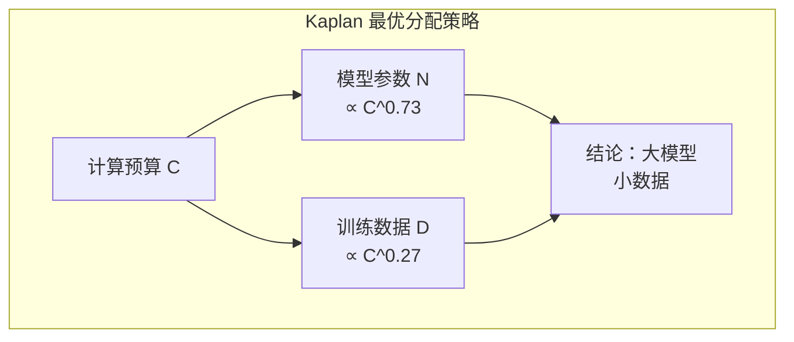
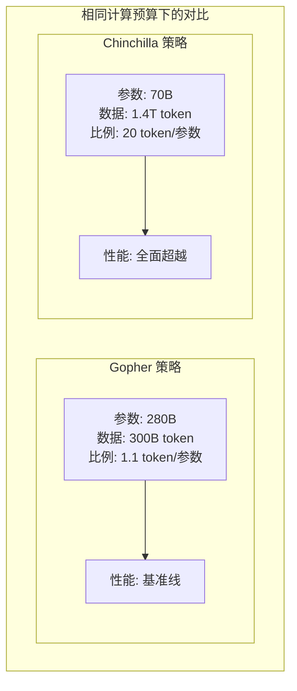
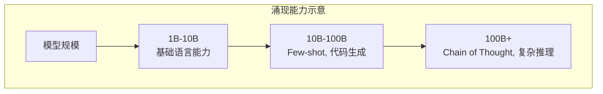

# 缩放定律

本节我们来讨论一个计算成本分配的现实的问题。如果你手上有一定量的算力，是把算力花在堆参数上，还是喂更多数据上能获得更大收益？这个问题听起来像是工程决策，实际上背后藏着一条精确的数学规律。

2020 年 1 月，物理学家贾里德·卡普兰（Jared Kaplan）在 OpenAI 期间与达里奥·阿莫代伊（Dario Amodei，后来创立 Anthropic）等人合作发表了论文《Scaling Laws for Neural Language Models》。他们发现语言模型的测试损失与模型参数量、训练数据量、计算量之间存在幂律关系，把规模翻 10 倍，损失就下降一个固定比例。这就是后来被称为 Kaplan Scaling Laws 的发现，它让大语言模型的训练从"多投钱总会好一点"的经验判断，变成了可预测的工程问题。

两年后，DeepMind 的乔丹·霍夫曼（Jordan Hoffmann）等人在论文《Training Compute-Optimal Large Language Models》中推翻了 Kaplan 的一个重要结论。他们训练了超过 400 个模型后发现，模型参数和训练数据应该同步增长，而不是像 Kaplan 所说的参数比数据更重要。为验证这一点，他们训练了一个叫 Chinchilla 的 70 亿参数模型，用 1.4 万亿 token 数据训练，在相同计算预算下击败了参数量四倍于自己的 Gopher。这个发现解释了 GPT-3 等早期模型为何训练不充分，也揭示了 LLaMA 小模型配大数据策略背后的数学原理。

## Kaplan Scaling Laws

Kaplan 的论文之所以引起轰动，是因为它回答了一个困扰整个行业的问题：模型性能的提升到底有没有规律可循？在此之前，人们知道模型越大效果越好，但"好多少"完全是黑箱。Kaplan 的发现把这个黑箱打开了一半：性能的提升不是随机的，而是遵循一条精确的曲线。

### 幂律关系的发现

要理解 Kaplan 的发现，先得理解什么是幂律。幂律在生活中并不罕见：城市人口排名里，第一名的人口大约是第二名的两倍、第四名的四倍；地震能量每增加一级，发生频率降低约十倍；个人财富排名里，最富有的 1% 拥有远超比例的资产。这些现象的共同特征是：两个量之间的关系可以写成

$$y = a \cdot x^b$$

这个公式看着简单，拆开来看含义很直观：
- $x$ 是驱动变量（城市规模、地震级别、资产排名）
- $y$ 是被驱动的量（人口、频率、财富份额）
- $a$ 是基准系数，决定了曲线的起始位置
- $b$ 是幂律指数，决定了曲线的陡峭程度
- 当 $b$ 为负数时，$x$ 越大 $y$ 越小，这正是 Kaplan 发现的规律形状

幂律有一个方便的数学性质：在对数坐标系中，$y = a \cdot x^b$ 变成 $\log y = \log a + b \cdot \log x$，也就是一条斜率为 $b$ 的直线。这意味着只要在对数坐标纸上画出来，幂律关系肉眼就能判断：如果是直线，就是幂律；如果是曲线，就不是。

Kaplan 发现的正是这样一组直线。语言模型的测试损失与模型参数量 $N$、训练数据量 $D$、计算量 $C$ 之间都存在幂律关系：

$$L(N) \propto N^{-\alpha_N}$$

$$L(D) \propto D^{-\alpha_D}$$

$$L(C) \propto C^{-\alpha_C}$$

这三个公式看着相似，拆开来看含义各有侧重：
- $L$ 是测试损失，衡量模型预测下一个 token 的不确定性，损失越低模型越准确
- $N$ 是模型参数量，参数越多模型的"记忆力"和"表达能力"越强
- $D$ 是训练数据量（token 数），数据越多模型见过的语言模式越丰富
- $C$ 是计算量（FLOPs），代表投入的总算力
- $\alpha$ 是幂律指数，每个维度的指数不同，反映了各维度对损失的"压缩力度"
- 负号表示规模越大，损失越低 —— 这是缩放定律最直觉的含义

幂律指数的具体数值是 $\alpha_N \approx 0.076$、$\alpha_D \approx 0.095$、$\alpha_C \approx 0.050$。这些数值看起来很小，但它们的含义并不小：模型参数增加 10 倍，损失降低 $10^{0.076} \approx 1.19$ 倍，这个比例是固定的。无论从 1M 参数增长到 10M，还是从 10B 增长到 100B，损失下降的倍数都一样。

下面的代码模拟了 Kaplan 的三条幂律曲线。在对数坐标系中，每条曲线都是一条直线，直线的斜率对应幂律指数。

```python runnable
import numpy as np
import matplotlib.pyplot as plt

plt.rcParams['font.sans-serif'] = ['SimHei', 'DejaVu Sans']
plt.rcParams['axes.unicode_minus'] = False

# Kaplan Scaling Laws 的幂律关系：L(X) = L0 * (X / X0)^(-alpha)
# 在对数坐标下表现为直线，斜率就是幂律指数

def kaplan_loss_N(N, L0=3.0, N0=1e7, alpha=0.076):
    """Loss 随模型参数量下降的关系"""
    return L0 * (N / N0) ** (-alpha)

def kaplan_loss_D(D, L0=3.0, D0=1e7, alpha=0.095):
    """Loss 随训练数据量下降的关系"""
    return L0 * (D / D0) ** (-alpha)

def kaplan_loss_C(C, L0=3.0, C0=1e15, alpha=0.050):
    """Loss 随计算量下降的关系"""
    return L0 * (C / C0) ** (-alpha)

# 模型参数量从 1M 到 100B，数据量从 10M 到 1T token
N_range = np.logspace(6, 11, 100)
D_range = np.logspace(7, 12, 100)
C_range = np.logspace(15, 24, 100)

fig, axes = plt.subplots(1, 3, figsize=(15, 4))

# 绘制 Loss vs 模型参数量（对数坐标）
axes[0].loglog(N_range, kaplan_loss_N(N_range), 'b-', linewidth=2)
axes[0].set_xlabel('模型参数量 N', fontsize=12)
axes[0].set_ylabel('测试损失 L(N)', fontsize=12)
axes[0].set_title('Loss vs 模型参数量\n$L \\propto N^{-0.076}$', fontsize=12)
axes[0].grid(True, alpha=0.3)

# 在曲线上标注几个关键规模
for N, label in [(1e8, '100M'), (1e9, '1B'), (1e10, '10B'), (1e11, '100B')]:
    L = kaplan_loss_N(N)
    axes[0].plot(N, L, 'ro', markersize=8)
    axes[0].annotate(label, (N, L), textcoords="offset points", xytext=(0,10), ha='center', fontsize=9)

# 绘制 Loss vs 训练数据量
axes[1].loglog(D_range, kaplan_loss_D(D_range), 'g-', linewidth=2)
axes[1].set_xlabel('训练数据量 D (token)', fontsize=12)
axes[1].set_ylabel('测试损失 L(D)', fontsize=12)
axes[1].set_title('Loss vs 训练数据量\n$L \\propto D^{-0.095}$', fontsize=12)
axes[1].grid(True, alpha=0.3)

# 绘制 Loss vs 计算量
axes[2].loglog(C_range, kaplan_loss_C(C_range), 'r-', linewidth=2)
axes[2].set_xlabel('计算量 C (FLOPs)', fontsize=12)
axes[2].set_ylabel('测试损失 L(C)', fontsize=12)
axes[2].set_title('Loss vs 计算量\n$L \\propto C^{-0.050}$', fontsize=12)
axes[2].grid(True, alpha=0.3)

plt.suptitle('Kaplan Scaling Laws：幂律关系（对数坐标下为直线）', fontsize=14, y=1.02)
plt.tight_layout()
plt.savefig('/workspace/kaplan_scaling_laws.png', dpi=150, bbox_inches='tight')
plt.show()

# 用具体数字验证幂律的"固定倍数"性质
print("幂律的固定倍数验证:")
for scale in [10, 100, 1000]:
    N_loss_ratio = kaplan_loss_N(1e7) / kaplan_loss_N(1e7 * scale)
    D_loss_ratio = kaplan_loss_D(1e7) / kaplan_loss_D(1e7 * scale)
    print(f"规模增加 {scale} 倍时:")
    print(f"  参数维度 Loss 下降: {N_loss_ratio:.3f} 倍 (理论值: {scale**0.076:.3f})")
    print(f"  数据维度 Loss 下降: {D_loss_ratio:.3f} 倍 (理论值: {scale**0.095:.3f})")
```

从图中可以看到三个规律：参数量、数据量、计算量各自在对数坐标下形成一条直线。参数量增加 100 倍（从 1M 到 100M），损失下降约 1.78 倍；数据量增加 100 倍，损失下降约 2.24 倍。无论在哪一段区间，同样的倍数增长带来同样的损失降幅 —— 这就是幂律的"固定比例"含义。

### 计算预算应该怎么花

幂律关系回答了"规模增大时性能如何变化"的问题，但还没有回答一个更实际的决策问题：手里有一笔固定的算力预算，应该把它花在哪里？是把预算砸在模型参数上，还是花在训练数据上？

Kaplan 的实验给出了一个明确但后来被推翻的答案。在固定计算预算 $C$ 下，最优的模型参数量 $N_{opt}$ 和训练数据量 $D_{opt}$ 满足

$$N_{opt} \propto C^{0.73}$$

$$D_{opt} \propto C^{0.27}$$

这个公式看着抽象，代入具体数字就很直观了：计算预算增加 10 倍，模型参数应该增加约 5.4 倍，而训练数据只需增加约 1.9 倍。换句话说，Kaplan 认算力应该优先花在堆参数上 —— 训练一个更大的模型，在相对较少的数据上训练到收敛。



Kaplan 的另外两个发现也为实践提供了指导。模型"形状"（宽度、深度、注意力头数的具体配置）对性能的影响远小于总参数量：一个 10B 参数的模型，无论是"宽而浅"还是"窄而深"，性能差异不大。这让架构设计变得简单 —— 关注总参数量就够了。另一个发现是训练曲线的可预测性：幂律关系意味着训练早期的损失曲线可以外推预测最终性能，如果曲线走势不符合预期，可以提前终止训练节省资源，而不必等到训练结束才发现效果不佳。

### Kaplan 定律的局限

Kaplan 的发现把大模型训练从经验判断推进到了定量预测，但这个结论有一块软肋：实验是在较小的模型上做的。Kaplan 团队最大只训练了约 15 亿参数的模型，然后通过幂律外推到更大规模。这种外推隐含了一个假设 —— 幂律指数 $\alpha$ 在所有规模下都不变。然而当模型规模跨过某个拐点，幂律指数是否还会保持恒定，当时没人能确认。

更大的问题是 Kaplan 的"参数比数据更重要"这个结论。这个结论直接影响了 GPT-3 的训练策略：OpenAI 用 175B 参数只喂了 300B token 的数据。后来 DeepMind 发现，这恰恰是次优的选择 —— 同等算力下，用更少的参数配更多的数据反而更好。这就是下一节 Chinchilla 论文要讲的故事。

## Chinchilla Scaling Laws

Kaplan 的"大模型小数据"策略影响了 GPT-3 等早期模型的设计方向，但到了 2022 年，这个结论被推翻了。推翻它的是 DeepMind 的乔丹·霍夫曼（Jordan Hoffmann）等人，他们在论文《Training Compute-Optimal Large Language Models》中提出了一个截然不同的答案。这篇论文的标题直指问题本质：给定固定的计算预算，模型大小和训练数据量该怎么分配才能达到最优性能？

### 计算最优的数据 - 模型比例

Kaplan 当年的实验范围有限，最大只训练到约 15 亿参数。Chinchilla 论文的做法更彻底：训练了超过 400 个模型，规模从 7000 万到 160 亿参数，覆盖了比 Kaplan 更广的参数区间。在更全面的实验基础上，他们发现模型参数量 $N$ 和训练数据量 $D$ 应该同步增长：

$$N_{opt} \propto C^{0.50}$$

$$D_{opt} \propto C^{0.50}$$

这两个公式和 Kaplan 的结论 $N_{opt} \propto C^{0.73}, D_{opt} \propto C^{0.27}$ 形成鲜明对比。Kaplan 认为算力应该优先砸在参数上，Chinchilla 则认为参数和数据应该对半分。用通俗的类比来说：Kaplan 的策略像是花更多的钱买一台更大的机器，然后只用少量原材料生产；Chinchilla 的策略像是买一台中等大小的机器，然后大量采购原材料让机器满负荷运转。两种策略花同样多的钱，但后者产出的产品质量更好。

下面的代码对比了多个知名模型的参数量与训练数据量比例。GPT-3 用 175B 参数只训练了 300B token，比例仅为 1.7 token/参数，远低于 Chinchilla 建议的 20 token/参数；而 LLaMA 系列则接近甚至超过了这个最优比例。

```python runnable
import numpy as np
import matplotlib.pyplot as plt

plt.rcParams['font.sans-serif'] = ['SimHei', 'DejaVu Sans']
plt.rcParams['axes.unicode_minus'] = False

# Chinchilla 最优比例：约 20 token/参数
OPTIMAL_RATIO = 20

models = {
    'GPT-3': {'params': 175e9, 'tokens': 300e9},
    'Gopher': {'params': 280e9, 'tokens': 300e9},
    'Chinchilla': {'params': 70e9, 'tokens': 1.4e12},
    'LLaMA-65B': {'params': 65e9, 'tokens': 1.4e12},
    'LLaMA-2 70B': {'params': 70e9, 'tokens': 2e12},
}

fig, ax = plt.subplots(figsize=(12, 6))

names = list(models.keys())
params = [models[m]['params'] / 1e9 for m in names]
tokens = [models[m]['tokens'] / 1e9 for m in names]
ratios = [models[m]['tokens'] / models[m]['params'] for m in names]

x = np.arange(len(names))
width = 0.35

# 参数量柱状图和训练数据柱状图
ax.bar(x - width/2, params, width, label='参数量 (B)', color='steelblue')
ax.bar(x + width/2, [t/10 for t in tokens], width, label='训练数据 (B token / 10)', color='coral')

# 标注每个模型的 token/参数比例
for i, ratio in enumerate(ratios):
    color = 'green' if ratio >= OPTIMAL_RATIO else 'red'
    mark = '达到最优' if ratio >= OPTIMAL_RATIO else '数据不足'
    ax.annotate(f'{ratio:.1f} tok/param\n{mark}', 
                xy=(i, max(params[i], tokens[i]/10) + 8),
                ha='center', fontsize=9, color=color)

ax.set_xlabel('模型', fontsize=12)
ax.set_ylabel('数量（B）', fontsize=12)
ax.set_title('各模型的参数量 vs 训练数据量\n（Chinchilla 最优比例：20 token/参数）', fontsize=14)
ax.set_xticks(x)
ax.set_xticklabels(names, rotation=15, ha='right')
ax.legend()
ax.grid(True, alpha=0.3, axis='y')

plt.tight_layout()
plt.savefig('/workspace/model_data_ratio.png', dpi=150, bbox_inches='tight')
plt.show()

print("模型参数-数据比例分析:")
for name, data in models.items():
    ratio = data['tokens'] / data['params']
    mark = "达到最优" if ratio >= OPTIMAL_RATIO else "数据不足"
    print(f"  {name}: {data['params']/1e9:.0f}B 参数, {data['tokens']/1e9:.0f}B token, 比例 {ratio:.1f} → {mark}")
```

### Chinchilla vs Gopher：一场决定性的实验

纸上得来终觉浅。为了验证计算最优比例，DeepMind 专门训练了一个叫 Chinchilla 的模型来做对比。实验的设计非常精巧：Chinchilla 和 Gopher 使用完全相同的计算量，只是把预算分配方式换了。Gopher 用 280B 参数训练了 300B token，Chinchilla 用 70B 参数训练了 1.4T token。参数量只有前者的四分之一，训练数据却多了将近五倍。

结果出乎意料又合乎逻辑：Chinchilla 在多项基准测试上全面超越了 Gopher。这个实验直接证明了在相同计算预算下，"小模型配大数据"比"大模型配小数据"更有效。GPT-3 和 Gopher 的问题是参数太多而数据太少 —— 模型有足够的"脑容量"，但没见过足够的"知识"来填满它。



### 损失函数的数学推导

Chinchilla 的"模型和数据同步增长"这个结论不是凭直觉得出的，而是从损失函数的数学形式推导出来的。Chinchilla 论文假设损失函数可以分解为三项之和：

$$L(N, D) = L_{irr} + \frac{A}{N^\alpha} + \frac{B}{D^\beta}$$

这个公式看着复杂，拆开来看含义很直观：
- $L_{irr}$ 是不可约损失（Irreducible Loss），代表数据本身的熵，无论模型多大、数据多多都无法消除这部分损失，就好比再厉害的学生也无法完全预测一篇从未见过的文章
- $A/N^\alpha$ 是模型容量不足导致的损失，参数越多这部分越小，表示模型有更多"脑容量"来记住语言规律
- $B/D^\beta$ 是数据不足导致的损失，训练数据越多这部分越小，表示模型见过了更丰富的语言现象
- 三项加在一起就是模型的总损失：一部分是无法消除的，一部分靠加参数解决，一部分靠加数据解决

有了这个损失函数，就可以在固定计算预算下做最优化。语言模型的计算量大约是 $C \approx 6ND$（每个参数在每个 token 上约 6 LOPs），这个关系把 $N$ 和 $D$ 绑在一起：参数多数据少和参数少数据多可以花同样的算力。问题就变成了：在 $ND = C/6$ 的约束下，怎样选 $N$ 和 $D$ 使得 $L(N, D)$ 最小。

通过拉格朗日乘数法求解这个约束优化问题，得到最优解的比例关系：

$$N_{opt} \propto C^{\frac{\alpha}{\alpha+\beta}}, \quad D_{opt} \propto C^{\frac{\beta}{\alpha+\beta}}$$

当 Chinchilla 的实验估计出 $\alpha \approx \beta$ 时，两个指数就各占一半，这正是 $N_{opt} \propto C^{0.5}, D_{opt} \propto C^{0.5}$ 的由来。

下面的代码用 Chinchilla 论文的参数值模拟了这个最优化过程，展示不同计算预算下最优的模型大小和数据量分配。

```python runnable
import numpy as np
import matplotlib.pyplot as plt
from scipy.optimize import minimize

plt.rcParams['font.sans-serif'] = ['SimHei', 'DejaVu Sans']
plt.rcParams['axes.unicode_minus'] = False

def chinchilla_loss(N, D, A=406.4, B=410.7, alpha=0.336, beta=0.283, L_irr=1.69):
    """Chinchilla 损失函数 L(N, D) = L_irr + A/N^alpha + B/D^beta"""
    return L_irr + A / (N ** alpha) + B / (D ** beta)

def find_optimal_ND(C, A=406.4, B=410.7, alpha=0.336, beta=0.283):
    """给定计算预算 C，在 ND = C/6 约束下最小化损失"""
    def objective(x):
        N, D = x
        return chinchilla_loss(N, D, A, B, alpha, beta)
    
    def constraint(x):
        N, D = x
        return N * D - C / 6
    
    result = minimize(objective, [(C/6)**0.5, (C/6)**0.5], 
                      constraints={'type': 'eq', 'fun': constraint},
                      bounds=[(1e6, 1e12), (1e6, 1e15)])
    return result.x

# 不同计算预算下的最优分配
C_values = np.logspace(18, 24, 20)

optimal_N, optimal_D = [], []
for C in C_values:
    N, D = find_optimal_ND(C)
    optimal_N.append(N)
    optimal_D.append(D)

fig, axes = plt.subplots(1, 3, figsize=(15, 4))

# 最优 N vs C：在对数坐标下呈直线，斜率接近 0.5
axes[0].loglog(C_values, optimal_N, 'b-', linewidth=2)
axes[0].set_xlabel('计算预算 C (FLOPs)', fontsize=12)
axes[0].set_ylabel('最优模型参数 N', fontsize=12)
axes[0].set_title('最优模型大小 vs 计算预算', fontsize=12)
axes[0].grid(True, alpha=0.3)

# 最优 D vs C：同样斜率接近 0.5
axes[1].loglog(C_values, optimal_D, 'g-', linewidth=2)
axes[1].set_xlabel('计算预算 C (FLOPs)', fontsize=12)
axes[1].set_ylabel('最优训练数据 D (token)', fontsize=12)
axes[1].set_title('最优数据量 vs 计算预算', fontsize=12)
axes[1].grid(True, alpha=0.3)

# D/N 比例：稳定在约 20 token/参数附近
ratio = np.array(optimal_D) / np.array(optimal_N)
axes[2].semilogx(C_values, ratio, 'r-', linewidth=2)
axes[2].axhline(y=20, color='k', linestyle='--', label='Chinchilla: 20 token/param')
axes[2].set_xlabel('计算预算 C (FLOPs)', fontsize=12)
axes[2].set_ylabel('D/N (token/参数)', fontsize=12)
axes[2].set_title('数据-模型比例', fontsize=12)
axes[2].legend()
axes[2].grid(True, alpha=0.3)

plt.suptitle('Chinchilla 最优分配：N ∝ C^0.5, D ∝ C^0.5', fontsize=14, y=1.02)
plt.tight_layout()
plt.savefig('/workspace/chinchilla_optimal.png', dpi=150, bbox_inches='tight')
plt.show()

print("Chinchilla 最优比例验证:")
print(f"  最优比例 D/N 稳定在约 {ratio.mean():.0f} token/参数附近")
print(f"  这意味着计算预算增加时，参数和数据应该同步增长")
```

## 过度训练现象

Chinchilla 定律给出了"计算最优"的模型 - 数据比例，但"计算最优"不等于"实际最优"。在实践中，许多模型选择用远超 Chinchilla 最优比例的训练数据来训练一个较小的模型，这种做法被称为**过度训练**（Over-training）。听起来违反了 Chinchilla 的结论，但仔细想想其实很合理：Chinchilla 优化的是"给定计算预算下达到最低损失"，而实际部署中需要优化的还有推理成本。

### 推理效率：训练一次，推理无数次

LLaMA 是过度训练的典型代表。以 LLaMA-7B 为例，它用 7B 参数训练了 1T token，比例高达 143 token/参数，是 Chinchilla 最优比例的 7 倍。为什么 Meta 要这么做？

答案藏在成本结构里。模型训练只发生一次，但推理会发生无数次。一个被广泛部署的模型（比如 ChatGPT 或 Claude），每天要响应数亿次请求，推理成本远超训练成本。过度训练的小模型在每次推理时都节省计算，因为参数少意味着每次前向传播的计算量小。虽然训练时多花了些算力，但这些额外开销在推理阶段被成千上万次地赚回来。

下面的代码对比了不同策略在推理次数增长时的总成本变化。当推理次数超过一定阈值后，过度训练的小模型总成本反而更低。

```python runnable
import numpy as np
import matplotlib.pyplot as plt

plt.rcParams['font.sans-serif'] = ['SimHei', 'DejaVu Sans']
plt.rcParams['axes.unicode_minus'] = False

# 成本模型：训练成本 ∝ N * D，推理成本 ∝ N * 查询次数
def total_cost(N, D, num_queries):
    """总成本 = 训练成本 + 推理成本"""
    return N * D + N * num_queries

strategies = [
    ('Chinchilla 最优 (70B)', 70e9, 1.4e12),
    ('LLaMA-7B 过度训练', 7e9, 1e12),
    ('LLaMA-13B 过度训练', 13e9, 1e12),
]

query_counts = np.logspace(3, 9, 100)

fig, ax = plt.subplots(figsize=(10, 6))

for name, N, D in strategies:
    costs = [total_cost(N, D, q) for q in query_counts]
    ax.loglog(query_counts, costs, linewidth=2, label=f'{name}')

ax.set_xlabel('推理查询次数', fontsize=12)
ax.set_ylabel('总成本（相对单位）', fontsize=12)
ax.set_title('过度训练的性价比：推理次数足够多时，小模型更经济', fontsize=14)
ax.legend()
ax.grid(True, alpha=0.3)

ax.axvline(x=1e6, color='red', linestyle='--', alpha=0.5)
ax.annotate('推理次数约 100 万次\n小模型开始更经济', 
            xy=(1e6, 1e18), fontsize=10, color='red')

plt.tight_layout()
plt.savefig('/workspace/overtraining_cost.png', dpi=150, bbox_inches='tight')
plt.show()

print("过度训练的性价比分析:")
print("  训练成本：小模型 < 大模型（参数少，计算量小）")
print("  推理成本：小模型 < 大模型（每次前向传播计算量小）")
print("  当推理次数足够多时，过度训练的小模型总成本更低")
```

除了推理成本，过度训练还有两个实际好处。小模型更容易部署在资源受限的环境里，比如边缘设备和移动端，在这些场景下过度训练的小模型能提供接近大模型的性能。同时小模型的推理延迟更低，适合对实时性有要求的应用。

### 边际收益递减

过度训练并非没有代价。当训练数据远超 Chinchilla 最优比例时，性能提升的边际收益会递减。损失函数的下降速度变慢，每多喂 100B token 带来的损失降幅越来越小。这意味着过度训练存在一个"甜蜜区间"：超过 Chinchilla 最优比例是值得的，但超太多就浪费了。

```python runnable
import numpy as np
import matplotlib.pyplot as plt

plt.rcParams['font.sans-serif'] = ['SimHei', 'DejaVu Sans']
plt.rcParams['axes.unicode_minus'] = False

def loss_vs_data(D, L_irr=1.69, B=410.7, beta=0.283):
    """损失随训练数据量变化（固定模型大小）"""
    return L_irr + B / (D ** beta)

# 固定 7B 模型，观察损失随数据量的变化
D_range = np.logspace(10, 13, 100)

fig, ax = plt.subplots(figsize=(10, 6))

ax.loglog(D_range, [loss_vs_data(D) for D in D_range], 'b-', linewidth=2)

# 标注几个关键数据量
for D, label in [(1.4e11, 'Chinchilla 最优\n(140B token)'), 
                  (1e12, 'LLaMA-7B\n(1T token)'), 
                  (3e12, 'LLaMA-2 7B\n(2T token)')]:
    L = loss_vs_data(D)
    ax.plot(D, L, 'ro', markersize=10)
    ax.annotate(label, (D, L), textcoords="offset points", xytext=(20, 10), fontsize=9, ha='left')

ax.set_xlabel('训练数据量 D (token)', fontsize=12)
ax.set_ylabel('测试损失', fontsize=12)
ax.set_title('过度训练的边际收益递减（固定 7B 模型）', fontsize=14)
ax.grid(True, alpha=0.3)

plt.tight_layout()
plt.savefig('/workspace/overtraining_diminishing.png', dpi=150, bbox_inches='tight')
plt.show()

print("边际收益分析:")
print("  数据从 140B → 1T：损失下降显著")
print("  数据从 1T → 2T：损失下降减缓")
print("  结论：推理成本是主要考量时过度训练值得，否则 Chinchilla 最优更合适")
```

## 后训练缩放定律

预训练缩放定律揭示了模型规模与预训练性能的关系，但现代 LLM 的训练不止于预训练。预训练之后的监督微调（SFT）和人类反馈强化学习（RLHF）同样需要数据投入，后训练的缩放规律是怎样的？

### 对齐投入与能力提升

后训练的目标是把一个"什么都会一点但不会对话"的预训练模型，调教成一个"能听懂指令、回答有用"的助手。这个过程需要两类数据：SFT 数据是"指令 - 回答"对，教模型学会按指令行动；RLHF 数据是人类偏好对比，教模型学会生成更符合人类期望的回答。

研究发现后训练也存在缩放规律，但和预训练的幂律不同，后训练更早触及饱和。LLaMA-2 的实践表明，约 10 万条高质量 SFT 数据就足以显著提升能力；InstructGPT 论文也显示，约 5 到 10 万条人类偏好数据就能训练出有效的奖励模型。再多投入数据，边际收益迅速递减。这意味着后训练的缩放规律更接近对数增长：初期投入少量高质量数据就能大幅提升，但很快就需要投入指数级的数据才能获得线性提升。

```python runnable
import numpy as np
import matplotlib.pyplot as plt

plt.rcParams['font.sans-serif'] = ['SimHei', 'DejaVu Sans']
plt.rcParams['axes.unicode_minus'] = False

# 后训练缩放：饱和曲线模型
def sft_performance(data_size, max_improvement=0.3, k=1e5):
    """SFT 性能提升 vs 数据量"""
    return max_improvement * (1 - np.exp(-data_size / k))

def rlhf_performance(data_size, max_improvement=0.2, k=5e4):
    """RLHF 性能提升 vs 数据量"""
    return max_improvement * (1 - np.exp(-data_size / k))

data_sizes = np.logspace(3, 6, 100)

fig, ax = plt.subplots(figsize=(10, 6))

ax.semilogx(data_sizes, [sft_performance(d) for d in data_sizes], 
            'b-', linewidth=2, label='SFT 性能提升')
ax.semilogx(data_sizes, [rlhf_performance(d) for d in data_sizes], 
            'g-', linewidth=2, label='RLHF 性能提升')

ax.axvline(x=1e5, color='red', linestyle='--', alpha=0.5)
ax.annotate('LLaMA-2 SFT\n(约 10 万条)', xy=(1e5, 0.2), 
            textcoords="offset points", xytext=(10, 10), fontsize=9)

ax.axvline(x=5e4, color='orange', linestyle='--', alpha=0.5)
ax.annotate('InstructGPT RLHF\n(约 5 万条)', xy=(5e4, 0.15), 
            textcoords="offset points", xytext=(10, -20), fontsize=9)

ax.set_xlabel('对齐数据量', fontsize=12)
ax.set_ylabel('性能提升（相对单位）', fontsize=12)
ax.set_title('后训练缩放定律：对齐数据越多，能力越强（但存在饱和效应）', fontsize=14)
ax.legend()
ax.grid(True, alpha=0.3)
ax.set_ylim(0, 0.4)

plt.tight_layout()
plt.savefig('/workspace/post_training_scaling.png', dpi=150, bbox_inches='tight')
plt.show()

print("后训练缩放定律观察:")
print("  SFT 数据：约 10 万条高质量数据足以显著提升")
print("  RLHF 数据：约 5-10 万条人类偏好数据足够")
print("  饱和效应：数据量超过阈值后收益递减")
print("  数据质量比数量更重要：高质量小数据 > 低质量大数据")
```

### 涌现能力的争议

缩放定律的讨论中绕不开一个有趣的现象：**涌现能力**（Emergent Abilities）。当模型规模超过某个阈值时，某些能力似乎突然出现。比如 Few-shot 能力在约 10B 参数时显著增强，Chain of Thought 推理在约 100B 参数时涌现，代码生成能力也在 10B 附近有质的提升。



但 2023 年的论文《Are Emergent Abilities of Large Language Models a Mirage?》对这种"突然涌现"的说法提出了质疑。作者指出，涌现能力可能是评估指标造成的"幻觉"。如果用精确匹配（Exact Match）这种非连续的指标来衡量，能力的提升看起来像是从 0 跳到 1 的突变；但如果换成 Token Edit Distance 这种平滑指标，同样的能力提升就变成了一条平滑曲线。这个争议提醒我们，缩放定律的观察结果取决于评估方式，不同的指标可能揭示出不同的规律。

## 推理阶段缩放定律

前面讨论的缩放定律都发生在训练阶段：更多参数、更多数据、更多算力，换来更低的损失。但 2024 到 2025 年的研究发现，推理阶段也存在缩放定律：在推理时投入更多计算，可以获得更好的输出。这条规律被称为 **Test-Time Scaling**。

### 推理时缩放的实现方式

Test-Time Scaling 的直觉很简单：如果模型一次答不好，就让它多试几次，再从中选出最好的答案。具体的实现方式有几种。最简单的是 Best-of-N 采样：生成 N 个候选答案，用奖励模型或验证器选出最好的一个。更精细的是自一致性（Self-Consistency）：让模型生成多条推理路径，看哪条路径的结论被多数路径支持。更复杂的是树搜索：用 Beam Search 或蒙特卡洛树搜索（MCTS）在推理空间里做规划，每一步都评估多个候选推理方向。还有自我验证：让模型检查自己的推理过程，发现矛盾就回头修正。

这些方法的共同点是：推理时多花算力，就能多探索几种可能性，从而提高找到正确答案的概率。

```python runnable
import numpy as np
import matplotlib.pyplot as plt

plt.rcParams['font.sans-serif'] = ['SimHei', 'DejaVu Sans']
plt.rcParams['axes.unicode_minus'] = False

def test_time_scaling(compute, base_accuracy=0.5, k=0.3):
    """推理时缩放：准确率随推理计算量增长"""
    return base_accuracy + (1 - base_accuracy) * (1 - np.exp(-k * compute))

compute_range = np.linspace(0, 20, 100)

fig, ax = plt.subplots(figsize=(10, 6))

ax.plot(compute_range, [test_time_scaling(c) for c in compute_range], 
        'b-', linewidth=2, label='准确率')

# 标注几种策略对应的计算量和准确率
for compute, label in [(1, '单次生成'), (5, 'Best-of-5'), (10, 'Best-of-10'), (20, '树搜索')]:
    acc = test_time_scaling(compute)
    ax.plot(compute, acc, 'ro', markersize=10)
    ax.annotate(label, (compute, acc), textcoords="offset points", xytext=(5, 10), fontsize=9)

ax.set_xlabel('推理计算量（相对单位）', fontsize=12)
ax.set_ylabel('准确率', fontsize=12)
ax.set_title('Test-Time Scaling：更多推理算力 = 更好答案', fontsize=14)
ax.legend()
ax.grid(True, alpha=0.3)
ax.set_ylim(0.4, 1.0)

plt.tight_layout()
plt.savefig('/workspace/test_time_scaling.png', dpi=150, bbox_inches='tight')
plt.show()

print("Test-Time Scaling 的意义:")
print("  推理时投入更多计算，可以获得更好的输出")
print("  与预训练缩放互补：可以在推理时"购买"额外能力")
print("  o1/o3 模型的核心：用推理算力换取推理能力")
```

### 与预训练缩放的互补

Test-Time Scaling 和预训练缩放不是替代关系，而是互补关系。预训练缩放在训练阶段投入算力，换来模型的通用能力，这是一次性的固定成本。推理缩放在每次推理时投入额外算力，换来特定问题的更优答案，这是可变的边际成本。

| 维度 | 预训练缩放 | 推理缩放 |
|:-----|:-----------|:---------|
| 投入时机 | 训练阶段 | 推理阶段 |
| 投入形式 | 更多参数、更多数据 | 更多采样、更多搜索 |
| 成本结构 | 固定成本（训练一次） | 可变成本（每次推理） |
| 适用场景 | 通用能力提升 | 特定任务优化 |

OpenAI 的 o1/o3 系列模型就是把这两种缩放结合起来的代表。这些模型在推理时"思考"更长时间，探索更多推理路径，从而获得更好的答案。这相当于在预训练缩放的基础上，又增加了一条提升性能的途径。

## 本章小结

缩放定律的发现历程，本质上是一个"修正认知"的过程。Kaplan 在 2020 年发现了幂律关系，让模型训练从经验判断变成定量预测，但他认为参数比数据更重要，这个结论后来被证明是次优的。Chinchilla 在 2022 年纠正了这个偏差，指出参数和数据应该同步增长，并通过 Chinchilla vs Gopher 的实验给出了直接证据。之后 LLaMA 把 Chinchilla 的结论推向了实践层面，用过度训练策略证明"计算最优"和"实际最优"不是同一件事。再后来，后训练缩放定律和 Test-Time Scaling 又分别从对齐阶段和推理阶段补充了缩放定律的版图。

这些发现共同构成了一个越来越完整的图景：语言模型的性能提升不是线性的，而是遵循幂律规律；每个阶段（预训练、后训练、推理）都有自己的缩放特点；"最优"的定义取决于目标 —— 如果目标是最低训练成本，Chinchilla 给出了答案；如果目标是最低推理成本，过度训练给出了答案；如果目标是最好的单次推理效果，Test-Time Scaling 给出了答案。

本章仍然留下了一个技术问题：缩放定律预测了"更大模型会有更好性能"，但训练一个更大的模型需要让数千张 GPU 协同工作，这涉及分布式训练的技术挑战。下一章将探讨分布式训练基础设施，看看如何把缩放定律的数学预测变成工程现实。

## 练习题

1. 从 Chinchilla 损失函数 $L(N, D) = L_{irr} + A/N^\alpha + B/D^\beta$ 出发，推导计算最优比例 $N_{opt} \propto C^{\alpha/(\alpha+\beta)}$ 和 $D_{opt} \propto C^{\beta/(\alpha+\beta)}$。
   <details>
   <summary>参考答案</summary>
   
   固定计算预算 $C$，约束条件为 $C \approx 6ND$。用拉格朗日乘数法，设拉格朗日函数 $\Lambda = L(N, D) + \lambda(6ND - C)$。对 $N$ 和 $D$ 求偏导并令其为零，得到 $\alpha A / N^{\alpha+1} = 6\lambda D$ 和 $\beta B / D^{\beta+1} = 6\lambda N$。两式相除得到 $N^{\alpha+1}/D^{\beta+1} = \alpha A / (\beta B) \cdot D/N$，整理后可得最优比例关系。
   
   </details>

2. 给定计算预算 $C = 10^{21}$ FLOPs，使用 Chinchilla 损失函数参数（$A=406.4, B=410.7, \alpha=0.336, \beta=0.283$），计算最优的模型参数量和训练数据量。
   <details>
   <summary>参考答案</summary>
   
   由 $C/6 = 1.67 \times 10^{20}$ 和最优比例 $D/N \approx 20$，可得 $N \approx 9.1 \times 10^{9}$（约 9B 参数），$D \approx 1.83 \times 10^{11}$（约 183B token）。
   
   </details>

3. 对比 GPT-3（175B 参数，300B token）和 Chinchilla（70B 参数，1.4T token）的训练策略，分析为什么 Chinchilla 在相同计算预算下性能更优。
   <details>
   <summary>参考答案</summary>
   
   GPT-3 的计算量约为 $6 \times 175B \times 300B = 3.15 \times 10^{23}$ FLOPs，token/参数比例仅为 1.7，远低于 Chinchilla 最优的 20。这意味着 GPT-3 的参数没有被充分训练 —— 大量参数只见过极少的训练数据，导致模型容量浪费。Chinchilla 用更少的参数配更多的数据，让每个参数都被充分训练，因此在相同计算量下获得了更低的损失。
   
   </details>

4. 假设一个 7B 模型在 1T token 上训练（LLaMA-7B 策略），另一个 70B 模型在 1.4T token 上训练（Chinchilla 策略）。计算两个模型在 100 万次推理查询下的总成本差异。
   <details>
   <summary>参考答案</summary>
   
   训练成本：LLaMA-7B 为 $7B \times 1T = 7 \times 10^{21}$，Chinchilla 为 $70B \times 1.4T = 9.8 \times 10^{22}$。推理成本（100 万次）：LLaMA-7B 为 $7 \times 10^{6} \times 10^{9} = 7 \times 10^{15}$，Chinchilla 为 $70 \times 10^{6} \times 10^{9} = 7 \times 10^{16}$。总成本差异主要由推理成本决定：LLaMA-7B 的推理成本是 Chinchilla 的 1/10，当推理次数足够多时，过度训练的小模型总成本更低。
   
   </details>

5. 设计一个实验：用不同规模的小模型（1M 到 100M 参数）训练，记录最终损失，拟合 Kaplan 幂律关系 $L(N) \propto N^{-\alpha}$，估计 $\alpha$ 的值。
   <details>
   <summary>参考答案</summary>
   
   实验步骤：(1) 选择 5-8 个不同规模的模型（如 1M、3M、10M、30M、100M 参数）；(2) 在相同数据集上训练到收敛；(3) 记录每个模型的最终测试损失；(4) 在对数坐标系中绘制 $L$ vs $N$ 的散点图；(5) 用最小二乘法拟合直线 $\log L = -\alpha \log N + c$，得到 $\alpha$ 的估计值。如果数据点在对数坐标中近似呈直线，说明幂律关系成立。
   
   ```python runnable
   import numpy as np
   
   # 模拟实验数据
   model_sizes = [1e6, 3e6, 1e7, 3e7, 1e8]  # 1M 到 100M
   losses = [3.5, 2.95, 2.5, 2.15, 1.85]  # 模拟的测试损失
   
   # 在对数坐标下拟合直线
   log_N = np.log(model_sizes)
   log_L = np.log(losses)
   
   # 最小二乘拟合
   coeffs = np.polyfit(log_N, log_L, 1)
   alpha_est = -coeffs[0]
   
   print(f"拟合结果: alpha = {alpha_est:.3f}")
   print(f"Kaplan 论文报告的 alpha_N = 0.076")
   print(f"注意：这里用小模型拟合的 alpha 可能与大模型的值不同")
   ```
   
   </details>