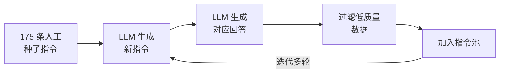
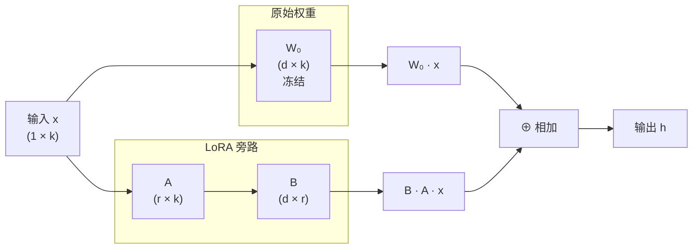

# 监督微调

[自回归语言模型](../architecture-basics/language-model-tokenization.md#自回归语言模型)的预训练目标是续写，给定一段文本，预测下一个词。现实中用户期望语言模型完成的任务通常是问答，提出问题，获得有用的回复。这两种行为模式之间存在根本差异。将预训练语言模型转化为可以聊天、翻译、写代码等任务的助手，还需要经过**监督微调**（Supervised Fine-Tuning, SFT）这一步骤

2022 年，OpenAI 在论文《Training Language Models to Follow Instructions with Human Feedback》中系统阐述了将预训练模型与人类意图对齐的三阶段训练框架。这篇论文提出的 InstructGPT 仅用 1.3B 参数的模型就在任务输出质量上超越了 175B 的原始 GPT-3，揭示了对齐比规模更具决定性意义。论文奠定了 ChatGPT 的技术基础，也使 Pre-Training + SFT + RLHF 成为后续几乎所有指令遵循模型的标准训练范式。

## 基础模型与对齐模型

预训练结束后，我们得到的并不是一个可以直接面向用户的产品，而是一个**基础模型**（Foundation Model，也称 Base Model）。它可能拥有丰富的知识与强大的语言能力，但行为模式与用户期望的 AI 助手之间存在差异。这种差异最直观的体现是同样的输入，两种模型给出了截然不同的输出。假设用户输入"法国的首都是哪里？"，基础模型的输出可能是这样的：

> 用户：法国的首都是哪里？
>
> 模型：法国的首都是哪里？这是一个关于地理知识的问题。法国是欧洲西部的一个国家...

监督微调后，**对齐模型**（Alignment Model，也称 Aligned Model）的输出应该是这样的：

> 用户：法国的首都是哪里？
> 
> 模型：法国的首都是巴黎。

经过 SFT 训练后，模型理解了对话的意图和角色分工。用户负责提问，助手负责回答。它知道面对问题时应该提供直接、有用的信息，而不是继续续写文本。基础模型学习的是文本的概率分布，对齐模型学习的是遵循指令的行为模式。SFT 在对齐训练中的作用体现在三个方面：

- **建立行为模式**：SFT 让模型理解"用户提问、助手回答"的交互模式，从"续写"转向"回答"。这是最基础的变化，也是最关键的，没有这个转变，后续的 RLHF 就无从谈起，因为奖励模型评价的是"回答"的质量，而不是"续写"的质量。

- **注入领域知识和技能**：通过精心设计的指令数据，可以引导模型学习特定领域的知识和技能。譬如 SFT 数据中包含了大量编程问答，模型就会在编程任务上表现更好。

- **为 RLHF 提供良好初始化**：SFT 模型为后续的强化学习提供了一个基本的起点。如果直接从基础模型开始 RLHF，奖励模型和策略模型之间的差距过大，训练很难稳定。SFT 先把模型拉到能回答问题的水平，RLHF 再在此基础上进行打磨。

## 构造微调数据

SFT 的效果在很大程度上取决于数据的质量，而非数据的数量。SFT 数据的基本单位是**指令回答对**（Instruction-Response Pair）。每条数据包含一个用户指令和对应的高质量回答，模型通过学习这些配对数据来掌握"如何回答"的行为模式。以下是一个指令回答对的例子：

```json
{
  "instruction": "将下面的句子翻译成英文：今天天气真好",
  "response": "The weather is really nice today."
}
```

这条数据格式清晰，指令明确，回答简洁准确。但并非所有指令回答对都如此简单。实际场景中，用户的问题可能很复杂，也可能包含多轮对话的上下文。因此，SFT 数据的设计需要考虑更多维度。2023 年，清华大学和智谱 AI 在论文《Instruction Tuning for Large Language Models: A Survey》中对 SFT 数据设计做了系统梳理，总结出三条原则：

- **质量优先**（Quality over Quantity）：这是 SFT 数据构造中最重要的原则。LIMA（Less Is More for Alignment）实验有力地证明了这一点。仅用 1000 条精心编写的高质量指令回答对微调 LLaMA-65B，其输出质量就接近 GPT-4。相比之下，用数万条低质量数据训练反而可能降低模型表现，因为噪声数据会干扰模型已从预训练中获得的知识。

- **多样性**（Diversity）：指令应覆盖尽可能多的任务类型和话题领域。如果训练数据全是翻译任务，模型就只会翻译。如果全是编程问答，模型就只会写代码。好的 SFT 数据应包含问答、翻译、摘要、编程、推理、创意写作等多种任务类型，让模型具备通用的指令遵循能力。

- **复杂度渐进**（Complexity Gradation）：训练数据应从简单任务逐步过渡到复杂任务。简单指令帮助模型建立基本的行为模式，复杂指令则培养推理和组合能力。如果一开始就给模型复杂的推理任务，模型可能连基本的问答模式都学不好。

高质量指令数据的获取是一个瓶颈。人工编写成本高、效率低，且难以覆盖足够的多样性。2023 年，论文《Self-Instruct: Aligning Language Models with Self-Generated Instructions》中提出了一个巧妙的解决方案 —— 让语言模型自己生成指令数据。Self-Instruct 用一个已有的强模型（如 GPT-3.5）来生成训练数据，再用这些数据微调目标模型。整个过程不需要人工标注，仅需少量种子数据作为起点。Self-Instruct 的工作流程分为四步：

- 第一步 **种子指令集**：人工编写约 175 条指令作为种子，覆盖不同任务类型。这个数量很小，只需要保证基本的多样性。
- 第二步 **指令生成**：从种子集中随机采样若干条作为示例，输入给 LLM，让其生成新的指令。因为 LLM 在预训练中已经见过海量任务，它能生成远比种子集更多样化的指令。
- 第三步 **回答生成**：将新生成的指令再输入给 LLM，让其生成对应的回答。这一步还可以判断指令是否可行。如果 LLM 无法生成合理回答，说明该指令本身有问题，应当过滤掉。
- 第四步 **过滤与迭代**：用规则过滤器去除重复、低质量或不合规范的指令回答对，将通过筛选的数据加入指令池。然后重复步骤二到四，迭代多轮，直到指令池达到所需规模。


*图：Self-Instruct 的工作流程*

Self-Intract 的提出很快催生了一个标志性项目 —— Stanford Alpaca。2023 年，斯坦福大学的罗汉·塔里克（Rohan Taori）等人基于 LLaMA-7B 和 Self-Instruct 方法，仅花费不到 600 美元就训练出了一个在多项基准上接近 GPT-3.5 的模型，引发了一轮开源模型微调的热潮。Alpaca 的具体做法是对 Self-Instruct 做了一些简化，直接使用 GPT-3.5 一次性生成全部指令和回答，这样效率更高，且由于 GPT-3.5 本身的质量优秀，生成数据的整体质量也更好。最终 Alpaca 收集了约 52000 条指令回答对，用于微调 LLaMA-7B。

Self-Instruct 和 Alpaca 的案例引发了社区对 SFT 数据规模的反思，SFT 的数据似乎不是越多越好。NeurIPS 2023 上发表的 LIMA（Less Is More for Alignment）实验最具说服力。研究者仅用 1000 条精心编写的高质量数据微调 LLaMA-65B，在人类评估中，其输出质量竟然接近 GPT-4。作为对比，Alpaca 用了 52000 条数据，效果却不如 LIMA 好。这并非意味着 1000 条数据就够了，而是说明数据质量的提升对效果的贡献远大于数据数量的增加。

低质量的微调数据就像是程序员写的烂代码，如果代码库中混入了大量低质量代码（命名混乱、逻辑错误），新加入的开发者也会被误导，认为这就是项目的一贯写法。低质量的指令回答对也会干扰模型已从预训练中获得的语言能力，导致输出质量下降，即所谓的**灾难性遗忘**（Catastrophic Forgetting）。

## SFT 训练细节

SFT 训练过程中有许多设计决策，如 Loss 函数如何构造、对话格式如何设计、学习率和训练轮数如何选择，等等。这些看似琐碎的细节，实际上对训练效果有着显著影响。

### Loss 设计

SFT 的训练目标在形式上与预训练相同，都是语言模型的标准自回归损失。不同点在于 SFT 只对回答部分计算 Loss，而忽略指令部分。考虑一条 SFT 数据：

> <用户> 法国首都是哪里？
>
> <模型> 法国的首都是巴黎。

如果对整段文本都计算 Loss，模型在学习如何回答的同时，也会被要求学会如何提问，但这是毫无意义的，用户的输入已经给定了，模型不需要预测用户会说些什么。而且指令部分的梯度信号会稀释回答部分的学习信号，降低训练效率。假设指令占整条数据的 40%，对整段文本计算 Loss 意味着 40% 的梯度更新是在教模型用户会说什么，只有 60% 的梯度更新在教模型应如何回答，显然这不是我们期望的。标准的做法是对指令部分的 token 设置损失掩码（Loss Mask，也叫 Instruction Mask），筛选出回答部分的 token 集合 $R$，设 $x_{<t}$ 是指令部分的 token（作为条件输入，但不参与 Loss 计算），$y_{<t}$ 是回答部分在位置 $t$ 之前的 token，$p_\theta(y_t \mid \cdot)$ 是模型预测位置 $t$ 上各 token 的概率，则 SFT 的 Loss 为：

$$\mathcal{Loss}_{SFT} = -\frac{1}{|R|}\sum_{t \in R} \log p_\theta(y_t \mid x_{<t}, y_{<t})$$

这个公式看着和预训练的交叉熵损失在形式上是完全一致的，差异只在于求和的范围。整体公式的含义是在给定指令和回答前文的条件下，模型对回答中每个 token 的预测概率取对数后求平均，再取负值。概率越高，Loss 越小，训练效果越好。与预训练 Loss 的唯一区别就是求和范围从"所有 token"缩小到了"回答部分的 token"。

在实现上，损失掩码就是训练框架给每个 token 打上一个标签，指令部分的 token 标签设为 -100（PyTorch 中 `CrossEntropyLoss` 的默认忽略值），回答部分的 token 标签保持原样。Loss 函数在计算时自动跳过标签为 -100 的位置。

### 对话格式与标记

SFT 数据不仅是"指令 + 回答"的纯文本，还需要一种机器可解析的结构化格式来区分不同角色的内容。格式设计决定了模型能否准确区分用户输入和助手输出，以及训练时 Loss 掩码能否正确施加。当前主流的对话格式是 **ChatML**（Chat Markup Language），由 OpenAI 在 2023 年左右提出并广泛应用于其 API 服务中。ChatML 的核心思想是用特殊标记（Special Tokens）来标识对话的结构边界。一条典型的 ChatML 格式内容如下：

``` text
<|im_start|>system
你是一个有帮助的 AI 助手。
<|im_end|>
<|im_start|>user
法国的首都是哪里？
<|im_end|>
<|im_start|>assistant
法国的首都是巴黎。
<|im_end|>
```

ChatML 格式包含了三个特殊标记。这些特殊标记不会出现在正常文本中，避免了文本内容与格式标记的混淆。否则如果用户输入的文本恰好包含"助手："，纯文本格式就会产生歧义。训练框架可以根据 `<|im_start|>assistant` 和 `<|im_end|>` 精确识别回答部分的范围，确保 Loss 只施加在正确位置。在损失掩码的实现中，`<|im_start|>assistant` 和 `<|im_end|>` 之间的 token 被标记为回答部分，参与 Loss 计算，其他位置的 token 则被忽略。

| 特殊标记 | 作用 | 说明 |
|:-------:|:----:|:-----|
| `<\|im_start\|>` | 角色开始 | 标记一个新角色的发言开始，后面紧跟角色名 |
| `<\|im_end\|>` | 角色结束 | 标记当前角色的发言结束 |
| `\n` | 分隔符 | 角色名与内容之间的换行符 |

### 系统提示词设计

ChatML 格式中有一个特殊的角色 **system**。系统提示词（System Prompt）出现在对话的最开头，用于定义助手的行为框架，如它的身份、能力范围和回答风格。系统提示词的作用可以用一个类比来理解，如果说用户指令比喻成客人点菜，那么系统提示词就是厨师的工作守则。厨师不会每次做菜前都被告知请保证食品安全，因为守则已经定义了基本的工作原则。同理，系统提示词为模型设定了持久的行为约束，无需每次对话都重复。系统提示词的设计有几个实践经验：

- **明确角色定义**。告诉模型"你是谁"，以及你不是谁。譬如"你是一个专业的编程助手，擅长 Python 和 JavaScript"，这比"你是一个 AI 助手"更具体，能让模型在特定领域表现更好，同时减少生成无关内容。
- **设定行为边界**。明确告诉模型应该做什么、不应该做什么。譬如"只回答你确定的问题，不确定时说明"，这能减少模型的幻觉，让模型自信地给出"我不知道"的答案。
- **保持简洁**。系统提示词不是越长越好。过长的系统提示词可能被模型忽略（因为注意力机制的稀释效应），也增加了推理时的计算开销。实践经验表明 100-300 字的系统提示词是比较合理的范围。

不同场景下的系统提示词差异很大。通用 AI 助手需要广泛的能力覆盖，而专用 AI 助手（如编程助手、法律顾问）需要更精确的角色定义。下面是两个对比示例：

``` text
# 通用助手
<|im_start|>system
你是一个有帮助的 AI 助手。请用准确、清晰的方式回答用户的问题。
如果不确定，请诚实地说明。
<|im_end|>

# 编程助手
<|im_start|>system
你是一个专业的编程助手，精通 Python、JavaScript、Go 等主流编程语言。
回答时请提供可运行的代码示例，并解释关键设计决策。
如果用户的代码有 bug，请指出问题并给出修复方案。
<|im_end|>
```

### 超参数选择

SFT 训练的超参数选择与预训练有明显差异，主要体现在学习率和训练轮数上。

- **学习率**：SFT 的学习率通常远小于预训练。预训练的学习率在 $10^{-4}$ 量级，而 SFT 通常在 $10^{-5}$ 到 $10^{-6}$ 之间。这是因为 SFT 的目标不是学习新知识，而是调整已有知识的行为模式。过大的学习率会破坏预训练阶段学到的语言能力，导致**灾难性遗忘**。可以类比一个已经掌握了英语的人学习英式口音，需要的是微调发音习惯，而不是重新学习英语。实践中，SFT 通常采用**余弦退火**（Cosine Annealing）策略，学习率从初始值缓慢下降到接近零。这与预训练的学习率调度类似，但整体幅度更小。

- **训练轮数**：SFT 的训练轮数通常只有 1-3 个 epoch，远少于预训练的上百个 epoch，原因是防止过拟合。SFT 数据集规模较小（几千到几万条），模型很容易在少量数据上记忆而非泛化。经验上 1 个 epoch 通常是足够的起点，如果模型在验证集上的表现还在提升，可以尝试 2-3 个 epoch，但需要密切监控是否出现过拟合。

- **全局批大小**：SFT 通常使用较小的批大小（32-128），因为数据集规模有限，过大的批大小会导致每个 epoch 的更新步数过少，训练不充分。

## LoRA 与 QLoRA

对于一个大参数量的模型进行微调，对显存的要求与预训练是一样的，同样要为每个参数维护梯度、优化器状态和激活值。对于只有消费级 GPU 的研究者和开发者来说，全参数微调几乎不可能实现。为此，参数高效微调（Parameter-Efficient Fine-Tuning, PEFT）方法应运而生。这类方法只更新模型中极少量的参数，就能达到接近全参数微调的效果。其中最具代表性的是 LoRA 及其改进版本 QLoRA。

### LoRA：低秩适应

LoRA（Low-Rank Adaptation）是 2021 年由微软研究院在论文《LoRA: Low-Rank Adaptation of Large Language Models》中提出的。这篇论文的洞察非常精妙：虽然预训练模型的参数量巨大，但在特定任务上微调时，参数的变化量实际上是低秩的。低秩意味着不需要在所有维度上都做大幅调整，只需要在少数几个关键方向上做精细调整就够了。想理解 LoRA 的原理，要先看懂此前全参数微调做了什么。假设模型中某个权重矩阵为 $W_0 \in \mathbb{R}^{d \times k}$，全参数微调是将它更新为 $W_0 + \Delta W$。LoRA 的做法则是不直接学习 $\Delta W$，而是将 $\Delta W$ 分解为两个小矩阵的乘积：

$$\Delta W = BA$$

其中 $B \in \mathbb{R}^{d \times r}$，$A \in \mathbb{R}^{r \times k}$，且 $r \ll \min(d, k)$。这两个小矩阵就是 LoRA 要学习的全部参数。这个思路我们应该不陌生了，它在降维的 [SVD 分解](../../statistical-learning/unsupervised-learning/dimensionality-reduction.md#奇异值分解)中出过，在 Transformer 的 [TPA 张量积注意力](../architecture-basics/architecture-evolution.md#tpa-张量积注意力)时也出现过。

LoRA 微调的前向传播的计算过程是原始路径 $h = W_0 x$ 和 LoRA 旁路 $h' = BAx$ 相加，得到最终输出 $h + h'$。训练时，$W_0$ 完全冻结，只有 $A$ 和 $B$ 的参数被更新，如下图所示。


*图：LoRA 微调计算过程*

分解的合理性来源于[秩](../../maths/linear/vectors.md#线性相关与线性无关)（Rank）的概念。矩阵的秩衡量的是矩阵中独立方向的数量。全参数微调的 $\Delta W$ 虽然是 $d \times k$ 的大矩阵，但实际的有效变化方向可能只有少数几个，也就是说 $\Delta W$ 的有效秩远小于 $\min(d, k)$。LoRA 直接用一个秩为 $r$ 的低秩矩阵来近似 $\Delta W$，不仅没有损失太多信息，反而因为参数量大幅减少而获得了更好的正则化效果。

可以用一组具体数字来感受 LoRA 的参数压缩效果。假设模型中一个注意力层的权重矩阵维度为 $4096 \times 4096$（LLaMA-7B 的典型维度），取 $r = 8$，则：

- 全参数微调需要更新的参数量为：$4096 \times 4096 = 16,777,216$
- LoRA 需要更新的参数量为：$(4096 \times 8) + (8 \times 4096) = 65,536$
- 参数比例为：$65,536 / 16,777,216 \approx 0.39\%$

仅更新 0.39% 的参数，LoRA 就能达到接近全参数微调的效果。这种惊人的效率正是 LoRA 迅速成为行业标准的原因。LoRA 还有两个实用的设计细节：

- **初始化策略**。$A$ 使用随机高斯初始化，$B$ 初始化为零矩阵。这意味着训练开始时 $BA = 0$，LoRA 旁路的输出为零，模型的行为与原始预训练模型完全一致。这种设计保证了训练的稳定性，微调从预训练模型的已有能力出发，而不是从一个随机状态开始。

- **缩放因子**。LoRA 在旁路输出上乘以一个缩放因子 $\alpha / r$，用于控制 LoRA 更新的幅度。$\alpha$ 是一个超参数，通常设为 $r$ 的 1-2 倍。当 $\alpha = r$ 时，缩放因子为 1，相当于不加缩放；当 $\alpha = 2r$ 时，旁路输出的幅度加倍，相当于增大了微调的学习率。

### QLoRA：量化 LoRA

QLoRA（Quantized LoRA）由华盛顿大学于 2023 年在论文《QLoRA: Efficient Finetuning of Quantized Language Models》中提出。如果说 LoRA 解决了需要更新多少参数的问题，QLoRA 则解决了需要多少显存来存储这些参数的问题。QLoRA 的目的是将预训练权重量化到 4 比特精度来节省显存，同时在计算时动态反量化到更高精度，保证训练质量。这使得在单张 48GB 显存的 GPU 上微调 65B 参数的模型成为可能，而全精度微调需要超过 300GB 显存。QLoRA 引入了三项关键技术创新：

- **NF4 量化**（4-bit NormalFloat Quantization）：这是一种专门为正态分布权重设计的数据格式。预训练模型的权重通常近似服从正态分布，NF4 根据正态分布的分位数来分配量化级别，使得每个量化级别的概率密度相等。与均匀量化相比，NF4 在相同位宽下能更准确地表示权重的真实分布，量化误差更小。

- **双重量化**（Double Quantization）：量化过程本身会产生量化常数（每 64 个权重共享一组量化参数），这些常数也占用显存。双重量化对这些量化常数再做一次量化，将每个常数的存储从 32 比特压缩到 8 比特，进一步节省了约 0.37 比特每参数的显存。

- **分页优化器**（Paged Optimizer）：训练过程中，优化器状态（如 Adam 的动量和方差）占用大量显存，且大小随序列长度波动。分页优化器利用 NVIDIA 统一内存（Unified Memory）特性，当 GPU 显存不足时自动将优化器状态换出到 CPU 内存，需要时再换入，避免显存溢出导致的训练中断。

下面是 LoRA 和 QLoRA 在不同模型规模下的显存需求对比：

| 模型规模 | 全参数微调 | LoRA (16-bit) | QLoRA (4-bit) |
|:--------:|:---------:|:-------------:|:-------------:|
| 7B | ~28 GB | ~16 GB | ~6 GB |
| 13B | ~52 GB | ~28 GB | ~10 GB |
| 30B | ~120 GB | ~60 GB | ~24 GB |
| 65B | ~260 GB | ~130 GB | ~48 GB |

## 本章小结

预训练赋予模型语言能力，但不会赋予它服务人类的意愿。一个能流畅续写文本的基础模型，面对用户提问时仍然会自顾自地编造下文，而非给出有用回答。监督微调解决的就是这个从"会说话"到"会对话"的跨越，在整个对齐训练流水线中扮演着承上启下的角色。它承接预训练的语言能力，将其转化为可用的对话行为，又为后续的强化学习对齐提供了一个稳定的起点。没有 SFT，奖励模型评价的对象都不存在，以 SFT 为基础，RLHF 才能在一个已经会回答的模型上进一步打磨回答得更好。


## 练习题

1. 假设一个注意力权重矩阵 $W_0$ 的维度为 $5120 \times 5120$，LoRA 的秩 $r = 16$。请计算全参数微调和 LoRA 各需要更新多少参数？LoRA 的参数占比是多少？

   <details>
   <summary>参考答案</summary>

   全参数微调：$5120 \times 5120 = 26,214,400$ 个参数

   LoRA：矩阵 $A \in \mathbb{R}^{16 \times 5120}$ 和 $B \in \mathbb{R}^{5120 \times 16}$，参数量为 $(16 \times 5120) + (5120 \times 16) = 81,920 + 81,920 = 163,840$

   参数占比：$163,840 / 26,214,400 \approx 0.625\%$

   仅更新不到 1% 的参数，这正是 LoRA 效率的来源。

   </details>