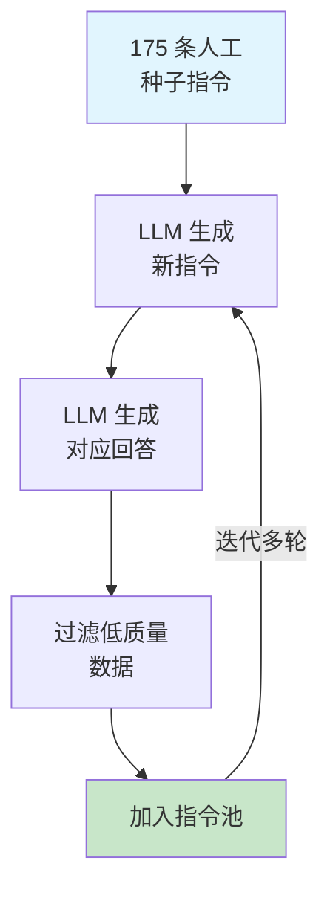
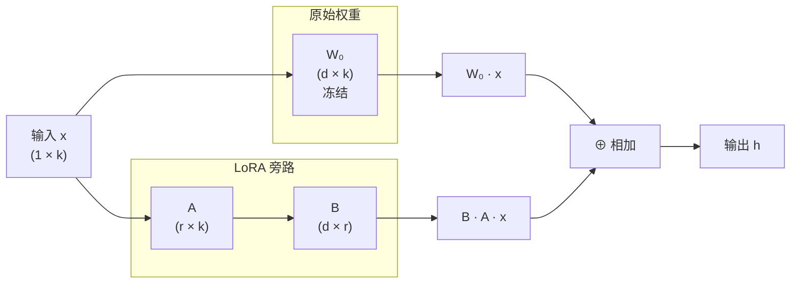

# 监督微调

[自回归语言模型](../architecture-basics/language-model-tokenization.md#自回归语言模型)的预训练目标是续写，给定一段文本，预测下一个词。现实中用户期望语言模型完成的任务通常是问答，提出问题，获得有用的回复。这两种行为模式之间存在根本差异。将预训练语言模型转化为可以聊天、翻译、写代码等任务的助手，还需要经过**监督微调**（Supervised Fine-Tuning, SFT）这一步骤

2022 年，OpenAI 在论文《Training Language Models to Follow Instructions with Human Feedback》中系统阐述了将预训练模型与人类意图对齐的三阶段训练框架。这篇论文提出的 InstructGPT 仅用 1.3B 参数的模型就在任务输出质量上超越了 175B 的原始 GPT-3，揭示了对齐比规模更具决定性意义。论文奠定了 ChatGPT 的技术基础，也使 Pre-Training + SFT + RLHF 成为后续几乎所有指令遵循模型的标准训练范式。

## 基础模型与对齐模型

预训练结束后，我们得到的并不是一个可以直接面向用户的产品，而是一个**基础模型**（Base Model）。它可能拥有丰富的知识与强大的语言能力，但行为模式与用户期望的 AI 助手之间存在差异。这种差异最直观的体现是同样的输入，两种模型给出了截然不同的输出。假设用户输入"法国的首都是哪里？"，基础模型的输出可能是这样的：

> 用户：法国的首都是哪里？
>
> 模型：法国的首都是哪里？这是一个关于地理知识的问题。法国是欧洲西部的一个国家...

监督微调后，齐模模型（）的输出应该是这样的：

> 用户：法国的首都是哪里？
> 
> 模型：法国的首都是巴黎。

经过 SFT 训练后，模型理解了对话的意图和角色分工。用户负责提问，助手负责回答。它知道面对问题时应该提供直接、有用的信息，而不是继续续写文本。基础模型学习的是文本的概率分布，对齐模型学习的是遵循指令的行为模式。

### SFT 的核心作用

SFT 在对齐训练中扮演着"奠基"的角色，它的作用体现在三个方面：

**建立行为模式**。SFT 让模型理解"用户提问、助手回答"的交互模式，从"续写"转向"回答"。这是最基础的变化，也是最关键的 —— 没有这个转变，后续的 RLHF 就无从谈起，因为奖励模型评价的是"回答"的质量，而不是"续写"的质量。

**注入领域知识和技能**。通过精心设计的指令数据，可以引导模型学习特定领域的知识和技能。例如，如果 SFT 数据中包含了大量编程问答，模型就会在编程任务上表现更好。

**为 RLHF 提供良好初始化**。SFT 模型为后续的强化学习提供了一个合理的起点。如果直接从基础模型开始 RLHF，奖励模型和策略模型之间的差距过大，训练容易不稳定。SFT 先把模型拉到"能回答问题"的水平，RLHF 再在此基础上精益求精。

## SFT 数据构造

上一节解释了为什么预训练模型需要 SFT，本节关注一个更具体的问题：用什么样的数据来做 SFT？SFT 的效果在很大程度上取决于数据质量，而非数据数量。这一节将从数据格式出发，讨论数据构造的核心原则，并介绍 Self-Instruct 这一划时代的数据生成方法。

### 指令 - 回答对的设计原则

SFT 数据的基本单位是**指令 - 回答对**（Instruction-Response Pair）。每条数据包含一个用户指令和对应的高质量回答，模型通过学习这些配对数据来掌握"如何回答"的行为模式。

一条好的指令 - 回答对需要满足什么条件？先看一个具体例子：

```json
{
  "instruction": "将下面的句子翻译成英文：今天天气真好",
  "response": "The weather is really nice today."
}
```

这条数据格式清晰，指令明确，回答简洁准确。但并非所有指令 - 回答对都如此简单。实际场景中，用户的问题可能很复杂，也可能包含多轮对话的上下文。因此，SFT 数据的设计需要考虑更多维度。

2023 年，清华大学和智谱 AI 的研究人员在论文《Instruction Tuning for Large Language Models: A Survey》中对 SFT 数据设计做了系统梳理，总结出三条核心原则：

**多样性**（Diversity）。指令应覆盖尽可能多的任务类型和话题领域。如果训练数据全是翻译任务，模型就只会翻译；如果全是编程问答，模型就只会写代码。好的 SFT 数据应包含问答、翻译、摘要、编程、推理、创意写作等多种任务类型，让模型具备通用的指令遵循能力。

**质量优先**（Quality over Quantity）。这是 SFT 数据构造中最重要的原则。LIMA（Less Is More for Alignment）实验有力地证明了这一点：仅用 1000 条精心编写的高质量指令 - 回答对微调 LLaMA-65B，其输出质量就接近 GPT-4。相比之下，用数万条低质量数据训练反而可能降低模型表现，因为噪声数据会干扰模型已从预训练中获得的知识。

**复杂度渐进**（Complexity Gradation）。训练数据应从简单任务逐步过渡到复杂任务。简单指令帮助模型建立基本的行为模式（如"回答问题而不是续写"），复杂指令则培养推理和组合能力。如果一开始就给模型复杂的推理任务，模型可能连基本的"回答"模式都学不好。

### Self-Instruct：自动化数据生成

高质量指令数据的获取是一个瓶颈。人工编写成本高、效率低，且难以覆盖足够的多样性。2023 年，华盛顿大学的王元（Yizhong Wang）等人在论文《Self-Instruct: Aligning Language Models with Self-Generated Instructions》中提出了一个巧妙的解决方案：让语言模型自己生成指令数据。

Self-Instruct 的核心思路是"以模型之矛，攻模型之盾" —— 用一个已有的强模型（如 GPT-3.5）来生成训练数据，再用这些数据微调目标模型。整个过程不需要人工标注，仅需少量种子数据作为起点。



Self-Instruct 的工作流程分为四步：

**第一步：种子指令集**。人工编写约 175 条指令作为种子，覆盖不同任务类型。这个数量很小，只需要保证基本的多样性。

**第二步：指令生成**。从种子集中随机采样若干条作为示例，输入给 LLM，让其生成新的指令。因为 LLM 在预训练中已经见过海量任务，它能生成远比种子集更多样化的指令。

**第三步：回答生成**。将新生成的指令再输入给 LLM，让其生成对应的回答。这一步还可以判断指令是否可行 —— 如果 LLM 无法生成合理回答，说明该指令本身有问题，应当过滤掉。

**第四步：过滤与迭代**。用规则过滤器去除重复、低质量或不合规范的指令 - 回答对，将通过筛选的数据加入指令池。然后重复步骤二到四，迭代多轮，直到指令池达到所需规模。

Self-Instruct 的原始实验从 175 条种子指令出发，生成了超过 52000 条指令，过滤后保留了约 16000 条高质量数据。用这些数据微调的模型，在人类评估中显著优于未微调的基线模型。

### Alpaca：Self-Instruct 的标志性实践

Self-Intract 的提出很快催生了一个标志性项目——Stanford Alpaca。2023 年，斯坦福大学的罗汉·塔里克（Rohan Taori）等人基于 LLaMA-7B 和 Self-Instruct 方法，仅花费不到 600 美元就训练出了一个在多项基准上接近 GPT-3.5 的模型，引发了一轮开源模型微调的热潮。

Alpaca 的具体做法是对 Self-Instruct 做了一处关键简化：直接使用 `text-davinci-003`（GPT-3.5 的一个版本）一次性生成指令和回答，而不是分开生成。这样效率更高，且由于 GPT-3.5 本身的质量较高，生成数据的整体质量也更好。最终 Alpaca 收集了约 52000 条指令 - 回答对，用于微调 LLaMA-7B。

下面的代码演示了 Self-Instruct 的核心流程：从种子指令出发，利用 LLM 自动生成新的指令 - 回答对。

```python runnable
import random
import json

# 人工编写的种子指令（实际 Self-Instruct 用 175 条，这里简化为 6 条）
seed_instructions = [
    {"task_type": "brainstorming", "instruction": "列出五种健康早餐的想法"},
    {"task_type": "translation", "instruction": "将下面的句子翻译成英文：这本书很有趣"},
    {"task_type": "qa", "instruction": "光合作用的基本过程是什么？"},
    {"task_type": "summarization", "instruction": "总结以下文章的要点：人工智能正在改变医疗诊断的方式..."},
    {"task_type": "coding", "instruction": "用 Python 写一个快速排序函数"},
    {"task_type": "rewriting", "instruction": "将下面的句子改写得更正式：这个东西太好用了"},
]

# 模拟 LLM 生成新指令的过程
# 实际中，这里会调用 GPT-3.5/4 等模型 API
def simulate_llm_generate_instruction(examples):
    """从示例中学习模式，生成新指令"""
    # 统计示例中各任务类型的比例，按比例生成
    task_types = [ex["task_type"] for ex in examples]
    chosen_type = random.choice(task_types)

    # 模拟 LLM 根据示例模式生成新指令
    templates = {
        "brainstorming": "列出三种提高工作效率的方法",
        "translation": "将下面的句子翻译成日文：明天会下雨",
        "qa": "地球的内部结构分为哪几层？",
        "summarization": "用一句话概括以下段落的主旨：量子计算利用量子叠加态...""",
        "coding": "用 JavaScript 写一个深拷贝函数",
        "rewriting": "将下面的句子改写得更简洁：由于天气的原因所以比赛被取消了",
    }
    return {"task_type": chosen_type, "instruction": templates[chosen_type]}

# 模拟 LLM 生成回答的过程
def simulate_llm_generate_response(instruction_data):
    """模拟 LLM 为指令生成回答"""
    responses = {
        "列出三种提高工作效率的方法": "1. 番茄工作法：25 分钟专注 + 5 分钟休息\n2. 任务优先级排序：用艾森豪威尔矩阵区分重要与紧急\n3. 批量处理：将同类小任务集中处理，减少切换成本",
        "将下面的句子翻译成日文：明天会下雨": "明日は雨が降るでしょう。",
        "地球的内部结构分为哪几层？": "地球内部从外到内分为三层：地壳（平均厚度约 35km）、地幔（约 2900km 厚）和地核（半径约 3400km）。其中地核又分为外核（液态）和内核（固态）。",
        "用一句话概括以下段落的主旨：量子计算利用量子叠加态...": "量子计算利用叠加态和纠缠等量子力学特性，有望在特定问题上实现远超经典计算的加速。",
        "用 JavaScript 写一个深拷贝函数": "function deepClone(obj) {\n  if (obj === null || typeof obj !== 'object') return obj;\n  if (Array.isArray(obj)) return obj.map(item => deepClone(item));\n  const cloned = {};\n  for (const key in obj) {\n    if (obj.hasOwnProperty(key)) cloned[key] = deepClone(obj[key]);\n  }\n  return cloned;\n}",
        "将下面的句子改写得更简洁：由于天气的原因所以比赛被取消了": "因天气原因，比赛取消。",
    }
    instruction = instruction_data["instruction"]
    return responses.get(instruction, "无法生成回答")

# Self-Instruct 主流程
instruction_pool = list(seed_instructions)  # 初始化指令池
new_pairs = []

for round_num in range(3):  # 迭代 3 轮（实际为几十轮）
    # 从指令池中随机采样 3 条作为示例
    examples = random.sample(instruction_pool, min(3, len(instruction_pool)))

    # 生成新指令
    new_instruction = simulate_llm_generate_instruction(examples)

    # 生成对应回答
    response = simulate_llm_generate_response(new_instruction)

    # 简单过滤：排除过短或重复的指令
    if len(new_instruction["instruction"]) > 5:
        new_pair = {
            "instruction": new_instruction["instruction"],
            "response": response,
            "task_type": new_instruction["task_type"],
        }
        new_pairs.append(new_pair)
        instruction_pool.append(new_instruction)

print(f"种子指令: {len(seed_instructions)} 条")
print(f"生成指令: {len(new_pairs)} 条")
print(f"指令池总量: {len(instruction_pool)} 条")
print("\n--- 生成数据示例 ---")
for i, pair in enumerate(new_pairs[:3]):
    print(f"\n[{i+1}] 类型: {pair['task_type']}")
    print(f"指令: {pair['instruction']}")
    print(f"回答: {pair['response'][:80]}...")
```

从上面的代码可以看出，Self-Instruct 的流程并不复杂：从少量种子出发，通过 LLM 迭代生成新数据，再过滤去噪。整个过程的成本主要来自 LLM API 的调用费用，相比人工标注低了一个数量级。

### 数据质量的关键发现

Self-Instruct 和 Alpaca 的成功引发了社区对 SFT 数据规模的反思：数据是不是越多越好？2023 年多项研究给出了明确的否定答案。

NeurIPS 2023 上发表的 LIMA（Less Is More for Alignment）实验最具说服力。研究者仅用 1000 条精心编写的高质量数据微调 LLaMA-65B，在人类评估中，其输出质量竟然接近 GPT-4。作为对比，Alpaca 用了 52000 条数据，效果却不如 LIMA。这并非意味着 1000 条数据就够了，而是说明数据质量的提升对效果的贡献远大于数据数量的增加。

为什么低质量数据反而有害？可以类比程序员的代码审查经验：如果代码库中混入了大量低质量代码（命名混乱、逻辑错误），新加入的开发者会被误导，以为这就是项目规范。模型也是如此 —— 低质量的指令 - 回答对会干扰模型已从预训练中获得的语言能力，导致输出质量下降，即所谓的**灾难性遗忘**（Catastrophic Forgetting）。

基于这些发现，SFT 数据构造的最佳实践可以总结为：

**人工编写为主，模型生成辅助**。高质量的种子数据和核心指令应人工编写，确保准确性和规范性。模型生成用于扩充数量和增加多样性，但需要经过严格的质量过滤。

**重质量而非数量**。在资源有限的情况下，宁可花时间写 1000 条高质量数据，也不要急于积累 10000 条低质量数据。模型微调的学习效率很高，少量高质量数据就能取得显著效果。

**关注数据的负面效应**。每条加入训练的数据都应仔细审核，避免包含错误信息、有害内容或格式不规范的回答。一条有害数据的负面影响往往大于一条好数据的正面贡献。

## SFT 训练细节

前两节分别讨论了 SFT"为什么需要"和"用什么数据"，本节转向更具体的技术问题：SFT 训练过程中有哪些关键设计决策？包括 Loss 函数如何构造、对话格式如何设计、学习率和训练轮数如何选择。这些看似琐碎的细节，实际上对训练效果有着显著影响。

### SFT 的 Loss 设计

SFT 的训练目标在形式上与预训练相同 —— 都是语言模型的标准自回归损失。但 SFT 做了一个关键改动：**只对回答部分计算 Loss，忽略指令部分**。

为什么需要这个改动？考虑一条 SFT 数据的格式：

```
<用户> 法国首都是哪里？
<助手> 法国的首都是巴黎。
```

如果对整段文本都计算 Loss，模型在学习"如何回答"的同时，也会被要求学会"如何提问" —— 但这毫无意义，用户的输入已经给定了，模型不需要预测用户会说什么。更严重的是，指令部分的梯度信号会稀释回答部分的学习信号，降低训练效率。

更具体地说，假设指令占整条数据的 40%，对整段文本计算 Loss 意味着 40% 的梯度更新是在教模型"用户会说什么"，只有 60% 的梯度更新在教模型"助手应如何回答"。这显然不是我们想要的。

正确的做法是**对指令部分的 token 设置 `loss_mask = 0`，只对回答部分的 token 计算 Loss**：

$$\mathcal{L}_{\text{SFT}} = -\frac{1}{|R|}\sum_{t \in R} \log p_\theta(y_t \mid x_{<t}, y_{<t})$$

这个公式看着和预训练的交叉熵损失很像，拆开来看差异在于求和的范围：

- $R$ 是回答部分的 token 集合，不是整段文本的所有 token
- $x_{<t}$ 是指令部分的 token（作为条件输入，但不参与 Loss 计算）
- $y_{<t}$ 是回答部分在位置 $t$ 之前的 token
- $p_\theta(y_t \mid \cdot)$ 是模型预测位置 $t$ 上各 token 的概率
- 分母 $|R|$ 是回答部分的 token 数量，用于归一化

整体公式的含义是：在给定指令和回答前文的条件下，模型对回答中每个 token 的预测概率取对数后求平均，再取负值。概率越高，Loss 越小，训练效果越好。与预训练 Loss 的唯一区别就是求和范围从"所有 token"缩小到了"回答部分的 token"。

在实现上，这种区分非常直观。训练框架会给每个 token 打上一个标签：指令部分的 token 标签设为 `-100`（PyTorch 中 `CrossEntropyLoss` 的默认忽略值），回答部分的 token 标签保持原样。Loss 函数在计算时自动跳过标签为 `-100` 的位置。

下面的代码演示了 SFT Loss 计算中指令掩码（Instruction Mask）的实现方式：

```python runnable
import torch
import torch.nn as nn

# 模拟一条 SFT 数据
# 格式：<用户> 法国首都是哪里？ <助手> 法国的首都是巴黎。
# token_ids 中包含了指令和回答两部分
token_ids = torch.tensor([[1, 2, 3, 4, 5, 6, 7, 8, 9, 10]])
# 对应的文本：   <用户>  法 国  首 都  是 哪 里 <助手>  巴 黎
#                ├────── 指令部分 ──────┤├─ 回答 ─┤

# 标签（labels）决定了哪些位置参与 Loss 计算
# 指令部分（位置 0-6）标签设为 -100，Loss 函数自动忽略
# 回答部分（位置 7-9）标签设为实际 token id，参与 Loss 计算
labels = torch.tensor([[-100, -100, -100, -100, -100, -100, -100, 8, 9, 10]])

# 模型输出的 logits（模拟值，实际维度为 [batch, seq_len, vocab_size]）
vocab_size = 20
logits = torch.randn(1, 10, vocab_size)

# 标准交叉熵 Loss（自动忽略 label = -100 的位置）
loss_fn = nn.CrossEntropyLoss(ignore_index=-100)

# 展平后计算 Loss
logits_flat = logits.view(-1, vocab_size)      # [10, vocab_size]
labels_flat = labels.view(-1)                   # [10]

loss = loss_fn(logits_flat, labels_flat)

# 验证：只有位置 7、8、9 参与了 Loss 计算
num_active = (labels_flat != -100).sum().item()
print(f"总 token 数: {len(labels_flat)}")
print(f"参与 Loss 计算的 token 数: {num_active}")
print(f"忽略的 token 数: {len(labels_flat) - num_active}")
print(f"SFT Loss 值: {loss.item():.4f}")
print(f"\n这意味着模型只在回答部分'学习'，指令部分仅作为上下文条件")
```

从代码输出可以看到，10 个 token 中只有 3 个参与了 Loss 计算 —— 正好对应回答部分。指令部分的 token 虽然被送入模型作为输入上下文，但不产生梯度信号。这种设计确保了模型的所有学习能力都集中在"如何回答"这一目标上。

### 对话格式与特殊标记

SFT 数据不仅是"指令 + 回答"的纯文本，还需要一种机器可解析的结构化格式来区分不同角色的内容。这种格式设计直接影响两个关键问题：模型能否准确区分用户输入和助手输出，以及训练时 Loss 掩码能否正确施加。

当前主流的对话格式是 **ChatML**（Chat Markup Language），由 OpenAI 在 2023 年左右提出并广泛应用于其 API 服务中。ChatML 的核心思想是用特殊标记（Special Tokens）来标识对话的结构边界。

一条典型的 ChatML 格式对话如下：

```
<|im_start|>system
你是一个有帮助的 AI 助手。<|im_end|>
<|im_start|>user
法国的首都是哪里？<|im_end|>
<|im_start|>assistant
法国的首都是巴黎。<|im_end|>
```

ChatML 格式使用了三个特殊标记：

| 特殊标记 | 作用 | 说明 |
|:-------:|:----:|:-----|
| `<\|im_start\|>` | 角色开始 | 标记一个新角色的发言开始，后面紧跟角色名 |
| `<\|im_end\|>` | 角色结束 | 标记当前角色的发言结束 |
| `\n` | 分隔符 | 角色名与内容之间的换行符 |

为什么要用特殊标记而不是简单的文本标签（如"用户："和"助手："）？原因有三：

**解析无歧义**。特殊标记不会出现在正常文本中，避免了文本内容与格式标记的混淆。如果用户输入的文本恰好包含"助手："，纯文本格式就会产生歧义。

**Loss 掩码精准**。训练框架可以根据 `<|im_start|>assistant` 和 `<|im_end|>` 精确识别回答部分的范围，确保 Loss 只施加在正确位置。纯文本标签的识别则容易出错。

**多轮对话友好**。ChatML 天然支持多轮对话，只需依次添加各轮的 `<|im_start|>` 和 `<|im_end|>` 标记即可。模型在训练时见过这种格式，推理时也能正确生成。

在 Loss 掩码的实现中，`<|im_start|>assistant` 和 `<|im_end|>` 之间的 token 被标记为回答部分，参与 Loss 计算；其他位置的 token 则被忽略。这比手工编写正则表达式匹配"用户："和"助手："标签要可靠得多。

### 系统提示词设计

ChatML 格式中有一个特殊的角色：**system**。系统提示词（System Prompt）出现在对话的最开头，用于定义助手的行为框架 —— 它的身份、能力范围和回答风格。

系统提示词的作用可以用一个类比来理解：如果说用户指令是"客人点菜"，那么系统提示词就是"厨师的工作守则"。厨师不会每次做菜前都被告知"请保证食品安全"，因为守则已经定义了基本的工作原则。同理，系统提示词为模型设定了持久的行为约束，无需每次对话都重复。

系统提示词的设计有几个实践经验：

**明确角色定义**。告诉模型"你是谁"，以及你不是谁。例如"你是一个专业的编程助手，擅长 Python 和 JavaScript"，这比"你是一个 AI 助手"更具体，能让模型在特定领域表现更好，同时减少生成无关内容。

**设定行为边界**。明确告诉模型应该做什么、不应该做什么。例如"只回答你确定的问题，不确定时说明"，这能减少模型的"幻觉" —— 自信地给出错误答案。

**保持简洁**。系统提示词不是越长越好。过长的系统提示词可能被模型忽略（因为注意力机制的稀释效应），也增加了推理时的计算开销。实践经验表明，100-300 字的系统提示词效果最好。

不同场景下的系统提示词差异很大。通用助手需要广泛的能力覆盖，而专用助手（如编程助手、法律顾问）需要更精确的角色定义。下面是两个对比示例：

```
# 通用助手
<|im_start|>system
你是一个有帮助的 AI 助手。请用准确、清晰的方式回答用户的问题。
如果不确定，请诚实地说明。<|im_end|>

# 编程助手
<|im_start|>system
你是一个专业的编程助手，精通 Python、JavaScript、Go 等主流编程语言。
回答时请提供可运行的代码示例，并解释关键设计决策。
如果用户的代码有 bug，请指出问题并给出修复方案。<|im_end|>
```

### 训练超参数选择

SFT 训练的超参数选择与预训练有明显差异，主要体现在学习率和训练轮数上。

**学习率**。SFT 的学习率通常远小于预训练 —— 预训练的学习率在 $10^{-4}$ 量级，而 SFT 通常在 $10^{-5}$ 到 $10^{-6}$ 之间。这是因为 SFT 的目标不是学习新知识，而是调整已有知识的行为模式。过大的学习率会破坏预训练阶段学到的语言能力，导致**灾难性遗忘**。可以类比一个已经掌握了英语的人学习英式口音：需要的是微调发音习惯，而不是重新学习英语。

实践中，SFT 通常采用**余弦退火**（Cosine Annealing）策略，学习率从初始值缓慢下降到接近零。这与预训练的学习率调度类似，但整体幅度更小。

**训练轮数**（Epoch）。SFT 的训练轮数通常只有 1-3 个 epoch，远少于预训练的上百个 epoch。原因同样是防止过拟合：SFT 数据集规模较小（几千到几万条），模型很容易在少量数据上记忆而非泛化。经验上，1 个 epoch 通常是足够的起点，如果模型在验证集上的表现还在提升，可以尝试 2-3 个 epoch，但需要密切监控是否出现过拟合。

**全局批大小**。SFT 通常使用较小的批大小（32-128），因为数据集规模有限，过大的批大小会导致每个 epoch 的更新步数过少，训练不充分。

下面的代码演示了 SFT 训练中典型的超参数配置：

```python runnable
import math

# SFT 训练超参数配置（以 7B 模型为例）
sft_config = {
    "learning_rate": 2e-5,         # 比预训练低 1-2 个数量级
    "num_epochs": 2,               # 通常 1-3 个 epoch
    "batch_size": 64,              # 较小的批大小
    "warmup_ratio": 0.03,          # 3% 的步数用于预热
    "weight_decay": 0.01,          # 权重衰减
    "max_length": 2048,            # 最大序列长度
    "lr_scheduler": "cosine",      # 余弦退火策略
}

# 对比：预训练的超参数
pretrain_config = {
    "learning_rate": 3e-4,         # 比 SFT 高 10 倍以上
    "num_epochs": 100,             # 远多于 SFT
    "batch_size": 2048,            # 大批大小
    "warmup_ratio": 0.01,
    "weight_decay": 0.1,
    "max_length": 4096,
    "lr_scheduler": "cosine",
}

# 计算学习率变化（余弦退火）
def cosine_annealing_lr(initial_lr, warmup_steps, total_steps, current_step):
    if current_step < warmup_steps:
        return initial_lr * current_step / warmup_steps
    progress = (current_step - warmup_steps) / (total_steps - warmup_steps)
    return initial_lr * 0.5 * (1 + math.cos(math.pi * progress))

# 模拟 SFT 训练过程
dataset_size = 10000
total_steps = (dataset_size // sft_config["batch_size"]) * sft_config["num_epochs"]
warmup_steps = int(total_steps * sft_config["warmup_ratio"])

print("SFT 训练配置:")
print(f"  数据集大小: {dataset_size} 条")
print(f"  批大小: {sft_config['batch_size']}")
print(f"  总训练步数: {total_steps}")
print(f"  预热步数: {warmup_steps}")
print(f"  初始学习率: {sft_config['learning_rate']}")
print(f"\n学习率变化示例:")
for step in [0, warmup_steps, total_steps // 2, total_steps]:
    lr = cosine_annealing_lr(sft_config["learning_rate"], warmup_steps, total_steps, step)
    print(f"  Step {step:>5d}: lr = {lr:.2e}")
```

## 参数高效微调：LoRA 与 QLoRA

前面讨论的 SFT 训练方法都是"全参数微调" —— 更新模型的所有参数。对于一个 7B 参数的模型，这意味着需要为每个参数维护梯度、优化器状态和激活值，显存需求动辄数十 GB。对于只有消费级 GPU 的研究者和开发者来说，全参数微调几乎不可能实现。

参数高效微调（Parameter-Efficient Fine-Tuning, PEFT）方法应运而生。这类方法只更新模型中极少量的参数，就能达到接近全参数微调的效果。其中最具代表性的是 LoRA 及其改进版本 QLoRA。

### LoRA：低秩适应

LoRA（Low-Rank Adaptation）由微软研究院的胡爱爱（Edward Hu）和丛宇（Yujia Li）等人于 2021 年在论文《LoRA: Low-Rank Adaptation of Large Language Models》中提出。这篇论文的核心洞察非常精妙：虽然预训练模型的参数量巨大，但在特定任务上微调时，参数的变化量实际上是"低秩"的 —— 即不需要在所有维度上都做大幅调整，只需要在少数几个关键方向上做精细调整就够了。

要理解 LoRA 的原理，先看全参数微调在做什么。假设模型中某个权重矩阵为 $W_0 \in \mathbb{R}^{d \times k}$，全参数微调将它更新为 $W_0 + \Delta W$。LoRA 的想法是：不直接学习 $\Delta W$，而是将 $\Delta W$ 分解为两个小矩阵的乘积：

$$\Delta W = BA$$

其中 $B \in \mathbb{R}^{d \times r}$，$A \in \mathbb{R}^{r \times k}$，$r \ll \min(d, k)$。这两个小矩阵就是 LoRA 要学习的全部参数。



前向传播的计算过程是：原始路径 $h = W_0 x$ 和 LoRA 旁路 $h' = BAx$ 相加，得到最终输出 $h + h'$。训练时，$W_0$ 完全冻结，只有 $A$ 和 $B$ 的参数被更新。

为什么这种分解是合理的？关键在于"秩"的概念。矩阵的秩衡量的是矩阵中"独立方向"的数量。全参数微调的 $\Delta W$ 虽然是 $d \times k$ 的大矩阵，但实际的有效变化方向可能只有少数几个 —— 也就是说 $\Delta W$ 的有效秩远小于 $\min(d, k)$。LoRA 直接用一个秩为 $r$ 的低秩矩阵来近似 $\Delta W$，不仅没有损失太多信息，反而因为参数量大幅减少而获得了更好的正则化效果。

用一组具体数字来感受 LoRA 的参数压缩效果。假设模型中一个注意力层的权重矩阵维度为 $4096 \times 4096$（LLaMA-7B 的典型维度），取 $r = 8$：

- 全参数微调需要更新的参数量：$4096 \times 4096 = 16,777,216$
- LoRA 需要更新的参数量：$(4096 \times 8) + (8 \times 4096) = 65,536$
- 参数比例：$65,536 / 16,777,216 \approx 0.39\%$

仅更新 0.39% 的参数，LoRA 就能达到接近全参数微调的效果。这种惊人的效率正是 LoRA 迅速成为行业标准的原因。

LoRA 还有两个实用的设计细节：

**初始化策略**。$A$ 使用随机高斯初始化，$B$ 初始化为零矩阵。这意味着训练开始时 $BA = 0$，LoRA 旁路的输出为零，模型的行为与原始预训练模型完全一致。这种设计保证了训练的稳定性 —— 微调从预训练模型的已有能力出发，而不是从一个随机状态开始。

**缩放因子**。LoRA 在旁路输出上乘以一个缩放因子 $\alpha / r$，用于控制 LoRA 更新的幅度。$\alpha$ 是一个超参数，通常设为 $r$ 的 1-2 倍。当 $\alpha = r$ 时，缩放因子为 1，相当于不加缩放；当 $\alpha = 2r$ 时，旁路输出的幅度加倍，相当于增大了微调的学习率。

### QLoRA：量化 + LoRA

QLoRA（Quantized LoRA）由华盛顿大学的蒂默斯（Tim Dettmers）和兹特尔斯（Artidoro Pagnoni）等人于 2023 年在论文《QLoRA: Efficient Finetuning of Quantized Language Models》中提出。如果说 LoRA 解决了"需要更新多少参数"的问题，QLoRA 则解决了"需要多少显存来存储这些参数"的问题。

QLoRA 的核心思路是将预训练权重量化到 4-bit 精度来节省显存，同时在计算时动态反量化到更高精度，保证训练质量。这使得在单张 48GB 显存的 GPU 上微调 65B 参数的模型成为可能，而全精度微调需要超过 300GB 显存。

QLoRA 引入了三项关键技术创新：

**4-bit NormalFloat（NF4）量化**。这是一种专门为正态分布权重设计的数据格式。预训练模型的权重通常近似服从正态分布，NF4 根据正态分布的分位数来分配量化级别，使得每个量化级别的概率密度相等。与均匀量化相比，NF4 在相同位宽下能更准确地表示权重的真实分布，量化误差更小。

**双重量化**（Double Quantization）。量化过程本身会产生量化常数（每 64 个权重共享一组量化参数），这些常数也占用显存。双重量化对这些量化常数再做一次量化，将每个常数的存储从 32-bit 压缩到 8-bit，进一步节省约 0.37 bit/param 的显存。

**分页优化器**（Paged Optimizer）。训练过程中，优化器状态（如 Adam 的动量和方差）占用大量显存，且大小随序列长度波动。分页优化器利用 NVIDIA 统一内存（Unified Memory）特性，当 GPU 显存不足时自动将优化器状态换出到 CPU 内存，需要时再换入，避免显存溢出导致的训练中断。

下面是 LoRA 和 QLoRA 在不同模型规模下的显存需求对比：

| 模型规模 | 全参数微调 | LoRA (16-bit) | QLoRA (4-bit) |
|:--------:|:---------:|:-------------:|:-------------:|
| 7B | ~28 GB | ~16 GB | ~6 GB |
| 13B | ~52 GB | ~28 GB | ~10 GB |
| 30B | ~120 GB | ~60 GB | ~24 GB |
| 65B | ~260 GB | ~130 GB | ~48 GB |

从表中可以清楚地看到 QLoRA 的优势：微调 65B 模型从需要 4 张 A100-80GB 降到了单张 A100-48GB，极大降低了微调的硬件门槛。

### LoRA 与 QLoRA 的适用场景

LoRA 和 QLoRA 虽然都是参数高效微调方法，但适用场景有所不同。选择哪个方法，主要取决于硬件条件和精度需求。

LoRA 适合以下场景：

- 有足够显存（如多张 A100）且对训练精度要求高的情况。LoRA 在 16-bit 精度下训练，量化误差为零，训练质量最接近全参数微调。
- 需要在同一个基座模型上服务多个任务。每个任务的 LoRA 权重很小（几十 MB），可以在推理时动态切换，无需为每个任务部署完整的模型副本。
- 对推理延迟敏感的场景。LoRA 权重可以在部署时合并回原始权重（$W = W_0 + BA$），合并后不增加任何推理开销。

QLoRA 适合以下场景：

- 显存资源受限，只有消费级 GPU（如 RTX 3090/4090 的 24GB 显存）。QLoRA 让 7B 甚至 13B 模型的微调成为可能。
- 需要微调较大模型（30B+）但只有单张 GPU。QLoRA 的 4-bit 量化将显存需求降低了约 4 倍。
- 实验和迭代阶段，需要快速尝试不同的微调配置。QLoRA 的低显存需求意味着更短的等待时间和更快的迭代速度。

需要指出的是，QLoRA 的 4-bit 量化会引入少量精度损失。在大多数任务上，这种损失对最终效果的影响微乎其微，但在某些对数值精度特别敏感的任务上（如数学推理），16-bit LoRA 可能略有优势。

## 实验：LoRA 微调演示

前面的章节介绍了 SFT 的理论和设计细节。本节通过一个动手实验，演示如何使用 LoRA 对一个语言模型进行监督微调。我们将使用 Hugging Face 的 `transformers` 和 `peft` 库，以 Alpaca 格式的指令数据微调一个小型模型，展示从数据准备到训练再到推理的完整流程。

```python runnable
from transformers import AutoModelForCausalLM, AutoTokenizer
from peft import LoraConfig, get_peft_model, TaskType

# 加载预训练模型和分词器（使用小模型便于演示）
model_name = "bigscience/bloom-560m"
tokenizer = AutoTokenizer.from_pretrained(model_name)
model = AutoModelForCausalLM.from_pretrained(model_name)

# 查看原始模型的参数量
total_params = sum(p.numel() for p in model.parameters())
trainable_params = sum(p.numel() for p in model.parameters() if p.requires_grad)
print(f"原始模型参数量: {total_params:,}")
print(f"可训练参数量: {trainable_params:,}")

# 配置 LoRA
lora_config = LoraConfig(
    task_type=TaskType.CAUSAL_LM,     # 因果语言模型任务
    r=8,                                # LoRA 秩
    lora_alpha=16,                      # 缩放因子
    lora_dropout=0.1,                   # Dropout 防过拟合
    target_modules=["query_key_value"], # 对注意力层的 QKV 投影应用 LoRA
)

# 应用 LoRA
model = get_peft_model(model, lora_config)

# 查看应用 LoRA 后的参数量
trainable_params_lora = sum(p.numel() for p in model.parameters() if p.requires_grad)
total_params_lora = sum(p.numel() for p in model.parameters())
ratio = trainable_params_lora / total_params_lora * 100

print(f"\n应用 LoRA 后:")
print(f"总参数量: {total_params_lora:,}")
print(f"可训练参数量: {trainable_params_lora:,}")
print(f"可训练参数占比: {ratio:.2f}%")

# 打印 LoRA 模型的结构摘要
model.print_trainable_parameters()
```

代码中，`LoraConfig` 的几个关键参数需要解释。`r=8` 是 LoRA 的秩，决定了旁路矩阵的维度——$r$ 越大，LoRA 的表达能力越强，但需要更新的参数也越多。`lora_alpha=16` 是缩放因子，实际缩放比例为 $\alpha / r = 16 / 8 = 2$。`target_modules=["query_key_value"]` 指定只在注意力层的 QKV 投影矩阵上应用 LoRA，这是实践经验中效果最好的选择 —— 注意力层是对话行为影响最大的模块。

从输出可以看到，LoRA 仅需更新约 0.x% 的参数。这意味着训练的显存需求和计算量都大幅降低，同时保留了模型已有的语言能力。

## 本章小结

监督微调（SFT）是将预训练模型转化为可用模型的关键步骤。本章从三个层面展开了讨论：

**为什么需要 SFT**。基础模型的行为模式是"续写"而非"回答"，与用户期望之间存在根本差异。InstructGPT 的三阶段对齐框架（SFT → RM → PPO）中，SFT 是最基础的阶段，建立了"回答"的基本行为模式，为后续的 RLHF 奠定基础。

**SFT 的核心设计**。数据构造上，质量远比数量重要——LIMA 实验证明 1000 条高质量数据的效果可以接近 GPT-4；训练细节上，Loss 只施加在回答部分而非指令部分，对话格式采用 ChatML 的特殊标记来精确区分角色；超参数上，SFT 的学习率远小于预训练，训练轮数也少得多，这些都是为了保护预训练模型已获得的语言能力。

**参数高效微调**。LoRA 通过低秩分解将需要更新的参数量压缩到 0.1-1%，QLoRA 进一步通过 4-bit 量化将显存需求降低约 4 倍。这两种方法使在消费级 GPU 上微调大模型成为可能，极大降低了 SFT 的硬件门槛。

SFT 虽然解决了"模型不会回答"的问题，但还有另一个问题悬而未决：模型的回答可能不安全、不诚实、不有帮助。如何让模型"不仅会回答，而且答得好"？这就是[下一章](../alignment/rlhf.md)将要讨论的 RLHF——通过人类反馈的强化学习，让模型与人类的价值观对齐。

## 练习题

1. 为什么 SFT 只对回答部分计算 Loss，而不对指令部分计算？如果对整段文本都计算 Loss 会有什么后果？

   <details>
   <summary>参考答案</summary>

   指令部分是用户给定的输入，模型不需要学习"用户会说什么"。如果对指令部分也计算 Loss，会产生两个负面后果：一是训练信号被稀释 —— 一部分梯度被浪费在预测用户输入上，真正用于学习"如何回答"的信号比例降低；二是模型可能学到错误的行为模式 —— 试图预测用户的问题而不是生成有用的回答。此外，指令部分的梯度信号可能与回答部分的学习目标冲突，降低整体训练效率。

   </details>

2. 假设一个注意力权重矩阵 $W_0$ 的维度为 $5120 \times 5120$，LoRA 的秩 $r = 16$。请计算全参数微调和 LoRA 各需要更新多少参数？LoRA 的参数占比是多少？

   <details>
   <summary>参考答案</summary>

   全参数微调：$5120 \times 5120 = 26,214,400$ 个参数

   LoRA：矩阵 $A \in \mathbb{R}^{16 \times 5120}$ 和 $B \in \mathbb{R}^{5120 \times 16}$，参数量为 $(16 \times 5120) + (5120 \times 16) = 81,920 + 81,920 = 163,840$

   参数占比：$163,840 / 26,214,400 \approx 0.625\%$

   仅更新不到 1% 的参数，这正是 LoRA 效率的来源。

   </details>

3. 用 Python 实现一个简单的 LoRA 层，包括前向传播和参数初始化。

   <details>
   <summary>参考答案</summary>

   ```python runnable
   import torch
   import torch.nn as nn
   import math

   class LoRALayer(nn.Module):
       """
       LoRA 旁路层

       将原始权重的更新分解为低秩矩阵乘积: ΔW = B @ A
       训练时冻结原始权重 W₀，只更新 A 和 B
       """

       def __init__(self, original_layer, r=8, lora_alpha=16):
           super().__init__()
           self.original_layer = original_layer  # 冻结的原始层
           self.r = r
           self.lora_alpha = lora_alpha
           self.scaling = lora_alpha / r          # 缩放因子

           d = original_layer.out_features
           k = original_layer.in_features

           # A 矩阵：随机高斯初始化
           self.lora_A = nn.Parameter(torch.randn(r, k) / math.sqrt(k))
           # B 矩阵：零初始化（训练开始时 BA = 0，不影响原始行为）
           self.lora_B = nn.Parameter(torch.zeros(d, r))

           # 冻结原始层
           for param in self.original_layer.parameters():
               param.requires_grad = False

       def forward(self, x):
           # 原始路径: W₀ · x
           original_output = self.original_layer(x)
           # LoRA 旁路: B · A · x × (alpha / r)
           lora_output = (x @ self.lora_A.T @ self.lora_B.T) * self.scaling
           return original_output + lora_output

   # 测试 LoRA 层
   original_linear = nn.Linear(512, 256)
   lora_layer = LoRALayer(original_linear, r=8, lora_alpha=16)

   # 验证参数
   total = sum(p.numel() for p in lora_layer.parameters())
   trainable = sum(p.numel() for p in lora_layer.parameters() if p.requires_grad)
   print(f"总参数: {total:,}")
   print(f"可训练参数: {trainable:,} (仅 A 和 B)")
   print(f"冻结参数: {total - trainable:,} (原始层)")

   # 验证初始化：训练开始时 LoRA 旁路输出为零
   x = torch.randn(1, 512)
   with torch.no_grad():
       original_out = original_linear(x)
       lora_out = lora_layer(x)
   diff = (lora_out - original_out).abs().max().item()
   print(f"\n初始时 LoRA 输出与原始输出最大差异: {diff:.8f}")
   print("（接近零，说明初始化正确：B 为零矩阵，LoRA 旁路不影响原始行为）")
   ```

   代码中，`lora_A` 使用高斯随机初始化，`lora_B` 初始化为零矩阵。这保证了训练开始时 $BA = 0$，LoRA 旁路对模型输出没有影响，模型行为与原始预训练模型完全一致。缩放因子 `scaling = alpha / r = 16 / 8 = 2` 控制旁路输出的幅度。

   </details>
