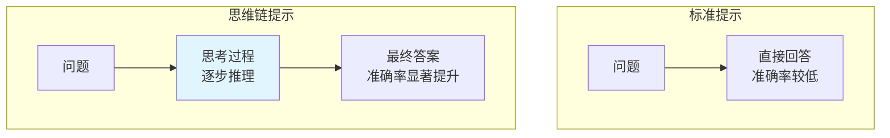
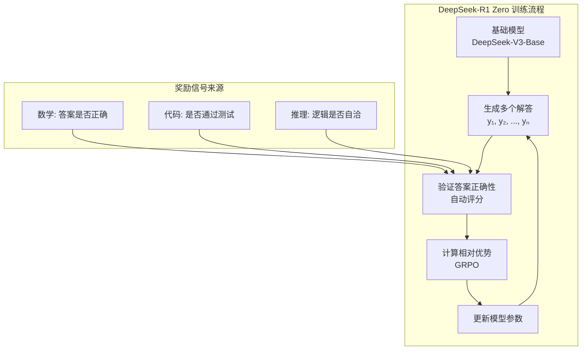

# 思维链与推理模型

在[上一章](alignment-new-paradigms.md)中，我们探讨了对齐新范式——DPO、KTO 与 GRPO。这些方法让模型学会了更好地遵循人类指令、符合人类偏好。但一个核心问题仍然存在：模型是真的"理解"了问题，还是在"猜测"答案？

2022 年，谷歌大脑的研究员杰森·韦（Jason Wei）等人发表了一篇改变大语言模型发展轨迹的论文《Chain-of-Thought Prompting Elicits Reasoning in Large Language Models》。他们发现了一个令人惊讶的现象：当模型被要求展示推理过程、逐步思考时，其推理能力出现了显著提升。这个发现催生了 **Chain of Thought**（思维链）的概念，并最终导致了推理模型的诞生——o1、DeepSeek-R1、o3 等模型展示了前所未有的推理能力，它们不再只是"直接回答"，而是学会了"先想后答"。

本文将从 Chain of Thought 的发现出发，探讨过程奖励模型（PRM）如何对推理步骤进行精细评分，介绍 DeepSeek-R1 如何通过纯强化学习实现推理能力的涌现，并分析模型推理时究竟发生了什么。

## Chain of Thought：让模型"想出来"

在[监督微调](../pretraining/supervised-finetuning.md)和[对齐训练](alignment-new-paradigms.md)中，我们一直关注的都是让模型给出更好的答案。但有一个更基本的问题被忽略了：模型是应该直接给出答案，还是应该先想清楚再回答？这个问题看似简单，却揭示了大语言模型推理能力提升的一条全新路径。

### 从"直接回答"到"先想后答"

考虑一个数学问题：

> 小明有 23 个苹果，给了小红 5 个，又买了 8 个，现在小明有多少个苹果？

**直接回答**模式：模型直接输出"26 个苹果"。

**思维链回答**模式：模型先输出思考过程：
```
1. 小明最初有 23 个苹果
2. 给了小红 5 个，剩下 23 - 5 = 18 个
3. 又买了 8 个，现在有 18 + 8 = 26 个
答案：26 个苹果
```

两种模式的区别显而易见：直接回答像是"猜答案"，思维链回答则是"算答案"。对于简单问题，两种模式可能都能得到正确答案；但当问题变复杂，需要多步推理时，直接回答就像是让人心算三位数乘法，而思维链则相当于给了你一张草稿纸。

### CoT Prompting 的发现

2022 年，杰森·韦（Jason Wei）等人在论文《Chain-of-Thought Prompting Elicits Reasoning in Large Language Models》中系统研究了这一现象。他们发现：**在提示词中加入推理过程的示范，可以显著提升模型在数学推理、常识推理等任务上的表现**。

实验设置如下：

**标准提示**（Standard Prompting）：
```
Q: 小明有 23 个苹果，给了小红 5 个，又买了 8 个，现在小明有多少个苹果？
A: 26 个苹果
```

**思维链提示**（Chain-of-Thought Prompting）：
```
Q: 小明有 23 个苹果，给了小红 5 个，又买了 8 个，现在小明有多少个苹果？
A: 小明最初有 23 个苹果。给了小红 5 个后，剩下 23 - 5 = 18 个。又买了 8 个，现在有 18 + 8 = 26 个。答案是 26 个苹果。
```

关键发现：当模型被要求展示思考过程时，其推理准确率显著提升。在 GSM8K 数学推理基准上，PaLM 540B 使用 CoT 提示后，准确率从 17.9% 提升到 56.9%——提升了三倍多。



### 为什么 CoT 有效？

思维链为什么能提升推理能力？答案藏在三个相互关联的机制中。

第一个机制是**分解复杂问题**。复杂问题往往需要多个推理步骤，直接回答时，模型试图在"一步"内完成所有推理，这就好比让一个人心算三位数乘法 —— 不是不可能，但极易出错。思维链将复杂问题分解为多个简单步骤，每一步只需要处理局部信息，认知负荷大大降低。例如一道多步数学题，直接回答时模型需要同时处理所有数字和运算关系，而思维链让模型逐步处理，每一步只关注当前的计算。

第二个机制是**激活相关知识**。语言模型在预训练时学习了大量知识，但这些知识可能是"隐性"的 —— 它们存在于模型的参数中，却不会自动被调用。思维链通过显式的推理步骤，像是一把钥匙打开了模型中相关知识的"锁"。在解决物理问题时，思维链会激活模型中关于物理公式、单位换算等知识，这些知识在直接回答时可能处于"休眠"状态，因为模型没有意识到它们与当前问题有关。

第三个机制是**提供纠错机会**。思维链的中间步骤为模型提供了"自我检查"的机会。如果某一步出现明显错误，模型可能在后续步骤中纠正，就像在草稿纸上解题时可以划掉重写一样。而直接回答一旦出错，就没有纠正的余地 —— 答案已经给出了。

### 零样本 CoT："Let's think step by step"

杰森·韦等人的研究使用的是**少样本 CoT**：在提示词中提供几个带有思维链的示例，让模型"学会"如何展示推理过程。但一个有趣的问题随之而来：如果模型本身已经具备推理能力，是否还需要示例来"教"它？

2022 年，日本先进科学技术研究所的儿岛佑介（Yusuke Kojima）等人给出了答案。他们在论文《Large Language Models are Zero-Shot Reasoners》中发现了一个更简洁的方法：**零样本 CoT**。只需在问题后加上"Let's think step by step"（让我们一步步思考），模型就会自动生成思维链。

```
Q: 一个班级有 35 名学生，其中 60% 是女生。女生有多少人？
A: Let's think step by step.
   首先，班级总人数是 35 人。
   女生占 60%，所以女生人数 = 35 × 0.6。
   35 × 0.6 = 21。
   答案是 21 人。
```

零样本 CoT 的意义在于：**无需精心设计示例，只需一句简单的提示，就能激活模型的推理能力**。这表明模型的推理能力在预训练时已经存在，只是需要被"唤醒"。就像一个学生其实已经掌握了知识，只是需要老师提醒"别急，一步一步来"就能做对题。

```python runnable
import torch
import torch.nn as nn
import torch.nn.functional as F
import matplotlib.pyplot as plt
import numpy as np

plt.rcParams['font.sans-serif'] = ['SimHei', 'DejaVu Sans']
plt.rcParams['axes.unicode_minus'] = False

# 模拟 CoT 提升效果
models = ['GPT-3 (175B)', 'PaLM (540B)', 'LLaMA-2 (70B)', 'GPT-4']
standard_acc = [15, 18, 25, 55]  # 标准提示准确率
cot_acc = [40, 57, 50, 85]       # CoT 提示准确率

fig, ax = plt.subplots(figsize=(12, 6))

x = np.arange(len(models))
width = 0.35

bars1 = ax.bar(x - width/2, standard_acc, width, label='标准提示', color='#90caf9')
bars2 = ax.bar(x + width/2, cot_acc, width, label='思维链提示', color='#4caf50')

# 添加数值标注
for bar, val in zip(bars1, standard_acc):
    ax.annotate(f'{val}%', xy=(bar.get_x() + bar.get_width()/2, bar.get_height()),
               xytext=(0, 3), textcoords='offset points', ha='center', fontsize=10)

for bar, val in zip(bars2, cot_acc):
    ax.annotate(f'{val}%', xy=(bar.get_x() + bar.get_width()/2, bar.get_height()),
               xytext=(0, 3), textcoords='offset points', ha='center', fontsize=10)

ax.set_xlabel('模型', fontsize=12)
ax.set_ylabel('GSM8K 准确率 (%)', fontsize=12)
ax.set_title('思维链提示对数学推理能力的提升', fontsize=14)
ax.set_xticks(x)
ax.set_xticklabels(models)
ax.legend()
ax.set_ylim(0, 100)
ax.grid(True, alpha=0.3, axis='y')

plt.tight_layout()
plt.savefig('/workspace/cot_improvement.png', dpi=150, bbox_inches='tight')
plt.show()

print("思维链提示的关键发现:")
print("1. 准确率提升显著：平均提升 2-3 倍")
print("2. 模型规模越大，CoT 效果越好")
print("3. 零样本 CoT 同样有效，无需示例")
```

从运行后的可视化图表中可以清晰看到：每个模型在使用思维链提示后，GSM8K 准确率都有显著提升。PaLM 540B 从 18% 跃升到 57%，GPT-4 从 55% 提升到 85%。更值得注意的是，模型规模越大，CoT 带来的提升越明显 —— 这意味着思维链并非简单的"提示技巧"，而是释放了大规模语言模型中潜藏的推理能力。

### CoT 的局限性

思维链并非万能药。它带来了推理能力的提升，同时也引入了新的问题。

最直接的问题是**计算成本增加**。思维链需要生成更多的 token，推理时间和成本都会相应增加。对于一个简单的是非题，让模型"一步步思考"可能是画蛇添足，白白浪费了算力。

更棘手的问题是**错误传播**。如果思维链的早期步骤出错，错误可能像多米诺骨牌一样传播到后续步骤，导致最终答案错误。与人类可以在草稿纸上划掉重来不同，模型生成的是一个线性的 token 序列，已经输出的错误步骤无法"撤回"。

此外，思维链对模型规模有**依赖性**。研究表明，CoT 的效果与模型规模正相关。小模型（如 7B 以下）使用 CoT 的效果提升有限，甚至可能出现"越想越错"的情况 —— 模型生成了看似合理但实际错误的推理步骤，反而把原本可能蒙对的答案也带偏了。

这些局限性暗示了一个更深层的问题：思维链让模型展示了推理过程，但它无法保证推理过程的正确性。如何让模型不仅"想出来"，还能"想对"？这就引出了下一节的主题 —— 过程奖励模型。

## 过程奖励模型（PRM）

上一节我们看到了思维链的局限性：模型可以展示推理过程，但无法保证推理过程的正确性。更糟糕的是，传统的训练方法只看最终答案 —— 答案对了就给奖励，答案错了就不给，完全忽略了中间步骤的质量。这种方法被称为**结果奖励模型**（Outcome Reward Model，ORM）。

ORM 的问题用一个类比就能说清楚：假设一个学生做数学题，前四步推理完全正确，只在最后一步抄错了数字，导致答案错误。ORM 会给这个学生零分，因为答案错了。但任何有经验的老师都会给部分分数，因为推理过程大部分是正确的。反过来，一个学生可能前几步推理全错，但碰巧蒙对了答案，ORM 却会给满分。这种"只看结果不看过程"的评价方式，显然无法有效指导模型学习正确的推理。

**过程奖励模型**（Process Reward Model，PRM）的提出正是为了解决这个问题：对推理过程的每一步进行评分，而非只评判最终答案。2023 年，亨特·莱特曼（Hunter Lightman）等人在论文《Let's Verify Step by Step》中系统研究了 PRM，并证明它在训练推理模型时远优于 ORM。

### ORM vs PRM

```nn-arch width=720
name: ORM vs PRM 架构对比
layout: horizontal

sections:
  - name: ORM（结果奖励）
    layers: [orm_input, orm_steps, orm_answer, orm_reward]
  - name: PRM（过程奖励）
    layers: [prm_input, prm_s1, prm_s2, prm_s3, prm_answer, prm_rewards]

layers:
  - {id: orm_input, name: "问题", type: input, size: "Q"}
  - {id: orm_steps, name: "推理步骤", type: process, size: "步骤1, 步骤2, 步骤3"}
  - {id: orm_answer, name: "答案", type: output, size: "A"}
  - {id: orm_reward, name: "奖励", type: reward, size: "正确=1<br/>错误=0"}
  - {id: prm_input, name: "问题", type: input, size: "Q"}
  - {id: prm_s1, name: "步骤1", type: process, size: "r₁=0.9"}
  - {id: prm_s2, name: "步骤2", type: process, size: "r₂=0.8"}
  - {id: prm_s3, name: "步骤3", type: process, size: "r₃=0.3"}
  - {id: prm_answer, name: "答案", type: output, size: "A"}
  - {id: prm_rewards, name: "过程奖励", type: reward, size: "每步评分"}
```

上图对比了 ORM 和 PRM 的核心差异。ORM 只看最终答案是否正确，给出一个二值奖励（0 或 1），就像考试只看最终结果给分。PRM 则对每个推理步骤评分，给出一个连续的奖励值（如 0.9、0.8、0.3），就像老师对每一步推导都批改打分。步骤 3 得分只有 0.3，说明这一步的推理存在问题，即使最终答案碰巧正确，PRM 也能识别出中间的薄弱环节。

### PRM 的训练数据

训练 PRM 需要对推理步骤进行标注，这比标注最终答案要昂贵得多。2023 年，莱特曼等人在论文《Let's Verify Step by Step》中提出了 PRM800K 数据集，包含 800,000 个带有步骤级标签的推理过程，这是 PRM 研究的里程碑。

标注流程如下：给定一个数学问题和参考解答，人类标注者对每个步骤进行判断，将步骤分为三类 —— **正确**（步骤逻辑正确，推导无误）、**错误**（步骤存在逻辑错误或计算错误）、**中性**（步骤不正确也不错误，如重复陈述或过渡性文字）。

一个标注示例如下：

```
问题：求方程 x² - 5x + 6 = 0 的解

步骤1：这是一个二次方程，可以用求根公式求解。
       标签：正确 ✓

步骤2：求根公式为 x = (-b ± √(b²-4ac)) / 2a
       标签：正确 ✓

步骤3：代入 a=1, b=-5, c=6，得 x = (5 ± √(25-24)) / 2
       标签：正确 ✓

步骤4：计算得 x = (5 ± 1) / 2，所以 x₁ = 3, x₂ = 2
       标签：正确 ✓

最终答案：x = 2 或 x = 3
```

这种步骤级标注虽然成本高昂，但为 PRM 提供了精细的学习信号。模型不仅能学到"这个解答是否正确"，还能学到"哪一步是正确的、哪一步出了问题"。

### PRM 的训练方法

PRM 的训练目标是学习一个评分函数 $r_\phi(s)$，对推理步骤 $s$ 进行评分。训练数据的形式为 $(x, \{s_1, ..., s_n\}, \{y_1, ..., y_n\})$，其中 $x$ 是问题，$s_i$ 是第 $i$ 个步骤，$y_i$ 是步骤标签（1 表示正确，0 表示错误）。

PRM 将步骤评分建模为二分类问题，损失函数定义如下：

$$\mathcal{L}_{PRM} = -\sum_{i=1}^{n} \left[ y_i \log \sigma(r_\phi(s_i)) + (1 - y_i) \log (1 - \sigma(r_\phi(s_i))) \right]$$

这个公式看着抽象，拆开来看含义很直观：
- $r_\phi(s_i)$ 是 PRM 对第 $i$ 个步骤的原始评分，分数越高表示模型认为该步骤越可能正确
- $\sigma$ 是 sigmoid 函数，将原始评分映射到 $[0, 1]$ 区间，得到"步骤正确的概率"
- $y_i$ 是步骤的真实标签，1 表示正确，0 表示错误
- $y_i \log \sigma(r_\phi(s_i))$ 是正确步骤的损失——PRM 给出的正确概率越高，损失越小
- $(1 - y_i) \log (1 - \sigma(r_\phi(s_i)))$ 是错误步骤的损失——PRM 给出的正确概率越低，损失越小
- $\sum_{i=1}^{n}$ 表示对所有步骤求和，确保每一步都得到恰当的评分
- 整体公式可以理解为：让 PRM 对正确步骤给出高分、对错误步骤给出低分，本质上就是[逻辑回归](../../statistical-learning/linear-models/logistic-regression.md)的多步版本

下面的代码演示了 PRM 的评分过程，模拟一个五步推理中前四步正确、最后一步出错的场景。

```python runnable
import torch
import torch.nn as nn
import torch.nn.functional as F
import matplotlib.pyplot as plt
import numpy as np

plt.rcParams['font.sans-serif'] = ['SimHei', 'DejaVu Sans']
plt.rcParams['axes.unicode_minus'] = False

class SimplePRM(nn.Module):
    """简化的过程奖励模型，对每个推理步骤输出一个评分"""
    def __init__(self, hidden_size=256):
        super().__init__()
        self.encoder = nn.Sequential(
            nn.Linear(hidden_size, 128),
            nn.ReLU(),
            nn.Linear(128, 64),
            nn.ReLU(),
            nn.Linear(64, 1)
        )

    def forward(self, step_embedding):
        """
        参数:
            step_embedding: (batch, hidden_size) 步骤的嵌入向量
        返回:
            score: (batch, 1) 步骤得分（原始分数，未经 sigmoid）
        """
        return self.encoder(step_embedding)

def prm_loss(model, step_embeddings, labels):
    """
    PRM 损失函数（对应理论中的 L_PRM 公式）

    参数:
        model: PRM 模型
        step_embeddings: (batch, hidden_size) 步骤嵌入
        labels: (batch,) 步骤标签 (1=正确, 0=错误)
    """
    scores = model(step_embeddings).squeeze(-1)
    probs = torch.sigmoid(scores)
    loss = F.binary_cross_entropy(probs, labels.float())
    return loss, scores

# 模拟 PRM 评分
torch.manual_seed(42)

# 模拟一个推理过程的步骤嵌入
hidden_size = 256
num_steps = 5

# 步骤嵌入（模拟）
step_embeddings = torch.randn(num_steps, hidden_size)

# 步骤标签：前4步正确，最后一步错误
labels = torch.tensor([1.0, 1.0, 1.0, 1.0, 0.0])

# 创建模型并计算分数
model = SimplePRM(hidden_size)
with torch.no_grad():
    scores = model(step_embeddings).squeeze(-1)
    probs = torch.sigmoid(scores)

print("PRM 步骤评分演示")
print("=" * 50)
print(f"{'步骤':<10} {'标签':<10} {'原始分数':<15} {'正确概率':<10}")
print("-" * 50)

step_names = ['步骤1', '步骤2', '步骤3', '步骤4', '步骤5']
for i, (name, label, score, prob) in enumerate(zip(step_names, labels, scores, probs)):
    label_str = '正确 ✓' if label == 1 else '错误 ✗'
    print(f"{name:<10} {label_str:<10} {score.item():<15.4f} {prob.item():<10.4f}")

# 可视化
fig, axes = plt.subplots(1, 2, figsize=(14, 5))

# 左图：步骤得分
colors = ['green' if l == 1 else 'red' for l in labels]
axes[0].bar(step_names, probs.numpy(), color=colors, alpha=0.7)
axes[0].axhline(y=0.5, color='gray', linestyle='--', label='决策边界')
axes[0].set_xlabel('推理步骤', fontsize=12)
axes[0].set_ylabel('正确概率', fontsize=12)
axes[0].set_title('PRM 对每个步骤的评分', fontsize=14)
axes[0].set_ylim(0, 1)
axes[0].legend()
axes[0].grid(True, alpha=0.3, axis='y')

# 右图：ORM vs PRM 对比
methods = ['ORM', 'PRM']
correct_case = [1.0, 0.9]  # 全对的情况
partial_case = [0.0, 0.6]  # 部分对的情况

x = np.arange(len(methods))
width = 0.35

bars1 = axes[1].bar(x - width/2, correct_case, width, label='全对', color='green', alpha=0.7)
bars2 = axes[1].bar(x + width/2, partial_case, width, label='部分对', color='orange', alpha=0.7)

axes[1].set_xlabel('奖励模型', fontsize=12)
axes[1].set_ylabel('奖励值', fontsize=12)
axes[1].set_title('ORM vs PRM：不同情况的奖励对比', fontsize=14)
axes[1].set_xticks(x)
axes[1].set_xticklabels(methods)
axes[1].legend()
axes[1].set_ylim(0, 1.2)
axes[1].grid(True, alpha=0.3, axis='y')

plt.tight_layout()
plt.savefig('/workspace/prm_scoring.png', dpi=150, bbox_inches='tight')
plt.show()

print("\nPRM 的优势:")
print("1. 精细反馈：指出具体哪一步出错")
print("2. 部分奖励：即使最终答案错误，正确步骤也能获得奖励")
print("3. 更好的学习信号：帮助模型学习正确的推理过程")
```

从运行结果可以看到，PRM 对前四个正确步骤给出了较高的正确概率，而对第五个错误步骤给出了较低的概率。右图更直观地展示了 ORM 与 PRM 的差异：当推理全对时，两者都给出高奖励；但当推理部分正确时，ORM 给出零奖励，而 PRM 仍然给出了 0.6 的部分奖励。这种"部分分数"机制正是 PRM 的价值所在 —— 它告诉模型"你大部分做对了，只需要修正这一步"。

### PRM 的应用

PRM 在推理模型训练中有两个主要应用场景。

第一个场景是**最佳选择**（Best-of-N）。给定一个问题，模型生成 $N$ 个候选解答，用 PRM 对每个解答的所有步骤评分，选择总分最高的解答。这就像让 $N$ 个学生分别解题，然后请一位严格的老师逐批改每份答卷，选出得分最高的那份。PRM 的步骤级评分使得这种选择更加可靠 —— 它不会选出一个"碰巧蒙对"的解答，而是选择推理过程最扎实的那个。

第二个场景是**强化学习训练**。用 PRM 作为奖励信号，通过强化学习优化模型的推理能力。每一步推理都获得 PRM 的评分，累积评分作为最终奖励。与 ORM 只在最后给一个 0 或 1 的信号相比，PRM 在每一步都提供反馈，学习信号更加密集和精确。这种精细的奖励信号使得模型能够更有效地学习正确的推理模式，而不是靠"猜对答案"来获得奖励。

## 推理模型的训练

思维链和过程奖励模型为推理模型的诞生奠定了基础，但它们仍然停留在"提示工程"和"奖励设计"的层面 —— 模型需要人类示范如何推理，或者需要人类标注每一步是否正确。一个自然的问题是：模型能否自己学会推理，无需人类一步步教导？

2024-2025 年，OpenAI 的 o1 和 DeepSeek 的 R1 给出了肯定的答案。它们展示了推理能力的新高度，也揭示了推理模型训练的全新范式。本节探讨这些推理模型是如何训练的。

### 从 SFT + RL 到纯 GRPO 自进化

在[对齐训练](alignment-new-paradigms.md)中，我们已经了解了 SFT + RL 的训练范式：先用监督微调让模型学会基本格式，再用强化学习进一步优化。传统的推理模型训练同样遵循这个流程 —— 先用带有思维链的高质量数据微调模型（SFT），再用 PRM 或 ORM 作为奖励信号进行强化学习（RL）。

这个流程的问题在于：**SFT 数据的质量决定了模型的上限**。如果 SFT 数据中的推理过程有误，模型会学习错误的推理模式。更根本的问题是，高质量的推理数据非常稀缺 —— 能让人类专家逐步标注推理过程的数学问题数量有限，而且标注成本极高。

DeepSeek 团队提出了一个大胆的想法：**跳过 SFT，直接用强化学习训练**。这个想法来自一个关键观察：对于推理任务，正确答案本身就是奖励信号，无需人类标注推理过程。数学题的答案可以自动验证对错，代码可以通过测试用例判断是否正确。这意味着奖励信号是"免费"的，只需要模型自己生成解答、自己验证答案、自己从中学习。DeepSeek 使用的是[GRPO](alignment-new-paradigms.md)（Group Relative Policy Optimization），一种无需额外评论家模型的强化学习算法。

### DeepSeek-R1 Zero：纯 RL 的突破

2025 年 1 月，DeepSeek 团队发布了 DeepSeek-R1 Zero——一个实验性模型，它**直接从基础模型开始，仅用 GRPO 训练，无需任何 SFT 数据**。这个实验的结果震惊了整个 AI 社区。

**训练流程**：



训练过程如上图所示：基础模型对同一个问题生成多个候选解答，系统自动验证每个解答的正确性，然后用 GRPO 计算每个解答相对于组内平均的优劣程度，据此更新模型参数。奖励信号完全来自任务本身 —— 数学题看答案是否正确，代码题看是否通过测试，推理题看逻辑是否自洽。

最令人惊讶的发现是**推理能力的涌现**。经过足够的 RL 训练后，模型自主涌现出了三种推理行为：**自我验证**（Self-Verification），即在得到答案后主动检查正确性；**回溯纠错**（Backtracking），即在发现推理矛盾时主动返回修正；**多路径探索**（Multi-path Exploration），即尝试多种方法解决问题。这些行为并非通过 SFT 示范教给模型的，而是模型在强化学习过程中自己"发明"的。

这意味着一个深刻的事实：**推理能力是语言模型的"内在潜能"**，它不需要被教，只需要被释放。就像一个学生可能天生就有验算的习惯，只是以前没有人告诉他可以这么做 —— 当他发现验算能帮他得到更高的分数时，这个习惯就自然形成了。

### DeepSeek-R1：SFT + RL 的结合

虽然 DeepSeek-R1 Zero 展示了纯 RL 的潜力，但它也有一些实际问题：输出格式不够规范，推理过程有时冗余，训练初期不稳定。DeepSeek-R1（正式版）采用了更稳健的方案：**少量 SFT + 大规模 RL**。

训练流程分为四个阶段：首先用约 8000 条高质量推理数据进行**冷启动 SFT**，让模型初步学会推理格式；然后用 GRPO 进行**大规模 RL 训练**，让模型自主探索推理策略；接着从 RL 模型生成的高质量解答中进行**拒绝采样**，筛选出最佳推理样本；最后用这些采样数据再次进行**最终 SFT**，巩固推理能力。

为什么需要少量 SFT？纯 RL 训练虽然能涌现推理能力，但训练过程可能不稳定 —— 模型可能陷入重复输出或格式混乱的状态。SFT 提供了更好的初始化，就像给学生一个解题模板，让他知道"推理过程应该长什么样"，然后让他自己去探索更优的解法。8000 条数据看似很少，但足以引导模型进入"推理模式"，剩下的提升全靠 RL 自主完成。

```python runnable
import matplotlib.pyplot as plt
import numpy as np

plt.rcParams['font.sans-serif'] = ['SimHei', 'DejaVu Sans']
plt.rcParams['axes.unicode_minus'] = False

# 模拟 DeepSeek-R1 训练过程
fig, axes = plt.subplots(1, 2, figsize=(14, 5))

# 左图：训练阶段
stages = ['基础模型', '冷启动 SFT', 'RL 训练', '拒绝采样', '最终 SFT']
performance = [20, 45, 75, 85, 90]
colors = ['#90caf9', '#81c784', '#ffb74d', '#f06292', '#4db6ac']

axes[0].bar(stages, performance, color=colors, alpha=0.8)
axes[0].set_xlabel('训练阶段', fontsize=12)
axes[0].set_ylabel('推理能力（相对分数）', fontsize=12)
axes[0].set_title('DeepSeek-R1 训练流程', fontsize=14)
axes[0].set_ylim(0, 100)
axes[0].grid(True, alpha=0.3, axis='y')

for i, (stage, perf) in enumerate(zip(stages, performance)):
    axes[0].annotate(f'{perf}', xy=(i, perf), xytext=(0, 3),
                    textcoords='offset points', ha='center', fontsize=11)

# 右图：R1-Zero vs R1 对比
models = ['DeepSeek-V3-Base', 'R1-Zero\n(纯RL)', 'R1\n(SFT+RL)']
math_acc = [25, 71, 79]
code_acc = [30, 65, 72]
reason_acc = [20, 68, 77]

x = np.arange(len(models))
width = 0.25

bars1 = axes[1].bar(x - width, math_acc, width, label='数学推理', color='#4caf50')
bars2 = axes[1].bar(x, code_acc, width, label='代码生成', color='#2196f3')
bars3 = axes[1].bar(x + width, reason_acc, width, label='逻辑推理', color='#ff9800')

axes[1].set_xlabel('模型', fontsize=12)
axes[1].set_ylabel('准确率 (%)', fontsize=12)
axes[1].set_title('R1-Zero vs R1 性能对比', fontsize=14)
axes[1].set_xticks(x)
axes[1].set_xticklabels(models)
axes[1].legend()
axes[1].set_ylim(0, 100)
axes[1].grid(True, alpha=0.3, axis='y')

plt.tight_layout()
plt.savefig('/workspace/deepseek_r1_training.png', dpi=150, bbox_inches='tight')
plt.show()

print("DeepSeek-R1 训练的关键发现:")
print()
print("1. 纯 RL 可以涌现推理能力")
print("   - R1-Zero 无需 SFT 数据，仅用 RL 就获得了强大的推理能力")
print("   - 这表明推理能力是语言模型的'内在潜能'")
print()
print("2. 少量 SFT 提升稳定性")
print("   - 8000 条高质量数据足以引导模型进入'推理模式'")
print("   - SFT + RL 的组合比纯 RL 更稳定、更高效")
print()
print("3. GRPO 的自进化机制")
print("   - 无需人类标注推理过程")
print("   - 奖励信号来自任务本身（答案正确性）")
print("   - 模型自主探索推理策略")
```

从左图可以看到，DeepSeek-R1 的训练过程中，RL 阶段贡献了最大的能力提升（从 45 跃升到 75），远超冷启动 SFT 的效果。右图则对比了三种模型的性能：R1-Zero（纯 RL）已经大幅超越了基础模型，而 R1（SFT+RL）在各项指标上又进一步领先，尤其是在数学推理上从 71% 提升到 79%。这说明少量 SFT 数据虽然不是推理能力的来源，但确实能帮助模型更有效地释放潜力。

### o1 与 o3：OpenAI 的推理模型

OpenAI 的 o1（2024 年 9 月发布）和 o3（2024 年 12 月发布）是推理模型的另一个代表。虽然技术细节未完全公开，但从公开信息和使用体验可以推断其核心特点。

o1 的标志特征是**思考时间**：模型在回答前会"思考"更长时间，生成更长的思维链。与之前的模型追求"秒回"不同，o1 允许自己在给出答案前进行深入推理，包括自我纠错和多种方法的尝试。在数学竞赛、编程竞赛等需要深度推理的任务上，o1 的表现远超此前的 GPT-4o。

o3 则在 o1 的基础上实现了两个突破：更强的推理能力和更高效的推理。在 ARC-AGI 基准上，o3 达到了 87.5% 的准确率，接近人类水平（约 85%）。同时，o3 展示了**自适应思考**的能力 —— 根据问题复杂度调整思考时间，简单问题快速回答，复杂问题深入思考。这与[下一章](test-time-compute.md)将要讨论的 Test-Time Compute Scaling 密切相关。

## 推理行为分析

上一节我们看到，DeepSeek-R1 Zero 通过纯 RL 训练涌现出了自我验证、回溯纠错、多路径探索等推理行为。这些行为并非偶然，而是推理模型的共性特征。本节将深入分析这些行为的具体表现和运作机制，帮助我们理解推理模型"思考时到底发生了什么"。

### 自我验证

自我验证是推理模型最核心的能力之一。模型在得到答案后，会主动检查答案的正确性，就像学生在做完题后会验算一遍。

**行为模式**：

```
推理 → 得到答案 → 验证答案 → 确认/修正
```

**示例**：

```
问题：计算 17 × 23

模型推理：
17 × 23 = 17 × (20 + 3) = 340 + 51 = 391

验证：
391 ÷ 17 = 23 ✓
391 ÷ 23 = 17 ✓

答案是 391
```

模型在得到 391 后，并没有直接停下，而是用除法反验了乘法的结果。这种"反向验证"的行为与人类解题时的习惯高度一致。研究表明，具有自我验证能力的模型在复杂推理任务上的准确率提升 10-20%，代价是增加约 20% 的推理时间。这是一个值得的 trade-off：用少量额外时间换取更高的准确率。

### 回溯纠错

回溯纠错比自我验证更进一步：模型不仅在得到答案后检查，而是在推理过程中发现矛盾时，主动返回之前的步骤重新思考。

**行为模式**：

```
推理步骤 A → 推理步骤 B → 发现矛盾 → 回溯到 A → 修正推理
```

**示例**：

```
问题：小明比小红大 3 岁，5 年后小明的年龄是小红的 2 倍，求小明现在的年龄。

模型推理：
设小红现在 x 岁，则小明 x + 3 岁
5 年后：小红 x + 5 岁，小明 x + 8 岁
根据题意：x + 8 = 2(x + 5)
解得：x + 8 = 2x + 10，x = -2

等等，年龄不能是负数，说明我的假设有问题。
让我重新理解题目...

重新分析：
"5 年后小明的年龄是小红的 2 倍"
设 5 年后小红 y 岁，则小明 2y 岁
现在：小红 y - 5 岁，小明 2y - 5 岁
年龄差：2y - 5 - (y - 5) = y
但题目说年龄差是 3 岁，所以 y = 3

这也不对，让我再检查...

（模型继续探索，直到找到正确解法）
```

回溯纠错展示了模型的"元认知"能力：它不仅能推理，还能监控自己的推理过程，发现不合理之处就主动折返。约 65% 的问题至少会出现一次回溯，而复杂问题的回溯次数更多。这种行为在纯 RL 训练中自发涌现，没有人教过模型"应该在发现矛盾时回头"。

### 多路径探索

多路径探索是指模型尝试多种方法解决问题，然后比较和验证不同路径的结果。

**行为模式**：

```
问题 → 方法 A → 结果 A
     → 方法 B → 结果 B
     → 方法 C → 结果 C
     → 比较/验证 → 最终答案
```

**示例**：

```
问题：求方程 x³ - 6x² + 11x - 6 = 0 的所有实根。

模型推理：
方法一：因式分解
观察系数和：1 - 6 + 11 - 6 = 0，所以 x = 1 是根
多项式除法：(x³ - 6x² + 11x - 6) ÷ (x - 1) = x² - 5x + 6
继续分解：x² - 5x + 6 = (x - 2)(x - 3)
所以 x = 1, 2, 3

方法二：代入验证
f(1) = 1 - 6 + 11 - 6 = 0 ✓
f(2) = 8 - 24 + 22 - 6 = 0 ✓
f(3) = 27 - 54 + 33 - 6 = 0 ✓

两种方法得到相同结果，答案是 x = 1, 2, 3
```

多路径探索的价值在于**交叉验证**：当不同方法得到相同结果时，答案的可信度大大增加。当然，探索多条路径意味着更多的时间和计算成本。对于高价值问题（如数学证明、关键决策），这种投入是值得的；对于简单问题，模型通常会自动选择单路径快速求解。

### 推理行为的可视化

下面的代码通过模拟数据，可视化展示三种推理行为的特征和效果。

```python runnable
import matplotlib.pyplot as plt
import numpy as np

plt.rcParams['font.sans-serif'] = ['SimHei', 'DejaVu Sans']
plt.rcParams['axes.unicode_minus'] = False

# 模拟推理过程中的行为
fig, axes = plt.subplots(2, 2, figsize=(14, 10))

# 左上：自我验证的影响
steps = ['初始答案', '验证后', '最终答案']
without_verify = [75, 75, 75]
with_verify = [75, 82, 88]

x = np.arange(len(steps))
width = 0.35

axes[0, 0].bar(x - width/2, without_verify, width, label='无自我验证', color='#90caf9')
axes[0, 0].bar(x + width/2, with_verify, width, label='有自我验证', color='#4caf50')
axes[0, 0].set_xlabel('推理阶段', fontsize=12)
axes[0, 0].set_ylabel('准确率 (%)', fontsize=12)
axes[0, 0].set_title('自我验证对准确率的影响', fontsize=14)
axes[0, 0].set_xticks(x)
axes[0, 0].set_xticklabels(steps)
axes[0, 0].legend()
axes[0, 0].set_ylim(0, 100)
axes[0, 0].grid(True, alpha=0.3, axis='y')

# 右上：回溯次数分布
backtrack_counts = [0, 1, 2, 3, 4, 5]
problem_percentages = [30, 35, 20, 10, 4, 1]

axes[0, 1].bar(backtrack_counts, problem_percentages, color='#ff9800', alpha=0.8)
axes[0, 1].set_xlabel('回溯次数', fontsize=12)
axes[0, 1].set_ylabel('问题占比 (%)', fontsize=12)
axes[0, 1].set_title('推理过程中的回溯次数分布', fontsize=14)
axes[0, 1].grid(True, alpha=0.3, axis='y')

# 左下：多路径探索
methods = ['单路径', '双路径', '三路径', '多路径']
accuracy = [78, 85, 89, 92]
time_cost = [1.0, 1.8, 2.5, 3.2]

ax2 = axes[1, 0].twinx()
bars1 = axes[1, 0].bar(methods, accuracy, color='#4caf50', alpha=0.7, label='准确率')
line = ax2.plot(methods, time_cost, 'ro-', linewidth=2, markersize=8, label='时间成本')

axes[1, 0].set_xlabel('探索路径数', fontsize=12)
axes[1, 0].set_ylabel('准确率 (%)', fontsize=12, color='#4caf50')
ax2.set_ylabel('相对时间成本', fontsize=12, color='red')
axes[1, 0].set_title('多路径探索：准确率 vs 时间成本', fontsize=14)
axes[1, 0].set_ylim(0, 100)
ax2.set_ylim(0, 4)
axes[1, 0].grid(True, alpha=0.3, axis='y')

# 右下：推理行为的时间线
timeline = np.arange(0, 100, 1)
think_intensity = np.sin(timeline / 10) * 0.3 + 0.5 + np.random.randn(100) * 0.1
verify_points = [25, 50, 75]
backtrack_points = [40]

axes[1, 1].plot(timeline, think_intensity, 'b-', linewidth=1.5, alpha=0.7, label='思考强度')
axes[1, 1].scatter(verify_points, [0.7, 0.8, 0.75], s=100, c='green', marker='✓', label='验证点', zorder=5)
axes[1, 1].scatter(backtrack_points, [0.4], s=150, c='red', marker='x', label='回溯点', zorder=5)

axes[1, 1].axhline(y=0.5, color='gray', linestyle='--', alpha=0.5)
axes[1, 1].set_xlabel('推理时间（相对）', fontsize=12)
axes[1, 1].set_ylabel('思考强度', fontsize=12)
axes[1, 1].set_title('推理过程时间线', fontsize=14)
axes[1, 1].legend(loc='upper right')
axes[1, 1].set_ylim(0, 1)
axes[1, 1].grid(True, alpha=0.3)

plt.tight_layout()
plt.savefig('/workspace/reasoning_behavior.png', dpi=150, bbox_inches='tight')
plt.show()

print("推理行为分析总结:")
print()
print("1. 自我验证")
print("   - 在关键步骤后主动检查")
print("   - 提升准确率 10-15%")
print("   - 增加约 20% 推理时间")
print()
print("2. 回溯纠错")
print("   - 发现矛盾时主动回溯")
print("   - 约 65% 的问题至少回溯一次")
print("   - 复杂问题回溯次数更多")
print()
print("3. 多路径探索")
print("   - 尝试多种解法")
print("   - 准确率提升但时间成本增加")
print("   - 适合高价值问题")
```

从四张图中可以清晰地看到三种推理行为的特征。左上图展示了自我验证的价值：没有验证时准确率停在 75%，有验证时逐步提升到 88%。右上图显示，约 70% 的问题会出现至少一次回溯，说明回溯纠错是推理的常态而非例外。左下图揭示了多路径探索的 trade-off：从单路径到多路径，准确率从 78% 提升到 92%，但时间成本也从 1 倍增长到 3.2 倍。右下图的推理时间线则综合展示了整个推理过程中思考强度的波动、验证点的出现以及回溯的发生。

## 小结

本文从"让模型学会思考"这一问题出发，沿着"发现推理能力→精细化奖励→训练推理模型→分析推理行为"的路径，系统探讨了思维链与推理模型的核心技术。

Chain of Thought 的发现揭示了一个关键事实：模型在预训练时已经具备了推理能力的"种子"，只需要一句"Let's think step by step"就能将其唤醒。思维链通过分解问题、激活知识、提供纠错机会三个机制提升推理表现，但也受限于计算成本、错误传播和模型规模依赖。

过程奖励模型（PRM）解决了"如何评判推理过程"的问题。与 ORM 只看最终答案不同，PRM 对每一步推理评分，为模型提供精细的学习信号。这种"过程导向"的评价方式，使得模型能够学到正确的推理模式，而非靠"猜对答案"来获得奖励。

推理模型的训练则揭示了一个更深刻的发现：推理能力是语言模型的内在潜能。DeepSeek-R1 Zero 仅通过纯 RL 训练就让模型自主涌现出自我验证、回溯纠错、多路径探索等推理行为，无需人类一步步教导。而 DeepSeek-R1 在此基础上加入少量 SFT 数据，进一步提升了稳定性和性能。

然而，推理模型并非完美。思维链可能一步错步步错，模型可能在推理过程中编造看似合理的"伪事实"，同一问题多次采样可能给出矛盾答案。这些可靠性问题将在后续章节中深入讨论。下一章我们将探讨 Test-Time Compute Scaling——如何通过在推理阶段投入更多算力来获得更好的答案，以及推理算力与推理质量之间的定量关系。

## 练习题

1. 从认知负荷、知识激活和纠错机会三个角度，分析思维链提示为什么能提升模型的推理能力。

   <details>
   <summary>参考答案</summary>

   从认知负荷角度看，思维链将复杂的多步推理分解为多个单步推理，每一步只需要处理局部信息，降低了模型在单次前向传播中需要同时处理的推理负荷。从知识激活角度看，显式的推理步骤像是一把钥匙，激活了模型在预训练中学到但处于"休眠"状态的相关知识。从纠错机会角度看，思维链的中间步骤为模型提供了自我检查的可能，而直接回答一旦出错就没有纠正的余地。

   </details>

2. 对比 ORM 和 PRM 的优劣，包括数据需求、训练复杂度和适用场景。

   <details>
   <summary>参考答案</summary>

   ORM 只需要最终答案的正确性标签，数据获取成本低；PRM 需要步骤级标签，标注成本高昂（如 PRM800K 需要 800,000 个步骤标注）。训练复杂度上，ORM 训练简单，只需二分类；PRM 需要为每一步建模评分，训练更复杂。适用场景上，ORM 适合答案易于验证的任务（如数学题、代码），PRM 适合需要精细反馈的训练场景（如强化学习中的奖励信号）。PRM 的优势在于能区分"推理对但答案错"和"推理错但答案对"两种情况，提供更精确的学习信号。

   </details>

3. 设计一个实验，验证零样本 CoT 在不同规模模型上的效果差异。

   <details>
   <summary>参考答案</summary>

   实验设计：选择同一模型系列的不同规模版本（如 LLaMA-2 7B、13B、70B），在 GSM8K 数学推理基准上分别测试标准提示和零样本 CoT 提示（加 "Let's think step by step"）的准确率。预期结果：小模型（7B）的 CoT 提升有限，甚至可能下降；大模型（70B）的 CoT 提升显著。这验证了 CoT 效果与模型规模正相关，推理能力在足够大的模型中才能被有效激活。

   </details>

4. 分析以下推理过程中体现了哪些推理行为：

   ```
   问题：一个数的 3 倍比它的 2 倍多 15，求这个数。

   推理过程：
   设这个数为 x。
   3x = 2x + 15
   3x - 2x = 15
   x = 15

   验证：3 × 15 = 45，2 × 15 = 30，45 - 30 = 15 ✓
   答案是 15。
   ```

   <details>
   <summary>参考答案</summary>

   该推理过程体现了**自我验证**行为。模型在得到 x = 15 后，没有直接给出答案，而是将 x = 15 代回原问题进行验证：3 × 15 = 45，2 × 15 = 30，45 - 30 = 15，确认满足"3 倍比 2 倍多 15"的条件。这种"解出答案后反向验证"的行为是自我验证的典型表现。

   </details>

5. 假设你有一个 7B 参数的基础语言模型和 1000 道带答案但无推理过程标注的数学题，设计一个推理模型的训练方案。

   <details>
   <summary>参考答案</summary>

   训练方案如下：

   第一步，用基础模型对每道题生成多个候选解答（如 N=8），通过 GRPO 的组内相对比较来提供奖励信号，无需步骤级标注。

   第二步，将答案正确的解答筛选出来，作为冷启动 SFT 数据，微调模型学习基本的推理格式。

   第三步，用 GRPO 进行大规模 RL 训练，让模型自主探索更优的推理策略，奖励信号来自答案正确性（可自动验证）。

   第四步，从 RL 模型生成的高质量解答中进行拒绝采样，用采样数据再次 SFT 巩固推理能力。

   预期效果：由于模型规模较小（7B），CoT 效果可能有限，但通过 RL 训练仍能获得一定的推理能力提升。如果效果不理想，可考虑使用更大模型的蒸馏数据来辅助训练。

   </details>