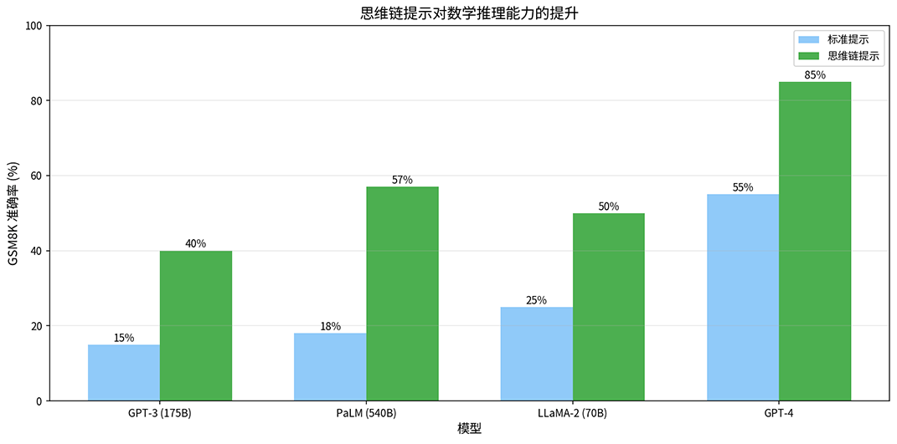
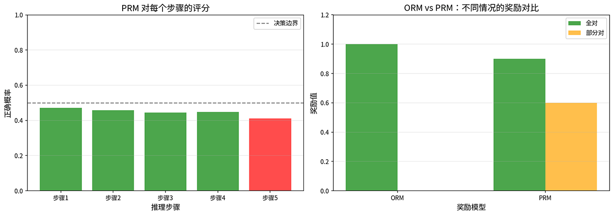
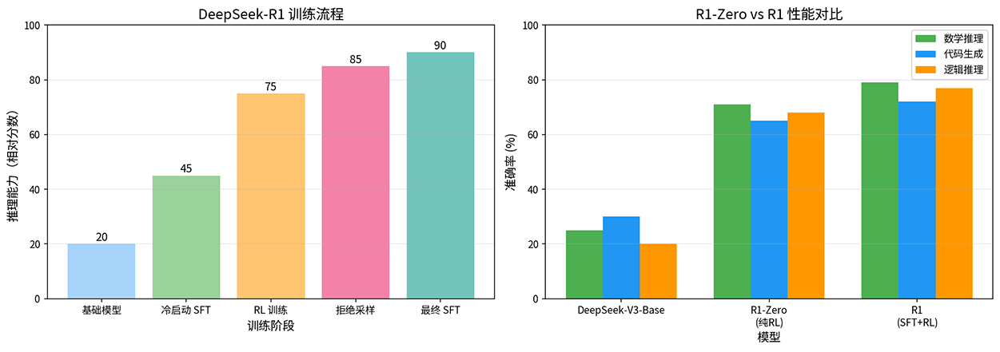

# 思维链与推理模型

2022 年，谷歌大脑的论文《Chain-of-Thought Prompting Elicits Reasoning in Large Language Models》发现当模型被要求展示推理过程、逐步思考时，其推理能力出现了显著提升。这个现象催生了对**思维链**（Chain of Thought，CoT）的研究，并最终导致了推理模型（如 GPT-o1/o3、DeepSeek-R1）的诞生，它们不只是学会回答问题，更学会了有条理的深度思考。

## 思维链

2022 年，谷歌大脑的研究员杰森·韦（Jason Wei）等人提出思维链的概念，指在提示词中加入推理过程的示范，可以显著提升模型在数学推理、常识推理等任务上的表现。如果你对模型提出以下问题：

> 小明有 23 个苹果，给了小红 5 个，又买了 8 个，现在小明有多少个苹果？

在**标准提示**（Standard Prompting）下，模型会直接给出回复"26 个苹果"。而在**思维链提示**（Chain-of-Thought Prompting）下，模型给予的回复可能是这样的：

> 1. 小明最初有 23 个苹果
> 2. 给了小红 5 个，剩下 23 - 5 = 18 个
> 3. 又买了 8 个，现在有 18 + 8 = 26 个
>
> 答案：26 个苹果

直接回答像是猜测答案，思维链回答则是推算答案。对于简单问题，两种模式可能都能得到正确结果。但当问题变复杂，需要多步推理时，思维链就能使模型推理准确率显著提升。在 [GSM8K](https://huggingface.co/datasets/openai/gsm8k) 数学推理基准上，PaLM 540B 使用 CoT 提示后，准确率从 17.9% 提升到 56.9%，其他模型也有类似的比例，模型规模越大 CoT 效果越明显，如下图所示。

*图：不同模型在标准提示与思维链提示下的 GSM8K 准确率对比*

思维链提升模型的推理能力是三个相互关联机制共同作用的结果：

- **分解复杂问题**。复杂问题往往需要多个推理步骤，思维链将复杂问题分解为多个简单步骤，每一步只需要处理局部信息，认知负荷大幅降低。一道复杂的数学题，直接回答时模型需要同时处理所有数字和运算关系，而思维链让模型逐步处理，每一步只关注当前的计算。

- **激活相关知识**。语言模型在预训练时学习到大量知识，这些知识存在于模型的参数中，不会自动被调用。思维链通过显式的推理步骤，像是一把钥匙打开了模型中相关知识的锁。在解决物理问题时，思维链会激活模型中关于物理公式、单位换算等知识，这些知识在直接回答时可能处于休眠状态，因为模型没有意识到它们与当前问题有关。

- **提供纠错机会**。思维链的中间步骤为模型提供了自我检查的机会。如果某一步出现明显错误，模型可能在后续步骤中纠正，就像在草稿纸上解题时可以划掉重写一样。而直接回答一旦出错，就没有纠正的余地，因为答案已经给出了。

谷歌大脑的研究使用的是**少样本思维链**（Few-Shot CoT），需在提示词中提供几个带有思维链的示例，让模型学会如何推理。2022 年，日本先进科学技术研究所的儿岛佑介（Yusuke Kojima）在论文《Large Language Models are Zero-Shot Reasoners》中提出，如果模型本身已经具备推理能力，**零样本思维链**（Zero-Shot CoT）就可以引导模型做出准确的推理。只需在问题后加上特定的提示词，如 "Let's think step by step"（让我们一步步思考），模型就能自动生成思维链，自我引导进行分析推理。

零样本 CoT 意味着无需精心设计示例，只需一句简单的提示，就能激活模型的推理能力。这表明模型的推理能力在预训练时已经存在，只是需要被外界唤醒。思维链也不是简单的语言技巧，而是释放了大规模语言模型中潜藏的推理能力。

思维链带来了推理能力的提升，但并非所有场合都应该使用它，这主要是计算成本的考量。思维链需要生成远比标准提示更多的 token，推理时间和计算成本都会相应增加。简单的问题让模型一步步思考反而画蛇添足，白白浪费了算力。另一方面，思维链对模型规模有依赖。研究表明，CoT 的效果与模型规模正相关。小模型（如 7B 以下）使用 CoT 的效果提升有限，甚至可能出现"越想越错"的情况，模型生成了看似合理但实际错误的推理步骤，更加具有迷惑性。这些局限性说明思维链虽然让模型展示推理过程，却无法保证推理过程的正确性。为了解决这个问题，催生了过程奖励模型。

## 过程奖励模型

传统的模型训练方法只看最终结果，答案对了才给奖励，完全忽略了中间步骤的质量，这种训练方法被称为**结果奖励模型**（Outcome Reward Model，ORM）。ORM 与人类的学习体验并不一致：学生做题，如果前四步推理正确，只在最后一步算错了数字，任何有经验的老师都会给部分分数，但 ORM 依然会给这个学生打零分。反过来，学生可能前几步推理全错，只是最后碰巧蒙对了答案，ORM 却会给满分。这种只看结果不看过程的评价方式，不仅无法教好人类学生，也无法有效指导模型学习到正确的推理方法。**过程奖励模型**（Process Reward Model，PRM）的提出正是为了对推理过程的步骤进行评分。2023 年，亨特·莱特曼（Hunter Lightman）在论文《Let's Verify Step by Step》中提出了 PRM，并证明它在训练推理模型时远优于 ORM。

训练 PRM 需要对推理步骤进行标注，标注数据的形式为 $(x, \{s_1, ..., s_n\}, \{y_1, ..., y_n\})$，其中 $x$ 是问题，$s_i$ 是第 $i$ 个步骤，$y_i$ 是结果标签。步骤级标注比结果级标注要昂贵得多，譬如给定一个数学问题和参考推理过程，人类标注者要对每个步骤进行判断，将步骤分为"正确"（步骤逻辑正确，推导无误）、"错误"（步骤存在逻辑错误或计算错误）、"中性"（步骤不正确也不错误，如重复陈述或过渡性文字）三种结果标签。莱特曼论文中提出了 [PRM800K](https://github.com/openai/prm800k) 数据集，包含 80 万个带有步骤级结果标签的推理过程。一个推理的标注示例如下：

> 问题：求方程 $x^2 - 5x + 6 = 0$ 的解
>
> - 步骤1：这是一个二次方程，可以用求根公式求解。
>   - 标签：正确 ✓
>
> - 步骤2：求根公式为 $x = \dfrac{-b \pm \sqrt{b^2-4ac}}{2a}$
>   - 标签：正确 ✓
>
> - 步骤3：代入 $a=1, b=-5, c=6$，得 $x = \dfrac{5 \pm \sqrt{25-24}}{2}$
>   - 标签：正确 ✓
>
> - 步骤4：计算得 $x = \dfrac{5 \pm 1}{2}$，所以 $x_1 = 3, x_2 = 2$
>   - 标签：正确 ✓
>
> 最终答案：$x = 2$ 或 $x = 3$

步骤级标注虽然成本极其高昂，但能为模型训练提供精细的学习信号。模型不仅能学到解答是否正确，还能学到哪一步是正确的、哪一步出了问题。PRM 要从标注中学习到一个评分函数 $r_\phi(s)$，对推理步骤 $s$ 进行评分，分数越高表示模型认为该步骤越可能正确。PRM 将步骤评分建模为二分类问题，损失函数定义如下：

$$\mathcal{L}_{PRM} = -\sum_{i=1}^{n} \left[ y_i \log \sigma(r_\phi(s_i)) + (1 - y_i) \log (1 - \sigma(r_\phi(s_i))) \right]$$

公式中 $y_i \log \sigma(r_\phi(s_i))$ 部分是正确步骤的损失，Sigmoid 函数将原始评分映射到 $[0, 1]$ 区间，得到步骤正确的概率，PRM 给出的正确概率越高，损失就越小。同理，$(1 - y_i) \log (1 - \sigma(r_\phi(s_i)))$ 是错误步骤的损失，PRM 给出的正确概率越低，损失就越小。由此可见，PPM 本质上就是[逻辑回归](../../statistical-learning/linear-models/logistic-regression.md)的多步版本。

*图：PRM 步骤评分与 ORM 对比*

上图模拟一个五步推理中前四步正确、最后一步出错的场景。PRM 对前四个正确步骤给出了较高的正确概率，而对第五个错误步骤给出了较低的概率。右图直观地展示了 ORM 与 PRM 的差异。当推理全对时，两者都给出高奖励，但当推理部分正确时，ORM 给出零奖励，而 PRM 仍然给出了 0.6 的部分奖励。这种机制正是 PRM 的价值所在，它明确告诉模型哪一步做对了，哪一步需要修正。

## 训练推理模型

2024 至 2025 年，OpenAI 的 o1 模型和 DeepSeek 的 R1 模型均突破了需要人类示范如何推理，或者需要人类标注每一步是否正确的限制，让模型自己学会了推理，无需人类一步步教导。展示了模型推理能力的新高度，也创造了推理模型训练的全新方式。

在对齐方法的演进中，曾经提到过 DeepSeek-R1 使用 GRPO 实现了[推理能力的自进化](../alignment/alignment-new-paradigms.md#推理能力的涌现)。当时 DeepSeek 团队发现 SFT 数据的质量决定了模型的上限。如果 SFT 数据中的推理过程有误，模型会学习错误的推理模式。高质量的推理数据又非常稀缺，能让人类专家逐步标注推理过程的数学问题数量有限，且标注成本极高。为此，DeepSeek 提出跳过 SFT 阶段，直接用强化学习训练的设想。这个想法的可行性源于做推理时，正确答案本身就是奖励信号，无需人类标注推理过程。数学题的答案可以自动验证对错，代码可以通过测试用例判断是否正确。这意味着奖励信号是"免费"的，只需要模型自己生成解答、自己验证答案、自己从中学习。

2025 年 1 月，DeepSeek 团队发布了 DeepSeek-R1 Zero，这是一个实验性的推理模型，它直接从基础模型开始，仅用 GRPO 训练，没有依赖任何 SFT 数据。基础模型对同一个问题生成多个候选解答，系统自动验证每个解答的正确性，然后用 GRPO 计算每个解答相对于组内平均的优劣程度，据此更新模型参数。经过足够的 RL 训练后，模型自主涌现出了自我验证（Self-Verification），即在得到答案后主动检查正确性；回溯纠错（Backtracking），即在发现推理矛盾时主动返回修正；多路径探索（Multi-path Exploration），即尝试多种方法解决问题。这些行为并非通过 SFT 示范教给模型的，而是模型在强化学习过程中自己发现的。

DeepSeek-R1 Zero 展示了纯 RL 的潜力，虽然它因一些实际问题（主要是训练初期不稳定），DeepSeek-R1 最终采用了更稳健的少量 SFT + 大规模 RL 方案。SFT 在这套方案中只承担了初始化的职责，引导模型进入推理模式，避免训练过程初期的不稳定现象，让模型尽快从重复输出或格式混乱的状态中摆脱出来。R1 的训练流程分为四个阶段：
- 阶段一：用约 8000 条高质量推理数据进行冷启动 SFT，让模型初步学会推理格式。
- 阶段二：用 GRPO 进行大规模 RL 训练，让模型自主探索推理策略。
- 阶段三：从 RL 模型生成的高质量解答中进行拒绝采样（Rejection Sampling），筛选出最佳推理样本。
- 阶段四：用这些采样数据再次进行最终 SFT，巩固推理能力。

下面左图可以看到，DeepSeek-R1 的训练过程中，RL 阶段贡献了最大的能力提升（从 45 跃升到 75），远超冷启动 SFT 的效果。右图则对比了三种模型的性能，R1-Zero（纯 RL）已经大幅超越了基础模型，而 R1（SFT+RL）在各项指标上又进一步领先，尤其是在数学推理上从 71% 提升到 79%。这说明少量 SFT 数据虽然不是推理能力的来源，但确实能引导模型更有效地释放潜力。

*图：DeepSeek-R1 训练流程与性能对比*

## 推理行为分析

上一节我们看到，DeepSeek-R1 Zero 通过纯 RL 训练涌现出了自我验证、回溯纠错、多路径探索等推理行为。这些行为并非偶然，而是推理模型的共性特征。本节将分析这些行为的具体表现和运作机制，帮助我们理解推理模型思考时到底发生了什么。

### 自我验证

自我验证是推理模型最核心的能力之一。模型在得到答案后，会主动检查答案的正确性，就像学生在做完题后会验算一遍。自我验证的典型行为模式是：推理 → 得到答案 → 验证答案 → 确认/修正，举个例子：

> 问题：计算 $17 \times 23$
>
> - 模型推理：
>   - $17 \times 23 = 17 \times (20 + 3) = 340 + 51 = 391$
>
> - 验证：
>   - $391 \div 17 = 23$ ✓
>   - $391 \div 23 = 17$ ✓
>
> 答案是 391

模型在得到计算结果为 391 后，并没有直接停下，而是用除法反验了乘法的结果。这种反向验证的行为与人类解题时的习惯高度一致。研究表明，具有自我验证能力的模型在复杂推理任务上的准确率提升 10-20%，代价是增加约 20% 的推理时间，用少量额外时间换取更高的准确率，这在绝大多数场景中都是值得的。

### 回溯纠错

回溯纠错比自我验证更进一步，模型不仅在得到答案后检查，而是在推理过程中发现矛盾时，主动返回之前的步骤重新思考。回溯纠错的典型行为模式是：推理步骤 A → 推理步骤 B → 发现矛盾 → 回溯到 A → 修正推理，举个例子：

> 问题：小明比小红大 3 岁，5 年后小明的年龄是小红的 2 倍，求小明现在的年龄。
>
> - 模型推理：
>   - 设小红现在 $x$ 岁，则小明 $x + 3$ 岁
>   - 5 年后：小红 $x + 5$ 岁，小明 $x + 8$ 岁
>   - 根据题意：$x + 8 = 2(x + 5)$
>   - 解得：$x + 8 = 2x + 10$，$x = -2$
>
> - 等等，年龄不能是负数，说明我的假设有问题。让我重新理解题目...
>
> - 重新分析：
>   - "5 年后小明的年龄是小红的 2 倍"
>   - 设 5 年后小红 $y$ 岁，则小明 $2y$ 岁
>   - 现在：小红 $y - 5$ 岁，小明 $2y - 5$ 岁
>   - 年龄差：$2y - 5 - (y - 5) = y$
>   - 但题目说年龄差是 3 岁，所以 $y = 3$
>
> - 这也不对，让我再检查...
>
> （模型继续探索，直到找到正确解法）

回溯纠错展示了模型的[元认知](https://en.wikipedia.org/wiki/Metacognition)（Metacognition）能力，它不仅能推理，还能监控自己的推理过程，发现不合理之处就主动折返。数据统计表明，约 65% 的问题至少会出现一次回溯，而复杂问题的回溯次数更多。这种行为在纯 RL 训练中自发涌现，没有人教过模型应该在发现矛盾时回头。

### 多路径探索

多路径探索是指模型尝试多种方法解决问题，然后比较和验证不同路径的结果。行为模式是：问题 → 方法 A → 结果 A / 方法 B → 结果 B / 方法 C → 结果 C → 比较/验证 → 最终答案，举个例子：

> 问题：求方程 $x^3 - 6x^2 + 11x - 6 = 0$ 的所有实根。
>
> - 方法一：因式分解
>   - 观察系数和：$1 - 6 + 11 - 6 = 0$，所以 $x = 1$ 是根
>   - 多项式除法：$(x^3 - 6x^2 + 11x - 6) \div (x - 1) = x^2 - 5x + 6$
>   - 继续分解：$x^2 - 5x + 6 = (x - 2)(x - 3)$
>   - 所以 $x = 1, 2, 3$
>
> - 方法二：代入验证
>   - $f(1) = 1 - 6 + 11 - 6 = 0$ ✓
>   - $f(2) = 8 - 24 + 22 - 6 = 0$ ✓
>   - $f(3) = 27 - 54 + 33 - 6 = 0$ ✓
>
> 两种方法得到相同结果，答案是 $x = 1, 2, 3$

多路径探索的价值在于交叉验证，当不同方法得到相同结果时，答案的可信度大大增加。当然，探索多条路径意味着更多的时间和计算成本。对于高价值问题（如数学证明、关键决策），这种投入是值得的。对于简单问题，模型通常会自动选择单路径快速求解。

## 本章小结

推理不是一步到位的跳跃，而是一段需要驻足、回望甚至折返的旅程。思维链的意义在于让模型从凭直觉给答案转变为按步骤做推导，而过程奖励模型则进一步告诉模型，每一步走得对不对，使得学习信号不再只看终点、忽略沿途。推理能力是语言模型在足够大的规模下自发生长的内在潜能，思维链只是唤醒了它，强化学习只是释放了它。推理模型的意义也正在于此，它不只是在回答问题上做得更好，而是第一次让机器展现出了一种与人类相似的思考方式。

## 练习题

1. 从认知负荷、知识激活和纠错机会三个角度，分析思维链提示为什么能提升模型的推理能力。

   

   
参考答案

   从认知负荷角度看，思维链将复杂的多步推理分解为多个单步推理，每一步只需要处理局部信息，降低了模型在单次前向传播中需要同时处理的推理负荷。从知识激活角度看，显式的推理步骤像是一把钥匙，激活了模型在预训练中学到但处于"休眠"状态的相关知识。从纠错机会角度看，思维链的中间步骤为模型提供了自我检查的可能，而直接回答一旦出错就没有纠正的余地。

   
