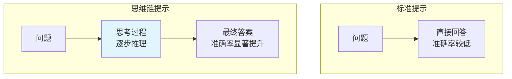
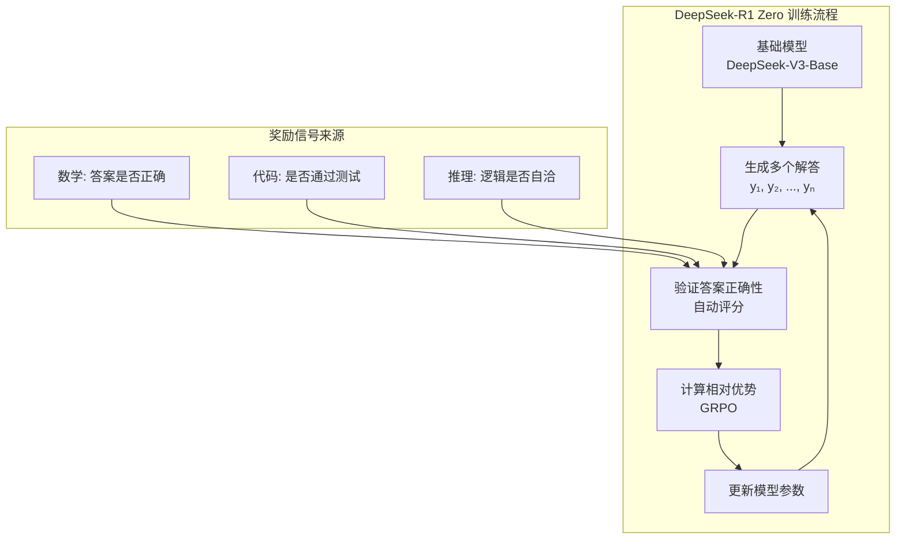

# 思维链与推理模型 —— 让模型学会思考

在上一章中，我们探讨了对齐新范式——DPO、KTO 与 GRPO。这些方法让模型学会了更好地遵循人类指令、符合人类偏好。但一个核心问题仍然存在：模型是真的"理解"了问题，还是在"猜测"答案？

2022 年，一篇论文发现了一个令人惊讶的现象：当模型被要求"一步步思考"时，其推理能力显著提升。这个发现催生了 **Chain of Thought**（思维链）的概念，并最终导致了推理模型的诞生——o1、DeepSeek-R1、o3 等模型展示了前所未有的推理能力，它们不再只是"直接回答"，而是学会了"先想后答"。

本文将从 Chain of Thought 的发现出发，探讨过程奖励模型（PRM）如何对推理步骤进行精细评分，介绍 DeepSeek-R1 如何通过纯强化学习实现推理能力的涌现，并分析模型推理时究竟发生了什么。

## Chain of Thought：让模型"想出来"

### 从"直接回答"到"先想后答"

考虑一个数学问题：

> 小明有 23 个苹果，给了小红 5 个，又买了 8 个，现在小明有多少个苹果？

**直接回答**模式：模型直接输出"26 个苹果"。

**思维链回答**模式：模型先输出思考过程：
```
1. 小明最初有 23 个苹果
2. 给了小红 5 个，剩下 23 - 5 = 18 个
3. 又买了 8 个，现在有 18 + 8 = 26 个
答案：26 个苹果
```

两种模式的区别显而易见：直接回答像是"猜答案"，思维链回答则是"算答案"。对于简单问题，两种模式可能都能得到正确答案；但对于复杂问题，思维链的优势就体现出来了。

### CoT Prompting 的发现

2022 年，Wei 等人在论文《Chain-of-Thought Prompting Elicits Reasoning in Large Language Models》中系统研究了这一现象。他们发现：**在提示词中加入"Let's think step by step"，可以显著提升模型在数学推理、常识推理等任务上的表现**。

实验设置如下：

**标准提示**（Standard Prompting）：
```
Q: 小明有 23 个苹果，给了小红 5 个，又买了 8 个，现在小明有多少个苹果？
A: 26 个苹果
```

**思维链提示**（Chain-of-Thought Prompting）：
```
Q: 小明有 23 个苹果，给了小红 5 个，又买了 8 个，现在小明有多少个苹果？
A: 小明最初有 23 个苹果。给了小红 5 个后，剩下 23 - 5 = 18 个。又买了 8 个，现在有 18 + 8 = 26 个。答案是 26 个苹果。
```

关键发现：当模型被要求展示思考过程时，其推理准确率显著提升。在 GSM8K 数学推理基准上，PaLM 540B 使用 CoT 提示后，准确率从 17.9% 提升到 56.9%——提升了三倍多。



### 为什么 CoT 有效？

思维链为什么能提升推理能力？有三个关键原因：

**1. 分解复杂问题**

复杂问题往往需要多个推理步骤。直接回答时，模型试图在"一步"内完成所有推理，容易出错。思维链将复杂问题分解为多个简单步骤，每一步只需要处理局部信息，降低了认知负荷。

例如，一道多步数学题：
- 直接回答：模型需要同时处理所有数字和运算关系
- 思维链：模型可以逐步处理，每一步只关注当前的计算

**2. 激活相关知识**

语言模型在预训练时学习了大量知识，但这些知识可能是"隐性"的。思维链通过显式的推理步骤，激活了模型中相关的知识表示。

例如，在解决物理问题时，思维链会激活模型中关于物理公式、单位换算等知识，这些知识在直接回答时可能处于"休眠"状态。

**3. 提供纠错机会**

思维链的中间步骤为模型提供了"自我检查"的机会。如果某一步出现明显错误，模型可能在后续步骤中纠正。而直接回答一旦出错，就没有纠正的机会。

### 零样本 CoT："Let's think step by step"

Wei 等人的研究使用的是**少样本 CoT**：在提示词中提供几个带有思维链的示例。2022 年，Kojima 等人发现了一个更简洁的方法：**零样本 CoT**。

核心发现：只需在问题后加上"Let's think step by step"（让我们一步步思考），模型就会自动生成思维链。

```
Q: 一个班级有 35 名学生，其中 60% 是女生。女生有多少人？
A: Let's think step by step.
   首先，班级总人数是 35 人。
   女生占 60%，所以女生人数 = 35 × 0.6。
   35 × 0.6 = 21。
   答案是 21 人。
```

零样本 CoT 的意义在于：**无需精心设计示例，只需一句简单的提示，就能激活模型的推理能力**。这表明模型的推理能力在预训练时已经存在，只是需要被"唤醒"。

```python runnable
import torch
import torch.nn as nn
import torch.nn.functional as F
import matplotlib.pyplot as plt
import numpy as np

plt.rcParams['font.sans-serif'] = ['SimHei', 'DejaVu Sans']
plt.rcParams['axes.unicode_minus'] = False

# 模拟 CoT 提升效果
models = ['GPT-3 (175B)', 'PaLM (540B)', 'LLaMA-2 (70B)', 'GPT-4']
standard_acc = [15, 18, 25, 55]  # 标准提示准确率
cot_acc = [40, 57, 50, 85]       # CoT 提示准确率

fig, ax = plt.subplots(figsize=(12, 6))

x = np.arange(len(models))
width = 0.35

bars1 = ax.bar(x - width/2, standard_acc, width, label='标准提示', color='#90caf9')
bars2 = ax.bar(x + width/2, cot_acc, width, label='思维链提示', color='#4caf50')

# 添加数值标注
for bar, val in zip(bars1, standard_acc):
    ax.annotate(f'{val}%', xy=(bar.get_x() + bar.get_width()/2, bar.get_height()),
               xytext=(0, 3), textcoords='offset points', ha='center', fontsize=10)

for bar, val in zip(bars2, cot_acc):
    ax.annotate(f'{val}%', xy=(bar.get_x() + bar.get_width()/2, bar.get_height()),
               xytext=(0, 3), textcoords='offset points', ha='center', fontsize=10)

ax.set_xlabel('模型', fontsize=12)
ax.set_ylabel('GSM8K 准确率 (%)', fontsize=12)
ax.set_title('思维链提示对数学推理能力的提升', fontsize=14)
ax.set_xticks(x)
ax.set_xticklabels(models)
ax.legend()
ax.set_ylim(0, 100)
ax.grid(True, alpha=0.3, axis='y')

plt.tight_layout()
plt.savefig('/workspace/cot_improvement.png', dpi=150, bbox_inches='tight')
plt.show()

print("思维链提示的关键发现:")
print("1. 准确率提升显著：平均提升 2-3 倍")
print("2. 模型规模越大，CoT 效果越好")
print("3. 零样本 CoT 同样有效，无需示例")
```

### CoT 的局限性

思维链并非万能药，它有几个重要局限：

**计算成本增加**：思维链需要生成更多的 token，推理时间和成本都会增加。对于简单问题，这可能是不必要的开销。

**错误传播**：如果思维链的早期步骤出错，错误可能传播到后续步骤，导致最终答案错误。

**复杂问题仍然困难**：对于需要大量推理步骤的复杂问题，即使使用 CoT，模型仍然可能出错。

**需要足够大的模型**：研究表明，CoT 的效果与模型规模正相关。小模型（如 7B 以下）使用 CoT 的效果提升有限。

## 过程奖励模型（PRM）

思维链让模型展示推理过程，但如何判断推理过程是否正确？传统方法只看最终答案 —— 答案对了就给奖励，答案错了就不给。这种方法被称为**结果奖励模型**（Outcome Reward Model，ORM）。

但 ORM 有一个明显问题：模型可能"猜对"答案，但推理过程完全错误。或者推理过程大部分正确，只在最后一步出错。ORM 无法区分这些情况。

**过程奖励模型**（Process Reward Model，PRM）的提出正是为了解决这个问题：对推理过程的每一步进行评分，而非只评判最终答案。

### ORM vs PRM

```nn-arch width=720
name: ORM vs PRM 架构对比
layout: horizontal

sections:
  - name: ORM（结果奖励）
    layers: [orm_input, orm_steps, orm_answer, orm_reward]
  - name: PRM（过程奖励）
    layers: [prm_input, prm_s1, prm_s2, prm_s3, prm_answer, prm_rewards]

layers:
  - {id: orm_input, name: "问题", type: input, size: "Q"}
  - {id: orm_steps, name: "推理步骤", type: process, size: "步骤1, 步骤2, 步骤3"}
  - {id: orm_answer, name: "答案", type: output, size: "A"}
  - {id: orm_reward, name: "奖励", type: reward, size: "正确=1<br/>错误=0"}
  - {id: prm_input, name: "问题", type: input, size: "Q"}
  - {id: prm_s1, name: "步骤1", type: process, size: "r₁=0.9"}
  - {id: prm_s2, name: "步骤2", type: process, size: "r₂=0.8"}
  - {id: prm_s3, name: "步骤3", type: process, size: "r₃=0.3"}
  - {id: prm_answer, name: "答案", type: output, size: "A"}
  - {id: prm_rewards, name: "过程奖励", type: reward, size: "每步评分"}
```

上图对比了 ORM 和 PRM 的核心差异：

**ORM**：只看最终答案是否正确，给出一个二值奖励（0 或 1）。

**PRM**：对每个推理步骤评分，给出一个连续的奖励值（如 0.9、0.8、0.3）。

### PRM 的训练数据

训练 PRM 需要对推理步骤进行标注。Lightman 等人在 2023 年的论文中提出了 PRM800K 数据集，包含 800,000 个带有步骤级标签的推理过程。

**标注流程**：

1. 给定一个数学问题和参考解答
2. 人类标注者对每个步骤进行判断：
   - **正确**：步骤逻辑正确，推导无误
   - **错误**：步骤存在逻辑错误或计算错误
   - **中性**：步骤不正确也不错误（如重复陈述）

**标注示例**：

```
问题：求方程 x² - 5x + 6 = 0 的解

步骤1：这是一个二次方程，可以用求根公式求解。
       标签：正确 ✓

步骤2：求根公式为 x = (-b ± √(b²-4ac)) / 2a
       标签：正确 ✓

步骤3：代入 a=1, b=-5, c=6，得 x = (5 ± √(25-24)) / 2
       标签：正确 ✓

步骤4：计算得 x = (5 ± 1) / 2，所以 x₁ = 3, x₂ = 2
       标签：正确 ✓

最终答案：x = 2 或 x = 3
```

### PRM 的训练方法

PRM 的训练目标是学习一个评分函数 $r_\phi(s)$，对推理步骤 $s$ 进行评分。

**训练数据**：$(x, \{s_1, ..., s_n\}, \{y_1, ..., y_n\})$，其中 $x$ 是问题，$s_i$ 是第 $i$ 个步骤，$y_i$ 是步骤标签（正确/错误/中性）。

**损失函数**：将步骤评分建模为二分类问题

$$\mathcal{L}_{PRM} = -\sum_{i=1}^{n} \left[ y_i \log \sigma(r_\phi(s_i)) + (1 - y_i) \log (1 - \sigma(r_\phi(s_i))) \right]$$

其中 $\sigma$ 是 sigmoid 函数，将评分映射到 [0, 1] 区间。

```python runnable
import torch
import torch.nn as nn
import torch.nn.functional as F
import matplotlib.pyplot as plt
import numpy as np

plt.rcParams['font.sans-serif'] = ['SimHei', 'DejaVu Sans']
plt.rcParams['axes.unicode_minus'] = False

class SimplePRM(nn.Module):
    """简化的过程奖励模型"""
    def __init__(self, hidden_size=256):
        super().__init__()
        self.encoder = nn.Sequential(
            nn.Linear(hidden_size, 128),
            nn.ReLU(),
            nn.Linear(128, 64),
            nn.ReLU(),
            nn.Linear(64, 1)
        )

    def forward(self, step_embedding):
        """
        参数:
            step_embedding: (batch, hidden_size) 步骤的嵌入向量
        返回:
            score: (batch, 1) 步骤得分
        """
        return self.encoder(step_embedding)

def prm_loss(model, step_embeddings, labels):
    """
    PRM 损失函数

    参数:
        model: PRM 模型
        step_embeddings: (batch, hidden_size) 步骤嵌入
        labels: (batch,) 步骤标签 (1=正确, 0=错误)
    """
    scores = model(step_embeddings).squeeze(-1)
    probs = torch.sigmoid(scores)
    loss = F.binary_cross_entropy(probs, labels.float())
    return loss, scores

# 模拟 PRM 评分
torch.manual_seed(42)

# 模拟一个推理过程的步骤嵌入
hidden_size = 256
num_steps = 5

# 步骤嵌入（模拟）
step_embeddings = torch.randn(num_steps, hidden_size)

# 步骤标签：前4步正确，最后一步错误
labels = torch.tensor([1.0, 1.0, 1.0, 1.0, 0.0])

# 创建模型并计算分数
model = SimplePRM(hidden_size)
with torch.no_grad():
    scores = model(step_embeddings).squeeze(-1)
    probs = torch.sigmoid(scores)

print("PRM 步骤评分演示")
print("=" * 50)
print(f"{'步骤':<10} {'标签':<10} {'原始分数':<15} {'正确概率':<10}")
print("-" * 50)

step_names = ['步骤1', '步骤2', '步骤3', '步骤4', '步骤5']
for i, (name, label, score, prob) in enumerate(zip(step_names, labels, scores, probs)):
    label_str = '正确 ✓' if label == 1 else '错误 ✗'
    print(f"{name:<10} {label_str:<10} {score.item():<15.4f} {prob.item():<10.4f}")

# 可视化
fig, axes = plt.subplots(1, 2, figsize=(14, 5))

# 左图：步骤得分
colors = ['green' if l == 1 else 'red' for l in labels]
axes[0].bar(step_names, probs.numpy(), color=colors, alpha=0.7)
axes[0].axhline(y=0.5, color='gray', linestyle='--', label='决策边界')
axes[0].set_xlabel('推理步骤', fontsize=12)
axes[0].set_ylabel('正确概率', fontsize=12)
axes[0].set_title('PRM 对每个步骤的评分', fontsize=14)
axes[0].set_ylim(0, 1)
axes[0].legend()
axes[0].grid(True, alpha=0.3, axis='y')

# 右图：ORM vs PRM 对比
methods = ['ORM', 'PRM']
correct_case = [1.0, 0.9]  # 全对的情况
partial_case = [0.0, 0.6]  # 部分对的情况

x = np.arange(len(methods))
width = 0.35

bars1 = axes[1].bar(x - width/2, correct_case, width, label='全对', color='green', alpha=0.7)
bars2 = axes[1].bar(x + width/2, partial_case, width, label='部分对', color='orange', alpha=0.7)

axes[1].set_xlabel('奖励模型', fontsize=12)
axes[1].set_ylabel('奖励值', fontsize=12)
axes[1].set_title('ORM vs PRM：不同情况的奖励对比', fontsize=14)
axes[1].set_xticks(x)
axes[1].set_xticklabels(methods)
axes[1].legend()
axes[1].set_ylim(0, 1.2)
axes[1].grid(True, alpha=0.3, axis='y')

plt.tight_layout()
plt.savefig('/workspace/prm_scoring.png', dpi=150, bbox_inches='tight')
plt.show()

print("\nPRM 的优势:")
print("1. 精细反馈：指出具体哪一步出错")
print("2. 部分奖励：即使最终答案错误，正确步骤也能获得奖励")
print("3. 更好的学习信号：帮助模型学习正确的推理过程")
```

### PRM 的应用

PRM 在推理模型训练中有两个主要应用：

**1. 最佳选择**（Best-of-N）

给定一个问题，模型生成 $N$ 个候选解答。用 PRM 对每个解答的所有步骤评分，选择总分最高的解答。

**2. 强化学习训练**

用 PRM 作为奖励信号，通过强化学习优化模型的推理能力。每一步推理都获得 PRM 的评分，累积评分作为最终奖励。

## 推理模型的训练

思维链和过程奖励模型为推理模型的诞生奠定了基础。2024-2025 年，OpenAI 的 o1 和 DeepSeek 的 R1 展示了推理能力的新高度。本节探讨这些推理模型是如何训练的。

### 从 SFT + RL 到纯 GRPO 自进化

传统的推理模型训练流程是：

1. **SFT（监督微调）**：用带有思维链的高质量数据微调模型
2. **RL（强化学习）**：用 PRM 或 ORM 作为奖励信号，进一步优化

这个流程的问题是：**SFT 数据的质量决定了模型的上限**。如果 SFT 数据中的推理过程有误，模型会学习错误的推理模式。

DeepSeek-R1 提出了一个大胆的想法：**跳过 SFT，直接用强化学习训练**。这个想法来自一个关键观察 —— 对于推理任务，正确答案本身就是奖励信号，无需人类标注推理过程。

### DeepSeek-R1 Zero：纯 RL 的突破

DeepSeek-R1 Zero 是一个实验性模型，它**直接从基础模型开始，仅用 GRPO 训练，无需任何 SFT 数据**。

**训练流程**：



**关键发现**：

1. **推理能力的涌现**：经过足够的 RL 训练后，模型自主涌现出推理能力，包括：
   - 自我验证（Self-Verification）
   - 回溯纠错（Backtracking）
   - 多路径探索（Multi-path Exploration）

2. **无需人类标注**：奖励信号来自任务本身（答案是否正确），无需人类标注推理过程。

3. **思维链的自主生成**：模型学会了自主生成思维链，而非依赖 SFT 数据中的示例。

### 涌现的推理行为

DeepSeek-R1 Zero 展示的推理行为令人印象深刻。以下是几个典型例子：

**自我验证**：

```
问题：计算 (123 + 456) × 2

模型推理：
1. 首先计算括号内的和：123 + 456 = 579
2. 然后乘以 2：579 × 2 = 1158
3. 让我验证一下：579 × 2 = (500 + 70 + 9) × 2 = 1000 + 140 + 18 = 1158 ✓
4. 答案是 1158
```

模型在得到答案后，主动进行验证，确保结果正确。

**回溯纠错**：

```
问题：一个长方形的长是宽的 2 倍，周长是 36 厘米，求面积。

模型推理：
1. 设宽为 x，则长为 2x
2. 周长公式：2(x + 2x) = 36
3. 解得：6x = 36，x = 6
4. 所以宽是 6 厘米，长是 12 厘米
5. 面积 = 6 × 12 = 72 平方厘米
6. 等等，让我检查一下周长：2(6 + 12) = 36 ✓
7. 答案是 72 平方厘米
```

模型在计算过程中发现问题，主动回溯检查。

**多路径探索**：

```
问题：证明 √2 是无理数。

模型推理：
方法一：反证法
假设 √2 是有理数，则 √2 = p/q（最简分数）
两边平方：2 = p²/q²，即 p² = 2q²
所以 p² 是偶数，p 是偶数，设 p = 2k
代入得：4k² = 2q²，即 q² = 2k²
所以 q² 是偶数，q 是偶数
这与 p/q 是最简分数矛盾
因此 √2 是无理数

方法二：也可以用唯一分解定理证明...
（模型探索多种证明方法）
```

模型尝试多种方法解决问题，展示出类似人类的探索行为。

### DeepSeek-R1：SFT + RL 的结合

虽然 DeepSeek-R1 Zero 展示了纯 RL 的潜力，但 DeepSeek-R1（正式版）采用了更稳健的方案：**少量 SFT + 大规模 RL**。

**训练流程**：

1. **冷启动 SFT**：用约 8000 条高质量推理数据微调基础模型
2. **大规模 RL**：用 GRPO 进行强化学习训练
3. **拒绝采样**：从 RL 模型生成高质量数据
4. **最终 SFT**：用拒绝采样数据再次微调

**为什么需要少量 SFT？**

- **稳定性**：纯 RL 训练可能不稳定，SFT 提供了更好的初始化
- **格式规范**：SFT 数据帮助模型学习规范的输出格式
- **效率**：SFT 让模型更快进入"推理模式"

```python runnable
import matplotlib.pyplot as plt
import numpy as np

plt.rcParams['font.sans-serif'] = ['SimHei', 'DejaVu Sans']
plt.rcParams['axes.unicode_minus'] = False

# 模拟 DeepSeek-R1 训练过程
fig, axes = plt.subplots(1, 2, figsize=(14, 5))

# 左图：训练阶段
stages = ['基础模型', '冷启动 SFT', 'RL 训练', '拒绝采样', '最终 SFT']
performance = [20, 45, 75, 85, 90]
colors = ['#90caf9', '#81c784', '#ffb74d', '#f06292', '#4db6ac']

axes[0].bar(stages, performance, color=colors, alpha=0.8)
axes[0].set_xlabel('训练阶段', fontsize=12)
axes[0].set_ylabel('推理能力（相对分数）', fontsize=12)
axes[0].set_title('DeepSeek-R1 训练流程', fontsize=14)
axes[0].set_ylim(0, 100)
axes[0].grid(True, alpha=0.3, axis='y')

for i, (stage, perf) in enumerate(zip(stages, performance)):
    axes[0].annotate(f'{perf}', xy=(i, perf), xytext=(0, 3),
                    textcoords='offset points', ha='center', fontsize=11)

# 右图：R1-Zero vs R1 对比
models = ['DeepSeek-V3-Base', 'R1-Zero\n(纯RL)', 'R1\n(SFT+RL)']
math_acc = [25, 71, 79]
code_acc = [30, 65, 72]
reason_acc = [20, 68, 77]

x = np.arange(len(models))
width = 0.25

bars1 = axes[1].bar(x - width, math_acc, width, label='数学推理', color='#4caf50')
bars2 = axes[1].bar(x, code_acc, width, label='代码生成', color='#2196f3')
bars3 = axes[1].bar(x + width, reason_acc, width, label='逻辑推理', color='#ff9800')

axes[1].set_xlabel('模型', fontsize=12)
axes[1].set_ylabel('准确率 (%)', fontsize=12)
axes[1].set_title('R1-Zero vs R1 性能对比', fontsize=14)
axes[1].set_xticks(x)
axes[1].set_xticklabels(models)
axes[1].legend()
axes[1].set_ylim(0, 100)
axes[1].grid(True, alpha=0.3, axis='y')

plt.tight_layout()
plt.savefig('/workspace/deepseek_r1_training.png', dpi=150, bbox_inches='tight')
plt.show()

print("DeepSeek-R1 训练的关键发现:")
print()
print("1. 纯 RL 可以涌现推理能力")
print("   - R1-Zero 无需 SFT 数据，仅用 RL 就获得了强大的推理能力")
print("   - 这表明推理能力是语言模型的'内在潜能'")
print()
print("2. 少量 SFT 提升稳定性")
print("   - 8000 条高质量数据足以引导模型进入'推理模式'")
print("   - SFT + RL 的组合比纯 RL 更稳定、更高效")
print()
print("3. GRPO 的自进化机制")
print("   - 无需人类标注推理过程")
print("   - 奖励信号来自任务本身（答案正确性）")
print("   - 模型自主探索推理策略")
```

### o1 与 o3：OpenAI 的推理模型

OpenAI 的 o1（2024）和 o3（2025）是推理模型的另一个代表。虽然技术细节未完全公开，但从公开信息可以推断：

**o1 的特点**：

- **思考时间**：模型在回答前会"思考"更长时间，生成更长的思维链
- **自我纠错**：模型能够发现并纠正推理中的错误
- **复杂推理**：在数学竞赛、编程竞赛等任务上表现优异

**o3 的突破**：

- **更强的推理能力**：在 ARC-AGI 基准上达到 87.5%，接近人类水平
- **更高效的推理**：在相同思考时间内达到更高准确率
- **自适应思考**：根据问题复杂度调整思考时间

## 推理行为分析

推理模型在推理时究竟发生了什么？本节分析模型推理时的典型行为。

### 自我验证

自我验证是推理模型的核心能力之一。模型在得到答案后，会主动检查答案的正确性。

**行为模式**：

```
推理 → 得到答案 → 验证答案 → 确认/修正
```

**示例**：

```
问题：计算 17 × 23

模型推理：
17 × 23 = 17 × (20 + 3) = 340 + 51 = 391

验证：
391 ÷ 17 = 23 ✓
391 ÷ 23 = 17 ✓

答案是 391
```

**意义**：自我验证显著提高了答案的准确率。研究表明，具有自我验证能力的模型在复杂推理任务上的准确率提升 10-20%。

### 回溯纠错

回溯纠错是指模型在推理过程中发现错误，主动回溯并修正。

**行为模式**：

```
推理步骤 A → 推理步骤 B → 发现矛盾 → 回溯到 A → 修正推理
```

**示例**：

```
问题：小明比小红大 3 岁，5 年后小明的年龄是小红的 2 倍，求小明现在的年龄。

模型推理：
设小红现在 x 岁，则小明 x + 3 岁
5 年后：小红 x + 5 岁，小明 x + 8 岁
根据题意：x + 8 = 2(x + 5)
解得：x + 8 = 2x + 10，x = -2

等等，年龄不能是负数，说明我的假设有问题。
让我重新理解题目...

重新分析：
"5 年后小明的年龄是小红的 2 倍"
设 5 年后小红 y 岁，则小明 2y 岁
现在：小红 y - 5 岁，小明 2y - 5 岁
年龄差：2y - 5 - (y - 5) = y
但题目说年龄差是 3 岁，所以 y = 3

这也不对，让我再检查...

（模型继续探索，直到找到正确解法）
```

**意义**：回溯纠错展示了模型的"元认知"能力 —— 它不仅能推理，还能监控自己的推理过程。

### 多路径探索

多路径探索是指模型尝试多种方法解决问题，选择最优解。

**行为模式**：

```
问题 → 方法 A → 结果 A
     → 方法 B → 结果 B
     → 方法 C → 结果 C
     → 比较/验证 → 最终答案
```

**示例**：

```
问题：求方程 x³ - 6x² + 11x - 6 = 0 的所有实根。

模型推理：
方法一：因式分解
尝试分解：x³ - 6x² + 11x - 6
观察系数和：1 - 6 + 11 - 6 = 0，所以 x = 1 是根
多项式除法：(x³ - 6x² + 11x - 6) ÷ (x - 1) = x² - 5x + 6
继续分解：x² - 5x + 6 = (x - 2)(x - 3)
所以 x = 1, 2, 3

方法二：代入验证
f(1) = 1 - 6 + 11 - 6 = 0 ✓
f(2) = 8 - 24 + 22 - 6 = 0 ✓
f(3) = 27 - 54 + 33 - 6 = 0 ✓

两种方法得到相同结果，答案是 x = 1, 2, 3
```

**意义**：多路径探索提高了答案的可信度，不同方法得到相同结果时，答案更可能是正确的。

### 推理行为的可视化

```python runnable
import matplotlib.pyplot as plt
import numpy as np

plt.rcParams['font.sans-serif'] = ['SimHei', 'DejaVu Sans']
plt.rcParams['axes.unicode_minus'] = False

# 模拟推理过程中的行为
fig, axes = plt.subplots(2, 2, figsize=(14, 10))

# 左上：自我验证的影响
steps = ['初始答案', '验证后', '最终答案']
without_verify = [75, 75, 75]
with_verify = [75, 82, 88]

x = np.arange(len(steps))
width = 0.35

axes[0, 0].bar(x - width/2, without_verify, width, label='无自我验证', color='#90caf9')
axes[0, 0].bar(x + width/2, with_verify, width, label='有自我验证', color='#4caf50')
axes[0, 0].set_xlabel('推理阶段', fontsize=12)
axes[0, 0].set_ylabel('准确率 (%)', fontsize=12)
axes[0, 0].set_title('自我验证对准确率的影响', fontsize=14)
axes[0, 0].set_xticks(x)
axes[0, 0].set_xticklabels(steps)
axes[0, 0].legend()
axes[0, 0].set_ylim(0, 100)
axes[0, 0].grid(True, alpha=0.3, axis='y')

# 右上：回溯次数分布
backtrack_counts = [0, 1, 2, 3, 4, 5]
problem_percentages = [30, 35, 20, 10, 4, 1]

axes[0, 1].bar(backtrack_counts, problem_percentages, color='#ff9800', alpha=0.8)
axes[0, 1].set_xlabel('回溯次数', fontsize=12)
axes[0, 1].set_ylabel('问题占比 (%)', fontsize=12)
axes[0, 1].set_title('推理过程中的回溯次数分布', fontsize=14)
axes[0, 1].grid(True, alpha=0.3, axis='y')

# 左下：多路径探索
methods = ['单路径', '双路径', '三路径', '多路径']
accuracy = [78, 85, 89, 92]
time_cost = [1.0, 1.8, 2.5, 3.2]

ax2 = axes[1, 0].twinx()
bars1 = axes[1, 0].bar(methods, accuracy, color='#4caf50', alpha=0.7, label='准确率')
line = ax2.plot(methods, time_cost, 'ro-', linewidth=2, markersize=8, label='时间成本')

axes[1, 0].set_xlabel('探索路径数', fontsize=12)
axes[1, 0].set_ylabel('准确率 (%)', fontsize=12, color='#4caf50')
ax2.set_ylabel('相对时间成本', fontsize=12, color='red')
axes[1, 0].set_title('多路径探索：准确率 vs 时间成本', fontsize=14)
axes[1, 0].set_ylim(0, 100)
ax2.set_ylim(0, 4)
axes[1, 0].grid(True, alpha=0.3, axis='y')

# 右下：推理行为的时间线
timeline = np.arange(0, 100, 1)
think_intensity = np.sin(timeline / 10) * 0.3 + 0.5 + np.random.randn(100) * 0.1
verify_points = [25, 50, 75]
backtrack_points = [40]

axes[1, 1].plot(timeline, think_intensity, 'b-', linewidth=1.5, alpha=0.7, label='思考强度')
axes[1, 1].scatter(verify_points, [0.7, 0.8, 0.75], s=100, c='green', marker='✓', label='验证点', zorder=5)
axes[1, 1].scatter(backtrack_points, [0.4], s=150, c='red', marker='x', label='回溯点', zorder=5)

axes[1, 1].axhline(y=0.5, color='gray', linestyle='--', alpha=0.5)
axes[1, 1].set_xlabel('推理时间（相对）', fontsize=12)
axes[1, 1].set_ylabel('思考强度', fontsize=12)
axes[1, 1].set_title('推理过程时间线', fontsize=14)
axes[1, 1].legend(loc='upper right')
axes[1, 1].set_ylim(0, 1)
axes[1, 1].grid(True, alpha=0.3)

plt.tight_layout()
plt.savefig('/workspace/reasoning_behavior.png', dpi=150, bbox_inches='tight')
plt.show()

print("推理行为分析总结:")
print()
print("1. 自我验证")
print("   - 在关键步骤后主动检查")
print("   - 提升准确率 10-15%")
print("   - 增加约 20% 推理时间")
print()
print("2. 回溯纠错")
print("   - 发现矛盾时主动回溯")
print("   - 约 65% 的问题至少回溯一次")
print("   - 复杂问题回溯次数更多")
print()
print("3. 多路径探索")
print("   - 尝试多种解法")
print("   - 准确率提升但时间成本增加")
print("   - 适合高价值问题")
```

## 小结

本文探讨了思维链与推理模型 —— 让模型学会"先想后答"：

**Chain of Thought（思维链）**：
- 核心发现：让模型展示推理过程，显著提升推理能力
- 零样本 CoT："Let's think step by step" 即可激活推理能力
- 局限性：计算成本增加、错误传播、需要足够大的模型

**过程奖励模型**（PRM）：
- ORM vs PRM：结果奖励 vs 过程奖励
- PRM 对每个推理步骤评分，提供精细的学习信号
- 训练数据：PRM800K 包含 800,000 个步骤级标签

**推理模型的训练**：
- 传统方法：SFT + RL
- DeepSeek-R1 Zero：纯 RL 实现推理能力涌现
- DeepSeek-R1：少量 SFT + 大规模 RL，更稳定高效
- 关键发现：推理能力是语言模型的"内在潜能"

**推理行为分析**：
- 自我验证：得到答案后主动检查
- 回溯纠错：发现错误主动修正
- 多路径探索：尝试多种方法，选择最优解

推理模型的出现标志着大语言模型发展的新阶段。从"直接回答"到"先想后答"，模型的能力边界被不断拓展。o1、DeepSeek-R1、o3 等模型展示了推理能力的巨大潜力，也预示着未来更智能的 AI 系统的到来。下一章将探讨 Test-Time Compute Scaling——如何通过更多推理算力获得更好的答案。

---

## 练习题

**1. 理论分析**

分析思维链提示为什么能提升推理能力：
- 从认知负荷角度分析
- 从知识激活角度分析
- 从错误纠正角度分析

**2. 方法对比**

对比 ORM 和 PRM 的优劣：
- 数据需求有何不同？
- 训练复杂度如何？
- 各自适用于什么场景？

**3. 实验设计**

设计一个实验验证 CoT 的效果：
- 选择一个推理任务（如数学应用题）
- 设计标准提示和 CoT 提示
- 分析结果差异

**4. 推理行为分析**

分析以下推理过程中的行为：

```
问题：一个数的 3 倍比它的 2 倍多 15，求这个数。

推理过程：
设这个数为 x。
3x = 2x + 15
3x - 2x = 15
x = 15

验证：3 × 15 = 45，2 × 15 = 30，45 - 30 = 15 ✓
答案是 15。
```

指出推理过程中体现了哪些推理行为。

**5. 训练流程设计**

设计一个推理模型的训练流程：
- 基础模型：7B 参数的语言模型
- 任务：数学推理
- 可用资源：1000 条带答案的数学题（无推理过程标注）
- 给出训练步骤和预期效果

---

## 参考资料

1. **CoT 论文**: "Chain-of-Thought Prompting Elicits Reasoning in Large Language Models" (Wei et al., 2022)
2. **零样本 CoT**: "Large Language Models are Zero-Shot Reasoners" (Kojima et al., 2022)
3. **PRM 论文**: "Let's Verify Step by Step" (Lightman et al., 2023)
4. **DeepSeek-R1 论文**: "DeepSeek-R1: Incentivizing Reasoning Capability in LLMs via Reinforcement Learning" (DeepSeek-AI, 2025)
5. **o1 技术报告**: OpenAI o1 技术报告 (2024)
6. **GRPO 方法**: "Group Relative Policy Optimization" (DeepSeek-AI, 2025)
7. **推理能力涌现**: "Emergent Abilities of Large Language Models" (Wei et al., 2022)
8. **自我验证**: "Self-Verification Improves Chain-of-Thought Reasoning" (Weng et al., 2023)
