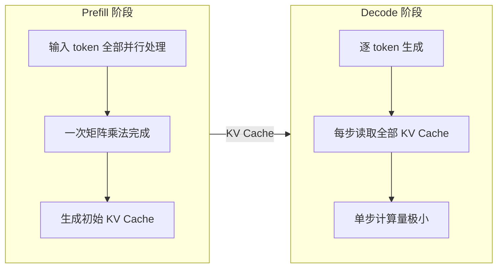
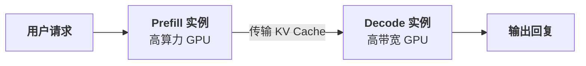
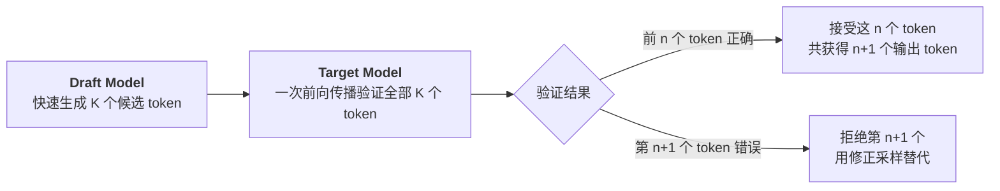

# 推理效率优化

通过[三大缩放定律](test-time-compute.md#三大缩放定律的统一视角)，我们看到了训练、推理阶段投入更多计算资源可以获得更好的模型性能。现实世界里，模型除了理论性能，还有其他工程上的约束 —— 主要是速度与成本。一个需要思考 60 秒才能回答的模型，在实时对话场景中肯定备受诟病；一个需要 8 张 H100 才能运行的推理服务，其部署成本令大多数团队望而却步。推理效率优化就是在"答得好"和"答得快"之间寻找平衡。

大模型的推理效率问题，本质上是资源错配。推理过程分为两个阶段：**预填充**（Prefill）阶段处理输入的提示词序列，**解码**（Decode）阶段逐个生成输出 token。Prefill 阶段输入的所有 token 可以并行处理，GPU 算力被充分利用。Decode 阶段则相反，每步只生成一个 token，却要读取全部的 KV Cache，算力利用率通常低于 3%。更棘手的是，显存已被 KV Cache 占满，难以通过增加批大小来提升利用率。这个显存墙问题是提升模型推理效率的最大障碍，算力充足却受限于显存带宽和容量，无法发挥。

围绕这个瓶颈，研究者从两个方向寻求突破。第一个方向是"不改模型，改系统"，通过更聪明的工程手段榨取现有硬件的潜力。第二个方向是"直接缩小模型"，通过量化、知识蒸馏、剪枝和稀疏化等手段，将大模型的推理能力压缩到更小的参数空间或更低的数值精度中。这两个方向并非互斥，实际部署中往往是组合使用的，一个经过蒸馏的小模型，再配合 PagedAttention 和投机解码，可以获得远超任何单一技术的效率提升。本文将系统梳理这两条路线的核心技术与思路。

## 推理瓶颈分析

大模型推理的效率瓶颈不是单纯的速度快慢或成本高低，而是 Prefill 和 Decode 两个阶段的资源需求截然不同，将它们放在同一块 GPU 上执行，必然导致其中一个阶段的资源被浪费。理解这两个阶段的计算特征，是理解后续所有优化技术的前提。

Transformer 架构下语言模型的推理是自回归的，每生成一个 token，都需要将之前所有 token 的 Key 和 Value 向量缓存下来，供后续 token 的注意力计算使用。这个缓存被称为 KV Cache。推理过程因此自然地分为两个阶段：

- **Prefill 阶段**处理用户输入，假设输入的序列长度为 $n$，模型维度为 $d$，注意力计算需要对 $n \times n$ 的注意力矩阵做乘法，每步涉及 $d$ 维向量的点积。由于输入的 $n$ 个 token 是已知的，可以一次性并行计算，GPU 的矩阵运算单元被充分利用，属于**计算密集型**（Compute-bound）应用。这意味着 Prefill 的速度主要取决于 GPU 的算力有多强，而与显存带宽关系不大。

- **Decode 阶段**逐个生成输出 token。每生成一个 token，需要对所有已生成的 token 做注意力计算，但每步只有一个新 token 的 Query 需要跟所有已缓存的 Key 做点积，计算量只有 $n \times d$（其中 $n$ 是已缓存 token 数），远小于 Prefill 的 $n \times n \times d$。其中每一步都需要从显存中读取完整的 KV Cache，而只用到了其中极小一部分计算单元。Decode 属于**访存密集型**（Memory-bound）应用，速度主要受限于显存带宽，GPU 的大量计算单元处于空闲状态。

*图：推理的两阶段流程*

可以用一个具体的例子来直观感受这种差异。假设 LLaMA-2 70B 模型在 A100（80GB）上运行，批量大小为 1。Prefill 阶段处理 1024 个输入 token，GPU 算力利用率可以达到 60% 以上；Decode 阶段生成每个 token 时，GPU 算力利用率仅有约 0.5%。同一块 GPU，两个阶段的算力利用率相差超过 100 倍。Prefill/Decode 阶段差异如此明显的硬件需求，是推理效率优化的主要矛盾。

既然 Decode 阶段 GPU 算力大量闲置，直觉上的解决办法应该是增加批量大小、同时处理更多请求，让闲置的算力能被利用起来。但这条路也基本被 KV Cache 的巨大显存占用给堵死了。设 $n_{\text{layer}}$ 是 Transformer 的层数（每层都有一组 KV Cache）；$d_{\text{head}} \times n_{\text{head}}$ 是每个 token 的隐藏维度大小；$n_{\text{max}}$ 是序列的最大长度；$b$ 是批量大小，则 KV Cache 的显存占用可以用以下公式估算：

$$M_{\text{KV}} = 2 \times n_{\text{layer}} \times d_{\text{head}} \times n_{\text{head}} \times n_{\text{max}} \times b \times sizeof(\text{float16})$$

每个 token 在每一层都需要缓存 Key 和 Value 两个向量，所有层、所有 token、所有请求的缓存加起来就是总显存占用。代入 LLaMA-2 70B 的具体参数：80 层、128 个注意力头、每头维度 128、最大序列长度 4096、float16 精度。单个请求的 KV Cache 的容量 $M_{\text{KV}} = 2 \times 80 \times 128 \times 128 \times 4096 \times 1 \times 2 \approx 10.7 \text{ GB}$。A100 一共只有 80 GB 显存，而模型参数本身占用约 140 GB，需要张量并行分布在多张 GPU 上。以 2 张 GPU 的张量并行为例，每张 GPU 分担约 70 GB 的模型参数，剩余约 10 GB 可用于 KV Cache，仅能容纳 1 个请求的缓存，批量大小也根本提不上去。

以上被称为 LLM 推理的显存墙（Memory Wall）问题。KV Cache 的巨大显存占用限制了批量大小和并发数，导致 GPU 算力无法被有效利用。Decode 阶段的算力利用率低下并不是因为没有足够的计算任务，而是因为没有足够的显存容纳更多并行处理请求。分析了推理效率的瓶颈后，我们就可以确定具体的优化目标。推理服务通常关注以下几个主要指标：

- **首 token 延迟**（Time to First Token，TTFT）是从用户发送请求到模型输出第一个 token 的时间，主要由 Prefill 阶段决定。用户在对话场景中最先感知到的就是 TTFT，过长的等待会让用户觉得系统卡顿。
- **每 token 生成时间**（Time Per Output Token，TPOT）是 Decode 阶段生成每个 token 的平均时间，它是**每秒生成 token 数**（Tokens Per Second，TPS）的倒数。TPS 直接影响用户的阅读体验，如果生成速度低于人类的阅读速度（约每秒 10-15 个 token），用户就会感觉回复在慢慢"挤药膏"出来。
- **吞吐量**（Throughput）是单位时间内系统处理的总 token 数，等于所有并发请求的 TPS 之和。吞吐量衡量的是系统的整体处理能力，对于批量处理场景（如文档翻译、数据标注）最为关键。
- **并发数**（Concurrency）是系统同时处理的请求数。并发数受限于系统处理的最短板（目前主要是 KV Cache 占用的显存容量），而吞吐量等于并发数乘以每个请求的 TPS。

这些指标之间存在内部张力，有此消彼长的关系。增加批量大小可以提升吞吐量，但每个请求分到的计算资源变少，TPS 会下降。优化 TTFT 需要给 Prefill 分配更多算力，但这可能挤占 Decode 的资源，导致正在生成中的请求变慢。不同应用场景对指标的优先级不同：实时对话场景优先保证 TTFT 和 TPS，批量处理场景优先最大化吞吐量。后续的所有优化技术，本质上都是在这些指标之间寻找更好的平衡点。

## PagedAttention

显存墙的根源是 KV Cache 的使用与管理方式。假设一个推理服务同时处理 3 个请求，最大序列长度设为 2048 token。传统方式为每个请求分配一块连续的 2048 token 空间，但实际请求的长度各不相同，请求 A 只用了 200 token 就结束了，请求 B 用了 800 token，请求 C 还在生成中，当前已用了 1500 token。三个请求总共占用了 3 × 2048 = 6144 token 的显存空间，实际只使用了 200 + 800 + 1500 = 2500 token，利用率只有 41%。每次都按最长序列申请是空间是因为传统方案中 KV Cache 的显存空间是连续的，意味着每次释放的空间只能容纳不超过原长度的 token。如果显存不是按照最大序列长度来预留，多次重新分配后，空间会被切割得支离破碎，无法再被使用。这种"一口气占满"的分配方式虽实现方便，却必须以资源浪费为代价。其实，对于大内存的分配管理，操作系统原理中早就有了成熟的解决方案：内存分页。

早期操作系统也为每个程序分配连续的内存空间，导致严重的内存碎片。解决方案是虚拟内存分页：将物理内存划分为固定大小的页（Page），程序的地址空间也被划分为相同大小的页，通过页表将虚拟页映射到物理页。这样程序就不必占据连续的物理内存，只要页表能正确映射就行。空闲的页可以被任何程序使用，完美解决了内存碎片问题。

2023 年，加州大学伯克利分校的权旭锡（Woosuk Kwon）在论文《Efficient Memory Management for Large Language Model Serving with PagedAttention》中提出了 PagedAttention 机制，借鉴操作系统虚拟内存的分页思想管理 KV Cache。KV Cache 不再是连续的大块显存，而是被划分为固定大小的 Block（类似内存的页），每个 Block 存储 16 个 token 的 Key 和 Value 向量。请求的 KV Cache 不需要占据连续的 Block，而是通过一张 Block 表（类似页表）将逻辑上连续的 KV Cache 映射到物理上分散的 Block 上。注意力计算时，通过 Block 表找到每个 token 对应的物理地址，就能正常计算。这项工作发表在操作系统领域顶级会议 SOSP 2023 上，并催生了 vLLM 这一广泛使用的推理框架。PagedAttention 的由以下三个组件构成：

- **Block 表**（Block Table）记录每个请求的 KV Cache 各 Block 的物理位置。请求的逻辑 Block 0 可能映射到物理 Block 7，逻辑 Block 1 映射到物理 Block 23，完全不必连续。注意力计算时，GPU 内核根据 Block 表找到需要读取的物理地址，再从这些地址读取 Key 和 Value 向量。

- **Block 分配器**（Block Allocator）统一管理所有物理 Block 的分配与回收。新的 token 生成后，分配器从空闲 Block 池中取一个 Block 分给当前请求。请求结束后，分配器将该请求的所有 Block 回收到空闲池中。由于 Block 大小固定，回收后任何请求都能使用，不存在碎片问题。

- **Copy-on-Write 机制**处理并行采样场景。当模型对同一提示词生成多个候选回复时，这些回复在开头部分共享完全相同的 KV Cache。PagedAttention 让它们共享同一组物理 Block，只在分叉点（各候选开始生成不同 token 的位置）才分配新的 Block。这又借鉴了操作系统的 Copy-on-Write 机制，多个进程共享同一块内存页，只有当某个进程试图修改时才复制一份。

PagedAttention 带来的改善可以用前面的例子来量化。假设 Block 大小为 16 token，请求 A 实际用了 200 token，占用 13 个 Block；请求 B 用了 800 token，占用 50 个 Block；请求 C 用了 1500 token，占用 94 个 Block。三个请求总共使用 13 + 50 + 94 = 157 个 Block。传统方式下，每个请求都按最大长度预分配，利用率约为 41%。PagedAttention 下，每个请求只占用实际所需的 Block，总共只需 157 个 Block，利用率接近 100%。这个优势直接体现到吞吐量和并发数上，以 A100 80 GB 显存为例，传统方式下每张 GPU 可能只能同时处理 10 个请求，PagedAttention 下可以同时处理 50-60 个请求，吞吐量提升 4-6 倍。

PagedAttention 还带来了一个额外的好处：[系统提示词](../pretraining/supervised-finetuning.md#系统提示词设计)（System Prompt）的 KV Cache 天然可被复用。在对话系统中，每个请求都包含相同的系统提示词（如"你是一个有用的助手"）。传统方式下，每个请求都为这段提示词单独计算并缓存 KV Cache，造成大量重复。PagedAttention 让所有请求共享同一组物理 Block 来存储系统提示词的 KV Cache，新增请求只需计算系统提示词之后的部分，既节省了显存，又减少了 Prefill 的计算量。

vLLM 的实验数据展示了这些优化的综合效果。在 ShareGPT 数据集上，vLLM 的吞吐量比传统框架（如 FasterTransformer）高出 2-4 倍，且延迟更低。当开启系统提示词共享后，长系统提示词场景下的吞吐量还可以进一步提升。

## Prefill-Decode 分离架构

PagedAttention 解决了 KV Cache 的显存管理问题，让更多请求可以同时占用 GPU，但并没有改变 Prefill 和 Decode 被放在同一块 GPU 上执行的事实。Decode 阶段算力利用率极低，GPU 大部分算力处于空闲状态，看起来应该完全有余力并行处理其他请求的 Prefill 任务。但 Prefill 是计算密集型的突发任务，一次 Prefill 通常需要上百毫秒才能完成，期间 GPU 被完全占用。而 Decode 对延迟极度敏感，每个 token 必须在几毫秒内生成完毕，否则用户就会感知到卡顿。当 GPU 正在处理一个大的 Prefill 请求时，Decode 请求只能排队等待 Prefill 完成，这个等待时间就是延迟放大的来源。实验数据表明一个 Prefill 请求可以把正在运行的 Decode 请求延迟放大 2 - 30 倍。反过来，当 GPU 全力进行 Prefill 任务时，已经在显存中的 Decode 任务的 KV Cache 占着显存，既不能被卸载又不能被利用，白白浪费了宝贵的显存空间。

解决这个矛盾的办法就是将两者分开，不要放在同一块 GPU 上进行。Prefill-Decode 分离架构的设计思想是将推理服务拆分为两组独立的 GPU 实例：Prefill 实例专门处理输入提示词，Decode 实例专门生成输出 token。一个请求的完整生命周期要先在 Prefill 实例上做完 Prefill，生成的 KV Cache 通过高速网络传输到某个 Decode 实例，然后 Decode 实例负责逐 token 生成直到请求完成，如下图所示。

*图：PD 分离架构的基本流程*

两组实例可以根据各自的需求选择不同的硬件配置。Prefill 实例需要高算力，适合使用 H100 这样的大算力 GPU。Decode 实例需要高显存带宽，A100 的 HBM2e 带宽反而更匹配。华为昇腾（Ascend）950 系列芯片更是直接以 950 PR、950 DT 命名，其中 P 和 D 分别指代 Prefill 和 Decode。说明 950 PR 的设计是以算力和吞吐优先，950 DT 的设计是以访存带宽和容量优先。

2024 年，加州大学圣迭戈分校的论文《DistServe: Disaggregating Prefill and Decoding for Goodput-Optimized Large Language Model Serving》验证了这种分离的优势。在相同硬件总量下，分离架构相比传统的混合部署，吞吐量提升了 1.4-2.4 倍，同时满足更严格的延迟约束。分离之后，Prefill 实例不再被 Decode 请求拖慢，TTFT 更稳定。Decode 实例不再被 Prefill 请求干扰，TPS 更均匀。

不过，PD 分离架构又带来了新的工程挑战：KV Cache 该如何从 Prefill 实例快速传到 Decode 实例？前面我们以 LLaMA-2 70B 为例计算过，单个请求的 KV Cache 约需 10.7 GB 显存。在传统的 PCIe 4.0 总线连接下（带宽约 50 GB/s），传输 10 GB 需要约 200 ms，如果用 NVLink（带宽 300 GB/s），传输只需约 33 ms，延迟大为改善。因此，PD 分离架构通常要求 Prefill 和 Decode 实例之间有高速互连，即 NVLink、HCCS、InfiniBand 这些绕过 PCIe 的传输技术支持。

此外，调度策略也是一个关键问题，它决定了新请求应该分配给哪一个 Decode 实例。最直观的调度策略是轮询（Round-Robin），各个实例轮流分配，足够简单却不够精细。更合理的策略考虑两个因素，一是 Decode 实例当前的负载情况（已经承载了多少请求，显存还剩多少空间），二是请求的预期生成长度（短请求分配给轻载实例以避免被拖慢，长请求分配给重载实例）。这种负载感知调度可以更好地平衡各 Decode 实例的工作量，减少请求之间的互相干扰。

Moonshot AI 团队开发的 Mooncake 系统更进一步，利用闲置 GPU 构建 KV Cache 池，代表了 PD 分离架构的更极致形态。Moonshot AI 团队运营着 Kimi 这个面向数百万用户的对话服务，每天的请求量巨大且波动明显，白天高峰期是深夜低谷期的数倍。传统的部署方式要么按高峰期配置资源（低谷期大量 GPU 空闲浪费），要么按低谷期配置（高峰期服务质量下降）。Mooncake 的创新是引入了一个 KV Cache 池。这个池不是一个固定的 GPU 集群，而是由一组可弹性伸缩的实例组成。Prefill 实例完成计算后，KV Cache 不是直接传给某个固定的 Decode 实例，而是先放入池中，调度器再根据当前负载将请求分配给最合适的 Decode 实例继续生成。

这种设计有几个好处。首先是弹性调度，高峰期可以临时启动更多 Decode 实例来消化请求，低谷期可以缩减实例数以节省成本。其次是前缀复用，池中已有的 KV Cache（如系统提示词的缓存）可以被新请求直接复用，跳过重复的 Prefill 计算。最后是离线再平衡能力，调度器可以将运行中的请求从一个 Decode 实例迁移到另一个，以优化整体的负载分布，这在传统混合部署中很难做到的。Mooncake 在 Kimi 的实际生产环境中，GPU 利用率从传统部署的约 20% 提升到了约 60%，在相同硬件配置下将服务的吞吐量提升了 3 倍以上。这项工作获得了 FAST 2025 最佳论文奖，标志着 PD 分离架构从学术研究走向了大规模工业实践。

## 投机解码

2023 年，Google 的亚尼夫·列维坦（Yaniv Leviathan）在论文《Fast Inference from Transformers via Speculative Decoding》中提出了投机解码，这是一种更有创造力的效率改进策略，它改变了语言模型生成 token 的方式，从"逐个生成"变为"先猜后验"，让 GPU 的计算资源在 Decode 阶段也能被充分利用。

我们先回到 Decode 阶段资源利用率上不去的问题上，其本质是 GPU 每步只生成一个 token，计算量极小，大量算力被浪费。想办法让 GPU 一次算更多 token 才是真正能够把算力利用率提上去的治本之道。投机解码的思想可以类比为一个"学生猜答案，老师批量批改"的场景。假设有一道选择题，学生（Draft Model）虽然不如老师（Target Model）准确权威，但能快速给出几个可能正确的答案。老师不需要逐个地重新算，而是把学生的几个候选答案拿来验证一次，把对的留下，错的划掉，然后在第一个错误答案的位置给出老师的标准答案。投机解码具体的工作流程如下图所示：

*图：投机解码的工作流程*

Draft Model 一次快速生成 K 个候选 token（称为推测长度，通常为 4-8），这个过程也是自回归的，但因为 Draft Model 的规模远小于 Target Model，所以生成速度很快。然后 Target Model 对这 K 个 token 做一次前向传播，这次传播同时对所有 K 个 token 计算注意力，等价于一次性获得了每个位置上 Target Model 的概率分布。通过比较 Draft Model 和 Target Model 在每个位置上的概率分布，可以逐个判断候选 token 是否被 Target Model 所认可，如果 Draft Model 选的 token 在 Target Model 的概率分布中也取得较高的概率，就接受这个 token，否则就拒绝，并从 Target Model 的概率分布中采样一个替代。

假设推测长度 K=5，接受率 $\alpha=0.8$（即平均 80% 的候选 token 被接受）。那么平均每次投机能接受的 token 数为 $\frac{1-\alpha^{K+1}}{1-\alpha} \approx 3.69$，加上 Target Model 每次修正生成的 1 个 token，一次投机平均产出 5 个 token。而传统自回归方式需要 5 次前向传播才能生成 5 个 token。由于 Draft Model 的前向传播远快于 Target Model，且 Target Model 只做了一次前向传播而非 5 次，总体速度显著提升。

投机解码虽然名字中带有"投机"的字眼，但它是有严谨理论保证输出分布与原始自回归采样完全一致的，不是近似加速，而是精确加速，同一个模型、同一个采样策略，投机解码和逐个生成最终产生的 token 序列的概率分布完全相同。这个保证是通过**修正采样**（Modified Rejection Sampling）来实现的。对于位置 $t$ 的候选 token $x_t$（由 Draft Model 以概率 $q(x_t)$ 采样得到），Target Model 在该位置的概率为 $p(x_t)$。接受规则如下：

- 如果 $p(x_t) \geq q(x_t)$，直接接受 $x_t$（Target Model 比 Draft Model 更认可这个 token）
- 如果 $p(x_t) < q(x_t)$，以概率 $\frac{p(x_t)}{q(x_t)}$ 接受 $x_t$，以概率 $1 - \frac{p(x_t)}{q(x_t)}$ 拒绝，并在拒绝时从修正分布 $\max(0, p(x) - q(x))$ 中采样一个替代 token

这个修正采样机制的数学本质是 Draft Model 倾向于选择自己认为概率高的 token（$q(x_t)$ 大），但如果 Target Model 也认为这个 token 概率高（$p(x_t)$ 也大），那就应该接受。当 Draft Model 选了一个自己觉得好但 Target Model 觉得不太好的 token（$p(x_t) < q(x_t)$），就按概率比例来决定是否接受，保证最终的概率分布恰好是 $p(x)$ 而不是被 $q(x)$ 偏移。修正分布 $\max(0, p(x) - q(x))$ 则确保了拒绝时采样的替代 token 来自 Target Model 比 Draft Model 更偏好的那些 token，使得修正采样后仍然维持了目标分布。

这个理论保证是投机解码区别于模型量化、剪枝等近似加速方法的关键优势。量化和剪枝改变了模型本身，输出分布随之改变，加速是以牺牲输出质量为代价的。投机解码不改模型、不改分布，加速纯粹来自生成方式的优化，不引入任何质量损失。

### Draft Model 的选择与训练

投机解码的加速效果取决于 Draft Model 的生成速度和候选 token 的接受率两个因素。生成速度由 Draft Model 的参数量决定，参数越少越快。接受率由 Draft Model 与 Target Model 的分布匹配程度决定，越接近，Target Model 认可的候选越多，接受率越高。这两个因素存在一定矛盾，如果 Draft Model 太小，生成快但与 Target Model 差距大，接受率就低。如果 Draft Model 太大，接受率高但生成慢，投机本身没有起到加速效果。

实践中，Draft Model 通常是 Target Model 的一个小规模版本。譬如 Target Model 是 LLaMA-2 70B，Draft Model 可以是 LLaMA-2 7B，参数量只有前者的十分之一，生成速度约快 10 倍。由于两者使用相同的训练数据和词表，分布匹配程度较高，接受率通常在 70%-85% 之间。

除了选择已有的小模型作为 Draft Model，还可以直接用 Target Model 的训练数据训练一个小模型，使其分布尽可能接近 Target Model，也可以用 Target Model 的输出作为蒸馏数据，让 Draft Model 学习 Target Model 的概率分布，这实际上就是[知识蒸馏](#知识蒸馏)在投机解码中的特殊应用。

还有一种被称为 Medusa（美杜莎，希腊神话中每根头发都是蛇头的人物）的附加框架，以巧妙的方式避免了独立 Draft Model 的存在。Medusa 不使用单独的小模型，而是以微调权重的方式在 Target Model 最后一个隐藏层上直接添加多个预测头（Prediction Head），每个头预测未来第 $k$ 个 token（第 1 个头预测下一个 token，第 2 个头预测下下个 token，以此类推）。这些预测头是很轻量的，通常只有一个线性层，训练成本极低，推理时与 Target Model 的前向传播一起执行，不需要额外的模型调用。Medusa 的优势在于不增加系统的复杂度，也不需要维护一个独立的 Draft Model，但预测头的准确率通常低于专门的 Draft Model，接受率相应较低。当今许多 LLM 在设计时已内置 MTP Heads（Multi-Token Prediction Heads），无需额外添加 Medusa 即可支持投机解码，如 DeepSeek-V3/R1、GLM 4.5 等。

### 推理加速比

假设 $K$ 是推测长度，$\alpha$ 是接受率，$T_d$ 是 Draft Model 单步生成时间，$T_t$ 是 Target Model 单步生成时间。投机解码的理论加速比 = 产出 / 耗时，即分子是每次投机平均产出多少个有效 token，分母是每次投机消耗的时间。

分子部分，在一次投机中，Draft Model 生成 $K$ 个候选 token，Target Model 逐个验证。第 1 个 token 被接受的概率是 $\alpha$，第 2 个 token 被接受的前提是第 1 个也被接受，所以概率是 $\alpha^2$，依此类推，第 $i$ 个 token 被接受的概率是 $\alpha^i$。如果全部 $K$ 个都被接受，Target Model 还会在第 $K+1$ 个位置额外生成 1 个 token（因为即使全部接受，Target Model 的前向传播也计算到了第 $K+1$ 个位置的概率分布）。因此，一次投机产出的有效 token 数的期望为：

$$E[\text{tokens}] = \underbrace{\sum_{i=1}^{K} \alpha^i}_{\text{被接受的候选 token}} + \underbrace{\alpha^K \cdot 1}_{\text{全部接受时额外生成 1 个}} = \frac{\alpha(1-\alpha^K)}{1-\alpha} + \alpha^K = \frac{\alpha - \alpha^{K+1} + \alpha^K - \alpha^{K+1}}{1-\alpha} = \frac{1-\alpha^{K+1}}{1-\alpha}$$

分母部分，Draft Model 生成 $K$ 个 token 耗时 $K \cdot T_d$，Target Model 做一次前向传播验证耗时 $T_t$。以 $T_t$ 为时间单位，总耗时为 $K \cdot \frac{T_d}{T_t} + 1$。所以加速比就是投机方式相对于传统方式的效率比：

$$S = \frac{\frac{1-\alpha^{K+1}}{1-\alpha}}{K \cdot \frac{T_d}{T_t} + 1}$$

这个公式的含义是加速比取决于每次投机平均产出多少个有效 token 与传统方式对比的效率差异。直观地说，接受率 $\alpha$ 越高，平均每次投机产出的 token 数越多。Draft Model 越快（$T_d/T_t$ 越小），投机本身的时间开销越低，两者共同决定了加速比。

实践中，接受率因任务类型而异。代码生成任务的接受率通常较高（80%-90%），因为代码有固定的语法结构，Draft Model 容易猜对。数学推理任务的接受率也较高（75%-85%），推理步骤有较强的模式性。开放式对话的接受率相对较低（60%-70%），因为对话内容多样且不确定，Draft Model 很难准确猜出 Target Model 会说什么。

在实际系统中，投机解码通常能实现 2-3 倍的加速。Google 在 2023 年的实验中，用 T5-XXL 作为 Target Model，分别测试了 T5-small、T5-base、T5-Large 作为 Draft Model，综合获得 2-3 倍的加速效果。微软在 2024 年发布的 DeepSpeed-FastGen 中集成投机解码后，推理吞吐量提升了约 2.5 倍。

## 模型轻量化

前面讨论的 PagedAttention、PD 分离和投机解码都是从系统层面优化推理效率，模型本身没有变。还有另一条路线提升效率，就是直接把模型变小。如果模型参数少了，KV Cache 自然就小了，计算量自然就低了，瓶颈也自然缓解了。模型轻量化就是这条路线的核心技术，主要包括知识蒸馏和剪枝与稀疏化两种方法。

### 知识蒸馏

知识蒸馏的思想最早可以追溯到 2006 年，当时克利恩·布西卢（Cristian Buciluă）等人在论文《Model Compression》中提出了用集成模型指导小模型训练的想法。2015 年，杰弗里·辛顿（Geoffrey Hinton）在论文《Distilling the Knowledge in a Neural Network》中正式提出了知识蒸馏的框架，用"教师 - 学生"的比喻来描述大模型指导小模型训练的过程。

知识蒸馏的直觉来自一个日常观察：让一个新手从零开始摸索和让一个有经验的老师手把手教导，学习效果截然不同。大模型（教师）经过海量数据训练，知道的东西远不止它最终输出的那个答案。譬如问"法国的首都是什么"，教师模型输出"巴黎"的概率是 90%，但它对"里昂"也给了 5% 的概率，对"马赛"给了 2% 的概率。这个概率分布包含了教师模型对问题理解的知识，而不仅仅是最终答案。知识蒸馏的目标是让小模型（学生）不仅学到正确答案，还要学到教师模型对错误答案的概率判断。具体来说，知识蒸馏训练时，学生的损失函数包含两部分：

$$\mathcal{L} = \alpha \cdot KL(p_\tau \| q_\tau) + (1 - \alpha) \cdot \mathcal{L}_{\text{CE}}$$

前项部分 $KL(p_\tau \| q_\tau)$ 是教师模型分布 $p_\tau$ 和学生模型分布 $q_\tau$ 之间的 [KL 散度](../../deep-learning/generative-models/vae.md#kl-散度)，用 KL 散度来衡量两个分布的差异。下标 $\tau$ 是[采样温度参数](../../deep-learning/sequence-models/seq2seq.md#温度采样)（Temperature），用于软化概率分布。标准的 Softmax 在温度为 1 时给出尖锐的概率分布，最高概率的 token 占绝对优势。温度越高分布越平滑，教师模型对各个 token 的知识就越清晰可见。通常蒸馏时使用 $\tau = 4$ 或 $\tau = 8$。前项的训练目标是降低 KL 散度，让学生模型的分布尽可能接近教师模型。后项部分 $\mathcal{L}_{\text{CE}}$ 是标准交叉熵损失，确保学生模型仍然能输出正确的最终答案，$\alpha$ 控制两项损失的权重，通常设为 0.5-0.9。整个损失函数的含义是让学生既要学习教师的理解（分布相似性），也要学习正确的答案（分类准确性）。

在大模型推理场景中，知识蒸馏最有名的成功案例之一是 Distilled Whisper。OpenAI 的 Whisper 是一个强大的语音识别模型，最大版本有 15.5 亿参数，但推理速度慢、内存需求高。HuggingFace 发布的 Distil-Whisper 系列中，Distil-Large-v3 有 7.56 亿参数，参数量减少约 50%，速度提升 6 倍，在大多数英语语音识别任务上仍保留了原始模型 90% 以上的准确率。另一个典型案例是 DeepSeek 团队在 2025 年 1 月发布的 DeepSeek-R1-Distill 系列，将 DeepSeek-R1 的推理能力蒸馏到 1.5B 到 32B 不同规模的小模型中，最小的 1.5B 模型在数学推理任务上仍然展示出显著的推理链能力。

### 剪枝与稀疏化

如果说知识蒸馏是重新训练一个小模型来模仿大模型，那剪枝就是直接在大模型上删掉不太重要的参数。剪枝的基本思想来自 1990 年杨立昆（Yann LeCun）提出的 OBD 算法（Optimal Brain Damage）和 1992 年哈西比（Babak Hassibi）等人提出的 OBS 算法（Optimal Brain Surgeon）。但真正在神经网络中广泛应用要归功于 2015 年韩松（Song Han）在论文《Learning both Weights and Connections for Efficient Neural Networks》中提出的新方法，将权重矩阵中绝对值较小的参数置零，然后微调剩余参数恢复精度。被置零的参数在推理时无需计算和存储，从而减少计算量和存储需求。

模型的剪枝并非易事，LLM 参数量巨大（数百亿），且模型各层对剪枝的敏感度差异很大。简单的全局阈值剪枝（譬如把所有参数中绝对值最小的 50% 置零）会导致严重的精度损失，因为某些层的关键参数可能恰好绝对值较小，但不能删除。2023 年提出的 SparseGPT 和 Wanda 是两种具有代表性的大模型剪枝方法。SparseGPT 通过近似稀疏回归，在单次前向传播中确定每个权重矩阵的最优剪枝方案，不需要任何重新训练，就能在 50% 稀疏度下保留原始模型约 97% 的性能。Wanda 则通过计算每个权重的绝对值与对应输入激活值范数的乘积来决定剪枝，同样不需要重新训练，可以做到在 50% 稀疏度下性能损失小于 1%。

[MoE 模型](../architecture-basics/architecture-evolution.md#稀疏架构)（Mixture of Experts）也可算是一种典型的稀疏化。MoE 模型虽然总参数量巨大，但每次推理只激活少数专家（譬如 Mixtral 8×7B 只激活 2 个专家），实际计算量远小于稠密模型。MoE 的推理效率优化主要在于如何减少专家切换时的显存访问开销，以及如何提高单次推理中多个 token 激活同一专家的批处理效率。这已经超出了传统剪枝的范畴，更接近于一种结构化的条件计算，但两者的目标是一致的，都是用更少的计算得到接近稠密模型的输出质量。

需要注意的是，剪枝带来的加速效果并不像参数减少比例那样直观。50% 的稀疏度不等于 50% 的速度提升，因为稀疏矩阵的乘法在 GPU 上的效率取决于稀疏模式是否规整。非结构化稀疏（随机位置置零）在 GPU 上很难获得实际加速，因为零元素分散在矩阵各处，GPU 仍需遍历整个矩阵。结构化稀疏（整行或整块置零）更容易获得实际加速，但通常精度损失更大。这个差距是剪枝技术在实践中应用不如知识蒸馏广泛的主要原因之一。

## 本章小结

推理效率优化的本质，是在"答得好"与"答得快"之间找到工程上可落地的平衡点。这个平衡之所以难找，根源在于 Transformer 自回归推理的结构性矛盾：Prefill 是计算密集型的突发任务，Decode 是访存密集型的持续任务，把它们放在同一块 GPU 上执行，容易造成资源争用。这不是某个参数调优就能解决的问题，而是架构层面的资源错配。

本章梳理的技术路线，都在用自己的方式回应这个矛盾。PagedAttention 没有改变计算本身，而是通过借鉴操作系统分页思想重新组织显存管理，让 KV Cache 不再占用不必要的空间，直接把并发能力提升了数倍。Prefill-Decode 分离架构走得更远，干脆把两个阶段拆到不同 GPU 上各自独立运行，让每种硬件都能做自己最擅长的事，代价是需要高速互连来搬运 KV Cache。投机解码换了一个思路，让小模型先猜、大模型一次批量验，用冗余计算换并行效率，且理论上不损失输出质量。而知识蒸馏和剪枝则从模型本身入手，一个通过"教师-学生"训练把大模型的能力压缩到小参数空间中，另一个通过移除冗余参数或结构来降低计算和存储开销。

这些技术不是孤立的，实践中往往是组合使用。一个经过蒸馏的小模型，再配合 PagedAttention 管理显存、投机解码加速生成，效率提升远超任何单一技术。更重要的是，推理效率优化不仅仅是让模型跑得更快的工程技巧，它决定了大模型能否真正走出实验室、进入千家万户。一个需要 8 张 H100 才能运行的模型，和一个在单张消费级显卡上就能流畅对话的蒸馏小模型，两者对用户的价值天差地别。推理效率的每一次提升，都在降低大模型服务的成本门槛，让更多人能够接触和使用这项技术。

## 练习题

1. 计算 LLaMA-2 7B 模型在批量大小为 16、最大序列长度为 2048、float16 精度下的 KV Cache 总显存占用。模型参数：32 层、32 个注意力头、每头维度 128。如果可用显存为 40 GB（除去模型参数后），还能增加多少请求？

   

   
参考答案

   代入 KV Cache 显存占用公式：

   $$M_{\text{KV}} = 2 \times 32 \times 128 \times 32 \times 2048 \times 16 \times 2 = 2 \times 32 \times 4096 \times 2048 \times 16 \times 2$$

   逐项计算：$2 \times 32 = 64$，$64 \times 128 = 8192$，$8192 \times 32 = 262144$，$262144 \times 2048 = 536870912$，$536870912 \times 16 = 8589934592$，$8589934592 \times 2 = 17179869184$ 字节 ≈ 16 GB。

   单个请求的 KV Cache 为 $16 \text{ GB} / 16 = 1 \text{ GB}$。如果可用显存为 40 GB，当前 16 个请求占用 16 GB，剩余 24 GB 还可以容纳约 24 个请求，总并发数可达 40 个。

   

2. 分析以下三个应用场景，分别推荐最合适的推理效率优化策略组合，并说明理由：

   - 场景 A：面向数百万用户的实时聊天机器人，延迟要求严格（TTFT < 0.5 秒，TPS > 20）
   - 场景 B：面向企业的批量文档翻译服务，对延迟不敏感，需要最大化吞吐量
   - 场景 C：面向研究人员的代码辅助工具，用户量不大但需要高质量输出

   

   
参考答案

   **场景 A**：蒸馏小模型 + PagedAttention + 投机解码。实时聊天对延迟极其敏感，蒸馏小模型（如 7B）本身的生成速度快，配合 PagedAttention 提升并发能力，投机解码进一步加速生成。PD 分离在这里也可以使用，但百万用户意味着请求量大，单集群的 Prefill 实例可能成为瓶颈，需要根据负载测试决定是否分离。

   **场景 B**：大模型 + PagedAttention + PD 分离。批量处理不需要低延迟，可以用大模型保证输出质量。PagedAttention 最大化并发数以提升吞吐量，PD 分离让 Prefill 和 Decode 各自高效运行。投机解码在批量场景下收益有限，因为批量大小已经很大，Decode 阶段的算力利用率已经不低。

   **场景 C**：大模型 + 投机解码。代码辅助的用户量不大，并发压力低，PagedAttention 和 PD 分离的优势不大。但代码生成对质量要求高，必须用大模型。投机解码特别适合代码生成场景（接受率高达 80%-90%），可以在不影响质量的前提下显著加速。

   
