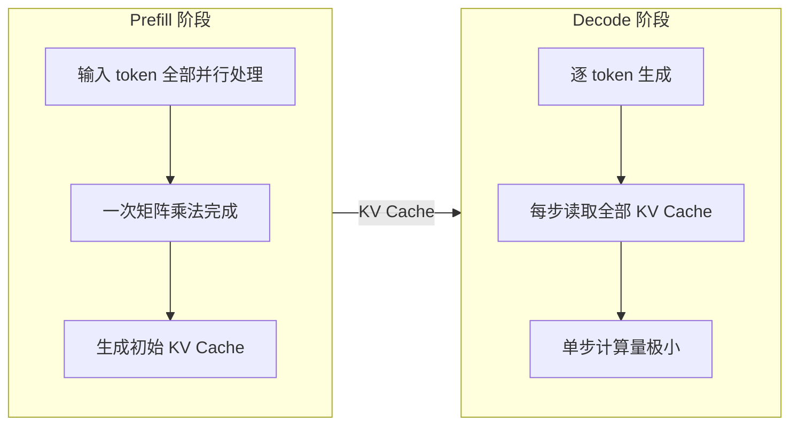
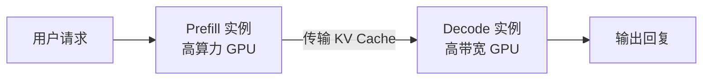
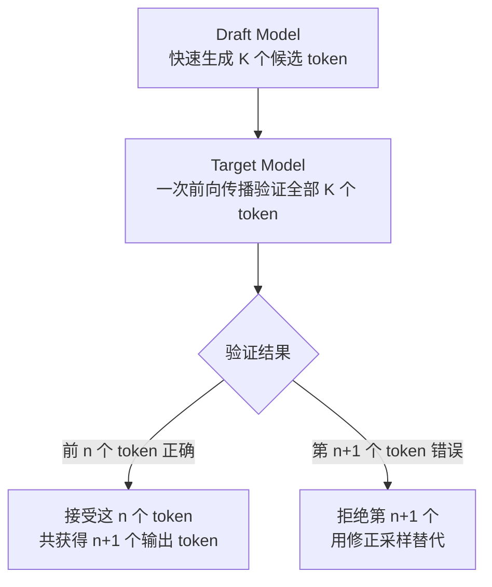

# 推理效率优化 —— 让推理跑得更快

在[上一章](test-time-compute.md)中，我们看到了推理阶段投入更多计算可以获得更好的答案。但现实世界对推理提出了另一个约束：**速度与成本**。一个需要"思考 30 秒"才能回答的模型，在实时对话场景中几乎不可用；一个需要 8 张 H100 才能运行的推理服务，其部署成本令大多数团队望而却步。推理效率优化就是在"答得好"和"答得快"之间寻找平衡。

大模型的推理效率问题，本质上是一个资源错配问题。推理过程分为两个阶段：预填充（Prefill）阶段处理输入的提示词，解码（Decode）阶段逐个生成输出 token。Prefill 阶段输入的所有 token 可以并行处理，GPU 算力被充分利用；Decode 阶段每步只生成一个 token，却要读取全部的 KV Cache，GPU 算力利用率常低于 5%，而显存已被 KV Cache 占满，无法通过增加批大小来提升利用率。这个"显存墙"问题是大模型推理效率的核心瓶颈。

围绕这个瓶颈，研究者从两个方向寻求突破。第一个方向是**不改模型，改系统**，通过更聪明的工程手段榨取现有硬件的潜力。2023 年，加州大学伯克利分校的权旭锡（Woosuk Kwon）等人在论文《Efficient Memory Management for Large Language Model Serving with PagedAttention》中提出了 PagedAttention 机制，借鉴操作系统虚拟内存的分页思想管理 KV Cache，将推理吞吐量提升了 2-4 倍，这项工作发表在操作系统领域顶级会议 SOSP 2023 上，催生了 vLLM 这一广泛使用的推理框架。同年，Google 的亚尼夫·列维坦（Yaniv Leviathan）等人在论文《Fast Inference from Transformers via Speculative Decoding》中提出了投机解码，用一个小模型"猜"多个候选 token，大模型一次前向传播同时验证，在不改变输出分布的前提下实现了 2-3 倍的加速。2024 年，加州大学圣迭戈分校的朱亦博（Yibo Zhu）等人在论文《DistServe: Disaggregating Prefill and Decoding for Goodput-Optimized Large Language Model Serving》中将 Prefill 和 Decode 分配到不同的 GPU 上，消除了两个阶段的互相干扰，发表在 OSDI 2024 上。Moonshot AI 团队开发的 Mooncake 系统更进一步，利用闲置 GPU 构建了 KV Cache 池，实现了请求级的弹性调度，获得了 FAST 2025 最佳论文奖。

第二个方向是**直接缩小模型**，通过知识蒸馏、剪枝和稀疏化等手段，将大模型的推理能力压缩到更小的参数空间中。这两个方向并非互斥，实际部署中往往是组合使用的 —— 一个经过蒸馏的小模型，再配合 PagedAttention 和投机解码，可以获得远超任何单一技术的效率提升。本文将系统梳理这两条路线的核心技术与思路。

## 推理瓶颈分析

在讨论如何优化之前，先要搞清楚瓶颈在哪里。大模型推理的效率问题不是"整体太慢"这么简单，而是 Prefill 和 Decode 两个阶段的资源需求截然不同，将它们放在同一块 GPU 上执行，必然导致其中一个阶段的资源被浪费。理解这两个阶段的计算特征，是理解后续所有优化技术的前提。

### 自回归生成的计算特征

[Transformer 架构](../architecture-basics/transformer-architecture.md)的推理是自回归的：每生成一个 token，都需要将之前所有 token 的 Key 和 Value 向量缓存下来，供下一个 token 的注意力计算使用。这个缓存被称为 **KV Cache**。推理过程因此自然地分为两个阶段：

*图：推理的两阶段流程*

**Prefill 阶段**处理用户输入的提示词，假设提示词长度为 $s$，模型维度为 $d$，注意力计算需要对 $s \times s$ 的注意力矩阵做乘法。由于输入的 $s$ 个 token 是已知的，可以一次性并行计算，GPU 的矩阵运算单元被充分利用，属于**计算密集型**（Compute-bound）。这意味着 Prefill 的速度主要取决于 GPU 的算力有多强，而与显存带宽关系不大。

**Decode 阶段**逐个生成输出 token。每生成一个 token，需要对所有已生成的 token 做注意力计算，但每步只有一个新 token 的 Query 需要跟所有已缓存的 Key 做点积，计算量只有 $s \times d$，远小于 Prefill 的 $s \times s \times d$。然而每步都需要从显存中读取完整的 KV Cache，数据量可能是几十 MB 甚至上百 MB，而实际只用到了其中极小一部分进行计算。Decode 属于**访存密集型**（Memory-bound），速度主要受限于显存带宽，GPU 的大量计算单元处于空闲状态。

用一个具体的例子来感受这种差异。假设 LLaMA-2 70B 模型在 A100（80GB）上运行，批量大小为 1。Prefill 阶段处理 1024 个输入 token，GPU 算力利用率可以达到 60% 以上；Decode 阶段生成每个 token 时，GPU 算力利用率仅有约 0.5%。同一块 GPU，两个阶段的算力利用率相差 100 倍以上。这就是推理效率优化的核心矛盾。

### 显存墙：KV Cache 的显存困局

既然 Decode 阶段 GPU 算力大量闲置，直觉上的解决办法是增加批量大小 —— 同时处理更多请求，让闲置的算力利用起来。但这条路被 KV Cache 的显存占用堵死了。

KV Cache 的显存占用可以用以下公式估算：

$$M_{\text{KV}} = 2 \times n_{\text{layer}} \times d_{\text{head}} \times n_{\text{head}} \times s_{\text{max}} \times b \times \text{sizeof}(\text{float16})$$

这个公式看着复杂，拆开来看含义很直观：

- $2$ 表示 Key 和 Value 各一份
- $n_{\text{layer}}$ 是 Transformer 的层数，每层都有一组 KV Cache
- $d_{\text{head}} \times n_{\text{head}}$ 是每个 token 的隐藏维度大小（$d_{\text{model}}$）
- $s_{\text{max}}$ 是序列的最大长度，序列越长缓存越大
- $b$ 是批量大小，每个请求都有独立的 KV Cache
- $\text{sizeof}(\text{float16})$ 是每个数值占 2 字节
- 整体公式可以理解为：每个 token 在每一层都需要缓存 Key 和 Value 两个向量，所有层、所有 token、所有请求的缓存加起来就是总显存占用

代入 LLaMA-2 70B 的具体参数（80 层、128 个注意力头、每头维度 128、最大序列长度 4096、float16 精度），单个请求的 KV Cache 就需要约 10 GB 显存。A100 只有 80 GB 显存，除去模型参数本身占用约 140 GB（需要张量并行分布在多张 GPU 上），每张 GPU 剩余的显存只能容纳少数几个请求的 KV Cache，批量大小根本上不去。

这就是**显存墙**（Memory Wall）问题：KV Cache 占满了显存，限制了批量大小，导致 GPU 算力无法被有效利用。Decode 阶段的算力利用率低不是因为没有计算任务，而是因为没有显存容纳更多请求。

### 推理服务的关键指标

理解了瓶颈之后，优化目标是什么？推理服务通常关注以下几个核心指标：

**首 token 延迟**（Time to First Token，TTFT）是从用户发送请求到模型输出第一个 token 的时间，主要由 Prefill 阶段决定。用户在对话场景中最先感知到的就是 TTFT，过长的等待会让用户觉得系统"卡住了"。

**每 token 生成时间**（Time Per Output Token，TPOT）是 Decode 阶段生成每个 token 的平均时间，它的倒数就是**每秒生成 token 数**（Tokens Per Second，TPS）。TPS 直接影响用户的阅读体验 —— 如果生成速度低于人类的阅读速度（约每秒 10-15 个 token），用户就会感觉回复在"慢慢挤出来"。

**吞吐量**（Throughput）是单位时间内系统处理的总 token 数，等于所有并发请求的 TPS 之和。吞吐量衡量的是系统的整体处理能力，对于批量处理场景（如文档翻译、数据标注）最为关键。

**并发数**（Concurrency）是系统同时处理的请求数。并发数受限于显存容量（主要是 KV Cache 占用），而吞吐量等于并发数乘以每个请求的 TPS。

这些指标之间存在此消彼长的关系。增加批量大小可以提升吞吐量，但每个请求分到的计算资源变少，TPS 会下降。优化 TTFT 需要给 Prefill 分配更多算力，但这可能挤占 Decode 的资源，导致正在生成中的请求变慢。不同应用场景对指标的优先级不同：实时对话场景优先保证 TTFT 和 TPS，批量处理场景优先最大化吞吐量。后续的所有优化技术，本质上都是在这些指标之间寻找更好的平衡点。

## PagedAttention：分页管理 KV Cache

显存墙的根源是 KV Cache 的管理方式。传统的做法是为每个请求预分配一块连续的显存空间，大小按照最大序列长度来预留。但这种"一口气占满"的方式带来了严重的浪费，而操作系统中早就有了应对类似问题的解决方案。

### 从操作系统分页到 KV Cache 管理

考虑一个具体场景：一个推理服务同时处理 3 个请求，最大序列长度设为 2048 token。传统方式为每个请求分配一块连续的 2048 token 空间，但实际请求的长度各不相同 —— 请求 A 只用了 200 token 就结束了，请求 B 用了 800 token，请求 C 还在生成中，当前已用了 1500 token。三个请求总共占用了 3 × 2048 = 6144 token 的显存空间，实际只使用了 200 + 800 + 1500 = 2500 token，浪费率高达 59%。更糟糕的是，请求 A 结束后释放的那块 2048 token 空间，由于是连续的，只有新请求恰好需要 2048 token 或更短才能利用，否则就会形成"显存空洞"。

这个问题和操作系统面临的内存管理问题如出一辙。早期操作系统也为每个程序分配连续的内存空间，导致严重的内存碎片。解决方案是**虚拟内存分页**：将物理内存划分为固定大小的页（Page），程序的地址空间也被划分为相同大小的页，通过页表将虚拟页映射到物理页。程序不必占据连续的物理内存，只要页表能正确映射就行。空闲的页可以被任何程序使用，碎片问题消失了。

权旭锡等人提出的 PagedAttention 正是将这个思想搬到了 KV Cache 管理。KV Cache 不再是连续的大块显存，而是被划分为固定大小的 **block**（类似内存的页），每个 block 存储 16 个 token 的 Key 和 Value 向量。请求的 KV Cache 不需要占据连续的 block，而是通过一张 block 表（类似页表）将逻辑上连续的 KV Cache 映射到物理上分散的 block 上。注意力计算时，通过 block 表找到每个 token 对应的物理地址，就能正常计算。

### PagedAttention 的实现机制

PagedAttention 的核心组件有三个：

**Block 表**（Block Table）记录每个请求的 KV Cache 各 block 的物理位置。请求的逻辑 block 0 可能映射到物理 block 7，逻辑 block 1 映射到物理 block 23，完全不必连续。注意力计算时，GPU 内核根据 block 表找到需要读取的物理地址，再从这些地址读取 Key 和 Value 向量。

**Block 分配器**（Block Allocator）统一管理所有物理 block 的分配与回收。新的 token 生成后，分配器从空闲 block 池中取一个 block 分给当前请求；请求结束后，分配器将该请求的所有 block 回收到空闲池中。由于 block 大小固定，回收后任何请求都能使用，不存在碎片问题。

**Copy-on-Write 机制**处理并行采样场景。当模型对同一提示词生成多个候选回复时，这些回复在开头部分共享完全相同的 KV Cache。PagedAttention 让它们共享同一组物理 block，只在分叉点（各候选开始生成不同 token 的位置）才分配新的 block。这又借鉴了操作系统的 Copy-on-Write 机制 —— 多个进程共享同一块内存页，只有当某个进程试图修改时才复制一份。

### 显存节省与吞吐提升效果

PagedAttention 带来的改善可以用一组对比来量化。在传统连续分配方式下，每个请求必须预留最大长度的显存空间，假设最大长度 2048、block 大小 16 token，每个请求预分配 128 个 block。但实际大部分请求远达不到最大长度，平均只用约 20 个 block，浪费率约 84%。PagedAttention 下，每个请求只在需要时才分配 block，没有浪费。以 A100 80 GB 显存为例，传统方式下每张 GPU 可能只能同时处理 10 个请求，PagedAttention 下可以同时处理 50-60 个请求，吞吐量提升 4-6 倍。

PagedAttention 还带来了一个额外的好处：**system prompt 的 KV Cache 复用**。在对话系统中，每个请求都包含相同的系统提示词（如"你是一个有用的助手"）。传统方式下，每个请求都为这段提示词单独计算并缓存 KV Cache，造成大量重复。PagedAttention 让所有请求共享同一组物理 block 来存储 system prompt 的 KV Cache，新增请求只需计算 system prompt 之后的部分，既节省了显存，又减少了 Prefill 的计算量。

vLLM 的实验数据展示了这些优化的综合效果。在 ShareGPT 数据集上，vLLM 的吞吐量比传统框架（FasterTransformer）高出 2-4 倍，且延迟更低。当开启 system prompt 共享后，长 system prompt 场景下的吞吐量还可以进一步提升 30-50%。

## Prefill-Decode 分离架构

PagedAttention 解决了 KV Cache 的显存管理问题，让更多请求可以同时占用 GPU，但并没有改变 Prefill 和 Decode 被放在同一块 GPU 上执行的事实。当这两种计算模式截然不同的阶段挤在一起，就不可避免地互相干扰。

### 为什么分离 Prefill 与 Decode

Prefill 和 Decode 对硬件资源的需求正好相反。Prefill 阶段处理大量的矩阵乘法，需要 GPU 算力全开，属于计算密集型。Decode 阶段逐 token 读取 KV Cache，计算量很小，瓶颈在显存带宽，属于访存密集型。

当两者混在同一 GPU 上，问题就来了。假设 GPU 正在处理一批 Decode 请求，算力利用率只有 3%。此时一个新请求进来需要做 Prefill，GPU 不得不暂停部分 Decode 计算来腾出算力，正在生成的请求就变慢了。DistServe 的实验量化了这种干扰：一个大的 Prefill 请求可以把正在运行的 Decode 请求延迟放大 2-30 倍。反过来，当 GPU 全力做 Prefill 时，已经在显存中的 Decode 请求的 KV Cache 占着显存不干活，白白浪费了宝贵的显存空间。

这就好比一条车道上同时跑着两种车：Prefill 是满载的重卡车，需要大马力加速；Decode 是走走停停的轿车，需要通畅的道路。让它们共用一条车道，重卡车加速时轿车被堵，轿车走走停停时车道空闲浪费。分离架构的做法很简单 —— 给它们各自一条车道。

### PD 分离的基本架构

Prefill-Decode 分离架构的核心设计是将推理服务拆分为两组独立的 GPU 实例：**Prefill 实例**专门处理输入提示词，**Decode 实例**专门生成输出 token。一个请求的完整生命周期变成：先在 Prefill 实例上做完 Prefill，生成的 KV Cache 通过高速网络传输到某个 Decode 实例，然后 Decode 实例负责逐 token 生成直到请求完成。

*图：PD 分离架构的基本流程*

两组实例可以根据各自的需求选择不同的硬件配置。Prefill 实例需要高算力，适合使用 H100 这样的大算力 GPU；Decode 实例需要高显存带宽，A100 的 HBM2e 带宽反而更匹配。甚至 Decode 实例可以使用更经济的配置 —— 因为单个 Decode 请求的计算量很小，即使算力弱一些也不太影响生成速度，只要显存带宽足够就行。

DistServe 的实验验证了这种分离的优势。在相同硬件总量下，分离架构相比传统的混合部署，吞吐量提升了 1.4-2.4 倍，同时满足更严格的延迟约束。分离之后，Prefill 实例不再被 Decode 请求拖慢，TTFT 更稳定；Decode 实例不再被 Prefill 请求干扰，TPS 更均匀。

### KV Cache 传输与调度

分离架构带来了新的工程挑战：KV Cache 如何从 Prefill 实例传到 Decode 实例？

一个请求的 KV Cache 可能很大。以 LLaMA-2 70B 为例，处理 1024 token 的提示词后，生成的 KV Cache 约 2.5 GB（float16 精度）。在传统的 PCIe 4.0 连接下，传输 2.5 GB 需要约 50 ms（带宽约 50 GB/s），这已经接近单个 Decode 步的延迟。如果用 NVLink（带宽 300 GB/s），传输只需约 8 ms，几乎可以忽略。因此，PD 分离架构通常要求 Prefill 和 Decode 实例之间有高速互连，NVLink 或 InfiniBand 是首选。

调度策略也是一个关键问题。多个 Decode 实例中，新请求应该分配给哪一个？最直观的策略是**轮询**（Round-Robin），轮流分配，简单但不够精细。更合理的策略考虑两个因素：一是 Decode 实例当前的负载情况（已经承载了多少请求，显存还剩多少空间），二是请求的预期生成长度（短请求分配给轻载实例，长请求分配给重载实例以避免短请求被拖慢）。这种**负载感知调度**可以更好地平衡各 Decode 实例的工作量，减少请求之间的互相干扰。

### Mooncake 与弹性分离架构

Mooncake 代表了 PD 分离架构的更极致形态。Moonshot AI 团队运营着 Kimi 这个面向数百万用户的对话服务，每天的请求量巨大且波动明显 —— 白天高峰期是深夜低谷期的数倍。传统的部署方式要么按高峰期配置资源（低谷期大量 GPU 空闲浪费），要么按低谷期配置（高峰期服务质量下降）。

Mooncake 的核心创新是引入了一个**KV Cache 池**（KV Cache Pool）。这个池不是一个固定的 GPU 集群，而是由一组可弹性伸缩的实例组成。Prefill 实例完成计算后，KV Cache 不是直接传给某个固定的 Decode 实例，而是先"放入"池中，调度器再根据当前负载将请求分配给最合适的 Decode 实例继续生成。

这种设计有几个好处。首先是**弹性调度**：高峰期可以临时启动更多 Decode 实例来消化请求，低谷期可以缩减实例数以节省成本。其次是**前缀复用**：池中已有的 KV Cache（如 system prompt 的缓存）可以被新请求直接复用，跳过重复的 Prefill 计算。再次是**离线再平衡**：调度器可以将运行中的请求从一个 Decode 实例迁移到另一个，以优化整体的负载分布，这在传统混合部署中几乎不可能做到。

Mooncake 在 Kimi 的实际生产环境中，GPU 利用率从传统部署的约 20% 提升到了约 60%，在相同硬件配置下将服务的吞吐量提升了 3 倍以上。这项工作获得了 FAST 2025 最佳论文奖，标志着 PD 分离架构从学术研究走向了大规模工业实践。

## 投机解码

PagedAttention 和 PD 分离都是从系统层面解决推理效率问题，不改变模型本身的行为。投机解码则是一种更有趣的策略：它也不改变模型的输出分布，但改变了生成 token 的方式 —— 从"逐个生成"变为"先猜后验"，让 GPU 的计算资源在 Decode 阶段也能被充分利用。

### 投机解码的基本思想

回到 Decode 阶段的根本问题：GPU 每步只生成一个 token，计算量极小，大量算力被浪费。如果能让 GPU 一次做更多计算，即使最终只有一部分结果被采纳，也比逐个生成更高效。投机解码正是这样做的。

投机解码的流程可以类比为一个"学生猜答案，老师批量批改"的场景。假设有一道选择题，聪明的学生（draft model）虽然不如老师（target model）权威，但能快速给出几个可能正确的答案。老师不需要逐个逐个地检查，而是把学生的几个候选答案拿来一次性批改：对的留下，错的划掉，然后在第一个错误答案的位置给出老师的标准答案。

具体的工作流程如下：

*图：投机解码的工作流程*

Draft model 一次快速生成 $K$ 个候选 token（推测长度，通常为 4-8），这个过程是自回归的，但因为 draft model 远小于 target model，生成速度很快。然后 target model 对这 $K$ 个 token 做一次前向传播，这次传播同时对所有 $K$ 个 token 计算注意力，等价于一次性获得了每个位置上 target model 的概率分布。通过比较 draft model 和 target model 在每个位置上的概率分布，可以逐个判断候选 token 是否被 target model"认可"：如果 draft model 选的 token 在 target model 的概率分布中也有较高的概率，就接受这个 token；否则拒绝，并从 target model 的概率分布中采样一个替代 token。

假设推测长度 $K=5$，接受率 $\alpha=0.8$（即平均 80% 的候选 token 被接受）。那么平均每次投机能接受的 token 数为 $K \times \alpha = 4$，加上 target model 每次修正生成的 1 个 token，一次投机平均产出 5 个 token。而传统自回归方式需要 5 次前向传播才能生成 5 个 token。由于 draft model 的前向传播远快于 target model，且 target model 只做了一次前向传播而非 5 次，总体速度显著提升。

### Speculative Sampling 的理论保证

投机解码有一个关键的理论优势：**它保证输出分布与原始自回归采样完全一致**。这不是近似加速，而是精确加速 —— 同一个模型、同一个采样策略，投机解码和逐个生成最终产生的 token 序列的概率分布完全相同。

这个保证通过修正采样（Modified Rejection Sampling）实现。对于位置 $t$ 的候选 token $x_t$（由 draft model 以概率 $q(x_t)$ 采样得到），target model 在该位置的概率为 $p(x_t)$。接受规则如下：

- 如果 $p(x_t) \geq q(x_t)$，直接接受 $x_t$（target model 比 draft model 更认可这个 token）
- 如果 $p(x_t) < q(x_t)$，以概率 $\frac{p(x_t)}{q(x_t)}$ 接受 $x_t$，以概率 $1 - \frac{p(x_t)}{q(x_t)}$ 拒绝，并在拒绝时从修正分布 $\max(0, p(x) - q(x))$ 中采样一个替代 token

这个接受 - 拒绝机制看似复杂，其数学本质很直观：draft model 倾向于选择自己认为概率高的 token（$q(x_t)$ 大），但如果 target model 也认为这个 token 概率高（$p(x_t)$ 也大），那就应该接受。当 draft model 选了一个自己觉得好但 target model 觉得不太好的 token（$p(x_t) < q(x_t)$），就按概率比例来决定是否接受，保证最终的概率分布恰好是 $p(x)$ 而不是被 $q(x)$ 偏移。修正分布 $\max(0, p(x) - q(x))$ 则确保了拒绝时采样的替代 token 来自 target model 比 draft model"更偏好"的那些 token，使得拒绝 - 修正后仍然维持了目标分布。

这个理论保证是投机解码区别于模型量化、剪枝等近似加速方法的关键优势。量化和剪枝改变了模型本身，输出分布随之改变，加速是以牺牲输出质量为代价的。投机解码不改模型、不改分布，加速纯粹来自生成方式的优化，不引入任何质量损失。

### Draft Model 的选择与训练

投机解码的加速效果取决于两个因素：draft model 的生成速度和候选 token 的接受率。生成速度取决于 draft model 的参数量 —— 越小越快。接受率取决于 draft model 与 target model 的分布匹配程度 —— 越接近，target model"认可"的候选越多，接受率越高。这两个因素存在矛盾：draft model 太小，生成快但与 target model 差距大，接受率低；draft model 太大，接受率高但生成慢，投机本身没有加速效果。

实践中，draft model 通常是 target model 的一个小版本。例如 target model 是 LLaMA-2 70B，draft model 可以是 LLaMA-2 7B，参数量只有前者的十分之一，生成速度约快 10 倍。由于两者使用相同的训练数据和词表，分布匹配程度较高，接受率通常在 70%-85% 之间。

除了选择已有的小模型作为 draft model，还可以专门训练一个 draft model。训练策略有两种：一是直接用 target model 的训练数据训练一个小模型，使其分布尽可能接近 target model；二是用 target model 的输出作为蒸馏数据，让 draft model 学习 target model 的概率分布，这实际上就是[知识蒸馏](#知识蒸馏-将大模型的推理能力迁移到小模型)在投机解码中的特殊应用。

还有一种更巧妙的方式避免了独立 draft model 的存在：**Medusa**。Medusa 不使用单独的小模型，而是在 target model 上直接添加多个预测头（Prediction Head），每个头预测未来第 $k$ 个 token（第 1 个头预测下一个 token，第 2 个头预测下下个 token，以此类推）。这些预测头是轻量的（通常只有一个线性层），训练成本极低，推理时与 target model 的前向传播一起执行，不需要额外的模型调用。Medusa 的优势在于不增加系统的复杂度，也不需要维护一个独立的 draft model，但预测头的准确率通常低于专门的 draft model，接受率相应较低。

### 推理加速比分析

投机解码的理论加速比可以用以下公式估算：

$$S \approx \frac{1}{\frac{1}{K+1} \cdot \frac{1}{\alpha^{K}} \cdot \frac{T_d}{T_t} + \frac{1-\alpha^{K}}{K \cdot \alpha^{K}+1}}$$

其中 $K$ 是推测长度，$\alpha$ 是接受率，$T_d$ 是 draft model 单步生成时间，$T_t$ 是 target model 单步生成时间。这个公式看起来复杂，核心含义是：加速比取决于每次投机平均产出多少个有效 token 与传统方式对比的效率差异。直观地说，接受率 $\alpha$ 越高，平均每次投机产出的 token 数越多；draft model 越快（$T_d/T_t$ 越小），投机本身的时间开销越低，两者共同决定了加速比。

实践中，接受率因任务类型而异。代码生成任务的接受率通常较高（80%-90%），因为代码有固定的语法结构，draft model 容易"猜对"。数学推理任务的接受率也较高（75%-85%），推理步骤有较强的模式性。开放式对话的接受率最低（60%-70%），因为对话内容多样且不确定，draft model 很难猜出 target model 会说什么。

在实际系统中，投机解码通常能实现 2-3 倍的加速。Google 在 2023 年的实验中，用 T5-XXL 作为 target model、T5-Large 作为 draft model，在不同任务上获得了 2-4 倍的加速效果。微软在 2024 年发布的 DeepSpeed-FastGen 中集成投机解码后，推理吞吐量提升了约 2.5 倍。

## 模型轻量化

前面讨论的 PagedAttention、PD 分离和投机解码都是从系统层面优化推理效率，模型本身没有变。还有另一条路线：**直接把模型变小**。如果模型参数少了，KV Cache 自然就小了，计算量自然就低了，瓶颈也自然缓解了。模型轻量化就是这条路线的核心技术，主要包括知识蒸馏和剪枝与稀疏化两种方法。

### 知识蒸馏：将大模型的推理能力迁移到小模型

知识蒸馏的思想最早可以追溯到 2006 年，当时罗马尼亚裔研究员克利恩·布西卢（Cristian Buciluă）等人在论文《Model Compression》中提出了用集成模型指导小模型训练的想法。2015 年，杰弗里·辛顿（Geoffrey Hinton）等人在论文《Distilling the Knowledge in a Neural Network》中正式提出了知识蒸馏的框架，用"教师 - 学生"的比喻来描述大模型指导小模型训练的过程。

知识蒸馏的直觉来自一个日常观察：让一个新手从零开始学习和让一个有经验的老师手把手教导，学习效果截然不同。大模型（教师）经过海量数据训练，"知道"的东西远不止它最终输出的那个答案。比如问"法国的首都是什么"，教师模型输出"巴黎"的概率是 90%，但它对"里昂"也给了 5% 的概率，对"马赛"给了 2% 的概率。这个概率分布包含了教师模型对问题"理解"的知识，而不仅仅是最终答案。知识蒸馏的目标是让小模型（学生）不仅学到正确答案，还要学到教师模型对错误答案的概率判断。

具体来说，知识蒸馏训练时，学生的损失函数包含两部分：

$$\mathcal{L} = \alpha \cdot \text{KL}(p_\tau \| q_\tau) + (1 - \alpha) \cdot \mathcal{L}_{\text{CE}}$$

这个公式拆开来看含义很直观：

- $\text{KL}(p_\tau \| q_\tau)$ 是教师模型分布 $p_\tau$ 和学生模型分布 $q_\tau$ 之间的 KL 散度，衡量两个分布的差异。训练目标是让学生模型的分布尽可能接近教师模型
- 下标 $\tau$ 是**温度参数**（Temperature），用于软化概率分布。标准的 softmax 在温度为 1 时给出尖锐的概率分布（最高概率的 token 占绝对优势），温度越高分布越平滑，教师模型对各个 token 的"知识"就越清晰可见。通常蒸馏时使用 $\tau = 4$ 或 $\tau = 8$
- $\mathcal{L}_{\text{CE}}$ 是标准交叉熵损失，确保学生模型仍然能输出正确的最终答案
- $\alpha$ 控制两项损失的权重，通常设为 0.5-0.9
- 整体公式可以理解为：学生既要学习教师的"理解"（分布相似性），也要学习正确的"答案"（分类准确性）

在大模型推理场景中，知识蒸馏最突出的成功案例是 Distilled Whisper。OpenAI 的 Whisper 是一个强大的语音识别模型，最大版本有 15.5 亿参数，但推理速度慢、内存需求高。Hugging Face 使用知识蒸馏将其压缩为不同规模的版本，其中蒸馏后的 tiny 版本只有 3900 万参数，参数量减少了 40 倍，在大多数英语语音识别任务上仍保留了原始模型 90% 以上的准确率。另一个典型案例是 DeepSeek 团队在 2024 年发布的 DeepSeek-R1-Distill 系列，将 DeepSeek-R1 的推理能力蒸馏到 1.5B 到 32B 不同规模的小模型中，最小的 1.5B 模型在数学推理任务上仍然展示出显著的推理链能力。

### 剪枝与稀疏化

如果说知识蒸馏是"重新训练一个小模型来模仿大模型"，那剪枝就是"直接在大模型上删掉不太重要的参数"。

剪枝的基本思想来自 1990 年崔永桢（Yung-Sik Chow）等人和 1989 年鲁道夫·米克莱（Rudolf Miclea）等人的早期工作，但真正在神经网络中广泛应用要归功于 2015 年宋汉宇（Song Han）等人在论文《Learning both Weights and Connections for Efficient Neural Networks》中提出的方法：将权重矩阵中绝对值较小的参数置零，然后微调剩余参数恢复精度。被置零的参数在推理时无需计算和存储，从而减少计算量和存储需求。

大模型的剪枝面临一个独特挑战：参数量巨大（数百亿），且模型各层对剪枝的敏感度差异很大。简单的全局阈值剪枝（把所有参数中绝对值最小的 50% 置零）会导致严重的精度损失，因为某些层的关键参数可能恰好绝对值不大。**SparseGPT**（2023 年，伊莱亚斯·弗伦查（Elias Frantar）等人）和**Wanda**（2023 年，孟思佳（Sijia Meng）等人）是两个代表性的大模型剪枝方法。SparseGPT 通过近似稀疏回归在单次前向传播中确定每个权重矩阵的最优剪枝方案，不需要任何重新训练，就能在 50% 稀疏度下保留原始模型约 97% 的性能。Wanda 则通过比较每个权重的绝对值与对应输入激活值的范数来决定剪枝，同样不需要重新训练，在 50% 稀疏度下性能损失不到 1%。

稀疏化的一个特殊形式是**MoE 的推理效率**（Mixture of Experts）。[MoE 模型](../architecture-basics/transformer-architecture.md)虽然总参数量巨大，但每次推理只激活少数专家（例如 Mixtral 8×7B 只激活 2 个专家），实际计算量远小于稠密模型。MoE 的推理效率优化主要在于如何减少专家切换时的显存访问开销，以及如何提高单次推理中多个 token 激活同一专家的批处理效率。这已经超出了传统剪枝的范畴，更接近于一种结构化的条件计算，但目标是一致的：用更少的计算得到接近稠密模型的输出质量。

需要注意的是，剪枝带来的加速效果并不像参数减少比例那样直观。50% 的稀疏度不等于 50% 的速度提升，因为稀疏矩阵的乘法在 GPU 上的效率取决于稀疏模式是否规整。非结构化稀疏（随机位置置零）在 GPU 上很难获得实际加速，因为零元素分散在矩阵各处，GPU 仍需遍历整个矩阵。结构化稀疏（整行或整块置零）更容易获得实际加速，但通常精度损失更大。这个差距是剪枝技术在实践中应用不如知识蒸馏广泛的主要原因之一。

## 本章小结

推理效率优化的核心矛盾是 Decode 阶段的"显存墙"：KV Cache 占满了显存，限制了批量大小，GPU 算力无法被有效利用。围绕这个矛盾，优化技术分为两条路线。

第一条路线是**不改模型，改系统**，通过工程手段榨取硬件潜力。PagedAttention 借鉴操作系统分页思想管理 KV Cache，消除了显存碎片，让 GPU 可以同时容纳更多请求，吞吐量提升 2-4 倍。PD 分离架构将 Prefill 和 Decode 分配到不同的 GPU 实例上，消除了两个阶段的互相干扰，让每种资源都能被充分利用。投机解码用小模型"猜"候选 token、大模型批量验证，在不改变输出分布的前提下实现 2-3 倍加速。这些技术可以组合使用，一个部署了 PagedAttention 和投机解码的 PD 分离系统，相比传统框架可以实现 5-10 倍的吞吐量提升。

第二条路线是**直接缩小模型**，将大模型的推理能力压缩到更小的参数空间中。知识蒸馏通过教师 - 学生框架让小模型学习大模型的概率分布，在参数量减少数十倍的情况下仍能保留大部分性能。剪枝和稀疏化直接删除模型中不太重要的参数，但非结构化稀疏在 GPU 上的实际加速效果有限，这是剪枝技术在实践中应用不如知识蒸馏广泛的原因。

两条路线并非互斥，实际部署中往往是组合使用的。一个经过蒸馏的小模型配合 PagedAttention 和投机解码，可以获得远超任何单一技术的效率提升。选择哪种组合取决于应用场景的约束：实时对话场景优先保证低延迟，适合蒸馏小模型配合投机解码；批量处理场景优先最大化吞吐量，适合大模型配合 PagedAttention 和 PD 分离。

推理效率优化仍在快速发展中。一个值得关注的方向是**量化**（Quantization），将模型权重从 float16 压缩到 int8 甚至 int4，直接减少计算量和显存占用，但量化会改变输出分布，属于近似加速方法。另一个方向是**KV Cache 压缩**，通过丢弃不重要的注意力向量或低秩近似来减少 KV Cache 的大小，在保持生成质量的同时缓解显存压力。这些技术与本章讨论的方法正被集成到 vLLM、TensorRT-LLM、SGLang 等推理框架中，让大模型的推理成本持续下降。

## 练习题

1. 计算 LLaMA-2 7B 模型在批量大小为 16、最大序列长度为 2048、float16 精度下的 KV Cache 总显存占用。模型参数：32 层、32 个注意力头、每头维度 128。如果可用显存为 40 GB（除去模型参数后），还能增加多少请求？

   

   
参考答案

   代入 KV Cache 显存占用公式：

   $$M_{\text{KV}} = 2 \times 32 \times 128 \times 32 \times 2048 \times 16 \times 2 = 2 \times 32 \times 4096 \times 2048 \times 16 \times 2$$

   逐项计算：$2 \times 32 = 64$，$64 \times 128 = 8192$，$8192 \times 32 = 262144$，$262144 \times 2048 = 536870912$，$536870912 \times 16 = 8589934592$，$8589934592 \times 2 = 17179869184$ 字节 ≈ 16 GB。

   单个请求的 KV Cache 为 $16 \text{ GB} / 16 = 1 \text{ GB}$。如果可用显存为 40 GB，当前 16 个请求占用 16 GB，剩余 24 GB 还可以容纳约 24 个请求，总并发数可达 40 个。

   

2. 在投机解码中，假设推测长度 $K=5$，接受率 $\alpha=0.7$，draft model 的单步生成时间是 target model 的 1/8。计算每次投机平均产出的有效 token 数，以及与传统自回归方式相比的近似加速比。

   

   
参考答案

   每次投机平均被接受的 token 数为 $\sum_{i=1}^{K} \alpha^{i} = \alpha + \alpha^2 + \alpha^3 + \alpha^4 + \alpha^5 = 0.7 + 0.49 + 0.343 + 0.2401 + 0.16807 \approx 1.94$。加上拒绝时 target model 修正生成的 1 个 token，每次投机平均产出约 $1.94 + 1 = 2.94$ 个有效 token。

   时间开销方面：draft model 生成 5 个 token 需要 $5 \times T_d = 5 \times T_t / 8 = 0.625 T_t$，target model 验证需要 $1 \times T_t$。总时间约 $1.625 T_t$。

   传统自回归方式生成 2.94 个 token 需要 $2.94 \times T_t$。加速比约为 $2.94 / 1.625 \approx 1.81$ 倍。

   注意：接受率为 0.7 时加速效果不如 0.8 时显著，这说明了 draft model 与 target model 分布匹配度的重要性。

   

3. 分析以下三个应用场景，分别推荐最合适的推理效率优化策略组合，并说明理由：

   - 场景 A：面向数百万用户的实时聊天机器人，延迟要求严格（TTFT < 0.5 秒，TPS > 20）
   - 场景 B：面向企业的批量文档翻译服务，对延迟不敏感，需要最大化吞吐量
   - 场景 C：面向研究人员的代码辅助工具，用户量不大但需要高质量输出

   

   
参考答案

   **场景 A**：蒸馏小模型 + PagedAttention + 投机解码。实时聊天对延迟极其敏感，蒸馏小模型（如 7B）本身的生成速度快，配合 PagedAttention 提升并发能力，投机解码进一步加速生成。PD 分离在这里也可以使用，但百万用户意味着请求量大，单集群的 Prefill 实例可能成为瓶颈，需要根据负载测试决定是否分离。

   **场景 B**：大模型 + PagedAttention + PD 分离。批量处理不需要低延迟，可以用大模型保证输出质量。PagedAttention 最大化并发数以提升吞吐量，PD 分离让 Prefill 和 Decode 各自高效运行。投机解码在批量场景下收益有限，因为批量大小已经很大，Decode 阶段的算力利用率已经不低。

   **场景 C**：大模型 + 投机解码。代码辅助的用户量不大，并发压力低，PagedAttention 和 PD 分离的优势不大。但代码生成对质量要求高，必须用大模型。投机解码特别适合代码生成场景（接受率高达 80%-90%），可以在不影响质量的前提下显著加速。

   

4. PagedAttention 借鉴了操作系统的虚拟内存分页思想。请对比两者的相似之处和关键差异：操作系统中的分页面临什么问题，KV Cache 管理中是否有类似问题？KV Cache 管理是否有操作系统中不存在的新挑战？

   

   
参考答案

   **相似之处**：两者都解决了连续分配导致的碎片问题，都用固定大小的块（页/block）作为分配单位，都通过映射表（页表/block 表）将逻辑地址映射到物理地址，都支持共享（操作系统中的共享库 / KV Cache 中的 system prompt 共享）。

   **关键差异**：操作系统中的页在程序运行期间可能被换出到磁盘（swap），而 KV Cache 的 block 通常不会被换出到 CPU 内存或磁盘，因为 Decode 阶段对延迟极其敏感，换入换出的延迟不可接受。KV Cache 管理有一个操作系统中不存在的新挑战：**动态增长**。操作系统中的进程内存分配在申请时就确定了大小，而 KV Cache 随着生成过程不断增长，每个 Decode 步都可能需要分配新的 block，这要求分配器必须极快（否则成为性能瓶颈），且需要处理"分配失败"的情况（显存不足时需要抢占或拒绝新请求）。此外，KV Cache 的 block 在请求结束后立即回收，生命周期比操作系统页短得多，对分配和回收的效率要求更高。

   

