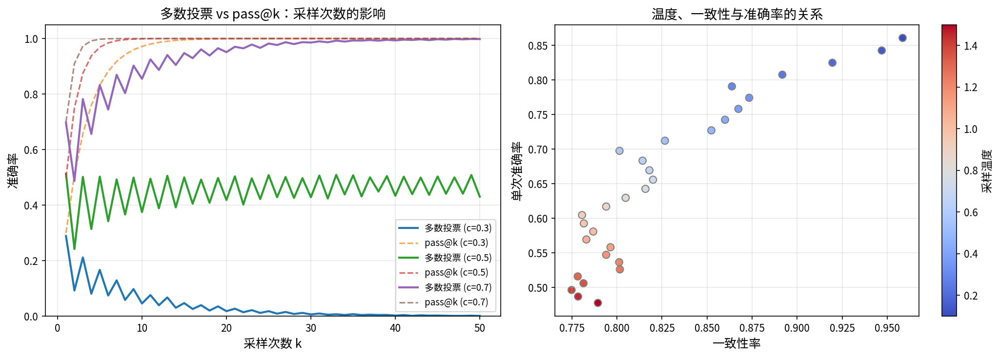

# 推理可靠性

1950 年，艾伦·图灵（Alan Turing）在论文《Computing Machinery and Intelligence》中提出了著名的图灵测试：如果一台机器能够与人类进行对话，而人类无法分辨对方是人还是机器，那么这台机器就可以被认为具有智能。这个测试隐含了一个前提假设 —— 推理能力是智能的核心特征。七十余年后，大语言模型在对话中展现出的推理能力，似乎正在逼近图灵的设想。

然而，机器的推理与人类的推理，存在着本质的差异。2022 年，OpenAI 的研究员在研究 ChatGPT 的推理行为时发现了一个令人不安的现象，模型在回答数学问题过程中会编造出看似合理的中间步骤。譬如当被问到 123 × 456 等于多少时，模型可能给出这样的推理链："首先计算 123 × 400 = 49200，然后计算 123 × 50 = 6150，最后计算 123 × 6 = 738，将三者相加得到 56088"，这个推理过程看起来很有条理，答案也完全正确，似乎表明模型推理很可靠。但问题在于它本身就是一台计算机，反而要通过统计模式匹配来模拟人类的计算方式去寻找答案，这恰恰说明了模型并没有真正理解问题，只是在做模仿。当问题足够简单、训练数据中类似例子足够多时，这种模仿往往能得出正确的结果。但当问题超出训练分布、或需要多步精确推理时，模型的推理链就可能一步错、步步错，甚至在推理过程中编造不存在的事实来支撑错误的结论。这种被研究者称为幻觉（Hallucination）的现象，揭示了统计学习范式下推理的固有局限。

理解这些局限，不是否定推理模型的价值，而是为了更准确地使用它们，知道什么时候可以信任，什么时候必须验证。本章将从推理链的脆弱性、推理一致性问题、统计拟合与符号推理的根本差异三个维度，深入分析模型推理的边界，并介绍提升推理可靠性的实践方法。

## 推理链的脆弱性

上一章我们讨论了 Test-Time Compute Scaling，看到了增加推理步数在统计上能提升准确率。但统计上的提升掩盖了一个令人不安的事实：**单次推理过程中，推理链越长，出错的概率越高**。这就像一条锁链 —— 任何一个环节断裂，整条链就失去作用。推理链的脆弱性是理解模型推理局限的第一个维度。

### 误差累积：一步错，步步错

想象你在做一道多步数学题：第一步计算 $a = 3 \times 7 = 21$，第二步计算 $b = a + 5 = 26$，第三步计算 $c = b \times 2 = 52$。如果第一步就算错了，得到 $a = 22$，那么后续所有步骤都会基于这个错误值继续推导：$b = 22 + 5 = 27$，$c = 27 \times 2 = 54$。即使后面的加法和乘法完全正确，最终答案也是错的。这就是**误差累积**（Error Accumulation）——一个早期步骤的错误会像滚雪球一样，持续影响后续所有推理。

人类在面对这种情况时，有一种天然的"纠错本能"。如果你在第三步突然意识到"等等，3 × 7 应该是 21 而不是 22"，你可以回头修正第一步，然后重新计算后续步骤。但大语言模型的推理机制让这种回头纠错变得极其困难。模型的推理本质上是**自回归生成**：每一步的输出都基于前面所有步骤的上下文。一旦第一步生成了错误的 $a = 22$，这个错误就被"写死"在了上下文窗口中，成为后续推理的"事实依据"。模型无法像人类那样"忘记"之前的错误步骤，因为自注意力机制会将上下文中的每一个 token 视为等价的输入信息。

这种差异可以用一个简单的概率模型来刻画。假设推理链有 $n$ 步，每一步独立出错的概率为 $p$。那么整条推理链完全正确的概率为：

$$P(\text{全部正确}) = (1 - p)^n$$

这个公式看着简单，含义却很直观：$(1 - p)$ 是单步正确的概率，$n$ 次连乘表示每一步都必须正确，推理链才能不出错。当 $n$ 增大时，这个概率以指数速度衰减。代入具体数字：假设单步准确率 $p = 0.01$（即每步有 99% 的正确率），那么 10 步推理的完全正确率为 $0.99^{10} \approx 0.904$，50 步为 $0.99^{50} \approx 0.605$，100 步则降到 $0.99^{100} \approx 0.366$。也就是说，即使每步都有 99% 的正确率，100 步推理中也只有约三分之一的概率完全不出错。

当然，现实中模型的错误并非完全独立 —— 前一步的错误可能让后续步骤更容易出错（正相关），也可能因为逻辑约束反而让错误更易被发现（负相关）。但独立假设下的指数衰减模型揭示了一个基本事实：**在自回归生成范式下，推理链的可靠性随长度增长而指数下降，这构成了长链推理的根本性挑战**。

2023 年，谷歌 DeepMind 的研究团队在一项系统性研究中量化了这一现象。他们发现，在 GSM8K 数学推理数据集上，当推理链长度超过 15 步时，GPT-4 的错误率显著上升；而当推理链超过 30 步时，即使是经过专门训练的推理模型，完全正确的概率也大幅下降。更值得注意的是，研究还发现模型在推理链中犯错后，有约 70% 的概率会在后续步骤中继续基于错误前提推导，而不是自我纠正。这与人类推理者形成鲜明对比 —— 人类在发现矛盾后通常会回溯检查，但模型倾向于"将错就错"。

### 中间步骤的幻觉

误差累积讨论的是"推理步骤执行正确但前提错误"的情况，但模型推理中存在一个更隐蔽的问题：**模型可能在推理过程中编造看似合理但实际错误的中间事实**。这种现象被称为"推理幻觉"（Reasoning Hallucination），它比直接回答时的幻觉更危险，因为它被包裹在逻辑推理的外壳中，更具欺骗性。

考虑这样一个场景：模型被问到"2023 年诺贝尔物理学奖授予了谁？"如果模型直接回答错误，用户很容易判断这是幻觉。但如果模型给出这样的推理链："2023 年诺贝尔物理学奖表彰了阿秒脉冲光谱学方面的贡献。获奖者包括皮埃尔·阿戈斯蒂尼（Pierre Agostini）、费伦茨·克劳斯（Ferenc Krausz）和安妮·吕利耶（Anne L'Huillér）。其中安妮·吕利耶是第五位获得诺贝尔物理学奖的女性。"这段推理看起来信息丰富、逻辑连贯，但"第五位女性"这个具体数字可能是模型编造的 —— 模型可能模糊地知道"获得诺贝尔物理学奖的女性很少"，然后"推理"出了一个看似合理的具体数字。

这种推理幻觉在数学推导中同样常见。模型可能在推理过程中"伪造"一个不成立的等式，比如将 $\sqrt{a^2 + b^2}$ 直接替换为 $a + b$，然后基于这个错误等式继续推导。由于后续步骤的逻辑链条是自洽的（只是前提错了），整个推理过程看起来"合理"，但结论却是错误的。2024 年，OpenAI 在 o1 模型的技术报告中承认，模型在数学推理中存在这种"合理化错误前提"的倾向，并将其列为推理模型需要解决的核心问题之一。

推理幻觉的根源在于模型的训练目标：**语言模型被训练来生成"统计上最可能"的下一个 token，而非"逻辑上最正确"的下一个 token**。当模型在推理过程中遇到不确定的信息时，它不会停下来承认"我不知道"，而是倾向于生成一个在统计上最可能的"合理"内容来填补空白。这种倾向在推理链中被放大：每一步生成的"合理"内容都成为下一步的上下文，逐步构建出一个"看起来合理但事实错误"的推理结构。

### 推理链长度与可靠性的关系

前两节的分析指向一个共同的规律：推理链越长，可靠性越低。这个规律可以从两个角度理解。从误差累积的角度看，更多步骤意味着更多出错的机会，完全正确的概率指数下降。从推理幻觉的角度看，更长的推理链需要更多的中间事实和计算步骤，每一步都可能成为幻觉的触发点。

然而，这个规律与 [Test-Time Compute Scaling](test-time-compute.md) 中"更多步数 = 更高准确率"的结论看似矛盾。理解这个表面矛盾的关键在于区分**统计层面**和**单次层面**。在统计层面，对同一个问题进行多次采样，推理步数更多的采样策略确实能覆盖更多可能的推理路径，从而提高"至少一次正确"的概率。但在单次推理层面，一条具体的推理链越长，它完全不出错的概率就越低。这两者并不矛盾：Test-Time Compute Scaling 靠的是"多次尝试取最优"的统计优势，而非单次推理链的可靠性。

这个区分对实际使用推理模型有重要指导意义。如果你只运行一次推理，那么推理链越长，结果越不可靠。但如果你能多次采样并选择最好的结果（即多数投票策略，我们将在第四节详细介绍），更长的推理链就能发挥优势。这类似于"广种薄收"与"精耕细作"的区别：单次长链推理是"精耕细作"，容易在某个环节翻车；多次采样是"广种薄收"，虽然单次可能出错，但总有一次能碰上正确路径。

与推理链长度密切相关的一个问题是**长度泛化**（Length Generalization）：模型在训练时见过的推理链长度有限，测试时能否处理更长的推理链？研究发现，模型在训练分布内的推理链长度上表现良好，但一旦超出训练长度，性能就会急剧下降。这就像一个学生只做过 5 步以内的数学题，突然面对 10 步的题目就会手忙脚乱。长度泛化问题与位置编码（如 RoPE）的外推能力有关，也与模型对"推理结构"的泛化能力有关。目前，通过位置编码插值（如 YaRN）、训练时长度递增等策略，模型的长链推理能力正在逐步提升，但完全解决长度泛化问题仍然是开放的研究课题。

## 推理一致性问题

推理链的脆弱性关注的是单次推理过程中的错误，但模型的推理还有另一种不可靠表现：**同一个问题，不同的采样可能给出完全不同的答案**。推理一致性问题揭示的是模型推理的"不可重复性" —— 如果模型的推理是可靠的，那么对同一问题多次推理应该得到一致的答案。但现实中，这种一致性远比我们期望的要低。

### 同一问题，不同答案

2023 年，斯坦福大学的研究团队做了一个简单但有力的实验：他们对 GPT-4 在 MATH 数据集上的表现进行了 10 次独立采样，结果发现对于约 15% 的题目，模型在 10 次采样中既给出过正确答案，也给出过错误答案。换句话说，模型对这些题目的回答取决于"运气" —— 如果恰好在某次采样中走上正确的推理路径，就能得到正确答案；否则就会出错。

这种现象的根源在于语言模型的采样机制。模型并非直接输出"正确答案"，而是为每个位置计算一个概率分布，然后从中采样。不同的随机种子会产生不同的采样路径，就像同一个人在不同时刻解同一道题可能走不同的思路。当模型对某个推理步骤"拿不准"时，不同采样路径的差异就会导致最终答案的不同。

为了量化这种一致性，研究者提出了**pass@k** 指标：在 $k$ 次采样中至少一次给出正确答案的概率。形式化地，假设问题的正确率为 $c$（即单次采样正确的概率），则：

$$\text{pass@k} = 1 - (1 - c)^k$$

这个公式的含义很直观：$(1 - c)$ 是单次采样错误的概率，$(1 - c)^k$ 是连续 $k$ 次都错误的概率，用 1 减去它就得到"至少一次正确"的概率。代入具体数字：假设单次正确率 $c = 0.3$，那么 $\text{pass@1} = 0.3$，$\text{pass@5} = 1 - 0.7^5 \approx 0.832$，$\text{pass@10} = 1 - 0.7^{10} \approx 0.972$。可以看到，即使单次正确率只有 30%，通过 10 次采样也能将"至少一次正确"的概率提升到 97% 以上。这正是多数投票策略的理论基础。

与 pass@k 互补的另一个指标是**一致性率**（Consistency Rate），即多次采样给出相同答案的比例：

$$\text{CR} = \frac{\max_a \text{count}(a)}{k}$$

其中 $\max_a \text{count}(a)$ 表示出现次数最多的答案 $a$ 的计数，$k$ 是总采样次数。一致性率高，说明模型的推理稳定可重复；一致性率低，说明模型的推理高度不确定。在理想情况下，如果模型"真正理解"了问题，它应该在任何采样条件下都给出一致的正确答案 —— 就像一个真正掌握数学知识的学生，无论什么时候做同一道题都会得到相同答案。但现实中，模型的一致性率往往与问题的难度负相关：简单问题一致性高，难题一致性低。

### 温度与推理稳定性

采样温度（Temperature）是控制推理一致性的关键参数。温度参数 $T$ 通过调整 logits 分布来影响采样的随机性：将每个 logit 除以 $T$ 后再做 softmax。当 $T \to 0$ 时，分布趋近于 argmax（几乎确定性地选择概率最高的 token），推理结果几乎确定但可能陷入错误路径无法"逃离"；当 $T$ 较高时，分布更加平坦，模型更倾向于"探索"不同的推理路径，但一致性随之降低。

推理模型通常使用较高的温度（如 $T = 0.6 \sim 1.0$），这背后有一个深层原因：推理问题往往有多条可能的路径，有些路径在早期步骤看似合理但最终走不通，有些路径在早期步骤看似"非主流"但最终能到达正确答案。较高的温度允许模型在关键分支点探索不同选择，从而提高"至少一条路径正确"的概率。但这天然牺牲了单次推理的一致性。

温度选择的 trade-off 可以用一个简单的实验来说明。在 GSM8K 数据集上，将 o1-mini 的温度从 0.1 逐步提升到 1.0，观察两个指标的变化：pass@1（单次准确率）随温度升高而下降，因为高温采样增加了"走弯路"的概率；但 pass@10（10 次采样至少一次正确）随温度升高先升后降 —— 在中等温度时达到最优，因为适度的探索性增加了路径多样性，但过高的温度让采样过于随机，反而降低了有效路径的概率。这个"中间最优"的温度区间，就是推理场景下温度参数的最佳选择范围。

### 自校准：模型是否知道自己不知道

推理一致性问题的最终落脚点是：**模型能否判断自己的推理是否可靠？** 如果模型能在给出答案的同时评估自己的置信度，那么即使推理不一定正确，至少可以提醒用户"这个答案我不太确定，建议验证"。这种能力被称为**自校准**（Self-Calibration）。

自校准的理想状态是：模型的置信度与实际准确率完美匹配。例如，当模型说"我有 80% 的把握"时，这类答案的准确率确实约为 80%。这类似于天气预报的可靠性 —— 如果预报说"降水概率 30%"，那么在所有预报 30% 降水概率的日子里，确实大约有 30% 下雨了。如果一个天气预报系统满足这种性质，我们就说它是"校准良好"的。

遗憾的是，研究表明大语言模型普遍存在**过度自信**（Overconfidence）的倾向：模型声称"非常确定"的答案，实际错误率远高于其置信度所暗示的水平。2022 年，加州大学伯克利分校的学者在论文《Teaching Models to Express Their Uncertainty in Words》中发现，GPT-4 在声称"99% 确信"的答案中，实际错误率高达 20% 以上。这意味着模型的置信度判断远未达到良好校准。

过度自信的根源与模型的训练方式有关。语言模型通过最大似然估计训练，目标是让正确答案的概率尽可能高。但这个训练目标并不要求模型对错误答案给出低置信度 —— 模型可以同时对正确答案和错误答案都给出高置信度，只要正确答案的概率略高即可。此外，RLHF 训练中的偏好数据通常偏好"自信"的回答风格，这进一步加剧了过度自信的倾向。目前，通过校准微调（如让模型生成置信度估计，然后与实际准确率对齐）和一致性检查（如多次采样后检查答案一致性来推断置信度）等方法，模型的自校准能力正在改善，但距离理想状态仍有相当距离。

## 统计拟合与符号推理的根本差异

前两节从具体现象出发，分析了推理链脆弱性和一致性问题。本节将视角拉到更高层次，追问一个根本性问题：**模型的"推理"和人类的推理，在本质上是同一回事吗？** 理解这个差异，是把握推理模型能力边界的理论基础。

### 概率性推理 vs 确定性推导

要理解模型推理与人类推理的本质差异，不妨做一个思想实验。想象两个学生参加数学考试：学生 A 是一个"直觉型"选手，他看了大量数学题和答案，通过模式识别来"猜"答案，大多数时候能猜对，但偶尔会在看似简单的题目上翻车；学生 B 是一个"严谨型"选手，他理解数学公理和推导规则，每一步都严格遵循逻辑，过程繁琐但结论可靠。学生 A 就是语言模型，学生 B 就是形式推理系统。

语言模型的推理是**概率性的**：它基于训练数据的统计规律，预测最可能合理的下一步。这种推理在统计意义上往往正确，但缺乏形式化的正确性保证。而传统的符号推理系统（如定理证明器、逻辑编程语言）是**确定性的**：每一步推导都严格遵循预设的规则，只要前提正确，结论必定正确。这两种推理范式的根本差异可以用下表概括：

| 特性 | 统计性推理（语言模型） | 符号推理（形式系统） |
|:----:|:---------------------:|:-------------------:|
| 推理方式 | 基于概率分布的采样 | 基于规则的符号变换 |
| 正确性保证 | 无形式化保证，统计上大概率正确 | 严格保证，前提正确则结论正确 |
| 灵活性 | 高，能处理模糊、不完整信息 | 低，需要完整的形式化输入 |
| 错误模式 | 幻觉、不一致、过度自信 | 规则不足时无法推进 |
| 适用场景 | 开放式问题、自然语言推理 | 数学证明、逻辑验证 |

这个差异在实际应用中有深远影响。在数学证明领域，一个证明要么正确要么错误，没有"大概正确"的中间地带。模型可能生成一个"看起来像证明"的文本，但其中的每一步推导都可能是统计上"最可能的"而非逻辑上"必然的"。2024 年，谷歌 DeepMind 的 AlphaProof 系统在数学竞赛中取得突破，其关键创新正是将语言模型的"直觉猜测"与形式证明系统 Lean 的"严格验证"结合：模型负责提出可能的证明思路，Lean 负责验证每一步推导的正确性。这种"统计直觉 + 符号验证"的混合架构，可能是推理模型走向真正可靠推理的可行路径。

在逻辑推理领域，模型的概率性推理同样面临挑战。经典逻辑中的推理规则（如三段论、假言推理）是确定性的：从"所有人都是 mortal"和"苏格拉底是人"必定推出"苏格拉底是 mortal"。但语言模型并非执行这条推理规则，而是在训练数据中学到了"mortal"这个词与"苏格拉底"的强关联。当面对训练分布外的逻辑问题时，这种"关联推理"就可能失效。比如，将前提换成"所有 glorp 都是 blorp"和"Glim 是 glorp"，模型可能因为从未见过"glorp"和"blorp"而无法正确推理出"Glim 是 blorp"，尽管这条推理的逻辑结构与前面的三段论完全相同。

### 推理能力的涌现是真实的吗

在讨论推理能力边界时，一个绕不开的话题是"涌现"（Emergence）：推理能力是否像其他能力一样，在模型规模达到某个阈值后突然出现？

2022 年，谷歌的研究团队在论文《Emergent Abilities of Large Language Models》中报告了一个引人注目的现象：在多步算术、思维链推理等任务上，小模型（如 8B 参数）的表现接近随机，但当模型规模超过某个阈值（如 60B 参数）时，性能突然大幅跃升。这种现象被解读为"推理能力的涌现" —— 仿佛模型在某个规模点"突然理解"了如何推理。

然而，2023 年斯坦福大学的研究者提出了不同的观点：涌现可能并非真实的认知跃迁，而是度量方式造成的人为现象。他们的核心论点是：当使用**精确匹配**（Exact Match）作为评价指标时，模型从"完全错误"到"完全正确"的渐进改进过程，看起来就像是突然的跃迁。但如果换用**连续指标**（如 BLEU 分数、token 级别的正确率）来衡量，这种"跃迁"就会变成一条平滑的提升曲线。

用一个类比来理解这个论点：假设一个学生的数学能力从 0 分逐步提升到 100 分，但考试只有"满分"和"零分"两档。那么在学生能力逐步提升的过程中，成绩会长期停留在零分，然后在某个点突然跳到满分。这看起来像是"涌现"，但实际上只是度量方式的离散化效果。类似地，推理任务中的精确匹配指标将部分正确的推理链判为完全错误，掩盖了模型能力的渐进改进。

这个争论对理解推理可靠性有重要启示。即使涌现是度量方式造成的人为现象，它也揭示了一个事实：**在精确匹配的意义上，推理任务存在一个"门槛效应"** —— 模型要么能完成整个推理链，要么不能。部分正确的推理链在最终答案层面和完全错误一样无用。这恰恰呼应了前面讨论的误差累积问题：推理链中的任何一步错误都可能导致最终答案错误，因此从"大部分步骤正确"到"所有步骤正确"的跨越，确实需要一个质的提升，无论这种提升是"涌现"还是"渐进"。

## 提升推理可靠性的方法

前三节分析了推理模型的各种局限，但局限并不意味着无解。研究社区已经发展出一系列方法来提升推理的可靠性，其核心思路可以概括为：**用统计优势弥补单次推理的脆弱性，用外部工具弥补模型推理的不确定性**。本节介绍四种主要的可靠性提升方法。

### 多数投票与一致性过滤

多数投票（Majority Voting）是最简单也最有效的推理可靠性提升方法，其思想朴素而有力：对同一个问题进行多次独立采样，选择出现次数最多的答案作为最终答案。这背后的直觉是：正确的推理路径可能有多条，但它们最终都指向同一个正确答案；而错误的推理路径则可能各不相同，导致错误答案分散。因此，当正确答案集中而错误答案分散时，多数投票就能有效地"过滤"掉偶然的错误。

多数投票的理论基础正是前面讨论的 pass@k 指标。假设单次采样正确率为 $c$，采样 $k$ 次，则多数投票的正确率（记为 $\text{MV@k}$）满足：

$$\text{MV@k} \geq \text{pass@k} = 1 - (1 - c)^k$$

多数投票的正确率至少不低于 pass@k，因为即使正确答案不是出现次数最多的，它至少在 $k$ 次采样中出现过一次。在实际中，当正确答案的集中度高于错误答案时，多数投票的正确率往往远高于 pass@k。

下面的代码演示了多数投票和一致性过滤的工作原理。我们模拟一个推理模型在数学题上的多次采样过程，通过调整单次正确率和采样次数，观察多数投票如何提升最终准确率。



*图：左图为多数投票与 pass@k 准确率随采样次数的变化，右图为采样温度对一致性与准确率的影响*

从左图可以清晰看到：当单次正确率 $c = 0.5$ 时，多数投票在 $k = 5$ 时就能将准确率从 50% 提升到约 75%，$k = 20$ 时接近 90%。而当 $c = 0.7$ 时，$k = 10$ 的多数投票准确率就已超过 95%。多数投票曲线始终高于或等于 pass@k 曲线，验证了理论分析。右图展示了温度对一致性和准确率的 trade-off：低温时一致性和准确率都高，但缺乏探索性；高温时一致性下降，但可能发现新的推理路径。

多数投票并非万能。当正确答案本身不唯一（如开放式生成任务），或错误答案比正确答案更"流行"（如常见错误认知）时，多数投票可能反而放大错误。针对这些场景，研究者提出了**Universal Self-Consistency**（通用自一致性）方法：不再简单地统计答案频率，而是让模型自己判断多个推理结果中哪个最合理。这种方法在开放式任务上表现更好，但计算成本也更高。

### 形式验证与工具辅助

多数投票通过统计优势提升可靠性，但本质上仍然是在模型内部"自我纠错"。另一种更根本的思路是：**将推理中需要精确性的部分交给确定性工具处理**，让模型只负责它擅长的部分 —— 理解问题、规划步骤、整合结果。

最直接的例子是**代码执行验证**。当模型需要计算 $37 \times 43$ 时，与其让模型"推理"出结果，不如让模型生成一段 Python 代码 `print(37 * 43)` 并执行，直接得到确定性的答案 1591。这种方法将算术运算的脆弱性完全消除了 —— 代码执行的结果是确定性的，不存在"幻觉"或"误差累积"的问题。OpenAI 的 o1 模型在内部推理中就采用了类似的策略：当遇到需要精确计算的场景时，模型会自动生成代码来验证推理步骤。

在数学证明领域，**形式化证明检查器**（如 Lean、Coq、Isabelle）提供了更严格的验证手段。这些系统基于类型理论和构造逻辑，能够机械地验证每一步推导的正确性。2024 年，谷歌 DeepMind 的 AlphaProof 系统将语言模型与 Lean 证明器结合：模型负责提出可能的证明策略和中间步骤，Lean 负责验证每一步是否严格符合逻辑规则。如果某一步验证失败，模型会收到反馈并尝试修正。这种"模型提出 + 系统验证"的循环，将语言模型的灵活性与形式系统的可靠性结合起来，在数学竞赛中取得了接近人类金牌选手的成绩。

工具辅助推理的适用范围正在快速扩展。除了计算器和证明器，模型还可以调用搜索引擎获取实时信息（避免事实性幻觉）、调用数据库查询精确数据（避免编造数字）、调用物理模拟器验证推理结果（避免违反物理定律）。这些外部工具就像给模型配备了一个"事实核查团队"，让模型的推理建立在可靠的外部知识之上，而非仅仅依赖训练数据中的统计模式。

### 过程监督与步骤级纠错

多数投票和工具辅助都是在推理完成后的"事后纠错"，而**过程监督**（Process Supervision）则是在推理过程中实时监控每一步的质量，及时发现和纠正错误。

过程监督的核心工具是**过程奖励模型**（Process Reward Model，PRM），我们在 [RLHF](../alignment/rlhf.md) 一章中已经介绍过它的训练方法。与只评估最终结果的结果奖励模型（ORM）不同，PRM 对推理链中的每一步都给出评分。这意味着如果模型在第三步犯了一个错误，PRM 可以在第三步就给出低分，而不必等到最终答案错误才发现问题。

PRM 在推理可靠性提升中的作用可以从两个维度理解。在训练阶段，PRM 提供了更精细的奖励信号，引导模型学习正确的推理过程而非仅仅记住正确答案。在推理阶段，PRM 可以用于**步骤级纠错**：在推理过程中实时检测低分步骤，触发重新推理或路径切换。这种在线过程监督的实践方案类似于"边走边看" —— 每走一步都检查方向是否正确，发现偏航就立即调整，而不是走到终点才发现走错了路。

2024 年，OpenAI 在 o1 模型的技术报告中暗示使用了过程监督技术。虽然具体实现细节未公开，但从模型的行为模式可以推断：o1 在推理过程中会"反思"之前的步骤，发现矛盾时回溯并尝试新路径。这种行为与 PRM 引导的步骤级纠错高度一致。过程监督的挑战在于：PRM 本身也可能出错（给出错误的步骤评分），而且实时评分会增加推理延迟。如何在评分准确性和推理效率之间取得平衡，是过程监督技术走向实用化的关键问题。

### 混合推理架构

前面三种方法都是在现有"纯神经网络推理"框架内的改进，而**混合推理架构**则提出了一个更根本的思路：将神经网络推理与符号推理系统结合，让两者各司其职。

混合架构的灵感来自认知科学中的"双系统理论"：人类的思维由两个系统协作完成 —— 系统 1 是快速、直觉性的模式识别，系统 2 是缓慢、严谨的逻辑推理。语言模型擅长系统 1 的工作：快速识别模式、生成合理的直觉判断、处理模糊信息。符号系统擅长系统 2 的工作：严格执行逻辑规则、保证推导的正确性、处理精确计算。混合架构的目标是让两者协同工作：神经网络负责"想出可能的推理方向"，符号系统负责"验证推理是否正确"。

这种**神经符号推理**（Neuro-symbolic Reasoning）架构已经在多个领域展现出潜力。在数学推理中，AlphaProof 的"模型提出 + Lean 验证"模式就是典型的神经符号架构。在程序合成中，模型生成代码草稿，形式化验证器检查代码是否满足规约，不满足则反馈给模型修改。在知识推理中，模型从自然语言中提取事实，知识图谱引擎执行逻辑推理，两者结合实现可靠的问答。

神经符号推理目前面临的主要挑战是**接口设计**：神经网络输出的是连续的概率分布，符号系统需要的是离散的形式化输入，两者之间的"翻译"过程可能丢失信息或引入错误。例如，将模型的自然语言推理步骤翻译为 Lean 的形式化语句，本身就是一项困难的任务 —— 翻译错误会导致符号系统验证的是"错误的翻译"而非"原始推理"。如何设计高效、可靠的神经 - 符号接口，是混合推理架构走向实用的核心研究问题。

## 本章小结

本章从三个维度分析了推理模型的能力边界。推理链的脆弱性揭示了自回归生成范式下误差累积和推理幻觉的固有挑战，推理一致性问题展示了模型推理的不可重复性和过度自信倾向，统计拟合与符号推理的根本差异则从理论层面解释了这些现象的深层原因。

理解这些局限，目的不是否定推理模型的价值，而是为了更准确地使用它们。多数投票和一致性过滤用统计优势弥补单次推理的脆弱性，形式验证与工具辅助用确定性系统弥补模型推理的不确定性，过程监督在推理过程中实时纠错，混合推理架构则试图将神经网络的灵活性与符号系统的可靠性结合起来。

这些方法正在逐步缩小"模型推理"与"可靠推理"之间的差距，但根本性的挑战依然存在：**只要推理过程是概率性的而非确定性的，就不存在绝对可靠的推理**。未来的突破可能来自混合推理架构的成熟，也可能来自训练范式的根本性变革。在那之前，审慎地使用推理模型 —— 对关键结果进行验证，对置信度低的答案保持怀疑 —— 是实践中的最佳策略。

## 练习题

1. 假设一个推理模型在每一步推理中的正确率为 95%，请计算推理链长度分别为 10 步、20 步和 50 步时，整条推理链完全正确的概率。如果单步正确率提升到 99%，结果又如何？这个计算对理解推理链长度与可靠性的关系有什么启示？

   <details>
   <summary>参考答案</summary>

   单步正确率 95% 时：
   - 10 步：$0.95^{10} \approx 0.599$（约 60%）
   - 20 步：$0.95^{20} \approx 0.358$（约 36%）
   - 50 步：$0.95^{50} \approx 0.077$（约 8%）

   单步正确率 99% 时：
   - 10 步：$0.99^{10} \approx 0.904$（约 90%）
   - 20 步：$0.99^{20} \approx 0.818$（约 82%）
   - 50 步：$0.99^{50} \approx 0.605$（约 61%）

   启示：即使单步正确率从 95% 提升到 99%（仅 4 个百分点），50 步推理的完全正确率从 8% 跃升到 61%。这说明在长链推理中，单步正确率的微小提升能带来整体可靠性的巨大改善，这也是过程监督等步骤级优化方法的价值所在。

   </details>

2. 在 pass@k 指标中，假设单次正确率 $c = 0.4$，要达到至少 95% 的"至少一次正确"概率，最少需要采样多少次？如果 $c = 0.2$ 呢？

   <details>
   <summary>参考答案</summary>

   由 $\text{pass@k} = 1 - (1 - c)^k \geq 0.95$，得 $(1 - c)^k \leq 0.05$，即 $k \geq \frac{\ln 0.05}{\ln(1 - c)}$。

   当 $c = 0.4$ 时：$k \geq \frac{\ln 0.05}{\ln 0.6} \approx \frac{-2.996}{-0.511} \approx 5.86$，至少需要 6 次采样。

   当 $c = 0.2$ 时：$k \geq \frac{\ln 0.05}{\ln 0.8} \approx \frac{-2.996}{-0.223} \approx 13.43$，至少需要 14 次采样。

   可以看到，单次正确率越低，达到同等可靠性所需的采样次数增长得越快，且增长是非线性的。

   </details>

3. 编写代码，模拟不同采样温度下推理模型的一致性表现。假设模型在低温（$T = 0.1$）时单次正确率为 0.85，在高温（$T = 1.0$）时单次正确率为 0.5。对每个温度进行 100 次采样，计算一致性率（出现最多次数的答案的占比），并比较多数投票后的准确率。

   <details>
   <summary>参考答案</summary>

   ```python runnable
   import numpy as np

   def simulate_temperature_effect(correct_rate, num_samples=100, num_trials=1000):
       """
       模拟不同温度下的推理一致性和多数投票准确率

       参数:
       correct_rate : float, 该温度下的单次正确率
       num_samples : int, 采样次数
       num_trials : int, 模拟试验次数
       """
       # 模拟采样结果：1=正确，0=错误
       samples = np.random.binomial(1, correct_rate, size=(num_trials, num_samples))

       # 计算一致性率：每次试验中，出现最多次数的结果的占比
       consistency_rates = []
       for trial in samples:
           correct_count = trial.sum()
           wrong_count = num_samples - correct_count
           majority_count = max(correct_count, wrong_count)
           consistency_rates.append(majority_count / num_samples)

       avg_consistency = np.mean(consistency_rates)

       # 多数投票准确率
       mv_correct = (samples.sum(axis=1) > num_samples / 2).mean()

       return avg_consistency, mv_correct

   # 低温场景
   low_T_consistency, low_T_mv = simulate_temperature_effect(0.85)
   print(f"低温 (T=0.1, c=0.85):")
   print(f"  一致性率: {low_T_consistency:.3f}")
   print(f"  多数投票准确率: {low_T_mv:.3f}")
   print(f"  单次准确率: 0.850")

   # 高温场景
   high_T_consistency, high_T_mv = simulate_temperature_effect(0.5)
   print(f"\n高温 (T=1.0, c=0.50):")
   print(f"  一致性率: {high_T_consistency:.3f}")
   print(f"  多数投票准确率: {high_T_mv:.3f}")
   print(f"  单次准确率: 0.500")

   # 分析
   print(f"\n分析:")
   print(f"  低温: 多数投票将准确率从 0.850 提升到 {low_T_mv:.3f} (提升 {low_T_mv - 0.85:.3f})")
   print(f"  高温: 多数投票将准确率从 0.500 提升到 {high_T_mv:.3f} (提升 {high_T_mv - 0.5:.3f})")
   ```

   运行结果会显示：低温场景下一致性率高，多数投票的边际提升较小（因为单次准确率已经很高）；高温场景下一致性率低，但多数投票仍能显著提升准确率（从 50% 提升到接近 100%），这验证了 pass@k 的理论预测。

   </details>
