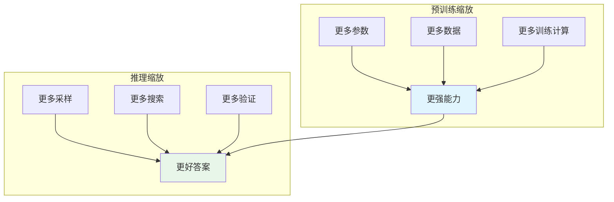
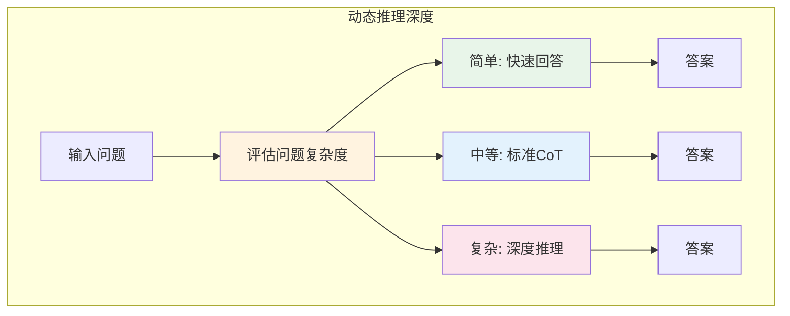
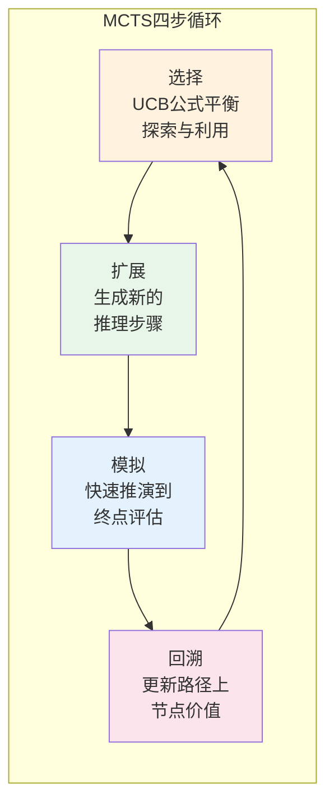
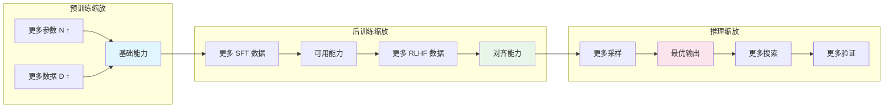

# Test-Time Compute Scaling——推理算力扩展

在[上一章](chain-of-thought.md)中，我们探讨了思维链与推理模型 —— 让模型学会"先想后答"。Chain of Thought 的发现揭示了一个关键事实：推理过程本身可以消耗计算资源，而更多的推理计算往往意味着更好的答案。这个发现引出了一个更深层的问题：如果[预训练缩放定律](../pretraining/scaling-laws.md)告诉我们"更大的模型 + 更多的数据 = 更强的能力"，那么推理阶段是否也存在类似的规律？

2024 年 8 月，加州大学伯克利分校的查理·斯内尔（Charlie Snell）等人在论文《Scaling LLM Test-Time Compute Optimally can be More Effective than Scaling Model Parameters》中给出了肯定的答案。他们发现，在推理阶段投入更多计算 —— 无论是生成更多候选答案、搜索更多推理路径，还是进行更深入的验证 —— 都可以系统地提升模型性能。更令人惊讶的是，一个参数量较小但推理计算充足的模型，在某些任务上可以超越参数量大 14 倍但推理计算不足的模型。这项研究将推理阶段的计算投入与模型性能之间的定量关系呈现了出来，被称为 **Test-Time Compute Scaling**（推理算力扩展）。

这一发现并非孤立的。早在 2022 年，谷歌研究院的王翔（Xiang Wang）等人在论文《Self-Consistency Improves Chain of Thought Reasoning in Language Models》中就发现，对同一个问题生成多个推理路径并取多数投票，可以显著提升准确率 —— 这就是推理计算"多采样"策略的雏形。2023 年，普林斯顿大学的姚顺雨（Shunyu Yao）等人在论文《Tree of Thoughts: Deliberate Problem Solving with Large Language Models》中将搜索算法引入推理过程，让模型像下棋一样在推理空间中探索，进一步拓展了推理计算的利用方式。

2024 年 9 月，OpenAI 发布了 o1 模型，这是第一个将推理算力扩展作为核心设计原则的商业模型。o1 不再追求"秒回"，而是根据问题难度自动调整思考时间 —— 简单问题快速回答，复杂问题可能思考数十秒。三个月后发布的 o3 模型更进一步，在 ARC-AGI 基准上达到了 87.5% 的准确率，接近人类水平。这些模型的成功宣告了 LLM 发展进入新阶段：从"预训练为王"到"推理亦重要"。

本文将从推理算力扩展的基本规律出发，探讨动态推理深度、搜索策略、验证与自我纠错等核心技术，分析 o1/o3 的训练范式，最终构建预训练缩放、后训练缩放、推理缩放三种缩放定律的统一视角。

## 推理阶段算力扩展

[预训练缩放定律](../pretraining/scaling-laws.md)揭示了模型规模与能力的关系：参数量翻 10 倍，损失降低一个固定倍数。但训练完成后，模型的能力就"固定"了吗？推理阶段能否通过投入更多计算来进一步提升性能？答案是肯定的，而且这种提升遵循可预测的规律。

### 更多思考步数与更高准确率的关系

考虑一个数学推理问题。模型可以采用两种策略：

**策略一：直接回答**

```
问题：求方程 x² - 5x + 6 = 0 的解
答案：x = 2 或 x = 3
```

**策略二：思维链回答**

```
问题：求方程 x² - 5x + 6 = 0 的解
思考：
1. 这是一个二次方程，可以用因式分解法
2. 尝试分解：x² - 5x + 6 = (x - 2)(x - 3)
3. 令 (x - 2)(x - 3) = 0
4. 解得 x = 2 或 x = 3
答案：x = 2 或 x = 3
```

两种策略的最终答案相同，但在更复杂的问题上，思维链策略的准确率显著更高。斯内尔等人的研究量化了这一关系：**推理步数与准确率之间存在正相关，且增长曲线符合边际收益递减规律**。

用数学语言描述，设推理步数为 $n$，基础准确率为 $a_0$，最大可达准确率为 $a_{\max}$，则准确率随推理步数的变化可以建模为：

$$a(n) = a_0 + (a_{\max} - a_0) \cdot (1 - e^{-kn})$$

这个公式看着抽象，拆开来看含义很直观：
- $a_0$ 是模型"直接回答"时就能达到的基准准确率，不需要任何额外推理
- $a_{\max}$ 是推理步数无限多时理论上能达到的准确率上限，受模型预训练能力制约
- $k$ 是推理效率系数，反映每一步推理对准确率的贡献大小，$k$ 越大意味着每步推理带来的提升越显著
- $(1 - e^{-kn})$ 是增长曲线的核心，它表示准确率从基准到上限的提升比例，随着步数增加趋于饱和
- 整体公式可以理解为：推理步数带来的准确率提升是"先快后慢"的 —— 前几步推理最有效，后续步数的贡献逐渐递减

这个指数衰减模型与认知科学中的"练习效应"高度吻合：人类学习新技能时，初期进步最快，随着熟练度提升，继续练习带来的边际提升越来越小。对于语言模型，前几步推理帮助模型将"隐性知识"转化为"显性推理"，效果最显著；后续步骤更多是在确认和精化，提升有限。

不同难度的问题，曲线参数也不同。简单问题的 $a_0$ 较高、$k$ 较大，只需少量推理就能达到饱和；困难问题的 $a_0$ 较低、$k$ 较小，需要更多推理步数才能获得可观的提升。这意味着推理计算应该根据问题难度动态调整 —— 简单问题少思考，困难问题多思考。这一观察引出了后续"动态推理深度"的概念。

### 与预训练 Scaling 的互补

推理缩放与预训练缩放不是替代关系，而是互补关系。理解这种互补性，需要从投入时机和成本结构两个维度来看。



两者的核心差异如下表所示：

| 维度 | 预训练缩放 | 推理缩放 |
|:-----|:-----------|:---------|
| 投入时机 | 训练阶段 | 推理阶段 |
| 投入形式 | 更多参数、更多数据 | 更多采样、更多搜索 |
| 成本结构 | 固定成本（训练一次） | 可变成本（每次推理） |
| 能力提升 | 通用能力 | 任务特定能力 |
| 边际收益 | 幂律衰减 | 指数衰减 |

互补性体现在三个层面。

第一，预训练决定能力上限。模型的预训练能力决定了推理缩放的天花板。一个 7B 模型即使投入再多的推理计算，也难以在复杂推理任务上达到 GPT-4 级别的表现，因为它的"知识储备"和"推理潜能"本身就有限。这就像一个只学过算术的人，无论给他多少时间思考，也做不出微积分的题目。

第二，推理缩放逼近上限。在预训练能力范围内，推理缩放让模型更好地发挥已有潜力。一个强大的模型如果只做"直接回答"，相当于考试时只写最终答案不写过程 —— 即使掌握了知识，也可能因为粗心或时间压力而答错。推理缩放相当于给模型一张"草稿纸"，让它有机会展示全部能力。

第三，成本权衡决定策略选择。预训练是固定成本 —— 训练一次，终身受益；推理是可变成本 —— 每次使用都要付出。对于高频低价值的任务（如客服对话），预训练投入更多、推理投入更少更经济；对于低频高价值的任务（如数学证明、代码审计），推理投入更多可能更划算。

斯内尔等人 2024 年的实验为这种互补性提供了定量证据。他们比较了不同参数量模型在不同推理计算量下的表现，发现一个关键等价关系：**将推理计算增加 4 倍，在某些任务上可以弥补模型参数量 14 倍的差距**。这意味着，如果推理预算充足，一个较小的模型通过充分的推理计算，可以超越一个更大但推理计算不足的模型。当然，这种等价性有边界 —— 当基础模型的能力差距过大时，推理计算无法弥补。

## 动态推理深度

既然推理计算可以提升性能，那么应该投入多少推理计算？答案不是"越多越好"，而是**根据问题难度动态调整**。这就像考试时的时间分配：简单的选择题快速作答，复杂的应用题仔细思考，而不是对所有题目一视同仁。

### 简单问题快回答、复杂问题多思考

不同问题的难度差异巨大。"1+1=?"这样的问题不需要深度推理，而"证明费马大定理"则需要大量思考。如果对简单问题也投入大量推理计算，不仅浪费资源，还可能因为过度推理而引入错误 —— 模型在已经找到正确答案后继续"思考"，反而可能自我怀疑、修改正确答案。

动态推理深度的核心思想是：根据问题的复杂度，自适应地分配推理计算。



实现动态推理深度的关键挑战有三个：如何在推理前判断问题的难度（复杂度评估），如何根据复杂度分配推理计算（计算分配），以及何时停止推理输出答案（终止条件）。这三个问题相互关联，构成了自适应计算的技术核心。

### Adaptive Compute

**Adaptive Compute**（自适应计算）是实现动态推理深度的技术框架。核心思想是：模型在推理过程中动态决定是否继续思考，而非预先设定固定的推理步数。

实现自适应计算有三种主要方法，分别从不同角度解决"何时停止推理"的问题。

**方法一：置信度阈值**

模型在每一步推理后评估自己对当前答案的"置信度"。如果置信度足够高，输出答案；否则继续思考。这类似于学生在考试时的策略：如果对答案很有信心，就不再检查；如果不太确定，就再算一遍。

```
问题：小明有 23 个苹果，给了小红 5 个，又买了 8 个，现在有多少个？

推理步骤 1：23 - 5 = 18
置信度：0.7（不够高，继续）

推理步骤 2：18 + 8 = 26
置信度：0.95（足够高，输出）
答案：26 个苹果
```

置信度阈值的设定是一个 trade-off：阈值越高，准确率越高但推理时间越长；阈值越低，推理速度越快但可能牺牲准确率。实际应用中，阈值通常根据任务类型和性能要求动态调整。

**方法二：计算预算预测**

模型在开始推理前预测完成任务所需的计算量，然后分配相应的计算预算。这类似于项目经理在项目启动前评估工作量：简单任务分配较少资源，复杂任务分配更多资源。

```
问题：计算 123 × 456
预测复杂度：低
分配计算：1 个思维链步骤

问题：证明 √2 是无理数
预测复杂度：高
分配计算：10+ 个思维链步骤
```

计算预算预测的优势在于可以在推理开始前就做出规划，避免在推理过程中反复判断"要不要继续"。但它的难点也很明显：如何准确预测问题难度？简单的问题可能推理过程中才发现隐藏的复杂性，而看似复杂的问题可能有捷径可走。

**方法三：动态停止**

模型在推理过程中动态决定是否停止。与置信度阈值不同，动态停止不仅看当前答案的质量，还考虑"继续推理是否可能带来提升"。这需要一个"停止判断器"，评估当前答案是否足够好，以及继续推理的预期收益是否值得额外计算成本。

```python runnable
import numpy as np
import matplotlib.pyplot as plt

plt.rcParams['font.sans-serif'] = ['SimHei', 'DejaVu Sans']
plt.rcParams['axes.unicode_minus'] = False

class AdaptiveReasoning:
    """
    自适应推理模拟器

    演示三种动态推理深度策略的行为差异：
    置信度阈值、计算预算预测、动态停止
    """

    def __init__(self, confidence_threshold=0.9, max_steps=20):
        self.confidence_threshold = confidence_threshold
        self.max_steps = max_steps

    def estimate_difficulty(self, problem):
        """模拟问题难度评估（对应计算预算预测方法）"""
        return min(len(problem) / 100, 1.0)

    def reason_step(self, step, base_confidence):
        """
        模拟单步推理后的置信度变化

        对应理论中的 a(n) 公式：置信度随推理步数提升，
        但边际收益递减
        """
        confidence = base_confidence + (1 - base_confidence) * (1 - np.exp(-0.3 * step))
        return confidence

    def solve_confidence(self, problem, base_confidence=0.5):
        """
        置信度阈值策略

        每步推理后检查置信度，达到阈值即停止
        """
        steps = 0
        confidence = 0
        trajectory = []

        while steps < self.max_steps:
            steps += 1
            confidence = self.reason_step(steps, base_confidence)
            trajectory.append((steps, confidence))
            if confidence >= self.confidence_threshold:
                break

        return {
            'method': '置信度阈值',
            'steps': steps,
            'final_confidence': confidence,
            'trajectory': trajectory
        }

    def solve_budget(self, problem, base_confidence=0.5):
        """
        计算预算预测策略

        预先评估难度，分配固定计算预算
        """
        difficulty = self.estimate_difficulty(problem)
        budget = max(2, int(difficulty * self.max_steps))
        trajectory = []

        for step in range(1, budget + 1):
            confidence = self.reason_step(step, base_confidence)
            trajectory.append((step, confidence))

        return {
            'method': '计算预算预测',
            'steps': budget,
            'final_confidence': trajectory[-1][1] if trajectory else 0,
            'trajectory': trajectory
        }

    def solve_dynamic(self, problem, base_confidence=0.5):
        """
        动态停止策略

        综合考虑当前置信度和继续推理的预期收益
        """
        steps = 0
        confidence = 0
        trajectory = []

        while steps < self.max_steps:
            steps += 1
            confidence = self.reason_step(steps, base_confidence)
            trajectory.append((steps, confidence))

            # 计算继续推理的预期收益
            if steps > 1:
                expected_gain = self.reason_step(steps + 1, base_confidence) - confidence
                if confidence >= self.confidence_threshold and expected_gain < 0.02:
                    break

        return {
            'method': '动态停止',
            'steps': steps,
            'final_confidence': confidence,
            'trajectory': trajectory
        }

# 测试三种策略
problems = [
    ('简单问题：1 + 1 = ?', 0.8),
    ('中等问题：计算 123 × 456 + 789', 0.5),
    ('困难问题：证明对于任意正整数 n，存在 n 个连续的正整数都是合数', 0.3),
]

solver = AdaptiveReasoning(confidence_threshold=0.9)

fig, axes = plt.subplots(1, 3, figsize=(18, 5))

for idx, (problem, base_conf) in enumerate(problems):
    ax = axes[idx]

    # 三种策略
    results = [
        solver.solve_confidence(problem, base_conf),
        solver.solve_budget(problem, base_conf),
        solver.solve_dynamic(problem, base_conf),
    ]

    for result in results:
        steps = [t[0] for t in result['trajectory']]
        confs = [t[1] for t in result['trajectory']]
        ax.plot(steps, confs, 'o-', linewidth=2, markersize=5,
                label=f"{result['method']} ({result['steps']}步)")

    ax.axhline(y=0.9, color='red', linestyle='--', alpha=0.5, label='置信度阈值')
    difficulty = problem.split('：')[0]
    ax.set_xlabel('推理步数', fontsize=11)
    ax.set_ylabel('置信度', fontsize=11)
    ax.set_title(f'{difficulty}', fontsize=12)
    ax.legend(fontsize=9)
    ax.grid(True, alpha=0.3)
    ax.set_ylim(0, 1)

plt.suptitle('三种自适应推理策略的对比', fontsize=14, y=1.02)
plt.tight_layout()
plt.savefig('/workspace/adaptive_compute.png', dpi=150, bbox_inches='tight')
plt.show()

print("三种自适应推理策略的特点:")
print()
print("1. 置信度阈值：达到阈值即停，简单高效")
print("2. 计算预算预测：预先分配预算，可能浪费也可能不足")
print("3. 动态停止：综合判断当前质量和预期收益，最灵活")
```

从运行结果可以看到，三种策略在不同难度问题上的行为差异明显。对于简单问题，三种策略都能快速达到高置信度，差异不大；对于复杂问题，计算预算预测可能因为预算不足而无法达到阈值，而置信度阈值和动态停止策略会持续推理直到满足条件。动态停止策略在置信度已经足够高且继续推理的预期收益很小时提前终止，比置信度阈值策略更高效。

## 搜索策略

思维链让模型"一步步思考"，但每一步可能有多种选择。面对"先算 2+3 还是先算 3×4"这样的分叉，模型通常只能选一条路走到底。如果选错了呢？在[上一章](chain-of-thought.md)的分析中，我们看到推理模型的回溯纠错能力可以部分弥补这一缺陷，但那是一种被动的"走错了再回头"策略。更主动的方法是：**同时探索多条路径，然后选择最优的那条**。这就是搜索策略的核心思想。

### Best-of-N 采样

**Best-of-N 采样**是最简单的搜索策略：生成 N 个候选答案，选择最好的一个。这个策略的学术基础来自 2022 年王翔等人的 Self-Consistency 研究。他们发现，对同一个问题生成多个推理路径，然后取多数投票的结果，比任何单条路径的准确率都高。Best-of-N 将这一思想一般化：不一定要多数投票，任何可靠的评分函数都可以用来选择最佳答案。

核心流程分三步：给定问题，生成 N 个候选答案；用评分函数（如奖励模型或答案验证器）对每个答案评分；选择得分最高的答案。

```python runnable
import numpy as np
import matplotlib.pyplot as plt

plt.rcParams['font.sans-serif'] = ['SimHei', 'DejaVu Sans']
plt.rcParams['axes.unicode_minus'] = False

def best_of_n_experiment(quality_mean=0.5, quality_std=0.2, num_trials=2000):
    """
    Best-of-N 采样实验

    模拟 N 个候选答案中选择最佳答案的效果，
    展示 N 增大时最优答案质量的提升规律
    """
    n_values = [1, 2, 3, 5, 10, 20, 50, 100]

    results = {}
    for n in n_values:
        scores = []
        for _ in range(num_trials):
            # 生成 N 个候选答案的质量分数
            candidates = np.random.normal(quality_mean, quality_std, n)
            candidates = np.clip(candidates, 0, 1)
            # 选择最佳
            scores.append(np.max(candidates))
        results[n] = {
            'mean': np.mean(scores),
            'std': np.std(scores),
        }

    return n_values, results

n_values, results = best_of_n_experiment()

fig, axes = plt.subplots(1, 2, figsize=(14, 5))

# 左图：平均质量 vs N
means = [results[n]['mean'] for n in n_values]
stds = [results[n]['std'] for n in n_values]

axes[0].errorbar(n_values, means, yerr=stds, fmt='o-', linewidth=2, capsize=5, capthick=2)
axes[0].set_xlabel('N（候选答案数量）', fontsize=12)
axes[0].set_ylabel('最佳答案质量', fontsize=12)
axes[0].set_title('Best-of-N：更多候选 → 更好答案', fontsize=14)
axes[0].set_xscale('log')
axes[0].grid(True, alpha=0.3)
axes[0].set_ylim(0, 1)

for n in [1, 10, 100]:
    axes[0].annotate(f'N={n}: {results[n]["mean"]:.2f}',
                     xy=(n, results[n]['mean']),
                     textcoords="offset points", xytext=(10, 10), fontsize=10)

# 右图：质量分布变化
for n in [1, 10, 100]:
    samples = [np.max(np.clip(np.random.normal(0.5, 0.2, n), 0, 1)) for _ in range(500)]
    axes[1].hist(samples, bins=20, alpha=0.5, label=f'N={n}', density=True)

axes[1].set_xlabel('答案质量', fontsize=12)
axes[1].set_ylabel('密度', fontsize=12)
axes[1].set_title('不同 N 值下的答案质量分布', fontsize=14)
axes[1].legend()
axes[1].grid(True, alpha=0.3)

plt.tight_layout()
plt.savefig('/workspace/best_of_n.png', dpi=150, bbox_inches='tight')
plt.show()

print("Best-of-N 采样的关键特性:")
print()
print("1. 边际收益递减：N 从 1 到 10 的提升远大于从 10 到 100")
print("2. 计算成本线性增长：N 个候选 = N 倍推理成本")
print("3. 依赖评分函数质量：评分越准确，Best-of-N 效果越好")
```

从左图可以看到，Best-of-N 的平均最优质量随 N 增大而提升，但增长速度逐渐放缓 —— 这正是边际收益递减的表现。右图更直观：当 N=1 时，答案质量分布较宽，好坏参半；当 N=100 时，分布集中在高质量区域，几乎不会选到差的答案。但要注意，N 从 1 增加到 100 意味着计算成本也增加了 100 倍，这在实际部署中是否划算取决于任务价值。

Best-of-N 的关键假设是：**存在可靠的评分函数**。对于数学问题，可以验证答案是否正确；对于代码，可以运行测试用例。但对于开放性问题（如写作、创意生成），评分函数难以定义，Best-of-N 的效果受限。此外，Best-of-N 是"并行探索"——N 个候选答案之间没有交互，每个答案独立生成。当推理步骤之间存在强依赖关系时，这种独立探索可能效率不高。

### 树搜索：Beam Search 与 MCTS

Best-of-N 是"并行探索" —— 同时生成多个独立答案。但对于复杂推理任务，推理步骤之间存在依赖关系：前一步的选择影响后续步骤的展开。以数学证明为例，选择"用因式分解"还是"用求根公式"作为第一步，会完全决定后续推理的走向。这时需要**树搜索**策略，在推理空间中系统性地探索不同路径。

**Beam Search**

Beam Search 是一种宽度受限的广度优先搜索。每一步保留得分最高的 K 个候选（beam width = K），然后从这些候选继续扩展。它是一种贪心策略 —— 每一步都只保留当前最优的 K 条路径，其余路径直接剪枝。

```
问题：计算 (2 + 3) × 4

步骤 1 候选：
  - 候选 A: 先算 2 + 3 = 5（得分 0.9）
  - 候选 B: 先算 3 × 4 = 12（得分 0.3）

保留 beam width = 1，继续扩展候选 A：

步骤 2 候选（从候选 A 扩展）：
  - 候选 A1: 5 × 4 = 20（得分 0.95）

答案：20
```

Beam Search 的优势在于计算效率：每一步只扩展 K 条路径，计算量可控。但它的缺点同样明显 —— **贪心剪枝可能错过全局最优**。如果某条路径前几步得分不高但后续大幅改善，Beam Search 会在早期就将其剪掉。这就像一个学生如果第一眼看不出解题思路就放弃了，可能错过了正确的方向。

**MCTS（蒙特卡洛树搜索）**

MCTS 是一种更复杂的搜索策略，结合了探索与利用。它最初在围棋 AI AlphaGo 中大放异彩，2023 年姚顺雨等人在论文《Tree of Thoughts》中将其思想引入 LLM 推理，提出了树搜索 + 语言模型的推理框架。

MCTS 的四个步骤循环执行：

1. **选择**（Selection）：从根节点开始，根据 UCB 公式选择最有潜力的子节点。UCB 公式平衡了"利用"（选择历史得分高的节点）和"探索"（选择访问次数少的节点），确保搜索不会陷入局部最优。
2. **扩展**（Expansion）：在选中的节点上生成新的推理步骤，创建子节点。
3. **模拟**（Simulation）：从新节点开始，快速完成推理到终点，评估这条路径的质量。
4. **回溯**（Backpropagation）：将模拟结果反向传播，更新路径上所有节点的价值估计。



MCTS 与 Beam Search 的根本区别在于"探索"机制。Beam Search 是纯贪心的 —— 只看当前得分，不管未探索区域可能藏着什么。MCTS 通过 UCB 公式主动探索看起来不那么有希望但尚未充分评估的路径，避免陷入局部最优。这就像一个经验丰富的问题解决者：他知道"最有可能"的解法是什么，但也会花一些时间尝试不太常见的方法，因为偶尔会有惊喜。

### 搜索策略对比

三种搜索策略适用于不同的场景，关键差异在于计算成本与搜索质量的权衡。

| 策略 | 计算成本 | 搜索质量 | 适用场景 |
|:-----|:---------|:---------|:---------|
| Best-of-N | 低（并行采样） | 中（无步骤交互） | 有可靠评分函数的简单任务 |
| Beam Search | 中（K 条路径） | 中高（贪心剪枝） | 步骤间有依赖的推理任务 |
| MCTS | 高（模拟 + 回溯） | 高（探索 + 利用） | 复杂推理、多步决策任务 |

搜索策略的核心价值是**系统性探索**。与人类解决问题时的"尝试—失败—换方法"类似，模型通过搜索可以发现错误路径并及时回溯，可以同时探索多条路径并比较结果，还可以积累搜索经验指导后续搜索。o1/o3 模型的强大推理能力，很大程度上来自于这种系统性探索 —— 它们不再"一次回答"，而是"思考—探索—验证—修正"的迭代过程。

## 验证与自我纠错

搜索策略让模型探索多条推理路径，但如何判断哪条路径是正确的？Best-of-N 需要评分函数来选择最佳答案，MCTS 需要模拟结果来评估路径质量。这些"判断推理是否正确"的机制，统称为**验证**。验证不仅发生在搜索过程中，也发生在推理完成后 —— 模型需要审视自己的推理过程，发现并纠正错误。

### Self-Consistency：多数投票的智慧

2022 年，王翔等人在论文《Self-Consistency Improves Chain of Thought Reasoning in Language Models》中提出了一个简洁而有效的验证方法：对同一个问题生成多个推理路径，取多数投票的结果作为最终答案。

Self-Consistency 的核心假设是：**正确的推理路径更容易达成共识**。如果 10 条推理路径中有 7 条得出相同答案，这个答案大概率是正确的，因为不同的推理路径独立地到达了同一个结论。反之，如果 10 条路径给出 10 个不同答案，说明模型对这个问题没有稳定的推理能力，任何答案都不可靠。

```
问题：一个长方形的长是宽的 2 倍，周长是 36 厘米，求面积。

路径 1：设宽为 x，长为 2x，周长 = 2(x + 2x) = 6x = 36，x = 6，面积 = 6 × 12 = 72
路径 2：周长 = 2 × (长 + 宽) = 36，设宽为 y，长为 2y，2(2y + y) = 36，y = 6，面积 = 72
路径 3：长 + 宽 = 18，长 = 2 × 宽，3 × 宽 = 18，宽 = 6，面积 = 72

多数投票：72 cm²（3/3 一致，置信度高）
```

Self-Consistency 本质上是一种特殊的 Best-of-N：评分函数不是外部奖励模型，而是"答案一致性"。它的优势在于不需要额外的评分模型，完全依赖模型自身的推理能力。缺点是计算成本较高（需要生成多个完整推理路径），且只适用于答案可以精确匹配的任务（如数学题），对开放式生成任务（如写作）效果有限。

### 外部验证器：ORM 与 PRM

Self-Consistency 依赖模型自身的"内部一致性"来判断答案质量。但当模型系统性地犯同类错误时，多数投票无法发现问题 —— 如果模型对某个概念的理解本身就有偏差，所有推理路径可能都得出同一个错误答案。这时需要**外部验证器**来提供独立的判断。

在[上一章](chain-of-thought.md)中，我们已经介绍了两种外部验证器。**结果奖励模型**（ORM）只看最终答案是否正确，给出二值奖励（0 或 1）。**过程奖励模型**（PRM）对推理的每一步评分，给出连续的奖励值。PRM 由亨特·莱特曼（Hunter Lightman）等人在 2023 年的论文《Let's Verify Step by Step》中系统研究，证明了它在推理模型训练中远优于 ORM。

在推理阶段，这两种验证器的使用方式不同。

ORM 用于 Best-of-N 选择：生成 N 个候选答案，用 ORM 评分每个答案的正确性，选择得分最高的。这种方式简单直接，但只能区分"答案对"和"答案错"，无法判断推理过程的质量。一个推理过程全错但碰巧蒙对答案的解答，和推理过程完美正确的解答，ORM 给的分数一样。

PRM 用于更精细的搜索指导：在 MCTS 的模拟和回溯阶段，PRM 对每一步推理评分，提供比 ORM 更精确的价值估计。一条推理路径的 PRM 总分是所有步骤分数的乘积 —— 任何一步出错都会拉低总分，即使最终答案碰巧正确。这使得搜索过程更倾向于选择推理过程扎实的路径，而非"运气好"的路径。

```
推理路径 A：步骤1(0.9) → 步骤2(0.8) → 步骤3(0.1) → 答案正确
PRM 总分：0.9 × 0.8 × 0.1 = 0.072

推理路径 B：步骤1(0.7) → 步骤2(0.8) → 步骤3(0.9) → 答案正确
PRM 总分：0.7 × 0.8 × 0.9 = 0.504

ORM 对两条路径的评分相同（答案都正确），
但 PRM 识别出路径 A 的步骤 3 有问题，选择路径 B。
```

### 自我验证与纠错

外部验证器需要额外的模型或标注数据。而推理模型在强化学习训练中涌现出的**自我验证**能力（详见[上一章](chain-of-thought.md)的分析），则不需要任何外部辅助：模型自己检查推理过程，发现矛盾并主动修正。

自我验证可以理解为一种"内部评分函数"。模型在推理过程中扮演两个角色：一个是"解题者"，生成推理步骤；另一个是"检查者"，审视已生成的步骤是否合理。当检查者发现问题时，解题者回溯到出错的位置，尝试不同的推理方向。这种"解题—检查—修正"的循环，与人类在草稿纸上解题的过程高度相似。

```
问题：一个长方形的长是宽的 2 倍，周长是 36 厘米，求面积。

推理过程：
1. 设宽为 x，则长为 2x
2. 周长 = 2(x + 2x) = 6x = 36
3. 解得 x = 6，即宽 = 6cm，长 = 12cm
4. 面积 = 6 × 12 = 72 cm²

自我验证：
- 检查周长：2(6 + 12) = 36 ✓
- 检查长宽关系：12 = 2 × 6 ✓
- 答案合理

确认答案：72 cm²
```

自我验证提升准确率的机制有三个。第一个是发现计算错误：简单的计算失误在验证时容易被发现（如 17 × 23 = 391，验证时 391 ÷ 17 = 23 确认无误）。第二个是发现逻辑矛盾：如果推理过程得出"年龄为负数"这样的荒谬结论，自我验证会立即捕捉到矛盾并回溯。第三个是增强置信度：验证通过后，模型对答案的信心更高，不会在最后关头修改正确答案。

值得注意的是，自我验证并非完美。模型可能"验证"了一个实际上错误的推理 —— 检查者和解题者共享同一套有缺陷的知识，导致"错上加错"。这就是为什么外部验证器（如 PRM）在关键场景中仍然不可或缺：它提供了一双"独立的眼睛"，不受模型自身偏见的影响。

## 推理模型：o1/o3 的训练范式

到此为止，我们讨论的搜索策略和验证机制都是在推理阶段应用的 —— 模型已经训练完成，只是在使用时投入更多计算。但 o1 和 o3 的核心创新不止于此：它们在**训练阶段**就学会了如何使用推理计算。这不是简单的"推理时多想几步"，而是通过强化学习让模型内化了搜索、验证和纠错的策略。

### 从 SFT + RL 到推理强化学习

在[上一章](chain-of-thought.md)中，我们看到 DeepSeek-R1 通过纯 GRPO 训练让模型涌现出推理能力。o1/o3 的训练思路与此类似，但更加注重"推理过程的优化"。

传统的 SFT + RL 训练流程存在一个关键局限：SFT 教模型"如何回答"，RL 教模型"回答得更好"，但两者都没有教模型"如何思考"。SFT 数据通常包含完整的推理过程，模型只是学会了模仿这些过程，而不是学会了"选择最优推理路径"或"发现推理错误并回溯"。

推理强化学习的核心改变是：**奖励信号不仅来自最终答案的正确性，还来自推理过程的质量**。这正是 PRM 发挥作用的场景 —— 用 PRM 对推理的每一步评分，作为强化学习的奖励信号。模型学会的不是"哪个答案能获得最高分"，而是"哪种推理策略最可靠"。

### 过程奖励与推理策略的内化

o1/o3 的训练范式可以概括为"推理策略的内化"。在训练前，搜索、验证、纠错是推理阶段的外部策略 —— 需要额外的算法和计算来执行。在训练后，这些策略变成了模型的本能 —— 模型在生成推理步骤时，自动表现出搜索、验证和纠错的行为，无需外部算法驱动。

这种内化过程类似于人类学习解题的过程。初学数学时，学生需要老师提醒"做完要验算"、"如果发现矛盾要回溯"。但随着练习的积累，验算和回溯变成了自动化的习惯，不再需要外部提示。推理强化学习做的正是这件事：通过大量的训练，将"应该验算"、"应该回溯"、"应该尝试多种方法"这些推理策略内化为模型的行为模式。

```mermaid
graph LR
    subgraph 训练前：外部策略
        M1["模型"] --> G1["生成推理步骤"]
        G1 --> E1["外部搜索算法<br/>MCTS / Beam Search"]
        E1 --> V1["外部验证器<br/>ORM / PRM"]
        V1 --> A1["答案"]
    end

    subgraph 训练后：内化策略
        M2["模型"] --> G2["生成推理步骤<br/>（自带搜索+验证）"]
        G2 --> A2["答案"]
    end

    style E1 fill:#fff3e0
    style V1 fill:#fff3e0
    style G2 fill:#e8f5e9
```

上图对比了训练前后的推理方式。训练前，搜索和验证是外部模块，需要额外的计算和工程实现。训练后，这些策略融入模型自身，推理过程更加流畅高效。当然，内化并不意味着完全不需要外部策略 —— 对于特别复杂的问题，外部搜索算法仍然可以提供额外的推理计算提升。o1/o3 的强大之处在于：即使不使用外部搜索算法，仅靠模型自身的内化策略，就能在大多数任务上表现出色。

### o1/o3 的推理行为特征

从公开信息和使用体验来看，o1/o3 展示了三个标志性的推理行为特征。

第一是**自适应思考时间**。o1/o3 根据问题复杂度自动调整推理时间，简单问题可能只需 1-2 秒，复杂问题可能思考数十秒。这与本章讨论的"动态推理深度"理念完全一致。模型在训练中学会了评估问题难度，并据此分配推理计算。

第二是**显式的自我纠错**。在 o1/o3 的推理过程中，经常可以看到"等等，让我重新想想"、"这个方向似乎不对，换一个思路"这样的表达。这不是预设的提示模板，而是模型在推理过程中真实发现了矛盾或错误，主动改变推理方向。

第三是**多路径探索与交叉验证**。o1/o3 在面对复杂问题时，会尝试多种解题方法，然后比较不同方法的结果。如果多种方法得出一致答案，置信度就高；如果结果不一致，模型会进一步分析哪个方法更可靠。这本质上是一种内化的 Self-Consistency。

这些行为特征与[上一章](chain-of-thought.md)分析的 DeepSeek-R1 涌现行为高度一致 —— 自我验证、回溯纠错、多路径探索。不同的是，DeepSeek-R1 通过纯 RL 自主涌现这些行为，而 o1/o3 可能还结合了 PRM 引导的推理训练。两种路径殊途同归：推理策略可以被内化，无论是"自然涌现"还是"刻意训练"。

## 三种缩放定律的统一视角

至此，我们已经探讨了三种提升 LLM 能力的途径：预训练缩放、后训练缩放和推理缩放。这三种缩放定律并非相互替代，而是构成了 LLM 能力提升的完整框架，各自在不同阶段发挥作用。

### 预训练缩放 + 后训练缩放 + 推理缩放



三种缩放定律的关系可以用一个公式概括：

$$\text{最终能力} = f(\underbrace{N, D}_{\text{预训练}}, \underbrace{D_{\text{SFT}}, D_{\text{RLHF}}}_{\text{后训练}}, \underbrace{C_{\text{test}}}_{\text{推理}})$$

这个公式看着抽象，拆开来看含义很直观：
- $N$ 是模型参数量，$D$ 是预训练数据量，两者共同决定模型的**基础能力** —— 模型能"知道"多少、能"理解"多深
- $D_{\text{SFT}}$ 是 SFT 数据量和质量，$D_{\text{RLHF}}$ 是 RLHF 偏好数据量和质量，两者决定模型将基础能力转化为**可用能力**的程度 —— 模型能否遵循指令、是否符合人类偏好
- $C_{\text{test}}$ 是推理阶段的计算投入（采样数量、搜索深度、验证次数），决定模型在可用能力范围内能产出**最优输出**的概率 —— 模型能否充分发挥潜力
- 整体公式可以理解为：最终能力由三个阶段的投入共同决定，任何一个阶段的短板都会限制最终表现

### 三种缩放的协同与权衡

三种缩放定律之间存在协同效应，但也有成本权衡。理解这些权衡对于实际的 LLM 开发至关重要。

**协同效应**体现在：预训练能力越强，推理缩放的上限越高；后训练对齐越好，推理搜索越有效率（模型更倾向于生成有用的推理路径，而非偏离主题的"胡思乱想"）；推理计算越充足，预训练和后训练投入的价值越能被充分释放。

**成本权衡**体现在三个方面。第一是**固定成本 vs 可变成本**：预训练是固定成本（训练一次），推理是可变成本（每次使用）。对于一个服务数百万用户的模型，预训练投入更多可能更经济；对于一个只在高价值场景使用的模型，推理投入更多更划算。第二是**通用能力 vs 专项能力**：预训练提升通用能力，推理提升特定任务的表现。如果模型需要在广泛任务上表现均衡，预训练投入更优先；如果只需要在特定任务上追求极致表现，推理投入更有效。第三是**边际收益的交叉点**：斯内尔等人的实验表明，推理计算增加 4 倍在某些任务上可以弥补参数量 14 倍的差距。这个等价关系给出了一个定量的参考：当推理预算充足且任务特定时，"小模型 + 强推理"可能比"大模型 + 弱推理"更经济。

| 策略 | 预训练投入 | 后训练投入 | 推理投入 | 适用场景 |
|:-----|:----------|:----------|:--------|:---------|
| 预训练优先 | 高 | 中 | 低 | 通用模型、高频使用 |
| 对齐优先 | 中 | 高 | 中 | 对话助手、内容生成 |
| 推理优先 | 中 | 中 | 高 | 数学推理、代码审计 |
| 全面投入 | 高 | 高 | 高 | 旗舰模型、关键任务 |

### 实践启示

三种缩放定律为 LLM 开发提供了清晰的指导。

在模型开发阶段，首先根据预算确定预训练规模，遵循 Chinchilla 最优比例（参数和数据同步增长）；然后投入高质量对齐数据，将基础能力转化为可用能力；最后设计推理策略，在部署时根据任务特点动态调整推理计算。

在应用部署阶段，对于高频低价值任务（如客服对话、简单问答），使用小模型 + 快速推理，控制成本；对于低频高价值任务（如数学证明、代码审计），使用大模型 + 深度推理，追求质量；对于中等频次的任务，根据任务特点在模型规模和推理深度之间寻找平衡点。

o1/o3 的成功验证了"推理优先"策略的可行性。它们的核心创新在于：通过推理强化学习，将搜索、验证、纠错等推理策略内化为模型的本能，使得推理计算的增加能够自动转化为性能提升，无需外部算法的介入。这标志着 LLM 发展的新阶段：从"预训练决定一切"到"训练与推理协同进化"。

## 小结

本文探讨了 Test-Time Compute Scaling——推理阶段的算力扩展。

推理阶段算力扩展的基本规律是：推理步数与准确率正相关，且增长符合边际收益递减。推理缩放与预训练缩放互补而非替代 —— 预训练决定能力上限，推理缩放逼近上限。斯内尔等人的实验表明，推理计算增加 4 倍在某些任务上可以弥补参数量 14 倍的差距。

动态推理深度的核心是"简单问题快回答、复杂问题多思考"。Adaptive Compute 通过置信度阈值、计算预算预测、动态停止三种方法实现自适应推理，避免在简单问题上浪费计算，在复杂问题上投入不足。

搜索策略包括 Best-of-N（并行采样选最优）、Beam Search（贪心宽度搜索）和 MCTS（探索与利用结合的树搜索）。搜索的核心价值是系统性探索 —— 发现错误路径、比较多种方法、积累搜索经验。

验证与自我纠错是判断推理正确性的关键。Self-Consistency 通过多数投票利用内部一致性，ORM/PRM 作为外部验证器提供独立判断，自我验证是推理模型涌现的内在纠错能力。PRM 在搜索指导中特别有价值，它能识别"推理错但答案对"的情况。

o1/o3 的训练范式将推理策略内化：通过推理强化学习，模型在训练阶段就学会了搜索、验证和纠错策略，无需在推理时依赖外部算法。这种内化过程让推理计算的增加能够自动转化为性能提升。

三种缩放定律的统一视角表明，最终能力由预训练、后训练、推理三个阶段的投入共同决定。三种缩放存在协同效应和成本权衡，实际开发中需要根据任务特点和预算约束选择最优策略。

推理缩放的发现也带来了新的挑战：如何可靠地控制推理深度？模型在推理过程中可能"越想越错"——[下一章](reasoning-reliability.md)将深入讨论推理可靠性问题。

## 练习题

1. 推理缩放定律的公式 $a(n) = a_0 + (a_{\max} - a_0) \cdot (1 - e^{-kn})$ 中，$k$ 的物理含义是什么？如果两个模型的 $k$ 值不同（$k_1 = 0.1$，$k_2 = 0.3$），哪个模型从额外推理步数中获益更大？为什么？

   <details>
   <summary>参考答案</summary>

   $k$ 是推理效率系数，反映每一步推理对准确率的贡献大小。$k$ 越大，每步推理带来的提升越显著，准确率曲线越快趋于饱和。

   $k_2 = 0.3$ 的模型从额外推理步数中获益更大。代入公式计算：对于 $k = 0.1$，第 5 步推理的提升比例为 $(1 - e^{-0.1 \times 5}) - (1 - e^{-0.1 \times 4}) \approx 0.39 - 0.33 = 0.06$；对于 $k = 0.3$，第 5 步的提升比例为 $(1 - e^{-0.3 \times 5}) - (1 - e^{-0.3 \times 4}) \approx 0.78 - 0.70 = 0.08$。$k$ 较大的模型每步推理更"有效率"，但也会更快饱和 —— 在前几步就能获得较大提升。

   </details>

2. 对比 Best-of-N 和 MCTS 在以下三种任务上的适用性，并解释原因：
   - 数学推理（有明确答案可验证）
   - 代码生成（有测试用例）
   - 开放式写作（无明确评分标准）

   <details>
   <summary>参考答案</summary>

   **数学推理**：Best-of-N 和 MCTS 都适用。Best-of-N 可以通过答案验证来选择最优解；MCTS 可以在推理步骤级别搜索最优路径。对于简单题目，Best-of-N 更经济；对于需要多步推理的复杂题目，MCTS 更有效，因为步骤间存在强依赖。

   **代码生成**：Best-of-N 更适合。代码有测试用例作为天然评分函数，可以精确验证每个候选答案。MCTS 虽然也能用，但代码的推理步骤之间依赖性强且难以独立评估，MCTS 的步骤级搜索优势难以发挥。

   **开放式写作**：两者效果都有限。开放式写作缺乏可靠的评分函数 —— 没有"正确答案"可以验证，也没有测试用例可以运行。Best-of-N 的评分函数只能依赖人类偏好模型或 LLM-as-judge，可靠性存疑。MCTS 的问题更突出：推理步骤的"好坏"难以量化，搜索树的价值评估不可靠。对于这类任务，可能更适合用更长的思维链而非搜索策略。

   </details>

3. 实现一个简化的 Best-of-N 推理系统。给定一个"问题"和"答案生成器"（用随机数模拟），以及一个"评分函数"（验证答案是否正确），输出 N 个候选中的最佳答案及其得分。

   <details>
   <summary>参考答案</summary>

   ```python runnable
   import numpy as np

   def answer_generator(question, num_candidates=10):
       """
       模拟答案生成器

       为给定问题生成多个候选答案，
       每个答案包含推理过程和最终答案
       """
       candidates = []
       for i in range(num_candidates):
           # 模拟推理过程（用随机数表示推理质量）
           reasoning_quality = np.random.uniform(0.3, 1.0)
           # 推理质量越高，答案正确的概率越大
           is_correct = np.random.random() < reasoning_quality
           candidates.append({
               'id': i + 1,
               'reasoning_quality': reasoning_quality,
               'is_correct': is_correct,
               'answer': '42' if is_correct else str(np.random.randint(0, 100))
           })
       return candidates

   def scorer(candidate):
       """
       评分函数

       对应理论中的 ORM（结果奖励模型）：
       只看最终答案是否正确，给二值评分
       """
       return 1.0 if candidate['is_correct'] else 0.0

   def prm_scorer(candidate):
       """
       PRM 评分函数

       对应理论中的 PRM（过程奖励模型）：
       综合考虑推理质量（过程）和答案正确性（结果）
       """
       process_score = candidate['reasoning_quality']
       outcome_score = 1.0 if candidate['is_correct'] else 0.0
       # 过程和结果加权：过程占 40%，结果占 60%
       return 0.4 * process_score + 0.6 * outcome_score

   def best_of_n(question, n=10, use_prm=False):
       """
       Best-of-N 采样

       核心步骤（对应理论框架）：
       1. 生成 N 个候选答案
       2. 用评分函数对每个答案评分
       3. 选择得分最高的答案
       """
       # 步骤 1：生成候选
       candidates = answer_generator(question, n)

       # 步骤 2：评分
       score_fn = prm_scorer if use_prm else scorer
       for c in candidates:
           c['score'] = score_fn(c)

       # 步骤 3：选择最佳
       best = max(candidates, key=lambda c: c['score'])
       return best, candidates

   # 实验：对比不同 N 值下的准确率
   question = "求方程 x² - 5x + 6 = 0 的解"
   n_values = [1, 3, 5, 10, 20, 50]
   num_trials = 500

   print("Best-of-N 采样实验")
   print("=" * 60)
   print(f"{'N':<8} {'ORM 评分准确率':<20} {'PRM 评分准确率':<20}")
   print("-" * 60)

   for n in n_values:
       orm_correct = 0
       prm_correct = 0
       for _ in range(num_trials):
           # ORM 评分
           best_orm, _ = best_of_n(question, n, use_prm=False)
           orm_correct += best_orm['is_correct']
           # PRM 评分
           best_prm, _ = best_of_n(question, n, use_prm=True)
           prm_correct += best_prm['is_correct']

       orm_rate = orm_correct / num_trials
       prm_rate = prm_correct / num_trials
       print(f"{n:<8} {orm_rate:<20.1%} {prm_rate:<20.1%}")

   print()
   print("关键发现:")
   print("1. N 越大，Best-of-N 的准确率越高")
   print("2. PRM 评分通常优于 ORM 评分（能识别推理过程更可靠的答案）")
   print("3. 边际收益递减：N 从 1 到 10 的提升远大于从 10 到 50")
   ```

   </details>

4. 分析以下场景中应该优先投入哪种缩放（预训练/后训练/推理），并解释理由：

   场景 A：一个面向学生的数学辅导助手，需要准确解答从小学到高中的数学题。
   场景 B：一个社交媒体聊天机器人，需要自然流畅地与用户对话。
   场景 C：一个代码安全审计工具，需要精确发现代码中的安全漏洞。

   <details>
   <summary>参考答案</summary>

   **场景 A**：推理优先。数学题有明确的正确答案可以验证，推理计算的增加（多路径搜索、自我验证）可以有效提升准确率。一个中等规模的模型配合充足的推理计算，可能比一个大模型但推理计算不足更经济。此外，数学推理任务的推理策略（验算、多方法交叉验证）容易内化，推理强化学习的收益显著。

   **场景 B**：后训练优先。对话的"好坏"没有明确的评分标准，推理搜索难以提供有效指导。更重要的是，对话需要自然流畅、符合人类偏好，这正是 RLHF 对齐训练的强项。预训练和后训练确保模型能理解和生成自然的对话，推理阶段不需要也不应该投入太多计算 —— 用户期望快速响应而非长时间思考。

   **场景 C**：预训练 + 推理并重。代码安全审计需要深度的代码理解能力（依赖预训练中的代码知识），同时需要精确的推理来追踪数据流、识别漏洞模式（依赖推理计算）。后训练对齐也有价值 —— 确保模型输出结构化的审计报告而非随意评论。但由于漏洞检测的准确率至关重要（漏报的代价极高），推理阶段的多路径搜索和交叉验证尤为关键。

   </details>

5. 假设你有以下资源约束：预训练预算 100 万 GPU 小时、对齐数据 10 万条、推理预算每问题 10 秒 GPU 时间。设计一个 LLM 应用的资源配置方案，说明你会如何在这三个阶段分配资源，以及为什么。

   <details>
   <summary>参考答案</summary>

   资源配置方案取决于应用场景，以下以"数学推理助手"为例：

   **预训练阶段**：遵循 Chinchilla 最优比例，用 100 万 GPU 小时训练一个中等规模模型（约 30B 参数，配 600B tokens 训练数据）。选择中等规模而非更大模型，是因为推理预算充足时，小模型配合强推理可以在特定任务上超越大模型。

   **后训练阶段**：将 10 万条数据中的 6 万条用于 SFT（数学推理过程的示范），4 万条用于 RLHF（推理质量的偏好对比）。SFT 数据侧重于多步推理格式和自我验证习惯的示范，RLHF 数据侧重于"推理过程扎实的答案优于推理有缺陷但答案正确的答案"这一偏好，引导模型重视过程质量。

   **推理阶段**：10 秒 GPU 时间的推理预算相当充裕。部署策略：先用置信度阈值快速处理简单问题（1-2 秒），将剩余时间留给复杂问题。对于复杂问题，使用 Best-of-4 采样 + PRM 评分选择最优答案，必要时触发多路径探索和交叉验证。

   核心权衡：预训练投入确保了能力基础，后训练投入确保了推理格式的规范性，推理投入确保了潜力的充分发挥。这个方案的特点是"推理优先" —— 相信中等模型配合充足推理计算和精细的策略设计，可以在特定任务上获得高性价比的表现。

   </details>
