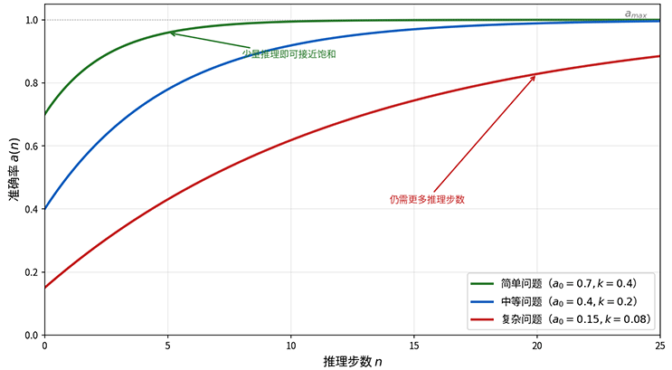
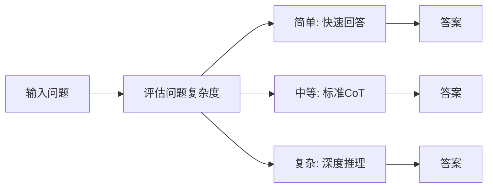
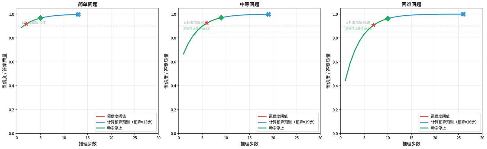
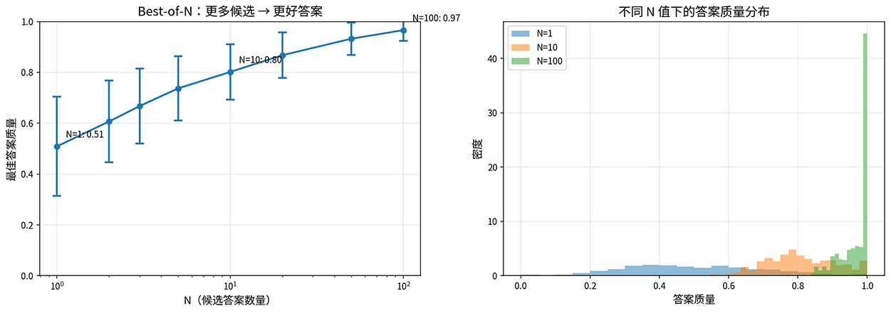
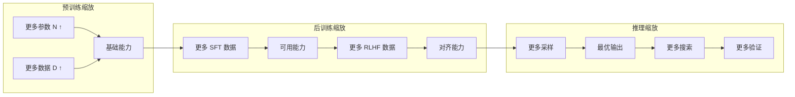

# 推理时缩放定律

[预训练缩放定律](../pretraining/scaling-laws.md)揭示了更大的模型、更多的数据能够使模型具备更强的能力。2024 年 8 月，加州大学伯克利分校的查理·斯内尔（Charlie Snell）在论文《Scaling LLM Test-Time Compute Optimally can be More Effective than Scaling Model Parameters》中发现，在推理阶段投入更多计算，无论是生成更多候选答案、搜索更多推理路径，还是进行更深入的验证，同样可以系统地提升模型性能。一个参数量较小但推理计算充足的模型，在某些任务上可以超越参数量大 14 倍但推理计算不足的大模型。这项研究将推理阶段的计算投入与模型性能之间的定量关系呈现了出来，被称为**推理时算力缩放**（Test-Time Compute Scaling）。

早在 2022 年，谷歌研究院的论文《Self-Consistency Improves Chain of Thought Reasoning in Language Models》中就发现，对同一个问题生成多个推理路径并取多数投票，可以显著提升准确率，这是推理计算多采样策略的雏形。2023 年，普林斯顿大学的姚顺雨（Shunyu Yao）在论文《Tree of Thoughts: Deliberate Problem Solving with Large Language Models》中将搜索算法引入推理过程，让模型像下棋一样在推理空间中探索，进一步拓展了推理计算的利用方式。

2024 年 9 月，OpenAI 发布了 o1 模型，这是第一个将推理算力扩展作为核心设计原则的商业模型。o1 根据问题难度自动调整思考时间，简单问题快速回答，复杂问题可能思考数十秒。三个月后发布的 o3 模型更进一步，在 [ARC-AGI](https://arcprize.org/arc-agi) 基准上达到了 87.5% 的准确率，已十分接近人类水平。这些模型的成功宣告了 LLM 的能力提升从"预训练为王"转入"训练推理并重"的新阶段。

## 推理衰减模型

预训练缩放定律揭示了模型规模与能力的关系：参数量翻 10 倍，损失就降低一个固定倍数。但训练完成后，模型的能力不见得就完全固定了，推理阶段投入更多计算，也能提升模型性能。[思维链](chain-of-thought.md#思维链)就是推理阶段提升性能的最好例子，在复杂问题上，思维链显著提高了模型的准确率。斯内尔的研究量化了这种提升的数量关系，证明了推理步数与准确率之间存在正相关，且增长曲线符合边际收益递减规律。设推理步数为 $n$，基础准确率为 $a_0$（就是模型直接回答，不做任何额外推理的准确率），最大可达准确率为 $a_{\max}$，推理效率系数为 $k$（反映每一步推理对准确率的贡献大小，$k$ 越大意味着每步推理带来的提升越显著），则准确率随推理步数的变化可以建模为：

$$a(n) = a_0 + (a_{\max} - a_0) \cdot (1 - e^{-kn})$$

准确率增长曲线的核心是 $1 - e^{-kn}$，它表示剩余提升空间中被利用的比例随步数增加趋于饱和。指数衰减模型说明推理步数带来的准确率提升是先快后慢的，前几步推理最有效，后续步数的贡献逐渐递减。这与认知科学中的"练习效应"有相似之处，人类学习新技能时，初期进步最快，随着熟练度提升，继续练习带来的边际提升越来越小。对于语言模型，前几步推理帮助模型将隐性知识转化为显性推理，效果最显著；后续步骤更多是在确认和细化，提升愈发有限。



*图：不同难度问题下推理缩放曲线*

如上图所示，不同难度的问题，曲线参数也不同。简单问题的 $a_0$ 较高、$k$ 较大，只需少量推理就能达到饱和；困难问题的 $a_0$ 较低、$k$ 较小，需要更多推理步数才能获得可观的提升。这意味着推理预算应该根据问题难度动态调整，简单问题分配较少推理计算资源，困难问题分配较多推理计算资源。

## 推理缩放与预训练缩放

推理计算能提升准确率，但受边际递减约束，那在推理阶段增加计算资源与把同样的资源投入到预训练中扩大模型规模，哪种策略更划算？答案是推理缩放与预训练缩放并不是对立或者替代关系，而是互补关系。互补性体现在三个方面。

- 第一，预训练决定能力上限。模型的预训练能力决定了推理缩放的天花板。一个 1B 模型即使投入再多的计算资源，也难以在复杂推理任务上达到 100B 级别的表现，因为它的"知识储备"和"推理潜能"本身就有限。这就像一个只学过基础算术的人，无论给他多少时间思考，也很难做出微积分的题目。

- 第二，推理缩放逼近上限。在预训练能力范围内，推理缩放让模型更好地发挥已有潜力。一个强大的模型如果只做直接回答，相当于考试时只写最终答案不写过程，即使掌握了知识，也可能因为粗心或推理预算不足而答错。推理缩放相当于给模型一张演算的草稿纸，让它有条件展示全部能力。

- 第三，成本权衡决定策略选择。预训练是一次性的固定成本，训练一次，长期受益。推理是可变的边际成本，每次使用都要付出。对于高频低价值的任务（如客服对话），预训练投入更多、推理投入更少更经济；对于低频高价值的任务（如数学证明、代码审计），推理投入更多可能更划算。

斯内尔等人 2024 年的实验为这种互补性提供了定量证据。他们比较了不同参数量模型在不同推理计算量下的表现，发现一个关键等价关系：将推理计算增加 4 倍，在某些任务上可以弥补模型参数量 14 倍的差距。这意味着，如果推理预算充足，一个较小的模型通过充分的推理计算，可以超越一个更大但推理计算不足的模型。当然，这种等价性是有边界的，当基础模型的能力差距过大时，推理计算无法弥补。

## 动态推理深度

下一个问题是推理计算可以提升性能，那么应该投入多少推理计算？答案肯定不是越多越好，合理的回答应该是根据问题难度动态调整。不同问题的难度差异巨大，"1+1=?" 这样的问题不需要深度推理，而"证明费马大定理"则需要大量思考。根据问题的复杂度，自适应地分配推理计算资源的机制被称为**动态推理深度**（Dynamic Inference Depth）。


*图：动态推理深度*

实现动态推理深度的挑战有三个：如何在推理前判断问题的难度（复杂度评估），如何根据复杂度分配推理计算（计算分配），以及何时停止推理输出答案（终止条件）。这三个问题相互关联，构成了动态推理的技术核心。

### 复杂度评估

评估问题难度是动态推理深度的第一步。只有准确判断了问题的复杂程度，才能做出合理的计算分配。目前有三类主要的评估方法：

- **基于问题特征的启发式评估**：通过问题长度、涉及领域、是否包含约束条件等表面特征来粗略判断难度。这是最传统、最基础的方法，容易实现但不够精确。一个简短的数学证明可能比一道冗长的计算题更困难，表面特征与真实难度之间的相关性并不强。它更适合作为粗粒度的初始筛选，在更精细的评估手段不可用时提供基本的难度分级。

- **基于模型正确率的难度分类**：斯内尔的研究中采用了一种模型视角的难度定义：让模型对同一问题生成多个候选答案，统计正确答案的比例作为难度指标。这种定义的优点是难度是相对于特定模型的，而非绝对的。同一个问题对 PaLM-2-S 可能是困难的，对 GPT-4 可能是简单的，这与我们讨论的推理缩放定律完全一致，不同模型的曲线参数不同，难度感知也应该因模型而异。

- **基于模型内部信号的难度预测**：2024年，斯坦福大学的罗欣·曼维（Rohin Manvi）在论文《Adaptive Inference-Time Compute: LLMs Can Predict if They Can Do Better, Even Mid-Generation》中发现，模型可以在生成过程中推测出重新生成是否会得到更好的答案。具体做法是在已生成的部分文本后追加一个预定义的自评估提示，然后生成一个 token，其概率值就代表了对当前回答质量的评估。这种方法不需要外部奖励模型，计算成本极低（只需一个额外 token 的生成），却能让模型自己判断能不能做得更好。曼维等人的实验表明，利用这种自评估信号进行自适应采样，平均只需 1.2 个样本就能捕获 16 样本 Best-of-N 中 74% 的性能提升。


### 计算分配策略

知道了问题的难度，下一步是根据难度分配推理计算资源。根据不同的适用场景，也有三种主要的分配策略：

- **固定预算分配**：将问题按难度分成几个等级，每个等级分配固定的计算量。简单问题分配 1 次采样，中等问题分配 4 次，困难问题分配 16 次。这种策略容易实现，却不够精细。同一难度等级内的不同问题可能需要截然不同的计算量，固定分配要么浪费要么不足。

- **计算最优缩放**：不同难度的问题，最优的推理策略完全不同。对于简单问题（模型通过率较高），采用迭代修正（Sequential Revision）策略，此时模型的初始答案已经接近正确，只需让模型审视自己的回答并修正小错误即可。对于困难问题（模型通过率较低），采用并行搜索（[树搜索](#树搜索) / [Best-of-N](#best-of-n-采样)）策略，此时模型的初始答案大概率是错的，需要从不同方向探索，生成多个独立候选再选最优。

- **渐进式分配**：先用少量计算试探（譬如生成一个初始答案），根据试探结果评估当前回答的质量，如果不够好再逐步增加计算。这与考试策略类似，先快速浏览题目判断难度，再决定投入多少时间。渐进式分配与后面将讨论自适应计算的动态停止策略形成互补。渐进式分配决定何时增加计算，动态停止决定何时停止推理。

### 自适应计算

**自适应计算**（Adaptive Compute）是指模型在推理过程中根据问题难度灵活调整推理计算量，而非预先设定固定的推理步数，它是实现动态推理深度的技术框架。实现自适应计算有三种主要方法，分别从不同角度解决何时停止推理的问题：

- **置信度阈值**：模型在每一步推理后评估自己对当前答案的置信度。如果置信度足够高，输出答案，否则继续思考。置信度阈值的设定是一个需要权衡的决策：阈值越高，通常准确率越高但推理时间越长；阈值越低，推理速度越快但可能牺牲准确率。实际应用中，阈值通常根据任务类型和性能要求动态调整。

- **计算预算预测**：模型在开始推理前预测完成任务所需的计算量，然后分配相应的计算预算。这类似于项目经理在项目启动前评估工作量，简单任务分配较少资源，复杂任务分配更多资源。计算预算预测的优势在于可以在推理开始前就做出规划，避免在推理过程中反复判断是否继续推理。但它的难点是如何准确预测问题难度。这正是前面讨论的[复杂度评估](#复杂度评估)要解决的问题，基于模型通过率或内部信号的评估可以为预算预测提供输入。

- **动态停止**：模型在推理过程中动态决定是否停止。与置信度阈值不同，动态停止不仅看当前答案的质量，还考虑继续推理是否可能带来提升。这需要一个停止判断器，评估当前答案是否足够好，以及继续推理的预期收益是否值得额外计算成本。



*图：三种自适应推理策略在不同难度问题上的行为对比*

从上图可以看到，三种策略在不同难度问题上的行为差异明显。对于简单问题，三种策略都能快速达到高置信度，差异不大；对于复杂问题，计算预算预测可能因为预算不足而无法达到阈值，而置信度阈值和动态停止策略会持续推理直到满足条件。动态停止策略在置信度已经足够高且继续推理的预期收益很小时提前终止，比置信度阈值策略更高效。

## 搜索策略

思维链让模型学会"一步步"思考，但其实这种拟人化的描述有一些误导成分，因为推理的路径通常都不是串行的，每步都可能有多种选择。面对先算 A 还是先算 B 这样的分叉，模型通常只能选一条路走到底，如果最后证明选错了，就只能靠回溯纠错能力去弥补。回溯纠错毕竟是被动策略。更主动的方法是同时探索多条路径，然后选择其中最优的。这就是为什么模型推理中会考虑搜索策略的原因。

### Best-of-N 采样

Best-of-N 采样是最简单的搜索策略。一次生成 N 个候选答案，选择最好的一个。这个策略的学术基础可追溯至 2022 年谷歌的自一致性（Self-Consistency）研究。他们发现，对同一个问题生成多个推理路径，然后取多数投票的结果，比任何单条路径的准确率都高。Best-of-N 将这一思想一般化，不一定要多数投票，任何可靠的评分函数都可以用来选择最佳答案。

Best-of-N 的平均最优质量会随 N 的增大而提升，但增长符合边际收益递减的表现，速度会逐渐放缓。当 N=1 时，答案质量分布较宽，好坏的可能性都较大；当 N=100 时，分布集中在高质量区域，几乎不会选到差的答案，如下图所示。代价是 N 从 1 增加到 100，计算成本也增加了 100 倍，这在实际部署中是否划算取决于任务价值。



*图：Best-of-N 采样的质量提升与分布变化*

Best-of-N 有效的前提假设是存在可靠的评分函数。对于数学问题，可以验证答案是否正确；对于代码，可以运行测试用例。但对于开放性问题（如写作、创意生成），评分函数难以定义，Best-of-N 的效果将大打折扣。此外，Best-of-N 是并行探索策略，N 个候选答案之间没有任何交互，每个答案独立生成。当推理步骤之间存在强依赖关系时，这种独立探索效率就十分受限。

### 树搜索

Best-of-N 无法处理复杂推理任务中步骤间存在依赖关系（如前一步的选择影响后续步骤的展开）的场景。以数学证明为例，选择用因式分解还是求根公式作为第一步，会完全决定后续推理的走向。这时需要用树搜索策略，在推理空间中系统性地探索不同路径。常用的树搜索主要有[束搜索](../../deep-learning/sequence-models/seq2seq.md#束搜索)（Beam Search）和[蒙特卡洛树搜索](../../maths/probability/numpy-practice.md#蒙特卡洛方法)（MCTS）两种。

- **束搜索**是一种宽度受限的广度优先搜索。每一步保留得分最高的 K 个候选（Beam Width = K），然后从这些候选继续扩展。它是一种贪心策略，每一步都只保留当前最优的 K 条路径，其余路径直接剪枝。束搜索的优势在于计算效率，每一步只扩展 K 条路径，计算量可控。但它的缺点同样明显，贪心剪枝可能错过全局最优。如果某条路径前几步得分不高但后续大幅改善，束搜索会在早期就将其剪掉。
    
- **蒙特卡洛树搜索**是一种更复杂的搜索策略，结合了探索与利用。它最初在围棋 AI AlphaGo 中大放异彩，2023 年姚顺雨在论文《Tree of Thoughts》中将其思想引入 LLM 推理，提出了树搜索 + 语言模型的推理框架。MCTS 利用置信上界（Upper Confidence Bound，UCB）平衡了"选历史得分高的节点"与"选访问次数少的节点"的两种策略的风险，两项之和确保搜索不会陷入局部最优。UCB 公式为：

    $$UCB(i) = \bar{V}_i + c\sqrt{\frac{\ln N}{n_i}}$$

    其中 $\bar{V}_i$ 是节点 $i$ 的历史平均得分，$n_i$ 是节点 $i$ 的访问次数，$N$ 是父节点的访问次数，$c$ 是控制探索力度的常数。公式前项 $\bar{V}_i$ 代表节点的历史平均价值，后项 $\sqrt{\frac{\ln N}{n_i}}$ 代表选访问次数少的节点的权重（因为访问少意味着不确定性大，仍有潜力）。MCTS 的执行流程是一个四个步骤循环：

    1. **选择**（Selection）：从根节点开始，根据 UCB 公式选择最有潜力的子节点。
    2. **扩展**（Expansion）：在选中的节点上生成新的推理步骤，创建子节点。
    3. **模拟**（Simulation）：从新节点开始，快速完成推理到终点，评估这条路径的质量。
    4. **回溯**（Backpropagation）：将模拟结果反向传播，更新路径上所有节点的价值估计。

    ```mermaid compact
    graph LR
        S1["<b>选择</b><br/>UCB公式平衡<br/>探索与利用"] --> S2["<b>扩展</b><br/>生成新的<br/>推理步骤"]
        S2 --> S3["<b>模拟</b><br/>快速推演到<br/>终点评估"]
        S3 --> S4["<b>回溯</b><br/>更新路径上<br/>节点价值"]
        S4 --> S1
    ```
    *图：MCTS 的执行流程*

    蒙特卡洛树搜索与束搜索的根本区别在于其探索机制。束搜索是纯贪心的，只看当前得分，不管未探索区域可能藏着什么。MCTS 通过 UCB 公式主动探索看起来不那么有希望但尚未充分评估的路径，避免陷入局部最优。这就像一个经验丰富的棋手，知道最有可能的走法是什么，但也会花一些时间尝试不太常见的变招，因为偶尔会有意外收获。

## 验证与自我纠错

搜索策略让模型探索多条推理路径，最终还需要从中选择最优的一条。Best-of-N 用评分函数来选择最佳答案，MCTS 用模拟结果来评估路径质量。这些判断推理是否正确的机制，统称为**验证**。验证不仅发生在搜索过程中，也发生在推理完成之后，模型需要审视自己的推理过程，发现并纠正错误。

2022 年，谷歌研究院在论文《Self-Consistency Improves Chain of Thought Reasoning in Language Models》中提出了一个简洁而有效的验证方法：对同一个问题生成多个推理路径，取多数投票的结果作为最终答案。自一致性（Self-Consistency）的前提假设是正确的推理路径更容易达成共识。如果 10 条推理路径中有 7 条得出相同答案，这个答案大概率是正确的，因为不同的推理路径独立地到达了同一个结论。反之，如果 10 条路径给出 10 个不同答案，说明模型对这个问题没有稳定的推理能力，任何答案都不可靠。

自一致性本质上是一种特殊的 Best-of-N 采样，评分函数不是外部奖励模型，而是答案一致性。它的优势在于不需要额外的评分模型，完全依赖模型自身的推理能力。缺点是计算成本较高，需要生成多个完整推理路径，且只适用于答案可以精确匹配的任务（如数学题），对开放式生成任务（如创作）效果受限。

当模型对某个概念的理解本身就有偏差，所有推理路径可能都得出同一个错误答案，多数投票无法解决问题时，就需要外部验证器来提供独立的判断。在[上一章](chain-of-thought.md)里，我们已经接触过两种外部验证器。结果奖励模型（ORM）只看最终答案是否正确，给出二值奖励（0 或 1）。过程奖励模型（PRM）对推理的每一步评分，给出连续的奖励值。推理阶段，这两种验证器的有着不同的应用场景：

- ORM 通常用于 Best-of-N 选择：生成 N 个候选答案，用 ORM 评分每个答案的正确性，选择得分最高的。这种方式简单直接，但只能区分答案对错，无法判断推理过程的质量。推理过程全错但碰巧蒙对答案的解答一样能得满分。

- PRM 通常用于更精细的搜索指导：在 MCTS 的模拟和回溯阶段，PRM 对每一步推理评分，提供比 ORM 更精确的价值估计。一条推理路径的 PRM 总分是所有步骤分数的乘积，任何一步出错都会拉低总分，即使最终答案碰巧正确。这使得搜索过程更倾向于选择推理过程扎实的路径，而非运气好的路径。

外部验证器的局限在依赖额外的模型或标注数据，而推理模型在强化学习训练中涌现出的自我验证能力，则不需要任何外部辅助。模型自己检查推理过程，发现矛盾并主动修正。自我验证可以理解为一种内部评分函数。模型在推理过程中扮演同时"解题者"和"检查者"两个角色，既负责生成推理步骤，又要审视已生成的步骤是否合理。当检查者发现问题时，解题者回溯到出错的位置，尝试不同的推理方向。这种"解题 - 检查 - 修正"的循环，与人类在草稿纸上解题的过程高度相似。

但自我验证并不能取代外部验证器。模型可能"验证"了一个实际上错误的推理，检查者和解题者共享同一套有缺陷的知识，导致错上加错。这就是为什么外部验证器（如 PRM）在关键场景中仍然不可或缺，它提供了一双独立的眼睛，不受模型自身偏见的影响。

## 三大缩放定律的统一视角

行文至此，我们已经完整的讨论了[预训练缩放](../pretraining/scaling-laws.md)、[后训练缩放](../pretraining/scaling-laws.md#后训练缩放定律)和推理时缩放三种提升 LLM 能力的途径。它们并称 LLM 的三大缩放定律，共同构成了 LLM 能力提升的完整框架，各自在不同阶段发挥作用。三种缩放定律的关系可以用一个公式概括：

$$\text{模型最终能力} = f(\underbrace{N, D}_{\text{预训练}}, \underbrace{D_{\text{SFT}}, D_{\text{RLHF}}}_{\text{后训练}}, \underbrace{C_{\text{TEST}}}_{\text{推理}})$$

模型的最终能力由三个阶段的投入共同决定，任何一个阶段的短板都会限制最终表现，上面公式就包含了影响模型性能的所有因素：

- $N$ 是模型参数量，$D$ 是预训练数据量，两者共同决定模型的基础能力，即模型能知道多少、能理解多深。
- $D_{\text{SFT}}$ 是 SFT 数据量和质量，$D_{\text{RLHF}}$ 是 RLHF 偏好数据量和质量，两者决定模型将基础能力转化为人类可用的对齐程度，即模型能否遵循指令、是否符合人类偏好。
- $C_{\text{TEST}}$ 是推理阶段的计算投入（采样数量、搜索深度、验证次数），决定模型在可用能力范围内能产出最优输出的概率，即模型能否充分发挥全部潜力。


*图：三大缩放定律*


三大缩放定律之间存在协同效应（一个阶段的投入能放大其他阶段的收益），也同时存在成本权衡。协同效应体现在预训练能力越强，推理缩放的上限越高；后训练对齐越好，推理搜索越有效率（模型更倾向于生成有用的推理路径，而非偏离主题的"胡思乱想"）；推理计算越充足，预训练和后训练投入的价值越能被充分释放。成本权衡则体现在以下三个方面：

- **一次性固定成本 vs 可变边际成本**：预训练是固定成本，推理是可变成本。对于一个服务数百万用户的模型，预训练投入更多可能更经济；对于一个只在高价值场景使用的模型，推理投入更多更划算。
- **通用能力 vs 专项能力**：预训练提升通用能力，推理提升特定任务的表现。如果模型需要在广泛任务上表现均衡，预训练投入更优先；如果只需要在特定任务上追求极致表现，推理投入更有效。
- **边际收益的交叉点**：斯内尔等人的实验表明，如前所述，推理计算增加 4 倍在某些任务上可以弥补参数量 14 倍的差距。这个等价关系给出了一个定量的参考：当推理预算充足且任务特定时，"小模型 + 强推理"可能比"大模型 + 弱推理"更经济。

三大缩放定律也为 LLM 开发提供了清晰的指导。在模型开发阶段，首先根据预算确定预训练规模，遵循 [Chinchilla 最优比例](../pretraining/scaling-laws.md#chinchilla-缩放定律)（参数和数据同步增长）；然后投入高质量对齐数据，将基础能力转化为可用能力；最后设计推理策略，在部署时根据任务特点动态调整推理计算。在应用部署阶段，对于高频低价值任务（如客服对话、简单问答），使用小模型 + 快速推理，控制成本；对于低频高价值任务（如数学证明、代码审计），使用大模型 + 深度推理，追求质量；对于中等频次的任务，根据任务特点在模型规模和推理深度之间寻找平衡点。

## 本章小结

推理时缩放定律的意义不在于"多算几遍就能做对"这个直觉，而在于它重新定义了模型能力的边界。在此之前，一个模型训练完成，它的能力就固定了，能做什么、不能做什么，在推理开始之前就已经注定。推理缩放打破了这层限制，让模型的能力不再是一个静态的数值，而是一个可以随计算投入动态提升的区间。这个区间的下限是模型直接回答的准确率，上限是预训练赋予它的知识储备所能支撑的最佳表现。推理计算的作用，就是让模型从下限向上限逼近。

这种从固定能力到弹性能力的转变，带来了两个实质性的改变。一是经济层面的，当推理计算可以替代部分参数规模时，我们不必一味追求更大的模型，而是可以根据任务特点在"大模型弱推理"和"小模型强推理"之间做选择。高频低价值的场景用小模型快速响应，低频高价值的场景用中等模型深度推理，这种分层策略比一刀切用最大模型更合理。二是技术层面的，动态推理深度让模型学会了量力而行，简单问题不浪费算力，复杂问题不轻易放弃，这比固定深度的推理更接近人类解决问题的真实方式。

但推理缩放也有它无法逾越的边界。它只能逼近预训练设定的上限，不能突破上限。一个没有学过微积分的模型，给它再多的推理时间也证不出微积分基本定理。推理计算买来的是发挥，不是超越。正因如此，三大缩放定律才构成一个完整的体系，预训练决定上限，后训练让能力可用，推理缩放让潜力兑现。三者缺一，模型的表现都会打折扣。理解了这一点，就不会把推理缩放当作万能药，也不会在预训练上偷懒而指望推理来补救，而是根据实际场景在三个阶段之间做出合理的资源分配。

## 练习题

1. 推理缩放定律的公式 $a(n) = a_0 + (a_{\max} - a_0) \cdot (1 - e^{-kn})$ 中，$k$ 的物理含义是什么？如果两个模型的 $k$ 值不同（$k_1 = 0.1$，$k_2 = 0.3$），哪个模型从额外推理步数中获益更大？为什么？

   <details>
   <summary>参考答案</summary>

   $k$ 是推理效率系数，反映每一步推理对准确率的贡献大小。$k$ 越大，每步推理带来的提升越显著，准确率曲线越快趋于饱和。

   $k_2 = 0.3$ 的模型从额外推理步数中获益更大。代入公式计算：对于 $k = 0.1$，第 5 步推理的提升比例为 $(1 - e^{-0.1 \times 5}) - (1 - e^{-0.1 \times 4}) \approx 0.39 - 0.33 = 0.06$；对于 $k = 0.3$，第 5 步的提升比例为 $(1 - e^{-0.3 \times 5}) - (1 - e^{-0.3 \times 4}) \approx 0.78 - 0.70 = 0.08$。$k$ 较大的模型每步推理更"有效率"，但也会更快饱和，在前几步就能获得较大提升。

   </details>

2. 对比 Best-of-N 和 MCTS 在以下三种任务上的适用性，并解释原因：
   - 数学推理（有明确答案可验证）
   - 代码生成（有测试用例）
   - 开放式写作（无明确评分标准）

   <details>
   <summary>参考答案</summary>

   **数学推理**：Best-of-N 和 MCTS 都适用。Best-of-N 可以通过答案验证来选择最优解；MCTS 可以在推理步骤级别搜索最优路径。对于简单题目，Best-of-N 更经济；对于需要多步推理的复杂题目，MCTS 更有效，因为步骤间存在强依赖。

   **代码生成**：Best-of-N 更适合。代码有测试用例作为天然评分函数，可以精确验证每个候选答案。MCTS 虽然也能用，但代码的推理步骤之间依赖性强且难以独立评估，MCTS 的步骤级搜索优势难以发挥。

   **开放式写作**：两者效果都有限。开放式写作缺乏可靠的评分函数 —— 没有"正确答案"可以验证，也没有测试用例可以运行。Best-of-N 的评分函数只能依赖人类偏好模型或 LLM-as-judge，可靠性存疑。MCTS 的问题更突出：推理步骤的"好坏"难以量化，搜索树的价值评估不可靠。对于这类任务，可能更适合用更长的思维链而非搜索策略。

   </details>

3. 分析以下场景中应该优先投入哪种缩放（预训练/后训练/推理），并解释理由：

   - 场景 A：一个面向学生的数学辅导助手，需要准确解答从小学到高中的数学题。
   - 场景 B：一个社交媒体聊天机器人，需要自然流畅地与用户对话。
   - 场景 C：一个代码安全审计工具，需要精确发现代码中的安全漏洞。

   <details>
   <summary>参考答案</summary>

   **场景 A**：推理优先。数学题有明确的正确答案可以验证，推理计算的增加（多路径搜索、自我验证）可以有效提升准确率。一个中等规模的模型配合充足的推理计算，可能比一个大模型但推理计算不足更经济。此外，数学推理任务的推理策略（验算、多方法交叉验证）容易内化，推理强化学习的收益显著。

   **场景 B**：后训练优先。对话的"好坏"没有明确的评分标准，推理搜索难以提供有效指导。更重要的是，对话需要自然流畅、符合人类偏好，这正是 RLHF 对齐训练的强项。预训练和后训练确保模型能理解和生成自然的对话，推理阶段不需要也不应该投入太多计算 —— 用户期望快速响应而非长时间思考。

   **场景 C**：预训练 + 推理并重。代码安全审计需要深度的代码理解能力（依赖预训练中的代码知识），同时需要精确的推理来追踪数据流、识别漏洞模式（依赖推理计算）。后训练对齐也有价值 —— 确保模型输出结构化的审计报告而非随意评论。但由于漏洞检测的准确率至关重要（漏报的代价极高），推理阶段的多路径搜索和交叉验证尤为关键。

   </details>

4. 假设你有以下资源约束：预训练预算 100 万 GPU 小时、对齐数据 10 万条、推理预算每问题 10 秒 GPU 时间。设计一个 LLM 应用的资源配置方案，说明你会如何在这三个阶段分配资源，以及为什么。

   <details>
   <summary>参考答案</summary>

   资源配置方案取决于应用场景，以下以"数学推理助手"为例：

   **预训练阶段**：遵循 Chinchilla 最优比例，用 100 万 GPU 小时训练一个中等规模模型（约 30B 参数，配 600B tokens 训练数据）。选择中等规模而非更大模型，是因为推理预算充足时，小模型配合强推理可以在特定任务上超越大模型。

   **后训练阶段**：将 10 万条数据中的 6 万条用于 SFT（数学推理过程的示范），4 万条用于 RLHF（推理质量的偏好对比）。SFT 数据侧重于多步推理格式和自我验证习惯的示范，RLHF 数据侧重于"推理过程扎实的答案优于推理有缺陷但答案正确的答案"这一偏好，引导模型重视过程质量。

   **推理阶段**：10 秒 GPU 时间的推理预算相当充裕。部署策略：先用置信度阈值快速处理简单问题（1-2 秒），将剩余时间留给复杂问题。对于复杂问题，使用 Best-of-4 采样 + PRM 评分选择最优答案，必要时触发多路径探索和交叉验证。

   **核心权衡**：预训练投入确保了能力基础，后训练投入确保了推理格式的规范性，推理投入确保了潜力的充分发挥。这个方案的特点是推理优先，相信中等模型配合充足推理计算和精细的策略设计，可以在特定任务上获得高性价比的表现。

   </details>
