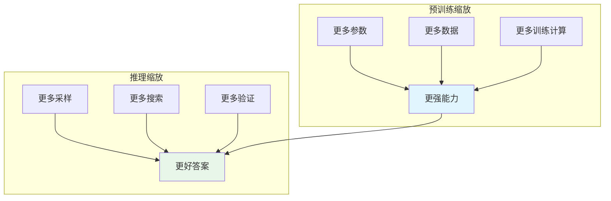
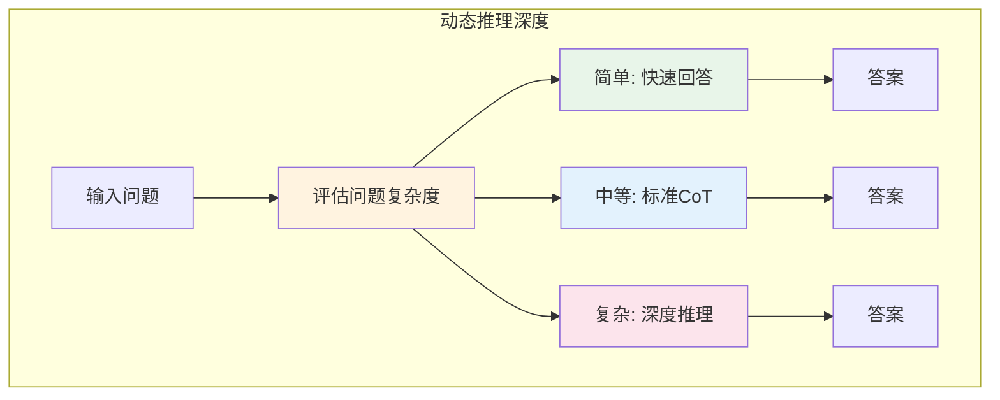

# Test-Time Compute Scaling——推理算力扩展

在上一章中，我们探讨了思维链与推理模型 —— 让模型学会"先想后答"。Chain of Thought 的发现揭示了一个深刻的事实：推理过程本身可以消耗计算资源，而更多的推理计算往往意味着更好的答案。

这个发现引出了一个更深层的问题：如果预训练缩放定律告诉我们"更大的模型 + 更多的数据 = 更强的能力"，那么推理阶段是否也存在类似的规律？答案是肯定的。2024-2025 年的研究表明，**推理阶段的计算投入与模型性能之间存在可预测的关系** —— 这就是 **Test-Time Compute Scaling**（推理算力扩展）。

OpenAI 的 o1 和 o3 模型正是这一思想的代表。它们不再追求"一次回答"，而是"思考后再回答"，通过在推理时投入更多计算，探索更多推理路径，从而获得更好的答案。本文将系统探讨推理阶段算力扩展的原理、策略和意义，并构建预训练缩放、后训练缩放、推理缩放三种缩放定律的统一视角。

## 推理阶段算力扩展

预训练缩放定律揭示了模型规模与能力的关系，但训练完成后，模型的能力就"固定"了吗？研究给出了否定的答案：**推理阶段的计算投入同样可以提升模型性能**。

### 更多思考步数与更高准确率的关系

考虑一个数学推理问题。模型可以采用两种策略：

**策略一：直接回答**

```
问题：求方程 x² - 5x + 6 = 0 的解
答案：x = 2 或 x = 3
```

**策略二：思维链回答**

```
问题：求方程 x² - 5x + 6 = 0 的解
思考：
1. 这是一个二次方程，可以用因式分解法
2. 尝试分解：x² - 5x + 6 = (x - 2)(x - 3)
3. 令 (x - 2)(x - 3) = 0
4. 解得 x = 2 或 x = 3
答案：x = 2 或 x = 3
```

两种策略的准确率差异显著。研究表明，思维链的步数与准确率之间存在正相关关系：**更多的推理步骤，往往意味着更高的准确率**。

```python runnable
import numpy as np
import matplotlib.pyplot as plt

plt.rcParams['font.sans-serif'] = ['SimHei', 'DejaVu Sans']
plt.rcParams['axes.unicode_minus'] = False

# 模拟推理步数与准确率的关系
def accuracy_vs_steps(steps, base_acc=0.3, max_acc=0.95, k=0.15):
    """准确率随推理步数增加而提升（边际收益递减）"""
    return base_acc + (max_acc - base_acc) * (1 - np.exp(-k * steps))

steps_range = np.arange(1, 51)

fig, axes = plt.subplots(1, 2, figsize=(14, 5))

# 左图：准确率 vs 推理步数
axes[0].plot(steps_range, [accuracy_vs_steps(s) for s in steps_range], 'b-', linewidth=2)
axes[0].set_xlabel('推理步数', fontsize=12)
axes[0].set_ylabel('准确率', fontsize=12)
axes[0].set_title('推理步数与准确率的关系', fontsize=14)
axes[0].grid(True, alpha=0.3)
axes[0].set_ylim(0, 1)

# 标注关键点
key_points = [(1, '直接回答'), (5, '简短CoT'), (15, '详细CoT'), (30, '深度推理')]
for steps, label in key_points:
    acc = accuracy_vs_steps(steps)
    axes[0].plot(steps, acc, 'ro', markersize=8)
    axes[0].annotate(f'{label}\n{acc:.1%}', (steps, acc), 
                     textcoords="offset points", xytext=(10, 5), fontsize=9)

# 右图：不同难度问题的对比
difficulties = [
    ('简单问题', 0.7, 0.98, 0.2),
    ('中等问题', 0.4, 0.90, 0.15),
    ('困难问题', 0.2, 0.75, 0.10),
]

for name, base, max_a, k in difficulties:
    acc = [base + (max_a - base) * (1 - np.exp(-k * s)) for s in steps_range]
    axes[1].plot(steps_range, acc, linewidth=2, label=name)

axes[1].set_xlabel('推理步数', fontsize=12)
axes[1].set_ylabel('准确率', fontsize=12)
axes[1].set_title('不同难度问题的推理步数-准确率曲线', fontsize=14)
axes[1].legend()
axes[1].grid(True, alpha=0.3)
axes[1].set_ylim(0, 1)

plt.tight_layout()
plt.savefig('/workspace/test_time_compute_steps.png', dpi=150, bbox_inches='tight')
plt.show()

print("推理步数与准确率的关系:")
print("1. 更多推理步数 → 更高准确率")
print("2. 边际收益递减：步数越多，每步带来的提升越小")
print("3. 困难问题需要更多步数才能达到较高准确率")
print("4. 简单问题在较少步数就能达到饱和")
```

上图展示了推理步数与准确率的关系。关键观察：

**边际收益递减**：推理步数增加带来的准确率提升不是线性的。初期步数带来的提升较大，后期步数带来的提升较小。这符合认知直觉：第一次思考往往能发现主要问题，后续思考主要处理细节。

**问题难度的影响**：困难问题需要更多的推理步数才能达到较高准确率。这意味着推理计算应该根据问题难度动态调整 —— 简单问题少思考，困难问题多思考。

### 与预训练 Scaling 的互补

推理缩放与预训练缩放是**互补关系**，而非替代关系。



两者的核心差异：

| 维度 | 预训练缩放 | 推理缩放 |
|:-----|:-----------|:---------|
| 投入时机 | 训练阶段 | 推理阶段 |
| 投入形式 | 更多参数、更多数据 | 更多采样、更多搜索 |
| 成本结构 | 固定成本（训练一次） | 可变成本（每次推理） |
| 能力提升 | 通用能力 | 任务特定能力 |
| 边际收益 | 幂律衰减 | 指数衰减 |

**互补性体现在**：

1. **预训练决定上限**：模型的预训练能力决定了推理缩放的上限。一个 7B 模型即使投入再多推理计算，也难以达到 GPT-4 级别的推理能力。

2. **推理缩放逼近上限**：在预训练能力范围内，推理缩放可以让模型更好地发挥其潜力。一个强大的模型如果只做"直接回答"，其能力可能被低估。

3. **成本权衡**：预训练是固定成本，推理是可变成本。对于高频使用的模型，预训练投入更多可能更经济；对于低频高价值任务，推理投入更多可能更合适。

```python runnable
import numpy as np
import matplotlib.pyplot as plt

plt.rcParams['font.sans-serif'] = ['SimHei', 'DejaVu Sans']
plt.rcParams['axes.unicode_minus'] = False

# 模拟预训练能力与推理缩放的互补关系
def model_capability(model_size, data_size):
    """模型能力 = f(模型大小, 数据量)"""
    return 1 - np.exp(-0.1 * model_size) * np.exp(-0.05 * data_size)

def inference_performance(base_capability, compute):
    """推理性能 = f(基础能力, 推理计算)"""
    return base_capability * (1 - np.exp(-0.2 * compute))

# 不同规模模型
models = [
    ('7B 模型', 7, 1),
    ('70B 模型', 70, 1.4),
    ('175B 模型', 175, 0.3),
]

compute_range = np.linspace(0, 20, 100)

fig, ax = plt.subplots(figsize=(10, 6))

for name, size, data in models:
    base_cap = model_capability(size, data)
    perf = [inference_performance(base_cap, c) for c in compute_range]
    ax.plot(compute_range, perf, linewidth=2, label=f'{name} (基础能力: {base_cap:.2f})')

ax.set_xlabel('推理计算量（相对单位）', fontsize=12)
ax.set_ylabel('推理性能', fontsize=12)
ax.set_title('预训练能力与推理缩放的互补关系', fontsize=14)
ax.legend()
ax.grid(True, alpha=0.3)
ax.set_ylim(0, 1)

plt.tight_layout()
plt.savefig('/workspace/pretraining_inference_scaling.png', dpi=150, bbox_inches='tight')
plt.show()

print("预训练能力与推理缩放的互补关系:")
print("1. 预训练决定上限：大模型的性能上限更高")
print("2. 推理缩放逼近上限：更多推理计算逼近模型能力上限")
print("3. 7B 模型即使无限推理计算，也难以超越 175B 模型")
print("4. 但 7B 模型通过推理缩放可以显著提升性能")
```

## 动态推理深度

既然推理计算可以提升性能，那么应该投入多少推理计算？答案是：**根据问题难度动态调整**。简单问题快回答，复杂问题多思考。

### 简单问题快回答、复杂问题多思考

不同问题的难度差异巨大。"1+1=?"这样的问题不需要深度推理，而"证明费马大定理"则需要大量思考。动态推理深度的核心思想是：**根据问题的复杂度，自适应地分配推理计算**。



**实现动态推理深度的关键挑战**：

1. **复杂度评估**：如何在推理前判断问题的难度？
2. **计算分配**：如何根据复杂度分配推理计算？
3. **终止条件**：何时停止推理，输出答案？

### Adaptive Compute

**Adaptive Compute**（自适应计算）是实现动态推理深度的技术框架。核心思想是：模型在推理过程中动态决定是否继续思考。

**方法一：置信度阈值**

模型在每一步推理后评估自己的"置信度"。如果置信度足够高，输出答案；否则继续思考。

```
问题：小明有 23 个苹果，给了小红 5 个，又买了 8 个，现在有多少个？

推理步骤 1：23 - 5 = 18
置信度：0.7（不够高，继续）

推理步骤 2：18 + 8 = 26
置信度：0.95（足够高，输出）
答案：26 个苹果
```

**方法二：计算预算预测**

模型在开始推理前预测完成任务所需的计算量，然后分配相应的计算预算。

```
问题：计算 123 × 456
预测复杂度：低
分配计算：1 个思维链步骤

问题：证明 √2 是无理数
预测复杂度：高
分配计算：10+ 个思维链步骤
```

**方法三：动态停止**

模型在推理过程中动态决定是否停止。这需要一个"停止判断器"，评估当前答案是否足够好。

```python runnable
import numpy as np
import matplotlib.pyplot as plt

plt.rcParams['font.sans-serif'] = ['SimHei', 'DejaVu Sans']
plt.rcParams['axes.unicode_minus'] = False

# 模拟动态推理深度
class AdaptiveReasoning:
    def __init__(self, confidence_threshold=0.9, max_steps=20):
        self.confidence_threshold = confidence_threshold
        self.max_steps = max_steps
    
    def estimate_difficulty(self, problem):
        """模拟问题难度评估"""
        # 简化：用问题长度作为难度代理
        return min(len(problem) / 100, 1.0)
    
    def reason_step(self, step, base_confidence):
        """模拟单步推理"""
        # 置信度随步数增加而提升
        confidence = base_confidence + (1 - base_confidence) * (1 - np.exp(-0.3 * step))
        return confidence
    
    def solve(self, problem, base_confidence=0.5):
        """动态推理求解"""
        difficulty = self.estimate_difficulty(problem)
        
        steps = 0
        confidence = 0
        trajectory = []
        
        while steps < self.max_steps:
            steps += 1
            confidence = self.reason_step(steps, base_confidence)
            trajectory.append((steps, confidence))
            
            if confidence >= self.confidence_threshold:
                break
        
        return {
            'difficulty': difficulty,
            'steps': steps,
            'final_confidence': confidence,
            'trajectory': trajectory
        }

# 测试不同难度的问题
problems = [
    ('简单问题：1 + 1 = ?', 0.8),
    ('中等问题：计算 123 × 456 + 789', 0.5),
    ('困难问题：证明对于任意正整数 n，存在 n 个连续的正整数都是合数', 0.3),
]

solver = AdaptiveReasoning(confidence_threshold=0.9)

fig, axes = plt.subplots(1, 2, figsize=(14, 5))

# 左图：不同问题的推理轨迹
for problem, base_conf in problems:
    result = solver.solve(problem, base_conf)
    steps = [t[0] for t in result['trajectory']]
    confs = [t[1] for t in result['trajectory']]
    
    label = problem.split('：')[0]
    axes[0].plot(steps, confs, 'o-', linewidth=2, markersize=6, label=label)

axes[0].axhline(y=0.9, color='red', linestyle='--', label='置信度阈值')
axes[0].set_xlabel('推理步数', fontsize=12)
axes[0].set_ylabel('置信度', fontsize=12)
axes[0].set_title('动态推理深度：不同问题的推理轨迹', fontsize=14)
axes[0].legend()
axes[0].grid(True, alpha=0.3)
axes[0].set_ylim(0, 1)

# 右图：计算量分布
difficulties = np.linspace(0, 1, 20)
steps_needed = []

for d in difficulties:
    # 模拟：难度越高，基础置信度越低
    base_conf = 0.9 - 0.6 * d
    result = solver.solve(f'问题_{d:.2f}', base_conf)
    steps_needed.append(result['steps'])

axes[1].bar(range(len(difficulties)), steps_needed, color='steelblue', alpha=0.7)
axes[1].set_xlabel('问题难度（相对单位）', fontsize=12)
axes[1].set_ylabel('所需推理步数', fontsize=12)
axes[1].set_title('问题难度与所需计算量的关系', fontsize=14)
axes[1].grid(True, alpha=0.3, axis='y')

plt.tight_layout()
plt.savefig('/workspace/adaptive_compute.png', dpi=150, bbox_inches='tight')
plt.show()

print("动态推理深度的核心思想:")
print("1. 简单问题：快速达到置信度阈值，少步推理")
print("2. 复杂问题：需要更多步数才能达到置信度阈值")
print("3. 自适应：根据问题难度动态分配计算资源")
print("4. 效率：避免在简单问题上浪费计算")
```

## 搜索策略

思维链让模型"一步步思考"，但每一步可能有多种选择。如何系统地探索这些选择？这就需要**搜索策略**。

### Best-of-N 采样

**Best-of-N 采样**是最简单的搜索策略：生成 N 个候选答案，选择最好的一个。

**核心流程**：

1. 给定问题，生成 N 个候选答案
2. 用评分函数（如奖励模型）对每个答案评分
3. 选择得分最高的答案

```python runnable
import numpy as np
import matplotlib.pyplot as plt

plt.rcParams['font.sans-serif'] = ['SimHei', 'DejaVu Sans']
plt.rcParams['axes.unicode_minus'] = False

# 模拟 Best-of-N 采样
def generate_answer(quality_mean=0.5, quality_std=0.2):
    """模拟生成一个答案的质量"""
    return np.clip(np.random.normal(quality_mean, quality_std), 0, 1)

def best_of_n(n, quality_mean=0.5, quality_std=0.2):
    """Best-of-N: 选择 N 个答案中最好的"""
    answers = [generate_answer(quality_mean, quality_std) for _ in range(n)]
    return max(answers)

# 不同 N 值下的性能
n_values = [1, 2, 3, 5, 10, 20, 50, 100]
num_trials = 1000

results = {}
for n in n_values:
    scores = [best_of_n(n) for _ in range(num_trials)]
    results[n] = {
        'mean': np.mean(scores),
        'std': np.std(scores),
        'min': np.min(scores),
        'max': np.max(scores)
    }

fig, axes = plt.subplots(1, 2, figsize=(14, 5))

# 左图：平均质量 vs N
n_list = list(results.keys())
means = [results[n]['mean'] for n in n_list]
stds = [results[n]['std'] for n in n_list]

axes[0].errorbar(n_list, means, yerr=stds, fmt='o-', linewidth=2, capsize=5, capthick=2)
axes[0].set_xlabel('N（候选答案数量）', fontsize=12)
axes[0].set_ylabel('最佳答案质量', fontsize=12)
axes[0].set_title('Best-of-N：更多候选 → 更好答案', fontsize=14)
axes[0].set_xscale('log')
axes[0].grid(True, alpha=0.3)
axes[0].set_ylim(0, 1)

# 标注关键点
for n in [1, 10, 100]:
    axes[0].annotate(f'N={n}: {results[n]["mean"]:.2f}', 
                     xy=(n, results[n]['mean']),
                     textcoords="offset points", xytext=(10, 10), fontsize=10)

# 右图：质量分布
for n in [1, 10, 100]:
    samples = [best_of_n(n) for _ in range(500)]
    axes[1].hist(samples, bins=20, alpha=0.5, label=f'N={n}', density=True)

axes[1].set_xlabel('答案质量', fontsize=12)
axes[1].set_ylabel('密度', fontsize=12)
axes[1].set_title('不同 N 值下的答案质量分布', fontsize=14)
axes[1].legend()
axes[1].grid(True, alpha=0.3)

plt.tight_layout()
plt.savefig('/workspace/best_of_n.png', dpi=150, bbox_inches='tight')
plt.show()

print("Best-of-N 采样的特点:")
print("1. 简单有效：只需生成多个答案，选择最好的")
print("2. 边际收益递减：N 越大，每增加一个候选带来的提升越小")
print("3. 计算成本：N 个候选 = N 倍计算成本")
print("4. 适用场景：有可靠评分函数的任务（如数学题、代码）")
```

Best-of-N 的关键假设是：**存在可靠的评分函数**。对于数学问题，可以验证答案是否正确；对于代码，可以运行测试用例。但对于开放性问题（如写作），评分函数难以定义，Best-of-N 的效果受限。

### 树搜索：Beam Search 与 MCTS

Best-of-N 是"并行探索" —— 同时生成多个独立答案。但对于复杂推理任务，答案之间存在依赖关系：前一步的选择影响后续步骤。这时需要**树搜索**策略。

**Beam Search**

Beam Search 是一种宽度受限的广度优先搜索。每一步保留得分最高的 K 个候选（beam width = K），然后从这些候选继续扩展。

```
问题：计算 (2 + 3) × 4

步骤 1 候选：
  - 候选 A: 先算 2 + 3 = 5（得分 0.9）
  - 候选 B: 先算 3 × 4 = 12（得分 0.3）
  
保留 beam width = 1，继续扩展候选 A：

步骤 2 候选（从候选 A 扩展）：
  - 候选 A1: 5 × 4 = 20（得分 0.95）
  
答案：20
```

**MCTS（蒙特卡洛树搜索）**

MCTS 是一种更复杂的搜索策略，结合了探索与利用。它在围棋 AI AlphaGo 中大放异彩，现在被应用于 LLM 推理。

MCTS 的四个步骤：

1. **选择**（Selection）：从根节点开始，选择最有潜力的子节点
2. **扩展**（Expansion）：在选中的节点上扩展新的子节点
3. **模拟**（Simulation）：从新节点开始，快速模拟到终点
4. **回溯**（Backpropagation）：将模拟结果反向传播更新节点值

```nn-arch width=720
name: MCTS 搜索过程
layout: horizontal

sections:
  - name: 选择
    layers: [root, select_path, selected]
  - name: 扩展
    layers: [root2, expand, new_node]
  - name: 模拟
    layers: [root3, simulate, result]
  - name: 回溯
    layers: [root4, backprop, updated]

layers:
  - {id: root, name: "根节点", type: input, size: "状态"}
  - {id: select_path, name: "选择路径", type: process, size: "UCB公式"}
  - {id: selected, name: "选中节点", type: operation, size: "待扩展"}
  - {id: root2, name: "根节点", type: input, size: "状态"}
  - {id: expand, name: "扩展", type: process, size: "新动作"}
  - {id: new_node, name: "新节点", type: operation, size: "子节点"}
  - {id: root3, name: "根节点", type: input, size: "状态"}
  - {id: simulate, name: "模拟", type: process, size: "快速推演"}
  - {id: result, name: "结果", type: output, size: "奖励值"}
  - {id: root4, name: "根节点", type: input, size: "状态"}
  - {id: backprop, name: "回溯", type: process, size: "更新值"}
  - {id: updated, name: "更新后", type: output, size: "新估值"}
```

**MCTS 在 LLM 推理中的应用**：

```
问题：证明对于任意正整数 n，n³ - n 能被 6 整除

状态：当前推理步骤
动作：下一步推理选择
奖励：证明是否正确

搜索过程：
1. 选择：从当前推理状态，选择最有潜力的下一步
2. 扩展：生成新的推理步骤
3. 模拟：快速完成证明，检查是否正确
4. 回溯：更新推理路径的价值
```

```python runnable
import numpy as np
import matplotlib.pyplot as plt

plt.rcParams['font.sans-serif'] = ['SimHei', 'DejaVu Sans']
plt.rcParams['axes.unicode_minus'] = False

# 模拟不同搜索策略的对比
def random_search(depth, branching_factor=3):
    """随机搜索：每步随机选择"""
    return np.random.uniform(0.3, 0.7) * (1 - 0.05 * depth)

def beam_search(depth, beam_width=3, branching_factor=3):
    """Beam Search：每步保留最好的 K 个"""
    # 模拟 beam search 的优势
    base_quality = 0.5
    improvement = 0.1 * np.log(beam_width + 1)
    return min(base_quality + improvement - 0.02 * depth, 0.95)

def mcts_search(depth, simulations=100, branching_factor=3):
    """MCTS：结合探索与利用"""
    # 模拟 MCTS 的优势
    base_quality = 0.5
    improvement = 0.15 * np.log(simulations + 1)
    return min(base_quality + improvement - 0.01 * depth, 0.98)

# 不同搜索深度下的性能
depths = range(1, 11)

fig, axes = plt.subplots(1, 2, figsize=(14, 5))

# 左图：不同策略的性能对比
strategies = [
    ('随机搜索', [random_search(d) for d in depths]),
    ('Beam Search (K=3)', [beam_search(d, 3) for d in depths]),
    ('Beam Search (K=10)', [beam_search(d, 10) for d in depths]),
    ('MCTS (100次模拟)', [mcts_search(d, 100) for d in depths]),
    ('MCTS (1000次模拟)', [mcts_search(d, 1000) for d in depths]),
]

for name, scores in strategies:
    axes[0].plot(depths, scores, 'o-', linewidth=2, markersize=6, label=name)

axes[0].set_xlabel('搜索深度', fontsize=12)
axes[0].set_ylabel('答案质量', fontsize=12)
axes[0].set_title('不同搜索策略的性能对比', fontsize=14)
axes[0].legend()
axes[0].grid(True, alpha=0.3)
axes[0].set_ylim(0, 1)

# 右图：计算成本 vs 性能
compute_budgets = [10, 30, 100, 300, 1000, 3000]

beam_scores = [beam_search(5, int(np.sqrt(b))) for b in compute_budgets]
mcts_scores = [mcts_search(5, b) for b in compute_budgets]

axes[1].loglog(compute_budgets, beam_scores, 'o-', linewidth=2, label='Beam Search')
axes[1].loglog(compute_budgets, mcts_scores, 's-', linewidth=2, label='MCTS')
axes[1].set_xlabel('计算预算（相对单位）', fontsize=12)
axes[1].set_ylabel('答案质量', fontsize=12)
axes[1].set_title('计算成本与性能的关系', fontsize=14)
axes[1].legend()
axes[1].grid(True, alpha=0.3)

plt.tight_layout()
plt.savefig('/workspace/search_strategies.png', dpi=150, bbox_inches='tight')
plt.show()

print("搜索策略对比:")
print()
print("1. 随机搜索")
print("   - 最简单，但效率最低")
print("   - 不利用任何信息指导搜索")
print()
print("2. Beam Search")
print("   - 每步保留最好的 K 个候选")
print("   - 计算成本适中，效果较好")
print("   - 缺点：可能错过全局最优（贪心）")
print()
print("3. MCTS")
print("   - 结合探索与利用")
print("   - 计算成本最高，效果最好")
print("   - 适合复杂推理任务")
```

### 推理时的系统性探索

搜索策略的核心价值是**系统性探索**。与人类解决问题时的"尝试 - 失败 - 换方法"类似，模型通过搜索可以：

1. **发现错误路径**：探索某条推理路径，发现走不通，及时回溯
2. **比较多种方法**：同时探索多条路径，比较结果
3. **积累经验**：搜索过程中的信息可以指导后续搜索

o1/o3 模型的强大推理能力，很大程度上来自于这种系统性探索。它们不再"一次回答"，而是"思考 - 探索 - 验证 - 修正"的迭代过程。

## 验证与自我纠错

搜索策略让模型探索多条推理路径，但如何判断哪条路径是正确的？这就需要**验证与自我纠错**能力。

### 模型审视自己的推理过程

**自我验证**（Self-Verification）是指模型检查自己推理过程的能力。这与人类的"检查答案"行为类似。

**自我验证的形式**：

1. **结果验证**：检查最终答案是否合理
2. **过程验证**：检查推理步骤是否正确
3. **一致性验证**：检查不同推理路径是否得到相同结果

```
问题：一个长方形的长是宽的 2 倍，周长是 36 厘米，求面积。

推理过程：
1. 设宽为 x，则长为 2x
2. 周长 = 2(x + 2x) = 6x = 36
3. 解得 x = 6，即宽 = 6cm，长 = 12cm
4. 面积 = 6 × 12 = 72 cm²

自我验证：
- 检查周长：2(6 + 12) = 36 ✓
- 检查长宽关系：12 = 2 × 6 ✓
- 答案合理

确认答案：72 cm²
```

### 自我验证提升准确率

研究表明，自我验证可以显著提升推理准确率。原因有三：

**1. 发现计算错误**

简单的计算错误在验证时容易被发现。

```
推理：17 × 23 = 391
验证：391 ÷ 17 = 23 ✓，391 ÷ 23 = 17 ✓
```

**2. 发现逻辑矛盾**

推理过程中的逻辑矛盾在验证时会暴露。

```
推理：设年龄为 x，解得 x = -5
验证：年龄不能为负数，矛盾！
回溯：重新理解题意...
```

**3. 增强置信度**

验证通过后，对答案的置信度更高。

```python runnable
import numpy as np
import matplotlib.pyplot as plt

plt.rcParams['font.sans-serif'] = ['SimHei', 'DejaVu Sans']
plt.rcParams['axes.unicode_minus'] = False

# 模拟自我验证的效果
def solve_with_verification(base_accuracy=0.7, verification_rate=0.8):
    """带自我验证的求解"""
    # 第一次尝试
    correct = np.random.random() < base_accuracy
    
    if not correct:
        # 错误时，有一定概率通过验证发现并纠正
        if np.random.random() < verification_rate:
            # 发现错误，重新尝试
            correct = np.random.random() < base_accuracy
    
    return correct

# 不同验证率下的准确率
verification_rates = np.linspace(0, 1, 20)
base_acc = 0.7

accuracies = []
for vr in verification_rates:
    results = [solve_with_verification(base_acc, vr) for _ in range(1000)]
    accuracies.append(np.mean(results))

fig, axes = plt.subplots(1, 2, figsize=(14, 5))

# 左图：验证率与准确率
axes[0].plot(verification_rates, accuracies, 'b-', linewidth=2)
axes[0].axhline(y=base_acc, color='red', linestyle='--', label=f'无验证: {base_acc:.0%}')
axes[0].set_xlabel('验证成功率', fontsize=12)
axes[0].set_ylabel('最终准确率', fontsize=12)
axes[0].set_title('自我验证对准确率的提升', fontsize=14)
axes[0].legend()
axes[0].grid(True, alpha=0.3)
axes[0].set_ylim(0.5, 1)

# 右图：不同基础能力下的提升
base_accs = [0.5, 0.6, 0.7, 0.8, 0.9]
improvements = []

for ba in base_accs:
    no_verify = ba
    with_verify = np.mean([solve_with_verification(ba, 0.8) for _ in range(1000)])
    improvements.append(with_verify - no_verify)

bars = axes[1].bar(range(len(base_accs)), improvements, color='steelblue', alpha=0.7)
axes[1].set_xlabel('基础准确率', fontsize=12)
axes[1].set_ylabel('准确率提升', fontsize=12)
axes[1].set_title('自我验证带来的准确率提升\n（验证成功率 80%）', fontsize=14)
axes[1].set_xticks(range(len(base_accs)))
axes[1].set_xticklabels([f'{ba:.0%}' for ba in base_accs])
axes[1].grid(True, alpha=0.3, axis='y')

for bar, imp in zip(bars, improvements):
    axes[1].annotate(f'+{imp:.1%}', xy=(bar.get_x() + bar.get_width()/2, bar.get_height()),
                     xytext=(0, 3), textcoords='offset points', ha='center', fontsize=10)

plt.tight_layout()
plt.savefig('/workspace/self_verification.png', dpi=150, bbox_inches='tight')
plt.show()

print("自我验证的效果分析:")
print("1. 验证成功率越高，准确率提升越大")
print("2. 基础准确率越低，验证带来的提升越显著")
print("3. 验证是推理缩放的重要组成部分")
print("4. o1/o3 模型的自我验证能力是其强大推理的关键")
```

## 三种缩放定律的统一视角

至此，我们已经探讨了三种缩放定律：

1. **预训练缩放**：更多参数 + 更多数据 = 更强基础能力
2. **后训练缩放**：更多对齐数据 = 更好遵循指令
3. **推理缩放**：更多推理计算 = 更好答案

这三种缩放定律共同构成了 LLM 能力提升的完整框架。

### 预训练缩放 + 后训练缩放 + 推理缩放

```nn-arch width=720
name: 三种缩放定律统一视角
layout: horizontal

sections:
  - name: 预训练缩放
    layers: [pt_input, pt_params, pt_data, pt_compute, pt_output]
  - name: 后训练缩放
    layers: [post_input, post_sft, post_rlhf, post_output]
  - name: 推理缩放
    layers: [inf_input, inf_sample, inf_search, inf_verify, inf_output]

layers:
  - {id: pt_input, name: "原始文本", type: input, size: "海量数据"}
  - {id: pt_params, name: "模型参数", type: operation, size: "N ↑"}
  - {id: pt_data, name: "训练数据", type: operation, size: "D ↑"}
  - {id: pt_compute, name: "训练计算", type: operation, size: "C ↑"}
  - {id: pt_output, name: "基础模型", type: output, size: "预训练能力"}
  
  - {id: post_input, name: "基础模型", type: input, size: "预训练能力"}
  - {id: post_sft, name: "SFT数据", type: operation, size: "指令遵循"}
  - {id: post_rlhf, name: "RLHF数据", type: operation, size: "偏好对齐"}
  - {id: post_output, name: "对齐模型", type: output, size: "可用能力"}
  
  - {id: inf_input, name: "对齐模型", type: input, size: "可用能力"}
  - {id: inf_sample, name: "多样采样", type: operation, size: "Best-of-N"}
  - {id: inf_search, name: "树搜索", type: operation, size: "MCTS"}
  - {id: inf_verify, name: "自我验证", type: operation, size: "纠错"}
  - {id: inf_output, name: "最终答案", type: output, size: "最优输出"}
```

### LLM 能力提升的完整框架

三种缩放定律的关系可以用一个公式概括：

$$\text{最终能力} = f(\text{预训练能力}, \text{对齐程度}, \text{推理投入})$$

其中：

- **预训练能力**由模型参数量 $N$ 和训练数据量 $D$ 决定
- **对齐程度**由 SFT/RLHF 数据质量和数量决定
- **推理投入**由采样数量、搜索深度、验证次数决定

**三种缩放的协同效应**：

```python runnable
import numpy asnp
import matplotlib.pyplot as plt
from mpl_toolkits.mplot3d import Axes3D

plt.rcParams['font.sans-serif'] = ['SimHei', 'DejaVu Sans']
plt.rcParams['axes.unicode_minus'] = False

# 三种缩放的协同效应
def final_capability(pretrain, alignment, inference):
    """最终能力 = f(预训练, 对齐, 推理)"""
    # 简化模型：乘法效应
    return pretrain * alignment * inference

# 创建 3D 图
fig = plt.figure(figsize=(12, 5))

# 左图：三种缩放的关系
ax1 = fig.add_subplot(121, projection='3d')

pretrain = np.linspace(0.3, 1.0, 20)
alignment = np.linspace(0.5, 1.0, 20)
inference = np.linspace(0.5, 1.0, 20)

P, A, I = np.meshgrid(pretrain, alignment, inference)
C = P * A * I

# 固定推理投入，看预训练和对齐的关系
ax1.plot_surface(P[:, :, 10], A[:, :, 10], C[:, :, 10], cmap='viridis', alpha=0.8)
ax1.set_xlabel('预训练能力', fontsize=10)
ax1.set_ylabel('对齐程度', fontsize=10)
ax1.set_zlabel('最终能力', fontsize=10)
ax1.set_title('预训练 × 对齐\n（固定推理投入）', fontsize=12)

# 右图：不同策略的对比
ax2 = fig.add_subplot(122)

strategies = [
    ('仅预训练缩放', 0.9, 0.6, 0.6),
    ('预训练+对齐', 0.9, 0.9, 0.6),
    ('预训练+对齐+推理', 0.9, 0.9, 0.9),
    ('小模型+强推理', 0.6, 0.8, 1.0),
]

names = [s[0] for s in strategies]
capabilities = [final_capability(s[1], s[2], s[3]) for s in strategies]

colors = ['#90caf9', '#81c784', '#4caf50', '#ffb74d']
bars = ax2.bar(names, capabilities, color=colors, alpha=0.8)

ax2.set_ylabel('最终能力', fontsize=12)
ax2.set_title('不同缩放策略的对比', fontsize=14)
ax2.set_ylim(0, 1)
ax2.grid(True, alpha=0.3, axis='y')

for bar, cap in zip(bars, capabilities):
    ax2.annotate(f'{cap:.2f}', xy=(bar.get_x() + bar.get_width()/2, bar.get_height()),
                 xytext=(0, 3), textcoords='offset points', ha='center', fontsize=11)

plt.xticks(rotation=15, ha='right')
plt.tight_layout()
plt.savefig('/workspace/three_scaling_laws.png', dpi=150, bbox_inches='tight')
plt.show()

print("三种缩放定律的统一视角:")
print()
print("1. 预训练缩放")
print("   - 决定模型的能力上限")
print("   - 投入：更多参数、更多数据")
print("   - 成本：固定成本（训练一次）")
print()
print("2. 后训练缩放")
print("   - 将预训练能力转化为可用能力")
print("   - 投入：更多对齐数据")
print("   - 成本：相对较小")
print()
print("3. 推理缩放")
print("   - 在能力范围内逼近最优输出")
print("   - 投入：更多采样、搜索、验证")
print("   - 成本：可变成本（每次推理）")
print()
print("协同效应：三种缩放相乘，共同决定最终能力")
```

### 实践启示

三种缩放定律为 LLM 开发提供了清晰的指导：

**模型开发阶段**：

1. 根据预算确定预训练规模（遵循 Chinchilla 最优比例）
2. 投入高质量对齐数据（SFT + RLHF）
3. 设计推理策略（采样、搜索、验证）

**应用部署阶段**：

1. 对于高频低价值任务：使用小模型 + 快速推理
2. 对于低频高价值任务：使用大模型 + 深度推理
3. 根据任务特点动态调整推理计算

**o1/o3 的启示**：

OpenAI 的 o1 和 o3 模型展示了推理缩放的巨大潜力。它们的核心创新是：

1. **训练推理能力**：通过强化学习让模型学会"思考"
2. **推理时扩展**：在推理时投入更多计算，探索更多路径
3. **自我验证纠错**：模型能够检查和修正自己的推理

这标志着 LLM 发展的新阶段：从"一次回答"到"深度思考"，从"固定能力"到"动态扩展"。

## 小结

本文探讨了 Test-Time Compute Scaling——推理阶段的算力扩展：

**推理阶段算力扩展**：
- 更多推理步数与更高准确率正相关
- 与预训练缩放是互补关系，而非替代
- 预训练决定上限，推理缩放逼近上限

**动态推理深度**：
- 简单问题快回答、复杂问题多思考
- Adaptive Compute 根据问题难度动态分配计算
- 置信度阈值、计算预算预测、动态停止三种实现方式

**搜索策略**：
- Best-of-N：生成多个候选，选择最好的
- Beam Search：宽度受限的广度优先搜索
- MCTS：结合探索与利用的树搜索
- 系统性探索是 o1/o3 强大推理的关键

**验证与自我纠错**：
- 模型审视自己的推理过程
- 发现计算错误、逻辑矛盾
- 显著提升推理准确率

**三种缩放定律的统一视角**：
- 预训练缩放：决定能力上限
- 后训练缩放：转化为可用能力
- 推理缩放：逼近最优输出
- 三者协同，共同决定最终能力

Test-Time Compute Scaling 的发现标志着 LLM 发展的新阶段。从 GPT-3 到 o1/o3，我们见证了从"预训练为王"到"推理亦重要"的转变。未来，如何在预训练、后训练、推理三者之间找到最优平衡，将是 LLM 开发的核心课题。

---

## 练习题

**1. 理论分析**

分析推理缩放与预训练缩放的边际收益差异：
- 为什么推理缩放的边际收益衰减更快？
- 什么情况下推理缩放更经济？

**2. 策略设计**

设计一个动态推理深度系统：
- 如何评估问题复杂度？
- 如何根据复杂度分配计算？
- 如何判断何时停止推理？

**3. 实验对比**

对比 Best-of-N 和 MCTS 在以下任务上的表现：
- 数学推理（有明确答案）
- 代码生成（有测试用例）
- 开放式写作（无明确评分标准）

**4. 搜索策略实现**

实现一个简单的 Beam Search 推理系统：
- 输入：数学问题
- 输出：推理过程和答案
- 参数：beam width = 3

**5. 三种缩放的权衡**

假设有以下资源约束：
- 预训练预算：100 万 GPU 小时
- 对齐数据：10 万条
- 推理预算：每问题 10 秒 GPU 时间

设计最优的资源配置方案，并解释理由。

---

## 参考资料

1. **Test-Time Scaling**: "Large Language Models are Zero-Shot Reasoners" (Kojima et al., 2022)
2. **Best-of-N**: "Training Verifiers to Solve Math Word Problems" (Cobbe et al., 2021)
3. **Self-Consistency**: "Self-Consistency Improves Chain of Thought Reasoning in Language Models" (Wang et al., 2022)
4. **MCTS for LLM**: "Tree of Thoughts: Deliberate Problem Solving with Large Language Models" (Yao et al., 2023)
5. **o1 技术报告**: OpenAI o1 技术报告 (2024)
6. **Self-Verification**: "Self-Verification Improves Chain-of-Thought Reasoning" (Weng et al., 2023)
7. **Scaling Laws**: "Scaling Laws for Neural Language Models" (Kaplan et al., 2020)
8. **Chinchilla**: "Training Compute-Optimal Large Language Models" (Hoffmann et al., 2022)
