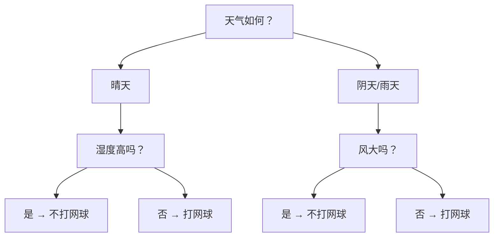
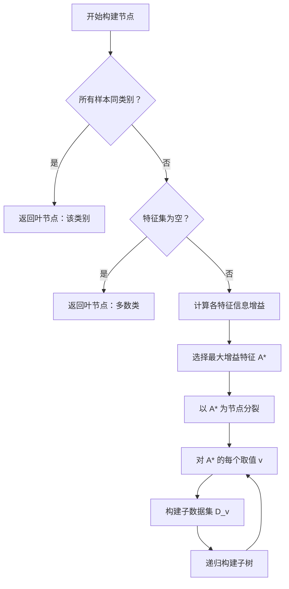

# 决策树

业内一直有个说法，统计学习模型是"数学家的方法"，唯独决策树是"程序员的方法"。决策树最早来源于澳大利亚计算机科学家罗斯·昆兰（Ross Quinlan）在 1986 年提出的 ID3 算法，这个算法直白得让人惊讶，就是用一系列"是/否"问题来分类数据，就像医生诊断病人一样，先问发烧吗？再问咳嗽吗？最后给出诊断结论。当时大概不会有人能想到，之后几十年里还衍生出了 C4.5、CART 等一系列经典方法，决策树成为最广泛应用的机器学习算法之一。

考虑一个日常场景：判断今天是否适合打网球。你会怎么思考？正常人肯定不会去计算什么概率公式，而是按顺序问自己几个问题：

*图：是否打网球的决策树样例*

这就是一棵决策树。从根节点开始，每个节点提出一个问题，根据答案选择分支，最终到达叶节点得到结论。这种从数据自动学习规则的方式，具有几个独特优势（当然，决策树也有明显局限，譬如单棵树容易过拟合，对数据扰动敏感。这些问题将在后续讨论[剪枝策略](#剪枝策略)和[随机森林](random-forest.md)时解决）：

- 首先，**可解释性强**。决策树的每个分支都可以用自然语言描述，譬如"如果天气晴朗且湿度不高，就适合打网球"。这种透明性在医疗诊断、信用评估等领域尤为重要，医生需要理解为什么模型判断某患者高风险，银行需要解释为什么拒绝某客户的贷款申请。
- 其次，**不需要特征缩放**。线性模型对特征的数值范围敏感，需要标准化或归一化处理；而决策树只关心"大于还是小于某个阈值"，数值范围完全不影响分裂结果。这意味着数据预处理的工作量大幅减少。
- 再次，**能处理混合类型特征**。数值型特征（如温度、收入）和类别型特征（如天气、职业）都能直接处理，无需像线性模型那样进行独热编码。
- 最后，**自动特征选择**。分裂过程本身就是特征选择过程。信息增益或 Gini 指数最高的特征会被优先选中，相当于自动筛选出最重要的特征。

## 最佳分裂准则

然而，决策树并不像它表面看起来这般直白简单，对于简单的三两个特征，人类很快就能完成决策树的构建，但面对成千上万的数据样本，少则几十多达上千的特征，就肯定要有一套严谨的理论去判断在每个节点应该选择哪个特征进行分裂。还是以打网球为例子，这次我们收集过去两周的去打网球记录，其中包含天气、温度、湿度、风力四个特征，以及是否打网球的结果，如下表所示。请根据数据考虑应该首先按哪个特征分裂树是最优的？为什么？

| 天气 | 温度 | 湿度 | 风力 | 打网球？ |
|:----:|:----:|:----:|:----:|:--------:|
| 晴天 | 热 | 高 | 弱 | 否 |
| 晴天 | 热 | 高 | 强 | 否 |
| 阴天 | 热 | 高 | 弱 | 是 |
| 雨天 | 温暖 | 高 | 弱 | 是 |
| 雨天 | 冷 | 正常 | 弱 | 是 |
| 雨天 | 冷 | 正常 | 强 | 否 |
| 阴天 | 冷 | 正常 | 强 | 是 |
| 晴天 | 温暖 | 高 | 弱 | 否 |
| 晴天 | 冷 | 正常 | 弱 | 是 |
| 雨天 | 温暖 | 正常 | 弱 | 是 |
| 晴天 | 温暖 | 正常 | 强 | 是 |
| 阴天 | 温暖 | 高 | 强 | 是 |
| 阴天 | 热 | 正常 | 弱 | 是 |
| 雨天 | 温暖 | 高 | 强 | 否 |

其中一种合理的构建策略是根据**信息增益**（Information Gain）来选择分裂的特征。这里要引入热力学和信息论中**熵**（Entropy）的概念。熵是热力学中衡量混乱程度的指标，在信息论中被用来度量数据的不确定性。假设你有一枚公平硬币，正反面各 50% 概率，无论你事前收集了多少抛硬币的统计数据，都无法确定下一次抛掷的结果，这就是信息最混乱的状态，信息熵最大。如果这枚硬币是作弊的魔术道具，两面都是正面，那你在抛之前就百分之百确定结果，这是信息最纯净的状态，信息熵为零。数学上，信息熵定义为：

$$H(D) = -\sum_{k=1}^{K} p_k \log_2 p_k$$

这个公式中，$p_k$ 是类别 $k$ 在数据集 $D$ 中所占的比例，譬如硬币抛出正面在所有抛硬币的记录中占了一半，所以 $p_k = 0.5$。$\log_2 p_k$ 表示信息的意外程度，概率越小的事件发生时，意外程度越高，信息量就越大。譬如，我说"明天太阳将会升起"这句话就几乎没有什么意外程度，如果我们能统计地球全生命周期里所有的日出数据，太阳升起的比例几乎是无限接近百分百（只有世界末日那天是例外），即 $p_k \approx 1, \log_2 p_k \approx 0$。前面的负号是因为 $\log_2 p_k$ 本身是负数（概率小于 1 ），加上负号后负负得正。因此，整个信息熵的定义可以通俗汇总成一句话：**只有令人意外的事情才携带着信息**。

现在，代入过去两周是否去打网球的数据，计算信息熵 $H(D) = -\left(\frac{9}{14} \log_2 \frac{9}{14} + \frac{5}{14} \log_2 \frac{5}{14}\right) \approx 0.940$，这个数值意味着当前的 14 条数据还相当混乱的，打网球和不打网球的比例约为 2:1，远没有达到纯净状态。现在我们先尝试按天气特征进行分裂。天气有三个取值：晴天、阴天、雨天，分别对应 5、4、5 条记录：

- **晴天（5 条）**：打网球 2 条，不打 3 条 → $H(D_{晴天}) \approx 0.971$
- **阴天（4 条）**：打网球 4 条，不打 0 条 → $H(D_{阴天}) = 0$（完全纯净！）
- **雨天（5 条）**：打网球 3 条，不打 2 条 → $H(D_{雨天}) \approx 0.971$

分裂后的总信息熵是各子集信息熵的加权平均 $H(D, 天气) = \frac{5}{14} \times 0.971 + \frac{4}{14} \times 0 + \frac{5}{14} \times 0.971 \approx 0.693$，比起分裂前减少了 $0.247$，这个减少量就是用天气作为分裂条件产生的信息增益。用同样的方法计算其他特征的信息增益：

| 特征 | 信息增益 |
|:----:|:--------:|
| 天气 | 0.247 |
| 温度 | 0.029 |
| 湿度 | 0.152 |
| 风力 | 0.048 |

从结果可见，天气的信息增益最大，因此应该优先按天气分裂决策树。这个结果与人类直觉一致，天气确实是影响打球决策的最重要因素。

不过，信息增益只是"其中一种"合理的分裂策略，有一些场合它是不适用的。因为信息增益天然偏向于取值多的特征，取值越多，分裂后的子集越可能纯净，举个极端例子，如果你要对人群进行分类，选用了"身份证号"这个特征来分裂，那分裂后每个分支肯定只有一个样本，完美纯净，但毫无意义。在这种情况下，可以改为采用**增益率**（Gain Ratio），通过引入惩罚项来解决问题。增益率的定义是：

$$GainRatio(D, A) = \frac{IG(D, A)}{SplitInfo(A)}$$

其中分母的 $SplitInfo(A)$ 用于衡量特征取值的分散程度：

$$SplitInfo(A) = -\sum_{v} \frac{|D_v|}{|D|} \log_2 \frac{|D_v|}{|D|}$$

这个公式的形式与熵完全相同，只是应用于特征取值的分布而非类别分布。取值越多、分布越均匀，$SplitInfo$ 越大，增益率越小，这样惩罚项就起到作用了。此外，还有另外一种完全独立于信息熵来衡量信息纯净程度的方法：**Gini 指数**。它源于经济学中的基尼系数（衡量收入不平等程度），Gini 指数越小，数据越纯净。在决策树中，Gini 指数定义为：

$$Gini(D) = 1 - \sum_{k=1}^{K} p_k^2$$

这个公式直接算概率的平方和，比信息熵要简单得多。它描述的画面是如果数据完全纯净（只有一类），$p_k = 1$，Gini 指数为零；如果各类均匀分布，$p_k = \frac{1}{K}$，Gini 指数为 $1 - \frac{1}{K}$，达到最大，我们要选择使 Gini 指数最小的特征来分裂决策树。还是以 14 天网球数据为例，先算未分裂时的 Gini 指数 $Gini(D) = 1 - \left(\left(\frac{9}{14}\right)^2 + \left(\frac{5}{14}\right)^2\right)\approx 0.460$，再以天气特征为例，计算分裂后三个子集的 Gini 指数：

- **晴天（5条）**：打网球2条，不打3条 → $Gini(D_{晴天}) = 1 - \left(\left(\frac{2}{5}\right)^2 + \left(\frac{3}{5}\right)^2\right) = 0.480$
- **阴天（4条）**：打网球4条，不打0条 → $Gini(D_{阴天}) = 1 - (1^2 + 0^2) = 0$（完全纯净！）
- **雨天（5条）**：打网球3条，不打2条 → $Gini(D_{雨天}) = 1 - \left(\left(\frac{3}{5}\right)^2 + \left(\frac{2}{5}\right)^2\right) = 0.480$

分裂后的加权 Gini 指数为 $Gini(D, 天气) = \frac{5}{14} \times 0.480 + \frac{4}{14} \times 0 + \frac{5}{14} \times 0.480 \approx 0.343$，Gini 指数的减少量为 $0.460 - 0.343 = 0.117$。用同样的方法计算其他特征的 Gini 指数减少量：

| 特征 | 分裂后 Gini 指数 | Gini 减少量 |
|:----:|:--------------:|:----------:|
| 天气 | 0.343 | 0.117 |
| 温度 | 0.439 | 0.021 |
| 湿度 | 0.367 | 0.093 |
| 风力 | 0.429 | 0.031 |

从结果可见，按天气分裂带来的 Gini 指数下降最大，因此 Gini 指数准则同样会选择天气作为最优分裂特征，与信息增益的结论一致。实际应用中，Gini 指数因为计算效率高而成为最常用的准则，譬如 Scikit-learn 框架的决策树就默认使用 Gini 指数。三种指标的优缺点如下表所示：

| 准则 | 算法 | 计算复杂度 | 优点 | 缺点 |
|:----:|:----:|:----------:|:----:|:----:|
| 信息增益 | ID3 | 中（需计算 $\log$） | 信息论基础扎实 | 偏向取值多的特征 |
| 增益率 | C4.5 | 高（需额外计算惩罚项） | 修正偏差，更公平 | 可能偏向取值少的特征 |
| Gini 指数 | CART | 低（只需平方） | 计算快，无对数运算 | 无信息论解释 |

## 决策树算法

上述三种分裂准则分别对应着三种经典的决策树算法：ID3 采用信息增益，C4.5 采用增益率，而 CART 则使用 Gini 指数。下面逐一介绍这些算法的核心思想和实现细节。

### ID3 算法

**ID3**（Iterative Dichotomiser 3）是罗斯·昆兰在 1986 年提出的第一个决策树算法，也是现代决策树的鼻祖。虽然算法名称中的"Dichotomiser"是二分法的意思，但实际上 ID3 完全可以产生多叉树，每个节点按特征取值分成多个分支。ID3 的核心逻辑是一个递归过程，可以总结为四个步骤：

- 第一步：**检查终止条件。** 如果当前数据集中所有样本属于同一类别，说明已经"纯净"，直接返回叶节点。如果特征集为空（所有特征都已用于分裂），返回多数类叶节点。
- 第二步：**选择最佳分裂特征。** 计算每个特征的信息增益，选择增益最大的特征作为当前节点的分裂特征。
- 第三步：**创建分支。** 对选中特征的每个取值，创建一个分支。每个分支对应一个子数据集，包含原数据集中该特征取该值的样本。
- 第四步：**递归构建子树。** 从特征集中移除当前分裂特征，对每个分支的子数据集递归调用上述过程，直到满足终止条件。


*图：ID3 算法流程步骤*

ID3 虽然开创了决策树领域，但并不完善，存在以下三个明显的局限，这些局限性催生了 ID3 的改进版本 C4.5 算法。

1. **只能处理离散特征。** 信息增益的计算要求特征有明确的取值类别。对于连续特征（如温度、湿度数值），ID3 无法直接处理，必须先离散化，譬如把温度分成"热、温暖、冷"三个等级。这种预离散化可能损失信息，且离散化标准难以确定。
2. **偏向取值多的特征。** 如前所述，信息增益天然偏向取值多的特征。在网球数据中，如果增加一个"日期"特征（14 个不同取值），ID3 会优先选择日期分裂，得到 14 个纯净的叶节点，但这毫无预测价值。
3. **容易过拟合。** ID3 会一直分裂直到所有叶节点纯净，这在训练数据上有噪声时尤其危险。模型可能学习到噪声产生的伪规律，在测试数据上表现糟糕。

### C4.5 算法

**C4.5** 是昆兰在 1993 年提出的改进算法，它继承了 ID3 的核心思想，同时系统性地解决了 ID3 的三个局限，做出如下改进。

- 第一个改进是使用增益率而非信息增益作为分裂准则。前面已经解释过，增益率通过惩罚项修正了偏向取值多特征的偏差。但增益率也有问题，与信息增益相反，增益率可能偏向取值少的特征。当某个特征取值很少（比如只有两个取值），$SplitInfo$ 很小，增益率可能异常高。C4.5 采用一个启发式策略解决，先计算信息增益，只考虑信息增益超过平均值的特征，再从中选择增益率最大的。

- 第二个改进是允许直接处理连续特征，无需预离散化。假设连续特征 $A$ 有 $n$ 个不同取值 $a_1, a_2, ..., a_n$（排序后），C4.5 考虑 $n-1$ 个候选分割点 $\frac{a_1 + a_2}{2}, \frac{a_2 + a_3}{2}, ...$。对每个分割点 $t$，将数据分成 $A \leq t$ 和 $A > t$ 两个子集，计算增益率，选择最优分割点。举一个具体例子：假设某连续数值特征（如湿度百分比）在 5 条数据中的取值为 $65$, $70$, $72$, $75$, $80$。排序后的候选分割点为 $\frac{65+70}{2}=67.5, \frac{70+72}{2}=71, ...$ 等 4 个分割点。C4.5 会逐一计算每个分割点的增益率，选择最优分割点将数据二分裂为"湿度 ≤ 最优阈值"和"湿度 > 最优阈值"两个子集。这种方法的理论依据是连续特征的最优分割点必然在相邻取值之间，因为如果最优分割点是某个任意值，稍微移动它只要不跨越相邻取值就不会改变分裂结果，所以最优分割点必然存在一个临界点正好在某两个相邻取值之间。

- 第三个改进是能够处理缺失值。现实数据常有缺失，譬如某天的湿度数据丢失了，C4.5 采用概率分配策略，将缺失样本按比例分配到各分支。假设特征 $A$ 有取值 $v_1, v_2, v_3$，对应样本数分别为 $n_1, n_2, n_3$，缺失样本数为 $m$。那么缺失样本以概率 $\frac{n_1}{n_1+n_2+n_3}$ 分配到 $v_1$ 分支，其余同理。这种方法的思想是既然不知道缺失样本属于哪个分支，那就按概率猜，多个分支都可能包含它，计算信息增益时需要考虑这种不确定性。

- 第四个改进是引入剪枝防止过拟合。C4.5 采用悲观剪枝，在构建树后从叶节点向上检查每个内部节点，如果将其替换为叶节点能降低估计的错误率，就进行剪枝。错误率的估计基于训练数据上的错误计数，加上一个统计修正（类似置信区间）。这种方法的直觉是：训练数据上的错误率可能低估真实错误率（因为训练数据包含噪声），加上修正后更保守，有利于剪枝。剪枝的具体原理将在下一节详细讨论。

### CART 算法

**CART**（Classification and Regression Trees）是统计学家李昂·布莱曼（Leo Breiman）等人在 1984 年提出的算法，与 C4.5 同时代但思路完全不同。CART 是现代决策树最常用的算法，Scikit-learn 的 `DecisionTreeClassifier` 和 `DecisionTreeRegressor` 都基于 CART 算法实现。与 ID3/C4.5 的多叉树不同，CART 坚持使用二叉树，二叉树的优势在于结构简单、易于理解。同时，二叉树的分裂条件更灵活，可以组合多个取值，不像多叉树那样每个取值必须独立分支。假设特征 $A$ 有取值 $\{a_1, a_2, a_3\}$，CART 会考虑所有可能的二分裂：

- $A = a_1$ vs $A \neq a_1$（一个分支包含取值为 $a_1$ 的样本，另一个包含其余）
- $A = a_2$ vs $A \neq a_2$
- $A = a_3$ vs $A \neq a_3$
- $A \in \{a_1, a_2\}$ vs $A = a_3$（取值可以组合）
- ...

然后在上面的可能选项中，选择 Gini 指数最小的二分裂方案。对于连续特征，CART 与 C4.5 类似，遍历所有候选分割点，选择最优二分裂。

相比 ID3/C4.5 算法，CART 有一个独特优势是支持回归任务。当目标变量是连续值（如房价预测），分类树不能直接适用，因为无法提供叶子节点的预测值。CART 的回归树的分裂准则是**方差最小化** $\text{Var}(D) = \frac{1}{|D|} \sum_{i \in D} (y_i - \bar{y})^2$，其中 $\bar{y}$ 是数据集 $D$ 中目标变量的均值。分裂后的方差加权平均：

$$\text{Var}(D, A, t) = \frac{|D_{left}|}{|D|} \text{Var}(D_{left}) + \frac{|D_{right}|}{|D|} \text{Var}(D_{right})$$

每次分裂时，选择使方差最小的分裂方案。叶子节点的预测值是该叶子节点内所有样本目标变量的均值。这个处理很符合直觉，如果你收集了某个叶节点的 10 个样本，房价均值是 500 万，那预测新样本房价也应该是 500 万。

## 剪枝策略

决策树天生就是容易过拟合的，因为它可以无限分裂，直到每个叶节点完全纯净。在极端情况下，每个叶节点只有一个样本，训练准确率 100%，但这样的树对噪声极其敏感，只要训练数据有一点变化，树结构可能完全不同。因此，决策树不能贪多求全，必须有剪枝过程来限制模型规模。剪枝主要包括两类：

- **预剪枝**（Pre-pruning）在树生长过程中就设置限制条件，防止过度分裂。常见的限制条件包括：

    - **最大深度限制**：规定树的最大层数。譬如限制深度为 5，树最多只能有 5 层节点。这个限制的直觉是深度越大，模型越复杂，越可能过拟合。深度限制是最常用的预剪枝策略，Scikit-learn 默认不限深度（`max_depth=None`），但实际应用中通常设置合理的深度值。
    - **叶节点最小样本数**：规定每个叶节点至少包含多少样本。如果一个分裂会导致某个分支样本数过少（譬如只有 1 个样本），就不进行分裂。这个限制防止模型学习孤例。
    - **分裂最小增益阈值**：规定分裂必须带来最小信息增益或 Gini 指数下降。如果分裂带来的改进微乎其微，就不分裂。这避免了无意义分裂。

    预剪枝的优点是计算效率高，树不会长得太大，训练时间短。缺点是可能过早停止，错过一些真正有用的分裂。比如某个分裂当前增益不大，但它为后续分裂创造了条件。

- **后剪枝**（Post-pruning）先让树完全生长，然后再从叶节点向上裁剪。常见的后剪枝方法包括：

    - **悲观剪枝**（C4.5）：计算每个内部节点如果替换为叶节点后的估计错误率，与当前子树的估计错误率比较。如果替换后错误率更低（或相差不大），就剪枝。错误率估计基于训练错误加上统计修正（类似置信区间），体现悲观态度，承认训练错误率低估真实错误率。
    - **代价复杂度剪枝**（CART）：引入参数 $\alpha$ 平衡树的复杂度与错误率。定义代价复杂度 $R_\alpha(T) = R(T) + \alpha |T|$，其中 $R(T)$ 是树 $T$ 的错误率，$|T|$ 是叶节点数量（复杂度度量），$\alpha$ 是调节参数。$\alpha$ 越大，复杂度惩罚越重，树越简单。CART 通过逐步增大 $\alpha$ 生成一系列子树，然后用交叉验证选择最优 $\alpha$。
    - **最小错误剪枝**：直接计算剪枝后错误率是否降低，比悲观剪枝更直接，但不考虑统计修正。

    后剪枝的优点是更审慎，树完全生长后再裁剪，不会错过潜在有用的分裂。缺点是计算量大，需要完整生长一棵大树，然后逐步裁剪和验证。

## CART 决策树实践

CART 决策树适用于特征可以是连续值或离散值的分类场景，下面的代码实现了 CART 决策树分类器，演示了通过 Gini 指数选择最优分裂特征和分割点、递归构建二叉树、对样本进行预测并可视化决策边界的完整过程。示例中使用了经典的[鸢尾花数据集](https://en.wikipedia.org/wiki/Iris_flower_data_set)的两个特征（花萼长度和花萼宽度）对三类鸢尾花进行分类，并展示了决策树如何将特征空间划分为多个区域，每个区域对应一个类别预测。

从运行后的可视化图表中可以清晰看到决策边界由与坐标轴平行的线段组成，将特征空间划分为若干个矩形区域。这正是 CART 决策树的本质，通过一系列 if-then 规则将复杂问题分解为简单的判断链，每一步只关注一个特征，最终形成人类可理解的决策逻辑。

```python runnable extract-class="DecisionTreeClassifier"
import numpy as np
from sklearn.datasets import load_iris

class DecisionTreeClassifier:
    """
    CART 决策树分类器
    
    使用 Gini 指数作为分裂准则，构建二叉决策树。
    支持预剪枝策略：最大深度限制和叶节点最小样本数限制。
    
    参数:
        max_depth : int, 默认值 10
            树的最大深度，防止过拟合
        min_samples_split : int, 默认值 2
            分裂所需的最小样本数，防止学习孤例
    """
    
    def __init__(self, max_depth=10, min_samples_split=2):
        self.max_depth = max_depth
        self.min_samples_split = min_samples_split
        self.tree = None
    
    def _gini(self, y):
        """
        计算数据集的 Gini 指数
        
        Gini 指数衡量数据的不纯度，值越小越纯净。
        
        参数:
            y : ndarray
                目标变量数组
        
        返回:
            float : Gini 指数值
        """
        if len(y) == 0:
            return 0
        _, counts = np.unique(y, return_counts=True)
        probs = counts / len(y)
        return 1 - np.sum(probs ** 2)
    
    def _gini_split(self, y_left, y_right):
        """
        计算分裂后的加权 Gini 指数
        
        加权平均两个子集的 Gini 指数，权重为样本数比例。
        
        参数:
            y_left : ndarray
                左分支的目标变量
            y_right : ndarray
                右分支的目标变量
        
        返回:
            float : 分裂后的加权 Gini 指数
        """
        n = len(y_left) + len(y_right)
        return (len(y_left) / n) * self._gini(y_left) + \
               (len(y_right) / n) * self._gini(y_right)
    
    def _best_split(self, X, y):
        """
        寻找最佳分裂特征和分割点
        
        遍历所有特征的所有候选分割点，选择 Gini 指数最小的分裂方案。
        候选分割点是特征的唯一值（CART 的标准策略）。
        
        参数:
            X : ndarray, shape (n_samples, n_features)
                特征矩阵
            y : ndarray, shape (n_samples,)
                目标变量
        
        返回:
            tuple : (最佳特征索引, 最佳分割点, 对应的 Gini 指数)
        """
        best_gini = float('inf')
        best_feature = None
        best_threshold = None
        
        n_features = X.shape[1]
        
        for feature in range(n_features):
            # 获取该特征的所有唯一值作为候选分割点
            thresholds = np.unique(X[:, feature])
            
            for threshold in thresholds:
                # 按阈值分裂数据
                left_mask = X[:, feature] <= threshold
                right_mask = ~left_mask
                
                y_left = y[left_mask]
                y_right = y[right_mask]
                
                # 忽略无效分裂（某分支为空）
                if len(y_left) == 0 or len(y_right) == 0:
                    continue
                
                gini = self._gini_split(y_left, y_right)
                
                # 更新最优分裂
                if gini < best_gini:
                    best_gini = gini
                    best_feature = feature
                    best_threshold = threshold
        
        return best_feature, best_threshold, best_gini
    
    def _build_tree(self, X, y, depth):
        """
        递归构建决策树
        
        核心步骤：
        1. 检查终止条件（深度限制、样本数限制、纯净度）
        2. 若满足终止条件，返回叶节点（多数类）
        3. 否则寻找最优分裂，创建内部节点
        4. 递归构建左右子树
        
        参数:
            X : ndarray
                特征矩阵
            y : ndarray
                目标变量
            depth : int
                当前深度
        
        返回:
            dict : 树节点（字典表示）
        """
        n_samples = len(y)
        
        # 检查预剪枝终止条件
        if (depth >= self.max_depth or 
            n_samples < self.min_samples_split or 
            len(np.unique(y)) == 1):
            # 返回叶节点，预测值为多数类
            values, counts = np.unique(y, return_counts=True)
            return {'leaf': True, 'class': values[np.argmax(counts)]}
        
        # 寻找最优分裂
        feature, threshold, gini = self._best_split(X, y)
        
        # 若无法分裂，返回叶节点
        if feature is None:
            values, counts = np.unique(y, return_counts=True)
            return {'leaf': True, 'class': values[np.argmax(counts)]}
        
        # 分裂数据
        left_mask = X[:, feature] <= threshold
        right_mask = ~left_mask
        
        # 递归构建子树
        left_tree = self._build_tree(X[left_mask], y[left_mask], depth + 1)
        right_tree = self._build_tree(X[right_mask], y[right_mask], depth + 1)
        
        return {
            'leaf': False,
            'feature': feature,
            'threshold': threshold,
            'left': left_tree,
            'right': right_tree
        }
    
    def fit(self, X, y):
        """
        训练决策树
        
        参数:
            X : ndarray, shape (n_samples, n_features)
                特征矩阵
            y : ndarray, shape (n_samples,)
                目标变量
        
        返回:
            self : 训练后的模型实例
        """
        self.tree = self._build_tree(X, y, depth=0)
        return self
    
    def _predict_one(self, x, node):
        """
        预测单个样本
        
        从根节点开始，根据分裂条件选择分支，直到到达叶节点。
        
        参数:
            x : ndarray
                单个样本的特征向量
            node : dict
                当前树节点
        
        返回:
            int : 预测类别
        """
        if node['leaf']:
            return node['class']
        
        if x[node['feature']] <= node['threshold']:
            return self._predict_one(x, node['left'])
        else:
            return self._predict_one(x, node['right'])
    
    def predict(self, X):
        """
        批量预测
        
        参数:
            X : ndarray, shape (n_samples, n_features)
                特征矩阵
        
        返回:
            ndarray : 预测类别数组
        """
        return np.array([self._predict_one(x, self.tree) for x in X])
    
    def score(self, X, y):
        """
        计算准确率
        
        参数:
            X : ndarray
                特征矩阵
            y : ndarray
                真实类别
        
        返回:
            float : 准确率
        """
        y_pred = self.predict(X)
        return np.mean(y_pred == y)

# 加载鸢尾花数据集
iris = load_iris()
X, y = iris.data, iris.target

# 划分训练集和测试集（80%训练，20%测试）
indices = np.random.permutation(len(X))
split = int(0.8 * len(X))
X_train, X_test = X[indices[:split]], X[indices[split:]]
y_train, y_test = y[indices[:split]], y[indices[split:]]

# 训练决策树（设置最大深度为5，防止过拟合）
tree = DecisionTreeClassifier(max_depth=5)
tree.fit(X_train, y_train)

import matplotlib.pyplot as plt

# 评估模型性能
print("=== CART 决策树分类（鸢尾花数据集）===")
print(f"训练准确率: {tree.score(X_train, y_train):.3f}")
print(f"测试准确率: {tree.score(X_test, y_test):.3f}")

# 对比不同深度的影响并可视化
depths = [2, 3, 5, 10, 20]
labels = ['深度=2', '深度=3', '深度=5', '深度=10', '无限制']
train_accs = []
test_accs = []

for depth in depths:
    model = DecisionTreeClassifier(max_depth=depth)
    model.fit(X_train, y_train)
    train_accs.append(model.score(X_train, y_train))
    test_accs.append(model.score(X_test, y_test))

# 创建可视化
fig, axes = plt.subplots(1, 2, figsize=(14, 5))

# 左图：预剪枝效果对比
ax1 = axes[0]
x_pos = np.arange(len(labels))
width = 0.35
bars1 = ax1.bar(x_pos - width/2, train_accs, width, label='训练准确率', color='#3498db', edgecolor='black', linewidth=0.5)
bars2 = ax1.bar(x_pos + width/2, test_accs, width, label='测试准确率', color='#e74c3c', edgecolor='black', linewidth=0.5)
ax1.set_xlabel('最大深度限制', fontsize=11)
ax1.set_ylabel('准确率', fontsize=11)
ax1.set_title('预剪枝效果：不同深度下的训练/测试准确率', fontsize=12, fontweight='bold')
ax1.set_xticks(x_pos)
ax1.set_xticklabels(labels)
ax1.legend(loc='lower right')
ax1.set_ylim([0, 1.05])
ax1.grid(axis='y', alpha=0.3)

# 在柱状图上添加数值标签
for bar in bars1:
    height = bar.get_height()
    ax1.annotate(f'{height:.3f}', xy=(bar.get_x() + bar.get_width()/2, height), xytext=(0, 3), textcoords="offset points", ha='center', va='bottom', fontsize=8)
for bar in bars2:
    height = bar.get_height()
    ax1.annotate(f'{height:.3f}', xy=(bar.get_x() + bar.get_width()/2, height), xytext=(0, 3), textcoords="offset points", ha='center', va='bottom', fontsize=8)

# 右图：决策边界可视化（使用前两个特征：花萼长度和花萼宽度）
ax2 = axes[1]

# 仅使用前两个特征进行训练和可视化
X_vis = X_train[:, :2]
y_vis = y_train
X_test_vis = X_test[:, :2]
y_test_vis = y_test

# 训练一个决策树用于可视化（深度适中）
tree_vis = DecisionTreeClassifier(max_depth=3)
tree_vis.fit(X_vis, y_vis)

# 创建网格用于绘制决策边界
x_min, x_max = X_vis[:, 0].min() - 0.5, X_vis[:, 0].max() + 0.5
y_min, y_max = X_vis[:, 1].min() - 0.5, X_vis[:, 1].max() + 0.5
xx, yy = np.meshgrid(np.linspace(x_min, x_max, 300), np.linspace(y_min, y_max, 300))

# 预测网格上的每个点
Z = tree_vis.predict(np.c_[xx.ravel(), yy.ravel()])
Z = Z.reshape(xx.shape)

# 绘制决策区域
cmap_light = plt.cm.colors.ListedColormap(['#FFCCCC', '#CCFFCC', '#CCCCFF'])
cmap_bold = plt.cm.colors.ListedColormap(['#FF0000', '#00FF00', '#0000FF'])
ax2.contourf(xx, yy, Z, cmap=cmap_light, alpha=0.8)

# 绘制决策边界（等高线）
ax2.contour(xx, yy, Z, colors='black', linewidths=1, linestyles='-')

# 绘制训练样本点
class_names = ['山鸢尾', '变色鸢尾', '维吉尼亚鸢尾']
colors = ['#e74c3c', '#2ecc71', '#3498db']
markers = ['o', 's', '^']

for i, (color, marker, name) in enumerate(zip(colors, markers, class_names)):
    mask = y_vis == i
    ax2.scatter(X_vis[mask, 0], X_vis[mask, 1], c=color, marker=marker, s=60, label=f'{name} (训练)', edgecolors='black', linewidths=0.5, alpha=0.8)

# 绘制测试样本点（空心）
for i, (color, marker, name) in enumerate(zip(colors, markers, class_names)):
    mask = y_test_vis == i
    ax2.scatter(X_test_vis[mask, 0], X_test_vis[mask, 1], facecolors='none', edgecolors=color, marker=marker, s=100, linewidths=2, label=f'{name} (测试)')

ax2.set_xlabel('花萼长度 (cm)', fontsize=11)
ax2.set_ylabel('花萼宽度 (cm)', fontsize=11)
ax2.set_title(f'决策边界可视化（深度=3，测试准确率: {tree_vis.score(X_test_vis, y_test_vis):.3f}）', fontsize=12, fontweight='bold')
ax2.legend(loc='upper right', fontsize=8)
ax2.set_xlim([x_min, x_max])
ax2.set_ylim([y_min, y_max])

plt.tight_layout()
plt.savefig('decision_tree_visualization.png', dpi=150, bbox_inches='tight', facecolor='white')
plt.show()

# 打印对比结果
print("\n=== 预剪枝效果对比 ===")
for label, train_acc, test_acc in zip(labels, train_accs, test_accs):
    print(f"{label}: 训练 {train_acc:.3f}, 测试 {test_acc:.3f}")
```

## 应用场景：贷款审批案例

决策树因其直观性和可解释性，在许多领域有广泛应用。下面通过贷款审批案例展示决策树的实际应用。银行需要根据申请人的收入、负债、信用等因素判断是否批准贷款。决策树的优势在于规则清晰可解释，银行可以向客户解释"因为您的信用评分低于阈值且负债率较高，所以拒绝了您的申请"。

```python runnable
import numpy as np
from shared.tree.decision_tree_classifier import DecisionTreeClassifier

# 模拟贷款审批数据
n_samples = 200

# 特征：收入(高/中/低)、负债(高/低)、信用(好/差)
income = np.random.choice([0, 1, 2], n_samples)  # 0=低, 1=中, 2=高
debt = np.random.choice([0, 1], n_samples)       # 0=低, 1=高
credit = np.random.choice([0, 1], n_samples)     # 0=差, 1=好

X = np.column_stack([income, debt, credit])

# 决策规则：高收入+好信用=批准，中等收入+低负债+好信用=批准
y = np.zeros(n_samples, dtype=int)
y[(income == 2) & (credit == 1)] = 1
y[(income == 1) & (debt == 0) & (credit == 1)] = 1

# 添加一些噪声（模拟现实中的不确定性）
noise_idx = np.random.choice(n_samples, 10, replace=False)
y[noise_idx] = 1 - y[noise_idx]

# 训练决策树
tree = DecisionTreeClassifier(max_depth=4)
tree.fit(X, y)

print("=== 贷款审批决策树 ===")
print(f"训练准确率: {tree.score(X, y):.3f}")

# 预测新申请
new_applicants = np.array([
    [2, 0, 1],  # 高收入、低负债、好信用
    [1, 1, 0],  # 中等收入、高负债、差信用
    [0, 0, 1],  # 低收入、低负债、好信用
])
predictions = tree.predict(new_applicants)
print("\n新申请预测:")
for i, (applicant, pred) in enumerate(zip(new_applicants, predictions)):
    income_label = ['低', '中', '高'][applicant[0]]
    debt_label = ['低', '高'][applicant[1]]
    credit_label = ['差', '好'][applicant[2]]
    result = '批准' if pred == 1 else '拒绝'
    print(f"申请人{i+1}: 收入{income_label}、负债{debt_label}、信用{credit_label} → {result}")
```

## 本章小结

决策树从数据学习规则，而非从数据拟合函数，这种学习方式的直觉性强，决策过程与人类的思维逻辑高度相似，以至于决策树成为程序员最容易理解的机器学习算法。

决策树虽然直观易懂，但单棵树的稳定性较差，数据的微小扰动可能导致树结构剧烈变化。这个问题将在[下一章](random-forest.md)通过集成学习解决，随机森林和多棵决策树的投票机制，既能保持决策树的可解释性，又能大幅提升预测稳定性和准确率。

## 练习题

1. 信息熵和 Gini 指数都用来衡量数据的不纯度，它们有什么本质区别？为什么工程实践中更倾向于使用 Gini 指数？
    <details>
    <summary>参考答案</summary>

    **本质区别**：

    熵源于信息论，公式包含对数运算：$H(D) = -\sum p_k \log_2 p_k$。它衡量的是"信息量"或"意外程度"，概率越小的事件发生时信息量越大。

    Gini 指数源于经济学（基尼系数），公式更简单：$Gini(D) = 1 - \sum p_k^2$。它衡量的是"随机抽取两个样本类别不同的概率"。

    **工程实践倾向 Gini 指数的原因**：

    1. **计算效率**：Gini 指数只需平方运算，熵需要计算对数，对数运算比平方运算慢得多。决策树在分裂时需要频繁计算不纯度，Gini 指数的效率优势明显。
    2. **数值稳定性**：当 $p_k$ 接近0时，$\log_2 p_k$ 会趋向负无穷，可能产生数值溢出问题；Gini 指数的平方运算数值稳定。
    3. **效果相近**：研究表明两种准则产生的决策树结构通常相似，但 Gini 指数计算更快，因此成为 Scikit-learn 的默认选择。

    </details>

1. 扩展本章的 `DecisionTreeClassifier`，增加一个方法 `_entropy` 用于计算熵，以及一个方法 `_information_gain` 用于计算信息增益。然后在鸢尾花数据集上对比信息增益和 Gini 指数两种分裂准则的效果差异。

    <details>
    <summary>参考答案</summary>

    ```python runnable
    import numpy as np

    def entropy(y):
        """计算熵"""
        if len(y) == 0:
            return 0
        _, counts = np.unique(y, return_counts=True)
        probs = counts / len(y)
        # 注意：log2(0)会报错，需要过滤掉概率为0的情况
        return -np.sum(probs * np.log2(probs + 1e-10))  # 加小常数避免log(0)

    def information_gain(y, y_left, y_right):
        """计算信息增益"""
        n = len(y)
        n_left = len(y_left)
        n_right = len(y_right)
        
        H_before = entropy(y)
        H_after = (n_left / n) * entropy(y_left) + (n_right / n) * entropy(y_right)
        
        return H_before - H_after

    # 测试：鸢尾花数据集
    from sklearn.datasets import load_iris

    iris = load_iris()
    X, y = iris.data, iris.target

    # 对每个特征计算信息增益
    print("=== 各特征的信息增益 ===")
    for feature_idx in range(X.shape[1]):
        feature_values = np.unique(X[:, feature_idx])
        best_gain = 0
        best_threshold = None
        
        for threshold in feature_values:
            left_mask = X[:, feature_idx] <= threshold
            right_mask = ~left_mask
            
            y_left = y[left_mask]
            y_right = y[right_mask]
            
            if len(y_left) > 0 and len(y_right) > 0:
                gain = information_gain(y, y_left, y_right)
                if gain > best_gain:
                    best_gain = gain
                    best_threshold = threshold
        
        feature_name = iris.feature_names[feature_idx]
        print(f"{feature_name}: 最大信息增益={best_gain:.4f}, 最佳阈值={best_threshold:.2f}")

    # 对比Gini指数
    def gini(y):
        """计算Gini指数"""
        if len(y) == 0:
            return 0
        _, counts = np.unique(y, return_counts=True)
        probs = counts / len(y)
        return 1 - np.sum(probs ** 2)

    def gini_gain(y, y_left, y_right):
        """计算Gini增益（分裂前Gini - 分裂后Gini）"""
        n = len(y)
        n_left = len(y_left)
        n_right = len(y_right)
        
        G_before = gini(y)
        G_after = (n_left / n) * gini(y_left) + (n_right / n) * gini(y_right)
        
        return G_before - G_after

    print("\n=== 各特征的Gini增益 ===")
    for feature_idx in range(X.shape[1]):
        feature_values = np.unique(X[:, feature_idx])
        best_gain = 0
        best_threshold = None
        
        for threshold in feature_values:
            left_mask = X[:, feature_idx] <= threshold
            right_mask = ~left_mask
            
            y_left = y[left_mask]
            y_right = y[right_mask]
            
            if len(y_left) > 0 and len(y_right) > 0:
                gain = gini_gain(y, y_left, y_right)
                if gain > best_gain:
                    best_gain = gain
                    best_threshold = threshold
        
        feature_name = iris.feature_names[feature_idx]
        print(f"{feature_name}: 最大Gini增益={best_gain:.4f}, 最佳阈值={best_threshold:.2f}")
    ```
    </details>