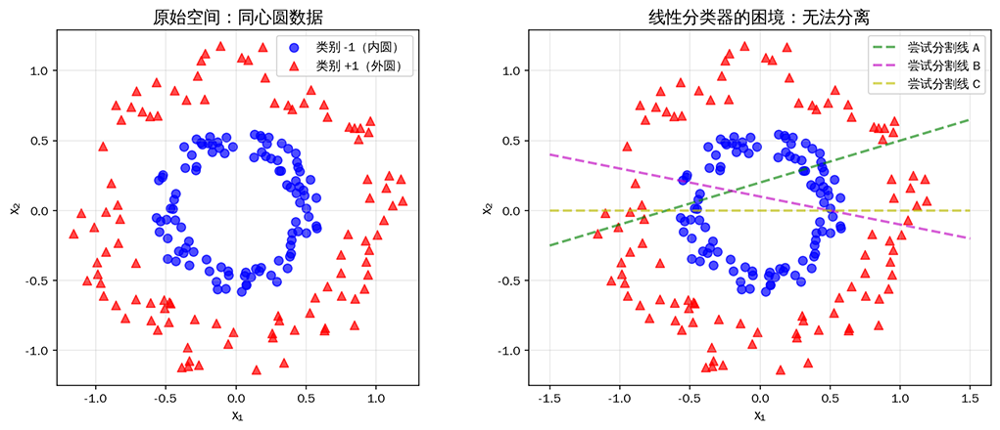
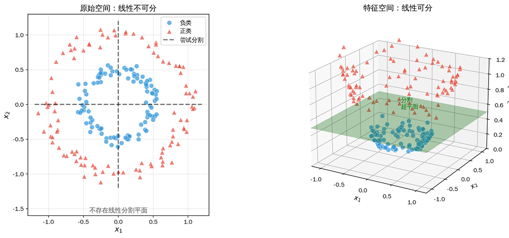
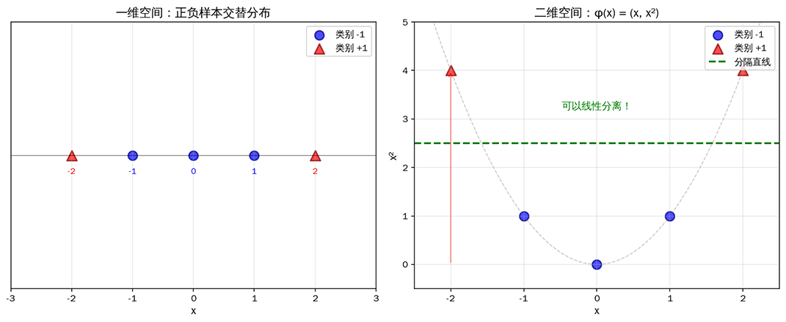
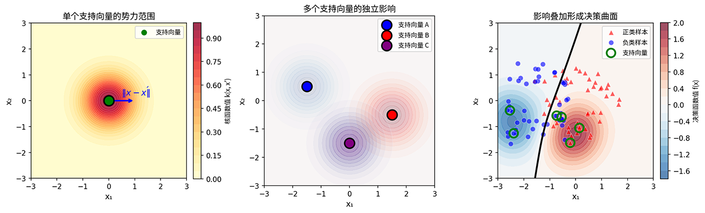
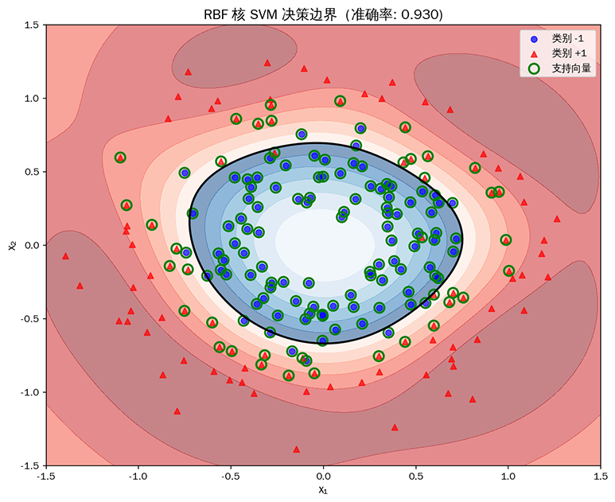

# 核技巧

长期以来，线性模型一方面因有严谨的理论支撑和快速的求解方法备受青睐，另一方面应用场景又局限于大量问题是非线性的现实局限。人们自然会期望能否在不改变算法核心逻辑的前提下，让线性分类器处理非线性数据，1964 年三位苏联数学家曾提出用"隐式映射"绕过高维空间计算，这一思想虽然当时并未引起广泛关注，却埋下了核技巧的种子。

真正让核技巧走向成熟的是弗拉基米尔·瓦普尼克（Vladimir Vapnik）。1992 年，瓦普尼克与同事合作发表了论文《Support Vector Method for Function Approximation, Regression Estimation, and Signal Processing》，首次将核函数系统地应用于支持向量机，原本只能处理线性问题的 SVM，突然拥有了处理复杂非线性模式的能力，同时保持了算法的优雅与高效。后来瓦普尼克在《The Nature of Statistical Learning Theory》一书中进一步阐述了这一思想的深层意义，核技巧由此成为机器学习领域的经典范式。

## 特征空间升维

回顾上一章学习的 SVM [最大间隔原理](svm-max-margin.md#最大间隔超平面)，很容易发现一个隐含前提：数据必须是线性可分或近似线性可分的。当数据分布呈现复杂的非线性模式时，"用一个超平面分开正负类数据"这个假设就失效了。如下图所示，找不到任何超平面能够区分出两类数据。



*图：同心圆数据分布（左）与线性分类器的困境（右）。无论尝试多少条分割线，都无法将内圆和外圆完全分开*

面对这类线性不可分的数据，传统的方法是设计非线性决策边界，但这意味着必须抛弃 SVM 的优雅数学框架。**核技巧**（Kernel Trick）提供了一种更聪明的解决方案，**将数据映射到高维空间，在高维空间中用线性分隔**。更妙的是，我们可以隐式地完成这个映射，而不需要显式计算高维特征坐标，从而巧妙地绕开了维度爆炸的计算陷阱。


在高维空间中，原本线性不可分的数据可能变得线性可分。这背后的数学原理可以追溯到 1965 年提出的 **Cover 定理**：假设有一个映射函数 $\phi: \mathbb{R}^d \rightarrow \mathbb{R}^D$，将原始特征映射到更高维的空间 $$x \mapsto \phi(x)$$，数据随机映射到足够高维的空间后，数据变得线性可分的概率会显著增加。

用一个生活例子来类比，想象你在桌上撒了一把黑白混杂的芝麻和米粒。在桌面上，芝麻和白米交织在一起，你很难用一根棍子把它们完全分开。但如果你把芝麻和米粒放到一桶水里，芝麻会浮在水面，米粒会沉入水底（分类数据大概率隐含着高维特征可以作为分隔依据，譬如这个例子中米粒与芝麻的比重不同），那用一张纸就能轻松分隔它们，如下图所示：



*图：低维空间的非线性可分数据（左）通过映射到高维空间后变得线性可分（右）。蓝色圆点为负类，红色三角为正类，绿色平面为高维空间中的分割超平面*

再举一个具体的数值例子来展示应用 Cover 定理升维的效果。考虑一维数据 $x \in \mathbb{R}$，其中负样本为 $x \in \{-2, 2\}$、正样本为 $x \in \{-1, 0, 1\}$，如下图所示。在一维空间中，无论选择哪个分割点，都会错误分类部分样本，因为正负样本交错分布，不存在"一刀切"的解。但如果将数据映射到二维空间 $\phi(x) = (x, x^2)$，情况就完全改变了。观察右图，所有负样本（蓝色圆点）落在抛物线的底部区域，而正样本（红色三角点）分布在两侧高处。一条水平分割线 $x^2 = 2$ 就能完美分开两类样本。这再次说明原始空间中看似复杂的非线性模式，在高维空间中可能只是简单的线性模式，只要我们换了一个更"宽敞"的坐标系来观察它。



*图：一维空间中正负样本交替分布（左），映射到二维空间后可用直线分离（右）*

升维策略虽然效果显著，却并非没有代价，在 SVM 应用实践中面临以下两个严峻挑战：

- **存储成本**：对于多项式映射，特征维度会急剧增长。原始特征有 $d$ 维，映射到所有 $p$ 次多项式组合后，特征维度变为 $\binom{d+p}{p}$。譬如，当 $d=100$、$p=3$ 时，新维度高达 $\binom{103}{3} = 171,700$。如果是 [RBF 核](#rbf-核)，对应的特征空间甚至是无穷维，理论上根本无法存储。

- **计算成本**：即使维度存储成本可以接受，SVM 的对偶问题目标函数中，样本以成对内积形式出现（$x^T x'$ 形式，推导见 SVM 的[拉格朗日对偶变换](svm-max-margin.md#拉格朗日对偶变换)），升维映射后变为 $\phi(x)^T \phi(x')$ ，需要先执行映射操作，再计算维度膨胀后的内积。两个步骤叠加，时间复杂度难以接受。

这就是时候让核技巧登场了，核技巧的创新并不是提出了升维，而是它巧妙地解决上述两个难题，不需要显式计算 $\phi(x)$，只需要计算内积 $\phi(x)^T \phi(x')$，而这可以通过核函数直接完成，完全绕过映射步骤。

## 隐式内积计算

理解了升维的价值和代价后，**核技巧**（Kernel Trick）可以概括为一句话：不显式构造高维映射 $\phi(x)$，而是直接计算出高维空间中样本的内积 $\phi(x)^T \phi(x')$ 的等效结果。这意味着无论映射后的空间是千维万维还是无穷维，因为不会构造出 $\phi(x)$ 的具体形式，就不需要存储高维向量。其次，计算成本也大幅降低了，因为不再需要先映射再内积的两步操作，而是从核函数中直接得到与内积计算等效的结果。

这一切的关键是引入了**核函数**（Kernel Function），它的值等于样本在特征空间中映射后的内积。不妨将核函数现象成一个翻译器，它能直接告诉你两个样本在高维空间中有多相似，却不需要你真正走到那个高维空间去丈量。就像你能通过口音来判断两个人是否来自同一个地区，而不需要精确地通过户籍系统查询他们具体住址来获得。

核函数的理论基础来自 1909 年的 Mercer 定理，该定理指出一个函数 $k$ 能成为有效核函数，当且仅当对于任意数据集 $\{x_1, \ldots, x_n\}$，核矩阵 $K$ 是半正定的 $K_{ij} = k(x_i, x_j)$。理解这句话要解释两个相关概念，一个是**核矩阵**（Kernel Matrix），也称为 Gram 矩阵，在 [SVM 实践](svm-max-margin.md#软间隔-svm-实践)中我们已经当作内积计算的缓存使用过它。核矩阵是将核函数应用到数据集中所有样本对上所形成的矩阵。假设有 $n$ 个样本 $\{x_1, x_2, \ldots, x_n\}$，核矩阵 $K$ 是一个 $n \times n$ 的对称矩阵，其第 $i$ 行第 $j$ 列的元素定义为 $K_{ij} = k(x_i, x_j) = \phi(x_i)^T \phi(x_j)$。根据[向量内积](../../maths/linear/vectors.md#内积与投影)的几何意义，核矩阵存储了所有样本在特征空间中的两两相似度，每个元素 $K_{ij}$ 告诉我们样本 $x_i$ 和 $x_j$ 在高维空间中有多相似。

另一个概念是**半正定矩阵**（Positive Semi-Definite Matrix），它的数学定义是对于任意向量 $v$，半正定矩阵 $K$ 满足 $v^T K v \geq 0$。半正定矩阵的含义就像"永远不会返回负数"的度量系统。如果一个核矩阵是半正定的，那么用它计算的任意"距离"或"相似度"就不会出现负值，这在几何上意味着空间不会被扭曲成奇怪的形状。

现在回到 [SVM 的对偶问题](svm-max-margin.md#拉格朗日对偶变换)，要注意到在对偶问题中无论是优化目标函数还是决策函数，样本特征 $x$ 从未单独出现过，永远是以内积 $x_i^T x_j$ 的形式成对出现的。这就意味着我们不需要知道映射后样本特征变成了什么样子，只要知道映射后两个样本的相似度就够了。

$$\arg \max_\alpha \sum_{i=1}^{n} \alpha_i - \frac{1}{2} \sum_{i=1}^{n} \sum_{j=1}^{n} \alpha_i \alpha_j y_i y_j \underbrace{x_i^T x_j}_{\text{替换为核函数}}$$

因此，核技巧只是将 $x_i^T x_j$ 替换为 $k(x_i, x_j)$，SVM 便有了处理非线性问题的能力，这个替换看似简单粗暴，却完整保留了 SVM 算法的核心逻辑（最大化间隔），只是把"原始空间的相似度"换成了"高维空间的相似度"。

## 常见核函数

选择合适的核函数，本质上是在**模型复杂度**与**计算效率**之间寻找平衡。三种最常用的核函数：线性核、多项式核和 RBF 核，恰好代表了从简单到复杂的连续谱系，理解它们的核心差异有助于在实际问题中做出恰当选择。

### 线性核

**线性核**是核函数家族中最简单的成员，它直接计算原始特征空间的内积 $k(x, x') = x^T x'$。严格来说，线性核甚至不涉及升维，它完全保留了原始特征空间的结构。这种不做任何变换的特性恰恰是其最大优势：计算成本最低，理论可解释性最强。

线性核听起来似乎什么都没有改变，那它起什么用？第一是线性核将数据本身是线性可分的场景统一到核技巧的框架中来，如果为了升维而升维，强行使用复杂核函数只会增加调参负担和过拟合风险。还有一种情况是特征维度极高而样本数量相对较少时，线性核往往反而是好的选择。文本分类就是典型例子，用[词袋模型](../../maths/linear/applications.md#经典-nlp-的代表-词袋模型)表示的文档，特征维度轻松达到数万甚至数十万（对应词汇表大小），而样本可能只有几千条。高维空间本身就提供了充足的分离自由度，此时非线性核的升维收益很有限，反而会拖慢训练速度。

### 多项式核

如果说线性核是零升维，**多项式核**则走向了另一个极端，它显式地构造出有限维的高阶特征空间 $k(x, x') = (x^T x' + c)^d$，其中 $d$ 是多项式次数，$c$ 是常数偏移项（通常设为 0 或 1）。这个公式展开后，对应的特征空间包含了原始特征的所有 $d$ 次及以下的组合。譬如，对于二维特征 $x = (x_1, x_2)$，二次多项式核 $(x^T x' + 1)^2$ 对应的显式映射为：

$$\phi(x) = (1, \sqrt{2}x_1, \sqrt{2}x_2, x_1^2, \sqrt{2}x_1 x_2, x_2^2)$$

注意这里的系数设计，交叉项 $x_1 x_2$ 带有 $\sqrt{2}$ 系数，这是为了保证展开后各项权重一致。原始特征维度为 $d$、多项式次数为 $p$ 时，升维后的特征数量为 $\binom{d+p}{p}$。当 $d=100$、$p=3$ 时，维度从 100 膨胀到 171,700，存储成本已经相当可观。

多项式核的核心价值在于显式建模特征之间的交互关系。如果领域先验知识告诉我们，某些特征的组合对预测目标至关重要（例如"年龄"与"收入"的乘积对消费能力的预测），多项式核提供了一种直接引入这类交互项的机制。与 RBF 核的黑盒非线性不同，多项式核的映射是透明可解释的，我们知道模型看到了哪些阶次的特征组合。

不过，多项式核在实践中使用率相对较低，原因是它实际并没有解决升维带来的存储成本与计算成本的问题，而且在大多数非线性问题上，RBF 核的表现往往不逊色于多项式核，甚至更优。

### RBF 核

**RBF 核**（Radial Basis Function，径向基函数），又称高斯核，是核 SVM 中最受欢迎的选择，它的核函数表示为：

$$k(x, x') = \exp\left(-\frac{\|x - x'\|^2}{2\sigma^2}\right) = \exp(-\gamma \|x - x'\|^2)$$

这里的 $\gamma = \frac{1}{2\sigma^2}$ 是控制[高斯分布](../../maths/probability/probability-basics.md#正态分布)宽窄的参数。与多项式核的有限维特征空间不同，RBF 核对应的特征空间是**无穷维**的。理论上，它能表示原始空间中任意复杂的非线性模式，这使其成为一种"万能"的非线性工具。

理解 RBF 核的直观方式是观察其随距离衰减的特性。当两个样本在原始空间中的欧氏距离 $\|x - x'\|$ 很大时，核函数值指数级趋近于 0，意味着它们在高维特征空间中几乎正交（不相似）；当距离为 0（即两个样本重合）时，核函数值为 1（最大相似度）。这种局部敏感的特性使得 RBF 核 SVM 的决策边界能够灵活地贴合数据的局部分布，每个支持向量就像一个影响源，在其周围形成一个高斯形状的"势力范围"，所有影响源的叠加构成了最终的决策曲面。

参数 $\gamma$ 控制着每个支持向量的势力半径。$\gamma$ 值较大时，高斯分布变窄，每个支持向量的影响范围局限在邻近区域，模型倾向于为每个局部数据簇量身定制决策边界，可能导致过拟合；$\gamma$ 值较小时，高斯分布变宽，单个支持向量的影响范围扩大，决策边界变得更平滑，模型复杂度降低，可能欠拟合。这种"半径-复杂度"的对应关系是 RBF 核调参的核心直觉。



*图：RBF核支持向量的"势力范围"概念示意*

上图展示了 RBF 核 SVM 决策机制的本质。
- 左图呈现单个支持向量周围的核函数值分布，这是一个以支持向量为中心的高斯曲面，距离越远函数值衰减越快，正是"势力范围"的数学表达。
- 中图展示了多个支持向量同时存在时，各自独立产生的高斯影响场在空间中的分布。
- 右图则揭示最终决策曲面的形成机制：每个支持向量的影响按其类别标签（正类为正权重、负类为负权重）进行加权，然后在空间中叠加，当叠加结果为零时即形成决策边界（黑色曲线）。这种局部敏感的特性使 RBF 核能够灵活地贴合任意复杂的局部分布，每个支持向量只在邻近区域发挥影响，而整体的决策曲面则是所有支持向量影响的加权总和。

了解过三种核函数后，总结它们的特征与适用场景，如下表所示：

| 核函数 | 参数 | 特征空间维度 | 适用场景 |
|--------|------|-------------|----------|
| 线性核 | 无 | 原始维度 | 线性可分、高维稀疏数据 |
| 多项式核 | $d, c$ | $\binom{n+d}{d}$（有限维） | 特征交互明确的场景 |
| RBF 核 | $\gamma$ | 无穷维 | 通用非线性问题 |

三种核函数的选择，可以遵循一条渐进式的决策路径。面对新问题，首先观察数据特性，如果特征维度与样本数量相当或更高（如文本、基因数据），优先尝试线性核，它训练速度快、无需调参，且在高维场景下往往效果不逊于非线性核。如果数据明显非线性可分且特征维度不高，RBF 核是更安全的默认选择，它凭借无穷维特征空间的表达能力，能够适应各种复杂的边界形状。多项式核则适合那些对特征交互有明确建模需求的场景，或者作为 RBF 核效果不佳时的备选方案。

值得强调的是，核函数并非越复杂越好。线性核虽然简单，但在许多真实数据集上表现优异，且具备不可替代的可解释性优势。RBF 核虽然理论上能拟合任意模式，却也更易过拟合，需要配合交叉验证仔细调参。实践中一个常见的误区是看到线性核准确率只有 70% 就急于尝试 RBF 核，却忽略了那 30% 的错误可能源于数据本身的噪声或标注错误，而非模型表达能力不足。在机器学习的世界里，"恰到好处"的复杂度往往胜过"过度强大"的模型。

## 核 SVM 实践

前几节我们理解了核技巧的理论基础，现在将这些理论转化为可运行的代码。下面的实现支持线性核、多项式核和 RBF 核三种常用核函数，采用对偶问题的梯度上升求解方法，思路主要分为四个步骤：

**第一步：核矩阵计算**：与软间隔 SVM 的线性核不同，核 SVM 需要根据不同的核函数计算核矩阵 $K[i,j] = k(x_i, x_j)$。对于线性核，$k(x, x') = x^T x'$，直接使用矩阵乘法计算；对于多项式核，$k(x, x') = (x^T x' + c)^d$，先计算内积再进行多项式变换；对于 RBF 核，$k(x, x') = \exp(-\gamma ||x - x'||^2)$，利用距离公式 $||x - x'||^2 = ||x||^2 + ||x'||^2 - 2x^T x'$ 进行向量化计算，避免显式循环。核矩阵是对称矩阵，存储了所有样本对在特征空间中的相似度。

**第二步：迭代更新拉格朗日乘子 $\alpha$**：核 SVM 的对偶问题形式与软间隔 SVM 相同，目标函数为 $\arg \max_{\alpha} \sum_{i=1}^{n} \alpha_i - \frac{1}{2} \sum_{i=1}^{n} \sum_{j=1}^{n} \alpha_i \alpha_j y_i y_j k(x_i, x_j)$，唯一的区别是将内积 $x_i^T x_j$ 替换为核函数 $k(x_i, x_j)$。采用梯度上升法优化，对于每个 $\alpha_i$，其梯度为：$\frac{\partial L}{\partial \alpha_i} = 1 - y_i \sum_{j=1}^{n} \alpha_j y_j K[j,i]$。每次迭代更新后将 $\alpha_i$ 投影到约束区间 $[0, C]$ 内，并对所有 $\alpha$ 进行均值修正以满足等式约束 $\sum \alpha_i y_i = 0$。

**第三步：识别支持向量与计算偏移量 $b$**：训练完成后，根据 KKT 条件筛选支持向量（满足 $\alpha_i > \text{阈值}$ 的样本）。与线性 SVM 不同，核 SVM 不显式计算法向量 $w$，而是直接使用支持向量、其标签和对应的拉格朗日乘子来表示模型。偏移量 $b$ 通过支持向量的平均偏差计算：$b = \frac{1}{|SV|} \sum_{i \in SV} (y_i - \sum_{j \in SV} \alpha_j y_j k(x_j, x_i))$。

**第四步：构建决策函数**：核 SVM 的决策函数为 $f(x) = \sum_{i \in SV} \alpha_i y_i k(x, x_i) + b$，新样本与所有支持向量计算核函数值，加权求和后加上偏移量得到决策值。预测时根据决策值的符号判断类别：$\hat{y} = \text{sign}(f(x))$。这种形式完全绕过了高维特征空间的显式计算，只需在原始空间计算核函数即可完成预测。

至此，模型训练完成。注意代码实现中使用了简化的梯度上升算法，而非标准序列最小优化算法（SMO）。SMO 是工业界广泛采用的高效求解方法，但实现复杂度较高。这里的简化版本足以理解核 SVM 的核心机制，适合演示教学目的。

```python runnable extract-class="KernelSVM"
import numpy as np

class KernelSVM:
    """
    核SVM实现
    支持线性核、多项式核、RBF核
    """
    def __init__(self, kernel='rbf', C=1.0, gamma=1.0, degree=3, coef0=1):
        self.kernel = kernel
        self.C = C
        self.gamma = gamma
        self.degree = degree
        self.coef0 = coef0  # 多项式核的常数项
        
        self.alpha = None
        self.b = None
        self.X_train = None
        self.y_train = None
        self.support_vectors_ = None
        self.support_vector_labels_ = None
        self.alpha_sv = None
    
    def _kernel(self, X1, X2):
        """计算核矩阵"""
        if self.kernel == 'linear':
            return X1 @ X2.T
        
        elif self.kernel == 'poly':
            return (X1 @ X2.T + self.coef0) ** self.degree
        
        elif self.kernel == 'rbf':
            # ||x - x'||^2 = ||x||^2 + ||x'||^2 - 2*x^T*x'
            X1_norm = np.sum(X1 ** 2, axis=1).reshape(-1, 1)
            X2_norm = np.sum(X2 ** 2, axis=1).reshape(1, -1)
            distances = X1_norm + X2_norm - 2 * X1 @ X2.T
            return np.exp(-self.gamma * distances)
        
        else:
            raise ValueError(f"未知核函数: {self.kernel}")
    
    def fit(self, X, y, lr=0.01, n_iterations=500):
        """训练模型（简化版SMO思想）"""
        n_samples = X.shape[0]
        self.X_train = X
        self.y_train = y
        
        # 计算核矩阵
        K = self._kernel(X, X)
        
        # 初始化
        self.alpha = np.zeros(n_samples)
        
        # 梯度上升优化
        for _ in range(n_iterations):
            for i in range(n_samples):
                # 梯度
                gradient = 1 - y[i] * np.sum(self.alpha * y * K[:, i])
                self.alpha[i] += lr * gradient
                self.alpha[i] = np.clip(self.alpha[i], 0, self.C)
            
            # 约束修正
            self.alpha = self.alpha - np.mean(self.alpha * y) * y
            self.alpha = np.clip(self.alpha, 0, self.C)
        
        # 支持向量
        sv_mask = self.alpha > 1e-5
        self.support_vectors_ = X[sv_mask]
        self.support_vector_labels_ = y[sv_mask]
        self.alpha_sv = self.alpha[sv_mask]
        
        # 计算b
        if len(self.support_vectors_) > 0:
            K_sv = self._kernel(self.support_vectors_, self.support_vectors_)
            margins = np.sum(self.alpha_sv * self.support_vector_labels_ * K_sv, axis=1)
            self.b = np.mean(self.support_vector_labels_ - margins)
        else:
            self.b = 0
        
        return self
    
    def decision_function(self, X):
        """决策函数"""
        K = self._kernel(X, self.support_vectors_)
        return K @ (self.alpha_sv * self.support_vector_labels_) + self.b
    
    def predict(self, X):
        """预测类别"""
        return np.sign(self.decision_function(X)).astype(int)
    
    def score(self, X, y):
        """计算准确率"""
        y_pred = self.predict(X)
        return np.mean(y_pred == y)

def make_circles(n_samples=200, noise=0.1, factor=0.5):
    """生成同心圆数据"""
    n = n_samples // 2
    
    # 内圆
    theta_inner = np.random.uniform(0, 2*np.pi, n)
    r_inner = factor * np.random.uniform(0.8, 1.2, n)
    X_inner = np.column_stack([r_inner * np.cos(theta_inner), r_inner * np.sin(theta_inner)])
    
    # 外圆
    theta_outer = np.random.uniform(0, 2*np.pi, n)
    r_outer = np.random.uniform(0.8, 1.2, n)
    X_outer = np.column_stack([r_outer * np.cos(theta_outer), r_outer * np.sin(theta_outer)])
    
    X = np.vstack([X_inner, X_outer])
    y = np.hstack([-np.ones(n), np.ones(n)])
    
    # 添加噪声
    X += np.random.randn(*X.shape) * noise
    
    return X, y

X, y = make_circles(n_samples=200, noise=0.1)

# 对比不同核函数
print("=== 不同核函数对比（同心圆数据）===\n")

kernels = [
    ('linear', {}),
    ('poly', {'degree': 2}),
    ('rbf', {'gamma': 1.0})
]

for kernel_name, params in kernels:
    svm = KernelSVM(kernel=kernel_name, C=1.0, **params)
    svm.fit(X, y, lr=0.01, n_iterations=300)
    acc = svm.score(X, y)
    print(f"{kernel_name:8}核: 准确率 = {acc:.3f}, 支持向量数 = {len(svm.support_vectors_)}")
```

## 应用场景：非线性分类可视化

核技巧的威力通过可视化可以直观感受。下面的代码展示 RBF 核 SVM 在同心圆数据上如何构建决策边界 —— 原本线性分离不可能的问题，经过核化后获得了完美的非线性分隔能力。

```python runnable
import matplotlib.pyplot as plt

# 生成数据
X, y = make_circles(n_samples=200, noise=0.15)

# 训练RBF核SVM
svm_rbf = KernelSVM(kernel='rbf', C=1.0, gamma=2.0)
svm_rbf.fit(X, y)

# 绘制决策边界
plt.figure(figsize=(10, 8))

# 创建网格
xx, yy = np.meshgrid(np.linspace(-1.5, 1.5, 100), np.linspace(-1.5, 1.5, 100))
grid = np.c_[xx.ravel(), yy.ravel()]
Z = svm_rbf.decision_function(grid).reshape(xx.shape)

# 绘制等高线
plt.contourf(xx, yy, Z, levels=np.linspace(Z.min(), 0, 7), cmap='Blues', alpha=0.5)
plt.contourf(xx, yy, Z, levels=np.linspace(0, Z.max(), 7), cmap='Reds', alpha=0.5)
plt.contour(xx, yy, Z, levels=[0], linewidths=2, colors='black')

# 绘制数据点
plt.scatter(X[y == -1, 0], X[y == -1, 1], c='blue', marker='o', label='Class -1', alpha=0.7)
plt.scatter(X[y == 1, 0], X[y == 1, 1], c='red', marker='^', label='Class +1', alpha=0.7)

# 绘制支持向量
plt.scatter(svm_rbf.support_vectors_[:, 0], svm_rbf.support_vectors_[:, 1], 
            s=100, facecolors='none', edgecolors='green', linewidths=2, label='Support Vectors')

plt.xlabel('x1')
plt.ylabel('x2')
plt.title(f'RBF Kernel SVM Decision Boundary (Accuracy: {svm_rbf.score(X, y):.3f})')
plt.legend()
plt.savefig('assets/svm_rbf_decision_boundary.png')
plt.show()
plt.close()
```



*图：RBF 核 SVM 在同心圆数据上的决策边界。黑色曲线为分隔超平面在原始空间的"投影"，绿色空心圆圈为支持向量*

上图清晰地展示了核技巧的效果：决策边界在原始二维空间中呈现为弯曲的封闭曲线（黑色轮廓），完美包裹住内圆样本（蓝色点）。这条曲线并非人为设计，而是 RBF 核自动将数据"映射"到高维空间后，线性分隔超平面"投影"回原始空间的结果。支持向量（绿色空心圆圈）恰好落在边界附近，它们的分布密度决定了决策边界的形状 —— 这正是 SVM 最大间隔原理与核技巧协同作用的体现。

## 小结

核技巧展示了机器学习中一个深刻的哲学：**方法的"外壳"可以不变，只需要换掉内部的"度量标准"**。SVM 的最大间隔原理、凸优化性质、全局最优解保证 —— 这些优雅的数学特性全部保留，仅仅通过替换内积运算，线性方法就获得了处理任意非线性模式的能力。

回顾本章的核心洞见：

**升维的本质是增加自由度。** Cover 定理揭示了一个几何直觉：高维空间有更多"方向"可供分隔超平面选择，这使得原本纠缠在一起的数据获得分离的可能。这不是魔法，而是维度的数学力量。

**核函数是隐式升维的捷径。** 显式计算高维映射面临维度爆炸的困境，而核函数巧妙地绕过了这个障碍 —— 只计算我们真正需要的"相似度"，不关心样本在高维空间的具体坐标。这就像你能判断两张照片是否相似，却不需要知道它们在像素空间中的精确位置。

**核技巧是一种架构模式。** 这种"替换内积"的思想不仅适用于 SVM，也延伸到 PCA（核 PCA 可提取非线性主成分）、逻辑回归（核逻辑回归处理非线性分类）、甚至是深度学习中的注意力机制（本质上也是一种相似度度量）。理解核技巧，就是理解了如何将线性方法"升级"为非线性方法的通用范式。

下一章，我们将深入 SVM 的优化算法 —— 序列最小优化（SMO）算法，探索如何在实践中高效求解大规模 SVM 问题。

## 练习题

### 1. 概念理解题

为什么核技巧不需要显式计算高维映射 $\phi(x)$？请从计算复杂度的角度分析，并说明核函数如何"隐式"地完成这一过程。

<details>
<summary>参考答案</summary>

核技巧的核心洞察在于：SVM 的对偶问题和决策函数中，我们只需要计算样本之间的内积 $\phi(x_i)^T \phi(x_j)$，而不需要知道样本在高维空间的具体坐标 $\phi(x)$。

从计算复杂度角度分析：
- **显式映射**：需要先计算 $\phi(x)$（维度可能高达数十万甚至无穷），再计算内积，复杂度为 $O(D)$，其中 $D$ 是高维特征空间的维度
- **核函数**：直接计算 $k(x_i, x_j)$，复杂度为 $O(d)$，其中 $d$ 是原始特征维度

例如，对于 RBF 核 $k(x, x') = \exp(-\gamma ||x - x'||^2)$，其对应的特征空间是无穷维的，理论上不可能显式计算 $\phi(x)$。但核函数只需计算原始空间的欧氏距离（$O(d)$ 复杂度），就能得到无穷维空间中的内积结果。这就是核技巧"隐式升维"的精髓：**只计算结果，不关心过程**。

</details>

### 2. 计算推导题

设 $x = (x_1, x_2) \in \mathbb{R}^2$，多项式核函数为 $k(x, x') = (x^T x')^2$。请推导该核函数对应的显式映射 $\phi(x)$，并验证 $k(x, x') = \phi(x)^T \phi(x')$。

<details>
<summary>参考答案</summary>

首先展开核函数：

$$k(x, x') = (x^T x')^2 = (x_1 x'_1 + x_2 x'_2)^2 = x_1^2 x'_1^2 + 2x_1 x_2 x'_1 x'_2 + x_2^2 x'_2^2$$

观察这个表达式，可以将其写成两个向量的内积形式：

$$\phi(x) = (x_1^2, \sqrt{2}x_1 x_2, x_2^2)$$

验证：

$$\phi(x)^T \phi(x') = x_1^2 x'_1^2 + \sqrt{2}x_1 x_2 \cdot \sqrt{2}x'_1 x'_2 + x_2^2 x'_2^2 = x_1^2 x'_1^2 + 2x_1 x_2 x'_1 x'_2 + x_2^2 x'_2^2$$

这与核函数的展开完全一致，验证成功。

这个例子说明：多项式核 $(x^T x')^2$ 将二维特征映射到三维特征空间，包含了所有二次特征组合（$x_1^2$, $x_2^2$ 和交叉项 $x_1 x_2$）。系数 $\sqrt{2}$ 的引入是为了保证各项权重一致，避免交叉项被低估。

</details>

### 3. 编程实践题

使用本章实现的 `KernelSVM` 类，在以下数据集上对比不同核函数的表现：

1. 生成两个月牙形数据（`make_moons`）
2. 训练线性核、多项式核（$d=3$）和 RBF 核（$\gamma=0.5$）的 SVM
3. 绘制三种核函数的决策边界，分析哪种核最适合该数据集

<details>
<summary>参考答案</summary>

```python runnable
import numpy as np
import matplotlib.pyplot as plt

def make_moons(n_samples=200, noise=0.15):
    """生成月牙形数据"""
    n = n_samples // 2
    
    # 上月牙
    theta_upper = np.random.uniform(0, np.pi, n)
    X_upper = np.column_stack([np.cos(theta_upper), np.sin(theta_upper)])
    
    # 下月牙（平移）
    theta_lower = np.random.uniform(0, np.pi, n)
    X_lower = np.column_stack([1 - np.cos(theta_lower), -np.sin(theta_lower) - 0.5])
    
    X = np.vstack([X_upper, X_lower])
    y = np.hstack([np.ones(n), -np.ones(n)])
    
    # 添加噪声
    X += np.random.randn(*X.shape) * noise
    
    return X, y

# 生成数据
X, y = make_moons(n_samples=200, noise=0.15)

# 训练三种核函数
kernels = [
    ('linear', {}),
    ('poly', {'degree': 3}),
    ('rbf', {'gamma': 0.5})
]

fig, axes = plt.subplots(1, 3, figsize=(15, 5))

for idx, (kernel_name, params) in enumerate(kernels):
    svm = KernelSVM(kernel=kernel_name, C=1.0, **params)
    svm.fit(X, y, lr=0.01, n_iterations=500)
    acc = svm.score(X, y)
    
    ax = axes[idx]
    
    # 绘制决策边界
    xx, yy = np.meshgrid(np.linspace(-1.5, 2.5, 100), np.linspace(-1.5, 1.5, 100))
    grid = np.c_[xx.ravel(), yy.ravel()]
    Z = svm.decision_function(grid).reshape(xx.shape)
    
    ax.contourf(xx, yy, Z, levels=np.linspace(Z.min(), 0, 7), cmap='Blues', alpha=0.5)
    ax.contourf(xx, yy, Z, levels=np.linspace(0, Z.max(), 7), cmap='Reds', alpha=0.5)
    ax.contour(xx, yy, Z, levels=[0], linewidths=2, colors='black')
    
    ax.scatter(X[y == -1, 0], X[y == -1, 1], c='blue', marker='o', alpha=0.7)
    ax.scatter(X[y == 1, 0], X[y == 1, 1], c='red', marker='^', alpha=0.7)
    
    ax.set_xlabel('x1')
    ax.set_ylabel('x2')
    ax.set_title(f'{kernel_name} Kernel (Acc: {acc:.3f})')
    ax.set_aspect('equal')

plt.tight_layout()
plt.savefig('assets/kernel_moons_comparison.png')
plt.show()
plt.close()
```

**分析结论**：

月牙形数据的几何特点是两个类别的边界呈现弧形，属于非线性可分数据。预期结果：
- **线性核**：准确率较低（约 50-60%），因为无法用直线分离弧形边界
- **多项式核**（d=3）：准确率较高（约 85-90%），三次多项式能拟合弧形边界
- **RBF 核**：准确率最高（约 95%以上），高斯核能精确拟合任意非线性形状

RBF 核最适合月牙形数据，因为它对应的特征空间是无穷维的，理论上能处理任意复杂的非线性边界。

</details>