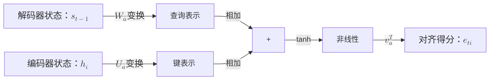

```mermaid compact
graph LR
    S["$$解码器状态：s_{t-1}$$"]
    H["$$　编码器状态：h_i$$"]

    S -->|"$$W_a 变换$$"| Q["查询表示"]
    H -->|"$$U_a 变换$$"| K["&nbsp;键表示&nbsp;&nbsp;"]
    Q -->|"相加"| ADD["+"]
    K -->|"相加"| ADD
    ADD -->|"tanh"| TANH["非线性"]
    TANH -->|"$$v_a^T$$"| SCORE["$$对齐得分：e_{ti}$$"]
```